# 1 第一步

本章涵盖

+   介绍认证 Kubernetes 管理员考试

+   定义 Kubernetes 管理员

+   认识 Kubernetes 及其解决的问题

+   介绍 Kubernetes API

+   Kubernetes 组件和服务，以及 Linux 后端服务

+   声明性和命令性命令

欢迎加入 *通过认证 Kubernetes 管理员考试*。如果你已经购买了这本书，那么你很可能已经研究了考试，知道它是什么，甚至可能已经安排了考试。如果没有，不要担心；我们将讨论考试是什么以及如何尽快报名。对于那些想直接进入正题的人，请继续阅读本节，因为它对你来说很可能是复习。你可以跳到第二部分，那里我们将深入探讨考试课程的核心内容。

对于那些刚开始接触 CKA 考试的人来说，让我们先了解一下考试是什么以及它包含的内容。首先，让我先说，我很高兴你决定加入我们，一起踏上获得 Kubernetes 认证的旅程。获得认证 Kubernetes 管理员（CKA）认证是一项相当大的成就，并将极大地推动你的职业生涯。此外，你将成为一个大型群体中的一员，这个群体包括全球超过 32,000 人。你可能想知道这是否值得，对此，我会说值得，原因如下：

+   Kubernetes 和分布式系统将会长期存在。

+   Kubernetes 技能需求量大。

+   通过认证将有助于巩固你对 Kubernetes 的理解，并表明你在 Kubernetes 方面知识全面、熟练。

## 1.1 介绍 CKA 考试

现在，让我们深入了解考试的内容。CKA 考试是一种独特的胜任力测试。与其他考试不同，它不是选择题或填空题，而是在 PSI 服务（考试提供者）提供的远程桌面环境中，完全在 Linux 终端（Ubuntu XFCE）内执行。是的，没错；他们会给你一组任务来完成，你将通过在提供的远程桌面环境中的终端内输入命令来执行解决方案。这就是整个考试体验，你将有两个小时的时间完成 15-20 个这样的任务。一旦完成，你将根据任务的成果进行评分，无论你采取了哪种途径来实现成果。这意味着可能存在多种解决给定任务的方法。在这本书的整个过程中，你将学习不同的方法来获得相同的结果，这将为你提供更多的工具，帮助你在这场考试中取得及格的分数，及格分数是 66%或更高。你也可以在任何一个任务中获得部分分数，这将有助于提高你的成功率。

在本书中，我们将针对每一章中每个主题可用的技巧和窍门进行讨论。这将很好地与运用你的课程内容相结合，并为你提供必要的技能，以自信地应对考试。这些考试技巧，结合你的决心和反复练习，将有助于你在通过 CKA 考试中取得成功。我无法强调肌肉记忆和投入练习对于在考试时间来临时帮助你的大脑保留和访问适当的 Kubernetes 命令有多么重要。真正掌握 CKA 确实是一项锻炼，所以如果你决心通过考试，你不应该在学习期间长时间休息，尤其是如果你不是每天与 Kubernetes 一起工作。尽管如此，不要因此气馁；我们将一起完成这个 Kubernetes 锻炼！

CKA 考试由 Linux 基金会提供，Kubernetes 由云原生计算基金会（CNCF）维护。截至本书编写时，考试费用为 375 美元，但请访问 Linux 基金会网站 [`training.linuxfoundation.org`](https://training.linuxfoundation.org) 查看最新的价格和不同货币的价格。这个价格可能比同类认证略高，但它们确实允许免费重考一次，以及在考试期间打开一个额外的浏览器标签页，访问以下网站及其子域名：

+   [`helm.sh/docs/`](https://helm.sh/docs/)

+   [`kubernetes.io/docs/`](https://kubernetes.io/docs/)

+   [`github.com/kubernetes/`](https://github.com/kubernetes/)

+   [`kubernetes.io/blog/`](https://kubernetes.io/blog/)

为了参加考试，你需要一台运行 Windows 8.1、Windows 10、Windows 11、macOS 10.15、macOS 11、macOS 12、Ubuntu 18.04 或 Ubuntu 20.04 的电脑，并且已经安装了 Chrome 网络浏览器（所有浏览器都受支持，但 PSI 强烈推荐使用 Chrome）。当你开始考试时，你会被告知下载并安装一个新的 PSI 安全浏览器，这将自动为你提供访问 PSI 监考平台，称为*PSI Bridge*，这是一个远程桌面环境。远程桌面环境将包括打开终端以及提供的 Firefox 浏览器的链接（你必须使用 Firefox）以便你可以浏览到之前列出的授权网站。你还需要一个至少具有 640 × 480 像素分辨率的摄像头，因为它们将需要房间的一个 360 度视图（台式机需要外部摄像头）并在整个考试过程中监视你。你的电脑屏幕分辨率必须为 1368 x 769 像素或更高（不支持双显示器），你必须有一个功能正常的麦克风，并且你的互联网带宽速度必须至少为 300 Kbps 以进行下载和上传。你参加考试的地方必须安静且光线充足。不允许在公共空间，如咖啡馆或商店进行考试。你的桌子必须清理干净，不得放置任何纸张和其他电子产品，并且你必须清晰地出现在你的摄像头的中心框架中。

在考试当天，你将坐在电脑前，确保电脑已连接电源，然后访问 Linux 基金会门户开始考试。在点击“开始考试”按钮之前，请确保所有浏览器标签页都已关闭，且后台没有运行其他应用程序（监考官也会检查这一点）。一旦你点击开始考试的按钮，你将立即遇到一位考试监考官。这位监考官会检查你的环境，确保你的桌子是清理过的，周围没有纸张或未经授权的电子产品。因此，使用你的摄像头，你将环顾四周以获得完整的 360 度视角，并等待他们的批准。他们还会定期检查你的双手和手腕。在考试开始之前，监考官首先会检查你的双手和手腕，然后在考试过程中，他们还会在频繁的间隔中让你停下来，要求你展示双手和手腕的两侧。在他们将考试释放给你之前，他们还会要求你出示政府颁发的身份证件，你必须将其举到摄像头前。一旦监考官完成身份验证和检查工作空间，他们将会释放考试，这意味着他们允许你进入考试并查看第一题。你会发现每道题都有类似的格式，包括你必须使用的上下文以及你必须通过命令行执行的任务来解决该问题。如果你遇到无法回答的问题，我的建议是跳过它；你可以在考试期间随时标记它并返回。在考试开始时，他们会通过简短的自动化演示向你展示如何标记问题以供审查。对于每个任务，你也会看到该任务占的百分比。如果你对某事感到困惑，看看它值多少分。如果它值，比如说，5%，那么就继续跳过它。

考试技巧：如果你需要在 Firefox 浏览器和终端之间复制粘贴文本，请使用快捷键 CTRL-SHIFT-C 来复制，CTRL-SHIFT-V 来粘贴。

你将被测试的核心能力包括集群架构、安装和配置；工作负载和调度；服务和网络；存储；以及故障排除。本书将涵盖所有这些领域。在集群架构能力方面，这将占考试问题的 25%，你将接受基于角色的访问控制、使用 kubeadm 添加功能和更新 Kubernetes 集群、以及备份和恢复 etcd 数据存储的测试。在工作负载和调度能力方面，这将占考试问题的 15%，你将接受执行滚动更新和回滚、以及扩展应用程序和使用 ConfigMaps 和 Secrets 的测试。在服务和网络能力方面，这将占考试问题的 20%，你将接受在 Kubernetes 中创建和更新各种服务、使用 Ingress、DNS 和 Kubernetes 的容器网络接口的测试。在存储能力方面，这将占考试问题的 10%，你需要了解 Kubernetes 中的存储类、持久卷和卷模式。然后，在故障排除能力方面，这是考试问题的 30%，你将需要知道如何从 Kubernetes 集群中获取日志，以及监控和修复核心集群组件。表 1.1 概述了这些领域及其能力百分比。

表 1.1 考试能力和其占考试百分比

| 集群架构、安装和配置—25% |
| --- |

|

+   管理基于角色的访问控制（RBAC）。

+   使用 kubeadm 安装基本集群。

+   管理高可用性 Kubernetes 集群。

+   使用 kubeadm 在 Kubernetes 集群上执行版本升级。

+   实施 etcd 备份和恢复。

|

| 工作负载和调度—15% |
| --- |

|

+   理解 Deployments 以及如何执行滚动更新和回滚。

+   使用 ConfigMaps 和 Secrets 配置应用程序。

+   了解如何扩展应用程序。

+   理解用于创建健壮、自我修复的应用程序部署的原语。

+   理解资源限制如何影响 Pod 调度。

+   了解清单管理和常用模板工具。

|

| 服务和网络—20% |
| --- |

|

+   在集群节点上理解主机网络配置。

+   理解 Pod 之间的连接性。

+   理解 ClusterIP、NodePort 和 LoadBalancer 服务类型和端点。

+   了解如何使用 Ingress 控制器和 Ingress 资源。

+   了解如何配置和使用 CoreDNS。

+   选择合适的容器网络接口插件。

|

| 存储—10% |
| --- |

|

+   理解存储类和持久卷。

+   理解卷和访问模式以及卷的回收策略。

+   理解持久卷声明原语。

+   了解如何配置具有持久存储的应用程序。

|

| 故障排除—30% |
| --- |

|

+   评估集群和节点日志。

+   理解如何监控应用程序。

+   管理容器标准输出和标准错误日志。

+   故障排除应用程序故障。

+   故障排除集群组件故障。

+   故障排除网络问题。

|

在考试期间，你将拥有六个集群可供使用，你将需要根据问题在这些集群之间进行切换。通常，每个问题都会要求你在与上一个问题不同的集群上执行任务。他们将提供如何在集群之间切换的说明，所以不必过于担心记住集群名称和切换集群的命令。

考试还将为 `kubectl` 设置别名 `k`。别名是你运行的一个与另一个命令相关的命令。例如，大多数 Linux 操作系统都存在一个常见的别名 `l='ls -lah'`，这意味着当你输入命令 `l` 时，它与输入 `ls -lah` 是相同的。同样，对于 CKA 考试，当你输入命令 `k` 时，它与命令 `kubectl` 相同。从你电脑的命令行中，你可以输入 `alias` 来列出你电脑上所有现有的别名。所有六个集群都只有一个控制平面节点，其中两个集群只有一个工作节点，这两个节点中有一个缺少工作节点。它们都将安装容器网络接口（CNI），并命名为 `k8s`、`hk8s`、`bk8s`、`wk8s`、`ek8s` 和 `ik8s`，如图 1.1 所示。

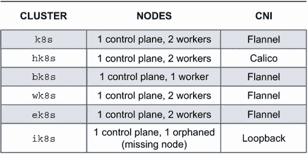

图 1.1 考试环境中所有六个集群的集群配置

有这么多人注册了 CKA 考试，以至于它已经成为迄今为止最受欢迎的 Linux 基金会认证之一。这部分反映了认证的需求，但也反映了获得认证后的可信度。证书有效期为三年，重新认证的过程与你第一次参加考试时相同。

我建议你现在就安排考试，这样你就有了一个完成考试的目标和截止日期。这将让你保持动力完成这本书，并提供必要的时间表，以保持你的知识在心中，并适当准备参加考试。如果你目前在工作中使用 Kubernetes，并且你每天都在输入 `kubectl` 命令，那么请安排你在今天起一个月后参加考试。

如果你刚刚接触 Kubernetes 主题，之前从未听说过它，那么请安排你在考试调度器允许的最晚日期参加考试（通常这是三个月，但可能更短。）你总是可以重新安排，但关键是要给自己两样东西：（1）一个截止日期，这样你就可以认真对待这次考试并实现你的预期结果；（2）日常练习，将其融入你的前额叶皮层（记忆存储的地方）。这正是你保持新鲜和为考试做好准备所需要的东西。

## 1.2 有哪些内容

在整本书中，我将插入练习和类似考试的情景，让您练习`kubectl`命令，并为考试做准备。为了使练习尽可能容易，我包括了创建您本地集群的说明。在附录 A 中，我将向您介绍使用 kind 创建 Kubernetes 集群的步骤。Kind Kubernetes ([`kind.sigs.k8s.io/`](https://kind.sigs.k8s.io/)) 是一个免费、轻量级且易于使用的工具，可以在您现有的笔记本电脑或台式机上创建集群。唯一的要求是 Docker，只需一条命令，您就能在几秒钟内拥有一个集群并运行起来。这消除了练习 CKA 的入门障碍。我建议您使用这种方法，因为您可能会浪费大量时间手动构建集群；而且由于考试将为您准备好的集群，我认为这是学习和跟随这本书的最佳方式。还有其他创建本地集群的方法，您也可以使用，例如 minikube 或 MicroK8s。想法是相似的，但那些工具可能不会直接与本书中的场景相匹配。例如，在第五章中，我们将准备一个缺少节点的集群。设置环境的步骤是 kind 特有的，因此在 minikube 中重现环境将有所不同。

在本书的每一章中，将会有一个类似于真实考试的情景，我们将一起解决，然后是您可以独立完成的额外练习。在附录 D 中，您可以回顾解决这些练习的提示。您可以使用这些提示来测试您对本书内容的了解，并评估您对 CKA 考试的准备情况。

在我们开始之前，我想澄清一些要点，并让您了解这本书是什么以及它不是什么。这本书不是 Kubernetes 的入门介绍，所以我期望您对容器有背景知识，并理解 Kubernetes 解决的问题，因为这些内容本书不会涉及。CKA 考试不是入门级考试；因此，它将需要相当多的使用和导航 Linux 操作系统的经验。那些理解 cgroups 和 namespaces（在 Linux 中提供容器）的人，将更容易跟随这本书，并随后通过考试。此外，大多数参加这次考试的人已经在他们的工作中使用这项技术，无论是通过一个新的项目接触它，还是已经将集群管理作为他们角色中的主要功能。我并不是说没有与 Kubernetes 合作的人不能通过考试，但直接接触现实场景，以日常、实际的方式运用您的知识，更有可能带来成功。

### 1.2.1 Kubernetes 管理员是什么？

Kubernetes 管理员的职责有两方面。Kubernetes 管理员了解 Kubernetes 的内部工作原理以及如何将其转化为对最终用户的价值。以下是一份 Kubernetes 管理员职位发布的内容：“Kubernetes 管理员的职责是通过开发持续改进、工具和自动化，确保公司的服务在期望的可靠性、性能和可用性水平上满足客户需求。你必须知道如何安装、配置、部署、更新和修补 Kubernetes 基础设施中的每个组件，以确保服务和底层系统得到适当的监控并具有足够的可观察性。这包括识别和监控适当的 KPI（关键绩效指标）以确保服务健康，最小化 MTTA（平均确认时间）和 MTTR（平均修复时间）。”

我们不妨实话实说；考试的难度仍然很高，因此需要这本书。但你在阅读这本书后，将开始意识到 Kubernetes 的复杂性——不仅在于如何构想这些复杂性以及它们如何与你已知的工程和技术知识相关联，还在于如何深入复杂性以进行故障排除并确定 Kubernetes 集群内操作的根本原因。

## 1.3 了解 Kubernetes

这引出了下一个要点——Kubernetes 集群。它是什么？Kubernetes 集群被称为“集群”，因为它是由协同工作的机器组成的 RESTful API，就像图 1.2 所示。就像一个服务器农场一样，机器相互连接并位于同一设施或网络内。但在 Kubernetes 中的关键区别是，连接的服务器不仅能够适当地分配负载，而且可以轻松交换数据以消除单点故障。如果一个节点失败，它不会使整个集群崩溃。在这本书的整个过程中，我们将把服务器称为“节点”。“节点”是一个特定于集群的术语，通常表示服务器是更大系统的一部分。我们将在第二章中更多地讨论集群的解剖结构。

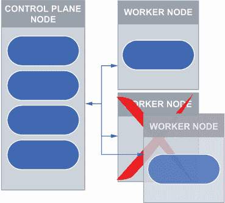

图 1.2 集群中协同工作的服务器（称为节点）。当其中一个失败时，它会将自己从集群中移除以进行修复。

注意：Kubernetes 通常简称为 K8s（发音为 kates），其中 K 和 S 之间的 8 代表这两个字母之间的字符数（“ubernete” = 8 个字符）。

Kubernetes 不过是一块软件，您通过 REST API 与之交互。RESTful API 是一个定义良好、高度可扩展、松耦合的应用架构，它优先考虑通过网络进行通信——更重要的是，通过网络传输资源的状态。我无法强调记住这一点的重要性，即 Kubernetes 背后有一个 API（一个 RESTful API，它是一组可以通过该 API 进行操作的资源）。*资源*是这里的关键词。资源是我们如何在 Kubernetes 中定位对象的方式。有时在 Kubernetes 社区中，我们使用*资源*和*对象*这两个词可以互换使用，但它们之间有一个根本的区别。对象可以有多个资源地址；例如，Deployments 可以根据 API 版本或根据 Deployment 名称拥有多个 URI（统一资源标识符），如图 1.3 所示。*Deployments*在 Kubernetes 中是对象，它们为您在 Kubernetes 上运行的应用程序中的 Pods 和 ReplicaSets 提供更自动化的控制。ReplicaSets 是 Kubernetes 中的另一种对象类型，它提供了一个运行指定数量 Pods（即 Pod 副本）的控制循环。您可以使用`kubectl api-resources`命令从任何 Kubernetes 集群列出所有可用的 API 资源。

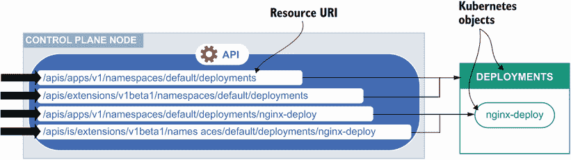

图 1.3 Kubernetes 通过资源 URI 来定位对象，其中多个 URI 可以指向单个对象。

我们通常通过一个名为`kubectl`的命令行工具与 Kubernetes API 及其中的对象进行交互。在这本书中，我们将仅使用`kubectl`，因为这是在考试中用于与 Kubernetes API 接口的命令行工具。除了证书外，还需要`kubectl`命令行工具来创建、读取、更新和删除 Kubernetes 资源。图 1.4 展示了为我们提供执行 Kubernetes 集群中某些操作所需基于角色的访问权限的证书。

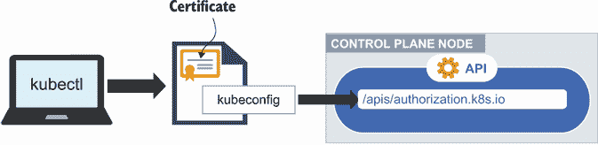

图 1.4 `kubectl`是用于访问 Kubernetes 对象的工具，在 kubeconfig 内部提供有效的证书。

### 1.3.1 集群架构、安装和配置

如前所述，集群的架构由节点组成，在这些节点上运行着 Pod。Pod 是 Kubernetes 中最小的可部署单元，包含一个或多个容器。在 API 的抽象中，创建了由*ReplicaSets*组成的资源，这些 ReplicaSets 又运行在多个节点上的一个或多个 Pod。在 Kubernetes 中，有两种类型的节点——*控制平面节点*和*工作节点*。控制平面节点运行 API 服务器、DNS、控制器管理器、调度器、kube-proxy 和 etcd 数据存储。所有这些部分及其关系都在图 1.5 中展示。

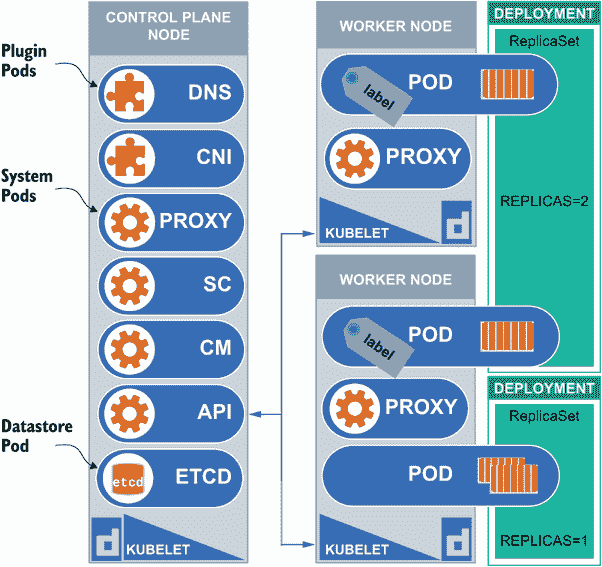

图 1.5 显示了 Kubernetes 架构，其中包括节点、Pod、部署和副本集。

与控制平面通信通过 API 在控制平面节点上进行。工作节点通过 kubelet 获取来自控制平面的指令，以履行其职责，不仅运行容器，还要报告健康状况，向控制平面提供持续的状态。工作节点承担着大部分负载，这使得它们在 Kubernetes 中运行应用程序时扮演着非常重要的角色。

### 1.3.2 工作负载和调度

像副本集（`rs`）和部署（`deploy`）这样的资源对于在 Kubernetes 上运行无状态应用程序工作负载至关重要。没有它们，我们就无法自动扩展 Pod，这提供了负载均衡，使得我们的应用程序在 Kubernetes 上运行时更加易于访问。我们将将这些应用程序部署到 Kubernetes 的过程称为*调度*。术语*调度*来自*调度器*，它是控制平面的一部分。我们将在本章后面更详细地讨论控制平面组件。历史上，如果你必须创建一个在硬件上运行的应用程序，它必须定期维护和更新。这可能会导致中断和/或限制该硬件的功能（它会过时）。Kubernetes（应用程序）抽象化了这种硬件，并在它和所有其他东西（包括硬件）之间创建了一个通用接口（一个 API）。这允许你在运行时更换硬件，以及整合来自不同供应商的硬件并进行混合匹配。

我最喜欢的阐述这个观点的方法是查看一个例子，以获得对 API 内部资源的深入了解。让我们看看一个通过浏览器在 [`swapi.dev`](https://swapi.dev) 渲染的 API。如果你访问 SWAPI（*星球大战* API），你会看到如何请求有关 *星球大战* 电影的不同事实。你通过向 API 发送 `GET` 请求来执行此请求。因为 API 是建立在 HTTP 协议之上的，我们可以执行 HTTP 方法来对 API 端点采取行动。这些操作可以是创建、读取、更新或删除，通常用缩写 *CRUD* 表示。然而，SWAPI 的目的是向 API 发送请求并`GET`回一些数据。因此，在请求字段中，输入 `people/1/`，下面你应该能看到结果，如图 1.6 所示。

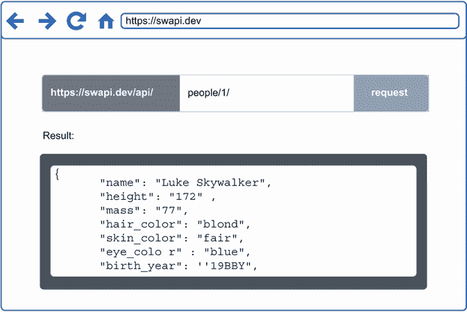

图 1.6 SWAPI 网站允许你以与 Kubernetes 相同的方式访问对象。

结果是 `"Luke Skywalker"`，但结果本身并不重要；重要的是你刚刚从 API 接收到了数据（以 JSON 格式）。你接收到的数据是我们一直在谈论的资源 URI。位于该 URI 的对象是 `"Luke Skywalker"`，该对象包含诸如身高、发色、眼色等数据。将此与 Kubernetes 相关联，SWAPI 中的 `people` 对象与 Kubernetes 中的 Deployment 对象非常相似。你可以类似地访问 Kubernetes API。Kubernetes Dashboard 甚至通过浏览器提供 API 的渲染，就像 SWAPI 一样。图 1.7 显示了一些 Kubernetes 资源 URI。

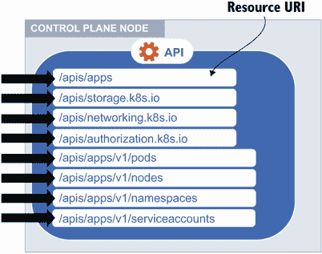

图 1.7 根据资源 URI 访问 Kubernetes 中的对象。例如，节点位于 `/apis/apps/v1/nodes`。

有不同的 API 调用（称为 *HTTP* *方法*）对 API 执行某些操作（假设你已经对 API 进行了认证）。它们是 `GET`、`POST`、`PATCH`、`PUT` 和 `DELETE`。`GET` HTTP 方法正是我们一直在 SWAPI 中所做的那样，即检索或查看我们 API 中资源的有关信息。`POST` HTTP 方法用于在 API 中创建新的资源。`PATCH` HTTP 方法用于更新现有资源，而 `PUT` HTTP 方法用于替换 API 中的现有资源。最后，`DELETE` HTTP 方法用于从 API 中删除资源。

### 1.3.3 服务和网络

要让最终用户与运行在 Kubernetes 上的应用程序交互，我们创建了一个名为 *Service* 的对象。这些服务为它们所服务的 Pods 提供负载均衡功能。它们还提供了一个单一的 IP 地址和 DNS 名称，我们将在后面的章节中回顾。说到 DNS，Kubernetes 中有一个名为 CoreDNS 的组件，它提供 IP 地址的名称。这意味着 Kubernetes 中的资源可以使用通用名称而不是 IP 地址相互通信。三种类型的服务是 ClusterIP、NodePort 和 LoadBalancer。

Ingress 资源是 Kubernetes 中的另一个对象，它提供了基于路径的路由到 Kubernetes 中的服务。例如，你会创建一个 Ingress 资源，根据 URL 路径提供一个基于 7 层（应用层）的路由到服务。

### 1.3.4 存储

在管理 Kubernetes 中的短暂对象，如 Pods 时，你不能依赖于存储与单个 Pod 相关联。存储是应用程序用于在文件系统（如 NTFS、XFS 或 ext4）中存储和组织文件的数据。文件系统是在操作系统（如 Linux）中发生的存储组织行为。在 Kubernetes 中，有一个持久卷的概念，它不与单个 Pod 相关联，而是与 NFS、EFS 或 iSCSI 卷相关联。将存储与短暂的应用程序解耦，可以创建数据的持久性。

此外，从开发者的角度来看，你不再需要管理底层存储。对 Kubernetes 来说，它似乎只是一个大型的存储层。开发者可以使用一个名为*persistent volume claim*的对象来预留持久卷，这样它就不能被 Kubernetes 中运行的其他应用程序使用。但这仍然需要持久卷存在，所以如果它不存在，开发者可以使用名为*storage class*的对象动态访问存储。存储类与卷的不同类别有关——例如，慢速与快速。

卷也可以由多个 Pod 同时使用，并且可以重用，分别指定某些访问模式和某些回收策略。访问模式允许一个或多个 Pod 读取和写入卷的能力。回收策略将允许或拒绝来自 Kubernetes 集群中其他 Pod 的访问。

### 1.3.5 故障排除

Kubernetes 集群并不完美；随着在集群中创建的资源和对象越来越多，它们可能会变得相当复杂。当出现问题时进行故障排除对于限制运行应用程序的停机时间以及检测问题以优化和使 Kubernetes 表现最佳至关重要。能够解析运行容器的日志、分析故障并提出解决方案是成为一名优秀的 Kubernetes 管理员的关键。日志是基于时间的基于文本的行为数据，发送到文件系统上的一个目录，以提供有关正在发生的问题的详细信息。世界上所有的冗余都无法修复一个构建不良且维护不善的集群。

在 Kubernetes 上运行的应用程序也增加了维护责任。它们包含来自 stdout 和 stderr 的日志，这对于检测通信问题何时出现或应用程序即将失败至关重要。

## 1.4 控制平面节点

使其成为控制平面的服务和组件如下：

+   控制器管理器

+   API 服务器

+   调度器

+   etcd 数据存储

控制器管理器是一个控制循环，负责将当前状态与期望状态相匹配。例如，如果 Pods 的数量不匹配期望的副本数，控制器管理器将自动扩展 Deployment。控制器管理器还会为新命名空间创建默认账户和 API 访问令牌。这就是为什么在下一章中创建 Kubernetes 集群时，你会看到已经为你创建了一个默认命名空间、服务账户和密钥，以便你可以开始部署你的资源（应用程序）。这使得立即在 Kubernetes 上运行容器化应用程序变得容易。当提到命名空间时，可以将其视为一个专门为你的 Kubernetes 资源设置的虚拟环境。默认命名空间将在这个命名空间的范围内进行隔离，并且可以有自己的 Kubernetes 资源分组。

API 服务器正如其名：它是暴露 Kubernetes API（我们之前提到的 RESTful API）的组件。它是集群的入口点，因此所有通往集群的通信都通过它来访问集群组件。想象一下，它就像一个只有用正确的密钥通过认证才能打开的大门，就像图 1.8 中所示。我们将在第三章中更多地讨论认证。

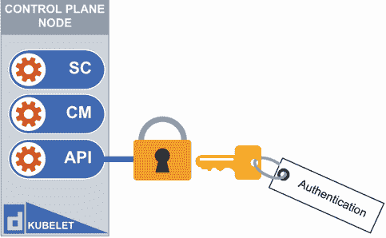

图 1.8 要访问 Kubernetes API，你需要使用密钥进行认证。

调度器是选择 Pod 运行节点的组件。你可能会在这本书中多次听到“调度”这个词，所以从现在开始，当我提到“调度”时，它仅仅意味着 Pod 正在被放置（调度）到节点上以运行。如果多个节点已经运行了 Pod，那么调度器将会将 Pod 放置到不同的节点上，同时考虑可用的资源以及已经放置在该节点上的其他规则/规范。

有一些服务（称为*守护进程*）运行在控制平面，对于 Kubernetes 集群的运行至关重要。实际上，它们是如此关键，以至于在生产场景中，它们会被复制以实现高可用性。复制控制平面组件超出了本书和考试的范畴，因为考试中的 Kubernetes 集群不会超过一个控制平面节点。一般来说，复制控制平面是通过执行两个功能来实现的。首先，复制确保控制平面组件一次只有一个实例接收请求。这是通过选举一个领导者来实现的。领导者将充当主控制平面，并将其状态传递给其他追随者。其次，因为控制平面依赖于 etcd 来存储所有的 Kubernetes 配置数据（资源的状态以及它们在 Kubernetes 中的运行方式），所以你会创建多个冗余的 etcd 副本。如果你想了解更多关于在 Kubernetes 中实现高可用性的控制平面复制，你可以在这里阅读更多：[`mng.bz/5wz7`](http://mng.bz/5wz7)。

etcd 数据存储是我们之前提到的那些关键控制平面组件之一。Etcd 存储了所有的 Kubernetes 配置数据（Kubernetes 的状态）。Etcd 是一个一致性的、分布式的键值存储，旨在存储可以完全放入内存中的少量数据。这很重要，因为数据可以比其他传统数据库更快地检索（见图 1.9）。关于 etcd 数据存储，最重要的是记住，丢失它（etcd 故障）是灾难性的，因为它包含了运行在 Kubernetes 集群内部的所有资源的配置信息，所以确保它被备份是极其重要的。你可能会在考试中遇到有关备份 etcd 的问题，所以我们将在下一章中介绍如何进行备份。

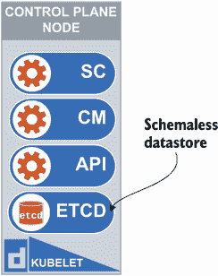

图 1.9 etcd 数据存储位于控制平面节点上的 Kubernetes Pod 中。

## 1.5 工作节点

既然我们已经详细讨论了控制平面组件，现在让我们回顾一下位于工作节点上的组件，如图 1.10 所示。运行在工作节点上的组件与控制平面上的组件不同，因为工作节点在 Kubernetes 环境中扮演着不同的角色。您在 Kubernetes 集群中肯定会有不止一个节点，以下每个组件都会安装在每个节点上：

+   kubelet

+   kube-proxy

+   容器运行时

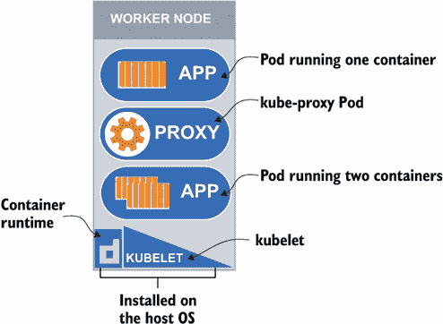

图 1.10 工作节点的角色是运行应用程序工作负载。它还包含 kubelet、kube-proxy 和容器运行时（例如，containerd）。

运行在每个工作节点上的 kubelet 服务确保容器在 Pod 中运行。然而，尽管它不知道由调度器未管理的容器，kubelet 可以检测到容器（在 Pod 内）失败的情况，并采取纠正措施以确保容器以 YAML 清单中指定的方式重启，YAML 清单是一组用于配置 Pod 的 YAML（YAML 不是标记语言）格式的指令。它就像是一组声明性指令（考虑到最终状态），供 kubelet 遵循以保持运行在 Kubernetes 上的应用程序的高可用性。如果 kubelet 无法使容器运行，它将向 Kubernetes API 服务器报告 Pod 和容器的状态，您可以通过执行命令`kubectl describe po nginx`（nginx 是 Pod 的名称）在 Pod 事件中看到它。这里显示了类似的输出：

```
$ kubectl describe po nginx
Name:         nginx
Namespace:    default
Priority:     0
Node:         host01/172.17.0.33
Start Time:   Tue, 01 Feb 2022 16:49:36 +0000
Labels:       run=nginx
Annotations:  <none>
Status:       Running
IP:           192.168.0.4
IPs:
  IP:  192.168.0.4
Containers:
  nginx:
    Container ID:   containerd:/ /4de3efffd3a6f1ec49c968d7fde95e8eae4ae0c25574e8055cca33a1974998
➥ 79
    Image:          nginx
    Image ID:       
➥ docker.io/library/nginx@sha256:2834dc507516af02784808c5f48b7cbe38b8ed5d
➥ 0f4837f16e78d00deb7e7767
    Port:           <none>
    Host Port:      <none>
    State:          Running
      Started:      Tue, 01 Feb 2022 16:49:44 +0000
    Ready:          True
    Restart Count:  0
    Environment:    <none>
    Mounts:
      /var/run/secrets/kubernetes.io/serviceaccount from kube-api-access-
➥ 5ffvj (ro)
Conditions:
  Type              Status
  Initialized       True 
  Ready             True 
  ContainersReady   True 
  PodScheduled      True 
Volumes:
  kube-api-access-5ffvj:
    Type:                    Projected (a volume that contains injected 
➥ data from multiple sources)
    TokenExpirationSeconds:  3607
    ConfigMapName:           kube-root-ca.crt
    ConfigMapOptional:       <nil>
    DownwardAPI:             true
QoS Class:                   BestEffort
Node-Selectors:              <none>
Tolerations:                 node.kubernetes.io/not-ready:NoExecute 
➥ op=Exists for 300s
                             node.kubernetes.io/unreachable:NoExecute 
➥ op=Exists for 300s
Events:
  Type    Reason     Age   From               Message
  ----    ------     ----  ----               -------
  Normal  Scheduled  17s   default-scheduler  Successfully assigned 
➥ default/nginx to host01
  Normal  Pulling    16s   kubelet            Pulling image "nginx"
  Normal  Pulled     9s    kubelet            Successfully pulled image 
➥ "nginx" in 6.993614669s
  Normal  Created    9s    kubelet            Created container nginx
  Normal  Started    9s    kubelet            Started container nginx
```

当您描述 Pod 后查看事件时，您会看到容器（显示为状态）的不同状态，包括等待、运行和终止。您还可以通过运行命令`kubectl get po`来查看容器的状态。

运行在每个工作节点上的 kube-proxy 服务是 Kubernetes 服务的通信机制。服务是 Kubernetes 中的另一种资源类型，负责将流量分配给该服务内的各个 Pod。我们将在第六章中深入探讨服务。这些是节点在需要将流量发送到 Kubernetes 中的 Pod 时需要遵循的基本网络规则。有一个非常有趣的视频详细描述了这一点，名为“数据包的一生”。我强烈建议您在这里观看：[`youtu.be/0Omvgd7Hg1I`](https://youtu.be/0Omvgd7Hg1I)。

最后，在每个 Kubernetes 节点上运行的是容器运行时。这是 Kubernetes 运作所必需的组件，因为它是运行容器的引擎。有趣的是，它是一个外部依赖项，这意味着它是 Kubernetes 集群中唯一需要 Kubernetes 本身不应用或安装的组件之一。这意味着在安装容器引擎时，你有选择权。Kubernetes 支持任何符合 CRI 要求的容器运行时 ([`mng.bz/6D0R`](http://mng.bz/6D0R))。常见的选项包括 Docker ([`docs.docker.com/engine/`](https://docs.docker.com/engine/))、containerd ([`containerd.io/docs/`](https://containerd.io/docs/)) 或 CRI-O ([`cri-o.io/#what-is-cri-o`](https://cri-o.io/#what-is-cri-o))。你可能听说过 Docker，但你是否知道 Docker 在底层使用 containerd 作为容器运行时，同时使用名为 dockershim 的功能来访问 containerd？Docker 也不符合 CRI 标准 ([`mng.bz/o1nD`](http://mng.bz/o1nD))。因此，最后一句中隐含的 containerd 是一个精简版（因此它轻量级且便携）的容器运行时，同时也符合 CRI 标准。CRI-O 是另一个轻量级容器运行时，支持开放容器倡议 (OCI)。因此，它是一个由社区驱动的开源项目，支持多种镜像格式，包括 Docker 镜像。

## 1.6 API 模型和 PKI

我们将在第三章中更详细地讨论 Kubernetes 中的 RBAC 和身份管理，但到目前为止，让我们先谈谈构成 Kubernetes 中客户端到服务器关系的公共密钥基础设施。正如我们所见，要操作 Kubernetes 中的对象，我们需要两样东西。第一样是命令行工具 `kubectl`。第二样是客户端证书，如图 1.11 所示。

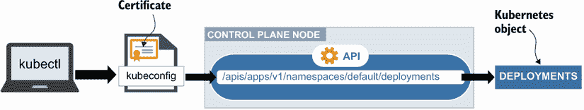

图 1.11 要操作 Kubernetes 对象，我们必须使用客户端证书进行身份验证。

公共密钥基础设施 (PKI) 是一种非常常见的客户端-服务器通信模式，并且是我们计算机通过 Web 服务器安全地与网站通信的通常方式。从高层次来看，PKI 通过确保你访问的网站是你打算访问的网站（通过加密签名）来启用 Web 上的安全通信。这确保了你访问的是正确的网站（而不是冒名顶替者的网站），同时也确保没有人正在窃听或拦截往返的流量。如果你考虑通过 Web 访问你的银行，这个 PKI 基础设施对于确保银行账户安全、访问它们的人确实是账户的所有者以及你访问的是正确的银行至关重要。

PKI 的基本组成部分包括三个元素，如图 1.12 所示。首先是证书颁发机构（CA）。CA 是真相来源，并签署服务器证书（在用于 API 的情况下），随后客户端可以确定服务器是否有效。例如，在互联网上，常见的证书颁发机构有 DigiCert、Symantec 和 Thawte，并且浏览器（客户端）已经信任它们作为浏览器快速验证网站身份的方式（例如，是否 google.com 确实是谷歌）。PKI 拼图的第二和第三部分是服务器和客户端，它们都依赖于 CA——客户端试图验证服务器的身份，服务器则试图向 CA 进行身份验证并证明它们就是他们所说的那样。就像互联网的 PKI 一样，相同的 PKI 模型也应用于 Kubernetes。

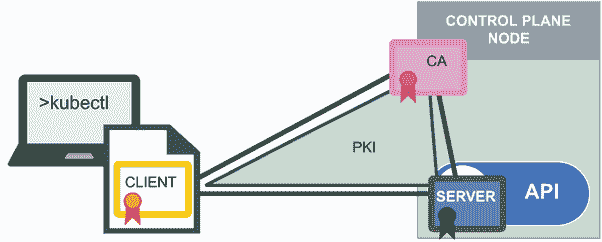

图 1.12 控制平面节点作为证书颁发机构（CA），它签署证书并为客户端和服务器之间的通信提供身份验证。

将 PKI 拼图的三块相同的拼图应用到 Kubernetes 中，Kubernetes 是其自己的 CA，并将成为 Kubernetes 集群内其他组件的真相来源。Kubernetes 中的客户端（检查服务器是否为它们所声称的身份的客户端）包括 kubelet、调度器、控制器管理器和 etcd 数据存储。同一个 Kubernetes 组件可以同时作为客户端和服务器。Kubernetes 中的服务器（试图向 CA 证明其身份的客户端）包括 kubelet、Kubernetes API 和 etcd 数据存储（见图 1.13）。


图 1.13 Kubernetes API 在 PKI 基础设施中既作为客户端又作为服务器承担多个职责。CA 生成证书，服务器则试图证明其身份（[`mng.bz/mV68`](http://mng.bz/mV68)）。

幸运的是，你不必担心创建 CA、客户端或服务器证书。Kubeadm 会为你完成所有这些工作。Kubeadm 是一个类似于`kubectl`的命令行工具，但其目的是创建构成我们 Kubernetes 集群所需的所有组件（包括 CA 和其他证书）；有时我们称之为*引导集群*。我们将在第三章中更多地讨论 kubeadm 以及所有这些证书的位置。

## 1.7 Linux 系统服务

在所有关于服务和控制平面以及工作节点组件的讨论中，我认为提及 Linux 系统服务是恰当的。Linux 系统服务是在 Linux 操作系统上的一组文件，它提供了一个在后台持续运行的软件程序。如果你还记得，我提到过在控制平面运行的一些服务被称为守护进程。在 Linux 世界中，守护进程已经使用了很长时间，不要与 Kubernetes 中的 DaemonSet 混淆，它确保守护进程作为 Kubernetes 集群中的 Pod 在所有时间运行，如图 1.14 所示。如果你更熟悉 Windows 计算机，这个相同的概念被称为*服务*。

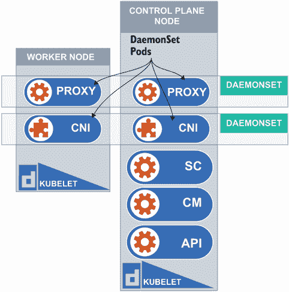

图 1.14. DaemonSets 确保集群中的每个节点上运行一个 Pod。kube-proxy 和 CNI 都作为 DaemonSets 运行。

关于这一点，我们之前提到的控制平面组件是一个很好的例子。你可以在每个节点上运行一个 DaemonSet，提供 kube-proxy 组件，例如。通过运行命令`kubectl get ds -A`来亲自看看。

```
$ kubectl get ds -A
NAMESPACE     NAME              DESIRED   CURRENT   READY   UP-TO-DATE   
➥ AVAILABLE   NODE SELECTOR            AGE
kube-system   kube-flannel-ds   1         1         1       1
➥             1           <none>                   18m
kube-system   kube-proxy        1         1         1       1
➥             1           kubernetes.io/os=linux   19m
```

然而，有一个服务你不想让 Kubernetes 管理（作为一个 DaemonSet），那就是 kubelet。kubelet 是在 Kubernetes 环境中唯一位于 Linux 系统本身（作为一个 Linux 系统服务）的服务之一。你必须知道这一点，因为考试可能会让你修复它。了解这个服务的位置以及如何修复它将非常有用。要查看 Linux 系统上所有服务的列表，请输入命令`sudo systemctl list-unit-files --type service --all | grep kubelet -a6`。

```
$ sudo systemctl list-unit-files --type service --all | grep kubelet -a6
ip6tables.service                          enabled         enabled      
iptables.service                           enabled         enabled      
irqbalance.service                         enabled         enabled      
keyboard-setup.service                     enabled         enabled      
kmod-static-nodes.service                  static          enabled      
kmod.service                               static          enabled      
kubelet.service                            enabled         enabled      
logrotate.service                          static          enabled      
lvm2-lvmpolld.service                      static          enabled      
lvm2-monitor.service                       enabled         enabled      
lvm2-pvscan@.service                       static          enabled      
lvm2.service                               masked          enabled      
man-db.service                             static          enabled
```

你将看到一个显示单元文件（服务名称）和服务状态（启用/禁用/掩码/静态）的服务列表。在这个列表中，你会看到`kubelet.service`作为其中之一。一旦你确定 kubelet 服务在你的系统上正在运行，你可以做三件事情之一。如果它已经停止，你可以通过输入`systemctl start kubelet`来启动它。如果你注意到当节点重启时服务没有启动，那么你可以使用命令`systemctl enable kubelet`来启用它，这样当节点启动（或重启）时它会自动启动。最后，如果你只是想检查服务状态以查看它是活动状态还是非活动状态，你可以运行命令`systemctl status kubelet`。

在服务列表中，你可能已经注意到了`systemd.journald`服务。如果没有注意到，可以运行以下命令来显示它：`sudo systemctl list-unit-files --type service --all | grep journald.service`。

```
$ systemctl list-unit-files --type service --all | grep journald.service
systemd-journald.service               static          enabled
```

Journald（另一个 Linux 系统服务）用于收集每个节点上 kubelet 服务的日志。Journalctl 是一个命令行工具，用于查看由 systemd 收集的 Linux 系统日志，systemd 是 Linux 中控制所有进程的主要守护进程。这种日志机制在考试期间可能非常有用。例如，你可能会发现自己正在挖掘日志以找出 kubelet 服务失败的原因。可以使用命令`sudo journalctl -u kubelet`和`sudo journalctl -u containerd`作为参考。

你可以在`/var/log/pods`目录中检查 Pod 日志；然而，你也可以使用`kubectl logs`命令以完全相同的方式检索这些日志（例如，`kubectl logs kube-controller-manager-server1 -n kube-system`）。关于故障排除和收集这些日志的更多内容，请参阅第八章。现在，只需知道这些 Linux 系统服务对于收集有关 Kubernetes 的有价值信息非常重要，并且一些服务存在于 Linux 系统（节点）上，而一些服务存在于 Kubernetes（Pod）的范围内。

## 1.8 声明式语法

现在你已经很好地了解了 Kubernetes 集群及其底层服务的组成，我不得不提一下 Kubernetes 的主要目的，那就是运行应用程序。是的，一旦你有了控制平面组件（我们在此章中已经讨论过）、工作节点组件和 Linux 系统服务的基石，并且集群作为一个松散耦合的单元运行（记得 API 模型吗？），那么就是时候运行你的应用程序了。毕竟，这是主要功能，也是我们最初使用 Kubernetes 的原因。至于在 Kubernetes 上运行这些应用程序，你可以在 Kubernetes 上运行 Java 应用程序，就像.NET 应用程序一样。

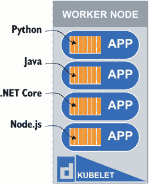

图 1.15 在真正的微服务架构中，每个微服务都与其他服务解耦；因此，它可以以最适合该服务的语言构建。

Kubernetes 根本不在乎语言或应用程序的运行方式，如图 1.15 所示。它将以相同的方式在每次实例中运行你的容器，并且通过保持相同的容器基础优势来实现这一点，因为应用程序的二进制文件和库与容器一起打包，并且因为应用程序在每台机器上以相同的方式运行。

因此，如果 Kubernetes 不关心应用程序的语言或框架，那么应用程序是如何在 Kubernetes 上部署的呢？这引出了 DevOps 和云原生中的一个非常重要的词——*声明式*。你会发现，以声明式方式在 Kubernetes 上构建应用程序要比命令式方式好得多。为什么？命令式方式不过是按照特定顺序运行一系列命令。这使得跟踪这些命令和在执行这些命令的顺序中检测命令失败变得很困难。声明式方式更加描述性和简洁，具有以下主要优势：

+   通过 YAML 文件描述你的配置，该文件可以提交到版本控制

+   以最终状态为目标构建，不考虑顺序或特定的运行命令

+   通过并行操作获得高效和快速启动的能力

YAML 是一种人类可读的语言，同时也适用于机器，因此创建这种配置文件相对简单。大多数资源都遵循 YAML 的相同模式和结构。以下是一个名为 `my-pod-manifest.yaml` 的文件示例：

```
apiVersion: v1
kind: Pod
metadata:
  labels:
    run: nginx
  name: nginx
spec:
  containers:
  - image: nginx
    name: nginx
```

这些 YAML 文件（称为 *manifests*）可以在多年后引用，这是记录应用程序构建过程的一种良好形式。将其提交到版本控制将允许你跟踪更改，并在团队中共同开发并随着时间的推移改进配置。你可以自由地构建以 Kubernetes 运行的应用程序，并着眼于最终目标。这被称为 *目标寻求*。你不必担心达到最终状态的道路；你只需将 YAML 文件提交给 Kubernetes API，API 就会选择最佳路径来完成构建。

有趣的是，将你的文件提交给 API 与执行一个 `POST` 请求到 API 是相同的。因为你的集群中运行的所有内容都对 API 可见，动作可以并行处理，并且会更快地达到最终状态。以下是一个使用 `kubectl` 通过 YAML 文件声明式创建 Pod 的命令式命令示例：

```
$ kubectl create -f my-pod-manifest.yaml 
pod/nginx created
```

你可以使用三种不同的方式将此文件提交给 Kubernetes API 使用 `kubectl`——通过使用命令 `kubectl create -f my-pod-manifest.yaml`，命令 `kubectl apply -f my-pod-manifest.yaml`，或者命令 `kubectl replace -f manifest.yaml`。`create` 命令期望还没有创建任何资源，如果否则，它将抛出一个错误。另一方面，`apply` 命令可以用来创建或更新现有资源。`replace` 命令如果存在将删除资源，并创建一个全新的资源，就像你手动删除资源然后创建一个新的一样。例如，在 Deployment 上使用 `replace` 命令将触发一个新的部署，其中该 Deployment 内的 Pod 将被优雅地终止，并启动新的 Pod 副本。我们将在第四章中更详细地讨论 Deployment，在第五章中讨论滚动更新。

*幂等* 是另一个需要记住的重要词汇。与 Kubernetes API 一起工作的好处是，无论对 API 进行多少次相同的调用，资源的状态都将保持不变。这为您的工作环境带来了一致性，并且随着时间的推移，您的基础设施和应用变得越来越复杂，您也知道可以期待什么。

既然我们已经对 Kubernetes 讨论得淋漓尽致，并讨论了我们可能遇到或可能没有遇到的复杂性和复杂性，那么让我们深入下一章，并更深入地了解我们学习 Kubernetes 的方法。毕竟，您将在考试中动手操作键盘，为什么不深入实践和模拟考试体验呢？卷起袖子吧！

## 1.9 考试练习

1.  执行列出 Kubernetes 集群中所有 API 资源的命令。将输出保存到名为 `resources.csv` 的文件中。

1.  列出与 Kubernetes 相关的 Linux 操作系统上的服务。将输出保存到名为 `services.csv` 的文件中。

1.  列出在 Kubernetes 节点上运行的 kubelet 服务的状态，将结果输出到名为 `kubelet-status.txt` 的文件中，并将文件保存在 `/tmp` 目录中。

1.  使用声明性语法从 YAML 文件创建 Kubernetes 中的 Pod。将 YAML 文件保存为 `chap1-pod.yaml`。使用 `kubectl create` 命令创建 Pod。

1.  使用 `kubectl` CLI 工具列出您在 Kubernetes 集群中所有命名空间中创建的所有服务。将命令的输出保存到名为 `all-k8s-services.txt` 的文件中。

## 摘要

在本章中，您已经认识了 Kubernetes。现在您不仅知道 Kubernetes 的内部和外部结构，还知道它通常被用于什么。您还应该了解以下内容：

+   Kubernetes 是一个运行其他应用程序的应用程序，其构建方式与其它 RESTful 网络应用程序类似。API 是 Kubernetes 集群中身份验证、授权和通信的中心枢纽。

+   集群有许多不同的组件，包括两个主要部分：控制平面，由控制平面节点处理，以及工作节点，它们负责运行工作负载（即运行在 Kubernetes 之上的容器化应用程序）。

+   在 Kubernetes 中，Linux 系统服务很重要，因为它们负责在主机本身上保持 Kubernetes 的运行。

+   您可以通过两种方式访问集群，编程方式或使用名为 `kubectl` 的工具，这两种方式都需要证书进行身份验证。这种证书在 PKI（公钥基础设施）系统中很常见，该系统会与 CA（证书颁发机构）进行交互，以确保证书有效，并且可以在 Kubernetes 集群中的组件之间进行通信。

+   Kubernetes 是考虑到微服务而构建的，这意味着大型微服务应用程序可以在 Kubernetes 中运行得更有效率，因为每个服务都与整体应用程序解耦。

+   在 Kubernetes 上运行服务通过声明式方法更为高效。这种方式，我们可以描述我们希望最终状态是什么，而不是运行一系列命令式指令来达到相同的结果。
