# 2 Kubernetes 集群

本章涵盖

+   多节点集群中的控制平面和工作节点组件

+   使用 kubeadm 升级控制平面组件

+   调查 Pod 和节点网络

+   备份和恢复 etcd

+   污点和容忍

没有进入运行中的集群并亲自发现组件，几乎不可能理解 Kubernetes 集群架构。无论你怎么看，作为 Kubernetes 管理员，我们必须了解底层的运作情况。当你完成本章后，你将能够舒适地访问 Kubernetes 集群中的所有组件，在需要时升级组件，并备份集群配置。

集群架构、安装和配置

本章回顾了 CKA 课程中集群架构、安装和配置领域的部分内容。该领域涵盖了 Kubernetes 集群的元素，包括关键组件以及如何维护一个健康的 Kubernetes 集群。本章包括以下能力。

| 能力 | 章节部分 |
| --- | --- |
| 提供底层基础设施以部署 Kubernetes 集群。 | 2.1 |
| 使用 kubeadm 在 Kubernetes 集群上执行版本升级。 | 2.1 |
| 实施 etcd 备份和恢复。 | 2.2 |
| 管理一个高可用性的 Kubernetes 集群。 | 2.2 |

## 2.1 Kubernetes 集群组件

控制平面 Pods 协同工作以形成控制平面。这些组件包括 API 服务器、控制器管理器、调度器和 etcd。在你在考试当天可能会遇到的 Kubernetes 集群中，这些组件以在控制平面节点上运行的 Pods 的形式存在。你可以通过查看运行在 `kube-system` 命名空间中的 Pods 来查看集群组件。你可以使用命令 `kubectl get po -n kube-system` 来查看这些 Pods，你将看到类似于图 2.1 的输出。我们首先运行命令 `docker exec -it kind-control-plane bash` 来获取控制平面节点的 shell。

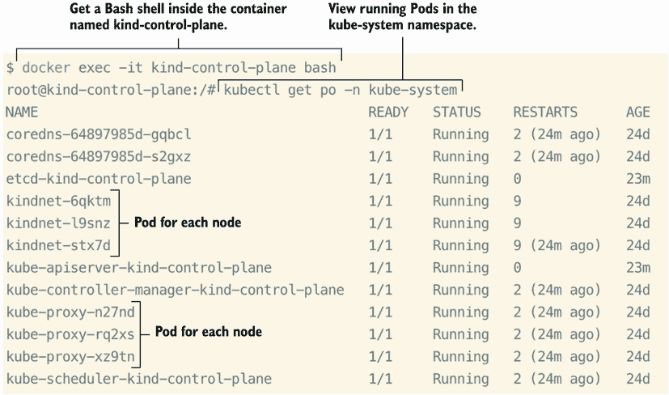

图 2.1 `kube-system` 命名空间中的 Pods

在本章的后续部分，你将学习如何管理这些组件，包括如何访问它们、修改它们的配置、备份它们以及升级它们。现在，让我们在终端中动手操作。

### 2.1.1 Kubernetes 版本升级

CKA 考试将测试你维护 Kubernetes 集群的知识。这包括将控制平面组件升级到特定版本。例如，考试问题可能会说如下内容。

| 考试任务 公司 X 需要升级 Kubernetes 控制器到 1.24 或更高版本，因为一个影响 Pod 调度的错误。以最少的停机时间和服务损失执行更新。 |
| --- |

知道你应该使用 kubeadm 来这样做，将使你能够轻松地完成这项任务，并对你正在朝着及格分数前进感到自信。

如果你还没有访问现有的 Kubernetes 集群，附录 A 中解释了如何使用 kind 创建 Kubernetes 集群。一旦你的 kind 集群构建完成，就可以使用预安装在控制平面节点上的`kubectl`工具。你可以通过输入命令`docker exec -it kind-control-plane bash`并跟随操作来获取控制平面节点的 Bash shell。使用 kubeadm 构建的集群意味着我们也可以使用 kubeadm 查看我们的控制平面组件的版本，如图 2.2 所示，并升级集群。从控制平面运行`kubeadm upgrade plan`命令会显示控制平面组件列表，并在`CURRENT`列中显示当前版本，以及在`TARGET`列中显示你可以升级到的版本。

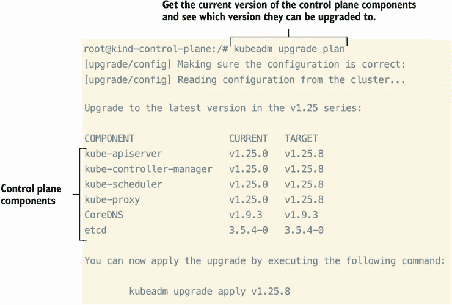

图 2.2 查看控制平面组件以及如何升级它们（如果需要的话）。

注意：`TARGET`列不显示 Kubernetes 的最新版本。这是因为我们只能更新到当前版本的 kubeadm。如果 kubeadm 是 1.26.0 版本，`TARGET`列将显示 v1.26.3。要将 kubeadm 从 1.26.0 升级到 1.26.3，运行命令`apt update; apt install -y kubeadm=1.26.3-00`。

如果你必须将 kubeadm 升级到最新版本，首先下载 GPG 密钥并将 kubeadm 添加到你的本地`apt`软件包（仍然在控制平面节点上的 shell 中）。要下载 GPG 密钥，运行命令`curl -fsSLo /etc/apt/keyrings/kubernetes-archive-keyring.gpg https://packages.cloud.google.com/apt/doc/apt-key.gpg`。要将 kubeadm 添加到你的本地`apt`软件包，运行命令`echo "deb [signed-by=/ etc/apt/keyrings/kubernetes-archive-keyring.gpg] https://apt.kubernetes.io/ kubernetes-xenial main" | tee /etc/apt/sources.list.d/kubernetes.list`。完成这些操作后，重新运行命令`apt update; apt install -y kubeadm=1.26.3-00`以将 kubeadm 升级到版本 1.26.3。当你再次运行`kubeadm upgrade plan`命令时，你会注意到你的`TARGET`列显示了一个比 1.24.3 更高的版本，你可以升级到这个版本。请参见图 2.3 中此命令的缩略输出。

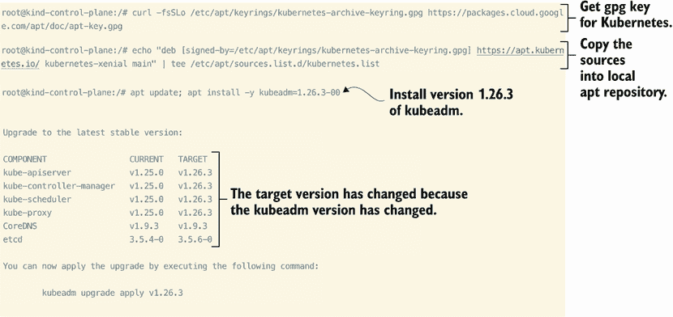

图 2.3 当你升级 kubeadm 时，你也可以升级你的控制平面组件。

恭喜！你已经成功升级了 Kubernetes 集群的控制平面组件，也就是“升级 Kubernetes”。

### 2.1.2 控制平面

控制平面和工作节点有不同的职责。工作节点承载应用程序的工作负载并运行包含这些应用程序容器的 Pods，而控制平面运行一组初始的 Pods，包括我们在升级集群时看到的控制平面组件。我们称它们为*系统 Pods*，因为它们包含了围绕整个 Kubernetes 系统运行的必要结构。《kube-apiserver》、《kube-controller-manager》、《kube-scheduler》和 etcd 都在控制平面节点上作为系统 Pod 运行。这些系统 Pod 将存在于你的 Kubernetes 集群所在的位置或其构建方式如何，因为它们对于 Kubernetes 的核心至关重要。你可以通过运行命令`k get po -o wide -A --field-selector spec.nodeName=kind-control-plane`来查看系统 Pods，该命令将显示类似于图 2.4 的输出。

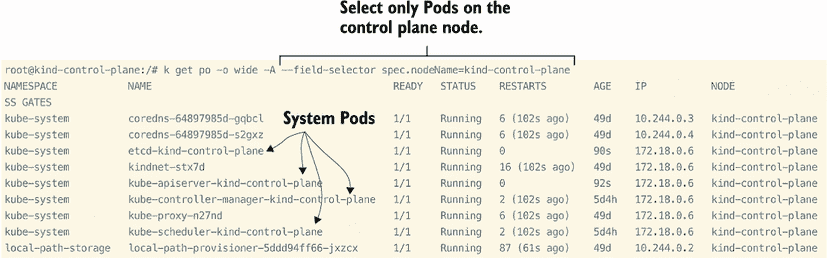

图 2.4 控制平面节点上的系统 Pods

CoreDNS 也是一个运行在控制平面节点上的 Pod，但它被视为一个插件，而不是核心系统 Pod。此外，kube-proxy Pod 将在所有节点上运行，无论它是一个控制平面节点还是工作节点。让我们专注于控制平面节点的核心组件，如图 2.5 所示。

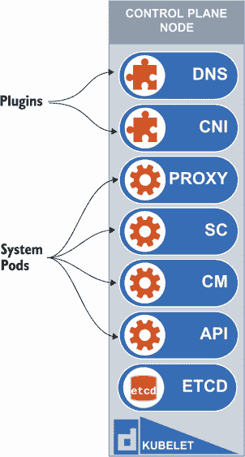

图 2.5 Kubernetes 控制平面节点上的系统 Pods 和插件

每个 Pod 在 Kubernetes 的操作中都扮演着特定的角色。控制器管理器 Pod 维护集群操作，确保部署正在运行正确的副本数。调度器 Pod 负责检测节点上的可用资源，以便你可以在该节点上放置 Pod。将 Pod 分配给节点的行为称为*调度*；从现在起，当我说“一个 Pod 被调度到节点上”时，我的意思是该节点上已启动了一个新的 Pod。API 服务器 Pod 将公开 API 接口，并且是所有其他组件的通信中心，包括工作节点和控制平面节点上的组件。最后，etcd Pod 是用于存储集群配置数据的 etcd 数据存储，正如我们在本章以及上一章所讨论的。

### 2.1.3 污点（Taints）和容忍度（Tolerations）

默认情况下，应用程序 Pod 不会在控制平面节点上运行。为什么是这样呢？因为控制平面有一个特殊的属性，称为*污点*。污点会排斥工作，这意味着除非 YAML 规范中存在一个称为*容忍度*的特定规范，否则将禁用对该节点的调度。让我们通过在控制平面节点上（`docker exec -it kind-control-plane bash`）输入命令`kubectl describe no | grep Taints`来查看我们的控制平面节点上的污点是什么样的：

```
root@kind-control-plane:/# kubectl describe no | grep Taints
Taints:             node-role.kubernetes.io/master:NoSchedule
Taints:             <none>
Taints:             <none>
```

如我们所见，在集群创建过程中，已经将污点应用于我们的控制平面节点，污点为`node-role.kubernetes.io/master:NoSchedule`。污点由三部分组成：一个键、一个效果和一个值。污点不需要有值，但必须有键和效果。因此，在这种情况下，键是`node-role.kubernetes.io`，效果是`NoSchedule`。这意味着除非有对该污点的容忍，否则 Pod 不会调度到具有该污点的节点。在图 2.6 中，您将看到这一演示，因为 Pod 没有对该污点的容忍，所以它没有被调度到该节点。

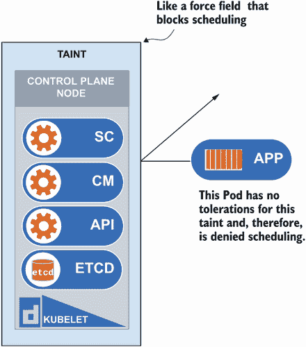

图 2.6 将污点应用于控制平面节点，但没有容忍；因此，Pod 没有被调度。

让我们在我们的一个工作节点上应用一个污点，并看看具有键、效果和值的污点是什么样的，使用命令`kubectl taint no kind-worker decdicated=special-user:NoSchedule`。这个命令在图 2.7 中被分解，以显示哪个项目是键，哪个项目是值和效果。

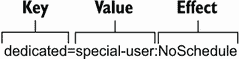

图 2.7 污点各部分的分解：键、值和效果

当您想更具体地说明 Pod 必须具备的资格才能“绕过”污点时，使用完整的污点（键、值和效果）是合适的。是的，有一种方法可以将 Pod 调度到节点，即使该节点可能已应用污点。这被称为容忍。这一点很重要，因为容忍并不意味着您正在选择那个特定的节点；它们意味着调度器可能会在所有其他节点条件合适的情况下选择将 Pod 调度到那里。这就是像 DNS Pod 这样的 Pod 如何在控制平面运行的原因。这些 Pod 对污点有容忍。要查看 Pod `YAML`中的容忍，请运行命令`kubectl get po coredns-558bd4d5db-7dmrp -o yaml -n kube-system | grep tolerations -A14`。此命令将获取名为`core-dns-64897985d-4th9h`的 Pod 在`kube-system`命名空间中的 YAML 输出，然后使用 grep 工具过滤结果，并给出结果后的 14 行。输出将类似于图 2.8，您可以将其与放置在控制平面节点上的污点进行比较。

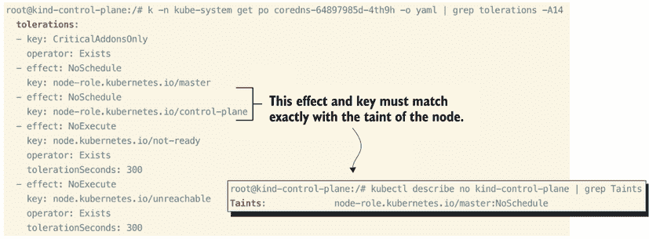

图 2.8 CoreDNS Pod 中污点设置与容忍的比较

正如我们在该 CoreDNS Pod 的 YAML 规范中看到的那样，在容忍列表中，键`node-role.kubernetes.io/master`和效果`NoSchedule`与我们的污点相匹配。这就是 CoreDNS Pod 能够调度到控制平面节点的原因。请记住，您的 CoreDNS Pod 将有一个不同的名称，因此您需要将`core-dns-64897985d-4th9h`替换为您的 CoreDNS Pod 的名称。如果您不知道 Pod 的名称，可以通过输入`kubectl get po -A`来获取名称。

正如我们所看到的，容忍度必须与键和效果完全匹配。如果稍有偏差，则 Pod 将不会被调度到目标节点。因此，正如你所想象的，为容忍度定义更宽松的规则使得在编写 YAML 时定义容忍度更容易。在图 2.8 中，你还可以注意到其他字段，如 `operator` 和 `tolerationSeconds`。如果未明确定义 `operator`，例如在控制平面污点的 `node-role` 容忍度中，它将默认为两个可能值 `Exists` 或 `Equal` 中的 `Equal`。因为 `node-role` 污点容忍度没有定义运算符，它默认为 `Equal`。

如果键和效果相同，并且运算符是相等的，则容忍度与污点匹配。如果有值，则容忍度与污点匹配，如果键、效果和值都完全匹配，并且运算符是 `Equal`。如果运算符是 `Exists`，则不应指定值，但键和效果必须匹配。参考图 2.8 的命令输出，效果 `NoExecute` 和键 `node.kubernetes.io/not-ready` 必须完全匹配，因为运算符是 `Exists`。`tolerationSeconds` 是一个可选参数，允许你指定 Pod 在添加污点后绑定到节点的持续时间，在这种情况下，300 秒。图 2.9 中有一个这样的例子，其中容忍度与节点的污点匹配；因此，它成功调度到该节点。

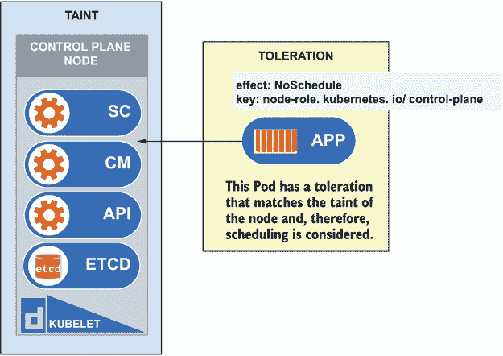

图 2.9 应用到 Pod 上的容忍度确保它可以调度到污点节点。

现在，让我们创建一个具有针对我们应用于 `kind-worker` 的污点的容忍度的 Pod。这个污点有 `NoSchedule` 的效果，`special-user` 的值，以及名为 `dedicated` 的键。这意味着我们必须使用默认运算符 `Equal` 匹配所有这些。让我们从使用命令 `k run pod-tolerate --image=nginx --dry-run=client -o yaml > pod-tolerate.yaml` 构建一个 Pod 模板开始：

```
root@kind-control-plane:/# k run pod-tolerate --image=nginx --dry-
➥ run=client -o yaml > pod-tolerate.yaml
root@kind-control-plane:/# cat pod-tolerate.yaml
apiVersion: v1
kind: Pod
metadata:
  creationTimestamp: null
  labels:
    run: pod-tolerate
  name: pod-tolerate
spec:
  containers:
  - image: nginx
    name: pod-tolerate
    resources: {}
  dnsPolicy: ClusterFirst
  restartPolicy: Always
status: {}
```

注意：我们使用 `dry-run` 标志构建这个 Pod 模板，并将命令的输出发送到文件，这比从头开始键入文件要容易得多。

让我们使用 Vim 文本编辑器通过命令 `vim pod-tolerate.yaml` 打开文件 `pod-tolerate.yaml`。我们可以添加所需的容忍度以匹配应用在我们工作节点上的污点。在命令 `kubectl describe no kind-worker | grep Taints` 的输出中，我们看到键是 `dedicated`，值是 `special-user`，效果是 `NoSchedule`。在文件仍然打开的情况下，与单词 `containers` 同行插入 `tolerations:`。紧接着，插入行 `- key: "dedicated"`，然后是 `value: "special-user"`，下一行是 `effect: "NoSchedule"`。你可以在图 2.10 中看到它应该是什么样子。

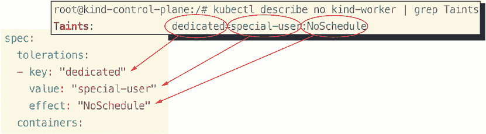

图 2.10 如何将容忍度应用于污点以有效地调度 Pod

一旦您将容忍度（toleration）添加到 Pod 的 `YAML` 清单中，您就可以保存并关闭文件。然后，您可以使用命令 `kubectl create -f pod-tolerate.yaml` 将 YAML 提交到 API 服务器，Pod 将在默认命名空间中创建。您可以使用命令 `kubectl get po -o wide` 查看 Pod 正在运行的节点：

```
root@kind-control-plane:/# kubectl create -f pod-tolerate.yaml
pod/pod-tolerate created
root@kind-control-plane:/# k get po -o wide
“[CA]”
NAME           READY   STATUS    RESTARTS   AGE   IP           
➥ NODE          NOMINATED NODE   READINESS GATES
pod-tolerate   1/1     Running   0          6s    10.244.2.6   
➥ kind-worker   <none>           <none>
```

从宽输出中，您会看到 Pod 正在 `kind-worker` 节点上运行，但它同样可以被调度到 `kind-worker2`，因为容忍度并没有明确选择调度器应该选择哪个节点。如果您在创建 Pod 时仍然遇到困难，您可以运行这个命令，该命令已经包含了完整的 YAML，然后您可以比较并查看您出错的地方。只需输入命令 `k apply -f https://raw.githubusercontent.com/chadmcrowell/k8s/main/manifests/pod-tolerate.yaml.` 即可。

接下来，我们将讨论您可以添加到 Pod `YAML` 中的节点选择器和节点名，这些选择器将对调度器做出明确的声明。节点选择器，正如其名所示，允许您根据节点标签选择一个节点，以便将 Pod 调度到该节点。默认情况下，许多标签都会应用到节点上。您可以通过执行命令 `k get no --show-labels` 来查看标签列表。标签不会改变节点的操作，但可以用来查询具有特定标签的节点，或者使用其标签调度 Pod 到该节点（我们将在本章的后续部分讨论）。标签也可以应用到 Pod 上。您可以使用命令 `k get po -n kube-system --show-labels` 在 `kube-system` 命名空间中查看 Pod 标签。输出将类似于图 2.11。

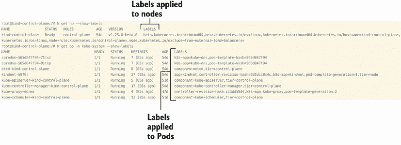

图 2.11 创建 Kubernetes 集群时默认应用到节点和 Pod 上的标签

节点名允许您通过主机名选择单个节点。让我们保留对节点的污点（taint）应用，这样我们可以一起工作，更好地可视化这些节点选择器在 Kubernetes 中的应用。

### 2.1.4 节点

kind 代表 *Kubernetes in Docker*。kind 在 Docker 容器内创建集群的 Kubernetes 节点。如图 2.12 所示，容器存在于 Pod 内，Pod 又存在于节点内，在这种情况下（使用 kind），节点本身也是一个容器，由 Docker 中的 Kubernetes 集群组成。

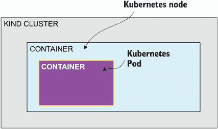

图 2.12 Kind 集群架构，节点作为容器在我们的本地系统上运行

让我们先查看 kind 为我们创建的 Docker 容器。您可以使用命令 `docker container ls` 查看 Docker 容器，您的输出将与此完全相同，但容器 ID 不同：

```
$ docker container ls
➥ CONTAINER ID   IMAGE                  COMMAND       CREATED   
➥ STATUS        PORTS                       NAMES
c23f3ab00ba3   kindest/node:v1.21.1   "/usr/lo..."   4 days ago  Up 25 hours
➥   127.0.0.1:59546->6443/tcp   kind-control-plane
```

容器名称是 `kind-control-plane`，您可能已经猜到它由控制平面组件组成。那么工作节点呢？嗯，因为我们使用这个集群进行测试（为了简单起见），我们将控制平面和工作组件组合在同一个节点上，但在所有其他生产场景中，这些将是两个或更多单独的节点。为了防止走题并保持简单，让我们继续。我们将在本章的后面部分构建一些多节点集群，因为它们将包含在 CKA 考试中。您还可以使用 `kubectl` 工具通过 `kubectl get nodes` 命令查看 Kubernetes 集群中的节点，如下所示：

```
$ kubectl get no
NAME                 STATUS   ROLES                  AGE     VERSION
kind-control-plane   Ready    control-plane,master   4d23h   v1.21.1
```

如您在表 2.1 中所见，我们可以在 Kubernetes 中使用缩写来指定某些资源，这对于考试来说很有用，因为它可以节省很多按键。此外，在表 2.1 中，您还可以看到用于指定不同 Kubernetes 资源的其他缩写或缩写。

表 2.1 Kubernetes 资源缩写及其与 `kubectl` 的使用示例

| 资源 | 缩写 | 示例 |
| --- | --- | --- |
| 命名空间 | `ns` | `k get ns` |
| Pod | `po` | `k get po` |
| 部署 | `deploy` | `k get deploy` |
| ReplicaSet | `rs` | `k get rs` |
| 服务 | `svc` | `k get svc` |
| 服务账户 | `sa` | `k get sa` |
| 配置映射 | `cm` | `k get cm` |
| DaemonSet | `ds` | `k get ds` |
| 持久卷 | `pv` | `k get pvc` |
| 持久卷声明 | `pvc` | `k get pvc` |
| 存储类 | `sc` | `k get sc` |
| 网络策略 | `netpol` | `k get netpol` |
| 入口 | `ing` | `k get ing` |
| 端点 | `ep` | `k get ep` |

您也可以通过输入 `kubectl get no -o wide` 来看到，在我们的 kind Kubernetes 集群中实际上使用的是 containerd 而不是 `dockershim`。`-o wide` 是从 `get` 命令检索详细输出的方式。我们将在本书的其余部分进一步探讨这一点。

```
$ kubectl get no -o wide
NAME                 STATUS   ROLES                  AGE     VERSION   
➥ INTERNAL-IP   EXTERNAL-IP   OS-IMAGE       KERNEL-VERSION     
➥ CONTAINER-RUNTIME
kind-control-plane   Ready    control-plane,master   3d23h   v1.21.1   
➥ 172.18.0.2    <none>        Ubuntu 21.04   5.10.76-linuxkit   
➥ containerd://1.5.2
```

回到我们的单节点集群，现在让我们在容器内部获取一个 shell，这样我们就可以查看其内部情况。我们可以通过在终端中输入 `docker exec -it kind-control-plane bash` 来做到这一点，我们会看到这个确切输出，这意味着您正在 `kind-control-plane` 容器内部以 root 身份操作：

```
$ docker exec -it kind-control-plane bash
root@kind-control-plane:/#
```

从现在开始，我们将在容器内部执行命令（在 `root@kind-control-plane:/#` 之后），因为 `kubectl` 已经预安装，我们可以查看有关我们集群的更多信息。例如，我们可以使用 `crictl` 工具列出控制平面组件作为容器。`crictl` 工具是另一种用于检查和调试与 CRI（容器运行时接口）兼容的容器的命令行实用程序。CRI 是容器运行时构建的标准，并为 kubelet 提供了一个与容器运行时交互的一致接口，无论是 Docker、containerd 还是任何其他符合 CRI 标准的容器运行时。使用 `crictl ps` 命令，您可以列出在 `kind-control-plane` 容器内部运行的容器：

```
root@kind-control-plane:/# crictl ps
CONTAINER           IMAGE               CREATED             STATE
➥                NAME                      ATTEMPT             POD ID
1fec85d809fc4       e422121c9c5f9       26 hours ago        Running
➥              local-path-provisioner    2                   6be3b31e9b9eb
1b8372af65cf2       296a6d5035e2d       26 hours ago        Running
➥              coredns                   1                   0821c481585d6
85c7a1f4305f0       6de166512aa22       26 hours ago        Running
➥              kindnet-cni               1                   f7a5090363d9b
fe14d75b82341       296a6d5035e2d       26 hours ago        Running
➥              coredns                   1                   4ee287bd9f248
76ab2ca16da9d       0e124fb3c695b       26 hours ago        Running
➥              kube-proxy                1                   e40195d6d1bed
4198ed634fc67       1248d2d503d37       26 hours ago        Running
➥              kube-scheduler            1                   c2aaffa11479c
5aac336ec4338       0369cf4303ffd       26 hours ago        Running 
➥             etcd                      1                   09c5891be5560
80a672211961d       96a295389d472       26 hours ago        Running
➥              kube-controller-manager   1                   764b1292d728e
a67abd31ab1ae       94ffe308aeff9       26 hours ago        Running
➥              kube-apiserver            1                   1865042cc7955
```

`local-path-provisioner` 用于我们集群的持久存储，`coredns` 用于我们集群中名称解析到 IP 地址（DNS），而 `kindnet-cni` 用于我们集群中的 Pod 到 Pod 通信。Pod 是 Kubernetes 中最小的可部署单元，可以包含一个或多个容器。我们将在未来的章节中看到 Pods 可以独立运行，也可以作为 Deployment、ReplicaSet 和 StatefulSet 的一部分运行。

现在，让我们谈谈存在于工作节点上的组件。这些组件对于集群中的每个节点都是相同的，无论您只有一个工作节点还是有成千上万个工作节点。它们都包含 kubelet、kube-proxy 和容器运行时。让我们使用命令 `kubectl get po -o wide -A | grep worker` 查看我们集群中工作节点上运行的 kube-proxy Pods：

```
root@kind-control-plane:/# kubectl get po -o wide -A | grep worker
kube-system          kindnet-fs6jt                                1/1     
➥ Running   0             22h   172.18.0.2   kind-worker
kube-system          kube-proxy-szr7n                             1/1     
➥ Running   0             22h   172.18.0.2   kind-worker
```

kube-proxy 创建我们的 iptables 规则，并确保当创建服务时，我们可以访问与该服务关联的 Pods，正如之前在控制平面节点上关于 kube-proxy 的讨论中提到的。我们看到的与 kube-proxy Pods 并列的 kindnet Pods 是用于 CNI 的，但同样，它被视为插件，而不是核心 Kubernetes 的一部分。

接下来，让我们看一下每个节点上安装的容器运行时。为此，我们将运行命令 `kubectl get no -o wide | grep containerd`：

```
root@kind-control-plane:/# kubectl get no -o wide | grep containerd
kind-control-plane  Ready  22h  v1.26.3  172.18.0.3  Ubuntu 22.04.1 LTS 
➥ 5.15.49-linuxkit  containerd://1.6.7
kind-worker  Ready  22h  v1.25.0  172.18.0.2  Ubuntu 22.04.1 LTS  5.15.49-
➥ linuxkit  containerd://1.6.7
```

如我们在输出结果的最后一列中看到的，containerd 是用于我们节点的容器运行时。Containerd 是一个轻量级的 Linux 守护进程，它利用 cgroups 和命名空间来运行 Kubernetes 中运行的 Pods 内部的容器。

最后，我们将查看 kubelet。因为 kubelet 是在节点上运行的 systemd 服务，而且因为我们的节点实际上是容器，所以我们需要进入我们的工作节点容器。首先输入 `exit` 退出控制平面 shell。现在，您可以使用命令 `docker exec -it kind-worker bash` 获取到工作节点的 shell。现在，通过运行命令 `systemctl status kubelet` 如此查看服务的状态：

```
$ docker exec -it kind-worker bash
root@kind-worker:/# systemctl status kubelet
● kubelet.service - kubelet: The Kubernetes Node Agent
     Loaded: loaded (/etc/systemd/system/kubelet.service; enabled; vendor 
➥ preset: enabled)
    Drop-In: /etc/systemd/system/kubelet.service.d
             └─10-kubeadm.conf
     Active: active (running) since Thu 2022-03-03 15:34:52 UTC; 5h 17min 
➥ ago
       Docs: http://kubernetes.io/docs/
    Process: 170 ExecStartPre=/bin/sh -euc if [ -f 
➥ /sys/fs/cgroup/cgroup.controllers ]; then create-kubelet-cgroup-v2; fi 
➥  (code=exited, status=0/SUCCESS)
   Main PID: 176 (kubelet)
      Tasks: 19 (limit: 2246)
     Memory: 38.0M
        CPU: 5min 39.923s
     CGroup: /system.slice/kubelet.service
             └─176 /usr/bin/kubelet --bootstrap-
➥ kubeconfig=/etc/kubernetes/bootstrap-kubelet.conf -
➥ kubeconfig=/etc/kubernetes/kubelet.conf 
➥ config=/var/lib/kubelet/config.yaml --container-runtime=remote -
➥ container-runtime-endpoint=unix:///run/containerd/containerd.sock -
➥ fail-swap-on=false --node-ip=172.18.0.2 --node-labels= --pod-infra-
➥ container-image=k8s.gcr.io/pause:3.4.1 --provider-
➥ id=kind://docker/kind/kind-worker --fail-swap-on=false --cgroup-
➥ root=/kubelet
Mar 03 20:04:49 kind-worker kubelet[176]: W0303 20:04:49.309978     176 
➥ sysinfo.go:203] Nodes topology is not available, providing CPU topology
Mar 03 20:09:49 kind-worker kubelet[176]: W0303 20:09:49.100474     176 
➥ sysinfo.go:203] Nodes topology is not available, providing CPU topology
```

如您所见，systemd 服务处于活动状态并正在运行，这是好事。考试中可能会有一个问题需要您记住如何检查 kubelet 服务是否正在运行。记住，如果 kubelet 没有运行，您的节点状态将显示为 `NotReady`。您甚至可以通过运行命令 `systemctl stop kubelet`，退出容器 shell，然后运行命令 `kubectl get no` 来测试这一点。试试看吧！

```
root@kind-worker:~# systemctl stop kubelet
root@kind-worker:~# exit
$ kubectl get no
NAME                 STATUS     ROLES                  AGE     VERSION
kind-control-plane   Ready      control-plane,master   5h27m   v1.21.1
kind-worker          NotReady   <none>                 5h27m   v1.21.1
kind-worker2         Ready      <none>                 5h27m   v1.21.1
```

注意：kubelet 服务未运行的消息返回到 API 服务器可能需要几秒钟，所以如果节点没有立即显示 `NotReady`，请不要担心。

要重新启动 kubelet 服务，只需再次在工作节点内部获取一个 shell，然后运行命令 `systemctl start kubelet`：

```
$ docker exec -it kind-worker bash
root@kind-worker:/# systemctl start kubelet
root@kind-worker:/#
```

我们将在第八章中更详细地讨论服务故障排除，但我实在忍不住想向您展示这个确定 Kubernetes 集群中 kubelet 服务是否未启动的宝贵工具。在接下来的这一节中，我们将使用`exit`命令退出`kind-worker` shell。

## 2.2 数据存储 etcd

数据存储 etcd 包含我们集群的所有配置数据，这意味着有关我们集群中运行了多少 Pod 或 Deployment 的信息（包括历史信息），以及哪些端口在哪些服务上暴露。如果您没有这些数据，您在从头开始重新创建 Kubernetes 资源时会感到迷茫。为了明确，我们不是在谈论与您的应用程序相关的数据。我们谈论的是 Kubernetes 集群本身的配置。这如图 2.13 所示，其中 etcd 数据存储在 Kubernetes 集群中的一个 Pod 内部，包含集群配置数据。

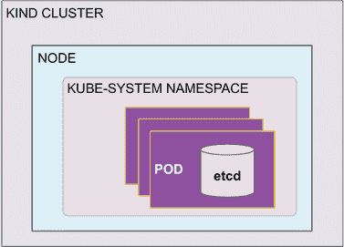

图 2.13 Etcd 作为 Pod 存在于`kube-system`命名空间中。

### 2.2.1 使用 etcdctl

CKA 考试将测试您备份和恢复 etcd 数据库的知识。幸运的是，考试终端中预装了一个名为`etcdctl`的工具，您可以使用它执行这两个操作。在考试当天了解这一点将非常有价值，因为您将因正确回答与 etcd 相关的问题而获得奖励，这将帮助您达到及格分数。一个考试问题可能看起来像以下这样。

| 实考任务 集群 k8s 配置错误，需要从位于`/tmp/c02dkjs0-001.db`的备份中恢复。执行恢复并验证 DaemonSet kube-proxy 是否已恢复到集群中。 |
| --- |

首先，我们将使用命令`docker exec -it kind-control-plane bash`获取到控制平面节点的 shell。为了完成这个任务，我们首先必须使用名为`etcdctl`的 etcd 命令行工具备份 etcd。我们可以使用命令`apt update; apt install -y etcd-client`安装`etcdctl`。

注意：考试中`etcdctl`客户端将为您可用，因此您不需要在考试期间知道如何安装它。

一旦我们安装了`etcdctl`，我们需要将其设置为版本 3。我们可以通过命令`export ETCDCTL_API=3`来完成，这创建了一个名为`ETCDCTL_API`的环境变量，并将其设置为值`3`。现在`etcdctl`工具已设置为正确的版本，因此该命令将可用于执行备份。运行命令`etcdctl -v`以检索`etcdctl`的版本，它现在应设置为版本 3：

```
root@kind-control-plane:/# etcdctl -v
etcdctl version: 3.3.25
API version: 2
```

现在我们已经设置了版本，运行以下命令以对 etcd 数据存储执行快照备份：`etcdctl snapshot save snapshotdb --cacert /etc/kubernetes/pki/etcd/ca.crt --cert /etc/kubernetes/pki/etcd/server.crt --key /etc/kubernetes/pki/etcd/server.key`。运行`ls | grep snapshotdb`以列出当前目录中的快照：

```
root@kind-control-plane:/# etcdctl snapshot save snapshotdb --cacert 
➥ /etc/kubernetes/pki/etcd/ca.crt --cert 
➥ /etc/kubernetes/pki/etcd/server.crt --key 
➥ /etc/kubernetes/pki/etcd/server.key
2022-03-02 03:49:00.578988 I | clientv3: opened snapshot stream; downloading
2022-03-02 03:49:00.616108 I | clientv3: completed snapshot read; closing
Snapshot saved at snapshotdb
root@kind-control-plane:/# ls | grep snapshotdb
snapshotdb
```

现在，我们可以使用命令 `etcdctl snapshot status snapshotdb --write-out=table` 来检查那个快照文件中是否有任何数据：

```
root@kind-control-plane:/# etcdctl snapshot status snapshotdb --write-
➥ out=table+----------+----------+------------+------------+
|   HASH   | REVISION | TOTAL KEYS | TOTAL SIZE |
+----------+----------+------------+------------+
| dac82c4e |   893315 |       1217 |     2.1 MB |
+----------+----------+------------+------------+
```

让我们继续进行 etcd 的恢复操作。为了模拟恢复过程，我们需要删除为我们的 kube-proxy 服务创建的 DaemonSet，这样我们就可以在恢复后验证我们的恢复操作是否成功。要删除 DaemonSet，请执行以下命令

```
kubectl delete ds kube-proxy -n kube-system
$ kubectl delete ds kube-proxy -n kube-system
daemonset.apps "kube-proxy" deleted
```

如果我们在 `kube-system` 命名空间中查看 DaemonSet，我们会注意到只有一个 kindnet DaemonSet，而 kube-proxy DaemonSet 已经不再存在：

```
$ kubectl get ds -A
NAMESPACE     NAME      DESIRED   CURRENT   READY   UP-TO-DATE   
➥ AVAILABLE   NODE SELECTOR   AGE
kube-system   kindnet   1         1         1       1            
➥ 1           <none>          6d20h
```

考试技巧：命令末尾的 `-A` 是 `--all-namespaces` 的缩写。这对于 CKA 考试来说是一个节省时间的真实技巧。

现在我们已经修改了集群状态，并且我们 etcd 数据存储中的键与我们备份的不同，我们可以执行恢复操作。为此，我们将使用命令 `etcdctl snapshot restore snapshotdb --data-dir /var/lib/etcd-restore`：

```
root@kind-control-plane:/# etcdctl snapshot restore snapshotdb --data-dir 
➥ /var/lib/etcd-restore
2022-03-02 16:01:03.198967 I | mvcc: restore compact to 914490
2022-03-02 16:01:03.207022 I | etcdserver/membership: added member 
➥ 8e9e05c52164694d [http://localhost:2380] to cluster cdf818194e3a8c32
```

我们使用 `--data-dir` 参数指定了一个集群可以读取的格式，并将我们的备份移动到 Kubernetes 已经使用的目录。现在我们已经为 Kubernetes 准备了快照并将其存储在 `/var/lib/etcd-restore` 目录中，我们将继续更改 Kubernetes 查找 etcd 数据的位置。这可以在 API 服务器 YAML 规范中更改，它始终位于 `/etc/kubernetes/manifests` 目录中的控制平面节点上。您放置在该目录中的任何 YAML 文件都将自动调度 Kubernetes 资源。

`kind-control-plane` 上没有安装 Vim，所以我们将运行命令 `apt install update; apt install vim` 来安装它并编辑我们的文件。使用命令 `vim /etc/kubernetes/manifests/etcd.yaml` 打开文件。滚动到文件底部，并将卷的路径从 `/var/lib/etcd` 更改为 `/var/lib/etcd-restore`（确保按 I 键进入插入模式）。以下是该文件的片段，以便您可以检查您的操作：

```
  volumes:
  - hostPath:
      path: /etc/kubernetes/pki/etcd
      type: DirectoryOrCreate
    name: etcd-certs
  - hostPath:
      path: /var/lib/etcd-restore
      type: DirectoryOrCreate
    name: etcd-data
status: {} 
```

注意：要退出 Vim，您需要在键盘上按 Esc 键，然后按冒号（`:`）和字母 `w` 以写入，按字母 `q` 以退出（`:wq`）。

完成恢复所需的所有操作就这些了！从 API 服务器获取您新集群数据的响应可能需要几秒钟，但不久之后，您将能够运行 `kubectl get ds -A` 并看到 kube-proxy 和 kindnet DaemonSet 都回到了它们应该的位置。恭喜，您已成功备份并恢复了 etcd！

### 2.2.2 客户端和服务器证书

在上一节中，我们讨论了 etcd 需要通过认证到集群。这种客户端和服务器之间的认证方法称为 PKI（公钥基础设施）。PKI 是 Kubernetes 强加的客户端-服务器模型，使用证书认证所有进入 API 的请求。`kubectl`也使用证书来认证到 Kubernetes API，我们将其称为 kubeconfig。然而，`kubectl`并不是唯一试图访问 API 的工具或对象。除了`kubectl`之外，控制器管理器、调度器和 kubelet 都需要使用证书来认证到 API。这些证书都是由引导过程（通过 kubeadm）生成的。您不需要管理这些证书，但了解它们的位置对于 CKA 考试是有好处的。在图 2.14 中，您将看到 Kubernetes 集群中每个组件使用的每个客户端或服务器证书的视觉表示。让我们运行命令`ls /etc/kubernetes`来列出该目录的内容，并查看 kubelet、调度器和控制器管理器的客户端证书：

```
root@kind-control-plane:/# ls /etc/kubernetes
admin.conf  controller-manager.conf  kubelet.conf  manifests  pki  scheduler.conf
```


图 2.14 Kubernetes 中客户端和服务器证书的放置

注意：您仍然需要一个到`kind-control-plane`的 shell。如果您忘记了，这里有一个命令：`docker exec -it kind-control-plane bash`。

您将看到`controller-manager.conf, kubelet.conf`和`scheduler.conf`，这些是用于认证到 Kubernetes API 的 kubeconfig 的代表性配置。例如，如果您查看`kubelet.conf`的内容，您将看到一个类似于您的`kubectl` kubeconfig（位于`~/.kube/config`）的配置。输入命令`cat /etc/kubernetes/kubelet.conf`：

```
root@kind-control-plane:/# cat /etc/kubernetes/kubelet.conf
apiVersion: v1
clusters:
- cluster:
    certificate-authority-data: 
➥ LS0tLS1CRUdJTiBDRVJUSUZJQ0FURS0tLS0tCk1JSUM1ekNDQWMrZ0F3SUJBZ00FURS0tLS
➥ 0tCg==
    server: https://kind-control-plane:6443
  name: kind
contexts:
- context:
    cluster: kind
    user: system:node:kind-control-plane
  name: system:node:kind-control-plane@kind
current-context: system:node:kind-control-plane@kind
kind: Config
preferences: {}
users:
- name: system:node:kind-control-plane
  user:
    client-certificate: /var/lib/kubelet/pki/kubelet-client-current.pem
    client-key: /var/lib/kubelet/pki/kubelet-client-current.pem
```

注意用户是系统用户，客户端证书位于节点上的`/var/lib/kubelet/pki/kubelet-client-current.pem`。在 Kubernetes 中，所有节点都会运行 kubelet 服务，所以情况对所有节点都是如此。

您可能已经注意到了`/etc/kubernetes`中的`pki`目录，如果您列出该目录的内容，您将找到更多的客户端和服务器证书。让我们使用命令`ls /etc/kubernetes/pki`来查看：

```
root@kind-control-plane:/# ls /etc/kubernetes/pki
apiserver-etcd-client.crt  apiserver-kubelet-client.crt  apiserver.crt  
➥ ca.crt  etcd                front-proxy-ca.key      front-proxy-
➥ client.key  sa.pub
apiserver-etcd-client.key  apiserver-kubelet-client.key  apiserver.key  
➥ ca.key  front-proxy-ca.crt  front-proxy-client.crt  sa.key
```

在这个`pki`目录中，您将看到另一个 kubelet 证书（`kubelet.crt`），这是一个服务器证书。是的，在 Kubernetes 中，您可以为同一个服务拥有客户端和服务器证书。这一点在名为`apiserver.crt`和`apiserver-etcd-client.crt`的两个文件中也很明显，分别代表服务器和客户端证书。由于 kubelet 有一个服务器证书，它必须有一个客户端证书，这个证书就是名为`apiserver-kubelet-client.crt`的文件。`apiserver.crt`是客户端证书，正如我们刚才在`/etc/kubernetes`目录中看到的，它是服务器证书。

最后，还有 etcd。在`/etc/kubernetes/pki/etcd`目录中，你还会看到一个`server.crt`文件，它属于 etcd 的服务器证书。API 服务器不断尝试验证到 etcd 数据存储并获取集群配置数据。这样，不是任何人都可以查看或修改集群状态。

## 2.3 练习

1.  通过缩短`kubectl`命令并创建到`k`的 shell 别名来提高使用`kubectl`命令的效率。

1.  使用`kubectl` CLI 工具，获取在`kube-system`命名空间中运行的 Pod 的输出并显示 Pod IP 地址。将命令的输出保存到名为`pod-ip-output.txt`的文件中。

1.  使用 CLI 工具，该工具允许你查看 kubelet 用于向 Kubernetes API 进行身份验证的客户端证书。将结果输出到名为`kubelet-config.txt`的文件中。

1.  使用`etcdctl` CLI 工具，将 etcd 数据存储备份到名为`etcdbackup1`的快照文件中。一旦备份完成，将命令`etcdctl snapshot status etcdbackup1`的输出发送到名为`snapshot-status.txt`的文件中。

1.  使用`etcdctl` CLI 工具，使用之前练习中相同的`etcdbackup1`文件恢复 etcd 数据存储。当你完成恢复操作后，使用`cat`命令查看 etcd YAML 并将其保存到名为`etcd-restore.yaml`的文件中。

1.  使用 kubeadm 升级控制平面组件。完成后，检查包括 kubelet 和`kubectl`在内的一切是否已升级到版本 1.24.0。

## 摘要

+   引导过程隐藏了创建 Kubernetes 集群的复杂性，如 PKI 和 etcd 创建、生成 kubeconfig 等。

+   kubeconfig 是在引导过程中由 kubeadm 创建的，是我们使用`kubectl`与 API 进行身份验证的方式。此文件位于`~/.kube/config`目录中。

+   服务是 Kubernetes 对象，根据 Pod 标签提供对一个或多个 Pod 的负载均衡。服务拥有自己的唯一 IP 地址和 DNS 名称，通过这些名称可以访问 Pod。

+   目录`/etc/kubernetes/pki`中的客户端和服务器证书允许控制平面和工作节点对 API 进行身份验证。多个 Kubernetes 组件都可以有客户端和服务器证书。

+   Etcd 是一个键值数据存储，包含集群配置，包括存在多少对象。要备份 etcd，使用命令`etcdctl snapshot save`，要从快照恢复，使用命令`etcdctl snapshot restore`。

+   目录`/etc/kubernetes/manifests`包含 API 服务器、控制器管理器、调度器和 etcd 的 YAML 文件。这些文件不会被调度器检测；因此，kubelet 将自动获取并创建此目录中的内容。

+   在多节点集群中，工作节点运行 kubelet、kube-proxy 和容器运行时，而控制平面也运行 kubelet、控制器管理器、调度器和 etcd。为了防止应用 Pod 在控制平面运行，在引导过程中应用了一个污点（taint）。
