# 3 身份和访问管理

本章涵盖了

+   RBAC 基础

+   创建角色和角色绑定

+   使用证书创建用户和组

+   使用角色创建服务账户

+   将服务账户挂载到 Pod 上

在本章中，我们将重点关注基于角色的访问控制，这是考试课程中集群架构、安装和配置部分的内容。既然你已经了解了 Kubernetes API 的工作原理，那么了解如何对用户和/或服务账户进行身份验证和授权对于考试至关重要。

集群架构、安装和配置领域

本章涵盖了 CKA 课程中集群架构、安装和配置领域的一部分。该领域涵盖了 Kubernetes 集群由什么组成以及我们如何配置集群的不同方面。它包括以下能力。

| 能力 | 章节部分 |
| --- | --- |
| 管理基于角色的访问控制 (RBAC)。 | 3.1, 3.2 |
| 管理高可用性 Kubernetes 集群。 | 3.3 |

## 3.1 基于角色的访问控制

要访问 Kubernetes 集群内的资源，你必须首先进行身份验证。如果你还记得第二章，我们使用了 `kubectl` 工具与 Kubernetes API 进行交互。我们之所以能够这样做，是因为我们有一个携带令牌的客户证书，如图 3.1 所示。这被称为基于角色的访问控制（RBAC），因为根据我们在 Kubernetes 中的角色，我们能够列出 `kube-system` 命名空间中运行的 Pod。我们可以以不同的方式控制这些操作，如果需要，可以阻止它们。Kubernetes 内置的身份验证和授权系统使我们能够控制特定用户或机器对 Kubernetes 集群的访问。我们将在本章的后续部分进一步讨论这个问题。

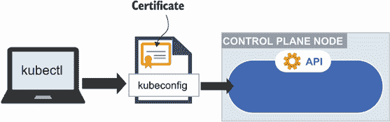

图 3.1 使用证书和令牌访问 Kubernetes API

就此而言，你可以通过使用 curl 并传递证书来查看 Kubernetes 中它们 API 组内的资源。在接下来的段落中，我们的 Pod 和 Deployment 在 API 中的位置分别在 `/core` 和 `/apps` 组中。从使用 kubeadm 构建的 Kubernetes 集群中，你可以使用以下命令以相同的方式访问这些资源，假设控制平面的地址是 `10.0.0.4`，可以使用命令 `kubectl config view` 和/或 `kubectl cluster-info` 获取：

```
kubectl create role pod-deploy-reader --verb=get --verb=list --verb=watch -
➥ -resource=pods,deployments

kubectl create rolebinding pod-deploy-reader-binding --role=pod-deploy-
➥ reader --serviceaccount=default:default

TOKEN=$(kubectl get secret -n default -o json | jq -r 
➥ '(.items[].data.token)' | base64 --decode | tr -d "\n")

curl -X GET https://10.0.0.4:6443/api/v1/namespaces/default/pods --header 
➥ "Authorization: Bearer $TOKEN" --cacert /etc/kubernetes/pki/ca.crt

curl -X GET 
➥ https://10.0.0.4:6443/apis/apps/v1/namespaces/default/deployments --
➥ header "Authorization: Bearer $TOKEN" --cacert /etc/kubernetes/pki/ca.crt
```

你可以通过不同的方式通过身份验证插件进行身份验证。其中一些插件是 Kubernetes 自带的，这就是为什么我们不需要单独安装它们。我们与 `kubectl` 一起使用的内置插件称为证书插件。还有许多其他身份验证插件是身份验证的来源。以下是一些常见的插件，如图 3.2 所示：

+   静态令牌文件（例如，CSV 文件）

+   第三方身份服务（AWS IAM）

+   基本 HTTP 身份验证（令牌通过 HTTP 头部传递）

在启动 API 服务器时可以启用更多插件。

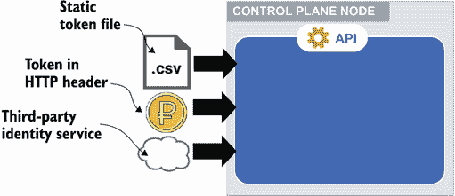


当你向 Kubernetes API 发起请求时，所有插件都会分析这个请求并尝试确定它们是否可以按顺序读取它。第一个能够翻译请求含义的插件处理身份验证。这涉及到确定请求是否来自人类或机器。如果请求来自人类——例如当我们使用 `kubectl` 时——则用户将以特定的用户名进行身份验证，并且该名称将用于后续步骤。如果请求来自机器，它必须有一个服务账户，并且其凭证必须以秘密的形式存储在 Kubernetes 中。

服务账户和秘密都是 Kubernetes 资源，而用户不是。服务账户是运行在 Pod 内部的进程的身份，提供了一种在集群中代表 Pod 进行身份验证和执行操作的方法。这允许其他访问管理系统通过 LDAP（轻量级目录访问协议）或 AD（活动目录）通过单点登录（SSO）轻松地与 Kubernetes 集成进行身份验证。

服务账户是 Kubernetes 资源；因此，Kubernetes 会管理它以及其他资源，如 Pods、Deployments 和持久卷。服务账户通常与在集群中运行的 Pods 关联，允许 Pod 内部运行的应用程序（作为容器）访问 Kubernetes API 并发起请求。如图 3.3 所示，通过服务账户将令牌挂载到每个 Pod 上。你可以禁用此功能，因为在大多数情况下，你不需要你的 Pods 与 API 通信。我们将在本章后面通过一个在 Pod 中挂载服务账户并防止服务账户挂载到 Pod 的示例进行说明。

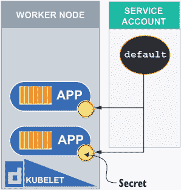


在身份验证阶段之后，请求会被传递到授权插件。RBAC 被视为身份验证插件之一，但还有其他插件，如节点授权插件和 WebHook 授权插件。为了 CKA 考试的目的，我们将专注于 RBAC，如图 3.4 所示。RBAC 通过最小权限原则阻止未经授权的用户通过查看或修改集群状态。该原则指出，管理员可以允许对 Kubernetes 中单个主题进行明确的访问，但不会向任何其他主题提供额外的权限（例如，查看 Pods 的权限，但不允许删除它们）。

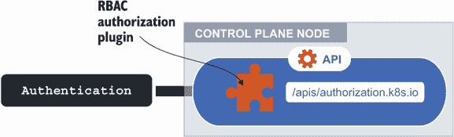


在我们的 kind 集群中，授权模式在引导过程中被设置为 RBAC 以及 Kubernetes API 服务器上的节点授权。我们可以在`kind-control-plane`容器中的`/etc/kubernetes/manifests`目录中查看此设置。您将在`spec`下看到它，在容器命令列表中，作为`--authorization-mode=Node,RBAC`。让我们使用命令`cat /etc/kubernetes/manifests/kube-apiserver.yaml | more`获取该文件的正文并将其通过`more`命令查看：

```
root@kind-control-plane:/# cat /etc/kubernetes/manifests/kube-
➥ apiserver.yaml | more
apiVersion: v1
kind: Pod
metadata:
  annotations:
    kubeadm.kubernetes.io/kube-apiserver.advertise-address.endpoint: 
➥ 172.18.0.4:6443
  creationTimestamp: null
  labels:
    component: kube-apiserver
    tier: control-plane
  name: kube-apiserver
  namespace: kube-system
spec:
  containers:
  - command:
    - kube-apiserver
    - --advertise-address=172.18.0.4
    - --allow-privileged=true
    - --authorization-mode=Node,RBAC
    - --client-ca-file=/etc/kubernetes/pki/ca.crt
    - --enable-admission-plugins=NodeRestriction
    - --enable-bootstrap-token-auth=true
    - --etcd-cafile=/etc/kubernetes/pki/etcd/ca.crt
    - --etcd-certfile=/etc/kubernetes/pki/apiserver-etcd-client.crt
    - --etcd-keyfile=/etc/kubernetes/pki/apiserver-etcd-client.key
    - --etcd-servers=https://127.0.0.1:2379
    - --insecure-port=0
    - --kubelet-client-certificate=/etc/kubernetes/pki/apiserver-kubelet-
➥ client.crt
    - --kubelet-client-key=/etc/kubernetes/pki/apiserver-kubelet-client.key
    - --kubelet-preferred-address-types=InternalIP,ExternalIP,Hostname
    - --proxy-client-cert-file=/etc/kubernetes/pki/front-proxy-client.crt
    - --proxy-client-key-file=/etc/kubernetes/pki/front-proxy-client.key
    - --requestheader-allowed-names=front-proxy-client
    - --requestheader-client-ca-file=/etc/kubernetes/pki/front-proxy-ca.crt
    - --requestheader-extra-headers-prefix=X-Remote-Extra-
    - --requestheader-group-headers=X-Remote-Group
    - --requestheader-username-headers=X-Remote-User
    - --runtime-config=
--More--
```

我们本可以用文本编辑器打开这个文件，但我们还是使用了`cat`命令。这个 YAML 清单非常重要，因为它包含了 Kubernetes 集群中许多组件的集群配置，例如广告地址、特权模式，以及 etcd 和 kubelet 的所有证书和密钥。

考试技巧：记住控制平面组件的清单位于`/etc/Kubernetes/manifests`目录中。此目录将位于控制平面服务器上，您需要通过 SSH 连接到该服务器以查看或修改。在考试中，SSH 密钥是共享的；因此，您只需键入`ssh control-plane-node`即可获得控制平面节点的 shell。

当 RBAC 授权插件收到请求时，它会确定用户或组可以执行哪些操作。是的，组也被纳入了 RBAC，这意味着在 Kubernetes 中，一组用户被分配了相同的权限级别。我们将在本章后面讨论创建用户和组。

### 3.1.1 角色和角色绑定

那么，RBAC 是如何知道允许执行哪些操作的？这由 Kubernetes 中的四种不同类型的对象确定：角色、集群角色、角色绑定和集群角色绑定，如图 3.5 所示。之前我们讨论了 Kubernetes 中命名空间范围资源。命名空间内资源的权限也需要限定在那个命名空间内。对于不是命名空间范围资源的情况，例如持久卷、节点或命名空间本身，也是如此。这些资源需要正确定义的集群角色（集群范围内）或角色（命名空间内）。

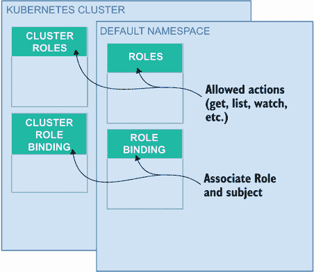

图 3.5 角色和角色绑定定义了命名空间中的权限，而集群角色和集群角色绑定定义了集群范围内的权限。

注意：记住哪种类型的用户将访问命名空间资源与集群资源是有帮助的。应用程序开发者通常会被分配角色，因为他们开发的应用程序存在于命名空间内。集群管理员通常会被分配集群角色，因为他们更新节点、创建卷以及其他在命名空间之外（集群范围内）的操作。

角色不仅限于命名空间，还限于 Kubernetes 中的特定资源（例如 Pod），并列出该角色中允许的具体操作。这些操作被称为 *请求动词*。它们类似于 API 请求，但由于资源可以有多个端点，请求动词针对特定的端点，并使用请求的 HTTP 方法的小写作为动词。因此，`get`、`list`、`create`、`update`、`patch`、`watch`、`delete` 和 `deletecollection` 都是 API 请求动词，允许你在资源上执行操作，如图 3.6 所示。

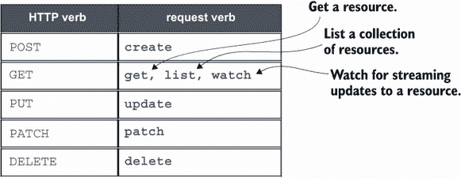

图 3.6 请求动词大致对应于 HTTP 动词，如图所示。

让我们通过输入命令 `kubectl create role pod-reader` `--verb=get,list,watch --resource=pods` 来查看一个示例，你会看到类似于图 3.7 的输出。我们刚刚使用命令 `kubectl get role pod-reader -o yaml` 创建的角色的 YAML 输出类似于图 3.8。

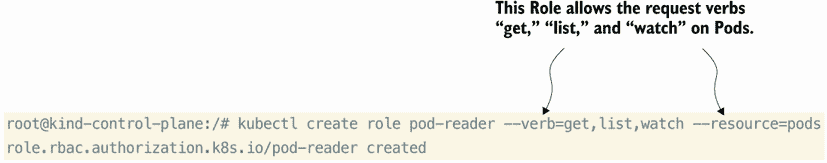

图 3.7 使用这个命令式命令创建一个角色并为资源分配请求动词。

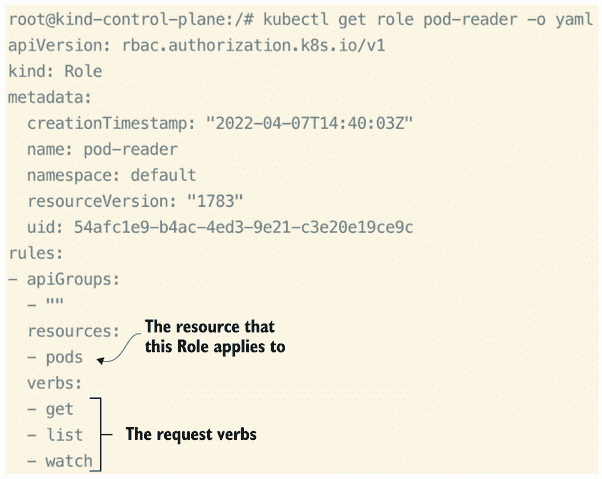

图 3.8 `kubectl get role` 命令显示了该角色适用于哪些资源以及该角色允许哪些操作。

我们不必立即创建角色，我们可以先进行“dry run”（模拟运行），并将内容保存到 YAML 文件中。如果你喜欢采用更声明性的方法，并将 YAML 文件保存在版本控制系统中的话，这会很有用。让我们运行相同的命令来创建一个角色，但这次我们将执行模拟运行，并将命令的输出保存到名为 `role.yaml` 的文件中。运行命令 `kubectl create role pod-reader` `-verb=get,list,watch -resource=pods -dry-run=client -o yaml > role.yaml`，你会看到文件已经创建，如图 3.9 所示。

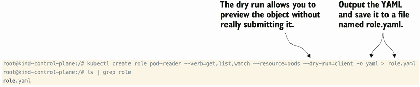

图 3.9 我们不是创建角色，而是执行模拟运行，然后将 YAML 内容保存到文件中。

在第一章中，我们探讨了所有的不同 Kubernetes API 资源。每个资源都有一个路径，路径的尽头指向对象。对于 Pod 来说，路径是 `/api/v1/pods`，因此 API 组位于 `/api/v1/` 内。Deployment 位于 API 组 `/apis/apps/v1`，在本角色的定义中单独列出，如图 3.10 所示。

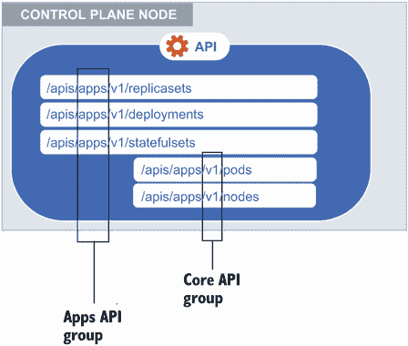

图 3.10 API 组用于在角色和集群角色中指定资源。

注意，这个角色根本不表示任何用户权限。这就是角色绑定发挥作用的地方。角色绑定会将一个角色绑定到用户、组或服务账户上，并为该用户、组或服务账户提供角色。现在让我们使用命令 `kubectl create rolebinding` `pod-reader-binding --role=pod-reader --user=carol.` 创建一个角色绑定。

我们的 `pod-reader-binding` 的 YAML 输出显示了角色引用（`roleRef`）和用户（`subjects`）。这个角色绑定就是用户 `carol` 将如何被授权访问我们的 Kubernetes 集群中的 Pod。

```
$ kubectl create rolebinding pod-reader-binding --role=pod-reader -
➥ user=carol
rolebinding.rbac.authorization.k8s.io/admin-binding created
$ kubectl get rolebinding pod-reader-binding -oyaml
apiVersion: rbac.authorization.k8s.io/v1
kind: RoleBinding
metadata:
  creationTimestamp: "2022-03-29T04:22:35Z"
  name: pod-reader-binding
  namespace: default
  resourceVersion: "566785"
  uid: 9f7d1036-9123-4288-94cf-ef527aa090d0
roleRef:
  apiGroup: rbac.authorization.k8s.io
  kind: Role
  name: pod-reader
subjects:
- apiGroup: rbac.authorization.k8s.io
  kind: User
  name: carol
```

`kubectl` 中内置了一个非常有用的工具，用于验证用户是否可以在不明确假定该用户身份的情况下在 Kubernetes 集群中执行某些操作。此命令是 `kubectl auth can-i`。如果您查看此命令的帮助页面，您将看到大量示例，您可以使用这些示例来测试作为用户、组或服务账户的授权：

```
$ kubectl auth can-i -h
Check whether an action is allowed.

VERB is a logical Kubernetes API verb like 'get', 'list', 'watch', 
➥ 'delete', etc. TYPE is a Kubernetes resource.

Shortcuts and groups will be resolved. NONRESOURCEURL is a partial URL that 
➥ starts with "/". NAME is the name of a
particular Kubernetes resource.

Examples:
  # Check to see if I can create pods in any namespace
  kubectl auth can-i create pods --all-namespaces

  # Check to see if I can list deployments in my current namespace
  kubectl auth can-i list deployments.apps

  # Check to see if I can do everything in my current namespace ("*" means 
➥ all)
  kubectl auth can-i '*' '*'

  # Check to see if I can get the job named "bar" in namespace "foo"
  kubectl auth can-i list jobs.batch/bar -n foo

  # Check to see if I can read pod logs
  kubectl auth can-i get pods --subresource=log

  # Check to see if I can access the URL /logs/
  kubectl auth can-i get /logs/

  # List all allowed actions in namespace "foo"
  kubectl auth can-i --list --namespace=foo
```

让我们使用命令 `kubectl auth can-i` 检查用户 `carol` 是否可以在我们的 Kubernetes 集群的默认命名空间中列出或删除 Pod。注意输出只说“是”或“否”。这是在 Kubernetes 中验证授权多么简单的方法！

```
$ kubectl auth can-i get pods -n default --as carol
yes
$ kubectl auth can-i delete pods -n default --as carol
no
```

考试技巧：我鼓励您在考试中使用 `kubectl auth can-i`，因为它将允许您验证您是否已成功完成任务，并节省宝贵的时间。

创建集群角色和集群角色绑定的方式相同，所以我们不会详细说明这一点。创建集群角色的 `kubectl` 命令是 `kubectl create clusterrole`，创建集群角色绑定的命令是 `kubectl create clusterrolebinding`。

考试技巧：使用 `-h` 标志获取运行您的命令的示例列表（例如，`kubectl create clusterrole -h`）。这将在考试中节省您的时间，因为您可以在不输入或记住整个命令的情况下复制示例。

当您需要访问不在命名空间范围内（例如，节点）的资源时，您也可以使用集群角色与角色绑定。您**不能**将集群角色绑定附加到角色上，因为命名空间内的权限（角色权限）不能应用于非命名空间范围的主体，正如我们在图 3.11 中看到的那样。您必须记住的一点是，通过集群角色授予的权限将影响所有命名空间，包括当前和未来的。您必须牢记最小权限原则，谨慎地不要分配一个或集群角色，这会给您的 Kubernetes 集群带来无限制的访问权限。

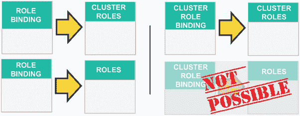

图 3.11 除了将集群角色绑定到角色之外，所有其他组合都受到支持。

### 3.1.2 系统角色和组

现在我们知道了用户、服务账户、角色和绑定用于什么，让我们看看内置的角色和组，以及到目前为止我们为我们的集群使用了哪些用户和组。API 服务器创建了一组默认的集群角色和集群角色绑定。它们由控制平面直接管理。当您运行命令 `kubectl get clusterrole | grep -v system` 时，您将看到它们是 `cluster-admin`、`admin`、`edit` 和 `view`：

```
root@kind-control-plane:/# kubectl get clusterrole | grep -v system
NAME                               CREATED AT
admin                              2022-03-25T17:44:03Z
cluster-admin                      2022-03-25T17:44:03Z
edit                               2022-03-25T17:44:03Z
kindnet                            2022-03-25T17:44:08Z
kubeadm:get-nodes                  2022-03-25T17:44:05Z
local-path-provisioner-role        2022-03-25T17:44:09Z
view                               2022-03-25T17:44:09Z
```

`cluster-admin` 集群角色旨在集群范围内使用，并允许对大多数对象进行读写访问，包括 Roles 和 Role bindings，但资源配额、Endpoints 或命名空间本身除外。编辑集群角色将不允许你修改 Roles 或 Role bindings；然而，它将允许你访问 Secrets 并在命名空间内使用任何 Service Accounts 运行 Pods。视图集群角色正如其名，允许你查看大多数命名空间对象，但 Secrets 除外，因为 Secrets 的内容包含 API 访问的凭证。

考试技巧 Kubernetes 允许通过 Role 或集群 Role 绑定将集群角色分配给多个用户/组/Service Accounts，因此，在考试中，创建一个 Role 绑定并将其分配给现有的 Role（即 `view`）可能会节省你的时间。

现在我们知道了所有默认创建的 Roles，那么我们假设哪个是 `kubectl` 的用户？为此，我们得更详细地谈谈组——更具体地说，是由 Kubernetes API 服务器管理的内置组。像用户一样，组在 Kubernetes 中不是一个受管理的资源，因此组名只是一个任意名称。然而，这些内置组是不同的。它们由 API 服务器管理，不能被修改。当 API 服务器启动时，它会与任何缺失的权限进行协调，并使用任何缺失的主题（即组）更新默认的集群 Role 绑定。这允许集群自动修复任何配置错误，并确保 Roles 和绑定与 Kubernetes 的新版本保持最新。这些内置的默认集群 Role 绑定是 `system:authenticated`、`system:unauthenticated` 和 `system:masters`：

+   `system:authenticated` 组将权限分配给成功认证的用户。

+   当没有任何认证插件可以验证请求时，使用 `system:unauthenticated` 组。

+   `system:masters` 组用于超级用户，并提供对 Kubernetes 中所有内容的无限制访问。

`system:masters` 组是我们一直假设的组。哎呀！我们最好小心行事，以免配置错误，并认为我们的集群无法运行。开个玩笑，你永远不应该为普通用户使用这个组，因为如果它落入错误的手中，可能会很危险。为了证明我们对集群有不受限制的访问权限，我们可以使用命令 `kubectl auth can-i --list` 来列出我们可以在集群中的每个对象上执行的操作：

```
root@kind-control-plane:/# kubectl auth can-i --list
Resources                                       Non-Resource URLs   
➥ Resource Names   Verbs
*.*                                             []                  []
➥                [*]
                                                [*]                 []
➥                [*]
selfsubjectaccessreviews.authorization.k8s.io   []                  []
➥                [create]
selfsubjectrulesreviews.authorization.k8s.io    []                  []
➥                [create]
                                                [/api/*]            []
➥                [get]
                                                [/api]              []
➥                [get]
                                                [/apis/*]           []
➥                [get]
                                                [/apis]             []
➥                [get]
                                                [/healthz]          []
➥                [get]
                                                [/healthz]          []
➥                [get]
                                                [/livez]            []
➥                [get]
                                                [/livez]            []
➥                [get]
                                                [/openapi/*]        []
➥                [get]
                                                [/openapi]          []
➥                [get]
                                                [/readyz]           []
➥                [get]
                                                [/readyz]           []
➥                [get]
                                                [/version/]         []
➥                [get]
                                                [/version/]         []
➥                [get]
                                                [/version]          []
➥                [get]
                                                [/version]          []
➥                [get]
```

此外，我们可以运行命令 `kubectl get clusterrolebinding cluster-admin -o yaml` 来查看将 Role `cluster-admin` 绑定到我们用户的 `clusterrolebinding`，该用户是 `system:masters` 组的成员：

```
kubectl get clusterrolebinding cluster-admin -o yaml
apiVersion: rbac.authorization.k8s.io/v1
kind: ClusterRoleBinding
metadata:
  annotations:
    rbac.authorization.kubernetes.io/autoupdate: "true"
  creationTimestamp: "2022-03-25T17:44:03Z"
  labels:
    kubernetes.io/bootstrapping: rbac-defaults
  name: cluster-admin
  resourceVersion: "141"
  uid: d91f5e22-e179-47b3-b90e-2591f4617b3b
roleRef:
  apiGroup: rbac.authorization.k8s.io
  kind: ClusterRole
  name: cluster-admin
subjects:
- apiGroup: rbac.authorization.k8s.io
  kind: Group
  name: system:masters
```

最后，我们可以看到角色，它还显示了我们可以对集群资源执行的操作。你会注意到星号 (*) 是代表所有内容的通配符。因此，我们有权访问所有 API 组中的所有资源，并且允许执行任何操作（获取、列出、创建、删除、更新、修补、监视）。

考试技巧：如果你在如何格式化集群角色上遇到困难，可以将 `kubectl` 的输出发送到文件并直接编辑它。为此，使用命令 `kubectl create clusterrole pod-reader --verb get,list,watch --resource pods --dry-run=client -o yaml > pod-reader.yaml`。

考试练习

创建一个名为 `sa-creator` 的新角色，允许创建服务账户。

创建一个与之前 `sa-creator` 角色关联的角色绑定，命名为 `sa-creator-binding`，它将绑定到用户 Sandra。

## 3.2 用户和组

我们揭露了全世界每个安全工程师的最大恐惧：一个通向我们的 Kubernetes 集群的后门，允许完全无限制地访问做任何事情！我们甚至可以将我们的集群公开给匿名用户，邀请任何人和每个人进入我们的集群并随心所欲。不，不要这么做。让我们让那些安全人员晚上能安心休息，并创建一个新的用户，遵循最小权限原则。还记得卡罗尔吗？我们创建了一个将 `pod-reader` 角色与 carol 用户关联的 Role binding。让我们创建 carol 可以用来访问集群的 kubeconfig，如图 3.12 所示。

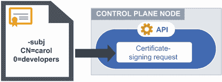

图 3.12 为新用户创建 kubeconfig 并使用证书签名请求生成证书

因为用户和组是在证书上的任意标记，并且不由 Kubernetes 管理，所以让我们先创建一个新的证书签名请求。还记得我们学到 Kubernetes API 是它自己的证书颁发机构吗？这意味着它可以为我们签名证书，使它们成为 Kubernetes API 的有效认证机制。多么方便啊！

首先，让我们使用命令 `openssl genrsa -out carol.key 2048` 生成一个使用 2048 位加密的私钥：

```
root@kind-control-plane:/# openssl genrsa -out carol.key 2048
Generating RSA private key, 2048 bit long modulus (2 primes)
......................................................+++++
.......................+++++
e is 65537 (0x010001)
```

现在，让我们创建一个证书签名请求文件，使用我们刚刚创建的私钥，我们最终将把它交给 Kubernetes API。在这里，我们指定用户和组在证书签名请求的通用名称中非常重要，使用命令 `openssl req -new -key carol.key -subj "/CN=carol/O=developers" -out carol.csr`：

```
root@kind-control-plane:/# openssl req -new -key carol.key -subj "/CN=carol/O=developers" -out carol.csr
root@kind-control-plane:/# ls | grep carol
carol.csr
carol.key
```

让我们将 CSR 文件存储在一个环境变量中，因为我们稍后会需要它。为此，使用命令 `export REQUEST=$(cat carol.csr | base64 -w 0)` 将 CSR 文件的 Base64 编码版本存储在名为 `REQUEST` 的环境变量中。

现在我们已经有了创建 Kubernetes 中证书签名请求资源所需的一切。我们创建这个资源的方式就像我们创建许多其他 Kubernetes 资源和对象（例如，部署、Pod、服务账户等）一样，通过一个 YAML 文件。

考试技巧：因为您可以在考试期间打开额外的标签页，请利用 Kubernetes 文档中的搜索功能([`kubernetes.io/docs`](https://kubernetes.io/docs))。这是允许的，也是鼓励的。在您点击搜索结果之前，将鼠标悬停在链接上，确保它保持在`kubernetes.io/docs`子域内。

我们可以使用 Kubernetes 文档来找到证书签名请求资源的正确 YAML 结构的副本。您需要熟悉 Kubernetes 文档以备考试，因为它是您的生命线，也是复制示例（即 YAML）并将其粘贴到终端的巨大节省时间。让我们去[`mng.bz/vnaa`](http://mng.bz/vnaa)并练习。复制证书签名请求的 YAML——位于`request`一词右侧的长字符串——并将其粘贴到您的终端中，更改三个元素：将其替换为我们的`REQUEST`环境变量，并将名称和组更改为与 CSR 文件中的通用名称匹配。它看起来像这样：

```
cat <<EOF | kubectl apply -f -
apiVersion: certificates.k8s.io/v1
kind: CertificateSigningRequest
metadata:
  name: carol
spec:
  groups:
  - developers
  request: $REQUEST
  signerName: kubernetes.io/kube-apiserver-client
  usages:
  - client auth
EOF
```

如果您不想麻烦复制粘贴，或者您现在可能无法访问浏览器，那也行。您可以运行以下命令，它将实现相同的结果：`kubectl apply -f https://raw.githubusercontent.com/chadmcrowell/k8s/main/manifests/csr-carol.yaml.`。

恭喜，您已成功向 Kubernetes API 提交了签名请求！因为这个对象是由 Kubernetes 管理的，我们可以运行命令`kubectl get csr`来查看请求列表。您会注意到我们刚刚提交的请求名为`carol`，其状态为`Pending`：

```
root@kind-control-plane:/# kubectl get csr
NAME    AGE   SIGNERNAME                            REQUESTOR          
➥ CONDITION
carol   4s    kubernetes.io/kube-apiserver-client   kubernetes-admin   
➥ Pending
```

我们可以使用命令`kubectl certificate approve carol`简单地批准请求，并且我们会看到状态从`pending`变为`Approved,Issued`：

```
root@kind-control-plane:/# kubectl certificate approve carol
certificatesigningrequest.certificates.k8s.io/carol approved
root@kind-control-plane:/# kubectl get csr
NAME    AGE     SIGNERNAME                            REQUESTOR          
➥ CONDITION
carol   2m12s   kubernetes.io/kube-apiserver-client   kubernetes-admin   
➥ Approved,Issued
```

现在它已经被批准，我们可以提取已签名证书的内容——即客户端证书——Base64 解码，并将其存储在名为`carol.crt`的文件中，使用命令`kubectl get csr carol -o jsonpath='{.status.certificate}' | base64 -d > carol.crt`：

```
root@kind-control-plane:/# kubectl get csr carol -o jsonpath='{.status.certificate}' | base64 -d > carol.crt
root@kind-control-plane:/# ls | grep carol
carol.crt
carol.csr
carol.key
```

我们有密钥（`carol.key`）和客户端证书（`carol.crt`），可以将这些凭证添加到我们的 kubeconfig 中。我们可以使用命令`kubectl config set-credentials carol --client-key=carol.key --client-certificate=carol.crt --embed-certs`同时将证书和密钥值嵌入到文件中（类似于我们当前的 kubeconfig）。

注意：如果您不想嵌入证书和密钥，可以省略`--embed-certs`选项。这将列出两个文件的路径而不是原始证书值。

您现在可以通过使用命令`kubectl config view`在 kubeconfig 中看到`carol`的凭证：

```
root@kind-control-plane:/# kubectl config view
apiVersion: v1
clusters:
- cluster:
    certificate-authority-data: DATA+OMITTED
    server: https://kind-control-plane:6443
  name: kind
contexts:
- context:
    cluster: kind
    user: kubernetes-admin
  name: kubernetes-admin@kind
current-context: kubernetes-admin@kind
kind: Config
preferences: {}
users:
- name: carol
  user:
    client-certificate-data: REDACTED
    client-key-data: REDACTED
- name: kubernetes-admin
  user:
    client-certificate-data: REDACTED
    client-key-data: REDACTED
```

要将用户 carol 添加到我们的上下文，我们将运行命令`kubectl config set-context carol --user=carol --cluster=kind`。一旦运行此命令，您会注意到通过运行命令`kubectl config get-contexts`已经添加了上下文：

```
root@kind-control-plane:/# kubectl config set-context carol --user=carol -
➥ cluster=kind
Context "carol" created.
root@kind-control-plane:/# kubectl config get-contexts
CURRENT   NAME                    CLUSTER   AUTHINFO           NAMESPACE
          carol                   kind      carol
*         kubernetes-admin@kind   kind      kubernetes-admin
```

左侧 `current` 列中的星号表示我们当前正在使用哪个上下文。在继续之前，让我们运行命令 `kubectl run nginx --image nginx` 创建一个 Pod，这样我们就可以正确地测试用户 carol 是否根据 `pod-reader` 角色具有适当的权限。然后，要切换上下文并使用 `carol` 上下文，请运行命令 `kubectl config use-context carol`。您会注意到星号已将当前上下文更改为 `carol`。最后，就像使用 `kubectl auth can-i` 命令一样，我们可以验证 carol 可以列出 Pod 但不能删除它们：

```
root@kind-control-plane:/# kubectl config use-context carol
Switched to context "carol".
root@kind-control-plane:/# kubectl get po
NAME    READY   STATUS    RESTARTS   AGE
nginx   1/1     Running   0          13s
root@kind-control-plane:/# kubectl delete po nginx
Error from server (Forbidden): pods "nginx" is forbidden: User "carol" 
➥ cannot delete resource "pods" in API group "" in the namespace "default"
```

让我们更进一步，将角色（使用角色绑定）绑定到一个组而不是用户（这是我们目前的情况）。要切换回管理员用户，请输入命令 `kubectl config use-context kubernetes-admin@kind`。然后，使用命令 `kubectl delete rolebinding admin-binding` 删除当前的角色绑定，并使用命令 `kubectl create rolebinding pod-reader-bind --role=pod-reader --group=developers` 创建一个新的角色绑定。让我们使用命令 `kubectl config use-context carol` 切换回用户 carol，并使用命令 `kubectl get po` 测试我们的授权（这次是通过组）：

```
root@kind-control-plane:/# kubectl config use-context kubernetes-admin@kind
Switched to context "kubernetes-admin@kind".
root@kind-control-plane:/# kubectl delete rolebinding admin-binding
rolebinding.rbac.authorization.k8s.io "admin-binding" deleted
root@kind-control-plane:/# kubectl create rolebinding pod-reader-bind -
➥ role=pod-reader --group=developers
rolebinding.rbac.authorization.k8s.io/pod-reader-bind created
root@kind-control-plane:/# kubectl config use-context carol
Switched to context "carol".
root@kind-control-plane:/# kubectl get po
NAME    READY   STATUS    RESTARTS   AGE
nginx   1/1     Running   0          8m9s
```

我们已经用用户 carol 完成了测试，所以让我们再次切换回管理员用户，继续本章的下一个主题：服务账户。

练习考试

通过首先创建私钥，然后创建证书签名请求，最后使用 Kubernetes 中的 CSR 资源生成客户端证书，创建一个名为 Sandra 的新用户。使用 `kubectl config` 命令将 Sandra 添加到您的本地 kubeconfig 中。

## 3.3 服务账户

用户和组很棒，但机器怎么办？它们也需要访问 Kubernetes API，有时我们会使用像 Helm 或 Jenkins 或负载均衡器控制器这样的工具——作为我们集群中的 Pod 运行，这些工具需要与 Kubernetes API 通信以执行其主要功能的一部分（读取、写入、删除等）。我们为它们提供类似的身份验证机制——即令牌——以执行这些操作，如图 3.13 所示。然后我们可以使用角色和角色绑定来限制它们的权限，再次确保我们遵循最小权限原则。我们不希望我们的集群中的 Pod 有像我们的 `system:masters` 组那样的无限制访问。好消息是，这个默认组不会像对我们的管理员用户那样应用到服务账户上。

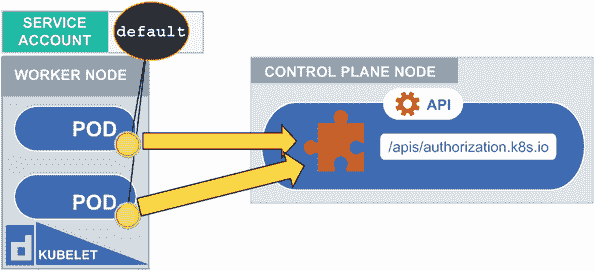

图 3.13 服务账户挂载到 Pod 可以像用户一样访问 API。

服务账户是命名空间范围内的资源。您在每个命名空间中至少会找到一个，那个被称为默认服务账户的，每次您生成一个新的命名空间时都会自动创建。让我们试试！

```
root@kind-control-plane:/# kubectl create ns web
namespace/web created
root@kind-control-plane:/# kubectl get sa -n web
NAME      SECRETS   AGE
default   1         10s
```

这个默认服务账户是自动创建的；我们不需要做任何特殊的事情来使这种默认行为发生。如果我们运行命令 `kubectl describe secret -n web`，我们可以看到与服务账户一起自动生成的令牌：

```
root@kind-control-plane:/# kubectl describe sa -n web
Name:                default
Namespace:           web
Labels:              <none>
Annotations:         <none>
Image pull secrets:  <none>
Mountable secrets:   default-token-mv8xd
Tokens:              default-token-mv8xd
Events:              <none>
```

此外，您可以使用命令 `kubectl describe secret default-token-mv8xd -n web` 来 `cat` 出令牌并揭示其值：

```
root@kind-control-plane:/# kubectl describe secret default-token-mv8xd -n 
➥ web
Name:         default-token-mv8xd
Namespace:    web
Labels:       <none>
Annotations:  kubernetes.io/service-account.name: default
              kubernetes.io/service-account.uid: b0f4ff77-80be-44ab-85b3-
➥ b6f662678fff

Type:  kubernetes.io/service-account-token

Data
====
namespace:  3 bytes
token:      
➥ eyJhbGciOiJSUzI1NiIsImtpZCI6IllyN3NCd1JPOHZMbkhFZ3BLQkVBbUloZGx0eU5JSEF
➥ kS3JuUFRxS3dwWGsifQ.eyJpc3MiOiJrdWJlcm5ldGVzL3NlcnZpY2VhY2NvdW50Iiwia3V
➥ iZXJuZXRlcy5pby9zZXJ2aWNlYWNjb3VudC9uYW1lc3BhY2UiOiJ3ZWIiLCJrdWJlcm5ldG
➥ VzLmlvL3NlcnZpY2VhY2NvdW50L3NlY3JldC5uYW1lIjoiZGVmYXVsdC10b2tlbi1tdjh4Z
➥ CIsImt1YmVybmV0ZXMuaW8vc2VydmljZWFjY291bnQvc2VydmljZS1hY2NvdW50Lm5hbWUi
➥ OiJkZWZhdWx0Iiwia3ViZXJuZXRlcy5pby9zZXJ2aWNlYWNjb3VudC9zZXJ2aWNlLWFjY29
➥ 1bnQudWlkIjoiYjBmNGZmNzctODBiZS00NGFiLTg1YjMtYjZmNjYyNjc4ZmZmIiwic3ViIj
➥ oic3lzdGVtOnNlcnZpY2VhY2NvdW50OndlYjpkZWZhdWx0In0.DoBREFRm9pOUnSfqaI4qe
➥ mDGFKA5nkXBfXePPQscAm8C-S4an0X6JtcQShRp04WrDQzqGYCQ2nnCldxdxCPd8BPwBV-
➥ xBzsidL1Cwg-
➥ iXQTElvJLIx0N6CB9FGpiFBBHFY5GRTtX3LFBcWqoUoqNmyDUqJJnlNEKqGzy5-
➥ 4bjjMNOQ5JYywtjm50cxiGE2flORBjU7FBzZVWmvzo2XhtVR18LWUdomaZ1IwESXFU5HZNe
➥ sK-1MqcvD4C5wWc9igVBBxFJBoMJ06Z_Afi9vitnCtCYarQHcg66RvOVK-
➥ xyrc00RtjQbFLIlrjy68F3zG4BrvU9ChQOuMPAbCkG1ay4g
ca.crt:     1066 bytes
```

技术上，我们可以使用这个令牌（作为用户）来通过 Kubernetes API 进行身份验证。这就是为什么默认的 `view` 角色不允许查看服务账户，以及为什么我们犹豫是否给任何用户读取我们的机密数据的权限。这些令牌也可以在集群外部使用。

当我们创建一个 Pod 时，这个默认服务账户会自动挂载到 Pod 上，这样 Pod 就可以认证到 Kubernetes API。让我们运行命令 `kubectl get po nginx -o yaml | grep volumeMounts -A14` 来列出 Pod YAML 中的服务账户。你会看到默认服务账户实际上是在路径 `/var/run/secrets/kubernetes.io/serviceaccount` 上挂载到 Pod 上的：

```
root@kind-control-plane:/# kubectl get po nginx -o yaml | grep volumeMounts 
➥ -A14
    volumeMounts:
    - mountPath: /var/run/secrets/kubernetes.io/serviceaccount
      name: kube-api-access-nhxf2
      readOnly: true
  dnsPolicy: ClusterFirst
  enableServiceLinks: true
  nodeName: kind-worker2
  preemptionPolicy: PreemptLowerPriority
  priority: 0
  restartPolicy: Always
  schedulerName: default-scheduler
  securityContext: {}
  serviceAccount: default
  serviceAccountName: default
  terminationGracePeriodSeconds: 30
```

如果我们 `exec` 进入 Pod，我们可以像之前描述 Secret 那样查看令牌。要进入 Pod 的容器并 `cat` 出令牌，我们可以运行命令 `kubectl exec -it nginx --sh`，然后 `cat /var/run/secrets/kubernetes.io/serviceaccount/token`（# 表示你已经成功进入容器内部的 shell）：

```
root@kind-control-plane:/# kubectl exec -it nginx --sh
# cat /var/run/secrets/kubernetes.io/serviceaccount/token
eyJhbGciOiJSUzI1NiIsImtpZCI6IllyN3NCd1JPOHZMbkhFZ3BLQkVBbUloZGx0eU5JSEFkS3J
➥ uUFRxS3dwWGsifQ.eyJhdWQiOlsiaHR0cHM6Ly9rdWJlcm5ldGVzLmRlZmF1bHQuc3ZjLmN
➥ sdXN0ZXIubG9jYWwiXSwiZXhwIjoxNjgwMTQ0NDMxLCJpYXQiOjE2NDg2MDg0MzEsImlzcy
➥ I6Imh0dHBzOi8va3ViZXJuZXRlcy5kZWZhdWx0LnN2Yy5jbHVzdGVyLmxvY2FsIiwia3ViZ
➥ XJuZXRlcy5pbyI6eyJuYW1lc3BhY2UiOiJkZWZhdWx0IiwicG9kIjp7Im5hbWUiOiJuZ2lu
➥ eCIsInVpZCI6ImRmMzE3OTA3LTgwNTAtNDJmMS05ZWRmLTNhNDY2NzU4M2E5NiJ9LCJzZXJ
➥ 2aWNlYWNjb3VudCI6eyJuYW1lIjoiZGVmYXVsdCIsInVpZCI6ImRkMjlkZWEzLTkyMjMtNG
➥ QyOC1iOGE1LWUwODIxNTU1NGRjZCJ9LCJ3YXJuYWZ0ZXIiOjE2NDg2MTIwMzh9LCJuYmYiO
➥ jE2NDg2MDg0MzEsInN1YiI6InN5c3RlbTpzZXJ2aWNlYWNjb3VudDpkZWZhdWx0OmRlZmF1
➥ bHQifQ.ECeBokD1IbvCbBOIi6yiWtV1VIPABtxwnXmtudiQcRdmglQX06MVBEdCVJ4PT_rb
➥ nS7oB5fNAYFU2-8xU0EcDofeJH6IFEkALaI09TLCcha5YnQ65C6J1aKV-
➥ 58BR2I9aIZDb9uCJ247nyrDc075e2nf5zuBcfX82X5Yl0qAUtuiWDG-
➥ HPIwLfVnWYj9AasiFOMAMVaM_Ydsgru1U2vHwGFi-
➥ 7vo2CITU33X3NoTyDCSuNaNlAcB08_aWJuOYpQFtlAzpHQJR0XqGveIqu7cCMBd4XuD-
➥ m9AQDpkUZY59GOsJINCzkKo0cH1_nWx_PU42-drEwHU8m1HEdGwsAhNRg#
```

如果我们不希望自动将令牌挂载到我们创建的每个 Pod 上，那么我们可以从 `serviceAccount` 本身关闭此功能，或者我们可以在 Pod YAML 规范中卸载某些 Pod 的令牌，如图 3.14 所示。即使我们的团队成员不小心忘记为创建的 Pod 处理这个问题，我们也可以同时做这两件事。

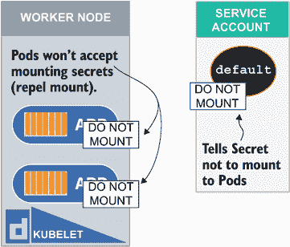

图 3.14 您可以选择禁用从服务账户或 Pod 或两者挂载机密。

让我们创建一个新的服务账户，并告诉服务账户不要自动将令牌挂载到 Pod 上。最快的方法是创建服务账户 YAML 的框架，然后使用命令 `kubectl create sa nomount-sa --dry-run=client -o yaml > nomount-sa.yaml` 在原地修改它。使用命令 `echo "automountServiceAccountToken: false" >> nomount-sa.yaml` 将 `automountServiceAccountToken: false` 添加到文件 `nomount-sa.yaml` 的末尾：

```
root@kind-control-plane:/# echo "automountServiceAccountToken: false" >> 
➥ nomount-sa.yaml
root@kind-control-plane:/# cat nomount-sa.yaml
apiVersion: v1
kind: ServiceAccount
metadata:
  creationTimestamp: null
  name: nomount-sa
automountServiceAccountToken: false
```

现在我们已经设置了 YAML，我们可以使用命令 `kubectl create -f nomount-sa.yaml` 创建服务账户对象。如果我们创建一个新的 Pod 并使用这个服务账户，我们根本看不到它被挂载。让我们创建一个名为 `no-mount` 的新 Pod，并在 YAML 中指定使用这个新的服务账户，就像图 3.15 所示。

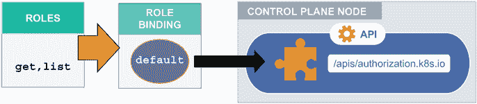

图 3.15 角色主体可以是用户、组或服务账户，用于对 Kubernetes 进行授权。

我们将使用相同的快捷方法输出 YAML 清单的骨架，并在之后使用命令`kubectl run no-mount --image nginx --dry-run=client -o yaml > no-mount-pod.yaml`对其进行修改。

注意：如果你从上一章开始创建了一个新的类型集群，你需要安装 Vim 以便可以编辑文件。使用命令`apt update && apt install -y vim`。

现在我们已经将文件本地化了，我们可以使用我们的 Vim 文本编辑器来编辑它，所以输入命令`vim no-mount-pod.yaml`来打开它。在`spec`下面，缩进两个空格，你应该添加`serviceAccountName: nomount-sa`。它看起来像这样：

```
apiVersion: v1
kind: Pod
metadata:
  creationTimestamp: null
  labels:
    run: no-mount
  name: no-mount
spec:
  serviceAccountName: nomount-sa
  containers:
  - image: nginx
    name: no-mount
    resources: {}
  dnsPolicy: ClusterFirst
  restartPolicy: Always
status: {}
```

我们已经明确告诉 Pod 使用这个服务账户，所以让我们使用命令`kubectl create -f no-mount-pod.yaml`创建 Pod，并使用命令`kubectl get po no-mount -o yaml | grep volumeMounts -A14`检查它。你会注意到使用了正确的服务账户，并且没有看到任何卷挂载。这是好事。

```
root@kind-control-plane:/# kubectl get po no-mount -o yaml | grep 
➥ serviceAccount
  serviceAccount: nomount-sa
  serviceAccountName: nomount-sa
root@kind-control-plane:/# kubectl get po no-mount -o yaml | grep 
➥ volumeMounts -A14
root@kind-control-plane:/#
```

当创建另一个 Pod 时，我们将使用默认令牌，该令牌设置为自动将令牌挂载到 Pod，但我们在创建我们的 Pod 时将明确告诉它不要这样做。使用命令`kubectl run default-no-mount --image nginx --dry-run=client -o yaml > default-no-mount-pod.yaml`创建一个新的 Pod YAML 文件。再次，让我们用 Vim 打开文件；在`spec`下面，缩进两个空格，插入`automountServiceAccountToken: false`。我们不需要告诉 Pod 使用默认令牌，因为如果没有指定，它将自动使用默认服务账户。默认情况下，所有 Pod 都是这种情况。Pod YAML 将看起来像这样：

```
apiVersion: v1
kind: Pod
metadata:
  creationTimestamp: null
  labels:
    run: default-no-mount
  name: default-no-mount
spec:
  automountServiceAccountToken: false
  containers:
  - image: nginx
    name: default-no-mount
    resources: {}
  dnsPolicy: ClusterFirst
  restartPolicy: Always
status: {}
```

让我们使用命令`kubectl create -f default-no-mount-pod.yaml`创建 Pod。我们将看到 Pod 使用了默认服务账户，但没有卷挂载，这正是我们想要的。

```
root@kind-control-plane:/# kubectl get po default-no-mount -o yaml | grep 
➥ serviceAccount
  serviceAccount: default
  serviceAccountName: default
root@kind-control-plane:/# kubectl get po default-no-mount -o yaml | grep 
➥ volumeMounts -A14
root@kind-control-plane:/#
```

现在我们已经了解了如何创建服务账户并将它们挂载到 Pod（或显式地不将它们挂载到 Pod），让我们回顾一下将角色和角色绑定分配给服务账户的过程。这与其他任何角色的创建或角色绑定创建类似，但主题是服务账户而不是用户或组。首先创建一个只允许对资源`pods`执行`list`操作的`Role`。为此，我们可以运行命令`kubectl create role pod-list --verb=list --resource=pods`。我们将创建名为`pod-list-bind`的`Role binding`，通过运行`kubectl create rolebinding pod-list-bind --role=pod-list --serviceaccount=default:nomount-sa`将服务账户`nomount-sa`绑定到`pod-list`角色：

```
root@kind-control-plane:/# kubectl create role pod-list --verb=list -
➥ resource=pods
role.rbac.authorization.k8s.io/pod-list created
root@kind-control-plane:/# kubectl create rolebinding pod-list-bind -
➥ role=pod-list --serviceaccount=default:nomount-sa
rolebinding.rbac.authorization.k8s.io/pod-list-bind created
```

为了测试我们的角色和角色绑定是否工作正常，我们可以使用`kubectl auth can-i`命令，并确定我们是否可以列出此服务账户中的 Pod。为此，我们将运行命令`kubectl auth can-i list pods --as system:serviceaccount :default:nomount-sa`：

```
root@kind-control-plane:/# kubectl auth can-i list pods --as 
➥ system:serviceaccount:default:nomount-sa
yes
```

服务账户被表示为 `system:serviceaccount:default:nomount-sa`，因为这是根据 RBAC 插件的服务账户的用户名。这是我们观察服务账户的角度，因此我们需要使用 `system:serviceaccount` 前缀来引用它，后面跟着命名空间（在我们的例子中是 `default`），然后是服务账户 API 资源名称。恭喜！您已经创建了一个服务账户，并通过 Kubernetes 中的 Role binding 将其分配给了角色！

您现在可以同时使用这个服务账户为多个 Pod 提供服务，只要这些 Pod 存在于同一个命名空间中。您永远不能为 Pod 使用来自不同命名空间的 Service Account。此外，为了使用 `nomount-sa` 服务账户为新 Pod 提供服务，您必须在每个 Pod 的 YAML 文件中指定要使用的服务账户，就像我们在前面的例子中所做的那样。您可能会考虑删除默认服务账户，但这是不可能的。服务账户资源有自己的控制器，当我们生成新的命名空间时，它会自动创建。

考试练习

创建一个名为 `secure-sa` 的新服务账户，并创建一个使用此服务账户的 Pod。确保令牌不会被暴露给 Pod。

创建一个名为 `acme-corp-role` 的新集群角色，该角色将允许对 Deployments、replicates 和 DaemonSets 执行 `create` 操作。将该集群角色绑定到服务账户 `secure-sa`，并确保服务账户只能在默认命名空间内创建分配的资源，而不会在其他地方创建。使用 `auth can-i` 验证 `secure-sa` 服务账户不能在 `kube-system` 命名空间中创建 Deployments，并将命令的结果以及命令本身输出到文件中，然后共享该文件。

## 摘要

+   任何尝试访问 Kubernetes 的东西都必须通过携带用于认证的令牌的证书进行认证。

+   认证插件用于 Kubernetes，以提供一个接受或拒绝用户请求的机制。

+   Kubernetes 有自己的证书签名请求对象，可以签名证书，使其对用户或尝试访问 Kubernetes API 的任何东西有效。

+   一个名为基于角色的访问控制（RBAC）的通用插件用于在 Kubernetes 集群中授予用户权限。

+   用户和组在 Kubernetes 中具有任意含义，因此没有用户数据库或目录结构。证书是唯一需要检查的东西，因此用户或组可以是任何名称。

+   您可以通过角色、集群角色、角色绑定和集群角色绑定来分配 RBAC 权限，每种都适用于不同的用例。

+   除了一个之外，所有角色、集群角色、角色绑定和集群角色绑定的组合都可以用于考试：那就是集群角色绑定到角色。

+   RBAC 中有两个主要主题：用户和服务账户。在 Kubernetes API 中，用户不是一个受管理的资源，而服务账户是。

+   在创建用户时，证书签名请求中的通用名称是必需的。你可以从 Kubernetes API 生成客户端证书，它是一个自己的证书颁发机构。

+   在创建考试角色时，你可以使用预演选项，从而节省一些时间来手动输入需要添加值的角色的 YAML。

+   内置组与 Kubernetes 中的常规组不同。内置组由 API 服务器管理，不能被修改。

+   当创建新的命名空间时，会自动创建 Service Accounts。除非在 YAML 清单中另有指定，否则 Service Account 中的令牌会挂载到 Pod。

+   为了防止令牌自动挂载到 Pod，你可以在 Pod YAML 中添加指令，并通过在 Service Account YAML 中添加指令来禁用从 Service Account 的挂载。你还可以在首次创建 Service Account 时禁用令牌的挂载。

+   考试期间的一个有用工具叫做 `kubectl auth can-I`，它可以测试用户和 Service Accounts 的权限。
