# 4 在 Kubernetes 中部署应用程序

本章涵盖了

+   将 Pod 调度到节点

+   在 Pod 内创建多个容器

+   使用 Helm 模板引擎

+   请求和限制 Pod 可以使用的资源

+   将配置数据传递给 Pod

在本章中，我们将把我们的重点从考试目标的工作负载和调度部分转移到许多不同的调度方面及其复杂性。你会意识到没有一种方法适合所有人，这为在最适合容器化应用程序的环境中运行应用程序提供了自由。这包括从底层基础设施中预留资源以及解耦配置信息等敏感数据的能力。

工作负载和调度领域

本章涵盖了 CKA 课程的工作负载和调度领域的一部分。这个领域涵盖了我们在 Kubernetes 上运行应用程序的方式。它包括以下能力。

| 能力 | 章节部分 |
| --- | --- |
| 使用 ConfigMaps 和 Secrets 配置应用程序。 | 4.3 |
| 理解资源限制如何影响 Pod 调度。 | 4.3 |
| 对清单管理和常见模板工具的了解。 | 4.2 |
| 理解用于创建健壮、自我修复的应用程序部署的原语。 | 4.1 |

## 4.1 调度应用程序

将应用程序部署到 Kubernetes 上运行称为*调度*，当你从在节点上运行 Pod 的角度考虑时，这是有意义的。有许多方法可以将应用程序（调度 Pod）部署到 Kubernetes。正如我们在前面的章节中所发现的，控制 Pod 分配到节点的 Kubernetes 组件称为*调度器*。调度器不仅会告诉 Pod 在特定节点上运行，还会确保节点上有可用的资源，以便 Pod 可以成功运行，如图 4.1 所示。

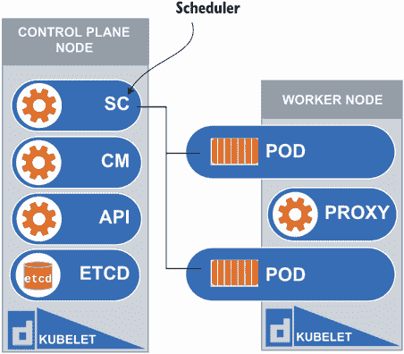

图 4.1 调度器在验证资源可用性后允许 Pod 在工作节点上运行。

CKA 考试将测试你创建和更新应用程序部署的知识。这包括根据它们的标签将 Pod 调度到特定的节点。例如，考试提示可能说，“将标签‘disk=ssd’应用到名为‘kind-worker’的工作节点上，并使用节点选择器调度名为‘ssd-pod’的 Pod 到‘kind-worker’节点。”为了在考试中更好地处理这类任务，让我们使用命令`k run ssd-pod --image=nginx --dry-run=client -o yaml > ssd-pod.yaml`创建一个新的 Pod。这个命令将 Pod YAML 保存到名为`ssd-pod.yaml`的文件中。在我们开始修改 YAML 之前，我们必须使用命令`k get no --show-labels`显示我们集群中每个节点的现有标签：

```
root@kind-control-plane:/# k get no --show-labels
NAME                 STATUS   ROLES                  AGE   VERSION   LABELS
kind-control-plane   Ready    control-plane,master   13d   v1.23.4   
➥ beta.kubernetes.io/arch=amd64,beta.kubernetes.io/os=linux,kubernetes.io
➥ /arch=amd64,kubernetes.io/hostname=kind-control-
➥ plane,kubernetes.io/os=linux,node-role.kubernetes.io/control-
➥ plane=,node-role.kubernetes.io/master=,node.kubernetes.io/exclude-from-
➥ external-load-balancers=
kind-worker          Ready    <none>                 13d   v1.23.4   
➥ beta.kubernetes.io/arch=amd64,beta.kubernetes.io/os=linux,kubernetes.io
➥ /arch=amd64,kubernetes.io/hostname=kind-worker,kubernetes.io/os=linux
kind-worker2         Ready    <none>                 13d   v1.23.4   
➥ beta.kubernetes.io/arch=amd64,beta.kubernetes.io/os=linux,kubernetes.io
➥ /arch=amd64,kubernetes.io/hostname=kind-worker2,kubernetes.io/os=linux
```

考试技巧 在考试中，可能不会预先在节点上应用标签。你可以使用命令`k get no --show-labels`来检查节点的标签。`

现在，让我们给名为 `kind-worker` 的节点应用一个新的标签，以表明该节点具有 SSD 硬盘而不是 HDD。这样，Pod 就可以通过节点选择器调度到 `kind-worker` 节点。要给节点应用标签，我们使用 `key=value` 语法，这样我们可以在以后选择该标签。要应用具有键 `disktype` 和值 `ssd` 的标签，我们可以使用命令 `k label no kind-worker disktype=ssd`。然后我们可以再次运行 `show labels` 命令，以查看标签是否成功应用。

```
root@kind-control-plane:/# k label no kind-worker disktype=ssd
node/kind-worker labeled
root@kind-control-plane:/# k get no --show-labels
NAME                 STATUS   ROLES                  AGE   VERSION   LABELS
kind-control-plane   Ready    control-plane,master   13d   v1.23.4   
➥ beta.kubernetes.io/arch=amd64,beta.kubernetes.io/os=linux,kubernetes.io
➥ /arch=amd64,kubernetes.io/hostname=kind-control-
➥ plane,kubernetes.io/os=linux,node-role.kubernetes.io/control-
➥ plane=,node-role.kubernetes.io/master=,node.kubernetes.io/exclude-from-
➥ external-load-balancers=
kind-worker          Ready    <none>                 13d   v1.23.4   
➥ beta.kubernetes.io/arch=amd64,beta.kubernetes.io/os=linux,disktype=ssd,
➥ kubernetes.io/arch=amd64,kubernetes.io/hostname=kind-
➥ worker,kubernetes.io/os=linux
kind-worker2         Ready    <none>                 13d   v1.23.4   
➥ beta.kubernetes.io/arch=amd64,beta.kubernetes.io/os=linux,kubernetes.io
➥ /arch=amd64,kubernetes.io/hostname=kind-worker2,kubernetes.io/os=linux
```

现在工节点已经标记，我们可以在 Pod YAML 中添加节点选择器，以确保 Pod 被调度到这个新标记的节点。请打开文本编辑器（如 Vim）中的文件 `ssd-pod.yaml`。一旦打开，我们可以在与容器一词平行的行中添加 `nodeSelector:`，然后在下面缩进两个空格添加 `disktype: ssd`。我们缩进两个空格是为了表示指定的参数与上面的块组合在一起（例如，`disktype` 包含在块中），如图 4.2 所示。

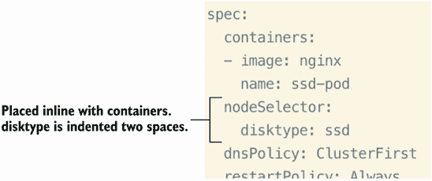

图 4.2 根据节点标签 `disk=ssd` 选择调度 Pod 的节点类型

在添加此内容后，您可以保存文件。我们可以使用命令 `k apply -f ssd-pod.yaml` 来创建 Pod 并将其调度到指定的节点，这是我们在 Pod YAML 中通过节点选择器指定的。现在，让我们通过运行命令 `k get po -o wide` 来验证 Pod 是否被调度到预期的节点：

```
root@kind-control-plane:/# k get po -o wide
NAME      READY   STATUS    RESTARTS   AGE   IP           NODE          
➥ NOMINATED NODE   READINESS GATES
ssd-pod   1/1     Running   0          25s   10.244.1.2   kind-worker   
➥ <none>           <none> 
```

看起来 Pod 被调度到了正确的节点，节点选择器的规则也成功应用。做得好！

在其他情况下，您可能希望更改 Pod 的调度方式。然而，在大多数情况下，您希望将您的更改限制在 Kubernetes 的调度中。请注意，更改调度默认规则会改变 Kubernetes 的主要功能，即提高可用性和容错性。您可能需要将 Pod 调度到特定的节点（如前一个任务中所示），但通常调度器会正确且高效地分配工作负载。在图 4.3 中，您将看到控制平面节点和工作节点默认的标签，包括我们在本章早期为 `kind-worker` 应用到的 `disktype` 标签。

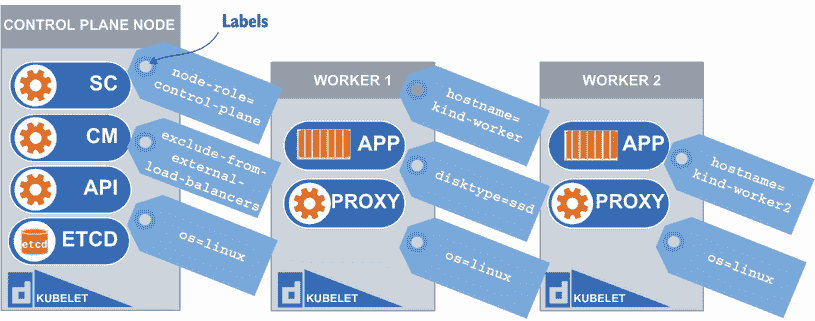

图 4.3 所有节点都可以有不同的标签，您可以通过选择这些标签来调度 Pod。

### 4.1.1 节点选择器

正如我们在上一节中讨论的，可能会有这样的时候，你希望将 Pod 安排到特定的节点。也许那个节点具有某种类型的 CPU 或内存，这对你的工作负载进行了优化。我们可以在 Pod YAML（以及 Deployment YAML）内部使用许多东西来帮助我们解决这个问题。现在让我们讨论其中的一些——节点选择器和清单中的节点名称属性。我们可以在 YAML 清单中添加其中一个（而不是两个），以便能够将 Pod 安排在特定的节点上。它们之间有什么区别呢？嗯，节点选择器稍微灵活一些，因为它通过标签来识别节点。这样，标签可以应用于多个节点，而不仅仅是单个节点。

使用节点名称而不是节点选择器正好相反。你可以通过名称指定特定的节点，但正如我们所知，我们不能有两个具有相同名称的节点，这限制了我们的选择。如果我们遇到节点故障怎么办？如果节点资源耗尽怎么办？通过将 Pod 安排在单个节点上创建单点故障并不是一个好主意。正如你在图 4.4 中所看到的，你可以通过标签或名称强制将 Pod 安排在特定的节点上。

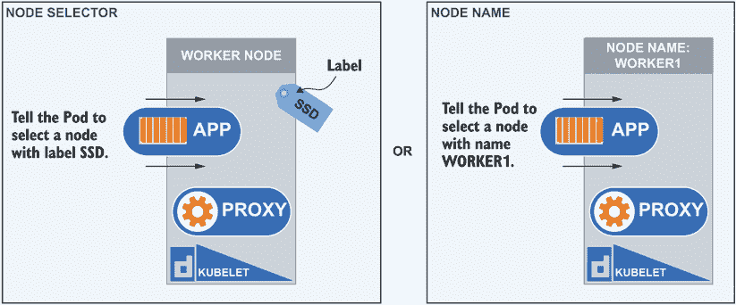

图 4.4 在安排 Pod 时，你可以根据节点的名称或标签强制指定其安排的节点。

DaemonSet 是一种 Kubernetes 对象，确保集群中的每个节点始终运行一个 Pod 副本。即使你删除了 Pod，DaemonSet 也会在任何缺少该 DaemonSet Pod 的节点上重新启动 Pod。DaemonSet 使用节点名称属性为 DaemonSet 内部的所有 Pod 安排 Pod 到特定的节点。这确保了只有一个 Pod 被分配给一个节点，并且通过使用节点名称，它们确保不会意外地在单个节点上运行两个 Pod，如图 4.5 中的 kube-proxy Pod 就是 Kubernetes 集群中运行的示例之一。

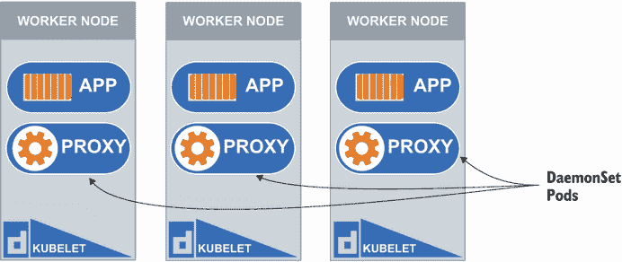

图 4.5 kube-proxy Pods 是 DaemonSet 的一部分，并位于集群中的每个节点上。

让我们使用命令 `k -n kube-system get po kindnet-2tlqh -o yaml | grep nodeName -a3` 来查看我们集群中运行的其中一个 DaemonSet Pod，你将看到类似于图 4.6 的输出。

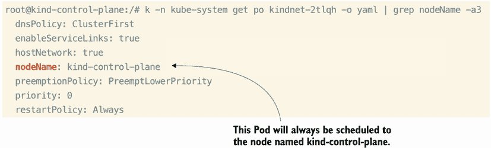

图 4.6 通过在 Pod YAML 中指定节点名称来安排 Pod

在这个命令中，我们正在获取位于`kube-system`命名空间中的 kindnet 守护进程 Pod 的 YAML 输出。然后，我们可以通过 grep 工具搜索 YAML 文件并找到节点名称的实例。如您所见，节点名称被添加到这个守护进程 Pod 的 YAML 中。请记住，Pod 名称对于您的集群可能会有所不同，所以将名称`kindnet-2tlqh`替换为您集群中的 Pod 名称。获取 Pod 名称的命令是`k get po -A`。此外，要查看您集群中运行的守护进程集，请输入命令`k get ds`。

希望您能更好地理解节点名称的使用位置及其使用原因。在大多数情况下，您将使用节点选择器，您可能更清楚地看到其好处。节点选择器在更多场景中使用，因为它可以应用于多个节点，选择节点标签。例如，您可以使用`disk=ssd`来标记节点，表示它们具有固态硬盘，这可能对需要高磁盘 I/O 的应用程序产生影响。

考试技巧：您可能在考试中看到节点选择器或节点名称，问题可能要求您向现有的 Pod YAML 中添加必要的值。因此，熟悉这里的放置和正确语法。

对于 CPU 或内存密集型应用程序也是如此，因为节点的资源会直接影响容器内运行的 Pod 中的应用程序如何运行。要查看节点选择器在我们集群中的使用情况，无需进一步寻找，只需查看已经在`kube-system`命名空间中运行的 core DNS Pods。要查看 CoreDNS Pod 的 YAML，我们将使用与守护进程 Pod 相同的方法，使用命令`k -n kube-system get po coredns-64897985d-4th9h -o yaml | grep nodeSelector -a4`，您将看到类似于图 4.7 的输出。

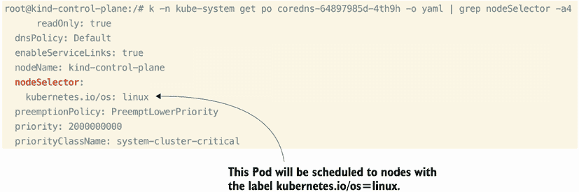

图 4.7 通过 Pod YAML 中指定的标签选择此 Pod 将在哪个节点上运行

注意：您的 CoreDNS Pod 名称可能不同，因此请使用命令`k -n kube-system get po`来查找您独特的名称。

在这个命令中，我们正在获取位于`kube-system`命名空间中的 CoreDNS Pod 的 YAML 输出，并搜索单词`nodeSelector`。请记住，Pod 名称对于您的集群可能会有所不同，所以将名称`coredns-64897985d-4th9h`替换为您集群中的 Pod 名称。获取 Pod 名称的命令是`k get po -A`。现在我们已经在本节中查看过节点名称和节点选择器，以及编辑 Kubernetes 对象的内联方法，让我们继续探讨另一种调度技术，称为*亲和性*，以优先选择某些节点。

### 4.1.2 节点和 Pod 亲和性

如我们所知，标签可以应用于 Pod 和节点。我们可以使用这些标签来应用亲和力。亲和力很像节点选择器，但其规则更为灵活。例如，节点选择器规则会选择带有标签的节点，而亲和力规则则会偏好带有标签的节点，但如果该节点标签不存在，也会接受调度到其他节点。

为了更好地理解亲和力，我们必须了解它解决的问题。在较大的 Kubernetes 集群中存在一个固有的问题，不仅 Pod 会来去，节点也是如此。因此，仅根据节点的名称或标签为 Pod 设置硬规则是不够的。亲和力提供了一种更灵活的规则集，以便应用程序可以调度到一个不断变化的集群环境中。如图 4.8 所示，您可以设置偏好一个节点的规则，但如果该节点不可用，它仍然有选项被调度到第二个节点。

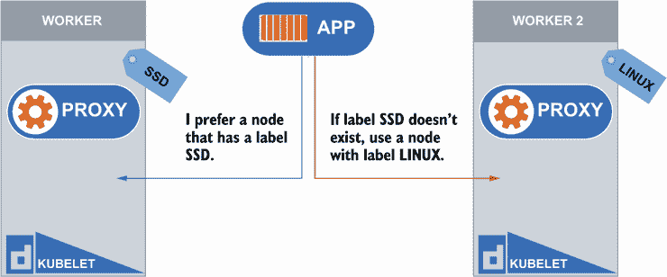

图 4.8 亲和力偏好将 Pod 调度到带有标签 `SSD` 的节点，如果不存在则调度到节点 `LINUX`。

让我们通过设置亲和力规则的示例来了解。我们将从一个全新的 Pod 开始，并使用 dry run 来创建 Pod YAML 的模板，就像我们之前使用命令 `k run affinity --image nginx --dry-run=client -o yaml > affinity.yaml` 所做的那样。一旦我们在当前目录中有一个名为 `affinity.yaml` 的文件，让我们在文本编辑器中打开它并添加我们的节点亲和力规则。在 `spec` 下方，与 `containers` 行对齐，添加 `affinity:` 到该行。缩进两个空格，然后添加 `nodeAffinity:`，后面跟着 `requiredDuringSchedulingIgnoredDuringExecution:`。参见图 4.9 了解剩余的 YAML 语法，因为它相当广泛。

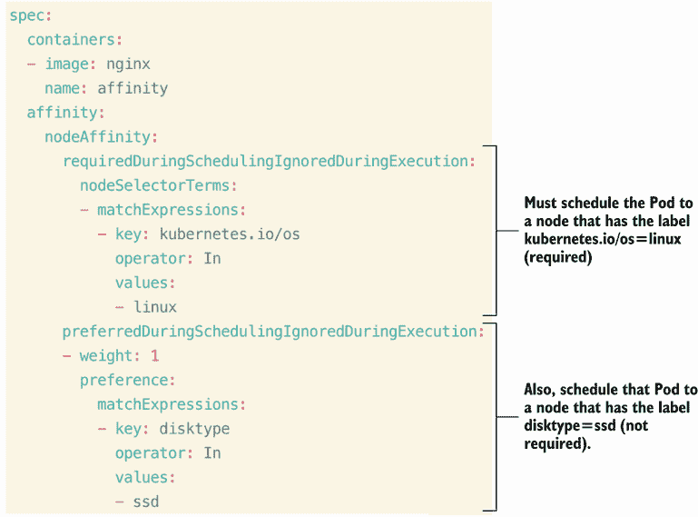

图 4.9 基于特定表达式偏好将 Pod 调度到节点的亲和力变化

在设置所需属性的下级节点亲和力中，调度器只有在满足此规则的情况下才能调度 Pod。这类似于 `nodeSelector`，但具有更灵活的语法。然而，对于调度器来说，首选属性是可选的。如果没有节点匹配此偏好，Pod 仍然会被调度。此外，您可以为每个首选规则指定介于 1 和 100 之间的权重，调度器将根据节点的其他优先函数的得分，基于总权重进行评估。总得分最高的节点将被优先考虑。现在我们已经添加了亲和力规则，让我们使用命令 `k apply -f affinity.yaml` 来调度我们的 Pod：

```
root@kind-control-plane:/# k apply -f affinity.yaml
pod/affinity created
root@kind-control-plane:/# k get po -o wide
NAME           READY   STATUS    RESTARTS   AGE   IP            NODE
➥            NOMINATED NODE   READINESS GATES
affinity       1/1     Running   0          14s   10.244.1.6    kind-
➥ worker2   <none>           <none>
pod-tolerate   1/1     Running   0          24h   10.244.2.16   kind-worker
➥     <none>           <none>
```

从命令 `k get po -o wide` 的输出中，我们看到 Pod 被调度到了没有 `disktype=ssd` 标签的节点 (`kind-worker2`)。这是因为我们为这个首选规则设置的权重太低，并且因为 `kind-worker` 上已经有一个 Pod 在运行，所以 `kind-worker2` 节点的总权重更高（权重越高，Pod 被调度的概率越大）。如果您没有完全理解，或者想检查您的作业，可以使用以下命令应用此 YAML 创建您的 Pod：`k apply -f https://raw.githubusercontent.com/chadmcrowell/k8s/main/manifests/pod-node-affinity.yaml`。

与节点亲和力类似，Pod 亲和力是节点亲和力，即基于该节点上已存在的其他 Pod 的偏好。用更简单的话来说，如果一个 Pod 已经存在于节点上（例如，`nginx`），那么请继续将新的 Pod 调度到该节点（即具有 `nginx` Pod 的节点），如图 4.10 所示。Kubernetes 通过标签检查 Pod 是否存在。这对于需要运行在相同节点上以提高性能或延迟要求的 Pod 来说是有效的。

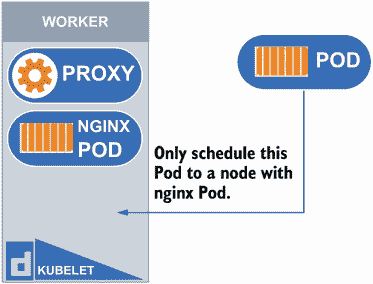

图 4.10 Pod 只会被调度到已经运行了 `nginx` Pod 的节点。

为了演示 Pod 亲和力，我们首先使用命令 `k run nginx --image=nginx` 创建一个具有标签 `run=nginx` 的 Pod。现在，让我们继续使用之前用于节点亲和力的相同 YAML 文件，但只更改几行，因为您将看到，设置 Pod 亲和力与设置节点亲和力非常相似。如果您还没有之前的 YAML 文件，可以使用 curl 和 `-O` 标志下载文件，并使用以下命令保存文件：`curl -O https://raw.githubusercontent.com/chadmcrowell/k8s/main/manifests/pod-node-affinity.yaml`。

请继续在您的文本编辑器中打开文件，将 Pod 的名称更改为 `pod-affinity`，以防止与之前演示中仍在运行的 Pod 发生命名冲突。此外，将 `nodeAffinity` 更改为 `podAffinity`；将 `nodeSelectorTerms:` 行更改为 `- labelSelector:`；从 `matchExpressions` 中移除连字符 (-)；并将键更改为 `run`，值更改为 `nginx`。

最后，在 `labelSelector` 下方添加 `topologyKey` 以保持与单词 `labelSelector` 的一致性。拓扑键是 Pod 亲和力所必需的，它简单地表示节点标签键。在这种情况下，我们集群中的所有节点都有 `kubernetes.io/hostname` 键，因此这将匹配所有节点。参见图 4.11 比较节点亲和力和 Pod 亲和力。您可以删除拓扑键以下的所有内容，因为在这个例子中我们只关注所需的 Pod 亲和力规则。


图 4.11 Pod YAML 中 Pod 间亲和性与节点亲和性在结构上的不同

现在，我们的 `nginx` Pod 正在运行，我们已经输出了具有 Pod 间亲和性规则的新 Pod 的 YAML，我们可以继续使用命令 `k apply -f pod-node-affinity.yaml` 来调度 Pod。在调度 Pod 后，你应该会看到 Pod 已经通过运行命令 `k get po -o wide` 被调度到与名为 `nginx` 的 Pod 相同的节点，输出类似于图 4.12。

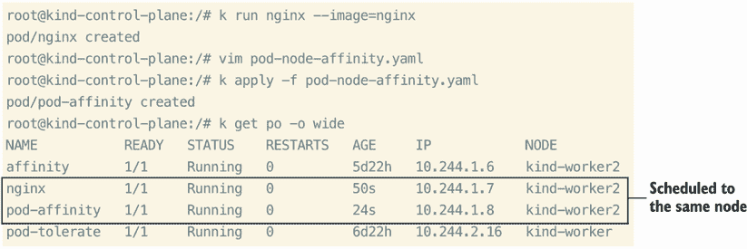

图 4.12 根据亲和性规则，Pod 已被调度到相同的节点。

在正常情况下，你可以看到 Pod 将会被调度到名为 `kind-worker` 的节点，但由于我们告诉调度器找到所有带有 `run=nginx` 标签的 Pod，并将名为 `pod-affinity` 的 Pod 调度到该节点，它覆盖了默认的调度设置。如果你得到不同的结果，或者可能根本无法调度你的 Pod，请将你的内容与该文件中的 YAML 进行比较，你可以使用以下命令下载该文件：`curl -O https://raw.githubusercontent.com/chadmcrowell/k8s/main/manifests/pod-with-pod-affinty.yaml`。

练习考试

将标签 `disk=ssd` 应用到一个节点上。创建一个名为 `fast` 的 Pod，使用 `nginx` 镜像，并确保它根据标签 `disk=ssd` 选择节点。

使用 `k edit po fast` 编辑 `fast` Pod，并将节点选择器更改为 `disk=slow`。注意，Pod 无法更改，YAML 已保存到临时位置。将 `/tmp/` 中的 YAML 应用到强制删除并重新创建 Pod，使用单个强制命令。

使用 `nginx` 镜像创建一个新的 Pod，名为 `ssd-pod`，并使用节点亲和性根据标签 `disk=ssd` 的权重 1 选择节点。如果选择标准不匹配，它还可以选择带有标签 `kubernetes .io/os=linux` 的节点。

## 4.2 使用 Helm

在 Kubernetes 中配置应用程序以用于 Deployment 的所有不同方法中，存在一个配置错误和开发可重部署组件的问题。例如，当创建带有服务、入口、配置映射、角色和角色绑定的部署时，可能会很复杂，并且并不总是直观地了解应用程序开发者希望应用程序如何运行以根据最佳实践操作。Helm 是 Kubernetes 的包管理器，支持模板化以解决这个问题。

测试您使用 Helm 的知识将是考试的一部分；因此，了解它解决的问题以及如何使用它是很重要的。我们不必从头开始重新构建每个 YAML 文件，它们可以被打包并存储在存储库中供他人使用和分享。除了模板引擎之外，它类似于您最喜欢的 Linux 发行版中的包管理器（例如，Ubuntu 中的 `apt`），Helm 允许您从存储库（公共或私有）中拉取 Helm 图表并本地安装这些 Helm 图表。

要在 macOS 上安装 Helm，只需执行命令 `brew install helm`。要在 Windows 上安装 Helm，只需执行命令 `choco install kubernetes-helm`。要在 Ubuntu 或 Debian 上安装 Helm，执行以下命令将 Helm 添加到您的包存储库，并使用 `apt` 安装：

```
curl -fsSL -o get_helm.sh 
➥ https://raw.githubusercontent.com/helm/helm/main/scripts/get-helm-3
chmod 700 get_helm.sh
./get_helm.sh
```

一旦安装了 Helm，您就可以运行命令 `helm version --short`，您将看到类似于图 4.13 的输出，这将显示当前安装的 Helm 版本。

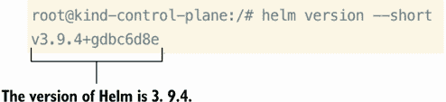

图 4.13 通过 CLI 显示 Helm 的版本。

接下来，我们可以安装一个 Helm 图表，它不过是一组打包成应用程序的 YAML 清单，该应用程序在 Kubernetes 中运行。为了连接到集群，Helm 使用与 `kubectl` 相同的 kubeconfig。由于 Helm 使用相同的 kubeconfig，它可以执行操作，这可能是好事也可能是坏事。对我们来说，现在没问题，因为我们需要管理员权限来创建与我们的 Helm 图表相关的资源。

我们可以使用位于 [`artifacthub.io/`](https://artifacthub.io/) 的公共存储库中的任何 Helm 图表。要使用 Helm 图表，我们首先必须添加包含 Helm 图表的存储库，否则 Helm 将不知道从哪里拉取图表。我们可以运行命令 `helm repo add hashicorp https://helm.releases.hashicorp.com` 将存储库添加到 Helm，然后运行命令 `helm repo list` 以查看它已被添加：

```
root@kind-control-plane:/# helm repo add hashicorp 
➥ https://helm.releases.hashicorp.com 
"hashicorp" has been added to your repositories
root@kind-control-plane:/# helm repo list 
NAME         URL
hashicorp    https://helm.releases.hashicorp.com
```

现在已经添加了存储库，我们可以使用命令 `helm search repo vault` 在该存储库中搜索所有可用的图表。您会看到，在 HashiCorp 存储库中有一个名为 `hashicorp/vault` 的 Helm 图表，我们可以使用它：

```
root@kind-control-plane:/# helm search repo vault
NAME               CHART VERSION    APP VERSION    DESCRIPTION
hashicorp/vault    0.21.0           1.11.2          Official HashiCorp 
➥ Vault Chart
```

让我们再添加一个存储库！我认为在 kind 集群中安装一个负载均衡器会有所帮助。这将在我们讨论第六章中的通信时很有用。Kubernetes 中的负载均衡器允许从集群外部访问我们的应用程序。例如，如果我们将 Web 应用程序作为 Kubernetes 部署的一部分托管，我们将能够通过 LoadBalancer 服务公开它。这样，访问您应用程序的访客可以通过其 IP 地址访问应用程序的前端。不过，现在让我们专注于添加存储库和安装 Helm 图表。

我们可以使用与添加 HashiCorp 存储库相同的命令 `helm repo add metallb https://metallb.github.io/metallb` 添加存储库。

```
root@kind-control-plane:/# helm repo add metallb 
➥ https://metallb.github.io/metallb 
"metallb" has been added to your repositories
```

现在我们已经添加了仓库，我们可以使用命令 `helm search repo metallb:` 来搜索 `metallb`

```
root@kind-control-plane:/# helm search repo metallb
NAME               CHART VERSION    APP VERSION    DESCRIPTION
metallb/metallb    0.13.5           v0.13.5        A network load-balancer 
➥ implementation for Kube...
```

确实如此！现在，在我们安装它之前，让我们谈谈一个叫做 *值文件* 的东西。现在，我们知道 Helm 是一个模板引擎。模板引擎会读取一个包含值的文件，并将其插入到模板中，从而改变 Helm 图表的配置。这个值文件是用 YAML 编写的，其外观将类似于图 4.14 中 Pod 的配置。

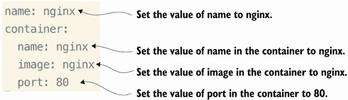

图 4.14 如何创建一个值文件并将值应用到 Pod 清单的 Helm 中

然后，一旦我们确定了这些值，实际 Helm 图表中的模板化看起来类似于我们之前创建的常规 Pod YAML 文件，但它们使用模板语法 `{{ .values.name }}` 而不是填充的值，如图 4.15 所示。

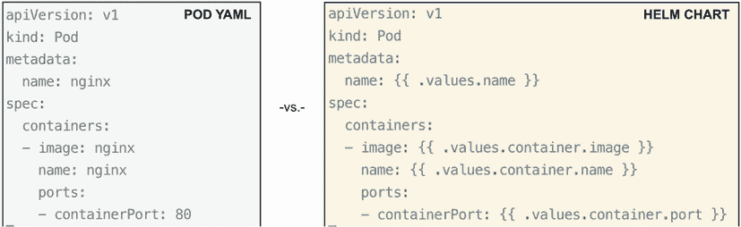

图 4.15 与我们之前创建的常规 Pod YAML 文件相比，具有模板化值的 Helm 图表

现在我们已经知道了模板文件的作用（它将您的 YAML 文件模板化），您可能想知道我们如何将值文件应用到我们的 Helm 图表中。好吧，我们只需运行 `helm install` 命令并使用 `--values` 标志。所以，要安装 MetalLB Helm 图表，请执行命令 `helm install metallb metallb/metallb --values values.yaml`。但是等等！我们还没有创建值文件。现在让我们使用以下 YAML 并将其保存到名为 `values.yaml` 的文件中：

```
address-pools:
 - name: default
   protocol: layer2
   addresses:
   - 172.18.255.200-172.18.255.250
```

地址范围（172.18.255.200-250）位于您的 Docker 网桥网络地址范围内（您的范围可能不同）。要找到 `kind` Docker 网桥 CIDR，请使用命令 `docker network inspect -f '{{.IPAM.Config}}' kind`（输入 `exit` 退出 `kind-control-plane` 命令行）。一旦创建了 `values.yaml` 文件，您就可以运行命令 `helm install metallb metallb/metallb --values values.yaml`（输入 `docker exec -it kind-control-plane bash` 返回到 `kind-control-plane` 命令行）：

```
root@kind-control-plane:/# helm install metallb metallb/metallb --values 
➥ values.yaml
NAME: metallb
LAST DEPLOYED: Tue Sep  6 19:06:07 2022
NAMESPACE: default
STATUS: deployed
REVISION: 1
TEST SUITE: None
NOTES:

MetalLB is now running in the cluster. Now you can configure it via its 
➥ CRs. Please refer to the MetalLB official docs on how to use the CRs.
```

现在我们已经通过 Helm 部署了 MetalLB 负载均衡器，我们可以看到它不仅仅是一个单一的资源。它创建了一个 Deployment、一个 DaemonSet、四个 Secrets、两个 Service Accounts 和一个 ConfigMap，如图 4.16 所示（通过运行 `k get po,deploy,ds,secret,sa,cm` 获取）（我们只需运行 `helm install`，它就安装了所有这些！真酷，不是吗？这让我想起了我坐在餐厅里点了一道美味的菜。我不知道它是如何制作的，也不知道所有的配料是什么；它只是从厨房里热腾腾地端出来，味道如此美味！）

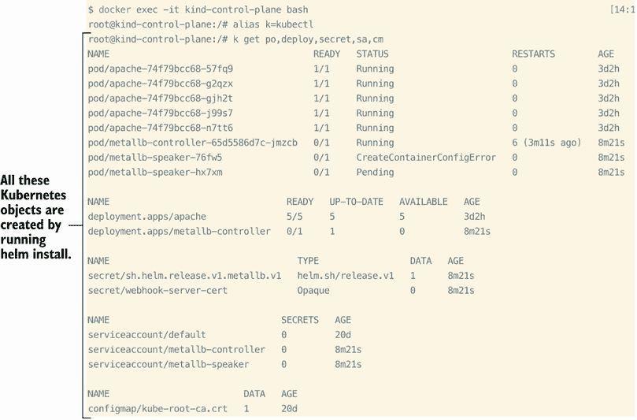

图 4.16 通过 Helm 图表简化 Kubernetes 调度并创建多个 Kubernetes 对象

要列出我们已安装的 Helm 图表，我们可以运行命令 `helm ls`：

```
root@kind-control-plane:/# helm ls
NAME       NAMESPACE    REVISION    UPDATED                  
➥                   STATUS      CHART             APP VERSION
metallb    default      1           2022-09-06 19:06:07.164270451 +0000 UTC
➥     deployed    metallb-0.13.5    v0.13.5
```

我们将在第六章中回到使用 MetalLB。现在，这只是一个使用 Helm 和使用自定义值安装 Helm 图表的好习惯。

## 4.3 Pod 元数据

在详细讨论了调度之后，让我们谈谈在 Kubernetes 中调度应用程序之前你可以进行的一些自定义设置。本节将介绍几个选项，但正如你所想象的那样，没有一种大小适合所有情况。并非所有 Kubernetes 对象（部署、Pod、机密、配置映射等）都是用相同的方式创建的。有时你需要考虑底层硬件，不仅是在选择将 Pod 调度到哪个节点方面，正如我们在第 4.1.2 节和第 4.1.3 节中讨论的那样，而且还要考虑资源限制、附加功能和每个应用程序可能需要的独特特性。让我们从资源请求和限制开始，这将帮助我们调度到具有充足资源（CPU 和 RAM）的节点上的 Pod。

### 4.3.1 资源请求和限制

资源请求与标签类似，它们向调度器提供信息，以确定 Pod 将被调度到哪个节点或放置在哪个节点上。请求以 Pod 运行最优所需的 CPU 和 RAM 的最小值的形式出现。限制也以 CPU 或 RAM 的值的形式出现，但确定 Pod 应该消耗的最大值，与最小值相对。这两个参数不必同时定义——这意味着你可以应用请求而不设置限制，反之亦然。同样，你可以在不指定 RAM 请求的情况下仅指定 CPU 请求。因此，这些字段相互独立，完全是可选的。

在 CKA 考试中，你将接受关于资源限制及其如何影响 Pod 调度知识的测试。一个可能的考试提示可能是：“节点‘worker-1’有 500MB 的内存和 0.5 个 CPU 可用。调度一个 Pod，允许这种内存和 CPU 限制，并且仍然调度到该节点。”知道如何修改 Pod YAML 以更改资源限制将使你能够在考试当天成功完成此类问题。

你可以通过将资源请求和限制添加到容器规范中，通过 YAML 为 Pod 应用资源请求和限制。与容器的名称和镜像一起，你可以在资源下方添加请求和限制作为值。为了最好地完成这项任务（而无需知道 YAML 中的确切位置），你可以再次通过执行命令`k run nginx2 --image=nginx --dry-run=client -o yaml > nginx2.yaml`来对 Pod 进行干运行。

当你在你喜欢的文本编辑器中打开文件时，你将已经看到资源部分。正如我们从 YAML 语言中了解到的，我们可以在 `resources` 单词下方简单地缩进两个空格，并开始定义我们的请求和限制。单词 `resources` 用于插入资源限制和请求。资源请求是你可以为 Pod 指定的 CPU 和内存的最小值。资源限制是你可以为相同内容指定的限制。我们将在本书的后面部分介绍资源限制和请求。现在，让我们删除 `resources` 单词后面的花括号，因为花括号表示一个空条目，所以我们没有为我们的 Pod 指定任何资源限制或请求。删除它们将产生相同的效果。对于这个容器，我们将请求 100 milicores 的 CPU 和 128 mebibytes，并将容器限制在不超过 2 个 CPU 和 1 个千兆字节的内存。你可以在图 4.17 中看到在 YAML 规范中插入请求和限制的位置。

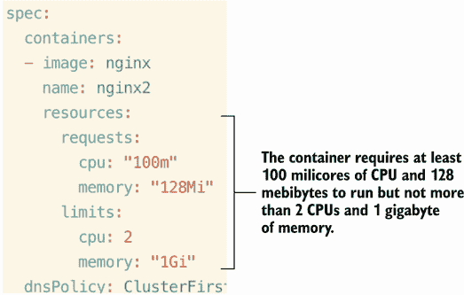

图 4.17 在 Pod YAML 中何处插入 Pod 的资源请求

现在，你可能想知道为什么 CPU 和内存有不同的度量。在 Kubernetes 生态系统中，CPU 的限制和请求是以 CPU 单位来衡量的。一个 CPU 单位相当于 1 个物理 CPU 核心，或者 1 个在物理机器内部运行的虚拟核心，具体取决于节点是物理主机还是虚拟机。你可以用 milicores 来写这个值，而 1000m 的值就等同于 1 个 CPU。也可以允许分数请求，所以我们可以输入 0.5 CPU 的值（等于 500m）。内存是以 mebibytes 为单位来衡量的，这是一个基于 2 的幂的度量（1 个 mebibyte 等于 2²⁰ 或 1,048,576 字节）。

我们指定请求和限制的原因是，如果一个 Pod 运行的节点有足够的资源可用，那么容器使用比其请求的资源更多的资源是可能的（也是允许的）。然而，容器不允许使用超过其资源限制的资源。

### 4.3.2 多容器 Pod

在 Kubernetes 中，有时在同一个 Pod 中运行多个容器是有意义的。在某些情况下，这可能很有用，因为 Pod 内的每个容器都共享名称网络命名空间和存储，因此通信更快，你不必建立额外的服务和网络策略来在 Pod 之间通信。在同一个 Pod 内创建多个容器有几个原因。一个是用于日志收集，所有应用程序日志都会发送到一个专门用于日志的单独容器。另一个原因是确保另一个容器或服务的初始化——换句话说，从一个容器中运行命令将验证 MySQL 服务是否正在运行，例如。同一个 Pod 中的容器还可以共享存储。因此，你可以将卷附加到两个 Pod 上，并将数据同时流式传输到该卷。如果其中一个容器将日志输出到文件，然后另一个容器读取它们，这可能很有用。在这种情况下，第二个容器有时被称为“sidecar 容器”。这是因为它不是作为主应用程序运行；它只是协助收集日志。

让我们运行以下命令来创建一个 sidecar 容器，看看这个操作的实际效果：`k run sidecar --image=busybox --command "sh" "c" "while true; do cat /var/log/nginx/error.log; sleep 20; done" --dry-run=client -o yaml > sidecar.yaml`。现在，用你喜欢的文本编辑器打开文件`sidecar.yaml`。将`c`改为`-c`，并添加另一个容器作为当前 sidecar 容器的主体容器。此外，为了允许 sidecar 容器读取日志数据，我们将添加一个挂载到`emptyDir`卷类型的卷挂载，如图 4.18 所示。

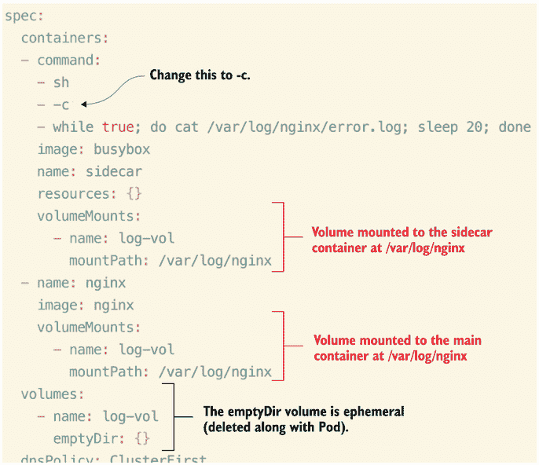

图 4.18 向 Pod 添加额外的容器，用于从主应用程序读取日志

`emptyDir`卷是与容器同生共死的多种卷类型之一。这是一种临时存储，因此一旦 Pod 被删除，数据也会被删除并永远消失。

在同一个 Pod 中创建多个容器的另一个用例是确保主应用程序容器初始化。这被称为*初始化容器*，因为它的唯一任务是检查主容器或执行某些任务，一旦完成其工作，任务就完成了，不会继续运行。

你可以将初始化容器添加到任何 Pod 清单中，与容器的规范一致。为了快速创建我们的起始 YAML，让我们运行命令 `k run init --image=busybox:1.35 --command "sh" "c" "echo The app is running! && sleep 3600" --dry-run=client -o yaml > init.yaml`。然后，我们将按照单词 `container` 的方式输入 `initContainers:`。对于其他所有内容，我们将模仿现有的容器，除了命令。我们将运行 `until` 循环 `until nslookup init-svc; do echo waiting for svc; sleep 2; done`。完整的 YAML 应该看起来与图 4.19 中看到的内容相似。

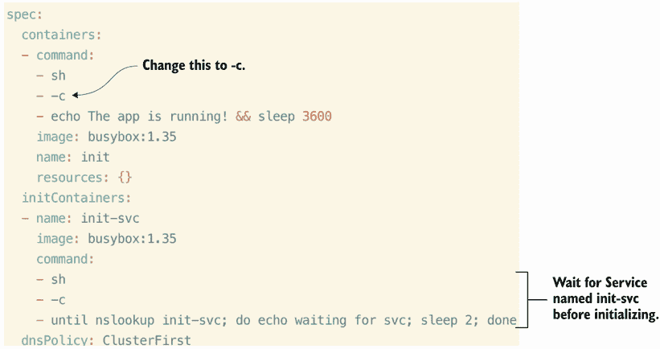

图 4.19 初始化容器不会允许主应用程序在创建服务 `init-svc` 之前启动。

指定一个初始化容器与普通容器非常相似，但当你开始创建 Pod 时，你会更清楚地注意到它们之间的区别。在创建时，你会看到 Pod 进入挂起状态。它将保持挂起状态，直到你创建名为 `init-svc` 的服务。当你使用命令 `k create svc clusterip init-svc --tcp 80` 创建服务时，Pod 将从 `Init:0/1` 变为 `running`：

```
root@kind-control-plane:/# k apply -f init.yaml
pod/init created
root@kind-control-plane:/# k get po
NAME   READY   STATUS     RESTARTS   AGE
init   0/1     Init:0/1   0          7s
root@kind-control-plane:/# k create svc clusterip init-svc --tcp 80
service/init-svc created
root@kind-control-plane:/# k get po
NAME   READY   STATUS     RESTARTS   AGE
init   0/1     Init:0/1   0          79s
root@kind-control-plane:/# k get po
NAME   READY   STATUS     RESTARTS   AGE
init   0/1     Init:0/1   0          4m17s
root@kind-control-plane:/# k get svc
NAME         TYPE        CLUSTER-IP     EXTERNAL-IP   PORT(S)   AGE
init-svc     ClusterIP   10.96.162.73   <none>        80/TCP    6m44s
kubernetes   ClusterIP   10.96.0.1      <none>        443/TCP   10h
root@kind-control-plane:/# k get po
NAME   READY   STATUS    RESTARTS   AGE
init   1/1     Running   0          7m20s
```

注意，Pod 直到大约 7 分钟后才开始运行。所以如果你感到不耐烦，只需再等几分钟，直到 Pod 重新启动。

### 4.3.3 ConfigMaps 和 Secrets

因此，既然我们已经讨论了 Pods 请求 CPU 和内存，那么让我们通过讨论 Kubernetes 中的 ConfigMap 来看看 Pods 还可以请求什么。很多时候，你需要将配置数据传递给你的应用程序，无论是更改日志级别还是更改你的 Web 应用的背景颜色。最常见的方法是在 Kubernetes 中使用 ConfigMap 对象。

一旦创建了 ConfigMap 对象，你可以使用各种方法将其注入到 Pod 中。你可以通过环境变量或挂载到容器的卷将 ConfigMap 注入到 Pod 中。你可以从字面值（即用户名和密码）创建 ConfigMap，从文件（即 `ca.crt`）创建，或从目录中的多个文件创建。

你可以通过使用强制命令或创建 YAML 并将其检查到源代码中来创建 ConfigMap。因为我们更喜欢后者，让我们使用命令 `k create configmap redis-config --from-literal=key1=config1 --from-literal=key2=config2 --dry-run=client -o yaml > redis-config.yaml` 创建 YAML 并将其保存到文件中。此命令将创建一个名为 `redis-config` 的 ConfigMap，其中包含字面量键 `key1` 的值为 `config1`，以及字面量键 `key2` 的值为 `config2`。

我们将进行 dry run（即模拟创建资源）并最终将输出保存到名为 `redis-config.yaml` 的文件中。当我们用文本编辑器打开这个文件时，我们会注意到键值对可以逐行建立。或者，我们也可以通过指定键然后一个管道符号（`|`）来执行多行参数，就像我们在前面的章节中所做的那样。让我们替换文件中现有的键值对，以便将 ConfigMap 数据存储在 Redis 缓存中供以后使用。为此，删除以 `key1` 和 `key2` 开头的行，并在我们的 YAML 文件中的 `data` 下添加一个名为 `redis-config` 的键，通过在 YAML 文件中的多行参数下添加它，类似于图 4.20。

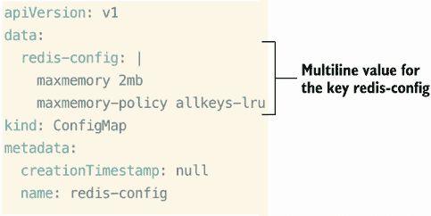

图 4.20 在 Kubernetes 中自动创建 ConfigMap 会将数据 Base64 编码。

现在我们已经为 ConfigMap 创建了 YAML 文件，保存并关闭文件。使用命令 `k apply -f redis-config.yaml` 创建 ConfigMap。

由于 ConfigMap 现在可供我们的应用程序使用，请继续创建一个 Redis Pod 的 YAML 文件，使用命令 `k run init --image=redis:7 --port 6379 --command 'redis-server' '/redis-master/redis.conf' --dry-run=client -o yaml > redis.yaml`。让我们为这个 Pod 添加一个用于 Redis 配置数据的卷挂载，以及一个 `emptyDir` 类型的卷用于任何临时数据。我们可以将卷和挂载路径插入到 YAML 规范中，如图 4.21 所示。

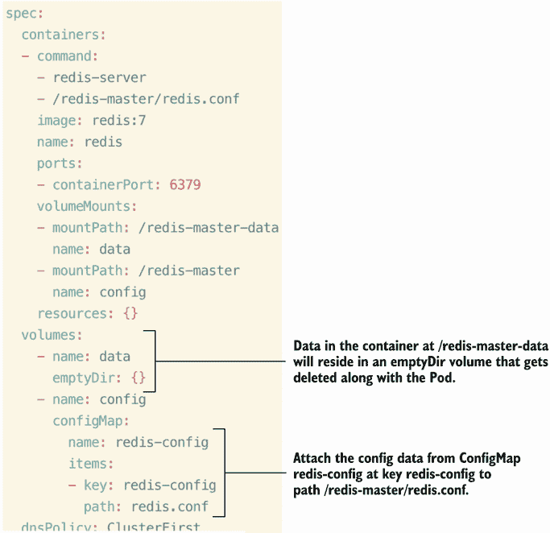

图 4.21 通过 `emptyDir` 卷将 ConfigMap 数据附加到容器中，确保卷名和 `mountPath` 名相同

我们将继续创建该 Pod，一旦它运行起来，我们将使用命令 `k exec -it redis --redis-cli` 在容器内放置一个带有 Redis CLI 提示的 shell。完成这些后，我们可以发出 Redis 特定的命令，这些命令是 `CONFIG GET maxmemory` 和 `CONFIG GET maxmemory-policy`，您将得到类似于图 4.22 的输出。

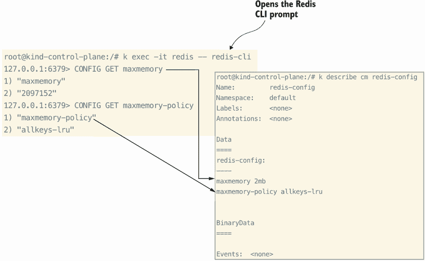

图 4.22 我们可以通过 Redis CLI 查看 ConfigMap 数据，并将其与原始 ConfigMap 数据相关联。

我们可以直接将这些与我们的 ConfigMap 数据匹配，并且它们匹配！这是将配置数据插入容器并使配置数据与主应用程序解耦的绝佳方式。

Secrets 与 ConfigMaps 类似，但不同之处在于它们存储的是密钥数据而不是应用程序配置数据。无论是数据库密码还是证书数据，您都可以使用 Base64 加密在 Kubernetes 中存储。然而，如果我说它是安全的，请不要相信我，因为它并不安全。任何有权访问您的集群的人都可以查看和读取密钥数据，因此永远不要将其作为您唯一的保护方法。

您可以使用熟悉的命令 `k create secret generic dev-login --from-literal=username=dev --from-literal=password= 'S!B\*d$zDsb=' --dry-run=client -o yaml > dev-login.yaml` 创建秘密。现在在您的文本编辑器中打开文件 `dev-login.yaml`，您会注意到用户名和密码都是 Base64 编码的。秘密值以 Base64 字符串的形式编码，并且默认情况下以未加密的方式存储，如图 4.23 所示。

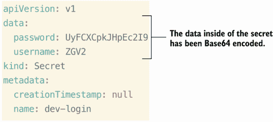

 我们名为 `dev-login` 的秘密中的所有数据都会自动进行 Base64 编码。

现在，使用命令 `k apply -f dev-login.yaml` 来创建秘密。我们可以通过将秘密挂载到容器内部的目录中来使其对 Pod 可用。首先，使用命令 `k run secret-pod --image=busybox --command "sh" "c" "echo The app is running! && sleep 3600" --dry-run=client -o yaml > secret-pod.yaml` 创建一个 Pod YAML 文件。让我们在文本编辑器中打开文件 `secret-pod.yaml` 并进行一些修改。我们将在 Pod 内部的容器中添加一个卷挂载，并添加一个类型为 Secret 的卷，Kubernetes 知道如何处理它。您可以在 Pod YAML 中指定此内容，如图 4.24 所示。

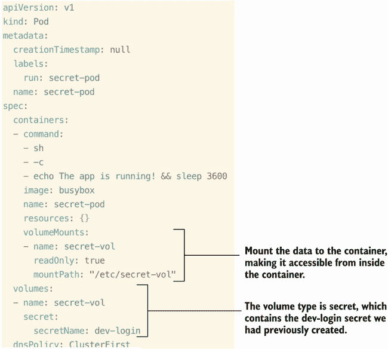

 将 Pod 要访问的秘密数据挂载，确保数据可以从容器内的 `/etc/secret-vol` 访达。

在这一点上，我们可以通过运行命令 `k exec secret-pod --cat /etc/secret-vol/username && echo` 和 `k exec secret-pod --cat /etc/secret-vol/password && echo` 在 Pod 内部查看我们的秘密数据。您将看到类似于图 4.25 的输出。

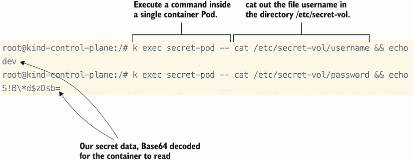

 通过在容器内运行命令可以获取秘密数据。

这不是向容器提供秘密数据的唯一方法；我们还可以通过 Pod 内的环境变量使用秘密。您可以在 `kubectl run` 命令后使用 `--env` 标志，例如 `k run secret-env --image=busybox --command "sh" "c" "printenv DEV_USER DEV_PASS; sleep 8200" --env=DEV_PASS=password --dry-run=client -o yaml > secret-env.yaml`。当您打开 `secret-env.yaml` 文件时，可以将 `value:` 替换为 `valueFrom:` 并删除 `password` 的值。在 `valueFrom:` 下方，您可以缩进两个空格并输入 `secretKeyRef:`。在其下方，您可以缩进两个空格并输入 `name:` 后跟之前创建的秘密名称，即 `dev-login`。然后，与名称对齐，您可以输入 `key:` 后跟 `username`，如图 4.26 所示。您可以为 Kubernetes 中的任何秘密或秘密值重复此操作。此外，多个 Pod 可以引用同一个秘密，因此我们不需要删除之前创建的 Pod（命名为 `secret-pod`）来在新的 Pod 中使用秘密。

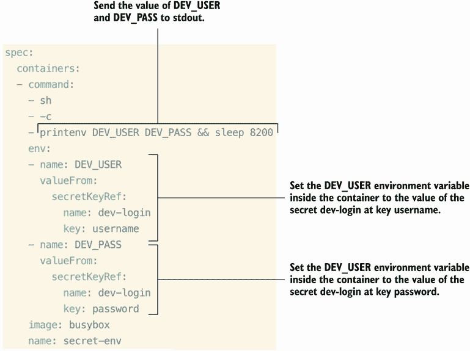

图 4.26 您可以通过环境变量将秘密数据传递给 Pod。在容器内设置命令以打印环境变量（`printenv`）。别忘了将`c`改为`-c`！

考试练习

创建一个名为`limited`的 Pod，使用镜像`httpd`，并将 CPU 的资源请求设置为 1Gi，内存设置为 100Mi。

创建一个名为`ui-data`的 ConfigMap，其键值对如下。将 ConfigMap 应用到名为`frontend`的 Pod 上，使用镜像`busybox:1.28`，并通过以下环境变量传递给它：

```
color.good=purple
color.bad=yellow
allow.textmode=true
how.nice.to.look=fairlyNice
```

## 摘要

+   术语*调度*指的是创建一个 Pod 并将其分配给一个节点。您可以通过节点选择器、节点名称或亲和规则来更改 Pod 分配到的节点。确保您知道这些调度更改的正确 YAML 语法。

+   您还可以应用标签来控制 Pod 的调度。就像节点选择器一样，您可以使用标签选择器根据 Pod 的标签将 Pod 调度到特定的节点。对于考试，了解如何将标签应用到节点和 Pod 上以影响调度。

+   就像 Linux 中的包管理器一样，Helm 是 Kubernetes 的包管理器和模板引擎。了解如何使用 Helm 进行考试以及如何使用 Helm 模板将应用程序部署到 Kubernetes。

+   使用资源请求和限制为 Pod 保留 CPU 和内存。这对于考试很重要，因为 Pod 或 Deployment 的 YAML 语法比大多数都要复杂一些。

+   在 Pod 内部创建多个容器有特定的原因。共享相同的网络命名空间和存储允许直接访问和双向通信。

+   在 Kubernetes 中使用 ConfigMaps 和 Secrets 将配置数据和敏感信息注入 Pod 中变得简单。确保您知道如何使用作为卷挂载到 Pod 中的 ConfigMaps 和 Secrets，以及环境变量。
