# 5 在 Kubernetes 中运行应用程序

本章涵盖

+   为高可用性扩展应用程序

+   执行滚动更新和回滚

+   通过暴露部署来创建服务

+   在 Kubernetes 集群上执行维护任务

本章涵盖了 Kubernetes 的操作方面，我们通过介绍如何维护已在 Kubernetes 中运行的应用程序来介绍。上一章介绍了如何创建 Deployment（包括模板化）、调度属性、ConfigMaps 和 Secrets。本章涵盖了你在考试中完成诸如为应用程序提供额外资源、扩展应用程序、为应用程序提供一致的端点以及推出应用程序新版本等任务时将采用的一些常见方法。在继续工作负载和调度考试课程的基础上，本章与上一章一起将涵盖考试的 15%，并且是完成在 Kubernetes 中运行的应用程序的高可用性和自我修复的一部分。

工作负载和调度领域

本章涵盖了 CKA 课程的工作负载和调度领域的一部分。该领域涉及我们在 Kubernetes 上运行应用程序的方式。它包括以下能力。

| 能力 | 章节部分 |
| --- | --- |
| 了解如何扩展应用程序。 | 5.1 |
| 理解 Deployment 以及如何执行滚动更新和回滚。 | 5.1 |
| 理解用于创建健壮、自我修复的应用程序 Deployment 的原语。 | 5.2 |

## 5.1 应用程序编排

Deployment 是 Kubernetes 中的一个核心对象，通过它你可以实现高可用性、健壮性和自我修复。无状态应用程序——正如其名所示——不包含状态（数据），因此 Pod（及其内部的容器）可以被替换和重新启动，而不会影响应用程序的整体健康。在 Kubernetes 中，无状态应用程序通常通过 Deployment 进行管理。相比之下，Kubernetes 中的 StatefulSet 对象不能像那样轻松地替换或重新启动，因为状态化应用程序的运行需要数据。例如 MySQL，数据被写入主数据库表并复制到额外的只读数据库实例。考试中不会测试 StatefulSets，所以我们只关注 Deployment。

### 5.1.1 修改运行中的应用程序

到目前为止，在这本书中，我们特别关注 Pod，这很好，但很多时候，仅有一个 Pod 对于你的应用程序是不够的。在 Kubernetes 中，有一种通过创建 Deployment 来创建冗余和容错的方法。CKA 考试将测试你修改现有 Deployment 的能力。这包括更改镜像和更改 Pod 副本的数量。CKA 考试中的一个任务可能看起来像以下这样。

| 创建一个名为 `apache` 的部署，使用镜像 `httpd:2.4.54` 并包含三个 Pod 副本。部署创建后，将部署扩展到五个副本，并将镜像更改为 `httpd:alpine`。 |
| --- |

如果你还没有访问现有的 Kubernetes 集群，附录 A 中解释了如何使用 kind 创建 Kubernetes 集群。一旦你的 kind 集群构建完成，请使用预安装在控制平面节点上的 `kubectl` 工具。你可以通过输入命令 `docker exec -it kind-control-plane bash` 并按照说明来获取控制平面节点的 Bash shell。

在 Kubernetes 的无状态应用中，创建相同应用的副本不是问题。这是因为所有微服务数据都与容器本身解耦；因此，无论请求是前往应用的第一个副本还是第十五个副本，都会得到相同的响应。让我们继续创建一个名为 `apache` 的部署，使用命令 `k create deploy apache --image httpd:2.4.54` `--replicas 3`。现在我们已经创建了部署，我们可以使用命令 `k get deploy` 检查状态，我们会看到有三个副本。因为我们想将副本数量增加到五个，所以你需要运行命令 `k scale deploy apache --replicas 5` 来“扩展部署”，这将把部署从一个 Pod 扩展到两个 Pod：

```
root@kind-control-plane:/# k create deploy apache --image httpd:2.4.54 -
➥ replicas 3
deployment.apps/apache created
root@kind-control-plane:/# k get deploy
NAME                 READY   UP-TO-DATE   AVAILABLE   AGE
apache               3/3     3            3           14s
root@kind-control-plane:/# k scale deploy apache --replicas 5
deployment.apps/apache scaled
root@kind-control-plane:/# k get po
NAME                                  READY   STATUS                       
➥ RESTARTS       AGE
apache-74f79bcc68-7lzqz               1/1     Running                      
➥ 0              7s
apache-74f79bcc68-89zwg               1/1     Running                      
➥ 0              33s
apache-74f79bcc68-v6drf               1/1     Running                      
➥ 0              33s
apache-74f79bcc68-x7bfw               1/1     Running                      
➥ 0              33s
apache-74f79bcc68-xdx4b               1/1     Running                      
➥ 0              7s
```

你会注意到 Pod 前缀与部署的名称相同，后面跟着一个哈希值后缀，最后五个是唯一的，因为在集群中不允许有重复的 Pod 名称。

现在我们有一个新的部署正在运行，让我们将部署的镜像从 `httpd:2.4.54` 更改为 `httpd:alpine`。我们可以通过运行命令 `k set image deploy apache httpd=httpd:alpine` 来更新镜像；通过执行命令 `k get po`，你会看到为部署创建了一整套全新的 Pod：

```
root@kind-control-plane:/# k get po
NAME                                  READY   STATUS                       
➥ RESTARTS         AGE
apache-74f79bcc68-7lzqz               1/1     Running                      
➥ 0                26m
apache-74f79bcc68-89zwg               1/1     Running                      
➥ 0                26m
apache-74f79bcc68-v6drf               1/1     Running                      
➥ 0                26m
apache-74f79bcc68-x7bfw               1/1     Running                      
➥ 0                26m
apache-74f79bcc68-xdx4b               1/1     Running                      
➥ 0                26m
root@kind-control-plane:/# k set image deploy apache httpd=httpd:alpine
deployment.apps/apache image updated
root@kind-control-plane:/# k get po
NAME                                  READY   STATUS                       
➥ RESTARTS         AGE
apache-698b8cccbd-45nzs               1/1     Running                      
➥ 0                2s
apache-698b8cccbd-bz4bm               1/1     Running                      
➥ 0                6s
apache-698b8cccbd-dx4j2               1/1     Running                      
➥ 0                6s
apache-698b8cccbd-jrz86               1/1     Running                      
➥ 0                2s
apache-698b8cccbd-z8vnl               0/1     ContainerCreating            
➥ 0                6s
apache-74f79bcc68-89zwg               1/1     Terminating                  
➥ 0                27m
apache-74f79bcc68-v6drf               1/1     Terminating                  
➥ 0                27m
apache-74f79bcc68-x7bfw               1/1     Terminating                  
➥ 0                27m
apache-74f79bcc68-xdx4b               1/1     Terminating                  
➥ 0                26m
```

以这种方式修改部署意味着在新的部署版本（带有新镜像）推出时，应用没有停机时间。这也为服务最终用户提供了灵活性和更高的敏捷性，能够应对负载峰值，并能够以最小停机时间逐步更改应用和添加功能。Deployment 资源是 Kubernetes 中最常用的，因为它充分利用了原生生态系统，我们将在本章接下来的部分中更多地关注它。

### 5.1.2 应用维护

Deployment 是设计用来运行同一应用程序的多个实例，通过复制提供对最终用户的更高可用性。提供额外功能的 Deployment 抽象是 ReplicaSet。正如其名所示，ReplicaSet 的目的是在任何给定时间维护一组稳定的副本 Pod。这保证了指定数量的相同 Pod 的可用性。使用命令 `k get rs` 列出你的集群中的 ReplicaSets。你应该得到以下类似的输出：

```
root@kind-control-plane:/# k get rs
NAME                DESIRED   CURRENT   READY   AGE
apache-74f79bcc68   1         1         1       28m 
```

在图 5.1 中，你会看到 Deployment 和 ReplicaSet 的表示，它们由运行 NGINX 的三个复制 Pod 组成，作为 Kubernetes 对象组合的一部分。

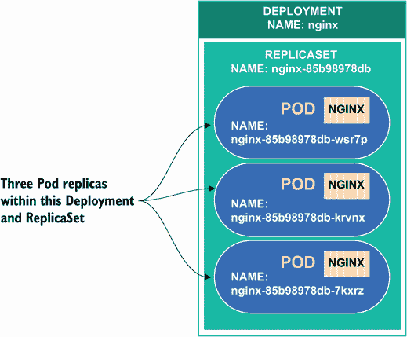

图 5.1 部署内的一个副本集，包含三个副本，显示了 Kubernetes 对象的命名方案

说到 Deployment 配置 YAML，让我们看看 Pod YAML 与 Deployment YAML 的区别。实际上比你想象的要简单。你基本上是将 Pod YAML 放在 Deployment YAML 中 `spec:` 下 `template:` 部分的区域。为了证明这一点，让我们执行两个不同的命令——一个用于创建 Pod YAML 文件，另一个用于创建 Deployment YAML 文件。创建 Pod YAML 文件的命令是 `k run nginx --image nginx --dry-run=client -o yaml > pod.yaml`，创建 Deployment 的命令是 `k create deploy nginx --image nginx --dry-run=client -o yaml > deploy.yaml`。你可以在图 5.2 中看到 `pod.yaml` 文件和 `deploy.yaml` 文件之间的相似性。

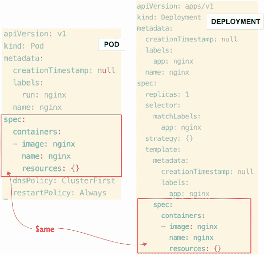

图 5.2 Pod 的 YAML 与 Deployment 的 YAML 的比较

通过 YAML 创建的 Deployment 规范与 Pod 规范完全相同，只是在它上面还有一个额外的 Deployment 规范作为父资源。因此，有一个 Deployment 规范，而在 Deployment 规范内部，还有 Pod 规范。这很简单，对吧？

我们可以使用本章开头练习中创建的 Deployment，或者使用命令 `k create -f deploy.yaml` 从我们刚刚创建的文件生成 Deployment。我们可以使用命令 `k get deploy` 查看 Deployment 状态，并在 `READY` 列中查看副本数量。我们将看到名为 `apache` 的 Deployment 有五个副本，因为我们没有在 `kubectl create` 命令中指定任何副本，所以名为 `nginx` 的 Deployment 只有一个副本。你可以再次使用命令 `k get rs` 列出 ReplicaSets：

```
root@kind-control-plane:/# k create deploy nginx --image nginx --dry-
➥ run=client -o yaml > deploy.yaml
root@kind-control-plane:/# k create -f deploy.yaml
deployment.apps/nginx created
root@kind-control-plane:/# k get deploy
NAME                 READY   UP-TO-DATE   AVAILABLE   AGE
apache               5/5     5            5           97m
nginx                1/1     1            1           6s
root@kind-control-plane:/# k get rs
NAME                            DESIRED   CURRENT   READY   AGE
apache-698b8cccbd               5         5         5       74m
apache-74f79bcc68               0         0         0       101m
nginx-76d6c9b8c                 1         1         1       4m38s
```

你会注意到输出中有两个 ReplicaSets 以 `apache` 开头，因为我们之前更改了镜像，Deployment 控制器创建了一个新的 ReplicaSet，因为它包含不同的配置。默认情况下，所有 Deployment 的滚动历史都会保留在系统中，这样你就可以随时回滚。我们将在本章后面回顾滚动和回滚。

您可以通过修改 `deploy.yaml` 文件，或输入命令 `k scale deploy nginx --replicas 2` 来像本章开头那样缩放此 Deployment。在修改 YAML 时，您可以在文本编辑器中打开文件，将显示为 `replicas: 1` 的行更改为 `replicas: 2`，如图 5.3 的 YAML 文件快照所示。保存文件后，您可以使用命令 `k apply -f deploy.yaml` 应用相同的 YAML 文件。您可能会收到资源缺少“last-applied configuration”的警告，但您可以安全地忽略此警告，因为 Deployment 仍然缩放到两个副本。

最后应用的配置在创建对象时作为注释添加到对象中。注释包含用于创建对象的配置文件的内容。警告表明此注释缺失；因此，新配置文件将与当前配置合并。

我们在这里使用 `apply` 而不是 `create`，因为 Deployment 已经存在。`apply` 命令会覆盖现有对象，或者如果资源不存在，则会创建它。`create` 命令只有在对象不存在时才会创建对象，如果对象已存在，则会返回错误。

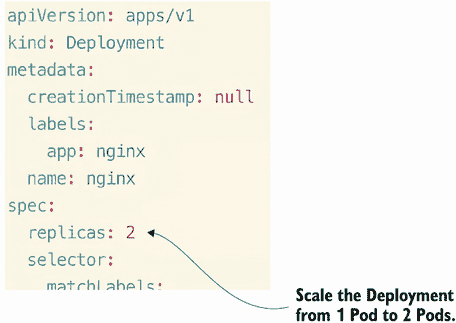

图 5.3 通过更改 Deployment YAML 中的副本数量来缩放 Deployment。

Deployment 从一个 Pod 缩放到两个 Pod，您可以使用命令 `k get deploy nginx -o yaml` 查看副本的变化。在幕后，与该 Deployment 关联的 ReplicaSet 也被修改了。我们可以通过运行命令 `k describe rs` 来查看副本集中的事件；您会看到一个类似于图 5.4 的输出。


图 5.4 描述 ReplicaSet 以获取有关其配置更改的更多信息。

ReplicaSet 与 Deployment 同时创建。如果我们删除 Deployment，我们会看到 ReplicaSet 也会被删除。使用命令 `k delete deploy nginx` 删除 Deployment：

```
root@kind-control-plane:/# k delete deploy nginx
deployment.apps "nginx" deleted
root@kind-control-plane:/# k get deploy
No resources found in default namespace.
root@kind-control-plane:/# k get rs
No resources found in default namespace.
```

考试提示：如果您想一次性描述所有内容（即所有 ReplicaSet），而不是在命令行中逐个列出名称，您只需输入资源的名称（例如，`k describe rs`），输出将包括当前存在的所有资源。

因此，我们已经看到了如果我们修改 Deployment 副本数量时 ReplicaSet 会发生什么。如果我们修改 Deployment 图像，它将创建一个新的 ReplicaSet，就像我们之前看到的那样。ReplicaSet 包含了一组新的 Pod，具有新的名称和新的配置，如图 5.5 所示。

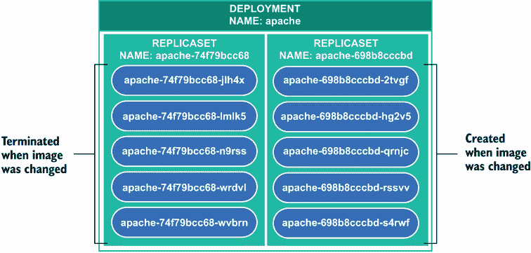

图 5.5 当 Deployment 图像更改时，会创建一个新的 ReplicaSet，并带有新的 Pod 副本集。

如果你足够快，你可以看到旧 Pod 正在终止，新 Pod 正在创建。你可以在运行 `set image` 命令后不超过 3 秒内运行 `k get po` 命令。这样做后，你会看到一个类似于图 5.6 的输出。你也可以运行命令 `k get po -w` 来实时观察 Pod 状态的变化。

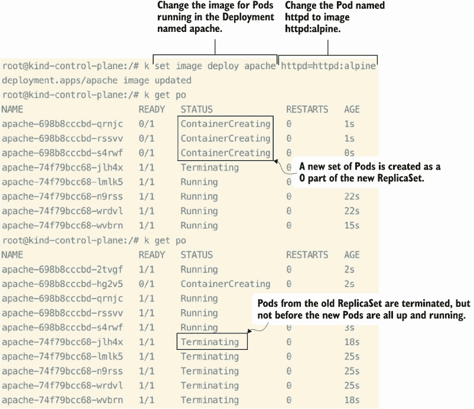

图 5.6 更改 Deployment 中的 Pod 的镜像会导致新的 ReplicaSet。

你会发现 `kubectl get po` 命令的输出中有很多有趣的信息，包括 Pod 的名称实际上来自 ReplicaSet 的名称。此外，旧 ReplicaSet 的 Pod 不会终止，直到新 ReplicaSet 的所有 Pod 都启动并运行。这被称为**滚动更新策略**，确保应用程序即使在升级场景中也能继续运行。这防止了应用程序的停机，并确保如果有人试图从集群外部访问应用程序，不会断开任何连接，如图 5.7 所示。

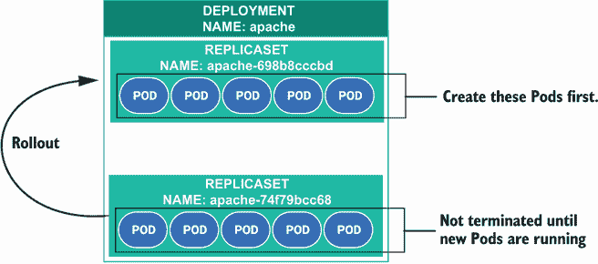

图 5.7 Kubernetes 中的滚动更新策略，表示在部署新版本时，只有一定数量的副本 Pod 不可用。

这就是包含相同应用程序多个副本的无状态应用程序的好处。滚动更新策略在 Deployment 规范中定义，你可以通过运行命令 `k edit deploy apache` 来定位它。你会看到一个类似于图 5.8 的输出。如果在创建 Deployment 时没有定义策略，将应用默认策略，这被称为**滚动更新**。滚动更新就是我们刚才描述的，即旧 ReplicaSet 的 Pod 不会终止，直到新 ReplicaSet 的 Pod 准备就绪。另一种策略类型称为**重新创建**策略。重新创建策略会在新 ReplicaSet 的 Pod 运行之前终止旧 ReplicaSet 的 Pod。这种策略需要应用程序有一段时间的停机。

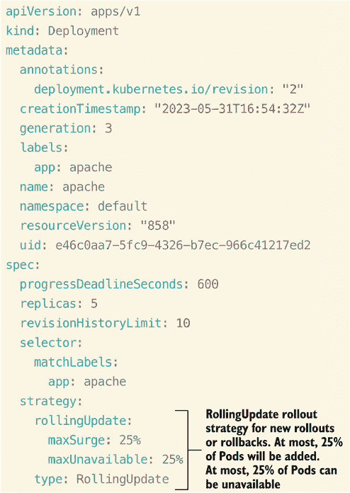

图 5.8 滚动更新策略设置为 `rollingUpdate`，最大激增为 25%，最大不可用为 25%。

如果你想将策略更改为重新创建，你需要将类型从 `rollingUpdate` 改为 `Recreate`，并删除以 `rollingUpdate`、`maxSurge` 和 `maxUnavailable` 开头的行。重新创建策略对许多 Deployment 来说是个好选择，因为它提供了最快的滚动更新策略，但正如我们讨论的那样，会有停机时间。

**考试技巧**：如果在考试中发现自己不知道 YAML 文件中的值应该放在哪里，可以使用 `k explain` 命令。例如，命令 `k explain deploy.spec.strategy` 会列出在 `spec` 字段中可输入的值。试试看吧！

在滚动更新发布策略中，`max surge`和`max unavailable`字段是可选的，可以是百分比或整数。`max surge`指定可以创建的 Pod 数量，超过部署中副本的数量。例如，在图 5.8 中，因为副本数量是三个，`maxSurge`是 25%，Pod 的数量不能超过四个（百分比向上取整）。`max unavailable`正如其名——可以不可用的 Pod 数量。在我们的例子中，由于`maxUnavailable`设置为 25%，一次最多只能有一个 Pod 不可用。

等等，还有更多！除了 ReplicaSet 之外，还有针对 Deployments 的跟踪能力，称为*滚动发布*。

### 5.1.3 应用程序滚动发布

应用程序滚动发布是 Kubernetes 管理员或开发者回滚到之前版本或记录部署的修订次数的一种方式，如图 5.9 所示。

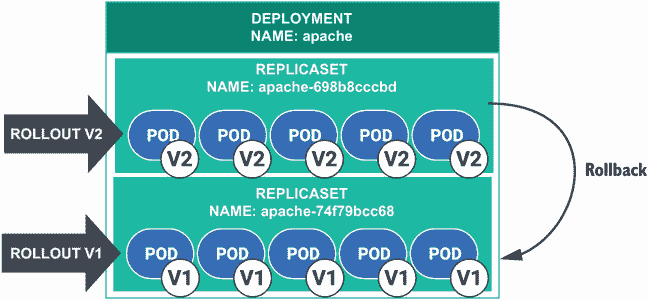

图 5.9 显示了两个滚动发布修订版，以防你需要回滚到应用程序的早期版本。

每当在部署内部更改 Pod 时，都会创建一个新的修订版。我们可以通过输入命令`k rollout history deploy apache`来查看滚动发布的历史：

```
root@kind-control-plane:/# k rollout history deploy apache
deployment.apps/apache
REVISION  CHANGE-CAUSE
1         <none>
2         <none>
```

在这种情况下，有两个修订版，一个是在我们使用`k create deploy`命令创建部署时的初始部署，另一个是在我们将镜像标签从`alpine`更改为`2`时。

如果你查看`CHANGE-CAUSE`列，你会看到它写着`none`。`change-cause`列是一个记录与你的部署更改相关的笔记的机会。所以，假设你想要在`change-cause`列中添加一条笔记，内容为“更新镜像标签从`alpine`到 2。”你可以通过输入命令`k annotate deploy apache kubernetes.io/change-cause="updated image tag from alpine to 2"`来应用这个更改到修订版 2：

```
root@kind-control-plane:/# k annotate deploy apache kubernetes.io/change-
➥ cause="updated image tag from alpine to 2"
deployment.apps/apache annotated
root@kind-control-plane:/# k rollout history deploy apache
deployment.apps/apache
REVISION  CHANGE-CAUSE
1         <none>
2         updated image tag from alpine to 2
```

如你所见，修订版 2 的`change-cause`列已经被更改。现在你可以知道为什么部署被修订，以及从修订版 1 到修订版 2 发生了哪些变化。

有这样的修订历史记录允许你回滚到之前的修订版，这被称为*回滚*。假设当你部署了应用程序的新版本并更改了部署的镜像标签时，你在应用程序中引入了一个错误。你必须迅速回滚以防止应用程序的用户遇到这个错误。你可以通过命令`k rollout undo deploy apache`回滚到之前的修订版：

```
root@kind-control-plane:/# k rollout undo deploy apache
deployment.apps/apache rolled back
root@kind-control-plane:/# k rollout history deploy apache
deployment.apps/apache
REVISION  CHANGE-CAUSE
2         updated image tag from alpine to 2
3         <none>
```

你已经回滚到了上一个修订版，这反过来又创建了一个新的修订版。修订版号永远不会倒退；它总是向前推进。你现在可以通过命令`k annotate deploy apache kubernetes.io/change-cause="reverted back to the original"`在修订版 3 的`change-cause`列中输入一条消息：

```
root@kind-control-plane:/# k annotate deploy apache kubernetes.io/change-
➥ cause="reverted back to the original"
deployment.apps/apache annotated
root@kind-control-plane:/# k rollout history deploy apache
deployment.apps/apache
REVISION  CHANGE-CAUSE
2         updated image tag from alpine to 2
3         reverted back to the original
```

两个修订版都记录了备注。你再也看不到修订版 1 了，因为回滚到修订版 1 将与回滚到修订版 3 相同，所以为了节省重复，修订版 1 被删除。

假设你想检查发布的状态。也许发布并不顺利。这可能发生在镜像标签不可用的情况下。也许你输入错误，或者镜像标签已不再从你的镜像仓库中可用。你可以根据修订版使用命令 `k rollout status deploy apache --revision 3` 来检查你的发布状态：

```
root@kind-control-plane:/# k rollout status deploy apache --revision 3
deployment "apache" successfully rolled out
```

当我们回滚到修订版 1 时，我们的部署成功发布，这是好的。我们没有拼写错误或不可用的镜像。太好了！

最后，我想展示如何暂停发布，以便只有部署中的一些 Pod 在修订版 3 上，而一半的 Pod 在修订版 4 上。我们可以通过命令 `k set image deploy apache httpd=httpd:2.4` 和 `k rollout pause deploy apache`（注意：你必须在这两个命令之间的一秒内执行）来看到这个动作。当你获取发布状态时，你会看到一个消息说“等待部署‘apache’发布完成：3 个新副本中有 2 个已被更新……”，这意味着发布已暂停。

```
root@kind-control-plane:/# k set image deploy apache httpd=httpd:2.4
deployment.apps/apache image updated
root@kind-control-plane:/# k rollout pause deploy apache
deployment.apps/apache paused
root@kind-control-plane:/# k rollout status deploy apache
Waiting for deployment "apache" rollout to finish: 2 out of 3 new replicas 
➥ have been updated...
```

现在有三分之二的新副本正在作为新修订版的一部分运行。让我们继续使用命令 `k rollout resume deploy apache` 恢复（取消暂停）部署，以便修订版可以完成：

```
root@kind-control-plane:/# k rollout resume deploy apache
deployment.apps/apache resumed
root@kind-control-plane:/# k rollout status deploy apache
deployment "apache" successfully rolled out
```

现在我们已成功发布到修订版 4，其中部署中 Pod 的新镜像设置为`httpd:2.4`。

考试提示：如果你不确定命令的顺序或需要常见命令的示例，请使用终端中的帮助菜单，使用命令 `k rollout --help` 和 `k rollout status --help`，你可以轻松地获得正确的命令语法。

### 5.1.4 暴露部署

暴露部署意味着部署可以被终端用户访问，可能是在集群外部（取决于你创建的服务类型）。我们将在第六章深入探讨服务，但我想提到有一个简单的方法来创建一个与部署相连的服务。你不必从头创建服务，可以使用命令 `k expose deploy nginx --name nginx-svc --port 80 --type ClusterIP --dry-run=client -o yaml > nginx-svc.yaml`。你将在图 5.10 中看到该命令创建的 YAML 快照。当然，因为我们喜欢在 Kubernetes 中以声明式的方式做事，所以我们将进行 dry run 并创建一个名为`nginx-svc.yaml`的文件。

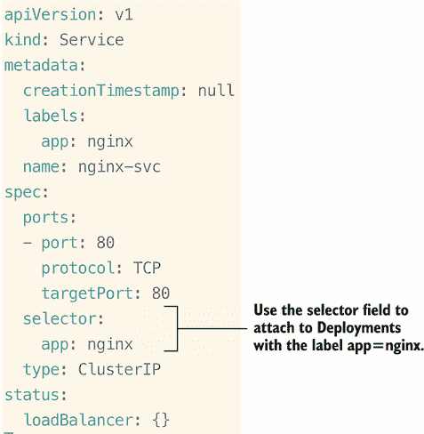

图 5.10 通过服务在 Kubernetes 中选择部署

关于 Deployment 的一个重要部分是选择器。如果你还记得，我们在上一章中讨论了节点选择器和标签选择器，而在这里我们讨论的是 *服务选择器*，用于将服务关联到 Deployment 内的 Pods。这个特定的服务将与任何具有标签 `app=nginx` 的 Deployment 关联。这是我们继续阅读本书时需要了解的有用信息，并且它将作为下一章深入讨论服务的知识基础。

考试练习

使用 `kubectl`，创建一个名为 `apache` 的 Deployment，使用镜像 `httpd:latest` 并设置一个副本。当 Deployment 运行后，将副本数扩展到五个。

将 Deployment `apache` 的镜像从 `httpd:latest` 更新为 `httpd:2.4.54`。不要创建新的 YAML 文件或编辑现有资源（仅使用 `kubectl`）。

使用 `kubectl`，查看由于上一练习中的镜像更改而创建的 ReplicaSet 的事件。

使用 `kubectl`，回滚到名为 `apache` 的 Deployment 的上一个版本。

对于现有的名为 `apache` 的 Deployment，将 Deployment 的回滚策略更改为 `Recreate`。

## 5.2 应用程序维护

在你的应用程序在 Kubernetes 中运行的生命周期中，可能会有这样的时刻：底层节点需要维护，或者应用程序需要额外的资源来优化性能。这突显了 Deployment 的健壮性，因为它们可以在集群中从节点到节点移动 Pods，而无需停机。由于冗余和高可用性内置在 Kubernetes 生态系统中，我们将学习如何安全地进行维护以创建健壮的应用程序 Deployment。

对于考试，你需要知道如何将 Pod 移动到不同的节点。考试任务可能如下所示。

| 考试任务 群集 `b8s` 中的节点 `kind-worker` 正在经历内存泄漏问题。你必须首先禁用对节点 `kind-worker` 的新 Pods 调度，然后关闭节点进行维护。然后，驱逐当前在 `kind-worker` 上运行的所有 Pods。最后，一旦你确认 `kind-worker` 上没有正在运行的 Pods，再次启用调度。 |
| --- |

对于这个考试任务，你将需要使用一个两节点 kind 集群，并且你需要将一个 Pod 转移到辅助节点，因此你至少需要在集群中有一个正在运行的 Pod。如果你无法访问两节点集群，我建议你按照附录 A 中的说明创建一个。一旦你使用命令 `docker exec -it kind-control-plane bash` 打开控制平面节点的 shell，你可以运行命令 `k create deploy nginx -image nginx` 以在集群中运行一个 Pod。现在你可以开始考试任务，通过禁用 `kind-worker` 节点的调度来开始。

要禁用对节点的调度，你可以使用命令 `k cordon no kind-worker`。你将得到类似以下的输出：

```
root@kind-control-plane:/# k cordon kind-worker
node/kind-worker cordoned
root@kind-control-plane:/# k get no
NAME                 STATUS                     ROLES           AGE     
➥ VERSION
kind-control-plane   Ready                      control-plane   7m      
➥ v1.25.0-beta.0
kind-worker          Ready,SchedulingDisabled   <none>          6m38s   
➥ v1.25.0-beta.0
```

如果你紧接着运行命令`k get no`，你会注意到状态从`Ready`变为`Ready,SchedulingDisabled`。所以如果你尝试创建第二个 Pod，Pod 将保持挂起状态，因为调度器已将该节点标记为不可用。我们可以通过命令`k create deploy nginx2 -image nginx`来观察这一行为，然后通过`k get po`命令查看状态。输出应该类似于以下内容：

```
root@kind-control-plane:/# k create deploy nginx2 --image nginx
deployment.apps/nginx2 created
root@kind-control-plane:/# k get po
NAME                     READY   STATUS    RESTARTS   AGE
nginx-76d6c9b8c-hr9z6    1/1     Running   0          111s
nginx2-b648d744f-n6xb9   0/1     Pending   0          3s 
```

我们需要将该节点上所有正在运行的 Pods 移动，以便进行维护。这个过程被称为*节点驱逐*，即在驱逐 Pods 并将它们移动到另一个节点。要在我们的双节点集群中完成此操作，我们首先必须移除应用于控制平面节点的污点，以防止 Pods 被调度到该节点。Pods 从工作节点（在我们驱逐它时）移动到控制平面节点。我们在第二章中讨论了污点，所以这应该是一个熟悉的概念。执行命令`k taint no kind-control-plane node-role.kubernetes.io/control-plane:NoSchedule-`以清除控制平面节点的污点。输出将类似于以下内容：

```
root@kind-control-plane:/# k taint no kind-control-plane node-
➥ role.kubernetes.io/control-plane:NoSchedule-
node/kind-control-plane untainted
```

现在控制平面节点已清除污点，我们可以使用命令`k drain kind-worker --ignore-daemonsets`来驱逐节点`kind-worker`。输出将类似于以下内容：

```
root@kind-control-plane:/# k drain kind-worker --ignore-daemonsets
node/kind-worker already cordoned
Warning: ignoring DaemonSet-managed Pods: kube-system/kindnet-h7695, kube-
➥ system/kube-proxy-j8wbc
evicting pod default/nginx-76d6c9b8c-hr9z6
pod/nginx-76d6c9b8c-hr9z6 evicted
node/kind-worker drained
root@kind-control-plane:/# k get po -o wide
NAME                     READY   STATUS    RESTARTS   AGE    IP           
➥ NODE
nginx-76d6c9b8c-4494r    1/1     Running   0          52s    10.244.0.7   
➥ kind-control-plane
nginx2-b648d744f-n6xb9   1/1     Running   0          3m6s   10.244.0.6   
➥ kind-control-plane 
```

你会看到，再次运行命令`k get po -o wide`后，Pods 正在控制平面节点上运行。为了完成我们的考试任务，让我们再次通过运行命令`k uncordon kind-worker`来启用节点的调度。输出将类似于以下内容：

```
root@kind-control-plane:/# k uncordon kind-worker
node/kind-worker uncordoned
```

这完成了考试任务。你现在应该熟悉如何使用`kubectl`的隔离、驱逐和解除隔离选项将 Pods 从一个节点移动到另一个节点。

### 5.2.1 隔离和驱逐节点

**隔离**是一个有趣的词，不是吗？其官方含义是围绕形成障碍，意味着一个保护性障碍。在 Kubernetes 的上下文中，隔离的行为发生在节点上，并标记节点为不可调度。如果你隔离一个节点，这将使节点停机并准备进行常规维护，如图 5.11 所示。你可能想知道是什么类型的维护。嗯，你可能需要升级节点的 RAM，修补安全漏洞，或者完全更换它。

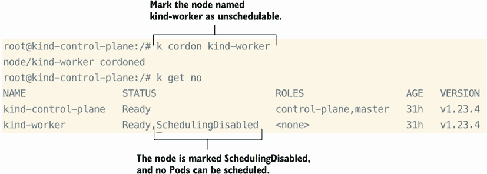

**图 5.11 隔离节点以禁用调度**。

正如你所见，当你执行命令`k cordon kind-worker`时，你禁用了对该节点的调度；因此，任何通常可以容忍此节点进行调度的 Pods 在隔离解除之前都不能这样做。

**考试提示**：在你隔离一个节点后，确保你解除隔离。如果节点已禁用调度，你可能会从最终分数中扣除一些分数。

那么，现有的运行在该节点上的 Pods 怎么办呢？您已经将该节点标记为不可调度，但这只适用于从那时起开始的调度。它不考虑如图 5.12 所示当前在该节点上运行的 Pods。您可能已经从本节的标题中猜到，将 Pod 从节点移除并在其他地方调度它们的行为被称为*清空*。

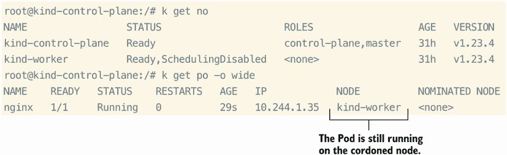

图 5.12 隔离节点并不意味着它会从节点中驱逐 Pod。

清空的行为正如其名——清空节点上所有当前运行的 Pods。如果 Pods 被 ReplicaSet 管理，调度规则仍然适用，并且实际上 Pod 并没有移动。它实际上是在另一个节点上被删除并重新创建的；只是确保在新的 Pod 运行之前，旧的 Pod 不会被移除，就像滚动更新一样。如果您还没有运行 Deployment，可以使用命令`k create deploy nginx --image nginx`来启动一个，您也可以跟随这个有趣的步骤。

在娱乐的精神下，让我们看看当节点被清空时，当前在该节点上运行的所有 Pods 会发生什么。为了清空节点并忽略在集群中每个节点上运行的 kube-proxy 和 kubenet DaemonSets，执行命令`k drain kind-worker --ignore-daemonsets --force`。在这种情况下，强制执行是必要的，因为其中一个 Pod 没有被 ReplicaSet 管理。您将看到类似于图 5.13 的输出。

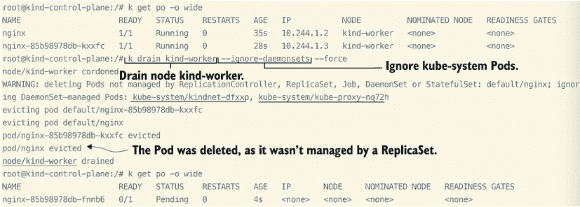

图 5.13 清空节点移除了在指定节点上运行的所有 Pods，其中一些被永久删除。

正如您所看到的，发生了几个动作。首先，节点被清空，Pods 被移除，但其中一个 Pod 被删除并且没有返回。这是因为它没有被 ReplicaSet 管理，所以没有机制来重新调度该 Pod。其次，属于 ReplicaSet 的 Pod 处于挂起状态。

正如我们在上一章所学，控制平面节点被应用了一个污点，这要求必须有一个容忍才能成功调度 Pod 到它们。在这种情况下，因为 Pod 没有对该污点的容忍，它将保持挂起状态，直到应用污点、为 Pod 添加容忍或者添加一个没有污点的新节点。为了简化起见，让我们使用命令`k taint no kind-control-plane node-role.kubernetes.io/master-`来移除污点：

```
root@kind-control-plane:/# k taint no kind-control-plane node-
➥ role.kubernetes.io/master-
node/kind-control-plane untainted
root@kind-control-plane:/# k get po -o wide
NAME                     READY   STATUS    RESTARTS   AGE   IP           
➥ NODE               
nginx-85b98978db-fnnb6   1/1     Running   0          20m   10.244.0.5   
➥ kind-control-plane
```

通过运行命令`k get po -o wide`，容器现在正在`kind-control-plane`节点上运行。在本章的后面部分，我们将尝试将节点加入集群，我们可以模拟另一个场景，其中 Pod 可能在没有将控制平面节点置于风险（通过限制资源）的情况下从挂起状态移动出来。现在，你可以使用命令`k uncordon kind-worker`取消对`kind-worker`节点的隔离。此外，你也可以使用命令`k taint no kind-control-plane node-role.kubernetes.io/master :NoSchedule`重新应用污点到控制平面节点。

### 5.2.2 添加应用程序资源（节点）

在你的 Kubernetes 集群的生命周期中可能会发生需要插入额外节点的情况——无论是你需要为你的应用程序提供更多资源，还是由于故障或计划内的停机而丢失了一个节点。无论原因如何，通过在 Kubernetes API 中启用引导令牌身份验证，将节点添加到现有的 kubeadm 集群都变得简单。一个考试问题可能如下所示。

| 考试任务 | 集群中有一个名为`ik8s`的第三个节点，但在你执行`kubectl get nodes`命令时，该节点没有出现。节点的名称是`node02`。通过重新创建`join`命令并确保在列出集群中的所有节点时节点处于`Ready`状态，允许`node02`加入集群。 |
| --- | --- |

当你首次创建 Kubernetes 集群时，kubeadm 会创建一个具有 24 小时 TTL 的初始引导令牌，但你可以在需要时创建额外的令牌。你可以通过打开文件`/etc/kubernetes/manifests/kube-apiserver.yaml`并查看`command`部分来查看我们的 kind Kubernetes 集群中启用的引导令牌机制。你将看到类似于图 5.14 的输出。

```
root@kind-control-plane:/# cd /etc/kubernetes/manifests/
root@kind-control-plane:/etc/kubernetes/manifests# ls | grep apiserver
kube-apiserver.yaml
```

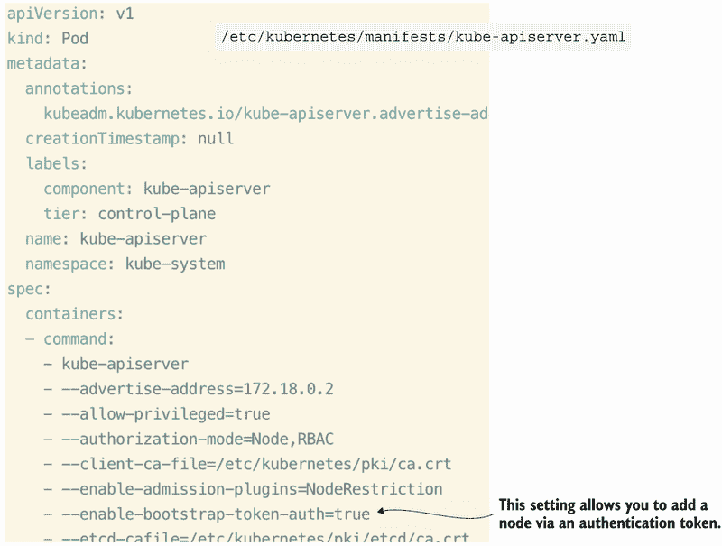

图 5.14 在 Kubernetes API 中启用引导令牌身份验证。

*引导令牌*本质上是用于创建新集群或将新节点加入现有集群时使用的持有令牌。这些令牌最初是为 kubeadm 构建的，但也可以在不使用 kubeadm 的其他场景中使用，例如与第三方应用程序一起使用。引导令牌的工作方式与 Service Account 令牌非常相似，即令牌允许第三方应用程序通过 Kubernetes API 进行身份验证并与集群内的对象进行通信。

在将节点加入集群的上下文中，引导令牌在加入集群的节点和控制平面节点之间建立了双向信任。我们可以在 kind Kubernetes 集群中使用以下命令生成一个新的令牌：`kubeadm token create --print-join-command`：

```
root@kind-control-plane:/# kubeadm token create --print-join-command
kubeadm join kind-control-plane:6443 --token l5kotg.hiivo73eu000bbfu -
➥ discovery-token-ca-cert-hash 
➥ sha256:13b3aac808908114d45b6ad91640babd8613d8136b21d405711a1204c68fa8a4
```

考试技巧：在考试当天，不要害怕使用帮助菜单（`kubeadm -help`）。帮助菜单将包含示例，在某些情况下，你可以直接复制粘贴到命令行中。

让我们继续向我们的 kind Kubernetes 集群添加一个新节点。为了创建一个新节点，我们首先必须创建一个辅助集群，然后从新集群中孤儿化节点，将其添加到我们的原始集群中。我们这样做是因为孤儿化节点将拥有运行此节点作为 Kubernetes 节点所需的所有必要先决条件（containerd、kubelet 和 kubeadm）。在 CKA 考试中，您可能会遇到需要添加到集群中的孤儿节点，但您很可能不需要安装先决条件。我们可以使用 `config.yaml` 文件创建新的 kind 集群，该文件我们在第二章中使用过，但略有修改。您将得到类似于图 5.15 的输出。

```
kind: Cluster
apiVersion: kind.x-k8s.io/v1alpha4
nodes:
- role: control-plane
- role: worker
```

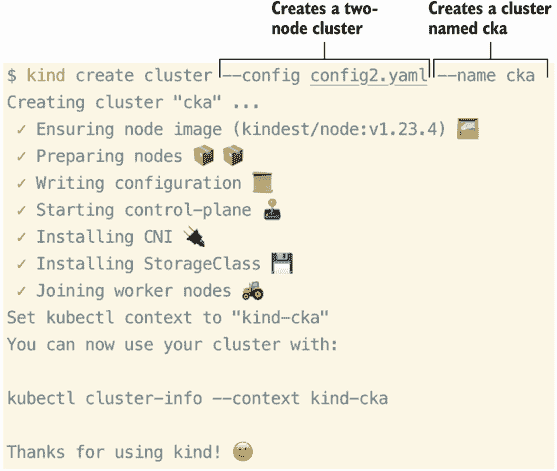

图 5.15 使用两个节点配置创建一个名为 `cka` 的新集群。

现在我们已经创建了一个名为 `cka` 的新集群，我们的上下文已经切换到新集群。我们可以简单地运行命令 `k delete no cka-worker` 来从该集群中移除节点，如图 5.16 所示。

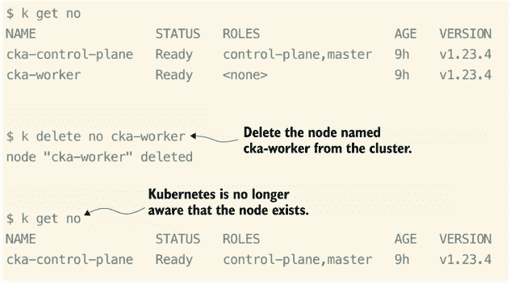

图 5.16 删除节点将其从上下文中移除，但它仍然作为一个 Docker 容器存在。

即使我们已经删除了 `cka-worker`，该节点仍然在运行，并且可以从 Kubernetes 外部访问。您可以使用命令 `docker exec -it cka-worker bash` 获取到它的 shell。现在让我们运行命令 `kubeadm reset` 来将此节点恢复到新鲜状态并清除它与 `cka` 集群的关联：

```
$ docker exec -it cka-worker bash                                           
root@cka-worker:/# kubeadm reset
[reset] WARNING: Changes made to this host by 'kubeadm init' or 'kubeadm 
➥ join' will be reverted.
[reset] Are you sure you want to proceed? [y/N]: y
[preflight] Running pre-flight checks
W0527 01:56:05.673626    3614 removeetcdmember.go:80] [reset] No kubeadm 
➥ config, using etcd pod spec to get data directory
[reset] No etcd config found. Assuming external etcd
[reset] Please, manually reset etcd to prevent further issues
[reset] Stopping the kubelet service
[reset] Unmounting mounted directories in "/var/lib/kubelet"
[reset] Deleting contents of config directories: [/etc/kubernetes/manifests 
➥ /etc/kubernetes/pki]
[reset] Deleting files: [/etc/kubernetes/admin.conf 
➥ /etc/kubernetes/kubelet.conf /etc/kubernetes/bootstrap-kubelet.conf 
➥ /etc/kubernetes/controller-manager.conf /etc/kubernetes/scheduler.conf]

➥ [reset] Deleting contents of stateful directories: [/var/lib/kubelet 
➥ /var/lib/dockershim /var/run/kubernetes /var/lib/cni]

The reset process does not clean CNI configuration. To do so, you must 
➥ remove /etc/cni/net.d

The reset process does not reset or clean up iptables rules or IPVS tables.
If you wish to reset iptables, you must do so manually by using the 
➥ "iptables" command.

If your cluster was setup to utilize IPVS, run ipvsadm --clear (or similar)
to reset your system's IPVS tables.

The reset process does not clean your kubeconfig files and you must remove 
➥ them manually.
Please, check the contents of the $HOME/.kube/config file.
```

我们可以继续应用我们之前生成的 `join` 命令。这个命令将使用 kubeadm 将节点加入我们名为 `kind` 的集群，传递用于身份验证的令牌，并且传递 `--discovery-token-ca-cert-hash` 以验证由控制平面提供的根证书颁发机构（CA）的公钥。您将看到类似于图 5.17 的输出。

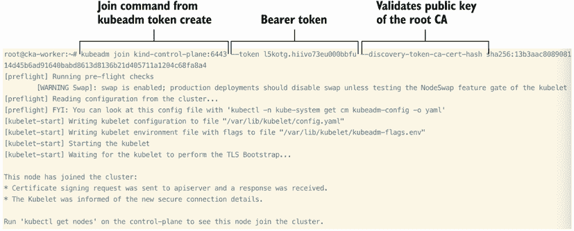

图 5.17 使用 `join` 命令将节点加入现有集群。

我们可以回到 kind 集群并从那个上下文查看我们的节点：

```
root@cka-worker:~# exit
exit
$ docker exec -it kind-control-plane bash
                                                     root@kind-control-plane:/# alias k=kubectl
root@kind-control-plane:/# k get no
NAME                 STATUS   ROLES           AGE    VERSION
cka-worker           Ready    <none>          15m    v1.23.4
kind-control-plane   Ready    control-plane   2d1h   v1.24.0
kind-worker          Ready    <none>          2d1h   v1.24.0
```

恭喜！您已成功将一个节点添加到现有集群中，使其成为三节点集群。现在您可以将 Pod 调度到它上面，就像在 Kubernetes 集群中的任何其他工作节点一样使用它。

练习考试

从一个三节点集群中，隔离一个工作节点。不指定 `nodeSelector` 调度一个 Pod。解除隔离工作节点并编辑 Pod，将新的节点名称应用到 YAML 文件中（将其设置为刚刚解除隔离的节点）。替换 YAML 文件后，看看 Pod 是否被调度到最近解除隔离的节点。

启动一个基本的 nginx 部署；从控制平面节点移除污点，这样 Pod 就不需要容忍就可以调度到它上面。在部署中添加一个 `nodeSelector` 到 Pod 规范，看看 Pod 是否现在正在控制平面节点上运行。

## 摘要

+   部署是 Kubernetes 中的常见资源，其中的 ReplicaSet 对于保持所需副本的数量运行至关重要。

+   滚动操作是分版本的，你可以选择为其他 Kubernetes 管理员或开发者留下备注。

+   你可以公开一个 Deployment，它为用户创建一个 Service，以便从集群外部访问应用程序。

+   维护是不可避免的，这意味着在某个时候，你必须知道如何进行隔离和排空以执行操作系统升级或向节点添加资源。

+   使用 kubeadm 升级控制平面组件，以便集群可以保持最新补丁，防止 CVE。

+   你可以轻松地将节点添加到现有的集群中，为在 Kubernetes 上运行的应用程序提供额外的资源。
