# 6 Kubernetes 集群中的通信

本章涵盖

+   节点如何通过 CNI 和不同的 CNIs 进行通信

+   Pod 之间的通信是如何发生的

+   Kubernetes 中服务类型及其使用情况

+   将 IP 地址分配给 Pods

+   通过 DNS 进行通信以及如何使用 CoreDNS

+   使用 Ingress 和 Ingress 控制器

许多人发现 Kubernetes 中的网络很复杂，但我们将在此章中全面解析它，特别是因为它占 CKA 考试的 20%。有几个重要概念可以澄清很多困惑，而且因为我们已经介绍了容器内桥接网络的工作方式，我认为所有这些都将开始整合。到本章结束时，你将知道 Pods 在集群内部是如何相互通信的，这是考试服务和网络部分的核心。

服务和网络领域

本章涵盖了 CKA 课程的服务和网络领域。该领域包括节点和 Pods 在集群中相互通信的方式。它包括以下能力。

| 能力 | 章节部分 |
| --- | --- |
| 理解集群节点上的主机网络配置。 | 6.5 |
| 理解 Pods 之间的连接性。 | 6.2 |
| 理解 ClusterIP、NodePort 和 LoadBalancer 服务类型和端点。 | 6.4 |
| 了解如何使用 Ingress 控制器和 Ingress 资源。 | 6.3 |
| 了解如何配置和使用 CoreDNS。 | 6.1, 6.2 |
| 选择合适的容器网络接口插件。 | 6.5 |

## 6.1 配置 DNS

在 Kubernetes 集群内部，CoreDNS 负责将主机名解析为 IP 地址。截至 Kubernetes 1.12 版本，CoreDNS 已经成为默认的 DNS 服务器，并将出现在考试中。CoreDNS 也用于我们的 kind Kubernetes 集群。

CKA 考试要求你配置和使用 CoreDNS，包括将主机名解析为 IP 地址、更改 DNS 的工作方式以及了解 CoreDNS 配置的位置和如何更改它。例如，考试问题可能会说如下内容。

| 考试任务 在集群 `k8s` 中，将分配给新服务的 IP 地址更改为 100.96.0.0/16 的 CIDR 范围。将与集群 DNS 服务关联的 IP 地址更改为与新服务范围匹配。继续更改 kubelet 配置，以便新的 Pods 可以接收新的 DNS 服务 IP 地址，并且可以解析域名。编辑 kubelet ConfigMap，以便 kubelet 在原地更新并立即反映。升级节点以接收新的 kubelet 配置。最后，通过创建一个新的 Pod 并验证该 Pod 是否具有 DNS 服务的新的 IP 地址来测试这一点。 |
| --- |

如果你还没有访问现有的 Kubernetes 集群，可以按照附录 A 中解释的 kind 创建一个 Kubernetes 集群。单个节点集群就足够完成此类任务。一旦你有了对 kind 集群的访问权限，使用命令`docker exec -it kind-control-plane bash`获取控制平面节点的 shell。一旦你有了 shell，使用命令`alias k=kubectl`将别名`k`设置为等于`kubectl`。在考试中，他们已经为你设置了此别名，所以熟悉使用`k`而不是反复输入`kubectl`是很好的。

让我们更改分配给集群中创建的每个服务的 Service CIDR 块。这是一个由 API 服务器控制的特性。我们可以在目录`/etc/kubernetes/manifests`中找到 API 服务器配置，文件名为`kube-apiserver.yaml`。让我们使用命令`vim /etc/kubernetes/manifests/kube-apiserver.yaml`打开此文件进行编辑；它将在 Vim 文本编辑器中打开。在 YAML 命令部分，我们将光标置于以`- --service-cluster-ip-range`开头的行，并将 CIDR 范围从 10.96.0.0/16 更改为 100.96.0.0/16（在 10 之后添加一个 0）。结果应该与图 6.1 中的 YAML 完全相同。

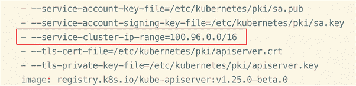

图 6.1 更改分配给每个新服务的 IP 地址的 Service CIDR 范围。

在将集群 IP 范围更改为 100.96.0.0/16 后，保存并关闭文件。这将自动重启 API 服务器，因此你需要等待最多 2 分钟以等待 API 服务器重新启动并运行任何额外的`kubectl`命令。

接下来，让我们更改与集群 DNS 服务关联的 IP 地址。我们将在本章后面深入探讨服务。现在，只需知道它是一个集群范围内的 DNS 通信机制。DNS 服务位于`kube-system`命名空间中，我们可以使用命令`k -n kube-system get svc`查看服务。你会看到名为`kube-dns`的服务。输出看起来像这样：

```
root@kind-control-plane:/# alias k=kubectl
root@kind-control-plane:/# k -n kube-system get svc
NAME       TYPE        CLUSTER-IP   EXTERNAL-IP   PORT(S)                  
➥ AGE
kube-dns   ClusterIP   10.96.0.10   <none>        53/UDP,53/TCP,9153/TCP   
➥ 73s
```

考试技巧：在`k`之后直接输入命名空间以自动完成 Kubernetes 资源（按 Tab 键自动完成资源名称）。在考试中，它们的名称会更长且更复杂，容易出错。尽可能复制粘贴，并使用自动完成功能以防止出错！

要编辑此服务，我们可以输入命令`k -n kube-system edit svc kube-dns`，它将在 Vi 文本编辑器中打开 YAML 文件（你可能需要先使用命令`apt update; apt install -y vim`安装 Vim）。Vi 文本编辑器将类似于图 6.2。将光标移至以`clusterIP`开头的行，在键盘上按 I 键（插入模式），并将值 10.96.0.10 替换为 100.96.0.10（在第一个 10 之后添加一个零）。对于`clusterIPs`下的行也做同样的操作，这样它也将具有新的值 100.96.0.10。

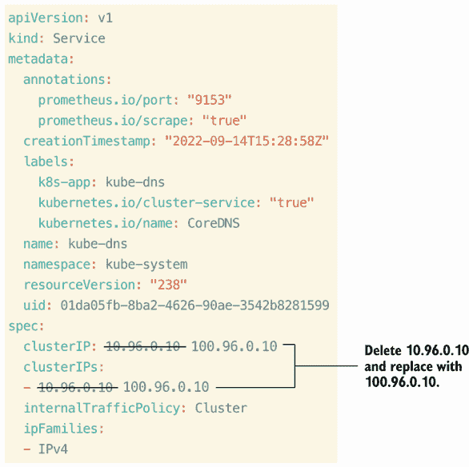

图 6.2 在原地编辑 `kube-dns` Service，替换 `clusterIP` 和 `clusterIPs` 的值。`

替换完值后，按键盘上的 Esc 键退出插入模式，然后输入 `:wq` 保存并退出。你会收到以下消息：“services ‘kube-dns’ was not valid: spec.clusterIPs[0]: Invalid value: []string{"100.96.0.10"}: may not change once set.” 图 6.3 中的消息将出现在页面顶部。

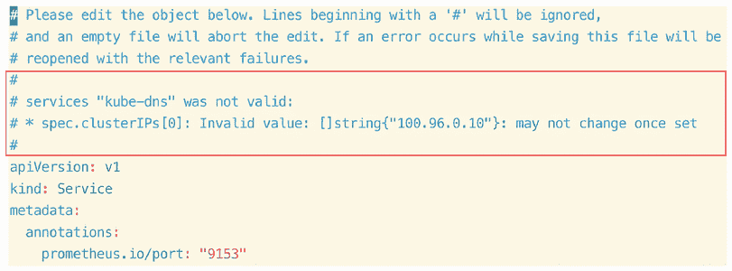

图 6.3 编辑 `kube-dns` Service 后，你会收到一条消息，指出 `clusterIP` 的值可能无法更改。

这在这里是预期的，因为只有某些类型的参数可以更改处于运行状态的 Kubernetes 对象，所以请再次输入 `:wq` 并返回到命令提示符，忽略错误信息。当你返回到命令提示符时，你会得到一条消息，内容如下：

```
error: services "kube-dns" is invalid
A copy of your changes has been stored to "/tmp/kubectl-edit-3485293250.yaml"
error: Edit cancelled, no valid changes were saved. 
```

忽略错误；这也是我们预期的。YAML 存储的位置可能因你而异，但我们将使用该 YAML 强制替换 Service。为此，我们将输入命令 `k replace -f /tmp/kubectl-edit-3485293250.yaml --force`。输出将类似于以下内容：

```
root@kind-control-plane:/# k replace -f /tmp/kubectl-edit-3485293250.yaml -
➥ -force
service/kube-dns replaced
```

现在我们已经更改了 `kube-dns` Service，新的 IP 地址可以通过命令 `k -n kube-system get svc` 获取，正如你在下面的输出中看到的那样：

```
root@kind-control-plane:/# k -n kube-system get svc
NAME       TYPE        CLUSTER-IP    EXTERNAL-IP   PORT(S)                  
➥ AGE
kube-dns   ClusterIP   100.96.0.10   <none>        53/UDP,53/TCP,9153/TCP   
➥ 2m13s
```

为了让新创建的 Pod 接收新的 DNS 信息，我们需要修改 kubelet 配置。我们可以调整 kubelet 配置的两个地方。第一个地方是 YAML 文件，这是 kubelet 的配置 YAML 清单。让我们执行命令 `vim /var/lib/kubelet/config.yaml` 以打开 kubelet YAML 清单。当你打开它时，你会注意到有一个名为 `clusterDNS` 的部分。将值从 10.96.0.10 更改为 100.96.0.10（按 I 键进入插入模式），这是名为 `kube-dns` 的 Service 的新 Service IP 地址。结果应该如图 6.4 所示。

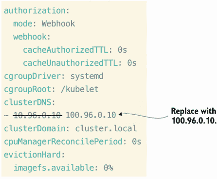

图 6.4 文件 `/var/lib/kubelet/config.yaml` 将 `clusterDNS` 替换为 DNS 的新 IP 地址。

一旦完成更改，您可以通过按键盘上的 Esc 键退出插入模式，然后输入 `:wq` 来保存文件并退出 Vim。如您所注意到的，这并没有做太多；它只是更改了一个不会影响集群的文件。要影响集群并立即实施我们的更改，您需要编辑与 kubelet 配置关联的 ConfigMap。为此，执行命令 `k -n kube-system edit cm kubelet-config`。您将看到与 `config.yaml` 文件中相同的 YAML 结构。再次找到以 clusterDNS 开头的行，并将值从 10.96.0.10 更改为 100.96.0.10（别忘了插入模式！）。完成此操作后，按 Esc 键并输入 `:wq` 来保存文件并退出以保存 ConfigMap。输出将类似于以下内容：

```
root@kind-control-plane:/# k -n kube-system edit cm kubelet-config
configmap/kubelet-config edited
```

由于 kubelet 是当前正在节点上运行的守护进程，我们必须更新此配置的节点，以及重新加载守护进程并在节点上重启 kubelet 服务。首先，要更新节点上的 kubelet 配置，执行命令 `kubeadm upgrade node phase kubelet-config`。输出将类似于以下内容：

```
root@kind-control-plane:/# kubeadm upgrade node phase kubelet-config
[upgrade] Reading configuration from the cluster...
[upgrade] FYI: You can look at this config file with 'kubectl -n kube-
➥ system get cm kubeadm-config -o yaml'
W0914 17:44:33.203828    3618 utils.go:69] The recommended value for 
➥ "clusterDNS" in "KubeletConfiguration" is: [10.96.0.10]; the provided 
➥ value is: [100.96.0.10]
[kubelet-start] Writing kubelet configuration to file 
➥ "/var/lib/kubelet/config.yaml"
[upgrade] The configuration for this node was successfully updated!
[upgrade] Now you should go ahead and upgrade the kubelet package using 
➥ your package manager.
```

现在我们已升级了节点的 kubelet 配置，我们可以使用命令 `systemctl daemon-reload` 重新加载守护进程，并使用命令 `systemctl restart kubelet` 重新启动服务。您将不会得到输出；您将直接返回到命令提示符，所以只要没有错误消息，您已成功重新启动了 kubelet 服务。

考试技巧：您可能会在考试中遇到需要您启动、重启或重新加载 kubelet 守护进程的任务。命令 `systemctl stop kubelet systemctl start kubelet`、`systmectl restart kubelet` 和 `systemctl daemon-reload` 是值得记忆的。

最后，为了测试我们迄今为止所做的所有更改，我们可以创建一个新的 Pod 并检查 DNS IP 地址是否正确以及 DNS 是否能够解析 example.com。让我们执行命令 `kubectl run netshoot --image=nicolaka/netshoot --command sleep --command "3600"` 来在默认命名空间中创建一个新的 Pod。我喜欢使用这个镜像，因为它预先安装了 DNS 工具，这对于测试网络很有用。如果您想了解更多关于此镜像的详细信息，请访问 DockerHub 页面：[`hub.docker.com/r/nicolaka/netshoot`](https://hub.docker.com/r/nicolaka/netshoot)。

我们运行 `sleep` 和 `3600` 这两个命令，以便 Pod 保持运行状态（3600 秒，或 60 分钟）。我们可以使用命令 `k get po` 检查 Pod 是否处于运行状态。输出应类似于以下内容：

```
root@kind-control-plane:/# kubectl run netshoot --image=nicolaka/netshoot -
➥ -command sleep --command "3600"
pod/netshoot created
root@kind-control-plane:/# k get po
NAME       READY   STATUS    RESTARTS   AGE
netshoot   1/1     Running   0          40s 
```

Pod 正在运行，因此现在您可以通过命令 `k exec -it netshoot --bash` 获取容器的 Bash shell。您会注意到您的提示符已更改，这意味着您已成功进入 Pod 内的容器。输出应类似于以下内容：

```
root@kind-control-plane:/# k exec -it netshoot --bash
bash-5.1#
```

现在您已经在容器中打开了 Bash shell，您可以运行命令`cat /etc/resolv.conf`来检查是否列出了正确的 DNS IP 地址。输出应该类似于以下内容：

```
root@kind-control-plane:/# k exec -it netshoot --bash
bash-5.1# cat /etc/resolv.conf
search default.svc.cluster.local svc.cluster.local cluster.local
nameserver 100.96.0.10
options ndots:5 
```

DNS 配置正确；因此，Pod 可以在集群中使用 CoreDNS 解析 DNS 名称。您可以使用命令`nslookup example.com`检查这个 Pod 是否能够解析 example.com 的 DNS 查询。`nslookup`是一个 DNS 工具，允许您查询名称服务器。输出应该看起来像这样：

```
bash-5.1# nslookup example.com
Server:    100.96.0.10
Address:    100.96.0.10#53

Non-authoritative answer:
Name:    example.com
Address: 93.184.216.34
Name:    example.com
Address: 2606:2800:220:1:248:1893:25c8:1946
```

因为容器正在使用正确的 DNS 服务器（100.96.0.10），所以它能够将 example.com 解析为 93.184.216.34；因此，我们的 CoreDNS 配置是成功的，并且所有前面的步骤都有效地自定义了 CoreDNS 以满足这个考试任务的需求。

总结来说，为了完成这个任务，我们修改了`/etc/kubernetes/manifests/kube-apiserver.yaml`中的 API 配置；我们编辑了`kube-system`命名空间中的名为`kube-dns`的服务；我们修改了`/var/lib/kubelet/config.yaml`中的`kubeclet`配置；我们更改了`kube-system`命名空间中的名为`kubelet-config`的 kubelet ConfigMap；然后我们升级了节点并重新加载了 kubelet 守护进程。

## 6.2 CoreDNS

CoreDNS 背后的魔法是能够快速解析域名，以便服务之间可以通信，更重要的是，以便应用程序（在 Pod 中运行）可以相互通信并在请求出现时进行通信。为了本地解决这个问题，您可以为每个 Pod 添加到`/etc/hosts`文件中的值，但这不是可扩展的。相反，我们有一个中心位置（对集群来说是中心的），Pod 可以查询主机名和 IP 地址的累积列表，如图 6.5 所示。

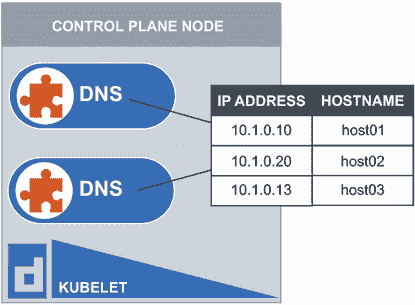

图 6.5 CoreDNS 为 Kubernetes 集群中主机名到 IP 地址的映射提供了一个中心位置。

### 6.2.1 配置文件

kubelet 在 Kubernetes DNS 配置中扮演着特殊角色。Kubelet 是一个直接存在于每个节点上的服务。正如我们在 6.1 节中看到的，我们可以通过`systemctl`启动、停止和重启该服务。kubelet 负责创建 CoreDNS Pod 并将配置注入到该 Pod 中。该配置文件位于`/var/lib/kubelet/config.yaml`目录中。这是一个特殊的配置文件，仅用于 kubelet，并将包括 kubelet 的认证、健康端点和最重要的集群 DNS。有趣的事实：使用 SkyDNS 构建的`kube-dns`曾经是 Kubernetes 中的主要 DNS 解析。即使 CoreDNS 取代了它，服务的名称仍然保留。CoreDNS 成为了一个更高效、更全面的选项，并在 Kubernetes 版本 1.11 中取代了`kube-dns`。

考试提示：在 Kubernetes 集群中有一个专门用于静态 Pod 的特殊目录。这个位置是`/etc/kubernetes/manifests/`，并且这个目录中的任何内容都将自动配置，无需调度器的意识。

有两个 ConfigMap——一个用于 kubelet，一个用于 CoreDNS——并且每个都包含它们各自应用过的配置，因为 kubelet 负责在 Kubernetes 集群中创建新的 Pods，而 CoreDNS 将是 DNS 服务器。你可以使用命令 `k -n kube-system get cm` 查看这些 ConfigMap。

### 6.2.2 DNS 复制

如你可能在我们的集群中注意到的，有两个 CoreDNS 实例作为 `kube-system` 命名空间中的 Pods 运行。你可以使用命令 `k -n kube-system get po` 查看它们。输出将类似于以下内容：

```
root@kind-control-plane:/# k -n kube-system get po
NAME                                         READY   STATUS    
➥ RESTARTS      AGE
coredns-565d847f94-4pnf4                     1/1     Running   
➥ 0             143m
coredns-565d847f94-xstnx                     1/1     Running   
➥ 0             143m
etcd-kind-control-plane                      1/1     Running   
➥ 0             143m
kindnet-75z9k                                1/1     Running   
➥ 3 (46m ago)   143m
kube-apiserver-kind-control-plane            1/1     Running   
➥ 0             94m
kube-controller-manager-kind-control-plane   1/1     Running   
➥ 1 (95m ago)   143m
kube-proxy-s5vps                             1/1     Running   
➥ 0             143m
kube-scheduler-kind-control-plane            1/1     Running   
➥ 1 (95m ago)   143m
```

正如你所见，有两个 CoreDNS Pods 正在运行。这是 Deployment 的好处，你可以轻松地将其扩展和缩减以获得更快的 DNS 解析。没有人喜欢长时间等待 DNS 查询。你可以使用命令 `k -n kube-system get deploy` 查看 CoreDNS Deployment。输出将类似于以下内容：

```
root@kind-control-plane:/# k -n kube-system get deploy
NAME      READY   UP-TO-DATE   AVAILABLE   AGE
coredns   2/2     2            2           147m
```

这个 Deployment 被称为 *CoreDNS*，它类似于 Kubernetes 中的任何其他 Deployment。假设 DNS 查询花费了很长时间并导致我们的应用程序延迟，我们可以使用命令 `k -n kube-system scale deploy coredns --replicas 3` 缩放 CoreDNS Deployment，并看到现在有三个 Pod 副本。输出将类似于以下内容：

```
root@kind-control-plane:/# k -n kube-system scale deploy coredns --replicas 3
deployment.apps/coredns scaled
root@kind-control-plane:/# k -n kube-system get po
NAME                                         READY   STATUS    RESTARTS
➥        AGE
coredns-565d847f94-4pnf4                     1/1     Running   0 
coredns-565d847f94-lqkbd                     1/1     Running   0
coredns-565d847f94-xstnx                     1/1     Running   0
etcd-kind-control-plane                      1/1     Running   0
kindnet-75z9k                                1/1     Running   3
kube-apiserver-kind-control-plane            1/1     Running   0
kube-controller-manager-kind-control-plane   1/1     Running   1
kube-proxy-s5vps                             1/1     Running   0
kube-scheduler-kind-control-plane            1/1     Running   1
```

缩放 DNS 服务器副本只是允许在执行 DNS 查询时获得更高的性能，这使得管理你的 DNS 服务器变得更加容易。

如果这个解决方案不存在，我们就必须手动将主机名应用到每个 Pod 的 IP 地址上。让我们通过将 CoreDNS Deployment 缩放到零并尝试与集群中的服务进行通信来模拟这种情况。要缩减 Deployment，我们将运行命令 `k -n kube-system scale deploy Coredns --replicas 0`。这将终止集群中当前运行的所有 CoreDNS Pods，看起来如下所示：

```
root@kind-control-plane:/# k -n kube-system scale deploy coredns -
➥ replicas 0
deployment.apps/coredns scaled
root@kind-control-plane:/# k get po -A
NAMESPACE            NAME                                         READY   
➥ STATUS
default              netshoot                                     1/1     
➥ Running
kube-system          coredns-565d847f94-ctlpt                     1/1     
➥ Terminating
kube-system          coredns-565d847f94-z65fz                     1/1     
➥ Terminating
kube-system          coredns-565d847f94-zv28n                     1/1     
➥ Terminating
kube-system          etcd-kind-control-plane                      1/1     
➥ Running
kube-system          kindnet-75z9k                                1/1     
➥ Running
kube-system          kube-apiserver-kind-control-plane            1/1     
➥ Running
kube-system          kube-controller-manager-kind-control-plane   1/1     
➥ Running
kube-system          kube-proxy-s5vps                             1/1     
➥ Running
kube-system          kube-scheduler-kind-control-plane            1/1     
➥ Running
local-path-storage   local-path-provisioner-684f458cdd-qgncs      1/1     
➥ Running
```

集群中没有可用的 DNS，因此我们无法解析主机名。让我们创建一个 Deployment 和一个 Service。我们将在本章后面讨论 Service，但到目前为止，我们将使用这个 Service 与 Deployment 中的底层 Pods 进行通信。使用命令 `k create deploy apache --image httpd; k expose deploy apache --name apache-svc --port 80` 创建 Deployment 和 Service。输出将类似于以下内容：

```
root@kind-control-plane:/# k create deploy apache --image httpd; k expose 
➥ deploy apache --name apache-svc --port 80
deployment.apps/apache created
service/apache-svc exposed
```

通过运行命令 `k get svc` 获取服务的 IP 地址。输出将类似于以下内容，其中我的集群 IP 地址为 100.96.102.73：

```
root@kind-control-plane:/# k get svc
NAME         TYPE        CLUSTER-IP      EXTERNAL-IP   PORT(S)   AGE
apache-svc   ClusterIP   100.96.102.73   <none>        80/TCP    25m
kubernetes   ClusterIP   10.96.0.1       <none>        443/TCP   6h36m
```

如果你之前练习中还有运行的 `netshoot` 容器，让我们获取它的 Bash shell。如果你已经删除了 `netshoot` 容器，你可以使用命令 `kubectl run netshoot --image=nicolaka/netshoot --command sleep --command "3600"` 重新启动它。让我们通过运行命令 `k exec --it netshoot --bash` 来获取它。你现在应该有一个新的提示符，看起来类似于以下内容：

```
root@kind-control-plane:/# k exec -it netshoot --bash
bash-5.1#
```

为了验证 DNS 是否工作，让我们尝试与我们刚刚创建的名为 `apache-svc` 的 Service 进行通信。我们可以使用命令 `wget -O- apache-svc` 来做这件事。你应该得到以下输出：

```
bash-5.1# wget -O- apache-svc
wget: bad address 'apache-svc'
```

为了解决这个问题，我们将主机名到 IP 的映射添加到 Pod 内部的 `/etc/hosts` 文件中。我们可以用一条命令来完成这个操作：`echo “100.96.102.73 apache-svc” >> /etc/hosts`。现在让我们再次运行 `wget` 命令，你应该得到标准的 Apache 主页，看起来像这样：

```
bash-5.1# wget -O- apache-svc
Connecting to apache-svc (100.96.102.73:80)
writing to stdout
<html><body><h1>It works!</h1></body></html>
-                    100% 
➥|**************************************************************************
➥************************|    45  0:00:00 ETA
written to stdout
```

这之所以有效，是因为我们在 Pod 上本地编写了自己的 DNS。正如你所见，如果你有数百个 Pod，这会很困难，而且我们知道，Pod 是短暂的，因此为每个 Pod 做这件事会非常麻烦。我希望这个练习证明了 CoreDNS 的重要性，并给你提供了一些测试 Service 通信的工具。

### 6.2.3 Pod 之间的连接性

让我们看看 Pod 是如何跨命名空间进行通信的，这样我们就可以更熟悉 Kubernetes 集群内部的 DNS 的工作方式。创建一个类似的 Deployment 和 Service，但将其创建在名为 `c01383` 的新命名空间内。

考试技巧：这些复杂的命名空间名称在考试中会经常出现，所以尽可能多地练习使用自动补全是个好主意。有关在 kind 中安装自动补全的说明，请参阅附录 B。

首先，让我们使用命令 `k create ns c01383` 创建一个命名空间。我们可以使用命令 `k get ns` 来查看我们集群中的命名空间。你会看到一个类似于以下内容的输出：

```
root@kind-control-plane:/# k create ns c01383
namespace/c01383 created
root@kind-control-plane:/# k get ns
NAME                 STATUS   AGE
c01383               Active   2s
default              Active   8h
kube-node-lease      Active   8h
kube-public          Active   8h
kube-system          Active   8h
local-path-storage   Active   8h
```

一旦我们创建了命名空间 `c01383`，我们就可以使用命令 `k -n c01383 create deploy nginx --image nginx; k -n c01383 expose deploy nginx --name nginx-svc --port 80` 在该命名空间内创建一个 Deployment 和 Service。你可以通过输入 `k -n c01383 get deploy,svc` 来查看 `c01383` 命名空间中的 Deployment 和 Service。输出将类似于以下内容：

```
root@kind-control-plane:~# k -n c01383 create deploy nginx --image nginx; k 
➥ -n c01383 expose deploy nginx --name nginx-svc --port 80
deployment.apps/nginx created
service/nginx-svc exposed
root@kind-control-plane:/# k -n c01383 get deploy,svc
NAME                    READY   UP-TO-DATE   AVAILABLE   AGE
deployment.apps/nginx   1/1     1            1           57s

NAME                TYPE        CLUSTER-IP       EXTERNAL-IP   PORT(S)   AGE
service/nginx-svc   ClusterIP   100.96.138.162   <none>        80/TCP    57s
```

你认为如果我们从 Deployment 中的一个 Pod 连接到，我们能否到达默认命名空间中名为 `apache-svc` 的 Service？让我们试试！输入命令 `k -n c01383 get po` 来检索 Pod 名称。它将以 `nginx` 开头，然后是一个连字符，接着是一个代表 ReplicaSet 的唯一值，然后是另一个连字符，最后是代表 Deployment 的另一个唯一值。这最好通过图 6.6 中的输出来说明。

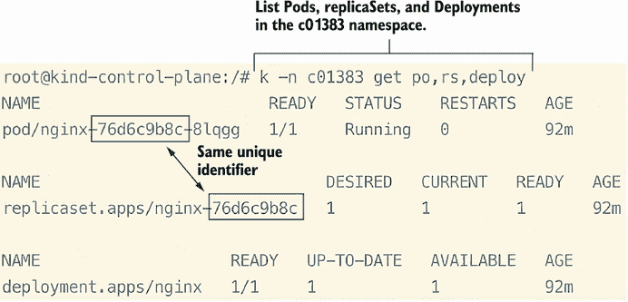

图 6.6 Pod 名称来自一个自动分配的唯一标识符，这可以防止 Pod 名称冲突。

现在我们已经知道了 Pod 的名称，我们可以使用命令 `k -n c01383 exec -it nginx-76d6c9b8c-8lqgg --bash` 打开一个 Bash shell 到它。你会看到你的提示符发生变化，这意味着你现在正在查看 Pod 内部的文件系统。在容器内部，运行命令 `curl apache-svc`。你应该得到结果“无法解析主机”，并且看起来像这样：

```
root@kind-control-plane:/# k -n c01383 exec -it nginx-76d6c9b8c-8lqgg --
➥ bash
root@nginx-76d6c9b8c-8lqgg:/# curl apache-svc
curl: (6) Could not resolve host: apache-svc
```

让我们尝试运行命令 `curl apache-svc.default`。它成功了！你应该看到以下内容：

```
root@nginx-76d6c9b8c-8lqgg:/# curl apache-svc.default
<html><body><h1>It works!</h1></body></html>
```

这是因为 Kubernetes 为每个服务分配了其唯一的域名，不同命名空间之间的域名是不同的。Kubernetes 集群中服务的 *完全限定域名（FQDN**） 是 `<service-name>.<namespace-name>.svc.cluster .local`，如图 6.7 所示。

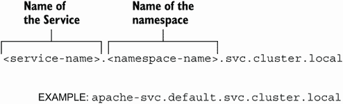

图 6.7 集群中每个服务的域名约定示例

我们在本书第 6.1 节中查看 Pod 内的 `resolv.conf` 时已经看到了这个。让我们再次从我们已经在的 shell 中使用命令 `cat /etc/resolv.conf` 来查看它。输出应该类似于以下内容：

```
root@nginx-76d6c9b8c-8lqgg:/# cat /etc/resolv.conf
search c01383.svc.cluster.local svc.cluster.local cluster.local
nameserver 100.96.0.10
options ndots:5
```

以 `search` 开头的行将指示与该命名空间中的服务关联的 DNS 名称。在这个列表中你不会看到 `default.svc.cluster.local`，这就是为什么当我们尝试 `apache-svc` 这个名称时，名称无法解析。

Pods 也有一个全限定域名（FQDN），它就是 IP 地址，但 CoreDNS 会将点转换为破折号，因此看起来像这样：`10-244-0-14.default.pod.cluster.local`，其中 10.244.0.14 是默认命名空间内 Pod 的 IP 地址。我们可以执行相同的 curl 命令，但使用 Pod FQDN，如下所示：

```
root@kind-control-plane:/# k get po apache-855464645-npcf5 -o wide
NAME                     READY   STATUS    RESTARTS   AGE   IP            
➥ NODE                 NOMINATED NODE   READINESS GATES
apache-855464645-npcf5   1/1     Running   0          21h   10.244.0.14   
➥ kind-control-plane   <none>           <none>
root@kind-control-plane:/# k -n c01383 exec -it nginx-76d6c9b8c-8lqgg --
➥ bash
root@nginx-76d6c9b8c-8lqgg:/# curl 10-244-0-14.default.pod.cluster.local
<html><body><h1>It works!</h1></body></html>
```

我们也可以执行命令 `10-244-0-14.default.pod`，由于 `cluster.local` 包含在 `resolv.conf` 的搜索条件中，DNS 会解析它。

练习考试

使用 `exec` 命令进入 Pod，并使用 `cat` 命令查看 DNS 解析器文件，以获取 Pod 用于解析域名的 DNS 服务器 IP 地址。

打开包含 kubelet 配置的文件，并将 `clusterDNS` 的值更改为 `100.96.0.10`。保存并退出文件。

停止并重新加载 kubelet 守护进程。验证服务是否处于活动状态并正在运行。

定位 `kube-dns` 服务。尝试就地编辑服务，将 `clusterIP` 和 `ClusterIPs` 的值更改为 `100.96.0.10`。当值无法更新时，使用正确的 `kubectl` 命令行参数强制替换服务。

编辑包含 kubelet 配置的 ConfigMap。将 `clusterDNS` 设置的 IP 地址值更改为 `100.96.0.10`。确保编辑资源时不要编写新的 YAML 文件。

将 CoreDNS 部署扩展到三个副本。验证 Pod 是否作为该部署的一部分被创建。

通过首先创建一个使用 `apache` 镜像的 Deployment，然后公开该 Deployment 来测试从 Pod 到服务的访问。从 `netshoot` 镜像创建一个 Pod，并验证你是否可以到达你刚刚创建的服务。

使用在之前练习中创建的 `netshoot` Pod，通过 DNS 名称在默认命名空间中定位服务。为了 DNS 搜索功能，尽可能使用最少的字母。

## 6.3 入口和入口控制器

当涉及到对运行在 Kubernetes 中的应用程序执行应用层（第 7 层）路由时，使用的术语是 *Ingress*。在我们讨论 Service 之前，让我们先了解 Ingress，因为它是在 Service 的基础上暴露应用程序的首选方法，并且考试目标指出您必须知道如何使用 Ingress 和 Ingress 控制器。它之所以是首选方法，是因为 Ingress 提供了一个单一的网关（只有一个入口）进入集群，并且可以使用基于路径的路由将流量路由到多个服务。与 Ingress 控制器一起，您可以在 Ingress 资源中设置这些路由，并且它们将被引导到每个服务，如图 6.8 所示。

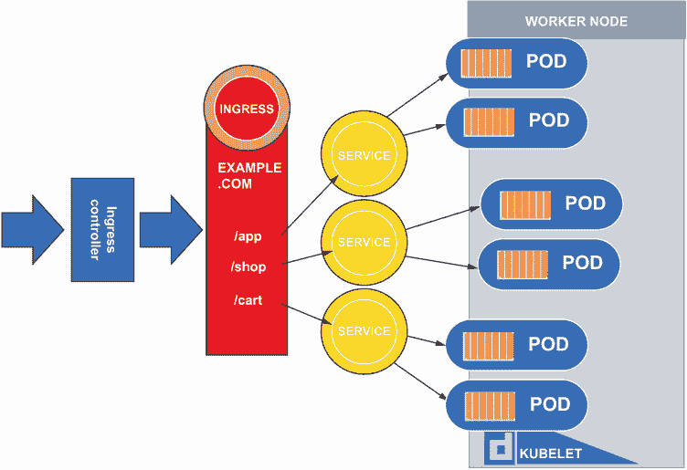

图 6.8 展示了 Ingress 流量流向以及基于路径规则的多个服务的重定向

您将接受创建 Ingress 和 Ingress 控制器的测试，因此让我们回顾一下考试任务可能的样子。

| 在集群 `ik8s` 中，安装一个 Ingress 控制器以通过 Ingress 资源代理集群内的通信。然后，使用镜像 `nginxdemos/hello:plain-text` 创建一个名为 `hello` 的 Deployment。容器在端口 80 上暴露。创建一个名为 `hello-svc` 的 Service，该 Service 靶向 `hello` Deployment 的端口 80。然后，创建一个 Ingress 资源，这将允许您将 DNS 名称 `hello.com` 解析到 Kubernetes 中名为 `hello-svc` 的 ClusterIP 服务。 |
| --- |

要完成这些考试任务，我们需要创建一个新的 kind 集群。请参阅附录 A，第 A.3 节，了解如何构建具有额外端口暴露和节点上应用标签的单节点 kind 集群。一旦您有权访问您的 kind 集群，使用命令 `docker exec -it ingress-control-plane bash` 获取控制平面节点的 shell。一旦您有了 shell，使用命令 `alias k=kubectl` 将您的别名 `k` 设置为等于 `kubectl`。在考试中，他们已经为您设置了此别名，因此使用 `k` 而不是反复输入 `kubectl` 是一个好习惯。

既然我们已经构建了集群并且有控制平面节点的 shell，让我们开始安装 Ingress 控制器的过程，这在考试中也是一个类似的过程。Ingress 控制器 YAML 创建了几个资源。您可以使用命令 `k apply -f https://raw.githubusercontent.com/chadmcrowell/acing-the-cka-exam/main/ch_06/nginx-ingress-controller.yaml` 一次性应用所有这些资源。此命令的输出中，在集群中创建的资源将类似于以下内容：

```
root@ingress-control-plane:/# k apply -f 
➥ https://raw.githubusercontent.com/chadmcrowell/acing-the-cka-
➥ exam/main/ch_06/nginx-ingress-controller.yaml
namespace/ingress-nginx created
serviceaccount/ingress-nginx created
serviceaccount/ingress-nginx-admission created
role.rbac.authorization.k8s.io/ingress-nginx created
role.rbac.authorization.k8s.io/ingress-nginx-admission created
clusterrole.rbac.authorization.k8s.io/ingress-nginx created
clusterrole.rbac.authorization.k8s.io/ingress-nginx-admission created
rolebinding.rbac.authorization.k8s.io/ingress-nginx created
rolebinding.rbac.authorization.k8s.io/ingress-nginx-admission created
clusterrolebinding.rbac.authorization.k8s.io/ingress-nginx created
clusterrolebinding.rbac.authorization.k8s.io/ingress-nginx-admission created
configmap/ingress-nginx-controller created
service/ingress-nginx-controller created
service/ingress-nginx-controller-admission created
deployment.apps/ingress-nginx-controller created
job.batch/ingress-nginx-admission-create created
job.batch/ingress-nginx-admission-patch created
ingressclass.networking.k8s.io/nginx created
validatingwebhookconfiguration.admissionregistration.k8s.io/ingress-nginx-
➥ admission created
```

Kubernetes 对象已在名为 `ingress-nginx` 的单独命名空间中创建，您可以使用命令 `k -n ingress-nginx get all` 一次性查看这些资源。输出将类似于以下内容：

```
root@ingress-control-plane:/# k get all -n ingress-nginx
NAME                                            READY   STATUS      
➥ RESTARTS   AGE
pod/ingress-nginx-admission-create-lccjf        0/1     Completed   
➥ 0          27s
pod/ingress-nginx-admission-patch-bzjfm         0/1     Completed   
➥ 0          27s
pod/ingress-nginx-controller-6c695f6cc7-ntjbt   1/1     Running     
➥ 0          27s
NAME                                         TYPE        CLUSTER-IP      
➥ EXTERNAL-IP   PORT(S)                      AGE
service/ingress-nginx-controller             NodePort    10.96.134.48    
➥ <none>        80:32745/TCP,443:31396/TCP   27s
service/ingress-nginx-controller-admission   ClusterIP   10.96.130.242   
➥ <none>        443/TCP                      27s

NAME                                       READY   UP-TO-DATE   AVAILABLE   
➥ AGE
deployment.apps/ingress-nginx-controller   1/1     1            1           
➥ 27s

NAME                                                  DESIRED   CURRENT   
➥ READY   AGE
replicaset.apps/ingress-nginx-controller-6c695f6cc7   1         1         
➥ 1       27s

NAME                                       COMPLETIONS   DURATION   AGE
job.batch/ingress-nginx-admission-create   1/1           5s         27s
job.batch/ingress-nginx-admission-patch    1/1           5s         27s
```

验证以 `ingress-nginx-controller` 开头的 Pod 是否正在运行。这意味着您已准备好继续并创建 Deployment、Service 和 Ingress。

```
We’ll start with the deployment, which you can create with the command k 
➥ create deploy hello --image nginxdemos/hello:plain-text --port 80\. The output will look like this:
root@ingress-control-plane:/# k create deploy hello -image 
➥ nginxdemos/hello:plain-text -port 80
deployment.apps/hello created
```

现在我们可以通过命令 `k expose deploy hello -name hello-svc -port 80` 来通过暴露 Deployment 创建一个 Service。输出将如下所示：

```
root@ingress-control-plane:/# k expose deploy hello -name hello-svc -port 80
service/hello-svc exposed
```

当你输入 `k get deploy,svc` 时，你现在将看到以下内容：

```
root@ingress-control-plane:/# k get deploy,svc
NAME                    READY   UP-TO-DATE   AVAILABLE   AGE
deployment.apps/hello   1/1     1            1           5m32s

NAME                 TYPE        CLUSTER-IP     EXTERNAL-IP   PORT(S)   AGE
service/hello-svc    ClusterIP   10.96.255.66   <none>        80/TCP    20s
service/kubernetes   ClusterIP   10.96.0.1      <none>        443/TCP   28m
```

让我们通过创建 Ingress 资源来完成考试任务。输入命令 `k apply -f https://raw.githubusercontent.com/chadmcrowell/acing-the-cka-exam/main/ch_06/hello-ingress.yaml` 来创建 Ingress 资源。执行此命令后，你将看到以下输出：

```
root@ingress-control-plane:/# k apply -f 
➥ https://raw.githubusercontent.com/chadmcrowell/acing-the-cka-
➥ exam/main/ch_06/hello-ingress.yaml
ingress.networking.k8s.io/hello created
```

大约 20 秒后，通过输入命令 `k get ing`，你将看到 Ingress 资源，如下所示：

```
root@ingress-control-plane:/# k get ing
NAME    CLASS    HOSTS       ADDRESS   PORTS   AGE
hello   <none>   hello.com             80      9s
hello   <none>   hello.com   localhost   80      15s
```

最后，让我们通过将 `hello.com` 添加到我们的 `/etc/hosts` 文件中来测试我们的设置。通过输入 `vim /etc/hosts` 打开 `hosts` 文件（你可能需要先运行 `apt update; apt install -y vim` 来安装 Vim）。在 `hosts` 文件中，输入控制平面节点的 IP 地址，你可以看到它位于 `localhost` 旁边，然后输入 `hello.com`。文件将类似于图 6.9 中的 `hosts` 文件内容。

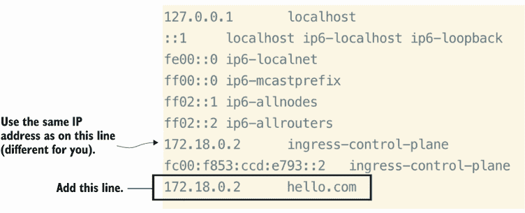

图 6.9 添加主机条目以解析主机名 `hello.com` 到 `172.18.0.2`

保存此文件后，执行命令 `curl hello.com`。你将得到以下输出，这是之前部署的 hello 应用的输出：

```
root@ingress-control-plane:/# curl hello.com
Server address: 10.244.0.8:80
Server name: hello-665cb98d5f-cfmll
Date: 30/Sep/2022:20:38:01 +0000
URI: /
Request ID: fbba7de007d520e7f3e6ea9e0b4a69ad
```

输出是从 Pod 获得的响应，因此服务器地址将与 Pod 的 IP 地址匹配。你可以通过输入命令 `k get po -o wide` 看到这一点。

这就完成了我们的考试任务，安装了 Ingress 控制器，创建了一个名为 `hello` 的 Deployment，一个名为 `hello-svc` 的 Service，以及一个将 `hello.com` 解析到 `hello-svc` Service 的 Ingress 资源。

从考试任务中我们可以看到，我们只是简单地输入了 `curl hello.com`，它神奇地将我们路由到正确的 Service，进而路由到正确的 Pod。这个魔法是由准入控制器执行的。Ingress 控制器是一种拦截对 Kubernetes API 请求的软件。在我们的例子中，它是在 `ingress-nginx` 命名空间中运行的 Pod。这个 Pod 拦截了我们向 `hello.com` 发出的请求，并在 Ingress 资源的帮助下将请求重定向到 hello 应用。这只是一个简单的例子，但我们也可以向 URL 添加路径（例如，`hello.com/app`）并将请求重定向到不同的 Service。这个 Service 将是一个 ClusterIP Service，因为 Ingress 控制器已经暴露在外部，帮助集群中的流量进入。

让我们遍历 Ingress YAML 并修改 Ingress 资源。您可以使用命令 `k edit ingress hello` 编辑 Ingress 资源。现在 YAML 将会出现在 Vim 编辑器中。从顶部开始，如您在图 6.10 中所见，主机是客户端将访问您的应用程序（hello.com）的域名。这可能是一个您从域名注册商那里购买的域名，或者这可能是在集群本地的某个东西，正如我们选择的。HTTP 部分以及随后的文本定义了解析 HTTP（端口 80）流量的规则。规则说明，对 hello.com 主机发出的任何请求都将被导向端口 80 上的 `hello-svc` 服务。这是默认路由，因为没有指定显式路径（例如，`hello.com/path`）。要添加另一个规则——比如说，将来自 `hello.com/app` 的请求导向名为 `nginx` 的不同服务，通过端口 8080——我们将在 `path:` 下添加另一个块来指定该规则。结果将类似于图 6.10。


图 6.10 添加 Ingress 规则，路由到名为 `nginx` 的不同服务

在图 6.10 中，Ingress 规则显示了路由到两个不同服务的路由。这些服务被定义为 *后端*，这意味着一旦流量进入 Ingress，它将进入后端（幕后发生的事情）。在这种情况下，两个后端路由定义了它们各自路由的个别服务的具体细节。第一个路由到名为 `hello-svc` 的服务并使用端口 80。这要求我们在集群中有一个暴露在端口 80 上的 ClusterIP 服务。第二个路由是名为 `nginx` 的服务的后端。客户端必须输入 `http://hello.com/app` 才能路由到这个服务。您还会看到一个 `pathType`，因为每个 Ingress 路径都需要。

支持三种路径类型——`Exact`、`Prefix` 和 `ImplementationSpecific`。`Exact` 路径类型必须与路径完全匹配（区分大小写），路径才有效（例如，`hello.com/app`）。`Prefix` 路径类型匹配由正斜杠（`/`）分隔的 URL 路径，斜杠之间的字符是元素的名称前缀。`ImplementationSpecific` 路径类型将决定前缀或精确路径类型留给 `Ingress` 类来决定。

在 Ingress 资源的 YAML 中，您不仅可以选择基于路径的路由（`hello.com/app`），还可以选择子域名类型的路由。例如，当客户端输入 `http://app.hello.com` 时，您可以选择不同的后端，这可能会根据您拥有的应用程序类型更加灵活。然后 YAML 将变为类似以下内容：

```
apiVersion: networking.k8s.io/v1
kind: Ingress
metadata:
  name: hello
spec:
  rules:
  - host: hello.com
    http:
      paths:
      - pathType: ImplementationSpecific
        path: "/"
        backend:
          service:
            name: hello-svc
            port:
              number: 80
  - host: app.hello.com
    http:
      paths:
      - pathType: Exact
        path: "/"
        backend:
          service:
            name: nginx
            port:
              number: 8080
```

## 6.4 服务

Pods 本质上是短暂的，并且可以在任何时候被杀死并重新启动。因此，它们的 IP 地址不断变化。Service 提供了一种让流量始终到达正确的 Pod 的方法，无论该 Pod 是否被移动到新的节点、被杀死或进行扩展。Service 为 Pods 提供了一个分布式负载均衡器，它们在同一个 Deployment 内的多个 Pod 之间均匀分配负载，并有助于检测这些 Pod 在集群中的确切位置，如图 6.11 所示。

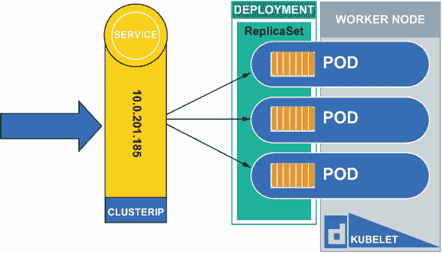

图 6.11 Service 代表每个 Pod 接受进入的流量，进行流量均衡。

Service 为 Pod 或 Pod 集提供了一个一致的 IP 地址和 DNS 名称。这个一致的地址有助于保持现有连接并管理 Pod 来去时的流量路由。Pods 可以通过 Service 在集群内相互通信，无论 Pod 运行在哪个节点上，它都将能够作为集群范围内的 Service 的一部分定位到该 Pod。端点是 Pod 上暴露的端口，与 Pod 相关联，并代表 Pod 可以到达的目标。通过输入命令`k get ep`，我们可以看到端点列表，它们具有与 Service 相同的名称。输出将类似于以下内容：

```
root@kind-control-plane:/# k get ep
NAME         ENDPOINTS         AGE
apache-svc   10.244.0.14:80    129m
kubernetes   172.18.0.2:6443   8h
```

Service 的类型有 ClusterIP、NodePort 和 LoadBalancer。ClusterIP Service 旨在仅在集群内部使 Pod 可用，而 NodePort 和 LoadBalancer 类型的 Service 旨在暴露一个端口并创建对集群的外部访问。NodePort 在节点的 IP 地址上暴露一个端口，但 LoadBalancer 允许外部负载均衡器（集群外部）控制每个节点端口的流量。这允许你使用更常见的端口（80、443）而不是 NodePort 限制的端口 30,000-32,768。当你创建 NodePort Service 时，你实际上是在扩展一个 ClusterIP 类型的 Service，如图 6.12 所示。

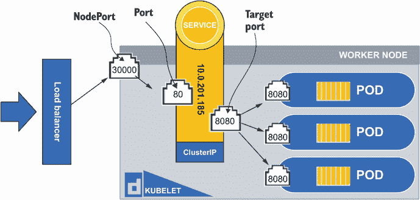

图 6.12 一个负载均衡器类型的 Service，它是 NodePort 和 ClusterIP 类型 Service 的超集，提供了一个进入集群和底层 Pods 的单一点。

### 6.4.1 ClusterIP Service

集群 IP 服务仅用于集群内部通信。你通常会创建这样的服务来从应用程序的前端，在集群中的一个 Pod 中，与后端通信，后端位于不同的 Pod 中。你可以在创建服务时指定要使用的端口，或者你可以在之后修改它。像 Kubernetes 中的许多其他资源一样，你可以运行一个 imperative 命令来创建服务，例如`k create svc clusterip internal-svc --tcp 8080:80`，或者你可以使用命令`k create svc clusterip internal-svc --tcp 8080:80 -dry-run=client -o yaml > svc.yaml`创建一个 YAML 规范文件。现在运行后者命令，并通过使用命令`vim svc.yaml`在 Vim 中打开它来查看 YAML 规范。你会发现，如图 6.13 所示，在端口部分，有一个端口和一个目标端口。目标端口是容器本身上暴露的端口。并非所有容器都有暴露的端口，但以`nginx`镜像为例，端口 80 是暴露的。

暴露的端口在 Dockerfile 中定义（镜像是如何构建的），所以如果你想知道容器暴露了哪些端口，请查看该镜像的 Dockerfile。回到服务 YAML，端口在集群内部暴露，如图 6.12 所示，端口是 80。你可以有多个具有相同暴露端口的服务的服务，因为每个服务都有自己的 IP 地址和 DNS 名称，这允许传入请求区分不同的服务。只要服务名称不同，你就可以有任意多的服务，其端口 80 被暴露。注意在 YAML 规范中，这个服务有一个选择器，如图 6.13 所示。这就是服务如何*绑定*到 Pods 的方式。任何带有标签`app=internal-svc`的 Pod，在这种情况下，都将与该服务相关联。这与我们在第 4.1 节中提到的`nodeSelector`类似。

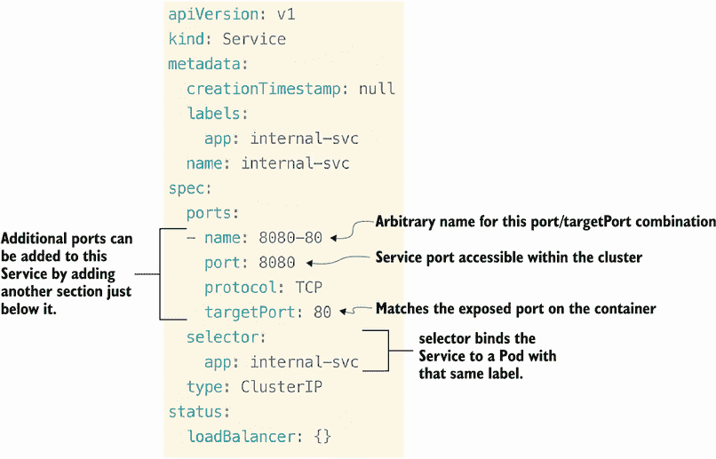

图 6.13 服务 YAML 规范

假设我们想要在这个服务中暴露另一个端口；我们也可以这样做。复制 YAML 文件中`ports`一词下面的所有内容，并将其粘贴到`targetPort`一词下面。现在我们可以将名称更改为`search`；端口和目标端口可以是 9200。结果应该类似于以下内容：

```
spec:
  ports:
  - name: 8080-80
    port: 8080
    protocol: TCP
    targetPort: 80
  - name: search
    port: 9200
    protocol: TCP
    targetPort: 9200
  selector:
    app: internal-svc
  type: ClusterIP
status:
  loadBalancer: {}
```

这类似于可能运行在你的集群中的 Elasticsearch Pod。如果客户端连接到这个服务，那么具有端口 80 暴露的 Pod 以及具有端口 9200 暴露的 Pod 都可以通过访问一个服务来访问。

可以完全绕过服务，直接访问 Pod。这被称为*无头服务*。为了演示这一点，让我们在我们的 YAML 规范中添加一行。在规范下方，让我们插入行`clusterIP: none`。结果应该看起来像以下内容：

```
spec:
  clusterIP: “None”
  ports:
  - name: 8080-80
    port: 8080
    protocol: TCP
    targetPort: 80
  - name: search
    port: 9200
    protocol: TCP
    targetPort: 9200
```

这不仅会从服务中移除 IP 地址，而且当使用 DNS 通过服务查找 Pod 时，通信将直接发送到 Pod。在数据库集群的情况下，这是必需的，因为只有一个数据库副本负责写入数据库，而其他所有副本只允许读取。客户端可以轻松地查找与无头服务关联的 Pods，并确定哪个 Pod 负责写入数据库。

让我们使用命令 `k create -f svc.yaml` 创建这个无头多端口服务。名为 `internal-svc` 的服务没有像其他服务那样的集群 IP。此外，还有两组端口——8080 和 9200。输出将类似于以下内容：

```
root@kind-control-plane:/# k create -f svc.yaml
service/internal-svc created
root@kind-control-plane:/# k get svc
NAME           TYPE        CLUSTER-IP      EXTERNAL-IP   
➥ PORT(S)             AGE
apache-svc     ClusterIP   100.96.102.73   <none>        
➥ 80/TCP              22h
internal-svc   ClusterIP   None            <none>        
➥ 8080/TCP,9200/TCP   29s
kubernetes     ClusterIP   10.96.0.1       <none>        
➥ 443/TCP             28h
```

### 6.4.2 NodePort 服务

NodePort 服务不仅能够与集群中的所有其他组件进行内部通信，还可以在节点上公开一个静态端口，用于外部流量。这对于测试与 Pod 的通信很有用，但也有一些限制。您将需要知道节点的 IP 地址，并且您还必须知道哪个端口被公开，因为 NodePort 服务的可用端口范围是 30000–32768。

就像集群 IP 服务类型和 Kubernetes 中的许多其他资源一样，您可以通过执行命令 `k create svc nodeport no --node-port 30000 --tcp 443:80` 来创建一个服务，或者您可以通过命令 `k create svc nodeport no --node-port 30000 --tcp 443:80 --dry-run=client -o yaml > nodeport.yaml` 创建一个声明性的 YAML 文件。让我们在 Vim 中打开 YAML 文件，看看这与集群 IP 服务有何不同。要打开文件 `nodeport.yaml`，请输入 `vim nodeport.yaml`。您会看到它们非常相似，但类型不是 `ClusterIP`，而是 `NodePort`，并且在端口名称部分增加了一行。添加了 `nodePort: 30000` 这行，这是将在集群中的每个节点上公开的静态端口号，就像图 6.14 中显示的 YAML 那样。

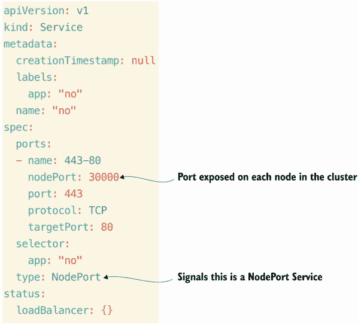

图 6.14 创建 NodePort 服务的 YAML

就像在集群 IP 服务中一样，我们可以为这个服务分配多个端口和目标端口，但没有为无头服务提供选项。这是好事，因为如果节点被暴露，其他用户可以直接进入您的 Pod。让我们通过输入命令 `k apply -f nodeport.yaml` 创建一个 NodePort 服务，其输出将类似于以下内容：

```
root@kind-control-plane:/# k apply -f nodeport.yaml
service/no created
root@kind-control-plane:/# k get svc
NAME           TYPE        CLUSTER-IP      EXTERNAL-IP   
➥ PORT(S)             AGE
apache-svc     ClusterIP   100.96.102.73   <none>        
➥ 80/TCP              23h
internal-svc   ClusterIP   None            <none>        
➥ 8080/TCP,9200/TCP   21m
kubernetes     ClusterIP   10.96.0.1       <none>        
➥ 443/TCP             29h
no             NodePort    100.96.95.252   <none>        
➥ 443:30000/TCP       3s
```

NodePort 服务在端口下有一个额外的参数，表示从 30,000 个端口中使用的特定节点端口。Pods 将通过名为 `no` 的服务在节点的 `100.96.95.252:30000` 上可用。

### 6.4.3 负载均衡器服务

负载均衡器服务正如其名——一个在云中或裸机设备上配置的负载均衡设备。对于 CKA 考试，你不必担心实际的负载均衡器设备；你只需要知道如何创建负载均衡器服务及其相关的 YAML。让我们就这样做！输入命令`k create svc loadbalancer lb-svc --tcp 8080:8080 --dry-run=client -o yaml > lb-svc.yaml`。通过输入命令`vim lb-svc.yaml`打开文件。查看这个负载均衡器服务与图 6.15 中显示的 NodePort 和 ClusterIP 服务之间的差异。

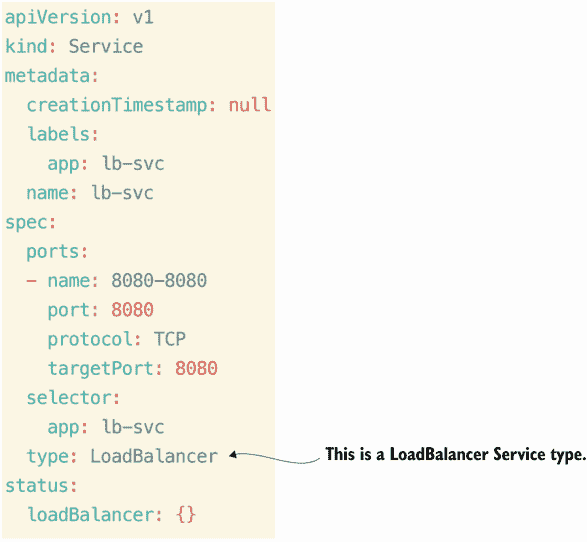

图 6.15 创建负载均衡器服务的 YAML

你会注意到负载均衡器服务的 YAML 与 ClusterIP 服务的 YAML 之间没有太大的区别。唯一的区别是类型被设置为`LoadBalancer`。这意味着不需要使用节点端口来访问应用程序，这因此使得通信稍微容易一些。这里有一个选项可以将 NodePort 添加到 YAML 中，这意味着端口仍然被暴露，但节点端口不会作为访问应用程序的方法被暴露。

在我们创建负载均衡器服务之前，让我们在我们的 kind 集群中创建一个负载均衡器。一个与 kind 配合得很好的负载均衡器是 MetalLB。你可能还记得在第四章中用 Helm 安装了 MetalLB 负载均衡器。现在我们再次部署它，但这次我们将通过 YAML 清单来安装。运行命令`k apply -f https:// raw.githubusercontent.com/chadmcrowell/acing-the-cka-exam/main/ch_06/metallb-native.yaml`来安装 MetalLB 负载均衡器。接下来，我们需要为你的集群配置负载均衡器。为此，输入`k get no -o wide`以找到你的节点 IP 地址。输出将类似于以下内容（但 IP 地址不同）：

```
root@kind-control-plane:/# k get no -o wide
NAME                 STATUS   ROLES           AGE   VERSION          
➥ INTERNAL-IP
kind-control-plane   Ready    control-plane   32h   v1.25.0-beta.0   
➥ 172.18.0.2
```

在`Internal-IP`列下，复制前两个八位字节（对我来说是`172.18`），因为你将更改下一个文件的值，你可以使用命令`curl -O https://raw.githubusercontent.com/chadmcrowell/acing-the-cka-exam/main/ch_06/metallb-layer2-config.yaml`下载该文件。一旦你下载了文件，使用命令`vim metallb-layer2-config.yaml`打开它。将地址下面的值更改为与你的节点 IP 地址匹配。输出应该如下所示：

```
---
apiVersion: metallb.io/v1beta1
kind: IPAddressPool
metadata:
  name: first-pool
  namespace: metallb-system
spec:
  addresses:
  - 172.18.255.1-172.18.255.50
---
apiVersion: metallb.io/v1beta1
kind: L2Advertisement
metadata:
  name: example
  namespace: metallb-system
```

在文件`metallb-layer2-config.yaml`中，我将地址更改为`172.18.255.1-172.18.255.50`以匹配我的节点 IP 地址的前两个八位字节。现在我们可以使用命令`k create -f metallb-layer2-config.yaml`应用 YAML。你应该会看到以下输出：

```
root@kind-control-plane:/# k create -f metallb-layer2-config.yaml
ipaddresspool.metallb.io/first-pool created
l2advertisement.metallb.io/example created
```

现在我们可以创建我们的 LoadBalancer 服务。不是创建一个新的，而是修改现有的名为`apache-svc`的服务，将其从 ClusterIP 服务更改为 LoadBalancer 服务。为此，输入命令`k edit svc apache-svc`，这将打开 Vim 中的 YAML 规范。向下滚动到以单词`type`开头的行，将`ClusterIP`更改为`LoadBalancer`（区分大小写）。别忘了按键盘上的 I 键进入插入模式！

一旦您进行了更改，请按键盘上的 Esc 键退出插入模式，并输入`:wq`以保存文件并退出。这将应用更改。现在您可以执行命令`k get svc`并看到以下内容：

```
root@kind-control-plane:/# k get svc
NAME           TYPE           CLUSTER-IP      EXTERNAL-IP    
➥ PORT(S)     AGE
apache-svc     LoadBalancer   100.96.25.132   172.18.255.1   
➥ 80:30499/TCP        30s
internal-svc   ClusterIP      None            <none>         
➥ 8080/TCP,9200/TCP   3h43m
kubernetes     ClusterIP      10.96.0.1       <none>         
➥ 443/TCP             32h
no             NodePort       100.96.95.252   <none>         
➥ 443:30000/TCP       3h22m
```

类型已更改为`LoadBalancer`，现在在`External-IP`列中有一个 IP 地址。这是 MetalLB 负载均衡器的 IP 地址，我们可以使用它来访问我们的应用程序（在 Pod 中运行）。输入`curl 172.18.255.1`，您应该得到以下结果：

```
root@kind-control-plane:/# curl 172.18.255.1
<html><body><h1>It works!</h1></body></html>
```

## 6.5 集群节点网络配置

当尝试在 Kubernetes 集群内部进行通信时，与从一台服务器到另一台服务器的通信并没有太大的区别，只是增加了一些功能。这些功能通常被称为*网络覆盖层*，它们是在您已有的网络之上的网络抽象。为什么是这样呢？因为 Kubernetes 集群中的每个 Pod 都需要自己的 IP 地址，您可能没有为每个 Pod 预留足够的 IP 地址，尤其是当集群扩展到数十个节点和可能数百个 Pod 时。这种覆盖层有时被称为*VXLAN*。

VXLAN 位于现有的物理网络之上，并使用封装协议在第三层网络上隧道第二层连接。当通信在节点之间来回传递时，如图 6.16 所示，当尝试到达一个 Pod 时，封装通过在数据包上放置一个头部来帮助进行正确的路由。

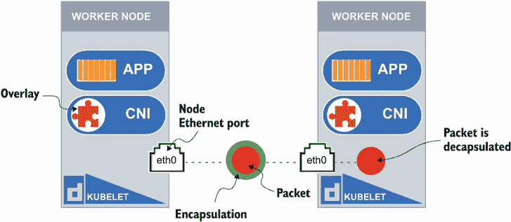

图 6.16 通过 CNI 从节点到节点的封装数据包移动

该覆盖层遵循一组规范和库，用于编写插件以配置 Linux 容器中的网络接口。这个覆盖层的术语是*c*ontainer network interface (CNI**)。CNI 是云原生计算基金会（CNCF）的一个项目，它不仅限于 Kubernetes，因为它是一个创建容器之间网络的通用框架。然而，当与 Kubernetes 一起使用时，它是一个在集群中运行的 DaemonSet，在根命名空间中创建一个虚拟网络接口，这是节点进出数据包流动的中介。

Kubernetes 中流行的 CNI 插件包括 Flannel、Calico、Weavenet、Cilium 等。在 CKA 考试中，仅使用 Flannel 和 Calico，因此我们将重点关注它们。kindnet DaemonSet 正在我们的集群中运行，是用于 kind 集群的 CNI。您可以通过输入命令`k get ds -n kube-system`来查看这一点。输出将类似于以下内容：

```
root@ingress-control-plane:/# k get ds -n kube-system
NAME         DESIRED   CURRENT   READY   UP-TO-DATE   AVAILABLE   NODE 
➥ SELECTOR            AGE
kindnet      1         1         1       1            1           
➥ <none>                   47h
kube-proxy   1         1         1       1            1           
➥ kubernetes.io/os=linux   47h
```

这充当了一个 VXLAN。对于考试，你需要知道如何选择合适的 CNI 插件。我们可以通过首先创建一个没有 CNI 的新 kind 集群，使用附录 C 中定义的步骤来安装 flannel CNI。一旦你创建了一个新的 kind 集群，使用命令`docker exec -it kind-control-plane bash`和`docker exec -it kind-worker bash`分别获取到两个节点容器的一个 shell。当你有一个 Bash shell 到容器时，继续在`kind-control-plane`和`kind-worker`上运行命令`apt update; apt install wget`。这将安装 wget，这是一个我们可以用来从网络上下载文件的命令行工具，这正是我们将通过命令`wget https://github.com/containernetworking/plugins/releases/download/v1.1.1/cni-plugins-linux-amd64-v1.1.1.tgz`所做的事情。因为这是一个 tarball 文件，你需要使用命令`tar -xvf cni-plugins-linux-amd64-v1.1.1.tgz`来解压它。输出将类似于以下内容：

```
root@kind-control-plane:/# tar -xvf cni-plugins-linux-amd64-v1.1.1.tgz
./
./macvlan
./static
./vlan
./portmap
./host-local
./vrf
./bridge
./tuning
./firewall
./host-device
./sbr
./loopback
./dhcp
./ptp
./ipvlan
./bandwidth
```

对于我们的情况，网桥文件是最重要的，因为它将为 Kubernetes 提供使用 Flannel 作为 CNI 所需的插件。它还需要位于特定的目录——`/opt/cni/bin/`——以便被集群识别。我们将使用命令`mv bridge /opt/cni/bin/`将文件 bridge 移动到该目录。

现在我们已经在`kind-control-plane`和`kind-worker`上安装了网桥插件，我们可以通过在控制平面节点的 shell 内部创建`flannel` Kubernetes 对象来安装 Flannel CNI——使用命令`kubectl apply -f https://raw.githubusercontent.com/flannel-io/flannel/master/Documentation/kube-flannel.yml`。你可以使用命令`kubectl get no`来验证节点是否处于就绪状态。输出将类似于以下内容：

```
root@kind-control-plane:/# kubectl get no
NAME                 STATUS   ROLES           AGE   VERSION
kind-control-plane   Ready    control-plane   16m   v1.25.0-beta.0
kind-worker          Ready    <none>          16m   v1.25.0-beta.0
```

我们还可以使用命令`kubectl get po -A`来验证 CoreDNS Pods 正在运行，并且`flannel` Pods 已被创建并正在运行。输出将类似于以下内容：

```
root@kind-control-plane:/# k get po -A
NAMESPACE            NAME                                         READY
➥    STATUS 
kube-flannel         kube-flannel-ds-d6v6t                        1/1
➥    Running
kube-flannel         kube-flannel-ds-h7b5v                        1/1
➥    Running
kube-system          coredns-565d847f94-txdvw                     1/1
➥    Running
kube-system          coredns-565d847f94-vb4kg                     1/1
➥    Running
kube-system          etcd-kind-control-plane                      1/1
➥    Running
kube-system          kube-apiserver-kind-control-plane            1/1
➥    Running
kube-system          kube-controller-manager-kind-control-plane   1/1
➥    Running
kube-system          kube-proxy-9hsvk                             1/1
➥    Running
kube-system          kube-proxy-gkvrz                             1/1
➥    Running
kube-system          kube-scheduler-kind-control-plane            1/1
➥    Running
local-path-storage   local-path-provisioner-684f458cdd-8bwkh      1/1
➥    Running
```

现在，你在你的 kind 集群中已经安装了 Flannel CNI，并准备好使用 CNI 在节点之间进行通信，以及为往返的数据包提供封装。

考试练习

使用`kubectl`命令行，通过`nginxdemos/hello:plain-text`镜像创建一个名为`hello`的 Deployment。使用`kubectl`命令行暴露 Deployment 以创建一个名为`hello-svc`的 ClusterIP 服务，该服务可以通过端口 80 进行通信。使用正确的`kubectl`命令来验证它是一个具有正确端口暴露的 ClusterIP 服务。

将上一个练习中创建的`hello-svc`服务更改为 NodePort 服务，其中 NodePort 应为 30000。确保就地编辑服务，而不是创建新的 YAML 或发出新的命令。使用 curl 通过 NodePort 服务与 hello Deployment 内的 Pod 进行通信。

使用命令 `k apply -f https:// raw.githubusercontent.com/chadmcrowell/acing-the-cka-exam/main/ch_06/ nginx-ingress-controller.yaml` 在集群中安装 Ingress 控制器。将 `hello-svc` 服务改回 ClusterIP 服务，并创建一个 Ingress 资源，当客户端请求 hello.com 时，将路由到 `hello-svc` 服务。

创建一个新的没有 CNI 的 kind 集群。安装 bridge CNI，然后安装 Calico CNI。在安装 CNI 后，验证 CoreDNS Pods 是否正在运行，并且节点处于就绪状态。

## 摘要

+   对于服务发现，在 Kubernetes 集群中，DNS 解析是通过 CoreDNS 进行的。我们探讨了如何通过 DNS 查询来发现 Pod 和服务。对于考试，你将需要知道如何配置和使用 CoreDNS。

+   CoreDNS 在 `kube-system` 命名空间中的 Deployment 上运行。我们可以复制 CoreDNS Deployment 中的 Pod 以获得更快的域名解析。

+   kubelet 负责为每个 Pod 提供正确的 CoreDNS IP 地址，以便允许 Pod 进行 DNS 解析。对于考试，请记住在控制平面节点上存在 `/etc/kubernetes/manifests` 目录，kubelet 将自动启动 Pods（称为静态 Pods）。

+   Pod 中的 DNS 解析器文件是 `/etc/resolv.conf`，它将根据集群中的服务具有某些搜索标准。`resolv.conf` 文件还包含 DNS IP 地址。在考试中解析主机名时，如果 Pod 在不同的命名空间中，别忘了使用 Pod 的 FQDN。

+   Ingress 和 Ingress 控制器允许通过层 7 路由到集群，通过服务与 Pod 进行通信。Ingress 可以处理同一 Ingress 资源中多个服务的路由，对于考试，你需要知道如何配置这种路由。此外，你还需要知道如何使用 Ingress 控制器和 Ingress 资源。

+   Kubernetes 中有三种不同类型的 Service，所有这些都允许集群内 Pod 与 Pod 之间的通信。对于考试，你需要了解 Pod 之间的连接性。

+   kubelet 是在节点本身上运行的服务。你可以重新加载守护进程并重启服务，就像你更改创建 Pod 的配置一样。对于考试，你将需要知道如何停止、启动和重新加载 kubelet 守护进程。

+   Kubernetes 中的集群网络接口 (CNI) 通过封装数据包并为源和目标路由添加头部来帮助节点之间的通信。对于考试，你需要了解集群节点上的主机网络配置。
