# 7 Kubernetes 中的存储

本章涵盖

+   在 Kubernetes 中创建卷

+   持久卷声明和存储类

+   在 Kubernetes 中的应用程序中使用存储

如我们从之前的练习中看到的，Pod 的生命周期很短，驻留在该 Pod 中的数据生命周期也短。为了解决这个问题并保留 Pod 使用的相关数据，我们创建了持久卷（PV）。在考试中，你将测试创建 PV、持久卷声明（PVC）和存储类的能力。我们将在本章中讨论这些主题。

存储领域

本章涵盖了 CKA 课程中的存储领域，该领域占考试题目的 10%。该领域涵盖了应用程序数据在 Kubernetes 中的使用方法，包括将存储挂载到 Pod 中以供容器使用。它包括以下能力。

| 能力 | 章节部分 |
| --- | --- |
| 理解存储类和 PVC。 | 7.1, 7.3 |
| 理解卷模式、访问模式和回收策略。 | 7.1.1, 7.1.2, 7.1.3 |
| 理解 PVC 原语。 | 7.2 |
| 了解如何配置具有持久存储的应用程序。 | 7.1, 7.2, 7.3, 7.4 |

## 7.1 持久卷

为了防止在 Kubernetes 中数据丢失，通过创建一个完全独立的 Kubernetes 对象，称为*持久卷*，将数据从 Pod 本身解耦，该对象对所有集群中的 Pod 都是可用的，因为 PV 不是命名空间化的。随着 Pod 的来去，数据并不绑定到 Pod 本身，因此它在其自己的管理资源中超越了 Pod 的生命周期。你可以继续向卷中添加数据对象，如果另一个 Pod 计划挂载相同的卷，持久卷将不会改变，如图 7.1 所示。实际的存储由主机、网络文件系统（NFS）服务器、亚马逊的简单存储解决方案（S3）存储桶或任何其他存储提供商支持。

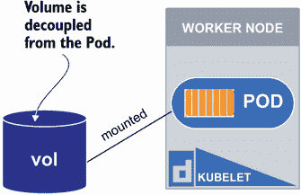

图 7.1 一个挂载到 Pod 的持久卷（PV），它可以作为一个独立的实体

CKA 考试将测试你对三种存储类型的理解：(1) `emptyDir`卷，(2) `hostPath`卷，和(3) `nfs`卷，因此我们将重点关注这些类型（而不是许多其他类型）。例如，考试问题可能如下所述。

| 考试任务 在集群`ek8s`中，配置一个名为`vol02833`的`hostPath` PV，大小为 10 MB 的本地存储，来自工作节点主机`node01`。主机上的目录应该是`/mnt/data`。创建一个名为`claim-02833`的 PVC，将从卷`vol02833`中保留 90 MB 的存储。将其挂载到名为`frontend0113`的 Deployment 中的 Pod；容器内的挂载路径应该是`/usr/share/nginx/html`。YAML 文件的名称应该是`deploy.yaml`。 |
| --- |

如果您还没有访问现有 Kubernetes 集群的权限，附录 A 中解释了如何使用 kind 创建 Kubernetes 集群。请确保创建一个双节点集群，因为我们将会使用工作节点的本地存储来创建 PV 资源。一旦您有权访问您的双节点集群，通过运行命令`docker exec -it kind-control-plane bash`来获取控制平面节点的 shell。一旦您有了 shell，通过命令`alias k=kubectl`将您的别名`k`设置为等于`kubectl`。在考试中，他们已经为您设置了此别名，所以熟悉使用`k`而不是反复输入`kubectl`是很好的。

要创建此 PV 资源，我们将使用 Kubernetes 文档来复制一些 YAML，您在考试期间也将能够这样做。这不仅是对考试日的良好实践，而且我们之所以这样做，是因为按照设计，我们无法像使用`--dry-run=client`创建部署的 YAML 模板那样创建 YAML 模板。通过文档访问 YAML 将使您熟悉 Kubernetes 文档以及如何导航它们。

考试技巧：在新考试环境中，使用快捷键 CTRL-SHIFT-C 来复制和 CTRL-SHIFT-V 来粘贴。这，加上知道如何搜索 Kubernetes 文档，将在您无法轻松使用`kubectl`创建持久存储时节省考试时间。

前往[`kubernetes.io/docs`](https://kubernetes.io/docs)，并使用屏幕左侧的搜索栏搜索短语“使用持久卷”。点击名为“配置 Pod 以使用持久卷进行存储 | Kubernetes”的链接，并滚动到“创建持久卷”部分。该页面的完整 URL 是[`mng.bz/rW0y`](http://mng.bz/rW0y)。将此页面的 YAML 复制并粘贴到名为`pv.yaml`的新文件中。结果应类似于图 7.2。

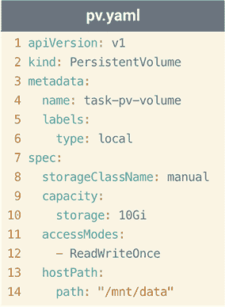

图 7.2 从 Kubernetes 文档复制并粘贴到名为`pv.yaml`的文件中的 YAML

我们将把 PV 的名称从`task-pv-volume`更改为`vol02883`（图 7.2，第 4 行），并将存储从`10Gi`更改为`100Mi`（图 7.2，第 10 行）。保存文件`pv.yaml`，并使用命令`k create -f pv.yaml`创建 PV。如果您执行命令`k get pv`，您将看到类似于以下内容的输出：

```
root@kind-control-plane:/# k get pv
NAME       CAPACITY   ACCESS MODES   RECLAIM POLICY   STATUS      CLAIM   
➥ STORAGECLASS
vol02833   100Mi      RWO            Retain           Available           
➥ manual
```

从输出中您可以看到状态是可用的，这意味着它已准备好被领取。让我们在 Kubernetes 文档的同一页面上向下滚动来创建我们的领取。该页面再次是[`mng.bz/Bm92`](http://mng.bz/Bm92)。将 YAML 粘贴到名为`pvc.yaml`的文件中。文件内容应类似于图 7.3。

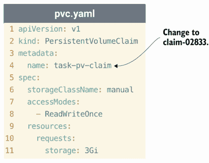

图 7.3 一个名为`pvc.yaml`的 PVC YAML 文件，它是从 Kubernetes 文档中复制的

将 PVC 的名称从 `task-pv-claim` 更改为 `claim-02833`，并将存储从 `3Gi` 更改为 `90Mi`（图 7.3，第 11 行）。使用命令 `k apply -f pvc.yaml` 创建 PVC。一旦资源创建成功，您可以使用命令 `k get pvc` 查看 PVC，也可以使用命令 `k get pv` 查看 PV。该命令的输出将如下所示：

```
root@kind-control-plane:/# k get pvc
NAME          STATUS   VOLUME     CAPACITY   ACCESS MODES   STORAGECLASS   
➥ AGE
claim-02833   Bound    vol02833   100Mi      RWO            manual         
➥ 4m
root@kind-control-plane:/# k get pv
NAME       CAPACITY   ACCESS MODES   RECLAIM POLICY   STATUS   
➥ CLAIM                 STORAGECLASS
vol02833   100Mi      RWO            Retain           Bound    
➥ default/claim-02833   manual
```

考试提示：您可以通过在资源名称之间放置逗号来同时列出多个 Kubernetes 资源。例如，执行命令 `k get pv,pvc` 以在默认命名空间中列出 PV 和 PVC。

如果您从输出中注意到，尽管我们在 PVC YAML 中指定了 `90Mi`，但容量是 `100Mi`。这是因为 PVC 将尝试找到最接近的 PV 来满足该请求，但不能仅保留 PV 的一部分。如果我们请求 `110Mi`，PVC 将不会满足，因为没有匹配的 PV 具有请求的存储量。

让我们继续创建一个 Deployment，这样我们就可以使用挂载到 Pod 容器中的卷。我们可以使用命令 `k create deploy frontend0113 --image nginx --dry-run=client -o yaml > deploy.yaml` 创建 Deployment YAML。一旦文件创建成功，我们将使用命令 `vim deploy.yaml` 打开它。文件内容应类似于图 7.4。

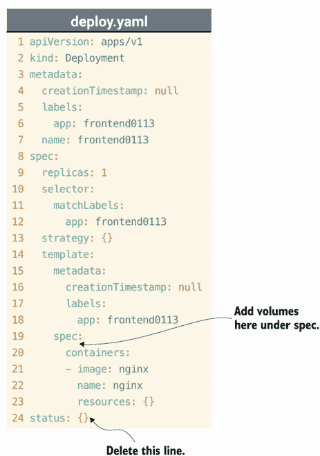

图 7.4 使用 `kubectl` 命令创建的 Deployment 的 YAML

在规范下，我们将通过在行 24 输入 `volumes:` 来将我们的卷 YAML 内联添加到 `containers` 中（您可以删除 `status: {}`，因为它不是必需的）。在 `volumes:` 下，输入 `- name: vol-33`。在其下方，与 `name` 保持一致，输入 `persistentVolumeClaim:`。在 `persistentVolumeClaim:` 下，缩进两个空格并输入 `claimName: claim-02833`。最后，删除 `creationTimestamp: null` 这一行。结果将类似于图 7.5。


图 7.5 在 YAML 文件 `deploy.yaml` 中将 `volumes` 语法添加到 Deployment 规范

在创建 Deployment 之前，我们必须在容器内指定卷的挂载路径。我们将通过在行 23 下方添加一行来实现这一点。与资源保持一致，输入 `volumeMounts:`。在其下方，输入 `- name: vol-33`（必须与卷名称相同）。在 `name: vol-33` 下方，与名称保持一致，输入 `mountPath: "/usr/share/nginx/html"`。最终 Deployment YAML 的内容将类似于图 7.6。

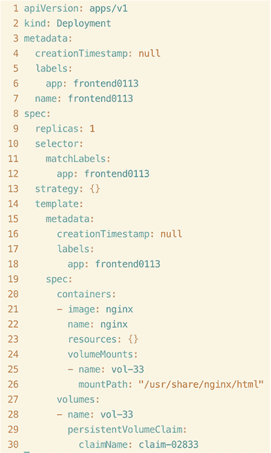

图 7.6 添加名为 `vol-33` 的卷的完整 Deployment YAML

现在，我们可以保存我们的 YAML 文件，并使用命令 `k apply -f deploy.yaml` 创建 Deployment。您可以使用命令 `k get deploy` 列出 Deployment，并使用命令 `k get po` 列出 Deployment 内的 Pods。输出将类似于以下内容：

```
root@kind-control-plane:/# k get deploy
NAME           READY   UP-TO-DATE   AVAILABLE   AGE
frontend0113   1/1     1            1           8s
root@kind-control-plane:/# k get po
NAME                            READY   STATUS    RESTARTS   AGE
frontend0113-6d6c77b9b6-62qbh   1/1     Running   0          11s
```

您会看到容器正在运行。这意味着我们的卷已成功挂载。为了证明这一点，请输入命令 `k describe po`，然后跟上是 Pod 的名称（Pod 的名称对您来说将是不同的）。我的命令是 `k describe po frontend0113-6d6c77b9b6-62qbh`。在输出的卷部分，您将看到名为 `vol-33` 的卷以及我们之前创建的 PVC。简略输出将类似于图 7.7。

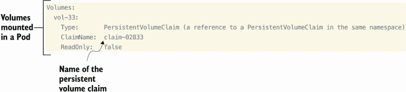

图 7.7 `k` `describe` `po` 命令的简略输出，显示了挂载到 Pod 上的体积

现在，我们已经成功创建了一个 PV、一个 PVC 以及将卷挂载到 Pod 的 Deployment，我们已经成功完成了这个考试任务。

### 7.1.1 hostPath 的问题

使用 `hostPath` 类型的体积的问题在于，在多个节点集群中，数据会被写入集群中的所有节点，预期所有节点的存储配置都是相同的。如果不是这样，数据将只会写入一个节点。这意味着如果 Pod 被调度到某个节点，数据可能不会驻留在该节点上。

考试技巧：如果在考试中遇到一个表示存储必须超出 Pod 生命周期的题目，除非另有说明，否则 `hostPath` 将是您需要提供的卷类型。如果您遇到一个需要数据存在于除本地存储以外的题目，考试将说明应该使用哪种卷类型（例如，`nfs`）。

为了解决这个问题，您可以使用 `nfs` 卷类型。`nfs` 卷允许您将挂载到 Pod 的数据存储在网络的 `nfs` 共享中。`nfs` 类型也支持多个写入者；因此，许多 Pod 可以同时使用这个卷。因为我们实验室中没有运行 `nfs` 服务器，所以我将在这里展示一个使用 `nfs` PV 的 Pod 的简单示例：

```
apiVersion: v1
kind: PersistentVolume
metadata:
  name: nfs-pv
spec:
  capacity:
    storage: 1Mi
  accessModes:
    - ReadWriteMany
  nfs:
    server: nfs-server.default.svc.cluster.local
    path: "/"
  mountOptions:
    - nfsvers=4.2
```

PV 看起来与之前的不同，因为我们添加了包含服务器和路径的 `nfs` 字段。路径是挂载在 `nfs` 服务器上的位置。挂载选项基于您的服务器使用的 `nfs` 版本。一旦我们创建了这个 PV，我们就可以创建一个像这样的 PVC：

```
apiVersion: v1
kind: PersistentVolumeClaim
metadata:
  name: nfs-pvc
spec:
  accessModes:
    - ReadWriteMany
  storageClassName: ""
  resources:
    requests:
      storage: 1Mi
  volumeName: nfs-pv
```

如您所见，声明的结构非常类似于之前的声明，只是访问模式不同。这是因为您可以写入 `nfs` 卷到多个源（Pod）。在 PVC 中，我们也可以通过指定 `volumeName` 来指定声明应绑定到的 PV，就像在最后一行那样。一旦我们有了 PV 和 PVC，我们就可以创建 Pod 的 YAML 如下：

```
apiVersion: v1
kind: Pod
metadata:
  creationTimestamp: null
  labels:
    run: nfs-pod
  name: nfs-pod
spec:
  containers:
  - image: nginx
    name: nfs-pod
    volumeMounts:
      - name: nfs-vol
        mountPath: "/usr/share/nginx/html"
    resources: {}
  dnsPolicy: ClusterFirst
  restartPolicy: Always
  volumes:
  - name: nfs-vol
    persistentVolumeClaim:
      claimName: nfs-pvc
```

再次，如果在您的实验室中运行此示例，它将失败，因为您的网络中没有运行的 NFS 服务器；然而，在考试中，情况将不同。如果有问题表示您必须使用 `nfs` 卷，您肯定会提供一个运行的 `nfs` 服务器，以服务器地址和路径的形式提供。

### 7.1.2 体积模式

*卷模式*是 Kubernetes 中正在访问的卷类型。默认情况下，如果您没有包含特定的模式，PV 将假定卷模式为`FileSystem`，而不是`Block`。最初我们不需要在 YAML 中指定它，但您可以通过运行命令`k describe pv vol02833`来查看它默认的模式。该命令的输出将类似于以下内容：

```
root@kind-control-plane:/# k describe pv vol02833
Name:            vol02833
Labels:          type=local
Annotations:     pv.kubernetes.io/bound-by-controller: yes
Finalizers:      [kubernetes.io/pv-protection]
StorageClass:    manual
Status:          Bound
Claim:           default/claim-02833
Reclaim Policy:  Retain
Access Modes:    RWO
VolumeMode:      FileSystem
Capacity:        100Mi
Node Affinity:   <none>
Message:
Source:
    Type:          HostPath (bare host directory volume)
    Path:          /mnt/data
    HostPathType:
Events:            <none>
```

如您所见，在`Access Modes:`和`Capacity:`之间是`VolumeMode: FileSystem`。文件系统模式旨在将卷挂载到 Pod 中作为一个目录。块模式由块设备支持，其中设备是空的（未格式化）。块设备的例子包括 Amazon Elastic Block Store (EBS)、Azure Disk、iSCSI 磁盘、FC（光纤通道）磁盘、CephFS，甚至是本地磁盘（就像我们在考试任务中使用的那样）。对于 CKA 考试，您不需要创建块存储本身，您只需要知道如何更改 YAML 规范中的`volumeMode`。因为我们仍然有 7.8 节中的文件`pv.yaml`，我们将打开它并添加一行。在`storageClassName`下面，内联添加`volumeMode: Block`。同时更改 PV 的名称，因为您不能有两个具有相同名称的卷。我们新的块存储卷的最终 YAML 将类似于图 7.8。

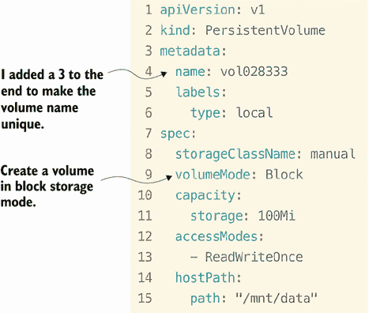

图 7.8 在`Block`模式下创建 PV 的第九行

您可以使用命令`k apply -f pv.yaml`创建这个新的 PV，您将看到 PV 紧挨着现有的 PV。输出将类似于以下内容：

```
root@kind-control-plane:/# k apply -f pv.yaml
persistentvolume/vol028333 created
root@kind-control-plane:/# k get pv
NAME        CAPACITY   ACCESS MODES   RECLAIM POLICY   STATUS      
➥ CLAIM                 STORAGECLASS
vol02833    100Mi      RWO            Retain           Bound       
➥ default/claim-02833   manual
vol028333   100Mi      RWO            Retain           Available
➥                          manual
```

您会注意到，在组成方面它们看起来完全相同，但一个是`FileSystem`模式，另一个是`Block`模式。

### 7.1.3 访问模式

*访问模式*决定了卷如何被访问，通过什么权限，以及从哪些在 Kubernetes 中运行的应用程序。您可能已经注意到，在我们的`pv.yaml`文件和我们的`pvc.yaml`文件中，我们都指定了访问模式为`ReadWriteOnce`。这意味着什么？从节点的角度来考虑，因为节点是访问卷的那个。`ReadWriteOnce`意味着只有一个节点可以挂载卷并对其进行读写。其他三种模式是`ReadOnlyMany`，意味着多个节点可以只读挂载卷；`ReadWriteMany`，意味着多个节点可以读写挂载卷；以及`ReadWriteOncePod`，意味着只有一个 Pod 在该节点上可以挂载该卷进行读写。

PV 可以有多个访问模式，而 PVC 只能有一个。即使 PV YAML 中指定了多个模式，节点一次也只能利用一个访问模式，因此您必须从四种模式中选择一个。例如，如果我们向我们的 PV YAML 添加了一个访问模式，如图 7.9 所示，您将不得不在 PVC 中选择`ReadWriteOnce`或`ReadOnlyMany`。

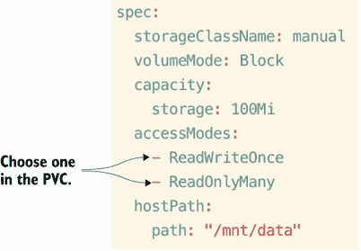

图 7.9 在 PV 的 YAML 中指定了多个访问模式，其中只有一个是可以在 PVC 中使用的

此外，最重要的是，某些卷只支持某些访问模式。例如，我们这里有的类型`hostPath`不支持`ReadOnlyMany`、`ReadWriteMany`或`ReadWriteOncePod`。这一点很重要，因为这可能在考试中作为一个陷阱问题出现。

考试技巧：考试可能不会明确说明访问模式是`ReadOnlyMany`还是`ReadWriteOnce`，因为它假设你知道`hostPath`类型的卷只支持`ReadWriteOnce`。另外，`nfs`卷支持`ReadWriteOnce`、`ReadOnlyMany`和`ReadWriteMany`。考试将只涵盖`emptyDir`、`hostPath`和`nfs`卷类型；`emptyDir`不是 PV 类型，因此没有访问模式。

每个访问模式的简写可以在表 7.1 中找到；然而，只有当描述 PV 或 PVC 时，你才会看到这些简写形式。

表 7.1 访问模式和它们的简写形式，用于 YAML 中的 PV 或 PVC

| 访问模式 | 简写 | 描述 |
| --- | --- | --- |
| `ReadWriteOnce` | `RWO` | 只有一个节点可以挂载卷并对其进行读写。 |
| `ReadOnlyMany` | `ROX` | 多个节点可以挂载卷进行只读。 |
| `ReadWriteMany` | `RWX` | 多个节点可以挂载卷进行读写。 |
| `ReadWriteOncePod` | `RWOP` | 只有一个 Pod 在该节点上可以挂载该卷进行读写。 |

### 7.1.4 回收策略

在考试任务中应用于我们的 PV 的另一个默认值是*回收策略*。回收策略是用于决定在将 PVC 与其绑定删除后对卷进行什么操作。如果你执行命令`k describe pv vol02833`，你会看到默认的回收策略设置为`Retain`。`describe`命令的输出将类似于以下内容：

```
root@kind-control-plane:/# k describe pv vol02833
Name:            vol02833
Labels:          type=local
Annotations:     pv.kubernetes.io/bound-by-controller: yes
Finalizers:      [kubernetes.io/pv-protection]
StorageClass:    manual
Status:          Bound
Claim:           default/claim-02833
Reclaim Policy:  Retain
Access Modes:    RWO
VolumeMode:      FileSystem
Capacity:        100Mi
Node Affinity:   <none>
Message:
Source:
    Type:          HostPath (bare host directory volume)
    Path:          /mnt/data
    HostPathType:
Events:            <none>
```

在`Claim`和`Access Modes`之间是`Reclaim Policy`。此回收策略也可以设置为`Recycle`或`Delete`。`Retain`表示卷可以再次使用，因为它保留了卷上的数据。然后它可以被另一个声明使用。`Recycle`表示卷已被清理（即，`rm -f`），但此策略已被弃用，因此请改用`Retain`或`Delete`。`Delete`表示后端存储（即，Amazon EBS、Azure Disk）以及 Kubernetes 中的 PV 对象都已删除。只有 Amazon EBS、GCE PD、Azure Disk 和 Cinder 卷支持删除策略。

检验练习

创建一个名为`volstore308`的 PV，预留 22MB 的存储空间，不指定存储类。该卷将使用主机上的`/mnt/data`存储空间。

创建一个名为`pv-claim-vol`的 PVC，将之前创建的 PV 以正确的访问模式声明。

创建一个名为`pod-access`的 Pod，使用镜像`centos:7`，将使用之前步骤中的 PVC，并在容器内部挂载卷到`/tmp/persistence`。发布一个命令以保持容器活跃。你可以使用`sleep 3600`。

## 7.2 持久卷声明

正如我们在 7.1 节中的考试任务中体验到的，PVC 消耗了整个 PV，即使声称比请求量少 10Mi。为了满足存储请求，而不是等待一个完全匹配的量，PVC 将选择最接近该请求量的体积（图 7.10）。

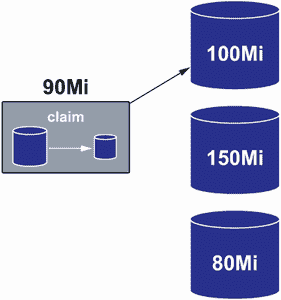

图 7.10 PVC 将选择最接近的可用卷大小以满足请求。

PVC 的职责是为容器（在 Pod 内）保留此存储，因此一旦此请求处于`已绑定`状态，请求将不会释放卷，即使管理员尝试强制删除卷。例如，让我们尝试删除作为考试任务一部分创建的 PV `vol02833`。执行命令`k delete pv vol02833 -force`，你会看到类似的输出（在运行此命令后使用 CTRL-C 返回提示符）：

```
root@kind-control-plane:/# k delete pv vol02833 --force
Warning: Immediate deletion does not wait for confirmation that the running 
➥ resource has been terminated. The resource may continue to run on the cluster indefinitely.
persistentvolume "vol02833" force deleted
^Croot@kind-control-plane:/# k get pv
NAME        CAPACITY   ACCESS MODES   RECLAIM POLICY   STATUS        
➥ CLAIM                 STORAGECLASS
vol02833    100Mi      RWO            Retain           Terminating   
➥ default/claim-02833   manual
vol028333   100Mi      RWO            Retain           
➥ Available                           manual
```

PV 将保持`终止`状态，直到 PVC 被删除。PVC 在被删除之前无法被删除。这防止了 Kubernetes 管理员意外地从正在运行的 Pod 中移除底层存储，这是一个特性而不是错误。尝试使用命令`k delete pvc claim-02833 -force`删除 PVC，你会看到相同的输出（再次使用 CTRL-C 来获取你的提示符）。输出将类似于以下内容：

```
root@kind-control-plane:/# k delete pvc claim-02833 --force
Warning: Immediate deletion does not wait for confirmation that the running 
➥ resource has been terminated. The resource may continue to run on the 
➥ cluster indefinitely.
persistentvolumeclaim "claim-02833" force deleted
^Croot@kind-control-plane:/# k get pvc
NAME          STATUS        VOLUME     CAPACITY   ACCESS MODES   
➥ STORAGECLASS
claim-02833   Terminating   vol02833   100Mi      RWO            manual
```

PVC 将继续处于`终止`状态，直到部署被删除（随后是 Pod）。在此期间，卷将继续挂载到 Pod 上并可用——就像在运行删除命令之前一样——并且不会影响当前访问 Pod 及其存储的应用程序。Pod 的*阶段*决定了其状态，可以通过命令`k get po`获取。卷可以处于以下阶段之一：

+   可用

+   已绑定

+   已发布

+   失败

我们在 7.1 节中首次创建 PV 时看到了这一点。这是 PVC 的要求：要请求卷，它必须可用。*已绑定*是 PV 的阶段，表示它已经被请求，因此对新的 PVC 不可用。*已发布*阶段很重要，因为如果 PV 在回收策略中设置为`保留`，它将被释放并等待新的 PVC 回收它。*失败*阶段表示在回收过程中，失败的卷未能有效地绑定到新的 PVC。

## 7.3 存储类

在跟随 7.1 节的考试任务时，你可能已经注意到我们在 YAML 中包含了一个存储类。存储类不过是一个“存储配置文件”，用于一组类似类型的存储。它很像标签，因为它不影响底层存储能力；它简化了在 Kubernetes 中创建持久存储的过程。你可以使用命令`k get sc`查看你集群中的现有存储类。输出将类似于以下内容：

```
root@kind-control-plane:/# k get sc
NAME                 PROVISIONER             RECLAIMPOLICY   
➥ VOLUMEBINDINGMODE      ALLOWVOLUMEEXPANSION
standard (default)   rancher.io/local-path   Delete          
➥ WaitForFirstConsumer   false
```

在这个 Kubernetes 集群中，一个本地路径类型的卷是预先创建的。这是在集群创建过程中创建的，不是我自己手动创建的。你将在许多其他集群引导工具中体验到这一点（例如与 kind 一样），例如在 CKA 考试中使用 kubeadm，它将预配置存储类，你将被要求使用 PVC。以下是一个考试题目的例子。

| 在集群 `ek8s` 中，基于名为 `standard` 的现有存储类创建一个名为 `claim-03833` 的 PVC，申请 1 GB 的存储空间。将其挂载到名为 `backend0113` 的 Deployment 中的 Pod 上；容器内的挂载路径应为 `/var/lib/mysql`。YAML 文件的名称应为 `backend.yaml`。 |
| --- |

使用与 7.1 节中相同的集群，复制之前的 `pvc.yaml` 文件，并使用命令 `cp pvc.yaml newpvc.yaml` 将其重命名为 `newpvc.yaml`。使用命令 `vim newpvc.yaml` 打开文件 `newpvc.yaml`。将名称从 `claim-02833` 更改为 `claim-03833`，将 `storageClassName` 从 `manual` 更改为 `standard`。最后，将 `storage` 从 `90Mi` 更改为 `1Gi`。文件的最终内容将类似于图 7.11。

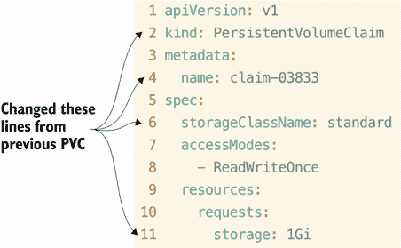

图 7.11 使用名为 `standard` 的存储类的 PVC

要创建 PVC，随后动态配置 PV，保存并退出 Vim，然后输入命令 `k apply -f newpvc.yaml`。这里事情变得有趣，我必须提醒你，如果在考试中遇到这种情况，不要慌张。当你列出 PVC 时，你应该得到以下结果（这是一个好现象）：

```
root@kind-control-plane:/# k get pvc
NAME          STATUS    VOLUME      CAPACITY   ACCESS MODES   STORAGECLASS
claim-02833   Bound     vol028333   100Mi      RWO            manual
claim-03833   Pending                                         standard
```

PVC 处于挂起状态，因为存储只有在创建一个 Pod（换句话说，一个“消费者”）来使用（消耗）该 PVC 时才会配置，这是智能的，因为你不希望预先配置大量未使用的卷。这是静态配置（我们在 7.1 节中执行的操作）与存储类发生的动态配置之间的主要区别。如果你运行命令 `k describe pvc claim-03833`，你会看到这一点得到反映。输出应该如下（已缩略）：

```
Access Modes:
VolumeMode:    FileSystem
Used By:       <none>
Events:
  Type    Reason                Age                   From
                         Message
➥   ----    ------                ----                  ----
➥                          -------
  Normal  WaitForFirstConsumer  50s (x26 over 6m51s)  persistentvolume-
➥ controller  waiting for first consumer to be created before binding
```

现在我们知道我们的 PVC 正在等待消费者，让我们创建一个！再次，让我们使用命令 `cp deploy.yaml backend.yaml` 将之前的 YAML 文件 `deploy.yaml` 复制到一个名为 `backend.yaml` 的新文件中。使用命令 `vim backend.yaml` 打开文件 `backend.yaml`。将名称和标签更改为 `backend0113`，将镜像更改为 `mysql:8.0`，将容器名称更改为 `mysql`，将 `volumeMounts` 的名称更改为 `mysqldata`，将 `mountPath` 更改为 `"/var/lib/mysql"`，最重要的是将 PV 名称更改为 `claim-03833`。我们将添加 MySQL 密码的环境变量，并在容器上暴露端口 3306。最终的 YAML 将类似于图 7.12。


图 7.12 使用挂载在容器 `/var/lib/mysql` 中的 PVC 命名为 `claim-03833` 的 Deployment

让我们保存文件并退出 Vim。如果你没有完全捕捉到所有的更改和添加，你可以使用命令 `curl -O https://raw.githubusercontent.com/chadmcrowell/acing-the-cka-exam/main/ch_07/backend.yaml` 下载文件。我们可以使用命令 `k apply -f backend.yaml` 创建 Deployment。几乎立即，我们会看到我们的 PVC 已经绑定，并且有一个新自动配置的 PV。要列出 PVC 和 PV，运行命令 `k get pvc,pv`。该命令的输出将类似于以下内容：

```
root@kind-control-plane:/# k get pvc,pv
NAME                                STATUS   VOLUME                         
➥             CAPACITY   ACCESS MODES   STORAGECLASS   AGE
persistentvolumeclaim/claim-02833   Bound    vol028333                      
➥             100Mi      RWO            manual         55m
persistentvolumeclaim/claim-03833   Bound    pvc-5cc8fff1-e8a2-4934-ae17-
➥ fa4e3ecbcb40   1Gi        RWO            standard       54m

NAME                                                        CAPACITY   
➥ ACCESS MODES   RECLAIM POLICY   STATUS   CLAIM                 STORAGECLASS
persistentvolume/pvc-5cc8fff1-e8a2-4934-ae17-fa4e3ecbcb40   1Gi        RWO
➥             Delete           Bound    default/claim-03833   standard
persistentvolume/vol028333                                  100Mi      RWO
➥             Retain           Bound    default/claim-02833   manual
```

你已经创建了一个使用标准存储类的 PVC，创建了一个将卷挂载到 Pod 的 Deployment，并完成了考试任务。

### 7.3.1 从存储类继承

如你可能已经注意到的，PV 继承了存储类的某些属性。其中一个是回收策略，设置为删除。其他的是卷类型（在我们的例子中是 `hostPath`）和卷绑定模式。我们可以使用命令 `k get sc standard -o yaml` 查看存储类的 YAML。输出应该如下（注释已缩短以方便阅读）：

```
root@kind-control-plane:/# k get sc standard -o yaml
apiVersion: storage.k8s.io/v1
kind: StorageClass
metadata:
  annotations:
    storageclass.kubernetes.io/is-default-class: "true"
  creationTimestamp: "2022-10-06T21:10:24Z"
  name: standard
  resourceVersion: "264"
  uid: 6caa1035-1584-4356-a060-90c923293a3b
provisioner: rancher.io/local-path
reclaimPolicy: Delete
volumeBindingMode: WaitForFirstConsumer
```

这些设置会自动应用于使用存储类自动配置的每个 PV。

考试练习

创建一个名为 `node-local` 的存储类，使用提供者 `kubernetes.io/no-provisioner`。卷绑定模式应该是 `WaitForFirstConsumer`。

创建一个名为 `claim-sc` 的 PVC，将从之前创建的类中申请 39 MB 的卷。访问模式应该是 `ReadWriteOnce`。

创建一个名为 `pod-sc` 的 Pod，使用镜像 `nginx`，将使用之前步骤中的 PVC，并在容器内部挂载卷到 `/usr/nginx/www/html`。

## 7.4 非持久化卷

要充分实现 PV 的好处，你必须通过处理不持久化的卷来获得一些经验——这里我指的是 `emptyDir` 卷类型。这种卷类型使用容器本身的存储。这很可能会在考试中出现，所以让我们通过另一个考试场景来了解一下。

| 考试任务 在集群 `ek8s` 中创建一个名为 `log-collector` 的 Pod，该 Pod 使用类型为 `emptyDir` 的卷 `logvol`。在容器中将卷挂载到 `/var/log`。YAML 文件的名称应该是 `log-collector.yaml`。 |
| --- |

我们可以继续使用从本章开始就一直在使用的同一个集群。使用命令 `k run log-collector --image busybox --command sleep --command "3600" --dry-run=client -o yaml > log-collector.yaml` 创建 Pod YAML 文件。使用命令 `vim log-collector.yaml` 打开文件 `log-collector.yaml`。在 `restartPolicy` 下方，我们将插入 `volumes:`。在下面一行，我们将插入 `- name: logvol`，并在下一行，与 `name` 平行，我们添加 `emptyDir: {}`（图 7.13）。

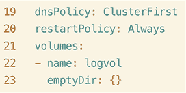

图 7.13 Pod YAML 规范的结尾，其中卷设置为类型 `emptyDir`

就像我们在 7.1 节中使用的 Deployment YAML 一样，我们还会将 `volumeMounts` 添加到容器中，其名称必须与我们在图 7.13 中添加的卷名称相同。在 Pod YAML 中 `resources` 下方插入 `volumeMounts:`，然后在其下方添加 `- mountPath: /var/log`。最后，与 `mountPath` 平行，输入 `name: logvol`。结果应该类似于以下内容：

```
  1 apiVersion: v1
  2 kind: Pod
  3 metadata:
  4   creationTimestamp: null
  5   labels:
  6     run: log-collector
  7   name: log-collector
  8 spec:
  9   containers:
 10   - command:
 11     - sleep
 12     - "3600"
 13     image: busybox
 14     name: log-collector
 15     resources: {}
 16     volumeMounts:
 17     - mountPath: /var/log
 18       name: logvol
 19   dnsPolicy: ClusterFirst
 20   restartPolicy: Always
 21   volumes:
 22   - name: logvol
 23     emptyDir: {}
```

如你所见，这与我们在 7.1 节中挂载卷到 Deployment 的方式非常相似，除了我们更改了卷类型、名称和挂载路径。让我们使用命令 `k create -f log-collector.yaml` 创建 Pod。命令 `k get po` 的输出应该看起来像这样：

```
root@kind-control-plane:/# k get po
NAME                            READY   STATUS    RESTARTS   AGE
backend0113-7dbcbc574f-s45mx    1/1     Running   0          67m
frontend0113-6d6c77b9b6-h9hrj   1/1     Running   0          107m
log-collector                   1/1     Running   0          11m
```

此外，如果你运行命令 `k describe po log-collector`，你应该在 `Volumes:` 部分看到卷实际上是以 `EmptyDir` 类型挂载的。以下是输出结果的缩写，你应该也能看到：

```
Volumes:
  logvol:
    Type:       EmptyDir (a temporary directory that shares a pod's 
➥ lifetime)
    Medium:
    SizeLimit:  <unset>
```

你已成功创建了一个挂载类型为 `EmptyDir` 的卷的 Pod，并完成了任务。在使用此卷时，你应该了解数据不会在 Pod 生命周期结束后持续存在。如果 Pod 被终止，则数据也会被删除。

检验练习

创建一个名为 `two-web` 的 Pod，包含两个容器。第一个容器将命名为 `httpd`，并使用镜像 `httpd:alpine3.17`。第二个容器将命名为 `nginx`，并使用镜像 `nginx:1.23.3-alpine`。

两个容器都应该访问从容器本身本地存储共享的相同卷。

`Container1` 将卷挂载到 `/var/www/html/`，而 `Container2` 将卷挂载到 `/usr/share/nginx/html/`。

启动 Pod 并确保一切挂载和共享都正确。

## 摘要

+   要使数据在 Pod 生命周期结束后仍然持续存在，我们使用 PV。对于考试，如果你被要求在删除 Pod 后保留数据，请确保创建一个 PV。

+   Kubernetes 中有一个名为持久卷声明（PVC）的资源，用于为 Pod 预留或声明卷，它选择与请求容量最接近的卷大小。对于考试，你需要知道如何在 Deployment 或 Pod 中挂载卷。

+   在创建 PV 时，可以选择两种卷模式——`FileSystem`（文件系统）和 `Block`（块）。如果在 YAML 中未指定，则默认选择 `FileSystem` 模式。对于考试，寻找卷应该是目录的提示；在这种情况下，你会使用 `FileSystem` 卷类型。如果提到原始文件系统，你会使用 `Block` 卷模式。

+   对于 PV（持久卷）来说，有三种回收策略可供选择——`Retain`（保留）、`Recycle`（回收）和 `Delete`（删除）。回收策略告诉 PV 在从 Pod 卸载后应该做什么。对于这类考试问题，要注意像 *retain* 或 *delete* 这样的词。

+   有四种不同的访问模式：`ReadWriteOnce`、`ReadOnlyMany`、`ReadWriteMany`和`ReadWriteOncePod`。访问模式决定了节点是否可以访问 PV，一次可以有多少节点访问 PV，以及它们是否有读和/或写权限。对于考试，检查是否需要多个节点访问卷；这将成为选择哪种访问模式的关键指标。

+   存储类是在 Kubernetes 中动态配置存储的一种方式。您不必创建 PV 即可使用存储类。当考试中的问题要求使用现有的存储类时，您只需创建一个 PVC 并选择要使用的存储类；卷将自动创建。
