# 8 Kubernetes 故障排除

本章涵盖

+   监控和查看日志

+   确定高 CPU 或 RAM 使用情况

+   解决常见的集群问题

+   分析网络流量以识别通信问题

由于这是 CKA 考试中最大的主题（30%），我们将在本章中详细讲解故障排除。故障排除意味着修复应用程序、控制平面组件、工作节点和底层网络中的问题。在 Kubernetes 中运行应用程序时，可能会出现诸如 Pod、服务和工作部署等问题。

故障排除领域

本章涵盖了 CKA 课程中的故障排除领域，该领域占考试题目的 30%。这个领域包括我们用来发现和修复 Kubernetes 集群内部问题的技术，包括查看日志、捕获集群事件、网络问题和应用程序监控。它包括以下能力。

| 能力 | 章节部分 |
| --- | --- |
| 评估集群和节点日志。 | 8.1, 8.2 |
| 理解如何监控应用程序。 | 8.1 |
| 管理容器 stdout 和 stderr 日志。 | 8.1 |
| 故障排除应用程序故障。 | 8.1, 8.3 |
| 故障排除集群组件故障。 | 8.2 |
| 故障排除网络问题。 | 8.3 |

本章将帮助你理解容器在调试和将应用程序恢复到健康状态的过程中可能输出的日志。如果问题不是应用程序，可能是底层节点、底层操作系统或网络上的通信问题。在考试中，你将需要了解应用程序故障、集群级别问题和网络问题之间的区别，以及如何在最短的时间内进行故障排除和确定解决方案。

注意：本章中的练习涉及你必须采取的操作来“破坏”集群以提供故障排除的内容。对于考试，集群或集群对象已经损坏，因此你不需要太担心作为考试先决条件的初始操作。

## 8.1 理解应用程序日志

Kubernetes 管理员发现集群中问题发生原因的一种方式是通过查看日志。应用程序日志可以帮助你获取关于在 Pod 中运行的容器化应用程序内部发生情况的更详细的信息。容器引擎（例如，containerd）被设计为支持日志记录，通常将所有输出写入标准输出（stdout）和标准错误（stderr）流，并将这些流写入位于`/var/log/containers`目录中的文件（图 8.1）。

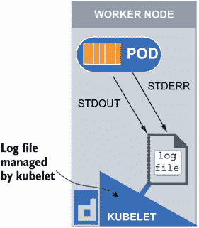

图 8.1 stdout 和 stderr 容器日志被发送到由 kubelet 管理的日志文件，位于`/var/log/containers`。

CKA 考试将测试你在 Pod 内部排查错误的能力。由于 Pod 错误和容器错误是同义的，从 Kubernetes 中的任何应用程序检索日志被简化了。该领域的一个考试问题示例如下。

| 考试任务 在集群`ik8s`中，在名为`db08328`的命名空间中，使用`kubectl`命令行（强制）创建一个名为`mysql`的部署，其镜像为`mysql:8`。列出`db08328`命名空间中的 Pods 以查看 Pod 是否正在运行。如果 Pod 没有运行，查看日志以确定 Pod 为何不在健康状态。一旦收集到必要的日志信息，对 Pod 进行更改以修复它并使其恢复到运行和健康状态。 |
| --- |

如果你还没有访问现有的 Kubernetes 集群，你可以按照附录 A 中所述使用 kind 创建一个 Kubernetes 集群。你只需要一个单节点集群，所以遵循 A.1.1 节中的说明。一旦你通过命令`docker exec -it kind-control-plane bash`获得了控制平面节点的 shell，设置你的`kubectl`别名以及 Tab 补全功能，这将有助于你在考试中纠正错误并习惯使用 Tab 补全。你可以在附录 B 的末尾找到执行这些操作的说明，但这里再次列出要运行的命令（按顺序）：

```
apt update && apt install -y bash-completion
echo 'source <(kubectl completion bash)' >> ~/.bashrc
echo 'source /usr/share/bash-completion/bash_completion' >> ~/.bashrc
echo 'alias k=kubectl' >> ~/.bashrc
echo 'complete -o default -F __start_kubectl k' >> ~/.bashrc
source ~/.bashrc
```

在考试当天，这些配置已经完成，所以无需担心需要记住这些命令。当你开始考试时，你将能够立即使用`k`别名和 Tab 补全功能。

在运行这些命令之后，根据说明使用命令`k create ns db08328`创建命名空间。你可以使用命令`k get ns`继续列出所有命名空间。输出将类似于以下内容：

```
root@kind-control-plane:/# k create ns db08328
namespace/db08328 created
root@kind-control-plane:/# k get ns
NAME                 STATUS   AGE
db08328              Active   4s
default              Active   11m
kube-node-lease      Active   11m
kube-public          Active   11m
kube-system          Active   11m
local-path-storage   Active   11m
```

现在你已经设置了正确的命名空间，你可以使用命令`k config set-context --current --namespace db08328`将上下文更改为`db08328`命名空间，这样你就不必在每次命令中输入命名空间。你可以使用命令更改上下文。输出将如下所示：

```
root@kind-control-plane:/# k config set-context --current --namespace 
➥ db08328
Context "kubernetes-admin@kind" modified.
```

现在你已经将上下文设置为你将创建部署的命名空间，使用命令`k create deploy mysql --image mysql:8`创建名为`mysql`的部署。之后，你可以使用命令`k get po`列出 Pods。

考试技巧：请注意，你不必每次都使用`-n`选项来指定你的命名空间。我要提醒你，在考试中这可能会变得令人困惑，因为随着每个任务的进行，你也在设置上下文。所以请记住，你将执行此命令两次；因此，在某些情况下，每次都输入命名空间可能更容易，具体取决于每个任务中你需要处理的命名空间数量。

部署创建和 Pod 列表的输出应如下所示：

```
root@kind-control-plane:/# k create deploy mysql --image mysql:8
deployment.apps/mysql created
root@kind-control-plane:/# k get po -w
NAME                     READY   STATUS             RESTARTS      AGE
mysql-68f7776797-w92l6   0/1     CrashLoopBackOff   1 (10s ago)   7m28s
```

在这种情况下，Pod 的状态处于 `CrashLoopBackOff`。Pod 可以有多个状态，包括 `OOMKilled`、`ErrImagePull`、`ImagePullBackoff`、`FailedScheduling`、`NonZeroExitCode` 和 `CreateContainerConfigError`。你可以在表 8.1 中查看失败的状态。

表 8.1 持久卷或持久卷声明的 YAML 中使用的访问模式和它们的简称

| 状态 | 含义 |
| --- | --- |
| `CrashLoopBackOff` | Pod 正在尝试启动，崩溃，然后循环重启。Kubernetes 将在重启之间等待递增的回退时间，以给你机会修复错误。 |
| `ImagePullBackOff` | Pod 无法启动，因为它无法在本地或远程容器注册库中找到指定的镜像。它将继续尝试，并使用递增的回退延迟。 |
| `ErrImagePull` | Pod 由于授权问题无法找到或拉取镜像而无法启动。 |
| `CreateContainerConfigError` | Pod 内的容器由于缺少运行所需的组件而无法启动。 |
| `RunContainerError` | Pod 内的容器由于容器运行时或容器入口点的问题而无法运行。 |
| `FailedScheduling` | Pod 无法调度到节点，可能是因为节点被标记为不可调度，应用了污点，或者节点无法满足要求。 |
| `NonZeroExitCode` | Pod 内的容器由于应用程序错误或缺少文件或目录而意外退出。 |
| `OOMKilled` | Pod 已被调度，但分配给它的内存限制已被超出。 |

A `CrashLoopBackoff` 表示 Pod 正在持续启动、崩溃、重启，然后再次崩溃，因此称为 *崩溃循环*。我们可以通过使用命令 `k logs mysql-68f7776797-w92l6` 来查看容器日志来了解为什么会发生这种情况。在这里，Tab 完成功能很有用，因为你可以开始输入 `mysql`，然后快速按下键盘上的 Tab 键，它将为你完成剩余的部分。Tab 完成功能将在考试中启用，但如果你想在你的集群中设置此功能，请参阅附录 B。命令 `k logs mysql-68f7776797-w92l6` 的输出将如下所示：

```
root@kind-control-plane:/# k logs mysql-68f7776797-w92l6
2022-12-04 16:51:13+00:00 [Note] [Entrypoint]: Entrypoint script for MySQL 
➥ Server 8.0.31-1.el8 started.
2022-12-04 16:51:13+00:00 [Note] [Entrypoint]: Switching to dedicated user 
➥ 'mysql'
2022-12-04 16:51:13+00:00 [Note] [Entrypoint]: Entrypoint script for MySQL 
➥ Server 8.0.31-1.el8 started.
2022-12-04 16:51:13+00:00 [ERROR] [Entrypoint]: Database is uninitialized 
➥ and password option is not specified
    You need to specify one of the following as an environment variable:
    - MYSQL_ROOT_PASSWORD
    - MYSQL_ALLOW_EMPTY_PASSWORD
    - MYSQL_RANDOM_ROOT_PASSWORD
```

这告诉我们我们想要知道的确切信息，即数据库密码需要在容器内部设置为一个环境变量。输出甚至给出了您可以选择的环境变量名称。如果您还记得第七章，我们创建了一个 `mysql` 部署，其中我们将密码设置为环境变量；让我们回顾一下并利用那些相同的技巧来解决我们这里的问题。回顾图 7.12，我们可以看到环境变量是与容器镜像的名称一起设置的；让我们使用命令 `k edit deploy mysql` 将此应用于我们当前正在运行的部署。首先，如果您从一个全新的集群开始，您需要运行命令 `apt update; apt install vim` 来使用 Vim 文本编辑器编辑部署。一旦部署打开，您可以在 YAML 中进行以下添加，如图 8.2 所示。

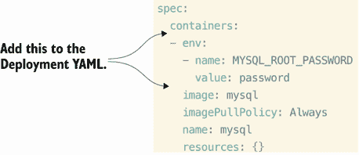

图 8.2 通过添加数据库密码的环境变量来编辑 `mysql` 部署。

一旦完成这些操作，通过按键盘上的 `:wq` 保存并退出编辑 `mysql` 部署。这将带您回到命令提示符，在那里您可以执行 `k get po` 命令来查看 Pod 是否现在处于运行状态。输出应该看起来像这样：

```
root@kind-control-plane:/# k get po
NAME                     READY   STATUS    RESTARTS   AGE
mysql-5dcb7797f7-6spvc   1/1     Running   0          12m
```

果然，Pod 现在的状态是 `Running`，这正是我们需要让 Pod 回到运行、健康状态并完成考试任务的情况。

### 8.1.1 容器日志详情

`k logs` 命令是一个方便的实用工具，用于查看 Pod 内容器的 stdout 和 stderr。如果一个 Pod 内部有两个容器，您必须添加一个 `-c` 并指定您想要访问的容器。例如，运行命令 `k run busybox -image busybox -command ['while true; do echo "$(date)": "I am a busybox container"; sleep 5; done'] -dry-run=client -o yaml > pod.yaml` 以生成 Pod 的 YAML。使用命令 `vim pod.yaml` 打开 `pod.yaml` 文件。我们将对 YAML 进行一些小的修改，首先将命令全部放在一行上，将单引号移动到方括号内，然后在 `while` 单词之前添加以下内容：`'sh', '-c',`。最终结果应该类似于图 8.3 中的 YAML 文件。

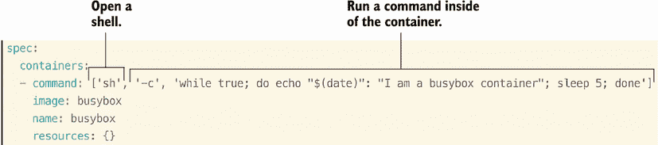

图 8.3 在 Kubernetes 中在容器内运行命令的 YAML 指定。

现在您已经创建了 YAML，与图 8.3 中的 YAML 行匹配，只需进行一个更改。复制以 `command`、`image` 和 `name` 开头的三行，并将它们粘贴到现有三行下方，以指定第二个容器。

考试技巧：在 Vim 中能够复制粘贴可以在考试中节省你时间！通过按键盘上的 Shift + V 选择行，然后使用上下箭头选择。一旦你选择了所有行，按 Y 键复制，按 P 键粘贴。这可能需要一些练习，但为了在 CKA 考试中节省时间，这是值得的！

现在你已经粘贴了这些行，将第二个容器的名称从 `busybox` 更改为 `sidecar`。同时，将句子 `I am a busybox container` 更改为 `I am a sidecar container`。其余部分保持不变。结果应该类似于图 8.4 中的 YAML，它创建了两个具有不同名称和不同命令的不同容器。

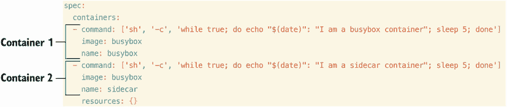

图 8.4 在 Pod YAML 清单中添加第二个容器

现在 YAML 已经完成，使用命令 `k apply -f pod.yaml` 创建 Pod。如果你没有跟上或者创建 Pod 有困难，运行命令 `k apply -f https://raw.githubusercontent.com/chadmcrowell/ acing-the-cka-exam/main/ch_08/multi-container-pod-for-logging.yaml`。要查看集群中默认命名空间内的 Pods，运行命令 `k get po`。输出应该类似于这样：

```
root@kind-control-plane:/# k get po
NAME                     READY   STATUS    RESTARTS      AGE
busybox                  2/2     Running   0             1m
mysql-5dcb7797f7-6spvc   1/1     Running   2 (22h ago)   45h
```

要查看 Pod `busybox` 中名为 `busybox` 的第一个容器的日志，你可以运行命令 `k logs busybox`，或者为了更明确，你可以指定容器名称为 `k logs busybox -c busybox`。输出应该看起来像这样：

```
root@kind-control-plane:/# k logs busybox -c busybox
Tue Dec  6 14:36:26 UTC 2022: I am a busybox container
Tue Dec  6 14:36:31 UTC 2022: I am a busybox container
Tue Dec  6 14:36:36 UTC 2022: I am a busybox container
Tue Dec  6 14:36:41 UTC 2022: I am a busybox container
```

要查看同一 Pod 中名为 `sidecar` 的第二个容器的日志，运行命令 `k logs busybox -c sidecar`。输出应该看起来像这样：

```
root@kind-control-plane:/# k logs busybox -c sidecar
Tue Dec  6 14:18:59 UTC 2022: I am a sidecar container
Tue Dec  6 14:19:04 UTC 2022: I am a sidecar container
Tue Dec  6 14:19:09 UTC 2022: I am a sidecar container
```

要同时查看两个容器的日志，你可以输入 `k logs busybox -all-containers`。输出应该类似于这样：

```
root@kind-control-plane:/# k logs busybox -all-containers
Wed Dec  7 01:06:56 UTC 2022: I am a busybox container
Wed Dec  7 01:07:01 UTC 2022: I am a busybox container
Wed Dec  7 01:07:06 UTC 2022: I am a busybox container
Wed Dec  7 01:07:11 UTC 2022: I am a busybox container
Wed Dec  7 01:07:16 UTC 2022: I am a busybox container
Wed Dec  7 01:07:21 UTC 2022: I am a busybox container
Wed Dec  7 01:06:56 UTC 2022: I am a sidecar container
Wed Dec  7 01:07:01 UTC 2022: I am a sidecar container
Wed Dec  7 01:07:06 UTC 2022: I am a sidecar container
Wed Dec  7 01:07:11 UTC 2022: I am a sidecar container
Wed Dec  7 01:07:16 UTC 2022: I am a sidecar container
Wed Dec  7 01:07:21 UTC 2022: I am a sidecar container
```

如果你想要继续查看日志（流式日志），你可以运行命令 `k logs nginx -all-containers -f`。要返回提示符，请按键盘上的 Control-C。

考试技巧：帮助菜单在考试中真的能帮到你。与其试图记住命令，不如使用 `kubectl` 帮助菜单（例如，`k logs -help`）。最好的是，帮助菜单包含示例命令，你可以直接复制粘贴！

当你运行 `k logs` 命令时，你将得到与在日志目录中看到相同的输出。要查看日志目录，请查看节点上的 `/var/log/containers` 目录（Pod 运行的地方）。例如，你可以查看我们的控制平面节点上的 `var/log/containers` 目录并查看其内容。你将看到类似于图 8.5 的输出。

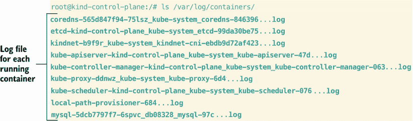

图 8.5 `/var/log/containers` 目录中每个运行容器对应的日志文件的简略输出

你会注意到每个日志文件的名字都是以 Pod 名称开头，后面跟着一串唯一字符（例如，`mysql-5dcb7797...`）。你可以查看这个文件的 内容以获取类似于 `k logs` 命令的输出。要查看日志文件的内容，输入命令 `cat /var/log/containers/mysql-5dcb7797f7-6spvc_db08328_mysql-f9f53dc7de949452d848211d5d74aab36c2f5ae24a9d8b0b45577890d8b26ea2.log`（你可以按 Tab 键完成文件名，这样你就不必全部输入）`.` 输出将类似于图 8.6。

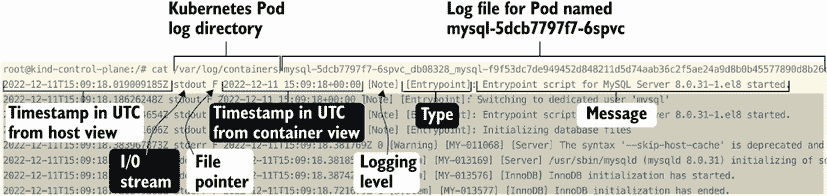

图 8.6 查看与特定 Pod 关联的日志文件

如果 `k logs` 命令没有返回任何日志输出怎么办？让我们看看图 8.7 中的决策树，以帮助我们通过故障排除决策过程。

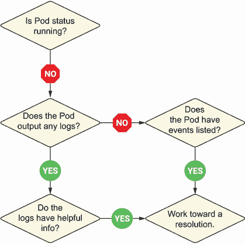

图 8.7 故障排除 Pod 错误的决策过程

这可能是因为容器一开始就没有启动。在这种情况下，你的故障排除过程中的下一步应该是运行 `k describe` 命令来查看容器的日志。例如，运行命令 `k run brick --image busybox --command 'while true; do echo "$(date)"; sleep 5; done'`。这将返回一个错误。运行命令 `k get po` 来列出 Pods。你应该看到以下输出：

```
root@kind-control-plane:/# k get po
NAME                     READY   STATUS              RESTARTS      AGE
brick                    0/1     RunContainerError   1 (0s ago)    2s
busybox                  2/2     Running             0             7m57s
mysql-5dcb7797f7-6spvc   1/1     Running             2 (33h ago)   2d8h
```

当你运行 `k logs brick` 命令时，你没有收到任何输出，因为容器还没有启动，所以它还没有机会生成任何日志。如果你运行 `k describe po brick` 命令，你会看到这个容器没有启动的原因。输出应该类似于以下内容（为了上下文而省略）：

```
root@kind-control-plane:/# k describe po brick
Name:             brick
Namespace:        db08328
    Command:
      while true; do echo "$(date)"; sleep 5; done
    State:          Waiting
      Reason:       RunContainerError
    Last State:     Terminated
      Reason:       StartError
      Message:      failed to create containerd task: failed to create shim 
➥ task: OCI runtime create failed: runc create failed: unable to start 
➥ container process: exec: "while true; do echo \"$(date)\"; sleep 5; 
➥ done": executable file not found in $PATH: unknown
      Exit Code:    128
      Started:      Thu, 01 Jan 1970 00:00:00 +0000
      Finished:     Wed, 07 Dec 2022 01:15:04 +0000
    Ready:          False
    Restart Count:  2
Events:
  Type     Reason     Age               From               Message
  ----     ------     ----              ----               -------
  Normal   Scheduled  19s               default-scheduler  Successfully 
➥ assigned db08328/brick to kind-control-plane
  Normal   Pulled     18s               kubelet            Successfully 
➥ pulled image "busybox" in 494.040497ms
  Normal   Pulled     17s               kubelet            Successfully 
➥ pulled image "busybox" in 494.479219ms
  Normal   Pulling    5s (x3 over 19s)  kubelet            Pulling image 
➥ "busybox"
  Normal   Created    4s (x3 over 18s)  kubelet            Created 
➥ container brick
  Warning  Failed     4s (x3 over 18s)  kubelet            Error: failed to 
➥ create containerd task: failed to create shim task: OCI runtime create 
➥ failed: runc create failed: unable to start container process: exec: 
➥ "while true; do echo \"$(date)\"; sleep 5; done": executable file not 
➥ found in $PATH: unknown
  Normal   Pulled     4s                kubelet            Successfully 
➥ pulled image "busybox" in 509.215883ms
  Warning  BackOff    3s (x3 over 17s)  kubelet            Back-off 
➥ restarting failed container
```

如你从 `k describe po brick` 命令的输出中看到，容器未能启动，因为它无法启动内部进程，这在 `k describe` 命令的输出中的消息和事件中都有显示。

### 8.1.2 从容器内部进行故障排除

因为容器内部的网络命名空间与节点上的不同，你可能需要从容器内部本身进行故障排除。这在故障排除场景中很常见，因为你可能无法打开一个到处于错误状态的容器的 shell（如前所述）。运行命令 `k run tool --image lansible/dnstools:latest -it -sh` 来创建一个名为 `tool` 的新 Pod，并同时在那个 Pod 内部获取到容器的 shell。此时，你会看到你的提示符发生变化。结果将类似于以下内容：

```
root@kind-control-plane:/# k run tool --image lansible/dnstools:latest -it 
➥ --sh
If you don't see a command prompt, try pressing enter.
/ #
```

现在，你可以在容器内部的网络命名空间中输入各种命令来进行故障排除。你可以运行命令 `nslookup Kubernetes` 来获取 Kubernetes 服务的 DNS 服务器。输出将类似于以下内容：

```
/ # nslookup kubernetes
Server:        10.96.0.10
Address:    10.96.0.10#53

** server can't find kubernetes: NXDOMAIN
```

一旦你退出容器，你会注意到容器仍在运行。

考试技巧：对于考试，如果你需要排除与 Pod 的通信问题，请使用 `busybox` 镜像并在创建时获取一个 shell。这将使容器在没有插入冗长命令的情况下继续运行。例如，运行命令 `k run busybox --image busybox -it --sh`。

因为容器仍在运行，你可以使用命令 `k exec -it tool --sh` 来重新进入容器内的 shell。输出将类似于以下内容：

```
/ # exit
Session ended, resume using 'kubectl attach tool -c tool -i -t' command 
➥ when the pod is running
root@kind-control-plane:/# k exec -it tool --sh
/ #
```

现在你再次有了 shell，运行命令 `curl -k http://10.96.0.1:443` 向 Kubernetes 服务发送请求。输出将类似于以下内容：

```
/ # curl -k http://10.96.0.1:443
Client sent an HTTP request to an HTTPS server.
/ #
```

再次退出，现在你可以使用命令 `k exec tool --cat /etc/resolv.conf` 在容器内运行命令而不需要获取 shell。输出应该类似于以下内容：

```
/ # exit
root@kind-control-plane:/# k exec tool --cat /etc/resolv.conf
search kb6656.svc.cluster.local svc.cluster.local cluster.local
nameserver 10.96.0.10
options ndots:5
```

最后，你还可以使用命令 `k run curlpod --image=nicolaka/netshoot --rm -it --sh` 在删除 Pod 的同时进入 Pod 内的容器。这将给出与之前相同的结果，但一旦你退出，由于使用了 `kubectl run` 中的 `--rm` 选项，Pod 将被删除。输出将类似于以下内容：

```
root@kind-control-plane:/# k run curlpod --image=nicolaka/netshoot --rm -it 
➥ --sh
If you don't see a command prompt, try pressing enter.
~ # exit
Session ended, resume using 'kubectl attach curlpod -c curlpod -i -t' 
➥ command when the pod is running
pod "curlpod" deleted 
```

练习题

运行命令 `k run testbox --image busybox --command 'sleep 3600'` 来创建一个名为 `testbox` 的新 Pod。检查容器是否正在运行。通过决策树找出原因，并修复 Pod 使其运行。

创建一个名为 `busybox2` 的新容器，使用镜像 `busybox:1.35.0`。检查容器是否处于运行状态。找出容器失败的原因，并对 Pod 的 YAML 文件进行修正以使其运行。

创建一个名为 `curlpod2` 的新容器，使用镜像 `nicolaka/netshoot`，并在创建时打开一个 shell。当 shell 打开到容器时，运行 `nslookup` 命令来检查 Kubernetes 服务。退出 shell 并查看为什么容器没有运行。修复容器使其继续运行。

## 8.2 集群组件故障

当你运行 `k describe` 命令时，并不总是会发现问题是容器本身；它也可能是控制平面组件的问题，这些组件控制着 Kubernetes 集群中的 Pod。我们在第二章中回顾了控制平面组件，以帮助你理解每个组件的功能，这在故障排除时很有帮助。例如，如果一个 Pod 处于挂起状态并且没有被分配到节点，你知道要调查调度器，因为这个组件负责将 Pod 调度到节点。或者如果 Deployment 没有正确扩展，你知道要查看控制器管理器，因为控制器管理器负责将期望状态与当前状态匹配。

我们知道，控制平面组件，如调度器、控制器管理器、etcd 和 API 服务器，都在 `kube-system` 命名空间中的控制平面节点上作为 Pods 运行。因此，调查这些 Pods 的过程与本章第一部分非常相似，包括运行 `k logs` 和 `k describe` 命令以查找容器日志和事件。我们还知道，这些控制平面组件的 YAML 清单位于 `/etc/Kubernetes/manifests` 目录中，任何有效的 YAML 文件都会自动在此运行。我们称这为 *静态 Pod*，因为调度器不知道这些 Pods，因此无法相应地调度它们。以下是一个考试示例问题。

| 考试任务 在集群 `ik8s` 中，在名为 `ee8881` 的命名空间中，使用 kubectl 命令行（命令式）创建一个名为 `prod-app` 的 Deployment，使用镜像 `nginx`。列出 `ee8881` 命名空间中的 Pods，以查看 Pod 是否正在运行。运行命令 `curl https://raw.githubusercontent.com/chadmcrowell/acing-the-cka-exam/main/ch_08/kube-scheduler.yaml --silent --output /etc/kubernetes/manifests/kube-scheduler.yaml` 以对 kube-scheduler 进行更改，模拟集群组件故障。现在将 Deployment 从一个副本扩展到三个。再次列出 Pods，并查看 Deployment 中的额外两个 Pods 是否正在运行。找出为什么这两个额外的 Pods 没有运行，并修复调度器，使容器再次处于运行状态。 |
| --- |

你可以继续使用我们之前用于考试任务的相同单节点集群。无需创建新的 kind Kubernetes 集群。

首先，使用命令 `k create ns ee8881` 创建 `ee8881` 命名空间。然后，使用命令 `k config set-context --current --namespace ee8881` 将上下文更改为这个新命名空间，以避免多次输入命名空间。输出应类似于以下内容：

```
root@kind-control-plane:/# k create ns ee8881
namespace/ee8881 created
root@kind-control-plane:/# k config set-context --current --namespace 
➥ ee8881
Context "kubernetes-admin@kind" modified.
```

现在，你的上下文位于 `ee8881` 命名空间，你可以使用命令 `k create deploy prod-app --image nginx` 创建名为 `prod-app` 的 Deployment。紧接着，你可以运行 `k get deploy,po` 以查看正在运行的 Deployment 和其内的 Pods。输出应类似于以下内容：

```
root@kind-control-plane:/# k create deploy prod-app --image nginx
deployment.apps/prod-app created
root@kind-control-plane:/# k get deploy,po
NAME                       READY   UP-TO-DATE   AVAILABLE   AGE
deployment.apps/prod-app   1/1     1            1           9s

NAME                            READY   STATUS    RESTARTS   AGE
pod/prod-app-85c9dd4f9d-l7fmj   1/1     Running   0          9s
```

现在 Deployment 已创建，并且 Deployment 内的 Pod 处于运行状态，运行命令 `curl https://raw.githubusercontent.com/chadmcrowell/acing-the-cka-exam/main/ch_08/kube-scheduler.yaml --silent --output /etc/kubernetes/manifests/kube-scheduler.yaml` 以模拟控制平面故障。紧接着，使用命令 `k scale deploy prod-app -replicas 3` 将 Deployment 从一个副本扩展到三个。使用 `k get po` 命令查看 Deployment 内的 Pods，你会看到 Pods 处于挂起状态。输出应类似于以下内容：

```
root@kind-control-plane:/# curl 
➥ https://raw.githubusercontent.com/chadmcrowell/acing-the-cka-
➥ exam/main/ch_08/kube-scheduler.yaml --silent --output 
➥ /etc/kubernetes/manifests/kube-scheduler.yaml
root@kind-control-plane:/# k scale deploy prod-app --replicas 3
deployment.apps/prod-app scaled
root@kind-control-plane:/# k get po
NAME                        READY   STATUS    RESTARTS   AGE
prod-app-85c9dd4f9d-9clfl   0/1     Pending   0          7s
prod-app-85c9dd4f9d-l7fmj   1/1     Running   0          4m21s
prod-app-85c9dd4f9d-mbdk7   0/1     Pending   0          7s
```

在这种情况下，如果您运行 `k logs prod prod-app-85c9dd4f9d-9clfl,` 您将不会得到任何输出，因为容器从未能够启动并生成日志。但是，如果您运行命令 `k -n kube-system logs kube-scheduler-kind-control-plane`，您将收到有关容器为何无法启动的有用信息。如前所述，了解调度器在 Kubernetes 中的工作原理有助于您在故障排除时找到最快的解决方案路径。运行命令 `k -n kube-system logs kube-scheduler-kind-control-plane | tail -2` 将显示日志的最后两行，这对于我们了解错误已经足够。输出应该看起来像这样：

```
root@kind-control-plane:/# k -n kube-system logs kube-scheduler-kind-
➥ control-plane | tail -2

Error: unknown flag: --kkubeconfig
```

这是解决问题的线索。如果您使用命令 `vim /etc/kubernetes/manifests/kube-scheduler.yaml` 在 `/etc/kubernetes/manifests/` 目录下查看调度器清单，您将看到——在文件顶部，在容器的命令部分——调度器失败的原因（图 8.8）。

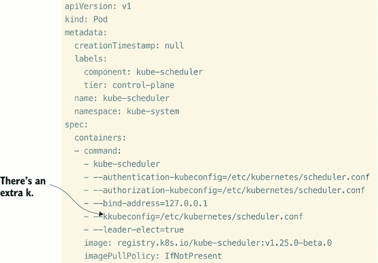

图 8.8 在调度器容器内部运行的命令在传递 kubeconfig 时包含了一个额外的 `k`。

为了解决这个问题，我们可以简单地通过进入插入模式（按键盘上的 I 键）并删除额外的 `k` 来编辑文件。一旦我们修复了这个问题，我们可以通过首先按键盘上的 Esc 键，然后输入 `:wq` 来退出 Vim，这将带您回到可以看到调度器 Pod 自动修复自己的提示符。您可以使用命令 `k get po -A`（或 `k -n kube-system get po`）来查看这一点。输出应该看起来像这样：

```
root@kind-control-plane:/# k get po -A
NAMESPACE            NAME                                         READY   
➥ STATUS              RESTARTS         AGE
db08328              brick                                        0/1     
➥ CrashLoopBackOff    21 (2m49s ago)   85m
db08328              busybox                                      2/2     
➥ Running             0                93m
db08328              mysql-5dcb7797f7-6spvc                       1/1     
➥ Running             2 (34h ago)      2d9h
db08328              nginx-76d6c9b8c-k22xs                        1/1     
➥ Running             0                48m
db08328              nginx-76d6c9b8c-vzkmw                        1/1     
➥ Running             0                46m
db08328              nginx-76d6c9b8c-w24w4                        1/1     
➥ Running             0                46m
ee8881               prod-app-85c9dd4f9d-9clfl                    0/1     
➥ ContainerCreating   0                20m
ee8881               prod-app-85c9dd4f9d-l7fmj                    1/1     
➥ Running             0                24m
ee8881               prod-app-85c9dd4f9d-mbdk7                    0/1     
➥ ContainerCreating   0                20m
kube-system          coredns-565d847f94-75lsz                     1/1     
➥ Running             2 (34h ago)      2d10h
kube-system          coredns-565d847f94-8stkp                     1/1     
➥ Running             2 (34h ago)      2d10h
kube-system          etcd-kind-control-plane                      1/1     
➥ Running             3 (34h ago)      2d10h
kube-system          kindnet-b9f9r                                1/1     
➥ Running             2 (34h ago)      2d10h
kube-system          kube-apiserver-kind-control-plane            1/1     
➥ Running             3 (34h ago)      2d10h
kube-system          kube-controller-manager-kind-control-plane   1/1     
➥ Running             3 (34h ago)      2d10h
kube-system          kube-proxy-z4qvh                             1/1     
➥ Running             2 (34h ago)      2d10h
kube-system          kube-scheduler-kind-control-plane            0/1     
➥ ContainerCreating   0                2s
local-path-storage   local-path-provisioner-684f458cdd-vkbln      1/1     
➥ Running             3 (34h ago)      2d10h
```

通过运行 `k get po -A` 命令，您会注意到 `prod-app` 部署的 Pod 同时启动，这表明我们之前遇到的扩展问题已经解决，`prod-app` 部署中的所有三个副本现在都处于运行状态。这满足了我们的考试任务要求。

### 8.2.1 故障排除集群事件

现在我们已经审查了控制平面组件和其他应用程序的各个 Pod 日志，我们应该考虑 Kubernetes 中一个为 Kubernetes 资源状态的所有更改生成事件的对象。当一个 Pod 从挂起变为运行，或从运行变为失败时，会触发一个事件。这些事件——解决路径不像我们在上一个考试任务中看到的那样清晰——对于调试很有用。这个对象与常规日志事件不同，可以告诉您关于当前问题根源的有价值信息。使用命令 `k get events -A` 查看这些事件。`-A` 表示所有命名空间，因为在这个对象是 Kubernetes 中的命名空间资源。输出应该看起来像这样：

```
root@kind-control-plane:/# k get events -A
NAMESPACE   LAST SEEN   TYPE      REASON    OBJECT      MESSAGE
db08328     35s         Warning   BackOff   pod/brick   Back-off restarting 
➥ failed container
```

如您所见，关于我们之前正在处理的“砖块”Pod，返回了一些有价值的信息，包括原因和消息。

考试提示：对于考试，`k get events`命令可能会输出太多事件，包括可能对故障排除没有帮助的“正常”消息。使用以下命令来过滤掉正常事件，只显示警告和信息类型的事件：`k get events --field-selector type!=Normal -A`。

请记住，这些事件默认情况下只保留 1 小时，所以它们可能从考试开始到结束会有所不同。您可以在 API 服务器上设置`--event-ttl`选项来更改此设置，但我不建议这样做，除非考试任务明确要求您这样做。

过滤特定类型日志的逆操作是输出整个集群的信息以及集群中所有 Pod 的日志。要获取集群健康状况的详细视图，您可以运行以下命令：`k cluster-info dump`。输出将非常大，因此我已经修改了命令，只包括这里最后 10 行：

```
root@kind-control-plane:/# k cluster-info dump | tail -10
2022/12/07 02:40:28 [notice] 1#1: nginx/1.23.2
2022/12/07 02:40:28 [notice] 1#1: built by gcc 10.2.1 20210110 (Debian 
➥ 10.2.1-6)
2022/12/07 02:40:28 [notice] 1#1: OS: Linux 5.15.49-linuxkit
2022/12/07 02:40:28 [notice] 1#1: getrlimit(RLIMIT_NOFILE): 1048576:1048576
2022/12/07 02:40:28 [notice] 1#1: start worker processes
2022/12/07 02:40:28 [notice] 1#1: start worker process 32
2022/12/07 02:40:28 [notice] 1#1: start worker process 33
2022/12/07 02:40:28 [notice] 1#1: start worker process 34
2022/12/07 02:40:28 [notice] 1#1: start worker process 35
==== END logs for container nginx of pod ee8881/prod-app-85c9dd4f9d-mbdk7 
➥ ====
```

您还可以使用 grep 这个命令来查找单词*error*或*fail*，这在您不知道问题来源时进行故障排除非常有效。例如，运行以下命令以仅获取包含单词*error*的行：`k cluster-info dump | grep error`。再次提醒，我已经修改了我的命令以缩短输出，但命令输出应该看起来像这样：

```
root@kind-control-plane:/# k cluster-info dump | grep error | tail -1
E1207 20:59:46.036248       1 leaderelection.go:330] error retrieving 
➥ resource lock kube-system/kube-controller-manager: Get 
➥ "https://172.18.0.2:6443/apis/coordination.k8s.io/v1/namespaces/kube-
➥ system/leases/kube-controller-manager?timeout=5s": dial tcp 
➥ 172.18.0.2:6443: connect: connection refused
```

### 8.2.2 工作节点故障

有时候，当您在故障排除 Kubernetes 集群的节点时，查看节点状态以查看 kubelet 服务是否正在运行可能会有所帮助。就像检查 Pod 一样，您可以运行以下命令来找到 CPU 和 RAM 的状态，以及输出底部的事件：`k describe no kind-control-plane`。您可能会发现没有可用资源或节点处于失败状态。此外，考试中已经安装了指标服务器，所以在这个部分不要过多关注安装的细节。

指标服务器允许您实时检查 CPU 和内存使用情况，考试的重点将是如何在提供的终端中运行命令来查看这些指标。使用以下命令安装指标服务器：`kubectl apply -f https://github.com/kubernetes-sigs/metrics-server/releases/download/v0.5.0/components.yaml`。如果您在自己的集群中跟随操作，您需要应用一个小补丁，这可以通过以下命令轻松完成：`kubectl patch -n kube-system deployment metrics-server --type=json -p '[{"op":"add", "path":"/spec/template/spec/containers/0/args/-","value":"--kubelet-insecure -tls"}]'`。等待几秒钟（最多 60 秒），您应该会有一个正在工作的指标服务器。使用以下命令进行测试：`k top no`。输出应该看起来像这样：

```
root@kind-control-plane:~# k top no
NAME                 CPU(cores)   CPU%   MEMORY(bytes)   MEMORY%
kind-control-plane   177m         4%     1735Mi          44%
```

如从输出中所示，此节点正在消耗 177m 的 CPU，占总 CPU 的 4%，以及 1820 MB 的内存，占总内存的 44%。这是一种检查你的 Pods 是否无法调度到节点的方法，因为如果它们不能，它们将使用此命令显示接近 100% 的利用率。

在检查可用磁盘空间方面，你可以运行命令 `df -h`，这是一个显示节点上可用磁盘空间的命令，而 `-h` 选项使输出更易于阅读。以下是输出应看起来像这样：

```
root@kind-control-plane:~# df -h
Filesystem      Size  Used Avail Use% Mounted on
overlay          59G   29G   27G  52% /
tmpfs            64M     0   64M   0% /dev
shm              64M     0   64M   0% /dev/shm
/dev/vda1        59G   29G   27G  52% /var
tmpfs           2.0G  139M  1.8G   8% /run
tmpfs           2.0G     0  2.0G   0% /tmp
rootfs          2.0G  333M  1.6G  17% /usr/lib/modules
tmpfs           5.0M     0  5.0M   0% /run/lock
```

你也可以通过简单地运行命令 `k get no` 来显示节点的状态，就像我们在本书中多次做的那样。最后，要在节点上启动 kubelet 服务，请运行命令 `systemctl start kubelet`。你还可以使用 Journalctl 来查看 kubelet 服务的日志。运行命令 `journalctl -u kubelet` 以排除 kubelet 服务的任何问题。输出应类似于图 8.9（为了可读性进行了缩写）。

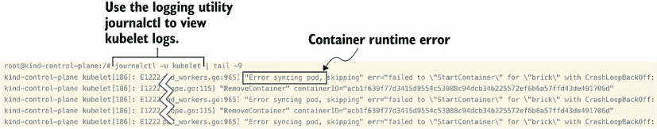

图 8.9 kubelet 日志的 `journalctl` 工具的缩写输出

kubelet 可能存在另一个问题是 kubelet 配置。在第六章中，我们在更改集群 DNS 的同时修改了 kubelet 配置。当 kubelet 启动时，一些证书会传递给 kubelet 以验证 Kubernetes API；集群域名和健康端点也在这里设置。在考试中，如果由于某种原因 kubelet 无法通过 `systemctl start kubelet` 命令启动，请检查 `/var/lib/kubelet/config.yaml` 文件以查找配置错误。

最后，在第二章中我们讨论了 kubelet 的 kubeconfig，它位于 `/etc/kubernetes/` 目录下的名为 `kubelet.conf` 的文件。这有时会导致访问集群的问题。为了正确思考这个故障排除过程，请回顾图 8.10 中所示的决策树。

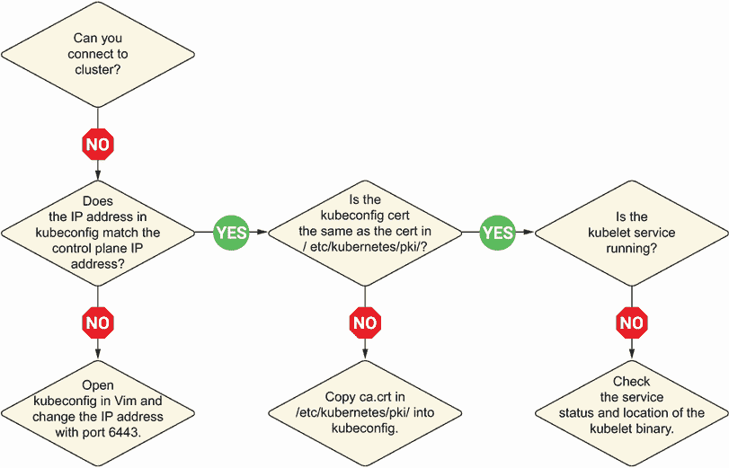

图 8.10 故障排除集群访问的决策过程

有时 kubelet 二进制文件完全缺失或位于不同的目录中。你可以使用命令 `which kubelet` 来查看 kubelet 二进制文件的位置。输出看起来类似于这样：

```
root@kind-control-plane:~# which kubelet
/usr/bin/kubelet
```

如果 `/usr/bin/kubelet` 目录与运行 `systemctl status kubelet` 时列出的不同，则存在问题。检查 `/etc/systemd/system/kubelet.service.d/` 目录中的 `10-kubeadm.conf` 文件，以查看 `ExecStart` 是否设置为 `/usr/bin/kubelet`。当你更改 kubelet 配置时，请记住你必须重新加载守护进程然后启动服务。使用命令 `systemctl daemon-reload``,` 然后使用命令 `systemctl restart kubelet` 来这样做：

```
root@kind-control-plane:~# systemctl daemon-reload
root@kind-control-plane:~# systemctl restart kubelet
```

### 8.2.3 你指定了正确的主机或端口吗？

当你输入任何`kubectl`命令（例如，`kubectl get po`）时，你可能会收到的一条常见信息是：“服务器$SERVER:6443 的连接被拒绝 - 你指定了正确的主机或端口吗？”这条信息发生的原因要么是 API 配置错误，要么是你的 kubeconfig 设置不正确。为了在你的集群中看到这条信息，首先运行命令`curl https://raw.githubusercontent.com/chadmcrowell/acing-the-cka-exam/main/ch_08/kube-apiserver.yaml --silent --output /etc/kubernetes/manifests/kube-scheduler.yaml`来修改 API 服务器配置。然后立即运行命令`k get po`来尝试列出集群中运行的 Pod。你会看到类似于以下内容的输出：

```
root@kind-control-plane:~# curl 
➥ https://raw.githubusercontent.com/chadmcrowell/acing-the-cka-
➥ exam/main/ch_08/kube-apiserver.yaml --silent --output 
➥ /etc/kubernetes/manifests/kube-apiserver.yaml
root@kind-control-plane:~# k get po
The connection to the server kind-control-plane:6443 was refused - did you 
➥ specify the right host or port?
```

如果你查看`/etc/kubernetes/manifests/`目录下的`kube-apiserver.yaml`文件，你会在第 44 行看到问题，那里的`event-ttl`缺少一个`=`符号。

考试提示：记住，你将参加考试的主机与控制平面服务器不同。在寻找`/etc/kubernetes/manifests/`目录之前，你将想要 SSH 到控制平面节点。

当你把那个等号放回去时，输出应该看起来类似于图 8.11。

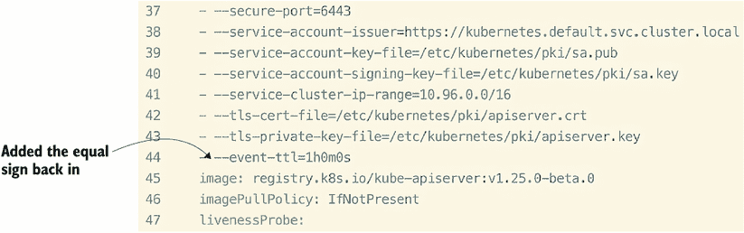

图 8.11 包含正确格式化`event-ttl`的`kube-apiserver.yaml`文件的一部分

当你保存并退出此文件（`:wq`）时，你会发现信息并没有消失。

考试提示：不要慌张！你可能会以无法恢复的方式修改 API 配置。除了在更改之前备份`kube-apiserver.yaml`文件外，你还可以使用`crictl`检查 API 服务器 Pod 的状态。

这是可以的，因为我们可以使用`crictl`工具来重启容器。当不能使用`kubectl`命令而想查看底层 Pod 的状态时，`crictl`工具非常方便。使用命令`crictl ps`来查看容器，你将看到列表中的`kube-apiserver`容器。输出将类似于以下内容（此输出已缩略）并包括不同的容器 ID：

```
root@kind-control-plane:~# crictl ps
CONTAINER           STATE               NAME
d7b925224d332       Running             kindnet-cni
84234147eb024       Running             kube-apiserver
5dd8b3aeaa752       Running             kube-controller-manager
5228bb1f5eb7c       Running             kube-scheduler
903193dd102db       Running             coredns
97268d17eb9fd       Running             kube-proxy
f9f8ea21cb4be       Running             etcd
```

这个输出的第一列是容器 ID。运行命令`crictl stop 842`来停止`kube-apiserver`容器。你可以使用容器 ID 的前三个字符，只要它在`crictl ps`列出的所有其他容器中是唯一的。然后立即运行命令`crictl rm 842`来杀死容器。几秒钟后，你会看到一个新的容器在其位置启动。你可以通过再次运行`crictl ps`来知道它是一个新容器，因为它的容器 ID 与之前不同。一旦你可以从`crictl`中看到状态为`Running`的容器，你就可以运行`kubectl get po`并看到它再次返回 Pod 列表。你将不再看到关于正确主机或端口的提示信息！

### 8.2.4 调试 kubeconfig

当收到“你有正确的主机或端口吗？”的消息时，另一种可能性是检查你的 kubeconfig 文件，看看它是否指定了正确的控制平面节点，证书是否有效，以及 `KUBECONFIG` 环境变量是否设置正确。当你安装 `kubectl` 或在你的 kind 集群中时，在你的主目录中创建了一个名为 `.kube` 的隐藏目录。这个目录包含服务器地址、用于验证集群的证书以及用户信息。你可以像查看其他文件一样查看这个文件，使用命令 `cat ~/.kube/config`，但还有一个用于查看 kubeconfig 的 `kubectl` 命令，即 `k config view`。这个命令的输出将类似于图 8.12。

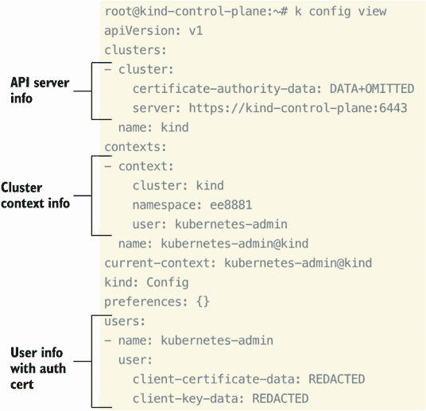

图 8.12 命令 `k config view` 的输出，列出了 API 服务器、上下文和用户信息

**考试技巧** 这两个命令（`cat ~/.kube/config` 和 `k config view`）在考试中的结果可能不同。如果你被要求修复你的集群上下文，可能是因为你无法列出节点，运行命令 `k config view --flatten > ~/.kube/config` 以同步它们。这将合并配置文件并将输出保存到 `~/.kube/config` 目录下的 config 文件中。

在考试中，这个 kubeconfig 文件可能不存在。或者你可能不小心删除或误配置了它。不要慌张！这个文件的一个副本存储在 `/etc/kubernetes/` 目录中，名为 `admin.conf`。你可以使用这个文件以及 `kubectl` 命令，例如，通过运行命令 `k get no --kubeconfig /etc/kubernetes/admin.conf`，或者你可以设置一个名为 `KUBECONFIG` 的特殊环境变量。这个环境变量与 `kubectl` 命令行工具一起使用，并将你的 `kubectl` 命令指向这个变量值中存储的配置文件。运行命令 `KUBECONFIG=/etc/kubernetes/admin.conf` 来设置环境变量（在 Linux 系统中，使用全部大写字母创建变量名是常见的），然后你将能够再次访问你的集群。或者，你可以简单地使用命令 `cp /etc/kubernetes/admin.conf ~/.kube/config` 将文件从 `/etc/Kubernetes/` 目录复制到 `~/.kube/` 目录。这些命令的输出将类似于以下内容：

```
root@kind-control-plane:~# ls .kube/
cache
root@kind-control-plane:~# k get no --kubeconfig /etc/kubernetes/admin.conf
NAME                 STATUS   ROLES           AGE     VERSION
kind-control-plane   Ready    control-plane   5d23h   v1.25.0-beta.0
root@kind-control-plane:~# KUBECONFIG=/etc/kubernetes/admin.conf
root@kind-control-plane:~# k get no
NAME                 STATUS   ROLES           AGE     VERSION
kind-control-plane   Ready    control-plane   5d23h   v1.25.0-beta.0
root@kind-control-plane:~# cp /etc/kubernetes/admin.conf ~/.kube/config
root@kind-control-plane:~# ls ~/.kube
cache  config
```

当你运行 `k config view` 命令，如图 8.7 所示，你将注意到证书数据从输出中被删除。你可以使用命令 `k config view -raw` 来查看证书数据。输出将类似于以下内容：

```
root@kind-control-plane:~# k config view --raw
apiVersion: v1
clusters:
- cluster:
    certificate-authority-data: LS0tLS1CRUdJTiBDRVJUSUZJQ0FURS0tLS0tCk...
    server: https://kind-control-plane:6443
  name: kind
contexts:
- context:
    cluster: kind
    namespace: ee8881
    user: kubernetes-admin
  name: kubernetes-admin@kind
current-context: kubernetes-admin@kind
kind: Config
preferences: {}
users:
- name: kubernetes-admin
  user:
    client-certificate-data: LS0tLS1CRUdJTiBDRVJUSUZJQ0FURS0tLS0tCk1JS...
    client-key-data: LS0tLS1CRUdJTiBSU0EgUFJJVkFURSBLRVktLS0tLQpNSUlFb...
```

你可以通过以下操作来显示证书数据，这些数据可以用来验证证书的真实性，并将其与 `/etc/Kubernetes/pki/` 目录中的 `ca.crt` 证书文件进行匹配。首先，运行命令 `k config view --raw -o jsonpath='{.clusters[0].cluster.certificate-authority-data}' | base64 -d > ca-compare.crt` 以 Base64 解码 `k config view --raw` 命令中的证书，并将输出存储在名为 `ca-compare.crt` 的文件中。然后，运行命令 `cat /etc/kubernetes/pki/ca.crt >> ca-compare.crt` 将 `/etc/Kubernetes/pki/ca.crt` 中的 `ca.crt` 证书追加到同一文件中。打开文件，并比较 `BEGIN CERTIFICATE` 和 `END CERTIFICATE` 之间的两行文本。这些命令的输出应如下所示：

```
root@kind-control-plane:~# k config view --raw -o 
➥ jsonpath='{.clusters[0].cluster.certificate-authority-data}' | base64 -
➥ d > ca-compare.crt
root@kind-control-plane:~# cat /etc/kubernetes/pki/ca.crt >> ca-compare.crt
root@kind-control-plane:~# cat ca-compare.crt
-----BEGIN CERTIFICATE-----
MIIC/jCCAeagAwIBAgIBADANBgkqhkiG9w0BAQsFADAVMRMwEQYDVQQDEwprdWJl
cm5ldGVzMB4XDTIyMTIwNDE2MjEzNVoXDTMyMTIwMTE2MjEzNVowFTETMBEGA1UE
AxMKa3ViZXJuZXRlczCCASIwDQYJKoZIhvcNAQEBBQADggEPADCCAQoCggEBAKWj
sVQRplk9WcZwoQpls2wxXbOnAFL22CLsyGQmgzQZHgMSm3M/XCnHc5RZGQpv7mQS
GVgIzMjYZrpg/gm4U4TQEgLAqXRdQ2Rd08iJfUX3/onjyc/YPnfFtzNDJ4cFHkiX
mS0LwIUoOAb2dRQzitisvGiFhnr/bWl7QALOZBq2RzyhtrNBF18rRcWVUdmrQMqb
HEHsc2ZRefCVc7HSf2x8UnqOcRbgF413VmW+0R2+lOWka3c2tFqK86GHcKky2nY3
PYF+EE/HlLOBTlwb/okbKYWIf2eKaaNZ8Ypsj/aZGTAWu6Gt23S5Bgbe4WV4W7SZ
A+juTakjkPudFpTVvmcCAwEAAaNZMFcwDgYDVR0PAQH/BAQDAgKkMA8GA1UdEwEB
/wQFMAMBAf8wHQYDVR0OBBYEFGh+GTf8f/BLCKZuEnnItDDWDk5LMBUGA1UdEQQO
MAyCCmt1YmVybmV0ZXMwDQYJKoZIhvcNAQELBQADggEBABxG6ve/7gUzV/2nwIFl
JXPloCeFI+WeG1weKK+h98d4yYjGvVXjt9dwqCnIWGVG40KIYQvthf3kZcSpHpH0
GDNWrS4cvL8UvAzbuKH4opboGuoHAxGIslD0YgauoPRw3ofQSxMLeUnGfDN25CP4
g0XD5DwPANaPACFR7bKEDbcIfwAvMce6TcwWJ3QfG7e/Se/Z0LiasUNb7R7FxSFp
MKd21MlcqnnjqUfuGt42n23U08pkstfyO1nddqiMzFoXefFCjCDJ26kGeunNZsMb
2c8afwHwa8iAugXzmwhZ+XiNPgq0o3YRIz9oQLkEC24ojgM9sbJ55jZyN9TAvJCO
BHM=
-----END CERTIFICATE-----
-----BEGIN CERTIFICATE-----
MIIC/jCCAeagAwIBAgIBADANBgkqhkiG9w0BAQsFADAVMRMwEQYDVQQDEwprdWJl
cm5ldGVzMB4XDTIyMTIwNDE2MjEzNVoXDTMyMTIwMTE2MjEzNVowFTETMBEGA1UE
AxMKa3ViZXJuZXRlczCCASIwDQYJKoZIhvcNAQEBBQADggEPADCCAQoCggEBAKWj
sVQRplk9WcZwoQpls2wxXbOnAFL22CLsyGQmgzQZHgMSm3M/XCnHc5RZGQpv7mQS
GVgIzMjYZrpg/gm4U4TQEgLAqXRdQ2Rd08iJfUX3/onjyc/YPnfFtzNDJ4cFHkiX
mS0LwIUoOAb2dRQzitisvGiFhnr/bWl7QALOZBq2RzyhtrNBF18rRcWVUdmrQMqb
HEHsc2ZRefCVc7HSf2x8UnqOcRbgF413VmW+0R2+lOWka3c2tFqK86GHcKky2nY3
PYF+EE/HlLOBTlwb/okbKYWIf2eKaaNZ8Ypsj/aZGTAWu6Gt23S5Bgbe4WV4W7SZ
A+juTakjkPudFpTVvmcCAwEAAaNZMFcwDgYDVR0PAQH/BAQDAgKkMA8GA1UdEwEB
/wQFMAMBAf8wHQYDVR0OBBYEFGh+GTf8f/BLCKZuEnnItDDWDk5LMBUGA1UdEQQO
MAyCCmt1YmVybmV0ZXMwDQYJKoZIhvcNAQELBQADggEBABxG6ve/7gUzV/2nwIFl
JXPloCeFI+WeG1weKK+h98d4yYjGvVXjt9dwqCnIWGVG40KIYQvthf3kZcSpHpH0
GDNWrS4cvL8UvAzbuKH4opboGuoHAxGIslD0YgauoPRw3ofQSxMLeUnGfDN25CP4
g0XD5DwPANaPACFR7bKEDbcIfwAvMce6TcwWJ3QfG7e/Se/Z0LiasUNb7R7FxSFp
MKd21MlcqnnjqUfuGt42n23U08pkstfyO1nddqiMzFoXefFCjCDJ26kGeunNZsMb
2c8afwHwa8iAugXzmwhZ+XiNPgq0o3YRIz9oQLkEC24ojgM9sbJ55jZyN9TAvJCO
BHM=
-----END CERTIFICATE-----
```

除了证书外，还要检查 kubeconfig 文件中的服务器地址是否正确。你可以通过比较 `k config view` 命令的输出与 `k cluster-info` 命令的输出来进行检查。通常，考试会使用 IP 地址而不是 DNS 名称。在这种情况下，你可以通过运行命令 `ip addr | grep eth0` 来检查控制平面服务器的私有 IP 地址（如果在考试中尝试此操作，请记住首先 SSH 到控制平面服务器）。输出应如下所示：

```
root@kind-control-plane:~# ip addr | grep eth0
9: eth0@if10: <BROADCAST,MULTICAST,UP,LOWER_UP> mtu 1500 qdisc noqueue 
➥ state UP group default
    inet 172.18.0.2/16 brd 172.18.255.255 scope global eth0
22: veth0c1530f0@if4: <BROADCAST,MULTICAST,UP,LOWER_UP> mtu 1500 qdisc 
➥ noqueue state UP group default
    inet 10.244.0.1/32 scope global veth0c1530f0
32: veth0dfc2be7@if4: <BROADCAST,MULTICAST,UP,LOWER_UP> mtu 1500 qdisc 
➥ noqueue state UP group default
    inet 10.244.0.1/32 scope global veth0dfc2be7
```

如果你移除了对 `eth0` 的 grep，你会看到 `veth` 接口——运行在控制平面节点上的容器的虚拟以太网设备，我们已经在第二章中详细讨论过，当时我们正在调查容器内的虚拟网络接口。

考试练习

使用命令 `mv /etc/Kubernetes/manifests/kube-scheduler.yaml /tmp/kube-scheduler.yaml` 将文件 `kube-scheduler.yaml` 移动到 `/tmp` 目录。

使用命令 `k run nginx -image nginx` 创建一个 Pod。列出 Pod，看看 Pod 是否处于运行状态。

通过查看事件和日志来确定 Pod 为什么没有启动。确定如何修复它，并将 Pod 恢复到运行状态。

运行命令 `curl https://raw.githubusercontent.com/chadmcrowell/ acing-the-cka-exam/main/ch_08/10-kubeadm.conf --silent --output /etc/ systemd/system/kubelet.service.d/10-kubeadm.conf; systemctl daemon-reload; systemctl restart kubelet.`。

检查 kubelet 的状态，并按照故障排除步骤解决 kubelet 服务的问题。

## 8.3 网络故障排除

如你所知，Pod 之间的通信是通过 CNI 进行的。如果节点不在就绪状态或容器无法创建 IP 地址，那么你就有集群内部或容器网络接口的网络问题。你已经从 CKA 考试手册中知道，你的一个集群将有一个回环 CNI，这可能需要或不需要对 CNI 进行故障排除或以某种方式修复 CNI。无论使用哪种 CNI，考试都会始终提供用于安装 CNI 的 YAML 文件或指向其位置的链接。这个问题经常出现，我想向你保证 *你不需要* 在考试中记住安装 CNI 的步骤。

### 8.3.1 配置故障排除

当尝试排除网络问题时，必须考虑各种因素。在你评估了决策树之后，解决方案可能仍然不清楚。你应该特别注意错误消息细节中的常见拼写错误。例如，考试中的一个问题可能看起来如下。

| 考试任务 在集群 `ik8s` 中，运行命令 `k replace -f https://raw.githubusercontent.com/chadmcrowell/acing-the-cka-exam/main/ch_08/kube-proxy-configmap.yaml -force` 故意向集群中插入一个错误。立即之后，删除 `kube-system` 命名空间中的 kube-proxy Pod（它将自动重新创建）。列出命名空间中的 Pods，并查看 kube-proxy Pod 处于错误状态。查看日志以确定 kube-proxy Pod 为什么没有运行。一旦你收集了必要的日志信息，对 Pod 进行更改以修复它，并使其恢复到运行、健康的状态。 |
| --- |

你可以继续使用之前考试任务中使用的相同单节点集群。没有必要创建一个新的 kind Kubernetes 集群。

首先，按照考试任务中的说明运行命令 `k replace -f https://raw.githubusercontent.com/chadmcrowell/acing-the-cka-exam/main/ch_08/kube-proxy-configmap.yaml -force`。输出将如下所示：

```
root@kind-control-plane:/# k replace -f 
➥ https://raw.githubusercontent.com/chadmcrowell/acing-the-cka-
➥ exam/main/ch_08/kube-proxy-configmap.yaml --force
configmap "kube-proxy" deleted
configmap/kube-proxy replaced
```

使用命令 `k -n kube-system delete po kube-proxy-k7dt6` 删除 kube-proxy Pod（每个集群的 Pod 名称可能不同）。

考试技巧 为了节省时间，先输入带有命名空间的 `kubectl` 命令（例如，`k -n kube-system...`）。这允许你在键盘上按 Tab 键来自动补全该命名空间内资源的名称（例如，Pods）。这对于名称通常相当长的 Deployments 特别有用。它还可以防止输入错误，这会浪费你的时间，并在考试中可能让你失去一些分数。

我们可以使用命令 `k -n kube-system get po` 或 `k get po -A` 列出 `kube-system` 命名空间中的 Pods。输出将类似于以下内容：

```
root@kind-control-plane:/# k -n kube-system get po
NAME                                         READY   STATUS             
➥ RESTARTS        AGE
coredns-565d847f94-75lsz                     1/1     Running            3 
➥ (120m ago)    7d
coredns-565d847f94-8stkp                     1/1     Running            3 
➥ (120m ago)    7d
etcd-kind-control-plane                      1/1     Running            4 
➥ (120m ago)    7d
kindnet-b9f9r                                1/1     Running            22 
➥ (120m ago)   7d
kube-apiserver-kind-control-plane            1/1     Running            1 
➥ (120m ago)    3d18h
kube-controller-manager-kind-control-plane   1/1     Running            8 
➥ (120m ago)    7d
kube-proxy-chc4w                             0/1     CrashLoopBackOff   7 
➥ (40s ago)     11m
kube-scheduler-kind-control-plane            1/1     Running            3 
➥ (120m ago)    3d18h
metrics-server-d5589cfb-4ksgb                1/1     Running            2 
➥ (120m ago)    3d17h
```

通过运行此命令，Pod `kube-proxy-chc4w`处于`CrashLoopBackOff`状态。请注意，Pod 名称对于每个集群都是不同的；因此，`kube-proxy-`后面的字符对于你来说将是不同的。让我们运行命令`k -n kube-system logs kube-proxy-chc4w`来查看日志并找出 Pod 失败的原因。此命令的输出将类似于以下内容：

```
root@kind-control-plane:/# k -n kube-system logs kube-proxy-chc4w
E1211 17:17:07.621228       1 server.go:500] "Error running ProxyServer" 
➥ err="stat /var/lib/kube-proxy/kubeconfigd.conf: no such file or directory"
E1211 17:17:07.621298       1 run.go:74] "command failed" err="stat 
➥ /var/lib/kube-proxy/kubeconfigd.conf: no such file or directory"
```

从这个输出中可以得到很多有用的信息——特别是`/var/lib/kube-proxy/kubeconfigd.conf: no such file or directory`这一行，它告诉我们 kube-proxy 的配置存在问题。我们知道这是因为以`.conf`结尾的文件通常与 Linux 系统上的配置文件相对应。此外，请注意`kubeconfig`这个词的末尾有一个`d`。为了双重检查这是否正确，请在 Kubernetes 文档([`kubernetes.io/docs`](https://kubernetes.io/docs))中搜索；它会自动更正为“你是指 kubeconfig.conf 吗？”

在阅读了第六章之后，我们知道 kube-proxy 的配置存储在`kube-system`命名空间下的 ConfigMap 中。在 Vim 中打开它，看看是否能找到匹配`/var/lib/kube-proxy/kubeconfigd.conf`的行。很可能会在这个文件中需要做出修改，因此我们可以使用命令`k -n kube-system edit cm kube-proxy`在 Vim 中打开 ConfigMap 并做出必要的更改。文件的部分内容如图 8.13 所示。我们看到实际上有一行与我们的日志中的一行匹配；将`kubeconfigd.conf`改为`kubeconfig .conf`以查看是否可以修复问题。

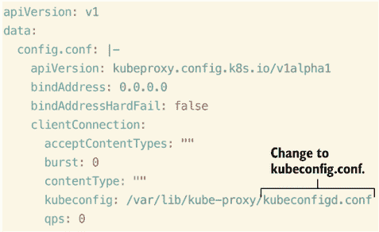

图 8.13 编辑 kube-proxy 的 ConfigMap，我们注意到客户端连接中应该修改一行。

在我们做出更改并保存文件（`:wq`）之后，再次删除 kube-proxy Pod，以便 DaemonSet 可以重新创建它并应用我们在 ConfigMap 中刚刚做出的配置更改。为此，我们将执行命令`k -n kube-system delete po kube-proxy-chc4w`，然后立即使用命令`k -n kube-system get po`再次列出`kube-system`命名空间中的 Pod。输出将类似于以下内容：

```
root@kind-control-plane:/# k -n kube-system delete po kube-proxy-chc4w
pod "kube-proxy-chc4w" deleted
root@kind-control-plane:/# k -n kube-system get po
NAME                                         READY   STATUS    RESTARTS
➥     AGE
coredns-565d847f94-75lsz                     1/1     Running   3 (158m ago)
➥     7d1h
coredns-565d847f94-8stkp                     1/1     Running   3 (158m ago)
➥     7d1h
etcd-kind-control-plane                      1/1     Running   4 (158m ago)
➥     7d1h
kindnet-b9f9r                                1/1     Running   22 (158m ago)
➥     7d1h
kube-apiserver-kind-control-plane            1/1     Running   1 (158m ago)
➥     3d19h
kube-controller-manager-kind-control-plane   1/1     Running   8 (158m ago)
➥     7d1h
kube-proxy-ddnwz                             1/1     Running   0           
➥     6s
kube-scheduler-kind-control-plane            1/1     Running   3 (158m ago)
➥     3d19h
metrics-server-d5589cfb-4ksgb                1/1     Running   2 (158m ago)
➥     3d18h
```

我们注意到 kube-proxy Pod 又处于运行状态。这完成了我们的考试任务，因为 Pod 再次回到运行状态，kube-proxy 的功能也得以恢复。

Kube-proxy 是一个可能在考试中需要故障排除的组件，因为它负责在集群中为 Pod 网络通信创建 iptables 规则（防火墙规则）。kube-proxy Pod 将确保对服务的请求能够到达与该服务关联的底层 Pod。您可以使用 `netstat` 工具看到 kube-proxy 正在监听和监控网络活动。考试中 `netstat` 工具已经安装好，但如果您想在您的集群中练习，请运行命令 `netstat -plan | grep kube-proxy` 以查看 kube-proxy 在集群中活跃并监听的端口。要安装 `netstat`，请运行命令 `apt update; apt install net-tools`。输出将类似于以下内容：

```
root@kind-control-plane:/# netstat -plan | grep kube-proxy
tcp        0      0 127.0.0.1:10249         0.0.0.0:*               LISTEN
➥       17091/kube-proxy
tcp        0      0 172.18.0.2:35430        172.18.0.2:6443         
➥ ESTABLISHED 17091/kube-proxy
tcp6       0      0 :::10256                :::*                    LISTEN
➥       17091/kube-proxy
```

Kube-proxy 在 Kubernetes 集群中的每个节点上作为 DaemonSet 运行。您可以通过运行命令 `k get ds -A` 列出所有命名空间中的 DaemonSet。输出将类似于以下内容：

```
root@kind-control-plane:~# k get ds -A
NAMESPACE     NAME         DESIRED   CURRENT   READY   UP-TO-DATE   
➥ AVAILABLE   NODE SELECTOR            AGE
kube-system   kindnet      1         1         1       1            1
➥            <none>                   3d11h
kube-system   kube-proxy   1         1         1       1            1
➥            kubernetes.io/os=linux   3d11h
```

此组件在您首次初始化集群时安装。与其他集群组件不同，它没有清单，因此有些人会感到困惑。此外，CoreDNS 和 kube-proxy 可以通过命令 `kubeadm init phase addon all` 轻易地重置（即重新创建）。因此，如果在考试中 `kube-system` 命名空间中的 kube-proxy Pod 出错或处于 `CrashLoopBackOff` 状态，运行命令 `kubeadm init phase addon all` 将是一个快速解决问题的方法，因为它会使用默认配置（在集群首次初始化时设置）重新创建 Pod。还会为 kube-proxy 创建一个服务账户和一个 ConfigMap，它们位于 `kube-system` 命名空间中。您可以使用命令 `k -n kube-system get cm,sa | grep kube-proxy` 查看它们。输出将类似于以下内容：

```
root@kind-control-plane:~# k -n kube-system get cm,sa | grep kube-proxy
configmap/kube-proxy                           2      3d11h
serviceaccount/kube-proxy                           0         3d11h 
```

### 8.3.2 服务故障排除

对于考试，您可能会遇到一个无法到达底层 Pod 的服务。为了正确地故障排除，请检查 Pod 在服务和部署中通信的标签和端口。例如，一个考试任务可能如下所示。

| 考试任务：在集群 `ik8s` 中，名为 `kb6656` 的命名空间中，运行命令 `k apply -f https://raw.githubusercontent.com/chadmcrowell/acing-the-cka-exam/main/ch_08/deploy-and-svc.yaml` 以在集群中创建 Deployment 和 Service。这是一个运行在端口 80 上的 NGINX 应用程序，因此请尝试使用 curl 通过服务的 IP 地址和端口来访问应用程序。一旦您意识到无法通过 curl 与应用程序通信，请尝试确定原因。进行必要的更改，使用 curl 访问应用程序并返回到 NGINX 欢迎页面。 |
| --- |

我们可以继续使用之前考试任务中使用的相同单节点集群。没有必要创建一个新的 Kubernetes 集群。首先，我们将使用命令 `k create ns kb6656` 创建命名空间。我们可以使用命令 `k config set-context --current --namespace kb6656` 切换到该命名空间。然后，我们将运行考试任务中给出的命令。该命令再次是 `k apply -f https://raw.githubusercontent.com/chadmcrowell/acing-the-cka-exam/main/ch_08/deploy-and-svc.yaml`。这将创建部署和服务，我们可以使用命令 `k get deploy,svc` 查看它们。输出应该类似于以下内容：

```
root@kind-control-plane:/# k create ns kb6656
namespace/kb6656 created
root@kind-control-plane:/# k config set-context --current --namespace kb6656
Context "kubernetes-admin@kind" modified.
root@kind-control-plane:/# k get po
No resources found in kb6656 namespace.
root@kind-control-plane:/# k apply -f https://raw.githubusercontent.com/chadmcrowell/acing-the-cka-
➥ exam/main/ch_08/deploy-and-svc.yaml
deployment.apps/nginx created
service/nginx-svc created
root@kind-control-plane:/# k get deploy
NAME    READY   UP-TO-DATE   AVAILABLE   AGE
nginx   1/1     1            1           36s
root@kind-control-plane:/# k get deploy,svc
NAME                    READY   UP-TO-DATE   AVAILABLE   AGE
deployment.apps/nginx   1/1     1            1           2m20s

NAME                TYPE        CLUSTER-IP     EXTERNAL-IP   PORT(S)    AGE
service/nginx-svc   ClusterIP   10.96.119.24   <none>        3306/TCP   
➥ 2m20s
```

一旦创建了部署和服务，我们就可以使用 curl 命令通过 `curl -k http://10.96.119.24` 来访问 NGINX 应用程序。输出应该类似于以下内容：

```
root@kind-control-plane:/# curl -k http://10.96.119.24
curl: (7) Failed to connect to 10.96.119.24 port 80 after 4 ms: Connection 
➥ refused
```

注意它未能连接。你可能已经注意到，当我们列出服务时，端口是 3306，而不是 80。让我们将其更改为 80，看看是否可以解决这个问题。我们可以运行命令 `k edit svc nginx-svc` 来编辑服务暴露的端口。此命令将在 Vim 文本编辑器中打开 YAML 文件，并允许我们将端口从 3306 更改为 80。我们将保存并退出（`:wq`），然后再次尝试我们的 curl 命令。命令的输出将类似于以下内容：

```
root@kind-control-plane:/# k edit svc nginx-svc
service/nginx-svc edited 
root@kind-control-plane:/# curl -k http://10.96.119.24
<!DOCTYPE html>
<html>
<head>
<title>Welcome to nginx!</title>
<style>
html { color-scheme: light dark; }
body { width: 35em; margin: 0 auto;
font-family: Tahoma, Verdana, Arial, sans-serif; }
</style>
</head>
<body>
<h1>Welcome to nginx!</h1>
<p>If you see this page, the nginx web server is successfully installed and
working. Further configuration is required.</p>

<p>For online documentation and support please refer to
<a href="http://nginx.org/">nginx.org</a>.<br/>
Commercial support is available at
<a href="http://nginx.com/">nginx.com</a>.</p>

<p><em>Thank you for using nginx.</em></p>
</body>
</html>
```

更改服务的端口解决了我们的问题。这是考试中你可能会被要求解决的问题之一。检查服务的端口是否与 Pod 的端口匹配（例如，在部署内部运行）。有时，服务和部署之间可能会发生标签不匹配。如果我们再次使用命令 `k get svc -o yaml` 查看服务，我们会看到选择器被设置为将所有流量导向带有标签 `app=nginx` 的 Pod。输出看起来类似于图 8.14。

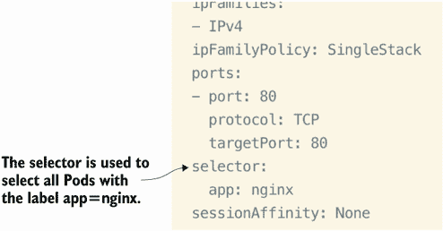

图 8.14 `k` `get` `svc` `-o` `yaml` 的输出显示了选择器，它告诉服务将流量导向哪些 Pod。

如果我们使用命令 `k get po --show-labels` 列出 Pod 标签，我们会看到这个 NGINX 部署中的 Pod 确实有标签 `app=nginx`。输出将类似于以下内容：

```
root@kind-control-plane:/# k get po --show-labels
NAME                     READY   STATUS    RESTARTS   AGE   LABELS
nginx-6cdcf8f964-hdwzr   1/1     Running   0          20m   app=nginx,pod-
➥ template-hash=6cdcf8f964
```

### 8.3.3 故障排除集群通信

除了 Kubernetes 中服务上的端口不正确之外，还有其他需要关注的问题，这需要你了解资源如何在 Kubernetes 中相互通信。一般来说，部署通过服务本身的标签选择器连接到服务。如果服务标签选择器不正确，应用程序将变得不可访问。此外，每个服务至少有一个端点，即 Pod IP 地址。如果没有服务端点，请再次检查标签选择器是否正确，以便服务可以将流量导向正确的部署或 Pod。

考试技巧 要比较正确的标签选择器，以及你的 YAML 语法是否正确，请运行命令 `k create deploy nginx -image ngnix -dry-run=client -o yaml`，然后运行 `k expose deploy nginx`。这将节省你的时间，因为你可以直接复制粘贴或轻松比较这两个文件。

## 摘要

+   要查看 Pod 中的日志，我们可以使用 `kubectl` 命令行工具或查看 `/var/logs/containers` 目录。

+   有许多不同的 Pod 状态、日志和事件，可以作为故障排除决策过程的起点。一个 Pod 可能处于运行状态，但仍然无法通过前端访问。

+   我们可以查看集群范围内的事件，以确定错误来源以及集群内与该错误相关的内容。

+   我们可以使用指标服务器监控集群指标，该服务器已经在考试环境中安装。

+   我们可以通过查看 `kube-system` 命名空间来识别我们的控制平面组件的问题。了解每个组件的功能将有助于你找到问题的根源。

+   我们可以通过查看 kube-proxy 来识别网络问题，因为它是集群内 Pod 到 Pod 之间防火墙流量的促进者。我们还可以查看我们的集群中是否安装了 CNI，以确定网络问题。

+   我们可以在考试中的 Service 和 Deployment 上查找正确的端口和标签，这有助于确定我们无法连接到应用程序的根本原因。
