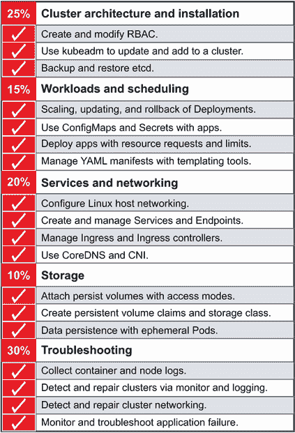
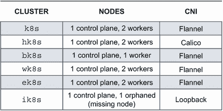
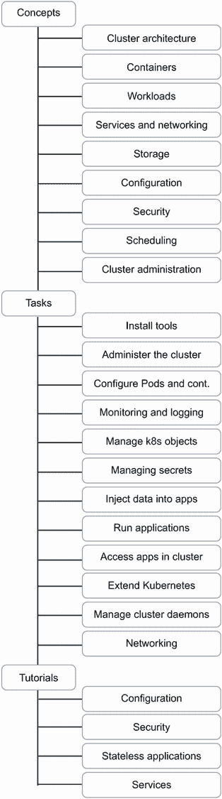
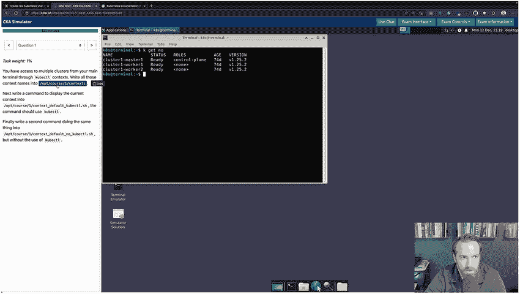

# 9 参加考试

本章涵盖

+   考试最重要的方面

+   准备考试当天

+   Kubernetes 文档综述

+   访问你的免费练习考试

+   访问免费的 `kubectl` 命令速查表

我希望到现在你已经为 CKA 考试做好了准备。通过阅读这本书，你将有机会在 CKA 考试中取得优异成绩。本章致力于回顾本书内容，巩固任何薄弱环节，以便你能够轻松回顾前面的章节，并重新学习你可能已经忘记或需要进一步复习的原则和研究领域。

## 9.1 考试基础

我们在第一章中介绍了考试的内容，但本章指出了关于考试准备的最重要的话题。它还回顾了你的技术能力要求，因为你将在终端执行命令，并需要在考试中面对特定问题时立即记住要执行的操作。

### 9.1.1 知识点浓缩

让我们回顾一下到目前为止我们已经覆盖的能力和材料，以便我们能够正确地识别你感觉最强的领域。图 9.1 显示了能力图表。

图 9.1 CKA 考试当天需要回顾的能力

检查你的知识是一个好主意。例如，如果你在工作负载和调度方面感到薄弱，你应该回到第四章和第五章复习扩展、更新和回滚部署、使用 ConfigMaps 和 Secrets、使用请求和限制部署应用程序以及使用模板工具管理 YAML 清单。在这本书的第二章到第八章的顶部，你可以快速查看哪个能力与哪个章节相关，所以我建议你学习这些内容。每个章节开头都有表格，可以帮助你将能力映射到适用的章节。

### 9.1.2 考试集群

一旦你回顾了考试的能力，你也应该回顾考试集群配置。考试当天，你将连接到六个集群，每个集群将提供从集群到集群切换上下文的特定说明。图 9.2 列出了集群的名称、节点数量以及每个集群使用的 CNI。

图 9.2 用于 CKA 考试测试的每个集群的集群名称、节点和使用的 CNI

如果你真的想取得考试的好成绩，你应该至少设置两个集群，并熟悉在这两个集群之间切换上下文，无论是通过本地使用 kind Kubernetes，还是通过在网页浏览器中使用 killercoda.com。回顾附录 A，了解如何使用 kind Kubernetes 安装多节点集群。再次强调，切换上下文是考试任务说明中提供的一个命令，但将其牢记在心也很重要，因为考试所分配的 2 小时时间非常宝贵。

## 9.2 章节回顾

以下是对每个章节的快速回顾，从第二章开始。每个子节中将讨论与讨论的章节相关的关键词。这将帮助您复习这些术语，因为它们对于考试很重要。

### 9.2.1 第二章快速回顾

让我们回顾第二章的要点，因为本章涵盖了集群架构、集群升级、etcd 备份和恢复以及集群管理。进行这次快速回顾的原因是回忆您之前在章节中阅读的信息，并鼓励您在需要时重新阅读章节。

对于考试来说，记住控制平面节点和工作节点之间的区别是很重要的。它们都运行 Pods，但控制平面节点只会运行系统 Pods（即运行 Kubernetes 本身所必需的 Pods）。这些系统 Pods 有时被称为*静态 Pods*，这意味着它们不由 Kubernetes 调度器管理。

Kubelet 在集群中的每个节点上运行，但没有`kubectl`命令可以查看 kubelet，因为它本身就是节点上的系统服务的一部分。如果 kubelet 不在运行状态，Pods 将无法运行。查看第 2.1 节了解如何管理 kubelet 以及考试当天将向您展示的可能修复方案。当需要保存集群配置的数据时，它存储在运行在`kube-system`命名空间中的 Pod 上的*etcd* *数据存储*中。

🮱  *污点与容忍*—控制平面如何应用污点，以及如何为该污点添加容忍。第 2.1.3 节。

🮱  *命名空间*—如何定位`kube-system`命名空间及其内部的 Pods，包括控制器管理器、调度器、API 服务器、kube-proxy、CoreDNS 和 etcd。第 2.1 节。

🮱  *静态 Pods*—如何通过控制平面节点上`/etc/kubernetes/manifests`目录中的 YAML 修改系统 Pods。第 2.2.1 节。

🮱  *Kubeadm*—如何升级 Kubernetes 组件，包括 API 服务器、控制器管理器、调度器、kube-proxy、CoreDNS 和 etcd。第 2.1.1 节。

🮱  *Kubelet*—Kubelet 作为 Linux 系统服务（一个守护进程）在每个节点上运行的方式。第 2.1.4 节。

🮱  *Etcd*—集群配置如何存储在 etcd 数据存储中，以及如何使用 etcdctl 命令行工具通过快照备份 etcd。第 2.2 节。

### 9.2.2 第三章快速回顾

让我们回顾第三章的要点，因为本章涵盖了基于角色的访问控制（RBAC）的管理以及集群的高可用性管理。如果在这次快速回顾中您有任何不确定的地方，请重新阅读第三章以进行更深入的复习。

对于第三章，记住用户和服务账户如何通过 Kubernetes API 访问集群是很重要的。任何试图访问集群的东西都会通过 RBAC 进行，以潜在地创建、读取、更新或删除 Kubernetes 对象。

第 3.1 节涵盖了“普通”用户和服务帐户，它们之间的区别，以及我们如何将*角色*和*角色绑定*应用于用户以限制权限。集群角色和集群角色绑定也可以应用于用户、组或服务帐户。请分别在第 3.2 节和第 3.3 节中回顾创建用户和服务帐户的内容。

🮱  `kubectl`—如何使用`kubectl`通过 kubeconfig 与集群交互（将`/etc/kubernetes/admin.conf`复制到`~/.kube/config`）。第 3.1 节。

🮱  *RBAC*—如何通过 RBAC 访问集群，以及认证、授权和访问控制的过程。第 3.1 节。

🮱  *服务帐户*—如何将服务帐户挂载到 Pod 上，以便 Pod 可以访问 API。第 3.3 节。

🮱  *集群角色*—如何赋予集群范围内的权限，以及如何将这些权限与用户、组或服务帐户关联。第 3.1.1 节。

🮱  *角色*—如何在命名空间内赋予权限，并将这些权限与位于给定命名空间内的用户、组或服务帐户关联。第 3.1.1 节。

### 9.2.3 第四章的快速回顾

让我们回顾第四章的要点，因为本章涵盖了 ConfigMaps；Secrets；资源限制；以及在 Kubernetes 中创建和管理 Deployments，包括使用模板工具。从本章中，重要的是要记住 Pod 是如何调度到节点的。

第四章介绍了通过*节点选择器*将 Pod 调度到特定节点的过程，包括在您的集群中应用节点选择器的练习，这包括对节点应用*标签*；然而，您也可以使用节点名称。您可以使用命令`k get no -show-labels`轻松检查应用到了您的节点上的标签。了解如何使用*节点亲和性*调度 Pod——即使选定的节点不可用——也是本章涵盖的内容。如果您想将 Pod 调度到已经运行了特定 Pod 的节点上怎么办？这被称为*Pod 亲和性*，并在第 4.1.2 节中介绍。

使用*Helm*是本考试的技能之一。Helm 是一种将包含不同 Kubernetes 资源的应用程序打包并使用一条命令通过 Helm 命令行部署的简单方法。在第 4.2 节中使用了在集群内部署`metallb`应用程序的示例，以及使用 Helm 安装`vault`应用程序。在第 4.2 节中，您还可以回顾如何添加 Helm 仓库，以及如何搜索现有仓库并将模板应用于与 Helm 一起使用的清单。

在你的集群内部节点上运行 Pod 时应用*资源请求*和*限制*对于考试来说很重要。你可以在第 4.3.1 节中看到这个示例，你可以在第 4.3.2 节中回顾如何在单个 Pod 内创建多个容器。ConfigMaps 和 Secrets 在第 4.3.3 节中介绍，该节描述了为 Redis Pod 创建 ConfigMap 以及为通过卷挂载附加到 Pod 的`busybox` Pod 创建 Secret。你应该通过阅读本章熟悉创建 ConfigMaps 和 Secrets 以及两种不同的使用方式。

🮱  *节点选择器*—如何使用节点选择器将 Pod 调度到特定的节点。第 4.1.1 节。

🮱  *节点名称*—如何通过指定节点名称在节点上运行 Pod，并且只在该节点上运行该 Pod。第 4.1.1 节。

🮱  *节点亲和性*—如何通过特定的标签配置 Pod 在节点上运行，如果节点不可用，仍然在不同的节点上运行 Pod，该节点具有不同的特性（例如，操作系统）。第 4.1.2 节。

🮱  *ConfigMaps*—如何为 Redis Pod 创建 ConfigMap 并通过卷挂载将其附加到 Pod。第 4.3.3 节。

🮱  *Secrets*—如何通过卷挂载将 Secret 附加到 Pod。第 4.3.3 节。

🮱  *资源限制*—如何将资源请求和限制应用到 Pod。第 4.3.1 节。

🮱  *Helm*—如何使用 Helm 图表部署应用程序，首先在本地搜索 Helm 仓库，如果需要，从仓库添加 Helm 仓库，并应用模板来定制图表。第 4.2 节。

### 9.2.4 第五章的快速回顾

让我们回顾第五章的要点，因为本章涵盖了如何扩展应用程序以及推出应用程序新版本的含义，以及如何通过管理*部署*在 Kubernetes 中实现自我修复。在许多方面，这章是前一章的延续；现在你已经知道如何创建 Deployment，第五章展示了部署运行后的维护方法。

在 Kubernetes 中，当我们想要为我们的应用程序添加更多 Pod 以实现冗余时，我们称之为*扩展应用程序*，因为它通过同一 Deployment 内的 Pod 数量进行扩展。通过滚动更新的概念，在 Kubernetes 中更新运行中的应用程序变得简单。通常，有一个服务附加到 Deployment 上，本章简要介绍了这一点，但你应该探索第六章以获得对服务的全面了解。

🮱  *规模部署*—如何调整 Deployment 副本的数量，改变给定 Deployment 中的 Pod 数量。第 5.1.1 节。

🮱  *副本集*—更改 Deployment 副本如何影响副本集，跟踪 Deployment 每个修订版本的 Pod 副本数量。第 5.1.2 节。

🮱  *滚动更新*—如何执行滚动更新，检查滚动历史，列出修订版本。第 5.1.3 节。

🮱  *隔离和排空*—如何将节点关闭以进行维护，这包括将那个节点的所有 Pod 移动到另一个节点。第 5.2 节。

🮱  *添加节点*—如何向现有集群添加新节点。第 5.2.2 节。

### 9.2.5 第六章快速回顾

让我们回顾第六章的要点，因为本章涵盖了 Kubernetes 集群内的网络，理解 DNS 以及 Pod 之间的通信，Kubernetes 中不同类型的 Service，以及容器网络接口插件。

在第 6.1 节中，介绍了集群 DNS 的概念，并在一个演示更改集群 DNS 配置的练习中进行了覆盖，包括 DNS 服务、ConfigMap 和 kubelet 系统服务配置。正如本章所述，CoreDNS 背后的魔法是能够非常快速地将主机名解析为 IP 地址，减少应用程序和运行在 Kubernetes 集群内部组件之间的延迟。这就是为什么在集群中作为 Deployment 运行多个 CoreDNS 实例的原因。

回顾外部世界如何通过 Ingress 访问运行在 Kubernetes 中的应用程序。我强烈建议重新阅读安装 Ingress 控制器、创建 ClusterIP Service 和 Ingress 资源的练习。这将是对考试有益的实践。回顾关于 Service 类型（包括 ClusterIP、NodePort 和 LoadBalancer Service）的更多细节。

🮱  *CoreDNS*—如何在 Kubernetes 中解析 DNS 名称，以及如何更改 DNS 服务器配置。第 6.1 节。

🮱  *Pod 通信*—如何在 Kubernetes 集群中从 Pod 到 Pod 以及从 Service 到 Service 进行通信。第 6.2.3 节。

🮱  *Ingress*—如何将一组 Pod（在 Service 内部）暴露给 Kubernetes 集群外部的端点，这包括创建 Ingress 控制器。第 6.3 节。

🮱  *Service*—如何创建和使用 ClusterIP、NodePort 和 LoadBalancer Service 类型。第 6.4 节。

### 9.2.6 第七章快速回顾

让我们回顾第七章的要点，因为本章涵盖了在 Kubernetes 中配置存储的多种方式，包括**持久卷**的概念，以及**卷模式**、**访问模式**和**回收策略**。本章还介绍了存储类和持久卷声明，以便于从运行在 Kubernetes 中的应用程序中轻松利用存储，提供了对这些卷的额外控制，包括哪些 Pod 或 Pods 可以访问卷以及卷的类型，如`ReadWriteOnce`、`ReadWriteMany`等，以及卷的**文件系统**类型与**块**类型。持久卷声明为 Pod 使用保留了任何类型的卷。存储类用于从特定类别的卷类型（例如，本地或云存储）自动配置卷。本章还进一步提供了为 Pod 创建临时卷的理由，用于创建`emptyDir`卷类型。

🮱  *持久卷*—如何在 Pod 内部创建持久卷和持久卷声明。第 7.1 节。

🮱  *卷模式*—如何在 Kubernetes 的持久卷中设置卷模式为`Filesystem`或`Block`。第 7.1.2 节。

🮱  *访问模式*—如何在 Kubernetes 中给 Pods 授予对持久卷的读写权限。第 7.1.3 节。

🮱  *存储类*—如何通过持久卷声明自动预配卷，它为 Pod 动态创建存储。第 7.3 节。

🮱  `emptyDir`—如何使用`emptyDir`卷类型为你的 Pod 创建临时存储，它随着 Pod 的创建和销毁而存在。第 7.4 节。

### 9.2.7 第八章快速回顾

让我们回顾第八章的要点，因为本章涵盖了在遇到集群、Pods、服务等问题时的许多故障排除方面。CKA 考试将测试你从运行在 Kubernetes 集群中的 Pods 获取日志的能力。

按照图 8.7 中的决策树进行操作，因为它是在有很多不同类型的错误导致你进入不同的故障排除路径时确定要做什么的好起点。Pod 的状态可能是解决特定问题的线索。在表 8.1 中，有八个不同的 Pod 状态需要审查，以及它们的含义。

控制平面本身可能存在问题—无论是 API 服务器还是控制器管理器，都可能存在配置错误。Pods，无论是系统 Pods 还是应用 Pods，都不是唯一会失败的组件；节点本身有时也会引导你进入故障排除路径。

我们在第三章中讨论了访问集群，如果你无法通过 kubeconfig 正确认证到集群，可能会出现问题。关于 Kubernetes 服务，无论是 ClusterIP、NodePort 还是 LoadBalancer 服务类型，考试中可能会有标签输入错误或端口缺失的地方。

🮱  *Pod 日志*—如何查看 Pod 日志以排查容器化应用程序中预期失败的原因。第 8.1 节。

🮱  *网络故障排除*—如何利用临时 Pod 来排查 Pod 到 Pod 的 DNS 问题。第 8.1.2 节。

🮱  *调度器故障*—如何排查和修复 Kubernetes 调度器的问题。第 8.2 节。

🮱  *事件*—如何分析集群内的整体事件日志，让你能够更深入地了解任何问题。第 8.2.1 节。

🮱  *故障排除 kubeconfig*—如何确定 kubeconfig 是否是你无法访问集群的原因，以及如何修复它。第 8.2.4 节。

🮱  *服务连接问题*—如何确定通信没有到达底层的 Pods，以及如何检查服务的端点。第 8.3.1 节。

## 9.3 Kubernetes 文档回顾

你可以在考试时打开文档的另一个标签页，为什么不充分利用这个机会呢？更具体地说，包含大量知识的 URL [`kubernetes.io/docs`](https://kubernetes.io/docs)，可以在考试期间打开，而且最好的部分是它可搜索。首先，请查看网站地图，这将为你提供一个工作框架，尽管页面可能命名相似，但你仍然可以熟悉示例 YAML 文件的位置以及资源名称——如此熟悉以至于你将能够识别页面并直接滚动到特定部分，这样你就不需要在考试上浪费时间。记住，你只有 2 个小时，所以要明智地使用它。你可以在图 9.3 中查看网站地图。

图 9.3 Kubernetes.io 网站地图与 CKA 考试相关

当你查看网站地图时，你将开始将每一章中讨论的项目与相关的文档页面联系起来。页面间的导航将位于页面左侧。一旦你打开一个页面，你将看到另一个位于右侧的导航，它将带你到现有文档中的每个部分。网站和页面导航的示例如图 9.4 所示。

图 9.4 导航 Kubernetes 文档以帮助你在考试中

你还会在 Kubernetes 文档中看到一种在整个网站上搜索的方法。这对于考试来说非常有用，因为你可以搜索特定项目，而不是逐个链接导航。请注意，在搜索 Kubernetes 文档页面时，你可能会得到搜索结果，这些结果会带你到完全不同的网站，而你是不被允许访问的。你可以悬停在链接上，看看它将带你去哪里。如果它不包含前缀 [`kubernetes.io/docs`](https://kubernetes.io/docs)，那么不要点击它。不过，如果你点击了，不用担心；浏览器不会允许你离开，它只会显示该网站似乎不存在。我在考试中就是这样做的，并意识到由于环境是受控的（考试是在虚拟机内部进行的），可以实施这样的防火墙规则。此外，还要利用 Firefox 中的“在页面中查找”功能，这是你将在考试中使用的浏览器。它允许你快速搜索整个页面，这样你就不必花费额外的时间使用右侧的页面导航链接。

## 9.4 实践考试

每次购买考试都会附赠一份由 KLLR SHLL 提供的免费练习考试券。请访问他们的网站[`killer.sh`](https://killer.sh)。当您使用 Linux Foundation 的凭证（与您在[`training.linuxfoundation.org/`](https://training.linuxfoundation.org/)购买考试时使用的相同凭证）登录时，考试模拟器将自动出现在您的仪表板上。您将在同一模拟器中进行两次会话（包括 PSI 桥接的模拟）；两次都有相同的问题。我建议将其视为真正的考试，因为它以相同的方式呈现，并将为考试日做好准备。此外，模拟器上的问题比真实考试上的问题更难，这将使真实考试看起来容易一些。有关考试模拟器的常见问题，请访问[`killer.sh/faq`](https://killer.sh/faq)。图 9.5 显示了考试环境的样子，它与真实考试非常相似。

图 9.5 KLLR SHLL 提供的 CKA 考试模拟器环境

## 9.5 考试额外提示

您的练习越多，在考试中的表现就越好。多次完成这本书中的所有练习，这是将其巩固在记忆中的唯一方法。KLLR SHLL 有一个名为 Killercoda 的姐妹公司([`killercoda.com`](https://killercoda.com))，该公司有更多练习和类似考试的作业来完成。您还可以通过创建自己的场景来补充，这是重复和吸收概念的最佳方式。

请准备好您的身份证明，并准备好在您参加考试的房间中遵守相对严格的清洁规则。有关更多信息以及您可以在考试期间携带的物品的指南，请参阅[`mng.bz/d1vw`](http://mng.bz/d1vw)，您还可以在此提前进行硬件兼容性检查。我强烈建议在考试日期前几天做这件事。准备好考试监考员要求您在房间内移动摄像头以验证您是否遵守了这些规则。在考试当天，大约在您的考试开始前 30 分钟登录 Linux Foundation 门户。您可以通过[`trainingportal.linuxfoundation.org/`](https://trainingportal.linuxfoundation.org/)门户访问 Linux Foundation，您将看到您已安排的所有考试。

您的考试成绩将在考试完成后 24 小时内通过电子邮件发送给您。请记住，您有一次免费重考的机会，所以如果您第一次没有通过，请不要担心。如果您愿意，您可以在第二天回来安排重考。祝您好运！

感谢您购买此书并允许我引导您通过认证 Kubernetes 管理员考试的最佳尝试。真正让我高兴的是能在这段旅程中帮助您。

## 摘要

在本章中，你已经回顾了这本书中的章节，并且还得到了一些关于考试临近时如何准备的额外建议。记住以下几点：

+   回顾章节要点，真正掌握内容。确保你为所有能力域内可能出现的各种情况做好准备。

+   为了正确准备 CKA 考试，你必须反复练习，练习，然后再多练习一些。让它成为考试前的日常习惯。

+   像专业人士一样回顾官方 Kubernetes 文档，以充分利用考试中额外的开卷格式。

+   你将在考试中与多个集群一起工作。尽管提供了`kubectl`命令来切换上下文，但请确保你能够舒适地检查你正在工作的正确集群，这是考试所要求的。

+   你有两个练习考试，所以明智地使用它们。它们将挑战你完成更困难的任务，并帮助你熟悉考试环境。

+   检查手册以及所有关于你的物理环境应该如何看起来规则，并提前准备好一切。

+   你在考试中有一次免费重考的机会，所以不要担心！你可以做到的！
