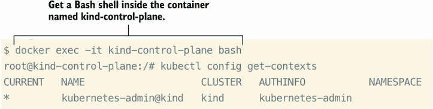
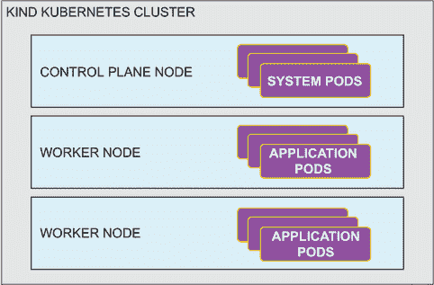

# 附录 A：使用 kind 创建 Kubernetes 集群

本附录展示了如何使用 Docker 容器安装具有多个节点的 kind（Kubernetes in Docker）Kubernetes 集群，其中节点本身是 Docker 容器。你将下载并安装 kind，它将使用 kubeadm 工具（包含在 kind 中）来引导你的集群。本节的唯一先决条件是 Docker 和 kind，我们将一起安装它们。

## A.1 安装所需的软件包

正如之前提到的，创建 kind Kubernetes 集群的唯一先决条件是 Docker 和 kind。Docker Desktop 是 Docker 公司的一系列软件产品，它使得构建、运行和共享容器化应用程序和微服务变得更加容易。如果你还没有安装 Docker Desktop，你可以访问以下链接下载它：[`docker.com/products/docker-desktop`](https://docker.com/products/docker-desktop)。Docker Desktop 可用于 Windows、macOS 和 Linux 操作系统。你可以使用操作系统的软件包管理器安装 kind，或者你也可以从这里下载 kind：[`github.com/kubernetes-sigs/kind/releases`](https://github.com/kubernetes-sigs/kind/releases)。Kind 也适用于 Windows、macOS 或 Linux。在本指南中，我们将使用版本 0.14.0。

### A.1.1 安装 Docker Desktop

Docker Desktop 将作为我们使用 kind 工具构建的此实践集群的容器运行时。在第一章，我解释了容器运行时的作用，即作为在 Pod 内运行底层容器的系统服务。从现在开始，我将只称 Docker Desktop 为 Docker。请注意，我指的是 Windows、macOS 或 Linux 的容器运行时。以下是安装 Docker 到这些操作系统的说明：

1.  打开网页浏览器并访问 [`www.docker.com/products/docker-desktop`](https://www.docker.com/products/docker-desktop)。

1.  下载与你的操作系统匹配的安装程序。你可能还需要选择芯片架构（例如，macOS 的 M1 或 Intel 芯片）。

1.  运行安装程序（.dmg、.exe、.deb 或 .rpm 文件扩展名）并接受所有默认设置。（你可能需要重新启动你的计算机。）

1.  打开应用程序，你应该在任务栏中看到鲸鱼图标。

1.  如果你看到表示 Docker 正在运行的鲸鱼图标，那么你就完成了！

注意：如果你在 Windows 上并且已经安装了 Docker，请确保你处于 Linux 容器模式。对于新安装，这是默认设置。

安装 Docker 后，你可以通过在终端（Docker Desktop 套件中的工具之一）中使用 Docker CLI 来验证它是否已准备好使用：打开终端或命令提示符并输入 `docker ps`：

```
$ docker ps
CONTAINER ID   IMAGE     COMMAND   CREATED   STATUS    PORTS     NAMES
```

如果你得到这样的输出但没有错误，那么你已成功安装 Docker Desktop。命令 `docker ps` 列出所有正在运行的容器。如果你想知道为什么我们没有看到任何正在运行的容器，那是因为我们还没有创建任何容器。我们将在安装 kind 的下一步中这样做。

### A.1.2 安装 kind

如果你认为安装 Docker 很容易，那么准备好被震撼吧！我们将只用一个命令来安装 kind。macOS 的命令是 `brew install kind`，Windows 的命令是 `choco install kind`，Linux 的命令是 `curl -Lo ./kind https://kind.sigs.k8s.io/dl/v0.11.1/kind-linux-amd64 && chmod +x ./kind && sudo mv ./kind /usr/local/bin/kind`。

现在，在终端中，只需输入 `kind`，你将看到以下内容：

```
$ kind
kind creates and manages local Kubernetes clusters using Docker container
➥ 'nodes'

Usage:
  kind [command]

Available Commands:
  build       Build one of [node-image]
  completion  Output shell completion code for the specified shell (bash, 
➥ zsh or fish)
  create      Creates one of [cluster]
  delete      Deletes one of [cluster]
  export      Exports one of [kubeconfig, logs]
  get         Gets one of [clusters, nodes, kubeconfig]
  help        Help about any command
  load        Loads images into nodes
  version     Prints the kind CLI version

Flags:
  -h, --help              help for kind
      --loglevel string   DEPRECATED: see -v instead
  -q, --quiet             silence all stderr output
  -v, --verbosity int32   info log verbosity
      --version           version for kind

Use "kind [command] --help" for more information about a command.
```

根据 kind 帮助的输出，你可以获得创建第一个集群的提示。

### A.1.3 创建 kind Kubernetes 集群

输入以下命令以创建（启动）一个 kind Kubernetes 集群：`kind create cluster`。你的输出应该看起来像这样：

```
$ kind create cluster
Creating cluster "kind" ...
 ✓ Ensuring node image (kindest/node:v1.21.1) 🖼
 ✓ Preparing nodes 📦
 ✓ Writing configuration 📜
 ✓ Starting control-plane 🕹
 ✓ Installing CNI 🔌
 ✓ Installing StorageClass 💾
Set kubectl context to "kind-kind"
You can now use your cluster with:

kubectl cluster-info --context kind-kind

Have a nice day! 👋
```

就这些！祝贺你成功启动你的 Kubernetes 集群！现在，我们已经使用 kind 创建了一个 Kubernetes 集群，我们可以方便地使用 kubectl 工具，就像我们连接到以任何其他方式创建的其他 Kubernetes 集群一样。实际上，当我们创建一个 kind 集群时，kind 会自动将我们的 kubeconfig 上下文设置为它刚刚创建的集群（`kind-kind`）。首先，使用命令 `docker exec -it kind-control-plane bash` 进入我们的控制平面节点所在的 Docker 容器，然后使用命令 `kubectl config get-contexts` 查看你所在的上下文。



图 A.1 显示当前上下文，以查看你当前正在访问哪个集群。

### A.1.4 安装 kubectl（可选）

`kubectl` 是你在考试期间将用于与 Kubernetes 交互的工具。它之所以是可选的，是因为你将要执行的 Docker 容器已经预装了 `kubectl`。如果你不想在容器内运行命令，那么请继续在你的本地机器上安装 `kubectl`。

`kubectl` 有许多发音。我听过它被读作“cube-cuttle”和“cube-eck-tell”。我读作“cube-C-T-L”，但“官方”的发音是“cube-control”。你应该问一个 Kubernetes 管理员的第一件事是，“你是怎么发音 `kubectl` 的？”（当然是在开玩笑）；这将是一个很好的破冰方式，也是和朋友们谈论 Kubernetes 的有趣方式。

`kubectl` 工具可以在 Linux、macOS 和 Windows 上安装。我将在本书中指导你安装 `kubectl`，你也可以参考官方安装说明：[`kubernetes.io/docs/tasks/tools/install-kubectl`](https://kubernetes.io/docs/tasks/tools/install-kubectl)。

对于 macOS，你可以使用 brew 来安装 `kubectl`。Brew 是 macOS 的包管理器，类似于 Linux 中的 apt 或 yum。如果你还没有安装 brew，你可以通过访问 [`brew.sh`](https://brew.sh) 来安装它。一旦 brew 安装完成，你只需运行命令 `brew install kubectl` 即可。`

对于 Windows，你可以使用名为 Chocolatey 的 Windows 包管理器。如果你还没有安装 Chocolatey，请访问 [`chocolatey.org/install`](https://chocolatey.org/install)。一旦你安装了 Chocolatey，你只需运行命令 `choco install kubernetes-cli` 即可。`

对于 Linux，你可以运行以下命令，该命令将下载二进制文件并将其移动到你的 `/usr/local/bin` 目录：`curl -LO "https://dl.k8s.io/$(curl -L -s https://dl.k8s.io/release/stable.txt)/bin/linux/amd64/kubectl" && sudo chmod +x kubectl && sudo mv kubectl /usr/local/bin/kubectl.`

现在你已经安装了 `kubectl`，你可以使用命令 `kubectl version --client –short` 来验证它是否已安装：

```
$ kubectl version --client --short
Client Version: v1.23.1
```

恭喜！你已经安装了 `kubectl` 并可以继续与你的 kind Kubernetes 集群进行交互。

## A.2 创建多节点集群

现在，我们可以创建一个多节点集群来模拟考试环境，帮助你更熟悉创建、访问和故障排除每个节点上的组件，无论是控制平面还是工作节点。这将与 CKA 考试相似，考试将主要有一个控制平面和两个工作节点。以防将来有所变化，你可以在这里访问考试文档：[`docs.linuxfoundation.org/tc-docs/certification/tips-cka-and-ckad#cka-and-ckad-environment`](https://docs.linuxfoundation.org/tc-docs/certification/tips-cka-and-ckad#cka-and-ckad-environment)。

首先，我们必须删除我们之前创建的 kind 集群，所以让我们用命令 `kind delete cluster` 来做这件事。这将删除我们迄今为止一直在使用的集群，并允许我们从头开始创建一个全新的、三节点的集群。

为了执行三个节点的集群配置，我们将使用 `kind create cluster` 命令，并添加配置参数和一个配置文件（也用 YAML 编写），该文件指定要创建多少个节点。让我们创建这个集群配置文件，并将其命名为 `config.yaml`，通过将以下内容复制粘贴到你的命令行（仅限 macOS 和 Linux）：

```
cat << EOF | tee config.yaml
kind: Cluster
apiVersion: kind.x-k8s.io/v1alpha4
nodes:
- role: control-plane
- role: worker
- role: worker
EOF
```

如果你使用的是 Windows，可以使用以下命令来创建三个节点的 kind 集群：

```
echo "kind: Cluster
apiVersion: kind.x-k8s.io/v1alpha4
nodes:
- role: control-plane
- role: worker
- role: worker" | tee .\config.yaml
```

现在我们有了 kind 配置，我们可以将这个配置传递给 `kind create cluster` 命令，并创建一个包含一个控制平面节点和两个工作节点的集群。通过输入命令 `kind create cluster --config config.yaml` 来完成此操作：

```
$ kind create cluster --config config.yaml
Creating cluster "kind" ...
 ✓ Ensuring node image (kindest/node:v1.21.1) 🖼
 ✓ Preparing nodes 📦 📦 📦
 ✓ Writing configuration 📜
 ✓ Starting control-plane 🕹
 ✓ Installing CNI 🔌
 ✓ Installing StorageClass 💾
 ✓ Joining worker nodes 🚜
Set kubectl context to "kind-kind"
You can now use your cluster with:

kubectl cluster-info --context kind-kind

Have a question, bug, or feature request? Let us know! 
➥ https://kind.sigs.k8s.io/#community 🙂
```

一旦集群创建完成，我们可以使用命令 `kubectl get no` 来验证我们现在总共有三个节点：

```
$ kubectl get no
NAME                 STATUS   ROLES                  AGE   VERSION
kind-control-plane   Ready    control-plane,master   98s   v1.21.1
kind-worker          Ready    <none>                 70s   v1.21.1
kind-worker2         Ready    <none>                 70s   v1.21.1
```



图 A.2：由 kind 构建的三个节点 Kubernetes 集群将系统 Pod 和应用 Pod 分开。

恭喜，你现在已经创建了一个三节点 Kubernetes 集群！

## A.3 kind 的高级配置

为了跟随本书中的某些示例，你需要设置一个具有更高级配置的 kind 集群。以下示例创建了一个带有节点标签和端口 80 暴露的单节点 kind 集群。我们创建一个 `config2.yaml` 文件，类似于我们在上一节中创建的方式，但我们添加了一些额外的行。让我们通过在终端中复制粘贴以下内容来创建名为 `config2.yaml` 的集群配置文件（仅适用于 macOS 和 Linux）：

```
cat << EOF | tee config2.yaml
kind: Cluster
apiVersion: kind.x-k8s.io/v1alpha4
nodes:
- role: control-plane
  extraPortMappings:
  - containerPort: 80
    hostPort: 80
  labels:
    ingress-ready: true
EOF
```

如果你在 Windows 上，请使用以下命令创建 `config2.yaml` 文件：

```
echo "kind: Cluster
apiVersion: kind.x-k8s.io/v1alpha4
nodes:
- role: control-plane
  extraPortMappings:
  - containerPort: 80
    hostPort: 80
  labels:
    ingress-ready:true" | tee .\config.yaml
```

现在我们已经创建了 `config2.yaml` 文件，就像我们在上一节中做的那样，我们可以将这个文件传递给 `kind create cluster` 命令，并使用那些额外的节点标签和端口创建我们的集群。让我们运行命令 `kind create cluster --config config2.yaml:`。

```
$ kind create cluster --config config2.yaml
Creating cluster "kind" ...
 ✓ Ensuring node image (kindest/node:v1.21.1) 🖼
 ✓ Preparing nodes 📦
 ✓ Writing configuration 📜
 ✓ Starting control-plane 🕹
 ✓ Installing CNI 🔌
 ✓ Installing StorageClass 💾
 ✓ Joining worker nodes 🚜
Set kubectl context to "kind-kind"
You can now use your cluster with:

kubectl cluster-info --context kind-kind

Have a question, bug, or feature request? Let us know! https://kind.sigs.k8s.io/#community 🙂
```

一旦集群创建完成，我们可以使用命令 `kubectl get no --show-labels` 验证我们现在在节点上有一个标签。我们还可以使用命令 `docker port kind-control-plane` 验证节点上的端口是否已暴露。你应该得到类似以下的输出：

```
$ kubectl get no --show-labels && docker port kind-control-plane         [20:03:30]
NAME                 STATUS   ROLES           AGE    VERSION   LABELS
kind-control-plane   Ready    control-plane   105s   v1.27.0   beta.kubernetes.io/
     arch=amd64,beta.kubernetes.io/os=linux,ingress-ready=true,kubernetes.io/
     arch=amd64,kubernetes.io/hostname=kind-control-plane,kubernetes.io/
     os=linux,node-role.kubernetes.io/control-plane=,node.kubernetes.io/
     exclude-from-external-load-balancers=
6443/tcp -> 127.0.0.1:55726
80/tcp -> 0.0.0.0:80
```

我们现在有一个单节点集群，它可以接受通过端口 80 的流量，并且 Pod 可以根据其标签 `"ingress-ready=true"` 选择节点。

注意：如果你已经有一个 kind 集群正在运行，要创建第二个集群，你必须给新集群一个不同于 `kind` 的名字。为了给你的 kind 集群起一个自定义的名字，请在 `kind create` 命令的末尾添加 `--name`。例如，如果我想将我的集群命名为 `cka` 并使用 `config2.yaml` 文件，我会运行命令 `kind create cluster --config config2.yaml --name cka`。
