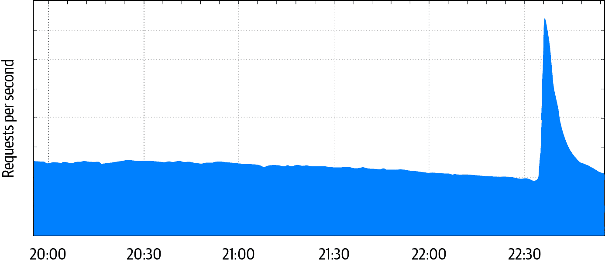

# 第一章：安全性和可靠性的交集

> 原文：[1. The Intersection of Security and Reliability](https://google.github.io/building-secure-and-reliable-systems/raw/ch01.html)
> 
> 译者：[飞龙](https://github.com/wizardforcel)
> 
> 协议：[CC BY-NC-SA 4.0](https://creativecommons.org/licenses/by-nc-sa/4.0/)

由亚当·斯塔布菲尔德、马西米利亚诺·波莱托和皮奥特·莱万多夫斯基撰写

与大卫·胡斯卡和贝琪·拜尔一起

# 关于密码和电钻

2012 年 9 月 27 日，一封无辜的谷歌公司范围内的公告在内部服务中引发了一系列连锁故障。最终，从这些故障中恢复需要使用电钻。

谷歌有一个内部密码管理器，允许员工存储和共享第三方服务的密码，这些服务不支持更好的身份验证机制。其中一个秘密是连接谷歌旧金山湾区校园的大型巴士上的访客 WiFi 系统的密码。

在那个九月的一天，公司的交通团队向成千上万的员工发送了一封电子邮件公告，称 WiFi 密码已更改。由此产生的流量激增远远超过了密码管理系统的处理能力，该系统多年前为一小群系统管理员开发而成。

密码管理器的主要副本由于负载过大而变得无响应，因此负载均衡器将流量转移到次要副本，但次要副本立即以相同的方式失败。此时，系统呼叫了值班工程师。工程师没有经验来应对服务的故障：密码管理器是在尽力支持的基础上运行的，并且在其存在的五年中从未发生过故障。工程师试图重新启动服务，但不知道重新启动需要硬件安全模块（HSM）智能卡。

这些智能卡存放在全球不同的谷歌办公室的多个保险柜中，但不在值班工程师所在的纽约市。当服务无法重新启动时，工程师联系了澳大利亚的一位同事来取回智能卡。令他们大为沮丧的是，澳大利亚的工程师无法打开保险柜，因为组合密码存储在现在已经离线的密码管理器中。幸运的是，加利福尼亚的另一位同事记住了现场保险柜的组合密码，并成功取回了智能卡。然而，即使加利福尼亚的工程师插入了卡片，服务仍然无法重新启动，显示了“密码无法加载任何保护此密钥的卡片”的加密错误。

此时，澳大利亚的工程师决定采用蛮力方法解决保险柜的问题，并用电钻进行了尝试。一个小时后，保险柜被打开了，但即使新取回的卡片也触发了相同的错误消息。

团队花了额外一个小时才意识到智能卡读卡器上的绿灯实际上并没有正确插入卡片。当工程师们翻转卡片时，服务重新启动，故障结束了。

可靠性和安全性都是真正值得信赖的系统的关键组成部分，但构建既可靠又安全的系统是困难的。虽然可靠性和安全性的要求有许多共同的属性，但它们也需要不同的设计考虑。很容易忽视可靠性和安全性之间微妙的相互作用，这可能导致意想不到的结果。密码管理器的故障是由可靠性问题引发的——负载均衡和负载分担策略不佳——而其恢复后又受到了多项旨在增加系统安全性的措施的影响。

# 可靠性与安全性：设计考虑

在设计可靠性和安全性时，您必须考虑不同的风险。主要的可靠性风险是非恶意的，例如，糟糕的软件更新或物理设备故障。然而，安全风险来自积极试图利用系统漏洞的对手。在设计可靠性时，您假设某些事情在某个时候会出错。在设计安全性时，您必须假设对手可能在任何时候试图让事情出错。

因此，不同的系统设计以非常不同的方式响应故障。在没有对手的情况下，系统通常会失败*安全*（或*开放*）：例如，电子锁设计为在停电时保持开放，以便通过门安全出口。失败安全/开放行为可能导致明显的安全漏洞。为了防御可能利用停电的对手，您可以设计门在停电时失败*安全*并保持关闭。

# 保密性、完整性、可用性

安全性和可靠性都关注系统的保密性、完整性和可用性，但它们通过不同的视角看待这些属性。两种观点之间的关键区别在于是否存在恶意对手。可靠的系统不得意外泄露保密性，例如，一个有缺陷的聊天系统可能会误送、弄乱或丢失消息。此外，安全系统必须防止积极的对手访问、篡改或销毁机密数据。让我们看一些例子，说明可靠性问题如何导致安全问题。

###### 注意

保密性、完整性和可用性一直被认为是安全系统的基本属性，并被称为*CIA 三位一体*。尽管许多其他模型将安全属性的集合扩展到这三个之外，但 CIA 三位一体随着时间的推移仍然很受欢迎。尽管有这个缩写，但这个概念与中央情报局没有任何关系。

## 保密性

在航空业中，麦克风卡在传输位置是一个显著的保密问题。在几个有记录的案例中，卡住的麦克风在驾驶舱中广播了飞行员之间的私人对话，这代表了保密的违反。在这种情况下，没有恶意的对手参与：硬件可靠性缺陷导致设备在飞行员不打算时进行传输。

## 完整性

同样，数据完整性损害不一定涉及主动对手。2015 年，谷歌的网站可靠性工程师（SREs）注意到一些数据块的端到端加密完整性检查失败了。因为一些处理数据的机器后来表现出不可纠正的内存错误的证据，SREs 决定编写软件，详尽地计算每个数据版本的完整性检查，只需一个位翻转（0 变为 1，反之亦然）。这样，他们可以看到是否有一个结果与原始完整性检查的值匹配。所有错误确实都是单位翻转，SREs 恢复了所有数据。有趣的是，这是一个安全技术在可靠性事件中发挥作用的例子。（谷歌的存储系统也使用非加密的端到端完整性检查，但其他问题阻止了 SREs 检测到位翻转。）

## 可用性

最后，当然，可用性既是可靠性问题，也是安全问题。对手可能利用系统的弱点使系统停止运行或损害其对授权用户的操作。或者他们可能控制世界各地的大量设备来执行经典的分布式拒绝服务（DDoS）攻击，指示许多设备向受害者发送流量。

拒绝服务（DoS）攻击是一个有趣的案例，因为它们跨越了可靠性和安全性的领域。从受害者的角度来看，恶意攻击可能与设计缺陷或合法的流量激增无法区分。例如，2018 年的软件更新导致一些谷歌 Home 和 Chromecast 设备在调整时钟时生成大量同步的网络流量，对谷歌的中央时间服务造成意外负载。同样，一条重大新闻报道或其他事件可能导致数百万人发出几乎相同的查询，看起来非常像传统的应用层 DDoS 攻击。如图 1-1 所示，在 2019 年 10 月的一个深夜，当 4.5 级地震袭击旧金山湾区时，谷歌为该地区提供服务的基础设施遭受了大量查询。

###### 图 1-1：2019 年 10 月 14 日，当 4.5 级地震袭击旧金山湾区时，测量到达谷歌基础设施为用户提供服务的 HTTP 请求每秒的网络流量

# 可靠性和安全性：共同点

可靠性和安全性——与许多其他系统特性不同——是系统设计的新兴属性。它们都很难在事后添加，因此最好从最早的设计阶段就考虑它们。它们还需要在整个系统生命周期中进行持续关注和测试，因为系统变化很容易无意中影响它们。在复杂系统中，可靠性和安全性属性通常由许多组件的相互作用决定，一个组件的看似无害的更新可能最终影响整个系统的可靠性或安全性，直到引发事故才会显现。让我们更详细地研究这些和其他共同点。

## 不可见性

可靠性和安全性在一切顺利时大多是看不见的。但可靠性和安全团队的目标之一是赢得并保持客户和合作伙伴的信任。良好的沟通——不仅在麻烦时，而且在一切顺利时——是建立这种信任的坚实基础。信息的诚实和具体性非常重要，不应包含陈词滥调和行话。

不幸的是，在没有紧急情况下，可靠性和安全性的固有不可见性意味着它们经常被视为可以减少或推迟的成本，而不会立即产生后果。然而，可靠性和安全性失败的成本可能是严重的。据媒体报道，数据泄露可能导致 Verizon 在 2017 年收购 Yahoo！互联网业务时减少了 3.5 亿美元的价格。同年，一次停电导致达美航空的关键计算机系统关闭，并导致近 700 次航班取消和数千次延误，使达美航空当天的航班吞吐量减少了约 60%。

## 评估

因为实现完美的可靠性或安全性并不切实际，所以可以使用基于风险的方法来估计负面事件的成本，以及预防这些事件的前期成本和机会成本。然而，应该以不同的方式衡量可靠性和安全性的负面事件的概率。您可以推断系统组合的可靠性，并根据所需的错误预算计划工程工作，至少部分原因是您可以假设各个组件之间的故障是独立的。这样的组合的安全性更难评估。分析系统的设计和实现可以提供一定程度的保证。对抗性测试——通常从定义的对手的角度进行的模拟攻击——也可以用来评估系统对特定类型攻击的抵抗能力，攻击检测机制的有效性以及攻击的潜在后果。

## 简单

将系统设计尽可能简单是提高系统可靠性和安全性评估能力的最佳途径之一。简单的设计减少了攻击面，减少了意外系统交互的可能性，并使人类更容易理解和推理系统。在紧急情况下，可理解性尤为重要，因为它可以帮助应对者快速缓解症状并减少修复时间（MTTR）。第六章详细讨论了这个话题，并讨论了诸如最小化攻击面和将安全不变量的责任隔离到可以独立推理的小型简单子系统等策略。

## 演变

无论最初的设计多么简单和优雅，系统很少会随着时间保持不变。新的功能要求、规模变化以及基础架构的演变都往往引入复杂性。在安全方面，需要跟上不断演变的攻击和新的对手也可能增加系统的复杂性。此外，满足市场需求的压力可能导致系统开发人员和维护人员采取捷径并积累技术债务。第七章讨论了其中一些挑战。

复杂性往往是无意中积累的，但这可能导致临界点情况，即一个小的看似无害的变化对系统的可靠性或安全性产生重大后果。2006 年引入的一个错误，几乎两年后在 Debian GNU/Linux 版本的 OpenSSL 库中被发现，提供了[一个臭名昭著的例子](https://oreil.ly/OIX0b)，即由一个小的变化引起的重大故障。一个开源开发人员注意到 Valgrind，一个用于调试内存问题的标准工具，报告了关于初始化前使用的内存的警告。为了消除警告，开发人员删除了两行代码。不幸的是，这导致 OpenSSL 的伪随机数生成器只使用了一个进程 ID 作为种子，而在当时的 Debian 默认为 1 到 32,768 之间的一个数字。然后可以轻松地破解加密密钥。

谷歌并不免于由看似无害的变化引发的故障。例如，2018 年 10 月，由于一个通用日志记录库的小改动，[YouTube 全球宕机](https://oreil.ly/CpxXL)超过一个小时。一个旨在改善事件记录粒度的变化对其作者和指定的代码审查者来说看起来是无害的，并且通过了所有测试。然而，开发人员并没有完全意识到在 YouTube 规模下这种改变的影响：在生产负载下，这个改变迅速导致 YouTube 服务器耗尽内存并崩溃。随着故障将用户流量转移到其他仍然健康的服务器，级联故障使整个服务停止运行。

## 韧性

当然，内存利用问题不应该导致全球服务中断。系统应该被设计成在不利或意外情况下具有弹性。从可靠性的角度来看，这些情况通常是由意外高负载或组件故障引起的。负载是系统请求的数量和平均成本的函数，因此你可以通过减少一部分传入负载（处理更少）或减少每个请求的处理成本（更便宜地处理）来实现弹性。为了解决组件故障，系统设计应该包括冗余和不同的故障域，这样你就可以通过重新路由请求来限制故障的影响。第八章进一步讨论了这些话题，第十章则深入探讨了特定的 DoS 缓解措施。

然而，无论系统的个别组件有多么具有弹性，一旦它变得足够复杂，你就无法轻易证明整个系统对妥协是免疫的。你可以部分地通过深度防御和不同的故障域来解决这个问题。*深度防御*是应用多种，有时是冗余的防御机制。*不同的故障域*限制了故障的“爆炸半径”，因此也增加了可靠性。一个良好的系统设计限制了对手利用受损主机或被盗凭证进行横向移动或提升特权并影响系统其他部分的能力。

你可以通过对权限进行分隔或限制凭证的范围来实现不同的故障域。例如，谷歌的内部基础设施支持明确限定地理区域的凭证。这些类型的功能可以限制攻击者在一个地区损坏服务器后横向移动到其他地区的能力。

为敏感数据使用独立的加密层是深度防御的另一个常见机制。例如，尽管磁盘提供设备级加密，但在应用层也加密数据通常是一个好主意。这样，即使驱动控制器中的加密算法实现有缺陷，也不足以 compromise 受保护数据的机密性，如果攻击者获得对存储设备的物理访问。

虽然迄今为止引用的例子都依赖于外部攻击者，但你也必须考虑来自恶意内部人员的潜在威胁。尽管内部人员可能比第一次窃取员工凭证的外部攻击者更了解潜在的滥用途径，但在实践中这两种情况通常并没有太大的区别。*最小权限原则*可以缓解内部威胁。它规定用户在特定时间内应该具有执行工作所需的最小权限集。例如，像 Unix 的`sudo`这样的机制支持细粒度策略，指定哪些用户可以以哪种角色运行哪些命令。

在谷歌，我们还使用多方授权来确保敏感操作得到特定员工组的审查和批准。这种多方机制既可以防范恶意内部人员，也可以减少无辜人为错误的风险，这是可靠性故障的常见原因。最小权限和多方授权并不是新概念——它们在许多非计算场景中都有应用，从核导弹发射井到银行保险库。第五章深入讨论了这些概念。

## 从设计到生产

即使是将坚实的设计转化为完全部署的生产系统时，也应该牢记安全性和可靠性考虑。从编写代码开始，通过代码审查可以发现潜在的安全性和可靠性问题，甚至可以通过使用常见的框架和库来预防整类问题。第十二章讨论了一些这些技术。

在部署系统之前，您可以使用测试来确保它在正常情况下和通常影响可靠性和安全性的边缘情况下都能正确运行。无论您使用负载测试来了解系统在大量查询下的行为，模糊测试来探索可能意外的输入的行为，还是专门的测试来确保加密库不会泄露信息，测试在获得保证实际构建的系统与设计意图匹配方面发挥着关键作用。第十三章深入讨论了这些方法。

最后，一些部署代码的方法（见第十四章）可以限制安全性和可靠性风险。例如，金丝雀发布和缓慢的部署可以防止您同时为所有用户破坏系统。同样，一个只接受经过适当审查的代码的部署系统可以帮助减轻内部人员将恶意二进制文件推送到生产环境的风险。

## 调查系统和日志记录

到目前为止，我们已经专注于设计原则和实现方法，以防止可靠性和安全性故障。不幸的是，实现完美的可靠性或安全性通常是不切实际或成本过高的。您必须假设预防机制会失败，并制定一个计划来检测和从故障中恢复。

正如我们在第十五章中讨论的那样，良好的日志记录是检测和故障准备的基础。一般来说，您的日志越完整和详细，越好，但这个指导原则也有一些注意事项。在足够大的规模下，日志量会带来显著的成本，并且有效分析日志可能变得困难。本章前面的 YouTube 示例说明了日志记录也可能引入可靠性问题。安全日志带来了额外的挑战：日志通常不应包含敏感信息，例如身份验证凭据或个人可识别信息（PII），以免日志本身成为对手的吸引目标。

## 危机响应

在紧急情况下，团队必须迅速而顺利地合作，因为问题可能会立即产生后果。在最坏的情况下，一次事件可能会在几分钟内摧毁一家企业。例如，2014 年，一名攻击者通过接管服务的管理工具并删除所有数据（包括所有备份）使代码托管服务 Code Spaces 在几个小时内破产。熟练的协作和良好的事件管理对及时应对这些情况至关重要。

组织危机响应是具有挑战性的，因此最好在紧急情况发生之前制定计划。当你发现事件时，时间可能已经过去了一段时间。无论如何，响应者都在压力和时间压力下运作，并且（至少最初）具有有限的情境意识。如果一个组织很大，事件需要 24/7 的响应能力或跨时区的协作，那么在团队之间保持状态并在工作时间交接边界处交接事件管理的需求进一步复杂化了操作。安全事件通常也涉及在需要知道的基础上限制信息共享的冲动与法律或监管要求驱使的需要之间的紧张关系。此外，最初的安全事件可能只是冰山一角。调查可能会超出公司范围或涉及执法机构。

在危机期间，拥有清晰的指挥链和一套可靠的检查表、操作手册和协议至关重要。正如第十六章和第十七章中所讨论的，谷歌已经将危机响应编码化为一个名为谷歌事件管理(IMAG)的项目，该项目建立了一种标准、一致的处理各种事件的方式，从系统故障到自然灾害，并组织有效的响应。IMAG 是基于美国政府的[事件指挥系统(ICS)](https://oreil.ly/uSpFn)建立的，这是一种在多个政府机构的应急响应者之间进行指挥、控制和协调的标准化方法。

当没有面临持续事件的压力时，响应者通常会在很长的间隔时间内进行很少的活动。在这些时候，团队需要保持个人的技能和动力，并改进流程和基础设施，以应对下一次紧急情况。谷歌的[灾难恢复测试计划(DiRT)](https://oreil.ly/hoBK3)定期模拟各种内部系统故障，并迫使团队应对这些类型的场景。频繁的攻击性安全演习测试我们的防御，并帮助发现新的漏洞。谷歌甚至针对小事件也使用 IMAG，这进一步促使我们定期练习紧急工具和流程。

## 恢复

从安全失败中恢复通常需要修补系统以修复漏洞。直觉上，你希望这个过程尽快进行，使用经常练习并因此相当可靠的机制。然而，快速推送更改的能力是一把双刃剑：虽然这种能力可以帮助快速关闭漏洞，但也可能引入导致大量损害的错误或性能问题。如果漏洞被广泛知晓或严重，那么推送补丁的压力就会更大。是否慢慢推送修复补丁——因此更有把握确保没有意外副作用，但风险是漏洞会被利用——或者快速推送补丁，最终取决于风险评估和商业决策。例如，为了修复严重漏洞，可能可以接受一些性能损失或增加资源使用。

这样的选择凸显了可靠的恢复机制的必要性，这些机制使我们能够快速推出必要的更改和更新，而不会影响可靠性，并且在造成大范围故障之前也能发现潜在问题。例如，一个强大的机群恢复系统需要可靠地表示每台机器的当前状态和期望状态，并且还需要提供后备措施，以确保状态永远不会回滚到过时或不安全的版本。第九章涵盖了这一点以及许多其他方法，第十八章讨论了一旦发生事件后如何实际恢复系统。

# 结论

安全性和可靠性有很多共同点——它们都是所有信息系统固有的属性，一开始很容易在速度的名义下牺牲，但事后修复却代价高昂。本书旨在帮助您在系统发展和成长过程中及早解决与安全性和可靠性相关的不可避免的挑战。除了工程努力外，每个组织都必须了解有助于建立安全性和可靠性文化的角色和责任（参见第二十章），以持续实践。通过分享我们的经验和教训，我们希望能够使您在系统生命周期的早期采纳本书中描述的一些原则，从而避免在未来付出更大的代价。

我们撰写本书时考虑了广泛的受众，希望您会发现它与您的项目的阶段或范围无关。阅读时，请牢记您项目的风险概况——运营股票交易所或为异见者提供通信平台与运营动物庇护所网站具有截然不同的风险概况。下一章将详细讨论对手的类别及其可能的动机。

¹ 更多关于错误预算的信息，请参阅[SRE 书中的第三章](https://landing.google.com/sre/sre-book/chapters/embracing-risk/)。
