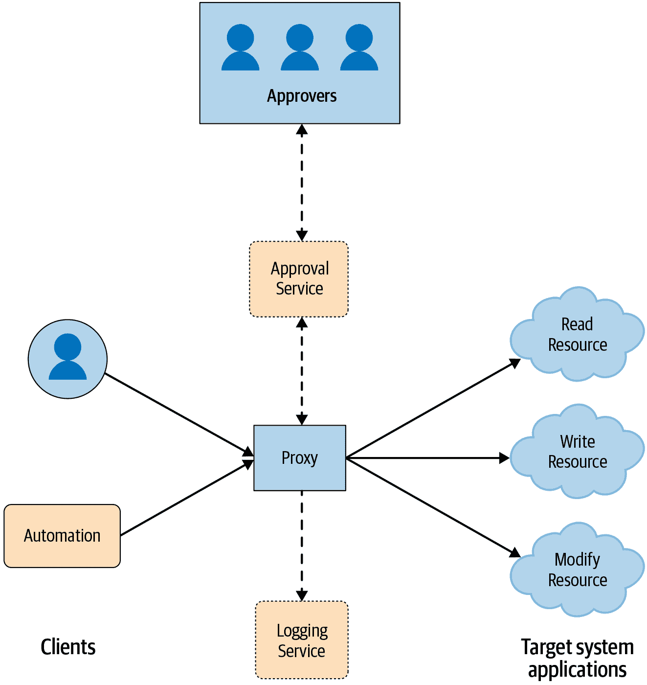
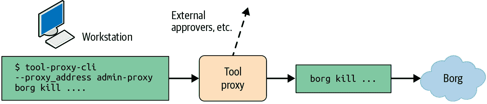

# 第三章：案例研究：安全代理

> 原文：[3. Case Study: Safe Proxies](https://google.github.io/building-secure-and-reliable-systems/raw/ch03.html)
> 
> 译者：[飞龙](https://github.com/wizardforcel)
> 
> 协议：[CC BY-NC-SA 4.0](https://creativecommons.org/licenses/by-nc-sa/4.0/)


作者：Jakub Warmuz 和 Ana Oprea

与 Thomas Maufer，Susanne Landers，Roxana Loza，Paul Blankinship 和 Betsy Beyer 一起

# 生产环境中的安全代理

总的来说，代理提供了一种解决新的可靠性和安全性要求的方法，而无需对已部署的系统进行重大更改。您可以简单地使用代理来路由本来直接到达系统的连接。代理还可以包括控件，以满足您的新安全性和可靠性要求。在本案例研究中，我们将研究谷歌使用的一组*安全代理*，以限制特权管理员在生产环境中意外或恶意引起问题的能力。

安全代理是一个框架，允许授权人员访问或修改物理服务器、虚拟机或特定应用程序的状态。在谷歌，我们使用安全代理来审查、批准和运行风险命令，而无需与系统建立 SSH 连接。使用这些代理，我们可以授予细粒度的访问权限以调试问题，或者可以限制机器重新启动的速率。安全代理代表网络之间的单个入口点，并且是使我们能够执行以下操作的关键工具：

+   审计舰队中的每个操作

+   控制对资源的访问

+   保护生产环境免受人为错误的影响

[Zero Touch Prod](https://oreil.ly/_4rAo)是谷歌的一个项目，要求所有生产中的更改都由自动化（而不是人类）进行，经过软件预验证，或者通过经过审计的紧急机制触发。¹ 安全代理是我们用来实现这些原则的一组工具。我们估计，谷歌评估的所有故障中约 13%可以通过 Zero Touch Prod 预防或减轻。

在安全代理模型中，显示在图 3-1 中，客户端与目标系统直接交流，而是与代理交流。在谷歌，我们通过限制目标系统仅接受代理的调用来强制执行此行为。此配置指定了通过访问控制列表（ACL）可以由哪些客户端角色执行哪些应用层远程过程调用（RPC）。检查访问权限后，代理将请求发送到目标系统以通过 RPC 执行。通常，每个目标系统都有一个应用层程序，该程序接收请求并直接在系统上执行。代理记录与其交互的所有请求和命令。

我们发现使用代理来管理系统有多个好处，无论客户是人类、自动化还是两者兼而有之。代理提供以下功能：

+   强制执行多方授权（MPA）的中心点，²我们为与敏感数据交互的请求做出访问决策

+   管理使用审计，我们可以跟踪特定请求的执行时间和执行者

+   速率限制，例如系统重新启动逐渐生效，并且我们可能限制错误的影响范围

+   与闭源第三方目标系统兼容，我们通过代理的附加功能控制组件的行为（我们无法修改）

+   持续改进集成，我们在中央代理点添加安全性和可靠性增强功能



###### 图 3-1：安全代理模型

代理也有一些缺点和潜在的陷阱：

+   成本增加，包括维护和运营开销。

+   单点故障，如果系统本身或其依赖项之一不可用。我们通过运行多个实例来减轻这种情况，以增加冗余性。我们确保我们系统的所有依赖项都具有可接受的服务级别协议（SLA），并且每个依赖项的运营团队都有记录的紧急联系人。

+   访问控制的策略配置本身可能是错误的来源。我们通过提供模板或自动生成默认安全设置来引导用户做出正确的选择。在创建这样的模板或自动化时，我们遵循[第 II 部分](part02.html#designing_systems)中提出的设计策略。

+   对手可能控制的中央机器。上述策略配置要求系统转发客户端的身份并代表客户端执行任何操作。代理本身并不赋予高权限，因为没有请求是在代理角色下执行的。

+   对变化的抵抗，因为用户可能希望直接连接到生产系统。为了减少代理施加的摩擦，我们与工程师密切合作，确保他们在紧急情况下可以通过紧急机制访问系统。我们将在第二十一章中更详细地讨论这些话题。

由于安全代理的主要用例是添加与访问控制相关的安全性和可靠性功能，因此代理公开的接口应使用与目标系统相同的外部 API。因此，代理不会影响整体用户体验。假设安全代理是透明的，它可以在执行一些预处理和后处理进行验证和日志记录后简单地转发流量。下一节将讨论我们在谷歌使用的安全代理的一个具体实例。

# 谷歌工具代理

谷歌员工使用[命令行界面（CLI）](https://oreil.ly/7qk8Q)工具执行大部分管理操作。其中一些工具可能很危险，例如，某些工具可以关闭服务器。如果这样的工具指定了不正确的范围选择器，命令行调用可能会意外地停止几个服务前端，导致中断。跟踪每个 CLI 工具，确保它执行集中式日志记录，并确保敏感操作有进一步的保护将是困难且昂贵的。为了解决这个问题，谷歌创建了一个*工具代理*：一个公开通用 RPC 方法的二进制文件，通过 fork 和 exec 内部执行指定的命令行。所有调用都受到策略的控制，用于审计的日志记录，并具有要求 MPA 的能力。

使用工具代理实现了零接触生产的主要目标之一：通过不允许人员直接访问生产使生产更安全。工程师无法直接在服务器上运行任意命令；他们需要通过工具代理进行联系。

我们通过使用一组细粒度的策略来配置谁被允许执行哪些操作，这些策略执行 RPC 方法的授权。示例 3-1 中的策略允许`group:admin`的成员在`group:admin-leads`中的某人批准命令后运行`borg` CLI 的最新版本以及任何参数。工具代理实例通常作为 Borg 作业部署。

##### 示例 3-1. 谷歌工具代理 Borg 策略

```go
config = {
  proxy_role = 'admin-proxy'
  tools = {
    borg = {
      mpm = 'client@live'
      binary_in_mpm = 'borg'
      any_command = true
      allow = ['group:admin']
      require_mpa_approval_from = ['group:admin-leads']
      unit_tests = [{
        expected = 'ALLOW'
        command = 'file.borgcfg up'
      }]
    }
  }
}
```

示例 3-1 中的策略允许工程师通过类似以下命令来从他们的工作站停止生产中的 Borg 作业：

```go
$ tool-proxy-cli --proxy_address admin-proxy borg kill ...
```

该命令向指定地址的代理发送 RPC，这将启动以下事件链，如图 3-2 所示：

1.  代理记录所有 RPC 和执行的检查，提供了审计先前运行的管理操作的简单方法。

1.  代理检查策略，以确保调用者在`group:admin`中。

1.  由于这是一个敏感命令，MPA 被触发，代理等待`group:admin-leads`中的人员授权。

1.  如果获得批准，代理执行命令，等待结果，并将返回代码、stdout 和 stderr 附加到 RPC 响应。



###### 图 3-2：工具代理使用工作流程

工具代理需要对开发工作流程进行小的更改：工程师需要在他们的命令前加上 `tool-proxy-cli --proxy_address`。为了确保特权用户不会规避代理，我们修改了服务器，只允许对 `admin-proxy` 进行管理操作，并在非紧急情况下拒绝任何直接连接。

# 结论

使用安全代理是向系统添加日志记录和多方授权的一种方式。代理可以帮助使您的系统更安全、更可靠。这种方法可以是现有系统的一种经济有效的选择，但如果与[第二部分](part02.html#designing_systems)中描述的其他设计原则配对使用，将会更加强大。正如我们在第四章中讨论的那样，如果您正在启动一个新项目，最好使用与日志记录和访问控制模块集成的框架来构建系统架构。

¹ 紧急情况机制是一种可以绕过策略以允许工程师快速解决故障的机制。参见[“紧急情况”](ch05.html#breakglass)。

² 多方授权要求在允许操作发生之前，需要额外的用户批准。参见[“多方授权（MPA）”](ch05.html#multi_party_authorization_left_parenthe)。
