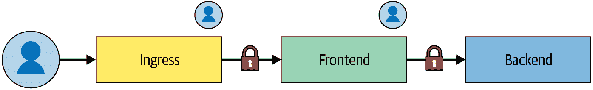
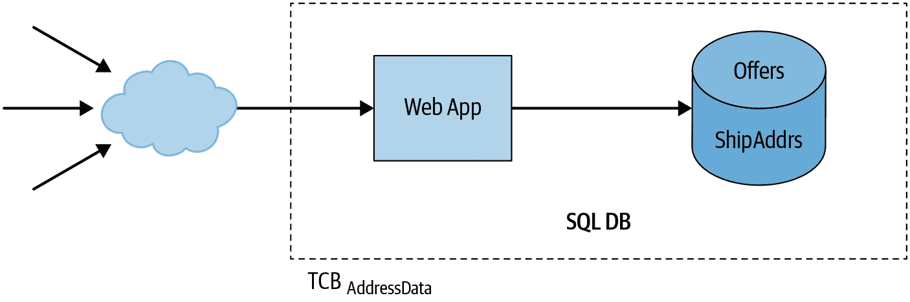
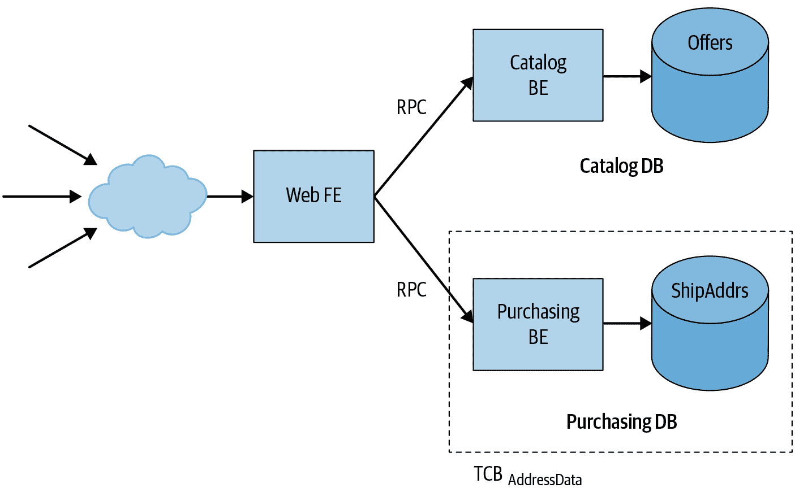
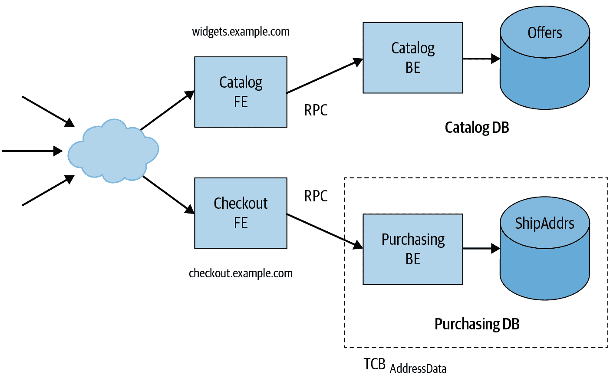

# 第六章：面向可理解性的设计

> 原文：[6. Design for Understandability](https://google.github.io/building-secure-and-reliable-systems/raw/ch06.html)
> 
> 译者：[飞龙](https://github.com/wizardforcel)
> 
> 协议：[CC BY-NC-SA 4.0](https://creativecommons.org/licenses/by-nc-sa/4.0/)

由 Julien Boeuf‎、Christoph Kern‎和 John Reese‎

与 Guy Fischman、Paul Blankinship、Aleksandra Culver、Sergey Simakov、Peter Valchev 和 Douglas Colish 一起

为了本书的目的，我们将系统的“可理解性”定义为具有相关技术背景的人能够准确自信地推理以下两点的程度：

+   系统的操作行为

+   系统的不变性，包括安全性和可用性

# 为什么可理解性很重要？

设计一个可理解的系统，并在一段时间内保持其可理解性，需要努力。一般来说，这种努力是一种投资，以持续的项目速度回报（如第四章中所讨论的）。更具体地说，可理解的系统具有具体的好处：

降低安全漏洞或韧性故障的可能性

无论何时您修改系统或软件组件，例如添加功能，修复错误或更改配置，都存在您可能会意外引入新的安全漏洞或损害系统操作韧性的风险。系统越不易理解，修改它的工程师犯错的可能性就越大。该工程师可能会误解系统的现有行为，或者可能不知道与更改冲突的隐藏、隐含或未记录的要求。

促进有效的事故响应

在事故发生时，响应者能够快速准确地评估损害，控制事故，并确定和纠正根本原因至关重要。一个复杂、难以理解的系统显著阻碍了这一过程。

增加对系统安全状况的断言的信心

关于系统安全性的断言通常以“不变性”来表达：系统的所有可能行为都必须满足的属性。这包括系统对其外部环境的意外交互的响应，例如，当系统接收到格式错误或恶意制作的输入时。换句话说，系统对恶意输入的响应不得违反所需的安全属性。在难以理解的系统中，很难或有时不可能以高度自信来验证这样的断言是否成立。测试通常不足以证明“对于所有可能的行为”属性成立——测试通常只对系统进行了相对较小比例的行为的练习，这些行为对应于典型或预期的操作。¹ 您通常需要依赖对系统的抽象推理来建立这样的属性作为不变性。

## 系统不变性

*系统不变性*是一个属性，无论系统的环境如何行为或不当行为，它始终为真。系统*完全负责*确保所需的属性实际上是不变的，即使系统的环境以任意意外或恶意的方式行为不当。该环境包括您无法直接控制的一切，从用恶意制作的请求击中您的服务前端的恶意用户到导致随机崩溃的硬件故障。分析系统的主要目标之一是确定特定所需属性是否实际上是不变的。

以下是系统所需的一些安全性和可靠性属性的一些示例：

+   只有经过身份验证并得到适当授权的用户才能访问系统的持久数据存储。

+   系统的持久数据存储中对敏感数据的所有操作都根据系统的审计政策记录在审计日志中。

+   系统信任边界之外接收到的所有值在传递给易受注入漏洞的 API（例如 SQL 查询 API 或用于构建 HTML 标记的 API）之前都经过适当的验证或编码。

+   系统后端接收到的查询数量与系统前端接收到的查询数量成比例增长。

+   如果系统后端在预定时间后未能响应查询，系统前端将[优雅地降级](https://oreil.ly/bLTJN)，例如通过返回一个近似答案。

+   当任何组件的负载大于该组件可以处理的负载时，为了减少级联故障的风险，该组件将提供[超载错误](https://oreil.ly/7eJtF)而不是崩溃。

+   系统只能从一组指定系统接收 RPC，并且只能向一组指定系统发送 RPC。

如果您的系统允许违反所需安全属性的行为，换句话说，如果所述属性实际上不是不变的，那么系统就存在安全弱点或漏洞。例如，想象一下，列表中的属性 1 对于您的系统来说并不成立，因为请求处理程序缺少访问检查，或者因为这些检查实现不正确。现在您的系统存在安全漏洞，可能允许攻击者访问用户的私人数据。

同样，假设您的系统不满足第四个属性：在某些情况下，系统为每个传入的前端请求生成过多的后端请求。例如，也许前端如果后端请求失败或花费太长时间会快速生成多个重试（并且没有适当的退避机制）。您的系统存在潜在的可用性弱点：一旦系统达到这种状态，其前端可能会完全压倒后端并使服务无响应，形成一种自我造成的拒绝服务场景。

## 分析不变量

在分析系统是否满足给定的不变量时，存在违反该不变量可能造成的潜在危害与您花费在满足不变量和验证其实际成立的努力之间的权衡。在这个光谱的一端，这种努力可能涉及运行一些测试并阅读源代码的部分，以寻找可能导致违反不变量的错误，例如遗忘的访问检查。这种方法并不能带来特别高的信心。很可能，许多情况下未经测试或深入代码审查的行为将存在错误。值得注意的是，像 SQL 注入、跨站脚本（XSS）和缓冲区溢出等众所周知的常见软件漏洞类别一直在“顶级漏洞”列表中保持领先地位。[2] 缺乏证据并不意味着证据的缺失。

另一方面，您可能会进行基于可证明的合理形式推理的分析：系统和所声称的属性在一个正式逻辑中建模，并且您构建一个逻辑证明（通常在自动证明助手的帮助下），证明该属性对系统成立。[3] 这种方法很困难，需要大量工作。例如，迄今为止最大的软件验证项目之一构建了一个[证明](https://oreil.ly/qxVk2)，证明了微内核实现在机器代码级别的全面正确性和安全性属性；该项目大约耗费了 20 人年的工作。[4] 尽管形式验证在某些情况下正在变得实用，比如微内核或复杂的加密库代码，[5] 但对于大规模应用软件开发项目来说通常是不可行的。

本章旨在提出一个实用的中间立场。通过设计一个明确的可理解性目标的系统，您可以支持有原则的（但仍然是非正式的）论证，即系统具有某些不变量，并且在合理的努力下对这些断言有相当高的信心。在谷歌，我们发现这种方法对大规模软件开发非常实用，并且在减少常见漏洞发生方面非常有效。有关测试和验证的更多讨论，请参见第十三章。

## 心理模型

高度复杂的系统对人类来说很难以整体方式进行推理。在实践中，工程师和主题专家经常构建解释系统相关行为的心理模型，同时忽略不相关的细节。对于复杂系统，您可能构建多个相互补充的心理模型。这样，当思考给定系统或子系统的行为或不变量时，您可以抽象出其周围和底层组件的细节，而代之以它们各自的心理模型。

心理模型很有用，因为它们简化了对复杂系统的推理。出于同样的原因，心理模型也是有限的。如果您根据系统在典型操作条件下的经验形成了心理模型，那么该模型可能无法预测系统在不寻常情况下的行为。在很大程度上，安全性和可靠性工程关注的是在这些不寻常条件下分析系统，例如当系统处于主动攻击、过载或组件故障场景时。

考虑一个系统，其吞吐量通常会随着传入请求的速率可预测地逐渐增加。然而，在某个负载阈值之上，系统可能会达到一个状态，其响应方式截然不同。例如，内存压力可能导致在虚拟内存或堆/垃圾收集器级别出现抖动，使系统无法跟上额外负载。太多的额外负载甚至可能导致*减少*吞吐量。在这种状态下排除系统故障时，除非您明确意识到该模型不再适用，否则您可能会被系统的过度简化心理模型误导。

在设计系统时，考虑软件、安全和可靠性工程师不可避免地会为自己构建的心理模型是很有价值的。在设计要添加到较大系统中的新组件时，理想情况下，其自然形成的心理模型应与人们为类似的现有子系统形成的心理模型一致。

在可能的情况下，您还应设计系统，使其心理模型在系统在极端或不寻常条件下运行时仍然具有预测性和实用性。例如，为了避免抖动，您可以配置生产服务器在没有磁盘虚拟内存交换空间的情况下运行。如果生产服务无法分配所需的内存来响应请求，它可以以可预测的方式快速返回错误。即使有错误或行为不端的服务无法处理内存分配失败并崩溃，您至少可以清楚地将故障归因于潜在问题——在这种情况下是内存压力；这样，观察系统的人的心理模型仍然是有用的。

# 设计可理解的系统

本章的其余部分讨论了一些具体措施，可以使系统更易理解，并在系统随时间演变时保持其可理解性。我们将首先考虑复杂性问题。

## 复杂性与可理解性

可理解性的主要敌人是*未受控制的复杂性*。

由于现代软件系统的规模（尤其是分布式系统）及其解决的问题，某种程度的复杂性通常是内在的和不可避免的。例如，谷歌雇佣了数万名工程师，他们在一个包含超过 10 亿行代码的源代码库中工作。这些代码共同实现了大量的用户服务以及支持它们的后端和数据管道。即使是只提供单一产品的较小组织，也可能在数十万行代码中实现数百个功能和用户故事，由数十甚至数百名工程师编辑。

让我们以 Gmail 为例，这是一个具有重要内在特性复杂性的系统。你可以简要总结 Gmail 为基于云的电子邮件服务，但这一概括掩盖了它的复杂性。在其众多功能中，Gmail 提供以下功能：

+   多个前端和用户界面（桌面 Web、移动 Web、移动应用）

+   允许第三方开发人员开发附加组件的几个 API

+   入站和出站 IMAP 和 POP 接口

+   与云存储服务集成的附件处理

+   以多种格式呈现附件，如文档和电子表格

+   离线可用的 Web 客户端和底层同步基础设施

+   垃圾邮件过滤

+   自动消息分类

+   用于提取关于航班、日历事件等结构化信息的系统

+   拼写纠正

+   智能回复和智能撰写

+   提醒回复消息

具有这些功能的系统本质上比没有这些功能的系统更复杂，但我们不能告诉 Gmail 的产品经理这些功能增加了太多复杂性，并要求他们出于安全性和可靠性的考虑将其删除。毕竟，这些功能提供了价值，并在很大程度上定义了 Gmail 作为产品。但如果我们努力管理这种复杂性，系统仍然可以足够安全和可靠。

如前所述，可理解性与系统和子系统的特定行为和属性相关。我们的目标必须是构建系统设计，以便以一种允许人类高度准确地推理这些*特定、相关系统属性和行为*的方式来分隔和包含这种内在复杂性。换句话说，我们必须特别管理妨碍可理解性的复杂性方面。

当然，说起来容易做起来难。本节的其余部分将探讨未受管理的复杂性的常见来源以及相应的降低可理解性的设计模式，以及可以帮助控制复杂性并使系统更易理解的设计模式。

虽然我们的主要关注点是安全性和可靠性，但我们讨论的模式在很大程度上并不特定于这两个领域，它们与旨在管理复杂性和促进可理解性的一般软件设计技术非常一致。你可能还想参考有关系统和软件设计的一般文本，如约翰·奥斯特豪特的《软件设计哲学》（Yaknyam Press，2018）。

## 分解复杂性

要理解复杂系统行为的所有方面，你需要内化并维护一个庞大的心智模型。人类在这方面并不擅长。

通过由较小的组件组合而成，可以使系统更易理解。你应该能够独立地推理每个组件，并以这样的方式组合它们，以便从组件属性推导出整个系统的属性。这种方法使你能够建立整个系统的不变性，而无需一次性考虑整个系统。

这种方法在实践中并不简单。您能够建立子系统的属性，并将子系统的属性组合成系统范围的属性，取决于整个系统如何被结构化为组件以及这些组件之间的接口和信任关系的性质。我们将在“系统架构”中讨论这些关系和相关考虑。

## 集中负责安全和可靠性要求

如第四章所述，安全和可靠性要求通常横跨系统的所有组件。例如，安全要求可能规定，对于响应用户请求执行的任何操作，系统必须完成一些常见任务（例如审计日志记录和操作指标收集）或检查某些条件（例如身份验证和授权）。

如果每个单独的组件都负责独立实现常见任务和检查，很难确定最终系统是否真正满足要求。您可以通过将常见功能的责任移交给集中组件（通常是库或框架）来改进这种设计。例如，RPC 服务框架可以确保系统根据为整个服务集中定义的策略为每个 RPC 方法实现身份验证、授权和日志记录。有了这种设计，单个服务方法不再负责这些安全功能，应用程序开发人员也不会忘记实现它们或者实现不正确。此外，安全审阅者可以理解服务的身份验证和授权控制，而无需阅读每个单独的服务方法实现。相反，审阅者只需理解框架并检查特定于服务的配置。

再举一个例子：为了防止负载下的级联故障，传入请求应该受到超时和截止日期的限制。任何重试由于过载引起的故障的逻辑都应受到严格的安全机制的约束。为了实现这些策略，您可能依赖应用程序或服务代码来配置子请求的截止日期并适当处理故障。单个应用程序中任何相关代码的错误或遗漏都可能导致整个系统的可靠性弱点。通过在底层 RPC 服务框架中包含支持自动截止日期传播和请求取消的集中处理机制，您可以使系统更加健壮和可理解。⁷

这些例子突出了集中负责安全和可靠性要求的两个好处：

提高系统的可理解性

审阅者只需查看一个地方，就能理解和验证安全/可靠性要求是否正确实现。

增加最终系统实际正确的可能性

这种方法消除了应用代码中对要求的临时实现不正确或缺失的可能性。

虽然在构建和验证应用程序框架或库的集中实现时存在前期成本，但这些成本可以分摊到基于该框架构建的所有应用程序中。

# 系统架构

将系统结构化为层和组件是管理复杂性的关键工具。使用这种方法，您可以按块来思考系统，而不必一次性理解整个系统的每个细节。

您还需要仔细考虑如何将系统分解为组件和层。过于紧密耦合的组件和层与单片系统一样难以理解。要使系统可理解，您必须像关注组件本身一样关注组件之间的边界和接口。

有经验的软件开发人员通常知道系统必须将来自外部环境的输入（和交互序列）视为不可信，并且系统不能对这些输入做出假设。相比之下，很容易将内部、较低层 API 的调用者（如进程内服务对象的 API 或内部后端微服务暴露的 RPC）视为可信任，并依赖这些调用者遵守 API 使用的文档约束。

假设系统的安全属性取决于内部组件的正确操作。另外，假设其正确操作又取决于组件 API 的调用者确保的前提条件，比如操作的正确顺序，或者方法参数的值的约束。确定系统是否实际具有所需的属性不仅需要理解 API 的实现，还需要理解整个系统中 API 的每个调用点，以及每个调用点是否确保了所需的前提条件。

组件对其调用者做出的假设越少，就越容易独立推理该组件。理想情况下，组件对其调用者不做任何假设。

如果组件被迫对其调用者做出假设，重要的是要在接口设计中明确捕获这些假设，或者在环境的其他约束中明确捕获这些假设，例如限制可以与组件交互的主体集。

## 可理解的接口规范

结构化接口、一致的对象模型和幂等操作有助于系统的可理解性。如下节所述，这些考虑因素使得更容易预测输出行为以及接口之间的交互方式。

### 更喜欢提供较少解释空间的窄接口

服务可以使用许多不同的模型和框架来公开接口。举几个例子：

+   带有 OpenAPI 的 RESTful HTTP 和 JSON

+   gRPC

+   Thrift

+   W3C Web Services（XML/WSDL/SOAP）

+   CORBA

+   DCOM

其中一些模型非常灵活，而其他模型提供更多结构。例如，使用 gRPC 或 Thrift 的服务定义了它支持的每个 RPC 方法的名称，以及该方法的输入和输出类型。相比之下，自由格式的 RESTful 服务可能接受任何 HTTP 请求，而应用代码验证请求体是否为具有预期结构的 JSON 对象。

支持用户定义类型的框架（如 gRPC、Thrift 和 OpenAPI）使得更容易创建工具，用于增强 API 表面的可发现性和可理解性，比如交叉引用和一致性检查。这些框架通常也允许 API 表面随着时间的推移更安全地演化。例如，OpenAPI 具有 API 版本控制作为内置功能。用于声明 gRPC 接口的协议缓冲区有关如何更新消息定义以保持向后兼容性的[详细文档指南](https://oreil.ly/yRUQ3)。

相比之下，基于自由格式 JSON 字符串构建的 API 在不检查其实现代码和核心业务逻辑的情况下可能难以理解。这种无约束的方法可能导致安全或可靠性事件。例如，如果客户端和服务器独立更新，它们可能以不同方式解释 RPC 有效负载，这可能导致其中一个崩溃。

缺乏明确的 API 规范也使得评估服务的安全姿态变得困难。例如，除非您可以访问 API 定义，否则很难构建一个自动安全审计系统，将授权框架（如[Istio 授权策略](https://oreil.ly/DjOpK)中描述的策略与服务实际暴露的表面积相关联。

### 优先选择强制实现通用对象模型的接口

管理多种类型资源的系统可以从一个通用的对象模型中受益，比如[Kubernetes](https://oreil.ly/AtXnp)使用的模型。通用对象模型让工程师可以使用单一的思维模型来理解系统的大部分内容，而不是单独处理每种资源类型。例如：

+   系统中的每个对象都可以保证满足一组预定义的基本属性（不变量）。

+   系统可以提供标准的方式来范围、注释、引用和分组所有类型的对象。

+   操作可以在所有类型的对象上具有一致的行为。

+   工程师可以创建自定义对象类型来支持他们的用例，并且可以使用与内置类型相同的思维模型来推理这些对象类型。

Google 提供了关于设计面向资源的 API 的[一般指南](https://oreil.ly/AyMVP)。

### 注意幂等操作

幂等操作在多次应用时会产生相同的结果。例如，如果一个人在电梯里按下二楼的按钮，电梯每次都会到达二楼。再次按下按钮，甚至多次按下，都不会改变结果。

在分布式系统中，幂等性很重要，因为操作可能以无序的方式到达，或者服务器在完成操作后的响应可能永远不会到达客户端。如果一个 API 方法是幂等的，客户端可以重试操作，直到收到成功的结果。如果一个方法不是幂等的，系统可能需要使用次要方法，比如轮询服务器来查看新创建的对象是否已经存在。

幂等性也会影响工程师的思维模型。API 的实际行为与预期行为之间的不匹配可能导致不可靠或不正确的结果。例如，假设客户端想要向数据库添加一条记录。虽然请求成功，但由于连接重置，响应未被传递。如果客户端代码的作者认为该操作是幂等的，客户端很可能会重试该请求。但如果操作实际上不是幂等的，系统将创建一个重复的记录。

虽然非幂等操作可能是必要的，但幂等操作通常会导致更简单的思维模型。当操作是幂等的时，工程师（包括开发人员和事件响应者）不需要跟踪操作何时开始；他们可以简单地不断尝试操作，直到知道它成功为止。

一些操作自然是幂等的，通过重新构造其他操作也可以使其成为幂等。在前面的例子中，数据库可以要求客户端在每次变异的 RPC 中包含一个唯一标识符（例如 UUID）。如果服务器收到具有相同唯一标识符的第二次变异，它就知道该操作是重复的，并可以相应地做出响应。

## 可理解的身份、认证和访问控制

任何系统都应该能够确定谁有权访问哪些资源，特别是如果这些资源非常敏感。例如，支付系统的审计员需要了解哪些内部人员可以访问客户的个人身份信息。通常，系统具有授权和访问控制策略，限制特定实体在特定上下文中对特定资源的访问——在这种情况下，策略将限制员工在处理信用卡时对 PII 数据的访问。当发生这种特定访问时，审计框架可以记录访问。稍后，您可以自动分析访问日志，作为例行检查的一部分，或作为事故调查的一部分。

### 身份

*身份*是与实体相关的属性或标识符集合。*凭证*断言了特定实体的身份。凭证可以采用不同的形式，例如简单密码、X.509 证书或 OAuth2 令牌。凭证通常使用定义好的*认证协议*发送，访问控制系统用于识别访问资源的实体。识别实体并选择一个用于识别它们的模型可能是复杂的。虽然系统识别人类实体（包括客户和管理员）相对容易，但大型系统需要能够识别所有实体，而不仅仅是人类实体。

大型系统通常由一系列相互调用的微服务组成，无论是否涉及人类。例如，数据库服务可能希望定期快照到较低级别的磁盘服务。这个磁盘服务可能需要调用配额服务，以确保数据库服务有足够的磁盘配额来存储需要快照的数据。或者，考虑一个客户对食品订购前端服务进行身份验证。前端服务调用后端服务，后端服务再调用数据库来检索客户的食品偏好。一般来说，*活动实体*是系统中相互交互的人类、软件组件和硬件组件的集合。

###### 注意

传统的网络安全实践有时使用 IP 地址作为访问控制和日志记录和审计（例如防火墙规则）的主要标识符。不幸的是，在现代微服务系统中，IP 地址存在许多缺点。因为它们缺乏稳定性和安全性（并且很容易被伪造），IP 地址简单地不能提供一个适当的标识符来识别服务并模拟它们在系统中的特权级别。首先，微服务部署在主机池上，多个服务托管在同一主机上。端口并不提供一个强大的标识符，因为它们可以随着时间的推移被重复使用，或者更糟糕的是，由运行在主机上的不同服务任意选择。一个微服务也可能为在不同主机上运行的不同实例提供服务，这意味着您不能使用 IP 地址作为稳定的标识符。

访问控制和审计机制的质量取决于系统中使用的身份的相关性和它们的信任关系。在系统中为所有活动实体附加有意义的标识符是理解能力的基本步骤，无论是在安全性还是可靠性方面。在安全性方面，标识符帮助您确定谁可以访问什么。在可靠性方面，标识符帮助您规划和执行共享资源的使用，如 CPU、内存和网络带宽。

组织范围的身份系统强化了共同的心智模型，意味着整个员工队伍在提及实体时可以使用相同的语言。对于相同类型的实体存在竞争性的身份系统，例如全球和本地实体的共存系统，会使工程师和审计员的理解变得不必要复杂。

类似于第四章中小部件订购示例中的外部支付处理服务，公司可以将其身份子系统外部化。[OpenID Connect（OIDC）](https://openid.net/connect)提供了一个框架，允许特定提供者断言身份。组织只需配置接受哪些提供者，而不是实现自己的身份子系统。然而，与所有依赖关系一样，这里需要考虑一个权衡——在这种情况下，是这种模型的简单性还是受信任提供者的感知安全性和可靠性的稳健性之间的权衡。

#### 示例：谷歌生产系统的身份模型

谷歌通过使用不同类型的活动实体来建模身份：

管理员

人类（谷歌工程师）可以采取行动改变系统的状态，例如推送新版本或修改配置。

机器

谷歌数据中心的物理机器。这些机器运行实现我们服务的程序（如 Gmail），以及系统本身需要的服务（例如内部时间服务）。

工作负载

这些实体由类似于 Kubernetes 的 Borg 编排系统在机器上调度。大多数情况下，工作负载的身份与其运行的机器的身份不同。

客户

谷歌客户访问由谷歌提供的服务。

*管理员*是生产系统内所有交互的基础。在工作负载之间的交互中，管理员可能不会主动修改系统的状态，但他们在引导阶段启动工作负载的行为（可能会启动另一个工作负载）。

如第五章中所述，您可以使用审计来追溯所有操作到管理员（或一组管理员），以便建立责任和分析特定员工的特权级别。管理员和他们管理的实体的有意义的身份使审计成为可能。

管理员由全局目录服务集成的单点登录管理。全局组管理系统可以将管理员分组以代表团队的概念。

*机器*在全局库存服务/机器数据库中进行分类。在谷歌生产网络上，可以使用 DNS 名称寻址机器。我们还需要将机器身份与管理员联系起来，以表示谁可以修改机器上运行的软件。实际上，我们通常将发布机器软件镜像的组与可以以 root 身份登录到机器的组合在一起。

谷歌数据中心的每台生产机器都有一个身份。*身份*指的是机器的典型用途。例如，专用于测试的实验室机器与运行生产工作负载的机器具有不同的身份。运行机器上的核心应用程序的机器管理守护程序引用此身份。

*工作负载*使用编排框架在机器上调度。每个工作负载都有一个由请求者选择的身份。编排系统负责确保发出请求的实体有权发出请求，特别是请求者有权以所请求的身份调度运行工作负载。编排系统还对工作负载可以调度到哪些机器施加约束。工作负载本身可以执行组管理等管理任务，但不应具有底层机器的根或管理员权限。

*客户*身份也有一个专门的身份子系统。在内部，每当服务代表客户执行操作时，这些身份都会被使用。*访问控制*解释了客户身份如何与工作负载身份协调工作。在外部，Google 提供[OpenID Connect 工作流程](https://oreil.ly/vxJAP)允许客户使用其 Google 身份对不受 Google 控制的端点（例如*zoom.us*）进行身份验证。

### 身份验证和传输安全

身份验证和传输安全是复杂的学科，需要对诸如密码学、协议设计和操作系统等领域有专门的知识。不合理地期望每个工程师都深入了解所有这些主题。

相反，工程师应该能够理解抽象和 API。像 Google 的[应用层传输安全（ALTS）](https://oreil.ly/EsBfd)这样的系统为应用程序提供了自动的服务对服务身份验证和传输安全。这样，应用程序开发人员就不需要担心凭据是如何配置的，或者用于在连接上保护数据的具体加密算法是什么。

应用程序开发人员的心智模型很简单：

+   应用程序以有意义的身份运行：

+   管理员工作站上的工具通常以管理员的身份运行，用于访问生产环境。

+   机器上的特权进程通常以该机器的身份运行。

+   使用编排框架将应用程序部署为工作负载，通常以特定于环境和服务提供的工作负载身份运行（例如*myservice-frontend-prod*）。

+   ALTS 提供了零配置的传输安全。

+   常见访问控制框架的 API 检索经过身份验证的对等信息。

ALTS 和类似系统（例如[Istio 的安全模型](https://oreil.ly/17Jm6)）以可理解的方式提供身份验证和传输安全。

除非基础设施的应用程序间安全姿态采用系统化的方法，否则很难或不可能进行推理。例如，假设应用程序开发人员必须就要使用的凭据类型以及这些凭据将断言的工作负载身份做出个别选择。要验证应用程序是否正确执行身份验证，审计员需要手动阅读所有应用程序的代码。这种方法对安全性来说是不好的——它不具备可扩展性，而且代码的某部分很可能是未经审计或不正确的。

### 访问控制

使用框架对传入服务请求的访问控制策略进行编码和强制执行对于全局系统的可理解性是一个净利益。框架强化了共同的知识，并提供了一种统一的描述策略的方式，因此是工程师工具包的重要组成部分。

框架可以处理固有复杂的交互，例如在工作负载之间传输数据涉及的多个身份。例如，图 6-1 显示了以下内容：

+   作为三个身份运行的工作负载链：*Ingress*、*Frontend*和*Backend*

+   进行请求的经过身份验证的客户

###### 图 6-1：工作负载之间传输数据涉及的交互

对于链中的每个链接，框架必须能够确定是工作负载还是客户是请求的权威。策略还必须足够表达性，以便它决定允许哪个工作负载身份代表客户检索数据。

具备一种统一的方式来捕获这种固有复杂性，大多数工程师都能理解这些控制。如果每个服务团队都有自己的临时系统来处理相同的复杂用例，理解起来将是一个挑战。

框架规定了在指定和应用声明式访问控制策略方面的一致性。这种声明式和统一的性质使工程师能够开发工具来评估基础设施中服务和用户数据的安全风险。如果访问控制逻辑是以自发方式在应用程序代码级别实现的，开发这种工具基本上是不可能的。

## 深入探讨：安全边界

系统的*可信计算基础*（TCB）是“足以确保执行安全策略的一组组件（硬件、软件、人员等）的正确功能，或者更生动地说，其失败可能导致安全策略的违反。”。因此，TCB 必须维护安全策略，即使 TCB 之外的任何实体以任意可能恶意的方式行为不端。当然，TCB 之外的区域包括您系统的外部环境（例如互联网上某处的恶意行为者），但这个区域*也*包括不在 TCB 内的您自己系统的部分。

TCB 与“其他一切”之间的接口被称为*安全边界*。“其他一切”——系统的其他部分、外部环境、通过网络与其交互的系统客户端等——通过跨越这个边界进行通信与 TCB 交互。这种通信可能以进程间通信通道、网络数据包和建立在这些基础上的更高级协议的形式进行（如 gRPC）。TCB 必须对跨越安全边界的任何东西持怀疑态度——包括数据本身和其他方面，如消息排序。

构成 TCB 的系统部分取决于您所考虑的安全策略。思考安全策略及其必要的 TCB 在层面上维护的相关性可能是有用的。例如，操作系统的安全模型通常具有“用户身份”的概念，并提供规定在不同用户下运行的进程之间分离的安全策略。在类 Unix 系统中，运行在用户 A 下的进程不应能够查看或修改属于不同用户 B 的进程的内存或网络流量。在软件级别上，确保这一属性的 TCB 基本上由操作系统内核和所有特权进程和系统守护程序组成。反过来，操作系统通常依赖于底层硬件提供的机制，如虚拟内存。这些机制包括在与 OS 级用户之间的分离相关的安全策略的 TCB 中。

网络应用服务器的软件（例如，公开 Web 应用程序或 API 的服务器）*不*是此操作系统级安全策略的 TCB 的一部分，因为它在非特权的操作系统级角色（例如*httpd*用户）下运行。但是，该应用程序可能会强制执行自己的安全策略。例如，假设一个多用户应用程序具有安全策略，只能通过显式文档共享控件访问用户数据。在这种情况下，应用程序的代码（或其中的部分）*是*与该应用程序级安全策略相关的 TCB 内。

为了确保系统执行所需的安全策略，您必须了解并推理与该安全策略相关的整个 TCB。根据定义，TCB 的任何部分的失败或错误可能导致安全策略的违反。

随着 TCB 扩大以包括更多的代码和复杂性，对 TCB 的推理变得更加困难。因此，将 TCB 保持尽可能小，并排除任何实际上不涉及维护安全策略的组件是有价值的。除了损害可理解性外，将这些不相关的组件包括在 TCB 中还增加了风险：这些组件中的任何错误或故障都可能导致安全漏洞。

让我们重新审视一下第四章中的例子：一个允许用户在线购买小部件的网络应用。应用程序的 UI 结账流程允许用户输入信用卡和送货地址信息。系统存储其中一些信息，并将其他部分（如信用卡数据）传递给第三方支付服务。

我们希望确保只有用户自己可以访问他们自己的敏感用户数据，比如送货地址。我们将使用 TCB[AddressData]来表示这个安全属性的受信任计算基础。

使用许多流行的应用程序框架之一，我们可能会得到一个像图 6-2 的架构。

###### 图 6-2：销售小部件的应用程序的示例架构

在这个设计中，我们的系统由一个整体的网络应用和一个相关的数据库组成。应用可能使用多个模块来实现不同的功能，但它们都是同一个代码库的一部分，整个应用作为一个单一的服务器进程运行。同样，应用将所有数据存储在一个单一的数据库中，服务器的所有部分都可以读取和写入整个数据库。

应用的一部分处理购物车结账和购买，数据库的一些部分存储与购买相关的信息。应用的其他部分处理与购买相关的功能，但它们本身并不依赖于购买功能（例如，管理购物车的内容）。应用的其他部分与购买无关（它们处理诸如浏览小部件目录或阅读和编写产品评论等功能）。由于所有这些功能都是单个服务器的一部分，并且所有这些数据都存储在单个数据库中，整个应用及其依赖项——例如数据库服务器和操作系统内核——都是我们想要提供的安全属性的 TCB 的一部分：执行用户数据访问策略。

风险包括目录搜索代码中的 SQL 注入漏洞，允许攻击者获取敏感用户数据，如姓名或送货地址，或者 Web 应用程序服务器中的远程代码执行漏洞，例如[CVE-2010-1870](https://oreil.ly/y0xRl)，允许攻击者读取或修改应用程序数据库的任何部分。

### 小的 TCB 和强大的安全边界

我们可以通过将应用拆分成微服务来改进设计的安全性。在这种架构中，每个微服务处理应用功能的一个独立部分，并将数据存储在自己的独立数据库中。这些微服务通过 RPC 进行通信，并将所有传入请求视为不一定可信，即使调用者是另一个内部微服务。

使用微服务，我们可以重构应用，如图 6-3 所示。

现在，我们不再有一个整体的服务器，而是有一个网络应用前端和产品目录和与购买相关功能的独立后端。每个后端都有自己独立的数据库。前端从不直接查询数据库；相反，它发送 RPC 到适当的后端。例如，前端查询目录后端以搜索目录中的项目或检索特定项目的详细信息。同样，前端发送 RPC 到购买后端以处理购物车结账流程。正如本章前面讨论的那样，后端微服务和数据库服务器可以依赖工作负载标识和基础设施级身份验证协议，如 ALTS 来验证调用者并限制对授权工作负载的请求。¹³

###### 图 6-3：小部件销售应用程序的示例微服务架构

在这种新的架构中，地址数据安全策略的受信任计算基础要小得多：它仅包括购买后端及其数据库，以及它们的相关依赖项。攻击者不再能够利用目录后端中的漏洞来获取付款数据，因为目录后端根本无法访问该数据。因此，这种设计限制了主要系统组件中漏洞的影响（这是第八章中进一步讨论的主题）。

### 安全边界和威胁模型

受信任的计算基础的大小和形状将取决于您想要保证的安全属性和系统的架构。您不能只是在系统的一个组件周围画一个虚线并称其为 TCB。您必须考虑组件的接口，以及它可能隐含地信任系统的其他部分的方式。

假设我们的应用程序允许用户查看和更新他们的送货地址。由于购买后端处理送货地址，该后端需要公开一个 RPC 方法，允许 Web 前端检索和更新用户的送货地址。

如果购买后端允许前端获取*任何*用户的送货地址，那么入侵 Web 前端的攻击者可以使用此 RPC 方法来访问或修改任何和所有用户的敏感数据。换句话说，如果购买后端比随机第三方更信任 Web 前端，那么 Web 前端就是 TCB 的一部分。

另外，购买后端可以要求前端提供所谓的[*终端用户上下文票证*（EUC）](https://oreil.ly/0WkhS)，以在特定外部用户请求的上下文中对请求进行身份验证。EUC 是由中央认证服务发行的内部短期票证，以外部凭据（例如身份验证 cookie 或与特定请求相关的令牌（例如 OAuth2））交换而来。如果后端只对具有有效 EUC 的请求提供数据，那么入侵前端的攻击者就无法完全访问购买后端，因为他们无法为任意用户获取 EUC。最坏的情况是，他们可能会在攻击期间获取正在使用应用程序的用户的敏感数据。

为了提供另一个例子，说明 TCB 相对于正在考虑的威胁模型的相关性，让我们思考一下这种架构与 Web 平台的安全模型的关系。¹⁴在这个安全模型中，*Web 来源*（服务器的完全合格主机名，加上协议和可选端口）代表一个信任域：在给定来源的上下文中运行的 JavaScript 可以观察或修改该上下文中存在或可用的任何信息。相反，浏览器根据称为*同源策略*的规则限制不同来源之间内容和代码之间的访问。

我们的 Web 前端可能会从单个 Web 来源（例如*https://widgets.example.com*）提供其整个 UI。这意味着，例如，通过目录显示 UI 中的 XSS 漏洞¹⁵注入到我们的来源中的恶意脚本可以访问用户的个人资料，并且甚至可能能够以该用户的名义“购买”物品。因此，在 Web 安全威胁模型中，TCB[AddressData]再次包括整个 Web 前端。

我们可以通过进一步分解系统并建立额外的安全边界来解决这种情况，这种情况是基于 Web 来源的。如图 6-4 所示，我们可以操作两个单独的 Web 前端：一个实现目录搜索和浏览，并在*https://widgets.example.com*提供服务，另一个负责购买配置文件和结账，在*https://checkout.example.com*提供服务。¹⁶ 现在，目录 UI 中的 Web 漏洞（例如 XSS）不能危害支付功能，因为该功能被隔离到其自己的 Web 来源中。

###### 图 6-4：分解 Web 前端

### TCB 和可理解性

除了安全性的好处外，TCB 和安全边界还使系统更容易理解。为了符合 TCB 的资格，组件必须与系统的其余部分隔离。该组件必须具有明确定义的干净接口，并且您必须能够独立地推理 TCB 的实现的正确性。如果组件的正确性取决于该组件控制范围之外的假设，那么它从定义上来说就不是 TCB。

TCB 通常是其自身的故障域，这使得更容易理解应用程序在面对错误、DoS 攻击或其他操作影响时的行为。第八章更深入地讨论了将系统分隔成更多部分的好处。

# 软件设计

一旦您将一个大型系统结构化为由安全边界分隔的组件，您仍然需要推理给定安全边界内所有代码和子组件的所有内容，这通常仍然是一个相当大而复杂的软件部分。本节讨论了构建软件以进一步使小型软件组件（如模块、库和 API）的不变性能够推理的技术。

## 使用应用程序框架满足服务范围的需求

如前所述，框架可以提供可重用功能的部分。一个给定的系统可能有身份验证框架、授权框架、RPC 框架、编排框架、监控框架、软件发布框架等。这些框架可以提供很大的灵活性，通常是*太多*的灵活性。所有可能的框架组合以及它们可以配置的方式可能会让与服务交互的工程师（应用程序和服务开发人员、服务所有者、SRE 和 DevOps 工程师）感到不知所措。

在 Google，我们发现创建更高级的框架来管理这种复杂性很有用，我们称之为*应用程序框架*。有时这些被称为*全栈*或*内置电池框架*。应用程序框架为各个功能模块提供了一个规范的子框架集，具有合理的默认配置，并保证所有子框架可以协同工作。应用程序框架使用户无需选择和配置一组子框架。

例如，假设一个应用程序开发人员使用他们喜欢的 RPC 框架公开了一个新的服务。他们使用自己喜欢的身份验证框架设置了身份验证，但忘记配置授权和/或访问控制。从功能上看，他们的新服务似乎运行良好。但是，没有授权策略，他们的应用程序是非常不安全的。任何经过身份验证的客户端（例如系统中的每个应用程序）都可以随意调用这个新服务，违反了最小特权原则（参见第五章）。这种情况可能导致严重的安全问题，例如，想象一下，服务公开的一个方法允许调用者重新配置数据中心中的所有网络交换机！

一个应用程序框架可以通过确保每个应用程序都有有效的授权策略，并通过提供安全的默认值来避免这个问题，从而禁止所有未经明确允许的客户端。

一般来说，应用程序框架必须提供一种有见地的方式来启用和配置应用程序开发人员和服务所有者需要的所有功能，包括（但不限于）以下内容：

+   请求分派、请求转发和截止时间传播

+   用户输入净化和区域设置检测

+   身份验证、授权和数据访问审计

+   日志记录和错误报告

+   健康管理、监控和诊断

+   配额执行

+   负载平衡和流量管理

+   二进制和配置部署

+   集成、预发布和负载测试

+   仪表板和警报

+   容量规划和供应

+   处理计划的基础设施中断

应用程序框架解决了与可靠性相关的问题，如监控、警报、负载平衡和容量规划（见第十二章）。因此，应用程序框架允许跨多个部门的工程师使用相同的语言，从而增加团队之间的可理解性和共鸣。

## 理解复杂的数据流

许多安全属性依赖于关于*值*在系统中流动的断言。

例如，许多 Web 服务在各种情况下使用 URL。最初，在整个系统中将 URL 表示为字符串似乎是简单而直接的。然而，应用程序的代码和库可能会做出隐含的假设，即 URL 是格式良好的，或者 URL 具有特定的方案，如`https`。如果可以使用违反这些假设的 URL 调用此类代码，则此类代码是不正确的（并可能存在安全漏洞）。换句话说，存在一个隐含的假设，即从不可信的外部调用者接收输入的上游代码应用了正确和适当的验证。

然而，字符串类型的值并不附带任何关于它是否表示格式良好的 URL 的明确断言。“字符串”类型本身只表明该值是一系列特定长度的字符或代码点（具体取决于实现语言的细节）。关于该值的其他属性的任何假设都是隐含的。因此，对下游代码的正确性进行推理需要理解所有上游代码，以及该代码是否实际执行所需的验证。

通过将值表示为特定数据类型，使得对流经大型复杂系统的数据属性进行推理更加容易，该类型的合同规定了所需的属性。在更易理解的设计中，您的下游代码不是以基本字符串类型的形式使用 URL，而是作为一个类型（例如作为 Java 类实现）来表示*格式良好*的 URL。¹⁷ 这种类型的合同可以由类型的构造函数或工厂函数强制执行。例如，`Url.parse(String)`工厂函数将执行运行时验证，并返回`Url`的实例（表示格式良好的 URL），或者对于格式不正确的值发出错误信号或抛出异常。

有了这种设计，理解消耗 URL 的代码以及其正确性是否依赖于其格式良好性，不再需要理解所有的调用者以及它们是否执行适当的验证。相反，您可以通过理解两个较小的部分来理解 URL 处理。首先，您可以独立检查`Url`类型的实现。您可以观察到所有类型的构造函数都确保格式良好，并且它们保证所有类型的实例符合类型的文档合同。然后，您可以*分别*推理出消耗`Url`类型值的代码的正确性，使用类型的合同（即格式良好性）作为推理的假设。

以这种方式使用类型有助于理解，因为它可以显著减少你需要阅读和验证的代码量。没有类型，你必须理解所有使用 URL 的代码，以及所有以纯字符串形式传递 URL 到该代码的代码。通过将 URL 表示为一种类型，你只需要理解`Url.parse()`内部的数据验证实现（以及类似的构造函数和工厂函数），以及`Url`的最终用途。你不需要理解其余仅传递类型实例的应用程序代码。

在某种意义上，类型的实现行为就像 TCB 一样——它完全负责“所有 URL 都是格式良好的”属性。然而，在常用的实现语言中，接口、类型或模块的封装机制通常并不代表安全边界。因此，你不能将模块的内部视为可以抵御模块外部恶意代码行为的 TCB。这是因为在大多数语言中，模块边界“外部”的代码仍然可以修改模块的内部状态（例如，通过使用反射特性或类型转换）。类型封装允许你理解模块的行为，但*只有在假设*周围的代码是由非恶意开发人员编写，并且代码在未被破坏的环境中执行的情况下。这实际上是一个合理的假设；通常由组织和基础设施级别的控制来确保，例如存储库访问控制、代码审查流程、服务器加固等。但如果这个假设不成立，你的安全团队将需要解决由此产生的最坏情况（参见[第四部分](part04.html#maintaining_systems)）。

你也可以使用类型来推理更复杂的属性。例如，防止注入漏洞（如 XSS 或 SQL 注入）取决于适当验证或编码任何外部和潜在恶意的输入，这是在接收输入和将其传递给易受注入的 API 之间的某个时刻。

断言应用程序没有注入漏洞需要理解从外部输入到所谓的*注入接收器*（即，如果提供不够验证或编码的输入，API 容易出现安全漏洞）的所有代码和组件。在典型应用程序中，这样的数据流可能非常复杂。通常会发现数据流通过前端接收值，通过一个或多个微服务后端层，持久化在数据库中，然后稍后读取并在注入接收器的上下文中使用。在这种情况下，常见的漏洞类别是所谓的*存储型 XSS*漏洞，其中不受信任的输入通过持久存储达到 HTML 注入接收器（例如 HTML 模板或浏览器端 DOM API），而没有适当的验证或转义。在合理的时间范围内审查和理解大型应用程序中所有相关流的并集通常远远超出了人类的能力，即使他们配备了工具。

防止这种注入漏洞的一种有效方法是使用类型来区分已知安全用于特定注入接收上下文的值，例如 SQL 查询或 HTML 标记：¹⁸

+   `SafeSql`或`SafeHtml`等类型的构造函数和构建器 API 负责确保这些类型的所有实例在相应的接收器上下文中确实是安全的（例如，SQL 查询 API 或 HTML 渲染上下文）。这些 API 通过潜在不受信任的值的运行时验证和正确构造的 API 设计的组合来确保类型契约。构造函数还可能依赖于更复杂的库，例如完整的 HTML 验证器/净化器或应用上下文敏感的 HTML 模板系统，这些系统对插入模板的数据应用上下文敏感的转义或验证。

+   修改接收器以接受适当类型的值。类型契约规定其值在相应的上下文中是安全的，这使得有类型的 API 在构造时是安全的。例如，当使用仅接受`SafeSql`类型值（而不是`String`）的 SQL 查询 API 时，您不必担心 SQL 注入漏洞，因为所有`SafeSql`类型的值都可以安全地用作 SQL 查询。

+   接收器也可以接受基本类型的值（例如字符串），但在这种情况下，不能对接收器注入上下文中的值的安全性做出任何假设。相反，接收器 API 本身负责验证或编码数据，以确保在运行时该值是安全的。

通过这种设计，您可以支持一个断言，即*整个应用程序*基于对类型实现和类型安全接收器 API 的理解*单独*不会受到 SQL 注入或 XSS 漏洞的影响。您不需要理解或阅读转发这些类型值的任何应用程序代码，因为类型封装确保应用程序代码无法使安全相关的类型不变。您也不需要理解和审查使用类型的安全构造器创建类型实例的应用程序代码，因为这些构造器旨在确保其类型的契约，而不假设其调用者的行为。第十二章详细讨论了这种方法。

## 考虑 API 的可用性

考虑 API 的采用和使用对组织开发人员及其生产力的影响是一个好主意。如果 API 使用起来很麻烦，开发人员将会缓慢或不愿采用它们。构造安全的 API 有双重好处，使您的代码更易理解，并允许开发人员专注于应用程序的逻辑，同时还可以自动将安全方法构建到组织的文化中。

幸运的是，通常可以设计库和框架，使得构造安全的 API 对开发人员是一个净好处，同时也促进了安全和可靠性的文化。作为采用您的安全 API 的回报，理想情况下遵循他们已经熟悉的已建立模式和习惯语，您的开发人员将获得不需要负责确保与 API 使用相关的安全不变量的好处。

例如，上下文自动转义的 HTML 模板系统完全负责正确验证和转义插入模板的所有数据。这是整个应用程序的一个强大的安全不变量，因为它确保任何这样的模板的渲染都不会导致 XSS 漏洞，无论模板被喂入什么（潜在恶意的）数据。

同时，从开发者的角度来看，使用上下文自动转义的 HTML 模板系统就像使用常规的 HTML 模板一样-您提供数据，模板系统将其插入到 HTML 标记中的占位符中-只是您不再需要担心添加适当的转义或验证指令。

### 示例：安全的加密 API 和 Tink 加密框架

加密代码特别容易出现微妙的错误。许多加密原语（如密码和哈希算法）具有灾难性的故障模式，非专家很难识别。例如，在某些情况下，加密与身份验证不正确地结合在一起（或根本没有使用身份验证），只能观察服务请求是否失败或被接受的攻击者仍然可以利用服务作为所谓的“解密神谕”并恢复加密消息的明文。(21)一个不熟悉攻击技术的非专家几乎没有注意到这个缺陷的机会：加密数据看起来完全不可读，而代码使用的是标准的、推荐的、安全的密码，如 AES。然而，由于名义上安全密码的微妙错误用法，加密方案是不安全的。

根据我们的经验，涉及密码原语的代码如果不是由经验丰富的密码学家开发和审查的，通常会存在严重的缺陷。正确使用密码学确实非常困难。

我们在许多安全审查项目中的经验促使谷歌开发了 Tink：一个使工程师能够在其应用程序中[安全使用密码学](https://oreil.ly/7G0mD)的库。Tink 源于我们与谷歌产品团队合作的丰富经验，修复密码实现中的漏洞，并提供了简单的 API，使没有密码学背景的工程师可以安全使用。

Tink 减少了常见的加密陷阱，并提供了易于正确使用且难以滥用的安全 API。以下原则指导了 Tink 的设计和开发：

默认安全

该库提供了一个难以被滥用的 API。例如，API 不允许在 Galois 计数器模式中重用 nonce，这是一个相当常见但微妙的错误，在[RFC 5288](https://oreil.ly/3z4CT)中特别指出，因为它允许导致 AES-GCM 模式的完整认证失败的认证密钥恢复。多亏了[Project Wycheproof](https://oreil.ly/7UhA7)，Tink 重用了经过验证和经过充分测试的库。

易用性

该库具有简单易用的 API，因此软件工程师可以专注于所需的功能，例如实现块和流的带关联数据的认证加密（AEAD）原语。

可读性和可审计性

功能在代码中清晰可读，Tink 保持对使用的加密方案的控制。

可扩展性

可以很容易地通过密钥管理器的注册表添加新功能、方案和格式。

敏捷性

Tink 内置了密钥轮换，并支持淘汰过时/损坏的方案。

互操作性

Tink 在许多语言和平台上都可用。

Tink 还提供了一个密钥管理的解决方案，与[Cloud Key Management Service (KMS)](https://oreil.ly/k5A3c)、[AWS Key Management Service](https://oreil.ly/nzkF9)和[Android Keystore](https://oreil.ly/PUkYz)集成。许多密码库都可以轻松地将私钥存储在磁盘上，并且更容易地将私钥添加到您的源代码中——这是一种强烈不建议的做法。即使您运行“keyhunt”和“password hunt”活动来查找和清除代码库和存储系统中的秘密，也很难完全消除与密钥管理相关的事件。相比之下，Tink 的 API 不接受原始密钥材料。相反，API 鼓励使用密钥管理服务。

谷歌使用 Tink 来保护许多产品的数据，现在它是谷歌内部和与第三方通信时保护数据的推荐库。通过提供具有良好理解属性（如“经过身份验证的加密”）的抽象，支持良好设计的实现，它允许安全工程师专注于加密代码的更高级别方面，而不必担心底层加密原语的攻击。

然而，需要注意的是，Tink 无法防止加密代码中的高级设计错误。例如，没有足够密码学背景的软件开发人员可能会选择通过散列来保护敏感数据。如果问题数据来自一个（在密码学术语中）相对较小的集合，比如信用卡或社会安全号码，这是不安全的。在这种情况下使用密码散列，而不是经过身份验证的加密，是一个设计级错误，它在 Tink 的 API 之上表现出来。安全审查人员不能因为代码使用 Tink 而不是其他加密库就得出这样的结论，即这样的错误在应用程序中不存在。

软件开发人员和审查人员必须注意理解库或框架保证和不保证的安全性和可靠性属性。Tink 可以防止许多可能导致低级加密漏洞的错误，但不能防止基于使用错误的加密 API（或根本不使用加密）的错误。同样，一个安全构建的 Web 框架可以防止 XSS 漏洞，但不能防止应用程序业务逻辑中的安全漏洞。

# 结论

可靠性和安全性从根本上和紧密地与可理解系统相互关联。

尽管“可靠性”有时被视为“可用性”的同义词，但这个属性实际上意味着维护系统的所有关键设计保证——包括可用性、耐久性和安全不变量等。

我们构建可理解系统的主要指导是使用具有清晰和受限目的的组件。其中一些组件可能构成其受信任的计算基础，因此集中负责解决安全风险。

我们还讨论了强制执行理想属性的策略，例如安全不变量、架构弹性和数据耐久性，以及这些组件之间的关系。这些策略包括以下内容：

+   窄、一致、类型化的接口

+   一致和谨慎地实现身份验证、授权和会计策略

+   将身份清晰地分配给活动实体，无论它们是软件组件还是人类管理员

+   应用程序框架库和数据类型封装安全不变量，以确保组件始终遵循最佳实践

当您最关键的系统行为发生故障时，系统的可理解性可能是短暂事件和长期灾难之间的区别。SRE 必须了解系统的安全不变量才能完成他们的工作。在极端情况下，他们可能不得不在安全事件期间使服务脱机，以牺牲可用性换取安全性。

¹ 自动模糊测试，特别是如果结合仪器和覆盖指导，有时可以探索更大比例的可能行为。这在第十三章中有详细讨论。

² 例如[SANS](https://oreil.ly/cYTHM), [MITRE](https://oreil.ly/-XYhE), 和[OWASP](https://oreil.ly/eChGB)发布的内容。

³ 参见 Murray, Toby, and Paul van Oorschot. 2018. “BP: Formal Proofs, the Fine Print and Side Effects.” *Proceedings of the 2018 IEEE Cybersecurity Development Conference*: 1–10. doi:10.1109/SecDev.2018.00009.

⁴ 参见 Klein, Gerwin 等人。2014 年。《Comprehensive Formal Verification of an OS Microkernel》。*ACM 计算机系统交易* 32(1)：1-70。doi:10.1145/2560537。

⁵ 例如，参见 Erbsen, Andres 等人。2019 年。《Simple High-Level Code for Cryptographic Arithmetic—With Proofs, Without Compromises》。*2019 年 IEEE 安全与隐私研讨会论文集*：73-90。doi:10.1109/SP.2019.00005。另一个例子，请参见 Chudnov, Andrey 等人。2018 年。《Continuous Formal Verification of Amazon s2n》。*第 30 届国际计算机辅助验证会议论文集*：430-446。doi:10.1007/978-3-319-96142-2_26。

⁶ 参见 Denning, Peter J. 1968 年。《Thrashing: Its Causes and Prevention》。*1968 年秋季联合计算机会议论文集*：915-922。doi:10.1145/1476589.1476705。

⁷ 有关更多信息，请参见[SRE workbook 中的第十一章](https://landing.google.com/sre/workbook/chapters/managing-load/)。

⁸ 通常情况下，系统中有多个身份子系统。例如，系统可能有一个用于内部微服务的身份子系统，另一个用于人类管理员的身份子系统。

⁹ 有关 Borg 的更多信息，请参见 Verma, Abhishek 等人。2015 年。《Large-Scale Cluster Management at Google with Borg》。*欧洲计算机系统会议论文集（EuroSys）*。[*https://oreil.ly/zgKsd*](https://oreil.ly/zgKsd)。

¹⁰ Anderson, Ross J. 2008 年。《Security Engineering: A Guide to Building Dependable Distributed Systems》。霍博肯，新泽西州：Wiley。

¹¹ 这是真的，除非用户 A 是根用户，以及其他一些特定条件，例如涉及共享内存，或者像 Linux 能力这样的机制赋予根用户特定的权限。

¹² 为了使示例简单化，图 6-2 没有显示与外部服务提供商的连接。

¹³ 在实际设计中，您可能会使用一个单独的数据库，其中有多组表，工作负载身份已被授予适当的访问权限。这样可以实现对数据的访问分离，同时允许数据库确保所有表之间的数据一致性属性，例如购物车内容和目录商品之间的外键约束。

¹⁴ Zalewski, Michał。2012 年。《The Tangled Web: A Guide to Securing Modern Web Applications》。旧金山，加利福尼亚州：No Starch Press。

¹⁵ 参见 Zalewski，《The Tangled Web》。

¹⁶ 我们需要配置我们的 Web 服务器，以便支付前端*不*可以在例如*https://widgets.example.com/checkout*上访问。

¹⁷ 或者更一般地说，一个满足特定相关属性的 URL，比如具有特定方案。

¹⁸ 参见 Kern, Christoph。2014 年。《Securing the Tangled Web》。*ACM 通信* 57(9)：38-47。doi:10.1145/2643134。

¹⁹ 参见 Samuel, Mike, Prateek Saxena 和 Dawn Song。2011 年。《Context-Sensitive Auto-Sanitization in Web Templating Languages Using Type Qualifiers》。*第 18 届 ACM 计算机与通信安全会议论文集*：587-600。doi:10.1145/2046707.2046775。

²⁰ 正如前面所指出的，这种断言仅在假设应用程序的整个代码库都是非恶意的情况下才成立。换句话说，类型系统依赖于在代码库的其他地方发生非恶意错误的情况下维护不变量，但不能抵御积极恶意的代码，例如使用语言的反射 API 修改类型的私有字段。您可以通过额外的安全机制，如代码审查、访问控制和源代码存储库级别的审计跟踪来解决后者。

²¹ 参见 Rizzo, Juliano, and Thai Duong. 2010. “Practical Padding Oracle Attacks.” *Proceedings of the 4th USENIX Conference on Offensive Technologies*: 1–8. [*https://oreil.ly/y-OYm*](https://oreil.ly/y-OYm)。
