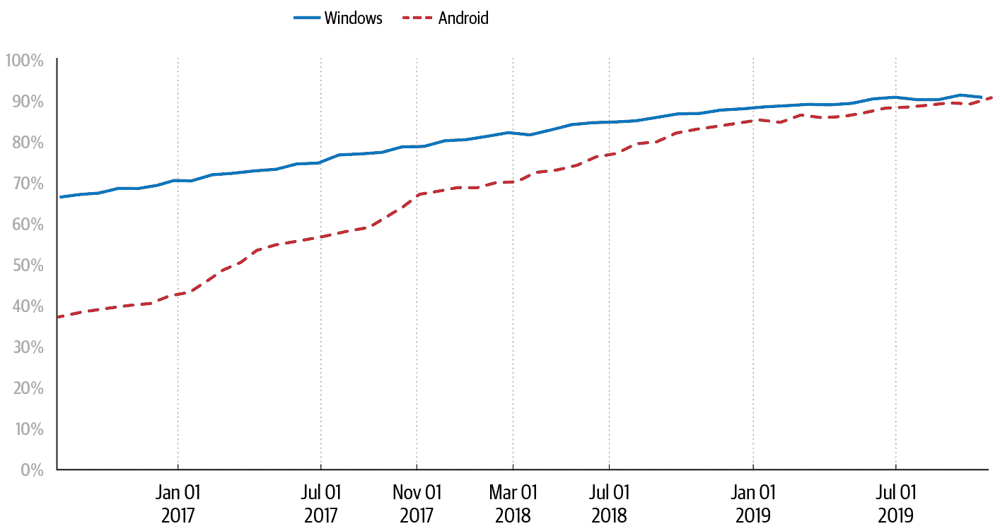

# 第七章：面向不断变化的环境的设计

> 原文：[7. Design for a Changing Landscape](https://google.github.io/building-secure-and-reliable-systems/raw/ch07.html)
> 
> 译者：[飞龙](https://github.com/wizardforcel)
> 
> 协议：[CC BY-NC-SA 4.0](https://creativecommons.org/licenses/by-nc-sa/4.0/)

Maya Kaczorowski、John Lunney 和 Deniz Pecel

与 Jen Barnason、Peter Duff 和 Emily Stark 合作

“变化是唯一不变的”是一个至理名言，对于软件来说绝对是如此：随着我们每年使用的设备数量（和种类）的增加，图书馆和应用程序的漏洞数量也在增加。任何设备或应用程序都有可能受到远程利用、数据泄露、僵尸网络接管或其他引人注目的情景的影响。

与此同时，用户和监管机构对安全和隐私的期望不断提高，要求实现更严格的控制，如企业特定的访问限制和认证系统。

为了应对这种不断变化的漏洞、期望和风险，您需要能够频繁快速地改变您的基础设施，同时保持高度可靠的服务——这并不容易。实现这种平衡通常归结为决定何时以及多快地推出变更。

# 安全变更类型

您可能会做出许多种改变，以改善您的安全姿态或安全基础设施的弹性，例如：

+   对安全事件做出的变更（见第十八章）

+   对新发现的漏洞做出的变更

+   产品或功能变更

+   出于内部动机改善您的安全姿态的变更

+   外部动机的变更，如新的监管要求

一些类型的出于安全考虑的变更需要额外的考虑。如果你正在推出一个可选功能作为迈向强制性的第一步，你需要收集足够的早期采用者反馈，并彻底测试你的初始工具。

如果您正在考虑对依赖项进行更改，例如供应商或第三方代码依赖项，您需要确保新解决方案符合您的安全要求。

# 设计您的变更

安全变更受到与任何其他软件变更相同的基本可靠性要求和发布工程原则的约束；有关更多信息，请参阅本书中的第四章和 SRE 书中的第八章](https://landing.google.com/sre/sre-book/chapters/release-engineering/)。推出安全变更的时间表可能有所不同（请参阅[“不同的变更：不同的速度，不同的时间表”），但整体流程应遵循相同的最佳实践。

所有变更都应具有以下特征：

渐进式

进行尽可能小而独立的变更。避免将变更与不相关的改进（如重构代码）联系在一起的诱惑。

记录

描述您的变更的“如何”和“为什么”，以便他人能够理解变更和推出的相对紧急性。您的文档可能包括以下任何或所有内容：

+   要求

+   受影响的系统和团队

+   从概念验证中学到的经验

+   决策的基础（以防需要重新评估计划）

+   所有涉及的团队的联系点

测试

使用单元测试和（在可能的情况下）集成测试来测试您的安全变更（有关测试的更多信息，请参阅第十三章）。完成同行评审，以获得变更在生产环境中能够正常工作的信心。

隔离

使用功能标志来隔离彼此的变更，并避免发布不兼容性；有关更多信息，请参阅[SRE 工作手册中的第十六章](https://landing.google.com/sre/workbook/chapters/canarying-releases/#separating-components-that-change-at-different-rates)。当关闭功能时，底层二进制应该不会表现出任何行为上的变化。

合格的

使用您正常的二进制发布流程推出您的变更，在接收生产或用户流量之前，通过资格的各个阶段。

分阶段

逐步推出你的变更，并进行金丝雀测试的仪器化。你应该能够在变更前后看到行为上的差异。

这些做法建议采取“缓慢而稳定”的推出方式。根据我们的经验，速度和安全之间的有意的权衡是值得的。你不希望通过推出一个有问题的变更来冒险制造一个更大的问题，比如广泛的停机或数据丢失。

# 使变更更容易的架构决策

如何设计你的基础架构和流程，以应对你将面临的不可避免的变化？在这里，我们讨论了一些策略，使你能够灵活地调整系统并推出变化，同时也有助于建立安全可靠的文化（在第二十一章中讨论）。

## 保持依赖项最新并频繁重新构建

确保你的代码指向代码依赖的最新版本有助于使你的系统不太容易受到新的漏洞的影响。保持对依赖项的引用最新对于经常更改的开源项目尤为重要，比如 OpenSSL 或 Linux 内核。许多大型开源项目都有建立良好的安全漏洞响应和修复计划，澄清了新发布是否包含关键安全补丁，并将修复补丁迁移到受支持的版本。如果你的依赖项是最新的，你很可能可以直接应用关键补丁，而不需要合并一大堆变更或应用多个补丁。

新发布及其安全补丁在你的环境中不会生效，直到你重新构建。频繁重新构建和部署你的环境意味着当你需要时你将准备好推出新版本，并且紧急推出可以获取最新的变更。

## 使用自动化测试频繁发布

基本的 SRE 原则建议定期切割和推出发布，以促进紧急变更。通过将一个大的发布分割成许多较小的发布，你确保每个发布包含的变更更少，因此更不太可能需要回滚。有关这个主题的更深入探讨，请参见 SRE workbook 中的“善行循环”（https://landing.google.com/sre/workbook/chapters/canarying-releases/#the-virtuous-cycle-of-ci-cd）。

当每个发布包含更少的代码变更时，更容易理解发生了什么变化并找出潜在问题。当你需要推出安全变更时，你可以更加自信地预期结果。

为了充分利用频繁的发布，自动化它们的测试和验证。这样可以自动推送良好的发布，同时防止不足的发布进入生产环境。自动化测试还可以在需要推出修复以防止关键漏洞时给你额外的信心。

同样，通过使用容器²和微服务³，你可以减少需要修补的表面积，建立定期发布流程，并简化你对系统漏洞的理解。

## 使用容器

容器将应用程序所需的二进制文件和库与底层主机操作系统解耦。因为每个应用程序都打包了自己的依赖和库，所以主机操作系统不需要包含它们，因此可以更小。因此，应用程序更具可移植性，你可以独立地对其进行安全保护。例如，你可以在主机操作系统中修补内核漏洞，而无需更改应用程序容器。

容器的设计是不可变的，这意味着它们在部署后不会改变——而不是通过 SSH 进入机器，你重新构建和部署整个镜像。因为容器的寿命很短，它们经常被重新构建和部署。

与其对活动容器进行修补，不如对容器注册表中的镜像进行修补。这意味着您可以将一个完全打了补丁的容器镜像作为一个单元进行部署，使补丁的部署过程与您（非常频繁的）代码部署过程相同，包括监控、金丝雀发布和测试。因此，您可以更频繁地进行补丁。

随着这些变化应用到每个任务中，系统会无缝地将服务流量转移到另一个实例；参见[《SRE 书》第七章中的“案例研究 4：在共享平台上运行数百个微服务”](https://landing.google.com/sre/workbook/chapters/simplicity/)。您可以通过蓝/绿部署实现类似的结果，并在修补时避免停机；参见[《SRE 工作手册》第十六章](https://landing.google.com/sre/workbook/chapters/canarying-releases/)。

您还可以使用容器来检测和修补新发现的漏洞。由于容器是不可变的，它们提供内容可寻址性。换句话说，您实际上知道在您的环境中运行什么，例如，您部署了哪些镜像。如果您之前部署了一个完全打了补丁的镜像，恰好容易受到新漏洞的影响，您可以使用您的注册表来识别易受影响的版本并应用补丁，而不是直接扫描您的生产集群。

为了减少这种临时修补的需求，您应该监视生产环境中运行的容器的年龄，并定期重新部署，以确保旧容器不再运行。同样，为了避免重新部署较旧的未打补丁的镜像，您应该强制执行只有最近构建的容器才能在生产环境中部署。

## 使用微服务

理想的系统架构易于扩展，提供对系统性能的可见性，并允许您管理基础架构中服务之间的每个潜在瓶颈。使用微服务架构，您可以将工作负载分割为更小、更易管理的单元，以便进行维护和发现。因此，您可以独立扩展、负载平衡和在每个微服务中执行部署，这意味着您可以更灵活地进行基础架构更改。由于每个服务都单独处理请求，您可以独立和顺序地使用多种防御措施，提供深度防御（见[“深度防御”](ch08.html#defense_in_depth)）。

微服务还自然地促进了有限或零信任的网络，这意味着您的系统并不会因为一个服务位于同一网络中就本能地信任它（见第六章）。与使用基于边界的安全模型不同，该模型将不受信任的外部流量与受信任的内部流量进行区分，微服务使用更多元化的信任概念在边界内部：内部流量可能具有不同级别的信任。当前的趋势是朝着越来越分段化的网络发展。随着对单一网络边界（如防火墙）的依赖被消除，网络可以通过服务进一步分段。在极端情况下，网络可以实现微服务级别的分段，服务之间没有固有的信任关系。

使用微服务的一个次要后果是安全工具的收敛，因此一些流程、工具和依赖关系可以在多个团队之间重复使用。随着架构的扩展，整合您的努力以解决共享的安全需求可能是有意义的，例如，使用常见的加密库或常见的监控和警报基础设施。这样，您可以将关键的安全服务拆分为单独的微服务，由少数负责方更新和管理。重要的是要注意，实现微服务架构的安全优势需要克制，以确保服务尽可能简单，同时仍保持所需的安全属性。

使用微服务架构和开发流程允许团队在开发和部署生命周期的早期阶段解决安全问题——在进行更改成本较低的时候——以标准化的方式。因此，开发人员可以在花费较少时间处理安全性的同时实现安全的结果。

### 示例：谷歌的前端设计

谷歌的前端设计使用微服务提供弹性和深度防御。将前端和后端分开成不同的层有许多优势：Google Front End（GFE）作为大多数谷歌服务的前端层，实现为微服务，因此这些服务不直接暴露在互联网上。GFE 还终止了传入 HTTP(S)、TCP 和 TLS 代理的流量；提供了 DDoS 攻击对策；并将流量路由和负载平衡到谷歌云服务。

GFE 允许独立分区前端和后端服务，这在可伸缩性、可靠性、灵活性和安全性方面都有好处：

+   全局负载平衡有助于在 GFE 和后端之间移动流量。例如，我们可以在数据中心故障期间重定向流量，减少缓解时间。

+   后端和前端层内部可以有几个层。因为每个层都是一个微服务，我们可以对每个层进行负载平衡。因此，相对容易增加容量，进行一般性更改或对每个微服务应用快速更改。

+   如果服务过载，GFE 可以作为缓解点，在负载达到后端之前丢弃或吸收连接。这意味着微服务架构中并非每个层都需要自己的负载保护。

+   新协议和安全要求的采用相对简单。即使一些后端还没有准备好，GFE 也可以处理 IPv6 连接。GFE 还通过作为各种常见服务的终止点来简化证书管理，比如 SSL。例如，当发现 SSL 重新协商的实现中存在漏洞时，GFE 的控制限制了这些重新协商，保护了其后面的所有服务。快速的应用层传输安全加密也说明了微服务架构如何促进变化的采用：谷歌的安全团队将 ALTS 库集成到其 RPC 库中，以处理服务凭据，从而实现了广泛的采用，而对个别开发团队的负担不大。

在今天的云世界中，您可以通过使用微服务架构、构建安全控制层和使用服务网格来实现类似于此处描述的好处。例如，您可以将请求处理与管理请求处理的配置分开。行业将这种有意的分离称为*数据平面*（请求）*和控制平面*（配置）。在这种模型中，数据平面提供系统中的实际数据处理，通常处理负载平衡、安全性和可观察性。控制平面为数据平面服务提供策略和配置，从而提供可管理和可扩展的控制表面。

# 不同的更改：不同的速度，不同的时间轴

并非所有更改都在相同的时间轴上或以相同的速度发生。有几个因素影响您可能希望进行更改的速度：

严重性

每天都会发现漏洞，但并非所有漏洞都是关键的、正在被积极利用的，或者适用于您特定的基础设施。当您遇到这种情况时，您可能希望尽快发布补丁。加速的时间表会造成混乱，并更有可能破坏系统。有时速度是必要的，但一般来说，变化发生得越慢越安全，这样您就可以确保足够的产品安全性和可靠性。（理想情况下，您可以独立应用关键安全补丁，这样您就可以快速应用补丁，而不会不必要地加速其他正在进行的推出。）

依赖系统和团队

一些系统变化可能取决于其他团队，他们需要在推出之前实现新政策或启用特定功能。您的变化也可能取决于外部方面，例如，如果您需要从供应商那里接收补丁，或者如果客户需要在您的服务器之前打补丁。

敏感性

您的变化的敏感性可能会影响您何时可以将其部署到生产环境中。改进组织整体安全状况的非必要变化并不一定像关键补丁那样紧急。您可以更逐渐地推出这种非必要的变化，例如逐个团队。根据其他因素，进行变化可能不值得冒风险——例如，您可能不希望在关键的生产时间窗口内推出非紧急变化，比如假日购物活动期间，那里的变化通常是受严格控制的。

截止日期

一些变化有一个有限的截止日期。例如，监管变化可能有指定的合规日期，或者您可能需要在披露漏洞之前（请参见下面的侧边栏）应用补丁。

确定特定变化速度没有硬性规定——一个组织可能需要快速进行配置更改和推出，而另一个组织可能需要数月时间。虽然单个团队可能能够按照特定时间表进行特定变化，但您的组织可能需要很长时间才能完全采纳这种变化。

在接下来的几节中，我们将讨论变化的三种不同时间范围，并举例说明谷歌的情况：

+   对新安全漏洞的短期变化反应

+   中期变化，新产品采用可能会逐渐发生

+   出于监管原因的长期变化，谷歌必须构建新系统以实现变化

## 短期变化：零日漏洞

新发现的漏洞通常需要短期行动。*零日漏洞*是已知至少部分攻击者知道的漏洞，但尚未公开披露或被针对的基础设施提供者发现。通常，补丁要么尚未可用，要么尚未广泛应用。

有多种方法可以了解可能影响您环境的新漏洞，包括定期代码审查、内部代码扫描（参见[“清理您的代码”](ch12.html#sanitize_your_code)）、模糊测试（参见[“模糊测试”](ch13.html#fuzz_testing)）、外部扫描如渗透测试和基础设施扫描，以及漏洞赏金计划。

在短期变化的背景下，我们将重点放在谷歌在零日得知漏洞的情况。尽管谷歌通常参与封锁漏洞响应，例如在开发补丁时，对于零日漏洞的短期变化是行业中大多数组织的常见行为。

###### 注意

尽管零日漏洞受到了很多关注（无论是外部还是内部），但它们不一定是攻击者最经常利用的漏洞。在处理当天零日漏洞之前，请确保您已经为近年来的“热门”漏洞打了补丁。

当你发现一个新的漏洞时，要对其进行分类，以确定其严重程度和影响。例如，允许远程代码执行的漏洞可能被认为是关键的。但对你的组织的影响可能非常难以确定：哪些系统使用这个特定的二进制文件？受影响的版本是否部署在生产环境中？在可能的情况下，你还需要建立持续的监控和警报，以确定漏洞是否正在被积极利用。

要采取行动，你需要获取一个*补丁*——一个应用了修复的受影响软件包或库的新版本。首先要验证补丁是否真的解决了漏洞。使用一个有效的利用工具来做这件事可能是有用的。但要注意，即使你无法使用利用工具触发漏洞，你的系统可能仍然是有漏洞的（请记住，没有证据并不意味着没有证据）。例如，你应用的补丁可能只解决了一个更大类别的漏洞中的一个可能的利用。

一旦验证了你的补丁，就将其推出——最好是在测试环境中。即使在加速的时间表上，补丁也应该像任何其他生产变更一样逐渐推出——使用相同的测试、金丝雀发布和其他工具——大约需要几个小时或几天的时间。逐步推出可以让你及早发现潜在问题，因为补丁可能会对你的应用产生意想不到的影响。例如，使用你不知道的 API 的应用可能会影响性能特征或引起其他错误。

有时你无法直接修复漏洞。在这种情况下，最好的做法是通过限制或限制对易受攻击的组件的访问来减轻风险。这种减轻可能是临时的，直到补丁可用，或者是永久的，如果你无法将补丁应用到你的系统上——例如，因为性能要求。如果已经有适当的减轻措施来保护你的环境，你甚至可能不需要采取进一步的行动。

有关事件响应的更多细节，请参见第十七章。

### 示例：Shellshock

2014 年 9 月 24 日早上，谷歌安全团队得知了一个[公开披露](https://oreil.ly/mQFJj)的、可以远程利用的漏洞，这个漏洞在[shell](https://oreil.ly/qbTqD)上轻松地允许在受影响的系统上执行代码。漏洞披露很快就被野外利用所跟随，从同一天开始。

[原始报告](https://oreil.ly/4l2W4)有一些混乱的技术细节，并没有清楚地说明对讨论这个问题的禁运的状态。这份报告，再加上几个类似漏洞的迅速发现，导致了对攻击的性质和可利用性的困惑。谷歌的事件响应团队启动了其黑天鹅协议，以应对一个特殊的漏洞，并协调了[大规模的响应](https://oreil.ly/v6DeI)来做以下事情：⁸

+   确定范围内的系统和每个系统的相对风险级别

+   内部向所有可能受到影响的团队通报

+   尽快修补所有有漏洞的系统

+   外部向合作伙伴和客户通报我们的行动，包括补救计划

我们在公开披露之前不知道这个问题，所以我们将其视为需要紧急减轻的零日漏洞。在这种情况下，bash 的修补版本已经可用。

团队评估了不同系统的风险，并相应地采取了行动。

+   我们认为大量的谷歌生产服务器风险较低。这些服务器很容易通过自动化发布进行修补。一旦服务器经过足够的验证和测试，我们会比通常更快地对其进行修补，而不是长时间分阶段进行。

+   我们认为大量的谷歌工作站风险更高。幸运的是，这些工作站很容易快速修补。

+   少量非标准服务器和继承基础设施被认为存在高风险，需要手动干预。我们向每个团队发送通知，详细说明他们需要采取的后续行动，这使我们能够将努力扩展到多个团队，并轻松跟踪进展。

与此同时，团队开发了软件来检测谷歌网络范围内的易受攻击系统。我们使用这个软件完成了剩余的补丁工作，并将这个功能添加到了谷歌的标准安全监控中。

我们在这次应对工作中做得好（和不好）提供了许多其他团队和组织的教训：

+   *尽可能标准化软件分发*，这样补丁就成了简单的选择。这还要求服务所有者理解和接受选择非标准、不受支持分发的风险。服务所有者应负责维护和打补丁替代选项。

+   *使用公共分发标准*——理想情况下，你需要推出的补丁已经是正确的格式。这样，你的团队可以开始快速验证和测试补丁，而不需要重新制定补丁以解决你特定的环境。

+   *确保你可以加速推动紧急变更的机制*，比如零日漏洞。这个机制应该允许在向受影响系统全面推出之前进行比平时更快的验证。我们不一定建议你跳过验证你的环境仍然正常运行的步骤——你必须在需要减轻利用的需求之间平衡这一步骤。

+   *确保你有监控来跟踪你的推出进度，识别未打补丁的系统，以及识别你仍然存在漏洞的地方*。如果你已经有工具来识别漏洞是否正在被利用，它可能会帮助你决定根据你当前的风险放缓或加速。

+   尽早准备外部沟通，尽可能在应对工作的早期。当媒体要求回应时，你不希望在内部公关批准中被拖延。

+   *提前起草可重复使用的事件或漏洞响应计划*（见第十七章），包括外部沟通的语言。如果你不确定你需要什么，可以从以前事件的事后总结开始。

+   *了解哪些系统是非标准的或需要特别关注*。通过跟踪离群值，你将知道哪些系统可能需要积极通知和补丁协助。（如果你按照我们在第一条建议的标准化软件分发，离群值应该是有限的。）

## 中期变化：改善安全状况

安全团队经常实现改变以提高环境的整体安全状况并减少风险。这些积极的改变是由内部和外部的要求和截止日期驱动的，很少需要突然推出。

在规划安全状况变更时，你需要弄清楚哪些团队和系统受到影响，并确定最佳的开始地点。遵循“设计你的变更”中概述的 SRE 原则，制定逐步推出的行动计划。每个阶段都应包括必须在进入下一个阶段之前满足的成功标准。

受安全变更影响的系统或团队不能必然表示为推出的百分比。相反，你可以根据受影响的人和需要进行的变更来分阶段推出。

在受影响的人员方面，逐组推出您的变更，其中一组可能是一个开发团队、系统或一组最终用户。例如，您可以开始向经常在外出的用户（如销售团队）推出设备策略的变更。这样可以让您快速测试最常见的情况，并获得真实的反馈。在推出人员方面有两种相互竞争的哲学：

+   从最容易的用例开始，这样你将获得最大的动力并证明价值。

+   从最困难的用例开始，这样你将找到最多的错误和边缘情况。

当您仍在寻求组织的支持时，从最容易的用例开始是有意义的。如果您在一开始就得到了领导支持和投资，那么尽早发现实现错误和痛点就更有价值。除了组织上的考虑，您还应考虑哪种策略将在短期和长期内带来最大的风险降低。在所有情况下，成功的概念验证有助于确定如何最好地前进。进行变更的团队还必须经历这一过程，“吃自己的狗粮”，以便他们了解用户体验。

您可能还可以逐步推出变更本身。例如，您可以逐渐实现更严格的要求，或者变更最初可以选择加入，而不是强制性的。在可能的情况下，您还应考虑在警报或审计模式下进行变更的试运行，然后再切换到执行模式——这样，用户可以在变更强制执行之前体验到他们将受到的影响。这样可以帮助您找到错误地确定为受影响范围内的用户或系统，以及对于他们来说，达到合规性将特别困难的用户或系统。

### 示例：使用 FIDO 安全密钥进行强大的双因素认证

钓鱼是 Google 的一个重大安全问题。尽管我们已广泛实现了使用一次性密码（OTPs）的双因素认证，但 OTP 仍然容易在钓鱼攻击中被截取。我们假设即使是最复杂的用户也是出于善意并且做好了应对钓鱼的准备，但仍然容易受到由于混乱的用户界面或用户错误而导致的账户接管。为了解决这一风险，从 2011 年开始，我们调查和测试了几种更强大的双因素认证（2FA）方法。我们最终选择了通用双因素（U2F）硬件安全令牌，因为它们具有安全性和可用性属性。为了为 Google 庞大的全球分布的员工群体实现安全密钥，需要构建定制集成并协调大规模注册。

评估潜在解决方案和我们最终的选择是变更过程的一部分。一开始，我们定义了安全、隐私和可用性要求。然后，我们与用户一起验证潜在的解决方案，以了解正在发生的变化，获得真实的反馈，并衡量变化对日常工作流程的影响。

除了安全和隐私要求，潜在的解决方案还必须满足可用性要求，以促进无缝采用，这对于建立安全和可靠性文化至关重要（见第二十一章）。双因素认证需要简单易用——快速和“无脑”到足以使错误或不安全地使用它变得困难。这一要求对于 SREs 尤为重要——在发生故障时，双因素认证不能减慢响应流程。此外，内部开发人员需要能够通过简单的 API 轻松地将双因素认证解决方案集成到他们的网站中。在理想的可用性要求方面，我们希望找到一个高效的解决方案，适用于跨多个帐户的用户，并且不需要额外的硬件，而且在物理上轻松、易学、易于找回。

在评估了几种选择后，我们共同设计了[FIDO 安全密钥](https://oreil.ly/UHbVu)。尽管这些密钥并不符合我们所有的理想要求，但在最初的试点中，安全密钥减少了总认证时间，并且认证失败率可以忽略不计。

一旦我们有了解决方案，就必须向所有用户推出安全密钥，并在谷歌全面停用 OTP 支持。我们从 2013 年开始推出安全密钥。为了确保广泛采用，注册是自助的：

+   最初，许多用户自愿选择安全密钥，因为这些密钥比现有的 OTP 工具更简单易用——他们不必从手机输入代码或使用物理 OTP 设备。用户获得了可以留在笔记本电脑的 USB 驱动器中的“纳米”安全密钥。

+   要获得安全密钥，用户可以前往任何办公室的任何 TechStop 位置。 （向全球办公室分发设备很复杂，需要法律团队进行出口合规和海关进口要求。）

+   用户通过自助注册网站注册他们的安全密钥。TechStops 为第一批采用者和需要额外帮助的人提供了帮助。用户需要在首次认证时使用现有的 OTP 系统，因此密钥在首次使用时是可信的（TOFU）。

+   用户可以注册多个安全密钥，这样他们就不必担心丢失密钥。这种方法增加了整体成本，但与我们的目标强烈一致，即不让用户携带额外的硬件。

团队在推出过程中确实遇到了一些问题，比如固件过时。在可能的情况下，我们以自助方式解决这些问题，例如允许用户自行更新安全密钥固件。

使安全密钥对用户可访问只是问题的一半。使用 OTP 的系统也需要转换为使用安全密钥。2013 年，许多应用程序并不原生支持这一最近开发的技术。团队首先专注于支持谷歌员工日常使用的应用程序，如内部代码审查工具和仪表板。在不支持安全密钥的情况下（例如某些硬件设备证书管理和第三方 Web 应用程序），谷歌直接与供应商合作请求并添加支持。然后我们必须处理长尾应用程序。由于所有 OTP 都是集中生成的，我们可以通过跟踪发出 OTP 请求的客户端来确定下一个目标应用程序。

2015 年，团队专注于完成推出并停用 OTP 服务。当用户使用 OTP 而不是安全密钥时，我们会发送提醒，并最终通过 OTP 阻止访问。尽管我们已经处理了大部分 OTP 应用需求，但仍然存在一些例外情况，比如移动设备设置。对于这些情况，我们为特殊情况创建了基于 Web 的 OTP 生成器。用户需要使用他们的安全密钥验证身份，这是一个合理的故障模式，但时间负担略高。我们成功地在 2015 年完成了全公司范围内的安全密钥推出。

这一经验提供了一些普遍适用的教训，对于建立安全和可靠性文化很有相关性（参见第二十一章）：

确保所选择的解决方案适用于所有用户。

至关重要的是，2FA 解决方案必须是可访问的，以便视力受损的用户不会被排除在外。

使变更易于学习，并尽可能轻松。

如果解决方案比初始情况更用户友好，这一点尤为重要！这对于您期望用户频繁执行的操作或更改尤为重要，稍微的摩擦可能会导致用户负担重大。

使变更成为自助服务，以减轻中央 IT 团队的负担。

对于影响所有用户日常活动的广泛变化，重要的是他们能够轻松地注册、注销和解决问题。

向用户提供解决方案有效并符合他们最佳利益的有形证据。

清楚地解释变化对安全和风险减少的影响，并提供他们提供反馈的机会。

尽快使政策不合规的反馈循环。

这种反馈循环可以是身份验证失败、系统错误或电子邮件提醒。让用户在几分钟或几小时内知道他们的操作与期望的政策不一致，使他们能够采取措施解决问题。

跟踪进展并确定如何解决长尾问题。

通过检查应用程序的 OTP 请求，我们可以确定下一个要关注的应用程序。使用仪表板跟踪进展，并确定是否具有类似安全属性的替代解决方案可以适用于使用情况的长尾。

## 长期变化：外部需求

在某些情况下，您可能需要更多时间来推出变化，例如，需要进行重大架构或系统变更的内部驱动变化，或者更广泛的行业监管变化。这些变化可能受到外部截止日期或要求的激励或限制，并可能需要数年时间来实现。

在进行大规模、多年的努力时，您需要清晰地定义并衡量与目标的进展。文档尤为关键，既可以确保您考虑了必要的设计考虑因素（参见“设计您的变化”），也可以保持连续性。今天致力于变革的个人可能会离开公司并需要移交他们的工作。保持文档与最新计划和状态的更新对于维持持续的领导支持至关重要。

为了衡量持续的进展，建立适当的仪器和仪表板。理想情况下，配置检查或测试可以自动测量变化，无需人为干预。就像您为基础设施中的代码努力实现重要的测试覆盖率一样，您应该为受变化影响的系统的合规性检查覆盖率而努力。为了有效扩展这种覆盖范围，这种仪器应该是自助的，允许团队实现变化和仪器。透明地跟踪这些结果有助于激励用户，并简化沟通和内部报告。您还应该使用这个单一的真相来源进行高管沟通，而不是重复工作。

在保持持续领导支持的情况下，在组织中进行任何大规模、长期的变化是困难的。为了持续推动动力，进行这些变化的个人需要保持积极性。建立有限的目标，跟踪进展，并展示重大影响的实例可以帮助团队完成马拉松。实现总是会有长尾，因此要找出对你的情况最有意义的策略。如果变化不是必需的（根据法规或其他原因），达到 80%或 90%的采纳率可以对降低安全风险产生可衡量的影响，因此应被视为成功。

### 示例：增加 HTTPS 使用率

在过去的十年中，网络上的 HTTPS 采用率大幅增加，这得益于谷歌 Chrome 团队、[Let’s Encrypt](https://letsencrypt.org)和其他组织的共同努力。HTTPS 为用户和网站提供了重要的保密性和完整性保证，对于网络生态系统的成功至关重要——它现在作为 HTTP/2 的一部分是必需的。

为了推动网络上的 HTTPS 使用，我们进行了广泛的研究以制定战略，通过各种外联渠道联系网站所有者，并为他们设置了强大的激励措施来进行迁移。长期而言，整个生态系统的变化需要深思熟虑的战略和重要的规划。我们采用了数据驱动的方法来确定最佳的接触每个利益相关者群体的方式：

+   我们收集了全球当前 HTTPS 使用情况的数据，以选择目标地区。

+   我们调查最终用户，以了解他们如何在浏览器中看待 HTTPS UI。

+   我们测量网站行为，以确定可以限制为 HTTPS 的网络平台功能，以保护用户隐私。

+   我们使用案例研究来了解开发人员对 HTTPS 的担忧以及我们可以构建的工具类型。

这不是一次性的努力：我们在多年的时间里继续监测指标并收集数据，必要时调整我们的战略。例如，随着我们逐渐在几年的时间内推出 Chrome 对不安全页面的警告，我们监测用户行为遥测，以确保 UI 变化不会导致意外的负面影响（例如，留存率或与网络的互动下降）。

过度沟通是成功的关键。在每次变更之前，我们利用所有可用的外联渠道：博客、开发人员邮件列表、新闻、Chrome 帮助论坛和与合作伙伴的关系。这种方法最大化了我们的影响力，使网站所有者不会感到惊讶，因为他们被推动迁移到 HTTPS。我们还根据地区情况进行了定制化的外联工作——例如，当我们意识到日本的 HTTPS 采用率因顶级网站的采用速度缓慢而滞后时，我们特别关注了日本。

最终，我们专注于创建和强调激励措施，以提供迁移到 HTTPS 的商业原因。即使是注重安全的开发人员也很难说服他们的组织，除非他们能将迁移与商业案例联系起来。例如，启用 HTTPS 允许网站使用 Web 平台功能，如[Service Worker](https://oreil.ly/W5t4I)，这是一种使离线访问、推送通知和定期后台同步成为可能的后台脚本。这些功能，限制在 HTTPS 网站上，可以提高性能和可用性，并可能直接影响企业的底线。只有当组织感到迁移到 HTTPS 与他们的业务利益一致时，他们才更愿意投入资源。

如图 7-1 所示，跨平台的 Chrome 用户现在超过 90%的时间花在 HTTPS 网站上，而以前，Windows 上的 Chrome 用户这一数字低至 70%，Android 上的 Chrome 用户为 37%。来自许多组织的无数人——网页浏览器供应商、证书颁发机构和网页发布者——都为此增长做出了贡献。这些组织通过标准机构、研究会议和对每个面临的挑战和成功的公开沟通进行协调。Chrome 在这一转变中的角色产生了关于为生态系统范围的变化做出贡献的重要经验教训：

在承诺战略之前了解生态系统。

我们的战略基于定量和定性研究，重点关注包括不同国家和不同设备上的网页开发人员和最终用户在内的广泛利益相关者。

通过过度沟通来最大化影响力。

我们使用各种外联渠道来触达最广泛的利益相关者。

将安全变化与商业激励联系起来。

组织领导者在能够看到业务原因时更愿意迁移到 HTTPS。

建立行业共识。

多个浏览器供应商和组织同时支持网络迁移到 HTTPS；开发人员将 HTTPS 视为行业趋势。

###### 图 7-1：Chrome 平台上的 HTTPS 浏览时间百分比

# 复杂性：当计划改变时

安全和 SRE 的最佳计划经常会出现问题。有许多原因可能需要加快变化或放慢变化的速度。

通常，您需要根据外部因素加快变化的速度，通常是由于正在积极利用的漏洞。在这种情况下，您可能希望加快推出以尽快修补系统。要谨慎：加快速度并破坏系统并不一定对系统的安全性和可靠性更好。考虑是否可以改变推出顺序，以更快地覆盖某些更高风险的系统，或以其他方式通过限制操作的速率或将特别关键的系统下线来阻止攻击者的访问。

您也可以决定放慢变化的速度。这种方法通常是由于补丁存在问题，比如高于预期的错误率或其他推出失败。如果放慢变化的速度不能解决问题，或者在不对系统或用户造成负面影响的情况下无法完全推出，那么回滚、调试问题，然后再次推出是一种痛苦但谨慎的方法。您也可以根据更新的业务需求放慢变化的速度，例如内部截止日期的变更或行业标准的延迟。（你是什么意思，TLS 1.0 仍在使用？！）

在最理想的情况下，您在开始实现之前就改变了计划。作为回应，您只需要制定新计划！以下是更改计划的一些潜在原因，以及相应的策略：

您可能需要根据外部因素推迟变化。

如果你不能在禁令解除后立即开始打补丁（参见[“不同的变化：不同的速度，不同的时间表”]（＃different_changes_different_speedscomma）），与漏洞团队合作，看看是否有其他系统处于您的情况，并且是否可能改变时间表。无论如何，确保您已准备好与受影响的用户通信的计划。

你可能需要根据公开公告加快变化的速度。

对于一个受禁令的漏洞，您可能需要等待公开公告才能打补丁。如果公告泄露，如果有人公开利用漏洞，或者漏洞在野外被利用，您的时间表可能会改变。在这种情况下，您应该尽早开始打补丁。您应该在每个阶段都有一个行动计划，以应对禁令被打破时该怎么办。

你可能不会受到严重影响。

如果一个漏洞或变化主要影响公共面向网络的服务，并且您的组织拥有非常有限数量的此类服务，那么您可能不需要急于修补整个基础设施。修补受影响的部分，并减缓您对系统其他区域应用补丁的速度。

你可能依赖外部方。

大多数组织依赖第三方分发修补程序包和漏洞图像，或依赖软件和硬件交付作为基础设施变更的一部分。如果修补的操作系统不可用，或者您需要的硬件已经订购完毕，那么您可能无能为力。您可能不得不比最初计划的时间晚开始变化。

# 示例：范围扩大——心脏出血

2011 年 12 月，SSL/TLS 的心跳功能被添加到 OpenSSL 中，同时还出现了一个[未被认识的错误](https://xkcd.com/1354)，允许服务器或客户端访问另一个服务器或客户端的 64 KB 私有内存。2014 年 4 月，这个错误被谷歌员工尼尔·梅塔和 Codenomicon（一家网络安全公司）的一名工程师共同发现，并向 OpenSSL 项目报告。OpenSSL 团队提交了代码更改以修复错误，并制定了公开披露计划。出人意料的是，Codenomicon 发布了公告，并启动了解释性网站*[heartbleed.com](http://heartbleed.com)*。这是第一次使用巧妙的名称和标志，引起了意外的大规模媒体关注。

通过提前获得补丁（受到禁运限制）并在计划的公开披露之前，谷歌基础设施团队已经悄悄地修补了一小部分直接处理 TLS 流量的外部系统。然而，没有其他内部团队知道这个问题。

一旦漏洞公开，就会迅速在诸如[Metasploit](https://www.metasploit.com)之类的框架中开发利用程序。面对加速的时间表，许多谷歌团队现在需要匆忙修补他们的系统。谷歌的安全团队使用自动扫描来发现其他脆弱的系统，并通知受影响的团队进行补丁，并跟踪他们的进展。内存泄露意味着私钥可能会泄露，这意味着许多服务需要密钥轮换。安全团队通知受影响的团队并在中央电子表格中跟踪他们的进展。

Heartbleed 阐明了许多重要的教训：

为禁运被突破或提前解除的最坏情况做准备。

负责任的披霆露面是理想的，但意外事件（以及激发媒体兴趣的可爱标志）可能会发生。尽可能多地进行预先工作，并迅速修补最脆弱的系统，而不管披露协议（这需要对禁运信息进行内部保密）如何。如果您能提前获得补丁，您可能可以在公开宣布之前部署它。当这不可能时，您仍应该能够测试和验证您的补丁，以确保平稳的推出过程。

为大规模快速部署做好准备。

使用持续构建来确保您可以随时重新编译，并使用金丝雀策略进行验证而不会造成破坏。

定期轮换您的加密密钥和其他机密信息。

[密钥轮换](https://oreil.ly/TFb4b)是限制密钥泄露潜在影响范围的最佳实践。定期进行此操作，并确认您的系统仍然按预期工作；有关详细信息，请参阅[SRE 工作手册中的第九章](https://landing.google.com/sre/workbook/chapters/incident-response/)。通过这样做，您确保更换任何受损密钥不会是一个艰巨的工作。

确保您与最终用户（内部和外部）有沟通渠道。

当更改失败或导致意外行为时，您需要能够快速提供更新。

# 结论

区分不同类型的安全更改至关重要，以便受影响的团队知道他们应该做什么，以及您可以提供多少支持。

下次您被要求在您的基础设施中进行安全更改时，深呼吸并制定计划。从小处着手，或找到愿意测试更改的志愿者。建立反馈循环，了解用户遇到的问题，并使更改成为自助服务。如果计划发生变化，不要惊慌，但也不要感到惊讶。

设计策略，如频繁的推出、容器化和微服务，使得积极的改进和紧急的缓解更加容易，而分层方法则使外部表面积少且易于管理。深思熟虑的设计和持续的文档记录，都要考虑到变化，保持系统的健康，使团队的工作负担更加可管理，并且正如你将在下一章中看到的那样，这将导致更大的韧性。

¹ 广泛归因于[以弗所的赫拉克利特](https://oreil.ly/SUdXz)。

² 有关容器的更多信息，请参阅 Dan Lorenc 和 Maya Kaczorowski 的博客文章[“探索容器安全性”](https://oreil.ly/i9DTQ)。另请参阅 Burns, Brendan 等人 2016 年的文章“Borg, Omega, and Kubernetes: Lessons Learned from Three Container-Management Systems Over a Decade.” *ACM Queue* 14(1)。[*https://oreil.ly/tDKBJ*](https://oreil.ly/tDKBJ)。

³ 有关微服务的更多信息，请参阅《SRE 书》第七章中的“案例研究 4：在共享平台上运行数百个微服务”。

⁴ 有关容器的更多信息，请参阅《SRE 书》第二章。

⁵ 有关更多信息，请参阅[Google Cloud 中的传输加密白皮书](https://oreil.ly/kZQNh)。

⁶ 同前。

⁷ 请参阅《SRE 书》第 27 章中有关渐进和分阶段推出的讨论。

⁸ 另请参阅有关此事件的小组讨论的[YouTube 视频](https://oreil.ly/boGtL)。

⁹ 请参阅 Lang, Juan 等人 2016 年的文章“Security Keys: Practical Cryptographic Second Factors for the Modern Web.” *2016 年国际金融密码学和数据安全会议论文集*：422–440。[*https://oreil.ly/S2ZMU*](https://oreil.ly/S2ZMU)。

¹⁰ TechStops 是 Google 的 IT 帮助台，由 Jesus Lugo 和 Lisa Mauck 在一篇[博客文章](https://oreil.ly/BWn0-)中描述。
