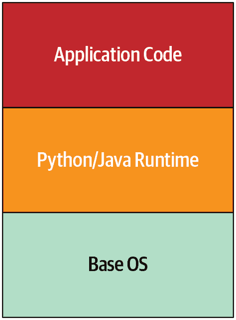
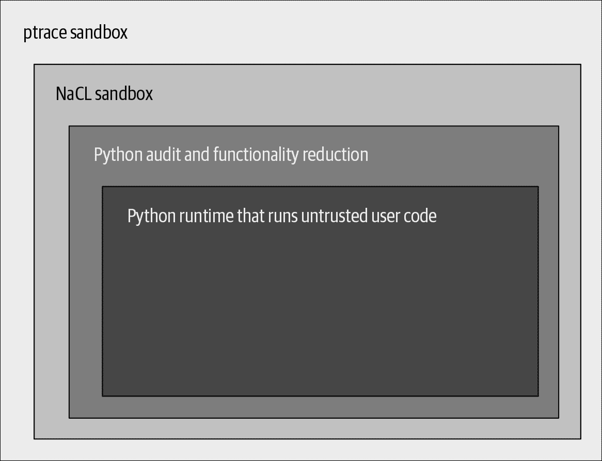
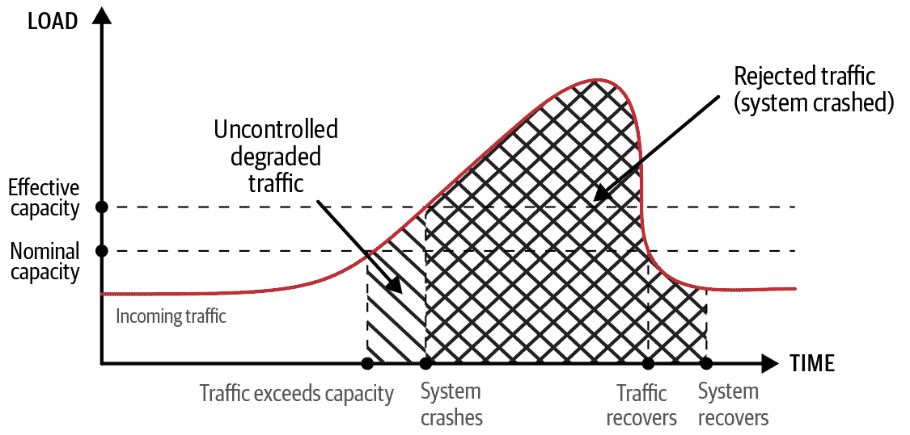
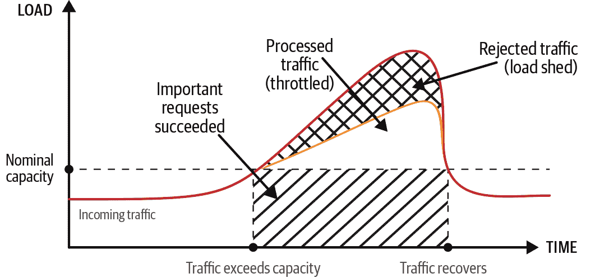

# 第八章：面向弹性的设计

> 原文：[8. Design for Resilience](https://google.github.io/building-secure-and-reliable-systems/raw/ch08.html)
> 
> 译者：[飞龙](https://github.com/wizardforcel)
> 
> 协议：[CC BY-NC-SA 4.0](https://creativecommons.org/licenses/by-nc-sa/4.0/)

维塔利·希皮茨因、米奇·阿德勒、佐尔坦·埃吉德和保罗·布兰金希普

与耶稣·克利门特、杰西·杨、道格拉斯·科利什和克里斯托夫·科恩一起

作为系统设计的一部分，“弹性”描述了系统抵抗重大故障或中断的能力。具有弹性的系统可以自动从系统部分的故障中恢复，甚至可能是整个系统的故障，并在问题得到解决后恢复正常运行。弹性系统中的服务理想情况下在事故期间始终保持运行，可能是以降级模式。在系统设计的每一层中设计弹性有助于防御系统不可预期的故障和攻击场景。

为弹性设计系统与为恢复设计系统有所不同（在第九章中深入讨论）。弹性与恢复密切相关，但是恢复侧重于在系统*发生*故障后修复系统的能力，而弹性是关于设计*延迟*或*承受*故障的系统。注重弹性和恢复的系统更能够从故障中恢复，并且需要最少的人为干预。

# 弹性设计原则

系统的弹性属性建立在本书[第 II 部分](part02.html#designing_systems)中讨论的设计原则之上。为了评估系统的弹性，您必须对系统的设计和构建有很好的了解。您需要与本书中涵盖的其他设计特性密切配合——最小特权、可理解性、适应性和恢复——以加强系统的稳定性和弹性属性。

以下方法是本章深入探讨的，它们表征了一个具有弹性的系统：

+   设计系统的每一层都具有独立的弹性。这种方法在每一层中构建了深度防御。

+   优先考虑每个功能并计算其成本，以便了解哪些功能足够关键，可以尝试在系统承受多大负载时维持，哪些功能不那么重要，可以在出现问题或资源受限时进行限制或禁用。然后确定在哪里最有效地应用系统有限的资源，以及如何最大化系统的服务能力。

+   将系统分隔成清晰定义的边界，以促进隔离功能部分的独立性。这样，也更容易构建互补的防御行为。

+   使用隔舱冗余来防御局部故障。对于全局故障，一些隔舱提供不同的可靠性和安全性属性。

+   通过自动化尽可能多的弹性措施来减少系统的反应时间。努力发现可能受益于新自动化或改进现有自动化的新故障模式。

+   通过验证系统的弹性属性来保持系统的有效性——包括其自动响应和系统的其他弹性属性。

# 深度防御

*深度防御*通过建立多层防御边界来保护系统。因此，攻击者对系统的可见性有限，成功利用更难发动。

## 特洛伊木马

特洛伊木马的故事，由维吉尔在《埃涅阿斯纪》中讲述，是一个关于不足防御危险的警示故事。在围困特洛伊城十年无果之后，希腊军队建造了一匹巨大的木马，作为礼物送给特洛伊人。木马被带进特洛伊城墙内，藏在木马里的攻击者突然冲出来，从内部利用了城市的防御，然后打开城门让整个希腊军队进入，摧毁了城市。

想象一下，如果这个城市计划了深度防御，这个故事的结局会是什么样子。首先，特洛伊的防御力量可能会更仔细地检查特洛伊木马并发现欺骗。如果攻击者设法进入城门，他们可能会面对另一层防御，例如，木马可能被封闭在一个安全的庭院里，无法进入城市的其他地方。

一个 3000 年前的故事告诉我们关于规模安全甚至安全本身的什么？首先，如果你试图了解你需要防御和遏制系统的策略，你必须首先了解攻击本身。如果我们把特洛伊城看作一个系统，我们可以按照攻击者的步骤（攻击的阶段）来发现深度防御可能解决的弱点。

在高层次上，我们可以将特洛伊木马攻击分为四个阶段：

1.  *威胁建模和漏洞发现*——评估目标并专门寻找防御和弱点。攻击者无法从外部打开城门，但他们能从内部打开吗？

1.  *部署*——为攻击设置条件。攻击者构建并交付了一个特洛伊最终带进城墙内的物体。

1.  *执行*——执行实际的攻击，利用之前阶段的攻击。士兵们从特洛伊木马中出来，打开城门让希腊军队进入。

1.  *妥协*——在成功执行攻击后，损害发生并开始减轻。

特洛伊人在妥协之前的每个阶段都有机会阻止攻击，并因错过这些机会而付出了沉重的代价。同样，你系统的深度防御可以减少如果你的系统被攻击的话可能需要付出的代价。

### 威胁建模和漏洞发现

攻击者和防御者都可以评估目标的弱点。攻击者对他们的目标进行侦察，找到弱点，然后模拟攻击。防御者应该尽力限制在侦察期间向攻击者暴露的信息。但是因为防御者无法完全阻止这种侦察，他们必须检测到它并将其用作信号。在特洛伊木马的情况下，防御者可能会因为陌生人询问城门的防御方式而保持警惕。鉴于这种可疑活动，当他们在城门口发现一个大木马时，他们会更加谨慎。

注意这些陌生人的询问相当于收集威胁情报。有许多方法可以为你自己的系统做到这一点，你甚至可以选择外包其中的一些。例如，你可以做以下事情：

+   监视你的系统进行端口和应用程序扫描。

+   跟踪类似你的 URL 的 DNS 注册情况——攻击者可能会利用这些注册进行钓鱼攻击。

+   购买威胁情报数据。

+   建立一个威胁情报团队来研究和被动监视已知和可能对你基础设施构成威胁的活动。虽然我们不建议小公司投入资源进行这种方法，但随着公司的发展，这可能会变得具有成本效益。

作为对你系统内部了解的防御者，你的评估可以比攻击者的侦察更详细。这是一个关键点：如果你了解你系统的弱点，你可以更有效地防御它们。而且你了解攻击者目前正在使用或有能力利用的方法越多，你就越能放大这种效果。一个警告：要小心对你认为不太可能或不相关的攻击向量产生盲点。

### 攻击部署

如果你知道攻击者正在对你的系统进行侦察，那么检测和阻止攻击的努力就至关重要。想象一下，如果特洛伊人决定不允许木马进入城门，因为它是由他们不信任的人创建的。相反，他们可能会在允许它进入之前彻底检查特洛伊木马，或者可能会将其点燃。

在现代，你可以使用网络流量检查、病毒检测、软件执行控制、受保护的沙箱¹和适当的特权配置来检测潜在的攻击。

### 攻击的执行

如果你无法阻止对手的所有部署，你需要限制潜在攻击的影响范围。如果防御者将特洛伊木马圈起来，从而限制了他们的暴露，攻击者将会更难从他们的藏身之处不被察觉地前进。网络战将这种策略称为*沙盒化*（在“运行时层”中有更详细的描述）。

### 妥协

当特洛伊人醒来发现敌人站在他们的床边时，他们知道他们的城市已经被妥协了。这种意识是在实际妥协发生之后才出现的。许多不幸的银行在 2018 年面临了类似的情况，因为他们的基础设施被[EternalBlue](https://oreil.ly/wNI2u)和[WannaCry](https://oreil.ly/irovS)污染了。

你如何从这一点做出回应，将决定你的基础设施被妥协的时间有多长。

## Google App Engine 分析

让我们考虑深度防御如何应用到一个更现代的案例：Google App Engine。Google App Engine 允许用户托管应用程序代码，并在负载增加时进行扩展，而无需管理网络、机器和操作系统。图 8-1 显示了 App Engine 早期的简化架构图。保护应用程序代码是开发者的责任，而保护 Python/Java 运行时和基本操作系统是 Google 的责任。

###### 图 8-1：Google App Engine 架构的简化视图

Google App Engine 的原始实现需要特殊的进程隔离考虑。当时，Google 使用传统的 POSIX 用户隔离作为默认策略（通过不同的用户进程），但我们决定在计划的采用程度上，将每个用户的代码运行在独立的虚拟机中效率太低。我们需要找出如何以与 Google 基础设施中的任何其他作业相同的方式运行第三方、不受信任的代码。

### 风险的 API

App Engine 的初始威胁建模发现了一些令人担忧的领域：

+   网络访问存在问题。在那之前，所有在 Google 生产网络中运行的应用程序都被认为是受信任的和经过身份验证的基础设施组件。由于我们在这个环境中引入了任意的、不受信任的第三方代码，我们需要一种策略来将 App Engine 的内部 API 和网络暴露与其隔离开。我们还需要记住，App Engine 本身是运行在同一基础设施上的，因此依赖于对这些 API 的访问。

+   运行用户代码的机器需要访问本地文件系统。至少这种访问被限制在属于特定用户的目录中，这有助于保护执行环境，并减少用户提供的应用程序对同一台机器上其他用户的应用程序的干扰的风险。

+   Linux 内核意味着 App Engine 暴露在了大规模攻击的表面上，我们希望将其最小化。例如，我们希望尽可能防止许多本地权限提升的类别。

为了解决这些挑战，我们首先检查了限制用户对每个 API 的访问。我们的团队在运行时删除了用于网络和文件系统交互的内置 API。我们用“安全”版本替换了内置 API，这些版本调用其他云基础设施，而不是直接操作运行时环境。

为了防止用户重新引入解释器中故意删除的功能，我们不允许用户提供的编译字节码或共享库。用户必须依赖我们提供的方法和库，以及各种可能需要的允许的仅运行时开源实现。

### 运行时层

我们还对运行时基本数据对象实现进行了广泛的审计，以查找可能导致内存损坏错误的功能。这次审计在我们推出的每个运行时环境中产生了一些上游错误修复。

我们假设至少一些这些防御措施会失败，因为我们不太可能找到和预测所选择运行时中的每个可利用条件。我们决定将 Python 运行时专门适应编译为 Native Client (NaCL) 位码。NaCL 允许我们防止许多类内存损坏和控制流颠覆攻击，这些攻击我们深度代码审计和加固都错过了。

我们并不完全满意 NaCL 能够完全包含所有风险代码突破和错误，因此我们添加了第二层 `ptrace` 沙盒，以过滤和警报意外的系统调用和参数。对这些期望的任何违反立即终止运行时，并以高优先级发送警报，以及相关活动的日志。

在接下来的五年里，团队发现了一些异常活动的案例，这是由于其中一个运行时中的可利用条件。在每种情况下，我们的沙盒层都给我们带来了明显的优势，使我们能够控制他们的活动在设计参数内。

功能上，App Engine 中的 Python 实现具有 图 8-2 中显示的沙盒层。

###### 图 8-2：App Engine 中 Python 实现的沙盒层

App Engine 的各层是互补的，每一层都预期了前一层的弱点或可能的失败。随着防御激活穿过各层，对妥协的信号变得更强，使我们能够集中精力应对可能的攻击。

尽管我们对 Google App Engine 的安全性采取了彻底和分层的方法，但我们仍然受益于在保护环境方面的外部帮助。除了我们的团队发现异常活动外，外部研究人员还发现了几种可利用的向量。我们对发现并披露这些漏洞的研究人员表示感激。

# 控制退化

在深度防御设计时，我们假设系统组件甚至整个系统都可能失败。失败可能由许多原因引起，包括物理损坏、硬件或网络故障、软件配置错误或错误，或安全妥协。当组件失败时，影响可能会扩展到依赖它的每个系统。类似资源的全局池也变得更小 - 例如，磁盘故障会减少整体存储容量，网络故障会减少带宽并增加延迟，软件故障会降低整个系统的计算能力。故障可能会相互叠加 - 例如，存储空间不足可能导致软件故障。

这些资源短缺，或者像[Slashdot 效应](https://oreil.ly/Z1UL8)所引起的突然请求激增，错误配置，或者拒绝服务攻击，都可能导致系统超载。当系统负载超过其容量时，其响应必然开始退化，这可能导致一个完全破碎的系统，没有可用性。除非您事先计划了这种情况，否则您不知道系统可能会在哪里崩溃，但这很可能是系统最薄弱的地方，而不是最安全的地方。

为了控制退化，当出现严重情况时，您必须选择禁用或调整哪些系统属性，同时尽一切可能保护系统的安全性。如果您*故意*为这些情况设计多个响应选项，系统可以利用受控的断点，而不是经历混乱的崩溃。您的系统可以通过*优雅地退化*来响应，而不是触发级联故障并处理随之而来的混乱。以下是一些实现这一目标的方法：

+   通过禁用不经常使用的功能、最不重要的功能或高成本的服务功能，释放资源并减少失败操作的频率。然后，您可以将释放的资源应用于保留重要功能和功能。例如，大多数接受 TLS 连接的系统都支持椭圆曲线（ECC）和 RSA 加密系统。根据您系统的实现，其中一个将更便宜，同时提供可比较的安全性。在软件中，ECC 对私钥操作的资源消耗较少。³当系统资源受限时，禁用对 RSA 的支持将为 ECC 的更低成本提供更多连接空间。

+   目标是使系统响应措施能够快速自动地生效。这在您直接控制的服务器上最容易，您可以任意切换任何范围或粒度的操作参数。用户客户端更难控制：它们具有较长的发布周期，因为客户端设备可能推迟或无法接收更新。此外，客户端平台的多样性增加了由于意外不兼容性而导致响应措施回滚的机会。

+   了解哪些系统对公司的使命至关重要，以及它们的相对重要性和相互依赖性。您可能需要按照它们的相对价值保留这些系统的最小功能。例如，谷歌的 Gmail 有一个“简单的 HTML 模式”，它禁用了花哨的 UI 样式和搜索自动完成，但允许用户继续打开邮件。如果网络故障限制了某个地区的带宽，甚至可以降低这种模式的优先级，如果这样可以让网络安全监控继续保护该地区的用户数据。

如果这些调整能够显著提高系统吸收负载或故障的能力，它们将为所有其他弹性机制提供关键的补充，并为事件响应者提供更多的响应时间。最好是提前做出必要和困难的选择，而不是在事件发生时承受压力。一旦个别系统制定了明确的退化策略，就更容易在更大范围内优先考虑退化，跨多个系统或产品领域。

## 区分故障成本

任何失败操作都会有一定的成本，例如，从移动设备上传数据到应用后端的失败数据上传会消耗计算资源和网络带宽来设置 RPC 并推送一些数据。如果您可以重构您的流程以便早期或廉价地失败，您可能能够减少或避免一些与失败相关的浪费。

对于故障成本的推理：

识别个别操作的总成本。

例如，您可以在对特定 API 进行负载测试期间收集 CPU、内存或带宽影响指标。如果时间紧迫，首先专注于最具影响力的操作，无论是通过关键性还是频率。

确定在操作的哪个阶段产生了这些成本。

您可以检查源代码或使用开发人员工具来收集内省数据（例如，Web 浏览器提供请求阶段的跟踪）。您甚至可以在不同阶段的代码中加入故障模拟。

利用您收集的有关操作成本和故障点的信息，您可以寻找可以推迟高成本操作的变化，直到系统更进一步朝着成功发展。

### 计算资源

从操作开始到失败期间消耗的计算资源对任何其他操作都是不可用的。如果客户端在失败时进行积极的重试，这种影响会成倍增加，甚至可能导致系统级联故障。通过在执行流程的早期检查错误条件，您可以更快地释放计算资源，例如，您可以在系统分配内存或启动数据读取/写入之前检查数据访问请求的有效性。[SYN cookies](https://oreil.ly/EaL2N)可以让您避免为源自伪造 IP 地址的 TCP 连接请求分配内存。CAPTCHA 可以帮助保护最昂贵的操作免受自动滥用。

更广泛地说，如果服务器可以得知其健康状况正在下降（例如，来自监控系统的信号），您可以让服务器切换到“残废鸭”模式：它继续提供服务，但让其调用者知道要减少或停止发送请求。这种方法提供了更好的信号，整体环境可以适应，同时最小化了用于提供错误的资源。

也可能由于外部因素，多个服务器实例变得未被使用。例如，它们运行的服务可能因安全妥协而被“排空”或隔离。如果您监视这种情况，服务器资源可以暂时释放以供其他服务重用。然而，在重新分配资源之前，您应该确保保护任何可能对法医调查有帮助的数据。

### 用户体验

系统与用户的交互在降级条件下应具有可接受的行为水平。理想的系统会通知用户其服务可能出现故障，但允许他们继续与保持功能的部分进行交互。系统可能尝试不同的连接、认证和授权协议或端点以保持功能状态。由于故障造成的任何数据陈旧或安全风险应清楚地向用户传达。不再安全使用的功能应明确禁用。

例如，向在线协作应用添加离线模式可以在临时丢失在线存储、显示他人更新或集成聊天功能的情况下保留核心功能。在端到端加密的聊天应用中，用户可能偶尔更改用于保护通信的加密密钥。这样的应用将保持所有先前的通信可访问，因为它们的真实性不受此更改的影响。

相比之下，一个糟糕的设计示例是整个 GUI 变得无响应，因为其后端的 RPC 之一已超时。想象一下，设计为在启动时连接到后端以仅显示最新内容的移动应用。后端可能无法访问，仅仅是因为设备的用户有意禁用了连接；尽管如此，用户仍然看不到以前缓存的数据。

可能需要用户体验（UX）研究和设计工作，以找到在降级模式下提供可用性和生产力的 UX 解决方案。

### 减轻速度

系统在失败后的恢复速度会影响失败的成本。此响应时间包括人类或自动化进行减轻变化的时间以及最后一个受影响的组件实例更新和恢复的时间。避免将关键故障点放入像客户端应用这样更难控制的组件中。

回到之前的例子，移动应用在启动时发起新鲜度更新的设计选择将连接性转变为关键依赖。在这种情况下，初始问题会因应用程序更新的缓慢和不可控速度而被放大。

## 部署响应机制

理想情况下，系统应该通过安全的、预先编程的措施积极应对恶化的条件，以最大限度地提高响应的效果，同时最大限度地减少对安全性和可靠性的风险。自动化措施通常比人类表现更好——人类反应较慢，可能没有足够的网络或安全访问权限来完成必要的操作，并且在解决多个变量时不如机器。然而，人类应该保持在循环中，以提供检查和平衡，并在意外或非平凡情况下做出决策。

让我们详细考虑管理过度负载的问题——无论是由于服务能力的丧失、良性流量峰值，还是 DoS 攻击。人类可能反应不够快，流量可能会压倒服务器，导致级联故障和最终全局服务崩溃。通过永久超额配置服务器来创建保障会浪费金钱，并不能保证安全响应。相反，服务器应根据当前条件调整它们对负载的响应方式。在这里可以使用两种具体的自动化策略：

+   负载放弃是通过返回错误而不是提供请求来实现的。

+   客户端的限流是通过延迟响应直到接近请求截止日期来实现的。

图 8-3 说明了超出容量的流量峰值。图 8-4 说明了使用负载放弃和限流来管理负载峰值的效果。请注意以下内容：

+   曲线代表每秒请求，曲线下方代表总请求量。

+   空白表示处理流量而没有失败。

+   反斜线区域代表受损的流量（一些请求失败）。

+   斜线区域代表被拒绝的流量（所有请求失败）。

+   斜线区域代表受优先处理的流量（重要请求成功）。

图 8-3 显示了系统可能实际崩溃，导致在请求数量和停机时间方面产生更大的影响。图 8-3 还区分了系统崩溃前的受控流量的不受控制的性质（反斜线区域）。图 8-4 显示了负载放弃的系统拒绝的流量明显少于图 8-3 中的流量（斜线区域），其余流量要么在没有失败的情况下被处理（空白区域），要么如果优先级较低则被拒绝（斜线区域）。

###### 图 8-3：完全停机和负载峰值可能引发级联故障

###### 图 8-4：使用负载放弃和限流来管理负载峰值

### 负载放弃

负载分担的主要弹性目标（在[SRE 书籍的第 22 章](https://landing.google.com/sre/sre-book/chapters/addressing-cascading-failures/)中描述）是将组件稳定在最大负载，这对于保护安全关键功能尤为有益。当组件的负载开始超过其容量时，您希望组件为所有过多的请求提供错误响应，而不是崩溃。崩溃会使*所有*组件的容量不可用——不仅仅是用于过多请求的容量。当这种容量消失时，负载会转移到其他地方，可能导致级联故障。

负载分担允许您在服务器负载达到容量之前释放服务器资源，并使这些资源可用于更有价值的工作。为了选择要分担的请求，服务器需要具有请求优先级和请求成本的概念。您可以定义一个策略，根据请求优先级、请求成本和当前服务器利用率来确定每种请求类型要分担多少。根据请求的业务关键性或其依赖关系分配请求优先级（安全关键功能应该获得高优先级）。您可以测量或经验估计请求成本。⁵无论哪种方式，这些测量应该与服务器利用率测量相当，例如 CPU 和（可能）内存使用。当然，计算请求成本应该是经济的。

### 限流

限流（在[SRE 书籍的第二十一章](https://landing.google.com/sre/sre-book/chapters/handling-overload/)中描述）通过延迟当前操作以推迟未来操作，间接修改客户端的行为。服务器收到请求后，可能会在处理请求之前等待，或者在处理完请求后，在向客户端发送响应之前等待。这种方法减少了服务器从客户端接收的请求的速率（如果客户端按顺序发送请求），这意味着您可以在等待时间内重定向所节省的资源。

类似于负载分担，您可以定义策略将限流应用于特定的有问题的客户端，或者更普遍地应用于所有客户端。请求优先级和成本在选择要限流的请求时起着作用。

### 自动响应

服务器利用统计数据可以帮助确定何时考虑应用诸如负载分担和限流之类的控制。服务器负载越重，它能处理的流量或负载就越少。如果控制需要太长时间才能激活，优先级较高的请求可能最终会被丢弃或限流。

为了有效地管理这些降级控制，您可能需要一个中央内部服务。您可以将关于使命关键功能和故障成本的业务考虑转化为该服务的策略和信号。这个内部服务还可以聚合关于客户端和服务的启发式信息，以便向几乎实时地所有服务器分发更新的策略。然后服务器可以根据基于服务器利用率的规则应用这些策略。

一些自动响应的可能性包括以下内容：

+   实现能够响应限流信号并尝试将流量转移到负载较低的服务器的负载平衡系统

+   提供可以在限流无效或有害时协助应对恶意客户端的 DoS 保护

+   使用关于关键服务的大规模停电报告来触发备用组件的故障转移准备（这是我们在本章后面讨论的一种策略）

您还可以使用自动化进行自主故障检测：确定无法为某些或所有类别的请求提供服务的服务器可以将自身降级为完全的负载分担模式。自包含或自托管的检测是可取的，因为您不希望依赖外部信号（可能是攻击者模拟的）来迫使整个服务器群陷入故障。

在实现优雅降级时，重要的是确定和记录系统降级的级别，无论是什么触发了问题。这些信息对诊断和调试很有用。报告实际的负载分担或限制（无论是自我施加的还是指导的）可以帮助您评估全局健康和容量，并检测错误或攻击。您还需要这些信息来评估当前剩余的系统容量和用户影响。换句话说，您想知道各个组件和整个系统的降级程度，以及您可能需要采取的手动操作。事件发生后，您将希望评估您的降级机制的有效性。

## 负责任地自动化

在创建自动响应机制时要谨慎，以防止它们使系统的安全性和可靠性降低到意外程度。

### 安全失败与安全失败

在设计处理故障的系统时，您必须在优化可靠性的失败开放（安全）和优化安全性的失败关闭（安全）之间取得平衡：^（6）

+   为了最大程度地提高*可靠性*，系统应该抵抗故障，并在面对不确定性时尽可能提供服务。即使系统的完整性没有得到保证，只要其配置是可行的，一个针对可用性进行优化的系统将提供其所能提供的服务。如果 ACL 加载失败，则假定默认 ACL 为“允许所有”。

+   为了最大程度地提高*安全性*，系统在面对不确定性时应完全封锁。如果系统无法验证其完整性——无论是由于故障的磁盘带走了其配置的一部分，还是攻击者更改了配置以进行利用——它就不能被信任运行，应尽可能保护自己。如果 ACL 加载失败，则假定默认 ACL 为“拒绝所有”。

这些可靠性和安全性原则显然是相互矛盾的。为了解决这种紧张局势，每个组织必须首先确定其最低不可妥协的安全姿态，然后找到提供所需安全服务关键特性的可靠性的方法。例如，配置为丢弃低 QoS（服务质量）数据包的网络可能需要为安全导向的 RPC 流量标记特殊的 QoS，以防止数据包丢失。安全导向的 RPC 服务器可能需要特殊标记，以避免被工作负载调度程序耗尽 CPU。

### 人类的立足点

有时人类必须参与服务降级决策。例如，基于规则的系统进行判断的能力受到预定义规则的固有限制。当自动化面临不符合系统任何预定义响应的未预见情况时，自动化不会起作用。由于编程错误，自动化响应也可能产生未预见的情况。允许适当的人类干预来处理这些和类似情况需要在系统设计中进行一些事先考虑。

首先，您应该防止自动化禁用员工用于恢复基础设施的服务（请参阅[“紧急访问”](ch09.html#emergency_access)）。重要的是为这些系统设计保护，以便即使是 DoS 攻击也不能完全阻止访问。例如，SYN 攻击不应该阻止响应者为 SSH 会话打开 TCP 连接。确保实现低依赖性的替代方案，并持续验证这些替代方案的能力。

此外，不要允许自动化进行大规模（例如，单个服务器放弃*所有*RPC）或大范围（*所有*服务器放弃一些 RPC）的无监督策略更改。考虑实现变更预算。当自动化耗尽该预算时，不会发生自动刷新。相反，必须由人类增加预算或做出不同的判断。请注意，尽管有人类干预，自动化仍然存在。

# 控制爆炸半径

通过限制系统的每个部分的范围，您可以为您的深度防御策略增加另一层。例如，考虑网络分段。过去，组织通常拥有一个包含所有资源（机器、打印机、存储、数据库等）的单一网络。这些资源对网络上的任何用户或服务都是可见的，并且访问由资源本身控制。

今天，改善安全性的常见方法是对网络进行分段，并为特定类别的用户和服务授予对每个段的访问权限。您可以通过使用具有网络 ACL 的虚拟局域网（VLAN）来实现这一点，这是一种易于配置的行业标准解决方案。您可以控制进入每个段的流量，并控制允许通信的段。您还可以限制每个段对“需要知道”的信息的访问。

网络分段是隔离的一般概念的一个很好的例子，我们在第六章中讨论过。隔离涉及有意地创建小的个体操作单元（隔间），并限制对每个隔间的访问和来自每个隔间的访问。对系统的大多数方面进行隔间化是一个好主意，包括服务器、应用程序、存储等等。当您使用单一网络设置时，入侵者如果窃取了用户的凭据，可能会访问网络上的每个设备。然而，当您使用隔间化时，一个隔间中的安全漏洞或流量过载并不会危及所有隔间。

控制爆炸半径意味着将事件的影响分隔开，类似于船舶上的隔舱可以使整艘船免于沉没。在设计弹性时，您应该创建约束攻击者和意外故障的隔舱壁垒。这些隔离壁垒可以让您更好地定制和自动化您的响应。您还可以使用这些边界来创建故障域，提供组件冗余和故障隔离，如在“故障域和冗余”中所讨论的那样。

隔间还有助于隔离努力，减少了响应者需要积极平衡防御和保留证据的需求。一些隔间可以被隔离和冻结以进行分析，而其他隔间则可以被恢复。此外，隔间在事件响应期间为更换和修复创建了自然边界，一个隔间可能被舍弃以拯救系统的其余部分。

要控制入侵的爆炸半径，您必须有一种建立边界并确保这些边界安全的方法。将生产中运行的作业视为一个隔间。这个作业必须允许一些访问（您希望这个隔间有用），但不能是无限制的访问（您希望保护这个隔间）。限制谁可以访问作业取决于您识别生产中的端点并确认其身份的能力。

您可以通过使用经过身份验证的远程过程调用来实现这一点，该调用可以在一个连接中识别双方。为了保护各方的身份免受欺骗，并将其内容隐藏在网络中，这些 RPC 使用相互认证的连接，可以证明连接到服务的双方的身份。为了让端点对其他隔间做出更明智的决定，您可以添加端点与其身份一起发布的附加信息。例如，您可以向证书添加位置信息，以便拒绝非本地请求。

一旦建立隔间的机制到位，您将面临一个艰难的抉择：您需要通过足够的分离来限制您的操作，以提供有用大小的隔间，但又不会创建*太多*的分离。例如，隔间化的一个平衡方法是将每个 RPC 方法视为单独的隔间。这样可以沿着逻辑应用边界对齐隔间，而隔间的数量与系统功能的数量成正比。

控制 RPC 方法可接受参数值的隔间分离需要更加谨慎的考虑。虽然这会创建更严格的安全控制，但每个 RPC 方法可能的违规次数与 RPC 客户端的数量成正比。这种复杂性会在系统的所有功能中累积，并需要协调客户端代码和服务器策略的更改。另一方面，无论 RPC 服务或其方法如何，包装整个服务器的隔间要容易得多，但提供的价值相对较少。在权衡这种权衡时，有必要与事件管理和运营团队协商，以考虑隔间类型的选择，并验证您的选择的效用。

不完美的隔间化并不能完全覆盖所有边缘情况，但也可以提供价值。例如，寻找边缘情况的过程可能会导致攻击者犯错，从而提醒您他们的存在。攻击者逃离隔间所需的任何时间都是您的事件响应团队有机会做出反应的额外时间。

事件管理团队必须计划和实践封锁隔间以遏制入侵或不良行为的策略。关闭生产环境的一部分是一个戏剧性的举措。设计良好的隔间给事件管理团队提供了执行与事件成比例的操作的选项，因此他们不一定要将整个系统下线。

当您实现隔间化时，您面临着一个抉择：让所有客户共享给定服务的单个实例，或者运行支持单个客户或客户子集的单独服务实例。

例如，在同一硬件上运行由不同互不信任的实体控制的两个虚拟机（VM）存在一定风险：可能会暴露在虚拟化层的零日漏洞，或者存在微妙的跨 VM 信息泄漏。一些客户可能会选择通过基于物理硬件对其部署进行隔间化来消除这些风险。为了促进这种方法，许多云提供商提供基于每个客户专用硬件的部署。在这种情况下，减少资源利用的成本反映在定价溢价中。

隔间分离为系统增加了韧性，只要系统有机制来维持这种分离。困难的任务是跟踪这些机制并确保它们保持在位。为了防止退化，验证跨隔间边界禁止的操作失败是有价值的。方便的是，因为运营冗余依赖于隔间化（在“故障域和冗余”中介绍），您的验证机制可以涵盖被禁止和预期的操作。

谷歌通过角色、位置和时间进行隔间化。当攻击者试图破坏隔间化系统时，任何单次攻击的潜在范围都大大减少。如果系统受到攻击，事件管理团队可以选择仅禁用部分系统以清除受攻击的影响，同时保持其他部分运行。接下来的部分将详细探讨不同类型的隔间化。

## 角色分离

大多数现代微服务架构系统允许用户以特定的*角色*或*服务账户*运行作业。然后，这些作业将获得凭据，允许它们以特定角色在网络上进行身份验证。如果对手损害了一个作业，他们将能够在网络上冒充该作业对应的角色。因为这允许对手访问其他作业作为该角色可以访问的所有数据，这实际上意味着对手也损害了其他作业。

为了限制这种损害的影响范围，不同的作业通常应该以不同的角色运行。例如，如果您有两个需要访问两种不同类型数据（比如照片和文本聊天）的微服务，将这两个微服务作为不同的角色运行可以增加系统的弹性，即使这两个微服务由同一个团队开发和运行。

## 位置分离

*位置分离*有助于限制攻击者的影响的另一个维度：微服务运行的位置。例如，您可能希望防止已经物理损害了一个数据中心的对手能够读取所有其他数据中心的数据。同样，您可能希望您最有权力的管理用户的访问权限仅限于特定地区，以减轻内部风险。

实现位置分离的最明显方法是在不同位置（如数据中心或云区域，通常对应不同的物理位置）运行相同的微服务作为不同的角色。然后，您可以使用正常的访问控制机制来保护不同位置的相同服务实例，就像您会保护不同角色的不同服务一样。

位置分离有助于抵抗从一个位置转移到另一个位置的攻击。基于位置的加密隔间可以让您限制对特定位置的应用程序和其存储的数据的访问，从而限制本地攻击的影响范围。

物理位置是自然的隔间边界，因为许多不利事件与物理位置有关。例如，自然灾害局限于一个地区，其他局部事件如光纤切断、停电或火灾也是如此。需要攻击者在物理上出现的恶意攻击也局限于攻击者实际可以到达的位置，而除了最有能力的（例如国家级攻击者）可能没有能力同时派遣攻击者到多个位置。

同样，风险暴露的程度可能取决于物理位置的性质。例如，特定类型的自然灾害风险随地理区域而异。此外，入侵者尾随进入建筑并找到一个开放的网络端口插入的风险在员工和访客流量大的办公地点要高于对物理访问严格受控的数据中心。

有了这个想法，您在设计系统时需要考虑位置，以确保局部影响保持在该地区的系统中，同时让您的多区域基础设施继续运行。例如，重要的是要确保由几个地区的服务器提供的服务不会对单一数据中心中的后端产生关键依赖。同样，您需要确保一个位置的物理损害不会让攻击者轻易损害其他位置：尾随进入办公室并插入会议室的开放端口不应该让入侵者轻易获得对数据中心生产服务器的网络访问。

### 调整物理和逻辑架构

当将架构分隔为逻辑故障和安全域时，将相关的物理边界与逻辑边界对齐是有价值的。例如，将网络分割为网络级风险（如受恶意互联网流量影响的网络与受信任的内部网络）和物理攻击风险是有用的。理想情况下，您应该在不同的建筑物中为公司和生产环境之间进行网络隔离。此外，您可能会进一步将公司网络细分，以隔离访客流量较大的区域，如会议和会议区域。

在许多情况下，物理攻击，比如窃取或在服务器上植入后门，可能会使攻击者获得重要的机密、加密密钥或凭证，从而可能允许他们进一步渗透您的系统。考虑到这一点，将机密、密钥和凭证的分发在逻辑上隔离到物理服务器上是一个好主意，以最小化物理妥协的风险。

例如，如果您在几个物理数据中心位置运行 Web 服务器，将为每台服务器部署单独的证书或仅在一个位置的服务器之间共享证书，而不是在*所有*服务器上共享单个证书，这可能是有利的。这可以使您对一个数据中心的物理妥协做出更灵活的响应：您可以将其流量排空，仅撤销部署到该数据中心的证书，并将数据中心下线进行事件响应和恢复，同时从其余数据中心提供流量。如果您在所有服务器上部署了单个证书，您将不得不非常快速地替换所有证书——甚至那些实际上没有受到威胁的证书。

### 信任隔离

虽然服务可能需要跨位置边界进行通信以正常运行，但服务也可能希望拒绝来自其不希望通信的位置的请求。为了做到这一点，您可以默认限制通信，并只允许跨位置边界的预期通信。任何服务上的所有 API 都不太可能使用相同的位置限制集。用户面向的 API 通常是全球开放的，而控制平面 API 通常是受限的。这使得对允许位置的细粒度（每个 API 调用）控制成为必要。创建工具，使得任何给定服务能够测量、定义和强制执行对个别 API 的位置限制，使团队能够利用其对每个服务的知识来实现位置隔离。

限制基于位置的通信，每个身份都需要包含位置元数据。谷歌的作业控制系统对生产中的作业进行认证和运行。当系统认证一个作业在特定隔间运行时，它会用该隔间的位置元数据注释作业的证书。每个位置都有自己的作业控制系统，用于认证在该位置运行的作业，并且该位置的机器只接受该系统的作业。这旨在防止攻击者突破隔间边界并影响其他位置。与单一的集中管理机构相比，这种方法有所不同——如果谷歌只有一个作业控制系统，那么它的位置对攻击者来说将是非常有价值的。

一旦信任隔离就位，我们可以扩展存储数据的 ACL，以包括位置限制。这样，我们可以将存储位置（放置数据的地方）与访问位置（谁可以检索或修改数据）分开。这也打开了信任物理安全与信任 API 访问的可能性——有时，物理操作员的额外要求是值得的，因为它消除了远程攻击的可能性。

为了帮助控制隔间违规行为，谷歌在每个位置都设有一个信任根，并将受信任的根和它们代表的位置的列表分发给机群中的所有机器。这样，每台机器都可以检测跨位置的欺骗行为。我们还可以通过向所有机器分发更新后的列表来撤销某个位置的身份，宣布该位置不可信任。

#### 基于位置的信任的局限性

在谷歌，我们选择设计我们的企业网络基础设施，使位置不意味着任何信任。相反，在我们的 BeyondCorp 基础设施的零信任网络范式下（参见第五章），工作站是基于颁发给个体机器的证书以及关于其配置的断言（如最新软件）而受信任的。将一个不受信任的机器插入办公楼网络端口将其分配到一个不受信任的访客 VLAN。只有经过授权的工作站（通过 802.1x 协议进行身份验证）才会被分配到适当的工作站 VLAN。

我们还选择不依赖物理位置来建立数据中心服务器的信任。一个激励性的经验来自于对数据中心环境的红队评估。在这次演习中，红队在机架顶部放置了一个无线设备，并迅速将其插入一个开放端口，以便从建筑外部进一步渗透数据中心的内部网络。当他们回来清理演习后，他们发现一个细心的数据中心技术人员已经整齐地用拉链扎紧了接入点的电缆——显然对不整洁的安装工作感到不满，并假设该设备一定是合法的。这个故事说明了基于物理位置归因信任的困难，即使在一个物理安全的区域内也是如此。

在谷歌的生产环境中，类似于 BeyondCorp 设计，生产服务之间的身份验证是基于每台机器凭据的机器间信任。未经授权设备上的恶意植入物将不会受到谷歌生产环境的信任。

### 保密隔离

一旦我们有了一个隔离信任的系统，我们需要隔离我们的加密密钥，以确保通过一个位置的加密根保护的数据不会因为在另一个位置泄露加密密钥而受损。例如，如果公司的一个分支遭到攻击，攻击者不应该能够从公司的其他分支读取数据。

谷歌拥有保护密钥树的基本加密密钥。这些密钥最终通过密钥封装和密钥派生来保护静态数据。

为了将加密和密钥封装隔离到一个位置，我们需要确保该位置的根密钥只能被正确的位置访问。这需要一个分发系统，只将根密钥放置在正确的位置。密钥访问系统应该利用信任隔离，确保这些密钥不能被不在适当位置的实体访问。

使用这些原则，给定位置允许在本地密钥上使用 ACLs，以防止远程攻击者解密数据。即使攻击者可以访问加密数据（通过内部妥协或外泄），也可以防止解密。

从全局密钥树过渡到本地密钥树应该是逐渐的。虽然树的任何部分可以独立地从全局转移到本地，但在所有上面的密钥都转移到本地密钥之前，对于给定的叶子或分支，隔离并不完整。

## 时间分离

最后，限制对手随时间的能力是有用的。在这里要考虑的最常见情况是，对手已经破坏了系统并窃取了密钥或凭证。如果您随时间旋转您的密钥和凭证，并使旧的失效，对手必须保持他们的存在以重新获取新的秘密，这给了您更多的机会来检测窃取。即使您从未检测到窃取，旋转仍然至关重要，因为您可能会在正常的安全卫生工作中关闭对手用来获取密钥或凭证的途径（例如，通过修补漏洞）。

正如我们在第九章中讨论的那样，可靠地进行密钥和凭证旋转和失效需要仔细权衡。例如，如果存在阻止在旧凭证失效之前将其旋转到新凭证的故障，那么基于壁钟的凭证失效可能会有问题。提供有用的时间分隔需要在旋转频率与旋转机制失败时的停机风险或数据丢失风险之间进行平衡。

# 深入探讨：故障域和冗余

到目前为止，我们已经讨论了如何设计系统以响应攻击并通过隔离来包含攻击后果。为了解决系统组件的完全故障，系统设计必须包含冗余和不同的故障域。这些策略可以希望限制故障的影响并避免完全崩溃。减轻关键组件的故障尤为重要，因为任何依赖于失败的关键组件的系统也面临完全失败的风险。

与其旨在始终防止所有故障，不如通过结合以下方法为您的组织创建一个平衡的解决方案：

+   将系统分解为独立的故障域。

+   旨在降低单一根本原因影响多个故障域中元素的概率。

+   创建可以替代失败部分的冗余资源、组件或程序。

## 故障域

*故障域*是一种爆炸半径控制。与按角色、位置或时间进行结构分离不同，故障域通过将系统分区为多个等效但完全独立的副本来实现功能隔离。

### 功能隔离

对其客户端来说，故障域看起来像一个单一的系统。必要时，任何单个分区都可以在停机期间接管整个系统。因为分区只有系统资源的一部分，它只能支持系统容量的一部分。与管理角色、位置和时间分离不同，操作故障域并保持其隔离需要持续的努力。作为交换，故障域增加了系统的弹性，其他爆炸半径控制无法做到。

故障域有助于保护系统免受全局影响，因为单个事件通常不会同时影响所有故障域。然而，在极端情况下，重大事件可能会破坏多个，甚至所有故障域。例如，您可以将存储阵列的基础设备（HDD 或 SSD）视为故障域。尽管任何一个设备可能会失败，但整个存储系统仍然正常运行，因为它在其他地方创建了一个新的数据副本。如果大量存储设备失败，并且没有足够的备用设备来维护数据副本，进一步的故障可能导致存储系统中的数据丢失。

### 数据隔离

您需要为数据源或单个故障域内可能存在错误数据的可能性做好准备。因此，每个故障域实例都需要其自己的数据副本，以便在功能上独立于其他故障域。我们建议采取双重方法来实现数据隔离。

首先，您可以限制数据更新进入故障域的方式。系统只有在通过了所有典型和安全更改的验证检查后才接受新数据。一些异常情况需要进行理由说明，并且可以通过紧急机制¹⁰允许新数据进入故障域。因此，您更有可能防止攻击者或软件错误造成破坏性的更改。

例如，考虑 ACL 更改。人为错误或 ACL 生成软件中的错误可能会产生一个空的 ACL，这可能导致拒绝所有人的访问。¹¹这样的 ACL 更改可能导致系统故障。同样，攻击者可能会尝试通过向 ACL 添加“允许所有”条款来扩大其影响范围。

在谷歌，个别服务通常具有用于接收新数据和信令的 RPC 端点。编程框架，如第十二章中介绍的那些，包括用于对数据快照进行版本控制和评估其有效性的 API。客户端应用程序可以利用编程框架的逻辑来确定新数据是否安全。集中式数据推送服务实现数据更新的质量控制。数据推送服务检查数据的获取位置、打包方式以及何时推送打包的数据。为了防止自动化导致广泛的故障，谷歌使用每个应用程序的配额来限制全局更改的速度。我们禁止同时更改多个应用程序或在一段时间内过快地更改应用程序容量的操作。

其次，使系统能够将最后已知的良好配置写入磁盘，使系统能够抵御失去对配置 API 的访问：它们可以使用保存的配置。谷歌的许多系统在有限的时间内保留旧数据，以防最新数据因任何原因而损坏。这是深度防御的另一个例子，有助于提供长期的弹性。

### 实际方面

即使将系统分割成只有两个故障域也会带来实质性的好处：

+   拥有两个故障域提供了 A/B 回归的能力，并将系统更改的影响范围限制在单个故障域内。为了实现这种功能，使用一个故障域作为金丝雀，并制定一个政策，不允许同时更新两个故障域。

+   地理上分离的故障域可以为自然灾害提供隔离。

+   您可以在不同的故障域中使用不同的软件版本，从而减少单个错误破坏所有服务器或损坏所有数据的机会。

将数据和功能隔离相结合可以增强整体的弹性和事件管理。这种方法限制了未经理由接受的数据更改的风险。当问题出现时，隔离会延迟其传播到个别的功能单元。这给其他防御机制更多的时间来检测和反应，这在繁忙和时间紧迫的事件响应过程中尤为有益。通过并行地将多个候选修复方案推送到不同的故障域中，您可以独立地评估哪些修复方案产生了预期的效果。这样，您就可以避免意外地全局推送一个匆忙的更新，进一步降低整个系统的稳定性。

故障域会产生运营成本。即使是一个简单的服务，也需要您维护由故障域标识符键入的多个服务配置的副本。这需要以下工作：

+   确保配置的一致性

+   保护所有配置免受同时损坏

+   隐藏故障域的分离，以防止客户系统意外地耦合到特定的故障域

+   潜在地分区所有的依赖关系，因为一个共享的依赖关系变化可能会意外地传播到所有的故障域

值得注意的是，如果故障域的任何一个关键组件发生故障，故障域可能会遭受完全故障。毕竟，您最初将原始系统划分为故障域，以便在故障域的副本完全失败时系统仍然可以保持运行。然而，故障域只是将问题向下移动了一个级别。接下来的部分将讨论如何使用替代组件来减轻所有故障域完全失败的风险。

## 组件类型

故障域的韧性质量表现为其组件和它们的依赖关系的综合可靠性。整个系统的韧性随着故障域的数量增加而增加。然而，这种增加的韧性被维护更多故障域的操作开销所抵消。

通过减缓或停止新功能开发，您可以进一步提高韧性，以换取更稳定性。如果您避免添加新的依赖关系，您也将避免其潜在的故障模式。如果停止更新代码，新错误的速率会减少。然而，即使停止所有新功能的开发，您仍然需要对状态的偶发变化做出反应，比如安全漏洞和用户需求的增加。

显然，停止所有新功能的开发对大多数组织来说并不是一种可行的策略。在接下来的章节中，我们将介绍一系列替代方法来平衡可靠性和价值。一般来说，服务的可靠性有三种广泛的类别：高容量、高可用和低依赖。

### 高容量组件

您在日常业务中构建和运行的组件构成了您的*高容量*服务。这是因为这些组件构成了为用户提供服务的主要车队。这是您的服务吸收用户请求或由于新功能而导致的资源消耗激增的地方。高容量组件还吸收 DoS 流量，直到 DoS 缓解生效或优雅降级生效。

因为这些组件对于您的服务非常重要，您应该首先在这里集中精力，例如，遵循容量规划、软件和配置部署的最佳实践，如[SRE 书](https://landing.google.com/sre/sre-book/toc/index.html)的第三部分和[SRE 工作手册](https://landing.google.com/sre/workbook/toc/)的第二部分所涵盖的内容。

### 高可用组件

如果您的系统有组件的故障会影响所有用户，或者具有重大广泛影响的其他故障后果——在前一节中讨论的高容量组件——您可以通过部署这些组件的副本来减轻这些风险。如果这些组件的副本提供了更低的故障概率，那么这些组件的副本就是*高可用*的。

为了降低故障概率，这些副本应该配置更少的依赖关系和有限的变更速率。这种方法减少了基础设施故障或操作错误破坏组件的机会。例如，您可以做以下事情：

+   使用本地存储中缓存的数据，避免依赖远程数据库。

+   使用旧代码和配置，避免新版本中的最近错误。

运行高可用组件几乎没有操作开销，但需要额外的资源，其成本与车队规模成比例。确定高可用组件是否应该支撑整个用户群或仅支撑部分用户群是一个成本/效益决策。在每个高容量和高可用组件之间以相同的方式配置优雅降级功能。这使您可以用更积极的降级来交换更少的资源。

### 低依赖组件

如果高可用性组件的故障是不可接受的，*低依赖性*服务是下一个弹性级别。低依赖性需要具有最小依赖关系的替代实现。这些最小依赖关系也是低依赖性的。可能失败的服务、进程或作业的总集合与业务需求和成本相匹配。高容量和高可用性的服务可以为大型用户群提供服务并提供丰富的功能，因为它们具有多层合作平台（虚拟化、容器化、调度、应用框架）。虽然这些层通过允许服务快速添加或移动节点来帮助扩展，但它们也会导致合作平台的错误预算累积率更高。相比之下，低依赖性服务必须简化其服务堆栈，直到能够接受堆栈的总体错误预算。反过来，简化服务堆栈可能导致必须删除功能。

低依赖性组件要求您确定是否可能为关键组件构建替代方案，其中关键组件和替代组件不共享任何故障域。毕竟，冗余的成功与相同根本原因影响两个组件的概率成反比。

将存储空间视为分布式系统的基本构建块——当数据存储的 RPC 后端不可用时，您可能希望存储本地数据副本作为备用。然而，通常存储本地数据副本的一般方法并不总是切实可行。支持冗余组件的运营成本增加，而额外组件提供的好处通常为零。

实际上，您最终会得到一组低依赖性组件，用户、功能和成本有限，但可以自信地用于临时负载或恢复。虽然大多数有用的功能通常依赖于多个依赖项，但严重受损的服务总比不可用的服务好。

举个小例子，想象一台设备，假定可以通过网络进行只写或只读操作。在家庭安全系统中，这些操作包括记录事件日志（只写）和查找紧急电话号码（只读）。入侵者的入侵计划包括禁用家庭的互联网连接，从而破坏安全系统。为了对抗这种类型的故障，您配置安全系统还使用一个实现与远程服务相同的 API 的本地服务器。本地服务器将事件日志写入本地存储，更新远程服务，并重试失败的尝试。本地服务器还会响应紧急电话号码查找请求。电话号码列表会定期从远程服务刷新。从家庭安全控制台的角度来看，系统正在按预期工作，记录日志并访问紧急号码。此外，一个低依赖性的隐藏座机可能作为备用提供拨号功能，以应对禁用的无线连接。

作为业务规模的例子，全球网络故障是最可怕的故障类型之一，因为它影响了服务功能和响应者修复故障的能力。大型网络是动态管理的，更容易发生全球性故障。构建一个完全避免重复使用主网络中相同网络元素的备用网络-链接、交换机、路由器、路由域或[SDN](https://oreil.ly/Row8c)软件-需要仔细设计。这种设计必须针对特定和狭窄的用例和操作参数，使您能够专注于简单和可理解性。为这种很少使用的网络追求最小的资本支出也自然地导致限制可用功能和带宽。尽管存在限制，结果是足够的。目标是仅支持最关键的功能，并且仅为通常带宽的一小部分。

## 控制冗余

冗余系统配置为每个依赖项都有多个选项。管理这些选项之间的选择并不总是直截了当的，攻击者可能会潜在地利用冗余系统之间的差异-例如，通过将系统推向较不安全的选项。请记住，弹性设计实现了安全性*和*可靠性，而不是牺牲其中一个。如果有的话，当低依赖性的替代方案具有更强的安全性时，这可以作为攻击者考虑削弱您的系统的一种不利因素。

### 故障转移策略

通过负载平衡技术通常提供一组后端，可以在后端故障时增加弹性。例如，依赖单个 RPC 后端是不切实际的。每当该后端需要重新启动时，系统都会挂起。为简单起见，系统通常将冗余后端视为*可互换*，只要所有后端提供相同的功能行为。

需要不同*可靠性*行为的系统（对于相同的功能行为集）应依赖于提供所需可靠性行为的一组可互换的后端。系统本身必须实现逻辑来确定使用哪组行为以及何时使用它们-例如，通过标志。这使您完全控制系统的可靠性，特别是在恢复期间。将此方法与从相同的高可用性后端请求低依赖性行为进行对比。使用 RPC 参数，您可以阻止后端尝试联系其不可用的运行时依赖项。如果运行时依赖项也是启动依赖项，则您的系统仍然离灾难只有一次进程重启。

何时转移到具有更好稳定性的组件取决于特定情况。如果自动故障转移是目标，您应该通过使用“控制退化”中涵盖的方法来解决可用容量的差异。故障转移后，这样的系统会切换到使用针对备用组件调整的限流和负载放弃策略。如果您希望系统在失败的组件恢复后进行故障返回，请提供一种禁用故障返回的方法-在某些情况下，您可能需要稳定波动或精确控制故障转移。

### 常见陷阱

我们观察到一些常见的操作备用组件的常见陷阱，无论它们是高可用性还是低依赖性。

例如，随着时间的推移，您可能会开始依赖备用组件进行正常操作。任何开始将备用系统视为备份的依赖系统在故障期间可能会过载它们，使备用系统成为拒绝服务的意外原因。相反的问题是备用组件通常不会被常规使用，导致腐烂和意外故障每当它们需要时。

另一个陷阱是对其他服务或所需计算资源的依赖未经检查地增长。随着用户需求的变化和开发人员添加功能，系统往往会发展。随着时间的推移，依赖关系和依赖方增加，系统可能使用资源的效率降低。高可用副本可能落后于高容量舰队，或者低依赖服务可能在其预期的操作约束条件未经持续监控和验证时失去一致性和可重现性。

重要的是，备用组件的故障转移不会损害系统的完整性或安全性。考虑以下情景，正确的选择取决于您组织的情况：

+   出于安全原因（防御最近的漏洞），您的高可用服务运行了六周前的代码。然而，同一服务需要紧急安全修复。您会选择哪种风险：不应用修复，还是可能通过修复破坏代码？

+   一个远程密钥服务的启动依赖于获取解密数据的私钥，可以通过将私钥存储在本地存储中来降低依赖性。这种方法是否会给这些密钥带来无法接受的风险，或者增加密钥轮换频率是否足以抵消这种风险？

+   您确定可以通过减少不经常更改的数据（例如 ACL、证书吊销列表或用户元数据）的更新频率来释放资源。即使这样做可能会给攻击者更多时间进行更改或使更改未被检测到更长时间，这样做是否值得？

最后，您需要确保系统不会在错误的时间自动恢复。如果弹性措施自动限制了系统的性能，那么这些措施自动解除限制是可以的。然而，如果您应用了手动故障转移，请不要允许自动化覆盖故障转移——因为受到安全漏洞的影响，被排除的系统可能被隔离，或者您的团队可能正在减轻级联故障。

# 深入探讨：持续验证

从可靠性和安全性的角度来看，我们希望确保我们的系统在正常和意外情况下都能如预期般运行。我们还希望确保新功能或错误修复不会逐渐削弱系统的分层弹性机制。实际运行系统并验证其按预期工作是无法替代的。

验证侧重于观察系统在*真实*但*受控*的情况下，针对单个系统或跨多个系统的工作流程。与[混沌工程](https://oreil.ly/Fvx4L)不同，后者是探索性质的，验证确认了本章和第 5、6 和 9 章中涵盖的特定系统属性和行为。定期进行验证可以确保结果仍然符合预期，并且验证实践本身保持正常运行。

在使验证*有意义*方面有一些技巧。首先，您可以使用第十五章中涵盖的一些概念和实践，例如如何选择要验证的内容，以及如何衡量有效的系统属性。然后，您可以逐渐扩展验证范围，创建、更新或删除检查。您还可以从实际事件中提取有用的细节——这些细节是系统行为的最终真相，并经常突出了需要的设计更改或验证范围的空白。最后，重要的是要记住，随着业务因素的变化，个别服务往往也会发展和变化，可能导致不兼容的 API 或意想不到的依赖关系。

一般的验证维护策略包括以下内容：

1.  发现新的故障

1.  为每个故障实现验证器

1.  反复执行所有验证器

1.  当相关功能或行为不再存在时淘汰验证器

要发现相关故障，请依赖以下来源：

+   用户和员工的定期错误报告

+   模糊测试和类似模糊测试的方法（在第十三章中描述）

+   故障注入方法（类似于[混沌猴工具](https://oreil.ly/fvSKQ)）

+   操作您系统的主题专家的分析判断。

构建自动化框架可以帮助您安排不兼容的检查在不同时间运行，以避免它们之间的冲突。您还应该监视并定期审计自动化，以捕捉破损或受损的行为。

## 验证重点领域

验证整个系统以及其服务之间的端到端协作是有益的。但是，由于验证为真实用户提供服务的整个系统的故障响应是昂贵且风险的，因此您必须做出妥协。验证较小的系统副本通常更为经济实惠，并且仍然提供了通过验证单独的系统组件无法获得的见解。例如，您可以执行以下操作：

+   告诉调用者如何应对响应缓慢或变得无法访问的 RPC 后端。

+   查看资源短缺时会发生什么，以及在资源消耗激增时是否可获取紧急资源配额。

另一个实用的解决方案是依靠日志来分析系统和/或其组件之间的交互。如果您的系统实现了分隔，那么试图跨越角色、位置或时间分隔的操作应该失败。如果您的日志记录了意外的成功，那么这些成功应该被标记。日志分析应始终处于活动状态，让您在验证过程中观察实际的系统行为。

您应该验证安全设计原则的属性：最小特权、可理解性、适应性和恢复能力。验证恢复尤为关键，因为恢复工作必然涉及人类行为。人类是不可预测的，单元测试无法检查人类的技能和习惯。在验证恢复设计时，您应该审查恢复说明的可读性以及不同恢复工作流程的效力和互操作性。

验证安全属性意味着不仅要确保系统正确响应，还要检查代码或配置是否存在已知的漏洞。对部署系统进行主动渗透测试可以黑盒视角地查看系统的弹性，通常会突出开发人员未考虑的攻击向量。

与低依赖组件的交互值得特别关注。根据定义，这些组件部署在最关键的情况下。除了这些组件之外没有后备。幸运的是，设计良好的系统应该具有有限数量的低依赖组件，这使得为所有关键功能和交互定义验证器的目标成为可能。只有在需要时这些低依赖组件才能发挥作用。您的恢复计划通常应依赖于低依赖组件，并且您应该验证人类在系统降级到该级别时的使用情况。

## 实践中的验证

本节介绍了谷歌用于展示持续验证方法的几种验证场景。

### 注入预期的行为变化

您可以通过向服务器注入行为变化来验证系统对负载分担和限流的响应，然后观察所有受影响的客户端和后端是否适当地响应。

例如，Google 实现了服务器库和控制 API，允许我们向任何 RPC 服务器添加任意延迟或故障。我们在定期的灾难准备演习中使用这些功能，团队可以随时轻松地进行实验。使用这种方法，我们研究隔离的 RPC 方法、整个组件或更大的系统，并专门寻找级联故障的迹象。从延迟的小幅增加开始，我们构建一个阶跃函数，以模拟完全的故障。监控图表清楚地反映了响应延迟的变化，就像在真正的问题中一样，在阶跃点。将这些时间轴与客户端和后端服务器的监控信号相关联，我们可以观察效果的传播。如果错误率与我们在早期步骤中观察到的模式不成比例地飙升，我们就知道要退后一步，暂停，并调查行为是否出乎意料。

快速而安全地取消注入行为的可靠机制非常重要。如果发生故障，即使原因似乎与验证无关，正确的决定是首先中止实验，然后评估何时可以安全地再次尝试。

### 将紧急组件作为正常工作流程的一部分

当我们观察系统执行其预期功能时，我们可以确信低依赖或高可用系统正在正确运行并准备投入生产。为了测试准备就绪，我们将真实流量的一小部分或真实用户的一小部分推送到我们正在验证的系统。

高可用系统（有时是低依赖系统）通过镜像请求进行验证：客户端发送两个相同的请求，一个发送到高容量组件，另一个发送到高可用组件。通过修改客户端代码或注入一个可以将一个输入流量复制成两个等效输出流的服务器，您可以比较响应并报告差异。当响应差异超出预期水平时，监控服务会发送警报。一些差异是可以预期的；例如，如果备用系统具有较旧的数据或功能。因此，客户端应该使用高容量系统的响应，除非发生错误或客户端明确配置为忽略该系统——这两种情况都可能在紧急情况下发生。镜像请求不仅需要在客户端进行代码更改，还需要能够自定义镜像行为。因此，这种策略更容易部署在前端或后端服务器上，而不是在最终用户设备上。

低依赖系统（有时是高可用系统）更适合通过真实用户而不是请求镜像进行验证。这是因为低依赖系统在功能、协议和系统容量方面与其更不可靠的对应系统有很大不同。在 Google，值班工程师将低依赖系统作为值班职责的一个重要部分。我们之所以使用这种策略，有几个原因：

+   许多工程师参与值班轮班，但一次只有少部分工程师值班。这自然限制了参与验证的人员范围。

+   当工程师值班时，他们可能需要依赖紧急路径。熟练使用低依赖系统可以减少值班工程师在真正紧急情况下切换到使用这些系统所需的时间，并避免意外的配置错误风险。

逐步将值班工程师转换为仅使用低依赖系统可以逐步实现，并且可以通过不同的方式实现，具体取决于每个系统的业务关键性。

### 当无法镜像流量时进行分割

作为请求镜像的替代方案，您可以将请求分割到不相交的服务器集之间。如果请求镜像不可行，例如当您无法控制客户端代码，但在请求路由级别进行负载均衡是可行的。因此，只有在替代组件使用相同的协议时，请求分割才有效，这在高容量和高可用性版本的组件中经常发生。

这种策略的另一个应用是将流量分布到一组故障域中。如果您的负载均衡针对单个故障域，您可以针对该域运行集中的实验。由于故障域的容量较低，攻击它并引发弹性响应需要更少的负载。您可以通过比较其他故障域的监控信号来量化实验的影响。通过增加负载放置和限流，您可以进一步提高实验的输出质量。

### 超额预订但防止自满

分配给客户但未使用的配额是资源的浪费。因此，为了最大限度地利用资源，许多服务通过一定合理的边际进行资源超额预订。资源的边际调用可能随时发生。弹性系统跟踪优先级，以便释放较低优先级的资源以满足对较高优先级资源的需求。但是，您应该验证系统是否能够可靠地释放这些资源，并且在可接受的时间内释放这些资源。

谷歌曾经有一个需要大量磁盘空间进行批处理的服务。用户服务优先于批处理，并为使用高峰分配了大量磁盘保留空间。我们允许批处理服务利用用户服务未使用的磁盘，但有一个特定条件：特定集群中的任何磁盘必须在*X*小时内完全释放。我们开发的验证策略包括定期将批处理服务从集群中移出，测量移动所需的时间，并在每次尝试中修复发现的任何新问题。这不是模拟。我们的验证确保承诺*X*小时 SLO 的工程师既有真实的证据又有真实的经验。

这些验证成本高，但大部分成本都由自动化吸收。负载均衡将成本限制在管理资源在源和目标位置的配置上。如果资源配置大部分是自动化的，例如云服务的情况，那么只需要运行脚本或 playbook 来执行一系列请求即可。

对于较小的服务或公司，定期执行再平衡的策略同样适用。对应用负载变化做出可预测响应的信心是可以为全球用户基础提供服务的软件架构的基础之一。

### 测量关键旋转周期

关键旋转在理论上很简单，但在实践中可能会带来令人不快的惊喜，包括完全的服务中断。在验证关键旋转是否有效时，您应该寻找至少两个不同的结果：

关键旋转延迟

完成单个旋转周期所需的时间

验证失去访问权限

确保旧密钥在旋转后完全无用

我们建议定期旋转密钥，以便它们保持随时准备好应对由安全威胁引发的不可协商的紧急密钥旋转。这意味着即使不必旋转密钥，也要进行旋转。如果旋转过程成本高，可以寻找降低成本的方法。

在谷歌，我们已经经历了测量关键旋转延迟对多个目标有所帮助：

+   您可以了解使用该密钥的每个服务是否能够更新其配置。也许某个服务并不是为密钥旋转而设计的，或者虽然设计了但从未经过测试，或者更改破坏了以前的工作。

+   您可以了解每项服务旋转密钥所需的时间。密钥旋转可能只是一个文件更改和服务器重启，也可能是逐步在所有世界地区推出。

+   您会发现其他系统动态如何延迟密钥旋转过程。

测量密钥旋转延迟有助于我们形成对整个周期的现实预期，无论是在正常情况下还是在紧急情况下。考虑可能由密钥旋转或其他事件引起的回滚，服务超出错误预算的更改冻结，以及由于故障域而产生的序列化推出。

如何验证通过旧密钥丧失访问的可能情况特定。很难证明旧密钥的所有实例都被销毁，因此理想情况下，您可以证明尝试使用旧密钥失败，之后您可以销毁旧密钥。当这种方法不切实际时，您可以依赖密钥拒绝列表机制（例如 CRL）。如果您有一个中央证书颁发机构和良好的监控，您可能能够在任何 ACL 列出旧密钥的指纹或序列号时创建警报。

# 实用建议：从何处开始

设计弹性系统并不是一项微不足道的任务。这需要时间和精力，并且会转移其他有价值的工作。您需要根据您想要的弹性程度仔细考虑权衡，然后从我们描述的广泛选项中选择——适合您需求的少数或多数解决方案。

按成本顺序：

1.  故障域和冲击半径控制具有较低的成本，因为它们的相对静态性质，但提供了显著的改进。

1.  高可用性服务是成本效益的下一个解决方案。

考虑接下来的这些选项：

1.  如果您的组织规模或风险规避需要投资于弹性的主动自动化，考虑部署负载分担和限流能力。

1.  评估您的防御措施对抗 DoS 攻击的有效性（参见第十章）。

1.  如果构建低依赖解决方案，请引入一个过程或机制，以确保它随着时间的推移保持低依赖性。

克服对投资于弹性改进的抵制可能很困难，因为好处表现为问题的缺失。以下论点可能有所帮助：

+   部署故障域和冲击半径控制将对未来系统产生持久影响。隔离技术可以鼓励或强制执行操作故障域的良好分离。一旦建立，它们将不可避免地使设计和部署不必要耦合或脆弱的系统变得更加困难。

+   定期更改和旋转密钥的技术和练习不仅确保了安全事件的准备，还为您提供了一般的加密灵活性，例如，知道您可以升级加密原语。

+   部署高可用性服务实例的相对较低额外成本提供了一种廉价的方法，可以检查您可能能够提高服务可用性的程度。放弃也很便宜。

+   负载分担和限流能力以及“控制退化”中涵盖的其他方法，减少了公司需要维护的资源成本。由此产生的用户可见改进通常适用于最受重视的产品特性。

+   控制退化对于在防御 DoS 攻击时的第一反应的速度和有效性至关重要。

+   低依赖解决方案相对昂贵，但在实践中很少被使用。要确定它们是否值得成本，可以帮助了解启动业务关键服务的所有依赖项需要多长时间。然后可以比较成本，并得出是否最好将时间投资在其他地方的结论。

无论您组合了什么样的弹性解决方案，都要寻找经济实惠的方式来持续验证它们，并避免削减成本，从而影响它们的有效性。投资于验证的好处在于，长期来看，可以锁定所有其他弹性投资的复合价值。如果您自动化这些技术，工程和支持团队可以专注于提供新的价值。自动化和监控的成本理想情况下将分摊到公司正在追求的其他努力和产品中。

您可能会定期耗尽可以投入弹性的金钱或时间。下一次有机会花更多这些有限资源时，首先考虑简化已部署的弹性机制的成本。一旦您对它们的质量和效率有信心，再尝试更多的弹性选项。

# 结论

在本章中，我们讨论了从设计阶段开始将弹性构建到系统的安全性和可靠性中的各种方法。为了提供弹性，人类需要做出选择。我们可以通过自动化优化一些选择，但对于其他选择，我们仍然需要人类。

可靠性属性的弹性有助于保持系统最重要的功能，使系统在负载过重或大规模故障的情况下不会完全崩溃。如果系统出现故障，此功能将延长响应者组织、防止更多损害或必要时进行手动恢复的时间。弹性有助于系统抵御攻击，并防御长期访问的企图。如果攻击者侵入系统，设计功能如爆炸半径控制将限制损害。

将设计策略基于深度防御。以与可用性和可靠性相同的方式检查系统的安全性。在本质上，深度防御就像您的防御的*N*+1 冗余。您不会把所有的网络容量都信任一个路由器或交换机，那么为什么要信任一个防火墙或其他防御措施呢？在设计深度防御时，始终假设并检查不同安全层的故障：外围安全的故障，端点的妥协，内部人员的攻击等。计划进行横向移动，以阻止它们的意图。

即使您设计系统具有弹性，也有可能在某个时刻弹性不足，系统会崩溃。下一章将讨论发生这种情况后会发生什么：如何恢复崩溃的系统，以及如何最小化崩溃造成的损害？

¹ 受保护的沙箱为不受信任的代码和数据提供了隔离的环境。

² 谷歌运行漏洞赏金奖励计划。

³ 请参阅 Singh, Soram Ranbir, Ajoy Kumar Khan, and Soram Rakesh Singh. 2016. “Performance Evaluation of RSA and Elliptic Curve Cryptography.” *Proceedings of the 2nd International Conference on Contemporary Computing and Informatics*: 302–306. doi:10.1109/IC3I.2016.7917979。

⁴ 这在《SRE 书》的第二十章中有描述。

⁵ 请参阅《SRE 书》第二十一章。

⁶ “开放式失败”和“关闭式失败”的概念指的是服务*保持运行*（可靠）或*关闭*（安全），分别。术语“开放式失败”和“关闭式失败”通常与“故障安全”和“故障安全”互换使用，如第一章所述。

⁷ 有关 Google 生产环境的描述，请参阅[SRE 书籍第二章](https://landing.google.com/sre/sre-book/chapters/production-environment/)。

⁸ 通常，该服务的实例仍然由基础服务器的许多副本提供，但它将作为单个逻辑隔间运行。

⁹ 例如，Google Cloud Platform 提供所谓的[独占租户节点](https://oreil.ly/anLXq)。

¹⁰ 突发情况处理机制是一种可以绕过策略以允许工程师快速解决故障的机制。请参阅[“突发情况处理”](ch05.html#breakglass)。

¹¹ 使用 ACL 的系统必须失败关闭（安全），只有 ACL 条目明确授予访问权限。

¹² 请参阅[SRE 书籍第三章](https://landing.google.com/sre/sre-book/chapters/embracing-risk/)。

¹³ 这与单元测试、集成测试和负载测试不同，这些内容在第十三章中有介绍。

¹⁴ 这类似于 Unix 命令`tee`对`stdin`的操作。
