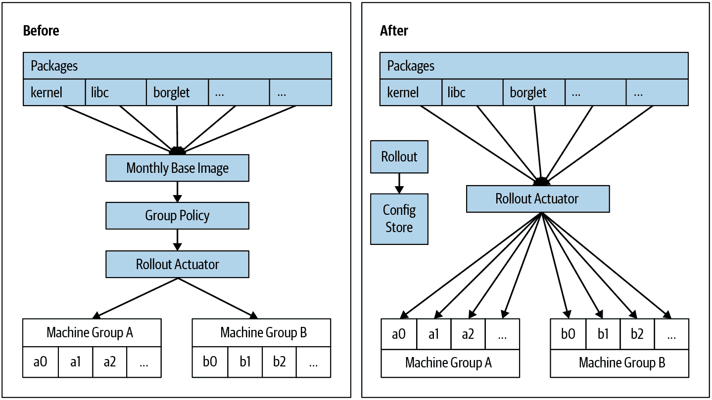

# 第九章：面向恢复的设计

> 原文：[9. Design for Recovery](https://google.github.io/building-secure-and-reliable-systems/raw/ch09.html)
> 
> 译者：[飞龙](https://github.com/wizardforcel)
> 
> 协议：[CC BY-NC-SA 4.0](https://creativecommons.org/licenses/by-nc-sa/4.0/)


由 Aaron Joyner，Jon McCune 和 Vitaliy Shipitsyn

与 Constantinos Neophytou，Jessie Yang 和 Kristina Bennett

现代分布式系统面临许多类型的故障，这些故障是由无意错误和蓄意恶意行为造成的。当暴露于不断累积的错误、罕见的故障模式或攻击者的恶意行为时，人类必须介入，以恢复甚至最安全和最有弹性的系统。

将失败或受损的系统恢复到稳定和安全状态可能会以意想不到的方式变得复杂。例如，回滚一个不稳定的发布版本可能会重新引入安全漏洞。推出新版本以修补安全漏洞可能会引入可靠性问题。这些风险性的缓解措施充满了更微妙的权衡。例如，在决定多快部署更改时，快速推出更有可能赢得与攻击者的竞赛，但也限制了您能够对其进行的测试量。您可能最终会广泛部署具有关键稳定性错误的新代码。

在紧张的安全或可靠性事件中开始考虑这些微妙之处以及您的系统缺乏处理它们的准备是远非理想的。只有有意识的设计决策才能使您的系统具备所需的可靠性和灵活性，以本能地支持各种恢复需求。本章涵盖了一些我们发现在准备我们的系统以促进恢复工作方面非常有效的设计原则。这些原则中的许多原则适用于各种规模，从全球范围的系统到单个机器内的固件环境。

# 我们正在从什么中恢复？

在我们深入探讨促进恢复的设计策略之前，我们将介绍一些导致系统需要恢复的情景。这些情景可以分为几个基本类别：随机错误、意外错误、恶意行为和软件错误。

## 随机错误

所有分布式系统都是由物理硬件构建的，所有物理硬件都会出现故障。物理设备的不可靠性以及它们运行的不可预测的物理环境导致了随机错误。随着支持系统的物理硬件数量的增加，分布式系统遭遇随机错误的可能性也增加。老化的硬件也会导致更多的错误。

一些随机错误比其他错误更容易恢复。系统的某个部分的完全故障或隔离，例如电源供应或关键网络路由器，是最简单的故障处理之一。[1]解决由意外位翻转引起的短暂损坏，或者由多核 CPU 中一个核上的故障指令引起的长期损坏则更为复杂。当这些错误悄无声息地发生时，它们尤其阴险。

系统外的基本不可预测事件也可能在现代数字系统中引入随机错误。龙卷风或地震可能会导致您突然永久地失去系统的特定部分。发电站或变电站故障或 UPS 或电池异常可能会影响向一个或多个机器提供电力。这可能会引入电压下降或波动，导致内存损坏或其他瞬态错误。

## 意外错误

所有分布式系统都是由人类直接或间接操作的，而所有人类都会犯错误。我们将*意外错误*定义为由怀着良好意图的人类造成的错误。人为错误率根据任务类型而异。粗略地说，任务复杂度增加，错误率也会增加。[3]

人类可能在系统的任何部分出现错误，因此你需要考虑人为错误如何在系统工具、系统和作业流程的整个堆栈中发生。意外错误也可能以系统外的随机方式影响你的系统，例如，如果用于无关施工的挖掘机切断了光纤电缆。

## 软件错误

迄今为止，我们已经讨论过的错误类型可以通过设计更改和/或软件来解决。用一个经典的引用和其推论来解释，所有的错误都可以通过软件来解决……除了软件中的错误。软件错误实际上只是意外错误的一个特殊延迟案例：在软件开发过程中发生的错误。你的代码会有 bug，你需要修复这些 bug。一些基本且广泛讨论的设计原则，例如模块化软件设计、测试、代码审查以及验证依赖 API 的输入和输出，可以帮助你解决 bug。第六章和第十二章更深入地讨论了这些主题。

在某些情况下，软件 bug 会模仿其他类型的错误。例如，缺乏安全检查的自动化可能会对生产进行突然而剧烈的更改，模仿恶意行为者。软件错误也会放大其他类型的错误，例如，传感器错误返回意外值，软件无法正确处理，或者在用户正常工作过程中绕过故障机制时出现的意外行为，看起来像是恶意攻击。

## 恶意行为

人类也可能故意对抗你的系统。这些人可能是有特权和高度了解的内部人员，有意为之。恶意行为者指的是一整类人积极地试图颠覆你的系统安全控制和可靠性，或者可能试图模仿随机、意外或其他类型的错误。自动化可以减少但无法消除对人类参与的需求。随着你的分布式系统规模和复杂性的增加，维护它的组织规模也必须与系统规模相适应（理想情况下，以次线性方式）。与此同时，组织中的人员违反你对他们的信任的可能性也在增加。

这些信任的违反可能来自滥用其对系统的合法权威，读取与其工作无关的用户数据，泄露或暴露公司机密，甚至积极致使系统长时间宕机的内部人员。这个人可能会短暂地做出错误的决定，有真正的恶意，成为社会工程攻击的受害者，甚至被外部行为者胁迫。

系统的第三方妥协也可能引入恶意错误。第二章深入介绍了恶意行为者的范围。在系统设计方面，无论恶意行为者是内部人员还是第三方攻击者，都采取相同的缓解策略。

# 恢复的设计原则

以下部分提供了一些基于我们多年分布式系统经验的恢复设计原则。这个列表并不是详尽无遗的，我们将提供进一步阅读的建议。这些原则也适用于各种组织，不仅仅是谷歌规模的组织。总的来说，在设计恢复时，重要的是要对可能出现的问题的广度和多样性持开放态度。换句话说，不要花时间担心如何对错误的微妙边缘情况进行分类；专注于准备从中恢复。

## 尽快进行设计（受策略保护）

在妥协或系统故障期间，有很大的压力要尽快恢复系统到预期的工作状态。然而，你用来快速更改系统的机制本身可能会冒着太快做出错误更改的风险，加剧问题。同样，如果你的系统被恶意入侵，过早的恢复或清理行动可能会引发其他问题，例如，你的行动可能会让对手知道他们已经被发现。我们发现在设计支持可变恢复速率的系统时，平衡涉及的权衡的一些方法是有效的。

要从我们的四类错误中恢复你的系统，或者更好的是，避免需要恢复，你必须能够改变系统的状态。在构建更新机制（例如软件/固件推出过程、配置更改管理程序或批处理调度服务）时，我们建议设计更新系统以尽可能快地运行（或更快，以符合实际限制）。然后，添加控件来限制变更速率，以匹配你当前的风险和干扰政策。将执行推出的能力与推出的速率和频率政策分离有几个优点。

任何组织的推出需求和政策随着时间而改变。例如，在早期，一家公司可能每月进行推出，而且从不在夜间或周末进行。如果推出系统是围绕政策变化设计的，政策的变化可能需要进行困难的重构和侵入性的代码更改。如果推出系统的设计清楚地将变更的时间和速率与变更的行为和内容分开，那么就更容易调整不可避免的管理时间和变更速率的政策变化。

有时，你在推出过程中收到的新信息会影响你的应对方式。想象一下，作为对内部发现的安全漏洞的响应，你正在部署一个内部开发的补丁。通常情况下，你不需要以足够快的速度部署这个变更，以至于冒着破坏你的服务的风险。然而，你的风险计算可能会因为景观的变化而改变（参见第七章）：如果你在推出过程中发现漏洞现在已经是公开的信息，并且正在野外积极利用，你可能希望加快程序。

必然会有一个时刻，突然或意外的事件会改变你愿意接受的风险。因此，你希望非常非常快地推出变更。例子可以从安全漏洞（ShellShock，Heartbleed 等）到发现活跃的妥协。*我们建议设计你的紧急推送系统只是将你的常规推送系统调到最大。*这也意味着你的正常推出系统和紧急回滚系统是一样的。我们经常说，未经测试的紧急实践在你需要它们时不起作用。使你的常规系统能够处理紧急情况意味着你不必维护两个单独的推送系统，并且你经常练习你的紧急发布系统。

如果应对紧张局势只需要你修改速率限制以便快速推出变更，你就会更有信心你的推出工具能够按预期工作。然后你可以把精力集中在其他不可避免的风险上，比如快速部署变更中的潜在错误，或者确保关闭攻击者可能用来访问你的系统的漏洞。

我们从我们内部 Linux 发行版的部署演变中学到了这些教训。直到最近，Google 在数据中心安装所有机器时都使用“基础”或“黄金”镜像，其中包含已知的静态文件集。每台机器有一些特定的定制，如主机名、网络配置和凭据。我们的政策是每个月在整个机群中部署新的“基础”镜像。多年来，我们围绕这一政策和工作流程构建了一套工具和软件更新系统：将所有文件捆绑成压缩存档，由高级 SRE 审查一组更改，然后逐渐更新机群中的机器到新镜像。

我们围绕这一政策构建了我们的部署工具，并设计了工具来将特定基础镜像映射到一组机器。我们设计了配置语言来表达如何在几周的时间内改变该映射，然后使用一些机制在基础镜像之上添加异常。一个异常包括越来越多的单个软件包的安全补丁：随着异常列表变得更加复杂，我们的工具遵循每月模式就变得不那么合理了。

作为回应，我们决定放弃每月更新基础镜像的假设。我们设计了更精细的发布单元，对应于每个软件包。我们还构建了一个干净的新 API，指定了要安装的精确软件包集，一次一个机器，放在现有的部署机制之上。如图 9-1 所示，这个 API 解耦了定义几个不同方面的软件：

+   部署和每个软件包应该更改的速率

+   定义所有机器当前配置的配置存储

+   管理将更新应用到每台机器的部署执行器



###### 图 9-1：将软件包部署到机器的工作流程的演变

因此，我们可以独立开发每个方面。然后，我们重新利用现有的配置存储来指定应用于每台机器的所有软件包的配置，并构建了一个部署系统来跟踪和更新每个软件包的独立部署。

通过将镜像构建与每月部署策略解耦，我们可以为不同软件包启用更广泛的发布速度范围。同时，虽然仍然保持对机群中大多数机器的稳定和一致的部署，一些测试机器可以跟随所有软件的最新构建。更好的是，解耦策略解锁了整个系统的新用途。我们现在使用它定期向整个机群分发一部分经过仔细审核的文件。我们还可以通过调整一些速率限制并批准某种类型的软件包的发布比正常情况下更快地进行，简单地使用我们的正常工具进行紧急发布。最终结果更简单，更有用，更安全。

## 限制对外部时间概念的依赖

时间——即由手表和挂钟等设备报告的普通时间——是一种状态。因为通常无法改变系统体验时间流逝的方式，您的系统融入挂钟时间的任何位置都可能威胁到您完成恢复的能力。在您进行恢复工作的时间和系统上次正常运行的时间之间的不匹配可能导致意想不到的系统行为。例如，涉及重放数字签名交易的恢复可能会失败，如果一些交易是由过期证书签名的，除非您在验证证书时考虑原始交易日期。

如果您的系统时间依赖性更有可能引入安全或可靠性问题，如果它依赖于您无法控制的外部时间概念。这种模式以多种类型的错误形式出现，例如软件错误，如[Y2K](https://oreil.ly/zV9E0)，[Unix 时代翻转](https://oreil.ly/heY_0)，或者开发人员选择将证书到期时间设置得太远，以至于“这不再是他们的问题”。明文或未经身份验证的[NTP](https://oreil.ly/9IG8s)连接也会引入风险，如果攻击者能够控制网络。代码中的固定日期或时间偏移展现出一种[代码异味](https://oreil.ly/zxfz2)，表明您可能正在制造一个定时炸弹。

###### 注意

将事件与挂钟时间绑定通常是一种反模式。我们建议使用以下之一，而不是挂钟时间：

+   费率

+   手动推进前进的概念，如时代编号或版本编号

+   有效性列表

如第八章中所述，谷歌的 ALTS 传输安全系统在数字证书中不使用到期时间，而是依赖于撤销系统。活动撤销列表由定义证书序列号有效与撤销范围的向量组成，并且不依赖于挂钟时间。您可以通过定期健康地推送更新的撤销列表来实现隔离目标，以创建时间区段。如果您怀疑对手可能已经获得了基础密钥的访问权限，您可以紧急推送新的撤销列表来撤销证书，并且您可以在异常情况下停止定期推送以进行调试或取证。有关该特定主题的更多讨论，请参见“使用显式撤销机制”。

依赖挂钟时间的设计选择也可能导致安全弱点。由于可靠性约束，您可能会有诱惑力禁用证书有效性检查以执行恢复。然而，在这种情况下，治疗比疾病更糟糕——最好是省略证书到期时间（从允许登录到一组服务器的 SSH 密钥对）而不是跳过有效性检查。要提供一个显着的例外，挂钟时间*是*用于有意限时访问。例如，您可能希望要求大多数员工每天重新进行身份验证。在这种情况下，重要的是要有一条修复系统的路径，而不依赖于挂钟时间。

依赖绝对时间也可能导致问题，当您尝试从崩溃中恢复，或者期望单调递增时间的数据库尝试从损坏中恢复时。恢复可能需要详尽的事务重放（随着数据集的增长，这很快变得不可行），或者尝试在多个系统之间协调地回滚时间。举个简单的例子：在具有不准确时间概念的系统之间进行日志相关会给您的工程师增加不必要的间接层，使意外错误更加普遍。

您还可以通过使用时代或版本的推进来消除对挂钟时间的依赖，这需要系统的所有部分围绕一个整数值进行协调，该值表示“有效”与“过期”的前进。时代可以是存储在分布式系统组件中的整数，例如锁定服务，或者是根据策略向前（只能向前移动）推进的机器本地状态。为了使您的系统能够尽快进行发布，您可能会设计它们以允许快速的时代推进。单个服务可能负责宣布当前时代或启动时代推进。在遇到问题时，您可以暂停时代的推进，直到您理解并纠正问题。回到我们先前的公钥示例：尽管证书可能会过期，但您不会因为可以停止时代的推进而被诱使完全禁用证书验证。时代与“最低可接受安全版本号”中讨论的 MASVN 方案有一些相似之处。

###### 注意

过于激进地增加时代值可能会导致翻转或溢出。要谨慎对待系统部署更改的速度，以及您可以容忍地跳过多少中间时代或版本值。

暂时控制您系统的对手可能通过大幅加速时代的推进或导致时代翻转来对系统造成持久性的损害。解决这个问题的常见方法是选择具有足够大范围的时代值，并建立一个基础的后备速率限制，例如，将 64 位整数速率限制为每秒增加一次。硬编码后备速率限制是我们先前设计建议的一个例外，即尽快推出更改并添加策略以指定更改的速率。然而，在这种情况下，很难想象有理由改变系统状态超过一秒一次，因为您将要处理数十亿年的时间。这种策略也是合理的，因为 64 位整数在现代硬件上通常是廉价的。

即使在等待经过的挂钟时间是可取的情况下，也要考虑仅仅测量经过的时间，而不需要实际的日期时间。即使系统不知道挂钟时间，后备速率限制也能起作用。

## 深入探讨：回滚代表了安全之间的权衡

在事件响应期间恢复的第一步是通过安全地回滚任何可疑更改来减轻事件。需要人工注意的生产问题的大部分是自我造成的（参见“意外错误”和“软件错误”），这意味着对系统的预期更改包含错误或其他错误配置，导致了事件。当这种情况发生时，可靠性的基本原则要求系统尽快而安全地回滚到上一个已知的良好状态。

在其他情况下，您需要*防止*回滚。在修补安全漏洞时，您经常在与攻击者竞赛，试图在攻击者利用漏洞之前部署补丁。一旦成功部署补丁并显示稳定，您需要防止攻击者应用可能重新引入漏洞的回滚，同时仍然保留自己自愿回滚的选项——因为安全补丁本身是代码更改，它们可能包含自己的错误或漏洞。

考虑到这些因素，确定回滚的适当条件可能会很复杂。应用层软件是一个更为直接的情况。系统软件，如操作系统或特权包管理守护程序，可以轻松终止和重新启动任务或进程。您可以将不良版本的名称（通常是唯一的标签字符串、数字或哈希¹⁰）收集到一个拒绝列表中，然后将其纳入部署系统的发布策略中。或者，您可以管理一个允许列表，并构建您的自动化以包括部署的应用软件在该列表中。

负责处理自己更新的特权或低级系统组件更具挑战性。我们称这些组件为*自更新*。例如，包管理守护程序通过覆盖自己的可执行文件并重新执行自己来更新自己，或者固件图像（如 BIOS）会在自身上重新刷写一个替换图像，然后强制重新启动。如果这些组件被恶意修改，它们可能会主动阻止自己被更新。硬件特定的实现要求增加了挑战。您需要回滚控制机制，即使对于这些组件，但是所需的行为本身可能很难定义。让我们考虑两个示例策略及其缺陷，以更好地理解问题：

允许任意回滚

这种解决方案并不安全，因为导致您执行回滚的任何因素都可能重新引入已知的安全漏洞。漏洞越老或越明显，稳定的、武器化的利用这些漏洞的可能性就越大。

永远不要允许回滚

这种解决方案消除了返回到已知稳定状态的路径，只允许您向前移动到更新的状态。这是不可靠的，因为如果更新引入了错误，您将无法回滚到上一个已知的良好版本。这种方法隐含地要求构建系统生成新版本，以便您可以向前滚动，这会给构建和发布工程基础设施增加时间和可避免的依赖关系。

除了这两种极端方法之外，还有许多其他实用的权衡方案。这些包括：

+   使用拒绝列表

+   使用安全版本号（SVNs）和最低可接受安全版本号（MASVNs）

+   轮换签名密钥

在接下来的讨论中，我们假设在所有情况下，更新都经过了加密签名，并且签名覆盖了组件图像及其版本元数据。

在这里讨论的三种技术的组合可能最好地管理自更新组件的安全性/可靠性权衡。然而，这种组合的复杂性，以及它对`ComponentState`的依赖，使这种方法成为一项巨大的工作。我们建议逐步引入一个功能，并允许足够的时间来识别您引入的每个组件的任何错误或特殊情况。最终，所有健康的组织都应该使用密钥轮换，但拒绝列表和 MASVN 功能对于高速响应是有用的。

### 拒绝列表

当您在发布版本中发现错误或漏洞时，您可能希望构建一个拒绝列表，以防止已知的不良版本被（重新）激活，也许可以通过在组件本身中硬编码拒绝列表来实现。在下面的示例中，我们将其写为`Release[DenyList]`。在组件更新到新发布的版本后，它会拒绝更新到拒绝列表中的版本。

```go

def IsUpdateAllowed(self, Release) -> bool:
  return Release[Version] not in self[DenyList]
```

不幸的是，这个解决方案只解决了意外错误，因为硬编码的拒绝列表呈现了一个无法解决的安全/可靠性权衡。如果拒绝列表总是留有至少一个较旧的已知良好的镜像的回滚空间，该方案就容易受到*解压*的攻击——攻击者可以逐步回滚版本，直到他们到达包含已知漏洞的较旧版本，然后利用这些漏洞。这种情况基本上就是之前描述的“允许任意回滚”的极端情况，中间还有一些跳跃。或者，将拒绝列表配置为完全阻止关键安全更新的回滚会导致“永远不允许回滚”的极端情况，伴随着可靠性的缺陷。

如果您正在从安全或可靠性事件中恢复，当您的系统可能在整个系统中进行多个更新时，硬编码的拒绝列表是一个很好的选择，可以避免意外错误。向列表中追加一个版本是快速且相对容易的，因为这样做对任何其他版本的有效性几乎没有影响。然而，您需要一个更强大的策略来抵抗恶意攻击。

更好的拒绝列表解决方案将拒绝列表编码在自更新组件之外。在下面的示例中，我们将其写为`ComponentState[DenyList]`。这个拒绝列表在组件升级和降级时都会保留下来，因为它独立于任何单个发布，但组件仍然需要逻辑来维护拒绝列表。每个发布可能合理地编码在其发布时已知的最全面的拒绝列表：`Release[DenyList]`。然后，维护逻辑将这些列表合并并在本地存储（请注意，我们写`self[DenyList]`而不是`Release[DenyList]`，以表明`self`已安装并且正在运行）：

```go

ComponentState[DenyList] = ComponentState[DenyList].union(self[DenyList))
```

检查临时更新的有效性，拒绝拒绝列表中的更新（不要明确引用`self`，因为它对拒绝列表的贡献已经反映在`ComponentState`中，即使未来版本被安装后仍然存在）：

```go

def IsUpdateAllowed(self, Release, ComponentState) -> bool:
  return Release[Version] not in ComponentState[DenyList]
```

现在，您可以有意地进行安全/可靠性权衡，作为一种政策。当您决定在`Release[DenyList]`中包含什么时，您可以权衡解压攻击的风险与不稳定发布的风险。

即使您将拒绝列表编码在一个`ComponentState`数据结构中，该数据结构在自更新组件之外维护，这种方法也有缺点：

+   即使拒绝列表存在于集中式部署系统的配置意图之外，您仍然需要监视和考虑它。

+   如果一个条目被意外添加到拒绝列表中，您可能希望将该条目从列表中删除。然而，引入删除功能可能会打开解压攻击的大门。

+   拒绝列表可能会无限增长，最终达到存储的大小限制。您如何管理拒绝列表的[垃圾收集](https://oreil.ly/_TsjS)？

### 最低可接受的安全版本号

随着时间的推移，拒绝列表会变得庞大而难以控制，因为条目被追加。您可以使用一个单独的安全版本号，写成`Release[SVN]`，从拒绝列表中删除较旧的条目，同时防止它们被安装。因此，您减少了对系统负责的人的认知负担。

保持`Release[SVN]`独立于其他版本概念，可以以一种紧凑且在数学上可比较的方式逻辑地跟踪大量发布，而无需像拒绝列表那样需要额外的空间。每当您应用关键安全修复并证明其稳定性时，您都会增加`Release[SVN]`，标记一个安全里程碑，用于调整回滚决策。因为您对每个版本的安全状态都有一个简单的指示器，所以您可以灵活地进行普通的发布测试和资格认证，并且有信心在发现错误或稳定性问题时迅速而安全地做出回滚决策。

请记住，您还希望防止恶意行为者以某种方式将系统回滚到已知的不良或易受攻击的版本。为了防止这些行为者在您的基础设施中立足并利用该立足点阻止恢复，您可以使用 MASVN 来定义一个低水位标记，低于该标记，您的系统不应该运行。这必须是一个有序值（而不是加密哈希），最好是一个简单的整数。您可以像管理拒绝列表一样管理 MASVN：

+   每个发布版本都包括一个 MASVN 值，反映了其发布时的可接受版本。

+   您在部署系统之外维护一个全局值，写为`ComponentState[MASVN]`。

作为应用更新的先决条件，所有发布都包括逻辑验证试探性更新的`Release[SVN]`至少与`ComponentState[MASVN]`一样高。它被表达为伪代码如下：

```go

def IsUpdateAllowed(self, Release, ComponentState) -> bool:
  return Release[SVN] >= ComponentState[MASVN]
```

全球`ComponentState[MASVN]`的维护操作不是部署过程的一部分。相反，维护是在新版本初始化时进行的。您需要在每个发布中硬编码一个目标 MASVN - 您希望在创建该发布时强制执行该组件的 MASVN，写为`Release[MASVN]`。

当部署和执行新版本时，它会将其`Release[MASVN]`（写为`self[MASVN]`，以引用已安装和运行的版本）与`ComponentState[MASVN]`进行比较。如果`Release[MASVN]`高于现有的`ComponentState[MASVN]`，那么`ComponentState[MASVN]`将更新为新的更大值。实际上，这个逻辑每次组件初始化时都会运行，但`ComponentState[MASVN]`只有在成功更新为更高的`Release[MASVN]`后才会更改。它被表达为伪代码如下：

```go

ComponentState[MASVN] = max(self[MASVN], ComponentState[MASVN])
```

这个方案可以模拟前面提到的两种极端政策中的任何一种：

+   通过永远不修改`Release[MASVN]`来允许任意回滚

+   通过将`Release[MASVN]`与`Release[SVN]`同步修改，永远不允许回滚

实际上，`Release[MASVN]`通常在第*i*+1 个版本中提高，之前的版本解决了安全问题。这确保了*i*–1 或更旧的版本永远不会再次执行。由于`ComponentState[MASVN]`是外部的，版本*i*在安装*i*+1 后不再允许降级，即使它最初允许这样的降级。图 9-2 说明了三个发布及其对`ComponentState[MASVN]`的影响的示例值。

![三个发布及其对 ComponentState[MASVN]的影响的序列](img/bsrs_0902.png)

###### 图 9-2：三个发布及其对 ComponentState[MASVN]的影响的序列

为了减轻第*i*–1 个版本中的安全漏洞，第*i*个版本包括安全补丁和递增的`Release[SVN]`。`Release[MASVN]`在第*i*个版本中不会改变，因为即使安全补丁也可能存在错误。一旦第*i*个版本在生产中被证明是稳定的，下一个版本，*i*+1，会递增 MASVN。这表示安全补丁现在是强制性的，没有它的版本是不允许的。

与“尽快进行”设计原则保持一致，MASVN 方案将合理的回滚目标策略与执行回滚的基础设施分开。在自更新组件中引入特定的 API 并从集中式部署管理系统接收命令来增加`ComponentState[MASVN]`是技术上可行的。通过该命令，您可以在部署管道的后期对接收更新的组件提高`ComponentState[MASVN]`，在足够多的设备上验证了发布版本后，您对其能够按计划工作有很高的信心。在响应活动妥协或特别严重的漏洞时，这样的 API 可能非常有用，其中速度至关重要，风险容忍度比正常情况下更高。

到目前为止，这个例子避免了引入专门的 API 来改变`ComponentState`。`ComponentState`是一组影响您通过更新或回滚来恢复系统能力的敏感值。它是组件本地的，并且与配置的意图外部的一个集中式自动化直接控制。在面对并行开发、测试、金丝雀分析和部署的情况下，每个个体组件经历的软件/固件版本序列可能会在类似或相同设备的群集中有所不同。一些组件或设备可能会经历完整的发布版本集合，而其他可能会经历许多回滚。还有一些可能经历最小的变化，并直接从有缺陷或有漏洞的版本跳转到下一个稳定的、合格的发布版本。

因此，使用 MASVN 是一种与拒绝列表结合使用的有用技术，用于自更新组件。在这种情况下，您可能会非常迅速地执行拒绝列表操作，可能是在事件响应条件下。然后在更平静的情况下执行 MASVN 维护，以清除拒绝列表并永久排除（基于每个组件实例）任何容易受到攻击或足够旧的发布版本，并且永远不打算在给定的组件实例上再次执行。

### 旋转签名密钥

许多自更新组件包括支持对临时更新进行加密认证的功能，换句话说，组件的发布周期的一部分包括对该发布进行加密签名。这些组件通常包括已知公钥的硬编码列表，或作为`ComponentState`的一部分支持独立密钥数据库。例如：

```go

def IsUpdateAllowed(self, Release, KeyDatabase) -> bool:
  return VerifySignature(Release, KeyDatabase)
```

您可以通过修改组件信任的一组公钥来防止回滚，通常是为了删除旧的或受损的密钥，或者引入一个新的密钥来签署未来的发布版本。较旧的发布版本将失效，因为较新的发布版本不再信任用于验证较旧发布版本上的签名的公共签名验证密钥。然而，您必须小心地管理密钥轮换，因为突然从一个签名密钥更改到另一个可能会使系统面临可靠性问题。

或者，您可以通过引入一个新的更新签名验证密钥*k*+1，同时与旧的验证密钥*k*一起允许使用任一密钥进行认证的更新。一旦稳定性得到证明，您就可以放弃对密钥*k*的信任。这种方案需要对发布版本的多个签名进行支持，并在验证候选更新时需要多个验证密钥。它还具有签名密钥轮换的优势——这是加密密钥管理的最佳实践——并且因此在事件发生后可能会起作用。

密钥轮换可以帮助您从非常严重的妥协中恢复，攻击者设法暂时控制了发布管理并签署并部署了`Release[MASVN]`设置为最大值的发布。在这种类型的攻击中，通过将`ComponentState[MASVN]`设置为其最大值，攻击者迫使您将`Release[SVN]`设置为其最大值，以便未来的发布能够可行，从而使整个 MASVN 方案无效。作为回应，您可以在由新密钥签署的新发布中撤销受损的公钥，并添加专用逻辑来识别异常高的`ComponentState[MASVN]`并将其重置。由于这种逻辑本身是微妙且潜在危险的，您应该谨慎使用，并在它们达到目的后立即积极撤销任何包含它的发布。

本章不涵盖严重和有针对性的妥协事件的全部复杂性。有关更多信息，请参阅第十八章。

### 回滚固件和其他硬件中心的约束

具有相应固件的硬件设备——如机器及其 BIOS，或网络接口卡（NIC）及其固件——是自更新组件的常见表现形式。这些设备在健壮的 MASVN 或密钥轮换方案方面提出了额外的挑战，我们在这里简要涉及。这些细节在恢复中发挥着重要作用，因为它们有助于实现可扩展或自动化的从潜在恶意行为中恢复。

有时，只可编程一次（OTP）设备如保险丝被 ROM 或固件用于通过存储`ComponentState[MASVN]`来实现一种仅向前的 MASVN 方案。这些方案存在重大的可靠性风险，因为回滚是不可行的。额外的软件层有助于解决物理硬件的约束。例如，OTP 支持的`ComponentState[MASVN]`覆盖了一个小型、单一用途的引导加载程序，其中包含其自己的 MASVN 逻辑，并且具有对单独的可变 MASVN 存储区的独占访问。然后，该引导加载程序将更健壮的 MASVN 语义暴露给更高级别的软件堆栈。

对于验证签名的硬件设备，有时使用 OTP 存储器来存储与这些密钥相关的公钥（或其哈希）和吊销信息。支持的密钥轮换或吊销次数通常受到严重限制。在这些情况下，一个常见的模式再次是使用 OTP 编码的公钥和吊销信息来验证一个小型引导加载程序。该引导加载程序然后包含其自己的验证和密钥管理逻辑层，类似于 MASVN 的示例。

当处理大量积极利用这些机制的硬件设备时，管理备件可能是一个挑战。备件在库存中停留多年，然后被部署时将必然具有非常旧的固件。这些旧的固件必须进行更新。如果旧的密钥完全不再使用，并且更新的发布仅由在备件最初制造时不存在的新密钥签署，那么新的更新将无法验证。

###### 注意

一种解决方案是通过一系列升级来引导设备，确保它们在密钥轮换事件期间停留在所有信任旧密钥和新密钥的发布上。另一种解决方案是支持每个发布的多个签名。即使更新的映像（和已更新以运行这些更新映像的设备）不信任旧的验证密钥，这些更新的映像仍然可以携带由该旧密钥签名的签名。只有旧的固件版本才能验证该签名——这是一种期望的操作，允许它们在被剥夺更新后恢复。

考虑设备在其生命周期内可能使用多少密钥，并确保设备具有足够的空间来存储密钥和签名。例如，一些 FPGA 产品支持多个密钥用于验证或加密它们的比特流。¹³

## 深入探讨：使用显式吊销机制

吊销系统的主要作用是阻止某种访问或功能。面对主动妥协，吊销系统可以成为救命稻草，让您快速吊销受攻击者控制的凭证，并恢复对系统的控制。然而，一旦建立了吊销系统，意外或恶意行为可能会导致可靠性和安全性后果。如果可能的话，在设计阶段考虑这些问题。理想情况下，吊销系统应该在任何时候都能够履行其职责，而不会引入太多自身的安全和可靠性风险。

为了说明有关吊销的一般概念，我们将考虑以下不幸但常见的情景：您发现攻击者以某种方式控制了有效凭证（例如允许登录到一组服务器的客户端 SSH 密钥对），并且您希望吊销这些凭证。

###### 注意

吊销是一个涉及到恢复、安全性和可靠性许多方面的复杂话题。本节仅讨论了与恢复相关的吊销的一些方面。其他要探讨的主题包括何时使用允许列表与拒绝列表，如何以崩溃恢复的方式卫生地旋转证书，以及如何在部署过程中安全地进行新更改的试点。本书的其他章节提供了许多这些主题的指导，但请记住，没有一本单独的书是足够的参考。

### 吊销证书的集中式服务

您可能选择使用集中式服务来吊销证书。这种机制通过要求您的系统与存储证书有效性信息的集中式证书有效性数据库进行通信，从而优先考虑安全性。您必须仔细监控和维护这个数据库，以保持系统的安全性，因为它成为了哪些证书是有效的的权威记录存储。这种方法类似于构建一个独立于用于实现更改的服务的独立速率限制服务，如本章前面讨论的那样。然而，要求与证书有效性数据库通信确实有一个缺点：如果数据库宕机，所有其他依赖系统也会宕机。如果证书有效性数据库不可用，很容易产生失败开放的强烈诱惑，以便其他系统也不会变得不可用。请谨慎处理！

### 失败开放

失败开放避免了锁定和简化了恢复，但也带来了一个危险的权衡：这种策略规避了对滥用或攻击的重要访问保护。即使部分失败开放的情况也可能会引起问题。例如，想象一下，证书有效性数据库依赖的系统宕机了。假设数据库依赖于时间或时代服务，但接受所有正确签名的凭证。如果证书有效性数据库无法访问时间/时代服务，那么进行相对简单的拒绝服务攻击的攻击者，例如通过压倒时间/时代服务的网络链接，可能会重新使用甚至非常旧的吊销凭证。这种攻击之所以有效，是因为在拒绝服务攻击持续期间，吊销的证书再次有效。在您尝试恢复时，攻击者可能会侵入您的网络或找到新的传播方式。

与其失败开放，您可能希望将已知的良好数据从吊销服务分发到个别服务器，以吊销列表的形式，节点可以在本地缓存。然后，节点根据他们对世界状态的最佳理解继续进行，直到他们获得更好的数据。这种选择比超时和失败开放政策安全得多。

### 直接处理紧急情况

为了快速吊销密钥和证书，您可能希望设计基础设施直接处理紧急情况，通过部署更改到服务器的*authorized_users*或 Key Revocation List (KRL)文件。¹⁵这种解决方案在多个方面都很麻烦。

###### 注意

在处理少量节点时，直接管理*authorized_keys*或*known_hosts*文件尤其诱人，但这种做法扩展性差，会在整个服务器群中模糊真相。很难确保一组给定的密钥已从所有服务器的文件中删除，特别是如果这些文件是唯一的真相来源。

与直接管理*authorized_keys*或*known_hosts*文件不同，您可以通过集中管理密钥和证书，并通过吊销列表将状态分发到服务器，以确保更新过程是一致的。实际上，部署显式吊销列表是在您以最大速度移动时最小化不确定性的机会：您可以使用通常的机制来更新和监控文件，包括您在各个节点上使用的速率限制机制。

### 消除对准确时间概念的依赖

使用显式吊销具有另一个优点：对于证书验证，这种方法消除了对准确时间概念的依赖。无论是意外还是恶意造成的，不正确的时间都会对证书验证造成严重破坏。例如，旧证书可能会突然再次变为有效，从而让攻击者进入，而正确的证书可能会突然无法通过验证，导致服务中断。这些都是您不希望在紧张的妥协或服务中断期间经历的复杂情况。

最好让系统的证书验证依赖于您直接控制的方面，例如推送包含根授权公钥或包含吊销列表的文件。推送文件的系统、文件本身以及真相的中央来源可能比时间的分发更安全、更有维护性和更受监控。然后，恢复只需简单地推送文件，监控只需检查这些是否是预期的文件——这些是您的系统已经使用的标准流程。

### 规模化吊销凭据

在使用显式吊销时，重要的是要考虑可扩展性的影响。可扩展的吊销需要谨慎，因为部分攻破您系统的攻击者可以利用这种部分妥协作为拒绝进一步服务的强大工具，甚至可能吊销整个基础设施中的每个有效凭据。继续之前提到的 SSH 示例，攻击者可能会尝试吊销所有 SSH 主机证书，但您的机器需要支持操作，如更新 KRL 文件以应用新的吊销信息。您如何保护这些操作免受滥用？

在更新 KRL 文件时，盲目地用新文件替换旧文件是麻烦的根源¹⁶——单次推送可能会吊销整个基础设施中的每个有效凭据。一个保护措施是让目标服务器在应用新 KRL 之前评估新 KRL，并拒绝吊销自己凭据的任何更新。忽略吊销所有主机凭据的 KRL 将被所有主机忽略。因为攻击者的最佳策略是吊销一半的机器，所以您至少可以保证在每次 KRL 推送后，至少一半的机器仍将正常运行。恢复和恢复一半的基础设施要容易得多，比恢复全部要容易得多。¹⁷

### 避免风险异常

由于规模，大型分布式系统可能会遇到分发吊销列表的问题。这些问题可能会限制您部署新的吊销列表的速度，并在删除受损凭据时减慢您的响应时间。

为了解决这个缺点，您可能会想要构建一个专门的“紧急”吊销列表。然而，这种解决方案可能不太理想。由于您很少使用紧急列表，当您最需要它时，这种机制可能不太可能起作用。更好的解决方案是对吊销列表进行分片，以便您可以逐步更新它。这样，在紧急情况下吊销凭据只需要更新部分数据。始终使用分片意味着您的系统始终使用多部分吊销列表，并且在正常和紧急情况下使用相同的机制。

同样，要注意添加“特殊”帐户（例如提供对高级员工的直接访问权限的帐户），这些帐户可以绕过吊销机制。这些帐户对攻击者非常有吸引力 - 对这种帐户的成功攻击可能使您所有的吊销机制失效。

## 了解您的预期状态，直到字节。

从任何类别的错误中恢复 - 无论是随机的、意外的、恶意的还是软件错误 - 都需要将系统恢复到已知的良好状态。如果您确实知道系统的预期状态并且有一种方法来读取部署状态，那么这样做就会更容易。这一点可能显而易见，但不知道预期状态是问题的常见根源。在每一层（每个服务、每个主机、每个设备等）彻底编码预期状态并减少可变状态，使得在返回到良好工作状态时更容易识别。最终，彻底编码预期状态是卓越自动化、安全、入侵检测和恢复到已知状态的基础。

### 主机管理

假设您管理一个单独的主机，比如物理机、虚拟机，甚至一个简单的 Docker 容器。您已经建立了基础设施来执行自动恢复，这带来了很多价值，因为它可以高效地处理可能发生的许多问题，比如在[SRE 书的第七章](https://landing.google.com/sre/sre-book/chapters/automation-at-google/)中详细讨论的问题。为了实现自动化，您需要对该单独机器的状态进行编码，包括运行在上面的工作负载。您需要编码足够的信息，以便自动化安全地将机器恢复到良好状态。在谷歌，我们在每个抽象层次上都应用这种范例，上下硬件和软件堆栈。

谷歌的系统将我们主机的软件包分发到机器群中，如“尽快设计（受策略保护）”中所述，以非常规的方式持续监视系统的整个状态。每台机器不断监视其本地文件系统，维护一个包括文件系统中每个文件的名称和加密校验和的映射。我们使用一个中央服务收集这些映射，并将它们与每台机器的分配软件包的预期状态进行比较。当我们发现预期状态与当前状态之间存在偏差时，我们将该信息附加到偏差列表中。

由于将各种恢复手段统一为一个过程，捕获机器状态的策略为恢复提供了强大的优势。如果宇宙射线随机损坏了磁盘上的一个位，我们会发现校验和不匹配并修复偏差。如果机器的预期状态发生了变化，因为一个组件的软件部署无意中改变了另一个组件的文件，改变了该文件的内容，我们会修复偏差。如果有人试图在正常管理工具和审查流程之外修改机器的本地配置（无论是意外还是恶意），我们也会修复该偏差。您可能选择通过重新映像整个系统来修复偏差，这种方法不太复杂，更容易实现，但在规模上更具破坏性。

除了捕获磁盘上文件的状态之外，许多应用程序还具有相应的内存状态。自动化恢复必须修复这两种状态。例如，当 SSH 守护程序启动时，它会从磁盘读取配置，并且除非受到指示，否则不会重新加载配置。为了确保内存状态根据需要进行更新，每个软件包都需要具有幂等的`post_install`命令，每当其文件出现偏差时都会运行。`OpenSSH`软件包的`post_install`会重新启动 SSH 守护程序。类似的`pre_rm`命令会在删除文件之前清理任何内存状态。这些简单的机制可以维护机器的所有内存状态，并报告和修复偏差。

对这种状态进行编码，让自动化检查每个偏差是否存在任何恶意差异。关于机器状态的丰富信息在安全事件后的取证分析中也非常有价值，帮助您更好地理解攻击者的行动和意图。例如，也许攻击者找到了一种方法在一些机器上存放恶意 shellcode，但无法逆向监控和修复系统，后者恢复了一个或多个机器上的意外变化。攻击者很难掩盖自己的行踪，因为中央服务会注意到并记录主机报告的偏差。

总之，在这个抽象级别上，所有状态变化都是相等的。您可以以类似的方式自动化、保护和验证所有状态变化，将失败的金丝雀分析回滚和更新的 bash 二进制文件的紧急部署视为常规变化。使用相同的基础设施使您能够就如何快速应用每个变化做出一致的政策决策。在这个级别上的速率限制可防止不同类型的变化之间意外碰撞，并建立最大可接受的变化速率。

### 设备固件

对于固件更新，您还可以在更低的层次上捕获状态。现代计算机中的各个硬件部件都有自己的软件和配置参数。出于安全和可靠性的考虑，您至少应该跟踪每个设备固件的版本。理想情况下，您应该捕获该固件可用的所有设置，并确保它们设置为预期值。

在管理谷歌机器的固件及其配置时，我们利用了与我们用于管理主机软件更新和偏差分析的相同系统和流程（参见“主机管理”）。自动化安全地分发所有固件的预期状态作为一个软件包，报告任何偏差，并根据我们的速率限制政策和其他处理中断的政策来修复偏差。

通常，预期状态并不直接暴露给监视文件系统的本地守护程序，它对设备固件没有特殊知识。我们通过允许每个软件包引用激活检查来解耦与硬件交互的复杂性，即软件包中定期运行的脚本或二进制文件，以确定软件包是否正确安装。脚本或二进制文件会执行与硬件通信和比较固件版本和配置参数的操作，然后报告任何意外的偏差。这种功能对于恢复特别有用，因为它赋予主题专家（即子系统所有者）采取适当措施来解决他们的专业领域中的问题。例如，自动化跟踪目标状态、当前状态和偏差。如果一台机器的目标是运行 BIOS 版本 3，但当前正在运行 BIOS 版本 1，自动化对 BIOS 版本 2 没有意见。软件包管理脚本确定是否可以将 BIOS 升级到版本 3，或者是否唯一的约束要求通过多个安装版本来引导子系统。

一些具体的例子说明了管理预期状态对安全性和可靠性都至关重要。谷歌使用特殊供应商提供的硬件与外部时间源（例如 GNSS/GPS 系统和原子钟）进行接口，以在生产中实现准确的时间保持，这是 Spanner 的前提条件。我们的硬件在设备上存储了两个不同的固件版本，分别存储在两个不同的芯片上。为了正确操作这些时间源，我们需要仔细配置这些固件版本。作为额外的复杂性，一些固件版本存在已知的错误，影响它们如何处理闰秒和其他边缘情况。如果我们不仔细维护这些设备上的固件和设置，我们就无法在生产中提供准确的时间。状态管理还需要覆盖备用、次要或其他非活动代码或配置，这些在恢复期间可能突然变为活动状态。在这种情况下，如果机器启动但时钟硬件无法提供足够准确的时间来运行我们的服务，那么我们的系统就没有充分恢复。

举个例子，现代 BIOS 具有对引导（和引导后）系统安全至关重要的许多参数。例如，您可能希望引导顺序优先选择 SATA 而不是 USB 引导设备，以防止数据中心中的恶意行为者轻松地从 USB 驱动器引导系统。更高级的部署跟踪和维护允许签署 BIOS 更新的密钥数据库，既用于管理轮换，又用于防范篡改。如果在恢复过程中主引导设备发生硬件故障，您不希望发现 BIOS 因为您忘记监视和指定次要引导设备的设置而卡在等待键盘输入的状态。

### 全球服务

服务中的最高抽象层和基础设施中最持久的部分，例如存储、命名和身份，可能是系统恢复最困难的领域。捕获状态的范式也适用于堆栈的这些高层。在构建或部署像 Spanner 或 Hadoop 这样的新全局单例系统时，确保支持多个实例，即使您永远不打算使用多个实例，甚至在第一次部署时也是如此。除了备份和恢复之外，您可能需要重建整个系统的新实例，以恢复该系统上的数据。

与手动设置服务不同，你可以通过编写命令式的自动化或使用声明性的高级配置语言（例如，容器编排配置工具如 Terraform）来设置服务。在这些情况下，你应该捕获服务创建的状态。这类似于测试驱动开发捕获代码的预期行为的方式，然后指导你的实现并帮助澄清公共 API。这两种做法都会导致更易维护的系统。

容器的流行意味着许多全球服务的构建模块的状态通常会被默认捕获。虽然自动捕获“大部分”服务状态是很好的，但不要被误导以为安全感是虚假的。从头开始恢复基础设施需要执行一系列复杂的依赖关系。这可能会导致发现意外的容量问题或循环依赖。如果你在物理基础设施上运行，问问自己：你是否有足够的备用机器、磁盘空间和网络容量来启动基础设施的第二份副本？如果你在像 GCP 或 AWS 这样的大型云平台上运行，你可能可以购买所需的物理资源，但你是否有足够的配额来在短时间内使用这些资源？你的系统是否自然地产生了任何相互依赖，以阻止从头开始进行干净的启动？在受控情况下进行灾难测试可能是有用的，以确保你对意外情况有所准备。

### 持久数据

> 没有人关心备份；他们只关心恢复。

到目前为止，我们已经专注于安全地恢复运行服务所需的基础设施。这对于一些无状态服务是足够的，但许多服务还存储持久数据，这增加了一系列特殊的挑战。关于备份和恢复持久数据的挑战有很多优秀的信息。在这里，我们讨论与安全性和可靠性相关的一些关键方面。

为了防御前面提到的错误类型，尤其是恶意错误，你的备份需要与主要存储具有相同级别的完整性保护。恶意内部人员可能会更改备份的内容，然后强制从损坏的备份中进行恢复。即使你有强大的加密签名来覆盖你的备份，如果你的恢复工具在恢复过程中不验证这些签名，或者如果你的内部访问控制没有正确限制可以手动进行签名的人员，那么这些签名就是无用的。

在可能的情况下，对持久数据的安全保护进行分隔是很重要的。如果你在数据的服务副本中检测到损坏，你应该将损坏隔离到实际上最小的数据子集中。如果你能够识别备份数据的这个子集并验证其完整性，那么恢复 0.01%的持久数据将会快得多，而不需要读取和验证其他 99.99%的数据。这种能力在持久数据的大小增长时变得尤为重要，尽管如果你遵循大型分布式系统设计的最佳实践，分隔通常会自然发生。计算分隔的块大小通常需要在存储和计算开销之间进行权衡，但你还应该考虑块大小对 MTTR 的影响。

你还应该考虑系统需要部分恢复的频率。还要考虑在恢复和数据迁移中涉及的系统之间共享多少常见基础设施：数据迁移通常与低优先级的部分恢复非常相似。如果每次数据迁移——无论是到另一台机器、机架、集群还是数据中心——都能够对恢复系统的关键部分进行练习并建立信心，那么当你最需要时，你就会知道所涉及的基础设施更有可能正常工作并且被理解。

数据恢复也可能引入其自己的安全和隐私问题。删除数据对于许多系统来说是必要的，而且通常也是法律要求的功能。确保你的数据恢复系统不会无意中允许你恢复被假定已销毁的数据。要意识到删除加密密钥和删除加密数据之间的区别。通过销毁相关的加密密钥使数据无法访问可能是有效的，但这种方法要求以符合细粒度数据删除要求的方式对用于各种类型数据的密钥进行分隔。

## 设计测试和持续验证

如第八章所讨论的，持续验证可以帮助维护一个强大的系统。为了做好恢复的准备，你的测试策略需要包括对恢复过程的测试。由于其性质，恢复过程在不熟悉的条件下执行不寻常的任务，如果没有测试，它们将遇到意想不到的挑战。例如，如果你正在自动创建一个干净的系统实例，一个良好的测试设计可能会揭示一个特定服务只有一个全局实例的假设，并帮助识别难以为该服务恢复创建第二个实例的情况。考虑测试可想象的恢复场景，以便在测试效率和生产实际性之间取得正确的平衡。

你还可以考虑测试恢复特别困难的小众情况。例如，在谷歌，我们在各种环境中实现了一个加密密钥管理协议：Arm 和 x86 CPU、UEFI 和裸机固件、Microsoft Visual C++（MSVC）、Clang、GCC 编译器等。我们知道对这个逻辑的所有故障模式进行练习将是具有挑战性的——即使在全面投入端到端测试的情况下，要真实地模拟硬件故障或中断通信也是困难的。因此，我们选择在一个可移植、编译器中立、位宽中立的方式中实现核心逻辑。我们对逻辑进行了大量的单元测试，并关注了用于抽象外部组件的接口设计。例如，为了伪造个别组件并练习它们的故障行为，我们创建了用于从闪存读取和写入字节、用于加密密钥存储以及用于性能监控原语的接口。这种测试环境条件的方法经受住了时间的考验，因为它明确地捕捉了我们想要恢复的故障类别。

最后，寻找通过持续验证来对恢复方法建立信心的方法。恢复涉及人类采取的行动，而人类是不可靠和不可预测的。仅仅依靠单元测试，甚至连续集成/交付/部署也无法捕捉到由人类技能或习惯导致的错误。例如，除了验证恢复工作流的有效性和互操作性之外，你还必须验证恢复说明是否可读且易于理解。

# 紧急访问

本章描述的恢复方法依赖于响应者与系统进行交互的能力，并且我们倡导使用与正常运营相同的主要服务来进行恢复过程。然而，当正常访问方法完全破坏时，您可能需要设计一个专用解决方案来部署。

组织通常具有紧急访问的独特需求和选择。关键是制定计划并建立维护和保护该访问的机制。此外，您需要了解您无法控制的系统层——这些层面的任何故障都是无法采取行动的，尽管它们会影响您。在这些情况下，您可能需要在其他人修复公司所依赖的服务时静观其变。为了最大程度地减少第三方故障对您的服务的影响，寻找您可以在基础设施的任何层面部署的潜在具有成本效益的冗余。当然，可能没有任何具有成本效益的替代方案，或者您可能已经达到了服务提供商所保证的最高 SLA。在这种情况下，请记住，您的可用性取决于您的依赖关系的总和。

谷歌的远程访问策略集中在部署自包含的关键服务到地理分布的机架上。为了支持恢复工作，我们旨在提供远程访问控制、高效的本地通信、替代网络和基础设施中的关键防御点。在全球性故障期间，由于每个机架至少对某些响应者保持可用，响应者可以开始修复他们可以访问的机架上的服务，然后径向扩展恢复进度。换句话说，当全球协作实际上是不可能的时候，任意较小的地区可以尝试自行解决问题。尽管响应者可能缺乏发现他们最需要的地方的上下文，并且存在地区分歧的风险，但这种方法可能会显著加速恢复。

## 访问控制

组织的访问控制服务不应成为所有远程访问的单点故障是至关重要的。理想情况下，您将能够实现避免相同依赖关系的替代组件，但是这些替代组件的可靠性可能需要不同的安全解决方案。虽然它们的访问策略必须同样强大，但出于技术或实际原因，它们可能不太方便和/或具有降级的功能集。

由于远程访问凭据可能无法使用，因此不能依赖于典型的凭据服务。因此，除非您可以用低依赖性实现替换这些组件，否则不能从访问基础设施的动态组件（如单一登录（SSO）或联合身份提供者）派生访问凭据。此外，选择这些凭据的生命周期构成了一个困难的风险管理权衡：对用户或设备强制执行短期访问凭据的良好做法，如果故障持续时间超过了它们，那么这将成为一个定时炸弹，因此您被迫延长凭据的生命周期以超过任何预期故障的长度，尽管存在额外的安全风险。此外，如果您是按固定时间表主动发放远程访问凭据，而不是在故障开始时按需激活它们，那么故障可能会在它们即将到期时开始。

如果网络访问采用用户或设备授权，对于任何依赖于动态组件的风险，与凭据服务面临的风险类似。随着越来越多的网络使用动态协议，您可能需要提供更加静态的替代方案。您可用的网络提供商列表可能会限制您的选择。如果可以使用具有静态网络访问控制的专用网络连接，请确保它们的定期更新不会破坏路由或授权。实现足够的监控以检测网络访问中断的位置，或者帮助区分网络访问问题和网络上层的问题可能尤为重要。

## 通信

紧急通信渠道是紧急响应的下一个关键因素。当值班人员的常规聊天服务无法使用或无法访问时，他们应该怎么办？如果聊天服务受到攻击者的威胁或被监听，该怎么办？

选择一种尽可能少依赖的通信技术（例如 Google Chat、Skype 或 Slack），并且对于响应团队的规模来说足够有用。如果该技术是外包的，那么即使系统外部的层面出现故障，响应者是否能够访问该系统？电话桥接虽然效率低下，但作为一种老式选择仍然存在，尽管它们越来越多地使用依赖于互联网的 IP 电话技术进行部署。如果公司希望部署自己的解决方案，互联网中继聊天（IRC）基础设施是可靠且自包含的，但缺乏一些安全方面的考虑。此外，您仍然需要确保在网络中断期间您的 IRC 服务器仍然可以访问。当您的通信渠道托管在自己的基础设施之外时，您可能还需要考虑提供商是否能够保证足够的身份验证和保密性来满足公司的需求。

## 响应者习惯

紧急访问技术的独特性通常导致与日常操作不同的做法。如果您不优先考虑这些技术的端到端可用性，响应者可能不知道如何在紧急情况下使用它们，您将失去这些技术的好处。整合低依赖性的替代方案可能会很困难，但这只是问题的一部分——一旦在很少使用的流程和工具中混入人类在压力下的混乱，结果复杂性可能会阻碍所有访问。换句话说，人类而不是技术可能会使紧急工具失效。

您能够最大程度地减少正常和紧急流程之间的区别，响应者就能够更多地依赖习惯。这将释放更多的认知能力，让他们能够更多地专注于不同之处。因此，组织对中断的弹性可能会提高。例如，在谷歌，我们集中在 Chrome、其扩展和与之相关的任何控件和工具作为远程访问的单一平台。将紧急模式引入 Chrome 扩展程序使我们能够在前期尽可能少地增加认知负荷，同时保留将其整合到更多扩展程序中的选项。

为了确保您的响应者定期进行紧急访问实践，引入将紧急访问整合到值班人员的日常习惯中的政策，并持续验证相关系统的可用性。例如，定义并强制执行所需练习之间的最短时间。团队负责人可以在团队成员需要完成必需的凭证刷新或培训任务时发送电子邮件通知，或者可以选择放弃练习，如果他们确定该个人定期参与等效活动。这增加了信心，当发生事故时，团队的其他成员确实拥有相关的凭证，并且最近完成了必要的培训。否则，让您的员工强制练习打破玻璃操作和任何相关流程。

最后，请确保相关的文件，如政策、标准和操作指南，是可用的。人们往往会忘记很少使用的细节，这样的文件也可以在压力和怀疑下减轻压力。架构概述和图表对于事件响应者也是有帮助的，并且可以让不熟悉该主题的人快速了解，而不太依赖于专家。

# 意想不到的好处

本章描述的设计原则，建立在弹性设计原则的基础上，提高了系统的恢复能力。可靠性和安全性之外的意想不到的好处可能会帮助您说服您的组织采用这些实践。考虑一个专门用于固件更新认证、回滚、锁定和证明机制的服务器。有了这些基本功能，您可以自信地从检测到的妥协中恢复机器。现在考虑在“裸金属”云托管服务中使用这台机器，供应商希望使用自动化清理和转售机器。已经考虑了恢复的机器已经有了一个安全和自动化的解决方案。

这些好处在供应链安全方面进一步增加。当机器由许多不同的组件组装而成时，您需要更少地关注那些完整性可以通过自动方式恢复的组件的供应链安全性。您的首次操作只需要运行恢复程序。作为额外的奖励，重新利用恢复程序意味着您定期锻炼您的关键恢复能力，因此当发生事故时，您的员工已经准备好采取行动。

为恢复设计系统被认为是一个高级话题，其商业价值只有在系统脱离预期状态时才能得到证明。但是，鉴于我们建议操作系统使用错误预算来最大化成本效率，我们预计这样的系统会经常处于错误状态。我们希望您的团队将慢慢开始在开发过程中尽早投资于速率限制或回滚机制。有关如何影响您的组织的更多见解，请参见第二十一章。

# 结论

本章探讨了为恢复设计系统的各个方面。我们解释了系统应该在部署更改的速率方面具有灵活性的原因：这种灵活性使您能够在可能的情况下缓慢推出更改，并避免协调失败，但也使您能够在必须接受更多风险以满足安全目标时快速而自信地推出更改。回滚更改的能力对于构建可靠的系统至关重要，但有时您可能需要防止回滚到不安全或足够旧的版本。了解、监视和尽可能重现系统的状态——通过软件版本、内存、挂钟时间等——是可靠地恢复系统到以前的工作状态的关键，并确保其当前状态符合您的安全要求。作为最后的手段，紧急访问允许响应者保持连接，评估系统并缓解情况。深思熟虑地管理政策与程序、中央真相来源与本地功能、预期状态与系统实际状态之间的关系为可恢复的系统铺平了道路，同时促进了韧性和日常运营的稳健性。

¹ [CAP 定理](https://oreil.ly/WP_FI)描述了扩展分布式系统涉及的一些权衡以及其后果。

² 意外的位翻转可能是由于硬件故障，来自其他系统的噪音，甚至是宇宙射线引起的。第十五章更详细地讨论了硬件故障。

³ 一个名为人类可靠性分析（HRA）的研究领域记录了在给定任务中人为错误的可能性。有关更多信息，请参见美国核监管委员会的[概率风险评估](https://oreil.ly/fGTHa)。

⁴ “计算机科学中的所有问题都可以通过另一级间接性来解决。” ——David Wheeler

⁵ “… 除了太多级别的间接性。” ——未知

⁶ 有关在受到威胁时如何应对以及确定您的恢复系统是否受到威胁的元问题的详细讨论，请参见第十八章。第七章还有额外的设计模式和示例，描述了如何选择适当的速率。

⁷ 请参见[CVE-2014-6271](https://oreil.ly/mRhGN)、[CVE-2014-6277](https://oreil.ly/yyf6K)、[CVE-2014-6278](https://oreil.ly/7ii2u)和[CVE-2014-7169](https://oreil.ly/0ZD04)。

⁸ 请参见[CVE-2014-0160](https://oreil.ly/cJTQ8)。

⁹ 这个原则的推论是：如果您在紧急情况下有一个有效的方法（通常是因为它的依赖性低），那就把它作为您的标准方法。

¹⁰ 例如，完整程序或固件映像的加密哈希（如 SHA256）。

¹¹ “已知不良”版本可能是由于成功但不可逆转的更改，例如主要模式更改，或者由于错误和漏洞。

¹² 另一个广泛部署的精心管理的安全版本号的例子存在于英特尔的微码 SVN 中，例如用于[缓解安全问题 CVE-2018-3615](https://oreil.ly/fN9f3)。

¹³ 一个例子是[Xilinx Zynq Ultrascale+设备](https://oreil.ly/hfydr)中的硬件信任根支持。

¹⁴ 立即撤销凭证可能并不总是最佳选择。有关应对妥协的讨论，请参见第十七章。

15. KRL 文件是由证书颁发机构（CA）吊销的密钥的紧凑二进制表示。有关详细信息，请参阅[`ssh-keygen(1)` manpage](https://oreil.ly/rRqkZ)。

16. 虽然本章重点是*恢复*，但也至关重要的是考虑这样操作的*弹性*。在像 Linux 这样的 POSIX 系统上替换关键配置文件时，需要谨慎确保在崩溃或其他故障发生时具有稳健的行为。考虑使用带有`RENAME_EXCHANGE`标志的`renameat2`系统调用。

17. 连续的恶意 KRL 推送可能会扩大负面影响，但速度和广度的限制仍然会实质性地扩大响应窗口。

18. `post_install` 和 `pre_rm` 的概念是从[Debian](https://oreil.ly/H9q9p)的`preinst`、`postinst`、`prerm`和`postrm`中借鉴而来的。谷歌的软件包管理系统采取了更加强硬的方法：它不允许软件包的配置和安装分开，也不允许安装过程中出现一半的成功。任何软件包的更改都保证会成功，否则机器将完全回滚到先前的状态。如果回滚失败，机器将通过我们的修复流程进行重新安装和潜在的硬件更换。这种方法使我们能够消除软件包状态的许多复杂性。

19. 有关应对妥协的进一步讨论，请参阅第十七章。

20. [Spanner](https://oreil.ly/YGCjO)是谷歌的全球分布式数据库，支持外部一致的分布式事务。它需要数据中心之间非常紧密的时间同步。

21. 请参阅 Krishnan, Kripa. 2012. “Weathering the Unexpected.” *ACM Queue* 10(9). [*https://oreil.ly/vJ66c*](https://oreil.ly/vJ66c)。

22. 许多版本的这一优秀建议都被归因于许多备受尊敬的工程师。我们在印刷品中找到的最古老版本，碰巧是在作者书架上的一本书中，是来自 W. Curtis Preston 的[*Unix Backup & Recovery*](http://shop.oreilly.com/product/9781565926424.do)（O’Reilly）。他将这句话归因于 Ron Rodriguez，即“没有人在乎你能否备份——只在乎你能否恢复”。

23. 有关入门知识，请参阅 Kristina Bennett 的 SREcon18 演讲[“Tradeoffs in Resiliency: Managing the Burden of Data Recoverability”](https://oreil.ly/V-FEC)。

24. 例如，查看谷歌的[数据保留政策](https://oreil.ly/abNZP)。

25. 请参阅 Treynor, Ben 等人。2017. “The Calculus of Service Availability.” *ACM Queue* 15(2). [*https://oreil.ly/It4-h*](https://oreil.ly/It4-h)。

26. 例如，软件定义网络（SDN）。

27. Breakglass 工具是可以绕过策略以允许工程师快速解决故障的机制。请参阅[“Breakglass”](ch05.html#breakglass)。

28. 有关错误预算的更多信息，请参阅[SRE 书中的第三章](https://landing.google.com/sre/sre-book/chapters/embracing-risk/)。
