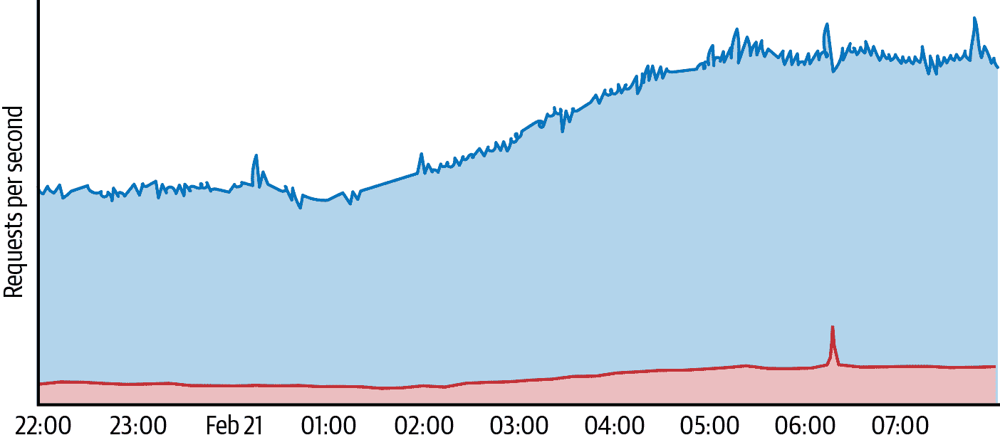
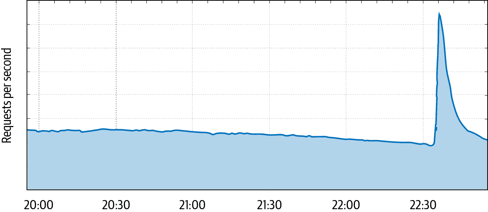

# 第十章：减轻拒绝服务攻击

> 原文：[10. Mitigating Denial-of-Service Attacks](https://google.github.io/building-secure-and-reliable-systems/raw/ch10.html)
> 
> 译者：[飞龙](https://github.com/wizardforcel)
> 
> 协议：[CC BY-NC-SA 4.0](https://creativecommons.org/licenses/by-nc-sa/4.0/)

作者：Damian Menscher

与 Vitaliy Shipitsyn 和 Betsy Beyer 一起

安全从业者通常从*攻击*和*防御*的角度考虑他们保护的系统。但在典型的拒绝服务攻击中，经济学提供了更有用的术语：对手试图导致对特定服务的*需求*超过该服务容量的*供应*。¹ 最终结果是服务容量不足以为其合法用户提供服务。组织随后必须决定是承担更大的费用来吸收攻击，还是遭受停机时间（以及相应的财务损失），直到攻击停止。

虽然一些行业比其他行业更经常成为 DoS 攻击的目标，但任何服务都可能以这种方式受到攻击。*DoS 勒索*是一种金融攻击，对手威胁要破坏服务，除非付款，相对不加选择地打击。²

# 攻击和防御策略

攻击者和防御者资源有限，必须有效地利用资源来实现其目标。在制定防御策略时，了解对手的策略是有帮助的，这样您就可以在他们之前找到防御的弱点。有了这种理解，您可以构建已知攻击的防御，并设计具有灵活性的系统，以快速减轻新型攻击。

## 攻击者的策略

攻击者必须专注于有效地利用有限的资源来超过其目标的容量。聪明的对手可能能够破坏更强大对手的服务。

典型服务有几个依赖关系。考虑一个典型用户请求的流程：

1.  DNS 查询提供应该接收用户流量的服务器的 IP 地址。

1.  网络将请求传递到服务前端。

1.  服务前端解释用户请求。

1.  服务后端为自定义响应提供数据库功能。

成功破坏这些步骤中的任何一个的攻击将破坏服务。大多数新手攻击者将尝试发送一大堆应用程序请求或网络流量。更复杂的攻击者可能会生成更昂贵的请求来回答 - 例如，滥用许多网站上存在的搜索功能。

因为单台机器很少足以破坏大型服务（通常由多台机器支持），决心的对手将开发工具，利用许多机器的力量进行所谓的*分布式拒绝服务*（DDoS）攻击。要执行 DDoS 攻击，攻击者可以利用易受攻击的机器并将它们组合成*僵尸网络*，或发动*放大攻击*。

## 防御者的策略

资源充足的防御者可以通过过度配置整个堆栈来吸收攻击，但代价很大。充满耗电量的机器的数据中心很昂贵，而为吸收最大攻击而提供始终开启的容量是不可行的。虽然自动扩展可能是具有充足容量的云平台上构建的服务的选项，但防御者通常需要利用其他成本效益的方法来保护其服务。

在确定最佳的 DoS 防御策略时，您需要考虑工程时间 - 您应该优先考虑具有最大影响的策略。虽然专注于解决昨天的故障很诱人，但最近的偏见可能导致迅速变化的优先事项。相反，我们建议使用威胁模型方法，集中精力解决依赖链中的最薄弱环节。您可以根据攻击者需要控制的机器数量来比较威胁，以造成用户可见的破坏。

###### 注意

我们使用术语*DDoS*来指代仅因其分布式性质而有效的 DoS 攻击，以及使用大型僵尸网络或放大攻击。我们使用术语*DoS*来指代可能源自单个主机的攻击。在设计防御时，这种区别是相关的，因为您通常可以在应用层部署 DoS 防御，而 DDoS 防御通常利用基础设施内的过滤器。

# 为防御而设计

理想的攻击会将所有力量集中在单一受限资源上，例如网络带宽、应用服务器 CPU 或内存，或者像数据库这样的后端服务。您的目标应该是以最有效的方式保护这些资源。

随着攻击流量深入系统，它变得更加集中和更加昂贵，因此，分层防御，即每一层保护其后面的层，是一种必不可少的设计特征。在这里，我们将研究导致两个主要层中的可防御系统的设计选择：共享基础设施和个体服务。

## 可防御的架构

大多数服务共享一些常见的基础设施，例如对等容量、网络负载均衡器和应用负载均衡器。

共享基础设施是提供共享防御的自然场所。边缘路由器可以限制高带宽攻击，保护骨干网络。网络负载均衡器可以限制数据包洪泛攻击，以保护应用负载均衡器。应用负载均衡器可以在流量到达服务前端之前限制特定于应用程序的攻击。

分层防御往往是具有成本效益的，因为您只需要为内部层的 DoS 攻击风格进行容量规划，这些攻击风格可以突破外部层的防御。尽早消除攻击流量既节省了带宽，也节省了处理能力。例如，通过在网络边缘部署 ACL，您可以在流量有机会消耗内部网络带宽之前丢弃可疑流量。在网络边缘附近部署缓存代理也可以提供显着的成本节约，同时还可以减少合法用户的延迟。

###### 注意

有状态的防火墙规则通常不适合作为接收入站连接的生产系统的第一道防线。⁵对手可以进行*状态耗尽攻击*，其中大量未使用的连接填满了启用了连接跟踪的防火墙的内存。相反，使用路由器 ACL 来限制流量到必要的端口，而不会引入有状态的系统到数据路径中。

在共享基础设施中实现防御也提供了有价值的规模经济。虽然为任何个体服务提供重要的防御能力可能不具有成本效益，但共享防御可以让您一次性覆盖广泛的服务。例如，图 10-1 显示了一次针对一个站点的攻击产生的流量量远高于该站点的正常流量，但与[Project Shield](https://projectshield.withgoogle.com)保护的所有站点接收到的流量相比，仍然是可以管理的。商业 DoS 缓解服务使用类似的捆绑方法来提供成本效益的解决方案。

###### 图 10-1\. 通过 Project Shield 保护的站点遭受的 DDoS 攻击，从（上）个体站点的角度和（下）Project Shield 负载均衡器的角度看

特别大规模的 DDoS 攻击可能会压倒数据中心的容量，就像放大镜可以利用太阳的能量点燃火一样。任何防御策略都必须确保分布式攻击所达到的能力不能集中到任何单一组件上。您可以使用网络和应用负载均衡器不断监视传入流量，并将流量传送到最近具有可用容量的数据中心，防止这种类型的过载。

您可以使用*anycast*来保护共享基础设施，而不依赖于一种被动系统，这是一种技术，其中一个 IP 地址从多个位置宣布。使用这种技术，每个位置都会吸引附近用户的流量。因此，分布式攻击将分散到世界各地的位置，并且因此无法将其能力集中到任何单一数据中心。

## 可防御服务

网站或应用程序设计可能会对服务的防御姿态产生重大影响。尽管确保服务在过载条件下能够优雅地降级提供了最佳的防御，但可以进行几项简单的更改来提高对攻击的弹性，并在正常运行中实现显着的成本节约：

利用缓存代理

使用`Cache-Control`和相关标头可以允许代理重复请求内容，而无需每个请求都命中应用程序后端。这适用于大多数静态图像，甚至适用于主页。

避免不必要的应用程序请求

每个请求都会消耗服务器资源，因此最好尽量减少所需的请求次数。如果一个网页包含多个小图标，最好将它们全部放在一个（较大的）图像中，这种技术称为*图像合并*。作为一个附带好处，减少真实用户对服务的请求次数将减少在识别恶意机器人时的误报。

最小化出口带宽

虽然传统攻击试图饱和入口带宽，但攻击也可能通过请求大资源来饱和您的带宽。将图像调整为所需大小将节省出口带宽，并减少用户的页面加载时间。限制速率或降低不可避免的大型响应也是另一种选择。

# 减轻攻击

虽然可防御的架构提供了抵御许多 DoS 攻击的能力，但您可能还需要积极的防御来减轻大规模或复杂的攻击。

## 监控和警报

停机解决时间由两个因素主导：检测到故障的平均时间（MTTD）和修复故障的平均时间（MTTR）。DoS 攻击可能会导致服务器 CPU 利用率飙升，或者应用程序在排队请求时耗尽内存。为了快速诊断根本原因，您需要监视请求速率以及 CPU 和内存使用情况。

对异常高的请求速率发出警报可以清楚地指示事件响应团队遭受了攻击。但是，请确保您的警报是可操作的。如果攻击没有对用户造成实质性伤害，通常最好是吸收它。我们建议只在需求超过服务容量并且自动 DoS 防御已经启动时发出警报。

只有在可能需要人工干预时才发出警报的原则同样适用于网络层攻击。许多 synflood 攻击可以被吸收，但如果触发了 syncookies，则可能需要发出警报。类似地，高带宽攻击只有在链接饱和时才值得关注。

## 优雅降级

如果吸收攻击是不可行的，您应尽量减少对用户的影响。

在大规模攻击期间，您可以使用网络 ACL 来限制可疑流量，提供有效的开关以立即限制攻击流量。重要的是不要一直阻止可疑流量，这样您可以保持对系统的可见性，并最小化影响与攻击特征匹配的合法流量的风险。因为聪明的对手可能模拟合法流量，所以限制可能不足够。此外，您可以使用服务质量（QoS）控件来优先处理关键流量。对于像批量复制这样不太重要的流量使用较低的 QoS 可以在需要时释放带宽到更高的 QoS 队列。

在超载的情况下，应用程序也可以退回到降级模式。例如，Google 处理超载的方式有：

+   博客服务以只读模式提供，禁用评论。

+   Web 搜索继续提供带有减少功能集的服务。

+   DNS 服务器会尽可能回答尽可能多的请求，但设计上不会在任何负载下崩溃。

有关处理超载的更多想法，请参见第八章。

## DoS 缓解系统

自动防御，例如限制前几个 IP 地址或提供 JavaScript 或 CAPTCHA 挑战，可以快速而一致地缓解攻击。这使得事件响应团队有时间了解问题，并确定是否需要自定义缓解措施。

自动 DoS 缓解系统可以分为两个组件：

检测

系统必须对传入流量有尽可能详细的可见性。这可能需要在所有端点进行统计抽样，并将其汇总到一个中央控制系统。控制系统识别可能表明攻击的异常情况，同时与了解服务容量的负载均衡器一起确定是否需要响应。

响应

系统必须具有实现防御机制的能力，例如，提供一组要阻止的 IP 地址。

在任何大规模系统中，误报（和误报）是不可避免的。当通过 IP 地址阻止时，尤其如此，因为多个设备共享单个网络地址是很常见的（例如，在使用网络地址转换时）。为了最小化对相同 IP 地址后面的其他用户造成的附带损害，您可以利用 CAPTCHA 来允许真实用户绕过应用程序级别的阻止。

您还必须考虑 DoS 缓解系统的故障模式 - 问题可能由攻击，配置更改，不相关的基础设施故障或其他原因触发。

DoS 缓解系统本身必须对攻击具有弹性。因此，它应避免依赖可能受到 DoS 攻击影响的生产基础设施。这些建议不仅适用于服务本身，还适用于事件响应团队的工具和通信程序。例如，由于 Gmail 或 Google Docs 可能会受到 DoS 攻击的影响，Google 拥有备用通信方法和 playbook 存储。

攻击通常会导致立即中断。虽然优雅降级可以减少过载服务的影响，但最好的情况是 DoS 缓解系统可以在几秒钟而不是几分钟内做出响应。这种特性与缓慢部署变更的最佳实践产生自然的紧张关系，以防止中断。作为一种权衡，我们可以在我们的生产基础设施的子集上对所有变更（包括自动响应）进行金丝雀测试，然后再将其部署到所有地方。金丝雀测试可能非常简短 - 在某些情况下可能只有 1 秒钟！

如果中央控制器失败，我们不希望出现关闭失败（因为这将阻止所有流量，导致故障）或者开放失败（因为这将让正在进行的攻击通过）。相反，我们失败静态，这意味着策略不会改变。这允许控制系统在攻击期间失败（这实际上在 Google 发生过！）而不会导致故障。因为我们失败静态，DoS 引擎不必像前端基础设施那样高度可用，从而降低成本。

## 战略性响应

在应对故障时，很容易纯粹是被动的，并尝试过滤当前的攻击流量。虽然快速，但这种方法可能并不是最佳的。攻击者可能在第一次尝试失败后放弃，但如果他们不放弃呢？对手有无限的机会来探测防御并构建绕过。战略性的响应避免通知对手对您的系统的分析。例如，我们曾经收到一个攻击，它通过其`User-Agent: I AM BOTNET`*.*轻松识别。如果我们简单地丢弃所有带有该字符串的流量，我们将教会我们的对手使用更合理的`User-Agent`，比如`Chrome`。相反，我们列举了发送该流量的 IP，并拦截了他们一段时间内的*所有*请求，使用验证码。这种方法使对手更难使用[A/B 测试](https://oreil.ly/xuQrD)来了解我们如何隔离攻击流量。即使他们修改为发送不同的`User-Agent`，它也会主动阻止他们的僵尸网络。

了解对手的能力和目标可以指导您的防御。小型放大攻击表明您的对手可能仅限于可以发送伪造数据包的单个服务器，而重复获取同一页面的 HTTP DDoS 攻击表明他们可能可以访问僵尸网络。但有时“攻击”是无意的-您的对手可能只是试图以不可持续的速度抓取您的网站。在这种情况下，您最好的解决方案可能是确保网站不容易被抓取。

最后，请记住您并不孤单-其他人也面临类似的威胁。考虑与其他组织合作，以改善您的防御和响应能力：DoS 缓解提供商可以清除某些类型的流量，网络提供商可以执行上游过滤，网络运营商社区可以识别和过滤攻击源。

# 处理自我造成的攻击

在主要故障的肾上腺素飙升期间，自然反应是专注于打败对手的目标。但如果没有对手可以打败呢？突然增加流量的一些其他常见原因。

## 用户行为

大多数时候，用户做出独立的决定，他们的行为平均成为平滑的需求曲线。然而，外部事件可以同步他们的行为。例如，如果夜间地震唤醒了人口中的每个人，他们可能会突然转向他们的设备搜索安全信息，发布到社交媒体，或者与朋友联系。这些同时的行动可能导致服务接收到突然增加的使用，就像图 10-2 中显示的流量峰值一样。

###### 图 10-2：当 2019 年 10 月 14 日发生 4.5 级地震时，测量每秒 HTTP 请求达到谷歌基础设施的网络流量，为旧金山湾区的用户提供服务

我们通过设计更改来解决这种“攻击”：我们推出了一个功能，当您输入时会建议单词完成。

## 客户端重试行为

一些“攻击”是无意的，只是由于软件的不当行为。如果客户端期望从服务器获取资源，而服务器返回错误，会发生什么？开发人员可能认为重试是合适的，如果服务器仍在提供错误，就会导致循环。如果许多客户端陷入这种循环，由此产生的需求会使从停机中恢复变得困难。⁹

客户端软件应该被精心设计以避免紧密的重试循环。如果服务器失败，客户端可能会重试，但应该实现指数退避——例如，每次尝试失败时等待时间加倍。这种方法限制了对服务器的请求次数，但单独使用是不够的——停机会同步所有客户端，导致高流量的重复突发。为了避免同步重试，每个客户端应该等待一个随机的持续时间，称为*抖动*。在谷歌，我们在大多数客户端软件中实现了带有抖动的指数退避。

如果你不能控制客户端会怎么办？这是运营权威 DNS 服务器的人们的一个常见关注点。如果他们遭受停机，合法递归 DNS 服务器的重试率可能会导致流量显著增加——通常是正常使用量的 30 倍左右。这种需求会使从停机中恢复变得困难，并经常挫败找到其根本原因的尝试：运营商可能认为 DDoS 攻击是原因，而不是症状。在这种情况下，最好的选择是简单地回答尽可能多的请求，同时通过上游请求限流保持服务器的健康。每个成功的响应都将允许客户端摆脱其重试循环，问题很快就会得到解决。

# 结论

每个在线服务都应该为 DoS 攻击做好准备，即使他们认为自己不太可能成为目标。每个组织都有它可以吸收的流量上限，防御者的任务是以最有效的方式减轻超出部署能力的攻击。

重要的是要记住你的 DoS 防御的经济约束。简单地吸收攻击很少是最廉价的方法。相反，利用成本效益的缓解技术，从设计阶段开始。在遭受攻击时，考虑所有选项，包括阻止有问题的托管提供商（可能包括少量真实用户）或遭受短期停机并向用户解释情况。还要记住，“攻击”可能是无意的。

在服务堆栈的每一层实现防御措施需要与几个团队合作。对于一些团队来说，DoS 防御可能不是首要任务。为了获得他们的支持，要关注 DoS 缓解系统可以提供的成本节约和组织简化。容量规划可以专注于真实用户需求，而不需要在堆栈的每一层吸收最大规模的攻击。使用 Web 应用程序防火墙（WAF）过滤已知的恶意请求，允许安全团队专注于新型威胁。如果发现应用程序级别的漏洞，同样的系统可以阻止利用尝试，让开发团队有时间准备补丁。

通过仔细的准备，你可以按照自己的条件确定服务的功能和故障模式，而不是对手的条件。

¹ 为了讨论的方便，我们将专注于常见情况，即攻击者没有物理接触和挖掘机，也不知道崩溃漏洞。

² 一些勒索者会发动小规模的“示范攻击”来促使目标付款。几乎所有情况下，这些攻击者没有能力发动更大规模的攻击，如果他们的要求被忽视，他们也不会再做进一步的威胁。

（3）参见 Rossow, Christian. 2014. “Amplification Hell: Revisiting Network Protocols for DDoS Abuse.” *Proceedings of the 21st Annual Network and Distributed System Security Symposium*. doi:10.14722/ndss.2014.23233.

（4）基于 TCP 的协议也可以被利用进行这种类型的攻击。有关讨论，请参见 Kührer, Mark 等人。2014. “Hell of a Handshake: Abusing TCP for Reflective Amplification DDoS Attacks.” *Proceedings of the 8th USENIX Workshop on Offensive Technologies*. [*https://oreil.ly/0JCPP*](https://oreil.ly/0JCPP).

（5）有状态防火墙，执行连接跟踪，最适合用于保护发起出站流量的服务器。

（6）如果服务处于全局超载状态，它们也可能会丢弃流量。

（7）我们的一个服务设计为所有 UI 元素使用了圆角。在最初的形式中，浏览器为每个角都获取了图像。通过更改站点以下载一个圆形，然后在客户端分割图像，我们每天节省了 1000 万个请求。

（8）在 synflood 攻击中，TCP 连接请求以高速发送，但不完成握手。如果接收服务器没有实现防御机制，它将耗尽内存来跟踪所有入站连接。常见的防御是使用 syncookies，提供一种无状态机制来验证新连接。

（9）请参阅[SRE 书中的第 22 章](https://landing.google.com/sre/sre-book/chapters/addressing-cascading-failures/)。
