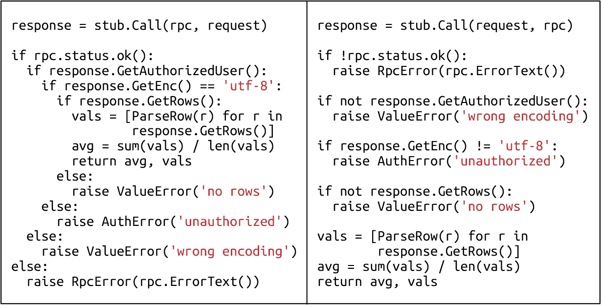

# 第十二章：编写代码

> 原文：[12. Writing Code](https://google.github.io/building-secure-and-reliable-systems/raw/ch12.html)
> 
> 译者：[飞龙](https://github.com/wizardforcel)
> 
> 协议：[CC BY-NC-SA 4.0](https://creativecommons.org/licenses/by-nc-sa/4.0/)


由 Michał Czapiński 和 Julian Bangert 撰写

与 Thomas Maufer 和 Kavita Guliani 合作

安全性和可靠性不能轻易地加入软件中，因此在软件设计的早期阶段就考虑它们是很重要的。在发布后添加这些功能是痛苦且不太有效的，可能需要您改变代码库的其他基本假设（有关此主题的更深入讨论，请参见第四章）。

减少安全性和可靠性问题的第一步，也是最重要的一步是教育开发人员。然而，即使是训练有素的工程师也会犯错——安全专家可能会编写不安全的代码，SRE 可能会忽略可靠性问题。在同时考虑构建安全和可靠系统所涉及的许多考虑因素和权衡是困难的，尤其是如果你还负责生产软件的话。

与其完全依赖开发人员审查代码的安全性和可靠性，不如让 SRE 和安全专家审查代码和软件设计。这种方法也是不完美的——手动代码审查不会发现每个问题，也不会每个安全问题都能被审查人员发现。审查人员也可能会受到自己的经验或兴趣的影响。例如，他们可能自然而然地倾向于寻找新的攻击类型、高级设计问题或加密协议中的有趣缺陷；相比之下，审查数百个 HTML 模板以查找跨站脚本（XSS）漏洞，或者检查应用程序中每个 RPC 的错误处理逻辑可能会被视为不那么令人兴奋。

虽然代码审查可能不会发现每个漏洞，但它们确实有其他好处。良好的审查文化鼓励开发人员以便于审查安全性和可靠性属性的方式构建他们的代码。本章讨论了使审查人员能够明显看到这些属性的策略，并将自动化整合到开发过程中。这些策略可以释放团队的带宽，让他们专注于其他问题，并建立安全和可靠性的文化（参见第二十一章）。

# 强制执行安全性和可靠性的框架

如第六章所讨论的，应用程序的安全性和可靠性依赖于特定领域的不变量。例如，如果应用程序的所有数据库查询仅由开发人员控制的代码组成，并通过查询参数绑定提供外部输入，那么该应用程序就可以防止 SQL 注入攻击。如果所有插入 HTML 表单的用户输入都经过适当转义或清理以删除任何可执行代码，Web 应用程序就可以防止 XSS 攻击。

理论上，您可以通过仔细编写维护这些不变量的应用程序代码来创建安全可靠的软件。然而，随着所需属性的数量和代码库的规模增长，这种方法几乎变得不可能。不合理地期望任何开发人员都是所有这些主题的专家，或者在编写或审查代码时始终保持警惕是不合理的。

如果需要人工审查每个更改，那么这些人将很难维护全局不变量，因为审查人员无法始终跟踪全局上下文。如果审查人员需要知道哪些函数参数是由调用者传递的用户输入，哪些参数只包含开发人员控制的可信值，他们还必须熟悉函数的所有传递调用者。审查人员不太可能能够长期保持这种状态。

更好的方法是在通用框架、语言和库中处理安全和可靠性。理想情况下，库只公开一个接口，使得使用常见安全漏洞类的代码编写变得不可能。多个应用程序可以使用每个库或框架。当领域专家修复问题时，他们会从框架支持的所有应用程序中删除它，从而使这种工程方法更好地扩展。与手动审查相比，使用集中的强化框架还可以减少未来漏洞的可能性。当然，没有框架可以防止所有安全漏洞，攻击者仍然有可能发现未预料到的攻击类别或发现框架实现中的错误。但是，如果您发现了新的漏洞，您可以在一个地方（或几个地方）解决它，而不是在整个代码库中。

举一个具体的例子：SQL 注入（SQLI）在常见安全漏洞的 OWASP](https://oreil.ly/TnBaK)和[SANS](https://oreil.ly/RWvPF)列表中占据首要位置。根据我们的经验，当您使用像`TrustedSqlString`这样的强化数据库时（参见[“SQL 注入漏洞：TrustedSqlString”），这类漏洞就不再是问题。类型使这些假设变得明确，并且由编译器自动执行。

## 使用框架的好处

大多数应用程序都具有类似的安全构建块（身份验证和授权、日志记录、数据加密）和可靠性构建块（速率限制、负载平衡、重试逻辑）。为每个服务从头开始开发和维护这些构建块是昂贵的，并且会导致每个服务中不同错误的拼接。

框架实现了代码重用：开发人员只需定制特定的构建块，而不需要考虑影响给定功能或特性的所有安全和可靠性方面。例如，开发人员可以指定传入请求凭据中哪些信息对授权很重要，而无需担心这些信息的可信度——框架会验证可信度。同样，开发人员可以指定需要记录哪些数据，而无需担心存储或复制。框架还使传播更新更容易，因为您只需要在一个位置应用更新。

使用框架可以提高组织中所有开发人员的生产力，有助于建立安全和可靠文化（参见第二十一章）。对于一个团队的领域专家来说，设计和开发框架构建块要比每个团队单独实现安全和可靠特性更有效率。例如，如果安全团队处理加密，其他所有团队都会从他们的知识中受益。使用框架的开发人员无需担心其内部细节，而可以专注于应用程序的业务逻辑。

框架通过提供易于集成的工具进一步提高了生产力。例如，框架可以提供自动导出基本操作指标的工具，比如总请求数、按错误类型分解的失败请求数量，或者每个处理阶段的延迟。您可以使用这些数据生成自动化监控仪表板和服务的警报。框架还使与负载均衡基础设施集成更容易，因此服务可以自动将流量重定向到超载实例之外，或者在负载较重时启动新的服务实例。因此，基于框架构建的服务表现出更高的可靠性。

使用框架还可以通过清晰地将业务逻辑与常见功能分离，使对代码的推理变得容易。这使开发人员可以更有信心地对服务的安全性或可靠性做出断言。总的来说，框架可以降低复杂性——当跨多个服务的代码更加统一时，遵循常见的良好实践就更容易了。

开发自己的框架并不总是有意义。在许多情况下，最好的策略是重用现有的解决方案。例如，几乎任何安全专业人士都会建议您不要设计和实现自己的加密框架，而是可以使用像 Tink 这样的成熟和广泛使用的框架（在[“示例：安全加密 API 和 Tink 加密框架”](ch06.html#example_secure_cryptographic_apis_and_t)中讨论）。

在决定采用任何特定框架之前，评估其安全姿态是很重要的。我们还建议使用积极维护的框架，并不断更新您的代码依赖项，以纳入对您的代码依赖的任何代码的最新安全修复。

以下案例是一个实际示例，演示了框架的好处：在这种情况下，是用于创建 RPC 后端的框架。

## 示例：RPC 后端框架

大多数 RPC 后端遵循类似的结构。它们处理特定于请求的逻辑，并通常还执行以下操作：

+   日志记录

+   认证

+   授权

+   限流（速率限制）

我们建议使用一个可以隐藏这些构建块的实现细节的框架，而不是为每个单独的 RPC 后端重新实现这些功能。然后开发人员只需要定制每个步骤以适应其服务的需求。

图 12-1 展示了一个基于预定义*拦截器*的可能框架架构，这些拦截器负责前面提到的每个步骤。您还可以使用拦截器来执行自定义步骤。每个拦截器定义了在实际 RPC 逻辑执行*之前*和*之后*要执行的操作。每个阶段都可以报告错误条件，这会阻止进一步执行拦截器。但是，当发生这种情况时，已经调用的每个拦截器的*之后*步骤会以相反的顺序执行。拦截器之间的框架可以透明地执行其他操作，例如导出错误率或性能指标。这种架构导致了在每个阶段执行的逻辑的清晰分离，从而增加了简单性和可靠性。


###### 图 12-1：RPC 后端潜在框架中的控制流：典型步骤封装在预定义的拦截器中，授权作为示例突出显示

在这个例子中，日志拦截器的*之前*阶段可以记录调用，*之后*阶段可以记录操作的状态。现在，如果请求未经授权，RPC 逻辑不会执行，但是“权限被拒绝”的错误会被正确记录。之后，系统调用认证和日志拦截器的*之后*阶段（即使它们是空的），然后才将错误发送给客户端。

拦截器通过它们传递给彼此的*上下文对象*共享状态。例如，认证拦截器的*之前*阶段可以处理与证书处理相关的所有加密操作（注意从重用专门的加密库而不是重新实现一个来提高安全性）。然后系统将提取和验证的关于调用者的信息包装在一个方便的对象中，并将其添加到上下文中。随后的拦截器可以轻松访问此对象。

然后框架可以使用上下文对象来跟踪请求执行时间。如果在任何阶段明显地请求不会在截止日期之前完成，系统可以自动取消请求。通过快速通知客户端，还可以提高服务的可靠性，这也节省了资源。

一个好的框架还应该使您能够处理 RPC 后端的依赖关系，例如负责存储日志的另一个后端。您可以将这些注册为软依赖或硬依赖，框架可以不断监视它们的可用性。当它检测到硬依赖不可用时，框架可以停止服务，报告自身不可用，并自动将流量重定向到其他实例。

迟早，过载、网络问题或其他问题将导致依赖不可用。在许多情况下，重试请求是合理的，但要小心实现重试，以避免*级联故障*（类似于多米诺骨牌的倒塌）。¹最常见的解决方案是使用*指数退避*。²一个好的框架应该提供对这样的逻辑的支持，而不是要求开发人员为每个 RPC 调用实现逻辑。

一个优雅处理不可用依赖并重定向流量以避免过载服务或其依赖的框架自然地提高了服务本身和整个生态系统的可靠性。这些改进需要开发人员的最少参与。

### 示例代码片段

示例 12-1 到 12-3 演示了 RPC 后端开发人员与安全或可靠性框架合作的视角。这些示例使用 Go 并使用[Google Protocol Buffers](https://oreil.ly/yzES2)。

##### 12-1 示例。初始类型定义（拦截器的前阶段可以修改上下文；例如，身份验证拦截器可以添加有关调用者的验证信息）

```go
type Request struct {  
  Payload proto.Message  
} 
type Response struct {  
  Err error
  Payload proto.Message  
} 
type Interceptor interface {  
  Before(context.Context, *Request) (context.Context, error)  
  After(context.Context, *Response) error 
} 
type CallInfo struct {  
  User string  
  Host string  
  ...  
}
```

##### 12-2 示例。示例授权拦截器，只允许来自白名单用户的请求

```go
type authzInterceptor struct {
 allowedRoles map[string]bool
}

func (ai *authzInterceptor) Before(ctx context.Context, req *Request) (context.Context, error) {
  // callInfo was populated by the framework.
  callInfo, err := FromContext(ctx)
  if err != nil { return ctx, err }

  if ai.allowedRoles[callInfo.User] { return ctx, nil }
  return ctx, fmt.Errorf("Unauthorized request from %q", callInfo.User)
}

func (*authzInterceptor) After(ctx context.Context, resp *Response) error {
  return nil  // Nothing left to do here after the RPC is handled.
}
```

##### 12-3 示例。示例日志拦截器，记录每个传入请求（阶段前）然后记录所有失败的请求及其状态（阶段后）；WithAttemptCount 是一个由框架提供的 RPC 调用选项，实现指数退避

```go
type logInterceptor struct {
  logger *LoggingBackendStub
}

func (*logInterceptor) Before(ctx context.Context,
                              req *Request) (context.Context, error) {
  // callInfo was populated by the framework.
  callInfo, err := FromContext(ctx)
  if err != nil { return ctx, err }
  logReq := &pb.LogRequest{
    timestamp: time.Now().Unix(),
    user: callInfo.User,
    request: req.Payload,
  }
  resp, err := logger.Log(ctx, logReq, WithAttemptCount(3))
  return ctx, err
}

func (*logInterceptor) After(ctx context.Context, resp *Response) error {
  if resp.Err == nil { return nil }

  logErrorReq := &pb.LogErrorRequest{
    timestamp: time.Now().Unix(),
    error: resp.Err.Error(),
  }
  resp, err := logger.LogError(ctx, logErrorReq, WithAttemptCount(3))
  return err
}
```

# 常见安全漏洞

在大型代码库中，少数类占据了大部分安全漏洞，尽管不断努力教育开发人员并引入代码审查。OWASP 和 SANS 发布了常见漏洞类别的列表。表 12-1 列出了根据[OWASP](https://oreil.ly/bUZq8)列出的前 10 个最常见的漏洞风险，以及在框架级别上缓解每个漏洞的一些潜在方法。

表 12-1。根据 OWASP 列出的前 10 个最常见的漏洞风险

| OWASP 前 10 大漏洞 | 框架加固措施 |
| --- | --- |
| [SQL]注入 | `TrustedSQLString`（请参阅下一节）。|
| 损坏的身份验证 | 在将请求路由到应用程序之前，要求使用像 OAuth 这样经过充分测试的机制进行身份验证。（参见“示例：RPC 后端框架”。）|
| 敏感数据泄露 | 使用不同的类型（而不是字符串）来存储和处理信用卡号等敏感数据。这种方法可以限制序列化以防止泄漏并强制适当的加密。框架还可以强制执行透明的传输保护，如使用 LetsEncrypt 的 HTTPS。加密 API，如[Tink](https://oreil.ly/38Vpd)，可以鼓励适当的秘密存储，例如从云密钥管理系统加载密钥，而不是从配置文件加载。|
| XML 外部实体（XXE）|使用未启用 XXE 的 XML 解析器；确保支持它的库中禁用这个风险特性。ᵃ|
|破损的访问控制|这是一个棘手的问题，因为它通常是特定于应用程序的。使用一个要求每个请求处理程序或 RPC 具有明确定义的访问控制限制的框架。如果可能的话，将最终用户凭据传递到后端，并在后端强制执行访问控制策略。|
|安全配置错误|使用默认提供安全配置并限制或不允许风险配置选项的技术堆栈。例如，使用一个在生产中不打印错误信息的 Web 框架。使用一个标志来启用所有调试功能，并设置部署和监控基础设施以确保这个标志不对公共用户启用。Rails 中的`environment`标志就是这种方法的一个例子。|
|跨站脚本（XSS）|使用 XSS 强化的模板系统（参见“预防 XSS：SafeHtml”）。|
|不安全的反序列化|使用专为处理不受信任输入而构建的反序列化库，例如[Protocol Buffers](https://oreil.ly/hlezU)。|
|使用已知漏洞的组件|选择受欢迎且积极维护的库。不要选择有未修复或缓慢修复安全问题历史的组件。另请参见“评估和构建框架的教训”。|
|日志记录和监控不足|不要依赖于临时日志记录，适当地记录和监控请求和其他事件在低级库中。有关示例，请参见前一节中描述的日志拦截器。|
|ᵃ有关更多信息，请参见[XXE 预防备忘单](https://oreil.ly/AOYev)。|

## SQL 注入漏洞：TrustedSqlString

[SQL 注入](https://xkcd.com/327)是一种常见的安全漏洞类别。当不可信的字符串片段被插入到 SQL 查询中时，攻击者可能会注入数据库命令。以下是一个简单的密码重置网页表单：

```go
db.query("UPDATE users SET pw_hash = '" + request["pw_hash"] 
         + "' WHERE reset_token = '" + request.params["reset_token"] + "'")
```

在这种情况下，用户的请求被定向到一个具有与其帐户特定的不可猜测的`reset_token`的后端。然而，由于字符串连接，恶意用户可以制作一个带有额外 SQL 命令（例如`' or username='admin`）的自定义`reset_token`并将其*注入*到后端。结果可能会重置不同用户的密码哈希—在这种情况下是管理员帐户。

在更复杂的代码库中，SQL 注入漏洞可能更难以发现。数据库引擎可以通过提供绑定参数和预编译语句来帮助您防止 SQL 注入漏洞：

```go
Query q = db.createQuery(
  "UPDATE users SET pw_hash = @hash WHERE token = @token");
q.setParameter("hash", request.params["hash"]);
q.setParameter("token", request.params["token"]);
db.query(q);
```

然而，仅仅建立一个使用预编译语句的准则并不能导致可扩展的安全流程。您需要教育每个开发人员遵守这个规则，并且安全审查人员需要审查所有应用程序代码，以确保一致使用预编译语句。相反，您可以设计数据库 API，使用户输入和 SQL 的混合在设计上变得不可能。例如，您可以创建一个名为`TrustedSqlString`的单独类型，并通过构造强制执行所有 SQL 查询字符串都是由开发人员控制的输入创建的。在 Go 中，您可以实现该类型如下：

```go
struct Query {
  sql strings.Builder;
} 
type stringLiteral string;  
*// Only call this function with string literal parameters.*
func (q *Query) AppendLiteral(literal stringLiteral) {
  q.sql.writeString(literal);
}
*// q.AppendLiteral("foo") will work, q.AppendLiteral(foo) will not*
```

该实现通过构造保证了`q.sql`的内容完全是从您的源代码中存在的字符串字面量连接而成的，用户无法提供字符串字面量。为了在规模上强制执行这个合同，您可以使用一种特定于语言的机制，确保`AppendLiteral`只能与字符串字面量一起调用。例如：

在 Go

使用包私有类型别名（`stringLiteral`）。包外的代码不能引用此别名；但是，字符串字面量会被隐式转换为这种类型。

在 Java

使用[Error Prone](https://errorprone.info)代码检查器，它为参数提供了`@CompileTimeConstant`注释。

在 C++中

使用依赖于字符串中每个字符值的模板构造函数。

您可以在其他语言中找到类似的机制。

您无法仅使用编译时常量构建某些功能，比如设计为由拥有数据的用户提供任意 SQL 查询的数据分析应用程序。为了处理复杂的用例，在 Google，我们允许通过安全工程师的批准绕过类型限制的方法。例如，我们的数据库 API 有一个单独的包`unsafequery`，它导出一个独特的`unsafequery.String`类型，可以从任意字符串构造并附加到 SQL 查询中。只有很小一部分查询使用了未经检查的 API。对于数百到数千名活跃开发人员，审核不安全的 SQL 查询的新用途和其他受限 API 模式的负担由一名（轮换的）工程师兼职处理。参见“评估和构建框架的教训”以了解审核豁免的其他好处。

## 防止 XSS：SafeHtml

我们在前一节中描述的基于类型的安全方法并不特定于 SQL 注入。Google 使用更复杂的相同设计的版本来减少 Web 应用程序中的跨站脚本漏洞。³

在核心上，XSS 漏洞发生在 Web 应用程序在没有适当清理的情况下呈现不可信的输入时。例如，一个应用程序可能会将一个受攻击者控制的`$address`值插入到 HTML 片段中，如`<div>$address</div>`，然后显示给另一个用户。攻击者可以将`$address`设置为`<script>exfiltrate_user_data();</script>`并在另一个用户页面的上下文中执行任意代码。

HTML 没有绑定查询参数的等价物。相反，不可信的值必须在插入到 HTML 页面之前得到适当的清理或转义。此外，不同的 HTML 属性和元素具有不同的语义，因此应用程序开发人员必须根据它们出现的上下文来不同对待值。例如，攻击者控制的 URL 可以使用`javascript:`方案来执行代码。

类型系统可以通过为不同上下文中的值引入不同的类型来捕获这些要求，例如，`SafeHtml`用于表示 HTML 元素的内容，`SafeUrl`用于安全导航到的 URL。每种类型都是一个（不可变的）字符串包装器；构造函数负责维护每种类型的合同。构造函数构成了负责确保应用程序安全属性的受信任代码库。

Google 为不同的用例创建了不同的构建器库。可以使用构建器方法构造单个 HTML 元素，该方法要求每个属性值都具有正确的类型，并且对于元素内容使用`SafeHtml`。具有严格上下文转义的模板系统可以保证更复杂的 HTML 的`SafeHtml`合同。该系统执行以下操作：

1.  解析模板中的部分 HTML

1.  确定每个替换点的上下文

1.  要么要求程序传递正确类型的值，要么正确转义或清理不受信任的字符串值

例如，如果您有以下 Closure 模板：

```go
{template .foo kind="html"}<script src="{$url}"></script>{/template}
```

尝试使用`$url`的字符串值将失败：

```go
templateRendered.setMapData(ImmutableMap.of("url", some_variable));
```

相反，开发人员必须提供`TrustedResourceUrl`值，例如：

```go
templateRenderer.setMapData(
     ImmutableMap.of("x", TrustedResourceUrl.fromConstant("/script.js"))
 ).render();
```

如果 HTML 来自不受信任的来源，您不希望将其嵌入到应用程序的 Web UI 中，因为这样做会导致易受攻击的 XSS 漏洞。相反，您可以使用 HTML 清理器解析 HTML 并执行运行时检查，以确定每个值是否符合其合同。清理器会删除不符合其合同的元素，或者无法在运行时检查合同的元素。您还可以使用清理器与不使用安全类型的其他系统进行交互，因为许多 HTML 片段在清理过程中保持不变。

不同的 HTML 构建库针对不同的开发人员生产力和代码可读性权衡。但是，它们都强制执行相同的合同，并且应该同样值得信赖（除了它们受信任的实现中的任何错误）。实际上，为了减少谷歌的维护负担，我们从声明性配置文件中为各种语言代码生成构建器函数。该文件列出了 HTML 元素和每个属性值的所需合同。我们的一些 HTML 清理器和模板系统使用相同的配置文件。

在[Closure Templates](https://oreil.ly/6x6Yb)中提供了成熟的开源安全类型实现，目前正在进行引入[基于类型的安全性](https://oreil.ly/VrN4w)的工作，作为 Web 标准。

# 评估和构建框架的教训

前几节讨论了如何构建库以建立安全性和可靠性属性。但是，并非所有这样的属性都可以通过 API 设计优雅地表达，有些情况下甚至无法轻松更改 API，例如与 Web 浏览器公开的标准化 DOM API 交互时。

相反，您可以引入编译时检查，以防止开发人员使用风险 API。流行编译器的插件，如 Java 的[Error Prone](https://errorprone.info)和 TypeScript 的[Tsetse](https://tsetse.info)，可以禁止危险的代码模式。

我们的经验表明，编译器错误提供了即时和可操作的反馈。在代码审查时运行的工具（如 linter）或在代码审查时提供的反馈要晚得多。到代码发送进行审查时，开发人员通常已经有了一个完成的、可工作的代码单元。在开发过程的这么晚阶段得知需要进行一些重新架构才能使用严格类型的 API 可能会令人沮丧。

向开发人员提供编译器错误或更快的反馈机制（如 IDE 插件，可以标出有问题的代码）要容易得多。通常，开发人员会快速解决编译问题，并且已经必须修复其他编译器诊断，如拼写错误和语法错误。因为开发人员已经在处理受影响的特定代码行，他们有完整的上下文，所以进行更改更容易，例如将字符串的类型更改为`SafeHtml`。

通过建议自动修复，甚至可以进一步改善开发人员的体验，这些自动修复可以作为安全解决方案的起点。例如，当检测到对 SQL 查询函数的调用时，可以自动插入对`TrustedSqlBuilder.fromConstant`的调用，其中包含查询参数。即使生成的代码不能完全编译（也许是因为查询是字符串变量而不是常量），开发人员也知道该怎么做，无需通过找到正确的函数、添加正确的导入声明等来烦恼 API 的机械细节。

根据我们的经验，只要反馈周期快，修复每个模式相对容易，开发人员就会更愿意接受固有安全的 API，即使我们无法证明他们的代码是不安全的，或者他们在使用不安全的 API 编写安全代码时做得很好。我们的经验与现有的研究文献形成对比，后者侧重于降低误报和漏报率。(4)

我们发现，专注于这些速率通常会导致复杂的检查器，需要更长时间才能发现问题。例如，一个检查可能需要分析复杂应用程序中的整个程序数据流。通常很难解释如何从静态分析检测到的问题中删除问题，因为检查器的工作方式比简单的语法属性要难得多。理解一个发现需要和在 GDB（GNU 调试器）中追踪错误一样多的工作。另一方面，在编写新代码时在编译时修复类型安全错误通常并不比修复微不足道的类型错误困难得多。

## 简单、安全、可靠的常见任务库

构建一个安全的库，涵盖所有可能的用例并可靠地处理每个用例可能非常具有挑战性。例如，一个在 HTML 模板系统上工作的应用程序开发人员可能会编写以下模板：

```go
<a onclick="showUserProfile('{{username}}');">Show profile</a>">
```

为了防止 XSS 攻击，如果“用户名”受攻击者控制，模板系统必须嵌套三种不同的上下文层：单引号字符串，JavaScript 内部，HTML 元素属性内部。创建一个可以处理所有可能的边缘情况组合的模板系统是复杂的，并且使用该系统不会简单。在其他领域，这个问题可能变得更加复杂。例如，业务需求可能会规定谁可以执行动作，谁不能。除非您的授权库像通用编程语言一样具有表达力（并且难以分析），您可能无法满足所有开发人员的需求。

相反，您可以从一个简单的、小型的库开始，只涵盖常见用例，但更容易正确使用。简单的库更容易解释、文档化和使用。这些特性减少了开发人员的摩擦，并可能帮助您说服其他开发人员采用安全设计的库。在某些情况下，提供针对不同用例进行优化的不同库可能是有意义的。例如，您可能既有用于复杂页面的 HTML 模板系统，也有用于短片段的构建器库。

您可以通过专家审查的方式满足其他用例，访问一个不受限制的、风险的库，绕过安全保证。如果您看到类似的重复请求，您可以在固有安全的库中支持该功能。正如我们在“SQL 注入漏洞：TrustedSqlString”中观察到的，审查负载通常是可以管理的。

由于审查请求的数量相对较少，安全审查人员可以深入查看代码并提出广泛的改进建议——审查往往是独特的用例，这保持了审查人员的积极性，并防止了由于重复和疲劳而导致的错误。豁免也作为一个反馈机制：如果开发人员反复需要豁免某个用例，库作者应该考虑为该用例构建一个库。

## 推出策略

我们的经验表明，对安全属性使用类型对于新代码非常有用。事实上，使用安全类型的谷歌内部广泛使用的一个 Web 框架创建的应用程序，报告的 XSS 漏洞要少得多（少两个数量级）比没有使用安全类型编写的应用程序，尽管进行了仔细的代码审查。少数报告的漏洞是由于应用程序的组件没有使用安全类型造成的。

将现有代码调整为使用安全类型更具挑战性。即使您从头开始创建一个全新的代码库，您也需要一个迁移遗留代码的策略——您可能会发现您想要保护的新的安全性和可靠性问题类别，或者您可能需要完善现有的合同。

我们已经尝试了几种重构现有代码的策略；我们在下面的小节中讨论了我们最成功的两种方法。这些策略要求您能够访问和修改应用程序的整个源代码。Google 的大部分源代码都存储在一个单一的存储库中⁵，并具有用于制作、构建、测试和提交更改的集中式流程。代码审查人员还会强制执行常见的可读性和代码组织标准，这减少了改变陌生代码库的复杂性。在其他环境中，大规模的重构可能更具挑战性。获得广泛的一致意见有助于每个代码所有者都愿意接受对他们源代码的更改，这有助于建立一个安全可靠的文化。

###### 注意

Google 公司的全公司风格指南融入了语言*可读性*的概念：工程师理解给定语言的 Google 最佳实践和编码风格的认证。可读性确保了代码质量的基线。工程师必须在他们正在使用的语言中具有可读性，或者从具有可读性的人那里获得代码审查。对于特别复杂或至关重要的代码，面对面的代码审查可能是改进代码库质量最有效和高效的方式。

### 增量推出

一次性修复整个代码库通常是不可行的。不同的组件可能在不同的存储库中，对多个应用程序进行更改的编写、审查、测试和提交通常是脆弱且容易出错的。相反，在 Google，我们最初豁免遗留代码的执行，并逐个解决现有不安全 API 的使用者。

例如，如果您已经有一个带有`doQuery(String sql)`函数的数据库 API，您可以引入一个重载，`doQuery(TrustedSqlString sql)`，并将不安全版本限制为现有的调用者。使用 Error Prone 框架，您可以添加一个`@RestrictedApi(whitelistAnnotation={LegacyUnsafeStringQueryAllowed.class})`注解，并将`@LegacyUnsafeStringQueryAllowed`注解添加到所有现有的调用者。

然后，通过引入*Git hooks*来分析每个提交，您可以防止新代码使用基于字符串的过载。或者，您可以限制不安全 API 的可见性——例如，[Bazel 可见性白名单](https://oreil.ly/ajmrr)将允许用户仅在安全团队成员批准拉取请求（PR）时调用 API。如果您的代码库正在积极开发，它将自然地向安全 API 迁移。在达到只有少部分调用者使用已弃用的基于字符串的 API 的时候，您可以手动清理剩余部分。在那时，您的代码将因设计而免疫 SQL 注入。

### 遗留转换

将所有的豁免机制整合到一个在源代码中明显的函数中通常也是值得的。例如，您可以创建一个函数，它接受任意字符串并返回一个安全类型。您可以使用这个函数来替换所有对字符串类型的 API 的调用，使其更精确地调用。通常，类型会比使用它们的函数少得多。与限制和监控许多遗留 API 的移除（例如，每个消耗 URL 的 DOM API）不同，您只需要删除每种类型的一个遗留转换函数。

# 简单导致安全可靠的代码

在实际情况下，尽量保持代码简洁和简单。关于这个主题有很多出版物，⁶所以这里我们专注于两个轻量级的故事，这些故事发表在[Google 测试博客](https://testing.googleblog.com)上。这两个故事都强调了避免快速增加代码库复杂性的策略。

## 避免多级嵌套

多层嵌套是一种常见的反模式，可能导致简单的错误。如果错误出现在最常见的代码路径中，它很可能会被单元测试捕获。但是，单元测试并不总是检查多层嵌套代码中的错误处理路径。错误可能导致可靠性降低（例如，如果服务在错误处理不当时崩溃）或安全漏洞（如错误处理授权检查错误）。

您能在图 12-2 的代码中发现错误吗？这两个版本是等价的。⁷



###### 图 12-2：在多层嵌套代码中，错误通常更难发现

“错误编码”和“未经授权”的错误被交换了。在重构版本中更容易看到这个错误，因为检查发生在处理错误时。

## 消除 YAGNI 气味

有时，开发人员通过添加可能在将来有用的功能“以防万一”来过度设计解决方案。这违反了[YAGNI（你不会需要它）原则](https://oreil.ly/K4Oan)，该原则建议仅实现您需要的代码。YAGNI 代码会增加不必要的复杂性，因为它需要进行文档化、测试和维护。考虑以下示例：⁸

```go
class Mammal { ...
  virtual Status Sleep(bool hibernate) = 0;
};
class Human : public Mammal { ...
  virtual Status Sleep(bool hibernate) {
    age += hibernate ? kSevenMonths : kSevenHours;
    return OK;
  }
};
```

`Human::Sleep`代码必须处理`hibernate`为`true`的情况，即使所有调用者应始终传递`false`。此外，调用者必须处理返回的状态，即使该状态应始终为`OK`。因此，在您需要除`Human`之外的其他类之前，此代码可以简化为以下内容：

```go
class Human { ...
  void Sleep() { age += kSevenHours; }
};
```

如果开发人员对未来功能的可能需求做出的假设实际上是正确的，他们可以通过遵循*增量开发和设计*原则轻松地稍后添加该功能。在我们的例子中，基于几个现有类进行概括时，将更容易创建具有更好公共 API 的`Mammal`接口。

总之，避免 YAGNI 代码会提高可靠性，简化代码会减少安全漏洞，减少出错的机会，并减少开发人员维护未使用代码的时间。

## 偿还技术债务

开发人员通常会使用 TODO 或 FIXME 注释标记需要进一步关注的地方。短期内，这种习惯可以加快最关键功能的交付速度，并允许团队满足早期的截止日期，但也会产生*技术债务*。不过，只要您有清晰的流程（并分配时间）来偿还这样的债务，这并不一定是一种坏习惯。

技术债务可能包括对异常情况的错误处理以及将不必要的复杂逻辑引入代码（通常编写以解决其他技术债务领域的问题）。任何一种行为都可能引入安全漏洞和可靠性问题，这些问题在测试期间很少被检测到（因为罕见情况的覆盖不足），因此成为生产环境的一部分。

您可以以许多方式处理技术债务。例如：

+   保持具有代码健康度指标的仪表板。这些可以是简单的仪表板，显示测试覆盖率或 TODO 的数量和平均年龄，也可以是包括[*圈复杂度*](https://oreil.ly/pXJBL)或[*可维护性指数*](https://oreil.ly/_N25V)等指标的更复杂的仪表板。

+   使用诸如 linter 之类的分析工具来检测常见的代码缺陷，例如死代码、不必要的依赖关系或特定于语言的陷阱。通常，这些工具还可以自动修复您的代码。

+   当代码健康度指标下降到预定义阈值以下或自动检测到的问题数量过高时创建通知。

此外，重要的是要保持一个拥抱并专注于良好代码健康的团队文化。领导可以通过多种方式支持这种文化。例如，您可以安排定期的*修复*周，在这些周内，开发人员专注于改善代码健康和修复未解决的错误，而不是添加新功能。您还可以通过奖金或其他形式的认可来支持团队内对代码健康的持续贡献。

## 重构

*重构*是保持代码库清洁和简单的最有效方法。即使健康的代码库偶尔也需要在扩展现有功能集、更改后端等情况下进行重构。

重构在处理旧的、继承的代码库时特别有用。重构的第一步是测量代码覆盖率，并将覆盖率提高到足够的水平。⁹一般来说，覆盖率越高，对重构的安全性的信心就越高。不幸的是，即使测试覆盖率达到 100%，也不能保证成功，因为测试可能没有意义。您可以通过其他类型的测试来解决这个问题，例如*fuzzing*，这在第十三章中有介绍。

###### 注意

无论重构背后的原因是什么，您都应始终遵循一个黄金法则：*永远不要在单个提交到代码存储库中混合重构和功能更改*。重构更改通常很重要，可能难以理解。如果提交还包括功能更改，那么作者或审阅者可能会忽略错误的风险更高。

重构技术的完整概述超出了本书的范围。有关此主题的更多信息，请参阅 Martin Fowler 的优秀著作¹⁰以及 Wright 等人提供的自动化大规模重构工具的讨论（2013 年），¹¹ Wasserman（2013 年），¹²和 Potvin 和 Levenberg（2016 年）。

# 默认安全性和可靠性

除了使用具有强大保证的框架外，您还可以使用其他几种技术来自动改善应用程序的安全性和可靠性姿态，以及团队文化的姿态，您将在第二十一章中了解更多。

## 选择正确的工具

选择语言、框架和库是一项复杂的任务，通常受多种因素的影响，例如：

+   与现有代码库的集成

+   库的可用性

+   开发团队的技能或偏好

要意识到语言选择对项目安全性和可靠性的巨大影响。

### 使用内存安全语言

在 2019 年 2 月的以色列 BlueHat 大会上，微软的 Matt Miller 声称，大约 70%的安全漏洞都是由内存安全问题引起的。¹³这个统计数据在过去至少 12 年中一直保持一致。

在 2016 年的一次演讲中，来自 Google 的 Nick Kralevich 报告称，Android 中 85%的所有错误（包括内核和其他组件中的错误）都是由内存管理错误引起的（第 54 页）。¹⁴ Kralevich 得出结论：“我们需要转向内存安全语言。”通过使用具有更高级内存管理的任何语言（如 Java 或 Go）而不是具有更多内存分配困难的语言（如 C/C++），您可以默认避免这整类安全（和可靠性）漏洞。或者，您可以使用代码消毒剂来检测大多数内存管理陷阱（请参阅“消毒您的代码”）。

### 使用强类型和静态类型检查

在*强类型*语言中，“每当对象从调用函数传递到被调用函数时，其类型必须与被调用函数中声明的类型兼容。”没有这个要求的语言被称为*弱类型*或*松散类型*。您可以在编译期间（*静态类型检查*）或运行时（*动态类型检查*）执行类型检查。

强类型和静态类型检查的好处在于在大型代码库中与多个开发人员合作时特别明显，因为您可以在编译时强制执行不变量，并消除各种错误，而不是在运行时。这导致在生产环境中更可靠的系统，更少的安全问题和更高性能的代码。

相比之下，在使用动态类型检查时（例如在 Python 中），除非代码具有 100%的测试覆盖率，否则您几乎无法推断代码的任何信息——这在原则上很好，但在实践中很少见。在弱类型语言中，推理代码变得更加困难，通常会导致意外行为。例如，在 JavaScript 中，每个文字默认都被视为字符串：`[9, 8, 10].sort() -> [10, 8, 9]`。在这两种情况下，由于不变量在编译时未被强制执行，您只能在测试期间捕获错误。因此，您更容易在生产环境中而不是在开发过程中检测到可靠性和安全性问题，特别是在较少频繁使用的代码路径中。

如果要使用默认具有动态类型检查或弱类型的语言，我们建议使用以下扩展来提高代码的可靠性。这些扩展提供了对更严格类型检查的支持，您可以逐步将它们添加到现有的代码库中：

+   [Pytype for Python](https://oreil.ly/_AAvo)

+   [TypeScript for JavaScript](https://www.typescriptlang.org)

## 使用强类型

使用未类型化的基元（例如字符串或整数）可能会导致以下问题：

+   向函数传递概念上无效的参数

+   不需要的隐式类型转换

+   难以理解的类型层次结构

+   令人困惑的测量单位

第一种情况——向函数传递概念上无效的参数——发生在函数参数的原始类型没有足够的上下文，并且在调用时变得令人困惑。例如：

+   对于函数`AddUserToGroup(string, string)`，不清楚组名是作为第一个参数还是第二个参数提供的。

+   在`Rectangle(3.14, 5.67)`构造函数调用中，高度和宽度的顺序是什么？

+   `Circle(double)`是否期望半径还是直径？

文档可以纠正歧义，但开发人员仍然可能犯错。如果我们尽了责任，单元测试可以捕捉到大多数这些错误，但有些错误可能只在运行时出现。

使用强类型时，您可以在编译时捕捉到这些错误。回到我们之前的例子，所需的调用将如下所示：

+   `Add(User("alice"), Group("root-users"))`

+   `Rectangle(Width(3.14), Height(5.67))`

+   `Circle(Radius(1.23))`

其中`User`、`Group`、`Width`、`Height`和`Radius`是围绕字符串或双精度基元的强类型包装器。这种方法不太容易出错，并使代码更具自我说明性——在这种情况下，在第一个示例中，只需调用函数`Add`即可。

在第二种情况下，隐式类型转换可能导致以下情况：

+   从较大的整数类型转换为较小的整数类型时的截断

+   从较大的浮点类型转换为较小的浮点类型时的精度损失

+   意外对象创建

在某些情况下，编译器将报告前两个问题（例如，在 C++中使用`{}`直接初始化语法时），但许多实例可能会被忽视。使用强类型可以保护您的代码免受编译器无法捕获的此类错误。

现在让我们考虑难以理解的类型层次结构的情况：

```go
class Bar {  public:  Bar(bool is_safe) {...}  };  void Foo(const Bar& bar) {...}  Foo(false);  *// Likely OK, but is the developer aware a Bar object was created?*  Foo(5);      *// Will create Bar(is_safe := true), but likely by accident.*  Foo(NULL);   *// Will create Bar(is_safe := false), again likely by accident.*
```

这里的三个调用将编译并执行，但操作的结果是否符合开发人员的期望呢？默认情况下，C++编译器会尝试隐式转换（*强制*）参数以匹配函数参数类型。在这种情况下，编译器将尝试匹配类型`Bar`，它恰好有一个接受`bool`类型参数的单值构造函数。大多数 C++类型会隐式转换为`bool`。

构造函数中的隐式转换有时是有意的（例如，将浮点值转换为`std::complex`类时），但在大多数情况下可能是危险的。为了防止危险的结果，至少要使单值构造函数*显式*——例如，`explicit Bar(bool is_safe)`。请注意，最后一次调用将导致编译错误，因为使用`nullptr`而不是`NULL`，因为没有到`bool`的隐式转换。

最后，单位混淆是错误的无尽源泉。这些错误可能被描述如下：

无害的

例如，设置一个 30 秒的定时器而不是 30 分钟，因为程序员不知道`Timer(30)`使用的单位。

危险的

例如，加拿大航空的“吉姆利滑翔机”飞机在地勤人员计算所需的燃料时使用的是磅而不是千克，导致它只有所需燃料的一半。

昂贵的

例如，科学家们[失去了价值 1.25 亿美元的火星气候轨道飞行器](https://oreil.ly/ZMbIO)，因为两个独立的工程团队使用了不同的测量单位（英制与公制）。

与以前一样，强类型是解决此问题的一种方法：它们可以封装单位，并且只表示抽象概念，如时间戳、持续时间或重量。这些类型通常实现以下功能：

明智的操作

例如，添加两个时间戳通常不是一个有用的操作，但是减去它们会返回一个对许多用例有用的持续时间。类似地，添加两个持续时间或重量也是有用的。

单位转换

例如，`Timestamp::ToUnix, Duration::ToHours, Weight::ToKilograms`。

一些语言本身提供这样的抽象：例如 Go 中的[`time`包](https://golang.org/pkg/time)和即将到来的 C++20 标准中的[`chrono`库](http://www.wg21.link/p0355)。其他语言可能需要专门的实现。

[Fluent C++博客](https://oreil.ly/Urmzl)对 C++中强类型的应用和示例实现进行了更多讨论。

## 净化您的代码

自动验证代码是否遇到任何典型的内存管理或并发陷阱非常有用。您可以将这些检查作为每个更改列表的预提交操作运行，也可以作为持续构建和测试自动化工具的一部分运行。要检查的陷阱列表取决于语言。本节介绍了 C++和 Go 的一些解决方案。

### C++：Valgrind 或 Google Sanitizers

C++允许进行低级内存管理。正如我们之前提到的，内存管理错误是安全问题的主要原因，并且可能导致以下故障场景：

+   读取未分配的内存（`new`之前或`delete`之后）

+   读取超出分配内存范围的内容（缓冲区溢出攻击场景）

+   读取未初始化的内存

+   当系统丢失已分配内存的地址或不及时释放未使用的内存时，会发生内存泄漏

[Valgrind](http://www.valgrind.org)是一个流行的框架，允许开发人员捕捉这些类型的错误，即使单元测试没有捕捉到它们。Valgrind 的好处在于提供了一个解释用户二进制的虚拟机，因此用户无需重新编译代码即可使用它。Valgrind 工具[Helgrind](https://oreil.ly/mBSSw)还可以检测常见的同步错误，例如：

+   对 POSIX pthreads API 的误用（例如，解锁未锁定的互斥锁，或者由另一个线程持有的互斥锁）

+   由于锁定顺序问题而产生的潜在死锁

+   由于访问内存而未进行充分锁定或同步而引起的数据竞争

或者，[Google Sanitizers 套件](https://oreil.ly/qqdMy)提供了各种组件，可以检测 Valgrind 的 Callgrind（缓存和分支预测分析器）可以检测到的所有相同问题：

+   AddressSanitizer (ASan)检测内存错误（缓冲区溢出，释放后使用，不正确的初始化顺序）。

+   LeakSanitizer (LSan)检测内存泄漏。

+   MemorySanitizer (MSan)检测系统是否正在读取未初始化的内存。

+   ThreadSanitizer (TSan)检测数据竞争和死锁。

+   UndefinedBehaviorSanitizer (UBSan)检测具有未定义行为的情况（使用未对齐的指针；有符号整数溢出；转换到、从或在浮点类型之间溢出目标）。

Google Sanitizers 套件的主要优势是速度：它比 Valgrind 快[高达 10 倍](https://oreil.ly/iyxQ1)。像[CLion](https://oreil.ly/yGhh-)这样的流行 IDE 还提供了与 Google Sanitizers 的一流集成。下一章将更详细地介绍 sanitizers 和其他动态程序分析工具。

### Go：竞争检测器

虽然 Go 旨在禁止 C++典型的内存损坏问题，但仍可能受到数据竞争条件的影响。[Go 竞争检测器](https://oreil.ly/RU46m)可以检测这些条件。

# 结论

本章介绍了几个指导开发人员设计和实现更安全可靠代码的原则。特别是，我们建议使用框架作为一种强大的策略，因为它们重用了已被证明对于代码的敏感区域（身份验证、授权、日志记录、速率限制和分布式系统中的通信）的建设块：框架还倾向于提高开发人员的生产力，无论是编写框架的人还是使用框架的人，并使对代码的推理变得更加容易。编写安全可靠代码的其他策略包括追求简单性，选择合适的工具，使用强类型而不是原始类型，并持续对代码进行消毒。

在编写软件时，额外投入精力改善安全性和可靠性将在长期内得到回报，并减少您在部署应用程序后需要花费的审查应用程序或修复问题的工作量。

¹ 有关级联故障的更多信息，请参见[SRE 书的第 22 章](https://landing.google.com/sre/sre-book/chapters/addressing-cascading-failures/)。

² 也在[SRE 书的第 22 章](https://landing.google.com/sre/sre-book/chapters/addressing-cascading-failures/)中有描述。

³ 有关该系统的更多详细信息，请参见 Kern, Christoph. 2014. “保护纠缠不清的网络。” *ACM 通讯* 57(9): 38–47. [*https://oreil.ly/drZss*](https://oreil.ly/drZss).

⁴ 请参见 Bessey, Al 等人。2010. “数十亿行代码之后：使用静态分析在现实世界中查找错误。” *ACM 通讯* 53(2): 66–75. doi:10.1145/1646353.1646374.

⁵ Potvin, Rachel, and Josh Levenberg. 2016. “为什么 Google 将数十亿行代码存储在单个存储库中。” *ACM 通讯* 59(7): 78–87. doi:10.1145/2854146.

⁶ 例如，Ousterhout, John. 2018. *软件设计哲学*. Palo Alto, CA: Yaknyam Press.

⁷ 来源：Karpilovsky, Elliott. 2017. “代码健康：减少嵌套，减少复杂性。” [*https://oreil.ly/PO1QR*](https://oreil.ly/PO1QR).

⁸ 来源：Eaddy, Marc. 2017. “代码健康：消除 YAGNI 气味。” [*https://oreil.ly/NYr7y*](https://oreil.ly/NYr7y).

⁹ 有很多代码覆盖工具可供选择。有关概述，请参阅[Stackify 上的列表](https://oreil.ly/-w6DM)。

¹⁰ Fowler, Martin. 2019 年。 *重构：改善现有代码的设计*。马萨诸塞州波士顿：Addison-Wesley。

¹¹ Wright, Hyrum 等。 2013 年。 “使用 Clang 进行大规模自动重构。” *软件维护国际会议第 29 届论文集*：548–551。 doi:10.1109/ICSM.2013.93。

¹² Wasserman, Louis. 2013 年。 “可扩展的基于示例的重构与 Refaster。” *2013 年重构工具 ACM 研讨会论文集*：25–28 doi:10.1145/2541348.2541355。

¹³ Miller, Matt. 2019 年。 “软件漏洞缓解领域的趋势、挑战和战略转变。” BlueHat IL。 [*https://goo.gl/vKM7uQ*](https://goo.gl/vKM7uQ)。

¹⁴ Kralevich, Nick. 2016 年。 “防御的艺术：漏洞如何塑造 Android 中的安全功能和缓解措施。” BlackHat。 [*https://oreil.ly/16rCq*](https://oreil.ly/16rCq)。

¹⁵ Liskov, Barbara 和 Stephen Zilles。 1974 年。 “使用抽象数据类型进行编程。” *ACM SIGPLAN 非常高级语言研讨会论文集*：50–59。 doi:10.1145/800233.807045。

¹⁶ 有关 JavaScript 和 Ruby 中更多的惊喜，请参见[Gary Bernhardt 在 CodeMash 2012 的闪电演讲](https://oreil.ly/M69rg)。

¹⁷ 参见 Eaddy, Mark. 2017 年。 “代码健康：对基元着迷？” [*https://oreil.ly/0DvJI*](https://oreil.ly/0DvJI)。
