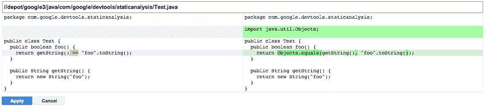

# 第十三章：测试代码

> 原文：[13. Testing Code](https://google.github.io/building-secure-and-reliable-systems/raw/ch13.html)
> 
> 译者：[飞龙](https://github.com/wizardforcel)
> 
> 协议：[CC BY-NC-SA 4.0](https://creativecommons.org/licenses/by-nc-sa/4.0/)


作者：Phil Ames 和 Franjo Ivančić

作者：Vera Haas 和 Jen Barnason

无论开发软件的工程师多么小心，都不可避免地会出现一些错误和被忽视的边缘情况。意外的输入组合可能会触发数据损坏或导致像 SRE 书的第 22 章中的“死亡查询”示例中的可用性问题。编码错误可能会导致安全问题，如缓冲区溢出和跨站脚本漏洞。简而言之，在现实世界中，软件容易出现许多故障。

本章讨论的技术在软件开发的不同阶段和环境中具有各种成本效益概况。例如，*模糊测试*——向系统发送随机请求——可以帮助您在安全性和可靠性方面加固系统。这种技术可能有助于捕捉信息泄漏，并通过暴露服务于大量边缘情况来减少服务错误。要识别无法轻松快速修补的系统中的潜在错误，您可能需要进行彻底的前期测试。

# 单元测试

*单元测试*可以通过在发布之前找出个别软件组件中的各种错误来提高系统安全性和可靠性。这种技术涉及将软件组件分解为没有外部依赖关系的更小、自包含的“单元”，然后对每个单元进行测试。单元测试由编写测试的工程师选择的不同输入来执行给定单元的代码组成。许多语言都有流行的单元测试框架；基于[xUnit](https://oreil.ly/jZgl5)架构的系统非常常见。

遵循 xUnit 范例的框架允许通用的设置和拆卸代码与每个单独的测试方法一起执行。这些框架还定义了各个测试框架组件的角色和职责，有助于标准化测试结果格式。这样，其他系统就可以详细了解到底出了什么问题。流行的例子包括 Java 的 JUnit，C++的 GoogleTest，Golang 的 go2xunit，以及 Python 中内置的`unittest`模块。

示例 13-1 是使用 GoogleTest 框架编写的简单[单元测试](https://oreil.ly/4Dkod)。

##### 示例 13-1。使用 GoogleTest 框架编写检查提供的参数是否为质数的函数的单元测试

```go
TEST(IsPrimeTest, Trivial) {
  EXPECT_FALSE(IsPrime(0));
  EXPECT_FALSE(IsPrime(1));
  EXPECT_TRUE(IsPrime(2));
  EXPECT_TRUE(IsPrime(3));
}
```

单元测试通常作为工程工作流程的一部分在本地运行，以便在开发人员提交更改到代码库之前为他们提供快速反馈。在持续集成/持续交付（CI/CD）流水线中，单元测试通常在提交合并到存储库的主干分支之前运行。这种做法旨在防止破坏其他团队依赖的行为的代码更改。

## 编写有效的单元测试

单元测试的质量和全面性可以显著影响软件的健壮性。单元测试应该快速可靠，以便工程师立即得到反馈，了解更改是否破坏了预期的行为。通过编写和维护单元测试，您可以确保工程师在添加新功能和代码时不会破坏相关测试覆盖的现有行为。如第九章所讨论的，您的测试还应该是隔离的——如果测试无法在隔离的环境中重复产生相同的结果，您就不能完全依赖测试结果。

考虑一个管理团队在给定数据中心或区域可以使用的存储字节数的系统。假设该系统允许团队在数据中心有可用的未分配字节时请求额外的配额。一个简单的单元测试可能涉及验证在由虚构团队部分占用的虚构集群中请求配额的情况，拒绝超出可用存储容量的请求。以安全为重点的单元测试可能检查涉及负字节数的请求是如何处理的，或者代码如何处理容量溢出，例如导致接近用于表示它们的变量类型的限制的大型转移。另一个单元测试可能检查系统在发送恶意或格式不正确的输入时是否返回适当的错误消息。

经常有用的是使用不同的参数或环境数据对相同的代码进行测试，例如我们示例中的初始起始配额使用情况。为了最小化重复的代码量，单元测试框架或语言通常提供一种以不同参数调用相同测试的方法。这种方法有助于减少重复的样板代码，从而使重构工作变得不那么乏味。

## 何时编写单元测试

一个常见的策略是在编写代码后不久编写测试，使用测试来验证代码的预期性能。这些测试通常与新代码一起提交，并且通常包括工程师手动检查的情况。例如，我们的示例存储管理应用程序可能要求“只有拥有服务的组的计费管理员才能请求更多的配额。”您可以将这种要求转化为几个单元测试。

在进行代码审查的组织中，同行审查者可以再次检查测试，以确保它们足够健壮，以维护代码库的质量。例如，审阅者可能会注意到，尽管新的测试伴随着变化，但即使删除或停用新代码，测试也可能通过。如果审阅者可以在新代码中用`if (false)`或`if (true)`替换类似`if (condition_1 || condition_2)`的语句，并且没有新的测试失败，那么测试可能已经忽略了重要的测试用例。有关 Google 自动化这种*突变测试*的经验的更多信息，请参见 Petrović和 Ivanković（2018）。^（[2]（ch13.html#ch13fn2））

测试驱动开发（TDD）方法鼓励工程师根据已建立的需求和预期行为在编写代码之前编写单元测试，而不是在编写代码之后编写测试。在测试新功能或错误修复时，测试将在行为完全实现之前失败。一旦功能实现并且测试通过，工程师就会进入下一个功能，然后该过程重复。

对于没有使用 TDD 模型构建的现有项目，通常会根据错误报告或积极努力增加对系统的信心来慢慢整合和改进测试覆盖率。但即使您实现了全面覆盖，您的项目也不一定是无错误的。未知的边缘情况或稀疏实现的错误处理仍可能导致不正确的行为。

您还可以根据内部手动测试或代码审查工作编写单元测试。您可能会在标准开发和审查实践中编写这些测试，或者在像发布前的安全审查这样的里程碑期间编写。新的单元测试可以验证建议的错误修复是否按预期工作，并且以后的重构不会重新引入相同的错误。如果代码难以理解并且潜在的错误会影响安全性，例如在编写具有复杂权限模型的系统中的访问控制检查时，这种类型的测试尤为重要。

###### 注意

为了尽可能涵盖多种情景，你通常会花费更多时间编写测试而不是编写被测试的代码，特别是在处理非平凡系统时。这额外的时间从长远来看是值得的，因为早期测试会产生质量更高的代码库，减少需要调试的边缘情况。

## 单元测试如何影响代码

为了改进测试的全面性，你可能需要设计新的代码来包含测试规定，或者重构旧代码使其更易于测试。通常，重构涉及提供拦截对外部系统的调用的方法。利用这种内省能力，你可以以各种方式测试代码，例如验证代码调用拦截器的次数是否正确，或者使用正确的参数。

考虑一下如何测试一段代码，当满足某些条件时在远程问题跟踪器中打开票证。每次单元测试运行时创建一个真实的票证会产生不必要的噪音。更糟糕的是，如果问题跟踪系统不可用，这种测试策略可能会随机失败，违反了快速、可靠测试结果的目标。

要重构这段代码，你可以删除对问题跟踪服务的直接调用，并用一个抽象来替换这些调用，例如一个`IssueTrackerService`对象的接口。用于测试的实现可以在接收到“创建问题”等调用时记录数据，测试可以检查元数据以做出通过或失败的结论。相比之下，生产实现将连接到远程系统并调用公开的 API 方法。

这种重构大大减少了依赖于现实世界系统的测试的“不稳定性”。因为它们依赖于不能保证的行为，比如外部依赖性，或者从某些容器类型中检索项目时元素的顺序，不稳定的测试通常更像是一种麻烦而不是帮助。尽量在出现不稳定的测试时进行修复；否则，开发人员可能会养成在提交更改时忽略测试结果的习惯。

###### 注意

这些抽象及其相应的实现被称为*模拟*、*存根*或*伪装*。工程师有时会将这些词用法混淆，尽管这些概念在实现复杂性和功能上有所不同，因此确保你的组织中的每个人都使用一致的词汇是很重要的。如果你进行代码审查或使用风格指南，你可以通过提供团队可以对齐的定义来帮助减少混淆。

很容易陷入过度抽象的陷阱，测试断言关于函数调用顺序或它们的参数的机械事实。过度抽象的测试通常并不提供太多价值，因为它们往往“测试”语言的控制流实现，而不是你关心的系统的行为。

如果每次方法更改时都必须完全重写测试，你可能需要重新考虑测试，甚至是系统本身的架构。为了避免不断重写测试，你可以考虑要求熟悉服务的工程师为任何非平凡的测试需求提供合适的虚拟实现。这种解决方案对于负责系统的团队和测试代码的工程师都是有利的：拥有抽象的团队可以确保它跟踪服务的功能集随着其发展的变化，而使用抽象的团队现在有了一个更真实的组件用于测试。

# 集成测试

*集成测试*超越了单个单元和抽象，用真实的实现替换了抽象的假或存根实现，如数据库或网络服务。因此，集成测试涵盖了更完整的代码路径。由于你必须初始化和配置这些其他依赖项，集成测试可能比单元测试更慢、更不稳定——执行测试时，这种方法会将网络延迟等真实世界变量纳入其中，因为服务端到端地进行通信。当你从测试代码的单个低级单元转移到测试它们在组合在一起时的交互方式时，最终结果是对系统行为符合预期的更高程度的信心。

集成测试采用不同的形式，这取决于它们所涉及的依赖项的复杂性。当集成测试需要的依赖相对简单时，集成测试可能看起来像一个设置了一些共享依赖项（例如，处于预配置状态的数据库）的基类，其他测试从中继承。随着服务复杂性的增加，集成测试可能变得更加复杂，需要监督系统来编排依赖项的初始化或设置，以支持测试。谷歌有专门致力于基础设施的团队，为常见的基础设施服务提供标准化的集成测试设置。对于使用像[Jenkins](https://jenkins.io)这样的持续构建和交付系统的组织，集成测试可以根据代码库的大小和项目中可用测试的数量，与单元测试一起运行，或者单独运行。

###### 注意

在构建集成测试时，请牢记第五章中讨论的原则：确保测试的数据和系统访问要求不会引入安全风险。诱人的做法是将实际数据库镜像到测试环境中，因为数据库提供了丰富的真实数据，但你应该避免这种反模式，因为它们可能包含敏感数据，将对使用这些数据库运行测试的任何人都可用。这种实现与最小特权原则不一致，可能会带来安全风险。相反，你可以使用非敏感的测试数据来填充这些系统。这种方法还可以轻松地将测试环境清除到已知的干净状态，减少集成测试不稳定性的可能性。

## 编写有效的集成测试

与单元测试一样，集成测试可能受到代码中设计选择的影响。继续我们之前关于问题跟踪器的例子，一个单元测试模拟可能只是断言该方法被调用以向远程服务提交一个问题。而集成测试更可能使用一个真实的客户端库。与其在生产中创建虚假的错误，集成测试会与 QA 端点进行通信。测试用例将使用触发对 QA 实例的调用的输入来执行应用逻辑。监督逻辑随后可以查询 QA 实例，以验证从端到端的角度成功地进行了外部可见的操作。

了解为什么集成测试失败，而所有单元测试都通过可能需要大量的时间和精力。在集成测试的关键逻辑交汇处进行良好的日志记录可以帮助你调试和理解故障发生的位置。还要记住，因为集成测试超越了单个单元，检查组件之间的交互，它们只能告诉你有关这些单元在其他场景中是否符合你的期望的有限信息。这是在开发生命周期中使用每种类型的测试的许多原因之一，因为一种测试通常不能替代另一种。

# 深入探讨：动态程序分析

*程序分析*允许用户执行许多有用的操作，例如性能分析、检查与安全相关的正确性、代码覆盖报告和死代码消除。正如本章后面讨论的那样，您可以*静态*地执行程序分析来研究软件而不执行它。在这里，我们关注*动态*方法。动态程序分析通过运行程序来分析软件，可能在虚拟化或模拟环境中，用于除了测试之外的目的。

性能分析器（用于发现程序中的性能问题）和代码覆盖报告生成器是最常见的动态分析类型。上一章介绍了动态程序分析工具[Valgrind](http://www.valgrind.org)，它提供了一个虚拟机和各种工具来解释二进制代码，并检查执行是否存在各种常见的错误。本节重点介绍依赖于编译器支持（通常称为*instrumentation*）来检测与内存相关的错误的动态分析方法。

编译器和动态程序分析工具允许您配置仪器化，以收集编译器生成的二进制文件的运行时统计信息，例如性能分析信息、代码覆盖信息和基于配置的优化。当二进制文件执行时，编译器插入额外的指令和回调到后端运行时库，以显示和收集相关信息。在这里，我们关注 C/C++程序的安全相关内存误用错误。

Google Sanitizers 套件提供了基于编译的动态分析工具。它们最初作为[LLVM](https://llvm.org)编译器基础设施的一部分开发，用于捕获常见的编程错误，并且现在也得到了 GCC 和其他编译器的支持。例如，[AddressSanitizer (ASan)](https://oreil.ly/NkxYL)可以在 C/C++程序中找到许多常见的与内存相关的错误，比如越界内存访问。其他流行的 sanitizers 包括以下内容：

[UndefinedBehaviorSanitizer](https://oreil.ly/fRXLV)

执行未定义行为的运行时标记

[ThreadSanitizer](https://oreil.ly/b6-wy)

检测竞争条件

[MemorySanitizer](https://oreil.ly/u9Jfh)

检测未初始化内存的读取

[LeakSanitizer](https://oreil.ly/Z9O5m)

检测内存泄漏和其他类型的泄漏

随着新的硬件功能允许对内存地址进行标记，有[提案](https://oreil.ly/8BXt4)利用这些新功能进一步提高 ASan 的性能。

ASan 通过构建程序分析的自定义仪器化二进制文件来提供快速性能。在编译过程中，ASan 添加了某些指令，以便调用提供的 sanitizer 运行时。运行时维护有关程序执行的元数据，例如哪些内存地址是有效的访问。ASan 使用影子内存来记录给定字节对程序访问是否安全，并使用编译器插入的指令在程序尝试读取或写入该字节时检查影子内存。它还提供自定义内存分配和释放（`malloc`和`free`）实现。例如，`malloc`函数在返回请求的内存区域之前立即分配额外的内存。这创建了一个缓冲内存区域，使 ASan 能够轻松报告关于溢出和下溢的精确信息。为此，ASan 将这些区域（也称为*red zones*）标记为*poisoned*。同样，ASan 将已释放的内存标记为*poisoned*，使您能够轻松捕获使用后释放的错误。

以下示例说明了使用 Clang 编译器运行 ASan 的简单过程。shell 命令对具有使用后释放错误的特定输入文件进行插装和运行。当读取先前释放的内存区域的内存地址时，将发生使用后释放错误。安全漏洞可以利用这种类型的访问作为构建块。选项`-fsanitize=address`打开 ASan 插装：

```go
$ cat -n use-after-free.c
 1  #include <stdlib.h>
 2  int main() {
 3    char *x = (char*)calloc(10, sizeof(char));
 4    free(x);
 5    return x[5];
 6  }

$ clang -fsanitize=address -O1 -fno-omit-frame-pointer -g use-after-free.c
```

编译完成后，当执行生成的二进制文件时，我们可以看到 ASan 生成的错误报告。（为了简洁起见，我们省略了完整的 ASan 错误消息。）请注意，ASan 允许错误报告指示源文件信息，例如行号，使用 LLVM 符号化程序，如 Clang 文档中的[“符号化报告”部分](https://oreil.ly/0VfIH)所述。正如您在输出报告中所看到的，ASan 发现了一个 1 字节的使用后释放读取访问（已强调）。错误消息包括原始分配、释放和随后的非法使用的信息：

```go
% ./a.out
=================================================================
==142161==ERROR: AddressSanitizer: heap-use-after-free on address 0x602000000015 
at pc 0x00000050b550 bp 0x7ffc5a603f70 sp 0x7ffc5a603f68
READ of size 1 at 0x602000000015 thread T0
    #0 0x50b54f in main use-after-free.c:5:10
    #1 0x7f89ddd6452a in __libc_start_main 
    #2 0x41c049 in _start 

0x602000000015 is located 5 bytes inside of 10-byte region [0x602000000010,0x60200000001a)
freed by thread T0 here:
    #0 0x4d14e8 in free 
    #1 0x50b51f in main use-after-free.c:4:3
    #2 0x7f89ddd6452a in __libc_start_main 

previously allocated by thread T0 here:
    #0 0x4d18a8 in calloc 
    #1 0x50b514 in main use-after-free.c:3:20
    #2 0x7f89ddd6452a in __libc_start_main 

SUMMARY: AddressSanitizer: heap-use-after-free use-after-free.c:5:10 in main
[...]
==142161==ABORTING
```

# 深入探讨：模糊测试

*模糊测试*（通常称为*模糊测试*）是一种补充先前提到的测试策略的技术。模糊测试涉及使用*模糊引擎*（或*模糊器*）生成大量候选输入，然后通过*模糊驱动程序*传递给*模糊目标*（处理输入的代码）。然后，模糊器分析系统如何处理输入。各种软件处理的复杂输入都是模糊测试的热门目标，例如文件解析器、压缩算法实现、网络协议实现和音频编解码器。

您还可以使用模糊测试来评估相同功能的不同实现。例如，如果您正在考虑从库 A 迁移到库 B，模糊器可以生成输入，将其传递给每个库进行处理，并比较结果。模糊器可以将任何不匹配的结果报告为“崩溃”，这有助于工程师确定可能导致微妙行为变化的原因。这种在不同输出上崩溃的操作通常作为模糊驱动程序的一部分实现，如在 OpenSSL 的[BigNum 模糊器](https://oreil.ly/jWQsI)中所见。⁵

由于模糊测试可能会无限期地执行，因此不太可能阻止每次提交都要进行扩展测试的结果。这意味着当模糊器发现错误时，该错误可能已经被检入。理想情况下，其他测试或分析策略将首先防止错误发生，因此模糊测试通过生成工程师可能没有考虑到的测试用例来作为补充。作为额外的好处，另一个单元测试可以使用在模糊目标中识别错误的生成输入样本，以确保后续更改不会使修复退化。

## 模糊引擎的工作原理

模糊引擎的复杂性和精密度可以有所不同。在光谱的低端，一种通常称为*愚蠢模糊*的技术简单地从随机数生成器中读取字节，并将它们传递给模糊目标，以寻找错误。通过与编译器工具链的集成，模糊引擎变得越来越智能。它们现在可以利用先前讨论的编译器插装功能生成更有趣和有意义的样本。在工业实践中，使用尽可能多的模糊引擎集成到构建工具链中，并监视代码覆盖的百分比等指标被认为是一种良好的做法。如果代码覆盖在某个点停滞不前，通常值得调查为什么模糊器无法到达其他区域。

一些模糊引擎接受来自规范或语法的有趣关键字字典，这些规范或语法来自规范良好的协议、语言和格式（如 HTTP、SQL 和 JSON）。 模糊引擎可以生成可能被测试程序接受的输入，因为如果输入包含非法关键字，则生成的解析器代码可能会简单地拒绝输入。 提供字典可以增加通过模糊测试达到实际想要测试的代码的可能性。 否则，您可能最终会执行基于无效标记拒绝输入的代码，并且永远找不到任何有趣的错误。

像[Peach Fuzzer](https://oreil.ly/_n1KP)这样的模糊引擎允许模糊驱动程序作者以编程方式定义输入的格式和字段之间的预期关系，因此模糊引擎可以生成违反这些关系的测试用例。 模糊引擎通常还接受一组示例输入文件，称为*种子语料库*，这些文件代表了被模糊化的代码所期望的内容。 然后，模糊引擎会改变这些种子输入，以及执行任何其他支持的输入生成策略。 一些软件包包含示例文件（例如音频库的 MP3 文件或图像处理的 JPEG 文件）作为其现有测试套件的一部分 - 这些示例文件非常适合作为种子语料库的候选文件。 否则，您可以从真实世界或手动生成的文件中策划种子语料库。 安全研究人员还会发布流行文件格式的种子语料库，例如以下提供的种子语料库：

+   [OSS-Fuzz](https://oreil.ly/K39Q2)

+   [模糊项目](https://oreil.ly/ywq1N)

+   [美国模糊洛普（AFL）](https://oreil.ly/mJBh1)

近年来，编译器工具链的改进已经在使更智能的模糊引擎方面取得了重大进展。 对于 C/C++，例如 LLVM Clang 等编译器可以对代码进行仪器化（如前所述），以允许模糊引擎观察处理特定样本输入时执行的代码。 当模糊引擎找到新的代码路径时，它会保留触发代码路径的样本，并使用它们来生成未来的样本。 其他语言或模糊引擎可能需要特定的编译器 - 例如[AFL](https://github.com/google/AFL)的 afl-gcc 或[go-fuzz 引擎](https://github.com/dvyukov/go-fuzz)的 go-fuzz-build，以正确跟踪执行路径以增加代码覆盖率。

当模糊引擎生成触发经过消毒处理的代码路径中的崩溃的输入时，它会记录输入以及从程序中提取的元数据，这些元数据包括诸如堆栈跟踪（指示触发崩溃的代码行）或进程在那个时间的内存布局等信息。 此信息为工程师提供了有关崩溃原因的详细信息，这有助于他们了解其性质、准备修复或优先处理错误。 例如，当组织考虑如何为不同类型的问题设置优先级时，内存读取访问违规可能被认为比写入访问违规不太重要。 这种优先级有助于建立安全和可靠的文化（参见第二十一章）。

当模糊引擎触发潜在错误时，程序对其做出反应的方式取决于各种各样的情况。 如果遇到错误会触发一致和明确定义的事件，例如接收信号或在发生内存损坏或未定义行为时执行特定函数，那么模糊引擎最有效地检测错误。 这些函数可以在系统达到特定错误状态时明确地向模糊引擎发出信号。 之前提到的许多消毒剂都是这样工作的。

一些模糊引擎还允许您为处理特定生成的输入设置一个上限时间。例如，如果死锁或无限循环导致输入超过时间限制，模糊器将把样本归类为“崩溃”。它还保存该样本以供进一步调查，以便开发团队可以防止可能导致服务不可用的 DoS 问题。

通过使用正确的模糊驱动程序和消毒剂，可以相对快速地识别导致 Web 服务器泄漏内存（包括包含 TLS 证书或 Cookie 的内存）的 Heartbleed 漏洞（CVE-2014-0160）。Google 的[fuzzer-test-suite GitHub 存储库](https://oreil.ly/f1J7X)包含一个演示成功识别该漏洞的 Dockerfile 示例。以下是 Heartbleed 漏洞的 ASan 报告摘录，由消毒剂编译器插件插入的`__asan_memcpy`函数调用触发（重点添加）：

```go
==19==ERROR: AddressSanitizer: heap-buffer-overflow on address 0x629000009748 at pc 
0x0000004e59c9 bp 0x7ffe3a541360 sp 0x7ffe3a540b10
READ of size 65535 at 0x629000009748 thread T0
    #0 0x4e59c8 in __asan_memcpy /tmp/final/llvm.src/projects/compiler-rt/lib/asan/asan_interceptors_memintrinsics.cc:23:3
    #1 0x522e88 in tls1_process_heartbeat /root/heartbleed/BUILD/ssl/t1_lib.c:2586:3
    #2 0x58f94d in ssl3_read_bytes /root/heartbleed/BUILD/ssl/s3_pkt.c:1092:4
    #3 0x59418a in ssl3_get_message /root/heartbleed/BUILD/ssl/s3_both.c:457:7
    #4 0x55f3c7 in ssl3_get_client_hello /root/heartbleed/BUILD/ssl/s3_srvr.c:941:4
    #5 0x55b429 in ssl3_accept /root/heartbleed/BUILD/ssl/s3_srvr.c:357:9
    #6 0x51664d in LLVMFuzzerTestOneInput /root/FTS/openssl-1.0.1f/target.cc:34:3
[...]

0x629000009748 is located 0 bytes to the right of 17736-byte region [0x629000005200,
0x629000009748)
allocated by thread T0 here:
    #0 0x4e68e3 in __interceptor_malloc /tmp/final/llvm.src/projects/compiler-rt/lib/asan/asan_malloc_linux.cc:88:3
    #1 0x5c42cb in CRYPTO_malloc /root/heartbleed/BUILD/crypto/mem.c:308:8
    #2 0x5956c9 in freelist_extract /root/heartbleed/BUILD/ssl/s3_both.c:708:12
    #3 0x5956c9 in ssl3_setup_read_buffer /root/heartbleed/BUILD/ssl/s3_both.c:770
    #4 0x595cac in ssl3_setup_buffers /root/heartbleed/BUILD/ssl/s3_both.c:827:7
    #5 0x55bff4 in ssl3_accept /root/heartbleed/BUILD/ssl/s3_srvr.c:292:9
    #6 0x51664d in LLVMFuzzerTestOneInput /root/FTS/openssl-1.0.1f/target.cc:34:3
[...]
```

输出的第一部分描述了问题的类型（在本例中是“堆缓冲区溢出”——具体来说是读取访问违规）和一个易于阅读的符号化堆栈跟踪，指向读取超出分配的缓冲区大小的代码行。第二部分包含了有关附近内存区域的元数据，以及如何分配这些元数据，以帮助工程师分析问题并了解进程如何达到无效状态。

编译器和消毒剂仪器使这种分析成为可能。然而，这种仪器有限：当软件的某些部分是手写汇编以提高性能时，使用消毒剂进行模糊处理效果不佳。编译器无法对汇编代码进行仪器化，因为消毒剂插件在更高层操作。因此，未被仪器化的手写汇编代码可能会导致误报或未检测到的错误。

完全不使用消毒剂进行模糊处理是可能的，但会降低您检测无效程序状态和分析崩溃时可用的元数据的能力。例如，如果您不使用消毒剂，为了使模糊处理产生任何有用的信息，程序必须遇到“未定义行为”场景，然后将此错误状态通知外部模糊引擎（通常是通过崩溃或退出）。否则，未定义的行为将继续未被检测。同样，如果您不使用 ASan 或类似的仪器，您的模糊器可能无法识别内存已被损坏但未被使用以导致操作系统终止进程的状态。

如果您正在使用仅以二进制形式提供的库，编译器仪器化就不是一个选择。一些模糊引擎，如 American Fuzzy Lop，还与处理器模拟器（如 QEMU）集成，以在 CPU 级别仪器化有趣的指令。这种集成可能是一个吸引人的选择，用于模糊化需要模糊化的仅以二进制形式提供的库，但会降低速度。这种方法允许模糊引擎了解生成的输入可能触发的代码路径，但与使用编译器添加的消毒剂指令构建的源代码构建一样，它不提供太多的错误检测帮助。

许多现代模糊引擎，如[libFuzzer](https://oreil.ly/uRzhZ)、[AFL](https://oreil.ly/gJ64J)和[Honggfuzz](https://oreil.ly/b418b)，使用先前描述的技术的某种组合，或这些技术的变体。可以构建一个单一的模糊驱动程序，可以与多个模糊引擎一起使用。在使用多个模糊引擎时，最好确保定期将每个引擎生成的有趣输入样本移回其他模糊引擎配置为使用的种子语料库中。一个引擎可能成功地接受另一个引擎生成的输入，对其进行变异，并触发崩溃。

## 编写有效的模糊驱动程序

为了使这些模糊概念更具体，我们将更详细地介绍使用 LLVM 的 libFuzzer 引擎提供的框架编写模糊驱动程序的步骤，该引擎包含在 Clang 编译器中。这个特定的框架很方便，因为其他模糊引擎（如 Honggfuzz 和 AFL）也可以使用 libFuzzer 入口点。作为模糊器作者，使用这个框架意味着您只需要编写一个实现函数原型的驱动程序：

```go
int LLVMFuzzerTestOneInput(const uint8_t *data, size_t size);
```

随后的模糊引擎将生成字节序列并调用您的驱动程序，该驱动程序可以将输入传递给您想要测试的代码。

模糊引擎的目标是通过驱动尽快执行模糊目标，并生成尽可能多的独特和有趣的输入。为了实现可重现的崩溃和快速模糊，请尽量避免在模糊驱动程序中出现以下情况：

+   非确定性行为，比如依赖随机数生成器或特定的多线程行为。

+   慢操作，如控制台日志记录或磁盘 I/O。相反，考虑创建“模糊器友好”的构建，禁用这些慢操作，或者使用基于内存的文件系统。

+   故意崩溃。模糊测试的理念是找到你没有意图发生的崩溃。模糊引擎无法区分故意的崩溃。

这些属性对于本章描述的其他类型的测试也可能是理想的。

您还应该避免任何对手可以在生成的输入样本中“修复”的专门完整性检查（如 CRC32 或消息摘要）。模糊引擎不太可能生成有效的校验和，并在没有专门逻辑的情况下通过完整性检查。一个常见的约定是使用编译器预处理器标志，如`-DFUZZING_BUILD_MODE_UNSAFE_FOR_PRODUCTION`，以启用这种模糊器友好的行为，并帮助通过模糊测试识别出的崩溃。

## 一个示例模糊器

本节遵循编写一个名为[Knusperli](https://oreil.ly/1zV0T)的简单开源 C++库的模糊器的步骤。Knusperli 是一个 JPEG 解码器，如果它对用户上传的内容进行编码或处理来自网络的图像（包括潜在的恶意图像），可能会看到各种各样的输入。

Knusperli 还为我们提供了一个方便的接口来进行模糊测试：一个接受字节序列（JPEG）和大小参数的函数，以及一个控制解析图像的哪些部分的参数。对于不提供这样直接接口的软件，您可以使用辅助库，如[`FuzzedDataProvider`](https://oreil.ly/HnrdZ)，来帮助将字节序列转换为目标接口的有用值。我们的示例模糊驱动程序针对[这个函数](https://oreil.ly/zTtl-)。

```go
bool ReadJpeg(const uint8_t* data, const size_t len, JpegReadMode mode, 
              JPEGData* jpg);
```

Knusperli 使用[Bazel 构建系统](https://bazel.build)。通过修改*.bazelrc*文件，您可以创建一个方便的快捷方式来使用各种消毒剂构建目标，并直接构建基于 libFuzzer 的模糊器。以下是 ASan 的示例：

```go
$ cat ~/.bazelrc
build:asan --copt -fsanitize=address --copt -O1 --copt -g -c dbg
build:asan --linkopt -fsanitize=address --copt -O1 --copt -g -c dbg
build:asan --copt -fno-omit-frame-pointer --copt -O1 --copt -g -c dbg
```

在这一点上，您应该能够构建启用了 ASan 的工具版本：

```go
$ CC=clang-6.0 CXX=clang++-6.0 bazel build --config=asan :knusperli
```

您还可以为我们即将编写的模糊器在*BUILD*文件中添加规则：

```go
cc_binary(
    name = "fuzzer",
    srcs = [
        "jpeg_decoder_fuzzer.cc",
    ],
    deps = [
        ":jpeg_data_decoder",
        ":jpeg_data_reader",
    ],
    linkopts = ["-fsanitize=address,fuzzer"],
)
```

示例 13-2 展示了模糊驱动程序的简单尝试可能是什么样子。

##### 示例 13-2\. jpeg_decoder_fuzzer.cc

```go
 1  #include <cstddef>
 2  #include <cstdint>
 3  #include "jpeg_data_decoder.h"
 4  #include "jpeg_data_reader.h"
 5  
 6  extern "C" int LLVMFuzzerTestOneInput(const uint8_t *data, size_t sz) {
 7    knusperli::JPEGData jpg;
 8    knusperli::ReadJpeg(data, sz, knusperli::JPEG_READ_HEADER, &jpg);
 9      return 0;
10  }
```

我们可以使用以下命令构建和运行模糊驱动程序：

```go
$ CC=clang-6.0 CXX=clang++-6.0 bazel build --config=asan :fuzzer
$ mkdir synthetic_corpus
$ ASAN_SYMBOLIZER_PATH=/usr/lib/llvm-6.0/bin/llvm-symbolizer bazel-bin/fuzzer \
 -max_total_time 300 -print_final_stats synthetic_corpus/
```

上述命令在使用空输入语料库的情况下运行模糊器五分钟。LibFuzzer 将有趣的生成样本放在*synthetic_corpus/*目录中，以便在未来的模糊会话中使用。您将收到以下结果：

```go
[...]
INFO:        0 files found in synthetic_corpus/
INFO: -max_len is not provided; libFuzzer will not generate inputs larger than 
4096 bytes
INFO: A corpus is not provided, starting from an empty corpus
#2      INITED cov: 110 ft: 111 corp: 1/1b exec/s: 0 rss: 36Mb
[...]
#3138182       DONE   cov: 151 ft: 418 corp: 30/4340b exec/s: 10425 rss: 463Mb
[...]
Done 3138182 runs in 301 second(s)
stat::number_of_executed_units: 3138182
stat::average_exec_per_sec:     10425
stat::new_units_added:          608
stat::slowest_unit_time_sec:    0
stat::peak_rss_mb:              463
```

添加 JPEG 文件（例如，在广播电视上看到的彩条图案）到种子语料库中也会带来改进。这个单一的种子输入带来了执行的代码块的>10%的改进（`cov`指标）：

```go
#2      INITED cov: 169 ft: 170 corp: 1/8632b exec/s: 0 rss: 37Mb
```

为了进一步达到更多的代码，我们可以使用不同的值来设置`JpegReadMode`参数。[有效值](https://oreil.ly/h4ok1)如下：

```go
enum JpegReadMode {
  JPEG_READ_HEADER,   *// only basic headers*
  JPEG_READ_TABLES,   *// headers and tables (quant, Huffman, ...)*
  JPEG_READ_ALL,      *// everything*
};
```

与编写三种不同的模糊器不同，我们可以对输入的子集进行哈希处理，并使用该结果在单个模糊器中执行不同组合的库特性。要小心使用足够的输入来创建多样化的哈希输出。如果文件格式要求输入的前*N*个字节都看起来相同，那么在决定哪些字节会影响设置哪些选项时，请至少使用比*N*多一个的字节。

其他方法包括使用先前提到的`FuzzedDataProvider`来分割输入，或者将输入的前几个字节专门用于设置库参数。然后，剩余的字节作为输入传递给模糊目标。与对输入进行哈希处理可能会导致不同的配置，如果单个输入位发生变化，那么将输入拆分的替代方法允许模糊引擎更好地跟踪所选选项与代码行为方式之间的关系。要注意这些不同方法如何影响潜在现有种子输入的可用性。在这种情况下，想象一下，通过决定依赖前几个输入字节来设置库的选项，您可以创建一个新的伪格式。结果，除非您首先对文件进行预处理以添加初始参数，否则您将不再能够轻松地使用世界上所有现有的 JPEG 文件作为可能的种子输入。

为了探索将库配置为生成输入样本的函数的想法，我们将使用输入的前 64 个字节中设置的位数来选择`JpegReadMode`，如示例 13-3 所示。

##### 示例 13-3。通过拆分输入进行模糊

```go
  #include <cstddef>
  #include <cstdint>
  #include "jpeg_data_decoder.h"
  #include "jpeg_data_reader.h"

  const unsigned int kInspectBytes = 64;
  const unsigned int kInspectBlocks = kInspectBytes / sizeof(unsigned int);

  extern "C" int LLVMFuzzerTestOneInput(const uint8_t *data, size_t sz) {
   knusperli::JPEGData jpg;
   knusperli::JpegReadMode rm;
   unsigned int bits = 0;

   if (sz <= kInspectBytes) {  *// Bail on too-small inputs.*
     return 0;
   }

   for (unsigned int block = 0; block < kInspectBlocks; block++) {
     bits += 
       __builtin_popcount(reinterpret_cast<const unsigned int *>(data)[block]);
   }

   rm = static_cast<knusperli::JpegReadMode>(bits % 
                                             (knusperli::JPEG_READ_ALL + 1));

   knusperli::ReadJpeg(data, sz, rm, &jpg);

   return 0;
 }
```

当将彩色条作为唯一的输入语料库使用五分钟时，这个模糊器给出了以下结果：

```go
#851071 DONE   cov: 196 ft: 559 corp: 51/29Kb exec/s: 2827 rss: 812Mb
[...]
Done 851071 runs in 301 second(s)
stat::number_of_executed_units: 851071
stat::average_exec_per_sec:     2827
stat::new_units_added:          1120
stat::slowest_unit_time_sec:    0
stat::peak_rss_mb:              812
```

每秒执行次数下降了，因为更改使库的更多特性生效，导致这个模糊驱动器达到了更多代码（由上升的`cov`指标表示）。如果您在没有任何超时限制的情况下运行模糊器，它将继续无限期地生成输入，直到代码触发了一个消毒器错误条件。在那时，您将看到一个类似于之前显示的 Heartbleed 漏洞的报告。然后，您可以进行代码更改，重新构建，并运行您使用保存的工件构建的模糊器二进制文件，以重现崩溃或验证代码更改是否会修复问题。

## 持续模糊

一旦您编写了一些模糊器，定期在代码库上运行它们可以为工程师提供宝贵的反馈循环。持续构建管道可以在您的代码库中生成每日构建的模糊器，以供运行模糊器、收集崩溃信息并在问题跟踪器中提交错误。工程团队可以利用结果来专注于识别漏洞或消除导致服务未达到 SLO 的根本原因。

### 示例：ClusterFuzz 和 OSSFuzz

[ClusterFuzz](https://oreil.ly/10wuR)是由 Google 发布的可扩展模糊基础设施的开源实现。它管理运行模糊任务的虚拟机池，并提供一个 Web 界面来查看有关模糊器的信息。ClusterFuzz 不构建模糊器，而是期望持续构建/集成管道将模糊器推送到 Google Cloud Storage 存储桶。它还提供诸如语料库管理、崩溃去重和崩溃的生命周期管理等服务。ClusterFuzz 用于崩溃去重的启发式是基于崩溃时程序的状态。通过保留导致崩溃的样本，ClusterFuzz 还可以定期重新测试这些问题，以确定它们是否仍然重现，并在最新版本的模糊器不再在有问题的样本上崩溃时自动关闭问题。

ClusterFuzz 网络界面显示了您可以使用的指标，以了解给定模糊器的性能如何。可用的指标取决于构建流水线中集成的模糊引擎导出的内容（截至 2020 年初，ClusterFuzz 支持 libFuzzer 和 AFL）。ClusterFuzz 文档提供了从使用 Clang 代码覆盖支持构建的模糊器中提取代码覆盖信息的说明，然后将该信息转换为可以存储在 Google Cloud Storage 存储桶中并在前端显示的格式。使用此功能来探索上一节中编写的模糊器覆盖的代码将是确定输入语料库或模糊驱动程序的其他改进的下一个良好步骤。

[OSS-Fuzz](https://oreil.ly/tWlyz)将[现代模糊技术](https://oreil.ly/yIaKz)与托管在谷歌云平台上的可扩展分布式 ClusterFuzz 执行相结合。它发现安全漏洞和稳定性问题，并直接向开发人员报告——自 2016 年 12 月推出以来的五个月内，OSS-Fuzz 已经发现了[一千多个错误](https://oreil.ly/r-jx6)，自那时以来，它已经发现了成千上万个错误。

一旦项目与 OSS-Fuzz 集成，该工具就会使用持续和自动化测试，在修改的代码引入上游存储库后的几小时内发现问题，而不会影响任何用户。在谷歌，通过统一和自动化我们的模糊工具，我们已经将我们的流程整合到基于 OSS-Fuzz 的单个工作流程中。这些集成的 OSS 项目还受益于谷歌内部工具和外部模糊工具的审查。我们的集成方法增加了代码覆盖率，并更快地发现错误，改善了谷歌项目和开源生态系统的安全状况。

# 深入探讨：静态程序分析

*静态分析*是一种分析和理解计算机程序的方法，它通过检查其源代码而不执行或运行它们。静态分析器解析源代码并构建适合自动化分析的程序的内部表示。这种方法可以在源代码中发现潜在的错误，最好是在代码被检入或部署到生产环境之前。许多[工具](https://oreil.ly/p3yP1)可用于各种语言，以及用于跨语言分析的工具。

静态分析工具在分析深度与分析源代码成本之间做出不同的权衡。例如，最浅的分析器执行简单的文本或基于抽象语法树（AST）的模式匹配。其他技术依赖于对程序的基于状态的语义构造进行推理，并基于程序的控制流和数据流进行推理。

工具还针对分析误报（错误警告）和漏报（遗漏警告）之间的不同分析权衡。权衡是不可避免的，部分原因是静态分析的基本限制：静态验证任何程序都是一个[*不可判定的问题*](https://oreil.ly/4CPo_)——也就是说，不可能开发出一个能够确定任何给定程序是否会执行而不违反任何给定属性的算法。

鉴于这一约束，工具提供商专注于在开发的各个阶段为开发人员生成有用的信号。根据静态分析引擎的集成点，对于分析速度和预期分析反馈的不同权衡是可以接受的。例如，集成在代码审查系统中的静态分析工具可能只针对新开发的源代码，并会发出专注于非常可能的问题的精确警告。另一方面，正在进行最终的预部署发布分析的源代码（例如，用于航空电子软件或具有潜在政府认证要求的医疗设备软件等领域）可能需要更正式和更严格的分析。⁶

以下部分介绍了针对开发过程不同阶段的各种需求而调整的静态分析技术。我们重点介绍了自动化代码检查工具、基于抽象解释的工具（有时这个过程被称为*深度静态分析*）以及更消耗资源的方法，比如形式化方法。我们还讨论了如何将静态分析器集成到开发人员的工作流程中。

## 自动化代码检查工具

*自动化代码检查工具*针对语言特性和使用规则对源代码进行了句法分析。这些工具通常被称为*linters*，通常不对程序的复杂行为进行建模，比如过程间数据流。由于它们执行的分析相对较浅，这些工具很容易扩展到任意大小的代码——它们通常可以在大约相同的时间内完成源代码分析，就像编译代码一样。代码检查工具也很容易扩展——您可以简单地添加涵盖许多类型错误的新规则，特别是与语言特性相关的错误。

在过去几年中，代码检查工具已经专注于风格和可读性的改变，因为这些代码改进建议被开发人员高度接受。许多组织默认强制执行风格和格式检查，以便在大型开发团队中维护一个更易管理的统一代码库。这些组织还定期运行检查，以揭示潜在的[代码异味](https://oreil.ly/ONE8f)和高度可能的错误。

以下示例侧重于执行一种特定类型的分析的工具——AST 模式匹配。 *AST*是程序源代码的树形表示，基于编程语言的句法结构。编译器通常将给定的源代码输入文件解析为这样的表示，并在编译过程中操纵该表示。例如，AST 可能包含一个表示`if-then-else`结构的节点，该节点有三个子节点：一个节点用于`if`语句的条件，一个节点表示`then`分支的子树，另一个节点表示`else`分支的子树。

[Error Prone](https://errorprone.info)用于 Java，[Clang-Tidy](https://oreil.ly/qFh_k)用于 C/C++在 Google 的项目中被广泛使用。这两种分析器都允许工程师添加自定义检查。例如，截至 2018 年初，已有 162 位作者提交了 733 个 Error Prone 检查。对于某些类型的错误，Error Prone 和 Clang-Tidy 都可以提出建议的修复方案。一些编译器（如 Clang 和 MSVC）还支持社区开发的[C++核心指南](https://oreil.ly/y2Eqd)。借助指南支持库（GSL）的帮助，这些指南可以防止 C++程序中的许多常见错误。

AST 模式匹配工具允许用户通过编写对解析 AST 的规则来添加新的检查。例如，考虑[`absl-string-find-startsWith`](https://oreil.ly/3w5sM) Clang-Tidy 警告。该工具试图改进使用 C++ [`string::find` API](https://oreil.ly/tg1HX)检查字符串前缀匹配的代码的可读性和性能：Clang-Tidy 建议改用[ABSL](https://oreil.ly/lmrox)提供的`StartsWith` API。为了执行其分析，该工具创建了一个 AST 子树模式，比较了 C++ `string::find` API 的输出与整数值 0。Clang-Tidy 基础设施提供了在被分析程序的 AST 表示中找到 AST 子树模式的工具。

考虑以下代码片段：

```go
std::string s = "...";
if (s.find("Hello World") == 0) { /* do something */ }
```

`absl-string-find-startsWith` Clang-Tidy 警告标记了这段代码，并建议以以下方式更改代码：

```go
std::string s = "...";
if (absl::StartsWith(s, "Hello World")) { /* do something */ }
```

为了提出修复建议，Clang-Tidy（从概念上讲）提供了根据模式转换 AST 子树的能力。图 13-1 的左侧显示了 AST 模式匹配。（为了清晰起见，AST 子树进行了简化。）如果工具在源代码的解析 AST 树中找到匹配的 AST 子树，它会通知开发人员。AST 节点还包含行和列信息，这使得 AST 模式匹配器能够向开发人员报告特定的警告。


###### 图 13-1\. AST 模式匹配和替换建议

除了性能和可读性检查外，Clang-Tidy 还提供了许多常见的错误模式检查。考虑在以下输入文件上运行 Clang-Tidy：⁷

```go
$ cat -n sizeof.c
 1  #include <string.h>
 2  const char* kMessage = "Hello World!";
 3  int main() {
 4    char buf[128];
 5    memcpy(buf, kMessage, sizeof(kMessage));
 6    return 0;
 7  }

$ clang-tidy sizeof.c
[...]
Running without flags.
1 warning generated.
sizeof.c:5:32: warning: 'memcpy' call operates on objects of type 'const char' 
while the size is based on a different type 'const char *' 
[clang-diagnostic-sizeof-pointer-memaccess]
  memcpy(buf, kMessage, sizeof(kMessage));
                               ^
sizeof.c:5:32: note: did you mean to provide an explicit length?
  memcpy(buf, kMessage, sizeof(kMessage));

$ cat -n sizeof2.c
 1  #include <string.h>
 2  const char kMessage[] = "Hello World!";
 3  int main() {
 4    char buf[128];
 5    memcpy(buf, kMessage, sizeof(kMessage));
 6    return 0;
 7  }

$ clang-tidy sizeof2.c
[...]
Running without flags.
```

这两个输入文件只在`kMessage`的类型声明上有所不同。当`kMessage`被定义为指向初始化内存的指针时，`sizeof(kMessage)`返回指针类型的大小。因此，Clang-Tidy 产生了[`clang-diagnostic-sizeof-pointer-memaccess`](https://oreil.ly/Q3teN)警告。另一方面，当`kMessage`的类型为`const char[]`时，`sizeof(kMessage)`操作返回适当的预期长度，Clang-Tidy 不会产生警告。

对于某些模式检查，除了报告警告外，Clang-Tidy 还可以建议代码修复。前面提到的`absl-string-find-startsWith` Clang-Tidy 警告建议就是这样一个例子。图 13-1 的右侧显示了适当的 AST 级别替换。当这样的建议可用时，您可以告诉 Clang-Tidy 自动将它们应用到输入文件中，使用`--fix`命令行选项。

您还可以使用自动应用的建议来使用 Clang-Tidy 的`modernize`修复更新代码库。考虑以下命令序列，其中展示了[`modernize-use-nullptr`](https://oreil.ly/9K8vD)模式。该序列查找了用于指针赋值或比较的零常量的实例，并将它们更改为使用`nullptr`。为了运行所有`modernize`检查，我们使用 Clang-Tidy 选项`--checks=modernize-*`；然后`--fix`将建议应用到输入文件。在命令序列的末尾，我们通过打印转换后的文件来突出显示这四个更改（已强调）：

```go
$ cat -n nullptr.cc
 1  #define NULL 0x0
 2
 3  int *ret_ptr() {
 4    return 0;
 5  }
 6
 7  int main() {
 8    char *a = NULL;
 9    char *b = 0;
10    char c = 0;
11    int *d = ret_ptr();
12    return d == NULL ? 0 : 1;
13  }

$ clang-tidy nullptr.cc -checks=modernize-* --fix
[...]
Running without flags.
4 warnings generated.
nullptr.cc:4:10: warning: use nullptr [modernize-use-nullptr]
  return 0;
         ^
         nullptr
nullptr.cc:4:10: note: FIX-IT applied suggested code changes
  return 0;
         ^
nullptr.cc:8:13: warning: use nullptr [modernize-use-nullptr]
  char *a = NULL;
            ^
            nullptr
nullptr.cc:8:13: note: FIX-IT applied suggested code changes
  char *a = NULL;
            ^
nullptr.cc:9:13: warning: use nullptr [modernize-use-nullptr]
  char *b = 0;
            ^
            nullptr
nullptr.cc:9:13: note: FIX-IT applied suggested code changes
  char *b = 0;
            ^
nullptr.cc:12:15: warning: use nullptr [modernize-use-nullptr]
  return d == NULL ? 0 : 1;
              ^
              nullptr
nullptr.cc:12:15: note: FIX-IT applied suggested code changes
  return d == NULL ? 0 : 1;
              ^
clang-tidy applied 4 of 4 suggested fixes.

$ cat -n nullptr.cc
 1  #define NULL 0x0
 2
 3  int *ret_ptr() {
 4    return nullptr;
 5  }
 6
 7  int main() {
 8    char *a = nullptr;
 9    char *b = nullptr;
10    char c = 0;
11    int *d = ret_ptr();
12    return d == nullptr ? 0 : 1;
13  }
```

其他语言也有类似的自动化代码检查工具。例如，[GoVet](https://oreil.ly/m815w)分析 Go 源代码中常见的可疑结构，[Pylint](https://www.pylint.org)分析 Python 代码，Error Prone 为 Java 程序提供分析和自动修复能力。以下示例简要演示了通过 Bazel 构建规则运行 Error Prone（已强调）。在 Java 中，对`Short`类型的变量`i`进行减法操作`i-1`会返回`int`类型的值。因此，`remove`操作不可能成功：

```go
$ cat -n ShortSet.java
 1  import java.util.Set;
 2  import java.util.HashSet;
 3
 4  public class ShortSet {
 5    public static void main (String[] args) {
 6      Set<Short> s = new HashSet<>();
 7      for (short i = 0; i < 100; i++) {
 8        s.add(i);
 9        s.remove(i - 1);
10      }
11      System.out.println(s.size());
12    }
13  }

$ bazel build :hello
ERROR: example/myproject/BUILD:29:1: Java compilation in rule '//example/myproject:hello'
ShortSet.java:9: error: [CollectionIncompatibleType] Argument 'i - 1' should not be 
passed to this method;
its type int is not compatible with its collection's type argument Short
      s.remove(i - 1);
              ^
    (see http://errorprone.info/bugpattern/CollectionIncompatibleType)
1 error
```

## 将静态分析集成到开发者工作流程中

尽早在开发周期中运行相对快速的静态分析工具被认为是良好的行业实践。早期发现错误很重要，因为如果将它们推送到源代码存储库或部署给用户，修复它们的成本会大大增加。

将静态分析工具集成到 CI/CD 流水线中的门槛很低，对工程师的生产力可能会产生很高的积极影响。例如，开发人员可以收到有关如何修复空指针解除引用的错误和建议。如果他们无法推送他们的代码，他们就不会忘记修复问题并意外地导致系统崩溃或暴露信息，这有助于建立安全和可靠的文化（见第二十一章）。

为此，谷歌开发了 Tricorder 程序分析平台⁸和 Tricorder 的开源版本[Shipshape](https://github.com/google/shipshape)。Tricorder 每天对大约 50,000 个代码审查更改进行静态分析。该平台运行许多类型的程序分析工具，并在代码审查期间向开发人员显示警告，当时他们习惯于评估建议。这些工具旨在提供易于理解和易于修复的代码发现，用户感知的误报率低（最多为 10%）。

Tricorder 旨在允许用户运行许多不同的程序分析工具。截至 2018 年初，该平台包括 146 个分析器，涵盖 30 多种源语言。其中大多数分析器是由谷歌开发人员贡献的。一般来说，通常可用的静态分析工具并不是非常复杂。Tricorder 运行的大多数检查器都是自动化的代码检查工具。这些工具针对各种语言，检查是否符合编码风格指南，并查找错误。如前所述，Error Prone 和 Clang-Tidy 在某些情况下可以提供建议的修复方法。代码作者随后可以通过点击按钮应用修复。

图 13-2 显示了给定 Java 输入文件的 Tricorder 分析结果的屏幕截图，呈现给代码审查人员。结果显示了两个警告，一个来自 Java linter，一个来自 Error Prone。Tricorder 通过允许代码审查人员通过“无用”链接对出现的警告提供反馈来衡量用户感知的误报率。Tricorder 团队使用这些信号来禁用个别检查。代码审查人员还可以向代码作者发送“请修复”个别警告的请求。


###### 图 13-2：通过 Tricorder 提供的代码审查期间的静态分析结果的屏幕截图

图 13-3 显示了在代码审查期间由 Error Prone 建议的自动应用的代码更改。



###### 图 13-3：来自图 13-2 的 Error Prone 警告的预览修复视图的屏幕截图

## 抽象解释

基于抽象解释的工具静态地执行程序行为的语义分析。这种技术已成功用于验证关键安全软件，如飞行控制软件。考虑一个简单的例子，一个程序生成 10 个最小的正偶数。在正常执行期间，程序生成整数值 2、4、6、8、10、12、14、16、18 和 20。为了允许对这样一个程序进行高效的静态分析，我们希望使用一个紧凑的表示来总结所有可能的值，覆盖所有观察到的值。使用所谓的区间或范围域，我们可以代表所有观察到的值，使用抽象区间值[2, 20]。区间域允许静态分析器通过简单地记住最低和最高可能的值来高效地推理所有程序执行。

为了确保我们捕捉到所有可能的程序行为，重要的是用抽象表示覆盖所有观察到的值。然而，这种方法也引入了可能导致不精确或错误警告的近似。例如，如果我们想要保证实际程序永远不会产生值 11，使用整数域的分析将导致一个错误的阳性。

利用抽象解释的静态分析器通常为每个程序点计算一个抽象值。为此，它们依赖于程序的控制流图（CFG）表示。CFG 在编译器优化和静态分析程序中通常被使用。CFG 中的每个节点代表程序中的一个基本块，对应于按顺序执行的程序语句序列。也就是说，在这个语句序列中没有跳转，也没有跳转目标在序列中间。CFG 中的边代表程序中的控制流，其中跳转发生在程序内部的控制流（例如，由于`if`语句或循环结构）或由于函数调用的程序间的控制流。请注意，CFG 表示也被覆盖引导的模糊器（之前讨论过）使用。例如，libFuzzer 跟踪在模糊过程中覆盖的基本块和边。模糊器使用这些信息来决定是否考虑将输入用于未来的变异。

基于抽象解释的工具执行关于程序中数据流和控制流的语义分析，通常跨越函数调用。因此，它们的运行时间比之前讨论的自动化代码检查工具要长得多。虽然你可以将自动化代码检查工具集成到交互式开发环境中，比如代码编辑器，但抽象解释通常不会被类似地集成。相反，开发人员可能会偶尔（比如每晚）在提交的代码上运行基于抽象解释的工具，或者在差异设置中进行代码审查，分析只有改变的代码，同时重用未改变的代码的分析事实。

许多工具依赖于抽象解释来处理各种语言和属性。例如，[Frama-C 工具](https://frama-c.com)允许您查找 C 语言程序中的常见运行时错误和断言违规，包括缓冲区溢出、由于悬空或空指针导致的分段错误以及除零。正如之前讨论的那样，这些类型的错误，特别是与内存相关的错误，可能具有安全影响。[Infer 工具](https://fbinfer.com)推理程序执行的内存和指针更改，并可以在 Java、C 和其他语言中找到悬空指针等错误。[AbsInt 工具](https://www.absint.com)可以对实时系统中任务的最坏执行时间进行分析。[应用安全改进（ASI）程序](https://oreil.ly/60tlV)对上传到 Google Play 商店的每个 Android 应用进行复杂的过程间分析，以确保安全性。如果发现漏洞，ASI 会标记漏洞并提出解决问题的建议。图 13-4 显示了一个样本安全警报。截至 2019 年初，该程序已导致 Play 商店中超过 300,000 个应用开发者修复了超过 100 万个应用。


###### 图 13-4：应用安全改进警报

## 形式化方法

*形式化方法*允许用户指定对软件或硬件系统感兴趣的属性。其中大多数是所谓的*安全属性*，指定某种不良行为不应该被观察到。例如，“不良行为”可以包括程序中的断言。其他包括*活性属性*，允许用户指定期望的结果，例如提交的打印作业最终由打印机处理。形式化方法的用户可以验证特定系统或模型的这些属性，甚至使用基于*正确构造*的方法开发这些系统。正如[“分析不变量”](ch06.html#analyzing_invariants)中所强调的，基于形式化方法的方法通常具有相对较高的前期成本。这部分是因为这些方法需要对系统要求和感兴趣的属性进行先验描述。这些要求必须以数学严谨和形式化的方式进行规定。

基于形式化方法的技术已成功整合到硬件设计和验证工具中。¹¹在硬件设计中，使用电子设计自动化（EDA）供应商提供的形式化或半形式化工具现在是标准做法。这些技术也已成功应用于专门领域的软件，如安全关键系统或加密协议分析。例如，基于形式化方法的方法不断分析计算机网络通信中 TLS 使用的加密协议。¹²

# 结论

测试软件的安全性和可靠性是一个广泛的话题，我们只是触及了表面。本章介绍的测试策略，结合编写安全代码的实践（参见第十二章），对帮助谷歌团队可靠扩展、最小化停机时间和安全问题起到了关键作用。从开发的最早阶段就考虑可测试性，并在整个开发生命周期中进行全面测试是非常重要的。

在这一点上，我们要强调将所有这些测试和分析方法完全整合到您的工程工作流程和 CI/CD 流水线中的价值。通过在整个代码库中一致地结合和定期使用这些技术，您可以更快地识别错误。您还将提高在部署应用程序时检测或预防错误的能力，这是下一章将涵盖的主题。

7. 1 我们建议查看[SRE 书的第十七章](https://landing.google.com/sre/sre-book/chapters/testing-reliability/)，以获得一个以可靠性为重点的视角。

10. 2 Petrović，Goran 和 Marko Ivanković。2018 年。“Google 的突变测试现状。” *第 40 届国际软件工程大会论文集*：163-171。doi:10.1145/3183519.3183521。

1. 3 有关在 Google 遇到的常见单元测试陷阱的更多讨论，请参阅 Wright，Hyrum 和 Titus Winters。2015 年。“你所有的测试都很糟糕：来自前线的故事。” CppCon 2015。[*https://oreil.ly/idleN*](https://oreil.ly/idleN)。

12. 4 请参阅[SRE 工作手册的第二章](https://landing.google.com/sre/workbook/chapters/implementing-slos/)。

6. 5 模糊目标比较 OpenSSL 内部两个模块化指数实现的结果，如果结果有任何不同，将会失败。

5. 6 例如，参见 Bozzano，Marco 等人。2017 年。“航空航天系统的形式方法。”在*从架构分析视角设计物理系统*，由 Shin Nakajima，Jean-Pierre Talpin，Masumi Toyoshima 和 Huafeng Yu 编辑。新加坡：Springer。

9. 7 您可以使用标准软件包管理器安装 Clang-Tidy。通常称为 clang-tidy。

3. 8 请参阅 Sadowski，Caitlin 等人。2018 年。“在 Google 构建静态分析工具的经验教训。” *ACM 通讯* 61(4)：58-66。doi:10.1145/3188720。

4. 9 请参阅 Cousot，Patrick 和 Radhia Cousot。1976 年。“程序动态属性的静态确定。” *第 2 届国际编程研讨会论文集*：106-130。[*https://oreil.ly/4xLgB*](https://oreil.ly/4xLgB)。

11. 10 Souyris，Jean 等人。2009 年。“航空电子软件产品的形式验证。” *第 2 届形式方法世界会议论文集*：532-546。doi:10.1007/978-3-642-05089-3_34。

8. 11 例如，参见 Kern，Christoph 和 Mark R. Greenstreet。1999 年。“硬件设计中的形式验证：一项调查。” *ACM 电子系统设计交易* 4(2)：123-193。doi:10.1145/307988.307989。另请参见 Hunt Jr.等人。2017 年。“使用 ACL2 进行工业硬件和软件验证。” *皇家学会哲学交易 A 数学物理和工程科学* 375(2104)：20150399。doi:10.1098/rsta.2015.0399。

2. 12 请参阅 Chudnov，Andrey 等人。2018 年。“Amazon s2n 的持续形式验证。” *第 30 届国际计算机辅助验证会议论文集*：430-446。doi:10.1007/978-3-319-96142-2_26。
