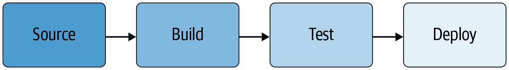

# 第十四章：部署代码

> 原文：[14. Deploying Code](https://google.github.io/building-secure-and-reliable-systems/raw/ch14.html)
> 
> 译者：[飞龙](https://github.com/wizardforcel)
> 
> 协议：[CC BY-NC-SA 4.0](https://creativecommons.org/licenses/by-nc-sa/4.0/)


作者：Jeremiah Spradlin 和 Mark Lodato

与 Sergey Simakov 和 Roxana Loza

在编写和测试代码时，前几章讨论了如何考虑安全性和可靠性。然而，直到代码构建和部署之后，该代码才会产生真正的影响。因此，对构建和部署过程的所有元素仔细考虑安全性和可靠性非常重要。仅通过检查构件本身很难确定部署的构件是否安全。软件供应链各个阶段的控制可以增加您对软件构件安全性的信心。例如，代码审查可以减少错误的机会，并阻止对手进行恶意更改，自动化测试可以增加您对代码操作正确性的信心。

围绕源代码、构建和测试基础设施构建的控制具有有限的效果，如果对手可以通过直接部署到您的系统来绕过它们。因此，系统应拒绝不是来自正确软件供应链的部署。为了满足这一要求，供应链中的每个步骤都必须能够提供其已正确执行的证据。

# 概念和术语

我们使用术语*软件供应链*来描述编写、构建、测试和部署软件系统的过程。这些步骤包括版本控制系统（VCS）、持续集成（CI）流水线和持续交付（CD）流水线的典型责任。

尽管实现细节在公司和团队之间有所不同，但大多数组织都有一个类似于图 14-1 的流程：

1.  代码必须检入版本控制系统。

1.  然后从检入的版本构建代码。

1.  一旦构建完成，二进制文件必须经过测试。

1.  然后将代码部署到某个环境中，进行配置和执行。



###### 图 14-1：典型软件供应链的高层视图

即使您的供应链比这个模型更复杂，您通常也可以将其分解为这些基本构建块。图 14-2 显示了典型部署流水线如何执行这些步骤的具体示例。

您应该设计软件供应链以减轻对系统的威胁。本章重点介绍了如何减轻内部人员（或恶意攻击者冒充内部人员）在第二章中定义的威胁，而不考虑内部人员是否具有恶意意图。例如，一个善意的工程师可能无意中构建了包含未经审查和未提交更改的代码，或者外部攻击者可能尝试使用受损工程师帐户的权限部署带有后门的二进制文件。我们同样考虑这两种情况。

在本章中，我们对软件供应链的步骤进行了广泛定义。

*构建*是将输入构件转换为输出构件的任何过程，其中*构件*是任何数据片段，例如文件、软件包、Git 提交或虚拟机（VM）镜像。*测试*是构建的特殊情况，其中输出构件是一些逻辑结果，通常是“通过”或“失败”，而不是文件或可执行文件。


###### 图 14-2：典型的云托管基于容器的服务部署

构建可以链接在一起，并且一个构件可以经历多次测试。例如，发布过程可能首先从源代码“构建”二进制文件，然后从二进制文件“构建”Docker 镜像，然后通过在开发环境中运行 Docker 镜像来“测试”Docker 镜像。

*部署*是将某个构件分配到某个环境的任何过程。您可以将以下每个过程视为部署：

+   推送代码：

+   发布命令以导致服务器下载并运行新的二进制文件

+   更新 Kubernetes 部署对象以使用新的 Docker 镜像

+   启动虚拟机或物理机，加载初始软件或固件

+   更新配置：

+   运行 SQL 命令来更改数据库模式

+   更新 Kubernetes 部署对象以更改命令行标志

+   发布一个包或其他数据，将被其他用户使用：

+   上传 deb 包到 apt 仓库

+   上传 Docker 镜像到容器注册表

+   上传 APK 到 Google Play 商店

本章不包括部署后更改。

# 威胁模型

在加固软件供应链以缓解威胁之前，您必须确定您的对手。在本讨论中，我们将考虑以下三种对手类型。根据您的系统和组织，您的对手清单可能会有所不同：

+   可能犯错误的良性内部人员

+   试图获得比其角色允许的更多访问权限的恶意内部人员

+   外部攻击者入侵一个或多个内部人员的机器或帐户

第二章描述了攻击者的配置文件，并提供了针对内部风险建模的指导。

接下来，您必须像攻击者一样思考，尝试识别对手可以颠覆软件供应链以威胁您系统的所有方式。以下是一些常见威胁的例子；您应该根据您组织的具体威胁来调整这个清单。为了简单起见，我们使用术语*工程师*来指代良性内部人员，*恶意对手*来指代恶意内部人员和外部攻击者：

+   工程师提交了一个意外引入系统漏洞的更改。

+   恶意对手提交了一个启用后门或引入系统其他有意漏洞的更改。

+   工程师意外地从包含未经审查的更改的本地修改版本的代码构建。

+   工程师部署了一个带有有害配置的二进制文件。例如，更改启用了仅用于测试的生产调试功能。

+   恶意对手部署了一个修改过的二进制文件到生产环境，开始窃取客户凭据。

+   恶意对手修改了云存储桶的 ACL，允许他们窃取数据。

+   恶意对手窃取用于签署软件的完整性密钥。

+   工程师部署了一个带有已知漏洞的旧版本代码。

+   CI 系统配置错误，允许从任意源代码库构建请求。因此，恶意对手可以从包含恶意代码的源代码库构建。

+   恶意对手上传一个自定义的构建脚本到 CI 系统，窃取签名密钥。然后对手使用该密钥对恶意二进制文件进行签名和部署。

+   恶意对手欺骗 CD 系统使用带有后门的编译器或构建工具来生成恶意二进制文件。

一旦您编制了一个潜在对手和威胁的全面清单，您可以将您已经采取的缓解措施与您识别出的威胁进行映射。您还应该记录当前缓解策略的任何限制。这个练习将为您的系统中潜在风险提供一个全面的图片。没有相应缓解措施的威胁，或者现有缓解措施存在重大限制的威胁，都是需要改进的领域。

# 最佳实践

以下最佳实践可以帮助您缓解威胁，在您的威胁模型中填补任何安全漏洞，并持续改进您的软件供应链的安全性。

## 需要代码审查

代码审查是在提交或部署更改之前，让第二个人（或几个人）审查源代码的更改的做法。除了提高代码安全性外，代码审查还为软件项目提供了多种好处：它们促进知识共享和教育，灌输编码规范，提高代码可读性，减少错误，所有这些有助于建立安全和可靠的文化（有关这个想法的更多信息，请参见第二十一章）。

从安全的角度来看，代码审查是一种多方授权的形式，这意味着没有个人有权利单独提交更改。正如第五章中所描述的，多方授权提供了许多安全好处。

要成功实现，代码审查必须是强制性的。如果对手可以选择退出审查，那么他们将不会被阻止！审查还必须足够全面，以捕捉问题。审阅者必须理解任何更改的细节及其对系统的影响，或者向作者询问澄清问题，否则该过程可能会变得形式化。

许多公开可用的工具允许您实现强制性的代码审查。例如，您可以配置 GitHub、GitLab 或 BitBucket，要求每个拉取/合并请求都需要一定数量的批准。或者，您可以使用独立的审查系统，如 Gerrit 或 Phabricator，结合一个配置为只接受来自该审查系统的推送的源代码库。

从安全的角度来看，代码审查在安全方面存在一些限制，正如第十二章中所述。因此，最好将其作为“深度防御”安全措施之一，与自动化测试（在第十三章中描述）和第十二章中的建议一起实现。

## 依赖自动化

理想情况下，自动化系统应该执行软件供应链中的大部分步骤。自动化提供了许多优势。它可以为构建、测试和部署软件提供一致、可重复的流程。将人类从循环中移除有助于防止错误并减少劳动。当您在一个封闭的系统上运行软件供应链自动化时，您可以使系统免受恶意对手的颠覆。

考虑一个假设的场景，工程师根据需要在他们的工作站上手动构建“生产”二进制文件。这种情况会产生许多引入错误的机会。工程师可能会意外地从错误的代码版本构建，或者包含未经审查或未经测试的代码更改。同时，恶意对手，包括已经攻破工程师机器的外部攻击者，可能会故意用恶意版本覆盖本地构建的二进制文件。自动化可以防止这两种结果。

以安全的方式添加自动化可能会有些棘手，因为自动化系统本身可能会引入其他安全漏洞。为了避免最常见的漏洞类别，我们建议至少采取以下措施：

将所有构建、测试和部署步骤移至自动化系统。

至少，您应该编写所有步骤的脚本。这样可以让人类和自动化执行相同的步骤以保持一致性。您可以使用 CI/CD 系统（如[Jenkins](https://jenkins.io)）来实现这一目的。考虑制定一个要求所有新项目都需要自动化的政策，因为将自动化应用到现有系统中通常是具有挑战性的。

软件供应链的所有配置更改都需要同行审查。

通常，将配置视为代码（如前所述）是实现这一目标的最佳方式。通过要求审查，您大大减少了出错和错误的机会，并增加了恶意攻击的成本。

锁定自动化系统，防止管理员或用户篡改。

这是最具挑战性的一步，实现细节超出了本章的范围。简而言之，考虑管理员可以在没有审查的情况下进行更改的所有路径——例如，通过直接配置 CI/CD 管道或使用 SSH 在机器上运行命令进行更改。对于每条路径，考虑采取措施以防止未经同行审查的访问。

有关锁定自动化构建系统的进一步建议，请参阅“可验证构建”。

自动化是双赢，减少了繁重的工作，同时增加了可靠性和安全性。尽可能依赖自动化！

## 验证构件，而不仅仅是人

如果对手可以绕过源、构建和测试基础设施的控制，直接部署到生产环境，那么这些控制的效果就会受到限制。仅仅验证*谁*发起了部署是不够的，因为该行为者可能会犯错误，或者可能是有意部署了恶意更改。相反，部署环境应该验证*正在*部署的内容。

部署环境应该要求证明部署过程的每个自动化步骤都已发生。除非有其他缓解控制检查该操作，否则人类不应能够绕过自动化。例如，如果您在 Google Kubernetes Engine（GKE）上运行，您可以使用[二进制授权](https://oreil.ly/0jsVi)默认接受仅由您的 CI/CD 系统签名的镜像，并监视 Kubernetes 集群审计日志，以获取有人使用紧急功能部署不符合规定的镜像时的通知。

这种方法的一个局限性是，它假设您设置的所有组件都是安全的：即 CI/CD 系统仅接受允许在生产环境中使用的源的构建请求，如果使用签名密钥，则只能由 CI/CD 系统访问，等等。“高级缓解策略”描述了一种更健壮的方法，直接验证所需属性，减少了隐含的假设。

## 将配置视为代码

服务的配置对于安全性和可靠性同样至关重要。因此，关于代码版本控制和更改审查的所有最佳实践也适用于配置。将配置视为代码，要求在部署之前对配置更改进行检入、审查和测试，就像对任何其他更改一样。

举个例子：假设您的前端服务器有一个配置选项来指定后端。如果有人将您的生产前端指向后端的测试版本，那么您将面临严重的安全和可靠性问题。

或者，作为一个更实际的例子，考虑一个使用 Kubernetes 并将配置存储在版本控制下的[YAML](https://yaml.org)文件的系统。部署过程调用`kubectl`二进制文件并传递 YAML 文件，部署经过批准的配置。限制部署过程仅使用“经过批准”的 YAML——来自版本控制并需要同行审查的 YAML——使得误配置服务变得更加困难。

您可以重复使用本章推荐的所有控件和最佳实践，以保护您服务的配置。重用这些方法通常比其他方法更容易，后者通常需要完全独立的多方授权系统来保护部署后的配置更改。

版本控制和审查配置的做法并不像代码版本控制和审查那样普遍。即使实现了配置即代码的组织通常也不会对配置应用代码级别的严格要求。例如，工程师通常知道他们不应该从本地修改的源代码构建生产版本的二进制文件。这些工程师可能在未将更改保存到版本控制并征求审查的情况下部署配置更改。

实现配置即代码需要改变你的文化、工具和流程。在文化上，你需要重视审查流程。在技术上，你需要工具，允许你轻松比较提议的更改（即`diff`，`grep`），并提供在紧急情况下手动覆盖更改的能力。

# 防范威胁模型

现在我们已经定义了一些最佳实践，我们可以将这些流程映射到我们之前确定的威胁上。在评估这些流程与您特定的威胁模型相关时，问问自己：所有最佳实践都是必要的吗？它们是否足以缓解所有威胁？表 14-1 列出了示例威胁，以及它们对应的缓解措施和这些缓解措施的潜在限制。

表 14-1. 示例威胁、缓解措施和缓解措施的潜在限制

| 威胁 | 缓解 | 限制 |
| --- | --- | --- |
| 一个工程师提交了一个意外引入系统漏洞的更改。 | 代码审查加自动化测试（见第十三章）。这种方法显著减少了错误的机会。 |  |
| 一个恶意的对手提交了一个改变，使系统启用了后门或引入了其他有意的漏洞。 | 代码审查。这种做法增加了攻击的成本和检测的机会——对手必须仔细制定更改以通过代码审查。 | 不能防止串通或外部攻击者能够 compromise 多个内部账户。 |

一个工程师意外地从包含未经审查的更改的本地修改版本的代码构建。一个自动化的 CI/CD 系统总是从正确的源代码库中拉取执行构建。

一个工程师部署了一个有害的配置。例如，更改启用了仅用于测试的生产环境中的调试功能。将配置视为源代码，并要求进行相同级别的同行审查。并非所有配置都可以被视为“代码”。

一个恶意的对手部署了一个修改后的二进制文件到生产环境，开始窃取客户凭据。生产环境需要证明 CI/CD 系统构建了二进制文件。CI/CD 系统配置为只从正确的源代码库中拉取源代码。对手可能会想出如何绕过这一要求，使用紧急部署 breakglass 程序。充分的日志记录和审计可以缓解这种可能性。

一个恶意的对手修改了云存储桶的 ACL，使他们能够窃取数据。考虑资源 ACL 作为配置。云存储桶只允许部署过程进行配置更改，因此人类无法进行更改。不能防止串通或外部攻击者能够 compromise 多个内部账户。

一个恶意的对手窃取了用于签署软件的完整性密钥。将完整性密钥存储在一个密钥管理系统中，该系统配置为只允许 CI/CD 系统访问密钥，并支持密钥轮换。有关更多信息，请参见第九章。有关构建特定的建议，请参见“高级缓解策略”。

图 14-3 显示了一个更新的软件供应链，其中包括前面表中列出的威胁和缓解措施。


###### 图 14-3：典型的软件供应链-对手不应能够绕过流程

我们尚未将几个威胁与最佳实践中的缓解措施相匹配：

+   工程师部署了一个带有已知漏洞的旧版本代码。

+   CI 系统配置错误，允许从任意源代码仓库构建请求。因此，恶意对手可以从包含恶意代码的源代码仓库构建。

+   一个恶意对手上传了一个自定义的构建脚本到 CI 系统，用于窃取签名密钥。然后对手使用该密钥对恶意二进制文件进行签名和部署。

+   一个恶意对手欺骗 CD 系统使用一个带有后门的编译器或构建工具来生成恶意二进制文件。

为了解决这些威胁，您需要实现更多的控制，我们将在下一节中介绍。只有您才能决定是否值得为您特定的组织解决这些威胁。

# 深入探讨：高级缓解策略

您可能需要复杂的缓解措施来解决软件供应链中一些更高级的威胁。因为本节中的建议在行业内尚未成为标准，您可能需要构建一些自定义基础设施来采用这些建议。这些建议最适合规模大和/或特别安全敏感的组织，对于暴露于内部风险较低的小型组织可能没有意义。

## 二进制来源

每次构建都应该生成描述给定二进制工件是如何构建的“二进制来源”：输入、转换和执行构建的实体。

为了解释原因，考虑以下激励性例子。假设您正在调查一个安全事件，并且看到在特定时间窗口内发生了部署。您想确定部署是否与该事件有关。逆向工程二进制将成本过高。检查源代码将更容易得多，最好是查看版本控制中的更改。但是您如何知道二进制来自哪个源代码？

即使您不预期需要这些类型的安全调查，您也需要基于来源的二进制来源来制定基于来源的部署策略，如本节后面所讨论的。

### 二进制来源中应包含的内容

您应该在来源中包含的确切信息取决于您的系统内置的假设和最终需要来源的消费者的信息。为了实现丰富的部署策略并允许临时分析，我们建议以下来源字段：

真实性（必需）

暗示了构建的隐式信息，例如产生它的系统以及您为何可以信任来源。这通常是通过使用加密签名来保护二进制来源的其他字段来实现的。¹¹

输出（必需）

适用于此二进制来源的输出工件。通常，每个输出都由工件内容的加密哈希标识。

输入

构建中的内容。此字段允许验证者将源代码的属性与工件的属性进行关联。它应包括以下内容：

来源

构建的“主”输入工件，例如顶层构建命令运行的源代码树。例如：“来自`https://github.com/mysql/mysql-server`的 Git 提交`270f...ce6d`”¹²或“文件`foo.tar.gz`的 SHA-256 内容`78c5...6649`。”

依赖

构建所需的所有其他工件，如库、构建工具和编译器，这些工件在源代码中没有完全指定。这些输入都可能影响构建的完整性。

命令

用于启动构建的命令。例如：“`bazel build //main:hello-world`”。理想情况下，该字段应结构化以允许自动化分析，因此我们的示例可能变为“`{"bazel": {"command": "build", "target": "//main:hello_world"}}`”。

环境

需要重现构建的任何其他信息，例如架构细节或环境变量。

输入元数据

在某些情况下，构建者可能会读取有关下游系统将发现有用的输入的元数据。例如，构建者可能包括源提交的时间戳，然后策略评估系统在部署时使用。

调试信息

任何不必要用于安全性但可能对调试有用的额外信息，例如构建运行的机器。

版本控制

构建时间戳和溯源格式版本号通常很有用，以便进行将来的更改，例如使旧构建无效或更改格式而不易受到回滚攻击。

您可以省略隐含或由源代码本身覆盖的字段。例如，Debian 的溯源格式省略了构建命令，因为该命令始终是`dpkg-buildpackage`。

输入工件通常应列出*标识符*（例如 URI）和*版本*（例如加密哈希）。通常使用标识符来验证构建的真实性，例如验证代码是否来自正确的源代码库。版本对于各种目的都很有用，例如临时分析、确保可重现的构建以及验证链式构建步骤，其中步骤*i*的输出是步骤*i*+1 的输入。

注意攻击面。您需要验证构建系统未检查的任何内容（因此由签名隐含）或包含在源代码中（因此经过同行审查）的内容。如果启动构建的用户可以指定任意编译器标志，则验证器必须验证这些标志。例如，GCC 的`-D`标志允许用户覆盖任意符号，因此也可以完全更改二进制文件的行为。同样，如果用户可以指定自定义编译器，则验证器必须确保使用了“正确”的编译器。一般来说，构建过程可以执行的验证越多，越好。

有关二进制溯源的一个很好的例子，请参见 Debian 的[deb-buildinfo](https://oreil.ly/WNUw_)格式。有关更一般的建议，请参见[可重现构建项目的文档](https://oreil.ly/Y5VFW)。要签名和编码此信息的标准方法，请考虑[JSON Web Tokens（JWT）](https://jwt.io)。

## 基于溯源的部署策略

“验证工件，而不仅仅是人”建议官方构建自动化流水线应该验证正在部署的内容。如何验证流水线配置正确？如果您想为某些部署环境提供特定的保证，而这些保证不适用于其他环境，该怎么办？

您可以使用明确的部署策略来描述每个部署环境的预期属性，以解决这些问题。然后，部署环境可以将这些策略与部署到它们的工件的二进制溯源进行匹配。

这种方法比纯粹基于签名的方法有几个优点：

+   它减少了软件供应链中隐含的假设数量，使分析和确保正确性变得更容易。

+   它澄清了软件供应链中每个步骤的合同，减少了配置错误的可能性。

+   它允许您在每个构建步骤中使用单个签名密钥，而不是每个部署环境，因为现在您可以使用二进制溯源进行部署决策。

例如，假设您有一个微服务架构，并希望保证每个微服务只能从提交到该微服务源存储库的代码构建。使用代码签名，您需要每个源存储库一个密钥，并且 CI/CD 系统需要根据源存储库选择正确的签名密钥。这种方法的缺点是很难验证 CI/CD 系统的配置是否符合这些要求。

使用基于溯源的部署策略，CI/CD 系统生成了二进制溯源，说明了源存储库，总是由单一密钥签名。每个微服务的部署策略列出了允许的源存储库。与代码签名相比，正确性的验证要容易得多，因为部署策略在一个地方描述了每个微服务的属性。

部署策略中列出的规则应该减轻对系统的威胁。参考您为系统创建的威胁模型。您可以定义哪些规则来减轻这些威胁？例如，以下是一些您可能想要实现的示例规则：

+   源代码已提交到版本控制并经过同行审查。

+   源代码来自特定位置，比如特定的构建目标和存储库。

+   构建是通过官方的 CI/CD 流水线进行的（参见“可验证构建”）。

+   测试已通过。

+   二进制文件在此部署环境中明确允许。例如，不要在生产环境中允许“测试”二进制文件。

+   代码或构建的版本足够新。¹³

+   代码不包含已知的漏洞，如最近的安全扫描所报告的。¹⁴

[in-toto 框架](https://in-toto.github.io)提供了实现溯源策略的一个标准。

### 实现政策决策

如果您为基于溯源的部署策略实现自己的引擎，请记住需要三个步骤：

1.  验证*溯源的真实性*。这一步还隐式地验证了溯源的完整性，防止对手篡改或伪造它。通常，这意味着验证溯源是否由特定密钥进行了加密签名。

1.  验证*溯源是否适用于构件*。这一步还隐式地验证了构件的完整性，确保对手不能将一个“好”的溯源应用于一个“坏”的构件。通常，这意味着比较构件的加密哈希与溯源有效负载中找到的值。

1.  验证*溯源是否符合所有策略规则*。

这个过程的最简单的例子是一个规则，要求构件必须由特定密钥签名。这个单一的检查实现了所有三个步骤：它验证了签名本身是否有效，构件是否适用于签名，以及签名是否存在。

让我们考虑一个更复杂的例子：“Docker 镜像必须从 GitHub 存储库`mysql/mysql-server`构建。”假设您的构建系统使用密钥*K[B]*以 JWT 格式签署构建溯源。在这种情况下，令牌有效负载的模式将如下所示，其中主题`sub`是[RFC 6920 URI](https://oreil.ly/_8zJm)：

```go
{
  "sub": "ni:///sha-256;...",
  "input": {"source_uri": "..."}
}
```

要评估构件是否符合此规则，引擎需要验证以下内容：

1.  JWT 签名使用密钥*K[B]*进行验证。

1.  `sub` 匹配了构件的 SHA-256 哈希。

1.  `input.source_uri` 正好是`"https://github.com/mysql/mysql-server"`。

## 可验证构建

我们称构建为*可验证的*，如果构建产生的二进制溯源是可信的。¹⁵ 可验证性取决于观察者。您是否信任特定的构建系统取决于您的威胁模型以及构建系统如何融入您组织更大的安全故事。

考虑以下非功能性需求示例是否适合你的组织，¹⁶并添加符合你特定需求的任何需求：

+   如果单个开发者的工作站受到损害，二进制出处或输出物品的完整性不会受到损害。

+   对手无法在不被察觉的情况下篡改出处或输出物品。

+   一个构建不能影响另一个构建的完整性，无论是并行运行还是串行运行。

+   构建不能产生包含错误信息的出处。例如，出处不应该声称一个物品是从 Git 提交`abc...def`构建的，而实际上是来自`123...456`。

+   非管理员不能配置用户定义的构建步骤，比如 Makefile 或 Jenkins Groovy 脚本，以违反此列表中的任何要求。

+   在构建后至少*N*个月内，所有源物品的快照都可以用于潜在的调查。

+   构建是可复现的（参见“隔离的、可复现的或可验证的？”）。即使在可验证的构建架构中没有要求，这种方法也可能是可取的。例如，在发现安全事件或漏洞后，可复现的构建可能有助于独立重新验证物品的二进制出处。

### 可验证的构建架构

可验证构建系统的目的是增加验证者对构建系统产生的二进制出处的信任。无论可验证性的具体要求如何，都有三种主要的架构可供选择：

可信的构建服务

验证者要求原始构建是由验证者信任的构建服务执行的。通常，这意味着可信的构建服务用只有该服务才能访问的密钥对二进制出处进行签名。

这种方法的优点是只需要构建一次，不需要可复现性（参见“隔离的、可复现的或可验证的？”）。Google 在内部构建中使用这种模型。

你自己进行的重建

验证者在飞行中重现构建，以验证二进制出处。例如，如果二进制出处声称来自 Git 提交`abc...def`，验证者会获取该 Git 提交，重新运行二进制出处中列出的构建命令，并检查输出是否与问题物品完全相同。有关可复现性的更多信息，请参见下面的侧边栏。

虽然这种方法可能一开始看起来很吸引人，因为你信任自己，但它并不具备可扩展性。构建通常需要几分钟甚至几小时，而部署决策通常需要在毫秒内做出。这还要求构建是完全可复现的，这并不总是切实可行；有关更多信息，请参见侧边栏。

重建服务

验证者要求“重建者”中的一些“重建者”已经重现了构建并证明了二进制出处的真实性。这是前两种选项的混合体。在实践中，这种方法通常意味着每个重建者监视一个软件包存储库，主动重建每个新版本，并将结果存储在某个数据库中。然后，验证者在*N*个不同的数据库中查找条目，这些条目以问题物品的加密哈希为键。当中央管理模式不可行或不可取时，像[Debian](https://oreil.ly/zNZ7G)这样的开源项目使用这种模型。

### 实现可验证的构建

无论可验证的构建服务是“可信的构建服务”还是“重建服务”，都应该牢记一些重要的设计考虑。

基本上，几乎所有的 CI/CD 系统都按照图 14-4 中的步骤运行：服务接收请求，获取任何必要的输入，执行构建，并将输出写入存储系统。


###### 图 14-4：一个基本的 CI/CD 系统

有了这样的系统，您可以相对容易地向输出添加签名的来源，如图 14-5 所示。对于一个采用“中央构建服务”模型的小型组织来说，这个额外的签名步骤可能足以解决安全问题。


###### 图 14-5：向现有的 CI/CD 系统添加签名

随着您的组织规模的增长和您有更多的资源投入到安全中，您可能希望解决另外两个安全风险：不受信任的输入和未经身份验证的输入。

#### 不受信任的输入

对手可能使用构建的输入来颠覆构建过程。许多构建服务允许非管理员用户定义在构建过程中执行的任意命令，例如通过 Jenkinsfile、*travis.yml*、Makefile 或*BUILD*。从安全的角度来看，这种功能实际上是“远程代码执行（RCE）设计”。在特权环境中运行的恶意构建命令可以执行以下操作：

+   窃取签名密钥。

+   在来源中插入错误信息。

+   修改系统状态，影响后续构建。

+   操纵另一个同时进行的构建。 

即使用户不被允许定义自己的步骤，编译是一个非常复杂的操作，提供了充分的机会进行 RCE 漏洞。

您可以通过特权分离来减轻这种威胁。使用一个受信任的编排器进程来设置初始的已知良好状态，启动构建，并在构建完成时创建签名的来源。可选地，编排器可以获取输入以解决下一小节中描述的威胁。所有用户定义的构建命令应在另一个环境中执行，该环境无法访问签名密钥或任何其他特权。您可以通过各种方式创建这个环境，例如通过与编排器相同的机器上的沙盒，或者在单独的机器上运行。

#### 未经身份验证的输入

即使用户和构建步骤是可信的，大多数构建都依赖于其他工件。任何这样的依赖都是对手可能潜在颠覆构建的表面。例如，如果构建系统在没有 TLS 的情况下通过 HTTP 获取依赖项，攻击者可以进行中间人攻击以修改传输中的依赖项。

因此，我们建议使用隔离构建（参见“隔离的、可重现的或可验证的？”）。构建过程应该提前声明所有输入，只有编排器应该获取这些输入。隔离构建大大提高了在来源中列出的输入是正确的信心。

一旦您考虑了不受信任和未经身份验证的输入，您的系统就类似于图 14-6。这样的模型比图 14-5 中的简单模型更抵抗攻击。


###### 图 14-6：解决不受信任和未经身份验证输入风险的“理想”CI/CD 设计

## 部署阻塞点

要“验证工件，而不仅仅是人”，部署决策必须发生在部署环境内的适当阻塞点。在这种情况下，“阻塞点”是所有部署请求必须流经的点。对手可以绕过不在阻塞点发生的部署决策。

以 Kubernetes 为例，设置部署瓶颈，如图 14-7 所示。假设您想要验证特定 Kubernetes 集群中所有部署到 pod 的部署。主节点将成为一个良好的瓶颈，因为所有部署都应该通过它进行。为了使其成为一个合适的瓶颈，配置工作节点只接受来自主节点的请求。这样，对手就无法直接部署到工作节点。


###### 图 14-7：Kubernetes 架构-所有部署必须通过主节点

理想情况下，瓶颈执行策略决策，可以直接执行，也可以通过 RPC 执行。Kubernetes 为此目的提供了[准入控制器](https://oreil.ly/Bm04C)webhook。如果您使用 Google Kubernetes Engine，[二进制授权](https://oreil.ly/YxiJX)提供了一个托管的准入控制器和许多其他功能。即使您不使用 Kubernetes，您也可以修改“准入”点以执行部署决策。

或者，您可以在瓶颈前放置一个“代理”，并在代理中执行策略决策，如图 14-8 所示。这种方法需要配置您的“准入”点，只允许通过代理访问。否则，对手可以通过直接与准入点通信来绕过代理。


###### 图 14-8：使用代理进行策略决策的替代架构

## 部署后验证

即使在部署时执行部署策略或签名检查时，记录和部署后验证几乎总是可取的，原因如下：

+   *策略可能会更改*，在这种情况下，验证引擎必须重新评估系统中现有的部署，以确保它们仍然符合新的策略。这在首次启用策略时尤为重要。

+   由于决策服务不可用，请求可能已被允许继续进行。这种*故障开放*设计通常是必要的，以确保服务的可用性，特别是在首次推出执行功能时。

+   在紧急情况下，操作员可能使用了*紧急开关机制*来绕过决策，如下一节所述。

+   用户需要一种方法，在提交之前*测试*潜在的策略更改，以确保现有状态不会违反新版本的策略。

+   出于类似于“故障开放”用例的原因，用户可能还希望有一种*干预运行*模式，在部署时系统始终允许请求，但监控会发现潜在问题。

+   调查人员可能需要在事故发生后出于*取证*目的获取信息。

执行决策点必须记录足够的信息，以便验证器在部署后评估策略。²⁰通常需要记录完整的请求，但并不总是足够的-如果策略评估需要一些其他状态，则日志必须包括该额外状态。例如，当我们为 Borg 实现部署后验证时遇到了这个问题：因为“作业”请求包括对现有“分配”和“包”引用，我们必须连接三个日志来源-作业，分配和包-以获取做出决策所需的完整状态。²¹

# 实用建议

多年来，在各种情境中实现可验证的构建和部署策略时，我们学到了一些经验教训。这些经验教训大多与实际技术选择无关，而更多地与如何部署可靠、易于调试和易于理解的更改有关。本节包含一些建议，希望您会发现有用。

## 逐步进行

提供高度安全、可靠和一致的软件供应链可能需要您进行许多更改，从编写构建步骤到实现构建来源，再到实现配置即代码。协调所有这些更改可能很困难。这些控件中的错误或缺失功能也可能对工程生产力构成重大风险。在最坏的情况下，这些控件中的错误可能导致服务中断。

如果您一次专注于保护供应链的一个特定方面，可能会更成功。这样，您可以最大程度地减少中断风险，同时还可以帮助同事学习新的工作流程。

## 提供可操作的错误消息

当部署被拒绝时，错误消息必须清楚地解释出了什么问题以及如何解决。例如，如果工件被拒绝是因为从错误的源 URI 构建的，解决方法可以是更新策略以允许该 URI，或者从正确的 URI 重新构建。您的策略决策引擎应该给用户提供可操作的反馈，提供这样的建议。简单地说“不符合策略”可能会让用户感到困惑和手足无措。

在设计架构和策略语言时，请考虑这些用户旅程。一些设计选择会使为用户提供可操作的反馈变得非常困难，因此请尽早发现这些问题。例如，我们早期的策略语言原型提供了许多表达策略的灵活性，但阻止我们提供可操作的错误消息。我们最终放弃了这种方法，转而采用了一种非常有限的语言，可以提供更好的错误消息。

## 确保来源清晰

谷歌的可验证构建系统最初将二进制来源异步上传到数据库。然后在部署时，策略引擎使用工件的哈希作为键在数据库中查找来源。

虽然这种方法*大多*运行良好，但我们遇到了一个主要问题：用户可以多次构建工件，导致相同哈希的多个条目。考虑空文件的情况：我们有数百万条与空文件的哈希相关的来源记录，因为许多不同的构建生成了空文件作为其输出的一部分。为了验证这样的文件，我们的系统必须检查*任何*来源记录是否符合策略。这反过来又导致了两个问题：

+   当我们未能找到通过记录时，我们无法提供可操作的错误消息。例如，我们不得不说，“源 URI 是*X*，但策略应该是*Y*”，而不是“这 497,129 条记录中没有一条符合策略”。这是糟糕的用户体验。

+   验证时间与返回的记录数量成正比。这导致我们的延迟 SLO 超出了 100 毫秒数倍！

我们还遇到了与数据库的异步上传问题。上传可能会悄无声息地失败，这种情况下我们的策略引擎会拒绝部署。与此同时，用户不明白为什么被拒绝。我们本可以通过使上传同步来解决这个问题，但这种解决方案会使我们的构建系统不太可靠。

因此，我们强烈建议使来源清晰。在可能的情况下，避免使用数据库，而是*内联传播来源与工件*。这样做可以使整个系统更可靠，延迟更低，更易于调试。例如，使用 Kubernetes 的系统可以添加一个传递给 Admission Controller webhook 的注释。

## 创建明确的策略

与我们推荐的工件来源的方法类似，适用于特定部署的策略应该是明确的。我们建议设计系统，以便任何给定的部署只适用一个策略。考虑另一种选择：如果有两个策略适用，那么两个策略都需要通过吗，还是只需要一个策略通过？最好完全避免这个问题。如果您想在整个组织中应用全局策略，可以将其作为元策略实现：实现一个检查，以确保所有个体策略符合一些全局标准。

## 包括部署 breakglass

在紧急情况下，可能需要绕过部署策略。例如，工程师可能需要重新配置前端以将流量从失败的后端转移，相应的配置即代码更改可能需要通过常规 CI/CD 管道部署太长时间。绕过策略的 breakglass 机制可以让工程师快速解决故障，并促进安全和可靠性的文化（见第二十一章）。

由于对手可能利用 breakglass 机制，所有 breakglass 部署必须迅速引发警报并进行审计。为了使审计变得实用，breakglass 事件应该是罕见的——如果事件太多，可能无法区分恶意活动和合法使用。

# 重新审视威胁模型的安全防护

现在我们可以将高级缓解措施映射到以前未解决的威胁，如表 14-2 所示。

表 14-2. 复杂威胁示例的高级缓解措施

| 威胁 | 缓解 |
| --- | --- |
| 工程师部署了一个存在已知漏洞的旧版本代码。 | 部署策略要求代码在过去的*N*天内进行了安全漏洞扫描。 |
| CI 系统配置错误，允许从任意源代码库构建请求。结果，恶意对手可以从包含恶意代码的源代码库构建。 | CI 系统生成描述其拉取源代码库的二进制来源。生产环境强制执行部署策略，要求来源证明部署的工件来自批准的源代码库。 |
| 恶意对手向 CI 系统上传自定义构建脚本，窃取签名密钥。然后对手使用该密钥签名和部署恶意二进制文件。 | 可验证构建系统分离权限，以便运行自定义构建脚本的组件无法访问签名密钥。 |
| 恶意对手欺骗 CD 系统使用带有后门的编译器或构建工具生成恶意二进制文件。 | 严格构建要求开发人员在源代码中明确指定编译器和构建工具的选择。这个选择像所有其他代码一样经过同行评审。 |

通过在软件供应链周围采取适当的安全控制，您可以缓解甚至是高级和复杂的威胁。

# 结论

本章的建议可以帮助您加强软件供应链对各种内部威胁的防范。代码审查和自动化是防止错误和增加恶意行为攻击成本的基本策略。代码作为配置将这些好处扩展到传统上受到比代码更少关注的配置。同时，基于工件的部署控制，特别是涉及二进制来源和可验证构建的控制，可以提供对复杂对手的保护，并允许您随着组织的增长而扩展。

7.这些建议有助于确保您编写和测试的代码（遵循第十二章和第十三章的原则）实际上是部署在生产环境中的代码。然而，尽管您已经尽力，您的代码可能并不总是按预期行为。当发生这种情况时，您可以使用下一章介绍的一些调试策略。

18.（1）代码审查也适用于对配置文件的更改；请参阅“将配置视为代码”。

11.（2）Sadowski, Caitlin 等人。2018 年。“现代代码审查：谷歌的案例研究。”*第 40 届国际软件工程大会论文集*：181-190。doi:10.1145/3183519.3183525。

2.（3）当与配置即代码和本章描述的部署策略结合时，代码审查构成了任意系统的多方授权系统的基础。

1.（4）有关代码审查者的责任，请参阅[“审查文化”](ch21.html#culture_of_review)。

3.（5）步骤的“链”不一定需要完全自动。例如，通常可以接受人类能够启动构建或部署步骤。但是，人类不应该能够以任何有意义的方式影响该步骤的行为。

16.（6）尽管如此，这样的授权检查对于最小特权原则仍然是必要的（请参阅第五章）。

10.（7）紧急开关机制可以绕过策略，允许工程师快速解决故障。请参阅[“紧急开关”](ch05.html#breakglass)。

4.（8）这个概念在[SRE 书籍第八章](https://landing.google.com/sre/sre-book/chapters/release-engineering/)和 SRE workbook 的第十四章和第十五章中有更详细的讨论。所有这些章节中的建议都适用于这里。

12.（9）YAML 是 Kubernetes 使用的[配置语言](https://oreil.ly/UKo2t)。

5.（10）您必须记录和审计这些手动覆盖，以防对手使用手动覆盖作为攻击向量。

15.（11）请注意，真实性意味着完整性。

6.（12）Git 提交 ID 是提供整个源代码树完整性的加密哈希。

8.（13）有关回滚到有漏洞版本的讨论，请参阅[“最低可接受的安全版本号”](ch09.html#minimum_acceptable_security_version_num)。

13.（14）例如，您可能需要证明[Cloud Security Scanner](https://oreil.ly/mrTi7)在运行此特定代码版本的测试实例时未发现任何结果。

14.（15）请记住，纯签名仍然算作“二进制来源”，如前一节所述。

17.（16）请参阅[“设计目标和要求”](ch04.html#design_objectives_and_requirements)。 

9.（17）例如，[SRE 书籍](https://landing.google.com/sre/sre-book/chapters/release-engineering/#hermetic-builds-nqslhnid)将“hermetic”和“reproducible”这两个术语互换使用。[Reproducible Builds 项目](https://reproducible-builds.org)将“reproducible”定义为本章定义的方式，但有时也会将“reproducible”重载为“可验证”。

¹⁸ 作为一个反例，考虑一个构建过程，在构建过程中获取依赖的最新版本，但在其他方面产生相同的输出。只要两次构建大致同时发生，这个过程就是可重现的，但不是完全隔离的。

¹⁹ 实际上，必须有一种方式将软件部署到节点本身——引导加载程序、操作系统、Kubernetes 软件等等——而且该部署机制必须有自己的策略执行，这很可能是与用于 pod 的实现完全不同的实现。

²⁰ 理想情况下，日志是非常可靠和防篡改的，即使在停机或系统受到威胁的情况下也是如此。例如，假设 Kubernetes 主节点在日志后端不可用时接收到一个请求。主节点可以暂时将日志保存到本地磁盘。如果机器在日志后端恢复之前死机了怎么办？或者如果机器的空间用完了怎么办？这是一个具有挑战性的领域，我们仍在开发解决方案。

²¹ Borg 分配（简称 *分配*）是机器上一组保留的资源，其中可以在容器中运行一个或多个 Linux 进程集。软件包包含 Borg 作业的二进制文件和数据文件。有关 Borg 的完整描述，请参见 Verma, Abhishek 等人 2015 年的文章《Google 的 Borg 大规模集群管理》。*第 10 届欧洲计算机系统会议论文集*：1–17。doi:10.1145/2741948.2741964。
