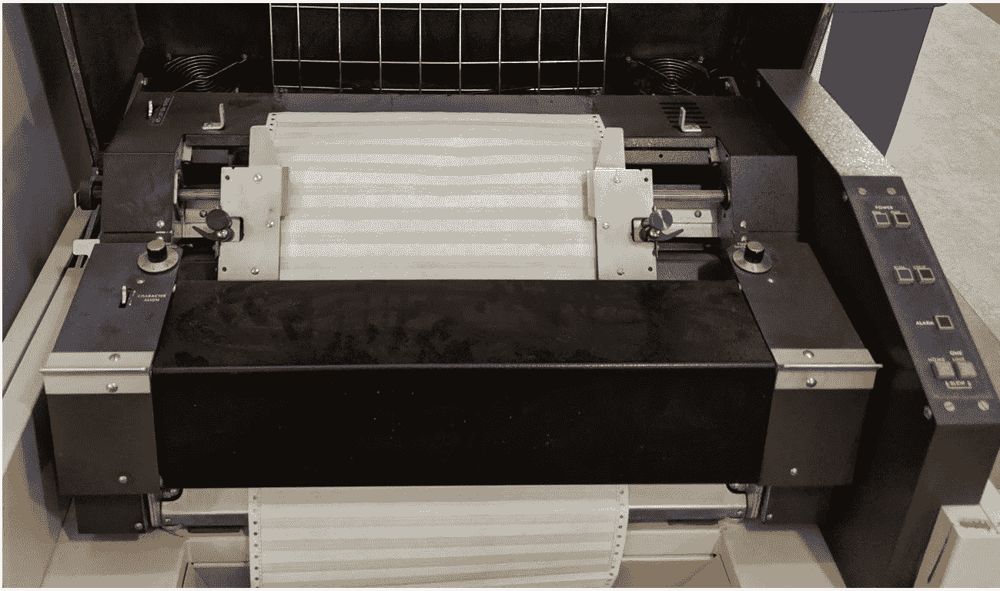

# 第十五章：调查系统

> 原文：[https://google.github.io/building-secure-and-reliable-systems/raw/ch14.html](https://google.github.io/building-secure-and-reliable-systems/raw/ch15.html)
> 
> 译者：[飞龙](https://github.com/wizardforcel)
> 
> 协议：[CC BY-NC-SA 4.0](https://creativecommons.org/licenses/by-nc-sa/4.0/)

Pete Nuttall、Matt Linton 和 David Seidman

与 Vera Haas、Julie Saracino 和 Amaya Booker

在理想的世界中，我们都会构建完美的系统，我们的用户只会怀有最好的意图。然而，在现实中，您会遇到错误，并需要进行安全调查。当您观察生产中运行的系统时，您会确定需要改进的地方，以及可以简化和优化流程的地方。所有这些任务都需要调试和调查技术，以及适当的系统访问。

然而，即使是只读调试访问也会带来滥用的风险。为了解决这一风险，您需要适当的安全机制。您还需要在开发人员和运营人员的调试需求与存储和访问敏感数据的安全要求之间取得谨慎的平衡。

###### 注

在本章中，我们使用术语*调试器*来指代调试软件问题的人类，而不是[GDB（GNU 调试器）](https://oreil.ly/Fl82Z)或类似的工具。除非另有说明，我们使用“我们”一词来指代本章的作者，而不是整个谷歌公司。

# 从调试到调查

> “我完全意识到，我余生的很大一部分时间将花在查找自己程序中的错误上。”
>
> ——Maurice Wilkes，《计算机先驱的回忆录》（麻省理工学院出版社，1985 年）

调试声誉不佳。错误总是在最糟糕的时候出现。很难估计错误何时会被修复，或者何时系统会“足够好”让许多人使用。对大多数人来说，编写新代码比调试现有程序更有趣。调试可能被认为是没有回报的。然而，它是必要的，当通过学习新的事实和工具的视角来看待时，你甚至可能会发现这种实践是令人愉快的。根据我们的经验，调试也使我们成为更好的程序员，并提醒我们有时我们并不像我们认为的那么聪明。

## 示例：临时文件

考虑以下停机事件，我们（作者）在两年前调试过。[1]调查开始时，我们收到了一个警报，称[Spanner 数据库](https://oreil.ly/ZYr1W)的存储配额即将用完。我们经历了调试过程，问自己以下问题：

1.  是什么导致数据库存储空间不足？

快速分诊表明，问题是由谷歌庞大的分布式文件系统[Colossus](https://oreil.ly/dkocj)中创建了许多小文件积累导致的，这可能是由用户请求流量的变化触发的。

1.  是什么在创建所有这些小文件？

我们查看了服务指标，显示这些文件是 Spanner 服务器内存不足导致的。根据正常行为，最近的写入（更新）被缓存在内存中；当服务器内存不足时，它将数据刷新到 Colossus 上的文件中。不幸的是，Spanner 区中的每台服务器只有少量内存来容纳更新。因此，与其刷新可管理数量的较大、压缩的文件，[2]每台服务器都会刷新许多小文件到 Colossus。

1.  内存使用在哪里？

每个服务器都作为一个 Borg 任务（在容器中）运行，这限制了可用的内存。[3]为了确定内核内存的使用位置，我们直接在生产机器上发出了`slabtop`命令。我们确定目录条目（dentry）缓存是内存的最大使用者。

1.  为什么 dentry 缓存这么大？

我们做出了一个合理的猜测，即 Spanner 数据库服务器正在创建和删除大量临时文件——每次刷新操作都会有一些。每次刷新操作都会增加 dentry 缓存的大小，使问题变得更糟。

1.  我们如何确认我们的假设？

为了验证这个理论，我们在 Borg 上创建并运行了一个程序，通过在循环中创建和删除文件来复现这个错误。几百万个文件后，dentry 缓存已经使用了容器中的所有内存，证实了假设。

1.  这是一个内核 bug 吗？

我们研究了 Linux 内核的预期行为，并确定内核缓存了文件的不存在——一些构建系统需要这个特性来确保可接受的性能。在正常操作中，当容器满时，内核会从 dentry 缓存中驱逐条目。然而，由于 Spanner 服务器反复刷新更新，容器从未变得足够满以触发驱逐。我们通过指定临时文件不需要被缓存来解决了这个问题。

这里描述的调试过程展示了我们在本章讨论的许多概念。然而，这个故事最重要的收获是*我们调试了这个问题*—而你也可以！解决和修复问题并不需要任何魔法；它只需要缓慢和有条理的调查。要分解我们调查的特征：

+   在系统显示出退化迹象后，我们使用现有的日志和监控基础设施调试了这个问题。

+   我们能够调试这个问题，即使它发生在内核空间和调试人员以前没有见过的代码中。

+   我们在这次停机之前从未注意到这个问题，尽管它可能已经存在了几年。

+   系统的任何部分都没有损坏。所有部分都按预期工作。

+   Spanner 服务器的开发人员惊讶地发现，临时文件在文件被删除后仍然可以消耗内存。

+   我们能够通过使用内核开发人员提供的工具来调试内核的内存使用情况。尽管我们以前从未使用过这些工具，但由于我们在调试技术上接受了培训并且有丰富的实践经验，我们能够相对快速地取得进展。

+   我们最初误诊了错误为用户错误。只有在检查了我们的数据后，我们才改变了主意。

+   通过提出假设，然后创建一种测试我们理论的方法，我们在引入系统更改之前确认了根本原因。

## 调试技术

本节分享了一些系统化调试技术。(4) 调试是一种可以学习和实践的技能。[SRE 书的第十二章](https://landing.google.com/sre/sre-book/chapters/effective-troubleshooting/)提供了成功调试的两个要求：

+   了解系统应该如何工作。

+   要有系统性：收集数据，假设原因，测试理论。

第一个要求更加棘手。以一个由单个开发人员构建的系统为例，突然离开公司，带走了对系统的所有了解。系统可能会继续工作数月，但有一天它神秘地崩溃了，没有人能够修复它。接下来的一些建议可能有所帮助，但事先了解系统是没有真正替代品的（参见第六章）。

### 区分马和斑马

当你听到马蹄声时，你首先想到的是马还是斑马？教师有时会向学习如何分诊和诊断疾病的医学生提出这个问题。这是一个提醒，大多数疾病是常见的——大多数马蹄声是由马引起的，而不是斑马。你可以想象为什么这对医学生是有帮助的建议：他们不想假设症状会导致罕见疾病，而实际上这种情况是常见的，而且很容易治疗。

相比之下，经验丰富的工程师在足够大的规模下会观察到常见的*和*罕见的事件。构建计算机系统的人可以（也必须）努力完全消除所有问题。随着系统规模的增长，运营商随着时间消除了常见问题，罕见问题出现得更频繁。引用[Bryan Cantrill](https://oreil.ly/eYfUO)的话：“随着时间的推移，马被找到了；只有斑马留下了。”

考虑一种非常罕见的内存损坏问题：位翻转引起的内存损坏。现代纠错内存模块每年遇到无法纠正的位翻转的概率不到 1%⁵。一位工程师调试一个意外的崩溃可能不会想到，“我打赌这是由于内存芯片中极不可能的电气故障引起的！”然而，在非常大的规模下，这些罕见事件变得确定。一个假设的云服务使用 25,000 台机器，可能使用 400,000 个 RAM 芯片的内存。考虑到每个芯片每年发生无法纠正错误的风险不到 0.1%，服务的规模可能导致每年发生 400 次。运行云服务的人可能每天都会观察到内存故障。

调试这些罕见事件可能具有挑战性，但通过正确类型的数据是可以实现的。举个例子，谷歌的硬件工程师曾经注意到某些 RAM 芯片的故障率远远超出预期。资产数据使他们能够追踪故障 DIMM（内存模块）的来源，并且他们能够将这些模块追溯到单个供应商。经过大量的调试和调查，工程师们确定了根本原因：在生产 DIMM 的单个工厂的无尘室中发生了环境故障。这个问题是一个“斑马”——一个只在规模上可见的罕见错误。

随着服务的增长，今天的奇怪异常错误可能会成为明年的常见错误。在 2000 年，[谷歌对内存硬件损坏感到惊讶](https://oreil.ly/CicjH)。如今，这样的硬件故障是常见的，我们通过端到端的完整性检查和其他可靠性措施来计划处理它们。

近年来，我们遇到了一些其他罕见事件：

+   两个网络搜索请求散列到相同的 64 位缓存密钥，导致一个请求的结果被用来替代另一个请求。

+   C++将`int64`转换为`int`（只有 32 位），导致在 2³²个请求后出现问题（有关此错误的更多信息，请参见“清理代码”）。

+   分布式再平衡算法中的一个错误只有在代码同时在数百台服务器上运行时才会触发。

+   有人让负载测试运行了一个星期，导致性能逐渐下降。我们最终确定机器逐渐出现了内存分配问题，导致了性能下降。我们发现了这个罕见的错误，因为一个通常寿命较短的测试运行时间比正常情况下长得多。

+   调查缓慢的 C++测试表明，动态链接器的加载时间与加载的共享库数量呈超线性关系：在加载了 10,000 个共享库时，启动运行`main`可能需要几分钟。

在处理较小、较新的系统时，预计会出现常见的错误。在处理较老、较大和相对稳定的系统时，预计会出现罕见的错误——操作员可能已经观察到并修复了随时间出现的常见错误。问题更有可能在系统的新部分出现。

### 为调试和调查留出时间

安全调查（稍后讨论）和调试通常需要很长时间，需要连续数小时的工作。前一节中描述的临时文件情况需要 5 到 10 小时的调试。在运行重大事件时，通过将调试人员和调查人员与逐分钟的响应隔离开来，为他们提供专注的空间。

调试奖励缓慢、系统的、持久的方法，人们在这种方法中会反复检查他们的工作和假设，并愿意深入挖掘。临时文件问题也提供了调试的一个负面例子：最初的第一响应者最初诊断停机是由用户流量引起的，并将系统行为不佳归咎于用户。当时，团队处于运营超载状态，并因非紧急页面而感到疲劳。

###### 注意

[SRE 工作手册的第十七章](https://landing.google.com/sre/workbook/chapters/overload/)讨论了减少运营超载。[SRE 书的第十一章](https://landing.google.com/sre/sre-book/chapters/being-on-call/)建议每班次将工单和寻呼器数量控制在两个以下，以便工程师有时间深入研究问题。

### 记录你的观察和期望

写下你所看到的。另外，写下你的理论，即使你已经拒绝了它们。这样做有几个优点：

+   这为调查引入了结构，并帮助你记住调查过程中所采取的步骤。当你开始调试时，你不知道解决问题需要多长时间——解决可能需要五分钟或五个月。

+   另一个调试器可以阅读你的笔记，了解你观察到的情况，并快速参与或接管调查。你的笔记可以帮助队友避免重复工作，并可能激发其他人想到新的调查途径。有关这个主题的更多信息，请参见[SRE 书的第十二章](https://landing.google.com/sre/sre-book/chapters/effective-troubleshooting/)中的“负面结果是魔术”。

+   在潜在的安全问题的情况下，保留每次访问和调查步骤的日志可能是有帮助的。以后，你可能需要证明（有时是在法庭上）哪些行动是攻击者执行的，哪些是调查人员执行的。

在你写下你观察到的内容之后，写下你期望观察到的内容以及原因。错误经常隐藏在你对系统的心理模型和实际实现之间的空间中。在临时文件的例子中，开发人员假设删除文件会删除所有对它的引用。

### 了解你的系统的正常情况

通常，调试人员开始调试实际上是预期的系统行为。以下是我们经验中的一些例子：

+   一个名为`abort`的二进制文件在其`shutdown`代码的末尾。新开发人员在日志中看到了`abort`调用，并开始调试该调用，没有注意到有趣的故障实际上是`shutdown`调用的原因。

+   当 Chrome 网页浏览器启动时，它会尝试解析三个随机域名（比如`cegzaukxwefark.local`）以确定网络是否在非法篡改 DNS。甚至 Google 自己的调查团队也曾将这些 DNS 解析误认为是恶意软件试图解析命令和控制服务器主机名。

调试器经常需要过滤掉这些正常事件，即使这些事件看起来与问题相关或可疑。安全调查人员面临的额外问题是持续的背景噪音和可能试图隐藏行动的积极对手。你通常需要过滤掉常规的嘈杂活动，比如自动 SSH 登录暴力破解、用户输错密码导致的认证错误以及端口扫描，然后才能观察到更严重的问题。

了解正常系统行为的一种方法是在你不怀疑有任何问题时建立系统行为的基线。如果你已经有了问题，你可以通过检查问题发生之前的历史日志来推断你的基线。

例如，在第一章中，我们描述了由于对通用日志库的更改而导致的全球 YouTube 中断。这个更改导致服务器耗尽内存（OOM）并失败。由于该库在 Google 内部被广泛使用，我们在事后调查中质疑这次中断是否影响了所有其他 Borg 任务的 OOM 数量。虽然日志表明那天我们有很多 OOM 条件，但我们能够将这些数据与前两周的数据基线进行比较，结果显示 Google 每天都有很多 OOM 条件。尽管这个错误很严重，但它并没有对 Borg 任务的 OOM 指标产生实质性影响。

注意不要将最佳实践的偏差标准化。通常，错误会随着时间变成“正常行为”，您不再注意到它们。例如，我们曾经在一台服务器上工作，其堆内存碎片化达到了约 10%。经过多年的断言，约 10%是预期的，因此是可以接受的损失量，我们检查了碎片化配置文件，很快发现了节省内存的重大机会。

[运营超载](https://oreil.ly/L144H)和警报疲劳可能导致您产生盲点，并因此标准化偏差。为了解决标准化偏差，我们积极倾听团队中的新人，并为了促进新的视角，我们轮换人员参与值班轮换和响应团队——编写文档和向他人解释系统的过程也可能促使您质疑自己对系统的了解程度。此外，我们使用红队（见第二十章）来测试我们的盲点。

### 重现错误

如果可能的话，尝试在生产环境之外重现错误。这种方法有两个主要优点：

+   您不会影响为实际用户提供服务的系统，因此可以随意使系统崩溃并损坏数据。

+   因为您没有暴露任何敏感数据，所以您可以在不引起数据安全问题的情况下让许多人参与调查。您还可以启用与实际用户数据不适当的操作和额外日志记录等功能。

有时，在生产环境之外进行调试是不可行的。也许错误只会在规模上触发，或者您无法隔离其触发器。临时文件示例就是这样一种情况：我们无法通过完整的服务堆栈重现错误。

### 隔离问题

如果您能重现问题，下一步是隔离问题，理想情况下是将问题隔离到仍然出现问题的代码最小子集。您可以通过禁用组件或临时注释子程序来做到这一点，直到问题显现出来。

在临时文件示例中，一旦我们观察到所有服务器上的内存管理表现出异常，我们就不再需要在每台受影响的机器上调试所有组件。再举一个例子，考虑一个单独的服务器（在一个大型系统集群中）突然开始引入高延迟或错误。这种情况是对您的监控、日志和其他可观察性系统的标准测试：您能否快速找到系统中众多服务器中的一个坏服务器？有关更多信息，请参见“卡住时该怎么办”。

您还可以在代码内部隔离问题。举一个具体的例子，我们最近调查了一个具有非常有限内存预算的程序的内存使用情况。特别是，我们检查了线程堆栈的内存映射。尽管我们的心理模型假设所有线程具有相同的堆栈大小，但令我们惊讶的是，我们发现不同的线程堆栈有许多不同的大小。一些堆栈非常大，有可能消耗大量内存预算。最初的调试范围包括内核、glibc、Google 的线程库以及所有启动线程的代码。基于 glibc 的`pthread_create`的一个简单示例创建了相同大小的线程堆栈，因此我们可以排除内核和 glibc 作为不同大小的来源。然后我们检查了启动线程的代码，发现许多库只是随机选择了线程大小，解释了大小的变化。这种理解使我们能够通过专注于少数具有大堆栈的线程来节省内存。

### 谨慎对待相关性与因果关系

有时调试器会假设同时开始的两个事件或表现出类似症状的事件具有相同的根本原因。然而，相关性并不总是意味着因果关系。两个平凡的问题可能同时发生，但有不同的根本原因。

有些相关性是微不足道的。例如，延迟增加可能导致用户请求减少，仅仅是因为用户等待系统响应的时间更长。如果一个团队反复发现事后看来微不足道的相关性，可能是因为他们对系统应该如何工作的理解存在差距。在临时文件的例子中，如果你知道删除文件失败会导致磁盘满，你就不会对这种相关性感到惊讶。

然而，我们的经验表明，调查相关性通常是有用的，特别是在停机开始时发生的相关性。通过思考，“*X*出问题了，*Y*出问题了，*Z*出问题了；这三者之间有什么共同点？”你可以找到可能的原因。我们还在基于相关性的工具上取得了一些成功。例如，我们部署了一个系统，可以自动将机器问题与机器上运行的 Borg 任务进行相关联。因此，我们经常可以确定一个可疑的 Borg 任务导致了广泛的问题。这种自动化工具产生的相关性比人类观察更有效、统计学上更强大，而且更快。

错误也可能在部署过程中显现——参见[SRE 书中的第十二章](https://landing.google.com/sre/sre-book/chapters/effective-troubleshooting/)。在简单的情况下，正在部署的新代码可能存在问题，但部署也可能触发旧系统中的潜在错误。在这些情况下，调试可能错误地集中在正在部署的新代码上，而不是潜在的问题。系统性的调查——确定发生了什么，以及为什么——在这些情况下是有帮助的。我们曾经见过的一个例子是，旧代码的性能比新代码差得多，这导致了对整个系统的意外限制。当其性能改善时，系统的其他部分反而过载。停机与新部署相关联，但部署并不是根本原因。

### 用实际数据测试你的假设

在调试时，很容易在实际查看系统之前就对问题的根本原因进行推测。在处理性能问题时，这种倾向会引入盲点，因为问题通常出现在调试人员长时间没有查看的代码中。例如，有一次我们在调试一个运行缓慢的 Web 服务器。我们假设问题出在后端，但[分析器](https://oreil.ly/3YrvQ)显示，将每一点可能的输入记录到磁盘，然后调用`sync`导致了大量的延迟。只有当我们放下最初的假设并深入研究系统时，我们才发现了这一点。

*可观察性*是通过检查系统的输出来确定系统正在做什么的属性。像[Dapper](https://oreil.ly/9qDWj)和[Zipkin](https://zipkin.io)这样的追踪解决方案对这种调试非常有用。调试会话从基本问题开始，比如，“你能找到一个慢的 Dapper 跟踪吗？”⁶

###### 注意

对于初学者来说，确定最适合工作的工具，甚至了解存在哪些工具可能是具有挑战性的。Brendan Gregg 的《系统性能》（Prentice Hall，2013）提供了全面的工具和技术介绍，是性能调试的绝佳参考。

### 重新阅读文档

考虑来自[Python 文档](https://oreil.ly/PudXU)的以下指导：

> 比较运算符之间没有暗示的关系。`x==y`的真实性并不意味着`x!=y`是假的。因此，在定义`__eq__()`时，应该同时定义`__ne__()`，以便运算符的行为符合预期。

最近，谷歌团队花了大量时间调试内部仪表板优化。当他们陷入困境时，团队重新阅读了文档，并发现了一个明确的警告消息，解释了为什么优化从未起作用。人们习惯了仪表板的性能缓慢，他们没有注意到优化完全无效。⁷最初，这个错误似乎很显著；团队认为这是 Python 本身的问题。在他们找到警告消息后，他们确定这不是斑马，而是马——他们的代码从未起作用。

### 练习！

调试技能只有经常使用才能保持新鲜。通过熟悉相关工具和日志，您可以加快调查的速度，并将我们在这里提供的提示保持在脑海中。定期练习调试还提供了机会来脚本化过程中常见和乏味的部分，例如自动化检查日志。要提高调试能力（或保持敏锐），请练习，并保留在调试会话期间编写的代码。

在谷歌，我们通过定期的大规模灾难恢复测试（称为 DiRT，或灾难恢复测试计划）⁸和安全渗透测试（见第十六章）来正式练习调试。规模较小的测试，涉及一两名工程师在一个小时内进行测试，更容易设置，但仍然非常有价值。

## 当你陷入困境时该怎么办

当您调查一个问题已经几天了，仍然不知道问题的原因时，您应该怎么办？也许它只在生产环境中表现出来，而且您无法在不影响实际用户的情况下重现错误。也许在缓解问题时，日志轮转时丢失了重要的调试信息。也许问题的性质阻止了有用的日志记录。我们曾经调试过一个问题，其中一个内存容器耗尽了 RAM，内核为容器中的所有进程发出了 SIGKILL，停止了所有日志记录。没有日志，我们无法调试这个问题。

在这些情况下的一个关键策略是改进调试过程。有时，使用开发事后总结的方法（如第十八章中所述）可能会提出前进的方法。许多系统已经投入生产多年甚至几十年，因此改进调试的努力几乎总是值得的。本节描述了改进调试方法的一些途径。

### 提高可观察性

有时，您需要查看一些代码在做什么。这段代码分支被使用了吗？这个函数被使用了吗？这个数据结构可能很大吗？这个后端在 99th 百分位数上很慢吗？这个查询使用了哪些后端？在这些情况下，您需要更好地了解系统。

在某些情况下，像添加更多结构化日志以提高可观察性的方法是直接的。我们曾经调查过一个系统，监控显示它服务了太多的 404 错误，⁹但是 Web 服务器没有记录这些错误。在为 Web 服务器添加额外的日志记录后，我们发现恶意软件试图从系统中获取错误文件。

其他调试改进需要严肃的工程努力。例如，调试像[Bigtable](https://oreil.ly/31cv1)这样的复杂系统需要复杂的仪器。Bigtable 主节点是 Bigtable 区域的中央协调器。它在 RAM 中存储服务器和平板的列表，并且几个互斥体保护这些关键部分。随着谷歌的 Bigtable 部署随着时间的推移而增长，Bigtable 主节点和这些互斥体成为了扩展瓶颈。为了更好地了解可能的问题，我们实现了一个包装器，围绕互斥体暴露诸如队列深度和互斥体持有时间等统计信息。

像 Dapper 和 Zipkin 这样的追踪解决方案对于这种复杂的调试非常有用。例如，假设您有一个 RPC 树，前端调用一个服务器，服务器调用另一个服务器，依此类推。每个 RPC 树在根处分配了一个唯一的 ID。然后，每个服务器记录有关其接收的 RPC、发送的 RPC 等的跟踪。Dapper 集中收集所有跟踪，并通过 ID 将它们连接起来。这样，调试器可以看到用户请求所触及的所有后端。我们发现 Dapper 对于理解分布式系统中的延迟至关重要。同样，Google 在几乎每个二进制文件中嵌入了一个简单的 Web 服务器，以便提供对每个二进制文件行为的可见性。该服务器具有调试端点，提供计数器、所有运行线程的符号化转储、正在进行的 RPC 等。有关更多信息，请参阅 Henderson（2017）。

###### 注意

可观察性并不是了解系统的替代品。它也不是调试时批判性思维的替代品（遗憾！）。我们经常发现自己在疯狂地添加更多日志记录和计数器，以便了解系统正在做什么，但只有当我们退后一步并思考问题时，真正发生的情况才会变得清晰。

可观察性是一个庞大且快速发展的主题，它不仅对调试有用。如果您是一个开发资源有限的较小组织，可以考虑使用开源系统或购买第三方可观察性解决方案。

### 休息一下

与问题保持一定的距离往往会在回到问题时带来新的见解。如果您一直在进行调试并遇到停顿，请休息一下：喝点水，出去走走，锻炼一下，或者读一本书。有时候，好好睡一觉后，bug 会显露出来。我们的法医调查团队的一位资深工程师在团队的实验室里放了一把大提琴。当他真正陷入问题时，他通常会退到实验室 20 分钟左右来演奏；然后他重新充满活力和专注。另一位调查员随时保持一把吉他，其他人在桌子上保留着素描和涂鸦本，这样他们在需要进行心智调整时可以画画或制作一个愚蠢的动画 GIF 与团队分享。

还要确保保持良好的团队沟通。当您离开一会儿休息时，让团队知道您需要休息并且正在遵循最佳实践。记录调查的进展和您陷入困境的原因也是有帮助的。这样做可以使另一位调查员更容易接手您的工作，也可以让您回到离开的地方。第十七章有关于保持士气的更多建议。

### 清理代码

有时您怀疑代码块中存在 bug，但却看不到它。在这种情况下，试图通用地提高代码质量可能会有所帮助。正如本章前面提到的，我们曾经调试过一段代码，它在 2³²个请求后在生产环境中失败，因为 C++将`int64`转换为`int`（仅 32 位）并截断了它。尽管编译器可以使用[`-Wconversion`](https://oreil.ly/BUPuH)警告您有关此类转换，但我们没有使用该警告，因为我们的代码有许多良性转换。清理代码使我们能够使用编译器警告来检测更多可能的 bug，并防止与转换相关的新 bug。

以下是一些清理的其他提示：

+   提高单元测试覆盖率。针对您怀疑可能存在 bug 的函数，或者具有出现 bug 的记录的函数。 （有关更多信息，请参见第十三章。）

+   对于并发程序，请使用[消毒剂](https://oreil.ly/GJJq9)（参见[“消毒您的代码”](ch12.html#sanitize_your_code)）和[注释互斥锁](https://oreil.ly/z1BQk)。

+   改善错误处理。通常，围绕错误添加一些更多的上下文就足以暴露问题。

### 删除它！

有时候错误隐藏在传统系统中，特别是如果开发人员没有时间熟悉或保持熟悉代码库，或者维护已经中断。传统系统也可能受到损害或产生新的错误。与其调试或加固传统系统，不如考虑删除它。

删除传统系统也可以改善您的安全姿态。例如，有一位作者曾经通过谷歌的漏洞奖励计划（如第二十章中所述）被一位安全研究人员联系，后者在我们团队的一个传统系统中发现了一个安全问题。团队之前已经将该系统隔离到自己的网络中，但已经有一段时间没有升级该系统了。团队的新成员甚至不知道传统系统的存在。为了解决研究人员的发现，我们决定删除该系统。我们不再需要它提供的大部分功能，并且我们能够用一个更简单的现代系统来替换它。

###### 注意

在重写传统系统时要慎重。问问自己，为什么您重写的系统会比传统系统做得更好。有时候，您可能想重写一个系统，因为添加新代码很有趣，而调试旧代码很乏味。替换系统有更好的理由：有时候系统的需求会发生变化，只需少量工作，您就可以删除旧系统。或者，也许您从第一个系统中学到了一些东西，并且可以将这些知识融入到第二个系统中，使其变得更好。

### 当事情开始出错时停下来

许多错误很难找到，因为错误源和其影响在系统中可能相距甚远。我们最近遇到了一个问题，网络设备正在破坏数百台机器的内部 DNS 响应。例如，程序将对机器`exa1`进行 DNS 查找，但收到的是`exa2`的地址。我们的两个系统对这个错误有不同的响应：

+   一个系统，一个档案服务，会连接到`exa2`，错误的机器。然而，系统随后检查连接的机器是否是预期的机器。由于机器名称不匹配，档案服务作业失败。

+   另一个收集机器指标的系统会从错误的机器`exa2`收集指标。然后，系统会在`exa1`上触发修复。我们只有在一名技术人员指出他们被要求修复一个没有五个磁盘的机器的第五个磁盘时才检测到这种行为。

在这两种响应中，我们更喜欢档案服务的行为。当系统中的问题及其影响相距甚远时，例如当网络导致应用程序级错误时，使应用程序失败可以防止下游影响（例如怀疑错误系统上的磁盘故障）。我们在第八章中更深入地讨论了是选择失败开放还是失败关闭的话题。

### 改进访问和授权控制，即使对于非敏感系统也是如此

“厨房里有太多厨师”是有可能的——也就是说，您可能会遇到许多人可能是错误源的调试情况，这使得难以隔离原因。我们曾经因为一个损坏的数据库行而导致了一次宕机，我们无法找到损坏数据的来源。为了消除有人可能会错误地写入生产数据库的可能性，我们最小化了具有访问权限的角色数量，并要求对任何人类访问进行理由说明。尽管数据并不敏感，但实现标准的安全系统帮助我们预防和调查未来的错误。幸运的是，我们还能够从备份中恢复该数据库行。

## 协作调试：一种教学方法

许多工程团队通过亲自（或通过视频会议）共同解决实际的实时问题来教授调试技术。除了保持经验丰富的调试者的技能更新外，协作调试还有助于为新团队成员建立心理安全感：他们有机会看到团队中最优秀的调试者遇到困难、后退或者有其他困难，这向他们表明，出错和遇到困难是可以接受的。有关安全教育的更多信息，请参见第二十一章。

我们发现以下规则优化了学习体验：

+   只有两个人可以打开笔记本电脑：

+   “驱动者”，执行其他人要求的操作

+   “笔记记录者”

+   每个行动都应由观众决定。只有驱动者和笔记记录者被允许使用计算机，但他们不确定采取的行动。这样，参与者不会独自进行调试，然后提出答案而不分享他们的思考过程和故障排除步骤。

团队共同确定要检查的一个或多个问题，但房间里没有人事先知道如何解决这些问题。每个人都可以要求驱动者执行一个操作来排除故障（例如，打开仪表板，查看日志，重新启动服务器等）。由于每个人都在场见证这些建议，每个人都可以了解参与者建议的工具和技术。即使是经验丰富的团队成员也会从这些练习中学到新东西。

正如 SRE 书的第 28 章所述，一些团队还使用“Wheel of Misfortune”模拟练习。这些练习可以是理论性的，通过口头解决问题的步骤，也可以是实际的，测试者在系统中引入故障。这些场景还涉及两种角色：

+   “测试者”，构建和呈现测试的人

+   “测试者”，试图解决问题，也许在队友的帮助下

一些团队更喜欢安全的分阶段练习环境，但实际的 Wheel of Misfortune 练习需要非常复杂的设置，而大多数系统总是有实时问题需要共同调试。无论采取何种方法，保持一个包容的学习环境非常重要，让每个人都感到安全，积极地做出贡献。

协作调试和 Wheel of Misfortune 练习是向团队介绍新技术和强化最佳实践的绝佳方式。人们可以看到这些技术在现实情况下的用处，通常是解决最棘手的问题。团队也可以一起练习调试问题，使他们在真正的危机发生时更加有效。

## 安全调查和调试的不同之处

我们期望每个工程师都能调试系统，但我们建议受过训练和有经验的安全和取证专家来调查系统的妥协。当“错误调查”和“安全问题”之间的界限不清晰时，两组专家团队之间有合作的机会。

*错误调查*通常在系统出现问题时开始。调查侧重于系统中发生了什么：发送了什么数据，这些数据发生了什么，服务如何开始与其意图相反。*安全调查*开始有点不同，并迅速转向问题，比如：提交了那份工作的用户在做什么？该用户还负责其他什么活动？我们的系统中有活跃的攻击者吗？攻击者接下来会做什么？简而言之，调试更加关注代码，而安全调查可能很快就会关注攻击背后的对手。

我们之前推荐的用于调试问题的步骤在安全调查期间可能也会适得其反。添加新代码、废弃系统等可能会产生意想不到的副作用。我们曾应对过许多事件，其中调试器删除了通常不属于系统的文件，希望解决错误行为，结果发现这些文件是攻击者引入的，因此提醒了调查。在一个案例中，攻击者甚至以删除整个系统的方式做出了回应！

一旦您怀疑发生了安全妥协，您的调查可能也会变得更加紧迫。系统被故意颠覆的可能性引发了一些看起来严肃而紧迫的问题。攻击者的目的是什么？还可能颠覆其他系统吗？您是否需要呼叫执法部门或监管机构？随着组织开始解决运营安全问题，安全调查的复杂性会逐渐增加（第十七章进一步讨论了这个话题）。其他团队的专家，如法律团队，可能会在您开始调查之前介入。简而言之，一旦您怀疑发生了安全妥协，现在是向安全专业人员寻求帮助的好时机。

决定何时停止调查并宣布发生了安全事件可能是一个困难的判断。许多工程师天生倾向于避免通过升级尚未被证明与安全相关的问题来“制造场面”，但继续调查直到证明可能是错误的举动。我们的建议是记住“马和斑马”的区别：绝大多数的错误实际上都是错误，而不是恶意行为。然而，*同时*也要警惕那些黑白相间的条纹迅速经过。

# 收集适当和有用的日志

在本质上，日志和系统崩溃转储都只是您可以收集的信息，以帮助您了解系统中发生了什么，并调查问题——无论是意外还是故意的。

在启动任何服务之前，重要的是考虑服务将代表用户存储的数据类型，以及访问数据的途径。假设任何导致数据或系统访问的行为都可能成为未来调查的范围，并且将需要对该行为进行审计。调查任何服务问题*或*安全问题都严重依赖于日志。

我们这里讨论的“日志”是指系统中结构化的、带有时间戳的记录。在调查过程中，分析人员可能还会严重依赖其他数据源，如核心转储、内存转储或堆栈跟踪。我们建议尽量像处理日志一样处理这些系统。结构化日志对许多不同的业务目的都很有用，比如按使用量计费。然而，我们这里关注的是为安全调查收集的结构化日志——你现在需要收集的信息，以便在未来出现问题时可以使用。

## 设计您的日志记录为不可变

您构建用于收集日志的系统应该是不可变的。当日志条目被写入时，应该很难对其进行更改（但不是不可能；参见“考虑隐私”），并且更改应该有一个不可变的审计跟踪。攻击者通常会在建立牢固立足后立即从所有日志源中擦除其在系统上的活动痕迹。对抗这种策略的一个常见最佳做法是将日志远程写入集中和分布式的日志服务器。这增加了攻击者的工作量：除了攻击原始系统外，他们还必须攻击远程日志服务器。务必仔细加固日志系统。

在现代计算机时代之前，特别关键的服务器直接记录到连接的线打印机上，就像图 15-1 中的那个，它会在生成记录时将日志记录到纸上。为了抹去它们的痕迹，远程攻击者需要有人物理上取下打印机上的纸并将其烧掉！

###### 图 15-1：线打印机

## 考虑隐私

隐私保护功能的需求在系统设计中变得越来越重要。虽然隐私不是本书的重点，但在设计安全调查和调试日志时，您可能需要考虑当地法规和您组织的隐私政策。在这个话题上一定要与您组织内的隐私和法律同事进行咨询。以下是一些您可能想要讨论的话题：

日志深度

为了对任何调查最大限度地有用，日志需要尽可能完整。安全调查可能需要检查用户（或使用其帐户的攻击者）在系统内执行的每个操作，他们登录的主机以及事件发生的确切时间。就日志记录而言，达成组织政策上的一致意见，关于可以记录哪些信息是可以接受的，是很重要的，因为许多隐私保护技术都不鼓励在日志中保留敏感用户数据。

保留

对于某些调查，长时间保留日志可能是有益的。根据 2018 年的一项研究，大多数组织平均需要约[200 天](https://oreil.ly/vAunm)才能发现系统被入侵。谷歌的内部威胁调查依赖于可以追溯数年的操作系统安全日志。您组织内部关于保留日志的时间长度的讨论是很重要的。

访问和审计控制

我们推荐用于保护数据的许多控制措施也适用于日志。一定要像保护其他数据一样保护日志和元数据。请参阅第五章以获取相关策略。

数据匿名化或假名化

匿名化不必要的数据组件——无论是在写入时还是一段时间后——是一种越来越常见的隐私保护方法，用于处理日志。您甚至可以实现此功能，以便调查人员和调试人员无法确定给定用户是谁，但可以清楚地构建该用户在调试过程中的会话期间的时间线。匿名化很难做到。我们建议咨询隐私专家并阅读有关此话题的已发表文献。¹³

加密

您还可以使用数据的非对称加密来实现隐私保护的日志记录。这种加密方法非常适合保护日志数据：它使用一个非敏感的“公钥”，任何人都可以使用它来安全地写入数据，但需要一个秘密（私钥）来解密数据。像每日密钥对这样的设计选项可以让调试人员从最近的系统活动中获取小的日志数据子集，同时防止某人获取大量的日志数据。一定要仔细考虑如何存储密钥。

## 确定要保留哪些安全日志

尽管安全工程师通常更喜欢有太多的日志而不是太少的日志，但在记录和保留日志时要有所选择也是值得的。存储过多的日志可能会很昂贵（如“日志预算”中所讨论的），并且筛选过大的数据集可能会减慢调查人员的速度并使用大量资源。在本节中，我们讨论了一些您可能想要捕获和保留的日志类型。

### 操作系统日志

大多数现代操作系统都内置了日志记录功能。Windows 拥有 Windows 事件日志，而 Linux 和 Mac 拥有 syslog 和 auditd 日志。许多供应商提供的设备（如摄像头系统、环境控制和火警面板）也有标准操作系统，同时也会产生日志（如 Linux）在幕后。内置的日志框架对于调查非常有用，而且几乎不需要任何努力，因为它们通常默认启用或者很容易配置。一些机制，比如 auditd，出于性能原因默认情况下未启用，但在现实世界的使用中启用它们可能是可以接受的折衷方案。

### 主机代理

许多公司选择通过在工作站和服务器上安装*主机入侵检测系统*（HIDS）或*主机代理*来启用额外的日志记录功能。

现代（有时被称为“下一代”）主机代理使用旨在检测日益复杂威胁的创新技术。一些代理结合了系统和用户行为建模、机器学习和威胁情报，以识别以前未知的攻击。其他代理更专注于收集有关系统操作的额外数据，这对离线检测和调试活动很有用。一些代理，如[OSQuery](https://osquery.io)和[GRR](https://github.com/google/grr)，提供了对系统的实时可见性。

主机代理总是会影响性能，并且经常成为最终用户和 IT 团队之间摩擦的源头。一般来说，代理可以收集的数据越多，其性能影响可能就越大，因为它需要更深入的平台集成和更多的主机处理。一些代理作为内核的一部分运行，而另一些作为用户空间应用程序运行。内核代理具有更多功能，因此通常更有效，但它们可能会因为要跟上操作系统功能变化而遭受可靠性和性能问题。作为应用程序运行的代理更容易安装和配置，并且往往具有较少的兼容性问题。主机代理的价值和性能差异很大，因此我们建议在使用之前对主机代理进行彻底评估。

### 应用程序日志

日志记录应用程序——无论是供应商提供的，如 SAP 和 Microsoft SharePoint，还是开源的，或者是自定义的——都会生成您可以收集和分析的日志。然后，您可以使用这些日志进行自定义检测，并增强调查数据。例如，我们使用[来自 Google Drive 的应用程序日志](https://oreil.ly/Fhckk)来确定受损计算机是否下载了敏感数据。

在开发自定义应用程序时，安全专家和开发人员之间的合作可以确保应用程序记录安全相关的操作，例如数据写入、所有权或状态的更改以及与帐户相关的活动。正如我们在“提高可观察性”中提到的，为日志记录仪器化您的应用程序也可以促进调试，以解决其他情况下难以排查的安全和可靠性问题。

### 云日志

越来越多的组织正在将其业务或 IT 流程的部分转移到基于云的服务，从软件即服务（SaaS）应用程序中的数据到运行关键客户端工作负载的虚拟机。所有这些服务都呈现出独特的攻击面，并生成独特的日志。例如，攻击者可以破坏云项目的帐户凭据，部署新的容器到项目的 Kubernetes 集群，并使用这些容器从集群的可访问存储桶中窃取数据。云计算模型通常每天启动新实例，这使得在云中检测威胁变得动态和复杂。

在检测可疑活动时，云服务具有优势和劣势。使用诸如 Google 的 BigQuery 之类的服务，收集和存储大量日志数据甚至在云中直接运行检测规则都很容易且相对便宜。Google 云服务还提供了内置的日志记录解决方案，如[Cloud Audit Logs](https://oreil.ly/XF4ta)和[Stackdriver Logging](https://oreil.ly/6SUwV)。另一方面，由于有许多种云服务，很难识别、启用和集中所有您需要的日志。由于开发人员很容易在云中创建新的 IT 资产，许多公司发现很难识别所有基于云的资产。云服务提供商还可能预先确定对您可用的日志，并且这些选项可能无法配置。了解您的提供商日志记录的限制以及您潜在的盲点非常重要。

各种商业软件，通常本身就基于云，旨在检测针对云服务的攻击。大多数成熟的云提供商提供集成的威胁检测服务，例如 Google 的[事件威胁检测](https://oreil.ly/yJdVl)。许多公司将这些内置服务与内部开发的检测规则或第三方产品结合使用。

*云访问安全代理*（CASBs）是一类显着的检测和预防技术。CASBs 作为终端用户和云服务之间的中介，以强制执行安全控制并提供日志记录。例如，CASB 可能会阻止用户上传某些类型的文件，或记录用户下载的每个文件。许多 CASB 具有警报检测功能，可向检测团队发出关于潜在恶意访问的警报。您还可以将 CASB 的日志集成到自定义检测规则中。

### 基于网络的日志记录和检测

自 20 世纪 90 年代末以来，捕获和检查网络数据包的*网络入侵检测系统*（NIDSs）和*入侵预防系统*（IPSs）已成为常见的检测和记录技术。IPSs 还可以阻止一些攻击。例如，它们可能捕获有关哪些 IP 地址交换了流量以及有关该流量的有限信息，例如数据包大小。一些 IPSs 可能具有根据可定制标准记录某些数据包的整个内容的能力，例如发送到高风险系统的数据包。其他人还可以实时检测恶意活动并向适当的团队发送警报。由于这些系统非常有用且成本较低，我们强烈建议几乎任何组织使用它们。但是，请仔细考虑谁能有效地处理它们产生的警报。

DNS 查询日志也是有用的基于网络的来源。DNS 日志使您能够查看公司中是否有任何计算机解析了主机名。例如，您可能想查看网络上是否有任何主机对已知恶意主机名执行了 DNS 查询，或者您可能想检查先前解析的域以识别攻击者控制的每台机器访问的域。安全运营团队还可能使用 DNS“陷阱”，虚假解析已知恶意域，以便攻击者无法有效使用。然后，检测系统往往在用户访问陷阱域时触发高优先级警报。

您还可以使用用于内部或出口流量的任何网络代理的日志。例如，您可以使用网络代理扫描网页以查找钓鱼或已知漏洞模式的指示器。在使用代理进行检测时，您还需要考虑员工隐私，并与法律团队讨论使用代理日志。一般来说，我们建议尽可能将检测调整到恶意内容，以最小化您在处理警报时遇到的员工数据量。

## 日志预算

调试和调查活动会消耗资源。我们曾经处理过的一个系统有 100TB 的日志，其中大部分从未被使用过。由于日志记录消耗了大量资源，并且在没有问题的情况下日志通常被监视得较少，因此很容易在日志记录和调试基础设施上投资不足。为了避免这种情况，我们强烈建议您提前预算日志记录，考虑您可能需要多少数据来解决服务问题或安全事件。

现代日志系统通常整合了关系型数据系统（例如 Elasticsearch 或 BigQuery），以便实时快速地查询数据。该系统的成本随着需要存储和索引的事件数量、需要处理和查询数据的机器数量以及所需的存储空间而增长。因此，在长时间保留数据时，有必要优先考虑来自相关数据源的日志以进行长期存储。这是一个重要的权衡决定：如果攻击者擅长隐藏自己的行踪，可能需要相当长的时间才能发现发生了事件。如果只存储一周的访问日志，可能根本无法调查入侵事件！

我们还建议以下投资策略用于面向安全的日志收集：

+   专注于具有良好信噪比的日志。例如，防火墙通常会阻止许多数据包，其中大部分是无害的。即使是被防火墙阻止的恶意数据包也可能不值得关注。收集这些被阻止的数据包的日志可能会消耗大量带宽和存储空间，但几乎没有任何好处。

+   尽可能压缩日志。因为大多数日志包含大量重复的元数据，压缩通常非常有效。

+   将存储分为“热”和“冷”。您可以将过去的日志转移到廉价的离线云存储（“冷存储”），同时保留与最近或已知事件相关的日志在本地服务器上以供立即使用（“热存储”）。同样，您可能会长时间存储压缩的原始日志，但只将最近的日志放入具有完整索引的昂贵关系型数据库中。

+   智能地轮换日志。通常，最好首先删除最旧的日志，但您可能希望保留最重要的日志类型更长时间。

# 强大、安全的调试访问

要调试问题，通常需要访问系统和它们存储的数据。恶意或受损的调试器能否看到敏感信息？安全系统的故障（记住：所有系统都会出现故障！）能否得到解决？您需要确保您的调试系统是可靠和安全的。

## 可靠性

日志记录是系统可能出现故障的另一种方式。例如，系统可能会因为磁盘空间不足而无法存储日志。在这种情况下，采取开放式失败会带来另一个权衡：这种方法可以使整个系统更具弹性，但攻击者可能会干扰您的日志记录机制。

计划应对可能需要调试或修复安全系统本身的情况。考虑必要的权衡，以确保您不会被系统锁定，但仍然可以保持安全。在这种情况下，您可能需要考虑在安全位置离线保存一组仅用于紧急情况的凭据，当使用时会触发高置信度的警报。例如，最近的一次[Google 网络故障](https://oreil.ly/hxpj3)导致严重的数据包丢失。当响应者试图获取内部凭据时，认证系统无法连接到一个后端并且失败关闭。然而，紧急凭据使响应者能够进行身份验证并修复网络。

## 安全性

我们曾经使用的一个用于电话支持的系统允许管理员模拟用户并从他们的角度查看用户界面。作为调试工具，这个系统非常棒；您可以清楚快速地重现用户的问题。然而，这种类型的系统提供了滥用的可能性。从模拟到原始数据库访问的调试端点都需要得到保护。

对于许多事件，调试异常系统行为通常不需要访问用户数据。例如，在诊断 TCP 流量问题时，线上的速度和质量通常足以诊断问题。在传输数据时加密可以保护数据免受第三方可能的观察尝试。这有一个幸运的副作用，即在需要时允许更多的工程师访问数据包转储。然而，一个可能的错误是将元数据视为非敏感信息。恶意行为者仍然可以通过跟踪相关的访问模式（例如，在同一会话中注意到同一用户访问离婚律师和约会网站）从元数据中了解用户的很多信息。您应该仔细评估将元数据视为非敏感信息的风险。

此外，一些分析确实需要实际数据，例如，在数据库中查找频繁访问的记录，然后找出这些访问为什么是常见的。我们曾经调试过一个由单个帐户每小时接收数千封电子邮件引起的低级存储问题。["零信任网络"](ch05.html#zero_trust_networking)有关这些情况的访问控制的更多信息。

# 结论

调试和调查是管理系统的必要方面。重申本章的关键点：

+   *调试*是一种必不可少的活动，通过系统化的技术而不是猜测来取得结果。您可以通过实现工具或记录来提供对系统的可见性，从而使调试变得更加容易。练习调试以磨练您的技能。

+   *安全调查*与调试不同。它们涉及不同的人员、策略和风险。您的调查团队应包括经验丰富的安全专业人员。

+   *集中式日志记录*对于调试目的很有用，对于调查至关重要，并且通常对业务分析也很有用。

+   通过查看一些最近的调查，并问自己什么信息会帮助您调试问题或调查问题，来*迭代*。调试是一个持续改进的过程；您将定期添加数据源并寻找改进可观察性的方法。

+   *设计安全性*。您需要日志。调试工具需要访问系统和存储的数据。然而，随着您存储的数据量的增加，日志和调试端点都可能成为对手的目标。设计日志系统以收集您需要的信息，但也要求具有强大的权限、特权和政策来获取这些数据。

调试和安全调查通常依赖于突然的洞察力和运气，即使最好的调试工具有时也会不幸地被置于黑暗中。记住，机会青睐有准备的人：通过准备好日志和一个用于索引和调查它们的系统，您可以利用到来的机会。祝你好运！

¹尽管故障发生在一个大型分布式系统中，但维护较小和自包含系统的人会看到很多相似之处，例如，在涉及单个邮件服务器的故障中，其硬盘已经用完空间！

² Spanner 将数据存储为日志结构合并（LSM）树。有关此格式的详细信息，请参阅 Luo, Chen 和 Michael J. Carey. 2018 年的“基于 LSM 的存储技术：一项调查。”arXiv 预印本[arXiv:1812.07527v3](https://oreil.ly/DjWJn)。

³有关 Borg 的更多信息，请参阅 Verma, Abhishek 等人 2015 年的“在 Google 使用 Borg 进行大规模集群管理。”*第 10 届欧洲计算机系统会议论文集*：1-17。doi:10.1145/2741948.2741964。

⁴ 您可能还对 Julia Evans 的博客文章[“调试程序是什么样子？”](https://oreil.ly/J2U1R)感兴趣。

⁵ Schroeder, Bianca, Eduardo Pinheiro 和 Wolf-Dietrich Weber. 2009 年。《野外的 DRAM 错误：大规模实地研究》。*ACM SIGMETRICS Performance Evaluation Review* 37(1)。doi:10.1145/2492101.1555372。

⁶ 这些工具通常需要一些设置；我们将在“当你陷入困境时该怎么办”中进一步讨论它们。

⁷ 这是另一个规范偏差的例子，人们习惯于次优行为！

⁸ 请参阅 Krishnan, Kripa. 2012 年。《应对意外情况》。*ACM Queue* 10(9)。[*https://oreil.ly/xFPfT*](https://oreil.ly/xFPfT)。

⁹ 404 是“文件未找到”的标准 HTTP 错误代码。

¹⁰ 亨德森，弗格斯。2017 年。《谷歌的软件工程》。arXiv 预印本[arXiv:1702.01715v2](https://oreil.ly/2-6pU)。

¹¹ 要全面了解这个主题，请参阅 Cindy Sridharan 的[“云原生时代的监控”](https://oreil.ly/n6-j9)博客文章。

¹² 请参阅 Julia Rozovsky 的博客文章[“成功的谷歌团队的五个关键”](https://oreil.ly/gpxoL)和查尔斯·杜希格的*纽约时报*文章[“谷歌从寻求打造完美团队的过程中学到了什么”](https://oreil.ly/YJmwk)。

¹³ 例如，参见 Ghiasvand, Siavash 和 Florina M. Ciorba. 2017 年。《用于隐私和存储收益的系统日志匿名化》。arXiv 预印本[arXiv:1706.04337](https://oreil.ly/c_a0N)。另请参阅 Jan Lindquist 关于[个人数据假名化](https://oreil.ly/W3OFr)以符合《通用数据保护条例》（GDPR）的规定。

¹⁴ 例如，参见 Joxean Koret 在 44CON 2014 年的演讲[“破解杀毒软件”](https://oreil.ly/alqtv)。
