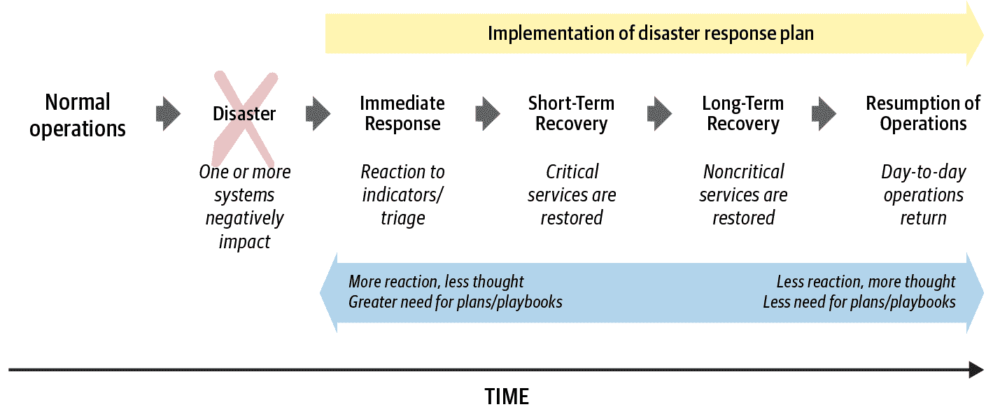

# 第十六章：灾难规划

> 原文：[16. Disaster Planning](https://google.github.io/building-secure-and-reliable-systems/raw/ch16.html)
> 
> 译者：[飞龙](https://github.com/wizardforcel)
> 
> 协议：[CC BY-NC-SA 4.0](https://creativecommons.org/licenses/by-nc-sa/4.0/)

由 Michael Robinson 和 Sean Noonan‎

与 Alex Bramley 和 Kavita Guliani 一起

复杂系统可能以简单和复杂的方式失败，从意外的服务中断到恶意行为者的攻击，以获取未经授权的访问。您可以通过可靠性工程和安全最佳实践预见和防止其中一些故障，但从长远来看，故障几乎是不可避免的。

与仅仅希望系统能够在灾难或攻击中幸存下来，或者您的员工能够做出合理的响应不同，灾难规划确保您不断努力提高从灾难中恢复的能力。好消息是，制定全面战略的第一步是务实和可行的。

# 定义“灾难”

很少有人在灾难全面爆发时才意识到灾难。与其偶然发现一栋被大火吞没的建筑物，您更有可能首先看到或闻到烟雾——一些看似微小的迹象，并不一定看起来像灾难。火灾逐渐蔓延，直到您深陷其中，您才意识到情况的极端性。同样，有时候一个小事件——比如第二章中提到的会计错误——可能会引发全面的事件响应。

灾难有各种形式：

+   *自然灾害*，包括地震、龙卷风、洪水和火灾。这些往往是显而易见的，对系统的影响程度也不同。

+   *基础设施灾难*，如组件故障或错误配置。这些并不总是容易诊断的，它们的影响可以从小到大。

+   *服务或产品中断*，这些中断可以被客户或其他利益相关者观察到。

+   *服务的退化*接近阈值。有时很难识别。

+   *外部攻击者*可能在被发现之前长时间获得未经授权的访问。

+   *敏感数据的未经授权披露*。

+   *紧急安全漏洞*，需要您立即应用补丁来纠正新的、关键的漏洞。这些事件被视为即将发生的安全攻击（见[“妥协与漏洞”](ch17.html#compromises_versus_bugs)）。

在本章和下一章中，我们将灾难和危机这两个术语互换使用，意思是任何可能需要宣布事件并采取响应的情况。

# 动态灾难响应策略

潜在灾难的范围很广，但设计灵活的灾难响应计划将使您能够适应迅速变化的情况。提前考虑可能遇到的情景，已经是为其做准备的第一步。与任何技能一样，您可以通过规划、实践和程序的迭代来磨练灾难响应技能，直到它们变得自然而然。

事件响应不像骑自行车。没有经常性的练习，响应者很难保持良好的肌肉记忆。缺乏练习可能导致断裂的响应和更长的恢复时间，因此经常排练和完善您的灾难响应计划是一个好主意。熟练的事件管理技能让专业人员在事件响应期间自然而然地发挥作用——如果这些技能是第二天性的，专家们就不会为了遵循过程本身而挣扎。

将响应计划分为立即响应、短期恢复、长期恢复和恢复运营等阶段是有帮助的。图 16-1 显示了与灾难恢复相关的一般阶段。

###### 图 16-1：灾难恢复响应工作的阶段

短期恢复阶段应包括为事件制定*退出标准*，即宣布事件响应完成的标准。成功的恢复可能意味着将服务恢复到完全运行状态，但基础解决方案可能具有提供相同服务水平的新设计。标准还可能要求完全消除风险分析中确定的安全威胁。

在制定应对即时响应、短期和长期恢复以及恢复运营的策略时，您的组织可以通过以下方式做好准备：

+   进行可能影响组织或具有重大影响的潜在灾难的分析

+   建立一个响应团队

+   创建响应计划和详细的操作手册

+   适当配置系统

+   测试您的程序和系统

+   吸收测试和评估的反馈意见

# 灾难风险分析

进行灾难风险分析是确定组织最关键运营的第一步，这些运营的缺失将导致完全中断。关键运营功能不仅包括重要的核心系统，还包括它们的基础依赖，如网络和应用层组件。灾难风险分析应该确定以下内容：

+   如果受损或离线，可能会使运营陷入瘫痪的系统。您可以将系统分类为任务关键、任务重要或非关键。

+   在应对事件时需要的技术或人力资源。

+   每个系统可能发生的灾难情景。这些情景可以按发生的可能性、频率和对运营的影响（低、中、高或关键）进行分组。

尽管您可能能够直观地对运营进行评估，但更正式的风险评估方法可以避免群体思维，并突出那些并不明显的风险。为了进行彻底的分析，我们建议使用标准矩阵对组织面临的风险进行排名，该矩阵考虑了每种风险发生的概率以及对组织的影响。附录 A 提供了一个样本风险评估矩阵，大型和小型组织都可以根据其系统的具体情况进行调整。

风险评级为您提供了一个关于首要关注的地方的良好经验法则。在对其进行排名后，您应该审查潜在的异常风险清单，例如，一个不太可能发生的事件可能因其潜在影响而被评为关键。您可能还希望征求专家的意见，以审查评估结果，以确定具有隐藏因素或依赖性的风险。

您的风险评估可能会因组织资产的位置而有所不同。例如，日本或台湾的站点应考虑台风，而美国东南部的站点应考虑飓风。随着组织成熟并将容错系统（如冗余互联网电路和备用电源）纳入其系统中，风险评级也可能会发生变化。大型组织应在全球和每个站点级别上进行风险评估，并随着运营环境的变化定期审查和更新这些评估。通过风险评估确定需要保护的系统，您可以准备好创建一个配备工具、程序和培训的响应团队。

# 建立应急响应团队

有各种方法可以配置应急响应（IR）团队的人员。组织通常以以下几种方式配置这些团队：

+   创建一个专门的全职 IR 团队

+   通过将 IR 职责分配给个人，除了他们现有的工作职能。

+   通过将 IR 活动外包给第三方。

由于预算和规模的限制，许多组织依赖现有员工兼职，一些员工除了执行常规工作职责外，还要在需要时进行事件响应。对于需要更复杂的组织，可能会发现用内部员工配置一个专门的 IR 团队是值得的，以确保响应者始终可用于响应，接受适当的培训，具有必要的系统访问权限，并有足够的时间来应对各种事件。

无论您实现哪种人员配置模型，都可以使用以下技术来创建成功的团队。

## 确定团队成员和角色

在准备响应计划时，您需要确定将响应事件的核心团队，并明确确定他们的角色。虽然小型组织可能会有来自各个团队的个人贡献者，甚至是一个单一团队来应对每一个事件，但资源更丰富的组织可能会选择为每个功能领域设立一个专门的团队，例如，一个安全响应团队，一个隐私团队，以及一个专注于公共面向站点可靠性的运营团队。

您还可以外包一些功能，同时保留其他功能内部。例如，您可能没有足够的资金和工作量来完全配备内部取证团队，因此您可能会外包该专业知识，同时保留内部的事件响应团队。外包的一个潜在缺点是外部响应者可能无法立即提供帮助。在确定哪些功能保留在内部以及在紧急情况下外包和调用哪些资源时，考虑响应时间是很重要的。

您可能需要以下一些或全部角色来进行事件响应：

事件指挥官

领导对个别事件的响应的个人。

[SREs](https://oreil.ly/IeMvF)

可以重新配置受影响的系统或实现代码以修复错误的人。

公共关系

可以回应公众查询或发布媒体声明的人。这些人经常与传播负责人合作制定信息。

客户支持

可以回应客户查询或主动联系受影响的客户的人。

法律

可以就法律事务提供咨询的律师，例如适用的法律、法规或合同。

隐私工程师

可以解决技术隐私问题的影响的人。

取证专家

可以进行事件重建和归因以确定发生了什么以及如何发生的人。

安全工程师

可以审查事件的安全影响并与 SRE 或隐私工程师合作保护系统的人。

在确定哪些角色将由内部人员担任时，您可能需要实现轮换人员配置模型，其中 IR 团队轮班运作。在事件期间配置轮班人员至关重要，以减轻疲劳并在事件期间提供持续支持。您还可以采用这种模式以提供灵活性，因为主要工作职责随着时间的推移而发展和变化。请记住，这些是角色，而不是个人。一个人在事件期间可能担任多个角色。

确定哪些角色应该由内部人员担任后，您可以创建一个最初的人员名单来组成个别 IR 团队。提前确定这些人有助于澄清角色、责任和所有权，并最大程度地减少混乱和设置时间。确定 IR 团队的*冠军*也是有帮助的——一个有足够资历承诺资源并消除障碍的人。冠军可以帮助组建团队，并在存在竞争优先级时与高级领导合作。查看第二十一章获取更多信息。

## 建立团队宪章

IR 团队的宪章应从团队的使命开始，即一句话描述他们将处理的事件类型。使命让读者能够快速了解团队的工作内容。

宪章的范围应描述您所在的工作环境，重点放在技术、最终用户、产品和利益相关者上。这一部分应清楚地定义团队将处理的事件类型，应由内部人员处理的事件，以及应分配给外包团队处理的事件。

为了确保 IR 团队专注于合格事件，组织领导和 IR 冠军就范围达成一致意见非常重要。例如，虽然 IR 团队当然可以回应关于系统防火墙配置和日志启用/验证的个别客户查询，但这些任务可能更适合客户支持团队。

最后，定义团队的成功看起来是非常重要的。换句话说，当 IR 团队的工作完成或可以宣布完成时，您如何知道呢？

## 建立严重性和优先级模型

严重性和优先级模型可以帮助 IR 团队量化和理解事件的严重性以及响应所需的操作节奏。您应同时使用这两种模型，因为它们是相关的。

严重性模型允许团队根据事件对组织的影响严重程度对事件进行分类。您可以使用五点（0-4）评分来对事件进行排名，其中 0 表示最严重的事件，4 表示最不严重的事件。您应该采用最适合您组织文化的评分标准（颜色、动物等）。例如，如果您使用五点评分标准，网络上的未经授权个人可能被归类为严重性 0 事件，而安全日志的临时不可用可能是严重性 2 事件。在建立模型时，应审查先前执行的风险分析，以便为事件分配适当的严重性评级。这样做将确保不是所有事件都接收到关键或中等严重性评级。准确的评级将帮助事件指挥官在同时报告多个事件时进行优先排序。

优先级模型定义了人员需要多快回应事件。这个模型建立在您对事件严重性的理解之上，也可以使用五点（0-4）评分，其中 0 表示高优先级，4 表示低优先级。优先级决定了所需工作的节奏：评级为 0 的事件需要立即响应，团队成员在处理其他工作之前要先回应这个事件。评级为 4 的事件可以与日常运营工作一起处理。达成一致的优先级模型还有助于保持各个团队和运营负责人的同步。想象一下，一个团队将事件视为优先级 0，而对总体情况了解有限的第二个团队将其视为优先级 2。这两个团队可能会以不同的节奏运作，延迟了适当的事件响应。

通常情况下，一旦了解了事件的严重性，它在事件生命周期内将保持不变。另一方面，优先级可能在事件过程中发生变化。在对事件进行分类和实现关键修复的早期阶段，优先级可能是 0。在关键修复完成后，您可以将优先级降低到 1 或 2，因为工程团队进行清理工作。

## 为 IR 团队参与设定操作参数

在建立了严重性和优先级模型之后，您可以定义操作参数，描述事件响应团队的日常运作。当团队除了事件响应工作外还执行定期运营工作，或者需要与虚拟团队或外包团队进行沟通时，这变得越来越重要。操作参数确保严重性 0 和优先级 0 的事件得到及时响应。

操作参数可能包括以下内容：

+   对报告的事件最初做出响应的预期时间——例如，在 5 分钟内，30 分钟内，一个小时内，或者在下一个工作日

+   执行初始分类评估并制定响应计划和运营时间表的预期时间

+   [服务水平目标（SLOs）](https://oreil.ly/MtL_o)，以便团队成员了解何时应中断日常工作进行事件响应。

有许多方法可以组织值班轮换，以确保事件响应工作在团队中得到适当的负载平衡，或者根据定期安排的持续工作进行平衡。有关详细讨论，请参阅 SRE 书的第十一章和第十四章，SRE 工作手册的第 8 章和第 9 章，以及 Limoncelli、Chalup 和 Hogan（2014）的第十四章。¹

## 制定响应计划

在严重事件期间做出决策可能具有挑战性，因为响应者试图在有限的信息下迅速工作。精心制定的响应计划可以指导响应者，减少浪费的步骤，并为如何应对不同类别的事件提供一个总体方法。虽然一个组织可能有一项全公司范围的事件响应政策，但 IR 团队需要制定一套涵盖以下主题的响应计划：

事件报告

如何向 IR 团队报告事件。

分类

将响应初始报告并开始分类事件的 IR 团队成员名单。

服务水平目标

关于响应者将采取行动的速度目标的参考。

角色和责任

明确定义 IR 团队参与者的角色和责任。

外联

如何联系可能需要协助事件响应的工程团队和参与者。

沟通

在事件期间进行有效的沟通不是没有提前规划的。您需要建立如何执行以下每一项任务：

+   通知领导有关事件的信息（例如，通过电子邮件、短信或电话），以及这些沟通中应包括的信息。

+   在事件期间进行组织内部沟通，包括响应团队内部和之间的沟通（建立聊天室、视频会议、电子邮件、安全 IRC 频道、错误跟踪工具等）。

+   在必要时与监管机构或执法部门等外部利益相关者进行沟通。您需要与您组织的法律部门和其他部门合作规划和支持这种沟通。考虑为每个外部利益相关者保留联系方式和沟通方法的索引。如果您的 IR 团队足够庞大，您可能需要适当地自动化这些通知机制。

+   向与客户互动的支持团队通报事件。

+   在通信系统不可用时，或者怀疑通信系统受到损害时，如何与响应者和领导进行沟通，而不让对手察觉。

每个响应计划都应概述高级程序，以便受过培训的响应者可以行动。计划应包含对足够详细的 playbook 的引用，受过培训的响应者可以使用它们来执行特定的操作，并且还可能是一个很好的主意概述对特定类别的事件做出响应的总体方法。例如，在处理网络连接问题时，响应计划应包含对要分析的区域和要执行的故障排除步骤的广义概述，并且应引用一个包含如何访问适当网络设备的具体指令的 playbook，例如登录路由器或防火墙。响应计划还可能概述事件响应者确定何时通知高级领导事件以及何时与本地工程团队合作的标准。

## 创建详细的 playbook

playbook 是响应计划的补充，列出了响应者应如何从头到尾执行特定任务的具体指令。例如，playbook 可能描述如何向响应者授予对某些系统的紧急临时管理访问权限，如何输出和解析特定日志进行分析，或者如何故障转移系统以及何时实现优雅降级。playbook 具有程序性质，应经常修订和更新。它们通常是团队特定的，这意味着对任何灾难的响应可能涉及多个团队通过其自己的特定程序 playbook 进行工作。

## 确保访问和更新机制已经就位

您的团队应该定义一个存储文档的地方，以便在灾难期间可以使用材料。灾难可能会影响对文档的访问，例如，如果公司服务器离线，所以确保您在紧急情况下可以访问的位置上有副本，并且这些副本保持最新。

系统会进行补丁、更新和重新配置，威胁态势也会发生变化。您可能会发现新的漏洞，并且新的利用程序会出现。定期审查和更新您的响应计划，以确保它们准确并反映任何最近的配置或操作变化。

良好的事件管理需要频繁和健壮的信息管理。团队应该确定一个适合跟踪事件信息和保留事件数据的系统。处理安全和隐私事件的团队可能希望建立一个严格控制访问的系统，而处理服务或产品中断的响应团队可能希望创建一个在公司范围内广泛可访问的系统。

# 在事件发生之前预置系统和人员

在进行风险分析、创建 IR 团队和记录适当的程序之后，您需要确定在灾难发生之前可以执行的预置活动。确保您考虑了与事件响应生命周期的每个阶段相关的预置活动。通常，预置活动涉及配置具有定义的日志保留、自动响应和明确定义的人工程序的系统。通过了解这些元素，响应团队可以消除数据来源、自动响应和人工响应之间的覆盖间隙。响应计划和 playbook（在前一节中讨论）描述了人类互动所需的大部分内容，但响应者还需要访问适当的工具和基础设施。

为了促进对事件的快速响应，IR 团队应预先确定事件响应的适当访问级别，并提前建立升级程序，以便获取紧急访问的过程不会缓慢和复杂。IR 团队应具有日志分析和事件重建的读取访问权限，以及用于分析数据、发送报告和进行法证检查的工具访问权限。

## 配置系统

在灾难或事件发生之前，您可以对系统进行多项调整，以减少 IR 团队的初始响应时间。例如：

+   在本地系统中构建容错性并创建故障转移。有关此主题的更多信息，请参见第八章和第九章。

+   部署取证代理，例如[GRR](https://github.com/google/grr)代理或[EnCase](https://oreil.ly/7-gVj)远程代理，跨网络启用日志。这将有助于您的响应和后续的取证分析。请注意，安全日志可能需要长时间的保留期，如第十五章中所讨论的（检测入侵的行业平均时间约为 200 天，而在检测到事件之前删除的日志无法用于调查）。然而，一些国家，如欧盟国家，对日志的保留期有特定要求。在制定保留计划时，请咨询您组织的律师。

+   如果您的组织将备份提交到磁带或其他媒体，请保留一套与用于创建备份的硬件和软件相同的备份，以便在主要备份系统不可用时及时恢复备份。您还应定期进行恢复演练，以确保您的设备、软件和程序正常工作。IR 团队应确定他们将用于与各个域团队（例如电子邮件团队或网络备份团队）合作的程序，以在事件期间测试、验证和执行数据恢复。

+   在紧急情况下，为访问和恢复设置多个备用路径。影响生产网络的中断可能很难恢复，除非您有安全的替代路径来访问网络控制平面。同样，如果发现有人侵入并且不确定公司工作站受到的侵害有多广泛，如果您有一组已知安全的空气隔离系统，您仍然可以信任，那么恢复将更容易。

## 培训

IR 团队成员应接受严重性/优先级模型、IR 团队的运行模式、响应时间和响应计划和手册的位置的培训。您可以在[《SRE 工作手册》第九章](https://landing.google.com/sre/workbook/chapters/incident-response/)中阅读更多关于谷歌对事件响应的方法。

然而，事件响应的培训要求不仅限于 IR 团队。在紧急情况下，一些工程师可能会在不考虑或意识到其行为后果的情况下做出响应。为了减轻这种风险，我们建议对将协助 IR 团队的工程师进行培训，使其了解各种 IR 角色及其责任。我们使用了谷歌的事件管理系统（IMAG），它基于[事件指挥系统](https://oreil.ly/LwmI6)。IMAG 框架分配了关键角色，如事件指挥官、运营负责人和通信负责人。

培训您的员工识别、报告和升级事件。工程师、客户/用户、自动警报或管理员可能会发现事件。每个报告事件的一方应有单独明确的渠道，公司员工应接受如何何时将事件升级给 IR 团队的培训。这种培训应支持组织的 IR 政策。

工程师在升级之前应有一个有限的时间限制来处理事件。第一响应者可用的时间取决于组织准备接受的风险水平。您可以从 15 分钟的时间窗口开始，并根据需要调整该时间窗口。

您应该在紧急情况发生之前建立决策标准，以确保响应者选择最合乎逻辑的行动方案，而不是在临时决定时做出直觉决定。第一响应者经常面临需要立即决定是否将受损系统脱机或使用何种封锁方法的情况。有关此主题的更多讨论，请参见第十七章。

您应该培训工程师了解，事故响应可能需要解决看似相互矛盾的竞争性优先事项，例如，需要保持最大的正常运行时间和可用性，同时还要保留法医调查的证据。您还应该培训工程师记录其响应活动的笔记，以便他们以后可以区分这些活动和攻击者留下的痕迹。

## 流程和程序

通过在事故发生之前建立一套流程和程序，您可以大大减少响应时间和响应者的认知负荷。例如，我们建议以下操作：

+   为硬件和软件定义快速采购方法。在紧急情况下，您可能需要额外的设备或资源，例如服务器、软件或发电机燃料。

+   建立外包服务的合同批准流程。对于较小的组织来说，这可能意味着识别外包能力，如法医调查服务。

+   制定政策和程序，在安全事件期间保留证据和日志，防止日志覆盖。有关更多详细信息，请参见第十五章。

# 深入研究：测试系统和响应计划

一旦您已经创建了组织为应对事件所需的所有材料，如前文所述，评估这些材料的有效性并改进您发现的任何不足是至关重要的。我们建议从多个角度进行测试：

+   评估自动化系统以确保其正常运行。

+   测试流程，消除响应者和工程团队使用的程序和工具中的任何漏洞。

+   培训将在事件期间做出响应的人员，以确保他们具有应对危机的必要技能。

您应该定期进行这些测试，至少每年一次，以确保您的系统、程序和响应在实际紧急情况下是可靠和适用的。

每个组件在将受灾系统恢复到运行状态中发挥着至关重要的作用。即使您的 IR 团队技能非常高，如果没有程序或自动化系统，其应对灾难的能力将是不一致的。如果您的技术程序已记录但不可访问或不可用，它们可能永远不会被实现。测试灾难响应计划的每一层的弹性可以降低这些风险。

对于许多系统，您需要记录减轻威胁的技术程序，定期审计控制（例如，每季度或每年一次）以确保它们仍在实现，并向工程师提供修复列表，以纠正您发现的任何弱点。刚开始进行 IR 规划的组织可能希望调查有关灾难恢复和业务连续性规划的认证，以获得灵感。

## 审计自动化系统

您应该审计所有关键系统和依赖系统，包括备份系统、日志系统、软件更新程序、警报生成器和通信系统，以确保它们正常运行。完整的审计应确保以下内容：

备份系统正常运行。

备份应该正确创建，存储在安全位置，存储适当的时间，并以正确的权限存储。定期进行数据恢复和验证练习，以确保您可以从备份中检索和使用数据。有关 Google 数据完整性方法的更多信息，请参阅[SRE 书籍第 26 章](https://landing.google.com/sre/sre-book/chapters/data-integrity/)。

事件日志（在上一章中讨论）被正确存储。

这些日志允许响应者在法证调查期间重建事件时构建准确的时间线。您应该根据组织的风险水平和其他适用的考虑因素存储事件日志的时间段。

关键漏洞应及时修补。

审核自动和手动的补丁流程，以减少人为干预的需求和人为错误的可能性。

警报正确生成。

系统生成警报 - 电子邮件警报，仪表板更新，短信等 - 当满足特定标准时。验证每个警报规则，以确保它正确触发。还要确保考虑依赖关系。例如，如果在网络中断期间 SMTP 服务器离线，您的警报会受到什么影响？

通信工具，如聊天客户端，电子邮件，电话会议桥接服务和安全 IRC，按预期工作。

运作良好的通信渠道对于响应团队至关重要。您还应该审核这些工具的故障转移能力，并确保它们保留您需要编写事后分析的消息。

## 进行非侵入式桌面练习

*桌面练习*是测试记录程序和评估响应团队表现的非常有价值的工具。这些练习可以作为评估端到端事件响应的起点，并且在实际测试不可行时也很有用 - 例如，引发实际地震。模拟可以从小到大，范围广泛，并且通常是非侵入式的：因为它们不会使系统脱机，所以不会干扰生产环境。

类似于[SRE 书籍第十五章](https://landing.google.com/sre/sre-book/chapters/postmortem-culture/)中描述的 Wheel of Misfortune 练习，您可以通过呈现参与者各种后续情节变化的事件情景来进行桌面练习。要求参与者描述他们将如何应对情景，以及他们将遵循哪些程序和协议。这种方法可以让参与者发挥他们的决策能力，并获得建设性的反馈。这些练习的开放结构意味着它们可以吸纳各种参与者，包括以下人员：

+   一线工程师，按照详细的手册恢复瘫痪系统的服务

+   高级领导层，就运营方面的业务决策进行决策

+   公共关系专业人士，协调外部沟通

+   律师，提供上下文法律指导，并帮助制定公共沟通

这些桌面练习最重要的一点是挑战响应者，并为所有参与者提供在真正事件发生之前练习相关程序和决策过程的机会。

在实现桌面练习时，以下是一些要考虑的关键特点：

可信度

桌面场景应该是可信的 - 一个引人入胜的情景可以激励参与者跟随而不需要悬置怀疑。例如，一个练习可能假设用户受到网络钓鱼攻击，使对手能够利用用户工作站上的漏洞。您可以基于现实攻击和已知的漏洞和弱点来确定攻击者在网络中移动的关键点。

细节

制定桌面情景的人应该提前研究该情景，引导者应该熟悉事件的细节和对情景的典型响应。为了增加可信度，桌面的创建者可以创建参与者在真实事件中会遇到的文物，如日志文件、客户或用户的报告和警报。

决策点

就像“选择你自己的冒险”故事一样，桌面练习应该有决策点，帮助情节展开。典型的 60 分钟桌面练习包含大约 10-20 个情节决策点，让参与者参与决策，影响练习的结果。例如，如果桌面练习的参与者决定将受损的电子邮件服务器下线，那么在剩下的情景中参与者就不能发送电子邮件通知。

参与者和引导者

尽量使桌面练习尽可能互动。随着练习的展开，引导者可能需要对响应者执行的行动和命令做出回应。与其仅仅讨论他们如何应对事件，参与者应该展示他们将如何应对。例如，如果 IR 手册要求事件响应者将勒索软件攻击升级到取证团队的成员进行调查，同时也要升级到网络安全团队的成员来阻止对敌对网站的流量，那么响应者应该在桌面练习中执行这些程序。“执行响应”有助于事件响应者建立肌肉记忆。引导者应提前熟悉情景，以便在需要时即兴并引导响应者朝正确的方向发展。再次强调，这里的目标是让参与者积极参与情景。

结果

一个成功的桌面练习不应该让参与者感到挫败，而应该以对工作得好和工作不太好的可行反馈结束。参与者和引导者应该能够就事件响应团队的改进领域提出具体建议。在适当的情况下，参与者应该建议对系统和政策进行改变，以解决他们发现的固有弱点。为了确保参与者解决这些建议，创建具体负责人的行动项。

## 在生产环境中测试响应

虽然桌面练习对模拟各种事件情景很有用，但你需要在真实的生产环境中测试一些事件情景、攻击向量和漏洞。这些测试在安全和可靠性的交汇处运作，通过让 IR 团队了解运营约束、在真实参数下进行实践，并观察他们的响应如何影响生产环境和正常运行时间。

### 单系统测试/故障注入

与其测试整个系统的端到端，你可以将大型系统分解为单独的软件和/或硬件组件进行测试。测试可以采用各种形式，可以涉及单个本地组件或具有组织范围的单个组件。例如，当一个恶意内部人连接 USB 存储设备到工作站并尝试下载敏感内容时会发生什么？本地日志是否跟踪本地 USB 端口活动？日志是否足够聚合并及时升级，使安全团队能够快速响应？

我们特别建议您通过故障注入进行单系统测试。将故障注入到您的系统中可以让您运行有针对性的测试，而不会干扰整个系统。更重要的是，故障注入框架允许各个团队在不涉及其依赖关系的情况下测试其系统。例如，考虑常用于负载平衡的开源 Envoy HTTP 代理。除了其许多负载平衡功能外，该代理支持[故障注入 HTTP 过滤器](https://oreil.ly/rDsp_)，您可以使用它来为一部分流量返回任意错误或延迟请求一定时间。使用这种类型的故障注入，您可以测试系统是否正确处理超时，并且超时是否会导致生产中的不可预测行为。

当您在生产环境中发现异常行为时，经过充分练习的故障注入框架可以实现更有结构的调查，您可以以受控的方式重现生产问题。例如，想象以下情景：当公司的用户尝试访问特定资源时，基础设施使用单一来源检查所有认证请求。然后，公司迁移到一个需要对各种来源进行多次认证检查以获取类似信息的服务。结果，客户开始超过这些功能调用的配置超时。认证库的缓存组件内的错误处理错误地将这些超时视为永久性（而不是临时性）故障，触发基础设施中许多其他小故障。通过使用故障注入的已建立的事故响应框架，在一些调用中注入延迟，响应团队可以轻松地重现行为，确认他们的怀疑，并开发修复方案。

### 人力资源测试

虽然许多测试涉及系统的技术方面，但测试也应考虑人员故障。当特定人员不可用或未能行动时会发生什么？通常，事故响应团队依赖于对组织具有强大机构知识的个人，而不是遵循既定流程。如果关键决策者或经理在响应期间不可用，那么 IR 团队的其他成员将如何继续？

### 多组件测试

使用分布式系统意味着任何数量的依赖系统或系统组件可能会失败。您需要计划多组件故障并创建相关的事故响应程序。考虑一个依赖于多个组件的系统，每个组件都经过了单独测试。如果两个或更多组件同时失败，那么事故响应的哪些部分必须以不同的方式处理？

思考练习可能不足以测试每个依赖项。在考虑安全环境中的服务中断时，您需要考虑安全问题以及故障场景。例如，当故障切换发生时，系统是否尊重现有的 ACL？有什么保障可以确保这种行为？如果您正在测试授权服务，依赖服务是否会关闭失败？要深入了解这个话题，请参阅第五章。

### 系统范围的故障/故障切换

除了测试单个组件和依赖项外，还要考虑整个系统失败时会发生什么。例如，许多组织运行主要和次要（或灾难恢复）数据中心。在切换到从次要位置运行之前，您无法确信故障切换策略是否会保护您的业务和安全姿态。谷歌定期对整个数据中心建筑进行电源循环，以测试故障是否会导致用户可见的影响。这种练习确保服务保持在没有特定数据中心位置的情况下运行的能力，并且执行此工作的技术人员在管理断电/通电程序方面经验丰富。

对于在另一个提供商的云基础设施上运行的服务，考虑如果整个可用区域或区域发生故障，您的服务会发生什么情况。

## 红队测试

除了宣布的测试，谷歌还进行灾难准备演习，称为红队演习：由其信息安全保障组织进行的进攻性测试。类似于 DiRT 演习（参见“DiRT 演习测试紧急访问”），这些演习模拟真实攻击，以测试和改进检测和响应能力，并展示安全问题的业务影响。

红队通常不会提前通知事件响应人员，除了高级领导层。由于红队熟悉谷歌的基础设施，他们的测试比标准网络渗透测试更加有效。由于这些练习是在内部进行的，它们提供了在完全外部攻击（攻击者在谷歌之外）和内部攻击（内部风险）之间取得平衡的机会。此外，红队练习通过测试安全性端到端以及通过攻击（如钓鱼和社会工程）测试人类行为，补充了安全审查。有关红队的更深入探讨，请参阅[“特殊团队：蓝队和红队”](ch20.html#special_teams_blue_and_red_teams)。

## 评估响应

在应对实际事件和测试场景时，创建有效的反馈循环非常重要，这样您就不会反复遭受相同的情况。实际事件应该需要具体的事后分析和行动项目；您也可以为测试创建事后分析和相应的行动项目。虽然测试既可以是一种有趣的练习，也可以是一种极好的学习经验，但这种实践需要一些严谨性——跟踪测试的执行情况，并对其影响以及您组织中的人员如何应对测试进行批判性评估是非常重要的。进行一项练习而不实现所学到的教训只是娱乐。

在评估组织对事件和测试的响应时，考虑以下最佳实践：

+   衡量响应。评估者应该能够确定哪些工作得很好，哪些没有。衡量实现响应的每个阶段所需的时间，以便您可以确定纠正措施。

+   编写无过失的事后分析，并专注于如何改进系统、程序和流程。

+   创建反馈循环，以改进现有计划或根据需要制定新计划。

+   收集证据并将其反馀到信号检测中。确保您解决任何发现的差距。

+   为了进行取证分析并解决差距，请确保保存适当的日志和其他相关材料，特别是在进行安全性练习时。

+   评估甚至“失败”的测试。什么有效，你需要改进什么？

+   如[“特殊团队：蓝队和红队”](ch20.html#special_teams_blue_and_red_teams)中所讨论的，实现颜色团队以确保您的组织能够应对所学到的教训。您可能需要一个混合的紫队，以确保蓝队及时解决红队利用的漏洞，从而防止攻击者重复利用相同的漏洞。您可以将紫队视为漏洞的回归测试。

# 谷歌的例子

为了使本章描述的概念和最佳实践更具体，这里有一些真实世界的例子。

## 具有全球影响的测试

2019 年，谷歌对旧金山湾区发生大地震的响应进行了测试。该场景包括模拟对物理设施、交通基础设施、网络组件、公用事业和电力、通信、业务运营和高管决策的影响。我们的目标是测试谷歌对大规模中断的响应以及对全球运营的影响。具体来说，我们测试了以下内容：

+   谷歌如何为地震和多次余震中受伤的人提供立即的急救？

+   谷歌如何向公众提供帮助？

+   员工如何向谷歌的领导层升级信息？在通信中断的情况下，例如，网络中断或局域网/城域网/广域网中断，谷歌如何向员工传播信息？

+   如果员工有利益冲突，例如，如果员工需要照顾家人和家庭，谁会提供现场响应？

+   无法通行的次要道路会对该地区产生什么影响？溢出会对主要道路产生什么影响？

+   谷歌如何为滞留在谷歌校园的员工、承包商和访客提供帮助？

+   谷歌如何评估其建筑物的损坏，其中可能包括破裂的管道、污水问题、破碎的玻璃、停电和破裂的网络连接？

+   如果受影响的团队无法启动权责转移，SRE 和地理区域外的各种工程团队如何接管系统？

+   如何使受影响地理区域之外的领导层能够继续业务运营和做出与业务相关的决策？

## DiRT 演习测试紧急访问

有时我们可以同时测试可靠性和安全运营的稳健性。在我们的年度灾难恢复培训（DiRT）演习中，SRE 测试了紧急访问凭证的程序和功能：当标准 ACL 服务中断时，他们能否获得对公司和生产网络的紧急访问？为了增加安全测试层，DiRT 团队还纳入了信号检测团队。当 SRE 启动紧急访问程序时，检测团队能够确认正确的警报触发，并且访问请求是合法的。

## 行业范围内的漏洞

2018 年，谷歌提前得知 Linux 内核中的两个漏洞，这些漏洞支撑着我们大部分的生产基础设施。通过发送特制的 IP 片段和 TCP 段，SegmentSmack（CVE-2018-5390）或 FragmentSmack（CVE-2018-5391）可以导致服务器执行昂贵的操作。通过使用大量的 CPU 和挂钟时间，这个漏洞可以允许攻击者获得显著的规模提升，超出了正常的拒绝服务攻击——一个通常可以应对 1 Mpps 攻击的服务在大约 50 Kpps 时会崩溃，韧性降低了 20 倍。

灾难规划和准备使我们能够在两个方面减轻风险：技术方面和事件管理方面。在事件管理方面，潜在的灾难如此重大，以至于谷歌指派了一组事件经理全职处理问题。团队需要确定受影响的系统，包括供应商固件图像，并执行一项全面的计划来减轻风险。

在技术方面，SRE 已经为 Linux 内核实现了深度防御措施。一个运行时补丁，或者*ksplice*，使用函数重定向表来使重新启动新内核变得不必要，可以解决许多安全问题。Google 还保持内核推出纪律：我们定期向整个机器群推送新内核，目标是少于 30 天，并且我们有明确定义的机制，以增加这一标准操作程序的推出速度，如果有必要的话。⁸

如果我们无法使用 ksplice 修复漏洞，我们可以以较快的速度进行紧急推出。然而，在这种情况下，我们可以使用内核 splice 来解决受影响的两个函数——`tcp_collapse_ofo_queue`和`tcp_prune_ofo_queue`。SRE 能够在生产系统中应用 ksplice，而不会对生产环境产生不利影响。由于推出程序已经经过测试和批准，SRE 很快获得了副总裁的批准，在代码冻结期间应用补丁。

# 结论

当考虑如何从零开始启动灾难恢复测试和计划时，可能会感到可能的方法的数量令人不知所措。然而，即使在小规模上，您也可以应用本章的概念和最佳实践。

首先，确定您最重要的系统或关键数据，然后确定如何应对影响它的各种灾难。您需要确定在没有服务的情况下可以运行多长时间，以及影响它的人员或其他系统的数量。

从这一重要的第一步开始，您可以逐步扩大覆盖范围，形成一个强大的灾难准备战略。从最初的确定和预防引发火灾的火花，您可以逐步应对不可避免的大火。

¹ Limoncelli, Thomas A., Strata R. Chalup, and Christina J. Hogan. 2014\. *云系统管理实践：设计和操作大型分布式系统*。波士顿，马萨诸塞州：Addison-Wesley。

² 这些主题在[SRE 书籍第 22 章](https://landing.google.com/sre/sre-book/chapters/addressing-cascading-failures/)中有描述。

³ 参见[SRE 书籍第十四章](https://landing.google.com/sre/sre-book/chapters/managing-incidents/)和[SRE 工作手册第九章](https://landing.google.com/sre/workbook/chapters/incident-response/)中的生产特定的实例。

⁴ 参见[SRE 书籍第十五章](https://landing.google.com/sre/sre-book/chapters/postmortem-culture/)。

⁵ 参见[SRE 书籍第十三章](https://landing.google.com/sre/sre-book/chapters/emergency-response/)。

⁶ 参见 Kripa Krishnan 的文章[“应对意外”](https://oreil.ly/cn_il)和她的 USENIX LISA15 演讲[“Google 十年的崩溃”](https://oreil.ly/ZRZAI)。

⁷ 一个打破玻璃机制可以绕过政策，允许工程师快速解决故障。参见[“打破玻璃”](ch05.html#breakglass)。

⁸ 第九章讨论了准备组织快速应对事故的其他设计方法。
