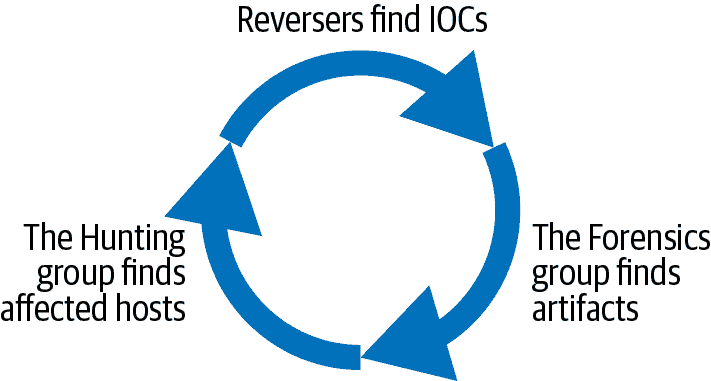
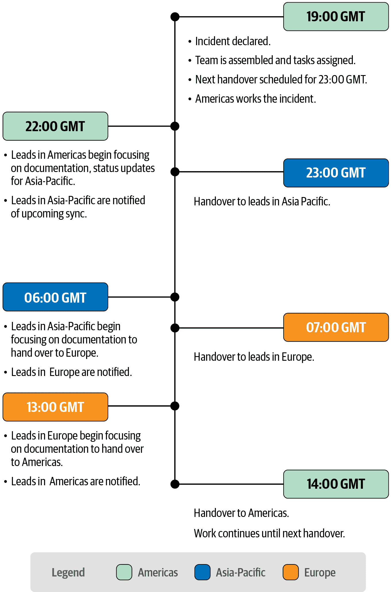

# 第十七章：危机管理

> 原文：[17. Crisis Management](https://google.github.io/building-secure-and-reliable-systems/raw/ch17.html)
> 
> 译者：[飞龙](https://github.com/wizardforcel)
> 
> 协议：[CC BY-NC-SA 4.0](https://creativecommons.org/licenses/by-nc-sa/4.0/)


作者：Matt Linton

与 Nick Soda 和 Gary O'Connor 一起

事件响应对于可靠性和安全事件都至关重要。《SRE 书》的第十四章和《SRE 工作手册》的第九章探讨了与可靠性故障相关的事件响应。我们使用相同的方法——谷歌的事件管理（IMAG）框架——来应对安全事件。

安全事件是不可避免的。行业中有一句常见的格言是“只有两种公司：知道自己受到了侵害的和不知道自己受到了侵害的。”安全事件的结果取决于你的组织做好了多少准备，以及你的响应有多好。为了实现成熟的安全姿态，你的组织需要建立和实践事件响应（IR）能力，正如前一章所讨论的那样。

除了确保未经授权的人无法访问您的系统和数据保持在应有的位置之外，今天的 IR 团队还面临着新的和困难的挑战。随着安全行业朝着更大的透明度¹和与用户更开放的需求趋势，这一期望对于习惯于在公众关注的聚光灯下运作的任何 IR 团队来说都是一个独特的挑战。此外，像欧盟的《通用数据保护条例（GDPR）》和与注重安全的客户的服务合同不断推动着调查必须开始、进行和完成的速度的边界。如今，客户要求在最初检测到潜在安全问题后的 24 小时（或更短时间内）内通知他们并不罕见。

事件通知已成为安全领域的核心特性，与云计算的易用性和普及性、工作场所“自带设备”（BYOD）政策的广泛采用以及物联网（IoT）等技术进步并驾齐驱。这些进步为 IT 和安全人员带来了新的挑战，例如对组织所有资产的控制和可见性的限制。

# 这是危机吗？

并非每个事件都是危机。事实上，如果你的组织状况良好，相对较少的事件应该会演变成危机。一旦发生升级，响应者评估升级的第一步是*分诊*——利用他们掌握的知识和信息对事件的严重性和潜在后果进行合理和明智的假设。

分诊是急诊医疗界的一项成熟技能。一名急救医生（EMT）到达车祸现场时，首先要确保现场没有进一步伤害的立即风险，然后进行分诊。例如，如果一辆公共汽车与一辆小汽车相撞，已经可以逻辑推断出一些信息。小汽车上的人可能受了重伤，因为与重型公共汽车的碰撞可能会造成很大的伤害。公共汽车可以载有许多乘客，所以乘客可能会受伤。通常情况下，两辆车都不会携带危险化学品。在到达的第一分钟内，急救医生知道他们需要叫更多的救护车，可能要警报重症监护单位，并叫消防部门来解救小车上被困的人。他们可能不需要危险物质清理队。 

你的安全响应团队应该使用相同的评估方法来对待不断发生的事件。作为第一步，他们必须估计攻击的潜在严重程度。

## 事件分诊

在分诊时，负责调查的工程师必须收集基本事实，以帮助决定升级是否属于以下情况之一：

+   一个错误（即误报）

+   一个容易纠正的问题（可能是一次机会性的妥协）

+   一个复杂且可能具有破坏性的问题（比如有针对性的妥协）

他们应该能够使用预定的流程对可预测的问题、错误和其他简单问题进行分诊。更大更复杂的问题，比如有针对性的攻击，可能需要组织和管理的响应。

每个团队都应该有预先计划的标准，以帮助确定什么构成了一起事件。理想情况下，他们应该在事件发生之前确定在他们的环境中哪些风险是严重的，哪些是可以接受的。对事件的响应将取决于事件发生的环境类型，组织预防控制的状态以及其响应程序的复杂性。考虑三个组织如何应对相同的威胁——勒索软件攻击：

+   *组织 1*拥有成熟的安全流程和分层防御，包括只允许加密签名和批准的软件执行的限制。在这种环境中，众所周知的勒索软件几乎不可能感染机器或在整个网络中传播。如果确实发生，检测系统会发出警报，然后有人进行调查。由于成熟的流程和分层防御，一个工程师可以处理这个问题：他们可以检查是否发生了可疑活动，超出了尝试恶意软件执行，并使用标准流程解决问题。这种情况不需要危机式的事件响应努力。

+   *组织 2*的销售部门在云环境中举办客户演示，想要了解组织软件的人安装和管理他们的测试实例。安全团队注意到这些用户倾向于犯安全配置错误，导致系统受到威胁。为了不需要人工干预，安全团队建立了一个机制，自动清除并替换受损的云测试实例。在这种情况下，勒索软件蠕虫也不需要太多的取证或事件响应关注。虽然组织 2 没有阻止勒索软件的执行（如组织 1 的情况），但组织 2 的自动化缓解工具可以控制风险。

+   *组织 3*的分层防御较少，对其系统是否受到威胁的可见性有限。该组织面临着勒索软件在其网络中传播的更大风险，可能无法快速做出响应。在这种情况下，如果蠕虫传播，可能会影响大量业务关键系统，并且组织将受到严重影响，需要大量技术资源来重建受损的网络和系统。这种蠕虫对组织 3 构成严重风险。

虽然这三个组织都在应对相同的风险来源（勒索软件攻击），但它们的分层防御和流程成熟度水平的差异影响了攻击的潜在严重性和影响。虽然组织 1 可能只需要启动一个流程驱动的响应，组织 3 可能面临需要协调的事件管理的危机。随着事件对组织构成严重风险的可能性增加，需要组织多个参与者进行有组织的响应的可能性也增加。

您的团队可以进行一些基本评估，以确定升级是否需要标准的流程驱动方法或危机管理方法。问问自己以下问题：

+   您存储了哪些可能对系统上的某人可访问的数据？这些数据的价值或关键性是什么？

+   潜在受损系统与其他系统之间存在什么信任关系？

+   是否有补偿控制，攻击者也必须突破（并且似乎完好无损）才能利用他们的立足点？

+   攻击是否看起来是商品机会主义恶意软件（例如广告软件），还是看起来更先进或有针对性（例如看起来是为你的组织量身定制的网络钓鱼活动）？

仔细考虑你组织的所有相关因素，并根据这些事实确定组织风险的最高可能水平。

## 妥协与漏洞

长期以来，IR 团队一直负责应对疑似入侵和妥协事件。但是对于软件和硬件漏洞，也就是安全漏洞呢？你会把系统中新发现的安全漏洞视为尚未被发现的妥协吗？

软件漏洞是不可避免的，你可以为它们制定计划（如第八章中所述）。良好的防御实践在漏洞开始之前消除或限制潜在的负面后果。²如果你计划良好并实现了深度防御和额外的安全层，你就不需要像处理事件那样处理漏洞修复。也就是说，可能需要使用事件响应流程来管理复杂或影响较大的漏洞，这可以帮助你组织并快速响应。

在谷歌，我们通常将具有极端风险的漏洞视为事件。即使漏洞没有被积极利用，尤其严重的漏洞仍然可能引入极端风险。如果你在漏洞被公开披露之前参与修复（这些努力通常被称为*协调漏洞披露*或 CVDs），操作安全和保密问题可能需要加强响应。另外，如果你在公开披露后匆忙修补系统，保护具有复杂相互依赖关系的系统可能需要紧急努力，部署修复可能会困难且耗时。

一些特别危险的漏洞示例包括 Spectre 和 Meltdown（CVE-2017-5715 和 5753）、glibc（CVE-2015-0235）、Stagefright（CVE-2015-1538）、Shellshock（CVE-2014-6271）和 Heartbleed（CVE-2014-0160）。

# 掌握你的事件

现在我们已经讨论了分类和风险评估的过程，接下来的三节假设“大事”已经发生：你已经确定或怀疑受到了有针对性的妥协，需要进行全面的事件响应。

## 第一步：不要惊慌！

许多应对者将严重事件升级与不断上升的恐慌感和肾上腺素飙升联系在一起。消防、救援和医疗领域的紧急应对人员在基础培训中被告知不要在紧急情况下奔跑。奔跑不仅会增加现场事故的可能性，使问题变得更糟，还会给应对者和公众灌输恐慌感。类似地，在安全事件中，匆忙行动所获得的额外几秒钟很快就会被计划失败的后果所掩盖。

尽管谷歌的 SRE 和安全团队执行事件管理的方式类似，但在开始安全事件的危机管理响应和可靠性事件（如故障）之间存在差异。当发生故障时，值班的 SRE 准备采取行动。他们的目标是快速找到错误并修复它们，以恢复系统到良好状态。最重要的是，系统并不知道自己的行为，并且不会抵制被修复。

在潜在的妥协中，攻击者可能会密切关注目标组织采取的行动，并在响应者试图修复问题时对抗他们。在没有进行全面调查之前尝试修复系统可能是灾难性的。因为典型的 SRE 工作不具备这种风险，SRE 通常的响应是先修复系统，然后记录他们从失败中学到的东西。例如，如果工程师提交了一个破坏生产环境的更改列表（CL），SRE 可能会立即采取行动来撤销 CL，使问题消失。问题解决后，SRE 将开始调查发生了什么。而安全响应则要求团队在尝试纠正事情之前完成对发生情况的全面调查。

作为安全事件响应者，您的第一个任务是控制自己的情绪。在升级的前五分钟内，深呼吸，让任何恐慌的感觉过去，提醒自己需要一个计划，并开始考虑下一步。虽然立即做出反应的愿望很强烈，但实际上，事后分析很少报告说，如果员工早五分钟做出反应，安全响应就会更有效。更有可能的是，提前进行一些额外的规划将增加更大的价值。

## 开始您的响应

在谷歌，一旦工程师确定他们面临的问题是一个事件，我们就会遵循一个标准流程。这个流程称为谷歌的事件管理，在[SRE 工作手册的第九章](https://landing.google.com/sre/workbook/chapters/incident-response/)中有详细描述，以及我们应用该协议的故障和事件的案例研究。本节描述了如何使用 IMAG 作为标准框架来管理安全妥协。

首先，快速回顾一下：如前一章所述，IMAG 基于一种称为[事件指挥系统（ICS）](https://oreil.ly/4cLxY)的正式流程，该流程被全球的消防、救援和警察机构使用。像 ICS 一样，IMAG 是一个灵活的响应框架，足够轻便以管理小事件，但又能够扩展到包括大规模和广泛的问题。我们的 IMAG 计划旨在规范流程，以确保在事件处理的三个关键领域（指挥、控制和通信）取得最大成功。

管理事件的第一步是*指挥*。在 IMAG 中，我们通过发布声明来做到这一点：“我们的团队宣布涉及*X*的事件，我是事件指挥官（IC）。”明确地说“这是一个事件”可能看起来简单，甚至可能是不必要的，但为了避免误解，明确是指挥和通信的核心原则。以声明开始您的事件是对齐每个人期望的第一步。事件复杂而不寻常，涉及高度紧张，并且发生速度很快。参与其中的人需要专注。高管应该被通知，团队可能会忽略或绕过正常流程，直到事件得到控制。

在响应者接管并成为 IC 之后，他们的工作是保持对事件的*控制*。IC 指挥响应，并确保人们始终朝着特定目标前进，以便危机中的混乱和不确定性不会使团队偏离轨道。为了保持控制，IC 和他们的领导必须与所有参与者保持卓越的*通信*。

谷歌使用 IMAG 作为各种事件的通用响应框架。所有值班工程师（理想情况下）都接受相同基本知识的培训，并学习如何使用它们来扩展和专业地管理响应。虽然 SRE 和安全团队的重点可能不同，但最终，拥有相同的响应框架使这两个团队能够在压力下无缝合作，当与陌生团队合作可能最困难时。

## 建立您的事件团队

根据 IMAG 模型，一旦宣布发生事故，宣布事故的人要么成为事故指挥官，要么从其他可用的工作人员中选择一个 IC。无论选择哪种路线，都要明确指定这项任务，以避免响应者之间的误解。被指定为 IC 的人也必须明确承认他们接受了这项任务。

接下来，IC 将评估需要立即采取的行动，以及谁可以担任这些角色。您可能需要一些熟练的工程师来启动调查。大型组织可能会有一个专门的安全团队；非常大型的组织甚至可能会有一个专门的事件响应团队。小型组织可能会有一个专门的安全人员，或者有人在其他运营责任之外兼职处理安全事务。

无论组织的规模或构成如何，IC 都应该找到熟悉潜在受影响系统的员工，并将这些人员委派为事件响应团队。如果事件规模扩大并需要更多人员，最好指定一些领导人负责调查的某些方面。几乎每个事件都需要一个*运营负责人*（OL）：战术上的对应和 IC 的合作伙伴。虽然 IC 专注于制定实现事件响应进展所需的战略目标，OL 专注于实现这些目标并确定如何实现。大多数执行调查、修复和打补丁系统等技术人员应该向 OL 汇报。

您可能需要填补的其他主要角色包括以下内容：

管理联络人

您可能需要有人立即做出艰难的决定。您的组织中谁可以决定必要时关闭一个产生收入的服务？谁可以决定让员工回家或撤销其他工程师的凭证？

法律负责人

您的事件可能会引发您需要帮助回答的法律问题。您的员工是否有增强的隐私期望？例如，如果您认为有人通过其网络浏览器下载了恶意软件，您是否需要额外的权限来检查他们的浏览器历史记录？如果您认为他们通过个人浏览器配置文件下载了恶意软件怎么办？

沟通负责人

根据事件的性质，您可能需要与客户、监管机构等进行沟通。擅长沟通的专业人员可能是您响应团队的重要补充。

## 深入探讨：运营安全

在危机管理的背景下，*运营安全（OpSec）*指的是保持响应活动秘密的做法。无论您是在怀疑妥协、内部滥用调查还是危险漏洞的工作，如果公开存在可能导致广泛利用的危险漏洞，您可能会有需要保密的信息，至少在有限的时间内。我们强烈建议您今天就建立一个 OpSec 计划——在您遇到事件之前——这样您就不必在最后一分钟匆忙制定计划。一旦秘密泄露，就很难重新获得。

IC 最终负责确保保密规则得到制定、传达和遵守。要求参与调查的每个团队成员都应该接受简要介绍。您可能有特定的数据处理规则，或者对使用哪些通信渠道有期望。例如，如果您怀疑您的电子邮件服务器在违规范围内，您可能会禁止员工之间就违规进行电子邮件交流，以防攻击者能够看到这些对话。

作为最佳实践，我们建议您的 IC 为每个事件响应团队成员制定具体的指导。每个团队成员在开始处理事件之前应该审查并确认这些指导。如果您没有清楚地向所有相关方传达保密规则，您就有可能发生信息泄漏或过早披露。

除了保护响应活动免受攻击者的影响外，一个良好的操作安全性计划还解决了如何在不进一步暴露组织的情况下进行响应。考虑一下，一个攻击者入侵了您公司员工的帐户，并试图从服务器的内存中窃取其他密码。如果在调查期间系统管理员使用管理凭据登录受影响的机器，攻击者会很高兴。提前计划如何在不给攻击者提供额外杠杆的情况下访问数据和机器是很重要的。一种方法是提前部署远程取证代理到所有系统。这些软件包可以为授权的响应者提供一条访问路径，让他们可以在不通过登录系统的方式冒风险获取取证物证。

向攻击者透露您已发现他们的攻击的后果可能很严重。一个决心要在您的调查之外持续存在的攻击者可能会保持安静。这会使您失去对他们妥协程度的宝贵洞察，并可能导致您错过他们的一个（或多个）立足点。而已经完成目标并且不想保持安静的攻击者可能会在发现您的行动后尽可能地摧毁您的组织！

以下是一些常见的操作安全性错误：

+   在可能让攻击者监视响应活动的媒介（如电子邮件）中传达或记录事件。

+   登录被入侵的服务器。这会向攻击者暴露潜在有用的身份验证凭据。

+   连接到并与攻击者的“命令和控制”服务器进行交互。例如，不要尝试通过从正在进行调查的机器下载来访问攻击者的恶意软件。您的行为将在攻击者的日志中显得异常，并可能警告他们您的调查。此外，不要对攻击者的机器进行端口扫描或域查找（这是新手响应者常犯的错误）。

+   在调查完成之前锁定受影响用户的帐户或更改密码。

+   在了解攻击的全部范围之前将系统下线。

+   允许攻击者可能窃取的相同凭据访问您的分析工作站。

在您的操作安全性响应中考虑以下良好的做法：

+   尽可能进行面对面的会议和讨论。如果需要使用聊天或电子邮件，使用新的机器和基础设施。例如，面临未知程度的妥协的组织可能会建立一个新的临时基于云的环境，并部署与其常规设备不同的机器（例如，Chromebook）供响应者进行通信。理想情况下，这种策略提供了一个干净的环境，可以在攻击者的视线之外进行聊天、记录和交流。

+   在可能的情况下，确保您的机器配置了远程代理或基于密钥的访问方法。这样可以在不泄露登录凭据的情况下收集证据。

+   在请求他人帮助时，要明确和明确地说明保密性——除非您告诉他们，否则他们可能不知道特定信息应该保密。

+   在调查的每个步骤中，考虑一个精明的攻击者可能从您的行动中得出的结论。例如，入侵 Windows 服务器的攻击者可能会注意到一波突然的组策略收紧，并得出他们已经被发现的结论。

## 为了更大的利益而交换良好的操作安全性

在保持您的事件响应保密的一般建议中有一个明显的例外：如果您面临即将到来且明确可识别的风险。如果您怀疑对一个如此关键以至于重要数据、系统甚至生命可能处于危险之中的系统进行了妥协，可能会有正当理由采取极端措施。在处理作为事件的漏洞或错误的情况下，有时该漏洞可能如此容易被利用并且如此广为人知（例如，Shellshock^(3）），以至于关闭或完全禁用系统可能是保护它的最佳方式。这样做当然会让您的攻击者和其他人明显地意识到出现了问题。

这些重大决定和组织权衡不太可能仅由事件指挥官做出，除非在极端危险的情况下（例如，关闭电网控制系统以防止灾难）。通常，组织内的高管做出这样的决定。然而，当这些决定被辩论时，事件指挥官是房间里的专家，他们的建议和安全专业知识至关重要。在一天结束时，组织在危机中的许多决策并不是关于做出*正确*的决定；而是在一系列次优选择中做出*最佳可能*的选择。

## 深入探讨：调查过程

调查安全妥协涉及尝试通过攻击的每个阶段来追溯攻击者的步骤。理想情况下，您的 IR 团队（由分配到该工作的任何工程师组成）将尝试在多个任务之间保持紧密的努力循环。⁴ 这一努力侧重于确定组织的所有受影响部分，并尽可能多地了解发生了什么事情。

*数字取证*是指确定攻击者可能在设备上采取的所有行动的过程。取证分析师（进行取证的工程师，最好是经过专门培训和经验的人）分析系统的所有部分，包括可用的日志，以确定发生了什么事情。分析师可能会执行以下一些或所有的调查步骤：

取证成像

制作与受损系统连接的任何数据存储设备的安全只读副本（和校验和）。这样可以在副本被拍摄时将数据保留在已知状态，而不会意外覆盖或损坏原始磁盘。法庭诉讼通常需要原始磁盘的取证图像作为证据。

内存成像

制作系统内存的副本（或在某些情况下，运行二进制文件的内存）。内存可能包含许多数字证据，这些证据在调查过程中可能会有用，例如进程树、正在运行的可执行文件，甚至攻击者可能已加密的文件密码。

文件刻录

提取磁盘内容，以查看是否可以恢复某些文件类型，特别是可能已被删除的文件，例如攻击者试图删除的日志。一些操作系统在删除文件时不会将文件内容清零。相反，它们只会取消文件名的链接，并将磁盘区域标记为以后重用。因此，您可能能够恢复攻击者试图删除的数据。

日志分析

调查与日志中出现的与系统相关的事件，无论是在系统本身还是来自其他来源。网络日志可能显示谁何时与系统交谈；来自其他服务器和台式机的日志可能显示其他活动。

恶意软件分析

对攻击者使用的工具进行分析，以确定这些工具的功能、工作原理以及这些工具可能与哪些系统进行通信。此分析的数据通常反馈给进行取证和检测工作的团队，以提供有关系统可能已被入侵的潜在迹象的更好见解。

在数字取证中，事件之间的关系与事件本身一样重要。

取证分析师所做的大部分工作都是为了获取证据，以建立*取证时间线*的目标。⁵通过收集按时间顺序排列的事件列表，分析师可以确定攻击者活动的相关性和因果关系，证明这些事件发生的*原因*。

### 分片调查

如果你有足够的人员来同时支持多个努力（参见“并行化事件”），考虑将你的努力分成三个轨道，每个轨道负责一个重要的调查部分。例如，你的 OL 可能会将他们的临时团队分成三个小组：

+   一个*取证*小组调查系统并确定攻击者触及的系统。

+   一个*逆向*小组研究可疑的二进制文件，确定作为妥协指标（IOCs）的唯一指纹。⁶

+   一个*狩猎*小组搜索所有系统，寻找这些指纹。该组在识别嫌疑系统时随时通知取证组。

图 17-1 显示了各组之间的关系。OL 负责保持这些团队之间的紧密反馈循环。



###### 图 17-1：调查组之间的关系

最终，你发现新线索的速度会放缓。在这一点上，IC 决定是时候转向补救了。你是否已经学到了所有需要学到的东西？可能没有。但你可能已经学到了所有需要知道的东西，以成功地清除攻击者并保护他们追求的数据。确定在哪里划线可能很困难，因为涉及到所有未知因素。做出这个决定很像知道何时停止加热一袋爆米花：当爆裂之间的间隔明显增加时，你应该在整袋爆米花烧焦之前离开。在进行补救之前，需要进行大量的规划和协调。第十八章会更详细地介绍这一点。

# 控制事件

一旦宣布事件并分配了团队成员的责任，IC 的工作就是保持工作顺利进行。这项任务涉及预测响应团队的需求，并在问题出现之前解决这些需求。为了有效，IC 应该把所有的时间都用来控制和管理事件。如果作为 IC，你发现自己在检查日志、执行快速取证任务或以其他方式参与运营，那么是时候退后一步重新评估你的优先事项了。如果没有人掌舵，船肯定会偏离航线甚至坠毁。

## 并行化事件

理想情况下，经验丰富的 IR 团队可以通过将事件响应过程的所有部分分解并同时运行，尽可能地并行化事件。如果你预料到在事件生命周期中会有未分配的任务或需要的信息，就指派某人完成任务或为工作做准备。例如，你可能还没有准备好与执法部门或第三方公司分享你的取证结果，但如果你计划在将来分享你的发现，你的原始调查笔记将没有帮助。指派某人在调查进行过程中准备一个经过编辑和可共享的指标列表。

在进行取证调查的早期阶段开始准备清理环境可能看起来有些违反直觉，但如果你有可用的工作人员，那么现在是分配这项任务的好时机。IMAG 允许您随时创建自定义角色，因此您可以在事件的任何时候分配*修复主管*（RL）角色。RL 可以在运营团队发现受损区域时开始研究这些区域。凭借这些信息，RL 可以制定清理和修复这些受损区域的计划。当运营团队完成他们的调查时，IC 将已经制定了清理计划。在这一点上，他们可以启动下一阶段的工作，而不是当场决定下一步该怎么做。同样，如果您有可用的工作人员，现在就指定某人开始事后分析也不为时过早。

借用编程构造，大型事件中的 IC 角色看起来像是通过`while`循环的一组步骤：

```go
(While the incident is still ongoing):
  1\. Check with each of your leads:
    a. What’s their status?
    b. Have they found new information that others may need to act upon?
    c. Have they hit any roadblocks?
    d. Do they need more personnel or resources?
    e. Are they overwhelmed?
    f. Do you spot any issues that may pop up later or cause problems?
    g. How’s the fatigue level of each of your leads? Of each team?
  2\. Update status documents, dashboards, or other information sources.
  3\. Are relevant stakeholders (executives, legal, PR, etc.) informed?
  4\. Do you need any help or additional resources?
  5\. Are any tasks that could be done in parallel waiting?
  6\. Do you have enough information to make remediation and cleanup 
     decisions?
  7\. How much time does the team need before they can give the next 
     set of updates?
  8\. Is the incident over?
Loop to beginning.
```

*OODA 循环*是与事件相关的决策制定的另一个相关框架：响应者应该*观察*、*定位*、*决策*和*行动*。这是一个有用的记忆法，提醒您仔细考虑新信息，思考它如何适用于您事件的整体情况，有意识地决定行动方案，然后才采取行动。

## 移交

没有人能够长时间不间断地解决一个问题而不出现问题。大多数时候，我们遇到的危机需要时间来解决。在响应者之间顺利地传递工作是必不可少的，并有助于建立安全和可靠的文化（参见第二十一章）。

对抗大型森林火灾是在体力和情感上都非常具有挑战性的，可能需要数天、数周甚至数月。为了对抗这样的火灾，加利福尼亚州林业和消防局将其分为“区域”，并为每个区域指定一个事件指挥官。每个区域的 IC 都会为其区域制定长期目标和实现目标的短期目标。他们将可用资源分配到不同的班次中，这样当一组团队工作时，另一组团队就休息，并准备在第一组团队疲惫时接替他们的工作。

当灭火工作的人员接近极限时，IC 从所有团队负责人那里收集状态更新，并指定新的团队负责人来取代他们。然后，IC 向新的团队负责人简要介绍整体目标、他们的任务、他们预期完成的具体目标、可用资源、安全隐患和其他相关信息。然后，新的团队负责人和他们的工作人员接替上一班的工作人员。每位新负责人都会迅速与前任负责人沟通，以确保他们没有遗漏任何相关事实。疲惫的工作人员现在可以休息，而灭火工作可以继续进行。

安全事件响应并不像灭火那样需要体力，但您的团队会经历类似的情绪和与压力相关的疲惫。当有必要时，将工作移交给其他人是至关重要的。最终，疲惫的响应者会开始犯错误。如果团队工作了足够长的时间，他们会犯的错误会比他们纠正的错误还要多——这种现象通常被称为[*边际效益递减法则*](https://oreil.ly/_1_iU)。员工疲劳不仅仅是善待您的团队的问题；疲劳可能会通过错误和低士气削弱您的响应。为了避免过度工作，我们建议将班次（包括 IC 班次）限制在不超过 12 小时的连续工作时间内。

如果你有大量员工并希望加快响应速度，考虑将响应团队分成两个较小的小组。这些团队可以在事件解决之前每天 24 小时进行响应。如果你没有大量员工，你可能需要接受响应速度较慢的风险，以便让员工回家休息。虽然小团队可以在“英雄模式”下工作更长时间，但这种模式是不可持续的，结果质量较低。我们建议你非常节制地使用英雄模式。

考虑一个在美洲、亚太和欧洲地区都有团队的组织。这种组织可以安排“追随太阳”轮换，以便根据时间表不断地有新的响应者参与事件，如图 17-2 所示。规模较小的组织可能会有类似的时间表，但地点更少，轮换时间更长，或者可能是一个地点，一半的运营人员在夜班工作，以保持响应，而另一半休息。



###### 图 17-2：追随太阳轮换

IC 应该提前准备好事件交接。交接包括更新跟踪文档、证据笔记和文件，以及在班次期间保留的任何其他书面记录。提前安排好交接的物流、时间和沟通方式。会议应该以当前事件状态和调查方向的总结开始。你还应该包括每个负责人（运营、通信等）向他们对应的接替者进行正式交接。

你应该向接替团队传达的信息取决于事件。在谷歌，我们发现离任团队的 IC 问自己“如果我不是要把这个调查交给你，我接下来会花 12 小时做什么？”这个问题的答案应该在交接会议结束之前由接替团队的 IC 给出。

例如，交接会议的议程可能如下所示：

1.  [离任 IC] 指派一人做笔记，最好是来自接替团队的人。

1.  [离任 IC] 总结当前状态。

1.  [离任 IC] 概述如果他们没有交接事件，接下来 12 小时 IC 会做的任务。

1.  [所有与会者] 讨论这个问题。

1.  [接替 IC] 概述你预期在接下来的 12 小时内处理的任务。

1.  [接替 IC] 确定下次会议的时间。

## 士气

在任何重大事件中，指挥官需要保持团队士气。这个责任经常被忽视，但是至关重要。事件可能会带来压力，每个工程师对这些高压情况的反应都会不同。有些人会迎接挑战并积极参与，而其他人会发现高强度的努力和模糊不清的情况让他们深感沮丧，他们最想做的就是离开事件现场回家。

作为 IC，不要忘记激励、鼓励和跟踪团队的整体情绪状态是实现积极事件结果的关键因素。以下是在危机中保持士气的一些建议：

吃饭

当你的响应团队努力取得进展时，饥饿势必会袭来。这会降低团队的效率，可能会让人们感到不安。提前计划休息时间和尽可能带来食物。这有助于在需要时保持团队的愉快和专注。

睡觉

人类也适用边际效益递减法则。随着疲惫的产生，您的员工在时间推移中会变得不那么有效，每个成员都会超过自己的疲劳极限点。在这一点之后，继续工作可能会导致更多的错误而不是进展，使事件响应倒退。密切关注响应者的疲劳情况，并确保他们在需要时有休息时间。领导者甚至可能需要介入，以确保那些没有意识到自己需要休息的人也能休息。

减压

当机会出现时，例如，如果团队正在等待文件阵列完成重建，无法同时取得进展，可以让大家一起进行减压活动。几年前，在谷歌发生一起特别大规模且持续时间较长的事件时，响应团队花了一个小时的时间用锤子和液氮粉碎了一个损坏的硬盘。多年后，参与其中的团队回忆起这个活动作为响应的一个亮点。

观察倦怠

作为一名 IC，您应该积极观察团队（包括自己）是否出现倦怠的迹象。一名关键工程师是否开始变得更加愤世嫉俗？员工是否表达了对挑战无法克服的恐惧？这可能是他们第一次处理重大事件，他们可能有很多恐惧。与他们坦诚交谈，并确保他们理解您的期望以及他们如何满足这些期望。如果团队成员需要休息，而您有人可以替代他们，可以提供休息时间。

以身作则

领导者公开表达的现实但积极的展望对于设定团队对成功的期望是非常有帮助的。这种展望鼓励团队，并让他们觉得他们可以实现目标。此外，响应团队的成员可能怀疑是否真的鼓励自我关怀（例如，充分进食和睡眠），直到他们看到 IC 或 OL 公开这样做作为最佳实践。 

# 沟通

在事件响应中涉及的所有技术问题中，沟通仍然是最具挑战性的。即使在最好的情况下，与同事和团队之外的其他人进行有效的沟通也可能很困难。在受到压力、紧迫的截止日期和安全事件的高风险的情况下，这些困难可能会加剧，并迅速导致延迟或错过响应。以下是您可能遇到的一些主要沟通挑战，以及管理它们的建议。

###### 注意

许多优秀的书籍都全面涵盖了沟通主题。为了更深入地了解沟通，我们推荐尼克·摩根的《你能听到我吗？》（哈佛商业评论出版社，2018 年）和艾伦·奥尔达的《如果我理解了你，我会有这种表情吗？》（兰登书屋，2017 年）。

## 误解

响应者之间的误解很可能构成您沟通问题的主要部分。习惯一起工作的人可能会对未说出的事情做出假设。不习惯一起工作的人可能会使用陌生的行话、不同团队之间意义不同的首字母缩略词，或者假设一个实际上并不普遍的共同参照系。

例如，拿短语“当攻击得到缓解时，我们可以重新启动服务。”来说。对产品团队来说，这可能意味着一旦攻击者的工具被删除，系统就可以安全使用。对安全团队来说，这可能意味着在进行完整调查并得出结论表明攻击者不再能存在于环境中，或者返回环境之前，系统才能安全使用。

当您发现自己在处理事件时，作为一个经验法则，始终*明确和过度沟通*是有帮助的。解释当您要求某事或设定期望时，即使您认为对方应该知道您的意思。在前面段落的例子中，即使您认为对方应该知道您的意思，也不妨说一下，“当我们确信所有回路都已修复，并且攻击者不再能够访问我们的系统时，我们可以重新启动服务。”请记住，沟通的责任通常属于沟通者——只有他们才能确保他们正在与之沟通的人收到预期的信息。

## 避免性语言

避免在紧张局势下表达确定性的另一个常见沟通错误是使用避免性语言。当人们在紧张的情况下被期望给出建议，但又没有信心时，他们往往倾向于在陈述中加入限定词。在不确定的情况下避免表达确定性，比如说“我们相当确定找到了所有的恶意软件”，可能会让人感到更安全，但避免性语言往往会使情况变得模糊，并导致决策者的不确定性。再次强调，明确和过度沟通是最好的解决办法。如果您的 IC 问您是否已经确定了所有攻击者的工具，“我们相当确定”是一个含糊的回答。最好的回答是，“我们对我们的服务器、NAS、电子邮件和文件共享感到肯定，但对我们的托管系统不太有信心，因为我们在那里的日志可见性较低。”

## 会议

要在事件中取得进展，您需要让人们一起协调他们的努力。与事件响应中的关键参与者进行定期、快速的同步会议是一种特别有效的方式，可以保持对正在发生的一切的控制和可见性。IC、OL、公司律师和一些关键高管可能每两到四个小时开一次会，以确保团队能够迅速适应任何新的发展。

我们建议严格限制这些会议的与会者。如果您的会议室或视频会议室里挤满了人，而只有少数人在发言，其他人在听或查看电子邮件，那么您的邀请名单就太长了。理想情况下，事件负责人应该参加这些会议，而其他人则应该完成需要完成的任务。会议结束后，负责人可以更新各自的团队。

虽然会议通常是共同工作的必要部分，但管理不当的会议会危及您的进展。我们强烈建议 IC 在每次会议开始时都提前制定一个议程。这可能看起来是一个显而易见的步骤，但在持续事件的肾上腺素飙升和压力下很容易忘记。以下是谷歌在安全事件启动会议上使用的一个示例议程：

1.  【IC】委派一人做笔记。

1.  【IC】所有与会者介绍自己，从 IC 开始：

1.  名称

1.  团队

1.  角色

1.  【IC】参与规则：

1.  您是否需要考虑保密性？

1.  是否有特定的操作安全问题需要考虑？

1.  谁负责做决定？谁应该参与决策过程？谁不应该参与？

1.  让您的负责人知道您是否在切换任务/完成某事。

1.  【IC】描述当前状态：我们正在解决什么问题？

1.  【所有人】讨论问题。

1.  【IC】总结行动和责任人。

1.  【IC】询问小组：

1.  我们是否需要任何其他资源？

1.  我们需要牵涉其他任何团队吗？

1.  有什么障碍吗？

1.  【IC】确定下次同步会议的时间和预期出席人员：

1.  谁是必需的？

1.  谁是可选的？

以下是进行中的同步会议：

1.  【IC】委派一人做笔记。

1.  【IC 或运营主管】总结当前状态。

1.  【IC】从每个与会者/活动线程接收更新。

1.  【IC】讨论下一步。

1.  【运营主管】分配任务，并让每个人重复他们认为自己要做的事情。

1.  【IC】确定下次会议的时间。

1.  【运营主管】更新行动追踪器。

在两个示例议程中，IC 指定了一名记录员。通过经验，我们已经了解到，记录员对于保持调查的顺利进行至关重要。负责人忙于处理会议中出现的所有问题，没有精力来做好记录。在事件发生时，你经常会忘记你认为自己会记住的事项。这些记录在撰写事后总结时也变得非常宝贵。请记住，如果事件涉及任何法律后果，您将希望就最佳管理此信息的方式与您的法律团队进行咨询。

## 向正确的人员提供正确细节水平的信息

确定传达的正确细节水平是事件沟通的一个重大挑战。多个层次的多个人员将需要了解与事件相关的*某些*内容，但出于操作安全的原因，他们可能不能或不应该知道*所有*细节。请注意，对事件只有模糊了解的员工可能会进行填补信息的行为。员工之间的谣言很快就会在组织外传播时变得错误和有害。

长期进行的调查可能需要向以下人员提供不同细节水平的频繁更新：

高管和高级领导

他们应该收到关于进展、障碍和潜在后果的简短、简洁的更新。

IR 团队

这个团队需要关于调查的最新信息。

未参与事件的组织人员

您的组织可能需要决定告知人员的内容。如果您告知所有员工有关事件，您可能能够请求他们的帮助。另一方面，这些人可能会传播您意料之外的信息。如果您不告知组织人员有关事件，但他们无论如何发现了，您可能需要处理谣言。

客户

客户可能有法律上的权利在一定时间内被告知事件，或者您的组织可能选择自愿通知他们。如果响应涉及关闭对客户可见的服务，他们可能会有问题并要求答案。

法律/司法系统参与者

如果您将事件升级给执法部门，他们可能会有问题，并且可能开始要求您最初没有打算分享的信息。

为了帮助管理所有这些需求，而不会不断分散 IC 的注意力，我们建议任命一名*沟通负责人*（CL）。CL 的核心工作是随着事件的发展保持对事件的了解，并向相关利益相关者准备沟通。CL 的主要责任包括以下内容：

+   与销售、支持和其他内部合作伙伴团队合作，回答他们可能有的任何问题。

+   为高管、法律人员、监管机构和其他监督角色准备简报。

+   与新闻和公关合作，确保人们在必要时获得准确和及时的关于事件的陈述。确保响应团队之外的人员不发表相互矛盾的声明。

+   对事件信息的传播保持持续和谨慎的关注，以便事件人员遵守任何“需要知道”的准则。

CL 将希望考虑与领域专家、外部危机沟通顾问或其他需要帮助管理与事件相关信息的人联系，以最小化延迟。

# 将所有内容整合在一起

本节通过演示一个任何规模的组织可能遇到的妥协情况，将本章内容联系在一起。考虑这样一个情景，一个工程师发现一个他不认识的服务账户被添加到一个他以前没有见过的云项目中。中午，他将自己的担忧上升到了安全团队。经过初步调查，安全团队确定一个工程师的账户很可能已经被入侵。使用之前提出的建议和最佳实践，让我们从头到尾走一遍你可能如何应对这样的妥协。

## 分类

你响应的第一步是分类。从最坏的情况假设开始：安全团队的怀疑是正确的，工程师的账户被入侵了。使用特权访问查看敏感的内部信息和/或用户数据的攻击者将是一个严重的安全漏洞，因此你宣布了一起事件。

## 宣布事件

作为事件指挥官，你通知安全团队其他成员：

+   发生了一起事件。

+   你将承担 IC 的角色。

+   你需要团队的额外支持来进行调查。

## 通信和运营安全

既然你已经宣布了事件，组织中的其他人——高管、法律部门等——需要知道事件正在进行中。如果攻击者入侵了你组织的基础设施，给这些人发邮件或聊天可能是有风险的。遵循运营安全的最佳实践。假设你的应急计划要求使用组织信用卡在与你组织无关的云环境中注册一个商业账户，并为每个参与事件的人创建账户。为了创建和连接到这个环境，你使用了与你组织的管理基础设施没有连接的全新重建的笔记本电脑。

使用这个新环境，你给你的高管和关键的法律人员打电话，告诉他们如何获得安全的笔记本电脑和云账户，以便他们可以通过电子邮件和聊天参与。由于所有当前的应对人员都在办公室附近，你使用附近的会议室讨论事件的细节。

## 开始事件

作为 IC，你需要指派工程师进行调查，所以你要求安全团队中具有取证经验的工程师担任运营主管。你的新 OL 立即开始他们的取证调查，并根据需要招募其他工程师。他们首先从云环境中收集日志，重点关注服务账户凭证被添加的时间段。在确认凭证是在工程师离开办公室的时间段内由工程师的账户添加后，取证团队得出结论，该账户已被入侵。

取证团队现在从仅调查嫌疑账户转变为调查账户被添加时周围的所有其他活动。团队决定收集与被入侵账户相关的所有系统日志，以及工程师的笔记本电脑和工作站。团队确定这项调查可能需要一个分析师相当长的时间，因此他们决定增加更多的人手并分配工作。

你的组织没有一个庞大的安全团队，因此没有足够的熟练的取证分析师来充分分配取证任务。然而，你有了解他们系统的系统管理员，并且可以帮助分析日志。你决定将这些系统管理员分配给取证团队。你的 OL 通过电子邮件联系他们，要求通过电话讨论“一些事情”，并在通话中全面介绍情况。OL 要求系统管理员从组织中的任何系统收集与被入侵账户相关的所有日志，而取证团队则分析笔记本电脑和台式机。

到了下午 5 点，很明显调查将比你的团队能够继续工作的时间长得多。作为 IC，你正确地预计到你的团队在解决事件之前会变得疲惫并开始犯错误，因此你需要制定一个交接或连续性计划。你通知你的团队，他们有四个小时的时间来完成尽可能多的日志和主机分析。在此期间，你保持与领导和法律部门的最新信息，并与 OL 联系，看看他们的团队是否需要额外的帮助。

在晚上 9 点的团队同步会议上，OL 透露他们的团队已经找到了攻击者的初始入口点：一封非常精心制作的钓鱼邮件发送给工程师，工程师被骗以运行一个命令，下载了攻击者的后门并建立了持久的远程连接。

## 交接

到了晚上 9 点的团队同步会议，许多解决问题的工程师已经工作了 12 个小时甚至更长时间。作为一名勤勉的 IC，你知道继续以这样的速度工作是有风险的，而且这个事件将需要更多的努力。你决定交接一些工作。虽然你的组织在旧金山总部之外没有一个完整的安全团队，但在伦敦有一些资深员工。

你告诉你的团队用接下来的一个小时来完成他们的发现文档，同时你联系伦敦团队。伦敦办公室的一名资深工程师被任命为下一任 IC。作为即将离任的 IC，你向接替的 IC 简要介绍了你迄今为止学到的一切。在获得所有与事件相关的文件的所有权并确保伦敦团队了解下一步之后，伦敦 IC 确认他们将负责直到第二天早上 9 点 PST。旧金山团队松了一口气，回家休息。在夜间，伦敦团队继续调查，重点是分析攻击者执行的后门脚本和行动。

## 交接事件

第二天早上 9 点，旧金山和伦敦团队进行交接同步。在夜间，伦敦团队取得了很多进展。他们确定受损工作站上运行的脚本安装了一个简单的后门，使攻击者能够从远程机器登录并开始查看系统。注意到工程师的 shell 历史记录包括登录到云服务账户，对手利用了保存的凭据，并将自己的服务账户密钥添加到管理令牌列表中。

在这样做之后，他们没有对工作站采取进一步行动。相反，云服务日志显示，攻击者直接与服务 API 进行了交互。他们上传了一个新的机器镜像，并在新的云项目中启动了数十个该虚拟机的副本。伦敦团队尚未分析任何正在运行的镜像，但他们审计了所有现有项目中的凭据，并确认他们所知道的恶意服务账户和 API 令牌是唯一无法验证为合法的凭据。

得到伦敦团队的更新后，你确认了新的信息，并确认自己将接任 IC 的职责。接下来，你提炼新的信息，并向高管和法律部门提供简明扼要的更新。你还向团队介绍了新的发现。

尽管你知道攻击者对生产服务拥有管理访问权限，但你还不知道用户数据是否存在风险或受到影响。你给你的取证团队一个新的高优先级任务：查看攻击者可能对现有生产机器采取的所有其他行动。

## 准备沟通和纠正

随着调查的进行，你决定是时候将事件响应的一些组件并行化。如果攻击者可能访问了你组织的用户数据，你可能需要通知用户。你还需要减轻攻击。你选择了一位技术写作能力强的同事担任沟通负责人（CL）。你要求一位不参与取证工作的系统管理员成为整改负责人（RL）。

与组织的律师合作，CL 起草了一篇博客文章，解释了发生了什么以及潜在的客户影响。尽管还有许多空白（比如“<*填写此处*>数据被<*填写此处*>”），但提前准备好并获得批准的结构可以帮助你在了解全部细节时更快地传达你的信息。

与此同时，RL 制定了组织已知受攻击者影响的每一项资源清单，以及清理每个资源的方案。即使你知道工程师的密码并没有在最初的钓鱼邮件中泄露，你也需要更改他们的账户凭据。为了安全起见，你决定防范尚未发现但可能随后出现的后门。你复制了工程师的重要数据，然后擦除了他们的主目录，在新安装的工作站上创建了一个新的主目录。

随着你的应对工作的进行，你的团队得知攻击者并没有访问任何生产数据，这让大家都松了一口气！攻击者启动的额外虚拟机似乎是一群挖矿服务器，用于挖掘数字货币并将资金转入攻击者的虚拟钱包。你的 RL 指出，你可以删除这些机器，或者如果你希望以后向执法部门报告事件，也可以对这些机器进行快照和归档。你还可以删除创建这些机器的项目。

## 结束

到了下午中期，你的团队已经没有了线索。他们搜索了可能受到恶意 API 密钥影响的每一个资源，制定了减轻方案，并确认攻击者没有触及任何敏感数据。幸运的是，这只是一次机会主义的挖矿行为，攻击者并不关心你的任何数据，只是想在别人的账单上使用大量计算能力。你的团队决定是时候执行你的整改计划了。在与法律和领导层核实关闭事件决定得到他们的批准后，你向团队发出了行动的信号。

完成了取证任务后，运营团队现在根据整改计划分配任务，并尽快完成，确保攻击者被迅速而彻底地关闭。然后，他们花了下午的时间写下他们的观察结果以供事后分析。最后，你（IC）进行了简报，团队中的每个人都有机会讨论事件的进展。你明确地传达了事件已经结束，不再需要紧急响应。在每个人回家休息之前，你最后的任务是向伦敦团队简报，让他们也知道事件已经结束。

# 解决方案

3. 事故管理在规模化时，成为一门独立的艺术，与一般项目管理和较小的事故响应工作有所不同。通过专注于流程、工具和适当的组织结构，可以组建一个能够以当今市场所需的速度有效应对任何危机的团队。无论您是一个小型组织，其工程师和核心团队根据需要成为临时响应团队，还是一个全球范围内设有响应团队的大型组织，或者介于两者之间，您都可以应用本章描述的最佳实践，有效高效地应对安全威胁。并行化您的事故响应和取证工作，并使用 ICS/IMAG 专业管理团队，将帮助您可扩展、可靠地应对任何突发事件。

7. 例如，参见 Google 的透明报告。

8. 在 Google 的设计审查中，一位工程师建议说：“有两种软件开发人员：那些对 Ghostscript 进行了沙箱隔离的人，和那些本应该对 Ghostscript 进行沙箱隔离的人。”

6. Shellshock 是一个远程利用漏洞，非常简单易部署，以至于在发布几天后，数百万台服务器已经受到积极攻击。

4. 这种紧密的工作循环在步骤之间有最小的延迟，以至于没有人因为等待别人完成他们的部分而无法完成自己的部分。

2. 反向工程时间轴是系统上发生的所有事件的列表，理想情况下是以与调查相关的事件为中心，按事件发生的时间顺序排列。

5. 恶意软件逆向工程是相当专业的工作，并不是所有组织都有熟练掌握这种实践的人员。

1. 如果一个人没有接触到实际信息，他们往往会编造一些东西。
