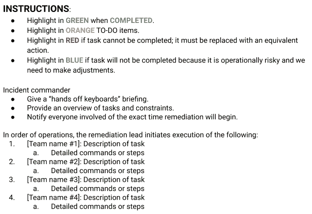
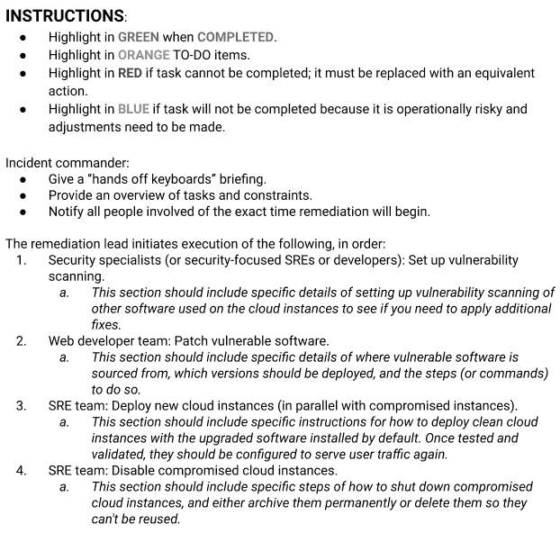
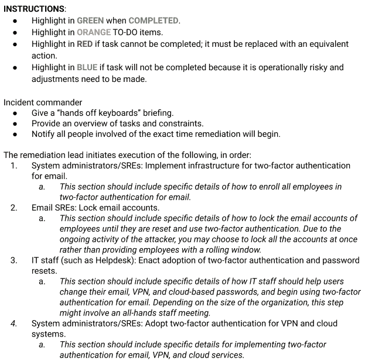

# 第十八章：恢复和事后

> 原文：[18. Recovery and Aftermath](https://google.github.io/building-secure-and-reliable-systems/raw/ch18.html)
> 
> 译者：[飞龙](https://github.com/wizardforcel)
> 
> 协议：[CC BY-NC-SA 4.0](https://creativecommons.org/licenses/by-nc-sa/4.0/)

由 Alex Perry，Gary O’Connor 和 Heather Adkins

与 Nick Soda

如果您的组织遭遇严重事件，您会知道如何恢复吗？谁来执行恢复，他们知道要做出什么决定吗？ SRE 书的第十七章和 SRE 工作手册的第九章讨论了预防和管理服务中断的做法。这些做法中的许多做法也与安全相关，但是从安全攻击中恢复具有独特的元素，特别是当事件涉及主动恶意攻击者时（参见第二章）。因此，虽然本章提供了处理许多种恢复工作的一般概述，但我们特别强调恢复工程师需要了解有关安全攻击的内容。

正如我们在第八章和第九章中讨论的，根据良好设计原则构建的系统可以抵御攻击并且易于恢复。无论系统是单个计算实例、分布式系统还是复杂的多层应用程序，都是如此。为了促进恢复，良好构建的系统还必须与危机管理策略相结合。如前一章所述，有效的危机管理需要在继续威慑攻击者的同时恢复任何受损资产到已知（可能改进的）良好状态之间取得微妙的平衡。本章描述了良好的恢复检查表所包含的微妙考虑，以实现这些目标。

根据我们的经验，恢复工程师通常是每天设计、实现和维护这些系统的人。在攻击期间，您可能需要召集安全专家担任特定角色，例如执行取证活动、对安全漏洞进行分类或做出微妙的决定，但将系统恢复到已知良好状态需要来自每天与系统一起工作的专业知识。事件协调和恢复工作之间的合作允许安全专家和恢复工程师双向共享信息以恢复系统。

从安全攻击中恢复往往涉及比预先计划的 playbooks 能够适应的更模糊的环境。攻击者可以在攻击过程中改变他们的行为，恢复工程师可能会犯错或发现关于他们的系统的意外特征或细节。本章介绍了一种动态的恢复方法，旨在匹配您的攻击者的灵活性。

恢复行为也可以成为推动改进安全姿态的强大工具。恢复采取短期战术缓解和长期战略改进的形式。我们在本章中介绍了一些思考安全事件、恢复和下一个事件之间的静默期之间的连续性的方式。

# 恢复物流

如前一章所讨论的，良好管理的事件受益于并行化响应。并行化在恢复过程中尤其有益。参与恢复工作的人员应与调查事件的人员不同，原因有几个：

+   事件的调查阶段通常是耗时且详细的，需要长时间的专注。在持续的事件中，调查团队通常需要休息，而恢复工作开始时。

+   事件的恢复阶段可能在您的调查仍在进行中开始。因此，您需要能够并行工作的独立团队，彼此之间提供信息。

+   进行调查所需的技能可能与进行恢复工作所需的技能不同。

在准备恢复并考虑您的选择时，您应该建立一个正式的团队结构。根据事件的范围，这个团队可以小到一个人，也可以大到整个组织。对于更复杂的事件，我们建议创建协调机制，如正式团队、频繁会议、共享文档存储库和同行评审。许多组织通过使用冲刺、Scrum 团队和紧密的反馈循环，将恢复团队的运作模式建模在其现有的敏捷开发流程上。

从复杂事件中组织良好的恢复可能看起来像精心编排的芭蕾舞表演，不同个体在恢复过程中的行动相互影响。重要的是，恢复芭蕾中的舞者们要避免踩到彼此的脚。因此，您应该明确定义准备、审查和执行恢复的角色，确保每个人都了解操作风险，并且参与者经常进行面对面的沟通。

随着事件的进展，事件指挥官（IC）和运营负责人（OL）应任命一名纠正负责人（RL）开始规划恢复，如第十七章所述。RL 应与 IC 密切协调，制定恢复检查表，以确保恢复工作与调查的其他部分保持一致。RL 还负责组建具有相关专业知识的团队，并制定恢复检查表（在“恢复检查表”中讨论）。

在谷歌，执行恢复的团队是日常构建和运行系统的团队。这些人包括 SRE、开发人员、系统管理员、帮助台人员和管理常规流程（如代码审计和配置审查）的相关安全专家。

信息管理和沟通在恢复过程中是成功响应的重要组成部分。原始事件轨迹、草稿笔记、恢复检查表、新的操作文档以及有关攻击本身的信息将是重要的文档。确保这些文档对恢复团队可用，但对攻击者不可用；使用类似空气隔离的计算机进行存储。例如，您可以使用诸如 bug 跟踪系统、基于云的协作工具、白板，甚至贴在墙上的便签卡等信息管理工具的组合。确保这些工具不在攻击者可能威胁到您系统的最广泛范围之内。考虑从便签卡开始，并在确保没有恢复团队成员的机器受到威胁后添加独立的服务提供商。

良好的信息管理是确保顺利恢复的另一个关键方面。使用每个人都可以访问并实时更新的资源，以便在问题出现或检查表项完成时进行更新。如果您的恢复计划只能由您的纠正负责人访问，这将成为快速执行的障碍。

在恢复系统的同时，保持关于恢复过程中发生的事情的可靠记录也很重要。如果您在途中犯了错误，您的审计轨迹将帮助您解决任何问题。指定专门的记录员或文档专家可能是一个好主意。在谷歌，我们利用技术撰稿人来优化我们的恢复工作中的信息管理。我们建议阅读第二十一章，其中讨论了更多的组织方面。

# 恢复时间表

开始恢复阶段的最佳时间因调查性质而异。如果受影响的基础设施至关重要，您可能会选择几乎立即从攻击中恢复过来。这在从拒绝服务攻击中恢复时经常发生。另外，如果您的事件涉及攻击者完全控制您的基础设施，您可能会几乎立即开始规划恢复，但只有在完全了解攻击者所做的事情后才执行计划。本章讨论的恢复流程适用于任何恢复时间线：在调查仍在进行时，调查阶段结束后，或者在这两个阶段都进行时。

对事件的足够了解和了解恢复范围将决定采取哪种路线。通常，在启动恢复操作时，调查团队已经开始了事后分析文档（可能是初步原始笔记的形式），恢复团队在进行过程中更新。该文档中的信息将指导恢复团队的规划阶段（参见“规划恢复”），这应该在启动恢复之前完成（参见“启动恢复”）。

由于最初的计划可能随着时间而发展，规划和执行恢复可能会重叠。但是，*您不应该在没有某种计划的情况下开始恢复工作*。同样，我们建议在进行恢复之前创建恢复检查表。恢复工作完成后，您的恢复后行动（参见“恢复后”）应该尽快开始。在这两个阶段之间允许时间过长可能会导致您忘记先前行动的细节，或者推迟必要的中长期修复工作。

# 规划恢复

您的恢复工作的目标是减轻攻击并使系统恢复到正常运行状态，并在此过程中应用任何必要的改进。复杂的安全事件通常需要并行化事件管理，并设置结构化团队来执行事件的不同部分。

恢复规划过程将依赖调查团队发现的信息，重要的是在采取行动之前仔细规划恢复。在这些情况下，一旦您对攻击者所做的事情有足够的基线信息，您应该立即开始规划恢复。以下各节描述了一些准备最佳实践和常见陷阱。

## 确定恢复范围

您如何定义事件的恢复将取决于您遇到的攻击类型。例如，从单个机器上的勒索软件等较小问题中恢复可能相对简单：您只需重新安装系统。然而，要从在整个网络上存在的国家行为者以及窃取敏感数据的攻击者那里恢复，您将需要来自组织各个部门的多种恢复策略和技能。请记住，恢复所需的工作量可能与攻击的严重程度或复杂性不成比例。一家对简单勒索软件攻击毫无准备的组织可能最终会有许多受损的机器，并需要进行资源密集型的恢复工作。

要从安全事件中启动恢复，您的恢复团队需要完整的系统、网络和数据受到攻击的清单。他们还需要足够的关于攻击者战术、技术和程序（TTPs）的信息，以识别可能受到影响的任何相关资源。例如，如果您的恢复团队发现配置分发系统已被入侵，那么这个系统就在恢复范围内。从这个系统接收配置的任何系统也可能在范围内。因此，调查团队需要确定攻击者是否修改了任何配置，以及这些配置是否被推送到其他系统。

正如在第十七章中提到的，理想情况下，指挥官会指派某人在调查早期为缓解文档维护行动项目（在“事后检讨”中讨论）。缓解文档和随后的事后检讨将确定解决妥协根本原因的步骤。您需要足够的信息来优先处理行动项目，并将其分类为短期缓解措施（如修补已知漏洞）或战略性的长期变更（如更改构建流程以防止使用易受攻击的库）。

为了了解如何在未来保护这些资产，您应该检查每个直接或间接受到影响的资产，以及攻击者的行为。例如，如果攻击者能够利用 Web 服务器上的一个易受攻击的软件堆栈，您的恢复将需要了解攻击的方式，以便您可以修补运行该软件包的任何其他系统中的漏洞。同样，如果攻击者通过钓鱼用户的帐户凭据获得访问权限，您的恢复团队需要计划如何阻止另一个攻击者明天做同样的事情。请注意了解攻击者可能能够利用哪些资产进行未来的攻击。您可以考虑制作攻击者的行为和恢复工作的可能防御措施清单，就像我们在第二章中所做的那样（参见[表 2-3](ch02.html#cyber_kill_chain_of_a_hypothetical_atta)）。您可以将此清单用作操作文档，以解释为什么要引入某些新的防御措施。

汇总受损资产和短期缓解措施的清单需要进行紧密的沟通和反馈循环，涉及您的事后笔记、调查团队和事件指挥官。您的恢复团队需要尽快了解新的调查发现。如果调查和恢复团队之间的信息交换不高效，攻击者可以绕过缓解措施。您的恢复计划还应该考虑到您的攻击者可能仍然存在并观察您的行动。

## 深入探讨：恢复考虑

在设计事件的恢复阶段时，您可能会遇到一些难以回答的开放性问题。本节涵盖了一些常见的陷阱和关于如何平衡权衡的想法。这些原则对于经常处理复杂事件的安全专家来说会感到熟悉，但这些信息对于参与恢复工作的任何人都是相关的。在做出决定之前，请问自己以下问题。

### 您的攻击者将如何回应您的恢复工作？

您的缓解和恢复清单（参见“恢复清单”和“示例”）将包括切断攻击者与您资源的任何连接，并确保他们无法返回。实现这一步骤需要进行微妙的平衡，需要对攻击有近乎完美的了解，并制定一个执行驱逐的坚实计划。一个错误可能导致攻击者采取您未能预料或看到的额外行动。

考虑这个例子：在事件中，您的调查团队发现攻击者已经妥协了六个系统，但团队无法确定最初的攻击是如何开始的。甚至不清楚您的攻击者是如何首次访问您的系统的。您的恢复团队制定并执行了一个重建这六个受损系统的计划。在这种情况下，恢复团队在没有完全了解攻击是如何开始、攻击者将如何回应，或者攻击者是否仍在其他系统上活动的情况下行动。仍在活动中的攻击者将能够从其在另一个受损系统中的位置看到您已经将这六个系统下线，并可能继续破坏其余可访问的基础设施。

除了损害您的系统外，攻击者还可以窃听电子邮件、错误跟踪系统、代码更改、日历和其他资源，这些资源您可能希望用来协调您的恢复。根据事件的严重程度和您正在恢复的妥协类型，您可能希望使用对攻击者不可见的系统进行调查和恢复。

考虑一个协调使用即时消息系统的恢复团队，而其中一个团队成员的帐户已被攻击。攻击者也登录并观看聊天，可以在恢复过程中看到所有私人通信 - 包括调查的任何已知元素。攻击者甚至可能推断出恢复团队不知道的信息。您的攻击者可能利用这些知识以不同的方式妥协更多系统，绕过调查团队可能具有的所有可见性。在这种情况下，恢复团队应该建立一个新的即时消息系统，并部署新的机器 - 例如，廉价的 Chromebook - 用于响应者通信。

这些例子可能看起来很极端，但它们阐明了一个非常简单的观点：在攻击的另一侧有一个人在对您的事件响应做出反应。您的恢复计划应考虑在了解攻击者的访问权限并采取行动以最小化进一步危害的风险。

###### 注意

今天，安全事件响应者普遍认为，在驱逐攻击者之前，您应该等到对攻击有全面的了解。这可以防止攻击者观察您的缓解措施，并帮助您进行防御性响应。

尽管这是一个好建议，但要谨慎应用。如果您的攻击者已经在做一些危险的事情（例如获取敏感数据或破坏系统），您可能会选择在完全了解他们的行动之前采取行动。如果您选择在完全了解攻击者的意图和攻击范围之前驱逐攻击者，那么您就进入了一场国际象棋游戏。做好准备，并知道您需要采取的步骤以达到将军！

如果您正在处理复杂的事件，或者有活跃的攻击者正在与您的系统交互，您的恢复计划应包括与调查团队的紧密整合，以确保攻击者无法重新访问您的系统或绕过您的缓解措施。确保告知调查团队您的恢复计划 - 他们应该确信您的计划将阻止攻击。

### 您的恢复基础设施或工具是否受到妥协？

在恢复计划的早期阶段，确定您需要进行响应的基础设施和工具，并询问调查团队他们是否认为这些恢复系统已被妥协。他们的答案将决定您是否可以进行安全的恢复，以及您可能需要为更完整的响应做准备的额外补救步骤。

例如，假设攻击者已经入侵了您网络上的几台笔记本电脑和管理它们设置的配置服务器。在这种情况下，您需要在重建任何受损的笔记本电脑之前为配置服务器制定一个补救计划。同样，如果攻击者已经在您的自定义备份恢复工具中引入了恶意代码，您需要找到他们的更改并将代码恢复到正常状态，然后再恢复任何数据。

更重要的是，您必须考虑如何恢复资产——无论是位于目前受攻击者控制的基础设施上的系统、应用程序、网络还是数据。在攻击者控制基础设施的情况下恢复资产可能会导致同一攻击者再次威胁。在这种情况下的常见恢复模式是建立一个“干净”或“安全”的资产版本，例如一个与任何受损版本隔离的干净网络或系统。这可能意味着完全复制整个基础设施，或者至少是其中的关键部分。

回到我们的一个受损配置服务器的例子，您可以选择创建一个隔离网络，并使用全新的操作系统安装重建这个系统。然后您可以手动配置系统，以便您可以从中引导新的机器，而不会引入任何受攻击者控制的配置。

### 攻击的变体有哪些？

假设您的调查团队报告说，攻击者利用了缓冲区溢出漏洞来攻击您的网络服务基础设施。虽然攻击者只能访问一个系统，但您知道其他 20 台服务器也在运行相同有缺陷的软件。在规划恢复过程时，您应该处理已知受损的系统，但还要考虑另外两个因素：其他 20 台服务器是否也受到攻击，以及您将如何在将来减轻所有这些机器的漏洞影响。

同样值得考虑的是，您的系统是否（在短期内）容易受到您当前经历的攻击类型的变体的影响。在缓冲区溢出的例子中，您的恢复规划应该寻找基础设施中任何相关的软件漏洞——无论是相关的漏洞类别，还是另一个软件中相同的漏洞。这一考虑在自定义代码或使用共享库的情况下尤为重要。我们在第十三章中介绍了几种测试变体的选项，比如模糊测试。

如果您使用的是开源或商业软件，并且测试变体超出了您的控制范围，希望维护软件的人已经考虑了可能的攻击变体并实现了必要的保护措施。值得检查软件堆栈其他部分的可用补丁，并将广泛的升级作为恢复的一部分。

### 您的恢复是否会重新引入攻击向量？

许多恢复方法旨在将受影响的资源恢复到已知的良好状态。这一努力可能依赖于系统镜像、存储在代码库中的源代码或配置。您恢复的一个关键考虑因素应该是您的恢复操作是否会重新引入使系统容易受攻击的攻击向量，或者是否会使您已经取得的耐久性或安全性进展倒退。考虑一个包含有漏洞软件的系统镜像，允许攻击者威胁系统。如果您在恢复过程中重用这个系统镜像，您将重新引入有漏洞的软件。

这种漏洞重新引入是许多环境中的常见陷阱，包括依赖于通常由整个系统快照组成的“黄金镜像”的现代云计算和内部环境。在系统重新上线之前，重要的是更新这些黄金镜像并删除受损的快照，无论是在源头还是安装后立即进行。

如果攻击者能够修改您的恢复基础设施的部分内容（例如，存储在源代码仓库中的配置），并且您使用这些受损的设置恢复系统，那么您将通过保留攻击者的更改来使恢复倒退。将系统恢复到良好状态可能需要很长时间，以避免这种倒退。这也意味着您需要仔细考虑攻击时间轴：攻击者何时进行了修改，您需要回溯多久来撤销他们的更改？如果无法确定攻击者进行修改的确切时间，您可能需要并行从头开始重建基础设施的大部分。

###### 注

在从传统备份（如磁带备份）中恢复系统或数据时，您应该考虑您的系统是否也备份了攻击者的修改。您应该销毁或隔离包含攻击者证据的任何备份或数据快照，以供以后分析。

### 您有哪些缓解选择？

在系统中遵循弹性设计的良好实践（参见第九章）可以帮助您快速从安全事件中恢复。如果您的服务是分布式系统（而不是单片二进制），您可以相对快速、容易地对各个模块应用安全修复：您可以对有缺陷的模块执行“就地”更新，而不会对周围的模块引入重大风险。同样，在云计算环境中，您可以建立机制来关闭受损的容器或虚拟机，并迅速用已知良好的版本替换它们。

然而，根据攻击者已经妥协的资产（如机器、打印机、摄像头、数据和账户），您可能会发现自己只剩下一些不太理想的缓解选择。您可能需要决定哪个选项是最不好的，并为短期内永久驱逐攻击者离开系统而承担不同程度的技术债务。例如，为了阻止攻击者的访问，您可能选择手动向路由器的实时配置添加拒绝规则。为了防止攻击者看到您所做的更改，您可能会绕过正常的程序，不经同行审查和跟踪版本控制系统就进行此类更改。在这种情况下，您应该在将新的防火墙规则添加到配置的规范版本之前禁用自动规则推送。您还应该设置一个提醒，在未来的某个时候重新启用这些自动规则推送。

在决定是否在短期缓解措施中接受技术债务以驱逐攻击者时，问问自己以下问题：

+   我们可以多快（以及何时）替换或移除这些短期缓解措施？换句话说，这些技术债务会持续多久？

+   组织是否致力于在其寿命期间维护缓解措施？拥有新技术债务的团队是否愿意接受这笔债务，并在以后通过改进来偿还？

+   缓解措施会影响我们系统的正常运行时间吗？我们会超出错误预算吗？

+   组织中的人如何识别这种缓解措施是短期的？考虑将缓解措施标记为以后要删除的技术债务，以便任何其他在系统上工作的人都能看到其状态。例如，向代码添加注释和描述性的提交或推送消息，以便依赖新功能的任何人知道它在未来可能会发生变化或消失。

+   对于没有关于事件领域专业知识的未来工程师来说，他们如何证明这种缓解措施不再必要，并且可以在不带来风险的情况下将其移除？

+   如果短期缓解措施长时间保持（无论是意外还是情况所致），其效果会有多大？想象一下，攻击者已经入侵了您的数据库之一。您决定在对数据进行清理和迁移至新系统的同时保持数据库在线。您的短期缓解措施是将数据库隔离在一个单独的网络上。问问自己：如果迁移需要六个月而不是原定的两周，效果会怎样？组织中的人会不会忘记数据库曾经受到攻击，并意外地将其重新连接到安全网络？

+   领域专家是否已经确定了您对前面问题的答案中存在的漏洞？

## 恢复检查表

一旦您确定了恢复的范围，您应该列出您的选择（如“启动恢复”中所讨论的），并仔细考虑您需要做出的权衡。这些信息构成了您的恢复检查表的基础（或者根据事件的复杂程度可能有多个检查表）。您进行的每项恢复工作都应该利用常规和经过测试的做法。彻底记录和分享您的恢复步骤可以让参与事件响应的人更容易合作并就恢复计划提供建议。一份记录完善的检查表还可以让您的恢复团队确定可以并行化的工作领域，并帮助您协调工作。

如图 18-1 中的模板恢复检查表所示，检查表上的每一项都对应一个单独的任务，以及完成该任务所需的相应技能。⁴ 恢复团队的成员可以根据自己的技能来领取任务。然后，事件指挥官可以确信所有已完成的恢复步骤都已经被勾选。

您的检查表应包含所有相关细节，比如用于恢复的具体工具和命令。这样，当您开始清理工作时，所有团队成员都将对需要完成的任务有清晰、达成一致的指导，并知道完成的顺序。检查表还应考虑在计划失败时需要的任何清理步骤或回滚程序。我们将在本章末尾的实例中使用图 18-1 中的模板检查表。

###### 图 18-1\. 检查表模板

# 启动恢复

在发生安全事件后，系统的安全可靠恢复在很大程度上依赖于有效的流程，比如精心构建的检查表。根据您正在处理的事件类型，您需要考虑有效的技术选项。您的缓解和恢复工作的目标是将攻击者从您的环境中驱逐出去，确保他们无法返回，并使您的系统更加安全。第九章涵盖了提前将恢复选项设计到系统中的原则。本节涵盖了在考虑这些原则的情况下执行恢复的实际现实，以及做出某些决定的利弊。

## 隔离资产（隔离）

*隔离*（也称为*隔离）是减轻攻击影响的一种非常常见的技术。一个经典的例子是将恶意二进制文件移动到隔离文件夹的防病毒软件，文件权限会阻止系统上的其他任何东西读取或执行该二进制文件。隔离也常用于隔离单个受损的主机。您可以在网络层面（例如，通过禁用交换机端口）或主机本身（例如，通过禁用网络）对主机进行隔离。甚至可以使用网络分割来隔离整个受损机器的网络——许多 DoS 响应策略会将服务从受影响的网络中移开。

如果你需要让受损的基础设施继续运行，隔离资产也可能是有用的。考虑这样一个场景：你的一个关键数据库已经受到了攻击。由于它的重要性，你需要在减轻过程中保持数据库在线——也许这个数据库是使命关键的，并且需要几周时间来重建，你的组织不想为此关闭整个业务。你可以通过将数据库隔离在自己的网络上，并对它可以发送和接收的网络流量（来自互联网和你的基础设施的其他部分）进行限制，来减少攻击者的影响。

一个警告：让受损的资产在线上是一种顽固的技术债务。如果你不及时解决这个债务，并且让它们在线上的时间超过预期，这些受损的资产可能会造成重大损害。这可能会发生出于几个原因：因为这是隔离数据的唯一副本（没有备份），因为替换隔离资产存在挑战，或者因为在事件的忙碌中人们简单地忘记了受损的资产。在最坏的情况下，你的组织中的新人（或者事件中的新人）甚至可能会取消隔离受损的资源！

考虑一些标记这些资产受损的方法，比如在设备上使用高度可见的贴纸，或者保持一个最新的隔离系统的 MAC 地址列表，并监控这些地址是否出现在你的网络上。贴纸可以主动避免重复使用，而地址列表可以快速地进行反应性移除。确保你的恢复清单和事后总结覆盖了任何隔离资产是否安全和永久地得到了补救。

## 系统重建和软件升级

考虑以下难题：你在三个系统上发现了攻击者的恶意软件，并且正在进入事件的恢复阶段。为了驱逐攻击者，你是删除恶意软件并让系统继续运行，还是重新安装系统？根据你的系统的复杂性和关键性，你可能需要考虑这些选项之间的权衡。一方面，如果受影响的系统是使命关键的，并且难以重建，你可能会倾向于删除攻击者的恶意软件并继续前进。另一方面，如果攻击者安装了多种类型的恶意软件，而你并不知道所有的恶意软件，你可能会错过全面清理的机会。通常，从头开始重新安装系统并使用已知的良好镜像和软件是最佳解决方案。

如果你使用可靠和安全的设计原则来操作你的环境，重建系统或升级软件应该相对简单。第九章提供了一些关于了解系统状态的提示，包括主机管理和固件。

例如，如果你使用的系统具有硬件支持的引导验证，可以通过加密的信任链一直到操作系统和应用程序（Chromebook 是一个很好的例子），那么恢复系统只是一个简单的断电重启的问题，这将使系统返回到一个已知的良好状态。像 Rapid 这样的自动发布系统（如[SRE 书](https://landing.google.com/sre/sre-book/chapters/release-engineering/)第八章中讨论的）也可以提供一种可靠和可预测的方式来在恢复过程中应用软件更新。在云计算环境中，你可以依靠即时的容器和软件发布来用安全的标准镜像替换任何受损的系统。

如果您在没有源代码控制系统或标准系统镜像来管理配置或使用已知良好版本的系统的情况下进入事件的恢复阶段，请考虑将这些机制作为短期恢复计划的一部分引入。有一些开源选项可用于管理系统构建，例如[Bazel](https://bazel.info)；配置，例如[Chef](https://chef.io)；以及应用程序集成和部署，例如[Helm](https://helm.sh)用于 Kubernetes。在短时间内采用新的解决方案可能一开始看起来令人望而生畏，而在设置这些解决方案时，您可能需要对正确的配置进行初步尝试。如果弄清楚正确的配置需要时间和精力，而这会牺牲其他重要的技术工作，您可能需要稍后完善您的配置。确保您仔细考虑您为了短期安全而积累的技术债务，并制定改进这些新系统设置的计划。

## 数据清理

根据您的事件范围，您应该确认攻击者没有篡改您的源代码、二进制文件、图像和配置，或者您用于构建、管理或发布它们的系统。清理系统生态系统的一种常见技术是从其原始来源（如开源或商业软件提供商）、备份或未被篡改的版本控制系统中获取已知的良好副本。一旦您获得了已知的良好副本，您可以对您想要使用的版本进行校验和比较，以确保其与已知的良好状态和软件包一致。如果您的旧良好副本托管在受损的基础设施上，请确保您非常有信心，知道攻击者何时开始篡改您的系统，并确保审查您的数据来源。

代码来源的强大二进制溯源（如第十四章中所讨论的）使恢复更加简单。想象一下，您发现攻击者在您的构建系统上使用的`glibc`库中引入了恶意代码。您需要识别在“风险”时间范围内构建的所有二进制文件，这些二进制文件部署在哪里，以及它们具有的任何依赖关系。在进行这项检查时，清楚地标记已知的受损代码、库和二进制文件。您还应该创建测试，以防止您重新引入有漏洞或后门的代码。这些预防措施将确保您的恢复团队中的其他人在恢复过程中不会无意中使用受损的代码，也不会意外地重新引入有漏洞的版本。

您还应该检查攻击者是否篡改了任何应用程序级别的数据，例如数据库中的记录。如第九章所述，确保备份的强大加密完整性会增加您对这些备份的信心，并使您能够确保您需要与潜在受损的实时数据进行比较的任何比较都是准确的。调和攻击者所做的更改可能也会非常复杂，并且可能需要您构建特殊的工具。例如，为了利用部分恢复，您可能需要定制工具将从备份中获取的文件或记录拼接到您的生产系统中，同时进行同时的完整性检查。理想情况下，在制定可靠性策略时，您应该构建和测试这些工具。

## 恢复数据

恢复过程通常依赖于支持一系列操作的工具，例如回滚、恢复、备份、隔离重建和事务回放。[“持久数据”](ch09.html#persistent_data)讨论了安全存储用于这些操作的数据。

许多这些工具都有参数，可以在进展速度和数据安全之间进行交易。除非这些工具经常针对真实的生产规模工作负载进行测试，否则我们不建议更改这些参数的默认值。测试、暂存或（更糟糕的是）模拟不能真实地测试基础设施系统。例如，很难真实地模拟内存缓存填充所需的延迟，或者负载平衡估算器在真实的生产条件之外稳定所需的时间。这些参数因服务而异，由于延迟通常在监控数据中可见，您应该在事件之间调整这些设置。当您试图从敌对的安全攻击中恢复时，处理一个行为不端的工具就像面对一个新的攻击者一样具有挑战性。

您可能已经有监控措施来检测由软件错误导致的重大数据丢失。也有可能您的攻击者避免触发这些警报。即便如此，审查这些日志总是值得的：数据可能会确定攻击开始的拐点。如果指标显示了这样的拐点，那么您现在有了一个独立的下限，可以确定要跳过多少个备份。

不足够旧的现场恢复备份可能会重新激活在事件期间备份的任何妥协。如果检测入侵花费了一些时间，您最旧的“安全”备份可能已经被覆盖。如果是这样，数据整治可能是您唯一的选择。

恢复的备份可能包含被意外修改的数据和被损坏的数据。这种损坏可能是由恶意更改（攻击者）或随机事件（例如磁带损坏或硬盘故障）引起的。重建数据的工具往往专注于从随机损坏或恶意损坏中恢复，但不是两者兼顾。了解您的恢复和重建工具提供的功能，以及方法的局限性非常重要。否则，数据恢复的结果可能不符合您的期望。使用常规的完整性程序，例如根据已知的良好加密签名验证恢复的数据，将有所帮助。最终，冗余和测试是应对随机事件的最佳防御措施。

## 凭据和秘密轮换

攻击者常常会劫持您基础设施中使用的现有帐户，以冒充合法用户或服务。例如，进行密码钓鱼攻击的攻击者可能会尝试获取他们可以用来登录到您系统的帐户凭据。同样，通过诸如传递哈希的技术，攻击者可以获取和重复使用凭据，包括管理员帐户的凭据。第九章讨论了另一种情况：SSH *authorized_keys*文件的妥协。在恢复过程中，您通常需要通过诸如密钥轮换（例如 SSH 认证中使用的密钥）的方法来轮换系统、用户、服务和应用帐户的凭据。根据您的调查结果，辅助设备（例如网络设备和带外管理系统）以及云端服务（如 SaaS 应用程序）也可能在范围之内。

您的环境可能有其他需要关注的秘密，例如用于数据静态加密和用于 SSL 的加密密钥。如果您的前端 Web 服务基础设施受到破坏或者可能被攻击者访问，您可能需要考虑轮换 SSL 密钥。如果在攻击者窃取密钥后您不采取行动，他们可能会使用密钥进行中间人攻击。同样，如果数据库中记录的加密密钥在受损的数据库服务器上，最安全的方法是轮换密钥并重新加密数据。

加密密钥通常也用于应用级通信。如果攻击者可以访问存储这些应用级密钥的系统，你需要对密钥进行轮换。仔细考虑存储 API 密钥的位置，比如你用于云服务的密钥。将服务密钥存储在源代码或本地配置文件中是一个常见的漏洞：如果攻击者可以访问这些文件，他们以后可以访问其他环境。作为恢复的一部分，你应该确定攻击者是否可以访问这些文件（尽管可能无法证明他们被访问），并保守而经常地轮换这些服务密钥。

根据情况，凭证轮换可能需要谨慎执行。对于单个被钓鱼的账户，要求用户更改密码可能是一个简单的任务。然而，如果攻击者可以访问各种账户，包括管理员账户，或者你不确定他们可能已经 compromise 了哪些账户，你可能需要轮换所有用户的凭证。在创建恢复清单时，确保列出重置账户的顺序，优先考虑管理员凭证、已知被 compromise 的账户以及授予对敏感资源访问权限的账户。如果你有大量的系统用户，你可能需要通过一次性事件中断所有用户。

凭证轮换的另一个复杂之处在于，如果你的组织处理实践不够严密，一次攻击和应对可能会使情况变得更糟。假设你的公司使用集中系统（如 LDAP 数据库或 Windows Active Directory）来管理员工账户。其中一些系统会存储密码历史记录（通常是经过哈希和加盐的）。通常，系统会保留密码历史记录，以便你可以将新密码与旧密码进行比较，并防止用户随时间重新使用密码。如果攻击者可以访问所有哈希密码并破解这些密码，他们可能能够推断用户更新密码的模式。例如，如果用户在每个密码中使用了一年（*password2019*，*password2020* 等），攻击者可能能够预测下一个密码。当密码更改是你的补救策略的一部分时，这可能是危险的。

如果你可以接触到安全专家，最好在制定恢复计划时咨询他们。这些专家可以进行威胁建模，并提供如何改进你的凭证处理实践的建议。他们可能会建议通过采用双因素认证来消除复杂的密码方案的需要。

# 恢复后

一旦你驱逐了攻击者并完成了恢复，下一步是过渡出事故并考虑发生的长期影响。如果你经历了像单个员工账户或单个系统被 compromise 这样的小事件，恢复阶段和事后可能相对简单。如果你经历了一个更严重的事件，影响更大，恢复和事后阶段可能会更加广泛。

在 2009 年的奥罗拉行动之后，谷歌着手对其环境进行系统性和战略性的改变。我们有些改变是在一夜之间完成的，而其他一些改变，比如 BeyondCorp 和我们与 FIDO 联盟合作，推动广泛采用使用安全密钥的双因素认证，需要更多的时间。你的事后分析应该区分短期内和长期内你可以实现的目标。

## 事后分析

对于处理事件的团队来说，保留关于他们工作的笔记是一个良好的做法，之后可以整合到官方的事后总结中。每个事后总结都应包括一份行动项目清单，解决你在事件中发现的根本问题。一个强大的事后总结涵盖了攻击者利用的技术问题，并且认识到了改进事件处理的机会。此外，你应该记录与这些行动项目相关的时间框架和努力，并决定哪些行动项目属于短期和长期路线图。我们在 SRE 书的第十五章中详细介绍了无过失的事后总结，但这里有一些额外的关注安全的问题需要考虑：

+   事件的主要影响因素是什么？环境中是否存在其他变体和类似问题，你可以解决？

+   哪些测试或审计流程应该更早地检测到这些因素？如果它们还不存在，你是否可以建立这样的流程来捕捉未来类似的因素？

+   这一事件是否被预期的技术控制（如入侵检测系统）检测到？如果没有，你如何改善检测系统？

+   事件被发现和应对的速度有多快？这是否在可接受的时间范围内？如果不是，你如何改善你的响应时间？

+   重要数据是否受到足够的保护，以阻止攻击者访问？你应该引入哪些新的控制措施？

+   恢复团队是否能够有效地使用工具，包括源代码版本控制、部署、测试、备份和恢复服务？

+   团队在恢复过程中绕过了哪些正常程序，比如正常测试、部署或发布流程？你现在可能需要应用什么补救措施？

+   是否对基础设施或工具进行了临时缓解的更改，现在需要重构？

+   在事件和恢复阶段，你识别并记录了哪些错误，现在需要解决？

+   行业和同行群体中存在哪些最佳实践，可以在防范、检测或应对攻击的任何阶段帮助你？

我们建议制定一套明确的行动项目清单，明确指定所有者，并按照短期和长期举措的顺序进行排序。短期举措通常比较简单，实现起来不需要太长时间，并且解决的问题范围相对较小。我们通常称这些行动项目为“低挂果”，因为你可以轻松地识别和解决它们。例如，添加双因素身份验证、缩短应用补丁的时间或建立漏洞发现程序。

长期的举措可能会融入到你的组织安全姿态改进的整体计划策略中。这些行动项目通常更基本地影响你的系统和流程的运作方式，例如成立专门的安全团队、部署骨干加密或改变操作系统选择。

在理想的情况下，从妥协到安全姿态改进的完整事件生命周期将在下一次事件发生之前完成。然而，请记住，在上一次事件之后的例行稳定状态期间也是下一次事件之前的例行状态。事件活动的这段时间是你学习、适应、识别新威胁并为下一次事件做准备的机会。本书的最后部分专注于在这些例行状态期间改进和维护你的安全姿态。

# 例子

以下的工作示例展示了事后分析、恢复清单的建立以及恢复执行的关系，以及长期缓解措施如何融入更大的安全计划。这些示例并未涵盖所有的事件响应考虑，而是侧重于如何在驱逐攻击者、减轻他们的即时行动和进行长期变更之间进行权衡。

## 受损的云实例

> **场景**：贵组织使用的基于网络的软件包在云提供商的基础设施中用于为用户流量提供服务的虚拟机（VM）存在常见的软件漏洞。一名机会主义的攻击者使用漏洞扫描工具发现了您的易受攻击的网络服务器并利用了它们。一旦攻击者接管了虚拟机，他们就会利用它们发起新的攻击。

在这种情况下，修复负责人使用了调查小组的笔记，确定团队需要修补软件，重新部署虚拟机，并关闭受损的实例。修复负责人还确定，短期的缓解措施应该发现并解决相关的漏洞。图 18-2 提供了这一事件的一个假设恢复清单。出于简洁起见，我们省略了具体的命令和执行步骤，而您的实际恢复清单应包括这些细节。

###### 图 18-2\. 受损云实例的恢复清单

恢复完成后，由所有参与事件的人共同开发的事故事后分析确定了需要一个正式的漏洞管理计划，以便及时主动地发现和修补已知问题。这一建议被纳入了改善组织安全姿态的长期战略中。

## 大规模钓鱼攻击

> **场景**：在七天内，攻击者对贵组织发起了密码钓鱼攻击，而贵组织并未使用双因素认证。70%的员工上当受骗。攻击者使用这些密码读取了贵组织的电子邮件，并向媒体泄露了敏感信息。

作为这种情况下的 IC，您面临着许多复杂性：

+   调查小组确定，攻击者尚未尝试使用密码访问除电子邮件之外的任何系统。

+   贵组织的 VPN 和相关 IT 服务，包括云系统的管理，使用独立的认证系统与电子邮件服务不同。然而，许多员工在不同服务之间共享密码。

+   攻击者表示他们将在未来几天对贵组织采取更多行动。

与修复负责人合作，您必须权衡快速驱逐攻击者（通过取消他们对电子邮件的访问权限）和确保攻击者在此期间无法访问任何其他系统之间的权衡。这项恢复工作需要精确的执行，图 18-3 提供了一个假设的清单。同样，出于简洁起见，我们省略了确切的命令和程序，但您的真实清单应包括这些细节。

###### 图 18-3\. 大规模钓鱼攻击的恢复清单

恢复完成后，您的正式事后分析强调了以下需求：

+   更广泛地在关键通信和基础设施系统上使用双因素认证

+   单点登录解决方案

+   员工关于钓鱼攻击的教育

贵组织还注意到需要一名 IT 安全专家为您提供建议标准最佳实践。这一建议被纳入了改善贵组织安全姿态的长期战略中。

## 需要复杂恢复的有针对性攻击

> **情景**：你并不知情，攻击者已经能够访问你的系统一个多月了。他们窃取了用于保护与客户在网上通信的 SSL 密钥，向你的源代码中插入了后门，以每笔交易中盗取 0.02 美元，并监视你组织中高管的电子邮件。

作为 IC，你面临着许多复杂性：

+   你的调查团队不清楚攻击是如何开始的，或者攻击者如何继续访问你的系统。

+   你的攻击者可以监视高管和事件响应团队的活动。

+   你的攻击者可以修改源代码并部署到生产系统。

+   你的攻击者已经能够访问存储 SSL 密钥的基础设施。

+   与客户进行的加密网络通信可能会受到损害。

+   你的攻击者已经窃取了钱。

我们不会为这种相当复杂的攻击提供详细的恢复检查表，而是会专注于事件的一个非常重要的方面：需要并行恢复。与 RL 合作，你需要为这些问题中的每一个创建一个恢复检查表，以便更好地协调恢复步骤。在此期间，你还需要与正在了解攻击者过去和当前行动的调查团队保持联系。

例如，你的努力可能需要一些或所有以下恢复团队（你可能还可以想到其他的）：

电子邮件团队

这个团队将切断攻击者对电子邮件系统的访问，并确保他们无法重新进入。团队可能需要重置密码，引入双因素认证等。

源代码团队

这个团队将确定如何切断对源代码的访问，清理受影响的源代码文件，并重新部署经过清理的代码到生产系统。为了完成这项工作，团队需要知道攻击者何时在生产环境中更改了源代码，以及是否存在安全版本。这个团队还需要确保攻击者没有对持久版本控制历史进行更改，并且不能进行额外的源代码更改。

SSL 密钥团队

这个团队将确定如何安全地部署新的 SSL 密钥到网络服务基础设施。为了完成这项工作，团队需要知道攻击者是如何获取密钥的，并且如何防止未经授权的访问。

客户数据团队

这个团队将确定攻击者可能访问到了哪些客户信息，以及是否需要进行补救措施，比如客户密码更改或会话重置。这个补救团队可能还与客户支持、法律和相关人员提出的任何其他问题密切相关。

调和团队

这个团队将研究每笔交易中被盗取的 0.02 美元的影响。你是否需要在数据库中追加记录以适应长期的财务记录？这个团队可能还与财务和法律人员提出的任何其他问题密切相关。

在这种复杂的事件中，通常需要在恢复过程中做出不太理想的选择。例如，考虑需要切断公司电子邮件访问权限的团队。他们可能有一些选择，比如关闭电子邮件系统，锁定所有账户，或者并行启动一个新的电子邮件系统。这些选项都会对组织造成一定影响，可能会提醒攻击者，并且可能并不一定解决攻击者最初获取访问权限的问题。恢复和调查团队需要密切合作，找到适合情况的前进路径。

# 结论

7. 恢复是你的事件响应过程中一个独特而关键的步骤，需要一个精通自己领域的专门团队。在规划恢复时需要考虑许多方面：你的攻击者会如何反应？谁执行什么行动，何时执行？你对用户说什么？你的恢复过程应该是并行的，精心计划的，并且与你的事件指挥官和调查团队定期同步。你的恢复工作应该始终以驱逐攻击者、纠正妥协和提高系统整体安全性和可靠性的最终目标为导向。每次妥协都应该产生能够帮助你改善组织长期安全状况的教训。

2. 从安全事件中恢复的主题在许多资源中都有很好的覆盖，比如[NIST SP 800-184](https://oreil.ly/7N8mr)，即《网络安全事件恢复指南》。NIST 指南强调了通过提前创建各种类型预期事件的强大恢复检查表来提前计划的必要性。它还提供了关于测试这些计划的说明。这是一个很好的通用参考，但你可能会发现在危机时期实现其严格的建议是具有挑战性的。

4. 或者*三个臭皮匠*的小品，如果你没有一个有良好记录的计划！

3. 错误预算在 SRE 书的第三章中有描述。

1. 你如何实现“不用键盘”的简报取决于你，但这个练习的主要目的是要得到观众的全神贯注和参与。在事件发生期间，响应者可能会不断地关注运行脚本或状态仪表板，这很诱人。要执行微妙和复杂的恢复，很重要的一点是在简报期间要得到每个人的全神贯注，这样每个人都在同一页面上。

6. 根据攻击者的复杂程度和攻击的深度，你可能需要考虑重新安装 BIOS 和重新格式化硬盘，甚至更换物理硬件。例如，从 UEFI rootkits 中恢复可能很困难，正如[ESET Research 关于 LoJax 的白皮书](https://oreil.ly/ZxFQj)中所描述的那样。

9. [Pass-the-hash](https://oreil.ly/ZhNsa)是一种技术，允许攻击者在本地从一台机器上窃取的凭据（NTLM 或 LanMan 哈希）在网络上重播，以登录到其他系统，而无需使用用户的明文密码。

5. 将云服务密钥存储在本地文件和源代码中并不被认为是最佳实践。有关在 GitHub 中暴露服务密钥的最新系统研究，请参见 Meli, Michael, Matthew R. McNiece, and Bradley Reaves. 2019. “How Bad Can It Git? Characterizing Secret Leakage in Public GitHub Repositories.” *Proceedings of the 26th Annual Networked and Distributed Systems Security Symposium.* [*https://oreil.ly/r65fM*](https://oreil.ly/r65fM)。

8. 存储密码的最安全方式是使用专门设计用于密码哈希的盐化密钥派生函数，比如[scrypt](https://oreil.ly/m5mge)或[Argon2](https://oreil.ly/_yS2Q)。与仍然常见的盐化 SHA-1 等密码哈希方法不同，这些函数提供了对常见密码恢复攻击的保护，从预先填充的查找表到低成本的专用硬件。即使使用强密码哈希，最佳实践也是确保这些哈希本身在静止状态下使用受保护的密钥进行加密，以增加潜在对手的另一个障碍。

⁹ 有关谷歌为自身和用户实现安全密钥的更多信息，请参阅 Lang, Juan 等人。2016 年。“安全密钥：现代网络的实用密码学第二因素。”*第 20 届国际金融密码学和数据安全会议论文集*：422-440。[*https://oreil.ly/bL9Fm*](https://oreil.ly/bL9Fm)。
