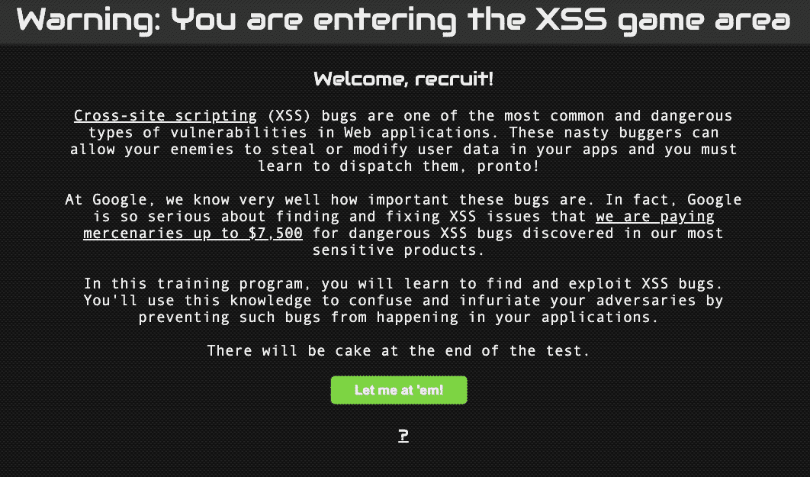
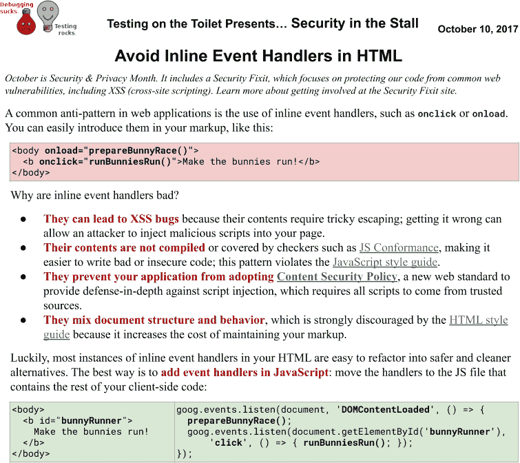

# 第二十一章：建立安全和可靠性文化

> 原文：[21. Building a Culture of Security and Reliability](https://google.github.io/building-secure-and-reliable-systems/raw/ch21.html)
> 
> 译者：[飞龙](https://github.com/wizardforcel)
> 
> 协议：[CC BY-NC-SA 4.0](https://creativecommons.org/licenses/by-nc-sa/4.0/)

作者：Heather Adkins

与 Peter Valchev，Felix Gröbert，Ana Oprea，Sergey Simakov，Douglas Colish 和 Betsy Beyer 一起

当组织围绕这些基本原则建立文化时，有效的安全和可靠性就会蓬勃发展。明确设计、实现和维护他们希望体现的文化的组织通过使文化成为团队努力的一部分——从 CEO 及其领导团队，到技术领导和经理，再到设计、实现和维护系统的人员，取得成功。

想象一下这种情况：就在上周，CEO 告诉整个组织，获得下一个重大交易对公司的未来至关重要。今天下午，你发现公司系统中有攻击者的证据，你知道这些系统将不得不被下线。客户将会生气，重大交易可能会受到威胁。你也知道你的团队可能会因为上个月没有应用安全补丁而受到责备，但很多人都在度假，每个人都在为重大交易的紧迫期限而努力。在这种情况下，你的公司文化支持员工做出什么样的决定？一个具有强大安全文化的健康组织会鼓励员工立即报告事故，尽管这可能会延误重大交易。

假设与此同时，你正在调查恶意闯入者，前端开发团队意外地将一个重大更改推送到了实时生产系统。这个错误导致公司的收入流下线了一个多小时，客户不断打爆了支持热线。你的客户基础的信任正在迅速侵蚀。一个可靠性文化会鼓励员工重新设计允许意外前端推送的流程，以便团队可以管理客户的需求和错过或延误重大交易的风险。

在这些情况下，文化规范应该鼓励无过失的事后分析，以发现可以修复的失败模式，从而避免将来出现有害条件。健康文化的公司知道，被黑客入侵一次是非常痛苦的，但被黑客入侵两次甚至更糟。同样，他们知道 100%永远不是正确的可靠性目标；使用诸如错误预算之类的工具以及围绕安全代码推送的控制可以通过在可靠性和速度之间取得正确的平衡来让用户满意。最后，具有健康安全和可靠性文化的公司知道，从长远来看，客户在不可避免地发生事故时会欣赏透明度，并且隐藏此类事故可能会侵蚀用户的信任。

本章描述了建立安全和可靠性文化的一些模式和反模式。虽然我们希望这些信息对各种规模和形式的组织都有所帮助，但文化是组织的独特元素，在其特定挑战和特征的背景下塑造。没有两个组织会有相同的文化，我们在这里提供的建议也不一定适用于所有人。这一章旨在提供关于文化主题的一系列想法，但在现实世界的情况下，我们提出的有些理想化观点可能并不完全实用。即使在谷歌，我们也并不总是能够做到文化正确，我们不断努力改进现状。我们希望在这里提出的广泛观点和选择中，你能找到一些适合你的环境的观点。

# 定义健康的安全和可靠性文化

与健康的系统一样，健康的团队文化可以被明确设计、实现和维护。在本书中，我们专注于构建健康系统的技术和流程组件。构建健康文化的设计原则也存在。事实上，文化是设计、实现和维护安全和可靠系统的核心组成部分。

## 默认安全和可靠性文化

正如我们在第四章中讨论的，往往会有延迟考虑安全性和可靠性直到项目生命周期的后期阶段。这种推迟似乎会加速初始速度，但却以持续速度和可能增加的改装成本为代价。随着时间的推移，这些改装可能会增加技术债务或应用不一致，导致失败。为了说明这一点，想象一下购买汽车时，您必须单独寻找安全带供应商、汽车挡风玻璃安全性评估人员和验证气囊的检查员。只有在制造汽车之后才解决安全和可靠性问题会给消费者带来很大负担，消费者可能无法评估实现的解决方案是否足够。这也可能导致任何两辆制造的汽车之间的不一致做法。

这个类比反映了系统需要*默认安全和可靠*。当安全和可靠性选择贯穿项目的整个生命周期时，更容易保持一致性。此外，当这些成为系统的一部分时，它们对消费者来说可以变得不可见。回到汽车的类比：消费者不需要过多考虑安全机制，如安全带、挡风玻璃或后视摄像头，就可以相信它们会做正确的事情。

拥有健康的默认安全和可靠性文化的组织鼓励员工在项目生命周期的早期阶段（例如，在设计阶段）和每个实现迭代期间讨论这些话题。随着产品的成熟，它们的安全性和可靠性也将自然成熟；这已被纳入软件开发生命周期中。

这种文化使得设计、维护和实现系统自动和透明地融入安全和可靠性主题变得更容易。例如，您可以引入连续构建、消毒剂、漏洞发现和测试的自动化。应用程序框架和通用库可以帮助开发人员避免常见的跨站脚本（XSS）和 SQL 注入等漏洞。关于选择适当的编程语言或编程语言特性的指导可以帮助避免内存损坏错误。这种自动安全旨在减少摩擦（例如缓慢的代码审查）和错误（审查时未发现的错误），并且对开发人员来说应该相对透明。随着系统在这些安全和可靠性结构中的成熟，理想情况下，员工将越来越信任这些实现。

我们在第 12、13 和 19 章提供了一些关于在谷歌创建默认安全和可靠性文化的见解。

## 审查文化

当一个强大的审查文化存在时，每个人都被鼓励提前考虑他们在批准变更中的角色。这可以通过确保变更考虑到这些特殊情况来增强系统的持续安全和可靠性属性。同行审查可确保系统的安全和可靠性特性适用于各种变更场景，例如：

+   多方授权审查以维护最小特权（见第五章）

+   同行审查以确保代码更改是适当的和高质量的，包括安全性和可靠性考虑

+   在将配置更改推送到生产系统之前进行同行审查

建立这样的文化需要组织内对审查的价值以及如何进行审查有广泛的理解。

变更审查实践应该被记录下来，以明确期望在审查期间会发生什么。例如，对于同行代码审查，您可以记录组织与代码审查相关的工程实践，并教育所有新开发人员了解这些期望。当要求同行审查多方授权方案时，记录何时将授予访问权限以及在什么条件下可能会被拒绝。这在组织内建立了一套共同的文化期望，因此只有有效的批准请求才会成功。同样，您应该设定期望，如果批准者拒绝请求，原因是可以理解的，基于记录的政策，以避免人与人之间的矛盾和产生“我们与他们”的心态。

与文档的相关性是教育审查者，使他们了解成为审查者的基本期望。这种教育可以在组织或项目的入职期间早期进行。考虑通过见习计划来培养新的审查者，其中更有经验或校准的审查者也会审查变更。

审查文化要求每个人都参与审查流程。虽然所有者负责确保其各自领域的整体方向和标准，但他们也应该个别对他们发起的变更负责。没有人应该能够选择退出审查，仅仅因为他们担任高级职位或不想参与。代码树所有者不免于对其代码和配置更改进行审查。同样，系统所有者也不能豁免参与多方登录授权的审批。

确保审查者具有做出决策所需的上下文，并且可以拒绝或重定向审查，如果他们缺乏足够的上下文来准确评估变更是否安全。当审查安全性和可靠性属性时，这一点尤为重要，例如多方授权的访问请求，或者具有安全影响的代码片段的更改。如果审查者不熟悉要注意的陷阱，那么审查将不起到足够的控制作用。自动化检查可以帮助建立这种上下文。例如，在第十三章中，我们讨论了 Google 如何在代码更改的预提交阶段使用 Tricorder 自动提出开发人员和审查者的安全问题。

## 意识文化

当组织成员意识到他们有安全和可靠性责任，并知道如何履行这些责任时，他们可以有效地实现良好的结果。例如，工程师可能需要采取额外措施来保护他们的帐户安全，因为他们访问敏感系统。那些工作需要频繁与外部方进行沟通的人可能会收到更多的钓鱼邮件。高管在前往世界某些地区时可能面临更高的风险。具有健康文化的组织会增强对这些条件的意识，并通过教育项目加以强化。

意识和教育策略对于建立强大的安全文化至关重要。这些倡议应该力求轻松愉快，以便学习者对内容感兴趣。人们对不同类型的信息的保留速度不同，这取决于信息的传达方式、他们对材料的现有熟悉程度，甚至个人因素，如年龄和背景。根据我们的经验，许多学习者通过动手实验等互动学习方法的保留率要高于通过观看视频等被动学习方法。在建立意识时，通过仔细考虑你希望人们保留的信息类型以及你希望他们如何学习，来优化最佳学习体验。

谷歌采取了多种方法来教育员工有关安全和可靠性。在广泛范围内，我们为所有员工提供强制性的年度培训。然后，我们通过专门为某些角色设计的专业计划来强化这些信息。以下是我们多年来在谷歌实现这些计划时发现有用的一些策略：

互动讲话

鼓励观众参与的讲话可以是以引人入胜的方式传达复杂信息的一种方式。例如，在谷歌，分享重大安全和可靠性事件的主要根本原因和缓解措施有助于我们的员工更好地理解为什么我们关注这些主题。我们发现这些类型的互动讨论也鼓励人们提出他们发现的问题，从工作站上的可疑活动到可能使系统崩溃的错误代码。这种做法有助于让人们感到自己是使组织更加可靠和安全的团队的一部分。

游戏

将安全和可靠性变成游戏是建立意识的另一种方式。这些方法往往更有效地适用于较大的组织，这些组织可能更能够在何时接受培训和是否可以重新接受培训方面给予玩家灵活性。我们的[XSS 游戏](https://xss-game.appspot.com)（如图 21-1 所示）在教导开发人员有关这种常见的 Web 应用程序漏洞方面取得了相当大的成功。

###### 图 21-1：安全培训游戏

参考文档

阅读文档的保留率可能比动手练习等方法低，但我们发现为开发人员提供强大的可供参考的文档非常重要。正如我们在第十二章中所指出的，参考文档很重要，因为很难同时记住安全和可靠性的许多微妙之处。对于常见的安全问题的指导，谷歌维护了一套内部安全最佳实践，工程师可以搜索答案以解决问题。⁵ 所有文档都应该有明确的所有权，并在不再相关时进行更新或废弃。

意识宣传

通知开发人员有关最近的安全和可靠性问题和发展可能是困难的。为了解决这个问题，谷歌每周以一页的格式发布工程建议（图 21-2 显示了一个例子）。这些“测试卫生间”剧集分发到谷歌所有办公室的洗手间。虽然最初旨在改善测试，但该计划偶尔也涉及安全和可靠性主题。在一个无法忽视的位置张贴传单是提供提示和提供灵感的好方法。⁶

###### 图 21-2：一个测试卫生间的剧集

及时通知

特别是在程序步骤中（比如检查代码或升级软件），您可能希望提醒人们遵循良好的安全和可靠性实践。在这些情况下向人们显示及时通知可以帮助他们做出更好的风险决策。在谷歌，我们已经尝试在关键时刻向员工显示弹出窗口和提示，例如当员工从不受信任的存储库升级软件或尝试将敏感数据上传到未经批准的云存储系统时。当用户在关键时刻看到警报时，他们可以为自己做出更好的决策，避免错误。另外，正如我们在第十三章中讨论的那样，在开发代码时向开发人员提供预提交的安全和可靠性提示有助于他们做出更好的选择。

## 肯定文化

随着时间的推移，组织可能会形成保守的风险文化，特别是如果安全漏洞或可靠性问题导致收入损失或其他不良结果。在极端情况下，这种心态可能导致“否定文化”：倾向于避免风险变化和可能带来的负面后果。当以安全或可靠性的名义延续时，“否定文化”可能导致组织停滞甚至无法创新。我们发现健康的组织有一种方式来应对在利用机会时需要一定风险的挑战，即有意识地冒险。要以这种方式拥抱风险，通常需要能够评估和衡量风险。

作为一个具体的例子，在第八章中，我们描述了用于保护谷歌应用引擎的方法，这是一个提议运行第三方未经验证代码的平台。在这种情况下，谷歌的安全团队可能会认为这次发布过于冒险。毕竟，运行任意不受信任的代码是一个相当众所周知的安全风险。例如，您不知道管理代码的第三方是否可能是恶意的，并尝试逃离平台的执行环境并危害您的基础设施。为了解决这个风险，我们展开了一项雄心勃勃的产品和安全团队之间的合作，制定了一个分层、加固的系统，这使我们能够推出一个在其他情况下看起来太危险的产品。这种合作使得随着时间的推移更容易在平台中构建额外的安全性，因为团队之间建立了信任基础。

另一种拥抱风险的方法是使用错误预算，它允许在一定限制内发生故障。一旦组织达到预定的最大限制，团队就应该合作减少风险至正常水平。由于错误预算在产品的整个生命周期中始终强调安全和可靠性，创新者有自由引入一定数量的风险变化。

## 不可避免的文化

没有系统是完美的，任何系统最终都可能失败。在某个时候，您的组织可能会经历服务中断或安全事件。接受这种不可避免性可以帮助团队有适当的心态来构建安全可靠的系统并应对失败。在谷歌，我们假设失败可能随时发生，这不是因为我们不积极采取预防措施或因为我们对系统缺乏信心，而是因为我们知道现实世界的系统永远无法百分之百安全可靠。

第十六章讨论了为不可避免的情况做准备的必要性。接受不可避免文化的团队会花时间准备灾难，以便能够有效地做出反应。他们公开讨论可能的失败，并留出时间来模拟这些情景。只有经常使用事故应对技能才有效，因此使用桌面练习、红队攻击、实际恢复测试和灾难角色扮演等练习来测试和完善组织的流程是个好主意。接受不可避免的组织也研究任何发生的失败，包括在同行群体内部。在内部，他们使用无过失的事后分析来减少失败的恐惧，并建立重复事件不太可能发生的信心。他们还利用其他组织发布的事后行动报告，无论是在其行业内部还是外部，这些报告提供了对可能与组织相关的失败情景的更广泛理解。

## 可持续文化

为了长期保持系统的可靠性和安全性特性，您的组织必须确保持续努力改进，并投入足够的资源（人员和时间）来完成这项任务。可持续性要求建立处理中断、安全事件和其他紧急情况的手段，并使用明确定义的流程。

为了保持这种努力，团队必须能够平衡在应对性工作和长期投资之间所花费的时间。回想一下我们在第十七章中提到的加利福尼亚州林业和消防局的例子，有效的团队将艰苦的工作分摊到许多人的肩上，以免任何一个人承担过多的责任。

拥有“可持续文化”的组织衡量处理运营工作（例如事故应对）所需的工作量，以及随着时间推移所需的改进投资。他们在规划中考虑压力、倦怠和士气，通过优先级确定足够的资源来支持长期努力或推迟必要的工作。他们通过建立可重复和可预测的应对紧急情况的流程，并定期轮换处理紧急情况的员工，避免了英雄主义的需要。他们还通过提出个人关注并持续激励人们来主动处理士气问题。

拥有可持续文化的组织也意味着知道有时特殊情况可能会导致暂时偏离预期工作量，并具有处理这些偏差的良好流程。例如，如果多个业务关键系统长时间未达到其 SLO，或者严重的安全漏洞导致了非同寻常的应对工作，您可能需要“全员上阵”来使事情重新回到正轨。在这段时间内，团队可能完全致力于运营工作和提高安全性或可靠性。虽然您可能不得不推迟所有其他组织工作，但您也可能不得不偏离最佳实践。

在健康的组织中，这种正常业务运营的特殊干扰应该是罕见的。在处理这些情况时，以下考虑因素可以帮助在情况解决后保持可持续文化：

+   在正常运营之外操作时，一定要澄清情况是暂时的。例如，如果你要求所有开发人员手动监督他们推送到生产环境的更改（而不仅仅使用自动化系统），这可能会在长期内造成很多辛苦和不快乐。明确表示你期望情况很快恢复正常，并给出何时会发生的想法。

+   有一个专门的待命小组，他们了解风险情况并有权迅速做出决策。例如，这个小组可能会对标准的安全和可靠性程序进行例外授权。这将减少执行中的摩擦，同时给组织一些保证，即安全机制仍然存在。有一种方法来标记你不得不绕过或推翻最佳实践的时候，并确保以后解决这些一次性事件。

+   活动结束后，一定要确保你的事后审查了可能导致紧急情况的奖励制度。有时，像优先考虑功能发布而不是可靠性或安全功能的文化问题可能会导致技术债务的积累。积极解决这些问题将有助于组织恢复到可持续的节奏。

# 通过良好实践改变文化

影响组织文化可能很困难，特别是如果你正在处理的团队或项目已经很成熟。组织通常希望进行安全和可靠性改进，但发现文化障碍阻碍了前进。文化的反生产存在很多原因：领导方法、资源匮乏等。

对于改变的抵制的一个常见因素——安全和可靠性改进所必需的改变——是恐惧。改变可能会引发混乱、更大的摩擦、生产力和控制的丧失，以及风险的增加。特别是，摩擦的话题经常与新的可靠性和安全控制相关联。新的访问检查、流程和程序可能被解释为干扰开发人员或运营生产力。当组织面临紧迫的截止日期和高期望交付，无论是自我设定的还是由管理层推动的，对这些新控制的恐惧可能加剧担忧。然而，我们认为，安全和可靠性改进必须造成摩擦的信念是一个谬论。如果你在实现改变时考虑了某些文化因素，我们相信这些改变实际上可以改善每个人的体验。

本节讨论了一些技术策略，介绍了一些即使在最困难的文化中也可能有用的改变。你可能不是你组织中的 CEO 或领导，但每个开发人员、SRE 和安全专业人员都是他们自己影响领域中的变革工具。通过有意识地选择你设计、实现和维护系统的方式，有可能对你组织的文化产生积极影响；通过选择某些策略，你可能会发现随着时间的推移，你可以通过建立信任和善意来扭转局势。

我们在本节中给出的建议是基于这个目标的——但文化是经过长时间发展的，并且高度依赖于涉及的人和情况。当你在你的组织中尝试这里概述的一些策略时，你可能会发现它们只能取得有限的成功，有些策略可能根本行不通。有些文化是静态的，抵制改变。然而，拥有一个重视安全和可靠性的健康文化和你设计、实现和维护系统一样重要，所以你的努力可能并不总是奏效不应该阻止你尝试。

## 对齐项目目标和参与者激励

建立信任需要艰苦的工作，但失去信任却很容易。为了让设计、实现和维护系统的人能够跨越多个角色进行合作，他们需要共享一个共同的奖励体系。

在技术层面上，项目的可靠性和安全性可以通过可观察的指标（如[SLOs](https://oreil.ly/m9rU1)和威胁建模）定期评估（例如，参见第二章和第十四章）。在流程和人员层面上，你应该确保职业晋升机会奖励安全性和可靠性。理想情况下，个人应该根据高层次的文件化期望进行评估。这些不应该只是一组要勾选的复选框，它们应该突出个人应该努力达到的主题和目标。例如，谷歌的入门级软件工程师职位阶梯规定工程师应该掌握至少一项核心编码之外的常见技能，比如为他们的服务添加监控或编写安全测试。

将项目目标与组织战略保持一致，而不调整参与者的激励可能会导致一种不友好的文化，即致力于改善产品安全性和可靠性的人并不是那些往往会得到晋升的人。由于财务奖励通常与资历相关，通过将项目激励与奖励制度保持一致，可以让为用户带来快乐的员工保持快乐。

## 通过风险减少机制减少恐惧

你是否曾经发现自己想要进行重大改变，比如推出新软件或新控制，却发现组织因为感知到的风险而反对？通过做出良好的部署选择，你可以激发组织的信心。我们在第七章中讨论了许多这些概念，但在这里特别值得注意的是文化的影响。以下是一些你可能想尝试的策略：

金丝雀和分阶段的推出

通过小金丝雀用户组或系统缓慢推出重大改变，可以减少恐惧。这样，如果出了什么问题，一个不幸的改变的影响范围就会很小。还要考虑更进一步，通过分阶段的推出和金丝雀来实现所有改变（参见[SRE 工作手册中的第十六章](https://landing.google.com/sre/workbook/chapters/canarying-releases/)）。在实践中，这种方法有许多好处。例如，在第十九章中，我们讨论了 Chrome 的分阶段发布周期如何平衡快速更新和可靠性的竞争需求。随着时间的推移，Chrome 的分阶段发布已经培养了它作为一个安全浏览器的声誉。我们还发现，通过将分阶段的推出作为例行改变流程的一部分，随着时间的推移，组织会期望对所有改变都应用谨慎和细心，这增强了对改变的信心并减少了恐惧。

自用

通过向用户展示你不害怕自己的改变，你可以增强对任何特定改变的稳定性和生产力影响的信心。*自用*（或“吃自己的狗粮”）意味着在改变影响他人之前先采用改变。如果你正在影响影响人们日常生活的系统和流程，这一点尤为重要。例如，如果你正在推出新的最低特权机制，比如多因素授权，先在自己的团队内采用更严格的控制，然后再要求所有员工实现这一改变。在谷歌，我们在推出新的端点安全软件之前，首先在一些最具洞察力的用户（安全团队）上进行测试。

受信任的测试者

在项目生命周期的早期邀请组织内的人帮助测试变更可以减少对未来变更的恐惧。这种方法让利益相关者在最终确定之前看到变更，这使他们能够及早提出关注。这些新开放的沟通渠道让他们有直接途径在出现问题时提供反馈。在测试阶段表现出收集反馈的意愿可以减少组织内部的隔阂。重要的是要向测试人员明确表示您信任他们提供的反馈，并利用他们的反馈，以便他们知道自己被听到。您并不能总是解决每一条反馈意见，因为并非所有反馈都是有效的或可操作的，但通过向测试人员解释您的决定，您可以建立一个强大的信任联盟。

强制前选择

与狗粮和信任的测试者策略相辅相成的是，在变得强制性之前将新控制变为可选。这使团队有机会按照自己的时间表采纳变化。复杂的变化，如新的授权控制或测试框架，是有成本的；组织需要时间来完全采纳这些变化，而您通常需要权衡这些变化与其他优先事项。如果团队知道他们有时间以自己的步调实现变化，他们可能会对这样做的抵抗性较小。

渐进严格性

如果您必须实现严格的可靠性或安全性新政策，请考虑是否可以随着时间的推移加强严格性：也许您可以首先引入一个影响较小的较低级别控制，然后团队完全采用更严格的控制，负担更重。例如，假设您想添加最低特权控制，要求员工证明其对某些数据的访问。未能适当证明访问权限的用户将被系统锁定。在这种情况下，您可以首先让开发团队将证明框架（如库）集成到系统中，但保持最终用户的证明是可选的。一旦您认为系统性能良好且安全，您可以要求证明访问数据而不锁定未能满足既定标准的用户。相反，当用户输入不准确的证明时，系统可以提供详细的错误消息，提供反馈循环以培训用户并改进系统的使用。一段时间后，当指标显示适当证明的成功率很高时，您可以使锁定用户系统的严格控制成为强制性的。

## 使安全网成为常态

可靠性和安全性改进通常需要您删除长期依赖的资源，这些资源无法满足您引入的新安全标准。例如，想象一下，您想要改变组织中人员如何使用 Unix 根权限（或类似的高度特权访问），也许通过实现新的代理系统（参见第三章）。对于这样的重大变化的恐惧是自然的。毕竟，如果一个团队突然失去了关键任务的资源访问权限会怎么样？如果变更导致停机时间呢？

您可以通过提供像紧急程序这样的安全网来减少对变革的恐惧（在第五章中讨论），这些程序允许用户绕过新的严格控制。然而，应该谨慎使用这些紧急程序，并且要经受高水平的审计；它们应该被视为最后的手段，而不是方便的替代方案。当正确实现时，紧急程序可以让紧张的团队确信他们可以接受变化或对事件做出反应，而不会完全失去控制或生产力。例如，假设您有一个分阶段的推出程序，需要一个长时间的金丝雀过程，您已经将其实现为一个安全机制，以防止可靠性问题。如果绝对必要，您可以提供一个紧急程序绕过机制，使推送立即发生。我们在第十四章中讨论了这些类型的情况。

## 提高生产力和可用性

对于与安全和可靠性相关的组织变化，对增加的摩擦的恐惧可能会使其变得困难。如果人们认为减缓开发和创新的新控制是适得其反的，他们可能会认为其采用会对组织产生负面影响。因此，对于新倡议的采用策略通常很重要：考虑整合变化所需的时间，变化是否可能减缓生产力，以及收益是否超过了变化的成本。我们发现以下技术有助于减少摩擦：

构建透明功能

在第六章和第十二章中，我们讨论了通过使用安全构造 API、框架和库来解除开发人员对安全和可靠性的责任。使安全选择成为默认选择有助于开发人员在不给他们带来沉重负担的情况下做出正确的选择。这种方法随着时间的推移减少了摩擦，因为开发人员不仅看到了拥有安全可靠系统的好处，而且也认识到您保持这些倡议简单易行的意图。我们发现这可以随着时间的推移建立团队之间的信任。

专注于可用性

专注于可用性对安全和可靠性文化产生积极影响。¹² 如果新的控制比替代的控制更容易使用，它可以为变革创造积极的激励。

在第七章中，我们谈到在推出双因素身份验证的安全密钥时，我们专注于可用性。用户发现触摸安全密钥进行身份验证比使用硬件令牌生成的一次性密码要容易得多。

作为额外的奖励，这些密钥的增强安全性使我们能够要求更少的密码更改。¹³ 我们对这个问题进行了风险分析，考虑了可用性、安全性和可审计性的权衡。我们发现，安全密钥消除了远程攻击者盗取密码的有效性。当与监控结合使用以检测密码被怀疑被篡改的情况，并在这种情况下强制更改密码时，我们能够平衡安全性和可用性。

有其他机会可以通过安全性和可靠性功能淘汰旧的或不需要的流程，并提高可用性。利用这些机会可以建立用户对安全性和可靠性解决方案的信心和信任。

自注册和自解决

自注册和自解决门户使开发人员和最终用户能够直接解决安全性和可靠性问题，而不需要依赖可能过载或缓慢的中央团队。例如，谷歌使用拒绝和允许列表来控制员工使用的系统上可以运行哪些应用程序。这项技术在防止恶意软件（如病毒）执行方面非常有效。

缺点是，如果员工想要运行不在允许列表上的软件，他们需要寻求批准。为了减少例外请求的摩擦，我们开发了一个名为[Upvote](https://github.com/google/upvote)的自助门户，使用户能够快速获得可接受软件的批准。在某些情况下，我们可以自动确定某个软件是安全的并批准它。如果我们无法自动批准软件，我们会给用户一个选项，让一定数量的同行批准它。

我们发现社交投票是一种令人满意的控制方式。它并不完美——有时员工会批准一些并非业务相关的软件，比如视频游戏——但这种方法在防止恶意软件在我们的系统上执行方面效果很好。而且由于它不依赖于一个中央团队，控制的摩擦非常小。

## 过度沟通和透明

在倡导变革时，沟通方式可以影响结果。正如我们在第 7 章和第十九章中所讨论的，良好的沟通是建立支持和成功信心的关键。向人们提供信息和清晰的洞察力，以了解变化是如何发生的，可以减少恐惧并建立信任。我们发现以下策略是成功的：

记录决策

在进行变化时，清楚地记录为什么会发生变化，成功的标志是什么，如果运营条件恶化，如何回滚变化，以及在出现问题时应该与谁联系。确保清楚地传达为什么要进行变化，特别是如果它直接影响员工。例如，谷歌的每个生产卓越 SLO 都需要有明确的理由。由于 SRE 组织是根据这些 SLO 进行衡量的，SRE 们理解其背后含义是很重要的。¹⁵

创建反馈渠道

通过创建反馈渠道，使沟通双向化，人们可以提出关注。这可以是一个反馈表单，一个链接到您的 bug 跟踪系统，甚至是一个简单的电子邮件地址。正如我们在受信任的测试人员讨论中提到的（见“通过风险减少机制减少恐惧”），让合作伙伴和利益相关者更直接地参与变化可以减少恐惧。

使用仪表板

如果你正在跨多个团队或基础设施的不同部分进行复杂的变化，使用仪表板清晰地展示你需要人们做什么，并提供他们的表现反馈。仪表板还有助于展示推出的整体情况，并使组织在进展上保持同步。

撰写频繁的更新

如果一个变化需要很长时间（谷歌的一些变化已经持续了几年），那么就指定某人定期（例如每月）撰写利益相关者更新，概述进展情况。这将建立信心——特别是在领导层——表明项目正在进展，并且有人在关注项目的健康状况。

## 建立共鸣

> 在了解别人之前，你不能理解他们的感受。
>
> ——未知

当人们了解如何执行自己的角色时，他们开始理解其他人面临的挑战。跨团队的同理心在系统的可靠性和安全性方面尤为重要，因为（如第二十章中所讨论的）这些责任应该在整个组织中共享。建立同理心和理解可以帮助减少对必要变化的恐惧。

在第十九章中，我们概述了一些建立跨团队同理心的技巧——特别是团队如何共享编写、调试和修复代码的责任。同样，Chrome 安全团队不仅进行修复来提高产品的安全性，还作为一个跨组织的团队建设活动。理想情况下，团队应该从一开始就始终共享责任。

工作跟踪或工作交换是另一种建立同理心的方法，不需要永久性的组织自上而下的变化。这些参与可以从几个小时（往往是较少正式的练习）到几个月（可能需要管理层的支持）不等。通过邀请他人体验你团队的工作，你可以表明你愿意打破组织的壁垒，建立共同的理解。

谷歌的 SRE 安全交流计划允许 SRE 在一周内跟随另一个 SRE 或安全工程师。交流结束时，SRE 会为他们的团队和接待团队撰写一份改进建议报告。当在同一办公室进行时，这个计划需要非常低的投资，但在整个组织中提供了许多知识共享方面的好处。谷歌的[任务控制计划](https://oreil.ly/MSlrf)鼓励人们加入 SRE 组织六个月，期间他们学习如何像 SRE 一样思考和应对紧急情况。通过这样做，他们直接看到了合作组织发起的软件变更的影响。一个名为黑客营的并行计划鼓励人们加入安全团队六个月，他们可以在安全审查和应对工作中工作。

这些计划可能从一两名工程师的小型实验开始，并随着时间的推移而增长。我们发现，这种类型的工作交换既建立了同理心，又激发了解决挑战的新想法。引入这些新的观点并在团队之间建立善意有助于推动变革的齿轮。

最后，建立感谢机制——从简单的电子邮件到更复杂的形式——强化了人们对彼此的积极影响，并设定了正确的激励措施。在谷歌，我们长期以来一直有同事奖金的文化——这是一些不花费公司很多钱的小额现金，但却建立了大量的善意。一个无现金版本的 Kudos 允许谷歌员工以数字形式正式认可彼此。我们的一些办公室也尝试过感谢明信片。

# 说服领导

如果你在一个大型组织中工作，获得对你想要进行的可靠性和安全性变更的支持可能是一个挑战。由于许多组织受到激励，要把有限的资源花在产生收入或推动使命的努力上，很难获得对被视为发生在幕后的改进的支持。

本节探讨了我们在谷歌使用过或在其他地方看到的一些策略，以获得领导层对安全和可靠性变革的支持。与本章其他地方给出的指导一样，你的效果可能会有所不同。其中一些策略会有效，而其他策略则不会。正如每个组织的文化是独特的一样，每个领导者和领导团队也是如此。值得重申我们之前的建议：仅仅因为你认为其中一种策略行不通并不一定意味着你不应该尝试。结果可能会让你感到惊讶。

## 了解决策过程

假设你想对你组织的自定义前端 Web 服务器基础架构进行相当大的改变，以包括 DDoS 防护；例如，参考第十章中概述的好处。你知道这将极大地提高系统的可靠性和安全性，但这也需要多个团队来整合新的库或重构代码。正确整合和测试这个改变可能需要几个月的时间。考虑到高成本但积极影响，你组织中的谁会决定继续前进，他们将如何做出这个决定？了解这些问题的答案对于知道如何影响领导至关重要。

在这里，“领导力”一词宽泛地适用于做出决策的人，无论这些决策是关于方向的设定、资源分配还是解决冲突。简而言之，这些人被认为拥有权威和责任。他们是你想要影响的人，所以你需要弄清楚他们是谁。如果你在一家大公司工作，他们可能是副总裁或其他高级管理人员。像初创公司和非营利组织这样的小型组织通常认为 CEO 是高级决策者。在开源项目中，这可能是项目的创始人或最重要的贡献者。

回答“谁是这个变革的决策者？”这个问题可能很难确定。做出决策的权威可能确实属于通常被认为处于领导层层级最高位置的人，或者处于明显的守门人角色，比如律师或风险官员。但根据你提出的变革的性质，决定也可能在技术领导者，甚至在你身上。决策者可能不是一个人，可能是来自组织不同部门的一组利益相关者，比如法律、新闻关系、工程和产品开发。

有时做出决定的权威可能松散地存在于一群人之中，或者在极端情况下，存在于整个社区之中。例如，在第七章中，我们描述了 Chrome 团队参与增加互联网上的 HTTPS 使用。在这种情况下，决定做出方向性改变是在社区内做出的，并且需要建立行业范围内的共识。

确定谁是变革的决策者可能需要一些侦探工作，特别是如果你是新来到一个组织，或者没有现有的流程告诉你如何完成某件事。然而，你不能跳过这一步。一旦你了解了决策者是谁，你就应该努力了解他们面临的压力和需求。这些压力可能来自他们自己的管理层、董事会或股东，甚至可能来自客户的期望等外部影响。了解这些压力很重要，这样你就能了解你提出的变革在哪里。

## 为变革建立案例。

正如本章已经提到的，对变化的抵制可能源于恐惧或摩擦感的认知，但在许多情况下，它也可能源于不理解变化的原因。当面临许多优先事项时，决策者和利益相关者面临着选择不同目标的困难任务。他们如何知道你的变化是有价值的？了解决策者在为你的变革建立案例时面临的挑战是很重要的。这是成功案例建立过程中的一些步骤：¹⁶

收集数据

你知道需要做出改变。你是如何得出这个结论的？有数据支持你提出的变化是很重要的。例如，如果你知道将自动化测试框架构建到构建过程中会节省开发人员的时间，你能展示这种变化将节省多少时间吗？如果你主张持续构建，因为这种做法会激励开发人员修复错误，你能展示持续构建如何在发布过程中节省时间吗？进行研究和用户研究，制作数据丰富的报告，其中包括图表和用户的轶事，然后以决策者能够消化的方式总结这些数据。例如，如果你想缩短团队修补安全漏洞或解决可靠性配置问题所需的时间，考虑创建一个跟踪每个工程团队进展的仪表板。向这些领域的领导展示这些仪表板可以鼓励各个团队达到目标。要注意你需要做出的投资，以收集高质量、相关的数据。

教育他人

安全性和可靠性问题可能很难理解，除非你每天都与它们联系在一起。通过讲话和信息会议传播消息。在谷歌，我们使用红队事后总结（见第二十章）向高层领导教育我们所面临的风险。虽然红队最初并不是为了教育而创建的，但它可以在公司的各个层面提高意识。这对说服团队维持其修复漏洞的 SLOs 是有益的。

调整激励措施

利用你收集的数据和对决策者面临的压力的了解，你可能能够解决他们影响范围内的其他问题。在我们之前的 DDoS 示例中，对框架提出的改变将提供安全性好处，但更可靠的网站也可能有助于增加销售额。这可能是向公司领导提出的一个有力论据。以 Chrome 安全团队为例，第十九章讨论了 Chrome 的快速发布如何更快地为用户提供安全修复，同时还能快速部署可靠性修复和新功能。这对用户和产品开发利益相关者都是很好的。不要忘记讨论你是如何减少可能伴随变化的恐惧和摩擦的——正如本章前面提到的，谷歌的安全密钥推出使我们能够取消不受欢迎的密码更改政策，并减少双因素身份验证的最终用户摩擦，这是变革的有力论据。

寻找盟友

很可能，你并不是唯一知道你提出的变化会有益的人。寻找盟友并说服他们支持你的变革可以增加你的论据的说服力，尤其是如果这些人在组织上与决策者密切相关。盟友还可以测试你对变化的假设。也许他们知道不同的基于数据的论据，或者以你不了解的方式了解组织。这种同行评审可以增强你的论据的力量。

观察行业趋势

如果你正在采纳其他组织已经采纳的变革，你可能可以依靠他们的经验来说服你的领导层。做好你的研究——文章、书籍、会议上的公开演讲以及其他材料可能会展示一个组织是如何以及为什么采纳了变革。你可能还可以直接使用其他数据点来建立你变革的案例。你甚至可以考虑邀请专家演讲者就特定主题和行业趋势向你的领导层发表演讲。

改变时代精神

如果你能够随着时间改变人们对你的问题的看法，也许以后说服决策者会更容易。当你需要广泛共识支持变革时，这一点尤为重要。我们在第七章中简要讨论了这种动态，在那里，Chrome 团队和行业中的其他人在很长一段时间内改变了开发者的行为，直到 HTTPS 成为默认情况。

## 抉择你的战斗

如果你的组织面临许多可靠性和安全挑战，不断的倡导可能会导致疲劳和对额外变革的抵制。重要的是要谨慎选择你的战斗：优先考虑有可能成功的倡议，并知道何时停止为已经失败的事业倡导。这显示了领导和决策者们你正在解决最重要的问题。

失败的事业——也就是你不得不搁置的提案——也有价值。即使你不能成功地倡导变革，拥有支持你的想法的数据和盟友，以及向人们传达问题的教育，都是有价值的。在某个时候，你的组织可能已经准备好解决你已经研究过的挑战。如果你已经有一个等待的计划，团队可以更快地行动。

## 升级和问题解决

尽管尽了最大努力，有时对安全或可靠性变革的决策需求可能会以爆炸性的方式浮出水面。也许严重的故障或安全漏洞意味着你迅速需要更多资源和人员。或者也许两个团队对如何解决问题有不同的意见，而决策的自然过程并不奏效。在这些类型的情况下，你可能需要从管理层寻求解决方案。在处理升级时，我们建议遵循以下准则：

+   组建一个由同事、导师、技术负责人或经理组成的小组，从两方面提供对情况的意见。在决定升级之前，通常最好与一个持中立观点的人一起讨论情况。

+   让团队总结情况并提出管理层的决策选项。尽可能保持这个总结简洁。保持严格的事实陈述，包括任何相关的支持数据、对话、错误、设计等的链接。尽可能清楚地说明每个选项的潜在影响。

+   与你自己团队的领导分享总结，以确保对可能解决方案的进一步一致性。例如，多个问题可能需要同时升级。你可能想要合并升级或强调相应情况的其他方面。

+   安排一个会议向所有受影响的管理层介绍情况，并在每个管理层中指定适当的决策者。然后决策者们应该做出正式决定或单独会议讨论这个问题。

作为一个具体的例子，有时在谷歌，当产品团队和安全审查人员在采取行动的最佳方式上出现无法解决的分歧时，安全问题需要升级。在这种情况下，安全团队内部发起了升级。此时，组织内的两位高级领导者协商妥协或决定执行安全团队或产品团队提出的选项之一。因为我们将这些升级融入了我们正常的公司文化中，升级并不被视为对抗性的。

# 结论

正如您设计和管理系统一样，您可以随着时间的推移设计、实现和维护组织文化，以支持安全性和可靠性目标。可靠性和安全性工作应该像工程工作一样仔细考虑。工程中有重要的文化元素，当综合考虑时，甚至单独考虑时，可以促进更健壮的系统。

安全性和可靠性的改进可能会引发对增加摩擦的恐惧或担忧。有策略可以解决这些恐惧，并帮助获得受到这些变化影响的人的支持。确保您的目标与利益相关者（包括领导层）的利益保持良好的一致性至关重要。专注于可用性并表现出对用户的同理心可以鼓励人们更愿意接受变化。对于思考他人如何看待变化进行一点投资可能会导致更大的成功，使他们相信您的变化是合理的。

正如我们在本章开头所述，没有两种文化是相同的，您需要根据自己的组织来调整我们提出的策略。这样做，您还会发现您可能无法实现所有这些策略。挑选并选择您的组织最需要解决的领域，并随着时间的推移改进这些领域——这是谷歌长期不断改进的方式。

请参见 SRE 书的第十五章。

这在 SRE 书的第三章中有所讨论。

谷歌的代码审查实践在《代码审查开发人员指南》中有记录。有关谷歌的代码审查流程和文化的更多背景信息，请参见 Sadowski, Caitlin 等人 2018 年的“现代代码审查：谷歌的案例研究”。

一项 2018 年对谷歌现代代码审查流程的研究发现，开发人员重视其工具提供的低摩擦工作流程。

例如，谷歌保持了一套关于跨站脚本的最佳实践。

最近一项关于谷歌“厕所测试”计划的使用研究表明，该计划提高了开发人员的意识。

这个话题与“推动”密切相关，这是一种通过微妙地鼓励人们做正确的事情来改变行为的方法。推动理论是由理查德·塞勒斯坦和卡斯·桑斯坦开发的，他们因对行为经济学的贡献而获得了诺贝尔经济学奖。有关更多信息，请参见理查德·H·塞勒和卡斯·R·桑斯坦。2008 年的《推动：改善健康、财富和幸福的决策》。

谷歌的客户可靠性工程总监戴夫·伦辛在他的演讲“通过更大的人性减少风险”中更详细地讨论了这个话题。

哥伦比亚灾难调查委员会的最终报告被保存在 NASA 网站上，供普通公众阅读。特别是第七章着重于 NASA 的安全文化及其对灾难的影响。我们发现该报告的调查结果通常可以推广到其他类型的工程组织的组织文化中。

¹⁰ 请参见[SRE 书籍的第 29 章](https://landing.google.com/sre/sre-book/chapters/dealing-with-interrupts/)。

¹¹ 请参见[SRE 书籍的第 32 章](https://landing.google.com/sre/sre-book/chapters/evolving-sre-engagement-model/)。

¹² 人们早就认识到安全和隐私的可用解决方案对于成功部署技术控制至关重要。如果你想了解这些对话的风采，你可能会对探索[SOUPS](https://oreil.ly/8bTuI)的会议记录感兴趣，这是一场专门讨论可用安全和隐私的会议。

¹³ 研究表明，用户做出了使其密码面临风险的不良选择。有关用户密码选择不利影响的更多信息，请参见张引谦、法比安·蒙罗斯和迈克尔·K·赖特的文章。2010 年。“现代密码过期的安全性：算法框架和实证分析。”*第 17 届 ACM 计算机与通信安全会议论文集*：176-186。[*https://oreil.ly/NbfFj*](https://oreil.ly/NbfFj)。标准和合规制度也在考虑这些影响。例如，[NIST 800-63](https://oreil.ly/q2Bgw)已经更新，要求只有在怀疑密码已被破坏时才需要更改密码。

¹⁴ Password Alert 是 Chrome 浏览器的一个扩展程序，当用户在恶意网站上输入其 Google 或 GSuite 密码时会发出警报。

¹⁵ 由高级 SRE 领导定期对 SRE 团队进行生产卓越性审查，评估他们在许多标准措施上的表现，并提供反馈和鼓励。例如，99.95%的 SLO 可能会伴随着这样的理由：“我们之前希望达到 99.99%的成功率，但发现这个目标在实践中是不现实的。在 99.95%的情况下，我们没有发现对开发人员生产力的负面影响。”

¹⁶ 有关我们如何成功建立变革案例的实际例子，请参见[“示例：增加 HTTPS 使用率”](ch07.html#example_increasing_https_usage)。
