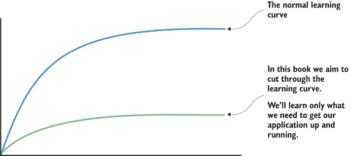
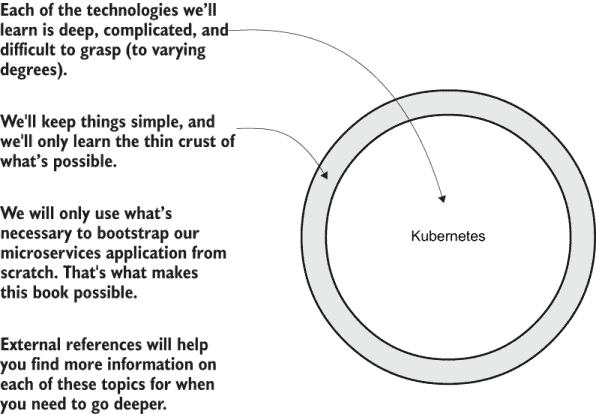
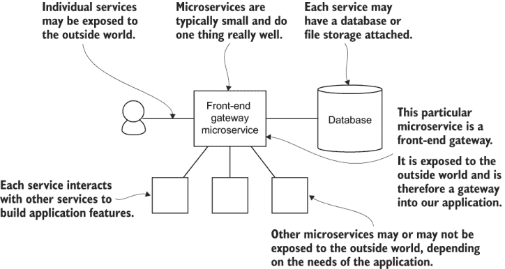
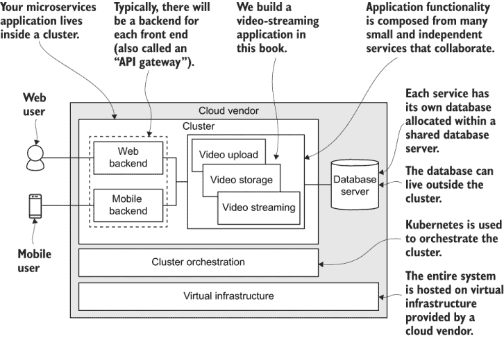
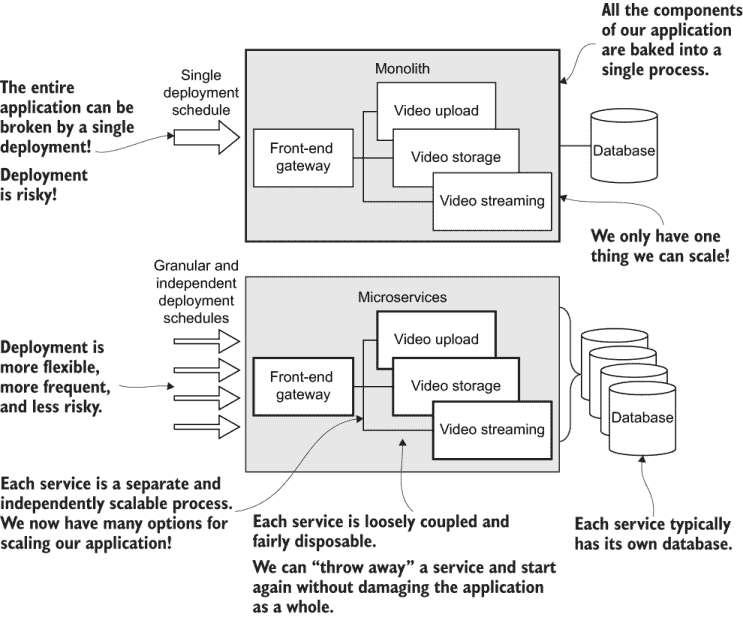
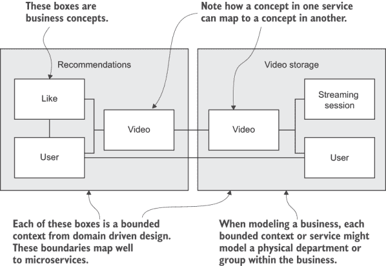
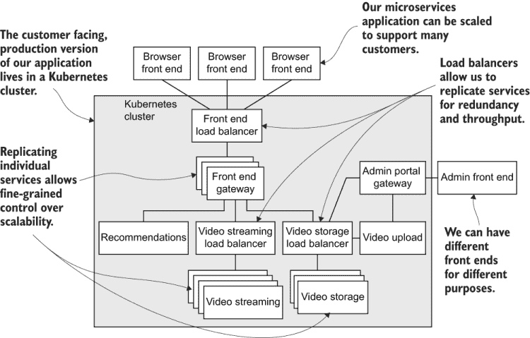

# 1 为什么是微服务？

本章节涵盖

+   本书的学习方法

+   微服务的什么和为什么

+   使用微服务的利弊

+   单体架构有什么问题？

+   微服务设计的基础知识

+   我们构建的应用程序的快速概述

随着软件的日益庞大和复杂，我们需要更好的方法来管理和减轻其复杂性。随着它随着我们的业务增长，我们需要更好的方法来分割它，以便多个团队能够参与到构建工作中。

随着我们苛刻的客户群的增长，我们也必须能够扩展我们的软件。同时，我们的应用程序应该具有容错能力，能够快速扩展以满足峰值需求。那么我们如何在演进和开发我们的应用程序的同时满足现代业务的需求？

微服务是一种在当代软件开发中扮演关键角色的架构模式。由微服务组成的*分布式应用程序*解决了这些问题以及更多，但通常比传统的*单体*应用程序更难设计、更复杂、更耗时。如果这些术语是新的——微服务、分布式应用程序和单体应用程序——它们将很快得到解释。

传统智慧认为微服务太难。我们被告知从“单体优先”开始，并在需要扩展时将其重构为微服务。但我认为这种态度并不能使构建应用程序的工作变得更容易！你的应用程序总是倾向于复杂性，最终你将需要对其进行扩展。当你决定需要改变时，你现在面临着一个极其困难的任务，那就是在员工和客户已经依赖它的情况下，安全地将你的单体架构转换为微服务。

现在也是构建微服务的完美时机。各种因素的汇聚——可访问且廉价的云基础设施、不断改进的工具以及自动化机会的增加——正在推动整个行业向更小、更小的服务发展，即*微服务*。随着时间的推移，应用程序变得更加复杂，但微服务为我们提供了更好的方法来管理这种复杂性。没有比现在更好的时间去“以微服务为先”。

在这本书中，我将向你展示，以微服务为先的方法不再像以前那样令人畏惧。我相信平衡已经坚定地倾向于微服务。剩下的问题是学习微服务是困难的。学习曲线陡峭，阻碍了许多开发者构建微服务的努力。我们将一起打破学习曲线。我们将对单体架构说“呸”，并从头开始构建一个简单但完整的视频流应用，使用微服务。

## 1.1 本书是实用的

你为什么在读这本书？你之所以在读这本书，是因为你想要或者需要构建一个微服务应用，这对于现代开发者来说是一个重要的技能集，但获得这个技能集却很困难，你需要一些指导。你可能已经读过其他关于微服务的书籍，并且还在 wonder *我从哪里开始？* 我理解你的困扰。

微服务的学习难度很大。你不仅要学习深入且复杂的工具，还必须学会构建分布式应用。这需要新的设计模式、协议和通信方法。在任何人看来，这都是一大堆要学习的内容。

在这本书中，我们突破了构建微服务应用看似无法逾越的学习曲线。当你独自面对时，你必须忍受的学习曲线可能看起来难以克服，但，而不是这样，我们将共同经历这个开发冒险。我们将尽可能简单开始，逐步构建，最终将应用部署到生产环境中。

这本书是关于突破学习曲线，启动一个可以无限期使用的、可不断更新和构建的应用，以满足我们客户和用户持续变化的需求。图 1.1 展示了突破学习曲线的概念。虽然我们的示例应用很小且简单，但从一开始，我们将构建可扩展性路径，以便将来将其扩展为一个真正的巨大分布式应用。

图 1.1 突破学习曲线。在这本书中，我们将只学习最基本的知识，仅够启动我们的应用。

这本书与其他所有关于微服务的书籍有什么不同？其他书籍明显是理论的。这对于一个经验丰富的开发者或架构师来说是一个很好的方法，他们想要扩展他们的知识，但通过这种方式获得实际技能是具有挑战性的，并且不能帮助你导航启动新应用的雷区。你在项目启动时做出的技术选择可能会长期困扰你。

这本书 *确实是* 不同的；这本书 *不是* 理论的。我们将采取实际的学习方法。书中穿插了一些理论，但我们实际上会构建一个实质性的微服务应用。我们将从零开始，逐步将应用带入存在并投入生产。我们将在我们的开发工作站（或个人电脑）上构建和测试应用，最终，我们将将其部署到云端。

我们将一起启动我们的微服务应用，而不必学习任何工具或技术的最深层细节。本书的学习模型示例如图 1.2 所示。

图 1.2 本书的学习模型。我们将对这些深奥而复杂的技术进行简要了解，只为启动我们的应用程序提供必要的部分。

这本书是关于从零开始构建微服务应用程序的。有些人已经问我为什么我没有写这本书来展示如何将单体转换为微服务应用程序？这是许多人想要学习的内容。

我以这种方式写这本书，因为从头开始学习如何编写应用程序比学习如何重构现有应用程序要容易得多。我也相信这些技能是有用的，因为随着时间的推移，越来越多的应用程序将以微服务优先的方式编写。

在任何情况下，重构现有应用程序都比构建全新的应用程序复杂得多。这是一个包含许多复杂变量的过程，并且高度依赖于遗留代码库的特定情况。我假设，一旦你了解了（实际上，一旦你亲身体验了）如何创建绿色田野（新）微服务应用程序，你将更容易找到自己的单体转换策略。

我可以向你保证，当你能够以微服务优先的方式构建应用程序时，你将更有能力清楚地看到从现有单体到微服务的路线。从单体到微服务的这一旅程无疑仍然会很有挑战性，所以请保持关注。在第十一章中，我们将更深入地讨论这个话题。

在整本书中，你将学习到具体实用的技术，以便将微服务应用程序启动起来。当然，有许许多多的方法和许多不同的工具可以用来实现这一点。我在教你一个单一的配方和一套工具（尽管是一个流行的工具集）。毫无疑问，你会发现许多改进这个配方和适应你自身情况的方法。当然，其他经验丰富的开发者已经拥有他们自己的配方来做这件事。我试图说的是，这是我的方法，这只是许多可行方法中的一种；然而，我可以证明我已经在生产中尝试了这本书中的每一个技术，并发现它们效果良好。所以，无需多言，让我们开始我们的学习和探索之旅。

## 1.2 我将学到什么？

在整本书中，我们将从简单到复杂逐步进行。我们将从最简单的任务——创建单个微服务开始。在 11 章中，我们将逐步构建一个更复杂的应用程序和基础设施，但我们将以增量步骤进行，这样你就不会迷失方向。阅读这本书并实践所教授的技能后，你可以期待能够

+   创建单个微服务

+   使用 Docker 打包和发布微服务

+   在你的开发工作站上使用 Docker Compose 开发微服务应用程序

+   使用 Jest 和 Cypress 测试你的代码、微服务和应用程序

+   将第三方服务器集成到你的应用程序中（例如 MongoDB 和 RabbitMQ 等）

+   使用 HTTP 和 RabbitMQ 消息在微服务之间进行通信

+   存储您的微服务运行所需的数据和文件

+   使用 Terraform 和 Kubernetes 创建生产基础设施

+   使用 Terraform 将微服务部署到生产环境中

+   创建一个持续交付管道，以便在更新代码时自动部署您的应用程序

## 1.3 我需要了解什么？

您可能会想知道，进入本书之前您需要了解什么。我努力编写这本书，尽可能少地假设您已经知道的内容。我们将从绝对的基础开始，一直深入到一些相当复杂的概念。我认为这里对每个人来说都有所帮助，无论您作为开发者的经验如何。

如果您对计算机编程有一些入门级理解，那么进入本书会更好。我认为您不需要太多，只要您能阅读代码并理解其功能即可。但请放心；我会尽可能多地解释代码中发生的重要事情。

如果您有编程背景，您将没有问题跟随本书中的示例。如果您在阅读本书的同时学习编程，您可能会发现这相当具有挑战性，但并非不可能，您可能需要做一些额外的工作。

本书使用 Node.js 作为微服务的示例，但一开始，您不需要了解 JavaScript 或 Node.js。您将在学习过程中获得足够的知识来跟随。本书还使用 Microsoft Azure 作为生产部署的示例。同样，一开始，您也不需要了解 Azure。

请放心，这本书不是关于 Node.js 或 Azure 的；它是关于使用 Docker、Kubernetes 和 Terraform 等现代工具构建微服务应用程序的。您从本书中学到的大多数技能都可以转移到其他语言和其他云服务提供商。因为我必须选择一个编程语言和云服务提供商来演示本书中的技术，所以我选择了 Node.js 和 Azure。这就是我目前在生产中主要使用的内容。

如果 Node.js 和 Azure 不是您所擅长，通过您的一些额外研究和实验，您将能够找出如何用您喜欢的编程语言替换 Node.js 和 JavaScript，并用您首选的云服务提供商替换 Azure。实际上，我最初选择使用 Docker、Kubernetes 和 Terraform 的主要原因正是这些工具提供了自由——选择编程语言的自由和摆脱云服务提供商锁定自由的自由。

## 1.4 管理复杂性

与任何应用一样，微服务应用随着时间的推移会变得更加复杂。但它们不需要从这种状态开始！这本书采取的方法是我们可以从一个简单的起点开始，并且每个开发迭代也可以同样简单。此外，每个微服务都是小巧简单的。当你阅读这本书时，你会发现使用微服务构建应用程序并不像你想象的那么困难（尽管有些人这么说）。

微服务为我们提供了一种在细粒度上管理复杂性的方法，这是我们几乎每天都在工作的层面——单个微服务的层面。在那个层面，微服务并不复杂。事实上，为了获得**微服务**这个名称，它们必须小巧简单。单个微服务旨在由单个开发者或小型团队管理！

虽然如此，但通过持续的开发和演变，一个复杂的系统将会出现。不可否认，微服务应用将会变得复杂。但这并不是立即发生的；它需要时间。在这个过程中，我们将使用微服务来管理你应用的增长复杂性，以便它不会成为负担。

微服务应用是一种**复杂自适应系统**的形式，其复杂性自然地从其组成部分的交互中产生。尽管整个系统可能过于复杂，以至于任何凡人都无法理解，但每个组成部分仍然保持小巧、可管理和易于理解。不过，不用担心；这本书中我们构建的示例应用并不复杂。

以这种微服务态度（在工具和自动化的帮助下）进行开发，使我们能够构建极其庞大且可扩展的应用程序，而不会被复杂性所压倒。而且，在阅读这本书之后，你将能够聚焦于最复杂的微服务应用的任何部分，并发现其组件简单易懂。

## 1.5 什么是微服务？

在我们能够理解微服务应用之前，我们首先必须理解什么是微服务。

定义 A **微服务** 是一个微小且独立的软件进程，它在自己的部署计划上运行，并且可以独立更新。

让我们分解这个定义。微服务是一个小型、独立的软件进程，它有自己的独立部署频率。也就是说，必须能够独立于其他微服务更新每个微服务。

微服务可以由单个开发者或一组开发者拥有和运营。开发者或团队也可能管理多个其他微服务。每个开发者/团队对其拥有的微服务负责。在现代编程世界中，这通常包括开发、测试、部署和运维。然而，我们可能会发现，当我们为一家小公司或初创公司（像我一样）工作，或者当我们在学习（正如我们在本书中所做的那样）时，我们必须自己管理多个微服务，甚至可能是一个完整的微服务应用程序。

一个单独的微服务可能对外界开放，以便我们的客户可以与之交互，或者它可能纯粹是一个内部服务，不可外部访问。它通常可以访问数据库、文件存储或其他一些状态持久化方法。图 1.3 展示了这些内部和外部关系。

图 1.3 一个单独的微服务可以连接到外部世界或其他服务，它也可以拥有数据库和/或附加的文件存储。

单独来看，一个微服务本身并不做什么。然而，一个设计良好的系统可以被分解成这样的简单服务。服务必须相互协作，以提供更大应用程序的功能和特性。这把我们带到了微服务应用程序的主题。

## 1.6 什么是微服务应用程序？

传统上，微服务应用程序被称为*分布式应用程序*，它是由存在于单独进程中的微小组件组成的系统，并通过网络进行通信。每个服务或组件都位于一个逻辑上独立的（虚拟）计算机上，有时甚至位于一个物理上独立的计算机上。

定义 一个*微服务应用程序*是由许多小型服务组成的分布式程序，这些服务协作以实现整个项目的特性和功能。

通常，一个微服务应用程序有一个或多个外部暴露的服务，以便用户可以与系统交互。图 1.4 显示了两个这样的服务作为基于 Web 和手机用户的网关。您还可以在图 1.4 中看到，许多服务在*集群*内部协同工作。它被称为集群，因为它是一组计算机，对我们（开发者）来说，它是一个单一的、统一的计算能力块，我们可以按照我们的意愿对其进行指导。附近我们还有一个数据库服务器。在图 1.4 中，它显示在集群之外，但它也可以轻松地托管在集群内部。我们将在第四章中更多地讨论这一点。

图 1.4 一个微服务应用程序由多个小型独立服务组成，这些服务在一个集群中运行。

集群托管在集群编排平台上，我们使用 Kubernetes 来完成这项任务。*编排*是我们服务的自动化管理。这正是 Kubernetes 为我们所做的一一它帮助我们部署和管理我们的服务。

集群本身、我们的数据库以及其他虚拟基础设施都托管在我们选择的云服务提供商上。我们将学习如何在 Microsoft Azure 上部署此基础设施，但通过你自己的努力，你可以更改本书中的示例以部署到 Amazon Web Services (AWS)或 Google Cloud Platform (GCP)。

微服务应用程序可以采取多种形式，非常灵活，可以安排以适应许多情况。任何特定的应用程序可能都有一个熟悉的整体结构，但其所包含的服务将执行不同的任务，这取决于我们客户的需要和我们的业务领域。

## 1.7 单体的弊端是什么？

单体是什么，它有什么问题，以至于我们宁愿使用微服务？尽管分布式计算已经存在了几十年，但应用程序通常以单体形式构建。这是在云革命和微服务之前，大多数软件开发的方式。图 1.5 显示了简单视频流应用程序中的服务可能的样子，并比较了应用程序的单体版本和微服务版本之间的差异。

定义：*单体*是一个运行在单个进程中的完整应用程序。

图 1.5 单体与微服务对比。你可以看到，使用微服务构建提供了许多相对于传统单体应用程序的优势。

与微服务应用程序相比，构建单体架构要容易得多。你需要的技术和架构技能更少。当构建一个新应用程序时，例如早期产品，你希望在投入微服务应用程序所需的高技术投资之前测试商业模式的有效性，这是一个很好的起点。

原型设计时，单体架构是一个非常好的选择。它也可能是一个范围较小或快速稳定且不需要在其生命周期内演变或增长的应用程序的最佳选择。如果你的应用程序始终如此小巧，那么将其设计为单体架构是有意义的。

决定是先单体后微服务，还是先微服务后单体，这是一个平衡行为，传统上是由单体获胜的。然而，在这本书中，我将向你展示，鉴于现代工具的改进以及廉价便捷的云基础设施，至少考虑先构建微服务架构是很重要的。

大多数产品通常需要成长和进化，随着你的单体架构变得更大，具有更多有用功能，就更加难以证明丢弃临时原型是合理的。所以，在未来的某个时候，你可能会发现自己被困在单体架构中，而此时你真正需要的是微服务应用的灵活性、安全性和可扩展性。

单体架构带来了一系列潜在问题。这些问题最初很小，我们总是怀有最好的意图，保持代码干净和井井有条。一支优秀的开发团队能够让单体架构保持优雅和井井有条多年。但随着时间的推移，愿景可能会丢失，有时一开始就没有强烈的愿景。所有代码都在同一个进程中运行，因此没有障碍，也没有什么可以阻止我们编写一团糟的意大利面代码，这种代码在以后几乎不可能拆分。

人员流动也产生了重大影响。随着开发人员离开团队，他们带走了关键知识，而新来的开发人员则需要建立自己对应用的思维模型，这可能与原始愿景相冲突。时间流逝，代码多次易手，这些负面因素共同导致代码库退化成所谓的“一团糟”。这个名字描述了当应用不再有可识别架构时的混乱状态。

更新单体架构的代码是一件风险很高的事情。要么全有，要么全无。当你推送一个破坏单体的代码更改时，整个应用将停止运行，你的客户将陷入困境，你的公司会损失金钱。我们可能只想更改一行代码，但仍然必须部署整个单体，并承担破坏它的风险。这种风险加剧了部署恐惧。恐惧减缓了开发速度。

此外，随着单体架构的结构退化，我们以不可预见的方式破坏它的风险增加。测试变得更加困难，并滋生更多的部署恐惧。我已经说服你尝试微服务了吗？等等，还有更多！

由于现有单体架构的规模庞大，测试变得困难，由于其极低的粒度级别，扩展也变得困难。最终，单体架构会扩展到消耗其运行的机器的物理极限。随着老化的单体架构消耗越来越多的物理资源，运行成本越来越高。我亲眼见过这种情况！公平地说，这种可能性对于任何单体架构来说可能还遥不可及，但即使只是几年增长，单体架构也会把你带到你不想去的地方。

尽管单体架构最终会遇到困难，但它仍然是启动新应用最简单的方式。难道我们不应该总是从单体架构开始，并在需要扩展时进行重构吗？我的回答是：*视情况而定*。

许多应用程序始终会保持小型。野外有大量的小型单体应用，它们能很好地完成工作，不需要扩展或进化。因为这些应用没有扩张，所以它们不会遭受增长带来的问题。如果你认为你的应用程序将保持小型和简单，并且不需要进化，那么你绝对应该将其构建为一个单体。

然而，有许多应用程序我们可以很容易地预测将受益于微服务优先的方法。这些是我们知道将在多年内持续进化的应用程序类型。其他可以从中受益的应用程序是那些需要灵活、可扩展或从一开始就有安全约束的应用程序。如果你从微服务开始构建这些类型的应用程序，那么构建起来会容易得多，因为将现有单体转换为微服务既困难又风险高。

当然，如果你需要首先验证你的商业想法，那么你可以通过最初构建一个单体来这样做。然而，即使在这种情况下，我仍然认为，有了合适的工具，使用微服务进行原型设计并不比使用单体原型设计困难多少。毕竟，单体如果不是一个单一的大型服务又是什么呢？

你甚至可以考虑使用本书中的技术来启动你的单体，将其作为一个单一服务在 Kubernetes 集群中。现在你拥有了两者之最佳！当需要分解为微服务的时候，你已经处于最佳位置去做这件事，并且在你方便的时候，你可以开始从单体中剥离微服务。并且，有了现代工具提供的自动化部署的便利性，拆解和重建你的应用程序或创建用于开发和测试的副本环境变得容易。如果你想要或需要首先创建一个单体，你仍然可以从本书中介绍的技术和工具中受益。

如果你确实从单体开始，为了你自己的精神健康，并且尽可能早地，要么丢弃它并替换它，要么逐步将其重构为微服务。我们将在第十一章中更多地讨论拆分现有单体的问题。

## 1.8 为什么微服务现在这么受欢迎？

为什么现在微服务似乎正变得越来越受欢迎？这是否只是一个短暂的潮流？

不，这并不是一个短暂的潮流。分布式计算已经存在很长时间，并且始终在单体应用之上拥有许多优势。然而，传统上，以这种方式构建应用程序更加复杂和昂贵。开发者只有在面对最苛刻的问题时才会寻求这些更强大的应用架构：那些解决方案的价值会超过实现成本的案例。

然而，近年来，随着云计算、虚拟化和自动化工具的创建，用于管理我们的虚拟基础设施，构建这样的分布式系统变得更加便宜。随着用分布式应用程序替换单体应用程序变得更加便宜，我们自然会考虑这种方法如何改善我们应用程序的结构。在这样做的时候，我们分布式系统的组件已经缩小到可能的最小尺寸，因此现在我们称之为 *微服务*。

正是因为这个原因，微服务现在很受欢迎。它们不仅通常是一种构建复杂现代应用的值得尝试的方法，而且它们也越来越具有成本效益。分布式计算比以往任何时候都更容易获得，因此自然有更多的开发者开始使用它。目前，它似乎正在接近临界质量，因此正在进入主流。

但为什么微服务如此优秀？它们是如何改善我们应用程序的结构？这个问题引出了微服务的优势。

## 1.9 微服务的优势

构建分布式应用程序带来了许多优势。每个服务都可能拥有自己的专用 CPU、内存和其他资源。通常情况下，我们在许多服务之间共享物理基础设施，这就是微服务具有成本效益的原因。但我们在必要时也可以将这些服务分离出来，以便为工作负载最重的服务分配专用资源。我们可以这样说，每个小型服务都是独立可扩展的，这使我们能够精细调整应用程序的性能。在本节中，我们将探讨这些优势：

+   *允许精细控制*- 微服务使我们能够对可扩展性进行精细控制

+   *最小化部署风险*- 微服务帮助我们最小化部署风险，同时最大化开发速度

+   *允许选择自己的技术栈*- 微服务使我们能够为手头的任务选择合适的技术栈，这样我们就不会局限于单一的技术栈

拥有分布式应用程序为我们提供了更好的可靠性和降低部署风险的可能性。当我们更新特定服务时，我们可以这样做，而不会冒着破坏整个应用程序的风险。当然，我们仍然可能冒着破坏应用程序一部分的风险，但这比关闭整个应用程序更容易恢复。当出现问题时，只需回滚系统的一小部分，而不是整个系统，这要容易得多。降低部署风险对促进频繁部署有连锁反应，这对于敏捷性和保持快速的开发速度至关重要。

这些好处并不是什么新鲜事。毕竟，我们已经构建了分布式应用程序很长时间了，但这样的系统现在建造成本更低，工具也更好了。以这种方式构建应用程序并从中获益比以往任何时候都更容易。随着成本的降低和部署便利性的增加，我们的服务倾向于向微级别发展，这也带来了它自己的配套好处。

较小的服务启动比大型服务快。这有助于使我们的系统更容易扩展，因为我们可以快速复制任何过载的服务。较小的服务也更容易进行测试和故障排除。尽管测试整个系统仍然可能很困难，但我们更容易证明它的每个部分都在按预期工作。

使用许多小型且可独立升级的部分构建应用程序意味着我们可以拥有一个在其生命周期内更容易扩展、演变和重新排列的应用程序。我们强制在组件之间建立流程边界的事实意味着我们永远不会被诱惑去编写意大利面代码。实际上，如果我们确实编写了糟糕的代码（我们都有糟糕的日子，对吧？），糟糕代码的影响将被控制和隔离，因为每个微服务（为了获得这个名字）应该足够小，以至于可以在几周甚至几天内被丢弃并重新编写。从这个意义上说，我们正在*设计我们的代码以供丢弃*。我们正在设计它以便随着时间的推移进行替换。我们应用程序的持续和迭代替换不仅成为可能，而且被积极鼓励，这正是我们应用程序架构能够适应现代商业不断变化需求的关键。

对于使用微服务的开发者来说，另一个真正令人兴奋的好处是我们不再受限于为我们的应用程序使用单一技术栈。我们应用程序中的每个服务都可能包含任何技术栈。对于大型公司来说，这意味着不同的团队可以选择自己的技术栈；他们可以根据自己的经验或根据最适合当前工作的技术栈来选择。各种技术栈可以存在于我们的集群中，并使用共享协议和通信机制协同工作。

能够在技术栈之间进行切换对于应用程序的长期健康至关重要。随着技术领域的不断演变，就像它总是做的那样，旧的技术栈会失去优势，最终必须被新的技术栈所取代。微服务创建了一种可以逐步转换为更新技术栈的结构。作为开发者，我们不再需要滞留在过时的技术上了。

技术栈（tech stack）

你的技术栈是你构建每个微服务所使用的工具、软件和框架的组合。你可以将其视为你的应用程序所需的基本基础元素。

一些栈有名字。例如，MEAN（Mongo, Express, Angular, Node.js）或 LAMP（Linux, Apache, MySQL, PHP）。但你的栈只是你使用的工具的组合，它不需要名字就是有效的。

当构建单体应用时，我们必须选择一个技术栈，并且必须在这个栈上保持不变，直到单体应用停止运行。微服务架构之所以吸引人，是因为它给了我们在一个应用程序中使用多个技术栈的潜力。这允许我们在应用演变的过程中随着时间的推移改变我们的技术栈。

## 1.10 微服务的缺点

本章如果不讨论人们与微服务相关的两个主要问题，就不会完整：

+   微服务更难

+   人们常常害怕复杂性

第一个问题是陡峭的学习曲线。学习如何构建微服务需要你学习不仅仅是复杂的技术组合，还要学习构建分布式应用的原则和技术。虽然学习如何构建微服务是困难的，但这本书将帮助你缩短学习曲线。

注意，我能够理解如果你对面前的东西感到畏惧。但最近，在构建分布式应用的工具开发方面取得了巨大的进步。我们的工具现在更加复杂，更容易使用，最重要的是，比以往任何时候都更加*自动化*。

现在，一个经验丰富的开发者现在能够独立启动微服务应用程序，而不需要团队的支持。我知道这一点，因为我已经为多家初创公司做过多次。尽管如此，我还是很惊讶一个人能取得多大的成就。我们将在第十一章中更多地讨论初创公司、小型团队和独立开发者如何快速有效地与微服务合作。

公平地说，工具仍然很复杂。通常，你需要数月甚至更长时间才能独自克服学习曲线——掌握这些工具需要大量的时间！但本书采取了不同的方法。我们将一起学习启动我们的应用程序并使其在生产中运行所需的最基本知识。我们将一起创建一个简单但实用的微服务应用程序。在这个过程中，我们还将学习构建分布式应用的基础知识。

正如我提到的，微服务开发者实际上面临两个问题。第二个问题是构建微服务应用程序，实际上任何分布式应用程序，都将比构建等效的单体应用更复杂。这一点很难反驳。我首先想说，是的，构建单体应用在开始时更简单，在许多情况下这是正确的决定。如果你的应用程序是那些必须后来转换为微服务或重构的应用程序之一，那么你应该考虑解开你的大泥球最终的成本。

不要被复杂性吓倒；无论你是否喜欢，它都会发生。幸运的是，微服务为我们提供了管理复杂性的具体方法。

如果你仔细思考，你可能会承认，至少在某些情况下，构建微服务实际上比构建单体应用程序更简单。如果这次讨论还没有说服你，考虑这一点：*任何*重要的应用程序最终都会变得复杂。如果不是一开始，它*将会*随着时间的推移变得更加复杂。你无法在现代软件开发中隐藏复杂性，它*总是*最终会追上你。相反，让我们控制这种局面，直面复杂性。我们想要的更好的工具来帮助我们管理复杂性。微服务作为一种架构模式就是这样一种工具。

将微服务视为将痛苦提前，到一个处理起来更经济的地方的方法。为此痛苦，我们得到了什么回报？微服务为我们提供了管理应用程序复杂性的具体方法。它们提供了硬边界，防止我们编写意大利面代码。微服务使我们能够更容易地重新布线我们的应用程序，随着时间的推移进行扩展和升级。微服务还迫使我们应用更好的设计。我们无法阻止复杂性，但我们可以管理它，而现代分布式应用程序的工具已经在这里帮助我们了。

## 1.11 微服务的现代工具

这本书全部关于工具。我们将一起学习许多不同工具的基础知识。首先，我们必须能够创建一个微服务。我们将使用 JavaScript 和 Node.js 来完成这项工作，下一章将教你这方面的基础知识。

我们使用 Node.js，因为那是我的选择。然而，就微服务而言，服务内部的技术堆栈并不特别重要。我们同样可以用 Python、Ruby、Java、Go 或几乎任何其他语言来构建我们的微服务。在我们旅途中，我们将遇到许多工具，但这些都是最重要的：

+   *Docker* —打包和部署我们的服务

+   *Docker Compose* —在开发工作站上测试我们的微服务应用程序

+   *Kubernetes* —在云端托管我们的应用程序

+   *Terraform* —构建我们的云基础设施，我们的 Kubernetes 集群，并部署我们的应用程序

技术景观总是在变化，工具也是如此。那么，为什么我们应该学习任何特定的工具集，当工具不断过时并被取代时？嗯，这是因为我们始终需要好的工具来有效地工作。有了更好的工具，我们可以做得更好，或者也许我们只是更有效地完成同样的工作。无论如何，这有助于我们提高生产力。

我选择这本书的工具，因为这些工具可以显著简化构建微服务应用程序的工作，并使其更快。所有技术都会随时间而变化，但我认为这些特定的工具不会很快消失。它们很受欢迎，目前是我们拥有的最好的工具，并且都在一个人的工具箱中占据有用的位置。

当然，这些工具最终会被取代，但希望在这段时间里，我们能够从这些工具中提取出显著的价值，并构建许多优秀的应用程序。当工具发生变化时，它们肯定会由更好的工具所取代，这些工具将进一步提高抽象层次，使我们的工作更加容易，减少挫败感。

Docker 是所有工具中几乎无处不在的一个。它似乎是从无到有，并接管了我们的行业。另一方面，Kubernetes 并不像 Docker 那样无处不在，尽管它确实有一个强大的未来，因为它允许我们超越云供应商的界限。如果你曾经感到被特定的云提供商所困，这是一个好消息。我们几乎可以在任何云平台上运行基于 Kubernetes 的应用程序，并在需要时拥有行动的自由。

Terraform 是一个相对较新的工具，但我认为它是一个变革者。它是一种声明性配置语言，允许我们编写脚本以创建云资源并部署我们的服务。Terraform 的重要之处在于，它是一种可以与任何潜在云供应商一起工作的单一语言。无论你现在或将来选择哪个云供应商，Terraform 很可能都会支持它，你不需要学习新的东西。

想想看：*Terraform 意味着我们可以轻松地用代码创建云基础设施*。这真是个大事情！在过去，我们不得不辛苦地物理拼接基础设施，但现在我们能够用代码来创建它。这个概念被称为*基础设施即代码*，它是*持续交付*的关键推动力，这在第七章中我们将探讨的现代软件开发中的重要内容。

## 1.12 设计微服务应用程序

这不是一本关于理论的书籍，但在我们进入实际内容之前，我必须简要提及一些软件设计方面。我保证这只是一些基础原则，而且有很多其他书籍可以帮助你在这一领域打下更好的基础。

在一开始，我想说，设计微服务应用程序与设计任何软件并没有太大的不同。你可以阅读任何关于软件设计的优秀书籍，并将相同的原理和技术应用于微服务。我没有太多严格遵循的规则，但我认为这些规则特别重要：

+   不要过度设计或试图使你的架构具有前瞻性。从你应用程序的简单设计开始。

+   在开发过程中应用持续重构，以保持其尽可能简单。

+   让一个好的设计自然出现。

我觉得最后一个规则特别受到微服务的鼓励。你无法预先规划一个大的微服务应用程序。架构必须在开发过程中以及应用程序的生命周期中逐渐显现。

我并不是说你不应该做任何规划。你肯定应该在开发的每个阶段进行规划。我想说的是，你应该为你的计划可能发生变化做好准备！你应该能够快速应对变化的情况，这也是微服务所支持的另一个优点。抛开规则不谈，让我们简要讨论三个似乎特别适用于微服务的原则：

+   单一职责原则

+   松散耦合

+   高内聚

通常，我们希望每个微服务尽可能小和简单。一个单独的服务应该只覆盖业务的一个概念领域。也就是说，每个服务应该有一个单一、明确的职责区域。这通常被称为**单一职责原则**。

微服务应该是**松散耦合**并且具有**高内聚**。松散耦合意味着服务之间的连接最小化，并且除非必要，它们不共享信息。当我们减少微服务之间的连接和依赖关系时，我们使得升级单个服务而不会导致问题在应用程序中传播变得更容易。松散耦合帮助我们拆分并重新布线我们的应用程序，使其进入新的配置。这使得我们的应用程序更加灵活，能够对业务变化的需求做出快速响应。

微服务内部包含的代码应该是高度内聚的。这意味着微服务中的所有代码都*属于一起*，并有助于解决服务职责区域内的难题。如果一个微服务解决了一个以上的问题或有一个更大的职责区域，那么这表明它不是高度内聚的。

一种非常适合微服务的架构范式被称为**领域驱动设计**（DDD）。使用 DDD 是理解业务领域并作为软件来建模业务的一个很好的方法。这种技术源自埃里克·埃文斯（Eric Evans）所著的《领域驱动设计》（Domain Driven Design）一书（2003 年）。我自己多次使用过它，并发现它非常适合设计分布式应用程序。具体来说，*边界上下文*的概念非常适合微服务的边界，如图 1.6 所示。

图 1.6 领域驱动设计（DDD）中的边界上下文等同于微服务的边界。

此图显示了我们的视频流领域中的概念边界可能如何适应微服务。例如，*用户*、*点赞*和*视频*等概念存在于我们的微服务中，而某些概念（如视频）创建了微服务之间的关系。例如，在图 1.6 中，视频的概念在推荐和视频存储微服务之间几乎是相同的（但可能会有所不同）。

有一个编码原则似乎正受到微服务的攻击。许多开发者遵循“不要重复自己”（DRY）的座右铭。但在微服务的世界中，我们正在发展出比以前认为可接受的高容忍度来容忍重复的代码。

微服务应用中的硬边界过程无疑使得代码共享变得更加困难，而领域驱动设计（DDD）的实践似乎鼓励复制概念，如果不是复制代码。此外，当微服务由不同的团队拥有时，我们就会遇到团队之间已经存在的所有共享代码的障碍。

请放心，有很好的方法在微服务之间共享代码，我们不会简单地抛弃 DRY 原则。当这样做有意义时，我们仍然希望在微服务之间共享代码。

## 1.13 一个示例应用

到这本书的结尾，我们将构建一个简单但完整的微服务应用。在本节中，我们将形成一个关于最终产品外观的概念。

我们将要构建的示例产品是一个视频流应用。每个优秀的产品都值得一个名字，所以在经过多次头脑风暴和提出各种想法之后，我最终选择了“FlixTube”，这是视频流世界的未来之王。不是吗，总得从某个地方开始？

为什么选择视频流作为示例？简单来说，这是一个有趣的例子，而且出人意料地容易创建（至少在简单形式上）。它也是微服务的一个知名用例，Netflix 成功地将其推向了极致。（报道各有不同，但我们知道他们运行了成百上千个微服务。）

我们将使用 FlixTube 示例应用来展示构建微服务应用的过程。它将只有少数几个微服务，但我们将内置未来可扩展性所需的路径，包括向集群添加更多虚拟机、复制服务以实现规模和冗余，以及将服务提取到单独的代码仓库，以便它们可以拥有单独的部署计划并由不同的团队管理。

我们的应用程序将有一个基于浏览器的前端，让我们的用户可以查看视频列表。从那里，他们可以选择一个视频，它就会开始播放。在开发过程中，我们将使用 Docker Compose 启动我们的应用程序，我们将在第四章和第五章中介绍。我们将在第三章中构建和发布我们的微服务 Docker 镜像。在第六章和第七章中，我们将部署我们的应用程序到生产环境。在第八章中，我们将回到开发阶段进行一些自动化测试。

我们的应用程序将包含视频流、存储和上传的服务，以及面向客户的网关。我们将在第九章中部署完整的应用程序，如图 1.7 所示。在第十章和第十一章中，我们将探讨这种架构如何帮助我们随着应用程序的增长而扩展。你准备好开始使用微服务构建了吗？

图 1.7 我们示例应用程序在生产环境中运行在 Kubernetes 上。

## 摘要

+   我们采取的是一种实用而非理论的方法来学习如何构建微服务应用程序。

+   微服务是小型且独立的进程，每个进程都擅长做一件事。

+   微服务应用程序由许多小型进程组成，它们共同工作以创建应用程序的功能。

+   单体是一个由单个大型服务组成的应用程序。

+   虽然构建微服务应用程序比构建单体更复杂，但并不像你想象的那么困难。

+   由微服务构建的应用程序比单体应用程序更灵活、可扩展、可靠和容错。

+   Docker、Kubernetes 和 Terraform 等现代工具的结合使得构建微服务应用程序比以前更容易。

+   领域驱动设计（DDD）是设计微服务应用程序的有效方法。

+   DDD 中的边界上下文很好地映射到微服务的边界。

+   我们预览了本书中将构建的示例应用程序。
