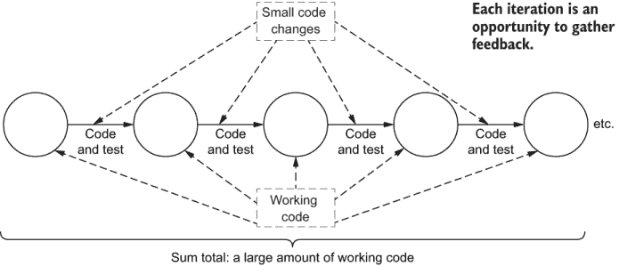
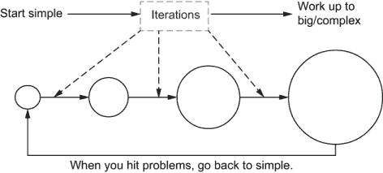
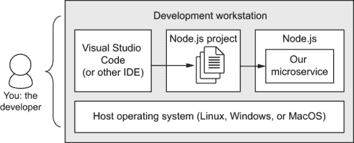
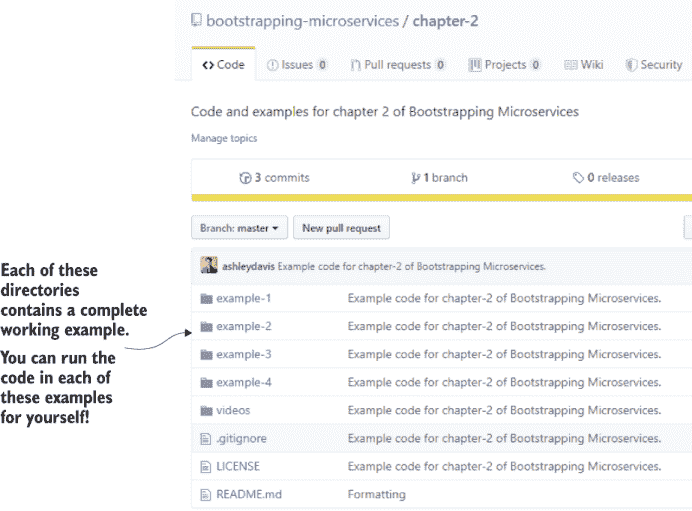
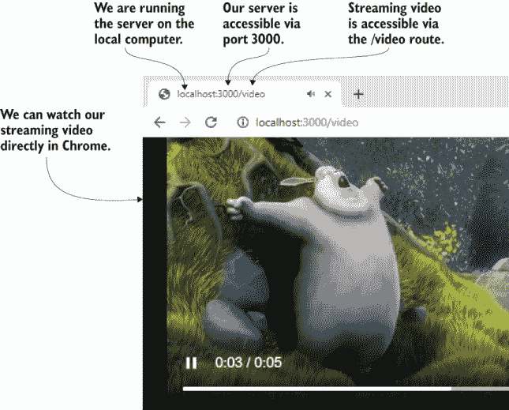
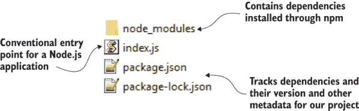
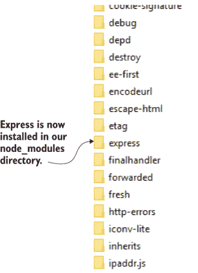
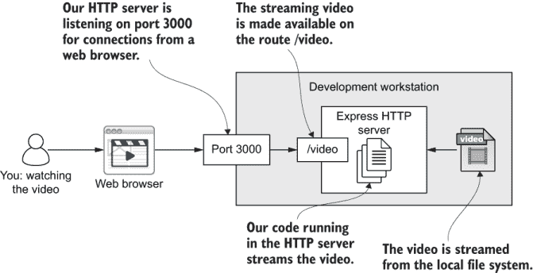
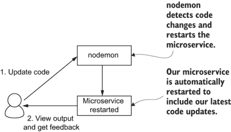

# 2 创建你的第一个微服务

本章涵盖

+   我们的开发哲学

+   建立单一服务的开发环境

+   构建视频流微服务

+   生产环境和开发环境的设置

+   使用 Node.js 运行我们的微服务

我们这本书的目标是组装一个由多个微服务组成的应用程序。但在我们能够构建多个微服务之前，我们首先必须学会如何构建单个微服务。

因为我们必须从某个地方开始，在本章中，我们将创建我们的第一个微服务。这是一个简单的微服务，做得很少，但它说明了这个过程，以便你可以理解并重复它。实际上，这就是我们将通过本书的进程来创建多个微服务的方法。

这个第一个微服务是一个简单的 HTTP 服务器，它向在网页浏览器中观看的用户提供流媒体视频。这是我们通往构建 FlixTube（我们的视频流应用）道路上的第一步。视频流可能听起来很困难，但在这个阶段我们检查的简单代码不应该带来太多麻烦。

在这本书中，我们的微服务是用 JavaScript 编写的，并在 Node.js 上运行。但重要的是要注意，我们可以为我们的微服务使用任何技术栈。使用微服务构建应用程序给了我们在技术栈选择上很大的自由度。

你不必使用 JavaScript 来构建微服务。你可以同样容易地使用 Python、C#、Ruby、Java、Go 或你阅读这本书时流行的任何语言来构建你的微服务。然而，我必须做出选择，因为这是一本实用的书，我们需要深入实际的编码细节。但请记住，你可以同样容易地使用你自己的首选编程语言来构建你的微服务。

我们即将开始对 Node.js 进行快速浏览。当然，我们无法涵盖所有细节，正如本书的主题，我们只会简要地介绍可能的内容。在本章结束时，你将找到关于 Node.js 的其他书籍的参考，以便深入了解。

如果你已经熟悉 Node.js，那么你会发现本章的大部分内容都很熟悉，你可能想跳过它。但请快速浏览一下，因为其中有一些关于设置开发环境、准备生产部署以及为快速迭代开发做准备的重要提示，这些内容将在整本书中用到。

带好你的帽子！这本书一开始很简单，但很快就会变成一段非常刺激的旅程。

## 2.1 新工具

因为这本书全部关于工具，所以在大多数章节中，我们都会从您需要安装的新工具开始，以便跟随章节中的示例。从我们的第一个微服务开始，表 2.1 展示了我们需要使用的工具：Git、Node.js 和 Visual Studio (VS) Code。我们将使用 Git 获取代码。我们将使用 Node.js 运行和测试我们的第一个微服务，并使用 VS Code 编辑我们的代码和 Node.js 项目。

在本书中，我会告诉您每个工具的版本号，这些工具用于开发本书中的示例。这将为您提供可以用来跟随示例的版本号。

这些工具的后续版本也应该可以工作，因为好的工具通常具有向后兼容性，但偶尔的版本重大更新可能会破坏旧示例。如果发生这种情况，请通过在 GitHub 上记录问题（见下一节）来通知我。

表 2.1 第二章中引入的工具

| 工具 | 版本 | 用途 |
| --- | --- | --- |
| Git | 2.27.0 | 版本控制是日常开发中不可或缺的一部分，在本章中，我们使用 Git 获取第二章的代码副本。 |
| Node.js | 12.18.1 | 我们使用 Node.js 运行我们的微服务。 |
| Visual Studio (VS) Code | 1.46.1 | 我们使用 VS Code 编辑我们的代码和其他资产。 |

当然，您可以使用其他一些集成开发环境（IDE）或文本编辑器来编辑您的代码。我推荐 VS Code，因为它不会出错！

## 2.2 获取代码

本书附带许多工作示例项目。每个项目的代码都可在 GitHub 上找到。您可以在那里克隆或下载代码仓库，以跟随书中的示例。我强烈建议您在阅读本书时运行这些示例。这是您获得实践经验并充分利用学习效果的最佳方式。

按照标准惯例，这些示例易于运行，并且都具有类似的设置。一旦您了解了基础知识（我们将介绍），您会发现运行这些示例很容易。随着我们的进展，示例会变得更加复杂，但我仍会尽量让它们易于访问，解释它们的工作原理，并帮助您启动和运行。

要找到 GitHub 上的 Bootstrapping Microservices 组织，请将您的网络浏览器指向 [`github.com/bootstrapping-microservices`](https://github.com/bootstrapping-microservices)。在这里，您将看到按章节组织的代码仓库集合，从本章的 chapter-2 仓库开始。

每章都有自己的代码仓库，例如，[`github.com/bootstrapping-microservices/chapter-2`](https://github.com/bootstrapping-microservices/chapter-2)。在每个仓库下，您可以找到按本章中列出的示例项目组织的代码。如果您发现代码有任何问题，或者您在尝试运行它时遇到困难，请在 GitHub 上针对相应的代码仓库记录问题，以便我可以帮助您使其工作。

## 2.3 为什么选择 Node.js？

在这本书中，我们使用 Node.js 来构建我们的微服务。为什么是 Node.js 呢？构建微服务的一个优点是我们可以选择我们喜欢的技术栈。我恰好喜欢 Node.js，但我选择它的原因还有其他。

使用 Docker（我们将在第三章中探讨）构建我们的微服务意味着我们可以从多个技术栈中组合应用程序。这听起来可能像会让事情变得更复杂，而且可能确实如此，但它给了我们混合和匹配技术的能力。我们可以用它来确保我们使用的是每种情况下最合适的栈。

注意，Node.js 非常适合构建微服务。它是面向网络的，并且性能高。我们计划构建许多服务，所以让我们善待自己，选择一个让我们的工作变得更简单的平台。

Node.js 也非常流行且广为人知。这听起来可能不多，但很重要，因为它意味着围绕 Node.js 有一个由人、工具和资源组成的生态系统。在你需要帮助时有一个庞大的社区可以依靠是很重要的。这使得在学习过程中寻找帮助变得更加容易，而且在持续软件开发期间得到支持也是一件好事。

Node.js 是为微服务而生的。从名字上就能看出这一点。"Node"暗示了它在构建基于分布式网络的应用程序节点方面的用途。（JavaScript 从 11 年前开始从浏览器中移出，并从此确立了自己作为一款极富竞争力的服务器端编程语言的地位。）

Node.js 是为创建小型、高性能和轻量级服务而生的，它摒弃了其他许多平台带来的负担。在 Node.js 中构建 HTTP 服务器是微不足道的。这使得我们能够快速启动新的微服务变得容易。这是一个很好的动力，因为我们计划创建许多小型服务。Node.js 对这本书来说也很方便，因为它意味着你不需要花很多时间学习如何编写基本的微服务代码，而且正如你很快就会看到的，我们可以使用 Node.js 用很少的代码构建微服务。

使用 JavaScript 可以促进全栈编程。如今，JavaScript 几乎无处不在。我们可以在应用程序的后端使用它来构建微服务。我们也可以在基于 Web 的前端使用它（当然，JavaScript 就是从这里诞生的）。不仅如此，我们还可以使用 JavaScript 进行桌面开发（Electron）、移动开发（Ionic）、嵌入式开发（物联网设备）。正如我在上一本书《用 JavaScript 进行数据处理》中展示的那样，我们还可以在处理数据时使用 JavaScript，而数据领域通常由 Python 主导。尽可能多地使用 JavaScript 意味着我们可以在应用程序的任何地方自由穿梭，而不会触发心理上的上下文切换。

我们从 Node.js 获得的另一件大事是 *npm*，即 Node 包管理器，这是一个用于安装 Node.js 代码库的命令行工具。这并不特别与构建微服务相关，但拥有一个出色的包管理器和大量开源包在指尖上是非常有用的。作为开发者，我的超级能力是拥有超过 350,000 个代码库（截至 2017 年报道时）并且可以轻松访问。无论我需要做什么，通常只需进行一次快速的 npm 搜索即可！

注意 Node.js 是开源的，你可以在 GitHub 上找到它的代码，网址为 [`github.com/nodejs/node.`](https://github.com/nodejs/node)

什么是 npm？

Npm 是 Node 包管理器。它是一个与在线 npm 仓库通信的命令行应用程序，允许你在 Node.js 项目中管理第三方包。安装现成的包是快速解决你原本需要编写更多代码才能解决的问题的方法！你可以在 npm 网站上搜索包，网址为 [`www.npmjs.com`](https://www.npmjs.com)。

## 2.4 我们的开发哲学

在我们开始编码之前，我想简要介绍一下我的开发哲学，我们将在这本书的整个过程中使用它。你将看到这一点会反复出现，所以一个简短的解释是必要的。我将用以下三个要点总结我的开发哲学：

+   迭代

+   保持其工作状态

+   从简单到复杂

*迭代* 是关键因素。我指的是个人编码迭代，而不是敏捷中通常被称为冲刺的更大迭代。我们通过一系列个人迭代构建应用程序的代码。我们将像图 2.1 所示那样，一次迭代一次地添加代码。每次迭代都会给我们反馈。反馈使我们能够发现我们是否偏离了轨道，并立即进行课程修正。快速迭代使我们能够将我们的工作与不断发展的目标紧密对齐。

注意 小而快速的编码增量对于高效的软件开发者是必不可少的。

在每次迭代中，我们进行少量的编码。多小？这取决于我们正在做什么以及有多难。但关键是它应该足够小，以至于我们可以轻松理解和测试我们刚刚编写的代码。

每次迭代都必须产生可工作和经过测试的代码。这是最重要的因素。你有没有输入过一整页的代码然后挣扎数小时才让它工作？当我们以小而经过良好测试的代码迭代工作，一天编码结束时，累积的结果是一大块 *可工作* 的代码。你可以在图 2.1 中看到这是如何工作的。



图 2.1 一系列小的代码更改最终产生大量可工作的代码。

产生大量可工作代码的概念展示了我的第二个要点：**保持其工作状态**。如果我们以小、易于测试的增量工作，我们很少会遇到麻烦。当输入大量代码时，我们面临许多困难，使代码工作。很可能会有一大堆损坏（不可工作）的代码。但即使代码看起来似乎可以工作，它可能仍然隐藏着许多尚未发现的“坏东西”。

注意，每次小的编码迭代都应该产生可工作且经过测试的代码。一系列此类迭代的总和将产生大量坚如磐石的代码。

当我们遇到麻烦时，我们可以轻松地将代码回滚到先前的迭代，以恢复其工作状态。因为我们的代码迭代很小，所以在需要回滚时，我们不会失去太多进度。遇到麻烦根本就不是什么麻烦！

当然，恢复先前的迭代意味着您正在将代码提交到 Git 或其他形式的版本控制中。这一点不言而喻。即使您没有使用版本控制（您真的应该使用），那么找到另一种方式来保存迭代结果的责任就落在您身上。

我的编程哲学中的第三和最后一个要点是**从简单开始**。我们应该从最简单的起点开始编码，并逐步迭代我们的应用程序以增加复杂性。所有应用程序都会随着时间的推移而变得复杂；从长远来看，这是不可避免的。但我们绝对不应该从复杂性开始。不要试图一次性以“大爆炸”的方式构建一个复杂的系统。这可能不会对您产生好的结果。

注意，复杂性是应用程序**总是**会达到的地方，但这并不意味着它们必须从那里开始。每次代码更改也应该简单，避免在任何单一迭代中引入过多的复杂性。

从最简单的代码开始，然后通过一次迭代一次迭代地构建，您可以将其构建得更加复杂。这个过程如图 2.2 所示。不要急于承担复杂性。尽可能保持简单。随着我们的应用程序变得越来越复杂，我们需要引入工具、技术、流程和模式来帮助我们管理这种复杂性。

使用微服务构建是管理复杂性的一个工具。再次强调，任何给定的微服务都应该简单。它应该小巧。对现有微服务进行小更新应该容易。将新的微服务添加到现有应用程序中应该毫不费力。即使应用程序本身已经变得极其复杂，这些说法也是正确的。

随着我们的代码变得更加复杂，这并不意味着我们的迭代也需要这样。我们应该努力保持每次代码修改尽可能简单。简单的更改易于理解，更容易测试，并集成到应用程序中。所有这些都有助于提高正在发展的系统继续按我们希望的方式表现的概率。

小贴士：在解决复杂应用程序中的问题时，不要害怕将问题从应用程序中提取出来，并在更简单的环境中重现它。如果你能用更少的代码隔离一个问题，那么这个问题就有更少的空间来隐藏！

如果我们在一个复杂的应用程序中遇到难以解决的问题，我们现在有一个新的选择。如图 2.2 所示，箭头从末端回到起点，在任何时候，我们都可以从复杂的应用程序中提取出有问题的代码，并在一个更简单的环境中重现它。



图 2.2 从简单开始，通过一系列小迭代逐步过渡到复杂

幸运的是，当用 JavaScript 编码时，这相当容易做到。我们可能会在单元测试中加载我们的代码，这样我们就可以反复运行代码来调试和修复它。如果这不可能，我们可能会将代码提取到一个单独的 Node.js 项目中，以隔离问题并使其更容易解决。我经常启动 Data-Forge Notebook（一个我构建并公开发布的应用程序）来运行隔离的代码，使其更容易解决问题。

但如果我们无法轻松提取代码怎么办？在这种情况下，我喜欢做的就是围绕有问题的代码拆解应用程序。尽可能地将代码从应用程序中提取出来（直到你尽可能好地隔离了问题）。

我们为什么要这样做呢？这是因为当你隔离了一个问题，它就没有藏身之处。发现问题通常比发现问题后解决它们要花费更多的时间。因此，拥有更快的方法来定位我们代码中问题的位置，是我们提高生产力的最佳方式之一。我们将在第十章中更多地讨论调试过程和隔离问题。

这也是我们喜欢微服务的一个原因。我们的应用程序已经模块化了，因此我们应该能够轻松地移除非必要的微服务。话虽如此，以这种方式从应用程序中删除代码确实是一种高级技术，很容易导致应用程序损坏！

我在这里阐述我的开发哲学，因为我认为它可以帮助你成为一个更好、更高效的开发者。我们的软件通过小而经过充分测试的增量进行演变，这是我们的主要目标。我们将代码从一个工作状态迭代到另一个工作状态。我们的代码在任何时候都不应该出现根本性的错误。

你将在本章以及整本书中看到这一哲学在行动。从简单开始。从小处着手。通过小步迭代。保持其运作。不知不觉中，我们将构建出庞大而复杂的成果！但这并不是一蹴而就的。它是通过一系列小变化实现的，这些变化累积起来，最终成为巨大的成就。

## 2.5 建立我们的单一服务开发环境

要创建和开发微服务，我们需要设置我们的开发环境。这为我们提供了一个创建和编辑代码的方法，然后运行它以确保它工作。在本章中，我们将构建一个单微服务，并直接在我们的开发工作站（或个人电脑）上使用 Node.js 运行它。我们将使用 VS Code 或其他你选择的 IDE 或文本编辑器来编辑我们的代码。让我们从设置我们的环境开始。|

Node.js 本身易于在任何主要操作系统上安装和运行，因此你可以选择 Linux、Windows 或 MacOS 来开发你的微服务。（你的选择在表 2.2 中总结。）|

在 Node.js 下直接运行单个服务相当简单，正如你将在本章接下来的部分中看到的那样。但是，当涉及到开发测试多个微服务时，我们将在第四章中介绍，事情会变得更加复杂。那时，我们将需要借助 Docker（从第三章开始）的帮助。现在，让我们专注于在我们的选择操作系统下直接在 Node.js 下运行我们的微服务。|

即使我们在开发、测试和调试多个微服务之后，在开发、测试和故障排除过程中，我们有时也会想要将单个微服务从应用程序中提取出来单独运行，以便我们可以专注于这个隔离的部分，而无需担心整个应用程序及其带来的所有负担。拥有一个单服务开发环境不仅是在早期阶段的一个方便的垫脚石，而且在持续开发过程中随时可以投入使用。|

表 2.2 运行 Node.js 的选项|

| 平台 | 备注 |
| --- | --- |
| Linux | Node.js 是为 Linux 构建的，因此在 Linux 上运行得相当不错！在本章中，我将大多数命令演示在 Ubuntu Linux 上。如果你也在使用 Ubuntu 或其他 Linux 变体，你将能够很好地跟随书中的示例。 |
| Windows | Node.js 也在 Windows 下运行良好。实际上，我大部分日常的开发、测试和故障排除都是使用 Windows。 |
| MacOS | Node.js 也在 MacOS 下运行良好。 |

备注：当仅使用 Node.js 时，你可以在任何平台上使用它，实际上并没有一个比其他任何更好的平台！|

|

图 2.3 第二章的单服务开发环境|

图 2.3 展示了我们的单微服务开发环境的样子。我们将使用 VS Code 或其他替代编辑器编辑我们的代码。我们的微服务项目是一个 Node.js 项目，包含 JavaScript 代码。（我很快会展示如何创建它。）在 Node.js 下运行我们的项目会产生一个正在运行的微服务实例。所有这些都在我们选择的宿主操作系统上运行：Linux、Windows 或 MacOS。|

### 2.5.1 安装 Git|

这本书的示例项目和代码位于 GitHub 上的 Bootstrapping Microservices 组织下（参见第 2.2 节中的链接）。图 2.4 展示了每个代码仓库的结构。每个子目录（example-1、example-2 等等）都是你可以自己运行以跟随本书的项目（假设你不想自己输入所有代码）。



图 2.4 GitHub 仓库中的每个示例项目都是一个完整的可运行项目，你可以自己运行。

获取代码最简单的方式是从 GitHub 下载它作为 zip 文件。为此，你应该前往代码仓库（例如，第二章的 chapter-2 仓库）并寻找克隆或下载按钮。点击它，然后选择下载 ZIP。

当然，获取代码的最佳方式是使用 Git 来 *克隆* 代码仓库。为此，你首先需要安装 Git。你可能已经安装了它，例如，如果你（像我一样）用它来日常工作。或者你可能运行的是预装了 Git 的 Linux 变体。在 MacOS 上，你可能已经安装了 Xcode，它自带了 Git。

我们如何知道我们是否安装了 Git？要找出你安装了哪个版本的 Git（如果有），打开一个终端（在 Windows 上打开命令提示符，或者更好的是安装来自微软商店的 Windows Terminal）并运行以下命令：

```
git --version
```

如果 Git 已经安装，你会看到它的版本号，可能像这样：

```
git version 2.27.0
```

如果你还没有 Git，安装它并不困难。请访问 Git 网站 [`git-scm.com`](https://git-scm.com)，并按照那里的说明在你的平台上下载和安装。

你是命令行的新手吗？

使用命令行是作为软件开发者工作最优秀和最高效的方式之一。使用用户界面和可视化编辑器对于完成最常见的日常任务来说很棒，但对于更复杂或定制的任务，我们需要习惯使用命令行。如果你是初学者，建议首先为你的操作系统做一次命令行教程。

### 2.5.2 克隆代码仓库

安装了 Git 后，你现在可以克隆这本书每一章的代码仓库。例如，在这个时候，你应该克隆第二章的仓库，以便你可以跟随这一章：

git clone [`github.com/bootstrapping-microservices/chapter-2.git`](https://github.com/bootstrapping-microservices/chapter-2.git)

这个命令从 GitHub 获取代码仓库的副本，并将其放置在你的本地硬盘上（在当前工作目录下）的名为 chapter-2 的目录下。我不会在未来章节中再次解释如何克隆仓库。但在每个新章节的开始，我会告诉你如何获取该章节的代码，然后你可以使用 Git 获取自己的副本。随时回来这里提醒如何使用 Git。

### 2.5.3 获取 Visual Studio (VS) Code

我使用 Visual Studio (VS) Code 进行所有编码。我推荐它给你，因为它是一个编辑代码的绝佳环境。你可以在 VS Code 网站上找到 Windows、Linux 和 MacOS 的下载和安装说明。

[`code.visualstudio.com`](https://code.visualstudio.com)

我喜欢 VS Code，因为它轻量级、性能出色且可配置。它也常用于 Node.js 和 JavaScript 项目。这本书不需要任何额外的插件，但值得注意的是，有大量易于安装的插件适用于不同的编程语言和任务。你还可以根据你的所有开发需求自定义 VS Code。

当然，如果你已经有了自己偏好的 IDE 或文本编辑器，请随意使用，因为这实际上并不会造成任何区别。当我在整本书中提到 VS Code 时，你只需假装它是你偏好的文本编辑器即可！

### 2.5.4 安装 Node.js

为了运行我们的微服务，我们需要 Node.js。这是我们不能没有的东西，因为这本书中的示例微服务都是 Node.js 项目。所有的代码示例都是用 JavaScript 编写的，它运行在 Node.js 上。如果你已经安装了 Node.js，你可以打开一个终端，使用以下命令检查版本：

```
node --version
v12.18.1
npm --version
6.14.5
```

这些是我目前用于 node 和 npm 的版本。你可以使用这些版本或更新的版本。

注意：我们使用 `npm` 命令来安装第三方包。当你安装 Node.js 时，你也会得到 npm。

在任何平台上安装 Node.js 都很简单。要安装 Node.js，请访问 Node.js 网站 [`nodejs.org`](https://nodejs.org) 以获取下载和安装说明。这并不困难，你不应该有任何问题。

如果你已经安装了 Node.js 并且想要获取一个新版本，或者如果你想管理多个版本的 Node.js，那么查看接下来的第二个侧边栏中描述的 NVM 是值得的。

安装 Node.js 后，打开一个终端并再次确认它已正确安装。为此，请打印版本号：

```
node --version
npm --version
```

现在我们已经安装了 Node.js，我们准备好构建和运行我们的第一个微服务了。

了解你正在使用哪个版本是很重要的！

使用 `--version` 参数是一个检查你是否已安装某些内容的不错方法，但了解你拥有哪个版本也很重要。当你在一个真实系统中工作时，确保你在开发和生产中使用相同的版本是至关重要的。这是确保你的代码将在生产中运行的最好方式。

需要运行不同版本的 Node.js 吗？

如果你需要运行多个版本的 Node.js 呢？这实际上很容易发生。

假设你正在维护或需要处理多个使用不同版本的 Node.js 构建的生产应用程序。或者，也许你只是在单个应用程序上工作，但它已经开发了一段时间，不同的微服务使用不同的 Node.js 版本。在这些情况下，我强烈建议你使用 nvm（Node 版本管理器）来安装不同的 Node.js 版本并在它们之间切换。

实际上存在两个不同的应用程序，分别称为 nvm 和，你选择哪一个取决于你的操作系统。请参阅以下链接以获取设置说明：

+   对于 Linux 和 MacOS，你需要这个：[`github.com/nvm-sh/nvm`](https://github.com/nvm-sh/nvm)。

+   对于 Windows，请使用：[`github.com/coreybutler/nvm-windows`](https://github.com/coreybutler/nvm-windows)。

这不是给胆小的人做的！你必须熟练使用命令行来安装此软件。

## 2.6 构建视频流 HTTP 服务器

现在我们有了我们的开发环境，我们可以构建我们的第一个微服务。这不是一个困难的项目，我们只是构建它来展示创建基本微服务的过程。这是创建我们的示例微服务应用程序 FlixTube 的第一步。你可以在阅读本章时跟随代码，逐行输入你看到的代码，或者你可以先阅读它，然后尝试 GitHub 上第二章仓库中可用的示例项目。

我们正在构建的微服务是一个简单的视频流服务。流媒体视频可能听起来很复杂，在真实的生产应用程序中，这确实可能变得复杂。但我们是从小事做起。你可能会惊讶于我们实际上需要多少代码来创建这个服务。

图 2.5 显示了本章项目最终结果的输出。我们的微服务通过端口 3000 和路由 *video* 将流媒体视频发送到网络浏览器。我们可以直接通过浏览器观看视频，只需将其指向 http://localhost:3000/video。



图 2.5 在 Chrome 中直接观看我们的微服务的流媒体视频

在图 2.5 中，你可以看到我们使用 Chrome 来观看视频。我们使用的示例视频是从 [`sample-videos.com`](https://sample-videos.com) 下载的。在这里，我们使用了尽可能短的视频，但你可以自由下载较大的示例视频进行自己的测试。

要创建我们的微服务，我们必须经过以下步骤：

1.  为我们的微服务创建一个 Node.js 项目。

1.  安装 Express 并创建一个简单的 HTTP 服务器。

1.  添加一个 HTTP GET 路由 /video 来检索流媒体视频。

在创建这个基本的第一个微服务之后，我们将简要讨论我们如何配置我们的微服务。然后我们将介绍一些生产环境和开发设置的基本原则。

### 2.6.1 创建 Node.js 项目

在我们开始编写代码之前，我们需要一个 Node.js 项目，我们的代码可以存储在其中。我们即将创建的项目如图 2.6 所示。这是一个基本的 Node.js 项目，具有单个入口点：脚本文件 index.js。您还可以看到 package.json 和 package-lock.json，这些文件跟踪我们项目的依赖项和元数据。依赖项本身安装在 node_modules 目录下。让我们创建这个项目吧！



图 2.6 我们的第一个 Node.js 项目

定义 A *Node.js 项目* 包含了我们的 Node.js 应用程序的源代码和配置。这是我们编辑创建微服务功能的代码的地方。

如果您是从头创建项目（而不仅仅是运行 GitHub 上的代码），您必须首先为项目创建一个目录。您可以在 Linux 和 MacOS 的终端中使用`mkdir`命令来完成此操作：

```
mkdir my-new-project
```

如果您正在使用 Windows，您可以使用`md`命令代替：

```
md my-new-project
```

现在使用`cd`命令切换到您的新目录：

```
cd my-new-project
```

您现在可以创建一个 *stub* Node.js 项目。这意味着我们正在创建我们的 package.json 文件。我们可以使用 npm `init`命令来完成此操作：

```
npm init -y
```

`-y` 参数意味着在初始化我们的项目时，我们不需要回答任何交互式问题。这仅仅使得创建我们的项目稍微快一点。

运行 `npm init` 后，我们现在有一个所有字段都设置为默认值的 package.json 文件。您可以在列表 2.1 中看到一个示例。由于此文件中的字段具有默认值，您可能希望在以后回来并将这些值设置为更适合您项目的值。不过，目前我们将保持这些值不变。

列表 2.1 我们刚刚生成的空 Node.js 包文件

```
{                                                                    
  "name": "my-new-project"       ①
  "version": "1.0.0",            ②
  "description": "",             ②
  "main": "index.js",                                                
  "scripts": {                   ③
    "test": "..."                ③
  },                             ③
  "keywords": [],                ④
  "author": "",                  ④
  "license": "ISC"               ④
}                                                                    
```

① 包名。默认为包含包的目录名；在这种情况下，my-new-project，因为我们是在我们刚刚创建的 my-new-project 目录中初始化的。

② 如果您要将此包发布到[`www.npmjs.com.`](https://www.npmjs.com)，这些字段就很重要。

③ npm 脚本放在这里。我们将在本章后面更详细地讨论这一点。

④ 如果您要将此包发布到[`www.npmjs.com.`](https://www.npmjs.com)，这些字段就很重要。

在创建您的 Node.js 项目后，我鼓励您在 VS Code 中打开文件夹，通过打开 package.json 文件并检查它来探索您的新项目。在 VS Code 中打开项目后，您现在就可以开始向项目中添加一些代码了。

package.json 与 package-lock.json

虽然 package.json 是由 npm 自动生成和更新的，但您也可以手动编辑它。这样，您可以手动更改 Node.js 项目的元数据和 npm 模块依赖项。

通常，package.json 不会指定依赖项的确切版本号（尽管如果你想的话，也可以指定）。相反，package.json 通常为每个依赖项设置最小版本，并且也可以设置版本范围。此外，package.json 仅跟踪项目的顶级依赖项。你不需要指定依赖项的依赖项；这会自动为你处理。这使得 package.json 更小、更简洁，因此更易于人类阅读。

package.json 的问题在于你和你的同事可能会运行不同版本的依赖项。更糟糕的是，你运行的版本可能与生产环境中的版本不同。这是因为 package.json 通常不指定确切的版本，因此根据你何时调用`npm install`，你可能会从其他人那里得到不同的版本。这是一场混乱的预兆！确实，这使得重现生产问题变得困难，因为你不能保证能够重现生产环境中运行的精确配置。

package-lock.json 是在 npm 版本 5 中引入的，用于解决这个问题。它是一个生成的文件，并不设计用于手动编辑。它的目的是跟踪整个依赖项树（包括依赖项的依赖项）以及每个依赖项的确切版本。

你应该将 package-lock.json 提交到你的代码仓库。与队友和生产环境共享此文件是确保每个人对其项目副本都有相同配置的最佳方式。

### 2.6.2 安装 Express

为了从我们的微服务中流式传输视频，我们将将其作为一个 HTTP 服务器（也称为*web 服务器*）。也就是说，它将响应对浏览器的 HTTP 请求，在这种情况下，是浏览器请求播放流媒体视频。为了实现我们的 HTTP 服务器，我们将使用 Express。

注意，Express 是 Node.js 上构建 HTTP 服务器的既定标准框架。使用 Express 比使用低级 Node.js API 更容易做到这一点。

Express 是 Node.js 上构建 HTTP 服务器的最受欢迎的代码库。你可以在 Express 网站上找到它的文档和示例，网址为[`expressjs.com/`](http://expressjs.com/)。在那里，我鼓励你探索 Express 的许多其他功能。当然，我们可以在没有 Express 的情况下直接在 Node.js 上构建 HTTP 服务器，但 Express 允许我们在更高的抽象级别上以更少的代码、无需使用低级 Node.js API 所需的螺丝钉代码来完成这项工作。

使用 Express 也是一个很好的理由，让我们学习如何在微服务中安装 npm 包。npm 是 Node.js 的包管理器，它为我们提供了整个包的世界。这包括许多库和框架，如 Express，我们可以使用它们在编码时快速轻松地完成一系列工作。否则，我们可能需要编写更多的代码（并且在过程中可能引发大量错误）才能达到相同的效果。我们可以使用以下命令从终端安装 Express：`npm install`。

```
npm install --save express
```

运行此命令会将 express 包安装到我们的项目中。`--save` 参数会导致依赖项被添加到并跟踪在 package.json 文件中。请注意，`--save` 现实中并不是必需的。在 Node.js 的旧版本中，这是必需的；如今，这是默认设置。我明确地包含了 `--save` 以便突出其功能，但您实际上不再需要使用它。



图 2.7 注意 express 子目录安装到 node_modules 目录的位置。

您可以在图 2.7 和列表 2.2 中看到我们的包安装结果。图 2.7 显示，在 Node.js 项目的 node_modules 目录中创建了一个 express 子目录。您还会注意到，与 Express 一起安装了许多其他包。这些其他包是 Express 的依赖项，npm 已经为我们自动安装了它们。

列表 2.2 展示了安装 Express 后更新的 package.json 文件。与列表 2.1 的区别在于，我们现在有一个包含 Express 版本 4.17.1 的 `dependencies` 字段。这标识了我们的 Node.js 项目所依赖的 Express 版本。

还请注意，在列表 2.2 的标题中，有一个指向 GitHub 上 chapter-2 代码库中实际存在的文件的引用。这显示了您可以在哪里找到该文件的副本。在这种情况下，它是 chapter-2/example-1/package.json。如果您访问 chapter-2 仓库 ([`github.com/bootstrapping-microservices/chapter-2`](https://github.com/bootstrapping-microservices/chapter-2)) 并在 example-1 子目录中查找，您将看到文件 package.json。这正是本代码列表中显示的文件。您可以通过将此链接放入您的网络浏览器中直接找到此文件：

[`github.com/bootstrapping-microservices/chapter-2/blob/master/example-1/package.json`](https://github.com/bootstrapping-microservices/chapter-2/blob/master/example-1/package.json)。

本书中的大多数列表都遵循此约定。它们显示了一个文件（或在这种情况下，一个完整版本）的片段，该文件是 GitHub 上一个工作示例项目的一部分。要查看此文件在上下文中的情况，您可以遵循其 GitHub 位置的引用或您本地克隆的代码库副本中的引用。

从那里，你可以要么检查代码在项目中的存在，要么（你应该）运行代码，因为这本书中的每个示例（在这种情况下，第二章的 example-1）都是一个可以轻松运行的项目，你可以自己运行它来巩固你所学的内容。

列表 2.2 安装了 Express 的包文件（chapter-2/example-1/package.json）

```
{
  "name": "example-1",
  "version": "1.0.0",
  "description": "",
  "main": "index.js",
  "scripts": {
    "test": "echo \"Error: no test specified\" && exit 1"
  },
  "keywords": [],
  "author": "",
  "license": "ISC",
  "dependencies": {
    "express": "⁴.17.1"      ①
  }
}  
```

① 当这本书编写时，我安装的 express 包的版本是 4.17.1。

通过 package.json 文件跟踪依赖项意味着你可以轻松地将你的项目和代码传递给其他程序员（例如你的队友），以便他们可以轻松地复制你的工作。这也意味着我可以将此代码提供给你，并且你可以轻松地让它运行起来。

例如，假设你想让 example-1 运行。首先，你需要像第 2.6.2 节中展示的那样克隆 chapter-2 代码仓库，然后从终端，切换到代码仓库目录：

```
cd chapter-2
```

现在切换到你想运行的特定示例目录。在这种情况下，是 example-1：

```
cd example-1
```

然后，你可以使用 npm 安装所有依赖项：

```
npm install
```

命令 `npm install`（不指定任何特定包）会安装 package.json 中列出的所有依赖项。在这种情况下，只列出了 Express，因此只安装了它（及其依赖项）。对于本书中的其他示例，可能会有更多的依赖项。但我们仍然只需要在每个示例中调用一次 `npm install`，这就足够安装运行每个示例项目所需的所有内容。

### 2.6.3 创建 Express 模板

在我们将视频流添加到我们的微服务之前，我们必须首先创建标准的 Express 模板 HTTP 服务器。列表 2.3 是官方 Express 入门指南（可在 [`expressjs.com/`](https://expressjs.com/) 获取）中获得的传统 Hello World 示例。

这只是一小段代码，但这是我们项目需要的简单起点。你现在应该在 Node.js 项目中创建一个 index.js 文件，并输入这段代码。如果觉得这项工作太多，那么只需打开 chapter-2 仓库中的 example-1，检查你将找到的预配置的 index.js 文件。

列表 2.3 中的代码启动了一个网络服务器，尽管是最简单的网络服务器。它使用 Express 的 `get` 函数定义了一个路由处理程序，返回字符串 `Hello World!`。然后调用 `listen` 函数来启动这个 HTTP 服务器，监听端口 3000 上的 HTTP 请求。

列表 2.3 一个最小的 Express 网络服务器（chapter-2/example-1/index.js）

```
const express = require('express');       ①
const app = express();                    ②
const port = 3000;                        ③
app.get('/', (req, res) => {              ④
    res.send('Hello World!');             ⑤
}); 
app.listen(port, () => {                  ⑥
    console.log(`Example app listening 
                 ➥ on port ${port}!`);   ⑦
});
```

① 加载 Express 库以在我们的代码中使用

② 创建一个 Express 应用实例

③ 我们的服务器将在端口 3000 上监听。

④ 创建主 HTTP 路由的处理程序

⑤ 处理程序在网页浏览器中打印 Hello World！

⑥ 启动 HTTP 服务器

⑦ 当服务器启动时，回调会打印一条消息。

我们将文件命名为 index.js；为什么是这个名字呢？这是 Node.js 应用程序主入口点的标准名称。它只是一个约定，所以叫 index.js。我们也可以很容易地将其命名为其他名称，比如 main.js 或 server.js。选择权在你。通过将其命名为 index.js，我们给它起了一个许多其他 Node.js 开发者会立即认出为 *主* 文件的名字。

端口号允许我们在同一台计算机上运行多个 HTTP 服务器。每个服务器都可以有自己的端口号，这样它们就不会相互冲突。选择端口 3000 是另一个约定。通常，我们会将 Node.js 应用程序设置为监听端口 3000，但在生产环境中，我们通常会将其设置为标准的 HTTP 端口 80。稍后，我们将看到如何将端口号设置为在微服务启动时提供的配置选项。

我们可以选择另一个端口，如果你已经在端口 3000 上运行了其他东西，你可能需要这样做。例如，如果你发现端口 3000 不适用于你，尝试将其更改为不同的数字，比如端口 4000。

我们将使用从 4000 开始的一系列端口号（4000、4001 等等），当我们同时运行多个微服务时。现在我们准备好运行这个超简单的 Web 服务器了。

index.js 是什么？

按照惯例，index.js 是 Node.js 应用的入口点 JavaScript 文件。在尝试理解现有的 Node.js 项目时，index.js 是你应该开始的地方。

### 2.6.4 运行我们的简单 Web 服务器

要测试我们的初出茅庐的 HTTP 服务器，我们将从终端运行它。首先，我们需要确保我们处于包含列表 2.3 中的 index.js 文件的同一目录。如果你是从头开始构建项目的，你将需要切换到你创建的目录。例如

```
cd my-new-project
```

否则，如果你正在使用第二章 GitHub 仓库中的代码，你应该切换到 example-1 目录：

```
cd chapter-2
cd example-1
```

现在你可以使用 Node.js 来运行 JavaScript 代码并启动 HTTP 服务器：

```
node index.js
```

我们在这里所做的是用 `index.js` 作为参数运行 Node.js。我们正在告诉 Node.js 运行我们的脚本文件。Node.js 执行该文件中的 JavaScript 代码，如果成功，我们将在终端看到以下输出：

```
Example app listening on port 3000!
```

现在我们可以测试一下这是否成功了。打开你的网页浏览器，将其指向 http://localhost:3000。你应该会看到显示的 `Hello World` 消息。

我们还可以使用 cURL，如果你在 Linux 或 MacOS（如果你有 Git Bash，Windows 也可以）上工作，那么你可能已经安装了它，作为测试 HTTP 端点的一种快速手段。在你的 HTTP 服务器已经在另一个终端运行的情况下，打开一个新的终端，并使用 cURL 来访问你的端点：

```
curl http://localhost:3000
```

你应该看到如下输出：

```
Hello World!
```

注意：使用 cURL 意味着你可以从命令行运行这样的快速测试，而无需打开你的网页浏览器。

我们现在有一个基本的 HTTP 服务器正在运行，是时候向其中添加流式视频了。当你准备好停止你的 HTTP 服务器时，回到它运行的终端并按 Ctrl-C 退出 Node.js 应用程序。

### 2.6.5 添加流式视频

在列表 2.3 中，我们只有一个返回“Hello World”的 HTTP 路由处理程序。现在我们将改变这一点，并为浏览器创建一个流式视频的 REST API。

REST API（通常只称为 API）是一种表示状态转移（REST）应用程序编程接口（API）。这个名字听起来很复杂，但实际上并不复杂。在 simplest sense，REST API 只是一组 HTTP 路由处理程序，它们与后端运行的系统和服务进行交互。

通常 REST API 的路由会返回数据，但我们将添加一个新的路由，返回流式视频。你可以在图 2.8 中看到它的样子。该图显示了我们的 HTTP 服务器如何从文件系统中读取视频，并通过端口 3000 和视频路由将其传递给网页浏览器。



图 2.8 网页浏览器通过视频路由与我们的微服务交互

我们定义了新的视频路由，如列表 2.4 所示。如果你正在跟随代码，你可以更新你之前创建的 Express 模板 HTTP 服务器。否则，你可以打开章节-2 存储库中的 example-2，在 VS Code 中查看更新的 index.js 的样子。

列表 2.4 从本地文件系统中读取视频并将其流式传输到浏览器。这是一个简单的起点，只做了我们需要的，那就是流式视频，这是我们的微服务应用 FlixTube 的核心功能。视频本身可以在 example-2 目录下的 videos 子目录中找到。在尝试运行此代码之前，请随意检查视频。我们将在这个示例视频中整本书进行测试，所以你会非常熟悉它！

列表 2.4 使用 Node.js 的简单流式视频服务器（chapter-2/example-2/index.js）

```
const express = require("express");
const fs = require("fs");                          ①
const app = express();
const port = 3000;
app.get("/video", (req, res) => {                  ②
    const path = 
    ➥ "../videos/SampleVideo_1280x720_1mb.mp4";   ③
    fs.stat(path, (err, stats) => {                ④
        if (err) {                                 ⑤
            console.error("An error occurred");
            res.sendStatus(500);
            return;
        }                                          ⑤
        res.writeHead(200, {                       ⑥
            "Content-Length": stats.size,
            "Content-Type": "video/mp4",
        });                                        ⑥
        fs.createReadStream(path).pipe(res);       ⑦
    });
}); 
app.listen(port, () => {
    console.log(`Example app listening on port ${port}!`);
});
```

① 加载（内置）fs 库，以便我们可以使用 Node.js 文件系统 API。

② 定义流式视频的 HTTP 路由。这是一个流式视频的 REST API！

③ 我们将流式传输到浏览器的视频文件路径

④ 获取视频文件大小。我们将将其编码在 HTTP 头部作为对网页浏览器的响应。

⑤ 处理可能发生的任何错误

⑥ 向网页浏览器发送响应头，包括内容长度和 MIME 类型

⑦ 将视频流式传输到网页浏览器。是的，就这么简单！

列表 2.4 中的代码是 Node.js 流的一个示例。这是一个比我们在这里有时间深入探讨的更复杂的话题，但简单来说，我们在这里是从视频文件中打开一个可读流。然后我们将流通过管道传输到我们的 HTTP 响应（查找对 `pipe` 函数的调用）。

我们已经创建了一个通道，通过它可以将视频字节逐字节流送到浏览器。我们为视频流设置了这条管道，然后让 Node.js 和 Express 处理其余部分。Node.js 和 Express 使这变得很容易！要运行此代码，首先切换到 example-2 子目录：

```
cd chapter-2/example-2
```

然后安装依赖项：

```
npm install
```

现在以这种方式启动我们的流媒体视频微服务的第一个迭代：

```
node index.js
```

现在，我们可以将浏览器指向 http://localhost:3000/video 来观看视频。它看起来将与图 2.5 中显示的相似。

注意：在此阶段不要使用 cURL 进行测试；它与流媒体视频配合得不好。如果你这样做，它将在你的终端中打印出大量的垃圾信息。然而，当查看 JSON REST API 的输出时，cURL 非常有用，所以将其放在工具箱中是有利的。

为了测试本书的代码，我使用了 Chrome 网络浏览器。我发现这样的简单视频流在 Safari 网络浏览器下无法工作。有关如何在 Safari 中使视频流工作的详细信息，请参阅我在“The Data Wrangler”博客上的文章“[`mng.bz/l1Xd`](http://mng.bz/l1Xd)”。我们将在第八章中更多地讨论我们可以测试微服务的方法。

### 2.6.6 配置我们的微服务

在这一点上，花一点时间思考我们如何配置我们的微服务是值得的。这是一个重要的关注点，并将帮助我们更好地利用我们创建的微服务。在未来的章节中，我们将看到如何使用它们的配置将微服务连接起来的示例。然而，现在，让我们看看一个简单的例子，以展示如何配置一个微服务。

我们需要一种方法来配置我们的微服务，使其知道在启动 HTTP 服务器时使用哪个端口号。我们可以使用多种技术来配置微服务，例如配置文件和命令行参数。这些技术是有效的，但另一种技术已成为配置微服务的标准方式，并且得到了我们将使用的工具的良好支持。

我们将使用*环境变量*来配置我们的微服务。具体来说，在这种情况下，我们需要一个单独的环境变量来设置 HTTP 服务器的端口号。图 2.9 显示了我们将如何将 PORT 环境变量连接到我们的微服务。


图 2.9 使用 PORT 环境变量配置我们的微服务

在 Node.js 中使用环境变量配置我们的代码相当简单。我们只需访问 process.env 中相应命名的字段。您可以在列表 2.5 中看到它是如何工作的，我们的代码使用 `process.env.PORT` 来获取端口号的值。如果未提供 PORT 环境变量，代码会抛出错误。我喜欢添加这种错误检查，这样微服务就可以清楚地声明它期望的配置。这意味着我们不可能在不配置的情况下意外启动我们的微服务。如果我们这样做，微服务将拒绝启动，并且会告诉我们原因。

我认为微服务拒绝启动比仅仅因为忘记配置而操作可能错误的配置要好。微服务随后会向我们展示如何解决问题。这意味着我们不必在代码中四处寻找以解决问题。

列表 2.5 配置微服务（摘自第二章第 3 个示例的 index.js）

```
const express = require("express");
const fs = require("fs");
const app = express();
if (!process.env.PORT) {                                               ①
    throw new Error("Please specify the port number                    ①
    ➥ for the HTTP server with the environment variable PORT.");      ①
}                                                                      ①
const PORT = process.env.PORT;                                         ②
// ... code omitted for brevity ...
app.listen(PORT, () => {                                               ③
    console.log(`Service listening on port ${PORT}!`);
});
```

① 当所需的 environment variable 未提供时抛出错误。如果没有指定，您也可以选择一个默认值。

② 将环境变量复制到全局变量以方便访问

③ 使用输入到微服务的端口号启动 HTTP 服务器

现在让我们运行这段代码：

```
cd example-3
npm install
node index.js
```

哎呀。我们忘记配置所需的 environment variable，我们的微服务已经抛出了错误。我们怎么这么快就忘记了应该配置的环境变量？没问题。错误日志方便地提供了一个有用的消息，告诉我们如何修复问题：

```
chapter-2\example-3\index.js:7
    throw new Error("Please specify the port number for the HTTP server 
    ➥ with the environment variable PORT.");
    ^
Error: Please specify the port number for the HTTP server 
➥ with the environment variable PORT.
    at Object.<anonymous> (chapter-2\example-3\index.js:7:11)
```

现在我们必须在再次尝试运行代码之前设置 PORT 环境变量。在 Linux 和 MacOS 上，我们将使用以下命令来设置它：

```
export PORT=3000
```

如果在 Windows 上工作，请这样做代替：

```
set PORT=3000
```

再次运行文件：

```
node index.js
```

现在应该可以正常工作了。我们设置了 PORT 环境变量，这样微服务就知道它应该使用哪个端口号来运行其 HTTP 服务器。为了测试这一点，我们可以将浏览器指向 http://localhost:3000/video。我们应该看到我们的视频像之前一样播放。

现在我们可以为 HTTP 服务器配置端口，因此我们可以在我们的开发工作站上直接轻松启动多个独立的微服务。只有当它们具有不同的端口号时，我们才能这样做。因为我们可以设置端口号，所以我们很容易使用不同的端口启动每个微服务。

通过环境变量配置我们的微服务非常重要，并且这是我们将在未来的章节中再次使用的方法。例如，当我们向应用程序添加数据库（第四章）以及将我们的微服务连接到消息队列服务器（第五章）时，我们将需要它。

我们还可以使用环境变量将秘密和敏感数据传递给微服务（例如，我们数据库的密码）。我们需要小心处理这些信息，并且不应该将其存储在任何人都可以看到的代码中。在第十一章中，我们将讨论管理敏感配置（如密码和 API 密钥）的重要问题。

### 2.6.7 生产环境设置

到目前为止，我们已经设置了我们的微服务在我们的开发工作站上运行。这很好，但在我们进入有趣的部分（Docker、Kubernetes 和 Terraform）之前，我们需要知道如何设置我们的微服务以在生产环境中运行。

当我说 *生产环境* 时，你可能想知道我在说什么。生产环境简单地说就是我们的 *面向客户* 的环境。那就是我们的应用程序托管的地方，以便我们的客户可以访问它。对于这本书，我们的生产环境是 Kubernetes，我们正在准备在我们的 Kubernetes 集群中运行我们的应用程序，使其公开可访问。

我已经说过，为了使现有的 Node.js 项目准备好运行，你必须首先安装依赖项，如下所示：

```
npm install
```

好吧，为了使我们的微服务准备好在生产环境中运行，我们需要使用这个命令的稍作不同的版本：

```
npm install --only=production
```

我们添加了参数 `--only=production` 来安装仅在生产环境中需要的依赖项。这很重要，因为当我们创建 Node.js 项目时，我们通常会有一些所谓的 *开发依赖项*，我们只需要在开发中使用，我们不想将这些安装到我们的生产环境中。你还没有看到开发依赖项的示例，但在下一节中你将看到。到目前为止，我们像这样在我们的开发工作站上运行我们的 HTTP 服务器：

```
node index.js
```

这是可以的，但我们希望使用以下惯例来运行它：

```
npm start
```

运行命令 `npm start` 是启动 Node.js 应用程序的常规方法。这是我们用来启动应用程序的 npm *脚本*的一个特例。在列表 2.6 中，你可以看到我们已经更新了 package.json 文件，在`scripts`字段下添加了一个 start 脚本。这仅仅是通过`index.js`作为参数运行 Node.js。

没有惊喜，但这个惯例的好处是，对于几乎任何 Node.js 项目（至少是遵循这个惯例的项目），你可以运行 `npm start`，而无需知道主文件是否名为 index.js 或是否有其他名称。你也不需要知道应用程序是否接受任何特殊的命令行参数，因为这些也可以在这里记录。

这为你提供了一个无论你查看哪个项目以及特定应用程序如何启动都要记住的命令。这使得理解如何使用任何 Node.js 项目变得容易得多，即使是其他人创建的项目。

列表 2.6 向 package.json 添加 start 脚本（第二章/示例-1/package.json）

```
{
  "name": "example-1",
  "version": "1.0.0",
  "description": "",
  "main": "index.js",
  "scripts": {
    "start": "node index.js"     ①
  },
  "keywords": [],
  "author": "",
  "license": "ISC",
  "dependencies": {
    "express": "⁴.17.1"
  }
}
```

① 将 npm start 脚本添加到 package.json 中，让我们可以用“npm start”运行此项目。

尝试一下。你会在 2.6 列表中注意到，我已经更新了 example-3 的 package.json 文件，以包含一个 npm start 脚本。要尝试它，请将你的目录更改为 example-3，并运行`npm start`（确保你先运行`npm install`来获取依赖项，或者如果你只想获取生产依赖项，则执行`npm install --only=production`）。

从现在起，在这本书中，我们将使用`npm start`来在生产环境中运行我们的每个微服务。将来，我会将这称为以*生产模式*运行我们的微服务。记住这个命令是值得的，因为你在野外遇到的许多其他 Node.js 应用程序都遵循这个约定，这是一个你可以记住的快捷方式，有助于你使其他人的代码工作。

我们将使用刚刚学到的命令来使我们的微服务在生产环境中运行。这些命令将在第三章中用来在我们的 Docker 中运行微服务，所以到时候我们会回到这些命令。

另一个你可能听说过的有用命令是`npm test`。这是 Node.js 项目传统上用来启动自动化测试的命令。我们将在第八章中回到并调查这个问题。

### 2.6.8 实时重新加载以实现快速迭代

现在我们有了方便的方式来设置和运行我们的微服务在生产环境中，我们也可以寻找更好的方法来在开发中运行它。在我们编辑代码时实时重新加载我们的代码有助于简化我们的开发工作流程并促进生产力。当我们更改代码时，我们可以立即看到代码执行的结果。无论结果是错误还是成功的输出都不重要。重要的是我们得到了快速反馈，这缩短了我们的迭代周期，并加快了我们的开发速度。

在本节中，我们将为实时重新加载做好准备。这种工作方式如图 2.10 所示，它非常重要，因为它自动化了我们的微服务（在开发过程中的）重启。这有助于我们更快地通过个人编码迭代，看到即时结果，并提高生产力。迭代和快速反馈是我开发哲学中的关键，正如我在第 2.4 节中指出的。（实时重新加载也与测试驱动开发（TDD）很好地配合，我们将在第八章中讨论。）



图 2.10 设置实时重新加载有助于我们提高生产力。

要创建我们的实时重新加载管道，我们将安装一个名为 nodemon 的包。图 2.10 显示了它是如何工作的。我们使用 nodemon 来运行我们的微服务，并且它自动监视我们项目中的代码更改。当检测到代码更改时，nodemon 会自动为我们重启微服务，节省我们手动重启的麻烦。

这可能听起来并没有做什么，但我发现它使得开发周期变得快速而流畅。一旦你尝试过它，你可能会 wonder 你最初是如何没有它也能做到的。我们可以在 Node.js 项目中按照以下方式安装 nodemon：

```
npm install --save-dev nodemon
```

注意这次我们使用了 `--save-dev` 参数。这使得 npm 将此包作为 *dev dependency* 而不是 *normal dependency*。我在上一节讨论仅在生产环境中运行的生产只依赖项安装时提到了这一点。在这里，你可以看到为什么安装一个你希望在开发中拥有但排除在生产中的依赖项是有用的。

我们在开发期间使用 nodemon，但在生产环境中不需要安装它，在那里，它至多是无用的冗余，在最坏的情况下，可能还存在安全风险。我并没有理由相信 nodemon 特定有任何安全问题。但一般来说，我们在生产环境中安装的越少，越好。这是一个我们将在第十一章讨论安全问题时再次讨论的话题。

这意味着当我们运行 `npm install --only=production` 时，我们将排除帮助我们进行开发的包，如 nodemon。通常，当我们运行 Node.js 代码时，我们这样做：

```
node index.js
```

现在我们将使用 nodemon，我们将用 `nodemon` 替换 `node` 并这样运行它：

```
npx nodemon index.js
```

这是什么突然出现的 `npx` 命令？这是一个随 Node.js 一起提供的有用命令，它允许我们从命令行运行已安装的依赖项。在 `npx` 被添加到 Node.js 之前，我们通常全局安装模块，如 nodemon。现在我们可以直接从当前项目的依赖中运行这样的工具。这真有助于我们使用模块的正确版本，并防止我们的系统因全局安装的模块而变得杂乱无章。

停止在 nodemon 下运行的微服务与在 Node.js 下运行时相同。只需在运行它的终端中键入 Ctrl-C，微服务就会停止。

我通常喜欢将 nodemon 包裹在一个名为 *start:dev* 的 npm 脚本中。这是我的个人约定，但我发现许多其他开发者也有类似的做法，通常只是名字不同。你可以在列表 2.7 中看到我们更新后的项目设置。在 package.json 的底部，nodemon 已被添加为 `devDependency`，你可以在 `scripts` 部分看到我们新的脚本，start:dev。

列表 2.7 为开发添加启动脚本（chapter-2/example-3/package.json）

```
{
  "name": "example-3",
  "version": "1.0.0",
  "description": "",
  "main": "index.js",
  "scripts": {
    "start": "node index.js",          ①
    "start:dev": "nodemon index.js"    ②
  },
  "keywords": [],
  "author": "",
  "license": "ISC",
  "dependencies": {
    "express": "⁴.17.1"
  },
  "devDependencies": {                 ③
    "nodemon": "².0.4"                ④
  }                                    ③
}
```

① 正常的启动脚本在生产和测试环境中启动服务。

② 我们新的 start:dev 脚本在开发环境中启动服务。

③ 开发依赖项在这里；这些是在生产环境中未安装的依赖项。

④ 我们刚刚添加的 nodemon 包的新依赖项

在上一节中，你学习了使用`npm start`的约定。我们配置了我们的项目，以便我们可以这样在生产模式下运行我们的代码：

```
npm start
```

现在我们已经定义了`start:dev`命令，我们可以这样在开发模式下运行我们的微服务：

```
npm run start:dev
```

注意使用`npm run`来运行我们的新脚本。我们可以使用`npm run`来运行我们添加到 package.json 文件中的任何 npm 脚本。对于`npm start`和`npm test`（我们将在第八章中学习），我们可以省略`run`部分，因为 npm 对这些特定的约定有特殊支持。

现在这告诉你，这个`start:dev`脚本*不是*像`start`和`test`那样的 Node.js 约定。这就是为什么我们必须特别使用`npm run`命令来调用它。使用`start:dev`来在开发模式下运行只是我个人的约定。不过，我们将在整本书中使用它，我相信你也会在自己的开发过程中发现它很有用。

在这些命令就绪后，我们可以在生产模式或开发模式下运行我们的微服务。区分这一点很重要，这样我们就可以分别满足每种模式的不同需求。

在开发模式下，我们希望优化以实现快速迭代和生产力。相反，在生产模式下，我们希望优化性能和安全。这些需求相互矛盾；因此，这些需求必须分别处理。当我们的应用程序接近生产部署时，你将在第六章和第七章中再次看到这一点，这一点变得很重要。

注意：本书中即将出现的所有微服务都遵循我们在前两节中规定的约定。

### 2.6.9 运行本章完成的代码

如果你到了这一步还没有尝试本章的代码，现在就是时候了。这里有一个快速总结，以展示运行本章示例是多么简单。获取第二章代码的本地副本，无论是下载它还是从 GitHub 克隆第二章存储库。

+   要查看流媒体视频，你想尝试 example-2。

+   要查看使用环境变量配置微服务的示例，请尝试 example-3。

例如，假设你想尝试 example-3。打开终端并切换到适当的子目录：

```
cd chapter-2/example-3
```

现在安装依赖项：

```
npm install
```

如果你想要模拟生产部署，你可以这样做：

```
npm install --only=production
```

现在要像在生产环境中运行一样运行它，请输入

```
npm start
```

或者，要使用实时重载快速开发，你可以输入这个：

```
npm run start:dev
```

这些是你需要记住的主要命令，以便在本书中运行任何 Node.js 示例。将此页标记为书签，并在需要记住如何做的时候跳回它。

## 2.7 Node.js 复习

在我们继续之前，我们有时间快速复习一下本章学到的所有 Node.js 命令。表 2.3 列出了这些命令。

表 2.3 Node.js 命令复习（续）

| 命令 | 描述 |
| --- | --- |
| `node --version` | 检查 Node.js 是否已安装；打印版本号。 |
| `npm init -y` | 创建一个默认的 Node.js 项目，其中包含我们的 package.json 的占位符，该文件跟踪我们的 Node.js 项目的元数据和依赖项。 |
| `npm install --save` ➥ `<package-name>` | 安装一个 npm 包。npm 上有许多其他包可供选择，你可以通过插入特定的包名来安装任何包。 |
| `npm install` | 安装 Node.js 项目的所有依赖项。这也安装了所有在 package.json 中之前记录的包。 |
| `node <script-file>` | 运行一个 Node.js 脚本文件。我们调用 `node` 命令，并给它提供我们的脚本文件名作为参数。如果你想，你可以将你的脚本命名为 main.js 或 server.js，但最好遵守约定，只将其命名为 index.js。 |
| `npm start` | 不论主脚本文件的名称是什么或它期望的命令行参数是什么，都是传统的 npm 脚本用于启动 Node.js 应用程序。通常这会转换为 package.json 文件中的 node index.js，但它取决于项目的作者以及他们如何设置它。好事是，无论特定项目结构如何，你只需要记住 npm start。 |
| `npm run start:dev` | 我个人用于启动开发中 Node.js 项目的约定。我将此添加到 package.json 中的脚本中。通常，它会运行类似 nodemon 的东西，以便在你工作时实时重新加载你的代码。 |

## 2.8 继续学习

本章是关于使用 Node.js 构建基本 HTTP 服务器的快速介绍。不幸的是，我们只是触及了表面。但本书不是关于 Node.js 的；那只是我们用来到达微服务之地的交通工具。然而，我确实有一些参考资料供你学习，如果你希望深入了解并提高你在 Node.js 和 Git 方面的专业知识：

+   《*Getting MEAN with Mongo, Express, Angular, and Node*》，第 2 版，由 Simon Holmes 和 Clive Harber 著（Manning，2019）

+   《*Node.js in Practice*》由 Alex R. Young 和 Marc Harter 著（Manning，2014）

+   《*Node.js in Action*》，第 2 版，由 Alex R. Young、Bradley Meck 和 Mike Cantelon 著（Manning，2017）

+   《*Learn Git in a Month of Lunches*》由 Rick Umali 著（Manning，2015）

此外，你还可以查看在线上可找到的广泛的 Node.js 文档，网址为 [` nodejs.org/en/docs/`](https://nodejs.org/en/docs/)。

接下来，我们将转向打包和发布我们的微服务，使其准备好部署到云端。为此，我们将使用 Docker，这是一个在我们的行业中变得无处不在且不可或缺的工具。Docker 使微服务更加易于访问，并且对我们的软件构建和部署方式产生了革命性的影响。

## 摘要

+   我们讨论了开发哲学：迭代，保持其工作状态，从简单开始。

+   我们为在一个单一微服务上工作建立了我们的开发环境。

+   你学习了如何创建一个新的 Node.js 项目。

+   我们创建了一个简单的 HTTP 服务器。

+   我们为服务器添加了视频流功能。

+   我们为生产环境设置了我们的项目。

+   我们在开发中使用代码的实时重载来快速迭代。
