# 3 发布你的第一个微服务

本章涵盖

+   学习 Docker 镜像和容器之间的区别

+   在你的开发环境中使用 Docker

+   将你的微服务打包成 Docker 镜像

+   创建一个私有 Docker 注册库

+   将你的微服务发布到你的 Docker 注册库

+   在 Docker 容器中实例化你的微服务

到本书结束时，我们将将多个微服务部署到我们的生产环境：一个 Kubernetes 集群。但在我们可以部署整个微服务应用程序之前，我们必须首先能够打包和发布单个微服务！在本章中，我们将把我们在第二章中创建的视频流微服务发布出来，以便它可以部署到我们的集群中。

为了将微服务部署到在云中运行的集群，我们必须将其发布到某个可访问的地方。为了实现这一点，我们必须首先将我们的代码、资源和依赖项打包成一个单一包。然后，我们需要在云中找到一个位置来托管这个包。为此，我们将创建一个容器注册库。如果你还没有听说过容器，这将在不久后解释。

在本书中，我们希望模拟为一家私营公司构建专有应用程序的过程。安全和隐私非常重要，这就是为什么我们将创建一个私有容器注册库而不是公共注册库。我们将在 Azure 上手动创建这个容器注册库，但在第六章中，我们将学习如何使用代码构建我们的注册库。

在本章结束时，我们将测试我们能否直接从远程容器注册库实例化我们发布的微服务。这允许我们在我们的开发工作站（或个人电脑）上测试我们发布的微服务。

## 3.1 新工具

本章介绍了一个重要的新工具：Docker。在本章中，我们奠定了一些必要的基础。这是因为从现在开始，我们将广泛使用 Docker，你需要具备一些基本技能才能理解它是如何工作的。这将有助于你在出现问题时进行故障排除。

表 3.1 本章介绍的工具

| 工具 | 版本 | 目的 |
| --- | --- | --- |
| Docker | 19.03.12 | 我们使用 Docker 来打包、发布和测试我们的微服务。 |

Docker 在 Linux、MacOS 和 Windows 10 上运行。如果你在 Windows 10 家庭版上工作，你首先需要安装 WSL2（Windows 集成的 Linux 内核），并在 3.7.1 节中查看下载链接。

## 3.2 获取代码

本章只有一个示例项目，它基于第二章的示例 2。它是我们在那一章中创建的视频流微服务。为了在本章中跟随，你需要下载代码或克隆存储库。

+   你可以从这里下载代码的 zip 文件：

    [`github.com/bootstrapping-microservices/chapter-3`](https://github.com/bootstrapping-microservices/chapter-3)

+   你可以使用 Git 像这样克隆代码：

    `git clone https://github.com/bootstrapping-microservices/chapter-3.git`

如需安装和使用 Git 的帮助，请参阅第二章。如果您在代码方面遇到问题，请在 GitHub 上的存储库中记录一个问题。

## 3.3 什么是容器？

简而言之，容器（正如其名称所暗示的）是包含其他东西的东西。它包含什么？在这种情况下，我们将用它来包含（或托管）微服务。

定义 一个 *容器* 是虚拟化服务器的一种方式。

更正式地说，容器提供了一种虚拟化操作系统和硬件的方法。这使我们能够抽象（或虚拟化）微服务所需资源。容器提供了一种在单台计算机上划分资源的方法，以便我们可以将这些资源在许多此类服务之间共享。容器是帮助使运行微服务具有成本效益的现代技术之一。

容器通常与虚拟机（VM）进行比较。虚拟机和容器都允许我们将微服务隔离，以防止它们相互干扰。在容器被发明之前，我们在虚拟机上运行我们的服务，实际上，在适当的情况下，我们仍然可以选择这样做。图 3.1 比较了虚拟机和容器，以便您可以可视化它们之间的差异。

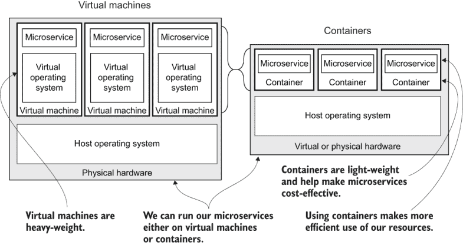

图 3.1 比较虚拟机和容器

正如您在图 3.1 中所看到的，虚拟机比容器更重量级。虚拟机包含其操作系统在完全虚拟化硬件上运行的完整副本。另一方面，容器虚拟化了操作系统以及硬件。因此，容器更小，工作更少，这使得我们能够更有效地使用计算资源。

最终，我们将在我们的 Kubernetes 集群上运行许多容器。但到目前为止，我们的目标是实例化一个容器来托管我们在上一章中创建的视频流微服务。

## 3.4 什么是镜像？

镜像是对某物的快照。单词“镜像”在许多不同的场景中使用。我们可能正在谈论一张照片，或者我们可能正在谈论虚拟机的硬盘快照。在这本书中，我们谈论的是 Docker 镜像。

定义 一个 *镜像* 是一个服务器的可启动快照（在我们的情况下，是一个微服务），包括它运行所需的所有代码、依赖项和资产。

在本章的示例中，我们创建了一个视频流微服务的快照。镜像是不可变的，这意味着一旦生成，就无法修改。这是需要知道的重要事情。我们可能已经对一个镜像应用了测试或安全检查，因为我们知道镜像不能被篡改，我们知道我们的测试和安全检查将保持有效。

你可以将镜像视为微服务的休眠版本，是它在运行之前存储的一种方式。它处于等待启动为容器的状态，准备在我们需要将其实例化到应用程序中时使用。

图 3.2 展示了如何从一个镜像启动容器。镜像本身包含创建容器所需的一切：微服务的代码、其依赖项以及微服务执行其工作所需的其他资产和资源。

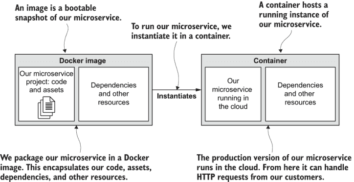

图 3.2 要在云中运行我们的微服务，我们将在容器中实例化其 Docker 镜像。

很快，我们将为我们的微服务构建一个镜像，并以容器的方式运行它。在那之前，让我们更多地了解 Docker。

## 3.5 为什么选择 Docker？

你肯定已经听说过 Docker 了？这可能是你购买这本书的原因之一。几乎每个构建基于云的应用程序的人都在使用 Docker 或想要使用它。让我们看看为什么这是这样。

Docker 在软件行业中几乎是无处不在。虽然有一些 Docker 的替代品，但作为打包和部署容器的技术，Docker 已经吸引了主流的关注。它广为人知，并且得到了良好的支持。

Docker 甚至在其他领域也取得了进展。例如，我听说有人使用 Docker 将应用程序部署到物联网设备上。它完成了我们需要的任务。但它究竟为我们做了什么？

Docker 是我们用来打包和发布微服务的工具。尽管你可以从 Docker 中学到很多东西，但我们将学习我们完成这项任务所需的最少知识。在本章末尾，我将提供一些参考资料，供你深入研究，更广泛地了解 Docker。

我喜欢将 Docker 视为**通用包管理器**：统治所有包管理器的那个！通常，你不会这样考虑 Docker，但如果你仔细思考，这确实有些道理。**包管理器**这部分相当明显；我们使用 Docker 来打包和发布我们的工作。我说它是**通用**的，因为它支持许多不同的技术栈。Docker 是开源的，你可以在以下位置找到 CLI 工具的代码：

[`github.com/docker/cli`](https://github.com/docker/cli)

你可以在以下位置看到 Docker 制造商的其他开源项目：

[`www.docker.com/community/open-source`](https://www.docker.com/community/open-source)

标准化你的环境

Docker 也非常适合标准化你的环境，确保所有开发者运行的是相同的发展环境。这反过来又意味着与生产环境相同。它最大化了代码在开发环境中工作，同时在生产环境中也能工作的概率，这给了开发者更好的机会在代码到达客户之前发现问题。

## 3.6 我们用 Docker 做什么？

让我们分解这个问题。我们将使用 Docker 来

+   将我们的微服务打包成 Docker 镜像

+   将我们的镜像发布到我们的私有容器注册库

+   在容器中运行我们的微服务

最后一个要点最为重要。我们希望微服务在我们的生产环境中运行，但我们只能在我们首先打包并发布它之后做到这一点。

我们还没有准备好将微服务部署到生产环境，因此我们将专注于学习在开发工作站上打包、发布和测试镜像所需的 Docker 命令。

图 3.3 展示了我们需要在这里完成的一般步骤。我们将使用视频流微服务的 Node.js 项目（图 3.3 左侧），将其打包成 Docker 镜像，然后发布到我们的私有容器注册库。从那里，我们可以将微服务部署到我们的 Kubernetes 集群；尽管如此，这项工作我们将留到第七章进行。

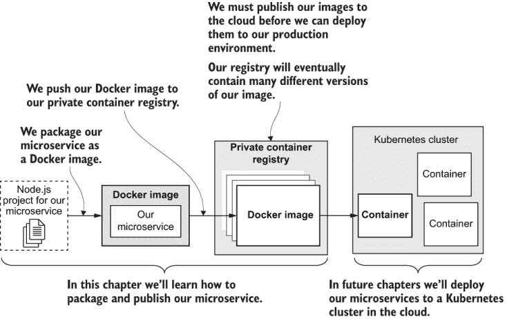

图 3.3 在本章中，我们将学习如何将 Docker 镜像发布到云中的私有容器注册库。

## 3.7 使用 Docker 扩展我们的开发环境

在我们能够使用 Docker 之前，我们必须升级我们的开发环境。为了跟随本章内容，您需要在您的电脑上安装 Docker。在本节中，我们将安装 Docker 并确保其准备就绪。

图 3.4 展示了安装 Docker 后我们的开发环境将看起来是什么样子。尽管您可以看到我们将运行 Node.js 微服务，但您并不总是需要以这种方式运行微服务。然而，当您测试单个微服务时，您只需像我们在第二章中做的那样直接在宿主操作系统上运行它即可。

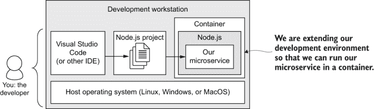

图 3.4 将我们的开发环境扩展到在容器中运行微服务

由于我们需要能够使用 Docker 打包我们的微服务，因此能够在发布前后本地测试它是很有用的。对于在 Kubernetes 上表现不佳的任何微服务，测试能力将非常有用。我们将在第十章中进一步讨论这一点。

### 3.7.1 安装 Docker

要安装 Docker，请访问 Docker 网站 [`docs.docker.com`](https://docs.docker.com)。到达网站后，找到下载/安装链接，按照说明安装适用于您平台的 Docker。表 3.2 提供了安装 Docker 的具体细节。

如果您使用的是 Windows 10，请注意，对于 Home 版本与 Pro/Enterprise 版本安装 Docker 的说明是分开的。在 Windows 10 Home 版本上，您需要在安装 Docker 之前安装 WSL2（Windows 集成的 Linux 内核）。按照表 3.2 中的说明进行操作。

表 3.2 Docker 支持的平台

| 平台 | 描述 |
| --- | --- |
| Linux/MacOS/Windows 10 Pro/Enterprise | 请访问 Docker 网站 [`docs.docker.com`](https://docs.docker.com/)。点击下载/安装链接，按照说明在您的系统上安装 Docker。 |
| Windows 10 Home | 在您安装和使用 Docker 之前，必须安装 WSL2。要安装 WSL2，请按照以下说明操作：[`docs.microsoft.com/en-us/windows/wsl/install-win10`](https://docs.microsoft.com/en-us/windows/wsl/install-win10) 安装 WSL2 后，您现在可以按照以下说明安装 Docker：[`docs.docker.com/docker-for-windows/install-windows-home/`](https://docs.docker.com/docker-for-windows/install-windows-home/) 您还可以使用虚拟机在 Windows 10 Home 版上运行 Docker，如以下侧边栏中所述。 |

### 3.7.2 检查您的 Docker 安装

一旦您安装了 Docker，您可以使用终端通过打印版本来检查它是否正常：

```
docker --version
```

如果您安装的版本与我安装的版本相同（截至本文写作时），输出将如下所示：

```
Docker version 19.03.12, build 48a66213fe
```

如果您使用的是 Docker 的较新版本，请不要担心。它很可能与旧版本向后兼容。

在虚拟机（VM）下运行 Docker

您可能已经注意到，第三章的仓库([`github.com/bootstrapping-microservices/chapter-3`](https://github.com/bootstrapping-microservices/chapter-3))包含一个 Vagrantfile。这是一个 Vagrant 脚本，它会启动一个预先配置的、自动安装了 Docker 的 Ubuntu Linux 虚拟机（VM）。要使用它，您必须首先安装 Vagrant 和 VirtualBox。

这是一种方便的方式来启动一个即时且可丢弃的开发环境。嗯，它并不完全即时，但通过调用`vagrant up`来构建用于开发的 VM 比手动创建要快得多。我说它是可丢弃的，因为调用`vagrant destroy`会删除 VM，并将您的开发工作站保持在一个干净的状态。这使得 Vagrant 成为尝试新软件（如 Docker）的好方法，而不会使您的电脑变得杂乱。

书中其他章节的每个代码仓库也包含一个 Vagrantfile。如果您想按照这种方式跟随示例，您可以方便地创建一个 VM 来尝试这本书中的示例。要了解更多关于 Vagrant 的信息，请参阅附录 A 或访问 Vagrant 网站：

[`www.vagrantup.com/`](https://www.vagrantup.com/)

## 3.8 打包我们的微服务

现在我们已经安装了 Docker，我们可以开始考虑使用它来打包我们的微服务以进行部署。最终，我们希望将微服务部署到生产环境中。但首先，我们需要将所有内容打包并准备好发货。我们将按照以下步骤打包我们的微服务：

1.  为我们的微服务创建 Dockerfile

1.  将我们的微服务打包成 Docker 镜像

1.  通过作为容器启动已发布的镜像来测试它

### 3.8.1 创建 Dockerfile

对于我们想要创建的每个 Docker 镜像，我们必须创建一个 Dockerfile。*Dockerfile*是 Docker 创建的镜像的规范。我喜欢将 Dockerfile 想象成一个包含构建镜像指令的脚本文件。您可以在图 3.5 中看到这一点的说明。

Dockerfile 中的行定义了我们的微服务、其依赖项以及任何支持资产。Dockerfile 中的不同行会导致不同的文件被复制到镜像中。对于 Dockerfile，我们将添加复制我们的 Node.js 项目和安装我们的 npm 依赖项的指令。

还请注意图 3.5 中，我们将一个示例视频复制到了我们的镜像中。将视频烘焙到镜像中并不是我们在最终生产版本中想要做的事情，但在本例中它是有用的——我们还没有其他方式来存储这个视频。

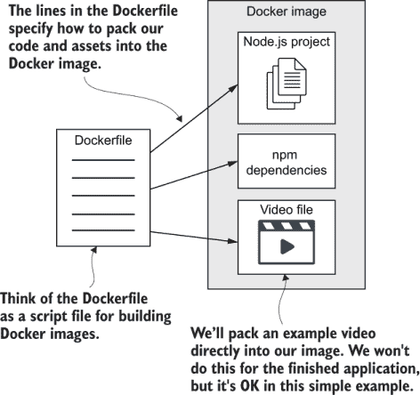

图 3.5 Dockerfile 是一个脚本，它指定了如何构建我们的 Docker 镜像。

只有一个视频会让视频流应用显得相当无聊，但解决这个问题将留到第四章。现在，这实际上是一个很好的例子，表明我们不仅可以包含代码到我们的镜像中。包含其他类型的资产对 Docker 来说没有任何问题！

列表 3.1 显示了我们的视频流微服务的 Dockerfile。它并不复杂，是 Node.js 应用程序 Dockerfile 的一个好例子。请阅读并尝试想象每一行是如何添加到最终镜像中的。

列表 3.1 为我们的视频流微服务（chapter-3/example-1/Dockerfile）的 Dockerfile

```
FROM node:12.18.1-alpine              ①
WORKDIR /usr/src/app                  ②
COPY package*.json ./                 ③
RUN npm install --only=production     ④
COPY ./src ./src                      ⑤
COPY ./videos ./videos                ⑥
CMD npm start                         ⑦
```

① 为我们的新镜像设置基础镜像。这允许我们基于现有镜像生成新镜像。

② 设置镜像中的目录。其他路径相对于此。

③ 将 Node.js 的 package.json 文件复制到镜像中

④ 使用 npm 仅安装生产依赖项

⑤ 复制我们的微服务的源代码

⑥ 复制我们的示例视频

⑦ 使用“npm start”约定启动微服务（参见上一章）

在列表 3.1 中，第一行包含了`FROM`指令。这指定了我们新镜像的基础镜像。通过说我们的基础镜像为 node:12.18.1-alpine，我们是在声明我们的衍生镜像应包含 Node.js 版本 12.18.1。（如果你想知道 alpine 是什么意思，请参见以下边栏。）

如果你正在使用除 JavaScript 和 Node.js 之外的语言或框架，那么你将选择不同的基础镜像。选择一个适合你自己的技术栈的镜像。

能够选择基础镜像非常实用。我们可以选择使用 Docker Hub 上可用的众多公共镜像之一（[`hub.docker.com`](https://hub.docker.com)），或者甚至创建我们自己的自定义基础镜像。这意味着我们可以重用现有镜像，到本书结束时，我们还将看到几个重用第三方镜像的示例。

在列表 3.1 中还有各种包含`COPY`指令的行。这些行将文件复制到我们的镜像中。你可以看到 package.json、我们的代码和示例视频都被复制到了镜像中。

`RUN`指令也值得注意。你可以在构建过程中在镜像内运行软件，以更改镜像、安装依赖项和执行其他设置任务。在这个例子中，我们使用`RUN`来安装我们的 npm 依赖项并将它们嵌入到镜像中。

列表 3.1 中最后且最重要的一行是`CMD`指令。这个指令设置在容器实例化时调用的命令。这就是我们告诉它使用我们在第二章中添加到 package.json 文件的 npm start 脚本来运行我们的 Node.js 应用程序的方式。关于这一点，可以重新阅读 2.6.7 节。

Alpine 与非 Alpine：第一部分

当你在镜像的名称中看到“alpine”（例如，node:12.18.1-alpine）时，这表明该镜像基于 Alpine Linux。Alpine 是一个轻量级的 Linux 发行版，只包含最基本的东西，因此它比常规发行版小得多。由于尺寸小，Alpine 镜像非常适合生产，因为它能更好地利用你的基础设施和云资源。

### 3.8.2 打包和检查我们的 Docker 镜像

现在我们已经创建了 Dockerfile，我们可以将我们的微服务打包成一个*可运行*的镜像。我们将使用`docker build`命令来构建这个镜像。它以输入我们的 Dockerfile，其中包含构建镜像的指令。图 3.6 显示了这一过程。

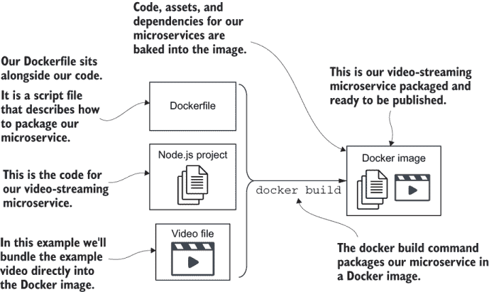

图 3.6 `docker build`命令根据我们的 Dockerfile 生成 Docker 镜像。

注意：在我们可以将微服务部署到生产之前，我们必须能够将其打包成 Docker 镜像。

现在到了有趣的部分。是时候从我们的微服务中创建一个镜像了。为了跟上进度，你需要一个像列表 3.1 中显示的 Dockerfile，以及一个 Node.js 项目。你可以自己创建一个，或者使用 GitHub 上第三章代码仓库中的 example-1（见 3.1 节）。

当你准备好了，打开一个终端并切换到 chapter-3/example-1 目录（或者你存放代码和 Dockerfile 的任何目录）。现在按照以下方式调用`docker build`：

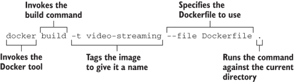

当你运行这段代码时，你会看到基础镜像的各个部分正在下载。这个下载只会在第一次发生；随后，你已经在你的工作站上缓存了基础镜像。它不会再次下载（至少在我们稍后在 3.9.3 节中删除所有本地镜像之前不会下载）。一旦完成，你应该在输出的末尾看到类似以下内容：

```
Successfully built 9c475d6b1dc8
Successfully tagged video-streaming:latest
```

这表明镜像已成功构建。它还提供了你镜像的唯一 ID，并显示了为它设置的标签。

注意：当你自己调用此命令时，你会看到不同的输出，因为分配给你的镜像的 ID 将不同于分配给我的镜像的 ID。

因为它是一个唯一的 ID，所以它将随着你创建的每个新图像而不同。如果你想的话，你可以记下这个 ID，并在未来的 Docker 命令中使用它来引用图像。然而，你实际上并不需要这样做，因为我们已经用有意义的名称（video-streaming）标记了它。我们可以使用这个名称而不是 ID。

注意输出中版本被自动设置为`latest`，因为我们没有为它指定任何内容。在第七章中，我们将自动设置这个版本作为我们持续交付过程的一部分。这将区分我们随着代码迭代更新和构建新图像而产生的每个新版本。以下是一些其他需要注意的点：

+   *The* `-t` *argument* *允许我们标记或命名我们的图像。* 你会想要这样做；否则，你将不得不通过其唯一的 ID 来引用你的图像。它是一长串难看的数字（正如你在前面的输出中看到的），所以这不是最佳选择。

+   *The* `--file` *argument* *指定要使用的 Dockerfile 的名称。* 从技术上讲，这是不必要的，因为默认情况下它总是命名为 Dockerfile。我明确地包括这一点是为了让你知道，我们将在第五章中利用它。在第五章中，我们将分离我们的 Dockerfile，以便在开发和生产中有不同的版本。

+   *不要忘记句号！* 很容易忽略。它告诉`build`命令针对当前目录操作。这意味着 Dockerfile 中的任何指令都是相对于当前工作目录的。更改此目录使得将 Dockerfile 存储在项目资产的不同目录中成为可能。这在某些时候可能很有用，但不是我们现在需要的特性。

这是构建你自己的图像时`docker build`命令的一般格式：

```
docker build -t <your-name-for-the-image> --file <path-to-your-Dockerfile> 
➥ <path-to-project>
```

你可以将你的微服务的特定名称作为图像名称、其 Dockerfile 的路径以及其项目文件夹的路径插入其中。构建我们的图像后，我们现在应该检查它以确保一切正常。我们可以使用以下命令列出我们的本地图像：

```
docker image list
```

这列出了我们本地工作站上的图像。如果上一节中的`docker build`命令成功完成，我们现在可以看到至少列出两个图像：

```
REPOSITORY       TAG             IMAGE ID      CREATED         SIZE
video-streaming  latest          9c475d6b1dc8  33 seconds ago  74.3MB
node             12.18.1-alpine  072459fe4d8a  6 months ago    70.7MB
```

如果你已经使用 Docker 在本地创建其他图像，或者如果你已经探索了 Docker Hub 上许多公开可用的图像，你可能会在这个列表中看到其他图像（参见标题为“探索其他容器”的侧边栏）。

注意前面的输出中的列。在`REPOSITORY`列下，你可以看到`video-streaming`和`node`，其中`video-streaming`是我们刚刚创建的微服务的图像，而`node`是我们第 3.1 列表中引用的基础图像。

`TAG`是下一列，通常显示镜像的版本号。因为我们没有为我们的视频流镜像指定版本，所以它自动分配了版本`latest`。

下一个列是`IMAGE ID`，显示了每个镜像的唯一 ID。请注意，我们的视频流图像的 ID 与`build`命令的输出中的 ID 相同。再次强调，您镜像的唯一 ID 可能与这里看到的不同。输出中的其他列包括`CREATED`，它告诉您镜像是在何时创建的，以及`SIZE`，它显示了镜像的大小。

Alpine 与非 Alpine：第二部分

在本节中，您可以在`docker image list`的输出中看到我们的视频流图像大小为 74.3 MB。这个大小是由于我们选择了 Alpine 图像作为我们的基础镜像。

想知道如果我们使用非 Alpine 镜像的大小是多少吗？嗯，非 Alpine 镜像的重量达到了惊人的 902 MB。这是大小的 10 倍以上！您可以清楚地看到为什么我们想在生产中使用 Alpine 镜像。

### 3.8.3 在容器中启动我们的微服务

在我们发布新创建的 Docker 镜像之前，我们应该在我们的开发工作站上对其进行测试运行，以确保一切正常工作。一旦我们将微服务打包成 Docker 镜像，我们就可以使用`docker run`命令将其实例化为容器，如图 3.7 所示。这将在我们的开发工作站上创建一个我们的视频流微服务的实例，然后我们可以使用网页浏览器对其进行测试。


图 3.7 `docker run`命令生成了我们的微服务在容器中运行的实例。

当您准备好时，打开一个终端并调用以下命令来从镜像实例化您的微服务：

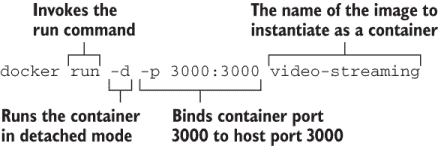

作为输出，您应该看到打印出的容器的唯一 ID。以下是我调用命令时的输出：

```
460a199466896e02dd1ed601f9f6b132dd9ad9b42bbd3df351460e5eeacbe6ce
```

看到这样的输出意味着您的微服务已成功启动。当您运行此命令时，您将看到不同的输出。这是因为您的容器将有一个与我不同的唯一 ID。您仍然会看到一个很长的一串数字，但再次强调，它将是不同的。您需要这个 ID 来调用与容器相关的未来的 Docker 命令。

不要担心试图记住它（除非您有 photographic memory），因为我们可以很容易地按需回忆起这个和其他容器的细节，正如您很快就会看到的。下面列出了更多需要注意的点。

+   *`-d`参数使我们的容器以分离模式运行**。这意味着它在后台运行，我们无法直接看到其日志。如果我们省略了它，我们的容器将在前台运行，我们可以直接看到其输出；尽管如此，它也会占用我们的终端。*

+   *`-p`参数*将主机操作系统和我们的容器之间的端口绑定。这就像端口转发一样，发送到我们开发工作站上端口 3000 的网络流量将被*转发*到容器内的端口 3000。我们这样设置是因为我们最初将微服务硬编码为监听端口 3000。

    数字 3000 本身在这里并不重要。我们可以使用几乎任何数字，但根据惯例，在开发/测试单个 HTTP 服务器时通常使用 3000。

+   *最后一个参数*，`video-streaming`，是我们给我们的图像取的名字。这是我们指定哪个图像（我们可能有多个）将被实例化的方式。这与我们在 3.8.2 节中使用的`docker build`命令和`-t`参数所指定的图像名称相关。

在这一点上常见的错误是当我们使用的端口（例如，端口 3000）已经被另一个应用程序分配时。如果发生这种情况，您需要关闭该应用程序，或者如果您不能这样做，您将不得不选择一个不同于 3000 的端口。您可以通过使用我们在第二章 2.6.6 节中使用的 PORT 环境变量来完成此操作。以下是`docker run`命令的一般格式：

```
docker run -d p <host-port>:<container-port> <image-name>
```

您可以使用此方法通过插入您创建的每个图像的特定名称来启动其他微服务。

检查容器

我们现在有一个正在运行的容器，但让我们检查一下它是否处于正常工作状态。要显示您拥有的容器，请调用此命令：

```
docker container list
```

这里是输出的一部分：

```
CONTAINER ID  IMAGE            STATUS         PORTS
460a19946689  video-streaming  Up 20 seconds  0.0.0.0:3000->3000/tcp
```

您的输出将不同于显示的输出，因为为了使其适应，我移除了`COMMAND`、`CREATED`和`NAMES`列。但您可以直接运行该命令以查看这些信息。

注意`CONTAINER ID`列。这显示了容器的唯一 ID。它是从上一节中`docker run`命令输出的较长 ID 的简化版本。两者都是您容器的唯一 ID，如您一会儿将看到的，我们将使用 ID 在运行 Docker 命令时识别容器。

检查您的微服务

我们已成功从我们的图像中实例化了一个容器，并检查了它是否正在运行。但我们如何知道容器内的微服务是否功能正常？它可能会抛出各种错误，而我们目前还不知道。让我们检查微服务的输出并看看它告诉我们什么：

```
docker logs 460a19946689
```

哇，等等！您不能只是调用那个命令并使用我的容器的唯一 ID。记住，您的工站上创建的容器的 ID 将是不同的。如果您这样调用，将会得到一个错误。所以请注意您自己的容器 ID，如前节所示，并像这样调用命令，插入您自己的容器 ID：

```
docker logs <container-id>
```

现在您应该看到微服务的输出。如果您从第三章代码库中的 example-1 运行代码，您应该看到类似以下内容：

```
Microservice listening on port 3000, point your browser at 
➥ http://localhost:3000/video
```

成功！我们构建了一个镜像。我们将其实例化为一个容器，并确认我们的微服务正在运行。现在让我们在网页浏览器中测试一下。打开你的浏览器，将其指向 http://localhost:3000/video。你应该能看到流媒体视频，结果应该和我们在第二章中测试的相同。

为什么这能工作？这是因为我们使用了`docker run`命令中的`-p`参数，将我们的工作站上的端口 3000（假设这个端口还没有被分配）转发到容器中的端口 3000。我们的微服务正在监听端口 3000，并做出了响应！

显然，我们还可以做更多的事情来测试我们的代码。但我们将把那留到以后。在第八章*中，我们将探讨如何将自动化的代码驱动测试应用到我们的微服务中。然后在第十章中，我们将看到如何监控我们的微服务，当发现问题时要如何调试它们，以及我们可以用于构建容错系统的技术。但现在，我们已经准备好发布我们的镜像了！

探索其他容器

你知道你可以轻松地使用`docker run`命令运行任何公共镜像吗？本书后面我们将使用的两个镜像分别是 mongodb 和 rabbitmq。试着运行这些镜像，以便在 localhost:27017 上获得一个即时可用的数据库。例如

```
docker run -p 27017:27107 mongo:latest
```

在线有许多公共镜像可供使用，你不需要账户就可以访问这些镜像。在 Docker Hub 上搜索以找到更多[`hub.docker.com`](https://hub.docker.com)。

## 3.9 发布我们的微服务

我们现在几乎已经准备好将我们的第一个微服务用于生产部署。我们已经将其打包成一个 Docker 镜像，但目前这个镜像仅存在于我们的开发工作站上。这对我们的测试和实验来说很好，但我们仍然需要将我们的镜像发布到某个地方，以便我们以后可以将其部署到我们的 Kubernetes 集群中。图 3.8 展示了我们现在如何将我们的镜像发布到云中托管的私有容器注册库。

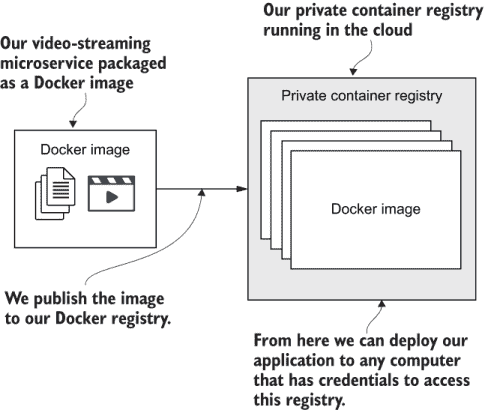

图 3.8 将我们的 Docker 镜像发布到云中的私有容器注册库

我们将按照以下步骤发布我们的微服务：

1.  我们在 Microsoft Azure 上创建了自己的私有容器注册库。我们只需要在第一次发布镜像时做这件事。以后，当我们发布镜像的新版本和其他微服务的镜像时，我们将简单地重用这个相同的注册库。

1.  在发布之前，我们必须使用`docker login`命令对注册库进行身份验证。

1.  我们使用`docker push`命令将我们的镜像上传到注册库。（这是实际发布我们的微服务的步骤。）

1.  我们再次使用`docker run`来检查我们是否可以从发布的镜像启动我们的微服务。

### 3.9.1 创建私有容器注册库

创建私有容器注册库实际上非常简单。我们将在 Microsoft Azure 上创建我们的注册库，但所有主要的云服务提供商都支持这项功能。为什么选择发布到私有注册库？在这本书中，我们正在学习如何为私有公司构建专有应用，因此将镜像私下发布而不是使用像 Docker Hub 这样的公共注册库是有意义的。

我使用 Azure 来写这本书，因为我发现它是最简单的云平台之一，并且它是学习如何构建云原生应用的绝佳起点。Azure 为新注册用户提供了一些优惠，包括第一个月免费信用额度。这为您提供了尝试本书中展示的云基础设施的机会，而且无需付费。

确保您稍后销毁所有资源，以免不必要地支付费用。顺便说一句，这也是使用 Azure 的另一个原因：微软已经使查找和销毁云资源变得容易，这样我们就不会忘记某些事情，最终为未使用的基础设施付费。现在，我们将手动创建我们的容器注册库。但在第六章，我们将回到这个话题，学习如何使用代码创建它。

打开您的浏览器并加载 Azure 网站：[`azure.microsoft.com`](https://azure.microsoft.com)。按照步骤进行注册。注册后，您应该能够登录到 Azure 门户：[`portal.azure.com`](https://portal.azure.com)。

一旦进入 Azure 门户，您应该在左侧菜单中看到“创建资源”选项。点击此选项，然后在搜索输入框中输入`container registry`并按 Enter。您将看到如图 3.9 所示的匹配选项。点击“Container Registry by Microsoft”选项。

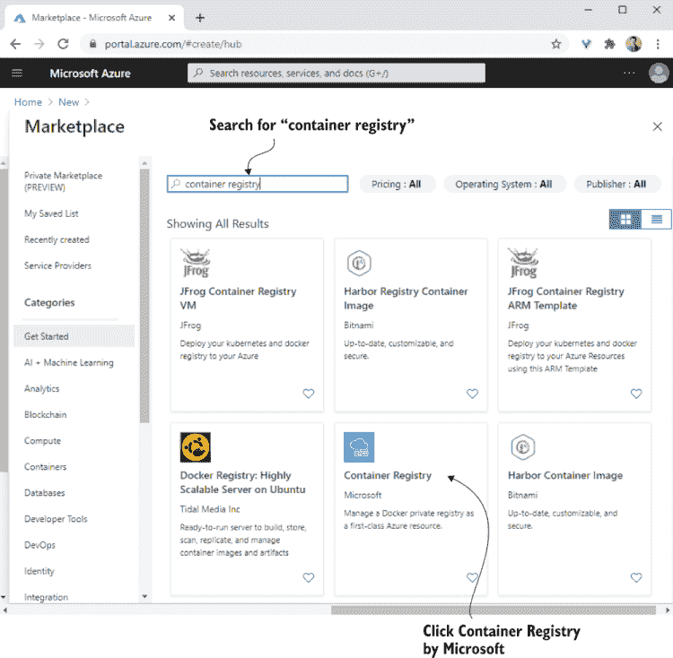

![图 3.9 在 Azure 门户中创建新的私有容器注册库]

现在，您应该看到一个页面，它解释了更多关于 Microsoft 容器注册库的信息。如果您愿意，在点击创建按钮之前先阅读一下。

接下来，我们填写一些关于我们正在创建的注册库的详细信息。图 3.10 显示，我们首先需要提供一个名称。名称很重要，因为它创建了一个我们将用于以后与注册库通信的 URL。我为我的注册库选择的名称是 bmdk1，这导致容器注册库的 URL 如此：*bmdk1.azurecr.io**.*


![图 3.10 为我们的新私有容器注册库填写详细信息]

因为为注册库选择的名称会生成 URL，所以它必须是全局唯一的。这意味着您不能选择别人已经使用的名称——选择您自己的唯一名称。您应该注意 URL，因为您很快将需要它来在您的注册库上执行 Docker 命令。

在点击“创建”之前，我们需要选择或创建一个**资源组**。正如其名称所暗示的，Azure 中的资源组允许将云资源收集到组中以方便管理。图 3.11 显示，我正在创建一个新的资源组来包含我称为 bmdk1 的新注册表。要创建一个新的资源组，请点击“创建新”，输入一个名称，然后点击“确定”。

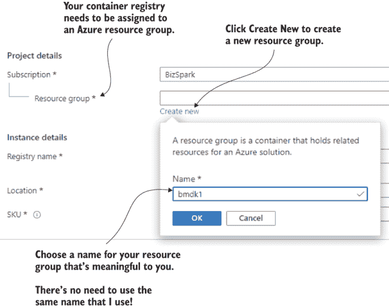

图 3.11 创建新的资源组以包含私有容器注册表

这个名字不重要。我们可以使用之前相同的名字，或者我们可以使用我们喜欢的任何其他名字。它不需要与容器注册表有相同的名字，也不需要是全球唯一的。只需确保您给它一个对您有意义的名字，这样当您稍后再次看到它时，您会想起它的用途。

现在，点击“审查 + 创建”按钮。在下一页，点击“创建”以创建您的注册表。

要跟进我们的注册表创建，我们需要在 Azure 门户中查看通知。点击通知图标以打开通知侧边栏并监视部署进度。这可能需要一些时间，但完成时，我们将在侧边栏中看到“部署成功”通知，如图 3.12 所示。

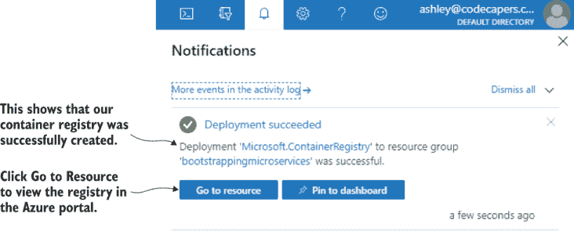

图 3.12 我们新容器注册表的部署已成功！

从“部署成功”通知中，我们可以点击“转到资源”来查看新注册表的详细信息。否则，如果我们稍后需要再次找到我们的注册表，请点击左侧菜单中的“所有资源”。图 3.13 显示，这将列出我们所有的资源（如果您创建了其他资源），以及我们的新容器注册表。

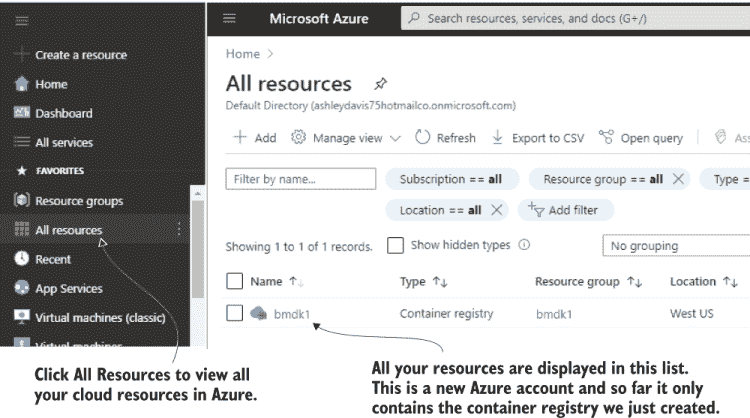

图 3.13 您可以在“所有资源”列表中找到您的容器注册表。在这个阶段，我们只有一个资源，即注册表本身。

接下来，在列表中点击您的容器注册表以深入查看其详细信息，然后在左侧菜单中点击“访问密钥”。您可以在图 3.14 中看到它的样子。注意，在这里我们可以看到注册表的 URL。

注意：启用“管理员用户”选项非常重要。我们需要启用此选项才能在推送和拉取镜像时对注册表进行认证。

现在，请注意您的注册表的用户名和密码（您只需要第一个密码）。不要麻烦记录图 3.14 中看到的那些。这些是我注册表的详细信息，并且在你阅读这段文字时它将不存在。请确保使用您自己的注册表的详细信息！

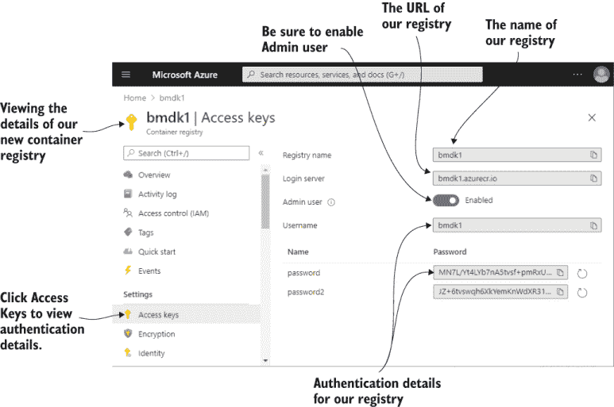

图 3.14 查看我们新的私有容器注册表的认证详情

就这些了！如果您遵循了这些说明，现在您已经有了自己的私有容器注册表。您可以将镜像推送到注册表，然后从这里，您可以将其部署到生产环境中。所以让我们发布我们的第一个镜像吧！

公共与私有

对于这本书，我们只对发布私有 Docker 镜像感兴趣。但您可能也想知道，您还可以发布公共镜像。

例如，假设您创建了一个开源微服务。为它创建一个 Docker 镜像，然后将其公开发布到 Docker Hub。这可以帮助您的用户快速运行它！

要发布到 Docker Hub，您必须在 [`hub.docker.com`](https://hub.docker.com) 注册。然后您可以使用 `docker push` 命令将您的镜像推送到 Docker Hub。

Docker Hub 还允许您发布私有镜像。尽管要发布多个这样的镜像，您需要升级到付费账户。

### 3.9.2 将我们的微服务推送到注册库

现在我们有了私有容器注册库，我们有一个地方可以发布我们的第一个微服务。我们将通过调用如图 3.15 所示的 `docker push` 命令来发布我们的镜像。

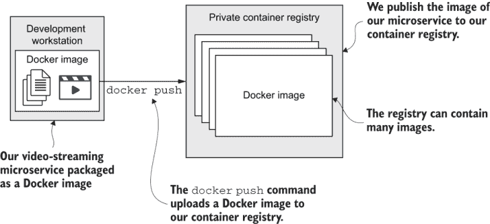

图 3.15 `docker push` 命令将我们的 Docker 镜像上传到我们的私有容器注册库。

使用注册库进行身份验证

在我们可以向我们的注册库推送之前，我们必须首先登录。我们启用了身份验证，因为我们不希望任何人都能将镜像发布到我们的注册库。

在上一节中，您创建了您的私有容器注册库，并记下了其详细信息。要与注册库通信，您必须知道其 URL。要推送和拉取镜像，您需要用户名和密码。如果您记不住这些，请参阅第 3.9.1 节，在 Azure 门户中找到您的注册库并回忆这些详细信息。要进行身份验证，我们将调用 `docker login` 命令：

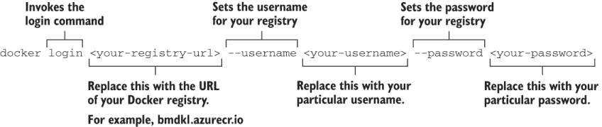

我本可以向您展示我使用的完整命令，包括我的注册库的 URL、用户名和密码。但这不会适合页面！而且，这也不会对您有帮助，因为在这个时候，您必须使用您自己的注册库的详细信息。当您调用 `docker login` 时，请确保使用您自己的 URL、用户名和密码。在通过 `docker login` 进行身份验证后，您现在可以调用针对您的注册库的其他 Docker 命令。

标记我们的镜像

在我们可以将我们的镜像发布到注册库之前，我们必须告诉 Docker 镜像被推送到哪里。我们通过使用 `docker tag` 命令对镜像进行标记来实现，如下所示：


当然，您不能直接输入该命令。您必须使用您自己的注册库的 URL！`docker tag` 命令具有以下通用格式：

```
docker tag <existing-image> <registry-url>/<image-name>:<version>
```

我们设置了现有镜像的名称以进行标记，然后是应用于它的新的标记。在这种情况下，我们之所以进行标记，仅仅是因为我们想要将镜像推送到我们的注册库。因此，我们在应用的标记中包括了注册库的 URL。

我们可以通过调用`docker image list`来检查我们的新标签是否已应用。在应用新标签后尝试这样做。您应该在表格的新标签部分看到一个新条目。请注意，Docker 并没有创建一个新的图像；它只是给现有的图像添加了一个新的标签。我们可以通过检查图像的唯一 ID 来确认这一点，我们看到它对于标记的两个版本都是相同的。

将我们的图像推送到注册表

最后，我们已准备好将我们的图像发布到注册表。为此，我们将调用`docker push`命令：

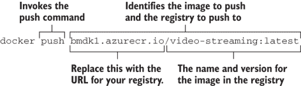

再次提醒，请确保在这里使用您自己的注册表的 URL；否则，这个命令对您将不起作用。以下是`docker push`命令的一般格式：

```
docker push <registry-url>/<image-name>:<version>
```

`docker push`命令后面的命令部分用于标识要推送的图像。这也是标识要推送到的注册表的部分。

如果您认为这有点尴尬，那么我会同意您的看法。在我看来，应该有一个一步到位的过程来将现有图像推送到注册表，而不必先进行标记。但这并不是这样，这就是它的操作方式。在开始图像上传后，请耐心等待其完成。

检查我们的图像是否已成功推送到注册表

在我们将图像推送到注册表后，我们现在想检查它是否已成功到达。我们如何知道它是成功的？第一个线索在输出中。它应该会说推送是成功的，我们可以相信这是正确的。但无论如何，让我们回到 Azure 门户中的注册表，看看现在看起来如何。

在 Azure 门户中，导航到所有资源，找到您的注册表，然后点击它。从左侧菜单中选择仓库。如图 3.16 所示，您应该能够在仓库列表中看到您的视频流图像。如果您查看仓库内部（如图 3.16 右侧所示），您会看到这里有一个版本列表。目前只有一个版本（标记为*latest*），但在将来，在您推送更新到这个图像之后，您可以返回这里并看到列出的其他版本。

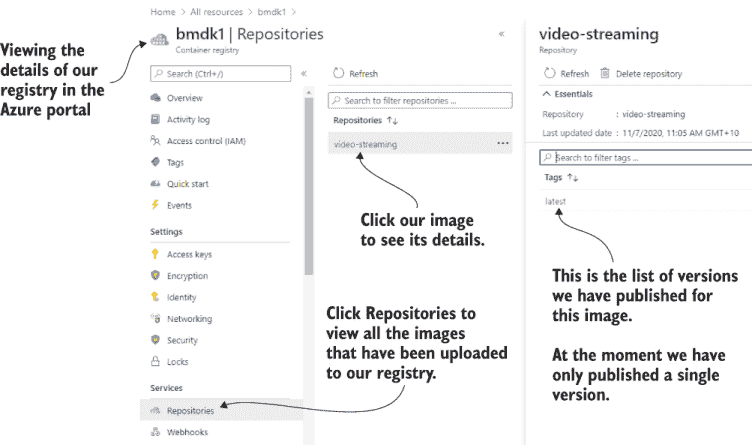

图 3.16 通过 Azure 门户查看推送到容器注册表的图像

您甚至可以通过最新的标签进一步深入查看图像的详细信息，包括其文件清单。我鼓励您更多地探索这个界面，看看您能发现关于您刚刚发布的图像的哪些信息。

### 3.9.3 从注册表启动我们的微服务

恭喜您，您刚刚成功将您的第一个图像发布到了您自己的私有注册表。我们现在可以将这个图像部署到我们的生产环境中，尽管我们无法这样做，因为我们还没有构建我们的 Kubernetes 集群。我们将在第六章中构建它。但在那之前，我们还有更多的工作要做，还有更多的事情要学习。

在继续之前，我们应该确认我们的发布镜像是否正常工作。我的意思是，我们应该能够直接从云端的仓库实例化镜像作为容器。仅仅因为我们还没有生产环境并不意味着我们不能在我们的开发工作站上模拟部署。这并不困难，实际上这与我们在本章中学到的并没有什么不同。

从镜像运行容器基本上是相同的，无论这个镜像是我们本地构建的还是远程仓库中可用的。我们将回到`docker run`命令来测试我们发布的镜像，如图 3.17 所示。

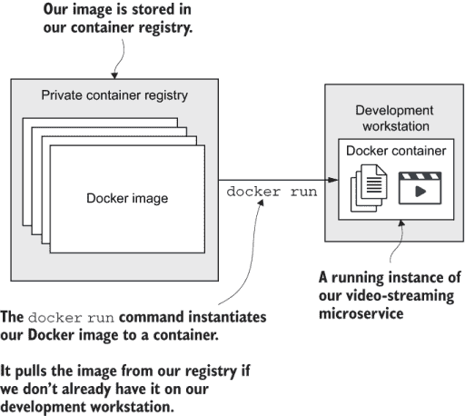

图 3.17 我们可以通过在我们的开发工作站上运行它来测试我们的发布镜像；在这种情况下，`docker run`命令必须首先从仓库拉取镜像。

清理我们的混乱

在我们能够从仓库测试我们的镜像之前，有一件事阻碍了我们。我们必须首先删除我们镜像的本地版本。我们必须这样做；否则，当我们调用`docker run`时，它将从我们已有的本地镜像版本启动容器。这不是我们想要的！

相反，我们想要测试我们是否可以从远程仓库中*拉取*镜像。如果我们已经有一个本地缓存的镜像版本，它就不需要拉取远程版本。这也是我们学习如何删除本地容器和镜像的好借口。

容器不会自行消失。当我们为长期运行的服务器创建容器时，容器通常会保留在那里！当我们完成时，我们需要关闭它们，以免它们继续消耗我们的系统资源。

注意：在我们能够删除镜像之前，我们必须首先删除从它们实例化的任何容器。尝试删除有运行中容器的镜像将导致错误。

我们将在终端中调用`docker ps`。它就像`docker container list`，但它显示了*运行中*和*已停止*的容器。如果你在容器列表中看到了你的视频流微服务，那就是你想要删除的。记下它的容器 ID。你可能会记得，我自己的容器 ID 是 460a19946689。当然，你的将不同，所以不要期望在你的容器列表中看到那个特定的 ID。我用以下命令删除了我的容器：

```
docker kill 460a19946689
docker rm 460a19946689
```

只需记住使用你的容器 ID。以下是一般格式：

```
docker kill <your-container-id>
docker rm <your-container-id>
```

在删除容器后，我们可以再次调用`docker ps`并检查容器是否不再在列表中。在删除任何容器后，我们现在可以继续删除镜像。

调用`docker image list`。我们可以看到列表中至少有三个镜像。有 Node.js 的基础镜像和我们的视频流微服务的两个标记版本。我们只需要删除我们的微服务的镜像。没有必要删除 Node.js 的基础镜像，因为这对这次测试运行来说并不重要。

注意，我们的镜像的两个标记版本具有相同的镜像 ID，实际上这只是多次引用的同一镜像。我们可以通过使用带有`--force`参数的`docker rmi`命令来删除这两个镜像：

```
docker rmi 9c475d6b1dc8 --force
```

当然，你需要用你特定的镜像 ID（你可以从`docker image list`的输出中找到）来运行这个命令。一般格式是

```
docker rmi <your-image-id> --force
```

我们在这里使用`--force`是因为，否则，我们会因为错误消息`Image is referenced in multiple repositories`而停止。这是因为我们有多个标记版本的我们的镜像。我们可以使用`--force`来确保这些都被删除。

删除镜像后，再次调用`docker image list`以检查这是否正确执行，并且我们的镜像不再在列表中。看到列表中的 Node.js 基础镜像是可以的，因为在这个测试运行中不需要删除它。

直接从注册库运行容器

在清理了本地容器和镜像之后，我们现在可以直接从远程注册库中的镜像实例化一个新的容器。我们再次使用`docker run`，如下所示：

```
docker run -d -p 3000:3000  bmdk1.azurecr.io/video-streaming:latest
```

和往常一样，你必须使用你自己的注册库的 URL。这里是一般格式：

```
docker run -d -p <host-port>:<container-port> <registry-url>/<image-name>:
➥ <version>
```

这次当我们调用`docker run`时，我们使用了与第 3.8.3 节中相同的所有参数。这里有`-d`用于分离模式，`-p`用于绑定端口。我们在这里唯一改变的是用来识别镜像的标记。在这种情况下，标记也标识了拉取镜像的远程注册库。

当你在终端中调用`docker run`时，给它一些时间下载。它首先必须拉取你的镜像。你可能已经本地缓存了 Node.js 基础镜像（除非你决定在上一个部分中删除它），在这种情况下，这不会花费很长时间。

当这个过程完成后，你应该有一个正在运行的容器。但这次，它的镜像已经从云中的私有容器注册库中按需拉取了。当`docker run`命令完成后，你应该看到打印出的容器 ID。我们也可以使用第 3.8.3 节中概述的步骤来检查容器是否正在运行。或者，我们可以直接通过将我们的网络浏览器指向 http://localhost:3000/video 来测试它。

## 3.10 Docker 回顾

哇！真是一次旅行。Docker 看起来很简单，直到你试图在单章中解释它！我们刚才做了什么？

+   我们为我们的微服务创建了一个 Dockerfile，它指导 Docker 如何构建它的镜像。

+   我们调用了`docker build`来将我们的微服务打包成镜像。

+   在我们在 Azure 上创建我们的私有容器仓库之后，我们随后调用了 `docker tag`、`docker login` 和 `docker push` 来发布我们的图像。

+   我们使用 `docker run` 完成了我们发布的图像的测试运行。

我们拼凑的完整管道如图 3.18 所示。仔细查看此图，并享受你迄今为止所学到的内容。

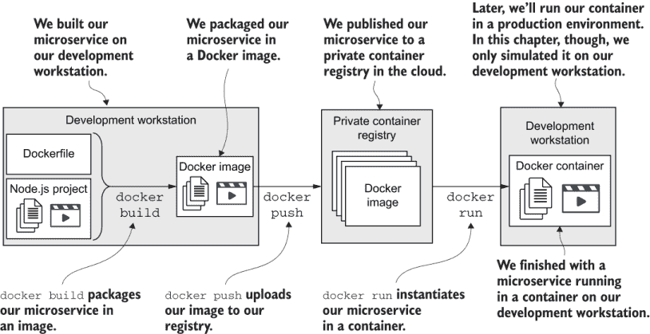

图 3.18 完整的 Docker 构建管道图，显示了构建、推送和运行在过程中的位置。

在继续之前，让我们快速回顾一下我们在本章中添加到工具包中的命令。表 3.3 显示了这些命令。

表 3.3 Docker 命令概览

| 命令 | 描述 |
| --- | --- |
| `docker --version` | 检查 Docker 是否已安装并打印版本号 |
| `docker container list` | 列出正在运行的容器 |
| `docker ps` | 列出所有容器（正在运行和已停止的）。 |
| `docker image list` | 列出本地图像 |
| `docker build -t <tag> --file`➥ `<docker-file``> .` | 根据当前目录中 `docker-file` 中的说明从资产构建图像。`-t` 参数使用你指定的名称标记图像。 |
| `docker run -d -p <host-`➥ `port>:<container-port>`➥ `<tag>` | 从图像实例化一个容器。如果图像在本地不可用，可以从远程仓库拉取（假设标记指定了仓库的 URL）。`-d` 参数以分离模式运行容器，因此它不会绑定到终端，你将看不到输出。省略此参数可以直接看到输出，但这也锁定你的终端。-`p` 参数允许你将主机上的端口绑定到容器中的端口。 |
| `docker logs <container-id>` | 从特定的容器检索输出。你需要这个输出，以便在分离模式下运行容器时查看输出。 |
| `docker login <url>`➥ `--username <username>`➥ `--password <password>` | 使用你的私有 Docker 仓库进行身份验证，以便你可以运行针对它的其他命令。 |
| `docker tag <existing-tag>`➥ `<new-tag>` | 向现有图像添加新标记。要将图像推送到你的私有容器仓库，你必须首先使用你的仓库的 URL 标记它。 |
| `docker push <tag>` | 将适当标记的图像推送到你的私有 Docker 仓库。图像应该使用你的仓库的 URL 进行标记。 |
| `docker kill <container-id>` | 在本地停止特定的容器。 |
| `docker rm <container-id>` | 在本地删除特定的容器（必须先停止）。 |
| `docker rmi <image-id>`➥ `--force` | 在本地删除特定的图像（必须先删除任何容器）。`--force` 参数即使图像被标记多次也会删除图像。 |

## 3.11 继续学习

本章进展迅速。目标是给你启动应用程序所需的最小内容，但还有更多关于 Docker 的内容可以学习。以下是一些其他书籍的参考，这些书籍将帮助你更深入地了解 Docker：

+   《一个月午餐学会 Docker》由 Elton Stoneman 著（Manning, 2020）

+   《实践中的 Docker》由 Aidan Hobson Sayers 和 Ian Miell 著（Manning, 2016）

+   《Docker 实战》由 Jeff Nickoloff 著（Manning, 2016）

Docker 也有良好的在线文档。值得浏览一下

+   [`docs.docker.com/engine/reference/commandline/docker/`](https://docs.docker.com/engine/reference/commandline/docker/)

在本章中，我们探讨了如何使用 Docker 构建和发布单个微服务。随着我们推出更多微服务并创建我们的应用程序，我们将在未来的章节中继续利用这些技能。在下一章中，我们将扩展到多个微服务，并学习如何在我们的开发工作站上轻松运行多个基于 Docker 的微服务。

## 摘要

+   我们了解了 Docker 镜像和容器以及它们与虚拟机的关系。

+   您已将 Docker 安装到您的开发环境中并检查了版本号

+   我们创建了一个 Dockerfile，并使用`docker build`命令将我们的微服务打包到 Docker 镜像中。

+   我们使用`docker run`命令在 Docker 容器中实例化了我们的微服务。

+   您在云中创建了自己的私有 Docker 注册库。

+   您已将微服务发布到您的 Docker 注册库。

+   在使用`docker run`命令从注册库中发布的镜像实例化微服务之前，您清理了所有本地容器和镜像。
