# 4 微服务的数据管理

本章涵盖

+   使用 Docker Compose 在开发中构建和运行微服务应用程序

+   将文件存储添加到你的应用程序中

+   将数据库添加到你的应用程序中

在构建任何应用程序时，通常，我们需要处理数据或文件，有时两者都需要。微服务也不例外。我们需要一个数据库来存储由应用程序生成和更新的动态数据，我们还需要一个地方来存储由应用程序提供或上传到它的资产。

在本章中，我们将文件存储和数据库添加到我们的 FlixTube 示例应用程序中。首先，我们将添加文件存储，这样 FlixTube 就有了一个存储视频的位置。我们希望在应用程序中为流媒体和视频存储划分不同的责任区域。这意味着我们需要为应用程序添加另一个微服务，在本章中，我们确实会创建我们的第二个微服务。

然后，我们将添加数据库。在这个时候，我们添加数据库是为了有一个记录每个视频路径的地方，但这实际上只是将数据库引入位置的借口。因为一旦我们有了它，我们就可以轻松地使用它来存储我们视频的所有元数据，并为所有微服务的持续数据存储需求提供服务。

通过添加数据库服务器和第二个微服务到我们的应用程序中，我们迈出了重要的一步。在第二章，我们构建了我们的第一个微服务；在第三章，我们使用 Docker 在容器中实例化了我们的第一个微服务。在本章中，我们将应用程序扩展以托管多个容器，为此，我们需要一个新的工具！

## 4.1 新工具

本章介绍了为微服务存储数据的两种方式：文件存储和数据库。通常有很多人不同的方法来做这件事，也有很多不同的工具我们可以选择。你为每个项目选择的工具将是那些最适合特定项目、你的团队、你的公司以及你的客户的工具。

对于本书中的任何示例，我需要做出选择，所以从本章开始，我们将使用 MongoDB 作为我们的数据库，并使用 Azure Storage 作为我们的文件存储。我们还将升级我们的开发环境以同时运行多个容器。我们可以像上一章学到的使用 Docker 的`build`和`run`命令来做这件事。但那样的话，我们就必须为每个容器重复运行命令。

当只处理少量容器时，这并不是大问题，但这并不适用于更大的应用程序。想象一下，仅用这种方式构建和运行 10 个微服务！因此，我们需要一种更好的方式来管理多个微服务。为此，本章介绍了 Docker Compose。表 4.1 列出了本章我们将学习的新工具。

表 4.1 第四章介绍的工具

| 工具 | 版本 | 目的 |
| --- | --- | --- |
| Docker Compose | 1.26.2 | Docker Compose 允许我们同时配置、构建、运行和管理多个容器。 |
| Azure 存储 | SDK 版本 2.10.3 | Azure 存储是一个云存储文件的服务。我们可以通过 Azure 门户、通过 API 或从命令行管理资产。我们将通过 Azure 门户上传一个视频，然后使用 Node.js Azure 存储 SDK 读取它。 |
| MongoDB | 4.2.8 | MongoDB 是一种流行的 NoSQL 类型的数据库。它轻量级，易于设置和使用，对微服务来说很方便。 |

## 4.2 获取代码

要跟随本章的内容，您需要下载代码或克隆存储库。

+   您可以在以下位置下载代码的 zip 文件：

    [`github.com/bootstrapping-microservices/chapter-4`](https://github.com/bootstrapping-microservices/chapter-4)

+   您可以使用 Git 克隆代码，如下所示：

    `git clone https://github.com/bootstrapping-microservices/chapter-4.git`

关于安装和使用 Git 的帮助，请参阅第二章。如果您在代码方面遇到问题，请在 GitHub 的存储库中记录一个问题。

## 4.3 使用 Docker Compose 开发微服务

在上一章的结尾，我们在我们的开发工作站（或个人电脑）上创建了一个在容器中运行的单一微服务。我们能够使用我们的网络浏览器对其进行测试。图 4.1 说明了我们当前的情况。

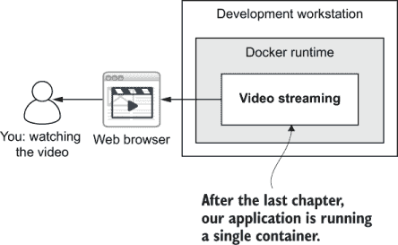

图 4.1 我们的单一微服务在我们的开发工作站上运行 Docker，这是我们第二章中创建的。

然而，一个微服务应用程序，如果它只包含一个单一微服务，那么它**就不是**一个微服务应用程序！是时候扩展我们的应用程序并添加更多容器了。在本章中，我们将使用 Docker Compose 来将我们的应用程序迁移到多个微服务。

在本章中，我们将扩展到多个容器，因为我们想添加一个数据库（这是一个容器），我们还希望添加一个新的微服务来处理我们的文件存储（这也是另一个容器）。所以，鉴于我们从一个容器开始（我们的视频流微服务），到本章结束时，我们将拥有三个容器，如图 4.2 所示。

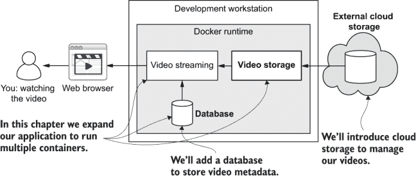

图 4.2 我们将应用程序扩展到多个容器。

为了构建、运行和管理我们不断增长的应用程序，我们可以通过多次运行各种 Docker 命令来完成任务（为每个镜像或容器重复）。但在开发过程中，这很快就会变得繁琐，因为在我们工作日中，我们需要多次停止和重新启动我们的应用程序。而且情况只会变得更糟！随着我们的应用程序继续增长，我们将向其中添加更多的容器。我们需要一个更好的工具。

### 4.3.1 为什么使用 Docker Compose？

在开发过程中管理多个容器可能会非常繁琐；在第六章中，您将看到我们将如何使用 Kubernetes 来管理生产环境中的容器。然而，Kubernetes 是一个庞大且复杂的系统，设计用于在多台计算机上运行（您至少需要一个主节点和一个节点）。在开发工作站上“模拟”Kubernetes 并不容易。您可以使用 Minikube 来完成这项工作，这就像是一个简化的 Kubernetes 版本。但有一个更简单的方法，您可能甚至已经安装了它——Docker Compose。

为什么选择 Docker Compose？与 Docker 允许我们构建、运行和管理单个微服务的方式相同，Docker Compose 为我们提供了一个方便的方式来在开发中构建、运行和管理多个微服务。

Docker Compose 是 Docker 开发者开发的另一个工具，它建立在 Docker 之上，以便更轻松地管理多容器应用程序。在开发和测试期间，我们必须频繁地启动和重启我们的整个应用程序。并且在每次小的开发增量之后，我们必须测试我们的代码更改。我们可以通过前面章节中介绍的方法来完成这项工作：

+   打开多个终端（每个微服务一个），然后使用 Node.js 或我们使用的任何技术栈（如第二章所述）分别运行每个微服务

+   使用 Docker 分别构建和运行每个容器（如第三章所述）

这些方法中的每一个都是我们在构建微服务应用程序的过程中重要的里程碑，而且我们确实会在与单个微服务一起工作时经常回到这些方法。但是，当涉及到与整个微服务应用程序一起工作时，这些方法的效果就不那么明显了。

使用这些方法来管理我们不断增长的应用程序意味着我们花费越来越多的时间在管理运行中的应用程序上。这以开发时间为代价。这减缓了我们的迭代进度，降低了我们的生产力，并最终，耗尽了我们的动力。

我们需要一个更有效的方法来管理我们的应用程序在开发过程中的状态。这就是 Docker Compose 的用武之地。Docker Compose 是一个用 Python 编写的开源工具，您可以在以下位置找到代码：[`github.com/docker/compose`](https://github.com/docker/compose)。

### 4.3.2 安装 Docker Compose

好消息是，您可能已经在您的开发工作站上安装了 Docker Compose。如果您跟随第三章并安装了 Docker，那么您可能已经安装了 Docker Compose，因为它包含在 Windows 和 MacOS 的标准安装程序中。如果您在 Linux 上工作，您可能需要单独安装 Docker Compose。要检查您是否已经安装了它，请打开一个终端并按照以下方式打印版本号：

```
docker-compose --version
```

如果您已经安装了它，您将看到打印出的版本号。这是我写作时运行的版本输出：

```
docker-compose version 1.26.2, build eefe0d31
```

注意：如果您运行的版本比这个版本晚，这是可以的，因为，它很可能与旧版本兼容。

如果你发现你没有安装 Docker Compose，那么你应该调用 `docker` `--version` 命令来再次确认你是否已安装了基本的 Docker 工具。如果你还没有安装，请返回到第三章的 3.7.1 节来安装它。

你可能已经安装了 Docker，但还没有安装 Docker Compose。这种情况可能发生在你正在使用 Linux 并且遵循了 Docker 的命令行安装说明时。如果你需要安装 Docker Compose 作为 Docker 的补充，请参阅 Docker 网站上的 Docker Compose 安装说明，网址如下：

[`docs.docker.com/compose/install/`](https://docs.docker.com/compose/install/)

按照那里的说明操作。完成后，使用 `docker-compose --version` 命令来检查它是否已准备好使用。

### 4.3.3 创建我们的 Docker Compose 文件

Docker Compose 围绕 Docker Compose 文件*.* 我喜欢将其视为一个用于自动构建微服务应用的脚本文件。

定义 *Docker Compose 文件* 是一个脚本，它指定了如何从多个 Docker 容器中组合一个应用程序。

回想一下我们在第 3.8 节中创建的 Dockerfile。那是一个构建单个镜像的脚本。Docker Compose 文件将其扩展，并允许我们从一组 Dockerfile 中编排整个应用程序的创建。Docker Compose 读取 Docker Compose 文件，并生成一个运行中的应用程序，如图 4.3 所示。

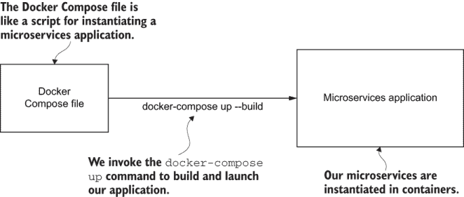

图 4.3 Docker Compose 文件就像是一个用于构建和启动微服务应用的脚本。

在我们学习如何使用 Docker Compose 创建由多个容器组成的应用程序之前，让我们保持简单，创建一个仅包含单个容器的应用程序。我们将进行一些实验，这样你就可以熟悉 Docker Compose。之后，我们将添加更多的容器。

我们学习 Docker Compose 的第一步是将第二章中的视频流微服务与它配合使用。本章的下一个示例是第三章代码库中的 example-1 的直接后续。你可以从该示例开始，并根据需要对其进行更新，或者你可以跟随第四章代码库中预先准备好的示例。

我们需要做的第一件事是将我们的微服务的 Dockerfile 和代码移动到一个新的子目录中。在这个例子中，我们将其命名为 video-streaming，以匹配微服务的名称。我们这样做的原因是，我们现在正在构建一个很快就会包含多个微服务的应用程序。因此，我们必须将每个微服务放入它自己的单独子目录中。我们的约定是，每个子目录都以其微服务的名称命名。

现在让我们创建我们的 Docker Compose 文件。实际上，这个文件叫做 docker-compose.yaml。因为它不属于任何单个微服务，所以它位于我们的微服务应用程序的根目录中。列表 4.1 显示了我们的第一个 Docker Compose 文件。你可以自己输入这段代码，或者直接从第四章代码仓库中的 example-1 目录加载到 Visual Studio (VS) Code 中。

列表 4.1：我们的微服务的 Docker Compose 文件（第四章/example-1/docker-compose.yml）

```
version: '3'                           ①
services:                              ②
  video-streaming:                     ③
    image: video-streaming             ④
    build:                             ⑤
      context: ./video-streaming       ⑥
      dockerfile: Dockerfile           ⑤⑦
    container_name: video-streaming    ⑧
    ports:                             ⑨
     - "4000:80"                       ⑩
    environment:                       ⑪
      - PORT=80                        ⑫
    restart: "no"                      ⑬⑭
```

① 使用 Docker Compose 文件格式的第 3 版

② 在“services”字段下嵌套我们的容器

③ 配置我们的视频流微服务

④ 设置镜像名称

⑤ 设置构建镜像所需的参数

⑥ 设置微服务的目录

⑦ 设置构建镜像的 Dockerfile

⑧ 命名实例化的容器

⑨ 指定端口映射。这就像我们在上一章中使用 Docker 时的“-p”参数。

⑩ 将微服务中的端口 80 映射到主机操作系统的端口 4000

⑪ 设置配置容器输入的环境变量

⑫ 设置微服务 HTTP 服务器使用的端口

⑬ 配置我们的视频流微服务

⑭ 如果微服务崩溃，不要自动重启它。

列表 4.1 是一个 Docker Compose 文件，它创建了一个容器：我们的视频流微服务。注意`build`部分。这里的字段设置了包含微服务项目和 Dockerfile 的子目录及其名称。这就是 Docker Compose 如何找到构建我们视频流微服务镜像所需的信息。

还要注意，Dockerfile 是这个文件的默认名称。我们本来可以省略这个名称，但我明确指定了它，因为在下一章中，我们将分离我们的 Dockerfile。这样，我们可以为开发和生产使用不同的版本。还配置了各种选项（见代码注释），你可能还记得第二章的内容：

+   设置镜像名称为 video-streaming

+   绑定端口

+   设置环境变量以配置微服务

在列表 4.1 中，我们为我们的容器从 4000 开始设置端口号。一旦我们有了多个容器，它们的端口号将是 4000、4001、4002 等等。这样做只是为了确保多个微服务的端口号不会冲突。

注意：端口号的选择是任意的，对于你自己的应用程序，如果你喜欢，可以使用不同的端口号集合。

你可能想知道为什么我们在列表 4.1 中将`restart`选项设置为`no`。在开发工作中，我们不希望微服务在崩溃时自动重启，如果那样做了，我们很容易错过问题！

相反，如果它们崩溃，我们希望它们保持这种状态，这样我们就会注意到问题。这与我们通常希望在生产中让微服务工作的方式相反。我们将在第十章中看到如何让 Kubernetes 自动重启崩溃的生产微服务。

尽管我们的第一个 Docker Compose 文件很简单，但它已经非常有用了。这个 Docker Compose 文件只创建了一个容器，但它包含了我们构建和运行微服务所需的所有信息。记录这些配置细节已经让事情变得容易一些。否则，每次我们调用 Docker 的 `build` 和 `run` 命令时，我们都需要在终端中输入这些配置。即使在这个早期阶段，我们也能看到 Docker Compose 如何改进我们的开发流程。

YAML

你可能已经注意到 Docker Compose 文件是一个 YAML 格式的文件。根据维基百科，YAML 是“YAML Ain’t Markup Language”的递归缩写。

YAML 虽然实际上不是一种标记语言，但最好将其描述为一种数据格式或配置语言。YAML 的目的是与 JSON 类似，但语言本身的结构是为了更易于人类阅读。

这也是为什么你会看到 Docker Compose 和 Kubernetes 等工具使用 YAML 的原因。这些是设计给人编辑的配置文件，同时仍然易于机器读取。

### 4.3.4 启动我们的微服务应用程序

到目前为止，我们已经创建了一个 Docker Compose 文件来构建和运行第二章的视频流微服务。我们重用了整个项目，包括第三章的 Dockerfile。我们现在将测试我们所做的工作。

在本节中，我们使用 Docker Compose 启动单个服务。这还没有给我们带来比仅使用 Docker 更多的优势，但请耐心等待。这只是一个起点，很快我们就会扩展我们的 Docker Compose 文件以包括多个容器。我们将使用我们刚刚创建的 Docker Compose 文件，以便使用 Docker Compose 启动我们的应用程序。

打开终端并切换到包含你的 Docker Compose 文件的目录。如果你正在跟随 GitHub 上第四章代码仓库中的代码，那么你应该切换到 chapter-4/example-1 目录。现在调用 Docker Compose 的 `up` 命令：

```
docker-compose up --build
```

`up` 命令使 Docker Compose 启动我们的微服务应用程序。`--build` 参数使 Docker Compose 在从这些镜像实例化容器之前构建我们的每个镜像。

从技术上讲，在这个阶段，`--build` 参数不是必需的，因为第一次调用 `up` 命令时，它无论如何都会构建你的镜像。在其他时候（没有 `--build` 参数），`up` 命令只是从之前构建的镜像启动我们的容器。这意味着如果你在微服务中更改了一些代码并再次调用 `up` 命令，它不会包含你的更改*除非*你使用 `--build` 参数。不幸的是，这使得意外遗漏你试图测试的代码更改变得非常容易。

当这种情况发生时，而你并没有意识到它，你最终会浪费时间去测试那些甚至不存在的更改。我不喜欢浪费时间；这就是为什么我每次运行 `up` 命令时都会使用 `--build` 参数。这意味着我不用去想它。我知道我的代码更改总是会传递到正在运行的应用中。

当你调用 `up` 命令时，你会看到你的基础镜像的各个层正在下载。之后，你将开始看到来自你的视频流微服务（现在应该很熟悉）的输出。它看起来可能像以下这样：

```
video-streaming    |
video-streaming    | > example-1@1.0.0 start /usr/src/app
video-streaming    | > node ./src/index.js
video-streaming    |
video-streaming    | Microservice online
```

你可以在输出的左侧看到它显示了容器的名称。这就是识别输出来自我们的视频流微服务的原因。目前容器的名称并不重要，因为在这个阶段，我们只是在应用中运行单个容器——所有的输出都来自这个容器。

现在我们已经运行了我们的微服务，我们可以测试一下一切是否正常。将你的浏览器指向 http://localhost:4000/video 来观看你从之前章节中应该很熟悉的视频。

仅使用单个微服务，这并不算是一个真正的微服务应用。但现在我们已经配置好使用 Docker Compose，我们可以轻松地向我们的应用中添加新的容器。但在我们这样做之前，让我们花点时间来学习更多关于如何使用 Docker Compose 来管理我们的应用。

尽管我们还没有扩展到多个容器，但你可能已经意识到 Docker Compose 已经为我们提供了一个更高效的流程来处理单个容器。使用 `up` 命令可以让我们免于调用单独的 Docker `build` 和 `run` 命令。

这只是目前节省的一小部分时间，但正如你很快就会看到的，Docker Compose 的 `up` 命令可以扩展到许多容器。你可以想象当你有，比如说，10 个微服务，你可以使用单个 `up` 命令一次性构建和运行所有这些服务时，它能节省多少时间！这只是一个命令（`up` 命令）而不是 20 个命令（10 个 `build` 命令和 10 个 `run` 命令）。

Docker Compose 的 `up` 命令可能是你在本书中将要学习到的最重要的命令！你将在开发和测试你的应用时一次又一次地调用它，我会确保你不会忘记它！

### 4.3.5 与应用一起工作

在启动你的应用后，Docker Compose 会继续在终端中打印输出，直到它运行结束。这会锁定你的终端，所以我们现在除了观看输出外，无法对它做任何事情。我们可以使用 `up` 命令的 `-d` 参数以分离模式运行，就像我们在第三章中使用的 Docker `run` 命令一样。但使用 `-d` 参数会隐藏应用的输出。我们不希望这样，因为能够查看实时输出对于理解正在发生的事情是有用的。

注意：当然，你可以使用 Docker Compose 的 `logs` 命令恢复输出。不过，我倾向于不使用 `-d` 参数，因为我喜欢将输出清晰地显示在前面，以便实时查看发生了什么。

即使我们的终端被 Docker Compose 锁定，我们也可以始终简单地打开一个新的终端，并使用它来调用其他命令。现在让我们试试这个。打开一个新的终端，将目录切换到 Docker Compose 文件所在的目录，并调用以下命令：

```
docker-compose ps
```

`ps` 命令会显示我们正在运行的容器列表。因为我们只有一个微服务在我们的应用程序中运行，你应该会看到如下输出：

```
Name              Command                    State   Ports
-------------------------------------------------------------------------
video-streaming   docker-entrypoint.sh ...   Up      .0.0.0:4000->80/tcp
```

在这一点上再次指出，Docker Compose 仅仅是普通 Docker 命令的一个层。这意味着我们所有的普通 Docker 命令都可以正常工作。例如，你可以尝试使用 `docker ps` 来获取容器列表，或者使用 `docker push` 将镜像上传到你的私有 Docker 仓库。

Docker 命令（如 `docker ps`）的输出可能与 `docker-compose ps` 的输出不同。这是因为 Docker 命令与你的开发工作站上的所有镜像和容器相关，而 Docker Compose 命令只与你在 Docker Compose 文件中指定的镜像和容器相关。

在这种意义上，我们像使用作用域机制一样使用 Docker Compose。它限制了命令，使得这些命令只适用于当前项目中的镜像和容器。本质上，它将这些命令的作用域限制在当前工作目录。这是 Docker Compose 的另一个有用特性。

更具体地说，`docker-compose ps` 只会显示我们 Docker Compose 文件中列出的容器，而 `docker ps` 则会显示我们开发工作站上的所有容器。如果你运行了 `docker ps` 命令并发现显示的容器数量比 `docker-compose ps` 多，那是因为你之前可能已经在你的电脑上创建了其他容器，可能是在跟随第三章的内容时。

在官方文档中还有许多其他的 Docker Compose 命令供你探索。请参阅本章末尾的链接。

### 4.3.6 关闭应用程序

你可以通过两种方式停止你的应用程序。如果你在上一节中打开了第二个终端，你可以使用它来调用 `stop` 命令：

```
docker-compose stop
```

另一种停止应用程序的方法是在最初调用 `up` 命令的终端中按 Ctrl-C。然而，这种方法存在一些问题。

第一个问题是你必须小心只按一次 Ctrl-C。如果你只按一次，那么应用程序将优雅地停止并耐心等待所有容器停止。但如果你像我一样（没有耐心），那么你可能会反复按 Ctrl-C，直到进程完成并返回你的终端。与你在交通十字路口猛烈地按人行横道按钮不同，这实际上有效。但遗憾的是，它会中断关闭操作，并且可能会使一些或所有容器处于运行状态。

第二个问题是停止应用程序不会删除容器。相反，它会将这些容器保留在 *停止* 状态，以便您可以检查它们。这是一个调试崩溃容器的便捷方法！我们将在第十章中更多地讨论容器调试。不过，现在，我们能够删除我们的容器并将我们的开发工作站恢复到干净状态更为有用。为此，我们可以使用 `down` 命令：

```
docker-compose down
```

我实际上认为我们最好总是使用 `down` 命令。尽管需要 Ctrl-C 来解锁我们的终端，但它不可靠，而 `down` 命令使得 `stop` 命令变得多余。

小贴士：在按下 Ctrl-C 后养成使用 `down` 命令的习惯。

我们可以组合使用 `up` 和 `down` 命令，以便在需要将更新的代码或依赖项放入应用程序时轻松重启我们的应用程序。我们可以将这些命令链接如下：

```
docker-compose down && docker-compose up --build
```

如果你开始厌倦所有这些复杂的命令，那么，我在听你说。你可能想花些时间为你最常用的命令创建 shell 脚本。请参阅以下侧边栏中的示例。

我们现在为 Docker Compose 建立了一些良好的基础，这将为我们开发微服务应用程序的测试提供良好的服务。我们将在第五章和第八章中学习更多关于使用 Docker Compose 的内容。

Shell 脚本

在日常的开发工作中，你可能会发现输入一些这些命令变得很繁琐。例如，输入 `docker-compose up --build` 很快就会变得无聊，所以我通常将它封装在一个名为 up.sh 的 shell 脚本中。

通常，当我编写这样的长命令时，我会创建易于运行的 shell 脚本；至少当我每天需要多次运行命令时，我会这样做。我使用的其他 shell 脚本包括

+   down.sh 用于 `docker-compose down`

+   reboot.sh 用于 `docker-compose down && docker-compose up --build`

我们将在第七章中更多地讨论 shell 脚本。

### 4.3.7 我们能否在生产中使用 Docker Compose？

在这一点上，我们可能需要暂停一下，考虑为什么我们使用 Docker Compose 进行开发，而不是用于生产。Docker Compose 看起来是定义微服务应用程序的一个很好的方法，那么为什么我们不能在生产中使用它？为什么我们选择使用 Kubernetes 而不是它？

为生产自行构建 Docker Compose 堆栈在开始时很容易，但很难扩展。你可以部署到 Docker Swarm，但这样就会将你锁定在该特定平台上。Kubernetes 是一个健壮且灵活的平台，用于在生产中运行微服务。它得到了所有主要云供应商的支持，但它也是独立的，因此它不会将你锁定。

事实上，我们可以使用 Docker Compose 进行生产。以下至少有两种实现方式：

+   在云中创建一个虚拟机（VM），安装 Docker 和 Docker Compose。然后，将你的应用程序复制到 VM 中，并使用 Docker Compose 启动它。

+   使用由 Docker 制作者提供的 Docker Swarm 托管服务来部署由 Docker Compose 文件定义的应用程序。

这两种选项在短期内可能是可取的，尤其是如果你不想费心学习 Kubernetes。但从长远来看，它们都不是理想的。

选项 1 是垂直可扩展的，但不是水平可扩展的，这非常有限。（如果你还没有听说过水平和垂直扩展的概念，请不要担心。我将在第十一章中解释这些概念，在那里我们将学习如何扩展我们的应用程序。）

选项 2 可能是一个不错的选择，但不幸的是，它会将我们锁定在 Docker 的这项*付费*服务中。Kubernetes 的一个优点是它独立于任何特定的云供应商，同时，所有云供应商都支持它。这意味着我们不会被锁定！

尽管本书提供了使用 Microsoft Azure 的示例，但你确实可以在 AWS 和 Google Cloud 上运行 Kubernetes，更不用说其他供应商了。所以，你关于 Kubernetes 学到的任何东西都是可转移的知识，你基于 Kubernetes 构建的任何应用程序通常可以在云供应商之间通用。我尽可能地保持供应商中立，这就是为什么我更喜欢 Kubernetes 用于生产。

我们将在第六章中学习更多关于 Kubernetes 的知识，但到目前为止，我想解释为什么 Docker Compose 是开发的最佳选择，但可能不是生产的最佳选择。当然，你选择的策略取决于你的情况、你的项目和你的公司。请不要将此视为圣旨！

## 4.4 为我们的应用程序添加文件存储

现在我们正在使用 Docker Compose，我们可以轻松地运行多个容器。这为我们提供了进入本章真正主题——数据管理的工具。

我们希望向我们的应用程序添加文件存储和数据库。我们添加文件存储是为了有一个位置来存储应用程序使用的视频。一种常见的方法是使用大型云供应商提供的存储解决方案。因为我们在本书中使用 Azure，所以我们将使用 Azure 存储作为我们的存储提供者。

注意：许多应用程序，包括我们的示例应用程序 FlixTube，都需要存储文件。有各种方法可以做到这一点，但最常见的方法之一是使用外部云存储，例如 Azure 存储、AWS S3 或 Google Cloud 存储。

我们可以直接将视频流微服务连接到存储提供商来添加云存储。我们不会这样做。相反，我们将采用良好的设计原则，即*关注点分离*和*单一责任原则*；我们将创建一个新的微服务，其目的是成为我们的文件存储提供商的抽象。图 4.4 说明了在我们向应用程序添加新的视频存储微服务后，应用程序将看起来是什么样子。

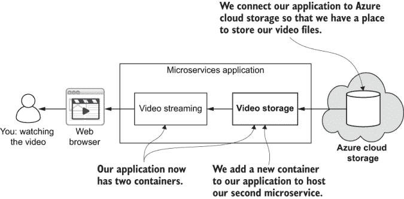

图 4.4 我们向应用程序添加第二个微服务和外部云存储。

图 4.4 显示了视频存储微服务将作为视频流微服务和外部云存储之间的中介。在本节的结尾，我们将更多地讨论这些微服务分离背后的原因。现在，只需满足于这个借口：这是介绍我们的第二个微服务的充分理由，因此，我们将正式运行一个微服务应用程序（尽管是一个小的应用程序）。

### 4.4.1 使用 Azure 存储

Azure 存储是微软提供的一种云存储服务。我们将使用它来为我们的应用程序添加存储功能。您应该已经从第三章的工作中拥有一个 Azure 账户，在本节中，我们将返回 Azure，创建一个存储账户，并上传我们的测试视频。然后我们将创建一个新的微服务，其目的是从存储中检索视频。

定义 *Azure 存储* 是一种微软 Azure 服务，用于在云中托管私有或公共文件。您将文件上传到 Azure 存储，然后可以通过 Azure 存储 API 访问这些文件。

虽然我们可以在 Azure 存储上托管私有和公共文件，但我们将使用私有选项。我们不希望任何人都能随意从存储中下载我们的视频。相反，我们希望他们通过前端进行操作。我们为新的微服务编写的代码通过 Azure 进行身份验证，并使用官方的 Azure Storage SDK for JavaScript（通过 npm 提供）检索视频。

为什么选择 Azure 存储？

我们有很多文件存储选项，为什么选择 Azure 存储？事实是，我们同样可以轻松地使用 AWS S3 或 Google Cloud Storage。对于本书中的我们的目的来说，这并没有太大的区别。我们编写的代码当然会有所不同，因为如果我们使用不同的云服务提供商，我们就必须使用不同的存储 API。

注意：本章的示例展示了使用 Azure 的外部云存储。在这种情况下，Azure 并没有什么特别之处。使用不同的 API，代码看起来会有所不同，但微服务的结构基本上是相同的。

对于我们来说，使用 Azure 很方便，因为您在上一个章节中已经注册了它。然而，没有必要被锁定在 Azure 上。

我们正在实施的架构的一个优点是，我们可以轻松地替换我们的 Azure 存储微服务，并用替代品替换它。我们甚至可以在我们的应用程序在生产中运行时这样做！从这个意义上说，您可以将这个视频存储微服务视为*热插拔*。

创建 Azure 存储帐户

在我们将测试视频放入存储之前，我们必须创建一个 Azure 存储帐户。为此，您需要登录到 Azure 门户[`portal.azure.com/`](https://portal.azure.com/)，就像在第三章中做的那样。然后在左侧菜单中，点击创建资源并搜索“存储帐户”，如图 4.5 所示。

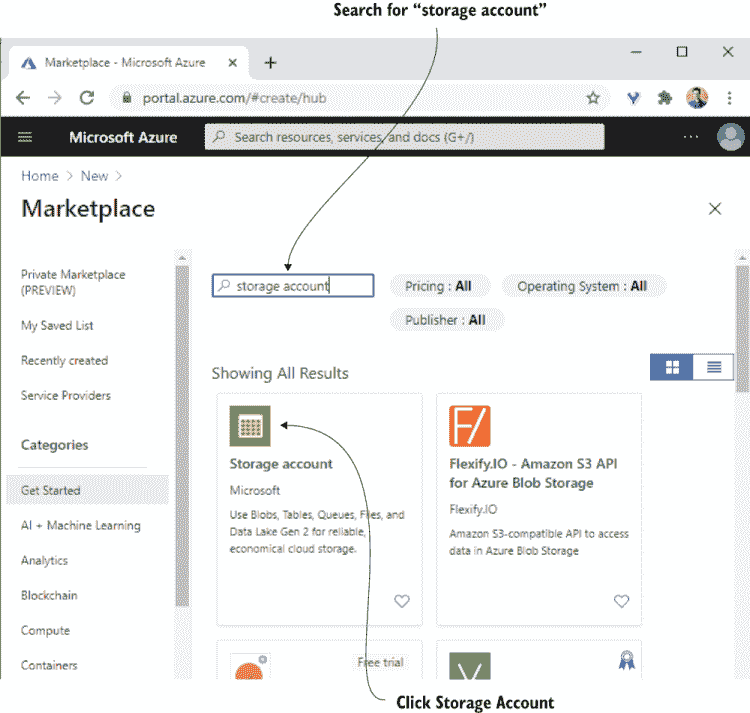

图 4.5 在 Azure 门户中创建新的存储帐户

点击 Microsoft 的存储帐户选项，然后点击创建。您现在可以填写您新存储帐户的详细信息，如图 4.6 所示。

您需要选择一个资源组。为此，您可以使用第三章中创建的资源组，或者您可以点击“创建新”来创建一个新的资源组。然后您需要为您的存储帐户选择一个名称。

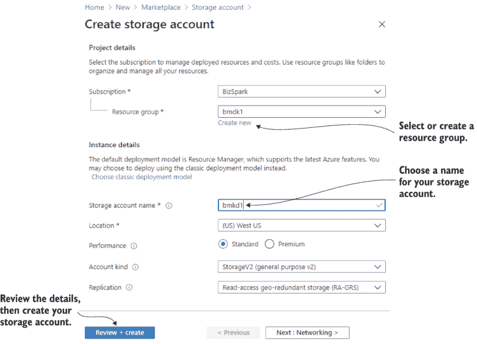

图 4.6 填写新存储帐户的详细信息

其他设置可以保留默认值。填写完详细信息后，点击“审查 + 创建”。如果详细信息通过验证，您就可以点击“创建”来创建存储帐户。如果它们没有通过验证，那么您需要按照指示修复问题。

现在，等待直到您收到通知，表示您的存储帐户已部署。在那个时刻，您可以在通知中点击“转到资源”，或者您可以在全局列表中找到您的资源，就像在第三章中做的那样。

一旦您在 Azure 门户中打开存储帐户，点击左侧菜单中的访问密钥。在这里，您将看到与图 4.7 所示类似的存储帐户访问密钥。这些是您需要与存储帐户进行身份验证的详细信息。记下您的存储帐户名称和一个密钥。您只需要一个密钥的值。您不需要连接字符串。

注意，图 4.7 显示了来自我的帐户的密钥。您需要查找您自己帐户的密钥。这些密钥当然与我的密钥不同，而且到您阅读这篇文章的时候，我的密钥可能已经不再有效了。

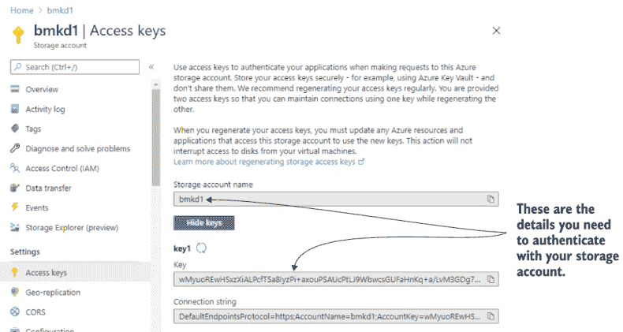

图 4.7 查看我们新存储帐户的认证详情

将您的视频上传到 Azure 存储

在我们的存储帐户创建完成后，我们现在可以上传我们的测试视频。在 Azure 门户中，当您的存储帐户打开时，点击左侧菜单中的容器。您应该会看到一个如图 4.8 所示的消息，表示您还没有任何容器。

顺便说一句，为了避免混淆，我需要说明，我们在这里讨论的容器与我们运行在微服务应用程序中的容器**不是**同一个。Azure 存储中的容器就像一个目录；它是一个存储文件的地点。

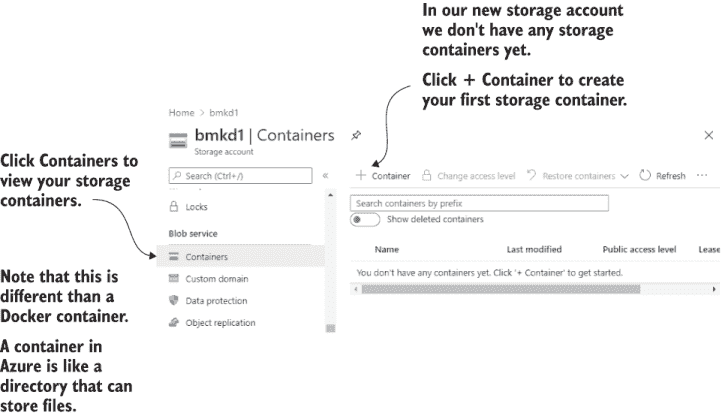

图 4.8 导航到容器并创建我们的视频容器

在工具栏中点击 + 容器按钮以创建你的第一个容器。现在为你的容器输入一个名称。在这个阶段你可以给它起任何名字，但为了与即将出现的示例代码兼容，让我们称它为 videos。在这里你还可以选择访问级别，但我们将保持默认设置，即仅私有访问。接下来，点击确定以创建容器。

现在你应该能在列表中看到视频容器。点击它以深入查看。在查看你新容器的内容时，你会看到一个如图 4.9 所示的消息。如果你想知道什么是 *blob*，它只是一个文件，我们目前还没有任何这样的文件。现在让我们上传一个。

在工具栏中点击上传按钮以上传你的视频文件，并从你的磁盘上选择一个文件进行上传。你可以使用第二章或第三章代码库中包含的测试视频；否则，使用你自己的选择。

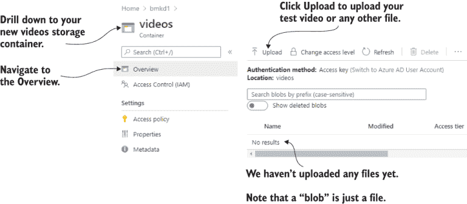

图 4.9 深入视频容器并点击上传以上传视频文件

视频上传后，它将如图 4.10 所示出现在列表中。

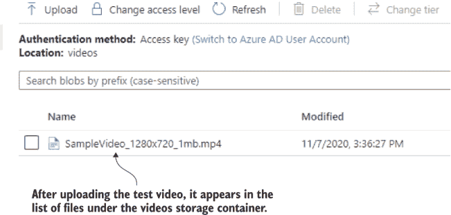

图 4.10 视频上传后，你将在视频容器下看到它

创建一个读取 Azure 存储的微服务

我们现在已经在 Azure 存储中上传了一个测试视频，因此是时候创建我们的新视频存储微服务了。这是我们第二个官方微服务，它将是一个 REST API，用于从我们的存储提供商检索视频。

注意 我们可以直接将我们的视频流微服务与云存储集成，但我们将把这个连接抽象化，通过另一个微服务来实现。这使得以后替换存储机制变得非常简单，并为我们的应用程序支持多个存储提供商铺平道路。

我们需要做的第一件事是为我们的第二个微服务创建一个新的目录。你应该创建一个新的子目录，或者只需将 chapter-4 代码库中的 example-2 加载到 VS Code 中。我们将为新微服务的子目录命名为 azure-storage*.* 我们特意这样命名新项目，以表明其目的与 Azure 存储相关。如果我们要添加不同的存储提供商，我们将使用不同的名称（例如，aws-storage 或 google-storage）。

简要说明：如果你在考虑将此处展示的代码移植到 AWS 或 GCP，将 Azure 存储微服务转换为其他提供商并不是一个简单的任务。与 Azure 相比，与 AWS 和 GCP 存储接口的 API 将相当不同，你需要单独阅读它们的文档来了解如何使用这些 API。确保你在尝试转换为任何其他提供商之前，已经在本章中完成了对 Azure 存储微服务的学习。

现在打开一个终端并切换到 azure-storage 目录。如果你是从头创建新的微服务，你需要创建一个新的 package.json 并安装 express 包，就像我们在第二章中所做的那样。然后你需要像这样安装 azure-storage 包：

```
npm install --save azure-storage
```

如果你正在跟随第四章代码仓库中的 example-2，你需要的一切已经准备好了：

+   包文件

+   代码

+   Dockerfile

要在 Node.js 下直接运行新微服务，你首先需要切换到 azure-storage 目录并安装依赖项：

```
npm install
```

列表 4.2 展示了我们新微服务的代码。在我们运行此代码之前，让我们先阅读并理解它在做什么。

列表 4.2 从 Azure 存储检索视频的微服务（chapter-4/example-2/azure-storage/src/index.js）

```
const express = require("express");
const azure = require('azure-storage');                 ①
const app = express();
const PORT = process.env.PORT;
const STORAGE_ACCOUNT_NAME = 
➥ process.env.STORAGE_ACCOUNT_NAME;                    ②
const STORAGE_ACCESS_KEY = 
➥ process.env.STORAGE_ACCESS_KEY;                      ③
function createBlobService() {                          ④
    const blobService = azure.createBlobService(STORAGE_ACCOUNT_NAME, 
    ➥ STORAGE_ACCESS_KEY);
    return blobService;
} 
app.get("/video", (req, res) => {                       ⑤
    const videoPath = req.query.path;                   ⑥
    const blobService = createBlobService();            ⑦
    const containerName = "videos";                     ⑧
    blobService.getBlobProperties(containerName, 
    ➥ videoPath, (err, properties) => {                ⑨
        if (err) {
            // ... error handling ...
            res.sendStatus(500);
            return;
        }
        res.writeHead(200, {                            ⑩
            "Content-Length": properties.contentLength,
            "Content-Type": "video/mp4",
        }); 
        blobService.getBlobToStream(containerName, 
        ➥ videoPath, res, err => {                     ⑪
            if (err) {
                // ... error handling ...
                res.sendStatus(500);
                return;
            }
        }); 
    });
});
app.listen(PORT, () => {
    console.log(`Microservice online`);
});
```

① 加载 azure-storage 包，以便我们的代码可以与 Azure Storage API 交互

② 从环境变量中获取存储账户的名称

③ 从环境变量中获取访问键的名称

④ 连接到 azure-storage API 的辅助函数

⑤ 用于从 Azure 存储检索视频的 HTTP GET 路由

⑥ 指定存储中视频的路径作为 HTTP 查询参数

⑦ 连接到 azure-storage API

⑧ 固定编码的容器名称。稍后我们可以根据某些目的（例如，通过用户 ID，以便我们可以为每个用户分别保存视频）来更改此名称。

⑨ 从 Azure 存储检索视频的属性

⑩ 将内容长度和 MIME 类型写入 HTTP 响应头

⑪ 从 Azure 存储流式传输视频到 HTTP 响应

在列表 4.2 中，我们使用`azure-storage`，这是通过 npm 安装的官方 Azure Storage SDK。我们同样使用 Express 创建了一个 HTTP 服务器，就像我们在第二章中所做的那样。

有两个新的环境变量用于配置此微服务；STORAGE_ACCOUNT_NAME 和 STORAGE_ACCESS_KEY 设置了我们的 Azure 存储账户的认证详情。请注意，你必须将这些环境变量设置为来自你自己的存储账户的认证详情。你将在下一节中这样做。认证详情用于辅助函数`createBlobService`以创建我们需要访问存储 SDK 的 API 对象。

列表 4.2 中最重要的是 HTTP GET 路由/video，通过它可以从存储中检索视频。此路由从 Azure 存储流式传输视频到 HTTP 响应。

独立测试我们的新微服务

在我们尝试将此微服务集成到我们的应用程序之前，最好先独立测试它。在这种情况下，我们可以先集成它，然后再进行测试。当我们的应用程序如此之小的时候，这样工作是可以行的。然而，随着我们的应用程序变得更大、更复杂，集成测试就变得更加困难。

单独测试微服务效果更好，因为我们可以快速启动或重新加载单个微服务。但对于整个应用程序来说，这样做并不容易。因此，让我们养成在集成测试整个应用程序之前先单独测试我们的微服务的习惯。

在运行（并测试）新微服务之前，我们需要设置环境变量来配置它。我们将从终端进行此操作。在 MacOS 和 Linux 上，我们这样做：

```
export PORT=3000
export STORAGE_ACCOUNT_NAME=<the name of your storage account>
export STORAGE_ACCESS_KEY=<the access key for your storage account>
```

在 Windows 上，我们这样做：

```
set PORT=3000
set STORAGE_ACCESS_KEY=<the name of your storage account>
set STORAGE_ACCESS_KEY=<the access key for your storage account>
```

注意，你必须插入你之前创建的存储账户的名称和密钥。当运行微服务时，我们可以选择以生产模式或开发模式运行，正如我们在第二章中讨论的那样。我们可以像这样以*生产模式*运行：

```
npm start
```

或者，我们可以以*开发模式*运行它，使用 nodemon 进行实时重新加载，如下所示：

```
npm run start:dev
```

实时重新加载对于快速开发来说非常重要，因为我们可以在代码中做出更改，并让微服务自动重启。在下一章中，你将学习如何将实时重新加载扩展到整个微服务应用程序。现在，我们将满足于在开发和测试单个微服务时使用它。

当你的微服务正在运行时，你现在可以打开你的浏览器并导航到 http://localhost:3000/video?path=SampleVideo_1280x720_1mb.mp4。如果你使用了不同的视频名称，你需要调整此 URL 中的视频名称以适应。你现在应该看到熟悉的视频正在播放，但这次是从你的 Azure 存储账户流式传输的。

我们将在第八章中更多地讨论微服务的测试。不过，现在让我们继续前进，将我们的新微服务集成到应用程序中。

### 4.4.2 更新视频流微服务

将新微服务集成到我们的应用程序中的第一步是更新我们的视频流微服务。作为提醒，我们在第三章结束时结束了一个从文件系统加载测试视频的视频流微服务。现在，我们将更新该微服务，使其委托视频加载到我们新的 Azure 存储微服务。

在这里，我们更新我们的视频流微服务，将存储委托给另一个微服务。我们正在*分离关注点*，这样视频流微服务就只负责将视频流式传输给我们的用户，并且它不需要知道存储处理的细节。

列表 4.3 展示了我们将对视频流微服务所做的更改。阅读列表中的代码，以了解我们是如何将视频的 HTTP 请求转发到新的视频存储微服务的。

列表 4.3 更新的视频流微服务（第四章/示例 2/video-streaming/src/index.js）

```
const express = require("express");
const http = require("http");                             ①
const app = express();
const PORT = process.env.PORT;
const VIDEO_STORAGE_HOST = 
➥ process.env.VIDEO_STORAGE_HOST;                        ②
const VIDEO_STORAGE_PORT =                                ②
➥ parseInt(process.env.VIDEO_STORAGE_PORT);              ②
app.get("/video", (req, res) => {
    const forwardRequest = http.request(                  ③
        {
            host: VIDEO_STORAGE_HOST,                     ④
            port: VIDEO_STORAGE_PORT,                     ④
            path:'/video?path=
            ➥ SampleVideo_1280x720_1mb.mp4',             ⑤
            method: 'GET',                                ⑥
            headers: req.headers                          ⑦
        }, 
        forwardResponse => {                              ⑧
            res.writeHeader(forwardResponse.statusCode, 
            ➥ forwardResponse.headers);                  ⑨
            forwardResponse.pipe(res);                    ⑩
        } 
    ); 

    req.pipe(forwardRequest);                             ⑪
});
app.listen(PORT, () => {
    console.log(`Microservice online`);
});
```

① 加载（内置）http 库以便我们可以转发 HTTP 请求

② 配置连接到视频存储微服务

③ 将 HTTP GET 请求转发到视频存储微服务的视频路由

④ 设置我们要转发的目标主机和端口

⑤ 设置我们要转发的路由

⑥ 将请求作为 HTTP GET 请求转发

⑦ 原样转发 HTTP 头部信息

⑧ 获取转发请求的响应

⑨ 返回转发请求的状态码和头部信息

⑩ 使用 Node.js 流管道响应流

⑪ 使用 Node.js 流管道请求流

在列表 4.3 中，我们使用 Node.js 内置的 http 库将一个微服务的 HTTP 请求转发到另一个微服务。然后返回的响应被流式传输到客户端。这种工作方式可能难以理解，但现在不必过于担心。在下一章中，我们将更深入地探讨这一点，因为微服务之间的通信非常重要，值得单独成章。

注意，我们目前硬编码了存储中视频的路径。这只是一个过渡步骤，我们很快就会解决这个问题。但为了使这段代码在同时工作，你必须已经将测试视频上传到这个路径。如果你上传了不同的视频，你应该相应地更改代码。

在更新我们的视频流微服务后，我们应该独立对其进行测试。鉴于它依赖于视频存储微服务，这有点困难。如果我们有模拟依赖项的工具和技术，我们就可以这样做。

模拟是测试中使用的技巧，其中我们用假或模拟的替代品替换依赖项。我们目前还没有这些技术，但这是我们在第八章中将要探讨的内容，你将在第九章中看到一个模拟微服务的示例。现在，让我们继续前进并完成集成。然后我们可以检查应用程序是否按预期工作。

### 4.4.3 将我们的新微服务添加到 Docker Compose 文件中

我们已经为此做了很多工作。我们创建了一个 Azure 存储账户，并上传了我们的测试视频。然后我们创建了第二个微服务，即 Azure 存储微服务，它是一个抽象我们的存储提供程序的 REST API。之后，我们更新了视频流微服务，使其不再像第二章和第三章那样从文件系统加载视频，而是现在通过视频存储微服务检索视频。

注意，Docker Compose 文件的优点在于它使得定义和管理一系列容器变得更加容易。这是一种管理微服务应用程序的便捷方式！

为了将新的微服务集成到我们的应用程序中并进行测试，我们现在必须将其添加到我们的 Docker Compose 文件的新部分中。您可以在图 4.11 中看到它的样子，该图显示了在添加第二个微服务和数据库服务器后 Docker Compose 文件将看起来如何。您可以看到左侧的 Docker Compose 文件有三个部分，对应右侧的三个容器。

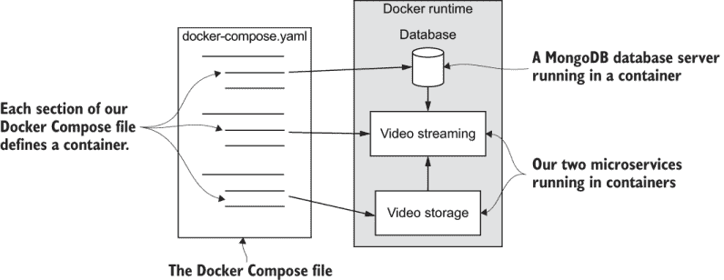

图 4.11 我们的 Docker Compose 文件中的每个部分定义了一个独立的容器。

您可以将 Docker Compose 文件视为一种 *聚合* Dockerfile，我们用它来描述和管理多个容器。它之所以是聚合的，是因为我们用它将每个微服务的多个 Dockerfile 连接起来。

列表 4.4 显示了我们的更新后的 Docker Compose 文件，其中添加了 Azure 存储微服务。在我们进行测试之前，请确保将 STORAGE_NAME 和 STORAGE_ACCESS_KEY 的值设置为之前从您自己的 Azure 存储账户中记录的值。

列表 4.4 向我们的 Docker Compose 文件中添加新的微服务（第四章/示例 2/docker-compose.yaml）

```
version: '3'
services:
  azure-storage:                                        ①
    image: azure-storage                                ②
    build: 
      context: ./azure-storage
      dockerfile: Dockerfile
    container_name: video-storage                       ③
    ports:
     - "4000:80"
    environment:
      - PORT=80
      - STORAGE_ACCOUNT_NAME=<your storage account>     ④
      - STORAGE_ACCESS_KEY=<your storage access key>    ④
    restart: "no"
  video-streaming:
    image: video-streaming
    build: 
      context: ./video-streaming
      dockerfile: Dockerfile
    container_name: video-streaming
    ports:
     - "4001:80"
    environment:
      - PORT=80
      - VIDEO_STORAGE_HOST=video-storage             ⑤⑥
      - VIDEO_STORAGE_PORT=80                          ⑥
    restart: "no"
```

① 将新的微服务添加到我们的应用程序中

② 设置图像名称

③ 容器的名称将这些两个微服务连接起来！

④ 配置微服务以连接到我们的 Azure 存储账户。请确保在此处添加您自己的详细信息。

⑤ 容器的名称将这些两个微服务连接起来！

⑥ 配置微服务以连接到视频存储微服务

在这一点上，你可能心中会有一些疑问：为什么容器名称设置为 `video-storage` 而不是 `azure-storage`？我们称微服务为 azure-storage，但容器名称却是 video-storage；这是为什么？这是一个故意的抽象。这是我们的设计的一部分，视频流微服务并不关心它从哪里获取视频！它对视频存储在 Azure 的事实不感兴趣。从它的角度来看，这些视频同样可以存储在任何其他地方，比如 AWS S3 或 Google Cloud Storage。

通过将我们的容器命名为 video-storage，我们现在能够使用一个与底层存储提供者无关的名称将我们的微服务连接到它。这是一种良好的应用程序结构实践。我们为自己提供了灵活性，以便将来能够替换 azure-storage 并用 aws-storage 或 google-storage 替换它。而且我们可以这样做而不中断视频流微服务。从它的角度来看，什么都没有改变。这种在未来进行更改而不产生连锁反应的自由很重要，这也表明我们正在充分利用我们的微服务架构。

### 4.4.4 测试更新后的应用程序

我们已经更新了我们的 Docker Compose 文件，以包含我们的两个微服务。现在我们终于准备好启动我们的应用程序，并使用我们的附加微服务进行测试。为此，我们像以前一样运行我们的应用程序：

```
docker-compose up --build
```

现在的区别是我们启动了两个容器，而不仅仅是单个容器。你可以在下面的示例中看到输出示例：

```
video-streaming    | > example-1@1.0.0 start /usr/src/app
video-streaming    | > node ./src/index.js
video-streaming    |
video-storage      |
video-storage      | > example-1@1.0.0 start /usr/src/app
video-storage      | > node ./src/index.js
video-storage      |
video-streaming    | Forwarding video requests to video-storage:80.
video-streaming    | Microservice online.
video-storage      | Serving videos from... 
video-storage      | Microservice online.
```

注意输出中每个容器的名称都打印在左侧。这是来自所有容器的日志聚合流。左侧的名称允许我们区分每个微服务的输出。

注意：我们使用单个命令启动多个容器来运行我们的应用程序，这样我们就可以使用多个微服务来测试我们的应用程序。

现在我们已经添加了第二个微服务，这是我们看到 Docker Compose 真正价值的开始。我们可以在以下两种方式中启动应用程序而不使用 Docker Compose：

+   *打开两个终端，并直接使用 Node.js 在一个终端中运行视频流微服务，在另一个终端中运行 Azure 存储微服务。* 这意味着两个终端和两个命令来运行我们的应用程序。

+   *使用 Docker 运行两个容器。* 在这种情况下，我们必须为每个微服务分别运行`docker build`和`docker run`。这意味着一个终端和四个命令。

没有人愿意整天重复输入命令。相反，Docker Compose 允许我们使用单个命令启动我们的应用程序，并且这可以扩展到任意数量的容器。

想象一下将来；我们已经用多达 10 个微服务构建了我们的应用程序。如果没有 Docker Compose，你至少需要输入 20 个命令来构建和启动你的应用程序。有了 Docker Compose，我们可以用单个命令构建和运行我们的 10 个微服务应用程序！无论我们需要多少个容器，它仍然是单个命令。

到目前为止，我们有两次测试的机会。至少，我们必须测试视频流微服务，因为目前这是我们唯一的面向客户的端点。为此，打开浏览器并导航到 http://localhost:4001/video。

再次，你会看到熟悉的测试视频。测试视频流微服务实际上测试了两个微服务，因为视频流微服务依赖于视频存储微服务。这两个微服务同时被测试。我们可以在这里停止，但也可以独立测试视频存储微服务。

如果你回顾一下列表 4.4，你会看到我们已经将其端口绑定到了 4000。我们可以将浏览器导航到该端口，并直接从视频存储微服务中查看视频流。然而，视频存储微服务期望我们告诉它视频所在的位置。我们通过 URL 来完成这个操作。让我们将浏览器导航到 http://localhost:4000/video?path=SampleVideo_1280x720_1mb.mp4 并测试视频存储微服务。

注意，像这样从*外部*测试内部微服务只可能在开发中实现。一旦我们将这个微服务移到生产环境，它的 REST API 只在 Kubernetes 集群内部可用。在这种情况下，我们将使其私有，因为我们不希望外部世界直接访问我们的视频存储。这是微服务的一个安全特性！我们可以控制哪些微服务暴露给外部世界，我们可以利用这一点来限制外部人士直接访问的应用程序部分。我们将在第十一章中更多地讨论安全性。

好吧，这就是我们做到的。我们给我们的应用程序添加了外部文件存储，在这个过程中，我们将它扩展到了两个微服务。然而，在我们自我祝贺之前，让我们考虑一些设计理论。

### 4.4.5 云存储与集群存储的比较

到目前为止，如果你对 Kubernetes 有所了解，你可能会想知道为什么我们没有使用 Kubernetes 卷来存储文件，而不是使用云存储。这是一个重要的设计决策，而且，这又是一种取决于你的项目、你的业务和你的客户需求的事情。

我们使用云存储而不是集群存储，因为它简单，我们在开发中运行时它有效，它便宜，而且有人为我们管理。这些都是云存储的好处，也是为什么许多公司普遍使用它的原因。此外，我们还没有学习关于 Kubernetes 的任何知识，所以我们肯定不能在本书的这个阶段使用 Kubernetes 卷。然而，还有一个重要的原因，为什么我通常选择使用云存储而不是集群存储。

我们可以将我们应用程序的文件和数据存储在 Kubernetes 集群中，但我更喜欢我的生产集群是无状态的。这意味着我可以随意销毁和重建集群，而不会丢失数据。稍后，这将使我们能够为我们的生产部署使用*蓝绿部署*，我们将在第十一章中讨论这一点。这使得构建与旧版本并行运行的新和更新实例变得容易。

为了将我们的客户升级到新版本，我们然后可以切换 DNS 记录，这样主机名现在就指向了新实例。这为我们提供了低风险的方式来对我们的应用程序进行重大升级。它低风险并不是因为不会出现问题，而是因为如果出现问题，我们可以快速将 DNS 切换回旧实例，这样我们的客户就可以（几乎）立即恢复到之前的（并且可能是有效的）版本。

### 4.4.6 我们取得了什么成果？

恭喜！我们现在有一个小型的微服务应用程序在运行！这是一个大事件。使用 Docker Compose，我们创建了一个支架，我们可以轻松地添加新的微服务并扩展我们的应用程序。花点时间给自己鼓掌。这是一个重要的里程碑！

我们取得了什么成果？我们向应用程序添加了文件存储功能。我们的微服务现在具有将文件存储在外部云存储中的能力，这为我们的应用程序提供了一个托管视频的地方。

我们还添加了第二个微服务。由于 Docker Compose 已经到位，我们现在可以通过向其中添加新的容器来继续扩展我们的应用程序。当我们向应用程序添加数据库服务器时，我们将在稍后再次利用这种能力。

我们添加了第二个微服务，作为我们的存储提供者的抽象。这是一个有利的决策设计。现在我们可以用不同的存储提供者替换和替换我们的视频存储微服务，而对应用程序的影响最小。我们甚至可以在应用程序在生产环境中运行时这样做！未来甚至可能需要同时运行多个存储微服务。如果适合我们的产品，我们可以将其升级以支持 Azure 存储、AWS S3 和 Google Cloud Storage！

存储工作细节已被限制在视频存储微服务的内部。这意味着我们可以独立于应用程序的其他部分更改这些细节，而不会引起连锁问题。这种保护可能现在看起来是多余的，但随着我们应用程序的增长，它变得更为重要。

注意：最终，我们的应用程序将成为许多微服务之间通信的蜘蛛网。一个微服务的更改有可能在应用程序中引起指数级的问题连锁。仔细构建微服务之间的接口以最小化它们的耦合，有助于我们充分利用微服务架构。

将我们的微服务分离，即所谓的关注点分离（在第一章中提到），很重要——每个微服务应该负责其自己的独立责任区域。我们也在遵循单一责任原则（也在第一章中提到），即每个微服务应该负责一件事情。我们的微服务现在负责它们自己的责任区域：

+   视频流微服务负责将视频流式传输到用户。

+   视频存储微服务负责在存储中定位视频并检索这些视频。

以这种方式分离微服务有助于确保每个微服务都小、简单且易于管理。

## 4.5 向我们的应用程序添加数据库

数据管理的另一半与数据库有关。大多数应用程序需要某种类型的数据库来存储它们的动态数据，FlixTube 也不例外。

我们首先需要为每个视频存储元数据。我们将通过存储每个视频的路径来开始使用我们的数据库。这将解决我们之前遇到的问题，即在我们的视频流微服务中有一个硬编码的视频文件路径。

注意 实际上，几乎所有应用程序都需要某种类型的数据库来存储应用程序将要更新的数据。

图 4.12 显示了添加数据库后我们的应用程序将看起来是什么样子。除了我们两个微服务的两个容器外，我们还将有一个容器来托管 MongoDB 数据库。您可以在图中看到，只有视频流微服务连接到数据库；视频存储微服务不需要数据库。

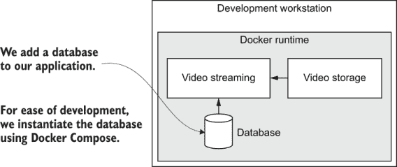

图 4.12 将数据库添加到我们的应用程序中

### 4.5.1 为什么选择 MongoDB？

MongoDB 是所谓 NoSQL 数据库中最受欢迎的一种。使用 Docker 允许我们几乎拥有一个“即时数据库”。我们只需要指定数据库镜像的名称，Docker 就会从 DockerHub 中拉取它并在我们的开发工作站上实例化它。

注意 MongoDB 易于使用，提供了一种灵活的数据库，可以存储无模式的结构化数据，并且具有丰富的查询 API。

但是，我们可以轻松启动许多不同的数据库，为什么选择 MongoDB 呢？根据我的经验，即使是手动下载和安装 MongoDB 也比旧的和更传统的数据库要容易；现在有了 Docker，这甚至更容易。像任何数据库一样，我们可以使用 MongoDB 来存储丰富的结构化数据。MongoDB 也以其高性能和极高的可扩展性而闻名。

我处理很多不可预测的数据，很难预测接下来会抛给我什么。我喜欢 MongoDB 不强迫我定义固定模式的事实！尽管如此，如果您使用像 Mongoose ([`www.npmjs.com/package/mongoose`](https://www.npmjs.com/package/mongoose)) 这样的对象关系映射（ORM）库，当然也可以使用 MongoDB 定义模式。

MongoDB 也易于在许多不同的编程语言中进行查询和更新。它得到了良好的支持，拥有优秀的文档，并且有大量的示例在流传。MongoDB 是开源的。您可以在以下位置找到代码：[`github.com/mongodb/mongo`](https://github.com/mongodb/mongo)。

### 4.5.2 在开发中添加数据库服务器

我们打算使用 Docker Compose 在开发中的应用程序中添加一个数据库，就像我们在本章前面添加视频存储微服务时所做的那样。我们将为我们的应用程序添加一个新容器来托管单个数据库服务器。我们只需要一个服务器，但可以在该服务器上托管多个数据库。这意味着我们为未来做好了准备，可以轻松地随着我们向应用程序添加更多微服务而创建更多数据库。

将数据库服务器添加到 Docker Compose 文件中

要将数据库服务器添加到我们的应用程序中，我们必须更新我们的 Docker Compose 文件。Docker Compose 使得将数据库添加到我们的应用程序变得容易。我们只需在 Docker Compose 文件中添加几行，以指定数据库的公共 Docker 镜像并设置一些配置。Abracadabra，即时数据库！

列表 4.5 显示了更新的 Docker Compose 文件。我们在文件顶部添加了一个名为`db`（代表数据库）的新部分。这个容器的配置与我们之前添加的微服务的配置不同。这是因为现在我们不需要为新容器构建镜像。相反，我们使用从 Docker Hub 公开发布的`mongo`镜像。

列表 4.5 添加 MongoDB 数据库（chapter-4/example-3/docker-compose.yaml）

```
version: '3'
services:
  db:                                        ①
    image: mongo:4.2.8                       ②
    container_name: db                       ③
    ports:
     - "4000:27017"                          ④
    restart: always                          ⑤
  azure-storage:
    image: azure-storage
    build: 
      context: ./azure-storage
      dockerfile: Dockerfile
    container_name: video-storage
    ports:
     - "4001:80"
    environment:
      - PORT=80
      - STORAGE_ACCOUNT_NAME=<your Azure storage account name here>
      - STORAGE_ACCESS_KEY=<your Azure storage account key here>
    restart: "no"
  video-streaming:
    image: video-streaming
    build: 
      context: ./video-streaming
      dockerfile: Dockerfile
    container_name: video-streaming
    ports:
     - "4002:3000"
    environment:
      - PORT=80
      - DBHOST=mongodb://db:27017           ⑥
      - DBNAME=video-streaming              ⑦
      - VIDEO_STORAGE_HOST=video-storage
      - VIDEO_STORAGE_PORT=80
    restart: "no"
```

① 将 MongoDB 数据库服务器添加到我们的微服务应用程序中

② 设置镜像名称和版本。这是一个从 Docker Hub 检索的公共 MongoDB 镜像。

③ 设置在应用程序中实例化的容器名称。我们的微服务使用此名称连接到数据库。

④ 将 MongoDB 标准端口 27017 映射到我们的主机 OS 上的 4000。我们可以使用端口 4000 与主机上的数据库交互和检查。

⑤ 设置重启策略为始终。如果 MongoDB 崩溃（这几乎从未发生），它会自动重启。

⑥ 配置微服务以连接到数据库

⑦ 设置微服务用于其数据库的名称

在我们的更新后的应用程序中，视频流微服务将连接到数据库。请注意，我们现在有了新的环境变量，DBHOST 和 DBNAME，它们配置了微服务与其数据库的连接。

还值得注意在 db 容器的配置中，我们如何映射容器的端口。在这里，我们将标准的 MongoDB 端口 27017 映射到 4000。这意味着什么？在 Docker 运行时，其他容器可以使用 27017 访问数据库。这是 MongoDB 的传统端口，所以我们将坚持使用它。

在我们的主机操作系统（OS）上，我们将端口映射到 4000。这是一个任意的选择。我们可以给它任何数字，包括 27017。我更喜欢不使用标准的 MongoDB 端口，因为这可能会与我们在主机 OS 上可能运行的 MongoDB 实例冲突。

这是一个良好的设置。我们的应用程序可以通过标准端口与 MongoDB 交互，但我们可以使用工具（正如我们很快将看到的）直接从我们的开发工作站查询和编辑我们的数据库。这对于开发来说非常好，因为它使我们能够直接与数据库交互和查询。

更新视频流微服务以使用数据库

我们在我们的 Docker Compose 文件中添加了环境变量，以便将我们的视频流微服务连接到其数据库。现在我们需要更新这个微服务的代码，以便使用这些环境变量建立数据库连接。

列表 4.6 显示了更新后的视频流微服务的代码，允许它查询和读取数据库中的数据。浏览此代码，注意它与之前的版本有何不同。

列表 4.6 更新微服务以使用数据库（chapter-4/example-3/video-streaming/src/index.js）

```
const express = require("express");
const http = require("http");
const mongodb = require("mongodb");                                  ①
const app = express();
const PORT = process.env.PORT;
const VIDEO_STORAGE_HOST = process.env.VIDEO_STORAGE_HOST;
const VIDEO_STORAGE_PORT = parseInt(process.env.VIDEO_STORAGE_PORT);
const DBHOST = process.env.DBHOST;                                   ②
const DBNAME = process.env.DBNAME;                                   ③
function main() {                                                    ④
    return mongodb.MongoClient.connect(DBHOST)                       ⑤
        .then(client => {
            const db = client.db(DBNAME);                            ⑥
            const videosCollection = 
            ➥ db.collection("videos");                              ⑦

            app.get("/video", (req, res) => {
                const videoId = 
                ➥ new mongodb.ObjectID(req.query.id);               ⑧
                videosCollection
                ➥ .findOne({ _id: videoId })                        ⑨
                    .then(videoRecord => {
                        if (!videoRecord) {
                            res.sendStatus(404);                     ⑩
                            return;
                        }

                        const forwardRequest = http.request( 
                            {
                                host: VIDEO_STORAGE_HOST,
                                port: VIDEO_STORAGE_PORT,
                                path:`/video?path=${videoRecord
                                ➥ .videoPath}`,                     ⑪
                                method: 'GET',
                                headers: req.headers
                            }, 
                            forwardResponse => {
                                res.writeHeader(forwardResponse.statusCode, 
                                ➥ forwardResponse.headers);
                                forwardResponse.pipe(res);
                            }
                        );

                        req.pipe(forwardRequest);
                    })
                    .catch(err => {
                        console.error("Database query failed.");
                        console.error(err && err.stack || err);
                        res.sendStatus(500);
                    });
            });

            app.listen(port, () => {
                console.log(`Microservice online.`);
            });
        });
}                                                                   ④
main()                                                              ⑫
    .then(() => console.log("Microservice online."))
    .catch(err => {
        console.error("Microservice failed to start.");
        console.error(err && err.stack || err);
    }); 
```

① 加载 MongoDB 库，以便微服务可以连接到其数据库

② 指定要连接的数据库服务器

③ 设置此微服务用于其数据库的名称

④ 将此微服务的主体包装在 main 函数中。这是此微服务的主要入口点。你能看出我是一名恢复中的 C++程序员吗？

⑤ 连接到数据库服务器

⑥ 获取此微服务使用的数据库

⑦ 获取存储每个视频元数据的视频集合

⑧ 通过 HTTP 查询参数指定视频 ID。这是一个 MongoDB 文档 ID。

⑨ 通过请求的 ID 查询数据库以找到单个视频

⑩ 视频未找到！以 HTTP 404 错误代码响应

⑪ 在将 HTTP 请求转发到视频存储微服务时，将视频的 ID 映射到视频的位置

⑫ 启动微服务

列表 4.6 通过视频 ID 查询其数据库以检索存储中视频的位置。然后它将此位置传递给视频存储微服务以检索存储在那里的视频。这里的其他代码应该很熟悉。我们正在将视频的 HTTP 请求转发到视频存储微服务。

对视频流微服务的这次更新移除了硬编码的视频路径。相反，我们现在通过数据库 ID 来引用视频。我们本可以不使用 ID 来解决这个问题。我们可以简单地通过存储中的路径来引用视频。但正如你可能怀疑的那样，这并不是一个好主意。让我们考虑一下原因。

如果我们用*路径*来标识我们的视频，那么在将来如果我们决定想要重新结构化我们的存储文件系统时，将视频移动到不同的位置就会变得困难。这个问题之所以存在，是因为各种其他数据库和记录都需要引用我们的视频。这包括一个元数据数据库，用于记录有关视频的信息，例如其类型。我们稍后还想要一个数据库来记录每个视频的推荐和观看情况。

每个数据库都必须有一种方式来引用视频。如果我们只为每个视频记录 ID，我们就有更多的自由来独立更改我们的存储，而不会导致任何糟糕的问题在我们的微服务和数据库中蔓延。

这也使得事情变得稍微简单一些，因为视频的位置可能是一个很长的路径，而像这样的内部细节通常我们不希望泄露到我们的应用程序中。为什么？暴露这样的细节，暗示内部结构，可能会给潜在的攻击者带来优势。最好是将这类信息保密。

在我们的数据库中加载一些测试数据

我们已经在 Docker Compose 文件中添加了一个数据库，并且我们已经更新了视频流微服务以使用该数据库。我们几乎准备好测试我们的更改了！

为了测试我们的更新代码，我们现在必须将一些测试数据加载到我们的数据库中。稍后，我们将为我们的用户提供上传他们自己的视频并使用相关细节填充数据库的方法，但我们的应用程序中还没有实现这一功能。

我们可以通过用某种模拟的数据库版本替换它来测试我们的代码。我指的是模拟数据库。（我们之前在本章中已经讨论过模拟。）我们还可以通过使用*数据库固定数据*来实现这一点，这是一种仅用于测试而加载到我们的数据库中的测试数据。

我们有各种方法可以将数据加载到我们的数据库中。最简单的方法是使用 Robo 3T（之前称为 Robomongo）。这是一个用于处理 MongoDB 的出色 UI 工具。我自己一直在使用它，如果你读过我的第一本书《使用 JavaScript 数据整理》（Manning，2018），你应该已经知道了。它适用于 Windows、MacOS 和 Linux。

有关 Robo 3T 的下载和安装说明，请参阅[`robomongo.org/`](https://robomongo.org/)。Robo 3T 允许您查看数据库中的集合和文档。您可以轻松创建数据库、集合和数据记录。

但在我们能够使用 Robo 3T 将示例数据加载到我们的数据库之前，我们首先必须确保我们的数据库正在运行。我们可以通过启动我们的应用程序来实现这一点。如果你还没有这样做，请打开一个终端并启动你的应用程序：

```
docker-compose up --build
```

注意：您应该从列表 4.5 中的更新 Docker Compose 文件相同的目录运行此命令。您可以在第四章代码存储库的 example-3 子目录中找到此文件。

启动我们的应用程序后，我们现在有一个 MongoDB 数据库服务器在容器中运行。由于我们将标准 MongoDB 端口 27017 映射到我们的开发工作站上的端口 4000，我们现在可以通过连接到 localhost:4000 来从 Robo 3T 访问数据库。

列表 4.7 显示了我们将使用 Robo 3T 添加到数据库中的测试数据。这是一个位于 example-3 目录下的单个 JSON 文档，适合使用 Robo 3T 进行复制粘贴插入。

要使用 Robo 3T 加载数据，请打开该应用程序，创建一个名为 video-streaming 的新数据库，创建一个名为 videos 的集合，然后在该集合中插入一个文档。为了我们的目的，使用此列表中的内容。

列表 4.7 使用 Robo 3T 加载数据记录（第四章/示例 3/db-fixture/videos.json）

```
{                                                     ①
    "_id" : { "$oid": "5d9e690ad76fe06a3d7ae416" },   ①②

    "videoPath" : "SampleVideo_1280x720_1mb.mp4"      ①③

}                                                     ①
```

① 要加载到数据库中的数据记录

② 将视频的 ID 设置为 MongoDB 文档的 ID 的特殊语法

③ 设置视频的位置

我们将在第八章中回到模拟和数据库固定数据。现在，让我们看看如何测试我们的应用程序。

测试我们的更新应用程序

在这个阶段，如果您愿意，可以先直接在 Node.js 下测试微服务。在将微服务集成之前独立测试它们总是一个好主意。如果您自己组合代码并在 Node.js 下直接测试，别忘了从 npm 安装 mongodb 驱动程序包：

```
npm install --save mongodb
```

没有必要逐个向您介绍每个新微服务的单独测试。为了提高效率，我们将跳过这一步骤，直接在 Docker Compose 中的应用中运行我们的集成代码。

您应该已经从上一节运行了应用程序。我们之所以需要它，是为了数据库，以便我们可以加载测试数据。如果应用程序没有运行，现在就启动它：

```
docker-compose up --build
```

我们现在可以用通常的方式用网络浏览器测试应用程序。不过，这次我们必须提供我们想要观看的视频的 ID。我们在测试数据中指定的 ID 是一长串数字，这就是我们现在必须添加到我们的 URL 中，以测试更新的应用程序。打开您的浏览器并导航到这个链接：

http://localhost:4002/video?id=5d9e690ad76fe06a3d7ae416

如果您更改了测试数据中的 ID，您也需要更新此 URL 中的 ID。现在您应该已经非常熟悉这个视频了！

### 4.5.3 在生产中添加数据库服务器

到目前为止，我们只讨论了将数据库服务器添加到我们应用程序的开发版本的情况。这目前足够好了，因为我们还没有学习如何将应用程序部署到生产环境；这将在第六章和第七章中介绍。不过，我们现在可以简要考虑我们可能如何为生产环境部署数据库服务器。

Docker Compose 使得将数据库服务器添加到我们的开发应用中变得容易，但对于生产环境呢？对于生产环境，我建议使用 Kubernetes 集群外部的数据库。这保持了集群无状态，正如我们在 4.4.5 节中讨论的，这意味着我们可以在不危及数据的情况下随时拆解和重建我们的集群。

一旦我们构建了生产 Kubernetes 集群，我们可以轻松地将 MongoDB 数据库部署到生产环境中，其方式与我们刚刚使用 Docker Compose 所做的方式类似。实际上，这就是我们在第七章将要做的，因为这是我们最容易将数据库服务器部署到生产环境中的方法。

尽管如此，我建议您将数据库与集群分开。您可以在单独的虚拟机上运行它，或者可以使用外部托管数据库。这样做的原因是为了保持生产集群无状态。

使用托管数据库的另一个优点是安全性。数据库提供商为我们处理维护工作；它负责保护并备份我们的数据！如果我们为一家大公司工作，我们的公司可能会内部管理这项工作。但如果我们为一家小公司或初创公司工作，我们需要尽可能多的帮助。

### 4.5.4 每个微服务或每个应用的数据库？

到目前为止，我们已经在数据库服务器上创建了一个数据库。但现在我们已经准备好创建更多的数据库。

你可能已经注意到，我们给数据库命名为 video-streaming，以与使用它的微服务相呼应！这暗示了我们将在整本书中遵循的一条规则：*每个微服务都应该有自己的数据库*。我们这样做是因为我们希望将数据封装在微服务中，就像在面向对象编程中将数据封装在对象中一样。

我们应该为每个微服务或每个应用使用一个数据库吗？当然，目标是每个微服务只有一个数据库。您的数据库可以托管在单个服务器上，但请确保每个微服务都有自己的数据库。如果您共享数据库或将数据库作为微服务之间的集成点，您将邀请架构和可扩展性问题。

我们限制了除直接封装它的代码之外的所有数据。这有助于我们随着时间的推移安全地演变数据结构，因为对它的更改可以*隐藏*在微服务中。这是另一种技术，如果我们精心设计 REST API，就可以避免将中断和问题从微服务传播到应用程序的其他部分。在设计这些 REST API 时应用的谨慎等于我们应用程序的更好设计。

你可能会认为在微服务之间共享数据库是它们共享数据的好方法。但将数据库用作微服务之间的集成点或接口是一个糟糕的想法，因为它会使应用程序更加脆弱且扩展性更差。

在某个时候，你可能会发现自己想要为了性能或其他原因而共享一个数据库。毕竟，有时为了实现困难的目标，规则有时不得不被打破。仔细考虑你为什么要这样做，以及这是否真正必要。将这种反模式引入我们的应用程序不是我们应该盲目做的事情。我们将在第十一章中更多地讨论数据库和可扩展性。

### 4.5.5 我们取得了什么成果？

我们已经向我们的应用程序添加了一个数据库。现在我们有两种不同的方法来管理应用程序的数据：我们可以在外部云存储中存储文件，也可以在数据库中存储数据。我们很好地使用了 Docker Compose 来运行由多个容器组成的应用程序，并将我们的应用程序升级为两个微服务和数据库。

我们将我们的存储提供商隐藏在视频存储微服务之后。它的任务是检索存储中的视频。我们实施的抽象允许我们轻松地在不影响应用程序的情况下更改存储提供商。

我们创建了一个数据库服务器，并为我们的视频流微服务添加了一个数据库。我们遵循每个微服务应该有自己的数据库的规则，在未来，我们可以轻松地向我们的服务器添加更多数据库，并继续满足这一规则。

我们还简要地看到了一个微服务如何与另一个微服务通信。视频流微服务接收到的 HTTP GET 请求被转发到视频存储微服务。这是第一个也是最简单的通信形式，一个微服务可以使用它来请求或委托任务给另一个微服务。在下一章中，我们将更深入地探讨这一点以及其他微服务之间的通信方法。此外，我们将进一步扩展我们的 Docker Compose 技能，并学习如何将自动实时重新加载应用到我们的整个微服务应用程序中。

## 4.6 Docker Compose 回顾

在本章中，我们已经看到了 Docker Compose 的价值日益增加，我们使用它来帮助我们管理开发工作站上不断增长的应用程序的复杂性。即使只运行一个容器，它也是有用的，因为它允许我们捕获和记录配置细节。在那个早期阶段，它神奇地将两个命令合并成了一个。

随着我们通过本章的进展，我们向我们的应用程序中添加了两个额外的容器，Docker Compose 的价值变得更加明显。我们可以向我们的应用程序添加任意数量的容器，我们可以记录它们的全部配置细节，无论我们有多少个容器，我们都可以使用单个命令将它们作为一个聚合实体来管理。

图 4.13 显示了在 Docker Compose 下运行的应用程序简单生命周期。我们使用 `up` 命令启动我们的应用程序及其所有微服务。我们使用 `down` 命令销毁我们的应用程序，并将我们的开发工作站恢复到干净状态。

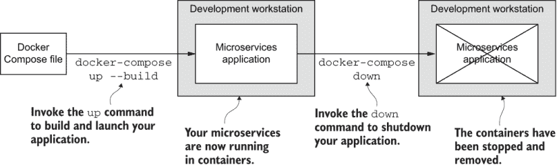

图 4.13 使用 Docker Compose 时你的微服务应用程序的生命周期

在你完成本章之前，快速浏览表 4.2 以回顾你学到的 Docker Compose 命令。在这个页面上放置书签，以便当你需要帮助使用 Docker Compose 时可以快速返回此处。

表 4.2 Docker Compose 命令回顾

| 命令 | 描述 |
| --- | --- |
| `docker-compose` `--version` | 检查 Docker Compose 是否已安装并打印版本号 |
| `docker-compose up --build` | 在当前工作目录中构建并实例化由 Docker Compose 文件（docker-compose .yaml）定义的由多个容器组成的应用程序 |
| `docker-compose ps` | 列出由 Docker Compose 文件指定的应用程序中的运行中的容器 |
| `docker-compose stop` | 停止应用程序中的所有容器，但保留已停止的容器以供检查 |
| `docker-compose down` | 停止并销毁应用程序，使开发工作站处于干净状态 |

## 4.7 继续你的学习

本章简要介绍了两个重要主题。我们向应用程序添加了一个新的微服务，并将其连接到我们的 Azure 存储帐户。我们还向应用程序添加了一个 MongoDB 数据库。Azure 和 MongoDB 都是各自拥有广阔世界的技术，因此现在我将给你一些参考资料，以便你更深入地了解这些领域：

+   《Azure in Action》由 Brian H. Prince 和 Chris Hay 著（Manning, 2010）

+   《一个月午餐时间学会 Azure》由 Iain Foulds 著（Manning, 2018）

+   《MongoDB in Action》，第 2 版，由 Kyle Banker、Peter Bakkum 等人著（Manning, 2016）

要了解更多关于 Docker Compose 的信息，请在线阅读文档：

+   [`docs.docker.com/compose/`](https://docs.docker.com/compose/)

+   [`docs.docker.com/compose/compose-file/`](https://docs.docker.com/compose/compose-file/)

+   [`docs.docker.com/compose/reference/`](https://docs.docker.com/compose/reference/)

在本章中，我们使用 Docker Compose 将服务扩展到了多个微服务。我们还为我们的应用程序添加了数据管理功能。在下一章中，我们将更详细地学习如何使我们的微服务相互通信。我们还将提高使用 Docker Compose 的技能，并学习如何扩展 *实时重新加载* 以使其在整个应用程序中工作。

## 摘要

+   我们创建了一个 Docker Compose 文件，该文件指定了应用程序中的微服务。

+   你学习了如何使用 Docker Compose 命令 `up` 和 `down` 来运行你的微服务开发应用程序。

+   你学习了如何创建 Azure 存储帐户并将视频上传到其中。

+   我们向应用程序添加了第二个微服务，用于从 Azure 存储中检索视频。

+   我们修改了我们的视频流微服务，使其将请求转发到新的视频存储微服务。

+   我们在应用程序中包含了一个 MongoDB 数据库来存储有关视频的信息。

+   我们修改了我们的视频流微服务，使其使用数据库来确定视频的位置。
