# 6 创建您的生产环境

本章涵盖

+   为您的应用程序构建生产基础设施

+   使用 Terraform 脚本创建基础设施

+   创建一个 Kubernetes 集群以托管微服务

+   与您的 Kubernetes 集群交互

最后，我们来到了这本书中最激动人心的章节！接下来的两个章节也可能是迄今为止最难的，但请务必跟随示例进行学习。这样你才能学到最多，并获得将自己的应用程序投入生产的真实经验。

在本章和下一章中，我们将创建一个 Kubernetes 集群并将容器部署到其中：一个 MongoDB 数据库，一个 RabbitMQ 服务器，当然还有我们的视频流微服务。在下一章中，我们还将构建一个持续交付（CD）管道，该管道会自动将我们的更新代码部署到生产环境中。这两个章节中的示例旨在让您逐步跟随构建我们的基础设施和应用。这紧密地模拟了原型化新基础设施的真实过程，并且接近我在自己开发中真正做的事情。

这些章节是我们进行生产部署所需的两部分。在第六章，也就是本章，我们将构建我们的生产基础设施。到本章结束时，我们将拥有一个全新的容器注册库和一个空白的 Kubernetes 集群，它们都准备好了，等待托管我们的应用程序。在第七章，我们将继续努力，学习如何通过自动化部署管道部署我们的微服务。让我们开始吧！

## 6.1 新工具

本章介绍了两个新工具：Kubernetes 和 Terraform。这两个工具如此重要，以至于它们成为了本书的标题！我们将使用 Terraform 为我们微服务应用程序创建基础设施，包括我们的 Kubernetes 集群。

表 6.1 第六章中的新工具

| 工具 | 版本 | 目的 |
| --- | --- | --- |
| Kubernetes | 1.18.8 | Kubernetes 是我们用于在生产中托管微服务的计算平台。 |
| Terraform | 0.12.29 | Terraform 允许我们脚本化创建云资源和应用程序基础设施。 |
| Kubectl | 1.18.6 | Kubectl 是与 Kubernetes 集群交互的命令行工具。 |
| Azure CLI | 2.9.1 | 我们将使用 Azure 命令行工具对 Azure 进行身份验证，并允许 Terraform 访问我们的 Azure 账户。此工具通常用于管理 Azure 账户和云资源。 |

## 6.2 获取代码

要跟随本章，您需要下载代码或克隆存储库。

+   从这里下载代码的 zip 文件：

    [`github.com/bootstrapping-microservices/chapter-6`](https://github.com/bootstrapping-microservices/chapter-6)

+   您可以使用 Git 克隆代码如下：

    `git clone https://github.com/bootstrapping-microservices/chapter-6.git`

如需安装和使用 Git 的帮助，请参阅第二章。如果您在代码方面遇到问题，请在 GitHub 的存储库中记录一个问题。

## 6.3 进入生产

那一天已经到来。我们将我们的应用程序部署到生产环境。虽然看起来将这个小型应用程序部署到生产环境可能还为时尚早，但实际上，在正常开发情况下，我确实主张尽可能早地将应用程序部署到生产环境。也许不会像现在这样早，但我确实认为当你的应用程序仍然很小时进入生产环境是一个好主意。那为什么？

进入生产意味着将我们的应用程序放置在客户可以看到并使用它的位置。将我们的产品展示给用户是获取反馈、适应他们的需求并构建有价值功能的关键。如果我们不进入生产，我们就不会得到那些反馈。拥有允许快速可靠更新的部署管道是我们进行实验和找出如何制作出优秀产品的最佳工具。

此外，当我们的应用程序仍然很小的时候，这是构建 CD 管道并进入生产阶段的最佳时机。当我们的应用程序很小的时候，部署起来更容易。但随着我们的应用程序变得越来越大，这项任务会变得越来越困难。

图 6.1 展示了本章我们将做什么。我们将在我们的开发工作站（或个人电脑）上使用 Terraform 在云中构建基础设施。我们将使用代码创建我们的容器注册表和 Kubernetes 集群。然后，在第七章中，我们将学习如何通过持续交付（CD）自动化这一切。但就目前而言，我们将学习通过手动调用 Terraform 来演进我们的开发基础设施。

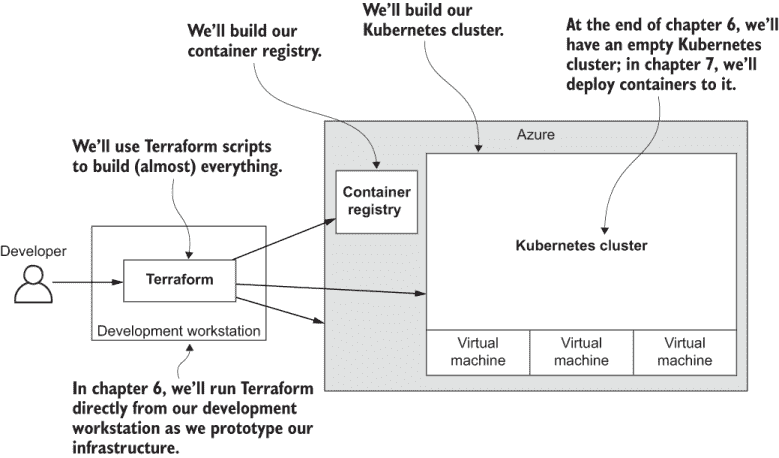

图 6.1 使用 Terraform 原型化我们的基础设施

## 6.4 基础设施即代码

基础设施即代码是我们将在本章中使用的技术，以将我们的应用程序部署到生产环境。它被称为*基础设施即代码*，因为与手动创建基础设施（例如，通过 GUI，就像我们在第三章中为我们的私有容器注册表所做的那样）不同，我们将编写创建我们基础设施的代码。

不仅此代码将描述我们的基础设施，我们还将执行它以实际创建我们的基础设施。使用代码创建基础设施意味着我们可以可靠地、重复地按需创建和重新创建我们的基础设施，并且可以像我们喜欢的那样频繁地这样做。

代码不仅描述了我们的基础设施，还构建了它，这使得它成为一种*可执行文档*。它是对我们希望基础设施看起来怎样的声明，并且与正常的（即不可执行的）文档不同，这是一种永远不会过时的文档形式。

通过基础设施即代码，创建和更新我们的基础设施变成了一种编码任务。最佳的基础设施即代码形式使用声明性语言而不是过程性语言。这意味着它描述了基础设施的配置和布局，而不是构建它的逐步指令。我们更喜欢声明性格式，因为我们可以让我们的工具承担繁重的工作，并且这些工具可以找出更改我们基础设施的最佳方式。

图 6.2 阐述了基础设施即代码的概念。我们的基础设施代码存储在代码仓库中，例如 Git。从那里，我们执行它以创建、配置和维护基于云的基础设施。

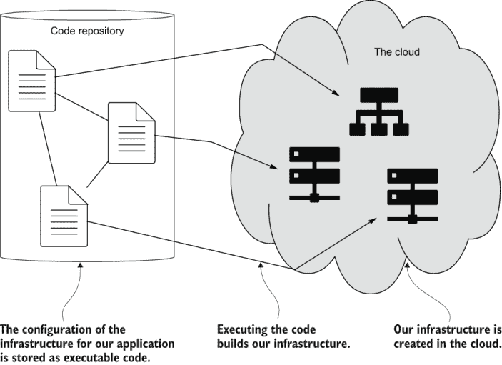

图 6.2 基础设施即代码使用可执行代码来创建基础设施。

基础设施即代码之所以重要，不仅是因为我们可以使用经过良好测试的代码来可靠地重复创建我们的基础设施。它还重要，因为它允许我们自动化基础设施的创建和维护。因此，它是持续交付的关键推动者，我们将在下一章中看到，我们将构建我们的自动化部署管道。

## 6.5 在 Kubernetes 上托管微服务

到下一章结束时，我们将在我们的应用程序的生产环境中运行多个容器。这些容器托管在云中运行的 Kubernetes 的管理版本上（你可以将其视为 Kubernetes 作为 *服务* 的形式）。

注意 Kubernetes 是一个用于管理基于容器的应用程序的计算平台。它最初由谷歌创建，但现在由云原生计算基金会管理，该基金会拥有巨大的行业支持，并负责许多其他有趣的项目。

Kubernetes 通常被称为容器编排平台。这告诉我们所有需要知道的信息。Kubernetes 可以管理和自动化容器的部署和扩展。Kubernetes 是我们微服务应用程序的生产骨干。我喜欢将其视为 *微服务平台*。

### 6.5.1 为什么选择 Kubernetes？

使用 Kubernetes 有许多原因。最简单的原因是避免供应商锁定。所有主要的云供应商都提供自己的容器编排服务，这些服务本身很好。但每个供应商也提供了一种管理的 Kubernetes 服务，所以为什么要在可以使用 Kubernetes 的情况下使用专有服务呢？使用 Kubernetes 意味着我们的应用程序可以迁移到任何云供应商。

我认为学习 Kubernetes（至少是基础知识）是值得的，因为这种知识是可以迁移的。尽管，在这本书中，我们在微软 Azure 上托管我们的 Kubernetes 集群，但你可以将 Kubernetes 技能随身携带，并在你最喜欢的云平台上使用。

Kubernetes 以其复杂性而闻名。当然，如果你想在自己的硬件上安装它，或者你想深入研究并成为专家，它确实很复杂。幸运的是，对于其他人来说，在我们的首选云平台上构建托管的 Kubernetes 集群要容易得多，至少在 Azure 上，我们可以在几个点击中通过 GUI 创建它。不过，我们不会通过 GUI 手动创建我们的基础设施。相反，我们将通过 Terraform 代码创建我们的集群。

Kubernetes 是从 Google 的丰富经验中诞生的，然后它被转交给社区。这意味着你可以分叉代码并自己为 Kubernetes 做贡献——前提是你有意愿陷入那个特定的兔子洞！

Kubernetes 允许我们构建以多种方式可扩展的应用程序。这一点我们将在第十章和第十一章中详细讨论。然而，在本章和下一章中，我们将学习绝对的基础知识。这足以构建一个生产集群，我们可以将我们的小型微服务应用程序部署到该集群。

最重要的是，Kubernetes 有一个可自动化的 API。这将使我们能够在第七章中构建我们的自动化部署管道。Kubernetes 正在成为微服务行业的标准，我预计它将继续朝这个方向发展。它得到了很好的支持，拥有一个庞大的社区和工具生态系统。

对我来说，Kubernetes 是一个*通用的计算平台*。它得到了所有主要云服务提供商的支持。无论我们最终在哪里，我们都可以带着 Kubernetes 一起走。Kubernetes 是开源的，你可以在以下位置找到代码：

[`github.com/kubernetes/kubernetes`](https://github.com/kubernetes/kubernetes)

### 6.5.2 Kubernetes 是如何工作的？

Kubernetes 集群由多台计算机组成。每台计算机被称为一个*节点*。每个节点实际上是一个虚拟机（VM）。我们可以根据需要向我们的集群添加任意数量的虚拟机，以控制应用程序可用的计算能力。每个节点还可以托管多个 Pod。*Pod* 是 Kubernetes 中计算的基本单元。

图 6.3 展示了节点和 Pod 的排列示例。图中所示的集群有三个节点（由三个虚拟机供电）。然而，在本章中我们创建的集群只有一个节点。这是因为我们的简单应用程序不需要太多的计算能力。这也意味着我们不会为超过我们实际需要的虚拟机付费。不过，扩展到更多节点很容易，我们将在第十一章中看到一个真实示例。

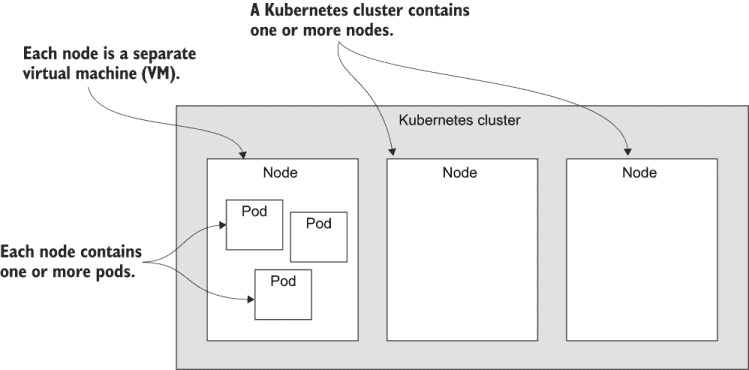

图 6.3 Kubernetes 集群的结构

如图 6.4 所示，每个 Pod 实际上可以托管多个容器。这可以成为许多有趣架构模式的基础（例如，代理和身份验证中广为人知的边车模式）。

然而，在这本书中，我们尽量保持简单。每个 pod 只会托管一个容器或微服务*.* 即使图 6.4 显示了一个包含多个容器的 pod，但对于本书的目的，你可以将 pod 视为一个容器或微服务，如果这对你来说是一种有用的简化。

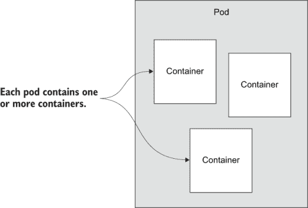

图 6.4 Kubernetes pod 的结构

## 6.6 使用 Azure CLI

在我们开始使用 Terraform 之前，我们需要确保 Azure CLI 正在运行。这是让我们能够认证 Terraform 的最简单方式，以便它能够访问我们的 Azure 账户，并授予它代表我们在 Azure 上创建基础设施的权限。同时，拥有 Azure CLI 也非常方便，因为它是一种与我们的 Azure 账户交互和管理云资源的有用方式。

### 6.6.1 安装 Azure CLI

你可以在此处找到安装 Azure CLI 的说明：

[`docs.microsoft.com/en-us/cli/azure/install-azure-cli`](https://docs.microsoft.com/en-us/cli/azure/install-azure-cli)

选择你的平台并按照说明进行安装。安装 Azure CLI 后，你可以使用以下命令从终端测试它：

```
az --version
```

在撰写本文时，我正在使用版本 2.9.1。未来的版本应该具有向后兼容性。

Azure CLI 已在 Vagrant 虚拟机中预安装

如果你正在使用第六章代码库中包含的 Vagrant 虚拟机，你将发现所有需要的工具都已经安装好了。这包括 Azure CLI。

如果你正在使用 Linux，请查看第六章代码库中的 shell 脚本 `scripts/provision-dev-vm.sh`。这个 shell 脚本在虚拟机中安装工具，以便你可以将其作为在 Linux 计算机上安装 Azure CLI 的示例。

有关使用 Vagrant 的更多信息，请参阅附录 A。

### 6.6.2 使用 Azure 进行认证

我们安装 Azure CLI 的主要原因仅仅是用于与我们的 Azure 账户进行认证。我们可以通过在终端运行以下命令来完成：

```
az login
```

运行此命令会打开浏览器，以便你可以登录到你的 Azure 账户。如果浏览器没有自动打开，你需要手动检查输出，打开 URL，然后输入代码。命令的输出提供了以下说明：

```
To sign in, use a web browser to open the page https://microsoft.com/devicelogin
➥ and enter the code XXXXXX to authenticate.
```

输入代码后，点击“下一步”。现在使用你的用户名和密码登录到你的 Azure 账户。登录后，你将在浏览器中看到如下消息：

```
You have signed in to the Microsoft Azure Cross-platform Command Line
➥ Interface application on your device. You may now close this window.
```

现在，你可以关闭浏览器并返回终端。`az login` 命令完成并显示一个以 JSON 格式化的你的 Azure 订阅列表。如果你只为这本书刚刚注册了 Azure，你应该只看到一个订阅。如果你已经使用 Azure 进行工作，你可能会看到多个订阅的列表。

认证信息被保存在本地，从现在开始，你可以发出针对你的 Azure 账户的其他命令，而无需每次都登录。我们可以使用以下命令测试我们正在使用的 Azure 订阅：

```
az account show 
```

此命令的输出显示了当前默认订阅。我们可以使用此命令查看所有订阅的列表：

```
az account list
```

输出是一个以 JSON 格式显示的订阅列表。每个订阅都有一个 `id` 字段，它是订阅的唯一标识符。您还会注意到，当前默认订阅通过将其 `isDefault` 字段设置为 `true` 来标记。列表中的任何其他订阅的此字段都设置为 `false`。

在这一点上，您应该验证您正在使用正确的订阅来跟随本书中的示例。例如，如果您有权访问雇主的订阅，您可能不应该使用这些订阅进行自己的学习和实验（或者至少，先与您的老板确认）。如果您需要更改当前的工作订阅，可以使用以下命令设置新的默认值：

```
az account set --subscription=<subscription-id>
```

将 `<subscription-id>` 替换为您想要设置为默认的订阅的 ID。更改默认订阅后，请再次使用此命令进行双重检查：

```
az account show 
```

这只是为了确保我们正在使用自己的订阅来跟随示例。我们不希望不小心使用我们雇主的 Azure 订阅。

### 6.6.3 哪个版本的 Kubernetes？

让我们用 Azure CLI 做一些实际操作，以了解它如何有用。在本章的末尾，我们将创建我们的托管 Kubernetes 集群。提前了解我们创建它的位置可用的 Kubernetes 版本将很有帮助。

要通过 Azure CLI 与 Azure Kubernetes 服务交互，我们将使用 `aks` 子命令。以下是一个列出西 US 区域 Kubernetes 版本的示例：

```
az aks get-versions --location westus
```

输出是一个以 JSON 格式显示的列表，其中显示了该位置可用的 Kubernetes 版本。如果使用如下所示的 *表格样式* 输出，输出对我们来说将更容易阅读：

```
az aks get-versions --location westus --output table
```

此时，您应该看到类似以下内容：

```
KubernetesVersion    Upgrades
-------------------  --------------------------------
1.18.4(preview)      None available
1.18.2(preview)      1.18.4(preview)
1.17.7               1.18.2(preview), 1.18.4(preview)
1.16.10              1.17.7
1.15.12              1.16.10
1.15.11              1.15.12, 1.16.10
```

从此列表中，您应选择最新的稳定（非预览）版本的 Kubernetes。在撰写本文时，这是 1.18.8 版本。但到您阅读本文时，可能会有更新的版本。完全有可能 1.18.8 版本已经过期（不再通过 Azure 提供）。*务必选择当前可用的版本号！*

记下版本号。我们很快就需要它来创建我们的集群。如果您想评估最新发布版本，可以选择 Kubernetes 的预览版本。但通常对于生产使用，我们更愿意使用最新的稳定版本。

### 6.6.4 我们取得了什么成果？

我们已安装 Azure 命令行工具（Azure CLI）。这是一个从终端与我们的 Azure 账户交互的有用工具。我们用它来验证我们的 Azure 账户。

注意 Terraform 需要使用 Azure 进行身份验证，以便它能够代表我们创建基础设施。

作为实际示例，我们使用 Azure CLI 查询我们选择位置可用的 Kubernetes 版本。我们记录了 Kubernetes 的最新版本号，稍后我们将使用它来创建我们的集群。

## 6.7 使用 Terraform 创建基础设施

现在我们正来到一个点，我们将真正开始创建我们的基础设施！我们可以手动构建我们的基础设施，无论是使用云供应商的 GUI（例如 Azure 门户）还是通过命令行（例如 Azure CLI）。然而，在这本书中，我们将使用代码以自动化的方式构建我们的基础设施。

从现在开始，我们将使用 *基础设施即代码*来自动化基础设施创建过程，从而使其可靠且可重复。自动化使我们能够在不增加手动工作负载的情况下扩展我们的应用程序。我们将使用 Terraform 来完成这项工作，这是一个执行 HashiCorp 配置语言 (HCL) 代码的惊人灵活的工具。

HCL 是我们定义基础设施的声明性配置语言。使用 Terraform 执行此代码实际上在云中创建我们的基础设施。

注意：在未来，我将简单地将 HCL 称为 *Terraform 代码*。

Terraform 通过插件提供者支持多个云供应商，如图 6.5 所示。在本章的示例中，我们使用 Terraform 在 Microsoft Azure 上创建基础设施。

如果学习 HCL 似乎有任何令人畏惧的地方，请记住这一点：HCL 实际上就像 YAML 或 JSON 一样，但它是一种不同的格式。HashiCorp 创建 HCL 以使其成为一个可读性强的配置格式，同时也可以机器翻译成 YAML 和 JSON。将其视为 YAML 或 JSON，但结构上更便于人类阅读。

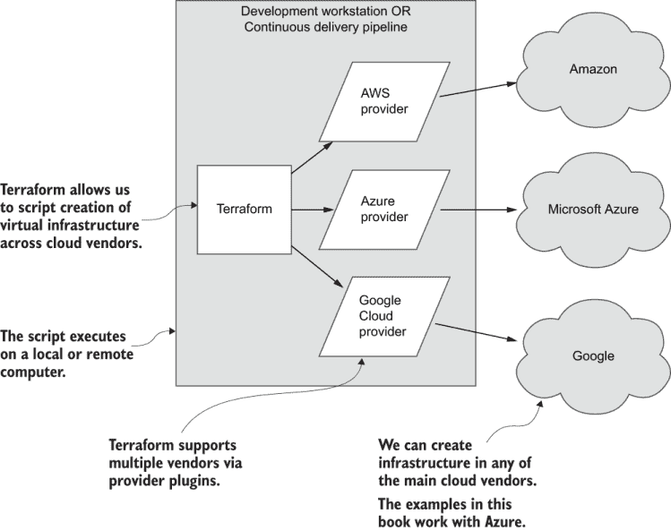

图 6.5 使用 Terraform 与各种云供应商构建基础设施

### 6.7.1 为什么选择 Terraform？

Terraform 是一种用于配置云应用程序基础设施的工具和语言。Terraform 使配置云基础设施变得可靠且可重复。它非常灵活，因为其功能可以通过插件提供者扩展。这就是它支持多个云供应商的原因！Terraform 已经为 Azure、AWS 和 Google Cloud 实现了强大的提供者。

就像 Kubernetes 一样，我们还将学习可转移的技能，这些技能可以用于所有主要的云供应商。无论我们使用哪种云，我们都可以利用 Terraform 来构建我们的基础设施。我们甚至可以创建自己的提供者，并将 Terraform 扩展到它尚未支持的平台。为了巩固这一点，Terraform 支持 Kubernetes，我们还将使用它来将容器部署到我们的集群中。

Terraform 几乎可以完成我们创建应用程序自动化部署管道所需的所有工作。它是一个用于脚本化基础设施的全能工具，因为即使对于它无法完成的事情，我们也可以自己填补空白。在下一章中，你将看到一种简单的方法，我们可以用它来扩展 Terraform 的功能，以覆盖它目前还无法处理的领域。

对我来说，Terraform 好像是一种**通用配置语言**。这是我们用来创建所有基础设施的一种语言。Terraform 是开源的，你可以在以下位置找到代码：

[`github.com/hashicorp/terraform`](https://github.com/hashicorp/terraform)

### 6.7.2 安装 Terraform

安装 Terraform 只是一个下载适用于您操作系统的二进制可执行文件并将其移动到包含在您的系统 PATH 环境变量中的目录的过程。从这里下载 Terraform 的最新版本：

[`www.terraform.io/downloads.html`](https://www.terraform.io/downloads.html)

安装 Terraform 后，使用以下命令从您的终端测试它：

```
terraform --version
```

在撰写本文时，我正在使用版本 0.12.29。未来的版本应该具有向后兼容性。

Terraform 在 Vagrant VM 中预先安装

如果你正在使用第六章代码库中包含的 Vagrant VM，你会发现你需要的所有工具，包括 Terraform，都已经安装好了。

如果你正在使用 Linux 进行工作，请查看第六章代码库中的 shell 脚本 scripts/provision-dev-vm.sh。这个 shell 脚本会在 Vagrant VM 中安装工具，并包含如何在 Linux 计算机上安装 Terraform 的示例。

### 6.7.3 Terraform 项目设置

在我们开始使用 Terraform 之前，让我们熟悉一下 Terraform 项目的外观。图 6.6 展示了一个完整的 Terraform 项目。这就是第七章中的 example-3 的样子。你现在不必查看第七章，甚至不必现在就打开那个特定的代码示例。我们只是在图 6.6 中查看该项目的结构，以便熟悉 Terraform 项目的外观。

正如你在图 6.6 中所见，一个 Terraform 项目由多个 Terraform 代码文件组成；这些文件以 .tf 扩展名结尾。这些文件包含 Terraform 代码，当由 Terraform 执行时，会为我们的应用程序创建基础设施。

这里有很多文件。那是因为我们正在查看下一章的更复杂示例。不要担心！很快，我们将从本章（第六章）的 example-1 开始，它要简单得多。

你应该能够阅读图 6.6 中的文件名，并了解它们的作用。这是因为我已经使用了一种命名约定，其中每个脚本文件都根据它创建的基础设施部分命名。当你阅读图 6.6 中的文件名（或第六章和第七章中的任何项目）时，你应该这样阅读：*resource-group.tf* 负责创建 Azure 资源组；*database.tf* 负责部署数据库；等等。

现在我们来试试这个。阅读图 6.6 中的文件名，并尝试猜测每个文件的作用。大多数情况下，应该是显而易见的；尽管如此，有几份文件超出了命名约定。如果你无法全部弄清楚，不要担心；所有内容将在本章和下一章中解释。

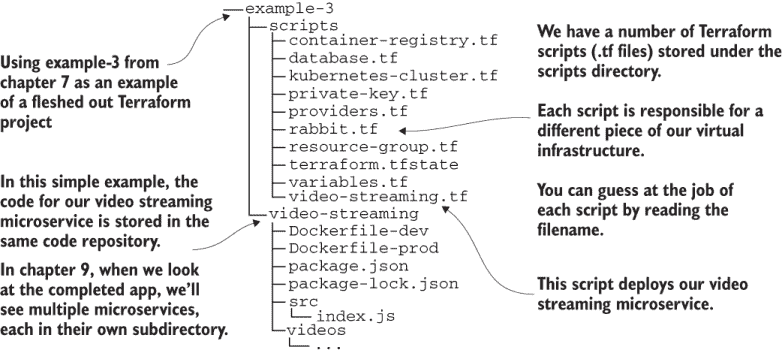

图 6.6 更完整 Terraform 项目的结构（我们已跳转到第七章的示例-3）。

注意图 6.6 中，我们将视频流微服务的代码与 Terraform 代码文件放在同一位置。它位于同一代码仓库中的 video-streaming 子目录下。这应该解释了为什么我们将 Terraform 代码文件存储在 scripts 子目录下。这样，我们的基础设施代码与微服务代码保持分离。

本示例项目的结构和文件名不是由 Terraform 决定的。这仅仅是我们将在这些示例中使用的约定。对于你自己的项目，可能存在不同的结构会更好，所以请自由实验，找到最适合你自己的项目的最佳结构。

为了在学习过程中保持简单，并且因为这是启动一个新微服务项目的好方法，我们将把我们的基础设施和微服务代码放在同一个位置。你可能已经意识到，这种类似单体项目的结构在最初使用微服务时消除了一些好处。现在不必过于担心这一点。只需知道，这种简单的结构仅适用于我们新应用的早期阶段。随着我们应用的增长，我们需要将其转换为更可扩展的结构，但这将在第十一章中讨论。目前，让我们坚持这种简单的项目结构。

## 6.8 为您的应用程序创建 Azure 资源组

在查看下一章示例-3 的高级项目结构之后，现在让我们降低复杂性，看看本章的更简单的示例-1。我们需要从某个地方开始我们的 Terraform 之旅，我们的起点应该是简单的。示例-1 就是这样，它包含了我们可以从中开始创建部署管道的最简单 Terraform 代码。

我们首先要做的是创建一个 Azure 资源组，将本章中我们将构建的所有其他 Azure 资源组合在一起。在第三章中，我们通过 Azure Portal GUI 手动创建了一个资源组。现在，我们再次创建一个资源组，但这次我们不是手动创建。我们将通过代码使用 Terraform 来构建它。

图 6.7 展示了本节我们将要做什么。Example-1 包含两个 Terraform 代码文件：providers.tf 和 resource-group.tf。脚本文件 resource-group.tf 是实际创建资源组的文件。另一个文件 providers.tf 包含 Terraform 提供者插件的配置。

我们将使用 `terraform` `apply` 命令来执行我们的 Terraform 代码。图 6.7 显示了我们的代码文件是如何输入到 Terraform 中，它执行我们的代码并在 Azure 中创建一个 FlixTube 资源组（如图 6.7 右侧所示）。

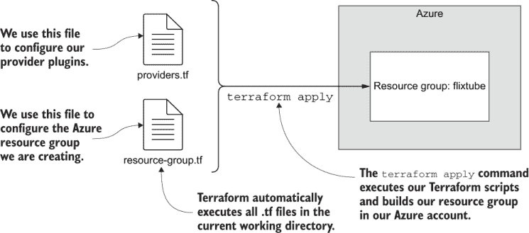

图 6.7 使用 Terraform 创建 Azure 资源组

文件 providers.tf 从技术上讲不是这个过程所必需的。我们可以删除它，这个示例仍然可以工作。然而，拥有这个文件是有用的，因为这是我们放置我们用于配置提供者的代码的地方。稍后，我们将更详细地讨论 providers.tf。

### 6.8.1 使用 Terraform 的进化式架构

Terraform 是一种以迭代方式构建我们基础设施的工具——我们称之为 *进化式架构*。在本章中，您可以亲自体验这种构建基础设施的迭代方法。

到目前为止，我们将开始编写 Terraform 代码。您可以选择如何跟随本章和下一章中的示例进行学习：

+   从 example-1 开始，然后随着您阅读本章和下一章，迭代地更新您的示例项目以演进您的基础设施

+   为每个示例从头开始，并在本章和下一章中为每个示例构建新的基础设施

第六章和第七章中的所有示例都可以独立运行，因此您可以从任何示例开始轻松地启动您的基础设施，只需跳转到任何示例并调用该代码的 Terraform 即可。然而，最适合您跟随的方式，最接近“真实”开发的方式，是迭代地更新您的代码，以逐步的方式演进您的基础设施（这是提到的第一个选项）。要以此方式跟随，您应该为您的演进项目创建一个单独的工作目录，例如：

```
mkdir working
```

然后将 example-1 代码复制到其中：

```
cp -r chapter-6/example-1/* working
```

现在，您可以跟随第六章和第七章中的示例。每次您到达一个新的示例时，就像这样将新代码复制到您的工作项目中：

```
cp -r chapter-6/example-2/* working
```

要在 Windows 上执行这些命令，您应该考虑安装 Git for Windows。它包含许多编译在 Windows 下工作的 Linux 命令。以下是链接：

[`gitforwindows.org`](https://gitforwindows.org)

或者，在 Windows 上，您可以使用 WSL2 或在 Vagrant VM 下运行的 Linux。有关更多详细信息，请参阅第三章和附录 A。

第六章和第七章中的示例代码旨在以这种方式使用，因此模拟了基础设施开发的实际迭代过程。图 6.8 展示了此过程。注意我们如何在我们编辑基础设施代码时使用多个 `terraform apply` 命令的迭代。通过这种方式，我们逐步添加和更新我们不断增长的基础设施。

小贴士 使用 Git 来跟踪您复制到工作项目中的更新代码是最佳选择。

在从 example-1 复制代码后，创建一个新的 Git 代码仓库并提交代码。然后，在您将每个新示例复制到工作项目后，您可以使用 `git diff` 来理解正在进行的新的更改。在每个迭代中，提交更新后的代码并继续下一个示例。

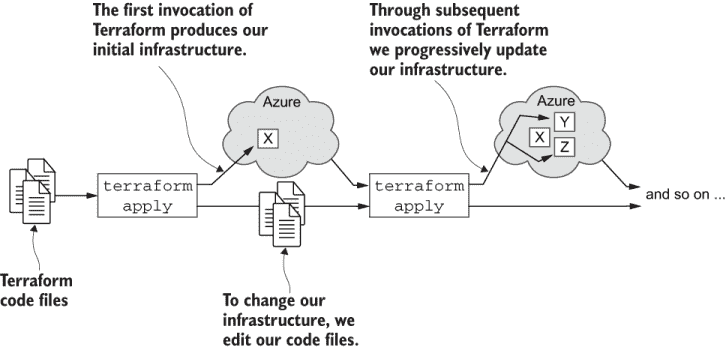

图 6.8 Terraform 基础设施迭代进化

这可能看起来像是一项大量工作。我理解您很忙，可能没有时间使用进化方法跟随。如果是这样，您可以自由地直接跳转到本章中您可能想运行的任何示例。这些示例都是设计为独立运行的，因此您可以按照您喜欢的任何方式跟随。

我要说的是，如果您确实想跟随每个示例，那么迭代进化方法实际上更有效。这是因为迭代过程中的每个步骤，Terraform 只会创建那些尚未存在的资源。

如果您单独运行每个示例，您将最终运行 Terraform 来为每个示例创建完整的基础设施。这是最不有效的方法。从头开始创建 Kubernetes 集群很慢，但更新现有的 Kubernetes 集群要快得多！跟随进化方法实际上可以为您节省一些时间！

### 6.8.2 编写基础设施创建脚本

列表 6.1 展示了我们的第一个 Terraform 代码文件。这已经非常简单了。通过使用 Azure 提供程序，我们只需在 Terraform 代码中声明三行即可创建 Azure 资源组。

列表 6.1 创建 Azure 资源组（第六章/example-1/scripts/resource-group.tf）

```
resource "azurerm_resource_group" "flixtube" {     ①
  name = "flixtube"                                ②
  location = "West US"                             ③
}
```

① 声明一个 Azure 资源组。此资源组将包含我们创建的所有资源，因此它是我们新基础设施的基本起点。

② 设置资源组的名称

③ 设置资源组创建的位置（数据中心）

通过 Terraform 代码，我们正在定义我们的基础设施组件。在列表 6.1 中，我们定义了我们的基础设施的第一部分。我们声明了一个名为 `flixtube` 的 Azure 资源组，其类型为 `azurerm_resource_group`*.* 这是一种来自 Azure 提供程序的 Terraform 资源类型，它使我们能够在 Azure 上创建资源组。很快，我们将运行 Terraform，它将在我们的 Azure 账户中创建这个资源组，正如我们配置的那样。

### 6.8.3 初始化 Terraform

我们在创建我们的基础设施方面已经迈出了第一步。我们编写了一个简单的脚本，用于创建 Azure 资源组。但在调用 Terraform 并执行此脚本之前，我们必须首先初始化 Terraform。

当我们初始化 Terraform 时，它会下载我们脚本所需的提供程序插件。此时，我们只需要 Azure 提供程序。要初始化 Terraform，首先将目录更改为 Terraform 代码的位置：

```
cd chapter-6/example-1/scripts
```

现在运行 `terraform init` 命令：

```
terraform init
```

您应该会看到一些输出，表明 Azure 提供程序插件已下载；例如，

```
Initializing the backend...
Initializing provider plugins...
- Checking for available provider plugins...
- Downloading plugin for provider "azurerm" (hashicorp/azurerm) 1.43.0...
Terraform has been successfully initialized!
```

一旦完成，我们现在就可以执行我们的 Terraform 代码了。在执行该目录中的任何 Terraform 代码之前，我们必须为每个 Terraform 项目至少运行一次 `terraform init` 命令。您还必须为每个新提供的程序至少运行一次。每次调用 `terraform init` 时，它只会下载尚未缓存的提供程序。

如果您按照 6.8.1 节中提出的进化方式跟随第六章和第七章的示例，那么您只需要为包含新提供程序的每个示例进行初始化。否则，如果您独立运行每个示例，您只需记住为每个示例运行 `terraform init` 即可。

如果您忘记运行 `terraform init`，请不要担心，它不会给您带来任何问题。当您忘记时，Terraform 会提醒您需要先做这件事。

### 6.8.4 Terraform 初始化的副产品

在 Terraform 初始化后，我们现在可以检查 `init` 命令在脚本子目录中创建或下载的文件。浏览脚本目录，看看你能找到什么。图 6.9 展示了运行 `terraform init` 后的 example-1 项目。

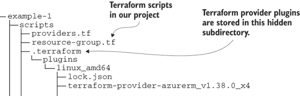

图 6.9 展示了运行 `terraform init` 时下载或创建的文件。

您会注意到创建了一个隐藏的子目录 `.terraform`，其中包含了一些文件。这是 Terraform 存储已下载的提供程序插件的地方。这些文件被缓存在这里，以便每次调用 Terraform 时可以重复使用。

### 6.8.5 修复提供程序版本号

在我们第一次调用 Terraform 之前，让我们谈谈我们项目中那个其他文件。列表 6.2 展示了 providers.tf 的代码。这是我们定义和配置所有 Terraform 提供程序插件的文件。

列表 6.2 配置 Terraform 供应商插件（第六章/示例 1/脚本/providers.tf）

```
provider "azurerm" {       ①
    version = "1.38.0"     ②
}
```

① 设置供应商插件的名称

② 设置要下载和使用的供应商插件的版本

从技术上讲，我们目前不需要这个文件，也不需要提前声明我们的供应商。我们可以简单地调用 `terraform init`，它足够智能，能够找出我们需要哪些供应商，并为我们下载它们。

当开始一个新项目时，这很方便。我们可以简单地开始编写 Terraform 代码来创建我们的云基础设施，而且我们不需要提前声明我们的供应商。然后，当我们调用 `terraform init` 时，它会下载我们需要的供应商的最新版本。Terraform 会列出它下载的插件的版本，就像以下从早期输出中的摘录：

```
- Downloading plugin for provider "azurerm" (hashicorp/azurerm) 1.43.0...
```

这是一种很好的入门方式，但它可能会导致未来出现意外的麻烦。例如，将来，你可能会发现自己无意中升级到了一个与最初使用的版本不 100% 兼容的新版本的 Azure 供应商（是的，这发生在我身上）。结果，你的 Terraform 代码可能会以难以预测或理解的方式中断。

幸运的是，我们可以通过将版本固定为我们已测试并信任的版本来预先解决这个问题。你可以通过检查 `terraform init` 的输出来查看任何供应商的当前版本，然后将此版本号硬编码到你的 providers.tf 文件中（如列表 6.2 所示）。

最终，我们的 Terraform 代码必须在我们的自动化 CD 管道中完全无人值守地运行（我们将在第七章中创建它）。我们的代码必须是坚不可摧的，修复我们的版本号使我们的 Terraform 代码更加可靠。这意味着在未来，我们不会暴露在依赖项在我们不知情的情况下被更改的风险中。

我们还可以将 providers.tf 用作配置其他供应商参数的地方。我们将在下一章中看到一个例子。

### 6.8.6 构建你的基础设施

在初始化我们的 Terraform 项目后，我们就可以调用 `terraform apply` 命令来执行我们的 Terraform 代码并构建我们基础设施的第一迭代。如果你需要，可以参考图 6.8 来了解 `apply` 命令的图形表示。从调用 `init` 命令的同一目录中运行此命令：

```
terraform apply
```

`apply` 命令会收集并执行我们所有的 Terraform 代码文件。（到目前为止我们只有两个代码文件，但很快我们会更多。）当你调用 apply 命令时，你会看到如下输出：

```
An execution plan has been generated and is shown below.    
Resource actions are indicated with the following symbols:  
  + create                                                  

Terraform will perform the following actions:               

  # azurerm_resource_group.flixtube will be created         
  + resource "azurerm_resource_group" "flixtube" {          
      + id       = (known after apply)                      
      + location = "westus"                                 
      + name     = "flixtube"                               
      + tags     = (known after apply)                      
    }                                                       

Plan: 1 to add, 0 to change, 0 to destroy.                  

Do you want to perform these actions?                       
  Terraform will perform the actions described above.       
  Only 'yes' will be accepted to approve.                   

  Enter a value:
```

此输出描述了我们对基础设施的计划更新。Terraform 正在告诉我们它即将做出的更改。（你还可以使用 `terraform plan` 命令单独获取此输出。）

Terraform 现在正在等待我们批准计划，然后才会继续并实际上对我们的基础设施进行更新。此时检查输出并确保即将到来的更改是 OK 的，符合我们的预期是个好主意。一旦对计划满意，输入`yes`并按 Enter 键允许 Terraform 继续。

Terraform 现在正在创建我们请求的基础设施。在这种情况下，在我们首次调用 Terraform 时，flixtube 资源组被创建在我们的 Azure 账户中。这应该会很快发生（因为目前它仍然是一个小脚本，并没有做太多）。然后你会看到一条成功消息，如下所示：

```
azurerm_resource_group.flixtube: Creating...
azurerm_resource_group.flixtube: Creation complete after 5s [id=/subscriptions/219aac63-3a60-4051-983b-45649c150e0e/resourceGroups/flixtube]
Apply complete! Resources: 1 added, 0 changed, 0 destroyed.
```

输出给出了一个快速总结，说明了添加了什么、更改了什么、删除了什么。在这种情况下，它确认了我们已经知道的事情，即我们创建了一个云资源，我们的 Azure 资源组。

现在，让我们手动检查更改看起来像什么。打开你的网络浏览器，导航到 Azure 门户[`portal.azure.com/`](https://portal.azure.com/)。你可以亲自检查，确认确实在你的 Azure 账户中创建了一个 Azure 资源组。在门户中，点击资源组并验证 flixtube 资源组现在是否在列表中。这就是你的第一个 Terraform 代码刚刚创建的内容！

当然，你不必总是通过手动检查 Azure 门户来确认每个资源是否已创建。我们在这里这样做只是为了让你能够理解刚才发生的事情。

### 6.8.7 理解 Terraform 状态

在这个阶段，在我们项目中对`terraform` `apply`进行首次调用后，Terraform 将生成其状态文件`terraform.tfstate`。你应该能在与你的 Terraform 代码文件相同的目录中看到这个文件。

理解 Terraform 的持久状态管理很重要；尽管大多数时候我们不会关心状态文件中的内容。但了解为什么它存在以及如何处理它是很好的。

让我们看一下我们的 Terraform 状态文件，看看在我们创建了第一件基础设施之后它看起来像什么。这是一个查看状态文件的好时机：因为此时它仍然很小，很容易理解。调用`cat`命令来显示状态文件：

```
cat terraform.tfstate
```

你的输出将类似于以下内容：

```
{                                                                                                            
  "version": 4,                                                                                              
  "terraform_version": "0.12.29",                                                                            
  "serial": 1,                                                                                               
  "lineage": "dc5cb51c-1ab4-02a5-2271-199538b7655a",                                                         
  "outputs": {},                                                                                             
  "resources": [                                                                                             
    {                                                                                                        
      "mode": "managed",                                                                                     
      "type": "azurerm_resource_group",                                                                      
      "name": "flixtube",                                                                                    
      "provider": "provider.azurerm",                                                                        
      "instances": [                                                                                         
        {                                                                                                    
          "schema_version": 0,                                                                               
          "attributes": {                                                                                    
            "id": "/subscriptions/219aac63-3a60-4051-983b-
            ➥ 45649c150e0e/resourceGroups/flixtube",
            "location": "westus",                                                                            
            "name": "flixtube",                                                                              
            "tags": {}                                                                                       
          },                                                                                                 
          "private": "bnVsbA=="                                                                              
        }                                                                                                    
      ]                                                                                                      
    }                                                                                                        
  ]                                                                                                          
}                                                                                                            
```

你可以看到，我们的 Terraform 状态文件在`resources`字段中有一个条目。我们刚刚创建的资源组的详细信息都记录在这个状态文件中。

我们第一次调用`terraform` `apply`时，会生成状态文件。随后的`terraform` `apply`调用将使用状态文件作为输入。Terraform 加载状态文件，然后从实时基础设施中*刷新*它。图 6.10 显示了连续调用 Terraform 是如何通过实时基础设施和状态文件连接起来的。

你可能想知道此时状态文件的确切作用是什么？如果我们的基础设施定义在我们的 Terraform 代码中，并且 Terraform 可以直接从实际基础设施中知道当前状态，为什么它必须将状态保存在单独的文件中？有两个要点需要考虑，以理解为什么状态文件是必要的：

+   这个 Terraform 项目并不*拥有*你 Azure 账户中的所有基础设施。

+   当我们更改我们的 Terraform 代码（以更改我们的基础设施）时，它与实际基础设施就不再同步。（我们依赖 Terraform 更改实际基础设施，使其看起来像我们声明的基础设施。）

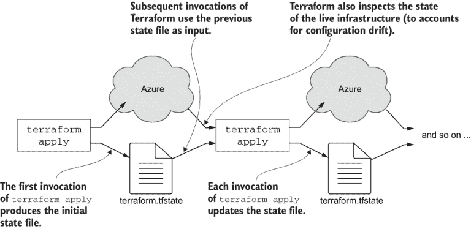

图 6.10 理解 Terraform 状态对于使用 Terraform 至关重要。

让我们考虑第一个点。Azure 订阅可能被多个项目共享。该账户中的基础设施可能是由其他 Terraform 项目创建的，甚至可能是由完全不同的方式（例如，在 Azure 门户中手动创建或使用 Azure CLI 工具）创建的。

随着你在这本书中的示例，你很可能有一个整个 Azure 订阅都为此而设。但如果你是在管理多个项目的公司工作，或者你自己正在管理多个项目，情况就不同了。在这种情况下，Azure 订阅将在项目之间共享，订阅包含多套基础设施。

我要说明的是，Terraform*不能*，实际上*也不*假设它拥有它被允许访问的 Azure 账户中的所有内容。这意味着 Terraform 不能简单地读取实际基础设施并假设它拥有所有内容。它只能假设拥有在基础设施代码中声明或记录在状态文件中的基础设施。Terraform 首先做的事情是加载你的代码和状态文件。这就是它*知道*它拥有哪套基础设施。

尽管如此，Terraform 总是希望保持最新状态，因此加载状态文件后，它会直接从实际基础设施刷新状态。这允许 Terraform 处理实际状态已从先前记录的状态发生变化时的配置漂移（例如，因为有人手动调整了它）。

你可以看到这可能会如何影响性能。Terraform 只查询它负责的实时基础设施的部分；那些因为它记录的状态而知道的部分。相反，如果它查询*所有*实时基础设施，这可能是一个昂贵且耗时的操作，具体取决于我们 Azure 账户中存在的总基础设施量。

现在，让我们考虑提到的第二点。当我们更改我们的 Terraform 代码（以更改我们的基础设施）时，它与我们的实际基础设施就不再同步。这是因为我们通过代码的更改来引导基础设施的变更。这就是为什么我们称之为*基础设施即代码*。

我们可以通过修改我们的代码来添加、更新和删除基础设施。Terraform 如何知道发生了什么变化？Terraform 将其记录的状态与我们的代码中的内容进行比较。然后，Terraform 自动确定需要更新我们的基础设施的确切更改集。当你仔细思考时，你会发现 Terraform 是多么聪明，它能为您做多少工作。

现在您可能已经了解得比您想要的更多关于 Terraform 状态的信息，但说实话，在我们能够正确地在我们的 CD 流水线中实施它之前，我们有一个很好的理解是非常重要的。我们将在下一章中讨论这一点。随着您在本章和下一章的示例中前进，请随时再次查看状态文件，以查看它是如何增长和变化的。

### 6.8.8 销毁和重新创建您的基础设施

我们已经启动了我们的基础设施！目前它还不算多，但这是一个良好的开始。在我们继续演进我们的基础设施之前，让我们花些时间来尝试销毁和重建它。

我们选择这个时刻进行实验的原因是，当我们的基础设施规模较小时，进行这种实验更有效率。在本章结束时，我们将添加一个 Kubernetes 集群，这将需要更多的时间来销毁和重建。

更不用说最终，您仍然需要清理这些 Azure 资源。您不希望最终为此付费（除非，当然，您正在开发一个真实的产品）。*运行此基础设施需要花费金钱*；尽管如此，我希望您是从 Azure 的免费信用额度开始的。但不要让它运行超过您需要的时长！

现在，请使用 Terraform 的 `destroy` 命令像这样销毁您当前的基础设施：

```
terraform destroy
```

您的输出将类似于以下内容：

```
An execution plan has been generated and is shown below.
Resource actions are indicated with the following symbols:
  - destroy
Terraform will perform the following actions:
  # azurerm_resource_group.flixtube will be destroyed
  - resource "azurerm_resource_group" "flixtube" {
      - id       = "/subscriptions/219aac63-3a60-4051-983b-
      ➥ 45649c150e0e/resourceGroups/flixtube" -> null
      - location = "westus" -> null
      - name     = "flixtube" -> null
      - tags     = {} -> null
    }
Plan: 0 to add, 0 to change, 1 to destroy.
Do you really want to destroy all resources?
  Terraform will destroy all your managed infrastructure, as shown above.
  There is no undo. Only 'yes' will be accepted to confirm.
  Enter a value:
```

就像 `apply` 命令一样，`destroy` 会显示其计划。这些都是它将做出的更改。要继续，我们必须输入 `yes` 并按 Enter 键。Terraform 完成工作并显示摘要：

```
azurerm_resource_group.flixtube: Destroying... [id=/...
azurerm_resource_group.flixtube: Still destroying... [id=/subscriptions/219aac63-3a60-4051-983b-45649c150e0e/resourceGroups/flixtube, 10s elapsed]
[id=/subscriptions/219aac63-3a60-4051-983b-45649c150e0e/resourceGroups/flixtube, 50s elapsed]
azurerm_resource_group.flixtube: Destruction complete after 54s
Destroy complete! Resources: 1 destroyed.
```

当您完成书中的每个示例后，您应该调用 `destroy` 来清理您创建的基础设施。如果您正在使用第 6.8.1 节中描述的迭代方法演进您的基础设施，并且一直做到第七章的结尾，那么您不需要再次调用 `destroy`，直到书的结尾。

您也可以通过 Azure 门户或 Azure CLI 工具手动删除 Azure 资源。但使用 `destroy` 命令来做这件事更简单。这也意味着您不会意外地删除其他基础设施，比如说，如果您与其他项目共享 Azure 订阅的话。

在您使用 `terraform destroy` 进行练习运行后，重新构建您的基础设施变得简单。为此，我们只需再次调用 `terraform apply`：

```
terraform apply
```

你可以尽可能多地练习这个过程。销毁和重建你的基础设施的过程有助于你理解你实际上是在用可执行代码管理基础设施！你可以随意销毁和创建你的基础设施，无需任何手动操作。在这个早期阶段，这看起来可能不多，但随着你的基础设施和应用程序变得更大、更复杂，其重要性会逐渐增加。

实际上，你可能已经意识到我们可以使用我们的 Terraform 代码来创建我们基础设施的多个副本！在第十一章中，我们将学习如何参数化我们的 Terraform 代码，以创建用于开发、测试和生产的独立实例。如果这还不能让你兴奋，我不知道还有什么能让你兴奋。

### 6.8.9 我们取得了什么成果？

现在我们已经安装了 Terraform，并且我们已经构建了我们初生的基础设施。Terraform 是我们用于 *基础设施即代码* 的工具。这是一种技术，我们将基础设施配置存储为可执行代码（例如，在 Terraform 代码文件中），我们可以使用它来创建、管理和销毁我们的基础设施。

我们还创建了我们的第一个 Terraform 代码文件，并使用 `terraform init` 初始化了我们的项目。然后我们调用了 `terraform apply` 来创建一个 Azure 资源组。我们还学习了如何使用 `terraform destroy` 后跟 `terraform apply` 来销毁和重新创建我们的基础设施。

## 6.9 创建你的容器注册库

我们基础设施的下一步是创建一个私有容器注册库。我们将在下一章中使用这个注册库来发布我们的微服务的 Docker 镜像。

如果你记得在第三章，我们学习了如何构建和发布 Docker 镜像。在那个章节中，我们通过 Azure 门户中的 GUI 手动创建了一个容器注册库。现在，我们已经对 Terraform 有了一个基本的了解，我们将重新访问那个领域，并使用代码创建我们的注册库。

### 6.9.1 我们基础设施的持续进化

我们现在正在将第六章代码库中的 example-2 移动到下一步。在这个阶段，如果你是以迭代的方式工作，并从 example-1 继续前进，你应该将 example-2 的代码复制到你在 6.8.1 节中创建的工作目录中：

```
cp -r chapter-6/example-2/* working
```

如果你不是将每个示例作为一个独立的项目来处理，你应该销毁从 example-1 创建的基础设施：

```
cd chapter-6/example-1/scripts
terraform destroy
```

在销毁 example-1 基础设施之后，你可以移动到 example-2 并初始化它：

```
cd chapter-6/example-2/scripts
terraform init
```

### 6.9.2 创建容器注册库

列表 6.3 展示了创建我们容器注册库的最新 Terraform 代码文件。要让这段代码工作，你需要更改注册库的名称。这是因为 Azure 容器注册库的名称必须是唯一的。它不会允许你使用我选择的相同名称（flixtube）。

如果你正在跟随，现在进入 container-registry.tf。将注册库的名称更改为其他名称。

列表 6.3 创建我们的私有容器注册库（摘自 chapter-6/example-2/scripts/container-registry.tf）

```
resource "azurerm_container_registry" 
➥ "container_registry" {                          ①
  name = "flixtube"                                ②
  resource_group_name = azurerm_resource_group
  ➥ .flixtube.name                                ③
  location = "westus"                              ④
  admin_enabled = true                             ⑤
  sku = "Basic"                                    ⑥
}
... code omitted here ...
```

① 声明容器注册库资源

② 设置容器注册库的名称。这必须是唯一的，所以你必须将其更改为其他内容。

③ 设置资源组的名称并创建到另一个资源的链接

④ 设置容器注册库的位置

⑤ 启用管理员账户，以便我们可以远程对注册库进行身份验证

⑥ 使用基本 SKU 成本更低，也更简单，因为存储是自动管理的。

注意：如果您有所疑问，SKU（库存单位）或*库存保持单元*是产品的不同版本。在这里这意味着我们正在使用容器注册库的基本版本。

注意`resource_group_name`的值是如何从另一个文件（我们在图 6.1 中查看的`resource-group.tf`文件）中定义的资源属性中设置的。这两个资源现在通过 Terraform 的*资源图*相互链接。这就是 Terraform 管理资源之间依赖关系的方式。这是 Terraform 知道它应该按什么顺序执行我们的脚本文件的方式。

Terraform 必须在将其他资源（如新的容器注册库）填充到我们的 Azure 账户之前创建资源组。让我们调用`apply`命令来添加这个新的基础设施部分：

```
terraform apply -auto-approve
```

注意这次我们使用了`-auto-approve`参数。这意味着我们不必每次都输入`yes`来批准更改。在我们原型化我们的基础设施时，这很方便，但在下一章，当我们创建我们的持续交付（CD）管道时，这变得至关重要。到那时，我们将需要以自动和无人值守的方式调用 Terraform。那里将没有人来进行批准！正因为如此，我们现在开始使用`-auto-approve`以*非交互式*模式运行 Terraform。

现在我们开始创建更复杂的基础设施，所以你可能需要比上次等待更长的时间。一旦完成，你将看到与之前类似的输出；Terraform 正在向我们展示我们的基础设施中发生了什么变化。然而，在末尾，你将看到一些新的输出。这为我们提供了与我们的新容器注册库进行身份验证所需的详细信息。我们将在下一节中了解更多关于这个新输出的信息。

```
Outputs:                                         

registry_hostname = flixtube.azurecr.io          
registry_pw = +2kGfgth0beCHPh+VIf9fqJhAf7zEqX6   
registry_un = flixtube                           
```

### 6.9.3 Terraform 输出

Terraform（或其底层的插件提供者）通常会生成我们需要了解的配置信息。在上一节中，我们创建了新的容器注册库。在列表 6.3 中，你看到我们为注册库启用了管理员用户。这允许我们进行身份验证并与我们的注册库（推送和拉取 Docker 镜像）进行交互。

注意：启用管理员用户会导致 Terraform 生成用户名和密码。我们需要注意这些细节，以便我们可以在以后使用这些信息登录到我们的注册库。

我们可以使用 *Terraform 输出* 从我们的 Terraform 代码中提取生成的配置细节。在列表 6.4 中，你可以看到声明了多个输出。这导致在执行此代码时，这些值将在终端中显示。我们还会在多个其他代码文件中使用输出，所以请在未来的代码列表中寻找这些输出。

列表 6.4 Terraform 输出（章节-6/示例-2/脚本/container-registry.tf 的摘录）

```
... code omitted here ...
output "registry_hostname" {              ①
  value = azurerm_container_registry.
  ➥ container_registry.login_server      ②
}
output "registry_un" {                    ①
  value = azurerm_container_registry.
  ➥ container_registry.admin_username    ②
}
output "registry_pw" {                    ①
  value = azurerm_container_registry. 
  ➥ container_registry.admin_password    ②
}
```

① 创建一个输出

② 设置要输出的值

### 6.9.4 我们取得了什么成果？

我们通过创建容器注册库继续演变我们的基础设施。这是我们在下一章中为我们的微服务发布 Docker 镜像时需要的东西。

在本节中，我们添加了一个新的 Terraform 代码文件并执行了它。这在我们 Azure 账户中创建了一个新的容器注册库。最后，我们学习了如何使用 Terraform 输出显示有关创建的资源和管理基础设施的相关信息。

## 6.10 重构以共享配置数据

你可能已经注意到在最近的代码列表中，我们开始重复某些配置值从文件到文件。当需要更改这些值时，这可能会成为一个问题。理想情况下，我们希望能够在一个地方更改重要的值，并且这些值可以在所有我们的 Terraform 代码文件之间共享。我们可以通过使用 *Terraform 变量* 来实现这一点，因此现在我们将重构我们的代码以共享配置数据。

### 6.10.1 继续我们基础设施的演变

我们现在转向章节 6 代码库中的示例-3。在此阶段，如果你以迭代方式工作并从早期示例继续，你现在可以将示例-4 代码复制到你在 6.8.1 中创建的早期工作目录中：

```
cp -r chapter-6/example-3/* working
```

否则，你可以直接跳转到示例-3 并在章节-6/example-3/scripts 目录中运行 `terraform` `init`。如果你这样做，别忘了首先销毁为早期示例创建的任何基础设施。

### 6.10.2 介绍 Terraform 变量

章节第 6 代码库中的示例-3 是对示例-2 的重构，修改为在代码文件之间共享配置值，添加了一个名为 variables.tf 的新文件。列表 6.5 显示了新的代码文件。

在列表中，你可以看到 Terraform 全局变量是如何定义我们一些最重要的配置值的。我们为我们的应用程序名称（flixtube）、数据中心位置（西 US）等定义了变量。

列表 6.5 设置 Terraform 全局变量（章节-6/示例-3/脚本/variables.tf）

```
variable "app_name" {     ①
    default = "flixtube"
}
variable location {       ①
  default = "West US"
}
```

① 为我们在多个 Terraform 代码文件中使用的全局变量设置默认值

到目前为止，如果你一直在跟随，你应该编辑 variables.tf 并为你的应用程序设置一个 *唯一的* 名称。在列表 6.5 中，名称被设置为 `flixtube`。将从这个变量设置各种 Azure 资源名称，其中一些将需要为这个项目的你的版本唯一（例如，你的容器注册表的名称）。

列表 6.6 和 6.7 展示了我们如何使用我们的新变量。你可以看到，我们的资源组名称和我们的容器注册表名称都是从 `app_name` 变量的值设置的。我们还可以从 `location` 变量设置这些资源的地理位置。

列表 6.6 使用变量配置资源组（第六章/示例 3/脚本/resource-group.tf）

```
resource "azurerm_resource_group" "flixtube" {
  name = var.app_name            ①
  location = var.location        ②
}
```

① 从 app_name 变量设置资源组的名称

② 从位置变量设置位置

列表 6.7 使用变量配置容器注册表（摘自第六章/示例 3/脚本/container-registry.tf）

```
resource "azurerm_container_registry" "container_registry" {
  name = var.app_name                                         ①
  resource_group_name = azurerm_resource_group.flixtube.name
  location = var.location                                     ②
  admin_enabled = true
  sku = "Basic"
}
... code omitted here ...
```

① 从 app_name 变量设置容器注册表的名称

② 从位置变量设置位置

我们已经重构了我们的 Terraform 代码，并使用 Terraform 变量在我们的代码文件之间共享了一些相关的配置值。我们现在有一个方便的地方可以更改这些值。例如，假设我们想更改应用程序的位置。我们可以简单地通过更改 variables.tf 中的 `location` 变量来实现这一点。

## 6.11 创建我们的 Kubernetes 集群

现在我们来到了我们最关键的基础设施部分。我们需要一个平台来托管我们的微服务在生产环境中，为此，我们将使用 Terraform 在我们的 Azure 账户中创建一个 Kubernetes 集群。

### 6.11.1 脚本化创建你的集群

继续使用示例-3，现在让我们看看创建我们的 Kubernetes 集群的代码。列表 6.8 是一个新的 Terraform 代码文件，它定义了我们的集群配置。

我们在这里继续使用我们的 Terraform 变量，并且其中一些字段你可能已经熟悉。例如 `name`、`location` 和 `resource_group_name` 字段不需要新的解释。然而，还有一些字段将完全陌生。

列表 6.8 创建我们的 Kubernetes 集群（第六章/示例 3/脚本/kubernetes-cluster.tf）

```
resource "azurerm_kubernetes_cluster" "cluster" {        ①
    name = var.app_name
    location = var.location
    resource_group_name = azurerm_resource_group.flixtube.name
    dns_prefix = var.app_name
    kubernetes_version = "1.18.8"                        ②

    linux_profile {                                      ③
        admin_username = var.admin_username
        ssh_key {
            key_data = "${trimspace(tls_private_key.key.public_key_openssh)} 
 ➥ ${var.admin_username}@azure.com"
        }
    }                                                    ③
    default_node_pool {                                  ④
        name = "default"
        node_count = 1
        vm_size = "Standard_B2ms"
    }                                                    ④
    service_principal {                                  ⑤
        client_id = var.client_id
        client_secret = var.client_secret
    }                                                    ⑤
}
output "cluster_client_key" {
  value = azurerm_kubernetes_cluster.cluster.kube_config[0].client_key
}
output "cluster_client_certificate" {
  value = azurerm_kubernetes_cluster.cluster.kube_config[0]
  ➥ .client_certificate
}
output "cluster_cluster_ca_certificate" {
  value = azurerm_kubernetes_cluster.cluster.kube_config[0]
  ➥ .cluster_ca_certificate
}
output "cluster_cluster_username" {
  value = azurerm_kubernetes_cluster.cluster.kube_config[0].username
}
output "cluster_cluster_password" {
  value = azurerm_kubernetes_cluster.cluster.kube_config[0].password
}
output "cluster_kube_config" {
  value = azurerm_kubernetes_cluster.cluster.kube_config_raw
}
output "cluster_host" {
  value = azurerm_kubernetes_cluster.cluster.kube_config[0].host
}
```

① 声明我们的 Kubernetes 集群的资源

② 指定我们正在使用的 Kubernetes 版本。当你运行此代码时，这个版本可能已不再在 Azure 上可用。请参阅第 6.6.3 节了解如何选择版本号。

③ 设置我们集群的认证详情

④ 配置我们集群的节点

⑤ 配置认证详情以允许集群与 Azure 交互

注意在列表 6.8 中我们如何指定要使用的 Kubernetes 版本。如果你还记得，我们是在 6.6.3 节中决定的。然后我们提供了一个 SSH 密钥，我们可以使用它来与我们的集群交互。我们正在链接到在`private-key.tf`文件中定义的`tls_private_key`资源。在这个代码文件中，我们使用不同的 Terraform 提供程序来生成 SSH 密钥。你还没有在代码列表中看到这一点。但如果你好奇并想了解 SSH 密钥是如何生成的，请自己查看文件`example-3/scripts/private-key.tf`。

列表 6.8 也是我们定义集群节点和虚拟机大小的位置。注意，我们正在仅使用单个节点来构建我们的集群。虽然我们可以轻松地添加更多节点，但我们将把这一点留到第十一章。现在，我们必须专注于服务主体的配置。以下是从列表 6.8 中重复的内容，我们将 Azure 认证详情链接到我们的集群配置中：

```
    service_principal {
        client_id     = var.client_id
        client_secret = var.client_secret
    }
```

*服务主体*是 Azure 的认证机制。它允许我们的集群与 Azure 进行认证，以便它可以创建 Azure 负载均衡器作为面向客户的微服务（例如，我们的前端网关）的外部端点。

我们使用了两个新的 Terraform 变量，`client_id`和`client_secret`，这些变量定义在最新的`variables.tf`版本中。我们没有为这些变量提供默认值。这是因为这些变量包含敏感的认证信息，出于安全原因，我们更愿意不在代码库中包含它们的值。

### 6.11.2 使用 Azure 进行集群认证

我们目前还不能创建我们的集群。如果我们现在调用`apply`命令，Terraform 将会要求我们提供`client_id`和`client_secret`变量的值（因为我们没有在代码中为这些变量提供默认值）。

这些变量为我们 Kubernetes 集群提供了我们的 Azure 订阅的认证详情。为了满足这些变量，我们首先必须在 Azure 中创建一个服务主体。这就像是一个单独的访问账户，允许我们的集群代表我们与 Azure 交互。

完全在 Terraform 中创建服务主体是可能的，如果我们能这样做将是理想的。毕竟，服务主体只是我们基础设施的另一个方面，我们更愿意让我们的整个基础设施都由 Terraform 创建。

不幸的是，在撰写本文时，这并不稳定。尽管 Azure 提供程序确实支持创建服务主体，但出于某种原因，它没有正确处理创建的时间。服务主体需要时间才能在 Azure 中传播，而且没有方法可以延迟集群的创建直到服务主体就绪。如果我们尝试在 Terraform 中这样做，我们最终会在服务主体存在之前创建集群。这会导致错误，因为集群的创建需要服务主体已经存在。

由于 Azure 提供者存在此问题（可能在你阅读本文时已修复），我们无法从 Terraform 中可靠地创建服务主体。相反，我们将求助于使用 Azure CLI 工具来完成此任务。这实际上是可以接受的，因为我们只需要创建一次服务主体，之后我们将简单地继续使用它。在您能够创建服务主体之前，您必须知道您的 Azure 订阅 ID，您可以使用以下命令来完成：

```
az account show
```

从 `id` 字段中提取值，并使用它来创建您的服务主体：

```
az ad sp create-for-rbac --role="Contributor" 
➥-scopes="/subscriptions/<subscription-id>"
```

当您运行该命令时，应将 `<subscription-id>` 替换为您自己的订阅 ID。命令的输出将类似于以下内容：

```
{
  "appId": "a2016492-068c-4f37-a32b-6e6196b65488",
  "displayName": "flixtube",
  "name": "http://flixtube",
  "password": "deb781f5-29e7-42c7-bed8-80781411973a",
  "tenant": "f88afda7-7b7b-4fb6-a093-6b254e780c4c"
}
```

我们为我们的集群创建了一个服务主体，用于与 Azure 进行身份验证。记下您自己的 `appId` 和 `password` 字段值（这些将不同于我的值！）。您稍后需要这些值来输入 Terraform 变量的 `client_id` 和 `client_secret`。

### 6.11.3 构建您的集群

我们现在可以运行最新的 Terraform 代码来创建我们的 Kubernetes 集群。调用 `apply` 命令：

```
terraform apply -auto-approve
```

Terraform 会提示您输入没有值的变量。第一个是 `client_id`：

```
var.client_id
  Enter a value:
```

在这里，您应输入您服务主体的 `appId` 值。然后 Terraform 会提示您输入 `client_secret`：

```
var.client_secret
  Enter a value:
```

现在输入您服务主体的 `password` 值。Terraform 现在创建您的 Kubernetes 集群。这可能需要一些时间；您可能想喝杯咖啡。

注意：如果您遇到我使用的版本号（1.18.8）的问题，这可能是由于该版本在 Azure 上不再可用。请参阅 6.6.3 节以获取如何选择可用版本的说明。

最后，您会看到大量的 Terraform 输出，这些输出提供了您新集群的配置和身份验证细节。请注意以下值。这些是我们与新的 Kubernetes 集群接口所需的凭证。

+   `cluster_client_certificate`

+   `cluster_client_key`

+   `cluster_cluster_ca_certificate`

### 6.11.4 我们取得了什么成就？

干得好！我们刚刚创建了一个 Kubernetes 集群。如果您之前认为 Kubernetes 很复杂，您可能会对它的简单性感到惊讶！

这是通往生产之路上的一个重大成就。再次强调，我们继续演进我们的架构，将 Kubernetes 集群添加到现有的基础设施中。在这个过程中，我们进行了一些重构，并使用 Terraform 变量在各个 Terraform 代码文件之间共享重要值。

我们还创建了一个服务主体，用于与 Azure 进行身份验证。Kubernetes 集群在需要创建 Azure 负载均衡器时使用它。我们将在下一章中讨论这些内容。

## 6.12 与 Kubernetes 交互

现在我们有了 Kubernetes 集群，我们如何与之交互呢？图 6.11 展示了我们可用的交互方法。简要来说，这些方法是

+   Kubernetes 命令行工具，Kubectl

+   Terraform，本书中我们使用的主要方法

+   Kubernetes 仪表板

在本章中，我们使用 Terraform 创建了一个 Kubernetes 集群。在下一章中，我们将在此基础上扩展，学习如何与集群交互以部署容器。我们再次将使用 Terraform。

在本书中，我们与 Kubernetes 交互的主要方式是使用 Terraform。但了解其他交互方法对我们来说也很有用，这样我们就可以测试我们刚刚创建的集群。我们将通过使用 Kubectl 和 Kubernetes 仪表板与我们的集群交互来结束本章。

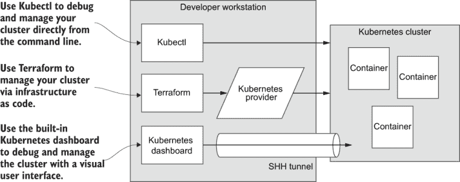

图 6.11 与 Kubernetes 交互的方法

### 6.12.1 Kubernetes 认证

在与你的 Kubernetes 集群交互之前，我们首先必须对其进行认证。在第 6.11.3 节中，你注意到了 Terraform 的以下输出。这些是你用于与集群认证所需的凭据。

+   `cluster_client_certificate`

+   `cluster_client_key`

+   `cluster_cluster_ca_certificate`

到目前为止，你可以尝试手动设置你的认证细节。为此，你需要在你的主目录下创建 .kube/config 文件，然后输入你的 Kubernetes 凭据。不幸的是，这个设置不是一项简单的练习！但幸运的是，我们正在使用 Azure 和 Azure CLI 工具来自动化这个设置，以下是一个命令：

```
az aks get-credentials --resource-group flixtube --name flixtube
```

当你调用 `aks get-credentials` 时，请确保将两个 `flixtube` 实例替换为你自己的应用程序名称。这是你在第 6.10 节中为 `app_name` 变量设置的名称。根据以下模板调用命令：

```
az aks get-credentials --resource-group <your-app-name> 
➥-name <your-app-name>
```

运行此命令后，Azure CLI 工具将创建你的 Kubectl 配置文件。你可以使用以下命令查看它：

```
cat ~/.kube/config
```

你可以在此处了解更多关于手动设置 Kubectl 配置文件的信息：

[`mng.bz/op8D`](http://mng.bz/op8D)

### 6.12.2 Kubernetes 命令行界面

在配置就绪后，我们现在可以使用 Kubernetes 命令行（Kubectl）与我们的集群交互。

安装 Kubernetes 命令行

安装 Kubectl 的说明可以在此处找到：

[`kubernetes.io/docs/tasks/tools/install-kubectl/`](https://kubernetes.io/docs/tasks/tools/install-kubectl/)

安装只是下载适合你操作系统的正确二进制可执行文件并将其添加到系统路径中。当你安装了 Kubectl 后，你可以使用以下命令测试它：

```
kubectl version
```

这显示了你的本地计算机上的 Kubectl 和你的 Kubernetes 集群版本号，可能看起来像这样：

```
Client Version: version.Info{Major:"1", Minor:"19", 
    GitVersion:"v1.19.3", 
    GitCommit:"1e11e4a2108024935ecfcb2912226cedeafd99df", 
    GitTreeState:"clean", BuildDate:"2020-10-14T12:50:19Z", 
    GoVersion:"go1.15.2", Compiler:"gc", Platform:"windows/amd64"}
 version.Info{Major:"1", Minor:"18", GitVersion:"v1.18.8", 
    GitCommit:"73ec19bdfc6008cd3ce6de96c663f70a69e2b8fc", 
    GitTreeState:"clean", BuildDate:"2020-09-17T04:17:08Z", 
    GoVersion:"go1.13.15", Compiler:"gc", Platform:"linux/amd64"}
```

这有点难以阅读！但如果你从 `Client Version` 开始扫描，你会找到 `GitVersion`，它显示了 Kubectl 的版本。你可以看到我正在使用 1.19.3 版本。然后你可以从 `Server Version` 开始扫描，找到 `GitVersion`，它显示了 Kubernetes 的版本。你可以看到我的集群正在使用 Kubernetes 的 1.18.8 版本。

使用 Kubectl

Kubectl 是与 Kubernetes 交互的官方和主要方法。任何可以用 Kubernetes 做的事情都可以从 Kubectl 中完成——配置、容器部署，甚至是监控实时应用程序。

在这本书中，我们主要通过 Terraform 代码来控制 Kubernetes。这是一种更高级、更易于表达的方式来与 Kubernetes 交互。而且，我们还可以保持一个简单的部署管道，并将所有基础设施和部署代码都放在 Terraform 中。但在现实世界的生产系统中，这并不总是可能的；尽管如此，我们能够在本书中的简单示例中实现这一点。

我们应该学习 Kubectl 的基础知识，因为它是 Kubernetes 的官方接口，也是 Terraform Kubernetes 提供商的基础。我们至少需要了解它，因为它是调试我们的 Kubernetes 集群的最佳方式，这一点我们将在第十章中探讨。考虑到这一点，让我们使用以下命令测试到我们的 Kubernetes 集群的认证连接：

```
kubectl get nodes
```

`get nodes` 命令显示了为我们集群提供动力的节点列表。我们创建了一个包含单个节点的集群，所以输出将会非常短；类似于以下内容：

```
NAME                              STATUS   ROLES   AGE   VERSION
aks-default-42625609-vmss000000   Ready    agent   21m   v1.15.7
```

到此为止。我们将在接下来的章节中返回 Kubectl 并学习更多命令。如果你愿意，你可以在以下位置继续学习和实验 Kubectl：

[`kubernetes.io/docs/reference/kubectl/overview/`](https://kubernetes.io/docs/reference/kubectl/overview/)

### 6.12.3 Kubernetes 仪表板

Kubectl 是与 Kubernetes 交互的一种方式。另一种是通过 Kubernetes 仪表板，一旦我们设置了 Kubectl 并进行了认证，我们就可以使用它来访问仪表板。

安装 Kubernetes 仪表板

Kubernetes 仪表板默认未安装。尽管如此，我们可以使用以下命令轻松安装它：

```
kubectl apply -f
➥ https://raw.githubusercontent.com/kubernetes/dashboard/v2.0.4/aio/deploy/
➥ recommended.yaml
```

连接到 Kubernetes 仪表板

我们无法直接连接到 Kubernetes 仪表板。它简单地没有向公众开放。然而，鉴于我们已经通过 Kubectl 认证来连接到我们的集群，我们可以使用 Kubectl 创建一个代理，允许我们从我们的开发工作站访问仪表板：

```
kubectl proxy
```

如果你在一个 Vagrant 虚拟机中运行代理，并想从你的主机操作系统访问它，你需要更改它的绑定 IP 地址，使其外部可访问：

```
kubectl proxy --address=0.0.0.0
```

代理允许我们使用完整的 Kubernetes REST API，该 API 可在 http://localhost:8001 访问。你可以在浏览器中打开这个 URL，查看它返回的内容。

如果你想探索 Kubernetes HTTP API，你可以使用 `curl` 命令、Postman 或 Visual Studio Code REST 客户端来做到这一点。你可以在这里了解更多关于代理命令的信息：

[`kubernetes.io/docs/reference/generated/kubectl/kubectl-commands#proxy`](https://kubernetes.io/docs/reference/generated/kubectl/kubectl-commands#proxy)

现在有了 REST API，我们可以通过代理访问仪表板。在你的网络浏览器中打开这个相当长且不自然的 URL：

http://localhost:8001/api/v1/namespaces/kubernetes-dashboard/services/https:kubernetes-dashboard:/proxy/

打开仪表板后，我们来到其身份验证屏幕。我们可以通过选择如图 6.12 所示的 Kubeconfig 文件进行身份验证。这个配置文件就是我们之前在第 6.12.1 节中查看过的，你可以在你的家目录中找到它，路径为~/.kube/config。

注意：如果你在一个 Vagrant 虚拟机下工作，你必须将此文件从虚拟机复制到你的主机操作系统，这样你才能选择它并使用仪表板进行身份验证。

要了解更多关于安装和连接到 Kubernetes 仪表板的信息，请阅读此网页上的信息：

[`kubernetes.io/docs/tasks/access-application-cluster/web-ui-dashboard/`](https://kubernetes.io/docs/tasks/access-application-cluster/web-ui-dashboard/)

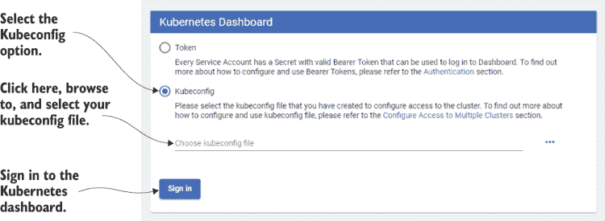

图 6.12 Kubernetes 仪表板的身份验证

探索 Kubernetes 仪表板

在浏览器中打开 Kubernetes 仪表板后，我们可以使用 GUI 图形化地检查我们的集群。这是了解我们的集群和学习 Kubernetes 的绝佳方式！我鼓励你在继续之前花些时间自己探索这个仪表板。当你完成下一章的学习时，你将能够返回到这个仪表板，并看到我们即将部署的容器。

图 6.13 显示了仪表板的概览页面。这就是你开始探索的地方。仪表板是首先需要访问的地方，尤其是在集群或其托管的任何容器出现问题时，尤其是在早期。在第十章中，我们将了解更多关于仪表板如何帮助调试的信息。

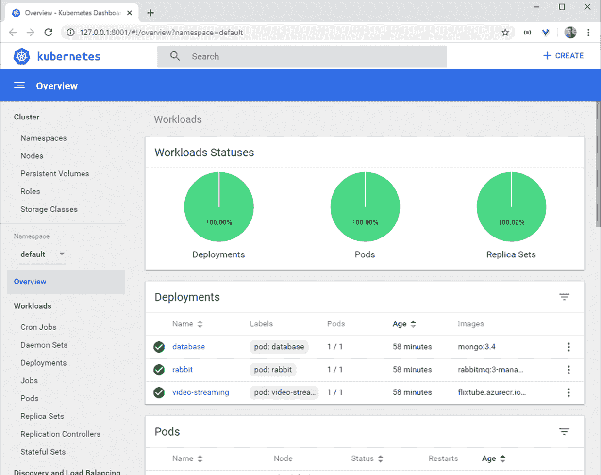

图 6.13 Kubernetes 仪表板

### 6.12.4 我们取得了什么成果？

我们已经将 Kubernetes 集群上线，并准备好开始部署我们的微服务。在这本书中，我们主要使用 Terraform 代码与我们的集群交互，但我们刚刚学习了两种其他与之交互的方式：Kubernetes CLI 和 Kubernetes 仪表板。

+   *Kubernetes CLI（也称为 kubectl）用于从终端配置和查询我们的集群。* 它为我们提供了更低级别的 API 用于管理和调试。

+   *Kubernetes 仪表板是我们与集群交互的图形化 GUI。* 它允许我们直观地探索 Kubernetes 可用的各种资源。除了是一个很好的调试工具外，它也是一个很好的教育工具，有助于更好地理解 Kubernetes。

在下一章中，我们将继续学习如何通过 Terraform 代码与 Kubernetes 交互。

## 6.13 Terraform 复习

这又是一个重要的章节！我相信现在回想起来，Docker 章节看起来要简单得多。

为了复习，Terraform 是一个用于创建和配置基于云的基础设施的通用工具。到目前为止，我们已经用它来创建我们的微服务应用程序的全部基础设施（除了 Azure 服务主体）。在继续之前，让我们回顾一下我们添加到工具箱中的 Terraform 命令。

表 6.2 Terraform 命令回顾

| 命令 | 描述 |
| --- | --- |
| `terraform init` | 初始化 Terraform 项目并下载提供者插件 |
| `terraform`➥ `apply -auto-approve` | 在工作目录中执行 Terraform 代码文件，以增量方式应用更改到我们的基础设施 |
| `terraform destroy` | 销毁由 Terraform 项目创建的所有基础设施 |

## 6.14 继续学习

在本章中，我们学习了如何基于 Kubernetes 创建生产环境。为了构建我们的生产环境，我们使用了 Terraform 和基础设施即代码的技术。我们将在下一章继续学习更多关于 Terraform 和 Kubernetes 的内容。

Kubernetes 本身是一个深奥且复杂的技术，绝对是我们在这本书中讨论的最复杂的技术。你可能会花上几个月的时间与之打交道，才能彻底了解它！在这本书中，我们只是触及了表面，但我们覆盖了足够的内容，以便将我们的应用程序部署到生产环境中。要深入了解这些主题，我推荐以下书籍：

+   *核心 Kubernetes* 由 Jay Vyas 和 Chris Love 合著（Manning，预计 2021 年夏季）

+   *Kubernetes 实战* 由 Marko Lukša 编著（Manning，2017 年）

+   *Terraform 实战* 由 Scott Winkler 编著（Manning，预计 2021 年春季）

+   *GitOps 和 Kubernetes* 由 Billy Yuen、Alexander Matyushentsev 等人合著（Manning，预计 2021 年春季）

+   *Kubernetes 快速入门* 由 William Denniss 编著（Manning，预计 2021 年夏季）

+   *一个月午餐学会 Kubernetes* 由 Elton Stoneman 编著（Manning，预计 2021 年 2 月）

你可以通过阅读 Kubernetes 文档来了解更多关于 Kubernetes 的信息：

+   [`kubernetes.io/docs/home/`](https://kubernetes.io/docs/home/)

Terraform 的文档可在以下位置找到：

+   [`www.terraform.io/docs/index.html`](https://www.terraform.io/docs/index.html)

要了解 Azure CLI 工具还能做什么，请在此处阅读文档：

+   [`docs.microsoft.com/en-us/cli/azure/`](https://docs.microsoft.com/en-us/cli/azure/)

你可以在此处了解更多关于 Azure 上托管 Kubernetes 服务的信息：

+   [`docs.microsoft.com/en-au/azure/aks`](https://docs.microsoft.com/en-au/azure/aks)

## 摘要

+   基础设施即代码是一种技术，我们将基础设施配置存储为代码。编辑和执行该代码是我们更新基础设施的方式。

+   我们使用 Terraform 从代码中编写创建云资源和应用程序基础设施的脚本。

+   在使用之前，必须初始化 Terraform，并且我们应该修复我们的提供者版本号以避免不愉快的惊喜。

+   Terraform 状态维护了我们创建的系统的记录，并使对系统的未来修改更加高效。

+   我们在 Azure 上为我们的应用程序创建了生产基础设施：一个容器注册库和一个 Kubernetes 集群。

+   我们可以使用 Terraform 输出来找出所创建基础设施的关键细节。

+   Terraform 资源图确保由 Terraform 创建的资源按正确的顺序创建。

+   Kubernetes 是一个支持多个云供应商的云计算平台。

+   Kubernetes 拥有一个可自动化的 API。这允许我们构建持续交付管道（更多内容将在下一章中介绍）。

+   我们不仅使用 Terraform，还使用 Kubernetes CLI（kubectl）和 Kubernetes 仪表板与我们的集群进行交互。
