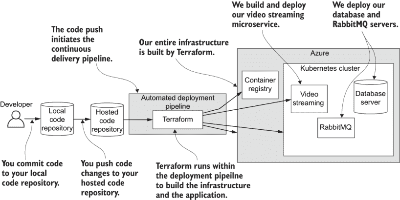
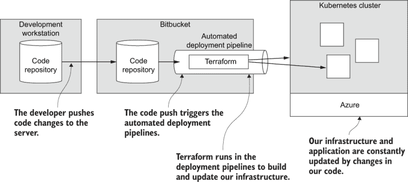
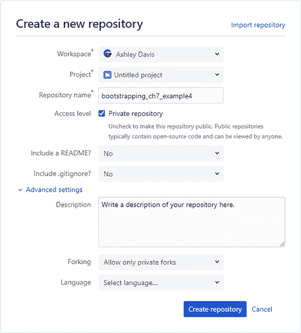
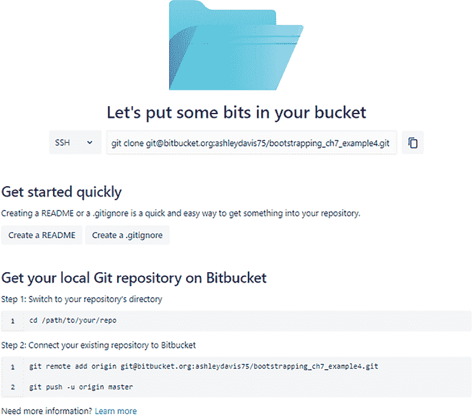
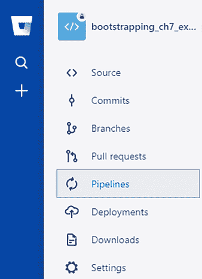
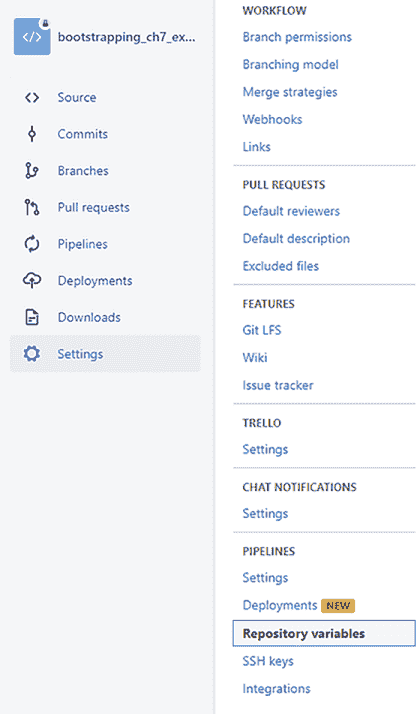
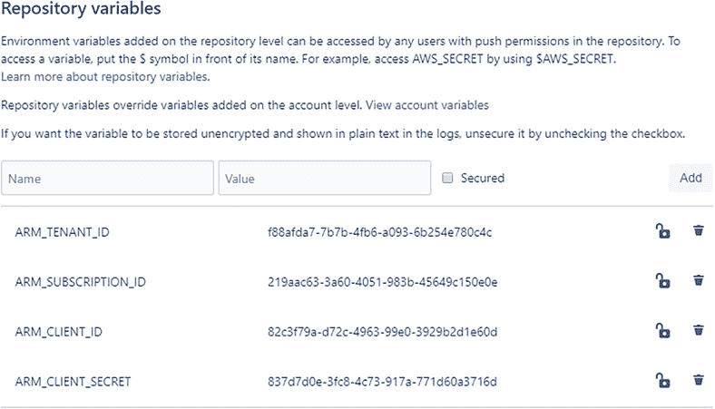
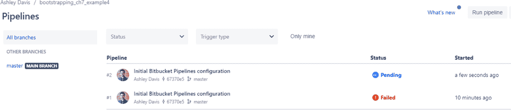
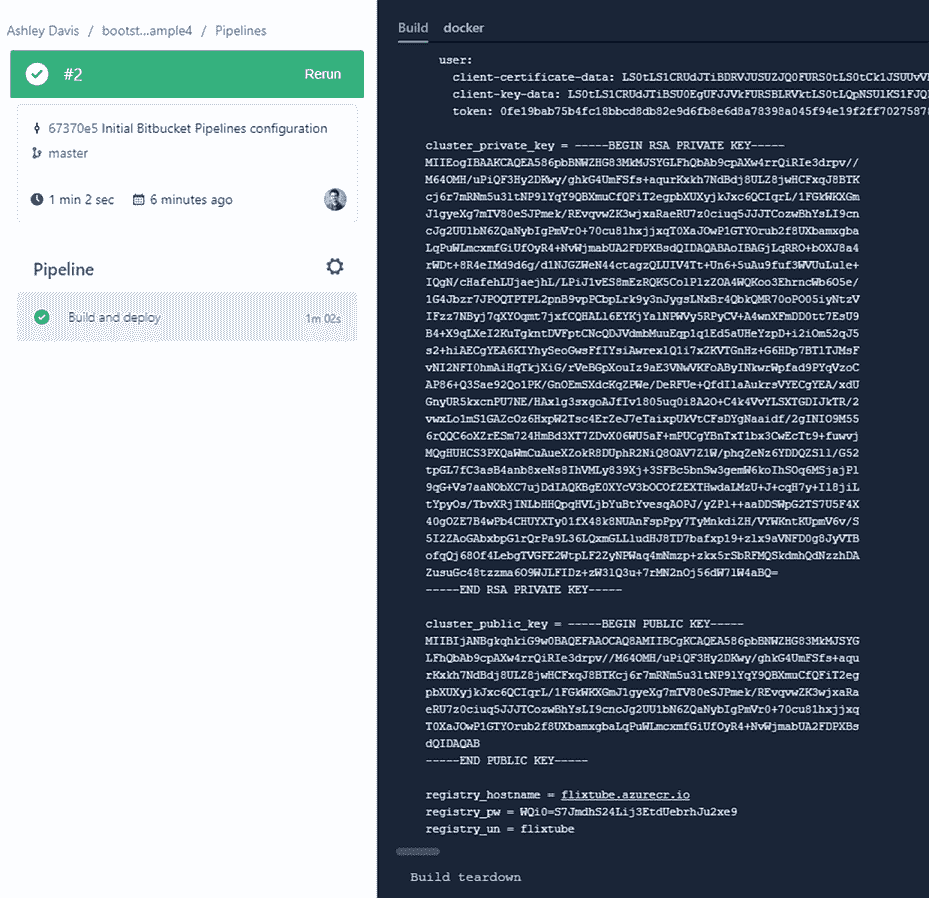
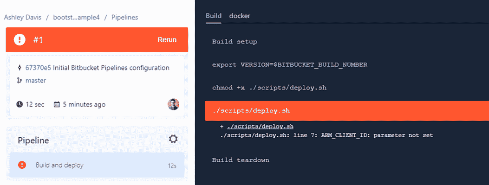

# 7 实现持续交付

本章涵盖

+   将容器部署到您的 Kubernetes 集群

+   使用 Terraform 配置 Kubernetes

+   为您的应用程序创建自动部署管道

+   使用 Bitbucket Pipelines 进行持续交付

在本章中，我们将我们的微服务应用程序的早期版本部署到生产环境中。在前一章中刚刚创建了一个空的 Kubernetes 集群，我们现在准备好向其部署容器。

首先，我们将部署我们的 MongoDB 数据库和 RabbitMQ 服务器。然后，我们将部署我们的第一个微服务到 Kubernetes 集群：我们在第二章中创建的视频流微服务（从那时起您已经走了很长的路）。

在学习如何使用 Terraform 将容器部署到 Kubernetes 之后，我们将通过自动化的持续交付（CD）管道来总结我们的部署过程。到那时，通过将代码更改推送到我们的托管代码存储库来实现基础设施和应用程序的更新。令人兴奋的时刻！

如果您觉得本章难以理解，请不要担心。本章和前一章可能是本书中最难的两章，所以请坚持下去！跟随示例是获得经验的最佳方式。在本章结束时，您的应用程序将在生产中*上线*，您需要亲自体验这种感觉！

## 7.1 新的和熟悉的工具

本章重新审视了 Kubernetes 和 Terraform。但现在，我们将使用 Terraform 将容器和微服务部署到我们的 Kubernetes 集群。我们还介绍了 Bitbucket Pipelines，这是我们用于为微服务应用程序创建 CD 管道的托管服务。

表 7.1 第七章中的新和熟悉工具

| 工具 | 版本 | 用途 |
| --- | --- | --- |
| Kubernetes | 1.18.6 | Kubernetes 是我们将用于在生产中托管微服务的计算平台。 |
| Terraform | 0.12.29 | Terraform 允许我们编写脚本以创建云资源和应用程序基础设施。 |
| Bitbucket Pipelines | N/A | 我们将用于持续交付（CD）以自动化应用程序部署的 Atlassian 提供的托管服务。 |

## 7.2 获取代码

要跟随本章，您需要下载代码或克隆存储库。

+   从这里下载代码的 zip 文件：

    [`github.com/bootstrapping-microservices/chapter-7`](https://github.com/bootstrapping-microservices/chapter-7)

+   您可以使用 Git 如下克隆代码：

    `git clone https://github.com/bootstrapping-microservices/chapter-7.git`

关于安装和使用 Git 的帮助，请参阅第二章。如果您在代码方面遇到问题，请在 GitHub 存储库中记录问题。

## 7.3 持续演进我们的基础设施

在前一章中，您有选择跟随示例的机会。它是这样的：

+   *在遵循第六章和第七章的示例的同时，迭代地演进我们的基础设施。* 我们从第六章的/example-1 开始，然后逐步复制每个新示例中的代码。

+   *为每个示例构建新的基础设施。* 第六章和第七章中的示例也可以独立运行，因此我们可以通过跳入任何示例并调用 Terraform 来轻松地从任何点开始我们的基础设施。

你可能选择了使用迭代和演进的方法（第一个选项）。如果是这样，你可以在本章继续这样做，其中示例被设计为直接从上一章继续。继续像在第六章中那样，将每个新示例中的文件复制到你的工作目录中。如果你选择单独运行每个示例或直接跳转到你感兴趣的特定示例（第二个选项），你也可以在本章继续这样做。

无论你选择哪种工作方式，请确保将 variables.tf 文件顶部的`app_name`变量的值更改为仅对你而言独特的名称。这必须是唯一的！如果你将你的应用程序命名为 FlixTube，它将与我自己或其他本书读者的资源重叠。

图 7.1 展示了本章我们将要实现的内容。我们将创建一个自动部署管道来部署一个 MongoDB 数据库服务器，部署一个 RabbitMQ 服务器，最重要的是，部署我们的第一个微服务。



图 7.1 本章构建的持续交付（CD）管道和应用程序

## 7.4 持续交付（CD）

*持续交付*（CD）是软件开发中的一种技术，我们频繁地将更新的代码自动部署到生产（或测试）环境中。这是我们应用程序的一个重要方面，因为这是我们可靠且频繁地将功能交付给客户手中的方式。从客户那里获得反馈对于构建相关产品至关重要。CD 使我们能够快速且安全地将代码更改部署到生产环境中，并促进快速的开发节奏。

到目前为止，我们已经设法将整个部署过程脚本化。对于更复杂的生产系统来说，这并不总是如此，但对于我们的示例应用程序来说足够了，并且有助于保持事情简单。它还使我们能够更容易地在 CD 管道中实例化我们的部署过程。

图 7.2 展示了到本章结束时我们的 CD 管道将看起来是什么样子。将代码更改推送到我们的 Bitbucket 代码仓库将启动自动部署。这执行我们的 Terraform 代码，并更新托管在 Kubernetes 集群中的应用程序。



图 7.2 使用基础设施即代码，我们可以使用代码来创建我们的基础设施。

我们编写的 Terraform 代码必须尽可能简单且无懈可击。这是因为，最终，在托管 CD 管道中运行代码的调试会更加困难！这就是为什么我们的部署代码应该是简单的，具有最少的移动部件，并且经过良好的测试。

就像任何其他代码一样，在代码部署到生产环境之前，我们将在我们的开发工作站（或个人电脑）上测试我们的部署代码。本章（以及上一章）的大部分内容都包括在接近持续集成（CD）之前，原型设计和测试我们的部署管道。

如果 CD 似乎很复杂或困难，请让我向你保证，它并不复杂。实际上，持续交付（Continuous Delivery）不过是能够在云中托管一个自动调用的 shell 脚本的能力。我们的部署 shell 脚本将在我们向代码仓库推送代码更改时自动调用。

注意：如果你能编写 shell 脚本（这并不困难），那么你可以构建一个 CD 管道。如前所述，CD 并不难；尽管如此，你在 shell 脚本中放入的内容可能就是难点。

对于本章的示例，我们将创建一个部署 shell 脚本，并从中调用 Terraform 来进行部署。在我们着手创建部署 shell 脚本并将其移动到我们的 CD 管道之前，我们将首先学习如何使用 Terraform 将容器部署到 Kubernetes。一旦我们完成了这一步，设置我们的 CD 管道将会相对容易。

## 7.5 使用 Terraform 部署容器

在上一章中，我们学习了如何使用 Terraform 创建基础设施。我们创建了一个私有容器注册库和一个 Kubernetes 集群。在本章中，我们再次使用 Terraform，但这次是为了将容器部署到我们的集群。在我们能够做到这一点之前，我们必须首先为 Terraform 配置 Kubernetes 提供程序。

### 7.5.1 配置 Kubernetes 提供程序

我们现在正在将第七章代码库中的 example-1 作为示例。根据你在第六章中的工作方式（参见 6.8.1 节），你可以更新你的工作项目以包含新代码，或者只为本章从头开始使用 example-1。以下列表显示了我们将添加到 providers.tf 中的新代码，以配置 Kubernetes 提供程序。

列表 7.1 设置 Kubernetes 提供程序（摘自 chapter-7/example-1/scripts/providers.tf）

```
... code omitted ...
provider "kubernetes" {                                            ①
    version = "1.10.0"                                             ②
    host = azurerm_kubernetes_cluster
    ➥ .cluster.kube_config[0].host                                ③
    client_certificate = base64decode(azurerm_kubernetes_cluster
    ➥ .cluster.kube_config[0].client_certificate)                 ③
    client_key = base64decode(azurerm_kubernetes_cluster
    ➥ .cluster.kube_config[0].client_key)
    cluster_ca_certificate = base64decode(azurerm_kubernetes_cluster
    ➥ .cluster.kube_config[0]
    ➥ .cluster_ca_certificate)                                    ③
}
```

① 配置 Kubernetes 提供程序

② 修复提供程序的版本号

③ 设置 Kubernetes 集群的连接和身份验证细节

你可能想知道，这就是我们配置 Kubernetes 集群连接和身份验证细节的地方。在这个代码文件中，这些值会自动从创建我们集群的其他 Terraform 代码文件中提取（参见 kubernetes-cluster.tf）。

您也可以用您单独创建的集群的详细信息替换这些值。例如，您可能已经在 Azure 门户 GUI 或使用 Azure CLI 工具手动创建了您的集群。您也可能使用一个完全独立的 Terraform 项目来创建您的集群。（我们将在第十一章中讨论以这种方式分离我们的代码。）无论如何，只要您有您集群的连接详细信息（就像我们在第 6.11.3 节中注意到的那些），您就可以在这里使用它们来连接到它。

如果您正在跟随，您现在需要调用 `terraform init`。无论您是在演进您的工作项目还是从 example-1 开始全新，您都需要这样做。我们向我们的 Terraform 项目添加了一个新的提供者，而 `init` 命令就是下载其插件的命令。

### 7.5.2 部署我们的数据库

我们将部署到 Kubernetes 的第一个容器是为我们的 MongoDB 数据库服务器。最终，这将是我们为每个微服务托管单独数据库的地方。

列表 7.2 显示了将数据库服务器部署到我们的集群的 Terraform 代码。此脚本创建了一个 Kubernetes 部署，从公共 Docker 映像实例化 MongoDB 容器。然后创建了一个 Kubernetes 服务，通过 DNS 使部署对其他容器可访问。这就是其他容器如何连接到我们的数据库。您可以在 Kubernetes 文档中了解更多关于 Kubernetes 概念，如部署和服务，[`kubernetes.io/docs/concepts/`](https://kubernetes.io/docs/concepts/)。

列表 7.2 部署您的数据库（第七章/示例-1/脚本/database.tf）

```
resource "kubernetes_deployment" "database" {       ①
  metadata {                                        ②
    name = "database"                               ③
    labels = {
      pod = "database"                              ④
    }
  }
  spec {
    replicas = 1                                    ⑤
    selector {                                      ⑥
      match_labels = {
        pod = "database"
      }
    }                                               ⑥

    template {                                      ⑦
      metadata {                                    ⑧
        labels = {
          pod = "database"                          ⑨
        }
      }
      spec {
        container {                                 ⑩
          image = "mongo:4.2.8"                     ⑪
          name  = "database"                        ⑫
          port {
            container_port = 27017                  ⑬
          }
        }
      }
    }
  }
}
resource "kubernetes_service" "database" {          ⑭
    metadata {
        name = "database"                           ⑮
    }
    spec {
        selector = {
            pod = kubernetes_deployment.database
            ➥ .metadata[0].labels.pod              ⑯
        }   
        port {
            port = 27017                            ⑰
        }
        type = "LoadBalancer"                       ⑱
    }
}
```

① 声明一个 Kubernetes 部署用于我们的 MongoDB 数据库服务器，导致 MongoDB 容器在我们的 Kubernetes 集群中实例化

② 为部署设置元数据

③ 设置部署的名称

④ 标记部署

⑤ 为此部署中的 pod 设置要创建的副本（或副本）数量

⑥ 通过匹配标签将部署附加到其 pod

⑦ 此部署创建的 pod 的模板

⑧ 为每个 pod 设置元数据

⑨ 标记 pod

⑩ 指定在 pod 中实例化的单个容器的详细信息

⑪ 设置实例化容器的映像

⑫ 设置容器的名称

⑬ 显示要公开的容器端口；在这种情况下，MongoDB 的默认端口（可选，主要用于信息）

⑭ 声明一个 Kubernetes 服务，创建一个 DNS 记录，以便数据库可以被集群内的其他容器访问

⑮ 设置服务的名称

⑯ 通过匹配标签将服务附加到部署

⑰ 设置此服务公开的端口

⑱ 使用 Azure 负载均衡器将服务暴露给外部世界。这为数据库分配了一个外部可访问的 IP 地址。我们可以使用它来测试我们的部署。

您可以看到在列表 7.2 的末尾，我们将 Azure 负载均衡器附加到 Kubernetes 服务上，以便将我们的数据库公开给外界。负载均衡器的真正用途是我们将在第十章和第十一章中讨论的，但在这里，我们只是用它来从我们的开发工作站访问集群中的数据库。这是如果我们把容器隐藏在集群内部，我们就无法做到的事情。

从安全角度来看，以这种方式公开我们的数据库是绝对不允许的。这意味着任何人（包括那些有恶意意图的人）都可以更改我们的数据库。请放心，这种情况只是暂时的！我们只是在基础设施的早期阶段为了测试（我们将在下一刻进行）而公开了我们的数据库。测试后，我们将将其锁定，使其只能从集群内部访问。

### 7.5.3 准备持续交付

我们正在开发工作站上原型化和测试我们的部署代码。在这个过程中，我们将准备在 CD 管道中运行此代码。这意味着我们需要我们的代码以完全自动化的方式运行，因此我们现在应该消除任何人工交互。

如果您回想起第 6.11.2 节，我们创建了一个 Azure 服务主体，允许我们的 Kubernetes 集群通过 Azure 进行身份验证。它需要这样做，以便它可以为我们的服务（如列表 7.2 中所示）创建负载均衡器。然后，在第 6.11.3 节中，当调用`terraform apply`时，我们手动为`client_id`和`client_secret`变量提供了值。为此，我们输入了从服务主体的`appId`和`password`字段中的值。

手动输入这样的值在 CD 管道中不起作用。这必须自动化！同时，在我们原型化 Terraform 代码时，不得不不断输入这些值也相当烦人。

现在，我们将通过命令行参数设置这些值。首先，您必须记住您的服务主体的详细信息。如果您在第 6.11.2 节中创建的服务主体仍然有效，并且您已经记下了这些详细信息，您可以重用它。否则，请再次按照第 6.11.2 节中的说明创建或更新您的服务主体。然后注意`appId`和`password`字段。现在，在设置`client_id`和`client_secret`为命令行参数的情况下，调用`terraform apply`示例-1：

```
terraform apply -var="client_id=a2016492-068c-4f37-a32b-6e6196b65488" 
➥ -var="client_secret=deb781f5-29e7-42c7-bed8-80781411973a" -auto-approve
```

只需记住将`client_id`和`client_secret`的值替换为您自己的服务主体的值，根据以下模板：

```
terraform apply -var="client_id=<your-client-id>" 
➥ -var="client_secret=<your-client-secret>" -auto-approve
```

您可以看到我们继续使用我们在第 6.9.2 节开始使用的`-auto-approve`命令行选项。设置变量并启用自动批准将我们的 Terraform 项目置于完全自动模式。无需人工干预，这意味着我们将在 CD 管道中完全无人值守地执行此代码。

### 7.5.4 测试新的数据库服务器

在上一节中调用 `terraform apply` 之后，你现在应该在你的 Kubernetes 集群中运行一个数据库服务器。为了测试我们的数据库是否启动，我们已将其附加了一个 Azure 负载均衡器（如列表 7.2 所示）。这是一个临时措施，以便我们可以使我们的数据库对外可访问并测试它以确保其正常工作。

查找外部 IP 地址

要找出分配给数据库服务的那个外部 IP 地址，我们可以使用 Kubernetes CLI 工具（Kubectl）或我们之前设置的 Kubernetes 仪表板（第 6.12 节）。我们可以使用 Kubectl 列出我们集群中的服务：

```
kubectl get services
```

如果你在使用 Kubectl 和连接到你的集群时遇到麻烦，请参阅第 6.12.1 节。输出看起来可能像这样：

```
NAME       TYPE         CLUSTER-IP  EXTERNAL-IP    PORT(S)
database   LoadBalancer 10.0.226.64 168.62.216.232 27017:30390/TCP
kubernetes ClusterIP    10.0.0.1    <none>         443/TCP
```

挑选出数据库服务（例如，我们在列表 7.2 中为其命名的服务）并注意 `EXTERNAL-IP` 列中的 IP 地址。你还可以在 `PORT(S)` 列中看到 MongoDB 默认端口 27017。这是从集群外部访问我们的数据库的 IP 地址和端口号。或者，我们可以打开 Kubernetes 仪表板（如第 6.12.3 节所述）并导航到服务部分以找到这些详细信息。

测试连接

现在使用 Robo 3T（如第 4.5.2 节中所述）或另一个数据库查看器，使用你为其记下的外部 IP 地址连接到你的数据库服务器。确保你使用端口号 27017 进行连接。如果一切顺利，你应该能够连接到你的数据库并查看其默认内容（然而，我们还没有添加任何特定内容）。

### 7.5.5 部署和测试 RabbitMQ

与我们的数据库服务器类似，但配置略有不同，我们现在转向 example-2。在那里，我们将 RabbitMQ 服务器部署到我们的 Kubernetes 集群。

列表 7.3 与列表 7.2 类似。它创建了一个 Kubernetes 部署，在容器中实例化 RabbitMQ 服务器。它创建了一个 Kubernetes 服务，使容器在集群内部可通过 DNS 访问。同样，我们将 Azure 负载均衡器附加到 Kubernetes 服务上，以便我们可以从集群外部访问它进行测试。然后，我们可以使用 RabbitMQ 仪表板来检查 RabbitMQ 是否正常工作。

列表 7.3 部署你的 RabbitMQ 服务器（chapter-7/example-2/scripts/rabbit.tf）

```
resource "kubernetes_deployment" "rabbit" {             ①
  metadata {
    name = "rabbit"
    labels = {
      pod = "rabbit"
    }
  }
  spec {
    replicas = 1
    selector {
      match_labels = {
        pod = "rabbit"
      }
    }
    template {
      metadata {
        labels = {
          pod = "rabbit"
        }
      }

      spec {
        container {
          image = "rabbitmq:3.8.5-management"          ②
          name  = "rabbit"
          port {
            container_port = 5672
          }
        }
      }
    }
  }
}
resource "kubernetes_service" "rabbit" {               ③
    metadata {
        name = "rabbit"
    }
    spec {
        selector = {
            pod = kubernetes_deployment.rabbit.metadata[0].labels.pod
        }   
        port {
            port = 5672
        }
    }
}
resource "kubernetes_service" "rabbit_dashboard" {     ③
    metadata {
        name = "rabbit-dashboard"
    }
    spec {
        selector = {
            pod = kubernetes_deployment.rabbit.metadata[0].labels.pod
        }   
        port {
            port = 15672
        }
        type = "LoadBalancer"                          ④
    }
}
```

① 声明一个 Kubernetes 部署以部署我们的 RabbitMQ 服务器。这就是在 Kubernetes 集群中实例化 RabbitMQ 容器的方式。

② 从公共 RabbitMQ 镜像实例化容器

③ 声明一个 Kubernetes 服务，创建一个 DNS 记录，以便 RabbitMQ 服务器可以被集群内的其他容器访问

④ 为服务创建一个 Azure 负载均衡器，为仪表板分配一个外部可访问的 IP 地址。我们可以使用它来测试部署。

现在运行 `terraform apply`（使用与第 7.5.3 节中相同的命令行参数）。然后将 RabbitMQ 部署到你的 Kubernetes 集群。

再次，我们已经配置了我们的服务（暴露 RabbitMQ 仪表盘的服务）可以通过 Azure 负载均衡器外部访问。现在我们可以使用 Kubectl 或 Kubernetes 仪表盘来找到已分配的外部 IP 地址。回顾第 7.5.4 节以记住我们是如何为我们的数据库做这件事的。注意外部 IP 地址，并使用您的浏览器打开 RabbitMQ 管理仪表盘。您可以使用默认用户名 *guest* 和默认密码 *guest* 登录。

例如，如果你的 RabbitMQ 仪表盘的 IP 地址是 40.112.161.104，那么你应该将你的浏览器指向 http://40.112.161.104:15672/。仪表盘的端口号是 15672。然而，你自己的服务的 IP 地址 *将不同于我的*。确保你将其替换为你分配给你的 RabbitMQ 实例的 IP 地址。

### 7.5.6 加强我们的安全性

我们已经通过外部端点测试了我们的 MongoDB 和 RabbitMQ 服务器。将这些服务器暴露给世界就像是在寻找麻烦！现在我们已经测试过了，让我们移除外部访问并加强我们的安全性。这就像从我们的脚本中移除以下行一样简单：

```
type = "LoadBalancer"
```

这正是我们从 example-3 开始要做的。当你用 example-3 代码更新你的工作项目并接下来调用 `terraform apply` 时，MongoDB 和 RabbitMQ 的外部访问将被移除，从而加强我们应用程序的安全性。

### 7.5.7 我们取得了什么成果？

在上一章创建我们的 Kubernetes 集群之后，在这一章中，我们现在开始用容器填充它。在为 Terraform 设置 Kubernetes 提供者之后，我们创建了新的 Terraform 脚本来部署 MongoDB 数据库和 RabbitMQ 服务器。

我们为了测试暂时将服务器暴露给外界。测试完成后，我们通过移除那些外部 IP 地址来加强我们的安全性——出于安全考虑，我们不希望外界能够访问我们的内部基础设施。

## 7.6 使用 Terraform 部署我们的第一个微服务

我们已经将一些公开可用的 Docker 镜像部署到了我们的集群中（MongoDB 和 RabbitMQ）。现在，让我们继续到 example-3 并将我们的第一个微服务部署到集群中。

虽然我们仍然从 Docker 镜像部署容器，但这次镜像是由我们自己的私有代码构建的。在我们能够从它部署容器之前，我们必须能够构建一个镜像并将其（就像我们在第三章中练习的那样）发布到我们在上一章 6.9 节中创建的私有容器注册库。

### 7.6.1 使用局部变量计算配置

为了使事情变得更容易，并使我们的 Terraform 代码更加紧凑，我们将使用 Terraform *局部变量* 来在我们的最新代码文件 video-streaming.tf 中组合和共享一些常见的配置值。这个新文件负责构建、发布和部署我们的视频流微服务。

下一个列表是从新的代码文件中摘录的。它显示了我们将用于脚本其余部分的多个本地变量的声明。

列表 7.4 使用本地变量进行配置（摘自第七章/示例 3/脚本/video-streaming.tf）

```
locals {
    service_name = "video-streaming"                              ①
    login_server = azurerm_container_registry.container_registry
    ➥ .login_server                                              ②
    username = azurerm_container_registry                         ②
    ➥ .container_registry.admin_username                         ②
    password = azurerm_container_registry                         ②
    ➥ .container_registry.admin_password                         ②
    image_tag = "${local.login_server}/${local.service_name}:${
    ➥ var.app_version}"                                          ③
}
# ... code omitted here ...
```

① 设置我们在这段代码文件中使用的部署服务的名称

② 设置我们私有容器注册库的连接详情。这些详情是从创建注册库的 Terraform 文件中提取的。

③ 组合视频流微服务 Docker 镜像的标签

注意`image_tag`本地变量是如何由多个其他变量组成的，特别是`app_version`变量，我们使用它来为每个连续的镜像添加一个新的版本号。`image_tag`变量也是我们标记图像以发布到容器注册库的方式。

### 7.6.2 构建和发布 Docker 镜像

现在，让我们看看构建并发布我们视频流微服务 Docker 镜像的 Terraform 代码。这段代码有三个任务：

+   构建镜像

+   登录到容器注册库

+   将镜像推送到容器注册库

你在第三章学习了如何做所有这些事情。在这里，我们将使用 Terraform 来自动化这个过程。

在列表 7.5 中，我们继续查看 video-streaming.tf 中的代码。虽然有一个 Docker 提供程序可以与 Terraform 一起使用，但不幸的是，它没有执行我们需要的任务的能力。这就是为什么我们使用 Terraform 的万能`null_resource`及其`local-exec`功能来调用我们需要的 Docker 命令。

我们可以使用`null_resource`来创建没有特定资源类型的 Terraform 资源。我们使用`local-exec`在本地计算机上调用命令。如果这个列表看起来像一个大杂烩，特别是使用`timestamp`来强制构建 Docker 镜像，那么确实是因为这是一个大杂烩！

我们使用这个作为权宜之计来简化事情，并保持我们的整个部署过程在 Terraform 中。从长远来看，我们不希望在生产环境中使用这样的代码。最终，我们将从这个权宜之计迁移出去，并实施一个更干净的解决方案。但你必须等到第十一章才能看到那是什么样子。

列表 7.5 构建和发布 Docker 镜像（摘自第七章/示例 3/脚本/video-streaming.tf）

```
# ... code omitted here ...
resource "null_resource" "docker_build" {                        ①
    triggers = {
        always_run = timestamp()                                 ②
    }
    provisioner "local-exec" {                                   ③
        command = "docker build -t ${local.image_tag} --file 
        ➥ ../${local.service_name}/Dockerfile-prod 
        ➥ ../${local.service_name}"
    }                                                            ③
}
resource "null_resource" "docker_login" {                        ①
    depends_on = [ null_resource.docker_build ]                  ④
    triggers = {
        always_run = timestamp()                                 ②
    }
    provisioner "local-exec" {                                   ⑤
        command = "docker login ${local.login_server} 
        ➥-username ${local.username} 
        ➥-password ${local.password}"                           ⑥
    }
}
resource "null_resource" "docker_push" {                         ①
    depends_on = [ null_resource.docker_login ]                  ④
    triggers = {
        always_run = timestamp()                                 ②
    }
    provisioner "local-exec" {                                   ⑦
        command = "docker push ${local.image_tag}"
    } 
}
# ... code omitted here ...
```

① 使用 Terraform 的 null_resource 声明我们的 Docker 命令

② 强制我们的命令始终被调用

③ 构建我们的 Docker 镜像

④ 设置对前一个命令的依赖，因为我们不能在构建镜像之后发布我们的镜像

⑤ 调用一个命令来对我们的容器注册库进行认证

⑥ 使用我们的注册库进行认证

⑦ 将镜像推送到我们的注册库

我必须承认，我们在列表 7.5 中对 `null_resource` 的使用（有些人可能会说是滥用）并不理想。如果 Docker 提供商直接支持构建和推送操作（为什么它不支持？），我们就不需要这段丑陋的代码了！不幸的是，目前就是这样，但也许在将来，会有一个更优雅的解决方案。在第十一章中，我们将讨论当我们从 *mono-repo*（单个代码仓库）结构转向 *multi-repo*（多个代码仓库）结构时如何解决这个问题。

### 7.6.3 使用容器注册库进行认证

在构建和发布我们的微服务的 Docker 镜像之后，我们必须现在授予集群从容器注册库拉取镜像的权限。您可以在列表 7.6 中看到这是如何完成的，我们继续查看 video-streaming.tf。在列表中，我们创建了一个 Kubernetes 机密来包含我们的 Docker 凭据。这是在集群中存储敏感数据的一种安全方式。

列表 7.6 使用容器注册库进行认证（摘自第七章示例 3 脚本/video-streaming.tf）

```
# ... code omitted here ...
locals {                                                       ①
    dockercreds = {                                            ②
        auths = {
            "${local.login_server}" = {
                auth = base64encode("${local.username}:${local.password}")
            }
        }
    }                                                          ②
}
resource "kubernetes_secret" "docker_credentials" {            ③
    metadata {
        name = "docker-credentials"
    }
    data = {
        ".dockerconfigjson" = 
         ➥ jsonencode(local.dockercreds)                      ④
    }
    type = "kubernetes.io/dockerconfigjson"                    ⑤
}
# ... code omitted here ...
```

① 定义更多局部变量以供此代码文件使用

② 创建一个包含我们的容器注册库认证详情的变量

③ 声明一个 Kubernetes 机密以安全地存储我们的认证凭据

④ 设置机密的数据

⑤ 设置机密的类型

再次，我们编写的代码感觉相当尴尬。如果 Docker 提供商有一个更优雅的方式来表达这一点，那会很好，也许在将来，他们会提供这样的解决方案。

### 7.6.4 部署视频流微服务

现在我们有了构建和发布我们的视频流微服务的 Terraform 代码。我们还拥有包含我们的注册库凭据的 Kubernetes 机密。现在我们可以编写部署我们的微服务的代码了。

列表 7.7 展示了 video-streaming.tf 中的剩余代码。文件的其他部分与我们在列表 7.2 和 7.3 中看到的代码类似，这些代码部署了 MongoDB 和 RabbitMQ 的容器。我们有一个 Kubernetes 部署，它实例化了一个用于我们的视频流微服务的容器，以及一个 Kubernetes 服务，使其在集群内部可通过 DNS 访问。此外，我们再次将 Azure 负载均衡器附加到 Kubernetes 服务上，以便使其外部可访问，这样我们就可以从我们的开发工作站测试集群中的微服务。

这里的主要区别是，我们的微服务的镜像私有，并从我们自己的私有容器注册库中拉取，而 MongoDB 和 RabbitMQ 是公共镜像。为了便于这样做，我们添加了一个显式的依赖项（使用列表中可以看到的 `depends_on`）。这个依赖项导致我们的 Docker 镜像在创建 Kubernetes 部署之前被构建和发布。此外，请注意，注册库凭据是通过 `image_pull_secrets` 提供的。

列表 7.7 部署视频流微服务（摘自第七章示例 3 脚本/video-streaming.tf）

```
# ... code omitted here ...
resource "kubernetes_deployment" 
➥ "service_deployment" {                                                 ①
    depends_on = [ null_resource.docker_push ]                            ②
    metadata {
        name = local.service_name                                         ③
    labels = {
            pod = local.service_name                                      ③
        }
    }
    spec {
        replicas = 1
        selector {
            match_labels = {
                pod = local.service_name                                  ③
            }
        }
        template {
            metadata {
                labels = {
                    pod = local.service_name
                }
            }
            spec {
                container {
                    image = local.image_tag                               ④
                    name  = local.service_name
                    env {
                        name = "PORT"
                        value = "80"
                    }
                }
                image_pull_secrets {                                      ⑤
                    name =                                                ⑤
                 ➥ kubernetes_secret.docker_credentials.metadata[0].name  ⑤
                }                                                         ⑤
            }
        }
    }
}
resource "kubernetes_service" "service" {                                 ⑥
    metadata {
        name = local.service_name
    }
    spec {
        selector = {
            pod = kubernetes_deployment.service_deployment.metadata[0].labels.pod
        }   
        port {
            port = 80
        }
        type = "LoadBalancer"                                             ⑦
    }
}
```

① 声明了一个 Kubernetes 部署以部署我们的视频流微服务。这将在我们的 Kubernetes 集群中实例化微服务的容器。

② 创建了一个依赖项，导致我们的 Docker 镜像在容器部署之前构建和发布

③ 使用局部变量在此代码文件中共享配置

④ 图片是从我们的私有容器注册库中拉取的。

⑤ 为我们的容器注册库指定了身份验证凭据，以便 Kubernetes 可以拉取镜像

⑥ 声明了一个 Kubernetes 服务，创建一个 DNS 记录以在集群内使微服务可访问

⑦ 使用 Azure 负载均衡器为该服务创建一个外部 IP 地址。我们可以使用这个地址来测试已部署的微服务是否正常工作。

在 7.7 列表的末尾，你可以看到我们已经将 Azure 负载均衡器附加到 Kubernetes 服务上以创建外部端点。我们为了测试目的暂时将一个容器暴露给外部世界。这允许我们从网页浏览器中检查我们的视频流微服务以验证其功能。请放心，最终的 FlixTube 示例应用程序已限制外部端点！你将不得不等到第九章才能看到这一点。

### 7.6.5 测试你的微服务

让我们把这个微服务部署起来吧！调用`terraform apply`并将视频流微服务部署到你的 Kubernetes 集群中：

```
terraform apply -var="app_version=1" -var="client_id=<your-client-id>" 
➥ -var="client_secret=<your-client-secret>" -auto-approve
```

注意，我们现在正在设置`app_version`变量。我们最初将其设置为版本 1，并在发布微服务的新版本镜像时递增它。请记住用 6.11.2 和 7.5.3 节中所示的自定义服务主体的值替换`client_id`和`client_secret`的值。

完成此操作后，查找视频流微服务的外部 IP 地址，就像在 7.5.4 节中为数据库服务所做的那样。现在打开你的网络浏览器并导航到该 IP 地址的/video 路由。例如，如果你的 IP 地址是 40.112.161.104，那么将你的浏览器指向 http://40.112.161.104/video。只需记住使用你自己的外部 IP 地址。你现在应该能在浏览器中看到熟悉的视频播放。

### 7.6.6 我们取得了什么成果？

在部署 MongoDB 和 RabbitMQ 的容器之后，我们现在已经打包、发布并部署了我们的第一个微服务！在这个过程中，我们学习了如何使用 Terraform 局部变量来组合和共享配置细节，以便在多个地方使用。这使我们免去了多次输入这些细节的麻烦，并在以后需要更改这些配置时将变得方便。

我们使用 Docker 构建和发布了微服务的镜像。从集群到容器注册库的身份验证（以拉取镜像）有点棘手，但我们创建了一个 Kubernetes 密钥来处理这个问题。

最终，我们部署并测试了我们的视频流微服务，并完成了我们的部署流程的原型设计。现在，是时候通过创建我们的 CD 管道来自动化部署流程了。

## 7.7 使用 Bitbucket Pipelines 进行持续交付

到目前为止，在第六章和第七章的这一部分，我们手动调用了 Terraform 来执行我们的基础设施代码，并为我们的应用程序构建基础设施。这样做是原型化我们的部署代码的正常流程的一部分。

就像任何编码任务一样，在我们可以在生产环境中运行代码之前，我们需要在本地开发和测试我们的代码。在这种情况下，这尤其重要，因为这段代码运行在托管服务中，调试那里发生的问题可能相当困难。我们希望这段代码在我们离开开发工作站之前尽可能无懈可击。

在本地运行 Terraform 也是学习和理解基础设施即代码的最佳方式。但使用 Terraform 和基础设施即代码的整个目的在于自动化我们的部署流程。我们不希望每次对基础设施或微服务的更改都手动调用 Terraform。我们希望频繁地部署更改，并希望它是自动化和简化的，这样我们就可以把大部分时间花在构建功能上，而不是部署我们的软件。此外，自动化还可以大大减少人为错误的可能性。

现在，我们将使用 Bitbucket Pipelines 创建我们的 CD 管道。这是 Atlassian 提供的一项托管服务，我们将用它以自动化的方式运行我们的部署流程。它使我们的部署过程变得像代码推送一样简单。将代码更改推送到我们的托管代码仓库将自动调用我们的部署管道。

### 7.7.1 为什么选择 Bitbucket Pipelines？

有许多好的托管服务用于 CD，它们都相当相似。如果你学会了其中一个，你会发现其他的并没有太大的不同。

Bitbucket Pipelines 很方便，因为它包含在 Atlassian 的 Bitbucket 中，这样我们就可以将代码和 CD 管道放在一起。你无法抱怨价格！Atlassian 提供了一个很好的入门级服务，包括免费的私有仓库和每月有限的*免费* *构建分钟数*，可以用于 CD 管道。这为我们提供了足够的空间，可以完全免费托管一个小型构建管道。

注意：我们使用哪种托管服务实际上并不重要。例如，GitHub 和 GitLab 都提供类似的服务，配置方式也类似。Bitbucket Pipelines 出现在这本书中，是因为我在生产环境中目前使用的是它，尽管我过去使用过 GitLab，而且我继续在大多数开源编码中使用 GitHub。

我喜欢将 CD 简单地视为在云中自动运行 shell 脚本的一种方式。当然，这是一个简化，但它可能有助于你理解 CD 并不特别复杂或神秘。为我们的部署创建 shell 脚本也是有用的，因为我们可以在本地轻松测试它。

### 7.7.2 将示例代码导入 Bitbucket

要使用 Bitbucket Pipelines，我们首先必须将我们的代码提交到 Bitbucket 代码仓库。我们现在将转到代码示例-4。这与示例-3 相同，但它包括了我们需要为我们的 CD 管道添加的额外配置。

此外，在这个时候，你应该使用 `terraform destroy`（如果你还没有这样做）来销毁你之前创建的基础设施。你之前创建的基础设施是我们的 *原型* 基础设施。从现在开始，我们将使用我们的 CD 管道来创建 *生产* 基础设施，我们不希望它们重叠。

在 Bitbucket 上注册

首先，你需要注册一个 Bitbucket 账户，假设你还没有。登录或注册请点击此处：[`bitbucket.org`](https://bitbucket.org)。

创建托管代码仓库

当你登录到你的账户时，点击按钮创建一个新的代码仓库。为你的新仓库选择一个名称并填写详细信息（如图 7.3 所示）。



图 7.3 创建新的 Bitbucket 代码仓库

在创建你的代码仓库后，你会看到一个类似于图 7.4 的页面。这里提供了将代码放入仓库的说明。这些只是标准的 Git 命令，但很方便的是，这些命令给出了我们导入代码所需的精确命令。



图 7.4 Bitbucket 提供的将你的代码放入新仓库的说明

创建本地仓库

在将示例-4 代码导入我们的新仓库之前，让我们先创建一个全新的副本，这样我们就不至于弄乱第七章的仓库：

```
cp -r chapter-7/example-4 bootstrapping_ch7_example4
```

进入新目录并初始化一个新的空 Git 仓库：

```
cd bootstrapping_ch7_example4
git init
```

现在将所有文件提交到新仓库：

```
git add .
git commit -m "First commit"
```

推送到托管仓库

现在我们可以遵循 Bitbucket 提供的说明（如图 7.4 所示）。给出的命令将因我们拥有不同的 Bitbucket 账户而不同。第一个命令是将远程仓库作为本地仓库的源。例如

```
git remote add origin
➥ git@bitbucket.org:ashleydavis75/bootstrapping_ch7_example4.git
```

记得用你自己的详细信息替换远程仓库的 URL。以下是你应该使用的模板：

```
git remote add origin git@bitbucket.org:<your-user-name>/<your-repo-name>.git
```

现在将你的代码推送到你的托管仓库：

```
git push -u origin master
```

在这个阶段，你需要输入你的凭证。为了避免每次推送时都这样做，我建议你设置一个 SSH 密钥，这在每个平台上都相对容易完成，请按照 Bitbucket 支持的以下说明操作：



图 7.5 导航到你的仓库的管道页面

[设置 SSH 密钥](https://confluence.atlassian.com/bitbucket/set-up-an-ssh-key-728138079.html)

在未来，你可以使用简短的命令来推送代码更改：

```
git push
```

启用 Bitbucket Pipelines

我们已经创建了托管代码仓库并将示例代码推送到它。现在，我们可以为这个仓库启用 Bitbucket Pipelines。导航到管道页面（如图 7.5 所示）。

示例代码包含一个 bitbucket-pipelines.yaml 配置文件。Bitbucket 会检测到这个文件，现在你可以点击启用按钮（如图 7.6 所示），这将启用此代码仓库的 Bitbucket Pipelines。（注意，你可能需要向下滚动以便可以看到启用按钮。）


图 7.6 点击启用按钮以启用 Bitbucket Pipelines

### 7.7.3 创建部署 shell 脚本

大多数 CD 管道都可以简化为一个由环境变量提供的输入的 shell 脚本。采用这种方法有两个原因：

+   我们的部署管道在 CD 提供者之间具有一定的可移植性。

+   我们可以很容易地通过执行 shell 脚本在本地测试我们的部署管道。

创建部署 shell 脚本给我们一些自由。这很好，但这对我们部署管道的本地测试也是必不可少的。在我们尝试在云中无人执行之前，我们需要确保这段代码是坚不可摧的。

我们在本章的大部分时间里都在原型设计和测试我们的部署代码，所以我们已经非常确信它的工作。我们只需要将其封装在一个 shell 脚本中。example-4 中包含的 shell 脚本如下所示。它很简单，这是因为我们能够将我们的部署代码完全保持在 Terraform 中。我们的 shell 脚本只是调用 Terraform。

列表 7.8 部署的 shell 脚本（chapter-7/example-4/scripts/deploy.sh）

```
set -u                                            ①
: "$VERSION"
: "$ARM_CLIENT_ID"
: "$ARM_CLIENT_SECRET"
: "$ARM_TENANT_ID"
: "$ARM_SUBSCRIPTION_ID"                          ①
cd ./scripts                                      ②
export KUBERNETES_SERVICE_HOST=""                 ③
terraform init                                    ④
terraform apply -auto-approve \                   ⑤
    -var "app_version=$VERSION" \                 ⑥
    -var "client_id=$ARM_CLIENT_ID" \ 
    -var "client_secret=$ARM_CLIENT_SECRET"       ⑥
```

① 检查是否提供了预期的输入环境变量

② 从包含我们的部署脚本的目录中调用 Terraform

③ Kubernetes 提供者的一个问题的工作方案（解释如下）

④ 初始化 Terraform 并下载提供者

⑤ 调用 Terraform apply

⑥ 从环境变量设置 Terraform 变量

在这个脚本中有一个有趣的事情需要注意，那就是它是如何检查输入环境变量的。这些是我们应用程序的当前版本号（用于标记我们的 Docker 镜像）和我们的 Azure 账户的认证详情。我们很快就会看到这些变量从哪里来。

你可能想知道为什么我们要设置 KUBERNETES_SERVICE_HOST 环境变量。这是在尝试在 Kubernetes pod 内使用 Terraform 的 Kubernetes 提供者时出现问题的解决方案。（我刚刚短路了你的大脑吗？）看起来 Bitbucket Pipelines 在 Bitbucket 自己的 Kubernetes 集群内的一个 pod 中悄悄地运行我们的 CD 管道。这很有意义，也是 Kubernetes 的一个很棒的使用案例。由此产生的问题不应该发生，但它确实发生了。我们清空 KUBERNETES_SERVICE_HOST 环境变量来欺骗 Kubernetes 提供者，以避免这个问题。

我们不应该关心这类事情，但有时在使用早期工具（Terraform 是在 1.0 版本之前），我们有时不得不应对 Terraform 或其提供者插件中的异常问题。可能在你阅读这段文字的时候，问题已经被修正，这个解决方案也就不再需要了。如果你好奇并想了解更多，你可以在这里阅读相关信息：

[`github.com/terraform-providers/terraform-provider-kubernetes/issues/679`](https://github.com/terraform-providers/terraform-provider-kubernetes/issues/679)

### 7.7.4 管理 Terraform 状态

现在我们回到管理 Terraform 状态这个棘手的问题。回想一下前一章的 6.8.7 节。你会记得 Terraform 有一个状态文件，这样它就能记住它创建的基础设施。

现在的问题是，我们如何在我们的 CD 流水线中持久化状态文件？CD 流水线的特性是每次调用都在一个新的容器实例中发生。这就是为什么我们必须在我们的部署 shell 脚本中对每一次部署调用 `terraform init`。

我们如何管理 Terraform 状态文件？我们必须在 CD 流水线的实例之间持久化它，这样 Terraform 的后续调用就能记住之前创建的内容。这样它就不会盲目地尝试重新创建它已经创建的基础设施。Terraform 有一个解决方案。我们可以提供外部存储，Terraform 可以在其中存储其状态文件。这使得状态文件可以单独存储在 CD 流水线之外。

以下列表显示了我们的 Azure 后端配置。通过这个配置，我们设置了一个 Azure 存储帐户作为存储 Terraform 状态的后端。

列表 7.9 配置后端存储（第七章示例 4 的 scripts/backend.tf）

```
terraform {
    backend "azurerm" {                       ①
        resource_group_name  = "terraform"    ②
        storage_account_name = "terraform"    ②
        container_name       = "terraform"    ②
        key = "terraform.tfstate"             ③
    }                                         ①
}
```

① 为 Azure 存储后端设置配置

② 为 Terraform 设置资源组、存储帐户和容器的名称

③ 指定存储 blob 的名称，其中存储 Terraform 状态

在 Terraform 在你的 CD 流水线中工作之前，我们必须为它创建一个单独的 Azure 存储帐户。首先，选择一个用于你的存储帐户的名称。正如你在列表 7.9 中看到的那样，我使用了 `terraform` 这个名称。不幸的是，你不能使用这个名字，因为存储帐户的名称必须是全局唯一的（这有点令人烦恼）。

在你的浏览器中打开 Azure 门户，并在具有相同名称的资源组下创建一个新的存储帐户。（有关创建存储帐户的复习，请参阅第四章的 4.4.1 节。）

在你的新存储帐户中，也创建一个具有相同名称的容器（一个存储容器，而不是 Docker 容器）。你可以为这个容器使用任何你想要的名称（尽管，存储帐户的名称有一些限制）。我使用了 `terraform` 这个名称作为资源组、存储帐户和容器名称。我使用这个名称只是为了表明这些都是在我们的 CD 管道中运行的 Terraform 的纯使用。这个新的存储帐户在基础设施或应用程序中未作他用。

一旦创建了存储帐户和容器，编辑 backend.tf（如列表 7.9 所示）并将每个 `terraform` 实例替换为你所选的名称。在这个阶段，你可以将这些更改提交到你的本地代码仓库，但不要将它们推送到 Bitbucket！在我们 CD 管道工作之前，我们还有一些配置要做。

### 7.7.5 Bitbucket Pipelines 脚本

我们 CD 管道的最后一部分是 bitbucket-pipelines.yaml 配置文件。这个 YAML 文件是我们用来配置我们的 CD 管道的。要使用 Bitbucket Pipelines，你必须在这个代码仓库的根目录中拥有此文件。没有它，它根本不起作用。

列表 7.10 显示了 example-4 中的 bitbucket-pipelines.yaml。你可以看到我们只是将此文件用作列表 7.8 中 shell 脚本的包装器。当然，这不仅仅是这样，但也没有多少！为我们的 Bitbucket 代码仓库启用 Bitbucket Pipelines 后，此 YAML 文件现在在代码推送到托管代码仓库时调用我们的部署 shell 脚本。

列表 7.10 配置我们的 Bitbucket Pipelines 自动部署管道（chapter-7/example-4/bitbucket-pipelines.yaml）

```
image: hashicorp/terraform:0.12.6                       ①
pipelines:
    default:                                            ②
      - step:                                           ③
          name: Build and deploy
          services:
            - docker                                    ④
          script:
            - export VERSION=$BITBUCKET_BUILD_NUMBER    ⑤
            -  chmod +x ./scripts/deploy.sh             ⑥
            - ./scripts/deploy.sh                       ⑦
```

① 为 CD 管道中运行的容器设置基本镜像。我们使用 Terraform 基本镜像，以便在我们的 CD 管道中访问 Terraform 工具。

② 配置我们仓库的默认管道。我们也可以为每个分支有单独的管道。

③ 在我们的部署管道中定义一个步骤（这里，只有一个步骤）

④ 启用 Docker 服务。这让我们可以在 Terraform 代码中使用 Docker。

⑤ 将 VERSION 环境变量设置为 Bitbucket 构建号

⑥ 确保我们的部署脚本可执行

⑦ 执行我们的部署脚本。这是我们部署管道的核心。

注意列表 7.10 中的第一行如何设置 CD 管道容器的基镜像。每次我们的 CD 管道被触发时，Bitbucket 都会从这个镜像实例化一个新的容器。我们自动可以访问 Terraform 工具，因为它在基镜像中预先安装。如果我们不使用 Terraform，我们可以选择不同的基镜像。查看列表 7.10 中的以下代码行：

```
export VERSION=$BITBUCKET_BUILD_NUMBER
```

这是将环境变量传递到我们的部署 shell 脚本的一种方法，在这里我们已设置了应用程序的版本号。我们是从 Bitbucket Pipeline 的`BITBUCKET_BUILD_NUMBER`环境变量中设置这个版本的，这个变量简单地计算了 CD 管道被触发的次数。这是为 CD 管道内创建的镜像生成版本号的一种方便方法。Bitbucket Pipelines 还提供了许多其他内置环境变量，这些变量可能很有用。有关更多信息，请参阅

[`confluence.atlassian.com/bitbucket/variables-in-pipelines-794502608.html`](https://confluence.atlassian.com/bitbucket/variables-in-pipelines-794502608.html)

### 7.7.6 配置环境变量

在上一节中，你看到了如何将环境变量输入到我们的部署 shell 脚本中的一个示例。我们还有其他一些尚未提供的环境变量。

我们可以在`bitbucket-pipelines.yaml`中设置这些变量，就像在 7.10 列表中设置`VERSION`环境变量一样，但对于我们的 Azure 凭证，我们不应该这样做。这些信息是敏感的，出于安全考虑，我们不希望将这些信息包含在我们的代码仓库中。相反，我们将通过 Bitbucket GUI 将这些变量配置为*仓库变量*。导航到代码仓库设置选项下的“仓库变量”页面（如图 7.7 所示）。



图 7.7 导航到代码仓库的仓库变量

现在创建仓库变量，并按照图 7.8 所示输入它们的值。你可以自由地选择“受保护”选项，为这些敏感值提供额外的安全层。这些值作为环境变量传递到我们的 CD 管道中。

在创建这些变量时，你必须输入你自己的 Azure 账户和 Azure 服务主体的身份验证凭据。`ARM_CLIENT_ID`和`ARM_CLIENT_SECRET`的值是你创建服务主体时从`appId`和`password`字段中获取的。`ARM_TENANT_ID`和`ARM_SUBSCRIPTION_ID`的值是你 Azure 账户的详情，你可以使用`az account show`命令查看这些详情，就像我们在 6.11.2 节中做的那样。

这些身份验证详情必须设置在某处。如果你还记得，在 6.6.2 节中，我们曾在我们的开发工作站上使用`az login`命令来与 Azure 进行身份验证。这个命令在我们的 CD 管道中不起作用，因为不可能有人工交互。为了允许 Terraform 使用 Azure 身份验证来构建和更新我们的基础设施，我们必须将这些身份验证详情传递到我们的管道中。



图 7.8 创建仓库变量以指定 Azure 身份验证凭据

### 7.7.7 测试你的部署管道

好的，我们终于准备好测试我们的 CD 管道了！我们已经创建了一个 Bitbucket 代码仓库，并将 example-4 代码的副本推送到它。我们已经为该仓库启用了并配置了 Bitbucket Pipelines，我们有一个 CD 管道；我们只需要触发它！

我们可以通过简单地推送代码来触发管道。你可能已经有了一个未推送的代码更改准备就绪。如果你一直跟着做，你已经在 7.7.4 节中更早的时候提交了 backend.tf 的更改。现在就推这些更改吧：

```
git push
```

如果你之前推送了这些代码更改，那并不是什么大问题。现在进行一个简单的更改（例如，在某个代码文件中添加一个空行）然后提交并推送到触发 CD 管道。在测试和调试你的 CD 管道时，你可以重复这个过程任意多次。

你可以在 Bitbucket 仓库的管道页面下监控管道调用（如图 7.9 所示）。你在这个例子中可以看到，我的第一次管道调用失败了，而第二次调用刚刚开始（用“挂起”一词表示）*。*



图 7.9 从管道页面监控管道调用

你可以深入到任何管道调用中，以了解发生了什么。当然，你将来需要这样做，以便在它失败后找出出了什么问题。

例如，我点击进入我的第二次调用（成功完成的那个）。你可以在图 7.10 中看到它的样子。你会注意到，部署 shell 脚本的完整输出在这里显示。现在你应该很熟悉了，因为它与我们之前在本地测试 Terraform 代码时看到的相同输出。



图 7.10 查看成功的 CD 管道调用

### 7.7.8 调试你的部署管道

现在我们有一个 CD 管道。改变我们的基础设施和部署我们的应用程序现在与改变我们的代码同义：我们称之为*基础设施即代码**。

你现在可能有一个新的问题：我如何调试我的部署管道？你可能在我展示的图 7.9 中的失败管道后对此感到好奇。或者，可能是因为你可能已经有过自己的失败管道！

第一步是在你自己的开发工作站上彻底测试你部署代码的任何更改。然后，我们可以在我们的部署代码到达 CD 管道之前捕捉到许多问题。

当你遇到失败的管道时，你需要深入调查它，阅读输出，并尝试理解问题。理解问题是难点；一旦我们知道问题是什么，修复问题通常很容易。

你可以在图 7.11 中看到一个问题的例子，当我深入挖掘以找出我的第一个管道调用失败的原因时。我阅读了这里的错误信息，并意识到它失败是因为我没有提供所需的环境变量。我在配置存储库变量之前调用了这个管道，正如我们在 7.7.6 节中所做的那样。这是一个容易犯的错误，如果你在推动我们在 7.7.4 节中做出的更改时过于冲动，你可能已经犯了这个错误。



图 7.11 查看失败的 CD 管道和读取错误信息

当调试你的管道时，你应该注意你可以使用任何常见的命令来帮助你。例如`cd`、`ls`、`pwd`和`cat`等命令可以用来在 CD 管道的容器内导航和检查文件系统。这为你提供了多种理解那里发生的事情的方法。希望这个虽小但非常有价值的小贴士能帮助你未来的 CD 管道调试！

### 7.7.9 我们取得了什么成果？

你刚刚创建了你的第一个 CD 管道，并使用它来部署生产基础设施和容器。这是真正的进步！

有许多 CD 服务，但我们使用了 Atlassian 的 Bitbucket Pipelines。我们在 Bitbucket 上创建了一个存储库，并从 example-4 导入代码。然后我们创建了一个 shell 脚本来封装我们的部署。

虽然 CD 有很多供应商，但构建 CD 管道通常不会比调用一个 shell 脚本多多少。这很有用，因为 shell 脚本是我们可以在尝试在我们的 CD 管道中运行它之前在本地测试的东西。我们创建的部署 shell 脚本很简单。这是因为我们的整个部署过程都在 Terraform 代码中，所以我们只是调用了 Terraform 来创建我们的基础设施并部署我们的容器。

## 7.8 继续学习

在本章中，我们将我们在上一章中创建的 Kubernetes 集群部署了我们的初出茅庐的微服务应用程序。在未来的章节中，我们将继续完善 FlixTube 应用程序，使其成为一个完整的应用程序。

总是会有比我们能在这里涵盖的更多的东西要学习。随着我们深入开发，你无疑在工作过程中需要进一步深入。以下是一些将帮助你做到这一点的书籍：

+   *《核心 Kubernetes》* by Jay Vyas and Chris Love (Manning, 预计 2021 年夏季)

+   *《Kubernetes 实战》* by Marko Lukša (Manning, 2017)

+   *《Terraform 实战》* by Scott Winkler (Manning, 预计 2021 年春季)

+   *《GitOps 和 Kubernetes》* by Billy Yuen, Alexander Matyushentsev, et. al. (Manning, 预计 2021 年春季)

+   *《Kubernetes 快速入门》* by William Denniss (Manning, 预计 2021 年夏季)

+   *《一个月午餐学会 Kubernetes》* by Elton Stoneman (Manning, 预计 2021 年 2 月)

要了解 Atlassian Bitbucket，请访问 Bitbucket 网站：

+   [`bitbucket.org/`](https://bitbucket.org/)

在以下位置查看 Bitbucket 概述：

+   [`bitbucket.org/product/guides/getting-started/overview`](https://bitbucket.org/product/guides/getting-started/overview)

要了解更多关于使用 Bitbucket Pipelines 的 CD 信息，请参阅

+   [`bitbucket.org/product/features/pipelines`](https://bitbucket.org/product/features/pipelines)

在 Kubernetes 文档中了解更多关于 Kubernetes 概念的信息

+   [`kubernetes.io/docs/concepts/`](https://kubernetes.io/docs/concepts/)

## 摘要

+   持续交付（CD）是一种技术，其中生产基础设施和软件在代码更改时持续更新。

+   我们使用 Terraform 脚本化配置和部署多个容器到我们的 Kubernetes 集群。

+   我们部署了一个 MongoDB 数据库服务器和一个 RabbitMQ 服务器，供我们的微服务使用。

+   我们使用 Terraform 构建和发布了我们的第一个微服务（视频流微服务）的 Docker 镜像，然后将其部署到我们的 Kubernetes 集群。

+   我们创建了一个 shell 脚本来封装我们的部署管道。

+   我们将代码移至私有 Bitbucket 代码仓库，并配置 Bitbucket Pipelines 为我们的应用程序创建 CD 管道。

+   我们的 Bitbucket Pipelines 文件很简单；它只调用了我们的部署 shell 脚本。

+   拥有 shell 脚本很重要，因为它允许我们在开发工作站上测试和调试我们的部署管道。在 CD 管道中进行测试和调试更困难。

+   我们学习了如何使用 Bitbucket 界面将环境变量配置为部署管道的输入。

+   我们学习了如何使用 Azure 存储持久化 Terraform 状态。
