# 8 微服务的自动化测试

本章涵盖

+   微服务的自动化测试

+   使用 Jest 进行单元测试和集成测试

+   使用 Cypress 进行端到端测试

+   将自动化测试添加到你的持续交付管道中

到目前为止，在构建微服务的过程中，我们一直是手动测试我们的代码。然而，在这一章中，我们将提高一个档次，学习如何将自动化测试应用到我们的微服务中。

到目前为止，我们主要是通过运行我们的代码并视觉检查输出来进行测试。在各个章节中，我们使用了我们的网络浏览器、命令行输出或本地文件系统的变化来检查代码的结果。在其他章节中，我们使用了更具体的工具，如第三章中的 Robo3T 或第五章中的 RabbitMQ 仪表板。

手动测试的方法多种多样。我想让你知道手动测试是完全可以接受的，并且是完全有效的。你应该从手动测试开始，并继续进行，直到你足够熟悉，可以使用自动化测试，并且你的产品足够了解，值得进行这样的投资。我可以推荐一些手动测试工具，比如 Postman 或 Visual Studio Code 的 REST 客户端。这些工具将帮助你手动测试你的 REST API。

然而，在某个时候，手动测试会变得繁琐且耗时。你将想要转向自动化测试。当然，自动化测试在软件开发领域通常是很有用的，但在微服务中，随着我们应用的增长，它变得至关重要。对于小型团队来说，这也同样重要，因为在某个时候，手动测试的负担会变得如此沉重，以至于你将只会进行测试。当有如此容易获取的优秀测试工具时，你没有理由承担沉重的测试负担！

将本章视为一次针对微服务测试领域的导游。我们将从测试的介绍开始，然后我们将查看单元测试、集成测试和端到端测试的更高级示例。

自动化测试是一个高级主题。我把它包含在这本书中，因为我相信它对于微服务的扩展确实是必不可少的。如果你之前没有进行过自动化测试，你可能会觉得这一章有点令人不知所措。希望不是这样，但如果你觉得难以理解，请随意跳过这一章，稍后再回来。只需知道自动化测试很重要，尽管在早期你可能不需要它，但最终你肯定会需要它。

## 8.1 新工具

作为现代开发者，我们被丰富的免费、易于获取且易于学习的测试工具所宠溺。在本章中，我们将学习使用两个流行且重要的测试工具进行自动化测试。我们将使用 Jest 和 Cypress 来测试我们的微服务，以确保它们的健壮性。

Jest 是一个用于测试 JavaScript 代码的工具；Cypress 是我们将用于端到端测试的工具。Jest 和 Cypress 都是用 JavaScript 编写的。如果你用不同于 JavaScript 的语言构建微服务，那么你可能不会选择 Jest。相反，你会选择最适合你特定语言的测试工具。

Cypress 是一个无论你使用什么后端语言都非常适合测试网页的出色工具。如果你不使用 JavaScript 作为你的微服务语言，Cypress 仍然是一个很好的端到端测试选择。

在本章的末尾，我们将学习如何将自动化测试添加到我们在上一章中开始的持续交付 (CD) 管道中。这意味着我们的测试将在我们将代码更改推送到托管代码仓库时自动调用。这很重要，因为它使得测试过程成为生产前的检查点。有问题的代码或失败的测试将自动停止部署，并在这些问题自动检测到时提醒我们。

表 8.1 第八章中的新工具

| 工具 | 版本 | 目的 |
| --- | --- | --- |
| Jest | 26.2.2 | Jest 是一个用于自动化测试 JavaScript 代码的工具。 |
| Cypress | 4.12.1 | Cypress 是一个用于网页自动化测试的工具。 |

## 8.2 获取代码

要跟随本章内容，你需要下载代码或克隆仓库。

+   从这里下载代码的 zip 文件：

    [`github.com/bootstrapping-microservices/chapter-8`](https://github.com/bootstrapping-microservices/chapter-8)

+   你可以使用 Git 如下克隆代码：

    `git clone https://github.com/bootstrapping-microservices/chapter-8.git`

关于安装和使用 Git 的帮助，请参阅第二章。如果你遇到代码问题，请在 GitHub 仓库中记录一个问题。

## 8.3 微服务测试

就像我们编写的任何代码一样，微服务需要经过良好的测试，这样我们才能知道代码是健壮的、难以破坏的，并且可以优雅地处理问题。测试让我们对我们的代码在正常和意外情况下都能正常工作感到安心。

有效的测试尽可能模拟生产环境。这包括环境、代码配置以及我们使用的测试数据。使用 Docker 和 Docker Compose 允许我们配置测试环境，使其类似于生产环境。

这使得“在我的电脑上运行正常”这个理由在现代开发中对于有问题的代码来说变得不那么有用。通常，当你在正确配置的 Docker 环境中运行时，你可以相当确信它将在生产环境中运行。为我们的代码提供一个稳定的运行环境是可靠测试的关键因素。

手动测试是一个好的起点，并且是一项值得培养的技能。但到了某个阶段，自动化测试对于扩展我们的应用程序是必要的。随着微服务数量的增长，我们将越来越多地依赖自动化来保持应用程序的运行并帮助我们保持快速的开发节奏。在前一章中，我们创建了我们的持续交付（CD）管道来自动化部署。现在，让我们将注意力转向将自动化测试上线。

## 8.4 自动化测试

简单来说，自动化测试是*代码驱动*测试。我们编写代码来执行我们的代码并验证其正确性。这听起来像是循环逻辑，但我们在一次迭代后就打破了它。我们拥有应用程序代码或*被测试的代码*，然后我们拥有测试代码（或只是*测试*）。

通常，测试代码直接调用被测试的代码，但它也可以通过 HTTP 请求或 RabbitMQ 消息间接调用。然后，测试代码验证结果是否正确，无论是通过检查输出还是检查行为。

在本章中，你将学习一些自动化测试技术。你将能够反复应用这些技术，为你的应用程序创建一个全面的测试套件。

微服务测试可以在多个级别上应用。我们可以测试单个函数，可以测试整个微服务，可以一起测试微服务组，或者可以测试整个应用程序（直到应用程序变得太大；关于这一点稍后会有更多介绍）。这些测试级别与以下三种类型的自动化测试相关：

+   *单元测试* —测试隔离的代码和单个函数

+   *集成测试* —测试整个微服务

+   *端到端测试* —测试微服务组以及/或整个应用程序（包括前端）

你可能之前听说过这些测试类型。如果没有，不要担心，因为我们将逐一查看每种。

图 8.1 显示了一个被称为*测试金字塔*的图表。它将自动化测试类型相互关联，并给你一个关于在你的测试套件中应该有多少每种类型测试的想法。

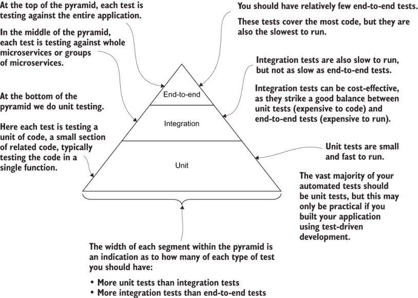

图 8.1 测试金字塔显示了我们应该拥有的每种类型测试的相对数量。

单元测试运行速度快，因此你可以拥有很多这样的测试。因此，它们是测试金字塔的基础。集成测试和端到端测试位于金字塔的更高位置。这些类型的测试运行速度较慢，因此你无法拥有那么多。（随着我们向上移动金字塔，减少的区域表示我们将越来越少地使用这些类型的测试。）这意味着我们应该比单元测试更少地拥有集成测试，比集成测试更少地拥有端到端测试。

图 8.2 展示了 FlixTube 简化版本的端到端测试的样子。在那张图中，我首先展示了端到端测试，因为它是最像手动测试的测试类型；也就是说，我们以类似于客户使用它的方式测试整个应用程序。

端到端测试是最容易理解的测试类型，尽管实际上它相当复杂，我们直到本章快结束时才能触及它。端到端测试与手动测试最为接近，因为我们必须加载整个应用程序来测试它，就像我们手动测试时做的那样。图 8.2 显示了针对在 Docker Compose 上运行的我们整个应用程序的简化版本运行 Cypress 测试。


图 8.2 使用 Cypress 对 FlixTube 简化版本进行端到端测试

自动化测试与持续交付（CD）结合就像是一个早期预警系统。当警报响起时，我们可以感到庆幸，因为它给了我们停止问题进入生产并可能影响我们的客户的机会。自动化测试（就像自动化部署一样）最好在项目早期开始，因为试图将自动化测试附加到一个遗留应用程序（一个未设计为可测试的应用程序）可能非常困难。

但不要在开发生命周期的早期就开始自动化测试。这是一个平衡行为。当开始一个新产品时，你应该首先从原型设计阶段开始，然后再添加自动化测试。*原型设计*允许你在做出承诺之前对你的产品进行实验。如果你还不确定你的产品是什么（例如，你仍在实验）或者如果你仍在尝试验证你的商业模式，那么你可能想要推迟自动化测试，并继续进行更长时间的手动测试。

为测试构建基础设施是对你产品的重大投资。为了本章的目的，让我们假设我们已经准备好为 FlixTube 做出自动化测试的承诺。

注意：自动化测试的真正回报是它能让你摆脱无数小时的常规测试，更不用说它还能阻止可能已经进入生产并造成混乱的损坏代码的部署。

尽管自动化测试非常神奇，但它并不是万能的！它不能替代由真实人类进行的良好探索性测试（例如，手动测试）。这仍然需要发生，因为这是发现开发团队甚至无法想象的错误唯一的方式。

自动化测试不仅仅是证明你的代码能正常工作。它还作为一个无价的沟通工具，一种*可执行文档*，展示了代码应该如何使用。它还为你提供了一个安全的框架，可以在其中重构和重构你的应用程序。这让你可以持续地向更简单、更优雅的架构迈进。现在，让我们逐一分析每种测试类型，并查看应用于元数据微服务和 FlixTube 应用程序的测试示例。

## 8.5 使用 Jest 进行测试

测试是一个非常大的主题，所以让我们先看看一些简单的例子，这些例子与微服务没有直接关系。在本节中，我们将查看的代码通常适用于测试 JavaScript 代码，无论这些代码是在前端、后端，还是在移动或桌面应用程序中。

如果你已经能够使用 Jest 编写自动化测试，并且理解模拟，那么你可以自由地跳过本节，直接进入 8.6 节。在那个部分，我们将开始将自动化测试与微服务联系起来。

对于本节，假设我们正在为我们的微服务创建一个 JavaScript 数学库。我们将使用 Jest 进行测试。那是一个 JavaScript 测试工具和框架。图 8.3 给出了我们将如何使用它的想法。

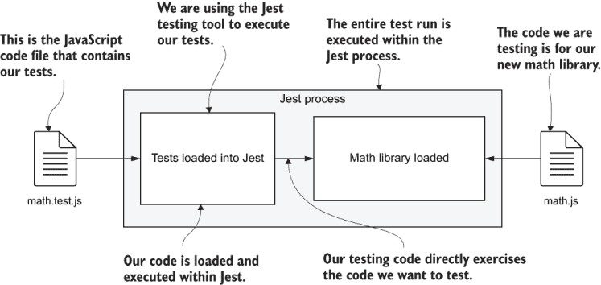

图 8.3 使用 Jest 进行自动化测试

在图中，左侧是 math.test.js。这是一个包含我们将对其运行测试的测试的文件。右侧是 math.js。这是一个包含我们数学库代码的文件。当我们运行 Jest 时，它会加载我们的测试代码，然后反过来运行我们正在测试的代码。从我们的测试中，我们可以直接调用我们的代码来测试它，并在结果中验证一切是否如预期进行。

### 8.5.1 为什么选择 Jest？

Jest 可以说是最流行的 JavaScript 测试工具和框架。它易于设置，配置简单，非常适合初学者。它运行速度快，可以并行运行测试。Jest 还提供了出色的实时重新加载支持；你可以在*监视*模式下运行它，在你编码时它会自动重新加载。

Jest 是由 Facebook 创建的，所以你知道它背后有强大的支持。但它也有大量的追随者和许多来自 Facebook 以外的贡献者。API 非常全面，支持多种测试风格，并提供了多种验证测试和创建模拟的方法。Jest 在创建模拟对象方面也有出色的支持。

本章中还有一些其他非常棒的功能，我们甚至不会在这里提及。（在章节末尾，你可以找到一个链接，了解更多关于 Jest 的信息。）Jest 是一个开源且免费使用的工具。你可以在以下链接找到代码：

[`github.com/facebook/jest`](https://github.com/facebook/jest)

### 8.5.2 设置 Jest

我们将首先查看第八章代码仓库中的 example-1。这个例子足够小，如果你愿意，可以直接输入。如果你不想这样做，你可以从 GitHub 获取代码来跟随学习。

你可以亲自运行这些测试，并对它们进行修改以查看会发生什么。Example-1 已经在 package.json 中包含了 Jest，所以我们将简单地安装项目的依赖项：

```
cd chapter-8/example-1
npm install
```

你可以这样将 Jest 安装到新的 Node.js 项目中：

```
npm install --save-dev jest
```

我们使用 `--save-dev` 参数将 Jest 保存为 package.json 中的开发依赖。Jest 是我们只在开发或测试环境中使用的东西，所以我们将其保存为开发依赖，以便从我们的生产环境中排除。

如果你查看 package.json 文件，你会看到我已经安装了 Jest 版本 26.2.2。当你将来安装 Jest 时，你会看到更新的版本。这里学到的许多内容仍然有效，因为 Jest 是稳定的（它已经更新到 26 版本了！）

以下列表显示了 example-1 的 Jest 配置。这实际上是 Jest 生成的默认配置。我没有做任何修改，除了移除注释。

列表 8.1 Jest 的配置文件（第八章/example-1/jest.config.js）

```
module.exports = {
  clearMocks: true,          ①
  testEnvironment: "node",   ②
};
```

① 自动在每次测试之间清除模拟（我很快会解释模拟）

② 这是测试 Node.js 的环境。

当开始一个新项目时，创建你自己的 Jest 配置文件如下：

```
npx jest --init
```

当你初始化 Jest 配置时，它会问你几个问题。如果你接受所有默认设置，那么你的配置文件将类似于列表 8.1。我只将 `clearMocks` 改为 `true`（默认为 `false`），以帮助防止测试相互干扰。

只是为了提醒你，`npx` 是 Node.js 中的一个命令，它允许我们以命令行应用程序的方式运行 npm 模块。有许多可安装的 npm 模块以这种方式工作，包括 Jest。你可能还记得我们在第五章中使用 `npx` 的 `wait-port` 命令。

当你生成如列表所示的配置文件时，你会看到它包含许多被注释掉的选项。阅读生成的配置文件是了解 Jest 所能实现功能的好方法。因为在这个例子中并不需要，所以我移除了注释以获得一个最小化的配置。

图 8.4 展示了安装了 Jest 的 example-1 Node.js 项目的结构。你可以看到熟悉的 package.json 和 package-lock.json 文件，这些文件在我们第二章中学到的每个 Node.js 项目中都有。至于 Jest，请注意，该项目包含 Jest 配置文件（内容如列表 8.1 所示）以及我们的代码和测试文件。我们的数学库代码在 math.js 中，测试代码在 math.test.js 中。与任何其他 npm 模块一样，Jest 本身安装在 node_modules 目录下。


图 8.4 安装了 Jest 的相当典型的 Node.js 项目的结构

注意测试文件是以它所测试的代码命名的。在创建 math.test.js 时，我们只是简单地将.test.js 添加到我们库的名称中。这种命名约定是 Jest 定位我们的测试代码的方式。Jest 自动加载名称中包含*.test*的代码。这是 Jest 的默认约定，但如果我们想有不同的约定，我们可以进行配置。

注意测试文件（math.test.js）是如何紧挨着代码文件（math.js）放在同一目录下的。这是另一个约定，而且相当常见。我们本可以将这两个文件放在项目目录结构中的任何地方，这不会有多大区别。另一个常见的约定是将所有测试与应用程序代码分离，并位于紧挨着或位于 src 子目录下的 test 或 tests 子目录中。

你可能已经注意到，Jest 配置文件实际上是一个 JavaScript 文件本身。这意味着你可以在配置中使用 JavaScript 代码。实际上，JavaScript 和 Node.js 工具拥有可执行配置文件是很常见的，我认为 JavaScript 可以用作其自身的配置语言是非常酷的。

### 8.5.3 要测试的数学库

现在想象一下，我们已经向我们的新数学库添加了第一个函数。下面的列表显示了`square`函数。这是一个简单的函数，它接受一个数字并返回该数字的平方。

列表 8.2 我们新数学库的起点（chapter-8/example-1/src/math.js）

```
function square(n) {     ①
    return n * n;        ①
}                        ①
...                      ②
module.exports = {
    square,              ③
    ...                  ④
};
```

① 一个简单的 JavaScript 函数计算一个数字的平方。这是我们将要测试的代码。

② 你可以在开发过程中在此处为你的数学库添加更多函数。

③ 导出“square”函数，以便我们可以在代码模块中使用它。这也是我们从测试代码中访问它的方式。

④ 随着你将更多函数添加到你的数学库中，这里将导出其他函数。

在未来，我们将向 math.js 添加更多函数。但到目前为止，我们会保持它简短，这样它就可以作为一个简单的自动化测试演示。

### 8.5.4 你的第一个 Jest 测试

`square`函数是一个简单的函数，具有简单的结果，而更复杂的函数总是依赖于像这样的简单函数。为了确保复杂函数正常工作，我们必须首先测试简单函数。是的，尽管这个函数很简单，我们仍然想测试它。

当然，这是 JavaScript。我们可以很容易地使用 Node.js REPL 手动测试这个函数。但将其纳入自动化测试中几乎同样容易，这（结合对许多其他函数的许多其他测试）可以在未来为我们节省时间。不用说，我在这里演示测试，所以仅为此目的，让我们编写我们的第一个自动化测试。

列表 8.3 显示了测试我们初生的数学库的代码。`describe`函数定义了一个名为`square`函数的测试套件。`test`函数定义了我们第一个测试，名为`can square two`。

列表 8.3 使用 Jest 的第一个测试（chapter-8/example-1/src/math.test.js）

```
const { square } = require("./math");      ①
describe("square function", () => {        ②
    test("can square two", () => {         ③
        const result = square(2);          ④
        expect(result).toBe(4);            ⑤
    });                                    ③
});                                        ②
```

① 导入我们正在测试的代码

② 创建一个名为“square function”的测试套件

③ 创建一个名为“can square two”的测试

④ 调用“square”函数并捕获结果

⑤ 设置一个期望，结果将是 4。如果期望没有得到满足，测试将失败。

我们将这个测试套件命名为它所测试的函数。你可以想象在将来，我们可能会在这个文件中为我们的数学库中的其他函数有其他测试套件（你很快就会看到更多这方面的示例）。

在列表 8.3 中，我们从 math.js 文件中导入了我们的 `square` 函数。然后，在我们的测试 `can square two` 中，我们用数字 2 作为输入调用它。你可以看到测试的名称暗示了测试实际上在做什么。

注意：一个好的测试名称可以让你立即了解正在测试的内容。

我们随后使用 `expect` 和 `toBe` 函数来验证 `square` 函数的结果是否为数字 4。可以将各种函数组合链接到 `expect` 函数上（更多示例请参阅 Jest 文档[`jestjs.io/docs/en/expect`](https://jestjs.io/docs/en/expect)，它提供了丰富的语法来描述正在测试的代码的预期输出）。

### 8.5.5 运行你的第一个测试

现在我们已经查看要测试的代码和测试本身，我们准备运行 Jest，看看成功的测试运行看起来像什么（相信我，我已经知道这段代码是有效的）。在 example-1 目录的终端中，按照以下方式运行测试：

```
npx jest
```

你可以在图 8.5 中看到成功测试运行的输出。我们有一个测试和一个测试套件，两者都成功完成。

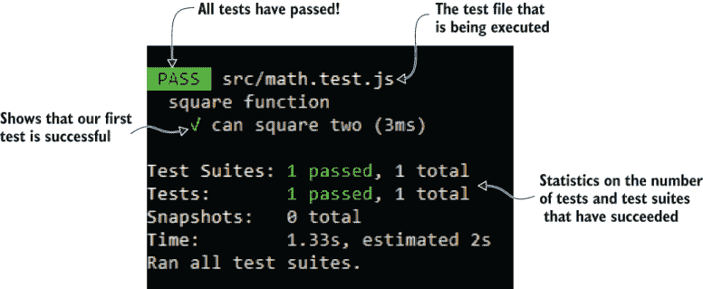

图 8.5 使用 Jest 成功测试运行的输出

### 8.5.6 使用 Jest 进行实时重新加载

实时重新加载对于开发者生产力至关重要，尤其是在测试时。在编码和编写测试时，你可以按照以下方式以实时重新加载模式运行 Jest：

```
npx jest --watchAll
```

该命令适用于所有项目，在代码更改时运行所有测试。如果你使用 Git，你还可以使用此命令：

```
npx jest --watch
```

第二个版本性能更好，因为它使用 Git 来知道哪些文件已更改（而不是盲目地运行所有测试）。这是一种很好的工作方式。更改一些代码，测试就会自动运行，并显示是否有什么被破坏了！

### 8.5.7 解释测试失败

当我们的测试通过时，一切都很顺利，但如果我们代码中出现问题，测试失败时怎么办？不要等到你意外破坏了代码才知道！

让我们试试看。这就像改变我们代码的行为一样简单。例如，尝试将 `square` 函数更改为返回错误的结果：

```
function square(n) {
    return n & n;
}
```

注意我如何将乘法运算符替换为二进制 AND 运算符。让我们看看我们的测试对此有何看法。

你可以在图 8.6 中看到现在失败的测试输出。当一个测试失败时，Jest 会以非零退出码结束。这表明发生了失败。我们将在我们的 CD 管道中利用这一点，以防止在测试失败的情况下进行部署。

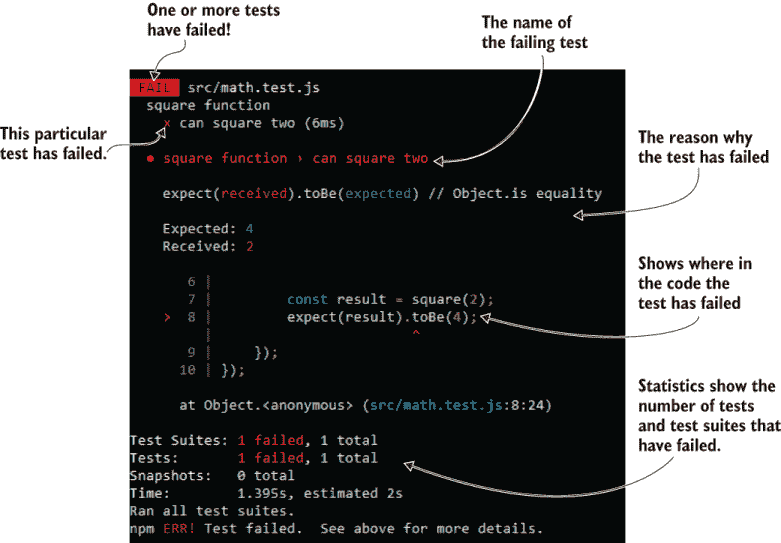

图 8.6 Jest 中失败的测试输出

这个测试失败是因为我们更改了代码的预期行为。我们故意破坏了自己的代码以查看结果，但你也可以想象在我们的常规开发过程中一个简单的打字错误是如何在生产代码中引起这个问题的。如果你没有设置自动测试，这个问题很容易在手动测试中遗漏，后来被客户发现。这至少是尴尬的，但根据实际错误的性质，它可能会对我们的业务造成真正的问题。

当然，这里的意图不仅仅是测试`square`函数。仅此本身不会有效。我们需要的是让大量代码被这样的测试覆盖。

一大批测试为我们提供了一个自动验证系统，我们可以运行它来毫无疑问地证明我们的代码按预期工作。更重要的是，它证明我们的代码在未来的演变中仍然按预期工作。值得注意的是，你可以在任何你想要的地方通过抛出异常来模拟失败的代码，如下所示：

```
throw new Error("This shouldn't happen.");
```

面对错误时无所畏惧的最佳方式是残忍地尝试在自己的代码中引发这些错误。一旦你看到了所有的错误，恐惧就会消失，你可以专注于理解和解决问题。为了确保我们的应用程序能够优雅地处理问题，在代码中模拟或引发问题被称为*混沌工程*（有关更多信息的参考，请查看第十章末尾）。

### 8.5.8 使用 npm 调用 Jest

在第二章中，我们介绍了向 package.json 文件添加 npm 脚本的思路，以便我们可以使用常规的 npm 命令，如`npm start`*.* 在第二章中，我们还配置了 start 脚本。这里我们也将为 test 脚本做同样的事情。一旦我们为 package.json 配置了这些，我们就可以通过输入以下命令来运行我们的测试套件：

```
npm test
```

这个约定意味着我们可以轻松地为任何 Node.js 项目运行测试。我们不需要知道项目是否正在使用 Jest 或其他测试工具！实际上，你将在本章后面看到我们如何使用相同的命令运行 Cypress 测试。以下列表显示了我们的 package.json 文件，其中包含一个用于运行 Jest 测试的测试脚本。

列表 8.4 包含运行 Jest 的 npm 脚本的 package.json（chapter-8/example-1/package.json）

```
{
  "name": "example-1",
  "version": "1.0.0",
  "scripts": {
    "test": "jest",                     ①
    "test:watch": "jest --watchAll"     ②
  },
  "devDependencies": {
    "jest": "²⁵.4.0"                   ③
  },
  "dependencies": {
                                        ④
  }
}
```

① 通过调用“npm test”运行 Jest 的设置

② 为在实时重新加载模式下运行 Jest 进行设置

③ 将 Jest 作为开发依赖项安装

④ 这个项目目前还没有任何生产依赖。

注意，在列表 8.4 中，还有一个名为 test:watch 的 npm 脚本。它被配置为我们可以以这种方式运行我们的测试，在实时重新加载模式下：

```
npm run test:watch
```

测试：watch 脚本是我的个人约定——它不是 npm 标准。我使用它，以便无论我使用哪种测试工具，我都能轻松记住如何启用实时重载来运行我的测试。

### 8.5.9 填充您的测试套件

到目前为止，我们只看到了一个测试，但我也想给你展示一下，随着测试套件的扩展，它看起来会是什么样子。列表 8.5 展示了在添加第二个测试后 math.test.js 的样子。（示例-1 实际上不包含这个新测试，但你可以自由添加它并对其进行实验。）

列表 8.5 添加下一个测试（对 chapter-8/example-1/src/math.test.js 的添加）

```
const { square } = require("./math");
describe("square function", () => {
    test("can square two", () => {
        ...                            ①
    });
    test("can square zero", () => {    ②
        const result = square(0);
        expect(result).toBe(0);
    });                                ②
    ...                                ③

});
...                                    ④
```

① 为了简洁起见省略了之前的测试

② 创建测试“can square zero”

③ 在您的“square”函数测试套件中添加更多测试

④ 在此处为数学库添加更多测试套件

如列表 8.5 所示，我们可以通过在测试套件的 `describe` 函数内部添加更多 `test` 函数的实例来向我们的 `square` 函数测试套件添加更多测试。

新的测试，`can square zero`，是一个边缘情况的例子。我们不需要为平方正数添加更多测试；`can square two` 就足以涵盖所有正数情况，因此我们可以将其重命名为 `can square positive number`。然后，为了完成对 `square` 函数的这个小测试套件的补充，你可能还需要添加一个名为 `can square negative number` 的测试。如果你愿意继续工作，我会把这个留给你。

随着我们开发数学库，我们将添加更多数学函数和更多测试套件。例如，我们将添加 `squareRoot` 和 `average` 函数及其测试套件“平方根函数”和“平均函数”。记住，我们命名了测试文件为 math.test.js，这个名字足够通用，我们可以使用 `describe` 函数向其中添加新的测试套件。

我们也可以为每个测试套件创建单独的 JavaScript 代码文件，例如，square.test.js、square-root.test.js 和 average.test.js。请注意，这些文件都是以 *.test.js 结尾，这样 Jest 可以自动找到它们。随着我们未来添加新的库，我们将添加新的测试文件，数量根据需要而定，以包含我们创建的所有测试。

你可以以任何你想要的方式组织你的测试。这意味着你可以按你喜欢的方式命名它们，并将它们跨文件组织以适应你的需求。然而，当你在公司工作时，你将被期望遵循他们现有的风格和约定。无论你遵循哪种约定，我都代表全世界的开发者请求（请使用 *有意义的名称* 为你的测试命名。名称应该使测试的目的易于理解。非常感谢。）

### 8.5.10 使用 Jest 进行模拟

JavaScript 是创建模拟的绝佳语言！JavaScript 的动态特性使得创建自动化测试变得特别容易。但模拟是什么？

模拟的定义是：在我们代码中用虚假或模拟的版本替换真实依赖项。

我们可以替换的依赖项可以是函数、对象，甚至是整个代码模块。在 JavaScript 中，创建函数和组合新的对象和数据结构作为模拟是非常容易的。

我们为什么要这样做？模拟的目的是隔离我们正在测试的代码。隔离特定的代码部分使我们能够只测试那部分代码，而无需测试其他内容。隔离对于单元测试和测试驱动开发非常重要。

模拟不仅有助于隔离我们正在测试的代码，而且还可以完全消除那些会使测试变慢的代码和过程。例如，我们可以消除数据库查询、网络事务和文件系统操作。这些都是与我们要测试的代码相比可能需要花费大量时间的事情。

在第 8.6 节中，我们将学习单元测试，并看到一个真实的模拟示例，但让我们首先通过检查一个简单的例子来理解模拟。假设我们不是在`square`函数中使用乘法运算符，而是使用以下`multiply`函数：

```
function square(n) {
    return multiply(n, n);
}
```

你可能会问，既然已经有了完美的运算符，为什么还要用函数来做乘法呢？这是一个很好的问题。嗯，我在这里引入`multiply`函数主要是为了提供一个简单的例子来解释模拟（mocking）。但如果你想，我也可以编造一个很好的理由来说明为什么我们需要这个函数！

就让我们说，我们希望我们的数学库能够与抽象数据类型一起工作。而不是使用普通数字，我们希望它能够处理向量（数字数组），在这种情况下，`multiply`函数可能是一个非常复杂的函数，它可以在图形处理单元（GPU）上并行进行计算。

现在我们需要隔离`square`函数中的代码（从理论上讲可能并不多），我们需要模拟`multiply`函数。这意味着我们必须用另一个函数来替换它——一个我们可以控制的函数。我们可以通过一种原始的*依赖注入（Dependency Injection，DI）*形式来实现这一点。DI 是一种技术，我们将依赖项注入到我们的代码中，而不是硬编码它们。我们控制依赖项是什么，这对于隔离代码进行单元测试很有用。在这种情况下，我们将`multiply`函数注入到`square`函数中，如下所示：

```
function square(n, multiply) {
    return multiply(n, n);
}
```

这之所以可行，是因为在 JavaScript 中，函数是一等公民，它们可以像任何其他值或对象一样传递。现在让我们从我们的测试中利用这一点。当我们调用`square`函数时，我们将传递我们的模拟版本`multiply`：

```
test("can square two", () => {
    const mockMultiply = (n1, n2) => {          ①
        expect(n1).toBe(2);                     ②
        expect(n2).toBe(2);                     ②
        return 4;                               ③
    };                                          ①
    const result = square(2, mockMultiply);     ④
    expect(result).toBe(4);                     ⑤
});
```

① 创建“multiply”函数的模拟版本

② 期望“square”函数将正确的输入传递给“multiply”函数

③ 将模拟函数硬编码为返回 4

④ 将模拟函数传递给“square”函数而不是真实的“multiply”函数

⑤ 期望得到硬编码的值 4

你现在可能想知道，所有这些有什么意义？鉴于我们的模拟函数返回一个硬编码的值 4，我们在这里实际上测试了什么？你可以这样理解：“我们正在测试 `square` 函数是否以输入 2 和 2 调用 `multiply` 函数，并且从 `multiply` 收到的结果是 `square` 函数返回的值。”

你可能会注意到，我们刚刚实现了 `square` 函数，对其进行了测试，并证明了它的工作——而 `multiply` 函数的真实版本甚至还没有存在！这是测试驱动开发（TDD）的超级能力之一。TDD 允许我们可靠地测试代码的不完整版本。如果这还不能让你印象深刻，我不知道还有什么能做到了！

要使此代码真正工作，我们仍然需要实现 `multiply` 函数。这反过来又可以对其应用自动化测试。

好吧，这是一个疯狂编造的例子，但我们需要一种方法来介绍模拟的概念。像我现在展示的那样，在如此细粒度级别实现依赖注入（DI）是非常罕见的。不过，很快你将看到一个更现实的例子，它使用模拟替换了整个代码模块。

### 8.5.11 我们取得了什么成果？

我们已经看到了使用 Jest 进行测试的简单示例以及如何使用模拟来隔离我们正在测试的代码。让我们以使用 Jest 进行测试的一般方法来结束本节。

使用 Jest 创建测试

1.  为你正在测试的代码创建一个文件（例如，math.js）。

1.  为你的测试创建一个与 Jest 命名约定匹配的文件（例如，math.test.js）。

1.  将函数和代码模块导入测试文件中。

1.  将整个测试套件包裹在 `describe` 函数的调用中，并为其提供一个描述性的名称。

1.  使用对 `test` 函数的调用添加每个测试，并为每个测试提供一个描述性的名称。

1.  使用 `npx jest` 或 `npm test`（如果已在 package.json 中配置）运行你的测试。

测试套件的模板

```
...                                            ②
describe("the name the test suite", () => {    ③
    ...                                        ④
    test("test 1", () => {                     ⑤
        ...                                    ⑥
    });

    ...                                        ⑦

    test("test N", () => {                     ⑤
        ...                                    ⑥
    });

});
...                                            ⑧
```

① 导入函数和代码模块放在这里。

② 在此文件中测试之间共享的全局模拟代码放在这里。

③ 调用定义测试套件的“describe”函数放在这里。

④ 在此测试套件中测试之间共享的模拟代码放在这里。

⑤ 调用定义每个测试的“test”函数

⑥ 测试代码放在这里。

⑦ 可以在这里添加更多测试。

⑧ 可以在这里添加更多测试套件。

测试的模板

```
test("the name of the test", () => {   ①
    ...                                ②

});
```

① 调用定义每个测试的“test”函数。为每个测试使用一个有意义的名称！

② 仅在此测试中使用的模拟代码放在这里。

③ 调用要测试的函数并记录任何结果

④ 检查结果和模拟并声明测试的期望

## 8.6 单元测试

微服务单元测试与其他类型的单元测试工作方式相同。我们的目标是独立于其他代码，单独测试单个 *单元* 代码。什么是单元？通常，每个测试都会对一个函数或单个函数的一个方面进行测试。

单元测试中重要的是隔离。当我们测试隔离的代码时，我们集中测试精力在那一小块代码上。例如，我们希望测试我们的元数据微服务的代码，但我们不关心测试 Express 库或 MongoDB 库的代码。那些是我们假设已经测试过的依赖项。相反，我们只想测试我们创建的代码。为了专注于我们自己的代码，我们必须消除所有其他代码。

通过模拟依赖项来实现代码的隔离。对于我们元数据微服务来说，这意味着我们将用我们可以控制和操纵的假实例替换真实的 Express 和 MongoDB 库。

隔离是使单元测试运行快速的原因。集成和端到端测试不隔离代码。在那些类型的测试中，我们锻炼的是代码模块的集成，而不是隔离的代码片段。

当运行单元测试时，我们不会启动真实的 HTTP 服务器或连接到真实的数据库。这类事情使得单元测试运行得很快，这也是为什么这些是测试金字塔（图 8.1）的基础。我们可以承担有成百上千个单元测试，而且我们不需要等待很长时间才能完成我们的单元测试套件。

我们将使用 Jest 来执行我们的单元测试。图 8.7 显示了我们将如何使用它。我们的测试代码来自 index.test.js（在左侧），由 Jest 加载。我们要测试的代码，即我们的元数据微服务的代码（在右侧），由我们的测试代码加载。

我们将模拟 Express 和 MongoDB 而不是使用真实的东西。测试代码“启动”我们的微服务。我之所以说“启动”，是因为我们不会以通常的方式启动它。与正常执行不同，Express 被模拟，所以我们不会启动一个真实的 HTTP 服务器。同样，MongoDB 也被模拟，所以我们不会连接到真实的数据库。

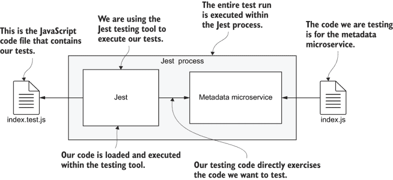

图 8.7 使用 Jest 对元数据微服务进行单元测试

### 8.6.1 元数据微服务

现在，我们将转向第八章代码库中的 example-2。要跟上，你需要安装依赖项：

```
cd chapter-8/example2
npm install
```

列表 8.6 展示了我们将要测试的代码。这是一个初生的微服务，它将成为 FlixTube 的元数据微服务。这是一个 REST API，其目的是收集、存储、搜索和管理与每个视频相关的元数据。列表中的基本设置与第二章中的第一个微服务并没有太大的不同。

列表 8.6 单元测试的元数据微服务（第八章/example-2/src/index.js）

```
const express = require("express");
const mongodb = require("mongodb");
function connectDb(dbhost, dbname) {
    return mongodb.MongoClient.connect(dbhost, { 
            useUnifiedTopology: true    
        }) 
        .then(client => {
            const db = client.db(dbname);
            return {
                db: db,
                close: () => {
                    return client.close();
                },
            };
        });
}
function setupHandlers(microservice) {
    const videosCollection = microservice.db.collection("videos");
    microservice.app.get("/videos", (req, res) => {        ①
        return videosCollection.find()                     ②
            .toArray()
            .then(videos => {
                res.json({                                 ③
                    videos: videos
                });
            })
            .catch(err => {
                ... error reporting omitted ...
                res.sendStatus(500);
            });
    });
    ...                                                    ④
}
function startHttpServer(dbConn) {                         ⑤
    return new Promise(resolve => {                        ⑥
        const app = express();
        const microservice = {                             ⑦
            app: app,
            db: dbConn.db,
        }
        setupHandlers(microservice);
        const port = process.env
        ➥ .PORT && parseInt(process.env.PORT) || 3000;
        const server = app.listen(port, () => {
            microservice.close = () => {                   ⑧
                return new Promise(resolve => {
                    server.close(() => {                   ⑨
            resolve();
        });
                })
                .then(() => {
                    return dbConn.close();                 ⑩
                });
            };
            resolve(microservice);
        });
    });
}
function startMicroservice(dbhost, dbname) {               ⑪
    return connectDb(dbhost, dbname)
        .then(dbConn => {
            return startHttpServer(dbConn);
        });
}
function main() {                                          ⑫
    ... error checking for environment variables omitted ...

    const DBNAME = process.env.DBNAME;

    return startMicroservice(DBHOST, DBNAME);
}
if (require.main === module) {                             ⑬
    main()                                                 ⑭
        .then(() => console.log("Microservice online."))
        .catch(err => {
            console.error("Microservice failed to start.");
            console.error(err && err.stack || err);
        });
}
else {                                                     ⑮
    module.exports = {                                     ⑯
        startMicroservice,
    };
}
```

① 处理对/videos 路由的请求

② 返回一个 promise，以便我们可以在测试中等待结果

③ 从数据库检索记录

④ 其他处理程序可以稍后添加到这里。

⑤ 启动 Express HTTP 服务器

⑥ 使用 promise 包装，以便我们可以在服务器启动时得到通知

⑦ 创建一个代表我们的微服务的对象

⑧ 创建一个可以用来关闭微服务的函数

⑨ 关闭 Express 服务器

⑩ 关闭数据库

⑪ 一个新的辅助函数，用于收集微服务启动时执行的代码

⑫ 微服务的主要入口点

⑬ 如果此脚本是主模块，则正常启动微服务

⑭ 启动微服务

⑮ 否则，在测试中运行微服务

⑯ 导出启动微服务的函数，以便我们可以在测试中调用它

列表 8.6 使用 Express 库启动 HTTP 服务器，并使用 MongoDB 库连接到 MongoDB 数据库。我们为 HTTP GET /videos 路由添加了一个单独的处理函数。此路由从数据库检索视频元数据数组。

我们在这里测试的代码将通过调用函数`startMicroservice`来执行。这是我们添加到微服务中的一个新函数，以帮助使其更容易进行测试。调用`startMicroservice`返回一个表示微服务的 JavaScript 对象。我们目前还没有存储返回的对象。我们不需要它来进行单元测试，但当我们进行集成测试时，我们将需要它。

我们对微服务的结构进行了此更改，旨在**为测试而设计**，我们经常会发现自己这样做，调整代码以便更容易进行测试。请注意，我们不仅限于调用`startMicroservice`。实际上，我们可以从我们的任何代码模块中调用任何导出的函数。记住这一点，因为这就是单元测试真正关注的内容：单独测试每个函数。现在，让我们创建一些测试来确认我们的微服务已启动，并且/video 路由可以检索到预期的数据。

### 8.6.2 使用 Jest 创建单元测试

在我们可以对代码进行单元测试之前，我们需要能够为依赖项创建模拟。对于此示例，我们的依赖项是 Express 和 MongoDB。在其他情况下，你将会有不同的依赖项，例如用于与 RabbitMQ 交互的 amqp 库。

列表 8.7 显示了测试的代码。此文件定义了一个名为`metadata microservice`的单个测试套件，其中包含三个测试。我们将文件命名为 index.test.js，以表明它测试的是主源文件 index.js 中的代码。随着你继续开发你的微服务，你最终会有更多这样的文件，包含测试以覆盖你微服务中的所有代码。

测试套件的第一部分致力于设置 Express 和 MongoDB 库的模拟。注意使用`jest.fn`创建模拟函数，我们可以使用这些函数来检测函数是否被调用，以及如果被调用，传递给它的参数是什么。接下来，注意使用`jest.doMock`，它允许我们模拟整个 Node.js 模块。这些工具功能强大，允许我们替换 Express 和 MongoDB，而无需调整我们正在测试的代码。

列表 8.7 中的第一个测试检查 HTTP 服务器是否已在端口 3000 上启动。第二个测试检查是否已注册了/videos 路由的处理程序。第三个测试直接调用/videos 路由处理程序函数，并检查它是否从数据库中检索到所需的数据。

这个例子实际上相当高级，但我想要直接切入正题，并展示一些与微服务相关的单元测试。如果你觉得这段代码难以理解，不必过于担心。只需尝试阅读它，抓住其要点，并理解哪些部分是用于模拟，哪些部分是用于测试。

列表 8.7：使用 Jest 测试元数据微服务（chapter-8/example-2/src/index.test.js）

```
describe("metadata microservice", () => {                     ①
    const mockListenFn = jest.fn(
    ➥ (port, callback) => callback());                       ②
    const mockGetFn = jest.fn();                              ③
    jest.doMock("express", () => {                            ④
        return () => {                                        ⑤
            return {                                          ⑥
                listen: mockListenFn,
                get: mockGetFn,
            };
        };
    });
    const mockVideosCollection = {};                          ⑦
    const mockDb = {                                          ⑧
        collection: () => {
            return mockVideosCollection;
        }
    };
    const mockMongoClient = {                                 ⑨
        db: () => {
            return mockDb;
        }
    };

    jest.doMock("mongodb", () => {                            ⑩
        return { 
            MongoClient: {                                    ⑪
                connect: async () => {                        ⑫
                    return mockMongoClient;
                }
            }
        };
    });
    const { startMicroservice } = 
    ➥ require("./index");                                    ⑬

    test("microservice starts web server 
    ➥ on startup", async () => {                             ⑭

        await startMicroservice();                            ⑮
        expect(mockListenFn.mock
        ➥ .calls.length).toEqual(1);                         ⑯
        expect(mockListenFn.mock
        ➥ .calls[0][0]).toEqual(3000);                       ⑰
    });
    test("/videos route is handled", async () => {            ⑱

        await startMicroservice();                            ⑲
        expect(mockGetFn).toHaveBeenCalled(); 
        const videosRoute = mockGetFn.mock.calls[0][0];
        expect(videosRoute).toEqual("/videos");               ⑳
    });
    test("/videos route retrieves data via 
    ➥ videos collection", async () => {                      ㉑
        await startMicroservice();                            ㉒
        const mockRequest = {};                               ㉓
        const mockJsonFn = jest.fn();
        const mockResponse = {
            json: mockJsonFn
        };                                                    ㉓
        const mockRecord1 = {};                               ㉔
        const mockRecord2 = {};
        mockVideosCollection.find = () => {
            return {
                toArray: async () => {                        ㉕
                    return [ mockRecord1, mockRecord2 ];
                }
            };
        };                                                    ㉖
        const videosRouteHandler = 
 ➥ mockGetFn.mock.calls[0][1];                        ㉗
        await videosRouteHandler(mockRequest, 
        ➥ mockResponse);                                     ㉘
        expect(mockJsonFn.mock
        ➥ .calls.length).toEqual(1);                         ㉙
        expect(mockJsonFn.mock.calls[0][0]).toEqual({
            videos: [ mockRecord1, mockRecord2 ],             ㉚
        });
    });
    ...                                                       ㉛
});
```

① 定义“metadata 微服务”的测试套件

② 创建一个模拟的“listen”函数

③ 创建一个模拟的“get”函数

④ 创建 Express 库的模拟

⑤ Express 库是一个工厂函数，用于创建 Express 应用对象。

⑥ 返回一个模拟的 Express 应用对象

⑦ MongoDB 视频集合的模拟

⑧ MongoDB 数据库的模拟

⑨ MongoDB 客户端对象的模拟

⑩ 创建 MongoDB 模块的模拟

⑪ MongoClient 的模拟

⑫ connect 函数的模拟

⑬ 导入我们正在测试的代码

⑭ 测试微服务是否正确启动 HTTP 服务器

⑮ 调用测试下的代码

⑯ 期望只调用一次“listen”函数

⑰ 期望将端口 3000 传递给“listen”

⑱ 测试/videos 路由是否由 HTTP 服务器处理

⑲ 期望 Express 的“get”函数已被调用

⑳ 期望“get”的参数是/videos

㉑ 测试/videos 路由从数据库中的视频集合检索数据

㉒ 调用测试下的代码

㉓ 模拟传递给 Express 路由处理程序的 Express“request”和“response”对象

㉔ 模拟“find”函数返回一些模拟数据库记录

㉕ 模拟 MongoDB 库的结构

㉖ 模拟“find”函数返回一些模拟数据库记录

㉗ 提取/videos 路由的“handler”函数

㉘ 调用“handler”函数

㉙ 期望调用“json”函数

㉚ 期望模拟记录已从数据库中检索

㉛ 更多测试在这里！

你可能已经注意到在列表 8.7 中我使用了`async`和`await`关键字。我在日常编码中经常使用这些关键字，但在这本书中还没有使用过。我在这里引入这些关键字的原因是它们非常适合 Jest 测试，并且使异步代码的阅读变得更加容易。

你可能想知道`jest`变量实际上是从哪里来的，因为在列表 8.7 中没有`require`语句来导入它！这是标准的 JavaScript，通常这会是个问题，但这段代码是在 Jest 环境下运行的。Jest 会自动为我们导入`jest`变量。它真是太好了，为我们节省了一行代码。

列表 8.7 的开头大部分内容都是用来创建替换 Express 和 MongoDB 的模拟。我们使用了`jest.fn`和`jest.doMock`来创建模拟。Jest 有许多其他用于模拟和指定测试期望的有用函数。请参阅本章末尾的参考资料以了解更多信息。

我们用新的 JavaScript 对象替换了 Express 和 MongoDB，因此为我们正在测试的代码的依赖项提供了自己的实现。当代码调用这些函数时，它调用的是替换版本，而不是来自真实 Express 和 MongoDB 库的常规版本。

如果我们没有替换 Express 和 MongoDB，那么调用`startMicroservice`将会启动真实的 HTTP 服务器并连接到真实的数据库。这种正常操作正是我们在单元测试时想要避免的！这是使自动化测试运行缓慢的那种类型的事情。现在这看起来可能并没有太大的区别，因为目前我们只是在谈论一个非常小的测试数量。但是当你运行 100 个甚至 1000 个测试时，你肯定会看到很大的不同。

### 8.6.3 运行测试

在编写代码和测试之后，我们就可以运行 Jest 了。在 example-1 目录的终端中，按照以下方式运行测试：

```
npx jest
```

或者运行

```
npm test
```

输出应该显示一个通过的一组测试，包含三个通过测试。

### 8.6.4 我们取得了什么成果？

我们已经学习了使用 Jest 进行单元测试的基础知识。我们模拟了 Express 和 MongoDB 库，并测试了我们的微服务可以启动，以及它的/videos 路由可以从数据库中检索记录。

这可能看起来并不多，但你可以继续创建这样的测试来覆盖你所有微服务中的代码。你可能甚至想尝试测试驱动开发（TDD），也称为*测试先行开发*，在这种方法中，你会在编写实际要测试的代码之前先编写测试代码。

这是一个强大的技术，可以帮助你实现 100%的测试覆盖率，这是一个在没有 TDD 的情况下可能很难实现的成就。如果你愿意，在本章末尾，你会找到更多关于这种以测试为中心的开发方法的参考资料。

## 8.7 集成测试

测试金字塔（图 8.1）的下一步是集成测试。它被称为集成测试，因为，与单元测试中独立测试代码模块不同，现在的重点是测试代码模块以集成方式共同工作。当涉及到微服务时，集成测试通常意味着我们正在测试整个微服务，包括它所依赖的所有代码模块和代码库。

如果单元测试足以解决我们所有的问题那将很理想。单元测试是有效的，因为单元测试运行得非常快。单元测试的速度意味着我们更有可能频繁运行这些测试，从而快速发现问题。不幸的是，尽管如此，许多问题仍然可能隐藏在代码模块之间的集成中，这些问题是单元测试无法检测到的。

从某种意义上说，集成测试实际上比单元测试更容易，因为我们不需要担心模拟。事实上，如果你觉得模拟太难，你可能会发现从集成测试开始要容易得多。早些时候，在单元测试时，我们模拟了 Express 和 MongoDB 的依赖项。在集成测试中，我们不会这样做。相反，我们将允许我们正在测试的微服务启动一个真实的 HTTP 服务器并连接到一个真实的数据库。

尽管编写集成测试比编写单元测试更容易，但集成测试的设置却更困难。使用真实的 HTTP 服务器限制了我们的测试并行化，因为我们一次只能在端口 3000（或者实际上任何其他端口）上运行一个 HTTP 服务器。使用真实的 MongoDB 数据库意味着我们需要有一个数据库可供我们正在测试的代码使用。

此外，启动 HTTP 服务器和连接到数据库是耗时的。这就是为什么与单元测试相比，集成测试特别慢的原因。综合考虑，如果你现在相信实际上单元测试比集成测试更容易，我也不会感到惊讶！

注意：使用正确的测试组合是一种平衡行为，我们确实需要集成测试，因为这是发现集成代码中问题的唯一方法。

通常，当我们对微服务运行集成测试时，我们会通过其官方 HTTP 接口与其交互，而不是直接调用其函数，就像我们在单元测试中所做的那样。根据微服务的实现方式，我们可以有其他与之交互的方法。例如，如果微服务使用 RabbitMQ，我们也可以通过发送消息与之交互。

图 8.8 展示了在本节中我们将如何进行集成测试。再次强调，我们仍然使用 Jest 来测试我们的元数据微服务，但这次，我们不会使用 Jest 的模拟功能。我们不会直接调用微服务中的代码来测试它，而是发送 HTTP 请求并检查返回的响应。

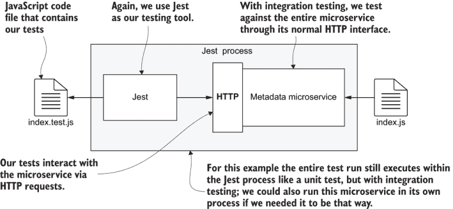

图 8.8 使用 Jest 对微服务进行集成测试

### 8.7.1 要测试的代码

现在，我们可以转向第八章代码库中的 example-3。你可以继续跟随并运行这些测试。我们将要测试的代码与 example-2 中的代码相同；没有变化，所以如果你想复习那段代码，可以查看列表 8.6。

### 8.7.2 运行 MongoDB 数据库

在进行集成测试时，我们不会用模拟版本替换我们的数据库。相反，我们需要一个真实的数据库，并且我们需要能够加载真实的测试数据。

要运行 example-3 的集成测试，你需要一个正在运行的 MongoDB 数据库。下载和安装 MongoDB 并不是特别困难。如果你还没有这样做，你可以在你的开发工作站上安装它。请按照以下说明进行操作：

[`docs.mongodb.com/manual/installation/`](https://docs.mongodb.com/manual/installation/)

作为一种替代方案，我在 example-3 中包含了一个 Docker Compose 文件，该文件在 Docker 容器中启动 MongoDB。你可以这样启动它：

```
cd example-2
docker-compose up
```

### 8.7.3 加载数据库固定数据

当数据库运行起来后，我们现在需要一种按需加载数据库固定数据的方法。一个 *数据库固定数据* 是一组固定的测试数据，我们可以将其加载到我们的数据库中进行测试。它被称为固定数据，因为我们用它来用已知或特定的数据集初始化我们的数据库。

使用 Jest 做这件事尤其简单，因为我们可以直接通过常规的 MongoDB Node.js 库创建一个 JavaScript 辅助函数，将数据直接加载到我们的数据库中。MongoDB 已经包含在 example-3 的 package.json 文件中，你可以像这样安装 example-2 的所有依赖项：

```
npm install
```

可以按照以下方式在新的项目中安装 MongoDB：

```
npm install --save mongodb
```

注意，我们将使用 `--save` 参数而不是 `--save-dev`，因为 MongoDB 实际上在我们的生产微服务中使用了，而不仅仅是测试代码。尽管我们用它进行测试，但我们仍然需要将其作为生产依赖项而不是开发依赖项安装。

列表 8.8 展示了一个我们可以用来加载测试数据的简单函数。我们可以从我们的测试代码中调用这个函数，你很快就会看到一个例子。我们只需要指定要加载的集合名称和数据记录。

在列表 8.8 中，注意我们是如何通过 `microservice` 对象的 `db` 字段（如列表 8.6 中所示，该对象被保存在一个变量中）访问微服务的数据库。这样做可以避免多次连接到数据库。我们不需要这样做，因为微服务已经建立了连接，我们可以重用它。

列表 8.8 加载数据库固定数据的辅助函数（摘自 chapter-8/example-3/src/index.test.js）

```
// ...
async function 
➥ loadDatabaseFixture(collectionName, records) {                    ①
    await microservice.db.dropDatabase();                            ②
    const collection = microservice.db.collection(collectionName);
    await collection.insertMany(records);                            ③
}
// ...
```

① 一个用于加载数据库固定数据的辅助函数

② 重置数据库（不要在生产环境中尝试！）

③ 将测试数据（我们的数据库固定数据）插入到数据库中

我们最初选择使用 MongoDB 的一个原因是因为它使得加载测试数据变得非常容易。当然，你可以用任何数据库做这样的事情。只是有些数据库，比如传统的 SQL 数据库，处理起来可能更困难。

列表 8.8 中的辅助函数允许我们将测试数据内联存储在我们的测试代码中，并在需要时将其加载到我们的数据库中。这非常方便，但也可以将我们的测试数据存储在独立的数据文件中。这样可能会更容易组织。在接下来的端到端测试部分，您将看到一种不同的加载数据库固定数据的方法。

### 8.7.4 使用 Jest 创建集成测试

使用 Jest 创建集成测试与创建单元测试非常相似。因为我们没有进行任何模拟，这实际上大大简化了我们的测试代码。

我们不会直接在我们的微服务中调用代码，而是使用 HTTP 请求来触发我们想要测试的代码。为了发送 HTTP 请求，我们可以使用我们在第五章中使用的 Node.js 低级 http 库，或者通过 npm 安装的库。在这种情况下，我们将使用 Axios 库，这是一个更现代的库，它直接支持`async`/`await`，因此它与 Jest 对异步编码的支持非常契合。

Example-3 已经将 Axios 添加到 package.json 文件中。如果您已安装了 example-3 的所有依赖项，那么您已经拥有它。否则，您可以在新项目中像这样安装 Axios：

```
npm install --save-dev axios
```

我们在这里使用`--save-dev`参数，因为在这种情况下，我们将在测试中使用 Axios。因此，它可以是开发依赖项。如果您计划在生产代码中使用 Axios，请确保使用`--save`而不是`--save-dev`将其安装为常规依赖项。

列表 8.9 展示了我们的集成测试代码。这与我们的单元测试代码类似，但不同的是，我们不是模拟依赖项并直接调用要测试的代码，而是将元数据微服务作为真实的 HTTP 服务器启动。然后我们使用 Axios 向其发送 HTTP 请求。

请注意，不要在生产数据库上运行列表 8.9！首先加载数据库固定数据的函数会删除整个数据库。请确保您只对测试数据库运行此操作！并且始终备份您的生产数据库，以防万一！

列表 8.9 使用 Jest 对元数据微服务进行集成测试的代码（chapter-8/example-3/src/index.test.js）

```
const axios = require("axios");
const mongodb = require("mongodb");
describe("metadata microservice", () => {

    const BASE_URL = "http://localhost:3000";
    const DBHOST = "mongodb://localhost:27017";                 ①
    const DBNAME = "testdb";
    const { startMicroservice } = require("./index"); 
    let microservice;
    beforeAll(async () => {
        microservice = 
        ➥ await startMicroservice(DBHOST, DBNAME);             ②
    });
    afterAll(async () => {
        await microservice.close();                             ③
    });
    function httpGet(route) {
        const url = `${BASE_URL}${route}`;
        return axios.get(url);
    }
    async function 
    ➥ loadDatabaseFixture(collectionName, records) {           ④
        await microservice.db.dropDatabase();
        const collection = microservice.db
        ➥ .collection(collectionName);
        await collection.insertMany(records);
    }                                                           ④

    test("/videos route retrieves data via 
 ➥ videos collection", async () => {                       ⑤
        const id1 = new mongodb.ObjectId();                     ⑥
        const id2 = new mongodb.ObjectId();
        const videoPath1 = "my-video-1.mp4";
        const videoPath2 = "my-video-2.mp4";
        const testVideos = [
            {
                _id: id1,
                videoPath: videoPath1
            },
            {
                _id: id2,
                videoPath: videoPath2
            },
        ];                                                      ⑥
        await 
        ➥ loadDatabaseFixture("videos", testVideos);           ⑦

        const response = await httpGet("/videos");              ⑧
        expect(response.status).toEqual(200);
        const videos = response.data.videos;                    ⑨
        expect(videos.length).toEqual(2);
        expect(videos[0]._id).toEqual(id1.toString());
        expect(videos[0].videoPath).toEqual(videoPath1);
        expect(videos[1]._id).toEqual(id2.toString());
        expect(videos[1].videoPath).toEqual(videoPath2);        ⑨
    });
    ...                                                         ⑩
});
```

① 为我们的数据库服务器设置基本 URL

② 启动微服务，包括 HTTP 服务器和数据库连接

③ 关闭微服务

④ 加载测试数据（数据库固定数据）到我们的数据库中的辅助函数。我们在列表 8.8 中定义了这个函数。

⑤ 测试通过向/videos 路由发送 HTTP 请求可以检索视频列表

⑥ 创建测试数据以加载到数据库中

⑦ 将数据库固定数据加载到数据库的视频集合中

⑧ 向我们正在测试的路由发送 HTTP 请求

⑨ 期望接收到的数据与我们的测试数据匹配

⑩ 更多测试在这里进行！

在列表 8.9 中，只有一个测试，但随着我们开发微服务，我们可以轻松地添加更多。这一次，我们通过其正常的 HTTP 接口进行测试。这次，微服务使用的是真实数据库而不是模拟。

我们并不是在测试 HTTP 服务器是否启动，就像我们在单元测试中做的那样。那时测试起来很容易，因为我们已经模拟了 Express 库。现在，尽管如此，我们并没有模拟任何东西，所以很难明确确认 HTTP 服务器是否正确启动。尽管如此，我们可以看到我们正在向微服务发送 HTTP 请求，这隐含地测试了我们的 HTTP 服务器是否正常工作。

注意在列表 8.9 中我们如何使用 Jest 的`beforeAll`函数在测试前启动我们的微服务，然后使用`afterAll`函数关闭微服务。看看我们是如何保存`microservice`对象的引用。这意味着我们可以在完成后访问其数据库连接并关闭微服务。关闭我们的微服务是我们之前从未考虑过的事情，但在这里它很重要，因为这可能不是唯一的测试套件，我们不希望这个微服务运行时间比必要的更长。

你可能已经意识到，随着我们向这个测试套件添加更多测试，我们将对同一个微服务运行多个测试。以这种方式在多个测试中共享微服务并不是理想的，因为它使得知道每个测试是否独立于其他测试变得困难。但这种方式比分别为每个测试启动和停止微服务要快得多。我们可以这样做以提高测试套件的可靠性，但你会等待更长的时间才能完成它！

### 8.7.5 运行测试

使用 Jest 运行集成测试与运行单元测试相同。输入

```
npx jest
```

或者，因为我们已经在 package.json 中进行了配置，所以可以输入

```
npm test
```

尝试亲自运行这个集成测试。同时，尝试修改代码以破坏测试，就像我们之前在单元测试中做的那样。

### 8.7.6 我们取得了什么成果？

在本节中，我们学习了使用 Jest 运行集成测试的基础。它与单元测试非常相似，但我们省略了模拟。因此，我们运行了与依赖项集成的代码。

当进行集成测试时，我们并不是试图隔离被测试的代码（单元测试的目的就是如此），我们也不是试图模拟任何依赖（这有助于实现隔离）。相反，我们旨在测试代码的集成状态！也就是说，我们是在与其他代码结合的情况下测试它：其他模块中的代码和外部库中的代码。

在某种程度上，集成测试比单元测试更容易，因为我们没有隔离和模拟的担忧。创建集成测试也可能比编写单元测试更有效地利用我们的时间。这是因为集成测试通常会覆盖更多的代码，因此你需要花费更少的时间来编写测试。

集成测试的大问题是它们比单元测试慢。这就是为什么它们在测试金字塔中位置更高的原因。考虑一下我们在本章中已经看到的单元和集成测试。它们基本上测试了相同的内容。但在集成测试的情况下，我们启动了一个真实的 HTTP 服务器，连接到一个真实的数据库。这使得集成测试的执行速度比单元测试慢得多。

## 8.8 端到端测试

现在我们迈上测试金字塔的最终一步（图 8.1）。我们来到了端到端测试。这与集成测试类似，但现在我们的目标是测试整个应用程序，或者至少是其简化版本。在这里，我们希望测试我们的应用程序的完整性，并尽可能接近其在生产环境中的表现。

端到端测试可能是最简单的测试形式。我们不需要像单元测试那样进行模拟。然而，我们需要数据库固定数据，以便我们可以加载真实的测试数据。

传统上，对分布式应用程序进行端到端测试可能会有所困难。这是因为启动所有服务需要大量的努力。幸运的是，我们现在有了 Docker Compose 的帮助，我们在第四章和第五章中学习了它，并自那时起用它来开发我们的应用程序。现在我们将使用 Docker Compose 作为启动我们的微服务应用程序进行自动化端到端测试的便捷方式。

到目前为止，我们正在放弃 Jest，转向 Cypress，这是一个用于加载和测试网页的测试工具。Cypress 功能强大，具有许多特性。在这里，你将只学习基础知识，但这足以让你开始并了解它能做什么。我们将使用 Cypress 通过网关微服务提供的前端来运行针对我们应用程序的测试。你可以在图 8.9 中看到这看起来是什么样子。

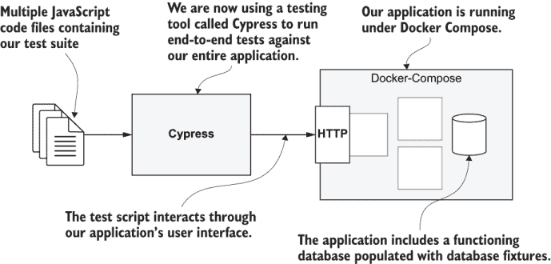

图 8.9 使用 Cypress 和 Docker Compose 进行端到端测试的整个应用程序

运行端到端测试需要我们启动整个应用程序，并在浏览器中进行测试。这使得端到端测试成为所有测试类型中最慢的一种，也是它们位于测试金字塔顶端的原因。

话虽如此，拥有少量端到端测试应该是您测试策略的重要组成部分。端到端测试覆盖了大量的内容，尽管这些测试可能需要花费大量时间运行，但它们提供了很高的性价比。此外，这种测试通过前端来测试您的应用程序，而前端恰好是客户的角度。不用说，这确实是我们可以测试应用程序最重要的视角，也是我们将端到端测试的价值看得如此之高的主要原因。

我们现在转向第八章的最后一个示例——example-4。Example-4 包含一个 docker-compose.yaml 文件，它启动了 FlixTube 的简化版本。

### 8.8.1 为什么选择 Cypress？

Cypress 简直是一个测试网页的绝佳全能工具。它是一个视觉解决方案，拥有出色的用户界面；我们实际上可以观察它测试我们应用程序前端的过程。您可以在图 8.10 中看到它的样子，但要真正理解它的强大之处，您必须亲自尝试。

Cypress 默认使用 Chrome 来运行测试，但它也会自动检测我们工作站上的其他浏览器。我们可以轻松地在这些浏览器之间切换，以进行跨浏览器测试。

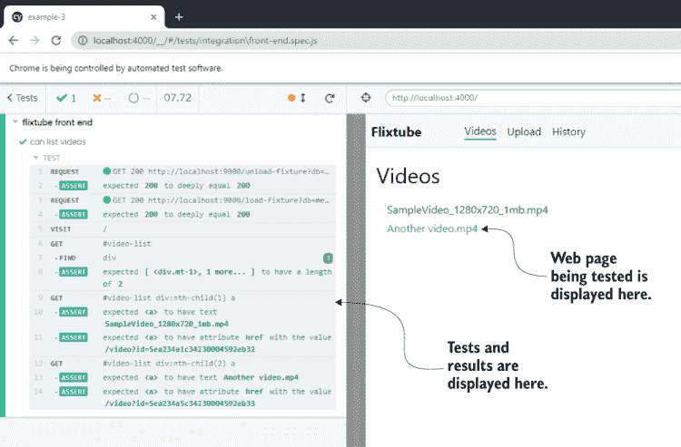

图 8.10 Cypress UI（用户界面）

Cypress 拥有出色的用户界面，但它也可以在 *无头* 模式下从终端运行，这意味着用户界面是隐藏的。在开发过程中，我们将花费大量时间使用 Cypress UI 来直观测试我们的前端。最终，我们将以无头模式运行它，以便它能够融入我们的 CD 管道。

在无头模式下运行时，我们无法直接看到 Cypress 与我们的前端交互，但 Cypress 有一个超级酷的功能：它会记录测试运行的录像。这个功能在自动化测试中尤为有用。当 Cypress 测试失败时，您可以从您的 CD 服务器中提取失败的测试录像，以便您可以看到发生了什么！

当运行 Cypress UI 时，它自动支持实时重新加载。您需要做的就是更新您的代码和测试，Cypress 将自动重新加载并再次运行您的测试。像所有伟大的现代工具一样，Cypress 是开源的。您可以在 GitHub 上找到它的代码，链接如下：

[`github.com/cypress-io/cypress`](https://github.com/cypress-io/cypress)

Cypress 还拥有其他令人印象深刻的出色功能。您可以在本章末尾找到参考资料，以便继续学习更多关于 Cypress 的知识。

然而，Cypress 并非全是优点，如果我不指出它存在的一个主要问题，那将是我失职。Cypress 基于 Electron 框架。这意味着它体积庞大，下载/安装可能相当慢。这也意味着在您的持续集成/持续部署（CD）管道中使其高效运行可能很困难，尽管仍然可行。

对于本书和 FlixTube，我们将 Cypress 和我们的端到端测试集成到单个代码仓库中。然而，对于未来的真实项目，您可能希望将 Cypress 测试分离到单独的测试仓库中。尽管通常将测试与被测试的代码放在一起是件好事，但鉴于 Cypress（它体积庞大），将这些放在单独的仓库中是有意义的。

### 8.8.2 安装 Cypress

Example-4 已经在 package.json 中添加了 Cypress。您可以使用以下方式安装依赖项：

```
cd chapter-8/example-4
npm install
```

您可以这样将 Cypress 安装到新项目中：

```
npm install --save-dev cypress
```

因为 Cypress，就像 Jest 一样，仅是用于测试的工具，所以我们将使用 `--save-dev` 来将其保存为开发依赖项。正如之前提到的，Cypress 是一个庞大的工具，安装可能需要一些时间。现在可能是一个喝咖啡的好时机！

你可以在图 8.11 中看到安装了 Cypress 的 example-4 项目的结构。这与我们在前几章中处理的其他项目结构类似。我们有一个 docker-compose.yaml 文件来构建和运行我们的应用程序，并且我们在子目录中有微服务的代码。

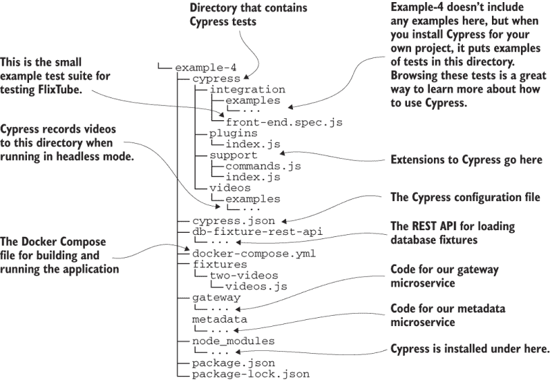

图 8.11 安装了 Cypress 的 Example-4 项目结构

图 8.11 中你看到的一些结构是在你第一次在新项目中启动 Cypress 时自动为你创建的。特别是，Cypress 在 cypress/integration/examples 子目录下创建了多个示例测试文件。我没有将这些示例包含在第八章的代码仓库中，但你可以通过在新项目中安装 Cypress 并运行它来轻松生成这些文件。你应该尝试这样做，因为浏览这些示例测试是了解 Cypress 功能的绝佳方式。

列表 8.10 展示了 Cypress 配置文件。这是一个 JSON 文件，在其中我们可以设置 Cypress 的配置选项。对于本例，我们只需要两个选项。第一个是 `baseUrl`，在这里我们设置要测试的网页的基础 URL。我们将本地运行它（通过使用 Docker Compose 启动我们的应用程序），因此主机名为 `localhost`。

运行我们的网关的容器被配置为在端口 4000 上提供前端服务，这使得基础 URL 为 http://localhost:4000。在 Cypress 配置文件中设置基础 URL 是可选的。但这样做很有用，因为我们只需更改配置文件中的那一行就可以轻松地将整个 Cypress 测试套件重定向到新位置。

列表 8.10 Cypress 的配置文件（第八章/example-4/cypress.json）

```
{
    "baseUrl": "http://localhost:4000",           ①
    "dbFixturesUrl": "http://localhost:9000"      ②
}
```

① 设置我们将用于运行测试的基础 URL

② 设置数据库固定值 REST API 的 URL

列表 8.10 中我们设置的另一个字段不是标准的 Cypress 配置选项。我们需要一种方法将数据库固定值加载到我们的数据库中。由于我将很快解释的原因，我们将使用一个单独的 REST API 来完成这个任务。配置文件中的 `dbFixturesUrl` 字段设置了该 REST API 的基础 URL。

### 8.8.3 启动 Cypress UI

现在我们已经准备好启动 Cypress 并运行一些测试了。在你的终端中，从第八章代码仓库中的 example-4 运行以下命令：

```
npx cypress open
```

这将打开 Cypress UI 的第一层，并显示你的 Cypress 测试套件列表。Example-4 只包含一个测试套件。双击名为 front-end.spec.js 的测试套件以打开 Cypress UI 的下一层。

你现在看到的是一个针对 FlixTube UI 运行的单个测试。测试会自动运行，但在这个阶段，测试应该会失败，因为我们还没有启动我们的应用程序。

### 8.8.4 设置数据库固定值

在我们开始应用程序之前，我们必须能够加载数据库固定数据。在之前使用 Jest 时，我们能够直接从测试代码中将数据加载到数据库中。我们不能直接从 Cypress 中这样做，因为它是运行在浏览器中的（Cypress 是基于 Chromium 渲染引擎的 Electron 应用程序，是 Chrome 浏览器的基础），并且常规的 MongoDB npm 库在那里不起作用。我们需要一个不同的解决方案来加载数据库固定数据。

要将测试数据加载到我们的数据库中，我们将使用一个单独的 REST API 来管理我们的数据库。这意味着我们可以通过 HTTP 请求来加载和卸载数据库固定数据。我们已经在使用 Docker Compose，因此将额外的容器添加到我们的应用程序中并不困难。图 8.12 显示了包括新的数据库固定数据 REST API 在内的应用程序结构。

创建这样的 REST API 需要做很多工作。然而，我已经有一个过去用于测试项目的。我在 example-4 项目中包含了它的代码副本（在 example-4/db-fixtures-rest-api 下找到）。你还可以在 GitHub 上找到代码的独立副本：

[`github.com/ashleydavis/db-fixture-rest-api`](https://github.com/ashleydavis/db-fixture-rest-api)

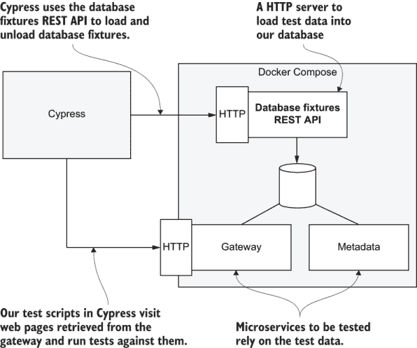

图 8.12 在运行 Cypress 测试之前使用数据库固定数据 REST API 为数据库播种测试数据

我们不会在本书中介绍数据库固定数据 REST API 的内部结构。我们必须在某处划线，但请随意查看你自己的代码。阅读他人的代码是一种宝贵的经验。请放心，你在这里不会找到任何特别新的东西；毕竟，它只是一个基于 Express 的 Node.js REST API，这与你在本书中已经看到的微服务类似。

列表 8.11 是 example-4 docker-compose.yaml 文件的摘录。它显示我们将数据库固定数据 REST API 集成到我们的应用程序中的方式与任何其他微服务相同。

列表 8.11 使用 Docker Compose 加载 db 固定数据 REST API（摘自第八章示例 3 的 docker-compose.yaml）

```
version: '3'
services:
  db:                                    ①
    image: mongo:4.2.0
    container_name: db
    ports:
      - "27017:27017"
    expose:
      - "27017"
    restart: always                      ①
  db-fixture-rest-api:                   ②
    image: db-fixture-rest-api
    build: 
      context: ./db-fixture-rest-api
      dockerfile: Dockerfile
    container_name: db-fixture-rest-api
    ports:
     - "9000:80"
    environment:
     - PORT=80
     - DBHOST=mongodb://db:27017
     - FIXTURES_DIR=fixtures
    volumes:
     - ./fixtures:/usr/src/app/fixtures:z
    depends_on:
      - db
    restart: always                      ②
    ...                                  ③
```

① 配置 MongoDB 数据库服务器

② 配置数据库固定数据 REST API

③ 网关和元数据微服务在此定义。

列表 8.11 将数据库固定数据 REST API 添加到我们的应用程序中，但我们仍然需要一个方法从我们的 Cypress 测试中与之通信。为此，我们将创建一个 Cypress 扩展，我们可以在测试中使用它来加载数据库固定数据。

列表 8.12 是一段代码片段，展示了我们如何向 Cypress 添加新命令。这是一个展示如何扩展 Cypress 来执行新功能的例子。这个特定的命令被称为 `loadFixture`，我们将在 Cypress 测试中使用它来加载数据库固定数据。

列表 8.12 在 Cypress 下加载数据库固定数据（摘自第八章示例 3 的 cypress/support/commands.js）

```
Cypress.Commands.add('loadFixture', 
➥ (databaseName, fixtureName) => {                       ①
    cy.unloadFixture(databaseName, fixtureName);          ②
    const dbFixturesUrl = 
    ➥ Cypress.config("dbFixturesUrl");                   ③
    const route = "/load-fixture?db=" + databaseName + 
    ➥ "&fix=" + fixtureName;
    cy.request("GET", dbFixturesUrl + route)              ④
        .then(response => {
            expect(response.status).to.eql(200);          ⑤
        });
});
```

① 定义一个 Cypress 命令（Cypress 的扩展）通过新的 REST API 加载数据库固定数据

② 通过调用另一个辅助函数从上一个测试中卸载数据（测试数据）

③ 从 Cypress 配置文件中读取 REST API 的 URL

④ 向 REST API 发送 HTTP GET 请求以加载数据库固定数据

⑤ 预期固定数据已成功加载（否则测试失败）

`loadFixture` 命令向数据库固定数据 REST API 发送 HTTP GET 请求，并使其从文件（在这种情况下，example-4/fixtures/two-videos/videos.js）中加载数据库固定数据。稍后，您将看到我们如何在测试代码中调用此命令。

### 8.8.5 启动您的应用程序

我们已经安装并准备好了 Cypress，并且我们有能力加载数据库固定数据。在我们能够测试我们的应用程序之前，我们必须启动它！

列表 8.11 是 example-4 的 Docker Compose 文件的摘录。完整的文件包含了一个带有网关和元数据微服务的 FlixTube 简化版本的配置。这远非完整的应用程序，但足以让我们编写一个测试来确认视频列表是从数据库中检索并在前端显示的。

在这个例子中，我将 FlixTube 简化，以便将其作为本章的一个简单示例。然而，一般来说，了解我们总是有选择缩减应用程序以使其更容易测试的选项是很好的。随着我们的应用程序越来越大，最终它将变得太大，无法使用端到端测试在单个计算机上进行测试。在这种情况下，我们被迫将应用程序分割成更小的可测试单元。现在，让我们使用我们的老朋友 Docker Compose 启动应用程序：

```
docker-compose up --build
```

### 8.8.6 使用 Cypress 创建端到端测试

使用 Cypress 编写端到端测试与使用 Jest 编写测试略有不同。在列表 8.13 中，我们使用由 `describe` 和 `it` 函数组成的类似整体结构，而不是 Jest 中的 `describe` 和 `test`（我们使用了那些）。`describe` 和 `it` 来自 Mocha 测试风格。

Mocha 是一个流行的 JavaScript 测试框架，您可能已经听说过它。Cypress 正是基于 Mocha，这就是为什么这些测试看起来是这样的。实际上，Jest 也支持 `describe` 和 `it` 格式，所以如果您愿意，您可以使用相同的格式使用这两个测试工具。

列表 8.13 使用 Cypress 对 FlixTube 进行端到端测试（来自第八章的 example-4/cypress/integration/front-end.spec.js）

```
describe("flixtube front end", () => {                      ①
    it("can list videos", () => {                           ②
        cy.loadFixture("metadata", "two-videos");           ③

        cy.visit("/");                                      ④
        cy.get("#video-list").find("div").
        ➥ should("have.length", 2);                        ⑤
        cy.get("#video-list div:nth-child(1) a")            ⑥
            .should("have.text", "SampleVideo_1280x720_1mb.mp4")
            .should("have.attr", "href", 
            ➥ "/video?id=5ea234a1c34230004592eb32");       ⑥
        cy.get("#video-list div:nth-child(2) a")            ⑦
            .should("have.text", "Another video.mp4")
            .should("have.attr", "href", 
            ➥ "/video?id=5ea234a5c34230004592eb33");       ⑦
    });
});
```

① 定义测试套件

② 测试我们能否在 FlixTube UI 中加载视频列表

③ 将名为 two-videos 的固定数据加载到元数据数据库的视频集合中

④ 让 Cypress 访问 FlixTube 的主页

⑤ 验证第一段视频的详细信息

⑥ 检查两个视频（从数据库固定数据加载的视频）是否在 UI 中显示

⑦ 验证第二段视频的详细信息

我们测试中的第一行代码是对我们的 `loadFixtures` 命令的调用，通过 Cypress 的 `cy` 对象访问。Cypress 接口还包含许多其他用于加载、交互和测试网页的功能。

在下一行，我们调用 `cy.visit`。这是你需要了解的 Cypress 中最重要的事情。这个函数是 Cypress 访问网页的方式。所有其他 Cypress 命令都是相对于访问的页面操作的。

我们在这里正在访问网页上的`/`（根）路由。请注意，这相对于我们在 Cypress 配置文件中之前指定的基本 URL。这会将 Cypress 浏览器导航到 FlixTube 主页。

接下来，我们使用 `cy.get` 从浏览器的 DOM 层级中获取一个元素并对它进行测试。它检查我们在视频列表中有两个视频，然后检查每个视频的名称和链接。我们知道这些视频应该在前端显示，因为我们在这个测试的第一行用两个视频的数据库固定文件初始化了我们的元数据微服务的数据库。这个数据库固定文件将测试数据（你可以在 example-4/fixtures/two-videos/videos.js 中看到）加载到数据库中，包含这两个视频的所有详细信息。

如果你已经打开了 Cypress，那么你可能已经运行了这个测试。结果应该看起来像图 8.10。你可能需要在上一节启动应用程序后刷新 Cypress UI 来运行测试。在这个时候，你可以尝试破坏这段代码并观察测试失败，就像我们之前在单元和集成测试中做的那样。

这里有一个例子。打开文件 example-4/gateway/src/views/video-list.hbs。这是为 FlixTube 主页渲染的 HTML（以 Handlebars 模板格式）。尝试更改这个 HTML，以便在列表中的每个视频上显示不同的内容。一旦破坏了测试，你会看到红色表示失败，而不是图 8.10 中显示的绿色成功。

只要注意，你永远不要在生产数据库上运行这个测试。加载数据库固定文件会清除相关的数据库集合，你永远不希望丢失生产数据。实际上，你也不应该在生产环境中这样做，因为你在生产环境中永远不会运行数据库固定文件的 REST API！这给了我们加载数据库固定文件的能力，但我们只需要在开发和测试环境中使用它。

注意：在生产环境中运行数据库固定文件的 REST API 也会使外部访问你的数据库。这是一个灾难性的配方，所以请务必不要在生产环境中实例化它。

你可以用 Cypress 做的事情还有很多！这包括点击按钮

```
cy.get(".some-button").click();
```

以及在输入字段中输入值：

```
cy.get(".some-input").type("Hello world");
```

Cypress 还提供了模拟你的后端 REST API 的功能。你可以使用这个功能来隔离用户界面进行测试！这允许你进行一种针对用户界面的 TDD（测试驱动开发），坦白说，我觉得这非常令人惊讶。本章末尾有参考资料，你可以继续学习关于 Cypress 的知识。

### 8.8.7 使用 npm 调用 Cypress

现在，我们可以设置使用 npm 调用我们的 Cypress 测试，就像我们使用 Jest 一样。Example-4 是一个独立于其他示例的项目，我们使用不同的测试工具（Cypress 而不是 Jest）。尽管如此，我们希望能够像这样使用传统的 npm test 脚本来运行 Cypress：

```
npm test
```

列表 8.14 展示了在 package.json 中的设置，以便实现这一功能。我们已配置测试脚本以调用 `cypress run`，这将以无头模式执行 Cypress。这允许我们从终端运行 Cypress 测试，就像我们之前使用 Jest 测试那样。

列表 8.14 包含 npm 脚本的 package.json 以运行 Cypress（章节-8/示例-4/package.json）

```
{
  "name": "example-4",
  "version": "1.0.0",
  "scripts": {
    "test:watch": "cypress open",    ①
    "test": "cypress run"            ②
  },
  "dependencies": {},
  "devDependencies": {
    "cypress": "⁴.4.1",
    "mongodb": "³.5.6"
  }
}
```

① 调用命令“npm run cypress”打开 Cypress UI

② 使用“npm test”命令以无头模式运行 Cypress，从而完全从命令行运行测试

我们设置的另一个脚本是为 `npm run test:watch` 调用 `cypress open`，这将打开 Cypress UI。我喜欢这种配置，因为我感觉运行 Cypress UI（它会自动进行实时重载）在功能上与在 Jest 的实时重载模式下运行 Jest 类似（使用 Jest 的 `--watch`/`--watchAll` 参数）。当我需要这个功能时，我只需调用 `npm run test:watch`，而无需考虑我是在 Jest 项目中还是在 Cypress 项目中。我只是得到了我预期的结果。

### 8.8.8 我们取得了什么成果？

我们几乎完成了对测试领域的探索。我们看到了单元测试、集成测试，现在还有端到端测试。

我们已经了解了测试的相对性能：集成测试比单元测试慢，端到端测试比集成测试慢。我们还看到了每个单元测试仅覆盖一小部分隔离代码的情况。集成和端到端测试可以非常有效，因为这些测试覆盖了更多的代码，但测试数量较少。

现在的问题是，你应该有多少种类型的测试？这个答案并不是一成不变的。

但我可以说的是，你可以，也许应该，拥有 100 个或 1,000 个单元测试。你需要更少的集成测试和非常少的端到端测试。很难说具体数量，因为这实际上取决于你愿意等待测试完成的时间长度。如果你愿意等待一整夜或整个周末来让测试套件完成，那么你可能也能承担起拥有 100 个或 1,000 个端到端测试的成本。

尽管如此，作为开发者，我们渴望快速和全面的反馈。在这方面，单元测试是无与伦比的。如果你可以通过许多非常快速的单元测试实现大量的代码覆盖率，那么这就是你应该拥有的！这是因为这就是开发者会在他们工作日的每一刻编码时使用的。如果你的测试套件运行缓慢，开发者往往不会使用它，也不会更新它。这对任何人来说都不是好事。

最终，事情并非非黑即白。不同类型的测试之间甚至没有明确的区分。单元测试在哪里结束，集成测试又从哪里开始？这并不明确。所有测试都落在光谱上，这是一个有着许多灰度的光谱。

## 8.9 持续集成（CD）管道中的自动化测试

我们有一套自动化测试。现在我们来到了自动化测试的真正目的：让它自动运行！

要真正实现自动化，我们的测试需要直接在我们的托管代码仓库上运行。当开发者将代码更改推送到代码仓库时，我们希望自动运行测试套件来检查代码的健康状况。为了实现这一点，我们必须将测试添加到我们的 CD 管道中，这样它们就会在生产部署之前成为一个自动检查点。如果测试通过，我们的代码就会部署到生产环境。如果它们失败，我们的代码将不会被部署。就是这样简单。图 8.13 说明了这种情况。

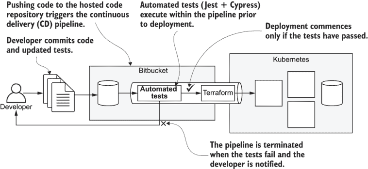

图 8.13 持续集成（CD）管道中的自动化测试

我们之前花时间讨论 npm test 脚本在 package.json 中的配置，原因在于这是我们如何将自动化测试集成到我们的 CD 管道中的方式。正如我们在上一章所学，CD 管道可以简单到只是运行一个 shell 脚本（尽管一些供应商提供了花哨的图形用户界面）。添加我们的自动化测试很容易。假设我们的 npm test 脚本已经配置好，我们只需从我们的部署 shell 脚本中调用以下命令即可：

```
npm test
```

作为例子，让我们考虑将自动化测试添加到第七章的 example-4 中。列表 8.15 显示了配置 Bitbucket Pipelines 的 YAML 文件。这与第七章中使用的相同，但现在我们在调用部署脚本之前先调用 `npm test`。

如果自动化测试失败，也就是说，如果 `npm test` 返回非零退出码，Jest 和 Cypress 都会在任何测试失败时这样做，那么管道本身就会失败并终止。因此，失败的测试会阻止代码部署到生产环境。

列表 8.15 在持续集成（CD）管道中运行测试（第七章示例-4/bitbucket-pipelines.yaml 的更新）

```
image: hashicorp/terraform:0.12.6
pipelines:
    default:
      - step:
          name: Build and deploy
          services:
            - docker
          script:
            - export VERSION=$BITBUCKET_BUILD_NUMBER
            - cd video-streaming && npm install 
            ➥ && npm test                             ①
            - chmod +x ./scripts/deploy.sh
            - ./scripts/deploy.sh
```

① 运行第七章中视频流微服务的测试

在我们的持续集成（CD）管道中运行 Jest 相对简单。列表 8.15 中的 `npm install` 命令会安装它。

运行 Cypress 更为复杂。因为 Cypress 非常庞大，您需要在 CD 服务器上配置缓存，以便每次流水线调用时 Cypress 都不会重新下载。这有点过于复杂，并且特定于您的 CD 提供商，因此我们在这本书中不涉及它。

我们还需要在部署脚本中添加一个命令，在运行 Cypress 测试之前启动我们的应用程序。这使得事情变得更加复杂，并且更加高级。虽然这超出了本书的范围，但您确实值得深入研究，以便在您的部署管道中自动运行端到端测试。

## 8.10 测试概览

在结束本章之前，这里快速回顾一下 Jest 和 Cypress，以及我们如何使用这些工具来运行测试。

表 8.2 测试命令概览

| 命令 | 描述 |
| --- | --- |
| `npx jest --init` | 初始化 Jest 配置文件。 |
| `npx jest` | 在 Jest 下运行测试。 |
| `npx jest --watch` | 启用实时重新加载功能运行测试，当代码发生变化时重新运行测试。它使用 Git 来确定哪些文件已更改。 |
| `npx jest --watchAll` | 与上述类似，但它监视所有文件的变化，而不仅仅是 Git 报告已更改的文件。 |
| `npx cypress open` | 打开 Cypress UI，以便您可以运行测试。实时重新加载默认启用；您可以更新代码，测试将自动重新运行。 |
| `npx cypress run` | 在无头模式下运行 Cypress 测试。这允许您从命令行（或 CD 流水线）进行 Cypress 测试，而无需显示用户界面。 |
| `npm test` | npm 运行测试的脚本约定。根据您在 package.json 文件中的配置，运行 Jest 或 Cypress（甚至两者都运行）。这是您应在 CD 流水线中运行的命令以执行测试套件。 |
| `npm run test:watch` | 这是我在实时重新加载模式下运行测试的个人约定。您需要配置 package.json 文件中的此脚本才能使用它。 |

## 8.11 继续你的学习

在本章中，我们学习了自动化测试的基础知识。这里的内容足以启动您自己的测试计划，但测试是一个如此庞大的主题，并且本身就是一种专业。要进一步探索这个主题，请参考以下书籍：

+   *《单元测试原则、实践和模式》*，作者：弗拉基米尔·科里科夫（Vladimir Khorikov）（Manning, 2020）

+   *《单元测试的艺术》（第 2 版）*，作者：罗伊·奥斯霍夫（Roy Osherove）（Manning, 2013）

+   *《测试 Java 微服务》*，作者：*亚历克斯·索托·布埃诺（Alex Soto Bueno）、安迪·冈布雷希特（Andy Gumbrecht）和贾森·波特（Jason Porter）*（Manning, 2018）

+   *《使用 Mountebank 测试微服务》*，作者：*布兰登·拜尔斯（Brandon Byars）*（Manning, 2018）

还可参见 Elyse Kolker Gordon 著的 *《探索 JavaScript 测试》*（Manning, 2019），这是一本关于测试的免费章节集合，来自 Manning 出版的其他书籍：

+   [`www.manning.com/books/exploring-javascript-testing`](https://www.manning.com/books/exploring-javascript-testing)

要了解更多关于 Jest 的信息，请参阅 Jest 网页和此处提供的 *《入门》* 指南：

+   [`jestjs.io/`](https://jestjs.io/)

+   [`jestjs.io/docs/en/getting-started`](https://jestjs.io/docs/en/getting-started)

要了解更多关于 Cypress 的信息，请查看以下 Cypress 网页和文档：

+   [`www.cypress.io/`](https://www.cypress.io/)

+   [`docs.cypress.io/guides/getting-started/installing-cypress.html`](https://docs.cypress.io/guides/getting-started/installing-cypress.html)

+   [`docs.cypress.io/guides/core-concepts/introduction-to-cypress.html`](https://docs.cypress.io/guides/core-concepts/introduction-to-cypress.html)

## 摘要

+   自动化测试对于扩展到大量微服务至关重要。

+   你学习了单元测试、集成测试和端到端测试如何在测试金字塔中相互配合。

+   我们使用 Jest 创建并执行了单元测试和集成测试。

+   我们使用 Docker Compose 和 Cypress 创建了端到端测试。

+   你学习了如何使用数据库固定值来为集成和端到端测试填充测试数据。

+   你学习了如何将自动化测试整合到你的持续交付（CD）管道中。
