# 10 健康的微服务

本章涵盖

+   确保您的微服务保持健康的技术

+   微服务的日志记录和监控

+   微服务调试

+   可靠性和容错模式

错误会发生。代码有错误。硬件、软件和网络是不可靠的。所有类型的应用程序都会发生故障，而不仅仅是微服务。但微服务应用程序更加复杂，因此随着我们应用程序的增长，问题可能会变得相当严重。我们维护的微服务越多，在特定时间某些微服务出现行为不当的可能性就越大！

我们无法完全避免问题。这些问题是由人为错误或不可靠的基础设施引起的无关紧要。问题是肯定会发生的。但仅仅因为问题无法总是避免，并不意味着我们不应该尝试减轻这些问题。一个精心设计的应用程序会预见并考虑到问题，即使某些问题的具体性质无法预见。

随着我们的应用程序变得更加复杂，我们需要技术来应对问题并保持微服务的健康。我们的行业已经发展了许多“最佳”实践和模式来处理问题。在本章中，我们将介绍其中一些最有用的。遵循这些指导原则将使您的应用程序运行更加顺畅，更加可靠，从而在问题发生时减少压力，更容易从问题中恢复。

本章并不立即实用；GitHub 中没有示例代码，您也不能直接跟随。将其视为一个*技术工具箱*，您可以在未来尝试，随着您继续前进并继续开发自己的微服务应用程序。

## 10.1 维护健康的微服务

一个健康的微服务应用程序由健康的微服务组成。一个健康的微服务是指没有遇到问题，如错误、CPU 过载或内存耗尽。为了了解我们应用程序的健康状况，我们需要

+   监控我们的微服务以了解它们的当前状态

+   当问题发生时采取行动以保护我们的客户

+   在出现问题时进行调试并应用修复

以 FlixTube 的元数据微服务为例，图 10.1 展示了生产中健康微服务的架构。请注意，该微服务有多个副本，并且使用*负载均衡器*在微服务的实例之间均匀分配请求。如果任何单个微服务失效，副本可以替代，直到失败的实例重新启动。

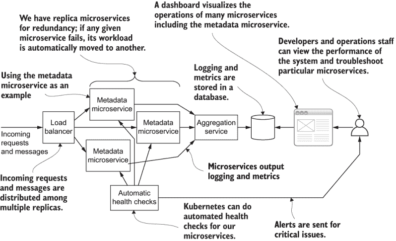

图 10.1 生产中健康微服务的架构

这种冗余确保了微服务和应用程序的持续可靠性。在本章中，我们将学习在 Kubernetes 上复制微服务以及其他促进容错和从错误中恢复的技术。

即使没有停机的大幅影响，微服务也可能出现问题。我们如何知道微服务中发生了什么？它不必是一个黑盒。我们需要某种类型的日志*聚合*服务（如图 10.1 所示）来以我们可以理解的方式组合所有展示的微服务的日志。

我们可以做什么来确保我们的微服务保持健康？首先，类似于真正的医疗专业人士，我们必须知道如何*测量体温*。我们有多种技术可供我们诊断微服务的状态和行为。表 10.1 列出了本章我们将学习的主要技巧来测量微服务的体温。

表 10.1 监控微服务状态的技巧

| 技巧 | 描述 |
| --- | --- |
| 日志记录 | 将有关我们微服务行为的信息输出，以显示正在发生的事情以及何时发生。 |
| 错误处理 | 制定管理错误的策略，以记录失败的内容和失败的时间。 |
| 聚合 | 将所有微服务的相关信息合并到单个流中，这样我们就不必在微服务之间搜索所需的信息。 |
| 自动健康检查 | 配置 Kubernetes 以自动发现我们的微服务中的问题。 |

当出现问题时会发生什么？我们如何修复它？应对已经发生的问题需要调试。在本章中，我们将学习我们可以使用的技巧来找到问题的原因，以便我们可以修复它。

## 10.2 监控您的微服务

将我们的应用程序部署到生产环境只是第一步。之后，我们需要持续了解我们的应用程序是否在运行，尤其是在代码的新更新推出之后。

我们必须了解我们的应用程序正在做什么，否则我们无法知道里面发生了什么，除非我们知道它们，否则我们无法修复问题。在本节中，我们将探讨一些监控我们微服务行为的技巧：

+   记录日志

+   错误处理

+   日志聚合

+   自动健康检查

### 10.2.1 开发中的登录

将日志记录到控制台是我们理解微服务持续行为的最低级工具。通过日志记录，我们输出一个文本流，显示应用程序内部发生的重要事件、活动和操作。

来自应用程序的日志流可以被视为*应用程序的历史记录*，显示了在其整个生命周期中发生的所有相关事件。我们可以在开发和生产中使用控制台日志。图 10.2 展示了它在开发中的工作方式。

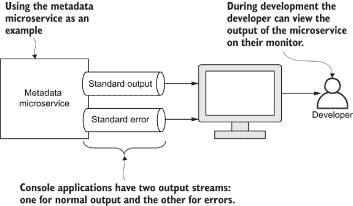

图 10.2 开发中的控制台日志

每个微服务，就像每个进程一样，都有两个用于日志记录的输出流：

1.  标准输出

1.  标准错误

在 JavaScript 中，我们像这样将日志输出到标准输出通道：

```
console.log("Useful information goes here");
```

我们像这样将错误输出到标准错误通道：

```
console.error("Useful information goes here");
```

注意：如果你使用的是除 JavaScript 之外的语言，那么它将有自己的函数来输出到标准输出和标准错误。

这就是我们输出到控制台所需的所有内容。我们实际上不需要复杂的日志系统。现代日志聚合系统通常会自动收集从容器中流出的标准输出和标准错误。我们很快就会看到它是如何工作的。

应该记录什么？

由于日志记录必须由开发者显式添加，并且始终是可选的，我们该如何选择要记录的内容呢？以下是一些示例：

+   应该记录什么：

    +   应用程序中的相关事件及其细节

    +   重要操作的成功/失败

+   不应该记录的内容：

    +   可以从其他来源轻易确定的事情

    +   任何秘密或敏感信息

    +   有关你用户的任何个人详细信息

如果你发现自己被过多的日志细节淹没，你可以自由地进入并删除没有用的日志。对于每个控制台日志，你只需要问自己一个问题：没有这个细节我能活下去吗？如果你不需要它，就删除它。

虽然如此，但一般来说，更多的日志比更少的日志好。在生产环境中进行调试时，你需要尽可能多的帮助来了解问题发生的原因。通过日志回溯是理解导致问题的事件序列的重要步骤。

在问题发生之后，你将无法添加更多的日志！好吧，如果你能够隔离并重现问题，那么你可以这样做，但这本身可能很困难。更多的日志记录更好，因为当你遇到问题时，你希望拥有尽可能多的信息来帮助你解决问题。

### 10.2.2 错误处理

错误会发生。我们的用户会受到影响。这是计算机编程的基本法则！以下是一些错误的示例：

+   运行时错误（抛出异常导致我们的微服务崩溃）

+   输入错误数据（来自故障传感器或数据输入中的人为错误）

+   以意外组合或方式使用的代码

+   第三方依赖项失败（例如 RabbitMQ）

+   外部依赖项失败（例如 Azure 存储）

我们如何处理错误很重要。我们必须计划优雅地处理和恢复错误，以最大限度地减少对我们用户和业务的损害。当错误发生时会发生什么？我们的应用程序将如何处理这些问题？我们必须思考这些问题，并为我们的应用程序制定一个错误处理策略。

在我们的 JavaScript 代码中，我们通常会预测错误，并在我们的代码中使用异常、回调或承诺来处理这些错误。在这些情况下，我们通常知道该怎么做。我们可以重试失败的操作，或者如果可能，如果没有明显的自动纠正措施，我们可能需要向用户报告错误或通知我们的运维人员。

有时我们可以预见错误，有时则不能。我们可能会错过错误，因为我们不知道错误可能会发生，或者因为某些类型的错误（例如，硬盘故障）发生的频率如此之低，以至于不值得专门处理这些错误。为了安全起见，我们必须考虑到我们甚至无法想象的错误！

我们需要的是一种处理意外错误的一般策略。对于任何进程，包括单个微服务，这归结为两个主要选项：*中断* *和重启* 或 *恢复操作*。您可以在图 10.3 中看到这些错误处理策略的说明。

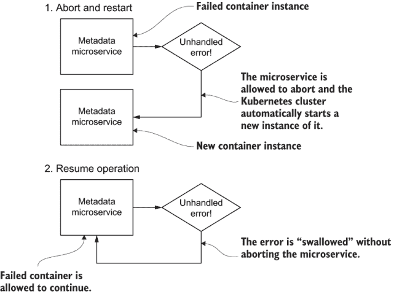

图 10.3 处理意外错误的策略

中断和重启

中断和重启策略拦截意外错误，并通过重启进程来响应。使用此策略的最简单方法是忽略我们不关心的任何错误。任何我们没有在代码中使用 try/catch 语句明确处理的异常都会导致进程被中断。

这是最简单的错误处理策略，因为它实际上意味着*什么都不做*。只需允许意外错误发生，并让 Node.js 响应地中断我们的程序。当生产级微服务被中断时，我们将依赖 Kubernetes 自动为我们重启它，这是它的默认行为。（在 Kubernetes 中，这种行为也是可配置的。）

恢复操作

恢复操作策略拦截意外错误，并通过允许进程继续来响应。我们可以在 Node.js 中通过在 `process` 对象上处理 `uncaughtException` 事件来实现这一点：

```
process.on("uncaughtException", err => {
    console.error("Uncaught exception:");
    console.error(err && err.stack || err);
});
```

如果我们像这样处理事件，我们就明确控制了意外错误。在这种情况下，Node.js 不会采取默认的中断进程的操作。它只是简单地继续尽可能好地运行，我们必须希望错误没有使进程处于不良状态。

将错误打印到标准错误通道意味着它可以被我们的生产日志系统捕获，我们将在不久后讨论。然后，可以将此错误报告给我们的运维团队，而无需被忽视。

中断和重启：版本 2

现在我们已经了解了如何在 Node.js 中处理未捕获的异常，我们可以实现一个更好的版本的中断和重启策略：

```
process.on("uncaughtException", err => {
    console.error("Uncaught exception:");
    console.error(err && err.stack || err);
    process.exit(1);
});
```

在此代码中，我们明确控制了意外错误的处理器。与之前一样，我们打印错误以便我们的运维团队能够注意到。接下来，我们通过调用 `process.exit` 明确终止程序。

我们向 `exit` 函数传递一个非零退出码。这是一个标准约定，表示进程因错误而终止。我们可以在这里使用不同的非零错误码（任何正数）来指示不同类型的错误。

我应该使用哪种错误处理策略？

关于是否重启，这是一个问题。许多开发者坚信应该终止并重启，在大多数情况下，简单地让我们的进程崩溃是一个好主意。因为尝试在崩溃后恢复微服务可能会使其处于损坏状态而无法正常工作。

使用 *终止并重启*，我们可以监控崩溃，以了解哪些微服务出现了需要解决的问题。如果你结合良好的错误报告，这是一个好的通用策略，你可以默认应用。

然而，有时我们可能需要使用 *恢复操作* 策略。对于某些微服务（例如处理客户数据的微服务），我们必须仔细考虑终止进程的后果。

以 FlixTube 的视频上传微服务为例，这个微服务在任何时候都可以被终止吗？在任何时刻，它可能正在接受来自多个用户的多个视频上传。终止这个微服务，可能会丢失用户上传，这是可以接受的吗？我会说不可以，但如果你是这个微服务，你可能有不同的看法，这也可以。没有一种正确的方式来处理这个问题。

注意：在决定使用哪种策略时，最好默认使用 *终止并重启*，但偶尔 *恢复操作* 可能会更合适。

### 10.2.3 使用 Docker Compose 进行日志记录

当在开发中使用 Docker Compose 时，我们可以在终端窗口中看到所有微服务的日志输出合并为一个流。Docker 自动收集日志并将其汇总成一个单一的流，如图 10.4 所示。显然，这有助于我们全面了解应用在任何给定时间正在做什么。

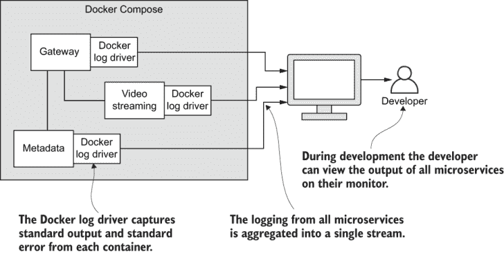

图 10.4 使用 Docker Compose 时，Docker 将所有微服务的日志汇总成一个单一的流。

将日志重定向到文件

这里有一个我发现非常实用的技巧。当我们运行 Docker Compose 时，我们可以重定向其输出并将其捕获到日志文件中。`tee` 命令意味着我们可以在终端显示输出同时将其保存到文件中。

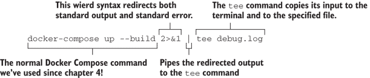

现在我们可以将日志文件（在这个例子中是 debug.log）加载到 VS code 中，并随意浏览它。我们可以搜索特定的文本字符串。例如，如果我们正在尝试找到数据库的问题，我们可能会搜索包含“database”一词的日志。

我甚至喜欢在我的日志中放入特殊的代码（字符序列），以区分微服务特定子系统的日志。这使得搜索或过滤你感兴趣的日志类型变得更容易。

### 10.2.4 Kubernetes 中的基本日志记录

当在 Docker Compose 下开发中运行微服务时，我们在本地开发工作站上运行应用程序。这使得我们很容易看到应用程序的日志并理解代码中的情况。

从在 Kubernetes 上远程运行的生产微服务中检索日志要困难得多。要查看日志，我们必须能够从集群中提取它并将其拉回到我们的开发工作站进行分析。

假设我们能够验证我们的 Kubernetes 集群，使用 Kubectl 或 Kubernetes 仪表板分别检索单个微服务的日志相对容易。回顾第 6.12 节以提醒自己如何进行验证并开始使用这些工具。

Kubectl

我们在第六章中首次遇到 Kubectl，但现在我们将再次使用它来从 Kubernetes 上运行的特定容器中获取日志。假设我们正在运行第九章末尾的 FlixTube（如果您愿意，您可以这样做并跟随操作）。想象一下，我们想要从我们的元数据微服务的一个实例中获取日志。

由于我们可能有多个元数据微服务的实例（我们目前还没有，但本章后面我们将讨论创建副本），我们需要确定 Kubernetes 分配给我们所感兴趣的特定微服务的唯一名称。

我们实际上在这里寻找的是 *pod* 的名称。您可能还记得第六章中提到的 Kubernetes pod 是包含我们的容器的东西。一个 pod 实际上可以运行多个容器，尽管对于 FlixTube 来说，我们目前每个 pod 只运行一个容器。在按照第 6.12.1 节所述验证 Kubectl 之后，现在使用 `get pods` 命令查看集群中所有 pod 的完整列表，如下所示：

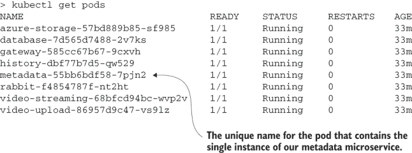

在列表中向下扫描以找到元数据微服务的 pod 名称，并找到其唯一名称。在这种情况下，名称是 `metadata-55bb6bdf58-7pjn2`。现在我们可以使用 `logs` 命令来检索元数据微服务的日志。在这种情况下，没有太多可看的内容，但知道如何做是有帮助的。

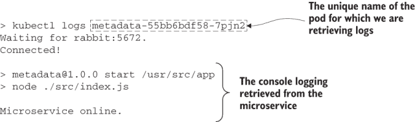

只需记得将 pod 的名称替换为集群中实际微服务的名称。唯一名称是由 Kubernetes 生成的，因此您的元数据微服务的名称不会与我的版本生成的名称相同。以下是命令的一般模板：

```
kubectl logs <pod-name>
```

只需插入您想要检索日志的特定 pod 名称。

Kubernetes Dashboard

在您的集群中查看单个容器的日志的另一种方法是使用 Kubernetes 仪表板。这是一种视觉方式来检查和探索您的集群，您甚至可以对其进行修改（尽管，我不建议手动调整生产集群！）。

我们在第六章首次遇到 Kubernetes 仪表板。如果你还没有这样做，你可以按照第 6.12 节的说明来安装、验证和连接到你的仪表板。一旦连接，你可以快速钻取到任何 pod 以查看其日志。图 10.5、10.6 和 10.7 显示了此过程。注意在图 10.5 和 10.6 中，还有其他有用的信息可以帮助我们了解微服务的状态。

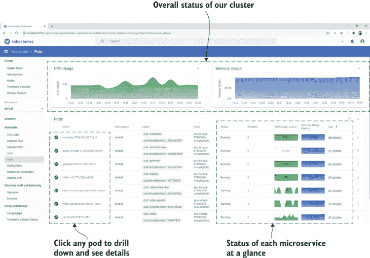

图 10.5 显示我们集群中所有 pod 的 Kubernetes 仪表板。

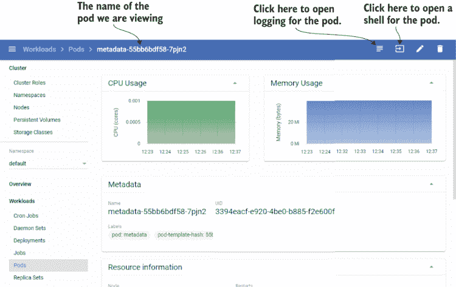

图 10.6 查看包含我们的元数据微服务的 pod 的详细信息

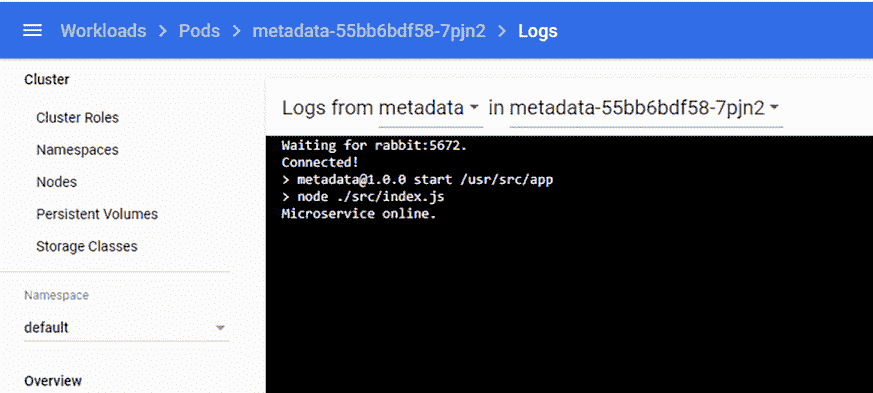

图 10.7 查看元数据微服务的日志

### 10.2.5 为 Kubernetes 手动实现日志聚合

通过追踪如前几节所示每个单独微服务的日志，我们可以走很长的路来找到问题。我建议你在可行的情况下尽可能这样做，因为为 Kubernetes 实现日志聚合是一个困难的任务。

最终，随着你的应用程序的增长，你可能会厌倦为每个微服务分别追踪日志。不幸的是，Kubernetes 没有内置从集群容器中聚合日志的方法。我真心希望 Kubernetes 的开发者在未来能提供一个简单的解决方案；如果有一个简单的方法可以启用来自集群的单个日志流，我们可以用它来监控整个应用程序的行为，那将是非常好的。

然而，也有企业解决方案，我们将在下一节中探讨其中之一。企业解决方案可能很重且成本高昂，而且这些解决方案并不一定使事情变得更容易。这些解决方案的设置和配置也可能相当困难且耗时。如果你在寻找一个更轻量级的解决方案，你可以根据图 10.8 所示自行构建 Kubernetes 聚合系统。

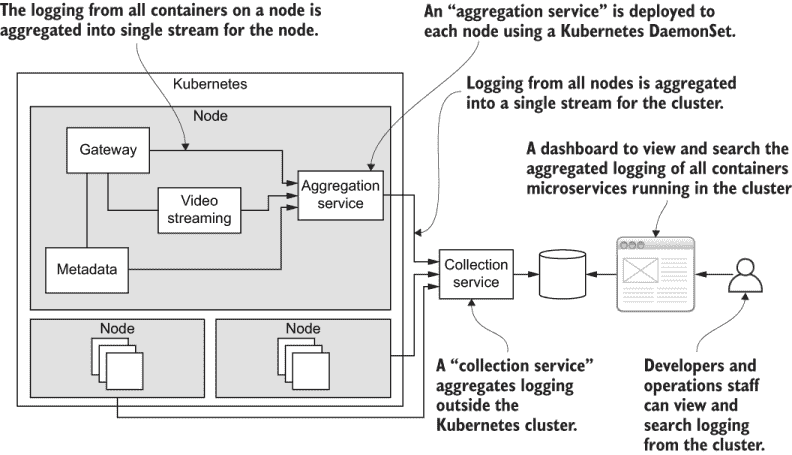

图 10.8 Kubernetes 日志聚合的滚动

图 10.8 中显示的聚合服务是一个轻量级的微服务，它运行在每个 Kubernetes 节点上。实现这个服务的难点在于你必须将其部署为**DaemonSet**。这是一种 Kubernetes 部署类型，它在集群中的每个节点上运行一个容器。为什么我们需要这样做呢？这是因为我们需要访问每个节点的文件系统，其中存储着日志文件。Kubernetes 会自动记录每个容器的标准输出和标准错误到日志文件中，但这些文件仅限于节点内部访问。

聚合服务将节点上运行的容器中的所有日志转发到外部的 *收集服务*。收集服务是一个轻量级的微服务。它的唯一任务是接收通过 HTTP 请求传入的日志，并将这些日志存储在其数据库中。然后，通过基于 Web 的仪表板将日志数据库显示给我们的开发人员和运维人员。

注意，收集服务本身位于集群之外。我们本可以将它放在集群内部，但那样的话，集群的问题（正是我们试图检测的问题）可能会妨碍我们收集日志的能力。当你的日志收集器托管在出现问题的集群内部时，调试集群中的问题可能会很困难。

这种手工打造的日志系统在应用程序的早期阶段实际上工作得相当不错。实现这个系统是一个很好的学习经历，但只有当你想深入了解 Kubernetes 的内部工作原理时才这样做。想了解更多信息并尝试自己构建这个系统，请阅读我关于 Kubernetes 日志聚合的博客文章：

[`www.the-data-wrangler.com/kubernetes-log-aggregation/`](http://www.the-data-wrangler.com/kubernetes-log-aggregation/)

### 10.2.6 企业级日志、监控和警报

对于大规模企业级微服务监控的一个常见解决方案是 Fluentd、Elasticsearch 和 Kibana 的组合。其他专门用于监控指标的选择是 Prometheus 和 Grafana。这些都是用于监控和警报的专业企业级可扩展解决方案。但它们可能很重，资源密集，所以不要急于将这些解决方案应用到你的应用程序中。

我们在这里不会深入探讨这些技术细节，因为这超出了本书的范围。现在，对每种技术有一个简要的了解就足够了。

Fluentd

Fluentd 是一个用 Ruby 编写的开源日志和数据收集服务。你可以在你的集群中实例化一个 Fluentd 容器，以便将你的日志转发到外部的日志收集器。

Fluentd 是灵活的，可以通过其许多插件进行扩展。其中一个插件允许我们将日志转发到 Elasticsearch。想了解更多关于 Fluentd 的信息，请访问以下网站：

[`www.fluentd.org/`](https://www.fluentd.org/)

[`docs.fluentd.org/`](https://docs.fluentd.org/)

Elasticsearch

Elasticsearch 是一个用 Java 编写的开源搜索引擎。你可以使用 Elasticsearch 来存储和检索日志、指标和其他有用的数据。更多关于 Elasticsearch 的信息，请访问他们的网站：

[`www.elastic.co/elasticsearch/`](https://www.elastic.co/elasticsearch/)

Kibana

Kibana 是所有这些选项中最有趣的一个。它是一个基于 Elasticsearch 的开源可视化仪表板。

Kibana 允许我们查看、搜索和可视化我们的日志和其他指标。您可以使用 Kibana 创建出色的自定义仪表板。图 10.9 展示了一个包含 Kubernetes 集群指标的仪表板示例。

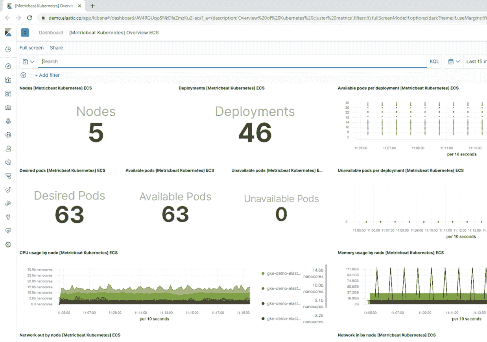

图 10.9 演示 Kibana 仪表板截图，包含 Kubernetes 集群的指标

Kibana 的好处之一，它可以真正救命，是您可以配置它以在集群中出现问题时代自动提醒您。您指定触发警报的条件以及采取的操作。

Kibana 的付费版本还支持电子邮件通知和一些其他选项，包括触发 webhook 以调用所需的任何自定义响应。有关 Kibana 的更多信息，请从以下网站了解：

https://www.elastic.co/what-is/kibana

[`www.elastic.co/kibana`](https://www.elastic.co/kibana)

您可以在以下位置找到 Kibana 演示仪表板：

[`www.elastic.co/demos`](https://www.elastic.co/demos)

您可以在此浏览支持的提醒：

[`www.elastic.co/guide/en/kibana/master/action-types.html`](https://www.elastic.co/guide/en/kibana/master/action-types.html)

Prometheus

Prometheus 是一个开源的监控系统和时序数据库。与 Kubernetes 一起，Prometheus 是云原生计算基金会（CNCF）的一个毕业项目，这使得它与一些非常受尊敬的公司并列。

我们可以配置 Prometheus 定期从我们的微服务中抓取指标，并在出现问题时自动提醒我们。有关 Prometheus 的更多信息，请在此处了解：

[`prometheus.io/`](https://prometheus.io/)

Grafana

虽然 Prometheus 在数据收集、查询和警报方面很出色，但在可视化方面就不那么好了。我们可以用 Prometheus 创建简单的图表，但它相当有限。

幸运的是，Grafana 允许我们创建视觉和交互式仪表板，并且连接到 Prometheus 非常容易。有关 Grafana 的更多信息，请在此处了解：

[`grafana.com/`](https://grafana.com/)

### 10.2.7 使用 Kubernetes 健康检查自动重启

Kubernetes 具有自动健康检查的出色功能，允许我们自动检测和重启不健康的微服务。您可能不需要这个特定功能，因为 Kubernetes 已经将不健康的微服务定义为崩溃或退出的微服务。默认情况下，Kubernetes 会自动重启行为不当的容器。

如果我们对默认设置不满意，Kubernetes 允许我们根据具体情况创建自己的“不健康”定义。我们可以为每个微服务定义一个就绪探测和存活探测，以便 Kubernetes 查询微服务的健康状况。*就绪探测*显示微服务是否已启动并准备好开始接受请求。*存活探测*随后显示微服务是否仍然存活并且仍在接受请求。两者都在图 10.10 中展示。

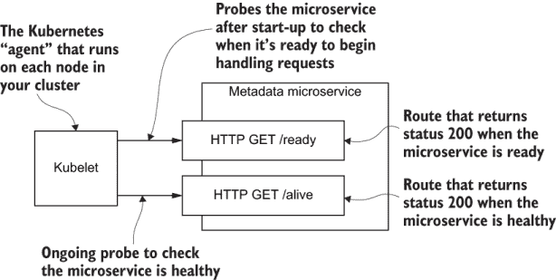

图 10.10 将自动 Kubernetes 健康检查应用于元数据微服务

我们可以使用这两个 Kubernetes 功能优雅地解决我们在第五章首次将历史微服务连接到我们的 RabbitMQ 服务器时发现的问题（5.8.5 节）。问题是历史微服务（或任何连接到上游依赖的微服务）必须在连接并使用它之前等待其依赖项（在这种情况下，是 RabbitMQ）启动。 

如果微服务尝试过早地连接，它将简单地抛出一个异常，这可能导致进程终止。如果我们能让历史微服务安静地等待直到 RabbitMQ 可用会更好。这就是为什么我们在第五章中使用了 `wait-port` npm 模块，但这只是一个笨拙的解决方案。然而，使用 Kubernetes，我们现在有了优雅解决问题的工具。

如上所述的问题仅在微服务应用首次启动时真正发生。一旦您的生产应用正在运行，并且 RabbitMQ 服务器已经启动，您就可以轻松且安全地引入依赖 RabbitMQ 的新微服务，而无需它们等待。但不要认为这不是一个问题，因为这个问题还有另一面：

+   当 RabbitMQ 崩溃并被 Kubernetes 自动重启时会发生什么？

+   如果我们想暂时关闭 RabbitMQ 进行升级或维护，会发生什么情况？

在这两种情况下，RabbitMQ 都会离线，这会中断所有依赖它的微服务的连接。对于这些微服务来说，默认操作（除非我们特别处理）是抛出一个未处理的异常，这很可能会导致微服务终止。现在，任何依赖 RabbitMQ 的微服务在 RabbitMQ 离线时都会不断崩溃和重启。

这也适用于除了 RabbitMQ 之外的其他系统依赖。一般来说，我们希望能够将任何服务离线，并让下游服务安静地等待该服务再次可用。当服务上线时，下游服务可以恢复正常操作。

我们现在可以使用就绪和存活探针来解决这些问题。以下列表显示了第九章中 Terraform 代码的更新，该代码定义了微服务的就绪和存活探针。

列表 10.1 为微服务实现 Kubernetes 就绪和存活探针（第九章的更新 - chapter-9/example-1/scripts/modules/microservice/main.tf）

```
container {
    image = local.image_tag
    name  = var.service_name
    env {
        name = "PORT"
        value = "80"
    }
    dynamic "env" {
        for_each = var.env
        content {
          name = env.key
          value = env.value
        }
    }
    readiness_probe {           ①
        http_get {
            path = "/ready"     ②
            port = 80
        }
    }                           ①
    liveness_probe {            ③
        http_get {
            path = "/alive"     ④
            port = 80
        }
    }                           ③
}
```

① 为微服务定义就绪探针

② Kubernetes 向 /ready 路由发送 HTTP 请求以确定微服务是否准备好接受请求。

③ 为微服务定义存活探针

④ Kubernetes 向 /alive 路由发送 HTTP 请求以确定微服务是否仍在接受请求。

如果你想亲自尝试列表 10.1 中的代码，你可以将更新输入到文件 chapter-9/example-1/scripts/modules/microservice/main.tf 中的代码。然后你需要运行`terraform apply`来将更改应用到你在第九章中部署的 FlixTube 的现有版本。如果你没有这样做，或者如果你已经关闭了你的 FlixTube 生产版本，运行`terraform apply`将部署 FlixTube 的新实例。

为了进行这个更改，我们还需要为所有我们的微服务添加针对/ready 和/alive 的 HTTP GET 路由处理程序。但这些路由应该做什么呢？

在最简单的情况下，我们只需返回 HTTP 状态码 200 以表示成功。这足以通过这两个探测，并让 Kubernetes 知道微服务既*就绪*又*活跃*。在某些情况下（例如，对于历史微服务），我们还可以添加额外的代码来自定义就绪和活跃的定义。在依赖于 RabbitMQ 的任何微服务中，我们都会添加代码来

+   *当 RabbitMQ 可用时，仅返回状态码 200 的/ready 路由。* 这告诉 Kubernetes 微服务已进入其就绪状态。

+   *当 RabbitMQ 不可用时，返回错误代码的/alive 路由。* 这会导致微服务重启，但由于/ready 路由，新的微服务（直到 RabbitMQ 重新上线）不会处于就绪状态。

这种策略解决了两个问题。首先，如果我们没有使用就绪和存活探测，我们的历史微服务将在 RabbitMQ 故障时不断启动、崩溃和重启。这种不断的重启并不是我们资源的高效利用，而且它将生成大量的错误日志，我们需要分析这些日志（以防其中隐藏着真正的问题！）。

第二，我们可以在微服务中显式处理这个问题，通过检测 RabbitMQ 何时断开连接，然后不断轮询以查看我们是否可以重新连接。这将使微服务免于不断崩溃和重启，但这需要在我们的微服务中编写更复杂的代码来处理与 RabbitMQ 的断开和重新连接。我们不需要编写这样的复杂代码，因为这就是探测为我们所做的事情。要了解更多关于 Pod 生命周期和不同类型的探测的信息，请参阅 Kubernetes 文档：

[`kubernetes.io/docs/concepts/workloads/pods/pod-lifecycle/`](https://kubernetes.io/docs/concepts/workloads/pods/pod-lifecycle/)

### 10.2.8 微服务间的跟踪

我还有一件关于日志和微服务的事情要告诉你。能够通过你的集群关联请求字符串是非常有用的。我们通过生成一个唯一的关联 ID（CID）来实现这一点，我们可以将其附加到我们的请求上，以便将它们相互关联。

您可以在图 10.11 中看到这是如何工作的。当一个 HTTP 请求首先到达我们的网关微服务时，会生成一个唯一的 CID 并附加到请求上。随着请求通过系统（无论是通过 HTTP 请求还是 RabbitMQ 消息）转发，ID 保持附加状态，我们可以使用它来追踪相关请求通过我们应用程序的路径。

CID 关联了请求完整链的所有日志、错误、指标和其他信息。当监控或探索我们应用程序的行为时，这些信息非常有用。如果您没有这些信息，那么请求如何以及在哪里深入到我们的应用程序中就不是很明显了。

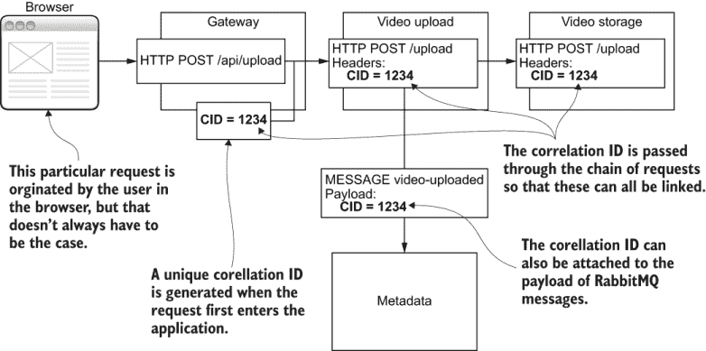

图 10.11 使用关联 ID (CID) 通过您的集群关联请求字符串

我们可以使用 npm 上的 uuid 库创建唯一的 ID。安装后，我们可以创建这样的唯一 ID：

```
const { v4: uuid } = require("uuid");
const cid = uuid();
```

然后，我们可以将唯一的 ID 附加到转发的 HTTP 请求的头部（使用 `http.request` 或 Axios 都很容易做到），或者我们可以将 ID 添加到 RabbitMQ 消息的有效负载中。要严肃地追踪您的请求，您将需要获取 Zipkin。这是一个允许您在应用程序中可视追踪请求的工具。您可以在网上了解更多关于 Zipkin 的信息：

[`zipkin.io/`](https://zipkin.io/)

Zipkin 的代码可以在 GitHub 上找到：

[`github.com/openzipkin/zipkin`](https://github.com/openzipkin/zipkin)

## 10.3 调试微服务

在设置某种形式的监控后，我们可以看到我们应用程序的日志和指标。我们使用这些信息来了解其当前状态和历史行为。当出现问题时，手头上有这类信息非常有用。

一旦问题变得明显，我们现在必须戴上侦探帽。我们需要分析我们所拥有的信息，以了解*什么*出了问题。然后，我们将线索追踪回根本原因，以找出*为什么*它发生了。在这个过程中，我们将进行实验，以进一步缩小问题根源。

通常，我们无法修复问题，直到我们确定了原因。当然，有时我们可以在不知道原因的情况下随机找到解决方案。但无论如何，能够确定根本原因总是明智的。这样，我们可以确保所谓的*修复*实际上解决了问题，而不仅仅是掩盖了它。

调试是追踪问题根源并随后应用适当修复的过程的名称。调试微服务类似于调试任何其他类型的应用程序；它是一种既包含艺术又包含科学的问题解决形式。

然而，由于应用程序的分布式特性，调试微服务更为困难。在单个进程中定位问题本身就很难，但在由许多相互作用的进程组成的应用程序中找到问题则更加麻烦。

正如你可能已经怀疑的那样，寻找问题的根源实际上是调试中最困难的部分。这就像在干草堆里寻找传说中的针。如果你有任何关于在哪里寻找问题的线索，你就有更大的机会快速找到它。这就是为什么熟悉特定代码库的开发者比不太熟悉的人更快地找到其中的错误。

在找到问题的根源之后，我们现在必须修复它。幸运的是，修复一个错误通常（但不总是）比最初找到它要快得多。

### 10.3.1 调试过程

在理想的世界里，我们会在开发和测试期间找到并修复所有问题。事实上，如果你有彻底的测试实践和/或全面的自动化测试套件，你将在生产之前发现许多错误。如果可能的话，这是最好的方法，因为与在生产环境中（可能分布在数据中心的多台服务器上）相比，在开发环境中（在你的开发工作站上）调试要容易得多。要调试任何代码，我们可以遵循以下过程：

1.  收集证据

1.  减轻客户影响

1.  隔离问题

1.  重新复现问题

1.  解决问题

1.  反思

正如任何既是艺术又是科学的东西一样，这实际上不是一个严格定义的过程。有时，我们必须以不可预测的方式在这些步骤中追踪一个迭代的路径。不过，为了解释的目的，让我们假设我们可以通过以直接线性方式通过这些步骤来解决我们的问题。

收集证据

调试过程的开始总是尽可能地收集有关问题的证据。这包括任何可以帮助我们更快地找到错误真正位置的东西。如果我们从问题实际发生的地方开始调试，我们就可以更快地缩小范围。我们需要尽可能快地了解尽可能多的关于问题的信息。这就像

+   日志和错误报告

+   系统中相关请求路径的跟踪（如第 10.2.8 节所述）

+   用户提交的错误报告

+   来自 Kubernetes CLI 工具或仪表板的信

+   任何可能发生的崩溃的调用栈

+   受影响的代码版本或分支

+   最近部署的代码或微服务

我们必须立即编译这些信息的原因是，通常，为了我们客户的利益，我们接下来必须做的事情是尽可能快地让问题消失。

减轻客户影响

在尝试解决问题或找到问题的原因之前，我们必须确保它不会对我们的客户产生不利影响。如果我们的客户受到负面影响，那么我们必须立即采取行动纠正这种情况。

在这一点上，我们不在乎问题是由什么引起的，或者它的真正长期解决方案可能是什么。我们只需要以最快的方式恢复客户所依赖的功能。他们会感激我们立即采取行动找到一种解决方案，让他们能够继续使用我们的应用程序。我们可以通过多种方式做到这一点：

+   如果问题来自最近的代码更新，则撤销该更新并将代码重新部署到生产环境中。由于我们知道更新的微服务导致了问题，因此使用微服务通常更容易这样做，我们可以轻松地撤销单个微服务并将其恢复到之前工作的版本，比如容器注册库中的一个更早的镜像。

+   如果问题来自客户不需要的新的或更新的功能，我们可以禁用该单个功能以恢复应用程序的工作状态。

+   如果问题来自一个不是急需的微服务，我们可以暂时将该微服务停用。

我无法过分强调这一步骤的重要性！解决问题可能需要几个小时或几天（在最坏的情况下甚至可能需要几周）。我们无法提前知道需要多长时间，也不能期望我们的客户等待。更有可能的是，他们会转向我们的竞争对手之一。

更糟糕的是，在压力下解决问题（因为我们的客户在等待我们）会非常紧张，并导致决策不佳。我们在压力下实施的任何修复都可能引入更多的错误，这只会使问题更加复杂。

为了我们客户和我们自己，我们必须暂时忽略这个问题，找到最快的方法将我们的应用程序恢复到工作状态（如图 10.12 所示）。这样做可以减轻压力，让我们的客户能够不间断地继续使用，同时也为我们解决问题争取了时间。

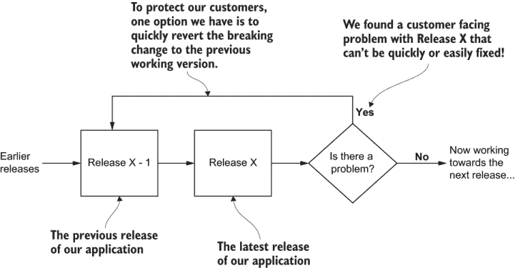

图 10.12 在发现问题后，通过立即回滚到先前的有效版本来减轻对我们客户的危害

重新复制问题

在确保应用程序再次为我们的客户正常工作后，我们现在可以继续寻找问题的原因并解决问题。为此，我们必须能够重新复制问题。除非我们能够肯定且一致地重复问题，否则我们永远无法确定我们已经修复了它。我们的目标是创建一个*测试用例*来演示这个错误。这是一个我们可以遵循的文档化步骤序列，以可靠地引起错误显示出来。

理想情况下，我们希望在开发工作站上重新复制这个错误。这使我们可以更容易地运行实验来追踪错误。然而，有些问题非常复杂，我们无法在开发环境中轻松地复制这些问题，特别是当你的应用程序变得非常大（例如，它有多个微服务）以至于不再适合整个地放在一台计算机上。

在这种情况下，我们必须在*测试环境*中重现问题。这是一个类似生产环境的环境，但纯粹用于测试（它不面向客户）。尽管在测试环境中（与生产环境中的调试类似）调试仍然可能很困难，但最终，我们仍然希望在开发环境中重现问题。

在测试环境中，我们可以进行实验，进一步了解哪些应用程序组件参与了问题，然后安全地移除那些没有贡献的组件。通过排除法，我们可以将应用程序缩减到足够小，以便在开发环境中运行。在这个时候，我们可以从测试环境转移到我们的开发工作站。我们将在第十一章中更多地讨论创建测试环境。

如果我们在进行自动化测试，这就是我们应该编写一个自动化测试来检查 bug 是否被修复的时刻。当然，这个测试最初会失败——这正是它的目的。我们稍后会用它作为一个可靠的方式来知道问题已经被修复。

编写自动化测试也确保了我们能够反复重现问题。每次运行这个测试时，它都应该失败，从而确认我们确实找到了一种可靠的重现 bug 的方法。

隔离问题

一旦我们在开发环境中重现了问题，我们现在开始隔离问题的过程。我们反复进行实验，逐步缩小应用程序的范围，直到我们缩小了范围并确定了 bug 的确切来源。

我们实际上是在逐步缩小问题可能隐藏的空间，直到问题的根源变得明显。我们正在使用一种类似于图 10.13 所示的*分而治之*的过程。

顺便说一句，微服务非常适合这个。我们的应用程序已经很好地分解成易于分离的组件。这使得将我们的应用程序拆分成各个部分变得容易得多。一般来说，只需从 Docker Compose 文件中注释掉单个微服务即可将其从应用程序中移除！随着你移除每个微服务，问自己一个问题：你还能重现问题吗？

+   是的。太好了。你已经通过减少一个微服务来缩小了问题域。

+   不。太好了。你可能刚刚将那个微服务牵涉到问题中。

无论哪种方式，你都是在通过迭代的方式接近问题的根源。

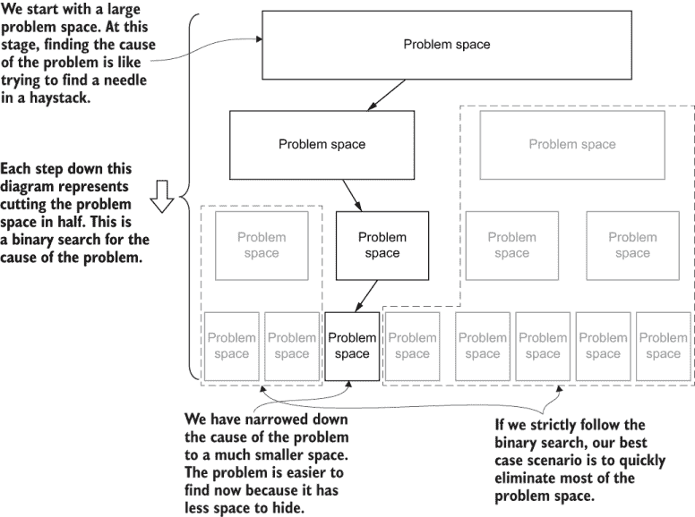

图 10.13 逐步缩小问题空间，直到我们隔离出 bug 的确切来源

有时我们很快就能确定问题的根源。在其他时候，调试可能是一个痛苦缓慢、耗时且令人沮丧的过程。这很大程度上取决于我们的总体经验水平、我们对代码库的熟悉程度、我们是否以前见过这种类型的问题，以及特定问题的复杂性。

注意：调试最糟糕的情况需要毅力、耐心和承诺。不要害怕寻求帮助。没有什么比陷入一个无法解决的问题更糟糕的了。

如果你知道从哪里开始寻找问题，那么你已经取得了巨大的优势。你也可能能够对导致问题的原因做出有根据的猜测。如果这奏效了，你完全有理由跳过这个过程的大部分内容，并立即将注意力集中在问题的原因上。然而，如果你不知道该往哪里看，或者你的猜测是错误的，你将不得不更加科学地进行调试，并应用这个完整的过程。

修复问题

你已经确定了问题的根本原因。现在你只需要修复它！

幸运的是，解决问题比最初找到问题要容易得多。通常，识别出有问题的代码就足以让你想象出解决方案。有时，这会更困难，你可能需要投入一些创造性思维来想出解决方案。但最困难的部分肯定已经过去了。你已经找到了针尖上的麦芒，现在你可以找到最好的方法来移除它。

如果你正在进行自动化测试，并且已经编写了重现问题的失败的测试用例，那么你有一个方便且可靠的标尺来告诉你何时修复了错误。即使修复变得困难，至少你有一种方法可以确信问题已经解决。当你迭代和实验以找到解决方案时，这是一件很有用的事情。

反思

每当我们解决问题时，我们都应该暂停片刻，反思如何防止问题在未来再次发生，或者如何更快地发现和修复问题。反思对我们个人和团队来说都很重要，以不断改进我们的开发过程。

我们可能已经编写了一个自动化测试，可以防止未来再次出现这个问题。但仍然，我们需要更多。我们应该寻求实践和习惯来帮助我们消除，而不仅仅是这个具体的问题，而是所有这类或这类的问题。

我们花在反思上的时间和我们投入在升级我们的开发过程中的时间在很大程度上取决于问题本身及其严重性。我们应该提出像以下问题：

+   这种问题未来可能再次发生，以至于我们应该主动减轻其影响吗？

+   这个问题的后果严重到足以让我们主动减轻其影响吗？

回答这些问题有助于我们了解在将来应对这类问题需要投入多少努力。

### 10.3.2 调试生产级微服务

有时候我们无法避免这种情况；我们实际上必须在生产中调试我们的微服务。如果我们无法在测试或开发中重现问题，那么我们唯一的选择就是进一步了解生产中正在发生的问题。

如果我们需要进行比日志记录所能提供的更深入的检查，我们可以使用 Kubernetes CLI 工具（kubectl）在任何容器（至少是安装了 shell 的任何容器）中打开一个终端。一旦您知道了 Pod 的名称（请参阅第 10.2.4 节），例如包含元数据微服务的 Pod，我们就可以像这样打开一个 shell 到它：

```
kubectl exec --stdin --tty metadata-55bb6bdf58-7pjn2 -- sh
```

您可能已经注意到，在图 10.6 中，您还可以使用 Kubernetes 仪表板打开一个 Pod 的终端。现在我们可以在生产微服务内部调用 shell 命令。

如您可能已经感受到的，我们正处于极其危险的领域。当您身处这样的微服务内部时，潜在的损害很大，任何错误都可能导致问题变得更加严重！不要随意在生产微服务上执行 shell 命令，如果您确实这样做，请不要更改任何内容。有更好的、更安全的方法来诊断问题！

这只有在它影响我们的客户时才重要。如果您在自己的私有集群或测试环境中调试微服务，那么您不会影响任何客户；因此，您可以随意推动、刺激和探索您的微服务——这是很好的学习经验！只是不要在生产微服务上这样做。

## 10.4 可靠性和恢复

我们无法避免问题，但我们可以以多种方式在我们的应用程序中处理这些问题，以在面临故障时保持服务。在我们的应用程序在生产中，我们期望它以一定的可靠性运行，并且我们可以采用许多策略来构建健壮和可靠的系统。本节概述了一些实践和技术，可以帮助我们构建容错系统，这些系统能够快速从故障中恢复。

### 10.4.1 实践防御性编程

第一步是带着*防御性编程*的心态进行编码。以这种方式工作时，我们期望会发生错误，即使我们无法预知这些错误可能是什么。我们始终应该期待以下情况：

+   我们代码可能会接收到不良的输入。

+   我们代码中包含尚未显现的 bug。

+   我们所依赖的东西（例如，RabbitMQ）并不总是 100%可靠的，偶尔也会出现他们自己的问题。

当我们采取防御性思维时，我们会自动开始寻找让我们的代码在意外情况下表现得更加优雅的方法。容错始于编码层面。它始于每个微服务内部。

### 10.4.2 实践防御性测试

如你所知，测试在构建弹性可靠系统中起着巨大的作用。我们在第八章中介绍了测试，所以在这里我想说的只是，测试“正常”代码路径是不够的。我们还应该测试我们创建的软件可以处理错误。这是防御编程的下一步。

我们应该编写测试来积极攻击我们的代码。这有助于我们识别需要更多关注的脆弱代码。我们需要确保我们的代码可以优雅地恢复，报告错误，并处理不寻常的情况。

### 10.4.3 保护你的数据

所有应用程序都处理用户数据，我们必须采取必要的步骤来保护我们的数据，以防发生故障。当意外故障发生时，我们需要有信心，我们最重要的数据没有被损坏或丢失。错误会发生；我们数据的丢失不应该发生。

并非所有数据都同等重要。在我们系统中生成（因此可以重新生成）的数据不如从我们的客户那里捕获的数据重要。尽管所有数据都很重要，但我们必须最重视保护源数据。

保护数据的第一步显然是备份。备份应该是自动化的。大多数云服务提供商都提供了你可以启用的此类功能。

注意：不要忘记练习恢复你的备份！如果无法恢复备份，备份将完全无用。

至少现在，如果最坏的情况发生，我们可以从备份中恢复丢失或损坏的数据。在业界，我们有一句话：我们的数据*不存在*，除非它至少存在于三个地方。以下是一些我们可以遵循的其他保护数据的指南：

+   一旦数据被捕获，就安全地记录数据

+   永远不要编写覆盖源数据的代码

+   永远不要编写删除源数据的代码

捕获我们数据的代码是我们应用程序中最重要的代码之一，我们应该以适当的尊重来对待它。它应该经过极其严格的测试。它还应该是最小化和尽可能简单的，因为简单的代码留给错误和安全问题隐藏的空间更少。

我们永远不应该覆盖或删除源数据的原因是，该代码中的错误可以轻易地损坏或破坏数据。我们知道错误会发生，对吧？我们处于防御心态，因此我们预计会发生不可预见的问题。要了解更多关于使用和保护数据的信息，请参阅我的书籍《使用 JavaScript 进行数据整理》（Manning，2018 年）。

### 10.4.4 复制和冗余

解决微服务失败的最佳方式是通过**冗余**。我们通过在负载均衡器后面拥有多个（通常至少三个）每个微服务的实例来实现这一点，如图 10.14 所示。负载均衡器是一种服务，它将传入的请求分配到多个微服务中，以便“负载”在它们之间均匀分布。

如果任何微服务发生故障，负载均衡器会立即将传入请求重定向到其他实例。在此期间，Kubernetes 会重启失败的实例。这种冗余意味着即使在间歇性故障的情况下，我们也能保持连续的服务水平。

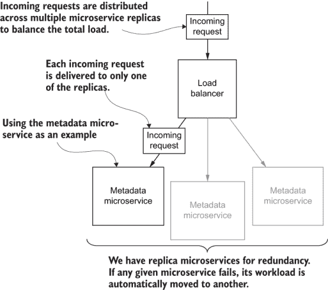

图 10.14 负载均衡器将传入请求分配到多个冗余的微服务实例。

冗余是通过**复制**实现的。我们也会使用复制来提高性能，但我们会留到第十一章再讨论。

虽然我们的系统可以处理故障，但这并不意味着我们应该容忍这些故障。所有故障都应该被记录下来，并在之后进行调查。我们可以使用第 10.3 节中的调试过程来找到并修复故障的原因。

在 Kubernetes 中实现复制

到目前为止，我们为 FlixTube 部署的所有微服务（在第七章和第九章中）都只有一个实例。当创建一个用于学习的应用程序（就像我们用 FlixTube 做的那样）或者你处于开发自己的微服务应用程序的初期阶段时，这是完全可以接受的。但这并不像它本可以做到的那样具有容错性。

这很容易解决，因为 Kubernetes 让我们很容易创建副本。令人惊讶的是，这和更改我们已编写的 Terraform 代码中的一个字段的值一样简单——这就是**基础设施即代码**的力量。

我们可以通过设置 Kubernetes 部署中 `replicas` 属性的值来轻松更改副本的数量。您可以在列表 10.2 中看到这个例子，这是对第九章中 Terraform 代码的更新。

副本数量已从 1 更新到 3。我们可以通过运行 `terraform apply` 来应用这个更改。一旦完成，我们的所有微服务都将拥有三个冗余实例。通过这个小小的改变，我们极大地提高了应用程序的可靠性和容错性！

我们副本的负载均衡器是由列表 10.2 末尾定义的 Kubernetes 服务创建的。在处理第七章和第九章时，我们始终为我们的微服务提供了一个负载均衡器，但它只将负载分配给单个微服务！通过列表中我们做出的更改，现在负载正在三个实例之间分配给每个微服务。

列表 10.2 在 Kubernetes 上创建负载均衡的微服务副本（对第九章示例 1 的脚本 modules/microservice/main.tf 的更新）

```
resource "kubernetes_deployment" 
➥ "service_deployment" {                        ①
    depends_on = [ null_resource.docker_push ]
    metadata {
        name = var.service_name
        labels = {
            pod = var.service_name
        }
    }
    spec {
        replicas = 3                             ②
        selector {
            match_labels = {
                pod = var.service_name
            }
        }
        template {
            metadata {
                labels = {
                    pod = var.service_name
                }
            }
            spec {
                container {
                    image = local.image_tag
                    name  = var.service_name
                    env {
                        name = "PORT"
                        value = "80"
                    }
               }
            }
        }
    }
} 
resource "kubernetes_service" "service" {
    metadata {
        name = var.dns_name
    }
    spec {
        selector = {
            pod = kubernetes_deployment.service_deployment
            ➥ .metadata[0].labels.pod
        }   
        session_affinity = var.session_affinity
        port {
            port        = 80
            target_port = 80
        }
        type = var.service_type
    }
}
```

① 配置每个微服务的 Kubernetes 部署

② 将副本数量设置为 3。再次运行“terraform apply”将创建每个微服务的三个副本。

### 10.4.5 故障隔离和优雅降级

微服务真正擅长的一件事是故障隔离。然而，我们必须小心一些，以便能够利用这一点。我们的目标是使集群内部的问题得到隔离，以便它们对用户的影响最小化。

在适当机制到位的情况下，我们的应用程序可以优雅地处理故障，并防止这些故障在前端表现为问题。我们需要的工具包括超时、重试、断路器和防波堤，这些将在以下章节中描述。

例如，让我们考虑视频上传微服务。想象一下，它出了问题，不再可用。在这个时候，我们正在努力纠正这种情况，并迅速将其恢复到工作状态。与此同时，我们的客户希望继续使用我们的产品。如果我们没有预防机制，错误可能会一直传播到前端，导致我们的服务中断，严重扰乱我们的客户。

相反，我们应该实施保护措施，防止这种对用户群体的全面破坏。这如图 10.15 所示。图的上半部分显示了错误一直传播到用户并给他们带来问题。图 10.15 的下半部分显示了它应该如何工作：网关阻止错误传播，从而在集群内限制故障。

然后，我们可以通过向用户显示错误消息来处理这种情况，说明视频上传功能目前不可用。视频上传可能已损坏，但我们的用户可以继续使用应用程序的其他部分。

这就是微服务带来的巨大好处。如果我们使用单体应用，并且其中一个组件（例如，视频上传组件）损坏，通常会导致整个单体崩溃，让我们的客户一无所有。然而，使用微服务，故障可以被隔离，整个应用程序可以继续运行，尽管是降级状态。

这种故障隔离的想法通常被称为*防波堤模式*，之所以这样命名，是因为它在概念上与大型船舶中实际使用的防波堤相似。当船舶发生泄漏时，是防波堤阻止泄漏逃逸到其他舱室，并最终导致船舶沉没。这是现实世界中的故障隔离，你可以看到它如何与微服务应用程序相似。

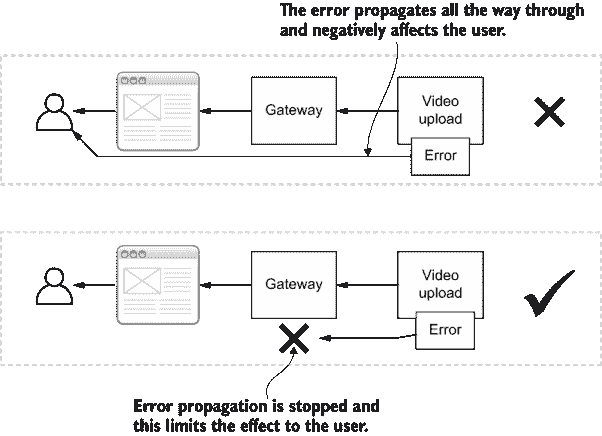

图 10.15 集群内隔离故障于用户

### 10.4.6 容错简单技术

这里有一些简单的技术，您可以立即开始使用，以在您自己的微服务应用程序中实现容错和故障隔离。

超时

在这本书中，我们使用了内置的 Node.js `http.request`函数和 Axios 代码库来在微服务之间进行内部 HTTP 请求。我们控制自己的微服务，大多数时候我们知道它们会快速响应集群内部的请求。然而，有时问题会显现出来，一个内部微服务停止响应。

在未来，我们还想向外部服务发起请求。想象一下，我们将 FlixTube 与 Dropbox 集成，作为导入新视频的手段。当我们向类似 Dropbox 这样的外部服务发起请求时，我们无法控制这些服务对请求的响应速度。这样的外部服务偶尔会因维护而关闭，因此，外部服务如 Dropbox 间歇性地停止响应我们的请求是完全可能的。

我们必须考虑如何处理不响应的服务请求。如果请求在短时间内无法完成，我们希望在经过一定最大时间后将其终止。如果我们不这样做，请求可能需要很长时间（如果有的话）才能完成。我们实在无法让我们的客户等待那么久！我们宁愿快速终止请求，并告诉客户出了些问题，而不是让他们无限期地等待。

我们可以使用 *超时* 来处理这个问题。超时是在请求自动因错误代码被终止之前可以经过的最大时间。为我们的请求设置超时允许我们控制我们的应用程序对失败的反应速度。快速失败是我们想要的，因为另一种选择是缓慢失败，如果某件事要失败，我们希望尽可能快地处理它，以免浪费客户的时间。

使用 Axios 设置超时

阅读 Axios 文档告诉我，默认超时是无限大！这意味着默认情况下，Axios 请求可以无限期地进行而不会被终止。我们绝对需要为任何使用 Axios 发起的请求设置超时。

你可以为每个请求设置超时，但这需要重复的努力。幸运的是，使用 Axios，我们可以为所有请求设置默认超时，如下面的列表所示。

列表 10.3 使用 Axios 设置 HTTP 请求的默认超时时间

```
const axios = require("axios");
axios.defaults.timeout = 2500;        ①
```

① 将请求的默认超时设置为 2500 毫秒或 2.5 秒

重试

我们知道 HTTP 请求有时会失败。我们无法控制外部服务，也无法看到那些服务的代码。对我们来说，很难确定这些服务的可靠性，即使是可靠性最高的服务也可能会有间歇性故障。

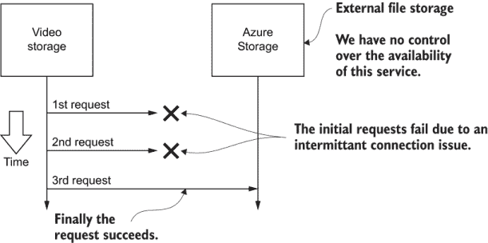

图 10.16 重试 HTTP 请求直到成功

处理这个问题的一个简单方法是在多次尝试中简单地重试操作，并希望它在后续尝试中成功。这如图 10.16 所示。在这个例子中，你可以想象 FlixTube 的视频存储微服务请求从 Azure 存储检索视频。由于不可确定的原因，此类请求偶尔会失败。在图 10.16 中，连续两次请求因间歇性连接错误而失败，但第三次请求成功。

假设网络是可靠的，这是分布式计算中的一个谬误，我们必须采取措施来减轻请求失败的影响。在 JavaScript 中的实现并不特别困难。在列表 10.4 中，你可以看到我已在多个项目中使用的一个`retry`函数的实现。`retry`函数包装了其他异步操作，如 HTTP 请求，这样就可以尝试多次。

列表 10.4 还包括了一个有用的`sleep`函数，用于在尝试之间创建暂停。立即再次尝试请求是没有意义的。如果我们做得太快，它很可能会再次失败。在这种情况下，我们在再次尝试之前给它一些时间。

列表 10.5 展示了如何调用`retry`函数，展示了它如何包装 HTTP GET 请求。在这个例子中，我们允许请求重试三次，每次请求之间暂停 5 毫秒。

列表 10.4 JavaScript 中重试函数的实现

```
async function sleep(timeMS) {                          ①
    return new Promise((resolve, reject) => {           ②
        setTimeout(                                     ③
            () => { resolve(); },                       ④
            timeMS                                      ⑤
        );
    });                                                 ②
}
async function retry(operation, maxAttempts, 
➥ waitTimeMS) {                                        ⑥
    while (maxAttempts-- > 0) {                         ⑦
        try {
            const result = await operation();           ⑧
            return result;                              ⑨
        }
        catch (err) {                                   ⑩
            lastError = err;                            ⑪
            if (maxAttempts >= 1) {
                await sleep(waitTimeMS);                ⑫
            }
        }
    }

    throw lastError;                                    ⑬
}
```

① 定义了一个“sleep”函数，可用于在重试之间暂停

② 在 Promise 中包装对“setTimeout”的调用，以便我们等待暂停完成

③ 在经过一段时间后调用回调

④ 回调解决 Promise。

⑤ 设置暂停的持续时间

⑥ 定义了一个“重试”函数，我们可以用它来对任何异步操作进行多次尝试

⑦ 循环直到达到最大重试次数

⑧ 尝试实际异步操作

⑨ 操作成功！这会跳出循环并返回异步操作的结果。

⑩ 处理异步操作抛出的任何错误

⑪ 记录最近尝试中的错误

⑫ 在下一次尝试之前暂停片刻（只要我们不是最后一次尝试）

⑬ 抛出最后一次尝试的错误。我们已经用完了重试次数，所以我们必须让错误冒泡到调用者。

列表 10.5 使用重试函数（示例）

```
await retry(                                           ①
    () => axios.get("https://something/something”),    ②
    3,                                                 ③
    5                                                  ④
);
```

① 调用我们的“retry”函数

② 要重试的操作；在这个例子中，它是一个使用 Axios 的 HTTP GET 请求。

③ 将最大尝试次数设置为三次

④ 将重试之间的时间设置为五毫秒

### 10.4.7 容错的高级技术

我们已经看到了一些提高我们应用程序可靠性和弹性的简单技术。当然，还有许多其他更高级的技术我们可以部署来提高容错性和从失败中恢复。

我们几乎超出了本书的范围，但我仍然想与你分享一些更高级技术的简要概述。这些技术在你为应用程序构建更健壮的架构时将非常有用。

工作队列

*工作队列*是许多应用程序架构中找到的一种微服务。这与我们在 RabbitMQ 中看到的消息队列是不同的事物。它很相似，但它的复杂度更高。

我们使用工作队列来管理重量级处理任务。让我们想象一下 FlixTube 未来版本的工作方式。我们可以这样说，每个视频在上传后都需要大量的处理。例如，我们希望从视频中提取缩略图。或者，也许我们希望将视频转换为较低分辨率，以便在移动设备上更好地播放性能。这些是在视频上传后应该发生的任务类型。

现在想象一下，1,000 个用户几乎同时上传了视频。我们还没有任何弹性扩展（我们将在第十一章中讨论）。那么，我们如何管理这么多视频同时进入 FlixTube 产生的巨大处理工作负载呢？这就是工作队列的作用。您可以在图 10.17 中看到其工作原理的示意图。

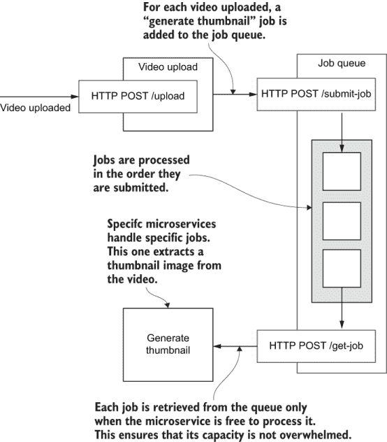

图 10.17 一个工作队列微服务管理着视频缩略图生成作业的队列。

工作队列将需要执行的任务序列记录到数据库中。这使得它对故障具有弹性。整个应用程序可能会崩溃并重新启动，但只要数据库存活，我们就可以重新加载工作队列并继续处理之前中断的地方。个别任务也可能失败；例如，执行处理的微服务崩溃了，但由于失败的任务没有被标记为完成，它们会自然地在稍后再次尝试。

工作队列还允许控制此处理性能。我们不必一次性将应用程序性能最大化来处理 1,000 个上传的视频，我们可以将负载分散，以便在更长的时间段内进行调度。它也可以在非高峰时段进行调度。这意味着我们不必为可能需要的额外计算能力付费，如果我们想一次性在大量爆发中进行处理的话。

电路断路器

*电路断路器*类似于超时的更高级版本。它有一些内置的智能来理解何时出现问题，以便更智能地处理这些问题。图 10.18 说明了电路断路器的工作原理。

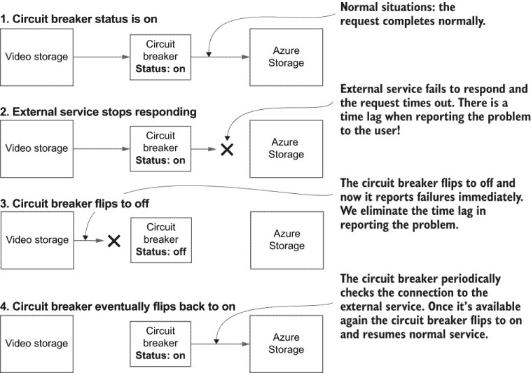

图 10.18 电路断路器工作原理示意图

在正常情况下，电路断路器的状态设置为开启，并允许 HTTP 请求像往常一样通过（1）。如果在某个时刻对特定资源的请求失败（2），电路断路器将切换到关闭状态（3）。在关闭状态下，电路断路器总是立即拒绝新的请求。

将其视为一个“超级”超时。电路断路器知道上游系统目前正在失败，因此它甚至懒得检查。它立即拒绝传入的请求！

快速失败是我们使用超时的原因。快速失败比缓慢失败要好。电路断路器通过已经知道我们正在失败，因此，它不仅可以更快地失败，而且可以立即失败。

定期地，在它自己的时间（你可以配置延迟），断路器会检查上游服务是否已恢复正常操作。当这种情况发生时，断路器会切换回开启状态（4）。未来的入站请求现在可以正常通过。实现断路器比实现超时或重试要困难得多，但值得记住以备将来使用，特别是如果你发现自己需要更复杂的技术。

## 10.5 继续你的学习

你现在工具箱里有很多技术来保持你的微服务健康和可靠！要了解更多关于构建可靠微服务的信息，Manning 出版了一些关于微服务稳定性的免费章节，这些章节来自 Morgan Bruce 和 Paulo A. Pereira 的书籍 *Microservices in Action*（2018 年）以及 Richard Rodger 的 *The Tao of Microservices*（2017 年）。你可以在以下链接找到这些内容：

+   [`www.manning.com/books/microservices-stability`](https://www.manning.com/books/microservices-stability)

此外，还有一本关于如何对应用程序进行*崩溃测试*的精彩书籍：

+   *Chaos Engineering* by Mikolaj Pawlikowski (Manning, 2020)

要了解更多关于生产中的日志记录和监控的信息，请阅读以下书籍：

+   *Unified Logging with Fluentd* by *Phil Wilkins (Manning, est Summer 2020)*

+   *Elasticsearch in Action* by *Radu Gheorghe, Matthew Lee Hinman, and Roy Russo (Manning, 2015)*

## 摘要

+   Logging and error handling outputs key information used to understand the behavior and state of our microservices.

+   监控是确定我们的微服务健康状况和检测问题的关键。

+   Aggregation combines the output of all our microservices into a single easily accessible stream of information.

+   Kubernetes 健康检查可以用来自动检测我们的微服务中的问题。

+   当检测到问题时，我们必须通过调试过程来找出问题的原因，并确定适当的修复方案。

+   确保我们的微服务可靠性和容错性的技术有很多，包括副本和负载均衡、自动重启、超时、重试、作业队列和断路器。
