# 11 条通往可扩展性的路径

本章涵盖

+   将微服务扩展到更大的开发团队

+   将微服务扩展以满足不断增长的需求

+   理解基本的安全问题

+   将单体转换为微服务的策略

+   在预算内使用微服务的技巧

我们整本书都在致力于构建生产级的微服务应用程序，那么接下来呢？是时候看看微服务在未来能为我们提供什么了。

在整本书中，我们采取了许多捷径，帮助我们快速、低成本地开始使用微服务。这些捷径使学习微服务和启动我们初出茅庐的应用程序变得更加简单。尽管 FlixTube 是一个使用相对简单的过程构建的简单应用程序，但我们仍在使用微服务，这是一种提供许多通往未来可扩展性的路径的架构。

在本章中，我们讨论如何管理不断增长的微服务应用程序。我们如何扩大到更大的开发团队？我们如何扩大以满足不断增长的客户需求？我们还需要讨论基本的安全问题以及它们如何与微服务相关。然后，我们将简要介绍将现有单体应用程序转换为微服务所需的内容。

我们将通过重申可以使启动微服务应用程序更简单、更轻松、更便宜的技术来结束本书。这是对小团队、初创公司或独立开发者启动自己的微服务应用程序同时仍拥有充满扩展可能性的未来的实用建议！

## 11.1 我们的未来是可扩展的

微服务为我们提供了许多通往可扩展产品的路径。在本章中，我们将探讨我们必须采取哪些措施来扩展我们的应用程序和工作流程，以便围绕不断增长的应用程序扩大我们的开发团队。我们将通过探讨如何扩展应用程序的性能以实现更大的容量和吞吐量来跟进。

你可能现在还不需要这些技术；只有当你的应用程序足够大，需要扩大你的开发团队时，或者当你的客户群增加，你需要为了更好的性能而进行扩展时，你才需要这些技术。

我们正在进入一个非常高级的领域，本章主要为你提供未来如何扩展应用程序的方法的初步了解。这仅仅是冰山一角；但足以让你对未来的道路有所认识。

本章我们将解决的问题都是好问题。如果你到了必须扩展的地步，那是一件好事。这意味着你的业务是成功的。这意味着你有一个不断增长的客户群。在这个时候，你可以非常高兴地选择微服务架构，因为它使扩展变得更加直接。

本章的目的不是实际操作。将其视为一些洞察，了解您的微服务之旅未来可能走向何方。话虽如此，许多这些技术相当容易尝试，但在尝试的过程中，您可能会犯错误并无意中破坏您的应用程序集群。

不要在生产基础设施上尝试任何这些，这些基础设施是现有员工或客户所依赖的。但请随意回到第九章，并遵循那里的说明来启动 FlixTube 的新生产实例。您可以使用它进行实验。这为您提供了一个风险免费的方式来尝试本章中听起来有趣的内容。

## 11.2 扩展开发流程

首先，让我们解决扩展我们的开发流程的问题。到目前为止，在这本书中，我们已经从单个开发者在小微服务应用程序上工作的角度体验了开发流程和生产工作流程。现在，让我们将我们的关注点提升到团队的水平。我们迄今为止使用的简单流程实际上对于一个小团队来说可以起到一定作用：

+   在单一代码库上工作的开发者，在他们的开发工作站上编写和测试代码

+   开发者将代码更改推送到托管代码仓库，这会触发持续交付（CD）管道将应用程序部署到生产环境

这个简单的流程是开始构建新应用程序并快速推进的绝佳方式。但我们的初步开发流程存在以下问题：

+   *我们不希望代码直接从开发者流向客户。* 我们希望我们的开发者能够在类似生产环境的环境中测试他们的代码，但我们希望“正在进行的工作”能够从客户那里缓冲，以确保在将其施加于他们之前它能够良好运行。

+   *我们不希望开发者相互干扰。* 随着我们开发团队的扩大，在单一代码库中工作的开发者将更频繁地相互干扰（例如，导致合并冲突和破坏构建）。

+   *我们的单一代码仓库和 CD 管道不可扩展。* 为了管理我们不断增长的应用程序的复杂性，我们必须将其拆分，即使应用程序可能变得极其复杂，每个单独的微服务仍然保持小型、简单且易于管理。

为了构建一个可扩展的开发流程，扩展到多个团队，并充分利用微服务，我们必须进行一些重组。

### 11.2.1 多个团队

随着我们应用的发展，我们将添加更多的微服务来实现功能并扩展应用程序的能力。随着工作量的增长，我们也需要扩大团队来处理它。在某个时候，当我们的单个团队变得太大时，我们需要将其拆分为多个团队。这使我们的团队保持小型化，并使我们能够从小型团队带来的沟通和组织优势中受益。

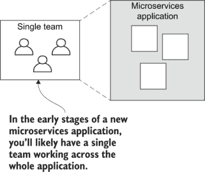

图 11.1 当启动一个新应用程序时，它应该足够小，以至于一个团队可以自己管理所有微服务。

基于微服务的应用程序提供了自然缝隙，可以用来分割应用程序，供多个团队进行开发。图 11.1 展示了我们在开发早期阶段，使用简单开发过程时的团队结构。


图 11.2 随着我们的应用程序不断增长，开发工作可以分割，以便不同的团队管理独立的微服务或微服务组。

图 11.2 展示了我们在增长并分割成不同团队后的结构可能看起来是什么样子。我们将应用程序分割，使每个团队负责一组不同的微服务，且没有重叠。这有助于阻止团队之间相互干扰。现在，我们可以通过在微服务边界上分割应用程序来将我们的团队规模扩大到任何我们想要的规模。

每个团队*拥有*一个或多个微服务，通常，他们负责自己的微服务——从编码、测试，到生产。团队通常负责其微服务的运营需求，保持这些微服务在线、健康和高效。

当然，有许多方法可以实现这一点，任何两家公司的团队结构和开发过程在细节上都会有所不同。但是，这种组织自给自足团队的方法是*可扩展的*。这意味着我们可以在一个巨大的应用程序周围发展一个庞大的公司，同时仍然有一个有效的开发过程。

### 11.2.2 独立微服务

到目前为止，我们开发的 FlixTube 应用程序生活在单个代码仓库中，并有一个单一的 CD 流水线。您可以在图 11.3 中看到这是怎样的情况。

在处理任何新的微服务项目时，使用所谓的*单*（单体）仓库（单代码仓库）是一个很好的开始方式。它使启动过程更简单、更容易，我们将花费更少的时间来创建和维护我们的*开发基础设施*（支持我们的开发过程的基础设施）。

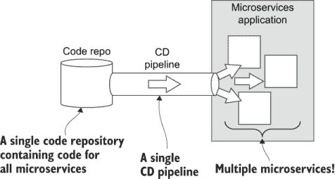

图 11.3 当启动一个新的微服务应用程序时，对于整个应用程序来说，拥有一个单一的代码仓库和一个单一的 CD 流水线会更简单。

拥有一个单代码仓库和单一的 CD 流水线在开始时会使事情变得简单，但不幸的是，它消除了使用微服务的主要好处。拥有单个仓库和 CD 流水线意味着我们必须同步发布所有微服务！实际上，我们没有能力独立发布微服务的更新！这意味着每次部署，我们都可能破坏整个应用程序！这种情况并不比单体架构更好！我们的部署过程是*单体的*！

你可能还记得，在第一章的开头，我们实际上将微服务定义为*一个拥有自己独立部署计划的独立软件过程*（参见 1.5 节）。我们还没有真正实现这一点，为了从使用微服务中获得最大好处，我们真的需要使它们具有独立的部署能力。这种样子在图 11.4 中有说明。

拥有单独的代码仓库和多个 CD 管道允许我们对部署有更细粒度的控制。如果我们能够逐个独立更新我们的微服务，那么我们的部署风险就会大大降低。我们不必每次部署都冒着破坏整个应用的风险，我们只冒着破坏单个微服务的风险。

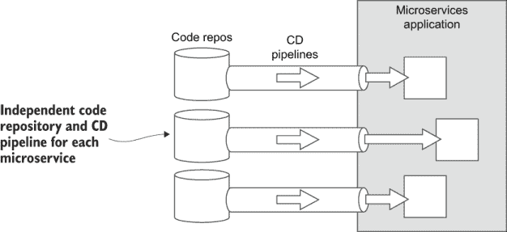

图 11.4 随着我们应用的增长，我们需要将我们的微服务拆分到单独的代码仓库和 CD 管道中，以获得独立部署的微服务带来的好处。

如果将转换到多个仓库和 CD 管道看作是一项巨大的工作量并且增加了太多的额外复杂性，我完全理解你的感受！事实上，我会争辩说，这一件事是导致通常归因于微服务的感知复杂性的主要原因。

在这一点上，我想再次强调，拥有一个单仓库和单一持续交付（CD）管道*仍然是开始任何新的微服务应用的不错方式*。它使得在开发的早期阶段事情保持简单。一旦你转换到多个代码仓库和多个 CD 管道，管理和维护就会变得更加复杂，至少在应用层面是这样。这仅仅是随着发展而来的。

尽管我们的整体应用最终会变得极其复杂（这对现代企业应用来说是不可避免的），如果我们能够将我们的视角降低到单个微服务，画面看起来就完全不同了。事情突然看起来简单多了。因为复杂性是逐渐增加的，所以它更容易管理。而且，通过关注单个微服务（它们是简单的）而不是关注整个应用（注定是复杂的），应用的整体复杂性影响就会小得多。

这正是解决微服务应用复杂性的关键。单个微服务是一个微小且易于理解的程序，拥有较小的代码库。它有一个相对简单的部署过程。每个微服务都很简单，易于管理，尽管它们一起构建出强大而复杂的程序。从复杂的应用程序到简单的微服务的这种视角转变对于管理复杂性非常重要。

将我们的开发过程分割成微服务大小的块增加了一些额外的复杂性，但与我们的应用程序最终可能变得多么复杂相比，这微不足道。通过将我们的关注点从整个应用程序的复杂性转向单个微服务，我们实际上已经让我们的应用程序能够扩展到真正巨大的规模，即使每个微服务仍然像以前一样简单易用。

然而，不要过于热衷于将这种变更应用于可独立部署的微服务。如果你过早地做出这种变更，可能会发现你正在为过渡的成本买单，而此时还太早从中获益。你不想在能够利用好处之前就支付成本。

良好的软件开发完全是关于做出良好的权衡。只要这对你有意义，就坚持使用单仓库和单个 CD 管道。但请注意，这并不是应该的方式。随着你的应用程序变得更加复杂，以及随着你团队的扩大，这种简单的方法最终会崩溃。最终会有一个时刻，分割我们的部署管道对于扩展规模是必要的，同时保持一个高效的开发过程。

### 11.2.3 分割代码仓库

我们的首要任务是分割我们的单仓库（monorepo）成多个代码仓库，以便为每个微服务拥有一个明确且独立的仓库。每个新的仓库将包含单个微服务的代码以及部署到生产环境的代码。

我们还需要一个独立的代码仓库来存放创建我们基础设施的 Terraform 代码。这是创建我们的容器注册库和 Kubernetes 集群的代码。这段代码不属于任何特定的微服务，因此它需要一个自己的代码仓库。

图 11.5 说明了我们如何将第九章的 FlixTube 项目拆分成多个代码仓库。为了构建每个新的仓库，我们调用`git init`来创建一个空仓库，然后将代码复制到新仓库并提交。否则，我们可能需要采取额外的步骤来保留我们的现有版本历史（见下文边栏）。

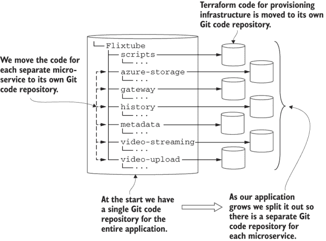

图 11.5 当我们分割我们的仓库时，每个微服务的子目录成为它自己的独立 Git 仓库。

保留版本历史

在从旧仓库创建新的代码仓库时，我们可以使用带有`--subdirectory-filter`参数的`git filter-branch`命令来保存我们的现有版本历史。要这样做，请参阅 Git 文档以获取详细信息：

[`git-scm.com/docs/git-filter-branch`](https://git-scm.com/docs/git-filter-branch)

你也可以在网上搜索“filter-branch”的例子——有很多！

### 11.2.4 分割持续交付（CD）管道

将我们的 monorepo 拆分开来相对容易。同时，我们还必须拆分我们的单体 CD 流水线，这是一个更困难的任务。我们现在需要为每个微服务创建一个单独的部署流水线。

幸运的是，我们可以创建一个单独的微服务部署流水线，然后为每个微服务重复使用它（如果需要，对每个微服务的定制需求进行少量修改）。我们的每个微服务的 CD 流水线将独立部署单个微服务，当更新后的代码推送到微服务的托管代码仓库时，会自动触发。图 11.6 说明了这个过程。

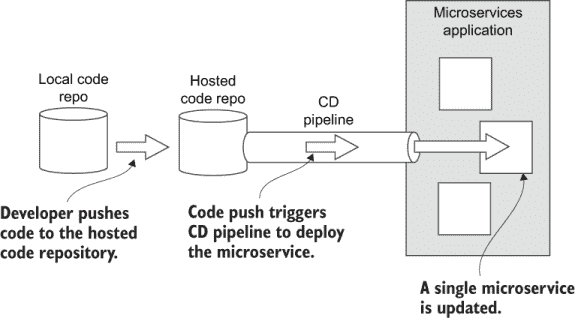

图 11.6 将代码推送到微服务的托管代码仓库会触发 CD 流水线，部署单个微服务。

单个微服务的 Terraform 部署代码类似于我们在第九章中看到的代码；实际上，它是该代码的简化版本。我们可以使用类似于我们在第六章和第七章中使用的迭代过程来开发这个 Terraform 代码。一旦我们确信部署流水线对单个微服务有效，我们就可以将其复制到每个微服务的代码仓库中——每个微服务的代码通过名称参数化。

每个代码仓库都需要启用并配置其流水线。如果您像我们在第七章和第九章中做的那样使用 Bitbucket Pipelines 进行持续交付（CD），您可以为每个仓库启用它，如 7.7.2 节中所示。然后，您必须为每个仓库添加一个单独的配置文件，如图 11.7 所示。

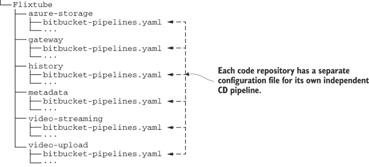

图 11.7 每个微服务的代码仓库都有自己的持续交付（CD）配置。

从 Terraform 中提取 Docker 构建

在这一点上，我们可以回顾我们如何进行 Docker 构建。我们现在能够从 Terraform 代码中提取这些。如果您还记得第七章，我们通过在 Terraform 中执行整个部署过程来简化了事情。

实际上，这并不完全正确；我当时没有提到，但由于我们最初在 Terraform 中创建所有基础设施，所以这样做是必要的解决方案。这包括创建我们的容器注册库。如果我们尝试从 Terraform 中提取 Docker，我们会发现第一次部署时，我们无法将镜像推送到容器注册库，因为它尚未创建！

这种“进退两难”的情况并没有因为 Terraform 的 Docker 提供者不支持构建和发布 Docker 镜像（真的，它应该升级以正确支持这一点）而得到改善。这就是我们被迫在 Terraform 中使用`local-exec`和`null_resource`作为一种丑陋的解决方案的原因（有关提醒，请参阅 7.6.2 节）。

然而，现在情况不同了。我们已经将 Terraform 代码分离到多个仓库中，并且我们的基础设施代码已经与微服务代码分离。在创建基础设施和部署微服务之间，我们可以通过在持续交付（CD）管道中直接调用 Docker（使用我们在第三章中学到的`build`和`push`命令）来简单地构建和发布 Docker 镜像。

我们可以创建一个单独的配置，然后将其作为每个微服务的模板重复使用。我们的“单个微服务”配置（Bitbucket Pipelines）在列表 11.1 中展示。在这个部署过程中，我们有两个步骤。第一步直接使用 Docker 构建和发布微服务的镜像。第二步使用 Terraform 将微服务部署到我们的 Kubernetes 集群。

列表 11.1 单个微服务的 Bitbucket Pipelines 配置文件（bitbucket-pipelines.yaml）

```
image: hashicorp/terraform:0.12.29                                    ①
pipelines:
  default:
      - step:                                                         ②
          name: Build microservice
          services:
            - docker                                                  ③
          script:
            - export NAME=$BITBUCKET_REPO_SLUG                        ④
            - export VERSION=$BITBUCKET_BUILD_NUMBER                  ⑤
            - export IMAGE=
            ➥ $DOCKER_REGISTRY/$NAME:$VERSION                        ⑥
            - docker build -t $IMAGE 
            ➥-file ./Dockerfile-prod .                               ⑦
            - docker login $DOCKER_REGISTRY --username $DOCKER_UN 
            ➥-password $DOCKER_PW                                    ⑧
            - docker push $IMAGE                                      ⑨

      - step:                                                         ⑩
          name: Deploy to cluster
          deployment: production                                      ⑪
          script:
            - export NAME=$BITBUCKET_REPO_SLUG                        ⑫
            - export VERSION=$BITBUCKET_BUILD_NUMBER                  ⑫
            - export IMAGE=$DOCKER_REGISTRY/                          ⑫
            ➥ $NAME:$VERSION                                         ⑫
            - chmod +x ./scripts/deploy.sh
            - ./scripts/deploy.sh                                     ⑬
```

① 将基础镜像设置为 Terraform，这样我们就可以在 CD 管道中使用 Terraform

② 第 1 步：构建并发布微服务的 Docker 微服务

③ 启用在 CD 管道中使用 Docker

④ 使用代码仓库的名称作为微服务的名称

⑤ 使用构建号作为 Docker 镜像的版本号

⑥ 从微服务的名称和版本中组合镜像名称

⑦ 构建 Docker 镜像的生产版本

⑧ 登录到我们的私有容器注册库

⑨ 将新的 Docker 镜像推送到容器注册库

⑩ 第 2 步：将更新的微服务部署到 Kubernetes 集群

⑪ 跟踪当前部署到生产环境的内容（你可以在 Bitbucket Pipelines 仪表板中查看已部署的内容）。

⑫ 环境变量必须复制到每个步骤。

⑬ 执行部署 shell 脚本，并使用 Terraform 部署微服务

### 11.2.5 元仓库

使用独立的代码仓库让你感到沮丧吗？你是否怀念通过单个代码仓库管理应用程序的简单日子？好吧，这里有一些好消息。

我们可以创建一个*元仓库*，将所有独立的仓库组合成一个单一的聚合代码仓库。你可以将元仓库视为一种虚拟代码仓库。这意味着我们可以在不牺牲独立仓库的灵活性和独立性的情况下，找回一些单仓库的简单性和便利性。要创建元仓库，我们需要 meta 工具，可在以下位置获取：

+   [`github.com/mateodelnorte/meta`](https://github.com/mateodelnorte/meta)

通过创建一个包含多个独立仓库列表的.meta 配置文件来配置元仓库。请参见图 11.8，了解.meta 文件在 FlixTube 项目中的位置示例。列表 11.2 显示了该文件的结构。

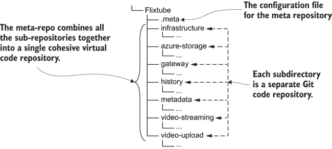

图 11.8 .meta 配置文件将独立的仓库组合成一个元仓库。

列表 11.2 配置 FlixTube 的 meta 代码仓库 (.meta)

```
{
  "projects": {                                                            ①
    "gateway": "git@bitbucket.org:bootstrappingmicroservices/gateway.git", ①
    "azure-storage": "git@bitbucket.org:bootstrappingmicroservices/        ①
    ➥ azure-storage.git",                                                 ①
    "video-streaming": "git@bitbucket.org:bootstrappingmicroservices/      ①
    ➥ video-streaming.git",                                               ①
    "video-upload": "git@bitbucket.org:bootstrappingmicroservices/         ①
    ➥ video-upload.git",                                                  ①
    "history": "git@bitbucket.org:bootstrappingmicroservices/history.git"  ①
    "metadata": "git@bitbucket.org:bootstrappingmicroservices/             ①
    ➥ metadata.git",                                                      ①
  }                                                                        ①
}L
```

① 列出构成此 meta-repo 的独立代码仓库

注意：在列表中，代码仓库链接指向 Bitbucket 代码仓库，但它们同样可以指向 GitHub 仓库或链接到我们托管代码仓库的任何其他地方。

使用 meta 允许我们运行影响整个仓库集合的单个 Git 命令。例如，假设我们想一次性拉取 FlixTube 项目下所有微服务的代码更改。我们可以使用 meta 通过单个命令来完成：

```
meta git pull
```

我们仍在使用独立的代码仓库，但 meta 允许我们同时对多个代码仓库执行命令，这样感觉就像我们又回到了使用单仓库的工作方式。

Meta 为我们提供了很多额外的灵活性。我们可以用它来创建自己的自定义微服务集合。作为一个大型团队的开发者，你可以创建一个仅针对你通常工作的微服务集合的 meta-repo。其他开发者可以拥有他们自己的独立 meta-repos。你可能甚至喜欢创建多个 meta-repos，这样你可以轻松地在不同的微服务集合之间切换，这取决于你目前正在做什么。

作为团队领导，你可以为应用程序的不同配置创建独立的 meta-repos，每个配置都有自己的 Docker Compose 文件。这使得团队成员克隆完整的微服务集合的代码变得容易。然后他们可以使用 Docker Compose 启动该应用程序配置。这是为团队成员提供一个“即时”且可管理的开发环境的一种极好方式！

### 11.2.6 创建多个环境

随着我们为应用程序获得客户，确保他们免受持续进行的“工作进行中”的问题的影响或保护他们免受部分完成或仅部分测试的新功能变得非常重要。开发团队需要一个类似生产环境的环境来测试他们的代码，在将其展示给客户之前。

每个开发者必须在他们的开发工作站上测试他们的代码，但这还不够。他们还必须在代码与其他开发者的更改集成后测试他们的代码。为了使其尽可能“真实”，这种测试应该在类似生产的环境中完成——只是不是我们的客户正在使用的那一个！

我们需要一个工作流程，让我们的开发者在从开发工作站，通过集成环境，进入测试环境，最终，一旦所有测试都通过，进入面向客户的环境之前，将他们的更改传递。尽管没有两家公司的流程完全相同，但你可以在图 11.9 中看到典型工作流程的样子。

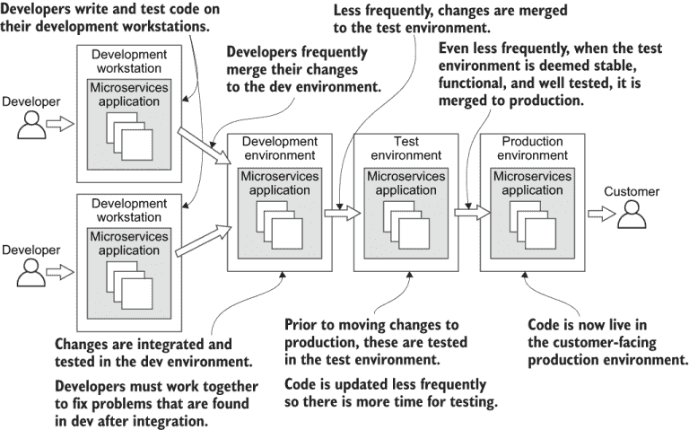

图 11.9 在进入生产之前，通过开发和测试环境推进代码更改

设置多个环境实际上很简单，我们已经在第九章中展示的现有 Terraform 代码中拥有了大部分所需内容。我们已经在代码中通过 `app_name` 变量进行了参数化，我们使用这个变量根据我们为其指定的名称创建单独的应用程序资源（回顾第 6.10 节，我们首次添加了这个变量）。

我们现在可以在调用 Terraform 创建 FlixTube 的不同实例（用于测试和生产）时使用 `app_name`（从命令行设置）。我们只需为每个实例提供不同的名称。例如，我们可以将 `app_name` 设置为 `flixtube-development`、`flixtube-test` 或 `flixtube-production` 以创建我们各自的环境。

尽管如此，我们还可以在列表 11.3 中进行改进。通过引入一个名为 `environment` 的新变量，我们可以使创建新环境变得更加简单。然后我们将 `app_name` 转换为一个依赖于 `environment` 值的计算本地变量。

列表 11.3 在 Terraform 中设置 `app_name` 本地变量为环境名称（对第九章示例-1/scripts/variables.tf 的更新）

```
variable "environment" {}                       ①
locals {
  app_name = "flixtube-${var.environment}"      ②
}
```

① 添加一个新的 Terraform 变量，指定当前环境。在通过命令行运行 Terraform 时，我们需要提供此变量，例如将其设置为开发、测试或生产。

② 创建一个名为“app_name”的本地变量，为每个环境构建应用程序的不同版本（例如，flixtube-development、flixtube-test 或 flixtube-production）。

引入这个新变量（`environment`）允许我们从命令行设置当前环境。列表 11.4 展示了如何从另一个名为 `ENVIRONMENT` 的变量中输入值。

我们可以使用相同的 Terraform 项目创建尽可能多的单独环境，所有这些环境都托管在同一个云账户中，但通过名称区分（例如，flixtube-development、flixtube-test 或 flixtube-production）。您可以使用此功能创建如图 11.9 所示的工作流程或更复杂的工作流程，具体取决于您的需求。

列表 11.4 更新后的部署脚本以设置环境（对第九章示例-1/scripts/deploy.sh 的更新）

```
cd ./scripts
terraform init 
terraform apply -auto-approve \
    -var "app_version=$VERSION" \
    -var "client_id=$ARM_CLIENT_ID" \
    -var "client_secret=$ARM_CLIENT_SECRET" \
    -var "environment=$ENVIRONMENT" \                    ①
    -var "storage_account_name=$STORAGE_ACCOUNT_NAME" \
    -var "storage_access_key=$STORAGE_ACCESS_KEY" \
```

① 通过环境名称参数化我们的 Terraform 代码。我们通过操作系统环境变量传递正在部署的环境的名称。

### 11.2.7 生产工作流程

我们现在可以创建多个环境，并使用它们来构建测试工作流程，以保护我们的客户免受损坏代码的影响。剩下的问题是，我们如何触发特定环境的部署？这比你想象的要简单。

我们可以在代码仓库中使用单独的分支来针对不同的环境进行部署。图 11.10 展示了这样一个示例设置。这是一个相当简单的分支策略，但在实际中还有更复杂的版本。


图 11.10 开发、测试和生产分支的代码自动部署到相应的环境。

我们的开发团队在开发分支上工作。当他们向该分支推送代码时，会触发一个 CD 流水线，将其部署到开发环境。这允许我们的整个团队在一个类似生产的环境中频繁地集成和测试他们的更改。

开发者应该多久推送一次代码更改？尽可能频繁！每天至少一次，如果可能的话，每天多次。代码合并之间的时间越短，由于冲突更改和不良集成引起的错误就越少。这就是*持续集成*背后的理念，这是一个支撑持续交付（CD）的重要实践。

不太频繁（比如每周一次），我们会从开发分支合并到测试分支。这会触发测试环境的部署。从开发到测试的代码合并频率较低，这给我们时间来测试、修复问题，并在将代码交给客户之前稳定代码。

最后，当测试分支中的代码准备就绪（比如每 1-2 周一次），我们就将其合并到生产分支。这样会将更新的微服务部署到生产环境，以便我们的客户能够使用我们添加的任何新特性和错误修复。

这个工作流程可以应用于是否包含自动化测试。它为测试提供了充足的空间，并允许管理者有意识地决定是否部署到生产环境。当然，自动化测试使这一切变得更好，并且更具可扩展性！如果在工作流程的任何点上自动化测试失败，则部署将自动不允许。当出现此类问题时，团队必须共同努力纠正情况。良好的自动化测试的加入意味着我们可以安全地提高我们的部署频率，达到许多现代公司每天部署到生产环境的程度。

如果我们使用 Bitbucket Pipelines，我们可以轻松地为每个分支配置单独的 CD 流水线，如列表 11.5 所示。这个版本的 bitbucket-pipelines.yaml 配置文件为每个分支包含单独的部分。每个部分基本上是相同的，但我们可以通过不同的环境变量来配置用于部署每个分支的生产环境。

列表 11.5 为每个分支配置单独的 CD 流水线（bitbucket-pipelines.yaml）

```
image: hashicorp/terraform:0.12.6
pipelines:
  branches:                                       ①
    development:                                  ②
      - step:
          name: Build microservice
          script:
            # ... Commands to build and publish the microservice ...
      - step:                                     ③
          name: Deploy cluster
          script:
            # ... Commands to deploy the microservice to the 
                   dev environment ...
    test:                                         ④
      - step:
          name: Build microservice
          script:
            # ... Commands to build and publish the microservice ...
      - step:                                     ⑤
          name: Deploy cluster
          script:
            # ... Commands to deploy the microservice to the 
                   test environment ...
    production:                                   ⑥
      - step:
          name: Build microservice
          script:
            # ... Commands to build and publish the microservice ...
      - step:                                     ⑦
          name: Deploy cluster 
          script:
            # ... Commands to deploy the microservice to the 
                   prod environment ...
```

① 为 Git 仓库中的每个分支创建单独的 CD 流水线

② 配置开发分支的流水线

③ 部署到开发环境

④ 配置测试分支的流水线

⑤ 部署到测试环境

⑥ 配置生产分支的流水线

⑦ 部署到生产环境

在实施这种多分支/多环境策略时需要注意的一点是，每个环境都需要其自己的独立 Terraform 状态。我们首先在第 7.7.4 节中配置了 Terraform 后端用于 CD。当时，我们在 Terraform 文件 backend.tf 中硬编码了与 Azure 存储的连接。现在我们必须改变这一点，以便我们可以从命令行设置存储配置。然后我们将为每个独立的环境进行更改。

首先，我们必须从我们的后端配置中移除`key`字段，如下所示。这个值需要根据环境的不同而变化，我们将将其设置为命令行参数而不是硬编码。

列表 11.6 配置 Terraform 状态的后端存储以支持多个环境（对第九章/example-1/scripts/backend.tf 的更新）

```
terraform {
    backend "azurerm" {                        ①
                                               ①
        resource_group_name  = "terraform"     ①
        storage_account_name = "terraform"     ①②
        container_name       = "terraform"     ①
                                               ①
    }                                          ①
}
```

① 配置后端与第七章中相同，但我们移除了“key”字段，我们现在为每个环境单独设置它。

② 您必须为您的存储账户选择一个不同的名称。这是一个全局唯一的名称，因此您无法选择 terraform。

现在，我们可以从命令行配置 Terraform 后端的`key`字段，如列表 11.7 所示。本质上，我们做的是告诉 Terraform 将其状态配置存储在文件中，该文件名根据当前部署的环境而不同。例如，它可以被称为跟踪开发环境状态的 terraform-development.tfstate 文件，以及其他两个环境的 terraform-test.tfstate 和 terraform-production.tfstate。

列表 11.7 更新后的部署脚本，根据环境设置后端配置（对第九章/example-1/scripts/deploy.sh 的更新）

```
cd ./scripts
terraform init \
    -backend-config=
    ➥ "key=terraform-${ENVIRONMENT}.tfstate"      ①
terraform apply -auto-approve \
    -var "app_version=$VERSION" \
    -var "client_id=$ARM_CLIENT_ID" \
    -var "client_secret=$ARM_CLIENT_SECRET" \
    -var "environment=$ENVIRONMENT" \
    -var "storage_account_name=$STORAGE_ACCOUNT_NAME" \
    -var "storage_access_key=$STORAGE_ACCESS_KEY" \
```

① 初始化当前部署环境的后端配置中的“key”字段

## 11.3 性能缩放

我们不仅可以将微服务应用程序扩展到更大的开发团队，还可以为了更好的性能而扩展它们。我们的应用程序然后可以具有更高的容量，并可以处理更大的工作负载。

使用微服务使我们能够对我们的应用程序性能进行细粒度控制。我们可以轻松地测量微服务的性能（例如，参见图 11.11），以找到表现不佳、过度工作或在高需求时段过载的微服务。

然而，如果使用单体，我们对性能的控制将有限。我们可以垂直扩展单体，但这基本上就是全部了。水平扩展单体要困难得多。我们根本无法独立扩展单体中的任何“部分”。这是一个糟糕的情况，因为可能只有单体的一小部分导致了性能问题。然而，我们可能不得不垂直扩展整个单体来修复它！垂直扩展大型单体可能是一个昂贵的提议。

相反，在微服务中，我们有多种扩展选项。我们可以独立微调系统小部分的性能，以消除瓶颈并获得正确的性能结果组合。我们可以用许多高级方法来解决性能问题，但在这个部分，我们将概述以下（相对）简单的扩展我们的微服务应用程序的技术：

+   在整个集群中进行纵向扩展

+   在整个集群中进行横向扩展

+   横向扩展单个微服务

+   弹性扩展整个集群

+   弹性扩展单个微服务

+   扩展数据库

扩展通常需要对我们的集群进行风险配置更改。不要尝试直接对客户或员工依赖的生产集群进行任何这些更改。在本节的末尾，我们将简要介绍*蓝绿部署*，这是一种帮助我们以更少的风险管理大型基础设施更改的技术。

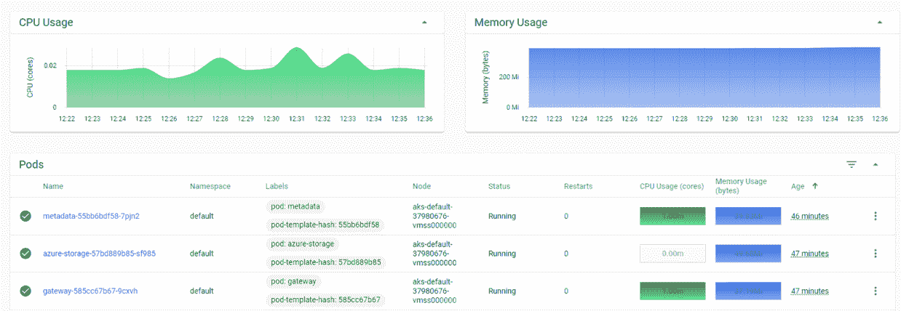

图 11.11 在 Kubernetes 仪表板中查看微服务的 CPU 和内存使用情况

### 11.3.1 纵向扩展集群

随着我们的应用程序的增长，我们可能会达到一个点，我们的集群通常没有足够的计算、内存或存储来运行我们的应用程序。随着我们添加新的微服务（或复制现有的微服务以实现冗余），我们最终会耗尽集群中的节点。（我们可以在 Azure 门户或 Kubernetes 仪表板中监控这一点。）在这个时候，我们必须增加集群可用的总资源量。在 Kubernetes 集群上扩展微服务时，我们可以同样容易地使用纵向或横向扩展。

图 11.12 显示了 Kubernetes 的纵向扩展看起来是什么样子。我们通过增加节点池中虚拟机（VM）的大小来扩展我们的集群。我们可能从三个小型的虚拟机开始，然后增加它们的大小，现在我们有三个大型的虚拟机。我们没有改变虚拟机的数量；我们只是增加了它们的大小。

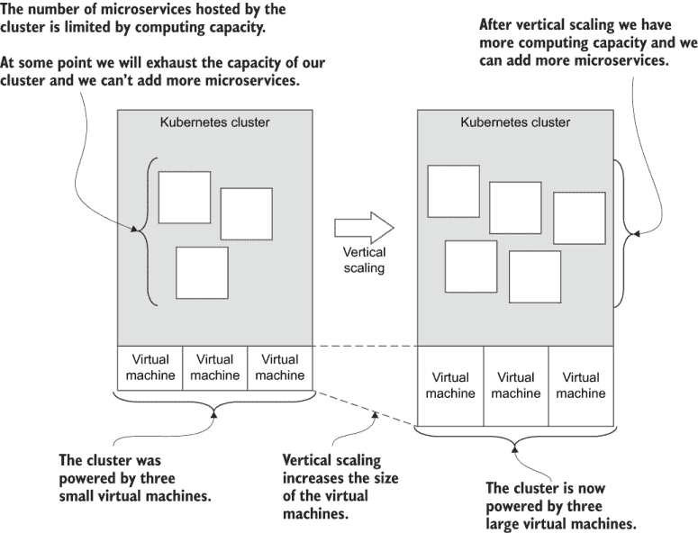

图 11.12 通过增加虚拟机（VM）的大小来纵向扩展您的集群

在列表 11.8 中，我们将`vm_size`字段从`Standard_B2ms`更改为`Standard_B4ms`。这升级了我们 Kubernetes 节点池中每个虚拟机的大小。现在我们有了四个 CPU（每个虚拟机一个），内存和硬盘也增加了。您可以在这里自己比较 Azure 虚拟机大小：

+   [`docs.microsoft.com/en-us/azure/virtual-machines/sizes-b-series-burstable`](https://docs.microsoft.com/en-us/azure/virtual-machines/sizes-b-series-burstable)

我们在集群中仍然只有一个虚拟机，但我们已经增加了它的大小。扩展我们的集群就像代码更改一样简单。我们再次看到了 *基础设施即代码* 的力量，这是一种技术，我们将基础设施配置存储为代码，并通过提交触发我们的 CD 管道的代码更改来更改我们的基础设施。

列表 11.8 使用 Terraform 垂直扩展集群（更新至第九章示例 1 的 scripts/kubernetes-cluster.tf）

```
default_node_pool {
    name = "default"
    node_count = 1
    vm_size = "Standard_B4ms"      ①
}
```

① 为集群中的每个节点设置更大的虚拟机

### 11.3.2 水平扩展集群

除了垂直扩展我们的集群外，我们还可以水平扩展它。我们的虚拟机可以保持相同的大小，但我们只是简单地添加更多。通过向我们的集群添加更多虚拟机，我们将应用程序的负载分散到更多的计算机上。

图 11.13 展示了我们可以如何将我们的集群从三个虚拟机扩展到六个。每个虚拟机的大小保持不变，但通过拥有更多的虚拟机，我们获得了更多的计算能力。

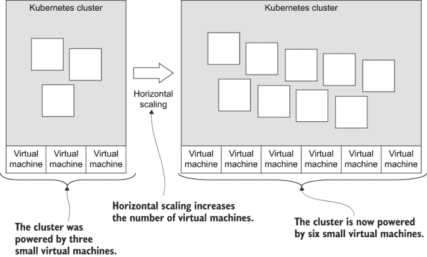

图 11.13 通过增加虚拟机数量水平扩展您的集群

列表 11.9 展示了我们需要进行的代码更改，以向我们的节点池添加更多虚拟机。在列表 11.8 中，我们将 `node_count` 设置为 1，但在这里我们将其更改为 6！请注意，我们已经将 `vm_size` 字段恢复到较小的 `Standard_B2ms` 大小。`

在这个例子中，我们增加了虚拟机的数量，但没有增加其大小；尽管如此，我们也没有阻止自己同时增加虚拟机的数量和大小。不过，通常我们可能更倾向于水平扩展，因为它比垂直扩展更经济。这是因为使用许多较小的虚拟机比使用较少但更大、价格更高的虚拟机更便宜。

列表 11.9 使用 Terraform 水平扩展集群（更新至第九章示例 1 的 scripts/kubernetes-cluster.tf）

```
default_node_pool {
    name = "default"
    node_count = 6              ①
    vm_size = "Standard_B2ms"
}
```

① 将节点池的大小增加到 6。现在集群由六个虚拟机供电！

### 11.3.3 水平扩展单个微服务

假设我们的集群已经扩展到足够的大小，可以以良好的性能托管所有微服务，那么当单个微服务过载时我们该怎么办？（这可以在 Kubernetes 仪表板中监控。）

答案是，对于任何成为性能瓶颈的微服务，我们可以通过水平扩展它来在其多个实例之间分配其负载。这如图 11.14 所示。我们实际上为这个特定的微服务提供了更多的计算、内存和存储，以便它能够处理更大的工作负载。

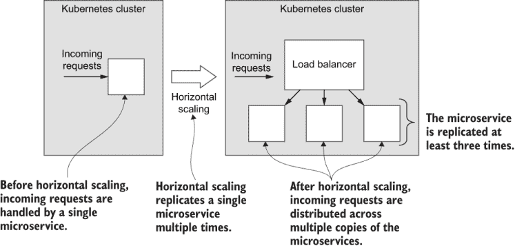

图 11.14 通过复制微服务来水平扩展

同样，我们可以使用代码来做出这种更改。实际上，我们在第十章的列表 10.2 中已经做了这个操作。代码片段在此列表 11.10 中再次重复。

我们将设置 `replicas` 字段为 3。在第十章中，我们为了冗余进行了这个更改。拥有多个实例意味着当任何单个实例失败时，其他实例可以暂时接管其负载，直到它重新启动。这里我们对 `replicas` 字段进行相同的更改，但这次是为了性能原因。我们通常需要出于这两个原因进行此更改。我们希望拥有冗余和良好的性能，而这通过在必要时创建我们的微服务的副本来解决。

列表 11.10 使用 Terraform 横向扩展微服务（第九章示例-1/scripts/modules/microservice/main.tf 的更新）

```
\spec {
    replicas = 3       ①
    selector {
        match_labels = {
            pod = var.service_name
        }
    }
    template {
        metadata {
            labels = {
                pod = var.service_name
            }
        }
        spec {
            container {
                image = local.image_tag
                name  = var.service_name
                env {
                    name = "PORT"
                    value = "80"
                }
           }
        }
    }
}
```

① 将微服务的副本数量设置为 3。我们现在可以在这三个微服务实例之间均匀分配负载。

### 11.3.4 集群的弹性扩展

进入更高级的领域，我们现在可以思考 *弹性扩展*，这是一种自动和动态调整我们的集群以满足不同需求水平的技术。在需求低峰期，Kubernetes 可以自动释放不需要的资源。在需求高峰期，它可以分配新的资源以满足增加的负载。这可以带来实质性的成本节约，因为在任何给定时刻，我们只为当时处理应用程序负载所需的资源付费。

我们可以在集群级别使用弹性扩展来自动扩展我们的集群，当它接近资源限制时。这同样只是一个代码更改。列表 11.11 展示了如何启用 Kubernetes 自动扩展器并设置节点池的最小和最大大小。

您可以将 Terraform 代码在 scripts/kubernetes-cluster.tf（第九章中的 example-1）中从列表 11.11 中的代码更新为启用 FlixTube Kubernetes 集群的横向扩展。扩展默认情况下是启用的，但我们有很多方法可以自定义它。在 Terraform 文档中搜索“auto_scaler_profile”以了解更多信息：

[`www.terraform.io/docs/providers/azurerm/r/kubernetes_cluster.html`](https://www.terraform.io/docs/providers/azurerm/r/kubernetes_cluster.html)

列表 11.11 使用 Terraform 启用集群的弹性扩展（第九章示例-1/scripts/kubernetes-cluster.tf 的更新）

```
default_node_pool {
    name = "default"
    vm_size = "Standard_B2ms"
    enable_auto_scaling = true      ①
    min_count = 3                   ②
    max_count = 20                  ③
}
```

① 启用 Kubernetes 集群自动扩展

② 将最小节点数量设置为 3。这个集群从三个虚拟机开始。

③ 将最大节点数量设置为 20。这个集群可以自动扩展到 20 个虚拟机以满足需求。

### 11.3.5 单个微服务的弹性扩展

我们还可以在单个微服务级别启用弹性扩展。列表 11.12 是一段 Terraform 代码示例，可以为微服务提供“爆发”能力。微服务的副本数量会根据微服务的不同工作量动态扩展和收缩（活动爆发）。

您可以将列表 11.12 中的代码添加到第九章 example-1 中的 scripts/modules/microservice/main.tf 文件 Terraform 代码的末尾。然后，为了为 FlixTube 微服务启用弹性扩展，调用`terraform apply`。默认情况下，扩展会生效，但可以根据需要自定义以使用其他指标。有关更多信息，请参阅 Terraform 文档：

[www.terraform.io/docs/providers/kubernetes/r/horizontal_pod_autoscaler.html](http://www.terraform.io/docs/providers/kubernetes/r/horizontal_pod_autoscaler.html)

要了解有关 Kubernetes 中 Pod 自动扩展的更多信息，请参阅以下 Kubernetes 文档：

[`kubernetes.io/docs/tasks/run-application/horizontal-pod-autoscale/`](https://kubernetes.io/docs/tasks/run-application/horizontal-pod-autoscale/)

列表 11.12 使用 Terraform 为微服务启用弹性扩展（第九章/example-1/scripts/modules/microservice/main.tf 的补充）

```
resource "kubernetes_horizontal_pod_autoscaler" "service_autoscaler" {
  metadata {
    name = var.service_name
  }
  spec {
    min_replicas = 3      ①
    max_replicas = 20     ①
    scale_target_ref {
      kind = "Deployment"
      name = var.service_name
    }
  }
}
```

① 设置此微服务的实例范围。它从 3 个实例开始，可以扩展到 20 个实例以满足不同的需求水平。

### 11.3.6 扩展数据库

我们将要探讨的最后一种扩展方式是扩展我们的数据库。回顾第四章，你可能还记得我们讨论了这样一个规则：**每个微服务都应该有自己的数据库**（参见 4.5.4 节）。

在微服务之间共享数据库存在多个问题；其中一个是它严重限制了我们的可扩展性。考虑图 11.15 中描述的情况。我们有多达多个微服务共享一个数据库。这是一个未来的可扩展性噩梦！

这些微服务不是独立的。共享数据库是这些服务之间固定的集成点，并且可能成为严重的性能瓶颈。如果微服务共享数据，这些服务将紧密耦合。这严重限制了我们在未来进行重构和重构的能力。通过共享数据库，我们阻碍了自己未来解决性能问题的能力。

这种场景可能会完全破坏我们费尽心思实现的“简单”扩展。如果我们想以这种方式构建我们的应用程序，我们不妨根本不使用微服务！

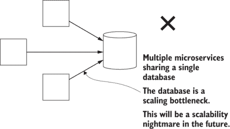

图 11.15 为什么我们不共享微服务之间的数据库（除非可能是同一微服务的副本）

相反，我们的应用程序应该看起来像图 11.16 所示。每个微服务都有自己的独立数据库。这些微服务是独立的，这意味着如果需要，我们可以轻松地应用水平扩展。

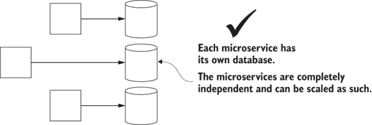

图 11.16 每个独立的微服务都应该有自己的数据库。

到目前为止，我想明确指出，仅仅因为我们必须拥有独立的数据库，并不意味着我们也需要独立的数据库服务器。管理数据库服务器是有成本的，我们通常希望将这种成本降至最低。正如图 11.17 所示，拥有一个包含我们独立数据库的单个数据库服务器可以使我们开始使用微服务更加简单和便宜。

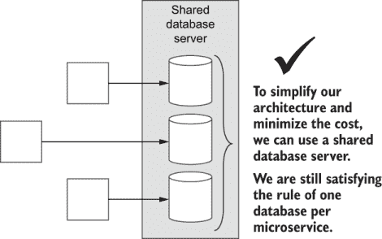

图 11.17 在共享数据库服务器上运行独立的数据库是完全可行的（这是开始的最简单方式）。

在未来，如果我们发现任何特定数据库的工作负载增长过大，我们可以轻松创建一个新的数据库服务器，并将该数据库移动到其中，如图 11.18 所示。当需要时，我们可以为需要额外计算、内存或存储的任何数据库创建专用服务器。

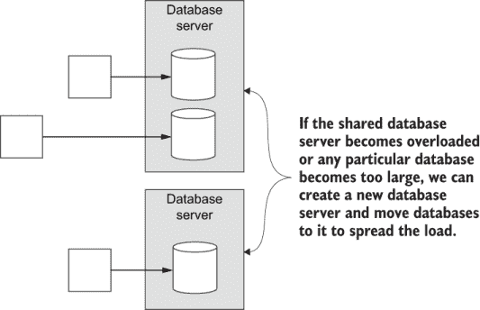

图 11.18 随着你的应用程序变大，你可以通过将大型数据库拆分到它们自己的独立数据库服务器上来进行扩展。

需要一个更具可扩展性的数据库吗？在这本书中，我们使用了 MongoDB，它提供了一个数据库分片功能（如图 11.19 所示）。这允许我们将单个大型数据库分布在多个虚拟机上。你可能永远不需要这种级别的可扩展性。它仅适用于极大型数据库，但了解我们拥有这种选项是很好的，以防万一需要。

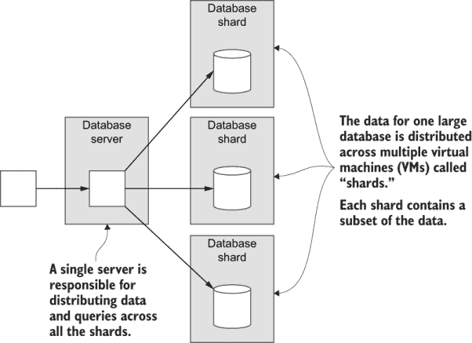

图 11.19 对于极大型数据库，我们可能需要 MongoDB 的分片功能，以将单个大型数据库分布在多个虚拟机上。

### 11.3.7 管理基础设施更改

对基础设施进行更改是一项风险业务，需要得到良好的管理。如果你在刚刚读到的任何扩展技术中犯了一个错误，你可能会使整个集群崩溃。我们最好不要对面向客户的基础设施进行这类更改，因此在本节中，我介绍了一种将此类风险更改与客户保持距离的技术。

这种技术被称为*蓝绿部署*。我们创建了两个生产环境，并将它们标记为*蓝色*和*绿色*。我们能够轻松做到这一点，因为在 11.2.6 节中，我们已经参数化了我们的 Terraform 代码，以创建不同名称区分的环境。

我们创建的第一个环境被标记为蓝色环境。我们的客户通过我们的域名（例如，www.company.com）使用我们的应用程序。然后，我们通过 DNS 记录将他们路由到蓝色环境。现在，为了保护我们的客户，我们宁愿不对蓝色环境进行任何风险性的更改（尽管对个别微服务的常规和频繁更新是可以接受的，因为这不会对基础设施造成任何影响）。

为了进行任何有风险的或实验性的更改（例如尝试扩展），我们创建了一个全新的生产基础设施，我们将其标记为绿色环境。我们的开发人员现在在绿色环境中工作，所以他们所做的任何工作都与客户使用的蓝色环境分开。这如图 11.20 所示。


图 11.20 客户使用蓝色环境，而开发人员和测试人员使用绿色环境。

一旦绿色环境的工作完成，经过测试，并且已知工作良好，我们只需将 DNS 记录从蓝色切换到绿色即可。我们的客户现在可以使用绿色环境，我们的开发人员和测试人员可以切换到与蓝色环境一起工作。这如图 11.21 所示。

如果发现新的绿色环境有任何问题，我们可以简单地翻转 DNS 开关回到蓝色环境，为我们的客户恢复工作功能。在未来，我们可以继续在蓝色和绿色环境之间切换，从而保护我们的客户免受我们基础设施可能存在的风险更改的影响。

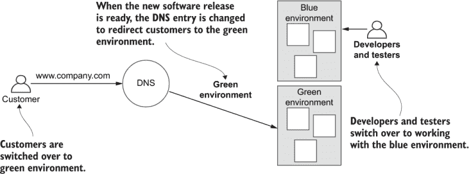

图 11.21 当绿色环境准备就绪并经过测试后，客户将切换到它。开发人员和测试人员随后切换到蓝色环境并继续工作。当蓝色环境准备就绪并经过测试后，客户再次切换，循环继续。

## 11.4 安全

我们在书中多个地方简要地讨论了安全问题。但我们并没有真正公正地对待它，因为安全非常重要——甚至在开发的早期阶段也是如此。如此重要，以至于安全真的值得有一本自己的书。

好吧，幸运的是，有一本关于微服务安全的优秀书籍：Prabath Siriwardena 和 Nuwan Dias 合著的《Microservices Security in Action》（Manning，2020 年）。不过，现在让我们先了解一些基础知识。

每个应用程序都需要一定级别的安全。即使你的数据不是敏感的，你也不想任何人能够欺诈性地修改它。即使你的系统不是关键的，你也不想攻击者破坏你的系统和流程。

我们必须有效地使用安全技术，如身份验证、授权和加密，以减轻对我们应用程序或数据的恶意使用。我们可能还必须根据我们特定地区的法规，对我们的数据进行结构化以保护客户的隐私和匿名性。尽管如此，FlixTube 还没有这些，尽管我们已经对以下方面采取了一些措施：

+   *唯一暴露给外部世界（因此，暴露给攻击）的微服务是网关微服务。这是设计使然！我们的内部微服务不能从集群外部直接访问。

+   *尽管最初，我们为了早期实验将我们的 RabbitMQ 服务器和 MongoDB 数据库暴露给世界，但我们很快关闭了这些服务。* 我们这样做是为了防止直接外部访问这些关键资源。这很重要！除非您 100%确信这些资源受到攻击保护，否则不要将此类关键资源暴露给外界。

在未来，我们希望至少升级 FlixTube 以下安全特性：

+   网关处的认证系统。

+   使用 HTTPS 与我们的客户建立连接。这将加密他们的通信，使用像 Cloudflare 这样的外部服务意味着你可以快速上线。

当然，任何给定应用程序所需的安全级别的重要性仅与我们要保护的系统和数据有关。我们添加到 FlixTube 的安全性将远低于银行应用程序或政府网站所需的安全性。

安全性必须来自组织的两端。您的公司应该有符合领域和客户要求的安全政策和策略。然后，您和每一位开发人员都有责任思考并按照公司的标准实施安全。我们应该编写简单但安全的代码。并且与防御性编程（见第 10.4.2 节）一样，在安全性方面，我们应该采取防御性的心态。

首先，当编写代码和构建微服务时，我们应该问自己，有人会如何攻击这个系统？这使我们的思维处于主动应对安全问题的状态，在攻击发生之前，这可以产生最大的影响。

### 11.4.1 信任模型

FlixTube 的需求足够简单，我们可以采用内部信任模型，也称为“信任网络”（如图 11.22 所示）。在这个模型中，我们在系统的入口点（网关微服务）进行所有认证。集群内的微服务相互信任，并依赖底层网络的安全性来保护它们免受外部攻击。

内部信任模型是一种简单的方式来开始使用微服务。在安全性方面，简单往往比复杂更好，因为简单提供了更少的安全问题隐藏的地方。在引入更复杂的安全性时，我们必须小心，因为任何增加的复杂性实际上都可能引入安全漏洞。

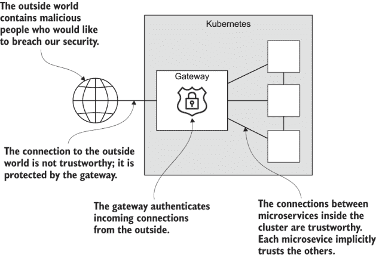

图 11.22 内部信任模型。在网关处应用认证。内部微服务相互信任，无需认证即可通信。

如果您的安全需求高于 FlixTube，那么内部信任模型可能不够。如果您有多个集群，并且需要跨集群通信的微服务，这也将是情况。

您应该考虑的一个更安全的模型被称为“零信任”或“无信任”（如图 11.23 所示）。在零信任模型中，所有微服务之间的连接——无论是内部还是外部——都需要进行身份验证。微服务之间不会自动信任彼此。我们假设任何特定的微服务都可能被劫持或受到损害，尤其是如果该微服务托管在其他集群中。

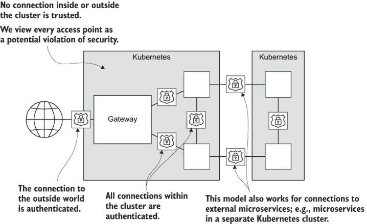

图 11.23 无信任模型。所有连接，无论是内部还是外部，都需要进行身份验证。此模型支持连接到外部微服务。

### 11.4.2 敏感配置

任何应用程序都有需要保护的敏感配置数据。您可能记得在第七章中，我们将 Azure 凭据存储在 Bitbucket 仓库变量中（第 7.7.6 节）。在本章开头（第 11.2.3 节）将基础设施和微服务的部署代码拆分出来后，我们也需要一个地方来存储私有容器注册表的凭据。

在我们构建应用程序的过程中，我们还需要存储其他密码、令牌和 API 密钥，这些都需要安全地存储。我们可以在代码中存储任何这些敏感信息，这当然很方便。但这意味着任何拥有或能够访问我们的代码的人也将能够访问到可以轻松用于破坏或关闭我们的应用程序的操作信息。

Bitbucket 仓库或账户变量（或类似项，取决于您的持续交付提供者）是存储此类信息的良好方式。然而，您可能更喜欢一个不依赖于您的源代码控制或持续交付提供者的解决方案。在这种情况下，Kubernetes 为秘密配置提供了自己的存储解决方案。您可以在此处了解相关信息：

+   [`kubernetes.io/docs/concepts/configuration/secret/`](https://kubernetes.io/docs/concepts/configuration/secret/)

如果这不符合您的需求，还有各种其他产品可以帮助您。例如，您可能想了解更多关于 Vault 的信息，这是 Hashicorp（Terraform 的开发者）的另一个开源产品。更多信息请访问

+   [`www.vaultproject.io/`](https://www.vaultproject.io/)

## 11.5 微服务重构

在第一章（第 1.1 节）中，我承诺在学习如何从头开始构建微服务应用程序之后，我们最终会回来讨论如何将现有的单体应用程序重构为微服务。对于任何给定的单体，我们将如何转换的细节会有所不同。我们可以用很多种方式来做这件事，但在这个部分，我将向您提供一些基本策略和战术，供任何人使用。

基本思想与任何开发过程相同。正如在第二章（第 2.4 节）中介绍的那样，它全部关于迭代、小而简单的更改，并在进行过程中保持代码的正常工作（如图 11.24 所示）。

单体应用的转换是一项巨大的工作（取决于单体的大小和复杂性），一次性的“大爆炸”转换不太可能成功。到达另一边的唯一安全方式是通过小而可控的工作块，并在过程中进行极其彻底的测试。

我们也不能停止对产品的开发。我们仍然有责任添加业务请求的功能和修复错误。同样重要的是，我们必须保持产品正常运行；我们只是不能让问题积累。

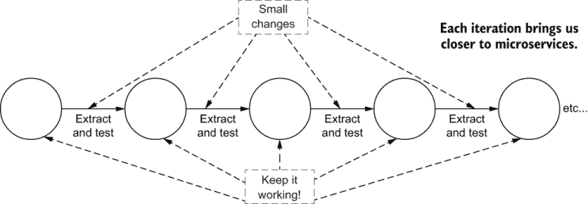

图 11.24 将单体重构为微服务只能通过一系列小而经过良好测试的迭代步骤来完成。

你真的需要微服务吗？

在你开始将单体应用转换为微服务之前，你真的需要问自己：*微服务真的有必要吗？* 转换到微服务可能是一个漫长而困难的过程。它将引入显著的复杂性，并将考验你开发团队的耐心和决心。

+   这个转换真的值得付出的代价吗？

+   你真的需要扩展吗？

+   你真的需要微服务的灵活性吗？

这些都是重要的问题。确保你有好的答案。

规划你的转换并让每个人都参与

你不能在黑暗中简单地走向微服务！为了最大限度地提高成功的可能性，你需要一个关于你的产品到达时将是什么样子的文档化愿景。

使用*领域驱动设计*（DDD）来将你的业务建模为微服务（参见本章末尾的书籍参考）。追求简单的架构。为眼前的未来而不是遥远的、不确定的未来做计划。从你的架构愿景倒退到现在。这是你必须做出的变化序列以转换为微服务。这不需要详细规划，但你确实需要有一个大致的方向。

我们需要有一个关于我们正在构建的愿景，一个关于我们如何到达那里的想法，以及为什么这很重要的理解。计划总是会发生变化的。正如他们所说，“战斗计划在与敌人的接触中永远不会存活”（转述自赫尔穆特·冯·毛奇，老将军）。但这并不意味着我们不应该计划！相反，我们应该计划让变化在过程中自然发生，因为我们更多地了解我们的应用程序应该如何构建。我们还应该回顾和修订我们的计划，更新它，以便在遵循计划的过程中保持相关性。

转换计划应该与团队（或代表的一部分）一起创建，因为实施这个转换将是一个共享且困难的练习。你需要让每个人都参与其中。

只制定计划是不够的。现在你必须将其传达给更广泛的公司。确保开发者知道对他们有什么期望。与其他业务部门沟通，用对他们有意义的语言描述，让他们知道为什么这件事正在进行以及它带来的价值。每个人，绝对每个人，都必须理解这个操作的高风险！

了解你的遗留代码

在转换前后，你应该投入大量时间了解你的单体。创建测试计划。进行实验。了解其故障模式。对它在转换的每一步中哪些部分可能会突破有一个概念。

提升你的自动化

良好的自动化对任何微服务项目至关重要。在转换前后，你应该持续投资并改进你的自动化。如果你还没有掌握你的基础设施和自动化，你需要立即开始工作（甚至在开始转换之前！）你可能会发现，改变公司对自动化的思维方式实际上是这个过程中最*难*的部分。

你需要可靠且快速的自动化部署（第六章和第七章）。你转换的任何功能都应该已经具有自动化测试，或者你在将功能转换为微服务的同时实现良好的自动化测试（第八章）。

使用微服务，你无法摆脱自动化。*如果你无法承担投资自动化的费用，你可能也无法承担转换为* *微服务* *的费用。

构建你的微服务平台

在转换开始之前，你需要一个平台，你可以在这个平台上托管新创建的微服务。你需要一个生产环境来托管微服务，因为这些是从你的单体中增量提取的（如图 11.25 所示）。

在这本书中，你有了构建这样一个平台的秘方。根据第六章和第七章创建私有容器注册库，并创建你的 Kubernetes 集群。在创建你的第一个微服务之后，现在为你的团队创建一个共享模板：一个空白微服务，可以作为其他每个微服务的起点。如果你有不同的微服务类型，创建多个模板，每个类型一个。

创建你的自动化测试流程，并使其易于开发者使用。创建文档、示例和教程，以便你的开发者可以快速了解如何创建和部署新的微服务到你的平台。


图 11.25 你的单体的小块可以增量提取并移动到你的 Kubernetes 集群中。

沿着自然的缝隙雕刻

现在寻找你单体中与你的架构愿景中的微服务相匹配的现有组件。这些为从单体中逐块提取组件到微服务提供了巨大的机会，如图 11.26 所示。

如果你很难找到自然的缝隙，你的工作将会更加困难。如果你的单体应用是一个**巨大的泥球**或充满了**意大利面代码**，你可能必须首先重构或在进行提取时重构。无论如何，这将会很棘手。为了安全起见，你的重构应该由自动化测试支持。事情可能会变得混乱——做好准备。

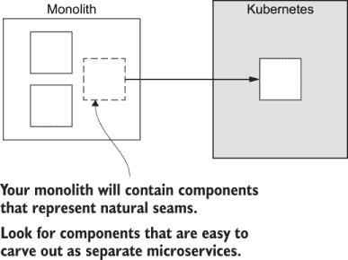

图 11.26 单体应用通常会有自然的缝隙。利用这些缝隙来识别可以逐步提取为微服务的单个组件。

提取变化最频繁的部分

在决定将哪些组件转换为微服务时，优先考虑那些变化最多的组件。将这些部分从单体应用中早期提取出来作为微服务，会带来即时的实际效益，你将立即感受到其影响。这种早期的**性价比**应该会显著提高你的开发速度。它将降低你的部署风险，并有助于你说服他人转换正在进行得很好。

并且重复……

通过反复将小块内容提取到微服务中并边走边测试，我们将安全地将我们的单体应用转换为基于微服务的应用（图 11.27）。这不会容易。可能需要很长时间（取决于单体应用的大小和复杂性，可能是数年）。但这是可行的！我们只需要一点一点地持续努力，直到工作完成。

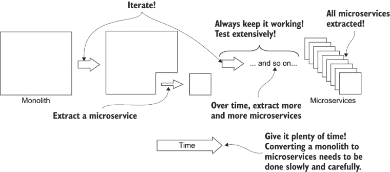

图 11.27 逐步将单体应用的小块内容提取为微服务，始终进行测试并保持其运行。最终，你的应用将被分解为微服务。

不必追求完美

当我们确立我们的架构愿景时，我们追求的是我所说的**开发者的微服务乌托邦**。这是一个我们都希望居住的地方——如果我们能够的话。然而，你必须意识到，我们并不是真正追求一个完美的微服务应用实例。当然，那会很棒。但说实话，可能没有必要完全达到那里。

达到完美的投资回报率会逐渐减少，而且很少值得尝试一直推进到那里。此外，由于没有人会完全同意这意味着什么，所以达到完美是不可能的。但仍然有可能朝着这个大致方向前进，并在过程中使事物变得更好。

在我们通往微服务的旅程中的每一步都应该被选择，以便对我们的客户、我们的应用、我们的开发过程或我们的业务产生积极影响。如果我们发现继续转换不再产生价值，我们必须停止并重新评估我们所做的事情。

也许我们正在走错路？或者，也许我们已经提取了所有可能的价值，继续前进不会再继续改善事情。这可能会让我们得到一个部分转换的单体应用，但那又如何？对你有用的就是好的。我们都在为我们的业务寻求好的结果，而且我们不应该因为实现这些结果所付出的代价而感到尴尬，无论它看起来如何。如果它能完成任务，那就完成了。这就是故事的全部。

可能性的光谱

如图 11.28 所示，在单体和开发者的微服务乌托邦之间有一个无限的可能性光谱。谁能说你的应用程序在这个连续体上属于哪里？当然不是我。只有你能决定这一点。

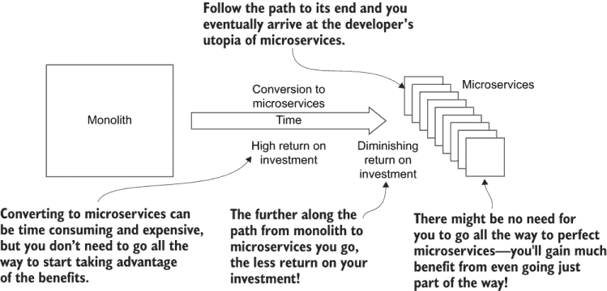

图 11.28 微服务转换的时间线。在早期，你将获得很高的投资回报率（ROI）。然而，随着你继续前进，你将获得递减的投资回报率，而且可能没有必要完全过渡到开发者的微服务乌托邦。

## 11.6 在预算内使用微服务

分布式架构一直是交付复杂应用的有用且强大的方式。由于当前云技术、现代工具和自动化的结合，微服务现在很受欢迎。这使得微服务比以往任何时候都更容易实现且成本效益更高。

但微服务应用仍然是一个复杂的构建任务。尽管每个单独的微服务都很简单，但你可能会在应用的整体复杂性上遇到困难，尤其是如果你是一个小团队、独立开发者或精益创业公司。

在这本书的整个过程中，我们学习了各种技巧和技术，使学习微服务和开始使用它们变得更加容易。这些技巧在未来如果你需要时将继续帮助你。我再次以更简洁的形式呈现这些见解。

+   *教育自己使用现代工具，并充分利用这些工具！* 自己开发工具是耗时、困难且会分散你应做的事情：向客户交付功能。

+   *从单个代码仓库和单个持续交付（CD）管道开始。* 之后，当你分离出多个代码仓库时，创建一个或多个*元仓库*将这些仓库重新组合在一起（如第 11.2.5 节所述）。

+   *使用单个数据库服务器* 来托管每个微服务的一个数据库。

+   *使用单个虚拟机创建一个 Kubernetes 集群。* 为每个微服务创建一个实例（没有副本）。一开始，你可能不需要冗余或性能。这有助于降低成本。

+   *使用外部文件存储和外部数据库服务器，使你的集群实际上是无状态的。* 这降低了你在集群上实验的风险。你可能会破坏你的集群，但你不会丢失你的数据。它还支持之前介绍的蓝绿部署技术（第 11.3.7 节）。

+   *使用 Docker Compose 在你的工作站上模拟你的应用程序进行开发和测试。* 使用实时重载进行快速的开发迭代。

+   *在早期，你可能不需要自动化测试，但对于构建一个可维护的微服务应用程序来说，它是必不可少的。然而，对于初创公司来说，构建一个最小可行产品（MVP）时，你可能不需要它。在产品的生命周期中，这还为时尚早，不能对基础设施做出如此大的承诺。我们必须在投资更先进的基础设施之前证明我们的产品！

+   *你可能没有自动化测试，但你仍然需要测试！* 设置高效且可靠的手动测试。你需要一个脚本来快速启动你的应用程序，从无到有，在短时间内进入可测试状态。你可以使用 Docker Compose 和数据库固定值来实现这一点。

+   *Docker 使得将第三方镜像部署到集群中运行的容器变得容易。* 这就是我们如何在第五章中部署 RabbitMQ 的方式。你可以在 DockerHub 上找到许多其他有用的镜像：[`hub.docker.com/`](https://hub.docker.com/).

+   *尽早投资于你的自动化，特别是通过自动化部署的持续交付。* 你将每天都会依赖它，所以请确保它运行良好。

## 11.7 从简单的起点……

只看我们共同走过的路！我们从一个单一的微服务开始。然后我们学习了如何使用 Docker 打包和发布它。我们学习了如何在我们的开发工作站上使用 Docker Compose 开发和测试多个微服务。最终，我们在云上创建了一个生产环境，并使用 Terraform 将我们的基于微服务的应用程序部署到其中。

复杂性管理是现代发展的核心。这就是为什么我们投入时间学习高级架构模式，如微服务。

这真是一次伟大的旅程！但我很遗憾地说，我们在一起的时间已经结束了。当然，你的旅程将继续，我祝愿你在使用微服务构建自己的复杂应用程序时一切顺利。

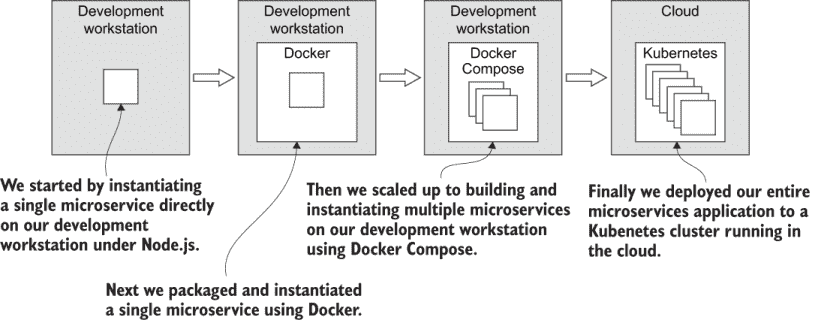

图 11.29 从单个微服务到在生产中运行的多个微服务的旅程

## 11.8 继续你的学习

最后一次，让我们通过一些书籍的引用来结束这一章，这些书籍将帮助你学习更多，并将你的理解和知识向前推进。要了解更多关于领域驱动设计（DDD）的信息，请阅读关于它的原始书籍：

+   *《领域驱动设计》* 由 *Eric Evans（Addison-Wesley，2004）*

如果你没有太多时间，你可以在免费的电子书《领域驱动设计快速入门》中找到一个很好的总结，由 Abel Avram 和 Floyd Marinescu（InfoQ，2018）编写，可在以下链接找到：

+   [`www.infoq.com/minibooks/domain-driven-design-quickly/`](https://www.infoq.com/minibooks/domain-driven-design-quickly/)

为了更好地理解微服务的安全性，请阅读

+   *《微服务实战安全》* 由 *Prabath Siriwardena 和 Nuwan Dias* 著（Manning, 2020）

要了解更多关于使用微服务进行开发的细节理论，请选择以下任何一本书籍：

+   *《微服务之道》* 由 *Richard Rodger* 著（Manning, 2017）

+   *《微服务模式》* 由 *Chris Richardson* 著（Manning, 2018）

+   *《微服务实战》* 由 *Morgan Bruce 和 Paulo A. Pereira* 著（Manning, 2018）

+   *《.NET Core 微服务》* 第 2 版，由 *Christian Horsdal Gammelgaard* 著（Manning, 2020）

+   *《使用 Python 开发微服务 API》* 由 *José Haro Peralta* 著（Manning, 2020）

## 摘要

+   为了从微服务中获得最大利益，我们必须分离我们的代码仓库和持续交付（CD）管道。这确保了每个微服务都可以独立部署。它还允许不同的团队对不同的微服务负责。

+   使用元仓库，在我们分离代码仓库之后，我们可以恢复一些单仓库（单一仓库）的便利性。

+   拥有独立的 CD 管道意味着我们将拥有可扩展的部署管道。

+   我们可以通过参数化我们的 Terraform 部署代码来创建多个环境（例如，开发、测试和生产）。

+   我们可以在代码仓库中为每个分支（例如，开发、测试和生产）配置独立的 CD 管道。将代码推送到分支会触发管道并部署到相应的环境。

+   为了提高性能，我们有多种选择，包括

    +   我们可以垂直和水平地扩展我们的集群。

    +   我们可以水平扩展我们的微服务。

    +   我们可以为特定的微服务预留专用计算资源。

    +   我们可以利用弹性扩展在需求高峰时自动扩展我们的集群和微服务。

+   我们应该为每个微服务保留单个数据库，这样我们就有选项来扩展我们的数据存储。

+   蓝绿部署在交替环境中切换客户，是一种管理潜在风险基础设施升级的安全方式。

+   由于微服务应用程序可能有许多网关，因此微服务的安全性与其他应用程序一样重要，甚至更为重要。

+   我们可以采用诸如身份验证和授权等安全技术来保护我们系统的访问权限。

+   我们可以采用完整性保护技术来保护我们的数据，并为我们的客户确保隐私和机密性。

+   从单体架构重构到微服务只能通过一系列小而经过良好测试的步骤来完成。

+   在我们刚开始时，有许多方法可以使微服务更加经济实惠且不那么复杂。这使得微服务成为初创公司、小型团队和独立开发者一个有效且高效的起点。
