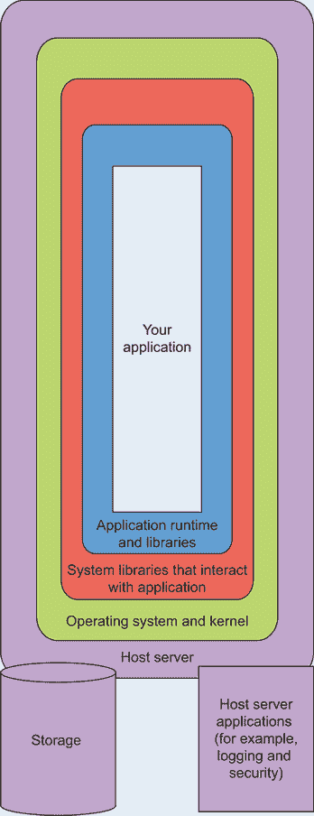
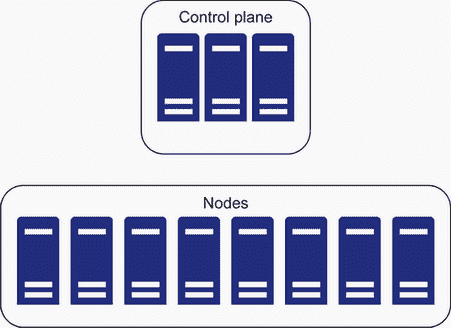
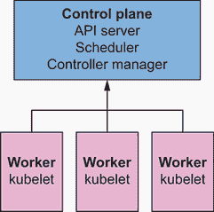

# 1 为什么存在 Kubernetes

本章涵盖

+   为什么存在 Kubernetes

+   常用 Kubernetes 术语

+   Kubernetes 的具体用例

+   高级 Kubernetes 功能

+   何时不运行 Kubernetes

*Kubernetes* 是一个开源平台，用于托管容器并定义以应用程序为中心的 API，用于管理围绕这些容器如何配置存储、网络、安全和其他资源的云语义。Kubernetes 使您应用程序部署的整个状态空间持续进行协调，包括它们如何从外部世界访问。

为什么要在您的环境中实现 Kubernetes，而不是手动使用 DevOps 相关的基础设施工具来配置这些资源？答案在于我们定义 DevOps 的方式，随着时间的推移，它越来越多地集成到整体应用程序生命周期中。DevOps 不断演变，包括支持数据中心中应用程序更自动化管理的流程、工程师和工具。成功完成此任务的关键之一是基础设施的可重复性：对某个组件进行更改以修复事件，但该更改没有完美地复制到所有其他相同组件，这意味着一个或多个组件不同。

在这本书中，我们将深入探讨使用 Kubernetes 与 DevOps 的最佳实践，以便按需复制组件，并使您的系统故障更少。我们还将探索底层的流程，以更好地理解 Kubernetes 并获得最有效的系统。

## 1.1 在我们开始之前回顾几个关键术语

在 2021 年，Kubernetes 是最常部署的云技术之一。因此，在引用之前，我们并不总是完全定义新术语。如果您是 Kubernetes 的新手或者对一些术语不确定，我们提供了一些关键定义，您可以在本书的前几章中参考这些定义，随着您在这个新领域的学习，我们将更细致、更广泛地重新定义这些概念：

+   *CNI 和 CSI*—容器网络和存储接口，分别允许为在 Kubernetes 中运行的 Pod（容器）提供可插拔的网络和存储。

+   *Container*—通常运行应用程序的 Docker 或 OCI 镜像。

+   *Control plane*—Kubernetes 集群的“大脑”，在这里进行容器的调度和管理所有 Kubernetes 对象（有时称为 Masters）。

+   *DaemonSet*—类似于部署，但它运行在集群的每个节点上。

+   *Deployment*—由 Kubernetes 管理的 Pod 集合。

+   *kubectl*—与 Kubernetes 控制平面通信的命令行工具。

+   *`kubelet`*—在您的集群节点上运行的 Kubernetes 代理。它执行控制平面需要它执行的操作。

+   *Node*—运行 kubelet 进程的机器。

+   *OCI*—构建可执行、自包含应用程序的通用镜像格式。也称为 *Docker 镜像*。

+   *Pod*——Kubernetes 对象，封装了正在运行的容器。

## 1.2 基础设施漂移问题与 Kubernetes

管理基础设施是以可重复的方式管理该基础设施配置的“漂移”，因为硬件、合规性和数据中心的其他要求随着时间的推移而变化。这既适用于应用程序的*定义*，也适用于这些应用程序运行的宿主机的*管理*。IT 工程师对常见的繁琐工作如

+   在服务器群上更新 Java 版本

+   确保某些应用程序不在特定位置运行

+   替换或扩展旧或损坏的硬件，并将应用程序从其迁移

+   手动管理负载均衡路由

+   在缺乏共同强制配置语言的情况下，忘记记录新的基础设施更改

当我们在数据中心或云中管理和更新服务器时，它们原始定义“漂移”出预期 IT 架构的可能性会增加。应用程序可能会在错误的位置运行，拥有错误的资源分配，或者访问错误的存储模块。

Kubernetes 通过一个便捷的工具`kubectl` ([`kubernetes.io/docs/tasks/tools/`](https://kubernetes.io/docs/tasks/tools/))，为我们提供了一种集中管理所有应用程序整个状态空间的方式：`kubectl`是一个命令行客户端，它向 Kubernetes API 服务器发出 REST API 调用。我们还可以使用 Kubernetes API 客户端以编程方式执行这些任务。安装`kubectl`和在一个`kind`集群上测试它相当容易，我们将在本书的早期阶段这样做。

管理这个复杂的应用状态空间之前的方法包括 Puppet、Chef、Mesos、Ansible 和 SaltStack 等技术。Kubernetes 借鉴了这些不同的方法，通过采用 Puppet 等工具的状态管理能力，同时借鉴了 Mesos 等软件提供的一些应用和调度原语的概念。

Ansible、SaltStack 和 Terraform 通常在基础设施配置中扮演着重要角色（铺平了特定操作系统的要求，如防火墙或二进制安装）。Kubernetes 也管理这个概念，但在 Linux 环境中使用*特权容器*（在 Windows v1.22 上称为*HostProcess Pods*）。例如，Linux 系统中的特权容器可以管理 iptables 规则，将流量路由到应用程序，实际上这正是 Kubernetes 服务代理（称为*kube-proxy*）所做的事情。

Google、Microsoft、Amazon、VMware 以及许多公司已将容器化作为核心和启用策略，使客户能够在不同的云和裸机环境中运行数百或数千个应用程序。因此，容器是运行应用程序和管理工作基础设施（例如为容器提供 IP 地址）的基本原语，这些基础设施运行着这些应用程序所依赖的服务（例如提供定制存储和防火墙需求），最重要的是运行应用程序本身。

Kubernetes 在撰写本文时，基本上是任何云、服务器或数据中心环境中编排和运行容器的现代标准的无争议选择。

## 1.3 容器和镜像

应用程序有依赖项，必须由它们运行的主机来满足。在容器时代之前，开发者以临时方式完成这项任务（例如，Java 应用程序需要运行 JVM 以及与数据库通信的防火墙规则）。

在其核心，Docker 可以被视为运行容器的途径，其中 *容器* 是一个正在运行的 OCI 镜像 ([`github.com/opencontainers/image-spec`](https://github.com/opencontainers/image-spec))。*OCI 规范* 是一种标准方式来定义一个可以被 Docker 等程序执行的形象，它最终是一个包含多个层的 tarball。镜像内部的每个 tarball 包含诸如 Linux 可执行文件和应用文件等东西。因此，当你运行一个容器时，容器运行时（如 Docker、containerd 或 CRI-O）会取镜像，解包它，并在主机系统上启动一个运行镜像内容的进程。

容器增加了一层隔离，消除了在服务器上管理库或在预加载基础设施时与其他意外应用程序依赖项的需求（图 1.1）。例如，如果你有两个需要同一库不同版本的 Ruby 应用程序，你可以使用两个容器。每个 Ruby 应用程序都在一个运行的容器内隔离，并具有它所需的特定版本的库。



图 1.1 在容器中运行的应用程序

有一个众所周知的过程：“嗯，它在我的机器上运行。”在安装软件时，它通常可以在一个环境或机器上运行，但不能在另一个环境中运行。使用镜像简化了在不同服务器上运行相同软件的过程。我们将在第三章中更多地讨论镜像和容器。

将使用镜像与 Kubernetes 结合起来，允许运行不可变的服务器，这将带来世界级的简单性。随着容器迅速成为软件应用程序部署的行业标准，以下是一些值得注意的数据点：

+   *调查了 88,000 名开发者，Docker 和 Kubernetes 在 2020 年最受欢迎的开发技术中排名第三。* 这仅略低于 Linux 和 Docker ([`mng.bz/nY12`](http://mng.bz/nY12))。

+   *Datadog 最近发现，Docker 占据了平均开发人员工作流程的 50% 或更多。* 同样，公司范围内的采用率也超过所有企业的 25% ([`www.datadoghq.com/docker-adoption/`](https://www.datadoghq.com/docker-adoption/))。

底线是我们需要容器自动化，这正是 Kubernetes 发挥作用的地方。Kubernetes 在这个领域的主导地位，就像 Oracle 数据库和 vSphere 虚拟化平台在其鼎盛时期所做的那样。多年以后，Oracle 数据库和 vSphere 安装仍然存在；我们预测 Kubernetes 也将拥有同样的长寿。

我们将从对 Kubernetes 功能的基本理解开始这本书。其目的是让您超越基本原理，深入到更底层的核心。让我们深入探讨，看看一个非常简化的 Kubernetes（也称为“K8s”）工作流程，该工作流程展示了构建和运行微服务的一些高级原则。

## 1.4 Kubernetes 的核心基础

在其核心，我们将 Kubernetes 中的所有内容定义为纯文本文件，通过 YAML 或 JSON 定义，并以声明式的方式为您运行 OCI 镜像。我们可以使用这种相同的方法（YAML 或 JSON 文本文件）来配置网络规则、基于角色的身份验证和授权（RBAC）等。通过学习一种语法及其结构，任何 Kubernetes 系统都可以进行配置、管理和优化。

让我们快速看看如何为简单的应用程序运行 Kubernetes 的一个示例。不用担心；我们将在本书的后面部分提供大量的真实世界示例，引导您了解应用程序的整个生命周期。请将此视为我们迄今为止所做的挥手的视觉指南。为了从具体的微服务示例开始，以下代码片段生成一个 Dockerfile，该 Dockerfile 构建了一个能够运行 MySQL 的镜像：

```
FROM alpine:3.15.4
RUN apk add --no-cache mysql
ENTRYPOINT ["/usr/bin/mysqld"]
```

通常，人们会构建这个镜像（使用 `docker build`），然后将其推送到一个 *OCI 仓库*（一个可以在运行时由容器存储和检索此类镜像的地方）。您可以在 [`github.com/goharbor/harbor`](https://github.com/goharbor/harbor) 找到一个常见的开源仓库，您可以在自己的服务器上托管它。另一个这样的仓库，也是全球数百万应用程序常用的，位于 [`hub.docker.com/`](https://hub.docker.com/)。对于这个例子，让我们假设我们已经推送了这个镜像，现在它在某个地方运行。我们可能还想要构建一个容器来与这个服务通信（也许我们有一个自定义的 Python 应用程序作为 MySQL 客户端）。我们可能定义其 Docker 镜像如下：

```
FROM python:3.7
WORKDIR /myapp
COPY src/requirements.txt ./
RUN pip install -r requirements.txt
COPY src /myapp
CMD [ "python", "mysql-custom-client.py" ]
```

现在，如果我们想在 Kubernetes 环境中以容器形式运行我们的客户端和 MySQL 服务器，我们可以通过创建两个 Pod 来轻松实现。这些 Pod 中的每一个都可能运行相应的容器，如下所示：

```
apiVersion: v1
kind: Pod
metadata:
  name: core-k8s
  spec:
  containers:
    - name: my-mysql-server
      image: myregistry.com/mysql-server:v1.0
---
apiVersion: v1
kind: Pod
metadata:
  name: core-k8s-mysql
  spec:
  containers:
    - name: my-sqlclient
      image: myregistry.com/mysql-custom-client:v1.0
      command: ['tail','-f','/dev/null']
```

我们通常会存储之前的 YAML 片段到一个文本文件中（例如，my-app.yaml），然后使用 Kubernetes 客户端工具（例如，`kubectl create` `-f` `my-app.yaml`）执行它。此工具连接到 Kubernetes API 服务器并将要存储的 YAML 定义传输过去。然后 Kubernetes 自动获取 API 服务器上我们拥有的两个 Pod 的定义，并确保它们在某处运行。

这不是瞬间发生的：它需要集群中的节点响应不断发生的事件，并通过与 API 服务器通信的 kubelet 更新它们的 Node 对象中的状态。这也要求 OCI 镜像存在于我们的 Kubernetes 集群中的节点上。任何时间都可能出错，因此我们将 Kubernetes 称为“最终一致系统”，其中随着时间的推移对期望状态的协调是一个关键设计理念。这种一致性模型（与保证一致性模型相比）确保我们可以持续请求更改集群中所有应用程序的整体状态空间，并让底层的 Kubernetes 平台确定这些应用程序随时间启动的“如何”。

这在现实世界的场景中自然地扩展。例如，如果您告诉 Kubernetes，“我想在云中的三个区域中分布五个应用程序”，这可以通过定义几行 YAML 并利用 Kubernetes 的调度原语来完成。当然，您需要确保这三个区域确实存在，并且您的调度器知道它们，但即使您没有这样做，Kubernetes 至少会在可用的区域上调度一些工作负载。

简而言之，Kubernetes 允许您定义集群中所有应用程序的期望状态，包括它们的网络连接方式、运行位置、使用的存储方式等等，同时将这些细节的实现委托给 Kubernetes 本身。因此，在生产的 Kubernetes 环境中，您很少需要单独执行一次 Ansible 或 Puppet 更新（除非您正在重新安装 Kubernetes 本身，即使在这种情况下，也有如 Cluster API 这样的工具允许您使用 Kubernetes 来管理 Kubernetes（现在我们真的有点超出我们的理解范围了）。

### 1.4.1 Kubernetes 中的所有基础设施规则都作为纯 YAML 进行管理

Kubernetes 使用 Kubernetes API 自动化技术栈的所有方面，这些方面可以完全作为 YAML 和 JSON 资源进行管理。这包括传统的 IT 基础设施规则（这些规则以某种方式或形式适用于微服务），例如：

+   服务器配置端口或 IP 路由

+   应用程序的持久存储可用性

+   在特定或任意服务器上托管软件

+   安全配置，例如 RBAC 或网络规则，以便应用程序相互访问

+   在每个应用程序和全局基础上进行 DNS 配置

所有这些组件都在配置文件中定义，这些配置文件是 Kubernetes API 中对象的表示。Kubernetes 通过应用更改、监控这些更改以及解决暂时性故障或中断，直到达到期望的最终状态来使用这些构建块和容器。当“夜晚有东西发出声响”时，Kubernetes 将自动处理许多场景，我们不必亲自解决问题。通过自动化配置更复杂的系统，允许 DevOps 团队能够专注于解决复杂问题，规划未来，并为业务找到最佳解决方案。接下来，让我们回顾 Kubernetes 提供的功能以及它们如何支持 Pod 的使用。

## 1.5 Kubernetes 特性

*容器编排平台*允许开发者自动化运行实例、配置主机、将容器链接起来以优化编排流程以及扩展应用程序的生命周期。现在是时候深入挖掘容器编排平台的核心特性了，因为本质上，容器需要 Pods，而 Pods 需要 Kubernetes 来

+   提供一个云中立的 API，用于 API 服务器中的所有功能

+   在 Kubernetes 控制器管理器（也称为 KCM）中与所有主要云和虚拟平台集成

+   提供一个容错框架，用于存储和定义所有服务、应用程序、数据中心配置或 Kubernetes 支持的其他基础设施的状态

+   在最小化面向用户的中断的情况下管理部署，无论是针对单个主机、服务还是应用程序

+   通过滚动更新意识自动化主机和托管应用程序的扩展

+   创建具有负载均衡的内联和外部集成（称为 ClusterIP、NodePort 或 LoadBalancer 服务类型）

+   提供能力，根据其元数据在特定虚拟化硬件上调度应用程序运行，通过节点标签和 Kubernetes 调度器实现

+   通过 DaemonSets 和其他技术基础设施提供高度可用的平台，优先考虑在集群中所有节点上运行的容器

+   允许通过域名服务（DNS）进行服务发现，之前由 KubeDNS 实现，最近则由 CoreDNS 实现，它与 API 服务器集成

+   运行批处理过程（称为作业），它们使用存储和容器的方式与持久化应用程序运行方式相同

+   包含 API 扩展，并使用自定义资源定义构建原生 API 驱动程序，无需构建任何端口映射或管道

+   允许检查失败的集群级过程，包括通过`kubectl exec`和`kubectl describe`在任何时间远程执行到任何容器

+   允许将本地和/或远程存储挂载到容器中，并使用 StorageClass API 和 PersistentVolumes 管理容器的声明性存储卷

图 1.2 是一个 Kubernetes 集群的简单示意图。Kubernetes 所做的工作绝非易事。它标准化了在同一集群中运行或运行的多个应用程序的生命周期管理。Kubernetes 的基础是一个由节点组成的集群。诚然，Kubernetes 的复杂性是工程师对 Kubernetes 的一个抱怨。社区正在努力使其更容易使用，但 Kubernetes 解决的是一个复杂的问题，一开始就很难解决。



图 1.2 一个示例 Kubernetes 集群

如果您不需要高可用性、可扩展性和编排，那么可能您不需要 Kubernetes。现在让我们考虑一个集群中的典型故障场景：

1.  一个节点停止响应控制平面。

1.  控制平面将运行在无响应节点上的 Pods 重新调度到另一个或多个节点。

1.  当用户通过 `kubectl` 向 API 服务器发出 API 调用时，API 服务器会响应关于无响应节点的正确信息以及 Pods 的新位置。

1.  所有与 Pod 的服务通信的客户端都被重定向到其新位置。

1.  连接到故障节点上 Pods 的存储卷被移动到新的 Pod 位置，以便其旧数据仍然可读。

本书的目的在于让您深入了解这一切在底层是如何真正工作的，以及底层 Linux 基本原理如何补充高级 Kubernetes 组件以完成这些任务。Kubernetes 严重依赖于 Linux 堆栈中的数百项技术，这些技术往往难以学习且缺乏深入文档。我们希望您通过阅读本书，能够理解 Kubernetes 的许多细微之处，这些细微之处往往在工程师首次使用教程启动容器时被忽视。

在不可变操作系统上运行 Kubernetes 是很自然的。您有一个基础操作系统，只有在您更新整个操作系统时才会更新（因此是不可变的），您使用该操作系统安装您的节点/Kubernetes。运行不可变操作系统有许多优势，我们在此不一一介绍。您可以在云中、裸金属服务器上，甚至是在树莓派上运行 Kubernetes。事实上，美国国防部目前正在研究如何在一些战斗机上运行 Kubernetes。IBM 甚至支持在其下一代大型机、PowerPC 上运行集群。

随着围绕 Kubernetes 的云原生生态系统不断成熟，它将继续允许组织识别最佳实践，积极采取措施预防问题，并保持环境一致性以避免*漂移*，即某些机器的行为与其他机器略有不同，因为错过了补丁、未应用或错误地应用了补丁。

## 1.6 Kubernetes 组件和架构

现在，让我们花点时间从高层次上看看 Kubernetes 架构（图 1.3）。简而言之，它包括你的硬件以及运行 Kubernetes 控制平面的硬件部分以及 Kubernetes 工作节点：

+   *硬件基础设施*——包括计算机、网络基础设施、存储基础设施和容器注册库。

+   *Kubernetes 工作节点*——Kubernetes 集群中计算的基本单元。

+   *Kubernetes 控制平面*——Kubernetes 的母船。这包括 API 服务器、调度器、控制器管理器和其它控制器。



图 1.3 控制平面和工作节点

### 1.6.1 Kubernetes API

如果从本章中提取一个重要的事情，这将使你能够深入阅读本书，那就是在 Kubernetes 平台上管理微服务和其它容器化软件应用，仅仅是声明 Kubernetes API 对象的问题。大部分的工作都会为你完成。

本书将深入探讨 API 服务器及其数据存储，etcd。几乎你可以要求`kubectl`执行的所有操作都会导致在 API 服务器中读取或写入一个定义和版本化的对象。（这个例外是使用`kubectl`获取正在运行的 Pod 的日志，其中此连接是通过代理转发到节点的。）`kube-apiserver`（Kubernetes API 服务器）允许对所有对象进行 CRUD（创建、读取、更新和删除）操作，并提供 RESTful（表示状态传输）接口。一些`kubectl`命令，如`describe`，是多个对象的组合视图。一般来说，所有 Kubernetes API 对象都有

+   命名 API 版本（例如，`v1` 或 `rbac.authorization.k8s.io/v1`）

+   一种类型（例如，`kind: Deployment`）

+   元数据部分

我们可以感谢 Kubernetes 的原始创始人之一 Brian Grant，他提出的 API 版本化方案在经过时间的考验后已被证明是稳健的。它可能看起来很复杂，坦白说，有时有点痛苦，但它允许我们进行诸如升级和定义 API 变化的合同。API 变化和迁移通常是相当复杂的，Kubernetes 为 API 变化提供了一个明确的合同。查看 Kubernetes 网站上的 API 版本化文档（[`mng.bz/voP4`](http://mng.bz/voP4)），你可以阅读 Alpha、Beta 和 GA API 版本的合同。

在本书的各章节中，我们将专注于 Kubernetes，但会不断回到基本主题：在 Kubernetes 中，几乎所有东西都是为了支持 Pod 而存在的。在这本书中，我们将详细探讨几个 API 元素，包括

+   运行时 Pod 和部署

+   API 实现细节

+   入口服务与负载均衡

+   持久卷和持久卷声明存储

+   网络策略和网络安全

在标准的 Kubernetes 集群中，你可以操作大约 70 种不同的 API 类型，包括创建、编辑和删除。你可以通过运行`kubectl api-resources`来查看这些类型。输出应该看起来像这样：

```
$ kubectl api-resources | head
NAME                    SHORTNAMES  NAMESPACED  KIND
bindings                            true        Binding
componentstatuses       cs          false       ComponentStatus
configmaps              cm          true        ConfigMap
endpoints               ep          true        Endpoints
events                  ev          true        Event
limitranges             limits      true        LimitRange
namespaces              ns          false       Namespace
nodes                   no          false       Node
persistentvolumeclaims  pvc         true        PersistentVolumeClaim
```

我们可以看到，Kubernetes 本身的每个 API 资源都有

+   一个简短的名字

+   一个全名

+   一个指示它是否绑定到命名空间的标志

在 Kubernetes 中，*命名空间*允许某些对象存在于特定的……嗯……命名空间内。这为开发者提供了一种简单的分层分组形式。例如，如果你有一个运行 10 个不同微服务的应用程序，你可能会在同一个命名空间内创建所有这些 Pod、服务以及持久卷声明（也称为 PVC）。这样，当你需要删除应用程序时，你只需删除命名空间即可。在第十五章中，我们将探讨分析应用程序生命周期的更高级方法，这些方法比这种简单的方法更先进。但就许多情况而言，命名空间是分离与应用程序相关的所有 Kubernetes API 对象的最明显和直观的解决方案。

### 1.6.2 示例一：在线零售商

想象一个需要能够根据季节性需求快速扩展的大型在线零售商，比如在假日前后。扩展和预测如何扩展一直是他们最大的挑战——也许是最大的。Kubernetes 解决了运行高度可用、可扩展的分布式系统所带来的众多问题。想象一下，如果你能够轻松地扩展、分配并使系统高度可用，那将会有多大的可能性。这不仅是一种更好的经营方式，而且也是管理系统的最有效和最有效的平台。当结合 Kubernetes 和云提供商时，当你需要额外资源时，你可以运行在别人的服务器上，而不是购买和维护额外的硬件以防万一。

### 1.6.3 示例二：在线捐赠解决方案

对于这个过渡的一个值得提及的现实世界例子，让我们考虑一个允许用户根据个人选择向广泛慈善机构捐款的在线捐赠网站。假设这个特定的例子最初是一个 WordPress 网站，但最终，商业交易导致完全依赖于 JVM 框架（如 Grails）以及定制的 UX、中间层和数据库层。这个商业巨浪的要求包括机器学习、广告服务、消息传递、Python、Lua、NGINX、PHP、MySQL、Cassandra、Redis、Elastic、ActiveMQ、Spark、狮子、老虎和熊……等等，别再说了。

初始基础设施是一个手工构建的云虚拟机（VM），使用 Puppet 设置一切。随着公司的发展，他们设计了可扩展性，但这包括越来越多的仅托管一个或两个应用程序的 VM。然后他们决定转向 Kubernetes。虚拟机数量从大约 30 个减少到 5 个，并且更容易扩展。他们完全消除了 Puppet 和服务器设置，因此由于转向大量使用 Kubernetes，他们不再需要手动管理机器基础设施。

该公司转向 Kubernetes 解决了整个类别的虚拟机管理问题，减轻了复杂服务发布的 DNS 负担，以及更多问题。此外，在灾难性故障的情况下，恢复时间从基础设施的角度来看更加可预测和管理。当你体验到迁移到标准化、API 驱动的方法的好处时，这种方法运行良好且能够快速进行大规模变更，你开始欣赏 Kubernetes 的声明性特性和其云原生容器编排方法。

## 1.7 不应使用 Kubernetes 的情况

承认，总有使用 Kubernetes 可能不是最佳选择的情况。其中一些包括

+   *高性能计算（HPC）*——使用容器增加了一层复杂性，并且随着新层，性能受到影响。使用容器创建的延迟正在变得很小，但如果你的应用程序受纳诺秒或微秒的影响，使用 Kubernetes 可能不是最佳选择。

+   *遗留*——某些应用程序具有硬件、软件和延迟要求，这使得简单地容器化变得困难。例如，你可能购买了来自一个不正式支持在容器中运行或在其 Kubernetes 集群中运行其应用程序的软件公司的应用程序。

+   *迁移*——遗留系统的实现可能非常僵化，将其迁移到 Kubernetes 除了“我们建立在 Kubernetes 之上”之外几乎没有其他优势。但迁移之后，当单体应用程序被解析成逻辑组件时，这些组件可以独立扩展。

这里重要的是这一点：学习和掌握基础知识。Kubernetes 以稳定、成本敏感的方式解决了本章中提出的许多问题。

## 摘要

+   Kubernetes 使你的生活更轻松！

+   Kubernetes 平台可以在任何类型的基础设施上运行。

+   Kubernetes 构建了一个协同工作的组件生态系统。结合这些组件，使公司能够在需要紧急变更时实时预防、恢复和扩展。

+   在 Kubernetes 中做的所有事情都可以用一款简单的工具来完成：`kubectl`。

+   Kubernetes 从一台或多台计算机创建一个集群，该集群提供了一个部署和托管容器的平台。它提供容器编排、存储管理和分布式网络。

+   Kubernetes 是从之前的配置驱动、容器驱动方法中诞生的。

+   Pod 是 Kubernetes 的基本构建块。它支持 Kubernetes 允许的众多功能：扩展、故障转移、DNS 查询和 RBAC 安全规则。

+   Kubernetes 应用程序完全通过向 Kubernetes API 服务器发出 API 调用来管理。
