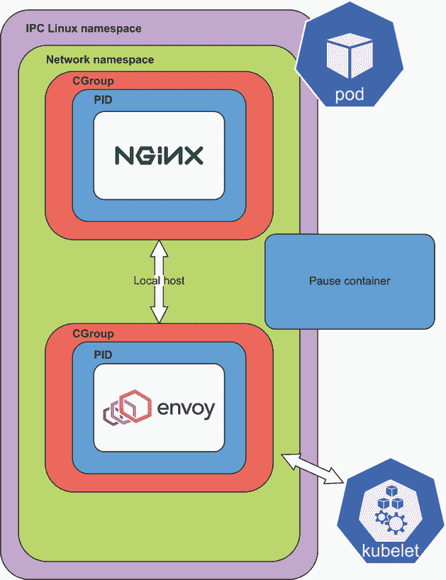
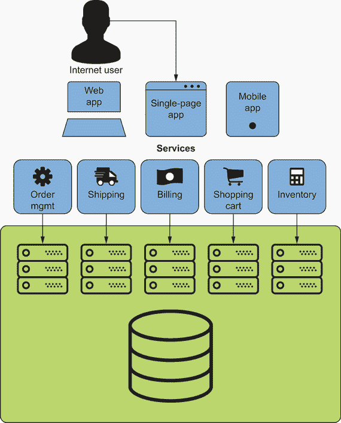
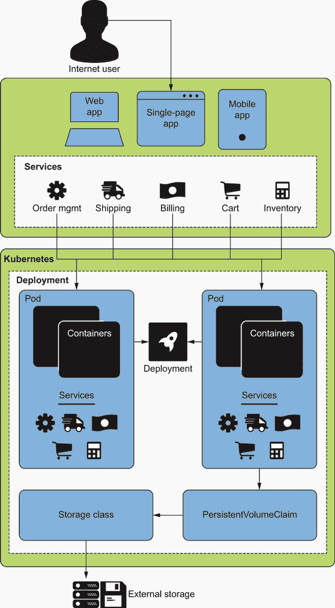
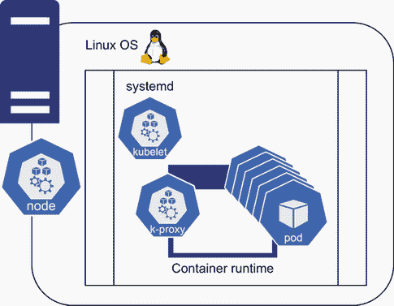
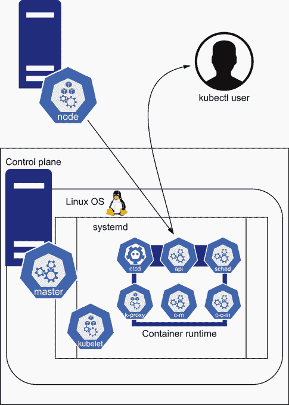
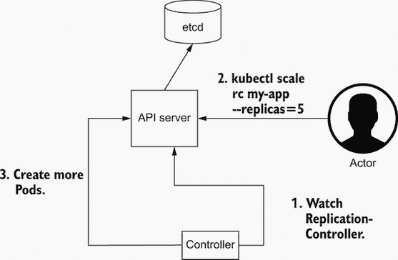

# 2 为什么需要 Pod？

本章涵盖

+   什么是 Pod？

+   一个示例 Web 应用程序以及为什么我们需要 Pod

+   Kubernetes 是如何为 Pods 构建的

+   Kubernetes 控制平面

在上一章中，我们提供了一个关于 Kubernetes 的高级概述，以及对其特性、核心组件和架构的介绍。我们还展示了几个商业用例，并概述了一些容器定义。Kubernetes Pod 抽象在灵活运行数千个容器方面已经成为企业向容器化过渡的基本部分。在本章中，我们将介绍 Pod 以及 Kubernetes 如何作为基本应用程序构建块来支持它。

如第一章简要提到的，*Pod* 是在 Kubernetes API 中定义的对象，在 Kubernetes 中大多数事物也是如此。Pod 是可以部署到 Kubernetes 集群中的最小原子单元，Kubernetes 是围绕 Pod 定义构建的。Pod（图 2.1）允许我们定义一个可以包含多个容器的对象，这使得 Kubernetes 能够在节点上创建一个或多个容器。



图 2.1 Pod

许多其他 Kubernetes API 对象要么直接使用 Pod，要么是支持 Pod 的 API 对象。例如，Deployment 对象就使用了 Pod，以及 StatefulSets 和 DaemonSets。几个不同的高级 Kubernetes 控制器创建和管理 Pod 生命周期。控制器是运行在控制平面上的软件组件。内置控制器的例子包括控制器管理器、云管理器和调度器。但首先，让我们先偏离一下主题，先描述一个 Web 应用程序，然后再将其与 Kubernetes、Pod 和控制平面联系起来。

note 你可能会注意到，我们使用控制平面来定义运行控制器、控制器管理器和调度器的节点组。它们也被称为 *masters*，但在本书中，当我们谈论这些组件时，我们将使用 *control plane*。

## 2.1 一个示例 Web 应用程序

让我们通过一个示例 Web 应用程序来了解为什么我们需要 Pod 以及 Kubernetes 是如何构建来支持 Pod 和容器化应用程序的。为了更好地理解为什么需要 Pod，我们将在本章的大部分内容中使用以下示例。

Zeus Zap 能量饮料公司有一个在线网站，允许消费者购买他们不同系列的碳酸饮料。该网站由三个不同的层组成：用户界面（UI）、中间层（各种微服务）和后端数据库。他们还有消息和排队协议。像 Zeus Zap 这样的公司通常有各种面向消费者的前端以及管理端，中间层的不同微服务，以及一个或多个后端数据库。以下是 Zeus Zap 的 Web 应用程序的一个切片分解（图 2.2）：

+   由 NGINX 提供的 JavaScript 前端

+   两个以 Django 托管的 Python 微服务为主控层的网络控制器

+   在端口 6379 上运行的后端 CockroachDB，由存储支持

现在，让我们想象他们在生产环境中以四个不同的容器运行这些应用程序。然后他们可以使用以下 `docker run` 命令启动应用程序：

```
$ docker run -t -i ui -p 80:80
$ docker run -t -i miroservice-a -p 8080:8080
$ docker run -t -i miroservice-b -b 8081:8081
$ docker run -t -i cockroach:cockroach -p 6379:6379
```

一旦这些服务启动并运行，公司很快就会意识到以下几点：

+   除非他们在端口 80 前进行负载均衡，否则他们不能运行 UI 容器的多个副本，因为他们的镜像运行的主机机器上只有一个端口 80。

+   除非修改 IP 地址并将其注入到网络应用程序中（或者他们添加一个在 CockroachDB 容器移动时动态更新的 DNS 服务器），否则他们不能将 CockroachDB 容器迁移到不同的服务器。

+   他们需要在单独的服务器上运行每个 CockroachDB 实例，以实现高可用性。

+   如果一个 CockroachDB 实例在某个服务器上死亡，他们需要一种方法将数据移动到新的节点，并回收未使用的存储空间。

Zeus Zap 也意识到一个容器编排平台存在一些需求。这些包括

+   数百个进程共享网络，所有进程都绑定到相同的端口

+   在避免污染本地磁盘的同时，将存储卷从二进制文件迁移和解耦

+   优化可用 CPU 和内存资源的使用，以实现成本节约

注意：在服务器上运行更多进程通常会导致 *嘈杂邻居* 现象：拥挤的应用程序会导致对稀缺资源（CPU、内存）的过度竞争。系统必须减轻嘈杂邻居的影响。

在调度服务和管理工作负载均衡器时，大规模（或甚至小规模）运行的容器化应用程序需要更高层次的认识。因此，还需要以下项目：

+   *存储感知调度*——在使数据可用时与调度进程协同

+   *服务感知的网络负载均衡*——当容器从一个机器移动到另一个机器时，将流量发送到不同的 IP 地址



图 2.2 Zeus Zap 网络架构

我们在应用程序中刚刚分享的启示与 2000 年代分布式调度和编排工具的创始人产生了共鸣，包括 Mesos 和 Borg。Borg 是谷歌的内部容器编排系统，Mesos 是一个开源应用程序，两者都提供集群管理，并且早于 Kubernetes。

### 2.1.1 我们网络应用程序的基础设施

没有像 Kubernetes 这样的容器编排软件，组织在其基础设施中需要许多组件。为了运行一个应用程序，您需要在云上或物理计算机上使用各种虚拟机（VM），这些计算机充当您的服务器，正如之前提到的，您需要稳定的标识符来定位服务。

服务器负载可能有所不同。例如，你可能需要更多内存的服务器来运行数据库，或者你可能需要一个内存较低但 CPU 更多的系统来运行微服务。此外，你可能需要一个低延迟的存储系统，如 MySQL 或 Postgres，但对于备份和其他通常将数据加载到内存中然后不再接触磁盘的应用程序，你可能需要一个更慢的存储系统。此外，你的持续集成服务器，如 Jenkins 或 CircleCI，需要对你的服务器有完全访问权限，但你的监控系统需要对你的一些应用程序有只读访问权限。现在，再加上人类授权和身份验证。总之，你需要

+   作为部署平台的虚拟机或物理服务器

+   负载均衡

+   应用程序发现

+   存储

+   一个安全系统

为了维持系统，你的 DevOps 团队需要维护以下内容（除了许多其他子系统）：

+   集中日志

+   监控、警报和指标

+   持续集成/持续交付 (CI/CD) 系统

+   备份

+   密钥管理

与大多数自建的应用程序交付平台不同，Kubernetes 出厂就自带日志轮转、检查和管理工具。接下来是业务挑战：运营需求。

### 2.1.2 运营需求

Zeus Zap 能量饮料公司没有像大多数在线零售商那样的典型季节性增长期，但他们确实赞助了各种电子竞技活动，吸引了大量流量。这是因为市场营销部门和各种在线游戏直播员在这些活动中举办了比赛。这些在线用户流量模式给 DevOps 团队带来了最具挑战性的流量模式之一——突发流量。维护和解决在线应用程序的扩展问题是一个困难的问题，现在团队必须为突发模式进行调度！此外，由于围绕电子竞技活动创建的在线社交媒体活动，公司担心停机。停机成本既难看又庞大。

根据 Gartner 在 2018 年的一项研究 ([`mng.bz/PWNn`](http://mng.bz/PWNn))，考虑到不同企业的差异，平均每分钟的 IT 停机成本为 5,600 美元。一个应用程序出现两小时的停机时间并不罕见，导致平均成本为 672,000 美元。钱是一回事，但人的成本呢？DevOps 工程师面临停机，这是生活的一部分，但它也会消耗员工，并可能导致燃尽。美国员工的燃尽每年给行业造成约 1250 亿美元至 1900 亿美元的成本 ([`mng.bz/4j6j`](http://mng.bz/4j6j))。

许多公司在他们的生产系统中需要一定级别的高可用性和回滚功能。这些需求与对应用程序和硬件冗余的需求相辅相成。然而，为了节省成本，这些公司可能希望在需求较低的时间段内上下调整应用程序的可用性。因此，成本管理通常与关于正常运行时间的更广泛业务需求相矛盾。总结一下，一个简单的 Web 应用程序需要

+   扩缩

+   高可用性

+   对应用程序进行版本控制以允许回滚

+   成本管理

## 2.2 什么是 Pod？

大概来说，一个*Pod*是在 Kubernetes 集群节点上作为容器运行的一个或多个 OCI 镜像。Kubernetes 的*节点*是单个计算能力（一个服务器），它运行 kubelet。像 Kubernetes 中的其他一切一样，节点也是一个 API 对象。部署 Pod 就像发出以下命令一样简单：

```
$ cat << EOF > pod.yaml
apiVersion: v1                              ❶
kind: Pod                                   ❷
metadata:
spec:
  container:
    - name: busybox
      image: mycontainerregistry.io/foo     ❸
EOF

$ kubectl create -f pod.yaml                ❹
```

❶ 与 API 服务器上的版本匹配的 API 版本 ID

❷ kind 声明 API 对象的类型（在这种情况下，一个 Pod）以供 API 服务器使用。

❸ 在注册表中命名镜像

❹ kubectl 命令

之前的语法使用 Linux Bash shell 和`kubectl`命令运行。`kubectl`命令是提供命令行界面以与 Kubernetes API 服务器一起工作的二进制文件。

在大多数情况下，Pod 不是直接部署的。相反，它们由我们定义的其他 API 对象（如 Deployments、Jobs、StatefulSets 和 DaemonSets）自动为我们创建：

+   *部署*——在 Kubernetes 集群中最常用的 API 对象。它们是典型的 API 对象，比如部署一个微服务。

+   *作业*——以批处理方式运行 Pod。

+   *StatefulSets*——托管需要特定需求且通常是具有状态的应用程序（如数据库）。

+   *DaemonSets*——当我们希望在集群的每个节点上运行单个 Pod 作为“代理”时使用（通常用于涉及网络、存储或日志的系统服务）。

以下是一个 StatefulSet 功能的列表：

+   使用序号 Pod 命名以获取唯一的网络标识符

+   总是挂载到相同 Pod 的持久存储

+   有序启动、扩缩和更新

提示：Docker 镜像名称支持使用一个名为*latest*的标签。在生产环境中不要使用 mycontainerregistry.io/foo 这样的镜像名称，因为这会从注册表中拉取`latest`标签，这是镜像的最新版本。始终使用版本化的标签名称，而不是 latest，甚至更好的是使用 SHA 来安装镜像。镜像标签名称不是不可变的，但镜像 SHA 是。许多生产系统失败是因为意外安装了容器的新版本。朋友们不要让朋友们运行*latest*！

当 Pod 启动时，可以使用简单的`kubectl get po`命令查看在默认命名空间中运行的 Pod。现在我们已经创建了一个运行的容器，部署宙斯 Zap Web 应用程序的组件（图 2.3）就变得简单了。只需使用 Docker 或 CRI-O 等喜欢的镜像工具将各种二进制文件及其依赖项捆绑到不同的镜像中，这些镜像只是带有一些文件定义的 tar 包。在下一章中，我们将介绍如何手动制作自己的镜像和 Pod。

服务器启动时，系统不会调度各种`docker run`命令，我们定义了四个高级 API 对象，用于创建 Pod 并调用 Kubernetes API 服务器。正如我们提到的，Pod 很少用于在 Kubernetes 上安装应用程序。用户通常使用更高层次的抽象，如 Deployments 和 StatefulSets。但我们仍然回到 Pod，因为 Deployments 和 StatefulSets 创建副本对象，然后创建 Pod。



图 2.3 在 Kubernetes 上运行的宙斯 Zap 应用

### 2.2.1 一系列 Linux 命名空间

Kubernetes 命名空间（使用`kubectl create ns`创建的）与 Linux 命名空间不同。Linux 命名空间是 Linux 内核的一个特性，允许在内核内部进行进程分离。在基本层面上，Pod 是一系列特定配置的命名空间。Pod 具有以下 Linux 命名空间：

+   一个或多个 PID 命名空间

+   单个网络命名空间

+   `IPC` 命名空间

+   `cgroup`（控制组）命名空间

+   `mnt`（挂载）命名空间

+   `user`（用户 ID）命名空间

Linux 命名空间是 Linux 内核文件系统组件，提供从镜像创建运行容器的基本功能。为什么这很重要？让我们回到运行示例 Web 应用的一些要求。

重要的是具备扩展的能力。Pod 不仅为我们和 Kubernetes 提供了部署容器的能力，而且还允许我们扩展处理更多流量的能力。为了降低成本和垂直扩展，需要调整容器资源设置的能力。为了使宙斯 Zap 微服务能够与 CockroachDB 服务器通信，需要部署明确的网络和服务查找。

Pod 及其基础，Linux 命名空间，为所有这些功能提供支持。在网络命名空间内，存在一个虚拟网络栈，该栈连接到一个跨越 Kubernetes 集群的软件定义网络（SDN）系统。通常通过为应用程序的多个 Pod 进行负载均衡来促进扩展需求。Kubernetes 集群内的 SDN 是支持负载均衡的网络框架。

### 2.2.2 Kubernetes、基础设施和 Pod

服务器依赖于运行 Kubernetes 和 Pods。作为一个计算单元，一个 CPU 功率单元在 Kubernetes 中由一个 API 对象（节点）表示。节点可以在多种平台上运行，但它只是一个具有定义组件的服务器。节点要求包括以下内容：

+   服务器

+   一个安装了操作系统的服务器，具有各种 Linux 和 Windows 支持的要求

+   systemd（一个 Linux 系统和服务管理器）

+   kubelet（一个节点代理）

+   容器运行时（如 Docker 引擎）

+   一个网络代理（`kube-proxy`），用于处理 Kubernetes 服务

+   一个 CNI（容器网络接口）提供者

节点可以在树莓派、云中的虚拟机或多种其他平台上运行。图 2.4 显示了在 Linux 上运行的节点由哪些组件组成。



图 2.4 一个节点

*kubelet* 是一个作为代理运行的二进制程序，通过多个控制循环与 Kubernetes API 服务器通信。它在每个节点上运行；没有它，Kubernetes 节点就无法调度，也不被视为集群的一部分。理解 kubelet 有助于我们诊断节点无法加入集群和 Pod 无法部署等低级问题。kubelet 确保以下内容：

+   任何调度到 kubelet 主机的 Pod 都是通过一个控制循环运行的，该循环监视哪些 Pods 被调度到哪些节点。

+   API 服务器通过 Kubernetes 1.17+ 中的心跳不断了解节点上的 kubelet 是否健康。（心跳是通过查看运行集群的 `kube-node-lease` 命名空间来维护的。）

+   Pod 需要时进行垃圾回收，包括临时存储或网络设备。

然而，kubelet 没有 CNI 提供者和通过容器运行时接口（CRI）可访问的容器运行时，就无法进行任何实际工作。CNI 最终服务于 CRI 的需求，然后启动和停止容器。kubelet 利用 CRI 和 CNI 来协调节点状态和控制平面状态。例如，当控制平面决定 NGINX 将在五节点集群的第二个、第三个和第四个节点上运行时，kubelet 的任务是确保 CRI 提供者从镜像仓库拉取此容器，并在 `podCIDR` 范围内的 IP 地址上运行。本书将在第九章中介绍这些决策是如何做出的。当提到 CRI 时，必须有一个容器引擎来启动容器。常见的容器引擎包括 Docker 引擎、CRI-O 和 LXC。

*服务* 是 Kubernetes 定义的一个 API 对象。Kubernetes 网络代理二进制文件（`kube-proxy`）负责在每个节点上创建 ClusterIP 和 NodePort 服务。不同类型的 Service 包括：

+   *ClusterIP*—一个内部服务，用于负载均衡 Kubernetes Pods

+   *NodePort*—Kubernetes 节点上用于负载均衡多个 Pods 的开放端口

+   *LoadBalancer*—一个外部服务，在集群外部创建负载均衡器

Kubernetes 网络代理可能已安装或未安装，因为一些网络提供商用他们自己的网络组件替换了它，该组件处理服务管理。Kubernetes 允许多个相同类型的 Pod 通过一个服务进行代理。为了使这成为可能，集群中的每个节点都必须知道每个服务和每个 Pod。Kubernetes 网络代理简化并管理每个节点上每个服务，正如为特定集群定义的那样。它支持 TCP、UDP 和 STCP 网络协议，以及转发和负载均衡。

注意，Kubernetes 的网络是通过一个名为 CNI 提供者的软件解决方案提供的。一些 CNI 提供者正在构建组件，用他们自己的软件基础设施替换 Kubernetes 网络代理。这样，他们可以在不使用 iptables 的情况下进行不同的网络操作。

### 2.2.3 节点 API 对象

正如提到的，节点支持 Pods，控制平面定义了运行控制器、控制器管理器和调度器的节点组。我们可以使用这个简单的`kubectl`命令查看集群的节点（s）：

```
$ kubectl get no                                     ❶
NAME                STATUS    ROLES   AGE  VERSION
kind-control-plane  NotReady  master  25s  v1.17.0   ❷
```

❶ 完整的命令是 kubectl get nodes，它检索 Kubernetes 集群的节点对象（s）。

❷ 来自 kind 集群的输出。注意，这是 v1.17.0，可能比您本地运行的版本要旧一些。

现在，让我们看看描述托管 Kubernetes 控制平面的节点的 Node API 对象：

```
$ kubectl get no kind-control-plane -o yaml
```

以下示例提供了整个 API Node 对象的值。（在示例中，我们将 YAML 拆分为多个部分，因为它很长。）

```
apiVersion: v1
kind: Node
metadata:
  annotations:
    kubeadm.alpha.kubernetes.io/cri-socket:
      /run/containerd/containerd.sock         ❶
    node.alpha.kubernetes.io/ttl: "0"
    volumes.kubernetes.io/controller-managed-attach-detach: "true"
  creationTimestamp: "2020-09-20T14:51:57Z"
  labels:                                     ❷
    beta.kubernetes.io/arch: amd64
    beta.kubernetes.io/os: linux
    kubernetes.io/arch: amd64
    kubernetes.io/hostname: kind-control-plane
    kubernetes.io/os: linux
    node-role.kubernetes.io/master: ""
  name: kind-control-plane
  resourceVersion: "1297"
  selfLink: /api/v1/nodes/kind-control-plane
  uid: 1636e5e1-584c-4823-9e6b-66ab5f390592
spec:
  podCIDR: 10.244.0.0/24                      ❸
  podCIDRs:
  - 10.244.0.0/24
# continued in the next section
```

❶ 使用的 CRI 套接字。在 kind（以及大多数集群）中，这是 containerd 套接字。

❷ 标准标签，包括节点名称

❸ CNI IP 地址，这是 Pod 网络的 CIDR

现在让我们转到状态部分。它提供了有关节点及其组成的详细信息。

```
status:             ❶
  addresses:
  - address: 172.17.0.2
    type: InternalIP
  - address: kind-control-plane
    type: Hostname
  allocatable:
    cpu: "2"
    ephemeral-storage: 61255492Ki
    hugepages-1Gi: "0"
    hugepages-2Mi: "0"
    memory: 2039264Ki
    pods: "110"
  capacity:
    cpu: "2"
    ephemeral-storage: 61255492Ki
    hugepages-1Gi: "0"
    hugepages-2Mi: "0"
    memory: 2039264Ki
    pods: "110"
  conditions:
  - lastHeartbeatTime: "2020-09-20T14:57:28Z"
    lastTransitionTime: "2020-09-20T14:51:51Z"
    message: kubelet has sufficient memory available
    reason: KubeletHasSufficientMemory
    status: "False"
    type: MemoryPressure
  - lastHeartbeatTime: "2020-09-20T14:57:28Z"
    lastTransitionTime: "2020-09-20T14:51:51Z"
    message: kubelet has no disk pressure
    reason: KubeletHasNoDiskPressure
    status: "False"
    type: DiskPressure
  - lastHeartbeatTime: "2020-09-20T14:57:28Z"
    lastTransitionTime: "2020-09-20T14:51:51Z"
    message: kubelet has sufficient PID available
    reason: KubeletHasSufficientPID
    status: "False"
    type: PIDPressure
  - lastHeartbeatTime: "2020-09-20T14:57:28Z"
    lastTransitionTime: "2020-09-20T14:52:27Z"
    message: kubelet is posting ready status
    reason: KubeletReady
    status: "True"
    type: Ready
  daemonEndpoints:
    kubeletEndpoint:
      Port: 10250
```

❶ 对节点上运行的 kubelet 的各种状态字段的 API 服务器的更新

接下来，让我们看看节点上运行的所有镜像：

```
images:                                      ❶
  - names:
    - k8s.gcr.io/etcd:3.4.3-0                ❷
    sizeBytes: 289997247
  - names:
    - k8s.gcr.io/kube-apiserver:v1.17.0      ❸
    sizeBytes: 144347953
  - names:
    - k8s.gcr.io/kube-proxy:v1.17.0
    sizeBytes: 132100734
  - names:
    - k8s.gcr.io/kube-controller-manager:v1.17.0
    sizeBytes: 131180355
  - names:
    - docker.io/kindest/kindnetd:0.5.4       ❹
    sizeBytes: 113207016
  - names:
    - k8s.gcr.io/kube-scheduler:v1.17.0
    sizeBytes: 111937841
  - names:
    - k8s.gcr.io/debian-base:v2.0.0
    sizeBytes: 53884301
  - names:
    - k8s.gcr.io/coredns:1.6.5
    sizeBytes: 41705951
  - names:
    - docker.io/rancher/local-path-provisioner:v0.0.11
    sizeBytes: 36513375
  - names:
    - k8s.gcr.io/pause:3.1
    sizeBytes: 746479
```

❶ 节点上运行的不同镜像

❷ 作为 Kubernetes 数据库的 etcd 服务器

❸ API 服务器和其他控制器（如 kube-controller-manager）

❹ CNI 提供者。我们需要一个软件定义的网络，这个容器提供了这个功能。

最后，我们将添加`nodeInfo`块。这包括 Kubernetes 系统的版本控制：

```
nodeInfo:                 ❶
    architecture: amd64
    bootID: 0c700452-c292-4190-942c-55509dc43a55
    containerRuntimeVersion: containerd://1.3.2
    kernelVersion: 4.19.76-linuxkit
    kubeProxyVersion: v1.17.0
    kubeletVersion: v1.17.0
    machineID: 27e279849eb94684ae8c173287862c26
    operatingSystem: linux
    osImage: Ubuntu 19.10
    systemUUID: 9f5682fb-6de0-4f24-b513-2cd7e6204b0a
```

❶ 指定有关节点的信息，包括操作系统、kube-proxy 和 kubelet 版本

现在需要的是一个容器引擎、网络代理（`kube-proxy`）和 kubelet 来运行节点。我们稍后会讨论这个问题。

控制器和控制循环

在 Kubernetes 的上下文中，“控制”这个词是一个多义词；其含义相关，但有点令人困惑。有控制循环、控制器和控制平面。一个 Kubernetes 安装由多个称为“控制器”的可执行二进制文件组成。您可能知道它们是 kubelet、Kubernetes 网络代理、调度器等等。控制器是用称为“控制循环”的计算机编程模式编写的。控制平面容纳特定的控制器。这些节点和控制器是 Kubernetes 的母舰或大脑。关于这个主题的更多内容将在本章的后续部分进行讨论。

构成控制平面的节点有时被称为“主节点”，但我们在整本书中都会使用控制平面。从本质上讲，Kubernetes 是一个状态协调机器，具有各种控制循环，就像空调一样。然而，与调节温度不同，Kubernetes 控制以下内容（以及调节分布式应用程序管理的许多其他方面）：

+   将存储绑定到进程

+   创建运行中的容器并扩展容器数量

+   当容器不健康时终止和迁移容器

+   创建 IP 路由到端口

+   动态更新负载均衡端点

让我们回顾一下到目前为止我们已经讨论过的需求：Pod 提供了一个部署镜像的工具。这些镜像被部署到节点上，其生命周期由 kubelet 管理。服务对象由 Kubernetes 网络代理管理。像 CoreDNS 这样的 DNS 系统提供了应用程序查找功能，允许一个 Pod 中的微服务查找并与其他运行 CockroachDB 等服务的 Pod 进行通信。

Kubernetes 网络代理还提供了在集群内部进行内部负载均衡的能力，从而帮助实现故障转移、升级、可用性和扩展。为了解决持久存储的需求，`mnt` Linux 命名空间、kubelet 和节点的组合允许将驱动器挂载到 Pod 上。当 kubelet 创建 Pod 时，该存储就会被挂载到 Pod 上。

看起来我们仍然缺少一些部分。如果某个节点失效了——那会怎样？我们如何将 Pod 部署到节点上？这就引入了控制平面。

### 2.2.4 我们的 Web 应用程序和控制平面

在建立 Pod 和节点之后，下一步是要弄清楚如何满足复杂的需求，例如高可用性。高可用性（通常称为 HA）不仅仅是简单的故障转移，它还满足服务级别协议（SLA）的要求。系统可用性通常用连续运行时间的 9 个数量级来衡量。这是衡量应用程序或应用程序集可以有多长时间停机的一种度量。四个 9 个数量级给我们每年 52 分钟和 36 秒的停机时间；五个 9 个数量级（99.999% 的正常运行时间）给我们 5 分钟和 15 秒的可能停机时间。99.999% 的正常运行时间给我们每月 26.25 秒的停机时间。拥有五个 9 个数量级意味着我们每月只有不到半分钟的时间，Kubernetes 上托管的应用程序不可用。这非常困难！我们所有的其他要求也同样不简单。这些包括

+   规模化

+   成本节约

+   容器版本控制

+   用户和应用程序安全

注意：是的，Kubernetes 提供了所有这些功能，但应用程序也必须支持 Kubernetes 的工作方式。我们将在本书的最后一章讨论应用程序设计的注意事项。

第一步是部署 Pod。然而，除此之外，我们有一个系统不仅为我们提供容错性和可伸缩性（并且在同一命令行中），而且还具有节省金钱和控制成本的能力。图 2.5 展示了典型控制平面的组成。



图 2.5 控制平面

## 2.3 使用 kubectl 创建 Web 应用程序

为了理解控制平面如何促进复杂性，例如规模化和容错性，让我们通过简单的命令：`kubectl` `apply` `-f deployment.yaml`。以下是为部署提供的 YAML：

```
apiVersion: apps/v1
kind: Deployment
metadata:
  name: nginx
spec:
  replicas: 3
  selector:
    matchLabels:
      app: nginx
  template:
    metadata:
      labels:
        app: nginx
    spec:
      containers:
      - name: nginx
        image: nginx:1.7.9
        ports:
        - containerPort: 80
```

当你执行 `kubectl apply` 时，`kubectl` 会与控制平面的第一个组件通信。那就是 API 服务器。

### 2.3.1 Kubernetes API 服务器：kube-apiserver

Kubernetes API 服务器 `kube-apiserver` 是一个基于 HTTP 的 REST 服务器，它公开了 Kubernetes 集群的各种 API 对象；这些对象从 Pod 到节点再到水平 Pod 自动扩展器。API 服务器验证并提供网络前端，以在集群的共享状态上执行 CRUD 服务。Kubernetes 的生产控制平面通常提供强大的 Kubernetes API 服务器，这意味着在每个构成控制平面的节点上运行它，或者运行在背后使用某种其他机制进行故障转移和高可用的云服务中。在实践中，这意味着通过 HAProxy 或云负载均衡器端点访问 API 服务器。

控制平面上的组件也会与 API 服务器进行通信。当一个节点启动时，kubelet 确保节点通过与 API 服务器通信来注册到集群。控制平面中的所有组件都有一个控制循环，该循环具有监视功能，用于监视 API 服务器中对象的变化。

API 服务器是控制平面上唯一与 Kubernetes 数据库 etcd 通信的组件。在过去，一些其他组件（如 CNI 网络提供者）曾与 etcd 通信，但当前大多数组件都没有这样做。本质上，API 服务器为所有修改 Kubernetes 集群的操作提供了一个有状态的接口。所有控制平面组件的安全性都是必要的，但保护 API 服务器及其 HTTPS 端点是至关重要的。

当在高可用性控制平面上运行时，每个 Kubernetes API 服务器都是活动的，并接收流量。API 服务器主要是无状态的，可以同时运行在多个节点上。HTTPS 负载均衡器在由多个节点组成的管理平面中作为 API 服务器的代理。但我们不希望任何人都有权限与 API 服务器通信。作为 API 服务器一部分运行的 *Admission controllers* 在客户端与 API 服务器通信时提供身份验证和授权。

通常，外部身份验证和授权系统以 webhook 的形式集成到 API 服务器中。*webhook* 是一个允许回调的 HTTP PUSH API。`kubectl` 调用经过身份验证后，API 服务器将新的部署对象持久化到 etcd。我们的下一步是执行调度器，以便将 Pod 部署到节点上。新的 Pod 需要一个新的家，因此调度器将 Pod 分配到特定的节点。

### 2.3.2 Kubernetes 调度器：kube-scheduler

分布式调度并非易事。Kubernetes 调度器（`kube-scheduler`）提供了一个干净、简单的调度实现——非常适合像 Kubernetes 这样的复杂系统。调度器在 Pod 调度时会考虑多个因素。这些因素包括节点上的硬件组件、可用的 CPU 和内存资源、策略调度约束以及其他加权因素。

调度器还遵循 Pod 亲和性和反亲和性规则，这些规则指定了 Pod 的调度和放置行为。本质上，Pod 亲和性规则将 Pod 吸引到符合规则的节点，而 Pod 反亲和性规则则将 Pod 从节点排斥出去。污点（Taints）也允许节点排斥一组 Pod，这意味着调度器可以确定哪些 Pod 不应该运行在哪些节点上。在宙斯 Zap 示例（第 2.1.2 节）中，定义了三个 Pod 副本。这些副本提供了容错能力和扩展能力，调度器确定副本可以运行在哪些节点上，然后 Pod 被调度到每个节点上进行部署。

kubelet 控制 Pod 的生命周期，类似于节点的迷你调度器。一旦 Kubernetes 调度器通过`NodeName`更新 Pod，kubelet 就会将该 Pod 部署到其节点上。控制平面与不运行控制平面组件的节点完全分离。即使在控制平面故障的情况下，如果节点发生故障，Zeus Zap 也不会丢失任何应用程序信息。在控制平面故障期间，无法部署任何新内容，但网站仍然运行。

如果需要连接到应用程序的持久磁盘怎么办？在这种情况下，存储可能继续为这些应用程序工作，直到并且除非运行这些应用程序的节点出现问题。即使在发生这种情况时，如果控制平面恢复在线，我们通常可以期待数据和应用安全迁移到新位置，这得益于 Kubernetes 控制平面的相应功能。

### 2.3.3 基础设施控制器

Zeus Zap 基础设施的一个要求是 CockroachDB 集群。CockroachDB 是一个符合 Postgres 规范的分布式数据库，在云原生环境中运行。像数据库这样的有状态应用程序通常有特定的操作要求。这导致需要控制器或 Operator 来管理应用程序。由于 Operator 模式正迅速成为在 Kubernetes 上部署复杂应用程序的标准机制，我们建议避免使用纯 YAML，而是安装并使用 Operator。以下示例安装了 CockroachDB 的 Operator：

```
$ kubectl apply -f https://raw.githubusercontent.com/
          cockroachdb/cockroach-operator/master/
          install/crds.yaml                            ❶
$ kubectl apply -f https://raw.githubusercontent.com/
          cockroachdb/cockroach-operator/master/
          install/operator.yaml                        ❷
```

❶ 安装 Operator 使用的自定义资源定义

❷ 在默认命名空间中安装 Operator

自定义资源定义

*自定义资源定义*（CRDs）是定义新 API 对象的 API 对象。用户通过定义 CRD 来创建它，通常使用 YAML 格式。然后，CRD 应用于现有的 Kubernetes 集群，实际上允许 API 创建另一个 API 对象。我们实际上可以使用 CRD 来定义并允许创建新的自定义资源 API 对象。

安装 CockroachDB Operator 后，我们可以下载 example.yaml。以下显示了此操作的`curl`命令：

```
$ curl -LO https://raw.githubusercontent.com/cockroachdb/
           cockroach-operator/master/examples/example.yaml
```

YAML 片段看起来像这样：

```
apiVersion: crdb.cockroachlabs.com/v1alpha1
kind: CrdbCluster
metadata:
  name: cockroachdb
spec:
  dataStore:
    pvc:
      spec:
        accessModes:
          - ReadWriteOnce
        resources:
          requests:
            storage: "60Gi"
        volumeMode: Filesystem
  resources:
    requests:
      cpu: "2"
      memory: "8Gi"
    limits:
      cpu: "2"
      memory: "8Gi"
  tlsEnabled: true
  image:
    name: cockroachdb/cockroach:v21.1.5     ❶
  nodes: 3
  additionalLabels:
    crdb: is-cool
```

❶ 用于启动数据库的容器

此自定义资源使用 Operator 模式创建和管理以下资源（请注意，这些项目可能是数百行 YAML）：

+   存储在数据库秘密中的传输层安全性（TLS）密钥

+   包含持久卷和持久卷声明的 CockroachDB StatefulSet

+   服务

+   Pod 中断预算（PodDisruptionBudget 或 PDB）

考虑到刚才给出的示例，让我们深入了解名为 Kubernetes 控制器管理器（KCM）或`kube-controller-manager`组件的基础设施控制器，以及云控制器管理器（CCM）。在基于 Pod 构建的已部署 StatefulSet 中，我们现在需要为 StatefulSet 提供存储。

API 对象 PersistentVolume (PV) 和 PersistentVolumeClaim (PVC) 创建了存储定义，并由 KCM 和 CCM 使其生效。对于 Kubernetes 来说，一个关键特性是能够在众多平台上运行：云平台、裸金属或笔记本电脑。然而，存储和其他组件在不同平台之间是不同的：这就是 KCM 和 CCM 的作用。KCM 是一组在控制平面上的节点上运行的组件，称为 *controllers* 的控制循环。它是一个单一的二进制文件，但运行多个控制循环，因此有多个控制器。

云控制器管理器（CCM）的诞生

Kubernetes 开发团队由来自世界各地的工程师组成，他们统一在 CNCF（云原生计算基金会）的旗下，该基金会包括数百个企业成员。没有将特定供应商的功能分解成定义良好、可插拔的组件，就无法支持如此众多的企业需求。

KCM 一直是一个紧密耦合且难以维护的代码库，这主要是由于不同供应商技术的意外复杂性。例如，分配新的 IP 地址或存储卷需要完全不同的代码路径，这取决于你是在 Google Kubernetes Engine (GKE) 还是 Amazon Web Services (AWS)。鉴于还有几个定制的本地 Kubernetes 提供方案（vSphere、Openstack 等），自 Kubernetes 诞生以来，云提供商特定的代码一直呈增长态势。

KCM 代码库位于 github.com 仓库中的 kubernetes/kubernetes，通常被称为 *kk*。拥有一个庞大的单代码库并没有什么问题。谷歌公司只有一个代码库，但 Kubernetes 代码库的单代码库已经超越了 GitHub 和一个公司的使用场景。在某个时刻，从事 Kubernetes 开发的工程师们集体意识到，他们需要像之前提到的那样分解特定供应商的功能。在这场斗争中，一个新兴的组件是创建一个通用的 CCM，它可以从实现云提供商接口的任何供应商那里利用功能([`mng.bz/QWRv`](http://mng.bz/QWRv))。此外，现在这个模式也被用于 Kubernetes 调度器和调度器插件。

CCM 的设计是为了允许更快的云提供商开发和创建云提供商。CCM 创建了一个接口，允许像 DigitalOcean 这样的云提供商在主要的 Kubernetes GitHub 仓库之外开发和维护。这种仓库的重构允许云提供商的所有者管理代码，并使提供商能够以更高的速度移动。每个云提供商现在都生活在 Kubernetes 主仓库之外的自己的仓库中。

自从 Kubernetes v1.6 版本发布以来，开始着手将功能从 KCM 移至 CCM。CCM 承诺使 Kubernetes 完全云无关。这种设计代表了 Kubernetes 架构演变的一般趋势，完全解耦于任何供应商可插拔技术的实现。

当在云平台上运行 Kubernetes 时，Kubernetes 直接与公共或私有云 API 交互，CCM 执行大多数这些 API 调用。该组件的目的是运行云特定的控制器循环和执行基于云的 API 调用。以下是该功能列表：

+   *节点控制器*—运行与 KCM 相同的代码

+   *路由控制器*—在底层云基础设施中设置路由

+   *服务控制器*—创建、更新和删除云提供商负载均衡器

+   *卷控制器*—创建、附加和挂载卷，并与云提供商交互以编排卷

这些控制器正在过渡到针对云提供商接口进行操作，这一趋势在 Kubernetes 中普遍存在。其他正在演变以支持 Kubernetes 更模块化、供应商中立的未来的接口包括

+   *容器网络接口 (CNI)*—为 Pod 提供 IP 地址

+   *容器运行时接口 (CRI)*—定义和插入不同的容器执行引擎

+   *容器存储接口 (CSI)*—供应商以模块化方式支持新存储类型，而无需修改 Kubernetes 代码库

现在，回到我们的例子，我们需要存储来附加到 CockroachDB Pods。当 Pod 被调度到节点上的 kubelet 时，KCM（或 CCM）会检测到需要新的存储，并根据其运行的平台创建存储。然后它在节点上挂载存储。当 kubelet 创建 Pod 时，它会确定要附加哪种存储，并通过`mnt` Linux 命名空间将存储附加到容器。现在我们的应用程序有了存储。

回到我们的用户案例：宙斯 Zap 也需要一个负载均衡器来为他们的公共网站提供服务。创建负载均衡器服务而不是集群 IP 服务涉及 Kubernetes 云提供商“监视”用户负载均衡器请求，然后满足它（例如，通过调用云 API 来分配外部 IP 地址并将其绑定到内部 Kubernetes 服务端点）。然而，从最终用户的角度来看，这个请求相当简单：

```
apiVersion: v1
kind: Service
metadata:
  name: example-service
spec:
  selector:
    app: example
  ports:
    - port: 8765
      targetPort: 9376
  type: LoadBalancer
```

KCM 监视循环检测到需要新的负载均衡器，并执行在云中创建负载均衡器的 API 调用所需的 API 调用，或者调用 Kubernetes 集群外部的硬件负载均衡器。在这些 API 调用中，底层基础设施了解哪些节点是集群的一部分，然后路由流量到节点。一旦调用到达节点，由 CNI 提供商提供的软件定义网络就会将流量路由到正确的 Pod。

## 2.4 扩展、高可用应用程序和控制平面

应用程序的扩缩容是使云中的高可用（HA）应用程序，尤其是在 Kubernetes 中成为可能的基本机制。您可能需要更多的 Pods 来进行缩放，或者因为 Pod 或节点发生故障而没有足够的 Pods，您需要重新部署 Pods。执行 `kubectl scale` 可以增加和减少集群中运行的 Pods 数量。它根据您提供的命令输入直接操作 ReplicaSets、StatefulSets 或其他使用 Pods 的 API 对象。例如：

```
$ kubectl scale --replicas 300 deployment zeus-front-end-ui
```

此命令不适用于 DaemonSets。尽管 DaemonSet 对象创建了 Pods，但它们不可扩展，因为根据定义，它们在每个集群的每个节点上运行单个 Pod：它们的规模由集群中的节点数量决定。在宙斯场景中，此命令根据调度器、KCM 和 kubelet 对前一个示例遵循的相同模式增加或减少支持宙斯前端 UI 部署的 Pods 数量。图 2.6 显示了 `kubectl scale` 命令的典型顺序。



图 2.6 `kubectl scale` 命令的操作顺序

现在，当事情发生噗噗声时，这总是会发生？我们可以将基本故障或操作分解为三个级别：Pod、节点和软件更新。

首先，Pod 故障。kubelet 负责 Pod 的生命周期，包括启动、停止和重启 Pods。当一个 Pod 失败时，kubelet 尝试重启它，并且它知道 Pod 失败是通过定义的存活探针，或者 Pod 的进程停止。我们在第九章中对 kubelet 进行了更详细的介绍。

第二，节点故障。kubelet 的一个控制循环不断更新 API 服务器，报告节点健康（通过心跳）。在 Kubernetes 1.17+ 中，您可以通过查看运行集群的 `kube-node-lease` 命名空间来了解此心跳是如何维护的。如果一个节点没有足够频繁地更新其心跳，KCM 的控制器会将该节点的状态更改为离线，并且不再为该节点调度 Pods。已经存在于节点上的 Pods 将被调度删除，然后重新调度到其他节点。

您可以通过手动运行 `kubectl cordon node-name` 然后运行 `kubectl drain node-name` 来观察这个过程。节点有多种条件被监控：网络不可用、没有频繁的 Docker 重启、kubelet 已就绪，等等。任何这些心跳失败都会停止在节点上调度新的 Pods。

最后，由于软件更新中断，许多网站和其他服务已经安排了停机时间，但像 Facebook 和 Google 这样的网络大玩家从未安排过停机时间。这两家公司都使用早于 Kubernetes 定制的软件。Kubernetes 旨在在不中断服务的情况下推出 Kubernetes 更新和新 Pod 更新。然而，有一个巨大的前提条件：在 Kubernetes 平台上运行的软件必须以支持 Kubernetes 重启应用程序的方式具有耐用性。如果它们不足以应对中断，可能会发生数据丢失。

在 Kubernetes 平台上托管的应用程序必须支持优雅关闭和启动。例如，如果您在应用程序内部运行一个事务，它需要支持在应用程序的另一个副本中重做该事务或一旦应用程序重新启动就重新启动事务。升级部署就像更改 YAML 定义中的镜像版本一样简单，这通常只是以三种方式之一完成：

+   `kubectl edit`——接受一个 Kubernetes API 对象作为输入，并打开一个本地终端以就地编辑 API 对象

+   `kubectl apply`——接受一个文件作为输入，并找到与该文件对应的 API 对象，自动替换它

+   `kubectl patch`——应用一个小的“补丁”文件，该文件定义了对象的差异

在第十五章中，我们将探讨完整的 YAML 补丁和应用程序生命周期工具。在那里，我们将以更全面的方式处理这个广泛的主题。

升级 Kubernetes 集群不是一件简单的事情，但 Kubernetes 支持各种升级模式。我们将在本书的最后一章中更详细地讨论这个问题，因为本章全部关于控制平面而不是操作任务。

### 2.4.1 自动扩展

手动扩展部署很棒，但如果你突然在一个集群上每分钟收到 10,000 个新的 Web 请求怎么办？自动扩展就来拯救了。您可以允许三种不同的自动扩展形式：

+   创建更多 Pod（使用水平 Pod 自动扩展器进行水平 Pod 自动扩展）

+   给 Pod 分配更多资源（使用垂直 Pod 自动扩展器进行垂直 Pod 自动扩展）

+   创建更多节点（使用集群自动扩展器）

注意：自动扩展器在某些裸金属平台上可能可用也可能不可用。

### 2.4.2 成本管理

当集群自动扩展时，它会自动向集群中添加更多节点，这意味着更多节点意味着更高的云使用成本。更多节点允许您的应用程序拥有更多副本并处理更多负载，但随后您的老板会收到账单，并希望找到节省更多资金的方法。这时就出现了 Pod 密度——密集排列的节点。

Pods 是任何 Kubernetes 应用程序中最小、最基本的部分。它们是一组共享相同网络的容器。托管 Pods 的节点可以是虚拟机或物理服务器。分配给一个节点的 Pod 越多，在额外服务器上的花费就越少。Kubernetes 允许 *更高的 Pod 密度*，这是在过度配置和密集打包的节点上运行的能力。Pod 密度通过以下步骤进行控制：

1.  *对应用程序进行大小和配置分析*—应用程序需要针对内存和 CPU 使用进行测试和分析。一旦分析完成，Kubernetes 中必须为该应用程序设置适当的资源限制。

1.  *选择节点大小*—这允许你在同一节点上打包多个应用程序。运行不同大小的虚拟机或具有不同容量的裸金属服务器可以节省金钱，并在其上部署更多的 Pod。你仍然需要确保有足够的节点数量，以允许高可用性，满足你的服务级别协议（SLA）要求。

1.  *在特定节点上组合某些应用程序*—这提供了最佳密度。如果你在一个罐子里放了一堆弹珠，罐子里还有很多空间。加入一些沙子或更小的应用程序，可以填补一些空隙。污点（Taints）和容忍度（Tolerations）允许操作员模式对 Pod 部署进行分组和控制。

在所有这些因素中，你还需要考虑的是 *嘈杂的邻居*。根据你的工作负载，一些调整可能并不合适。再次强调，你可以通过 Pod 亲和力和反亲和力定义在 Kubernetes 集群中更均匀地分散嘈杂的应用程序。我们可以进一步探讨使用自动扩展和云短暂虚拟机来节省成本。此外，简单地关闭开关也有帮助。许多公司都有用于开发和 QA 环境的独立集群。如果你周末不需要运行开发环境，那么为什么它还在运行？简单地将控制平面的工作节点数量减少到零，当你需要集群恢复时，增加工作节点数量。

## 摘要

+   Pod 是 Kubernetes 基本的 API 对象，它使用 Linux 命名空间创建一个运行一个或多个容器的环境。

+   Kubernetes 是为了以不同的模式运行 Pod 而构建的，这些模式是 API 对象：部署（Deployments）、有状态集（StatefulSets）等等。

+   控制器是创建和管理 Pod 生命周期的软件组件。这些包括 kubelet、云控制器管理器（CCM）和调度器。

+   控制平面是 Kubernetes 的核心。通过它，Kubernetes 可以将存储绑定到进程，创建运行中的容器，调整容器的数量，在容器不健康时终止和迁移容器，创建 IP 路由到端口，更新负载均衡端点，并管理分布式应用程序的许多其他方面。

+   API 服务器（即`kube-apiserver`组件）负责验证并提供网络前端，以在集群的共享状态上执行 CRUD 操作。大多数控制平面都将 API 服务器部署在构成控制平面的每个节点上，为 API 服务器提供高度可用的（HA）集群。
