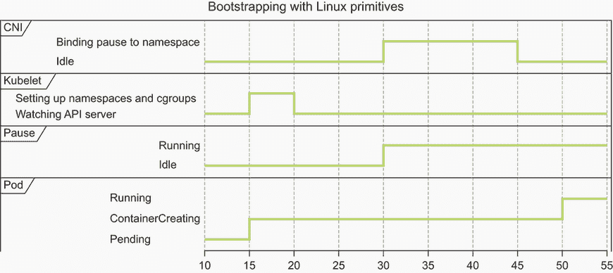
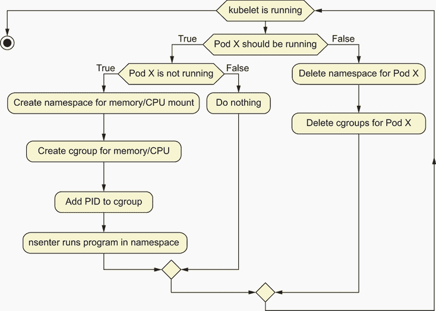
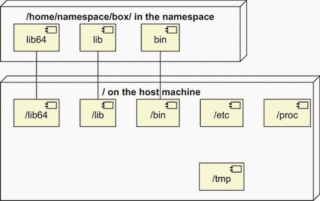
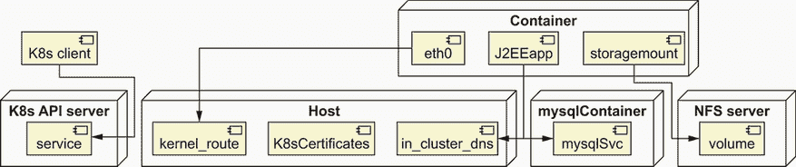

# 3 让我们构建一个 Pod

本章涵盖

+   探索 Linux 原语的基本知识

+   利用 Linux 原语在 Kubernetes 中

+   不使用 Docker 构建自己的 Pod

+   为什么某些 Kubernetes 插件随着时间的推移而演变

本章通过介绍使用您操作系统中已经存在的几个 Linux *原语*来构建 Pod。这些是 Linux 操作系统中的进程管理的基本构建块，我们很快就会了解到它们可以用来构建更复杂的行政程序或以临时方式完成需要访问操作系统级功能的基本日常任务。这些原语的重要性在于，它们既启发了又实现了 Kubernetes 的许多重要方面。

我们还将探讨为什么我们需要 *CNI 提供者*，这些是可执行程序，为 Pod 提供 IP 地址。最后，我们将回顾 kubelet 在启动容器中扮演的角色。让我们先从一个简短的介绍开始，以便了解接下来几节将要学习的内容。

Guestbook 应用程序沙盒

在第十五章中，我们将通过一个具有前端、网络和后端的实际 Kubernetes 应用程序进行讲解。如果您想从应用的角度获得 Kubernetes Pods 工作的高级概述，不妨跳转到那一章。

图 3.1 展示了在 Kubernetes 中创建和运行 Pod 的本质。它非常简化，我们将在后续章节中进一步阐述这个图中的某些细节。现在，值得注意的是，Pod 首次创建和被宣布为运行状态之间存在一段很长的时间。假设您自己运行过一些 Pod，您可能非常清楚这种延迟。在这段时间里发生了什么？一系列您在日常生活中可能不会使用的 Linux 原语被召唤起来，以创建所谓的 *容器*。简而言之

+   kubelet 必须找出它应该运行一个容器。

+   kubelet（通过与容器运行时通信）然后启动一个 *pause 容器*，这给 Linux 操作系统留出时间来为容器创建网络。这个 pause 容器是我们将要运行的实际应用程序的前身。它存在是为了创建一个初始的家，以便引导我们的新容器网络进程及其进程 ID（PID）。

+   在启动过程中，各种组件的状态如图 3.1 中的每个泳道所示，会进行振荡。例如，CNI 提供者在将 pause 容器绑定到网络命名空间的时间之外，大部分时间都是空闲的。



图 3.1 使用 Linux 原语引导

在图 3.1 中，x 轴表示 Pod 启动的相对时间尺度。在一段时间内会发生几个操作，这些操作涉及*子路径*（外部存储目录的布线，我们的容器读取或写入）。这些操作发生在 Pod 进入运行状态前的 30 秒标记之前的同一时间范围内。正如提到的，各种 Linux 命令使用由 kubelet 触发的 Linux 基本原语，以便将 Pod 带入其最终的运行状态。

存储、绑定挂载和子路径

Kubernetes Pods 中的存储通常涉及*绑定挂载*（将一个文件夹从一个位置附加到另一个位置）。这允许容器在其文件树中的特定子路径“看到”一个目录。这是一个基本的 Linux 功能，在挂载 NFS 共享等操作中经常使用。

绑定挂载在各种系统中被用于实现许多 Kubernetes 关键功能。这包括允许 Pod 访问存储。我们可以使用像`nsenter`这样的工具来调查哪些目录可供隔离进程使用，而实际上并不依赖于容器运行时（如 Docker 或 crictl）的使用。

由于`nsenter`是一个简单的 Linux 可执行文件，它针对的是基础 OS API，因此无论你是否在特定的 Kubernetes 发行版中，它总是可用的。因此，即使 Docker 或 crictl 不可用，你也可以使用它。对于 Windows 集群，当然，你不能依赖`nsenter`，在调查底层问题时，你可能更依赖于容器运行时工具。

作为这些原语基础性质的例子，我们可以查看以下代码的注释，这些代码位于 Kubernetes 本身的`pkg/volume/util/subpath/subpath_linux.go`文件中，位于此处：[`mng.bz/8Ml2`](http://mng.bz/8Ml2)。这展示了这些原语在 Kubernetes 实现中的普遍性：

```
func prepareSubpathTarget(mounter mount.Interface,s Subpath)
(bool, string, error) { ... }        ❶
```

❶ 创建子路径绑定挂载的目标

在`prepareSubpathTarget`函数创建子路径的绑定挂载目标之后，子路径就可以在容器内部访问了，即使它是创建在 kubelet 上的。之前，`NsEnterMounter`函数提供了这种功能，以便在容器内部完成各种目录操作。你可能不需要再次阅读这段代码。然而，了解 Kubernetes 本身中引用了`nsenter`的遗迹是有帮助的。

从历史上看，`nsenter`在 Kubernetes 中多次被用来解决容器运行时在管理存储方面的错误或怪癖。同样，如果你遇到与存储或目录挂载相关的问题，了解有 Linux 工具可以做到与 kubelet 和你的容器运行时相同的事情，检查问题所在的位置是很有用的；`nsenter`只是简单 Linux 命令的一个例子。

## 3.1 使用 kind 查看 Kubernetes 原语

让我们从创建一个简单的集群开始，我们可以用它来证明这些概念中的几个。没有比使用`kind`（[`kind.sigs.k8s.io`](https://kind.sigs.k8s.io)）更容易创建 Kubernetes 环境引用的方法，`kind`是一个 Kubernetes 的开发者工具。这将是我们在本书中进行的许多实验的基础。

首先，我们需要设置一个简单的 Linux 环境，这样我们就可以探索这些概念。因为我们将使用`kind`，这允许您在容器运行时（如 Docker Enginer）内部运行 Kubernetes 集群（单节点或多节点）。`kind`通过为每个节点创建一个新的容器来在任何操作系统上运行。我们可以将`kind`集群与表 3.1 所示的现实世界集群进行比较。

表 3.1 比较`kind`与“真实”集群

| 集群类型 | 管理员 | Kubelet 类型 | 允许交换 |
| --- | --- | --- | --- |
| `kind` | 您（Docker 用户） | Docker 容器 | 是（不适用于生产环境） |
| GKE（Google Kubernetes Engine） | Google | 一个 GCE（Google 计算引擎）节点 | 否 |
| 集群 API | 运行中的主集群 | 您选择的任何云提供商中的虚拟机 | 否 |

表 3.1 比较了`kind`集群与我们在生产中运行的常规集群的架构。`kind`的许多方面都不适合生产。例如，因为它允许资源交换，这最终意味着容器可能会利用磁盘空间作为它们的内存。如果许多容器突然需要更多内存来运行，这可能会产生明显的性能和计算成本。然而，`kind`的好处在于，当学习是重点时，这一点是显而易见的。

+   它不花费任何费用。

+   它可以在几秒钟内安装。

+   如果需要，它可以在几秒钟内重建。

+   它可以无问题地运行基本的 Kubernetes 功能。

+   它能够运行几乎任何网络或存储提供商，因此它足够现实，可以开始使用 Kubernetes。

在我们的案例中，我们将使用`kind`Docker 容器不仅运行一些 Kubernetes 示例，而且将其用作一个轻量级的 Linux 虚拟机，我们可以在其中进行修改。我们将通过深入研究 Kubernetes 网络内部，查看我们如何使用`iptables`命令在 Kubernetes 集群内部路由流量来结束本章。

设置您的计算机

在我们开始之前，这里有一个关于设置您的计算机的快速说明。我们假设您熟悉使用[`kubernetes.io`](https://kubernetes.io)网站和各种搜索引擎来查找有关如何安装的最新信息，并且您至少有一些基本的 Linux 经验，可以安装某些发行版的软件包。一般来说，我们不会为您提供所有细微任务的特定说明，但请记住，您将需要一个 Linux 环境来跟随本章的内容：

+   如果您正在运行 Windows，您将需要使用 VMware Fusion、VirtualBox 或 Hyper-V 安装带有 Linux 的虚拟机。

+   如果你正在运行 Linux，你可以尝试使用这些示例，无论是有还是没有 `kind` 集群。

+   如果你正在运行 Mac，你可以简单地下载 Docker 桌面，然后你就可以设置好了。

如果你还没有设置好所有这些，我们鼓励你花时间去做。如果你是 Linux 用户，你可能已经习惯了不同编程工具的 DIY 设置。对于其他人来说，只需搜索“在 Windows 上运行 Linux 容器”或“如何在 OS X 上运行 Docker”等，你就可以在几分钟内开始运行。几乎每个现代操作系统都以某种方式支持运行 Docker。

## 3.2 什么是 Linux 原语？

如前所述，Linux 原语是 Linux 操作系统的基本构建块。例如，`iptables`、`ls`、`mount` 以及大多数 Linux 发行版中可用的许多其他基本程序都是此类原语的例子。如果你在软件开发相关的任何技术领域工作过，你几乎肯定使用过其中的一些命令。例如，`ls` 命令是任何使用 Linux 终端的人首先学习的工具之一。它列出了你当前目录中的所有文件。如果你向它发送一个参数（例如 `/tmp`），那么它将列出该目录中的所有文件。

了解这些工具的基本知识让你在理解 Kubernetes 生态系统中众多新插件和附加组件时具有强大的优势。这是因为它们大多都是建立在同一套基本构建块之上的：

+   *网络代理* `kube-proxy` *创建 iptables 规则，这些规则通常被检查以调试大型集群中的容器网络问题。在 Kubernetes 节点上运行 `iptables -L` 可以说明这一点。容器网络接口 (CNI) 提供商也使用这个网络代理（例如，用于与 NetworkPolicies 实现相关的各种任务）。

+   *容器存储接口 (CSI) 定义了 kubelet 和存储技术之间的通信套接字。这包括 Pure、GlusterFS、vSAN、弹性块存储 (EBS)、网络文件系统 (NFS) 等资源。例如，在集群中运行 `mount` 可以显示 Kubernetes 管理的容器和卷挂载，而不依赖于 `kubectl` 或任何其他非原生 OS 工具，因此，这是在 Kubernetes 中调试底层存储错误时的常见调试技术。*

+   *在创建隔离进程时，会使用像* `unshare` *和* `mount` *这样的容器运行时命令。这些命令通常需要由创建容器的技术运行。运行这些命令（通常需要 root 权限）的能力是当在 Kubernetes 集群中建模威胁时的重要安全边界。*

我们通常通过 shell 访问`ls`工具，或者通过将许多 shell 命令组合成一个 shell 脚本。许多 Linux 命令可以从 shell 中运行，并且通常它们会返回文本输出，这些输出可以用作下一个命令的输入。我们通常将`ls`作为更广泛脚本的一部分来访问的原因是，我们可以将其与其他程序结合使用（例如，在目录中的所有文件上运行命令）。这又把我们带回了 Kubernetes 的话题。

### 3.2.1 Linux 基本操作是资源管理工具

系统管理的一个重要部分涉及管理机器上的资源。尽管`ls`看起来像是一个简单的程序，但在资源管理方面，它也是一个强大的工具。管理员每天都会使用这个程序来查找大文件或检查用户是否有能力在用户或其他程序报告权限错误的情况下执行基本操作。它使我们能够找到

+   我们是否可以访问某个文件

+   在任意目录中可用的文件有哪些

+   该文件具有哪些功能（例如，它是否可执行？）

说到文件，这让我们想到了 Linux 基本操作的下一个方面：*一切皆文件*。这是 Linux 与其他操作系统（如 Windows）之间的一个关键区别。事实上，当在 Kubernetes 集群中运行 Windows 节点时，检查和监控事件状态的能力可能会更复杂，因为没有统一的对象表示。例如，许多 Windows 对象存储在内存中，只能通过 Windows API 访问，而不能通过文件系统访问。

“一切皆文件”是 Linux 的独特之处

在 Windows 中，机器的管理通常需要编辑 Windows 注册表。这需要运行自定义程序，并且通常需要使用 Windows GUI。使用 PowerShell 和其他工具执行许多系统管理方面的工作是有方法的；然而，通常不可能仅通过读取和写入文件来管理整个 Windows 操作系统。

相比之下，Linux 管理员通常通过管理纯文本文件来执行系统管理的几乎所有方面。例如，管理员非常了解/proc 目录，它包含有关正在运行进程的实时信息。在许多方面，它可以像管理文件目录一样进行管理，尽管它从任何意义上说都不是一个“正常”的目录。

### 3.2.2 一切都是文件（或文件描述符）

Linux 的基本操作，从某种意义上讲，几乎总是对某种类型的文件进行操作、移动或提供抽象。这是因为你将需要用 Kubernetes 构建的*所有*东西最初都是为 Linux 设计的，而 Linux 完全是为了使用文件抽象作为控制原语而设计的。

例如，`ls`命令作用于文件。它查看一个文件（即目录）并读取该文件内的文件名。然后它将这些字符串打印到另一个文件，称为标准输出。标准输出不是一个我们通常会考虑的典型文件；相反，它是一个文件，当我们写入时，神奇地在我们的终端中显示内容。当我们说在 Linux 中一切都是文件时，我们真的是这个意思！

+   *目录也是一个文件，但它包含其他文件的名称.*

+   *设备也被表示为文件给 Linux 内核.* 因为设备可以作为文件访问，这意味着你可以使用像`ls`这样的命令来确认例如以太网设备是否在容器内连接。

+   *套接字和管道也是文件，进程可以在本地使用它们进行通信.* 之后，我们将看到 CSI 如何大量利用这种抽象来定义 kubelet 与卷提供者通信的方式，为我们的 Pod 提供存储。

### 3.2.3 文件是可组合的

结合之前关于文件和资源管理的概念，我们现在来到 Linux 原语最重要的一个点：它们可以组合成更高级的操作。使用管道（`|`），我们可以将一个命令的输出传递给另一个命令进行处理。这个命令最流行的用法之一是将`ls`与`grep`命令结合，以过滤特定文件并列出它们。

例如，一个常见的 Kubernetes 管理任务可能是确认 etcd 在集群内运行且健康。如果作为容器运行，可以在运行 Kubernetes 控制平面组件（几乎总是运行关键的 etcd 进程）的节点上运行以下命令：

```
$ ls /var/log/containers/ | grep etcd
etcd-kind-control-plane_kube-system_etcd-44daab302813923f188d864543c....log
```

同样，如果你在一个来源不明的 Kubernetes 集群中，你可以找出与 etcd 相关的配置资源所在的位置。你可能运行如下命令：

```
$ find /etc | grep etcd; find /var | grep etcd
```

容器中的 etcd？

你可能想知道为什么 etcd 在容器中运行。简短地说明一下，以免给你错误的印象：在生产集群中，通常将 etcd 运行在与其他容器不同的地方。这可以防止对宝贵的磁盘和 CPU 资源的竞争。然而，许多较小的或开发者集群为了简单起见，将所有控制平面组件运行在同一个地方。话虽如此，许多 Kubernetes 解决方案已经证明，只要这个容器的卷存储在本地磁盘上，那么 etcd 就可以在容器中良好运行，这样在容器重启时就不会丢失。

这就是我们可以用理论走到的尽头。从现在开始，我们将动手操作，运行大量的 Linux 命令，从零开始构建自己的 Pod-like 行为。但在我们走这条路之前，我们将使用`kind`来设置一个我们可以玩耍的集群。

### 3.2.4 设置 kind

与 Kubernetes 和 Docker 一起，`kind` 是由 Kubernetes 社区维护的一个聪明工具。它使用无其他依赖项在 Docker 容器内构建 Kubernetes 集群。这允许开发者本地模拟具有许多节点的真实集群，无需创建虚拟机或使用其他重型结构。它不是一个生产级 Kubernetes 提供商，仅用于开发或研究目的。为了跟随本书，我们将构建一些 `kind` 集群，对于本章，我们的第一个集群可以通过遵循 [`mng.bz/voVm`](http://mng.bz/voVm) 中的说明来构建。

`kind` 在任何操作系统上只需几秒钟即可安装，并允许我们在 Docker 内运行 Kubernetes。我们将把每个 Docker 容器视为一个虚拟机，并执行到这些容器中以调查 Linux 的一般特性。将 `kind` 设置为基本 Kubernetes 开发环境的流程很简单：

1.  安装 Docker。

1.  将 `kubectl` 安装到 /usr/local/bin/kubectl。

1.  将 `kind` 安装到 /usr/local/bin/kind。

1.  通过运行 `kubectl get pods` 测试安装。

我们为什么使用 `kind`？本书有很多示例，如果您想亲自运行它们（我们鼓励这样做，但阅读本书并不需要这样做），您将需要一个某种 Linux 环境。由于我们谈论的是 Kubernetes，我们选择了 `kind`，原因如前所述。然而，如果您是高级用户，您不必觉得有义务使用 `kind`。如果您熟悉很多这方面的内容，只想深入挖掘以到达难点，您也可以在任何 Kubernetes 集群上运行许多这些命令。但当然，我们假设您将在某种 Linux 变体上运行这些命令，因为 cgroups、Linux 命名空间和其他 Kubernetes 基本原语在 Windows 和 Mac OS X 等商业操作系统发行版中默认不可用。

Windows 用户

`kind` 可以作为 Windows 可执行文件安装。我们鼓励您查看 [`kind.sigs.k8s.io/docs/user/quick-start/`](https://kind.sigs.k8s.io/docs/user/quick-start/)。它甚至有 Choco `install` 命令可以运行。如果您是 Windows 用户，您可以在 Windows 子系统 for Linux (WSL 2) 中运行本书中的所有命令，这是一个轻量级的 Linux 虚拟机，可以在任何 Windows 机器上轻松运行。

注意，您还可以将 `kubectl` 作为 Windows 可执行文件运行，以连接到任何云上的远程集群。尽管我们在本书中似乎更倾向于 Linux 和 OS X，但我们完全支持您在 Windows 机器上运行这些命令！

一旦安装了 `kind`，您就可以创建一个集群。为此，请使用以下命令：

```
$ kind delete cluster --name=kind    ❶

Deleting cluster "kind" ...

$ kind create cluster                ❷
Creating cluster "kind" ...
 ✓ Ensuring node image (kindest/node:v1.17.0) 🖼
 ✓ Preparing nodes 📦
 ✓ Writing configuration 📜
⢅⡱ Starting control-plane 🕹
```

❶ 如果之前有集群正在运行，则删除 `kind` 集群

❷ 启动您的友好集群

现在，您可以看到集群中正在运行的 Pods。要获取 Pods 列表，请执行以下代码片段中的命令，它还显示了该命令的示例输出：

```
$ kubectl get pods  --all-namespaces
NAMESPACE            NAME                    READY   STATUS    AGE
kube-system          coredns-6955-6bb2z      1/1     Running   3m24s
kube-system          coredns-6955-82zzn      1/1     Running   3m24s
kube-system          etcd-kind-control-plane 1/1     Running   3m40s
kube-system          kindnet-njvrs           1/1     Running   3m24s
kube-system          kube-proxy-m9gf8        1/1     Running   3m24s
```

如果你想知道你的 Kubernetes 节点在哪里，你很幸运！你可以通过简单地询问 Docker 来轻松列出它：

```
$ docker ps

CONTAINER ID        IMAGE                  COMMAND
776b91720d39        kindest/node:v1.17.0   "/usr/local/bin/entr."

CREATED             PORTS                       NAMES
4 minutes ago       127.0.0.1:32769->6443/tcp   kind-control-plane
```

最后，如果你是系统管理员并且想要能够通过 ssh 连接到你的节点，你也很幸运。我们可以通过运行以下命令进入你的 Kubernetes 节点：

```
$ docker exec -t -i 776b91720d39 /bin/sh
```

以及本节前面显示的命令。你将需要在节点内部（实际上是一个容器）运行这些命令。

顺便说一句，你可能想知道 Kubernetes 是如何在 Docker 中运行的。这难道意味着 Docker 容器可以启动其他 Docker 容器吗？绝对可以。如果你查看 kind 的 Docker 镜像（[`mng.bz/nYg5`](http://mng.bz/nYg5)），你可以看到它是如何工作的。特别是，你可以看到它安装的所有 Linux 原语，其中包括我们之前讨论的一些。阅读这段代码是在完成本章后尝试的一个很好的家庭作业。

## 3.3 在 Kubernetes 中使用 Linux 原语

Kubernetes 中的核心功能通常与基本 Linux 原语的工作方式相关联，无论是间接还是直接。这些原语构成了运行容器的支架，在你理解它们之后，你将不断回到这里。随着时间的推移，你会发现许多使用像“服务网格”或“容器原生存储”这样的热词的技术，最终归结为巧妙组装的相同基本操作系统功能的大杂烩。

### 3.3.1 运行 Pod 的前提条件

作为提醒，*Pod*是 Kubernetes 集群中的基本执行单元：它是我们在数据中心中定义将运行的容器的途径。尽管存在一些理论场景，其中一个人可能会使用 Kubernetes 来完成除了运行容器之外的任务，但我们在这本书中不关注这样的异常情况。毕竟，我们假设你对在像地球上其他地方的人一样传统的环境中运行和理解 Kubernetes 感兴趣。

为了创建一个 Pod，我们依赖于实现隔离、网络和进程管理的功能。这些结构可以通过使用 Linux OS 中已经可用的许多实用程序来实现。实际上，其中一些实用程序可能被认为是*必需的*功能，没有这些功能，kubelet 将无法执行启动 Pod 所需的必要任务。让我们快速看一下我们在 Kubernetes 集群中每天依赖的一些程序（或*原语*）：

+   `swapoff`—一个禁用内存交换的命令，这是以尊重 CPU 和内存设置的方式运行 Kubernetes 的已知前提条件。

+   `iptables`—网络代理的核心需求（通常是），它创建 iptables 规则将服务流量发送到我们的 Pods。

+   `mount`—这个命令（之前提到过）将资源投影到你的路径中的特定位置（例如，它允许你将设备作为文件夹暴露在你的家目录中）。

+   `systemd`——这个命令通常启动 kubelet，它是集群中运行的核心进程，用于管理你所有的容器。

+   `socat`——这个命令允许你在进程之间建立双向信息流；`socat` 是 `kubectl port-forward` 命令工作的关键部分。

+   `nsenter`——这是一个工具，用于进入进程的各种命名空间，以便你可以看到正在发生的事情（从网络、存储或进程的角度）。与 Python 中的命名空间具有某些具有本地名称的模块一样，Linux 命名空间具有某些资源，这些资源不能从外部世界本地访问。例如，Kubernetes 集群中 Pod 的唯一 IP 地址不会与其他 Pod 共享，即使在同一节点上，因为每个 Pod（通常）都在一个单独的命名空间中运行。

+   `unshare`——这是一个允许进程创建与网络、挂载或 PID 视角隔离的子进程的命令。在本章中，我们将彻底使用它来探索容器中的著名 *Pid 1 现象*，在 Kubernetes 集群中，每个容器都认为自己是整个世界上唯一的程序。

    `unshare` 也可以隔离挂载点（`/` 位置）和网络命名空间（IP 地址），因此它是原生 Linux 操作系统中与 `docker run` 最直接对应的命令。

+   `ps`——一个列出正在运行进程的程序。kubelet 需要持续监控进程，以确定它们何时退出等。通过使用 `ps` 列出进程，你可以确定你的集群中是否有“僵尸”进程，或者是否有特权容器变得失控（创建了许多新的子进程）等。

### 3.3.2 运行一个简单的 Pod

在我们了解如何使用这些命令之前，让我们看看如何使用我们的 `kind` 集群创建一个 Pod。通常，你不会手动创建 Pod，而是创建一个 Deployment、DaemonSet 或 Job。现在，最好先不考虑这些高级结构，创建一个简单、孤立的 Pod。我们将通过在以下代码片段中编写 YAML 文件后运行 `kubectl create` `-f` `pod.yaml` 来创建一个 Pod。但在创建之前，让我们快速过一下这个 YAML 文件的两个注意事项，以免你感到困惑：

+   *如果你想知道 BusyBox 镜像是什么，BusyBox Pod 只是一个你可以运行的极简 Linux 镜像，用于调查默认容器行为。尽管通常使用 NGINX Pod 作为标准，但我们选择 BusyBox，因为它包含了 `ip a` 命令以及其他一些基本实用工具。很多时候，生产级别的微服务会从容器中移除二进制文件以减少潜在的安全漏洞足迹。*

+   *如果你想知道为什么我们要定义一个* `webapp-port`*，你正在正确的道路上!* 它没有任何作用，除了帮助你熟悉 Pod 定义中的语法。我们不会在端口 80 上运行任何服务，但如果你要用类似 NGINX 这样的东西替换这个镜像，那么这个端口将是一个负载均衡的端点，你可以用它来指向 Kubernetes 服务。

```
$ cat << EOF > pod.yaml
apiVersion: v1
kind: Pod
metadata:
  name: core-k8s
  labels:                                  ❶
   role: just-an-example
    app: my-example-app
    organization: friends-of-manning
    creator: jay
spec:
  containers:
    - name: any-old-name-will-do
      image: docker.io/busybox:latest      ❷
     command: ['sleep','10000']
      ports:
        - name: webapp-port
          containerPort: 80
          protocol: TCP
EOF

$ kubectl create -f pod.yaml               ❸
```

❶ 标签的元数据让我们可以选择这个 Pod 作为负载均衡的目标或作为对 Kubernetes API 服务器的查询中的过滤器。

❷ 这个 docker.io 镜像名称必须是真实的，可以从互联网上拉取，或者标记为本地容器镜像。

❸ 在 Kubernetes 默认命名空间中创建 Pod

不要与用于创建此集群的 `kind` 工具混淆，我们在 Pod 定义中的 `kind` API 字段告诉 API 服务器当我们创建此 Pod 时它是什么类型的 API 对象。如果我们在这里输入错误的内容（例如，`Service`），那么 API 服务器会尝试创建不同的对象。因此，定义我们的 Pod 的第一步是将其定义为一种类型（或 *kind*）。稍后，在本节中，我们将运行一个命令来查看此 Pod 的路由和 IP 配置，所以请保留这个片段以便使用！

在创建 Pod 之后，让我们看看其进程在启动时对我们操作系统的可见性。确实，它在操作系统中注册了。下面的 `ps -ax` 命令是一种快速简单的方法，可以列出系统上的所有进程，包括可能没有终端的进程。*x* 特别重要，因为我们处理的是系统而不是用户级软件，我们想要所有正在运行的程序的全局计数，以说明教学原因：

```
$ ps -ax | wc -l               ❶
706

$ kubectl create -f pod.yml    ❷
pod "core-k8s" deleted

$ ps -ax | wc -l               ❸
707
```

❶ 计算最初运行了多少个进程

❷ 创建一个 Pod

❸ 计算在 Pod 创建后运行了多少个进程

### 3.3.3 探索 Pod 的 Linux 依赖关系

我们现在已经在集群中运行了一个 Pod。这个 Pod 运行一个程序，该程序需要访问像 CPU、内存、磁盘等基本计算单元。这个 Pod 与常规程序有什么不同？嗯，从最终用户的角度来看，它根本没有任何不同。例如，像任何正常程序一样，我们的 Pod

+   使用共享库或特定于操作系统的低级实用程序，允许它消耗键盘输入、列出文件等。

+   可以访问一个客户端，它可以与 TCP/IP 堆栈的实现一起工作，以便进行网络调用和接收。（这些通常被称为 *系统调用*。）

+   需要某种内存地址空间来保证其他程序不会覆盖其内存。

当创建此 Pod 时，kubelet 执行了许多任何人在尝试在服务器上运行计算机程序时可能会执行的活动。它

+   为程序创建一个隔离的运行环境（带有 CPU、内存和命名空间限制）

+   确保其家有一个工作的以太网连接

+   给程序访问一些基本文件，用于解析 DNS 或访问存储

+   告诉程序它可以安全地进入并启动

+   等待程序退出

+   清理程序的家和使用的资源

我们会发现，在 Kubernetes 中我们所做的几乎所有事情都是复制了我们几十年来一直在做的常规管理任务。换句话说，kubelet 只是在为我们运行 Linux 系统管理员的操作手册。

我们可以将这个过程可视化为 Pod 的 *生命周期*，这是一个循环过程，反映了基本控制循环，它定义了 kubelet 在运行时持续执行的操作（图 3.2）。由于 Pod 中的容器可能在任何时候死亡，因此存在一个控制循环来在这些情况下使它们复活。在整个 Kubernetes 中，这样的控制循环以“分形”的方式发生。事实上，可以说 Kubernetes 本身就是一个由巧妙控制循环组成的复杂组织，这些控制循环使我们能够以自动化的方式大规模运行和管理容器。



图 3.2 kubelet/Pod 生命周期控制循环

其中一个最低级别的控制循环就是 kubelet/Pod 生命周期本身。在图 3.2 中，我们将 kubelet 的终止表示为一个点。只要 kubelet 运行，就存在一个持续的协调循环，我们可以检查 Pod 并启动它们。虽然我们再次引用 `nsenter` 作为 kubelet 的下游操作之一，但请注意，`nsenter`（可以在 Linux 上运行和管理容器）的使用不会翻译到其他容器运行时或操作系统。

如我们很快就会了解到的那样，Pod 最终可以通过在正确的时间和顺序运行各种命令来获得，从而实现我们在上一章中讨论的可爱功能。我们新创建的 Pod 显示了几个状态字段，这些字段值得检查。

Docker 在其中扮演什么角色呢？

如果你对于 Kubernetes 还有些陌生，你可能想知道我们什么时候开始讨论 Docker。实际上，我们不会过多地讨论 Docker，因为它越来越成为一个与服务器端容器解决方案无关的开发者工具。

尽管 Kubernetes 多年来一直支持原生 Docker，但截至 Kubernetes 1.20，支持 Docker 的弃用过程已经全面展开，最终 Kubernetes 本身将完全不知道任何容器运行时。因此，尽管 kubelet 在资源使用方面维护 Pod 的生命周期，但它将启动和停止 Pod 以及拉取容器镜像的任务委托给名为 CRI（容器运行时接口）的接口。

CRI 最常见实现是*containerd*，实际上，Docker 本身在底层使用 containerd。CRI 以最小接口的形式表示 containerd 的一些（但不是全部）功能，这使得人们很容易为 Kubernetes 实现自己的容器运行时。标准的 containerd 可执行文件向 kubelet 提供 CRI，当调用这个 CRI 时，containerd（服务）会调用 runc（Linux 容器）或 hcsshim（Windows 容器）等程序，再次在底层。

一旦 Pod 在 Kubernetes 中运行（或者至少 Kubernetes 知道它应该运行一个 Pod），你就可以看到 API 服务器中的`Pod`对象有新的状态信息。你可以尝试运行以下命令来查看这些信息：

```
$ kubectl get pods -o yaml
```

你会看到一个大的 YAML 文件。因为我们承诺我们的 Pod 有自己的 IP 地址和运行其进程的健康环境，现在让我们确认这些资源是可用的。我们通过在查询中使用`jsonpath`来找到特定的细节。

使用 JSONPath 检查 Pod

从`status`中过滤掉属性，让我们看看这些字段中的几个。同时，我们也会使用 Kubernetes 的 JSONPath 功能来过滤我们想要的具体信息。例如：

```
$ kubectl get pods -o=jsonpath='{.items[0].status.phase}'  ❶
Running 

$ kubectl get pods -o=jsonpath='{.items[0].status.podIP}'  ❷
10.244.0.11 

$ kubectl get pods -o=jsonpath='{.items[0].status.hostIP}' ❸
172.17.0.2 
```

❶ 查询我们 Pod 的状态

❷ 查询我们 Pod 的 IP 地址

❸ 查询我们运行的主机的 IP 地址

注意：你可能注意到，除了 pod.yaml 中的新状态信息之外，你还在其`spec`部分有一些新的信息。这是因为 API 服务器可能需要在提交 Pod 之前修复一些元素。例如，像`terminationMessagePath`和`dnsPolicy`这样的东西，通常不需要用户进行更改，可以在定义 Pod 后为你添加。在一些组织中，你可能还实施了一个自定义的准入控制器，它在将对象传递到 API 服务器之前“查看”传入的对象并对其进行修改（例如，在大型数据中心中为容器添加硬 CPU 或内存限制）。

在任何情况下，使用之前的命令

+   我们可以看到我们的 Pod 正在被操作系统监控，并且它的状态是运行中。

+   我们可以看到 Pod 生活在与我们的主机不同的 IP 空间（称为网络命名空间）中，10.244.0.11/16。

检查我们挂载到 Pod 中的数据

Kubernetes 慷慨地提供给所有 Pod 的一个字段是`default-token.`卷。这给我们的 Pod 提供了一个证书，允许它们与 API 服务器通信并“回家”。除了 Kubernetes 卷之外，我们还为 Pod 提供了 DNS 信息。要查看这些信息，你可以在 Pod 内部运行`mount`命令，通过执行`kubectl exec`。例如：

```
$ kubectl exec -t -i core-k8s mount | grep resolv.conf
/dev/sda1 on /etc/resolv.conf type ext4 (rw,relatime)
```

在这个例子中，我们可以看到，当我们在容器内运行`*mount*`命令时，实际上显示的是文件`/etc/resolv.conf`（它告诉 Linux DNS 服务器所在的位置）是从另一个位置挂载的。这个位置（`/dev/sda1`）是卷在我们主机上的位置，那里有相应的`resolv.conf`文件。实际上，在我们的例子中，`mount`命令还有其他文件的条目，其中许多实际上是通过符号链接回主机上的`/dev/sda1`目录。这个目录通常对应于`/var/lib/containerd`中的一个文件夹。你可以通过运行以下命令来定位这个文件：

```
$ find /var/lib/containerd/ -name resolv.conf
```

不要过于纠结这个细节。它是 kubelet 底层实现的一部分，但知道这些文件确实存在于你的系统中，并且可以在需要时使用标准 Linux 工具（例如，如果你的集群表现不佳）找到，这很好。

在虚拟机中，*虚拟机管理程序*（创建虚拟机的东西）并不知道虚拟机正在运行什么进程。然而，在容器化环境中，所有由 containerd（或 Docker 或任何其他容器运行时）创建的进程都由操作系统本身积极管理。这允许 kubelet 执行许多细粒度的清理和管理任务，同时也允许 kubelet 向 API 服务器暴露有关容器状态的重要信息。

更重要的是，这表明你作为管理员，以及 kubelet 本身，能够管理和查询进程，检查这些进程的卷，甚至在必要时终止这些进程。尽管其中一些可能对你来说很显然，我们之所以展示这一点，是因为我们想要强调，在大多数 Linux 环境中，我们称之为容器的那些东西，只是通过一些隔离的铃声和哨声创建的进程，使它们能够与微服务集群中的数百个其他进程良好地协作。Pod 和进程与您可能运行的常规程序并没有太大的不同。总之，我们的 Pod

+   `*具有用于访问我们的 API 服务器的证书的存储卷。`这为 Pods 提供了一种简单的方法来访问内部 Kubernetes API，如果它们想要的话。这也是 Operator 或 Controller 模式的基础，这些模式允许 Kubernetes Pods 创建其他 Pods、服务等等。

+   `*具有一个特定的 10 子网 IP 地址。`这与 172 子网中的主机 IP 地址不同。

+   `*在其内部命名空间上的 IP 地址 10.244.0.11 的端口 80 上提供服务。`我们集群中的其他 Pod 也可以访问这个端口。

+   `*在我们的集群中运行得很好。`现在它有一个具有唯一 PID 的容器，这对于我们的主机来说是完全可管理和可见的。

注意，我们还没有对 iptables 进行操作以将流量路由到我们的 Pod。当你创建一个没有服务的 Pod 时，你实际上并没有按照 Kubernetes 通常设计的方式设置网络。尽管我们的 Pod 的 IP 地址在集群中是可查找的，但没有任何方法可以将流量负载均衡到 Pod 的其他兄弟和姐妹。为此，我们需要与服务关联的标签和标签选择器。我们将在第四章中稍后讨论 Kubernetes 网络。

现在你已经探索了真实集群中简单 Pod 的基本功能，我们将看看我们如何可以通过使用基本的 Linux 原语来构建这个功能。通过构建这个功能的过程（没有集群）会让你接触到许多核心能力，这将提高你对 Kubernetes 安装工作原理的理解，如何管理大型集群，以及如何在野外调试容器运行时。系好安全带，准备享受一次刺激的旅程！

## 3.4 从零开始构建 Pod

我们将回到过去，因为我们将尝试在 Kubernetes 存在之前构建一个容器管理系统。我们应该从哪里开始？我们之前已经讨论过我们 Pod 的四个基本方面，特别是

+   存储

+   IP 地址分配

+   网络隔离

+   流程识别

我们将不得不使用我们的基础 Linux 操作系统来实现这个功能。幸运的是，我们的 `kind` 集群已经有一个基本的 Linux 操作系统，我们可以用它来本地使用，因此我们不需要为这个练习创建一个专门的 Linux 虚拟机。

这个 Pod 真的能工作吗？

这不是你会在现实世界中运行的 Pod 类型；它将充满手动操作，我们构建它的过程不会扩展到生产工作负载。但是，在我们所做事情的核心，我们将反映 kubelet 在任何云或数据中心创建容器时所经过的相同过程。

让我们进入我们的 `kind` 集群并开始动手！这可以通过运行 `docker ps | grep kind | cut -d' ' -f 1` 来列出你的 `kind` 容器 ID，然后通过运行 `docker exec -t -i container_id /bin/sh` 来跳入这些节点之一。因为我们将编辑 `kind` 集群中的文本文件，所以让我们使用以下命令安装 Vim 编辑器或你可能习惯使用的任何其他编辑器：

```
root@kind-control-plane:/# sudo apt-get update -y
root@kind-control-plane:/#  apt-get install vim
```

如果你刚接触 Kubernetes 和 `kind`（并且你现在感到有些头晕），是的，你说得对；我们现在正在做一些元操作。本质上，我们正在模拟一个真实的集群以及我们所有人都熟悉和喜爱的 SSH 调试。在 `kind` 集群容器上运行 `docker exec` 的方法（大致上）相当于在真实集群中的真实 Kubernetes 节点上执行 `ssh`。

### 3.4.1 使用 chroot 创建隔离的进程

首先，我们将以最纯净的方式创建一个容器——一个文件夹，它恰好包含运行 Bash shell 所需的一切，绝对没有其他东西（如图 3.3 所示）。这是使用著名的 `chroot` 命令完成的。（在其早期，Docker 被称为“加强版的 chroot”）



图 3.3 `chroot` 命名空间与主机根文件系统的比较

`chroot` 的目的是为进程创建一个隔离的根目录。这个过程有三个步骤：

1.  决定你想要运行什么程序以及它在你的文件系统中的运行位置。

1.  为进程创建一个运行环境。有许多 Linux 程序位于 lib64 目录中，即使运行像 Bash 这样的程序也需要它们。这些需要被加载到新的根目录中。

1.  将你想要运行的程序复制到 chroot 位置。

最后，你可以运行你的程序，它将在完美的文件系统隔离中运行。这意味着它将无法看到或触摸你的文件系统上的其他信息（例如，它无法编辑 /etc/ 或 /bin/ 中的文件）。

听起来熟悉吗？应该如此！当我们运行 Docker 容器时，无论是在 Kubernetes 中还是不在 Kubernetes 中，我们总是有这种干净、隔离的环境来运行。实际上，如果你查看 Kubernetes 自身的 issue，你肯定能找到许多关于基于 `chroot` 功能的过去和现在的问题和疑问。现在，让我们通过在 chroot 命名空间中运行一个 Bash 终端来了解 `chroot` 的工作原理。

以下脚本创建了一个盒子，我们可以在其中运行 Bash 脚本或其他 Linux 程序。它对更广泛系统没有其他可见性，也没有冲突，这意味着如果我们想在盒子内运行 `rm -rf /`，我们可以这样做而不会破坏我们实际操作系统中的所有文件。当然，我们不推荐你在家里尝试这样做，除非你在一个可丢弃的机器上，因为一个小错误可能会导致大量数据丢失。为了我们的目的，我们将此脚本作为 chroot.sh 本地存储，以防我们想要重用它：

```
#/bin/bash
mkdir /home/namespace/box

mkdir /home/namespace/box/bin                  ❶
mkdir /home/namespace/box/lib
mkdir /home/namespace/box/lib64

cp -v /usr/bin/kill /home/namespace/box/bin/   ❷
cp -v /usr/bin/ps /home/namespace/box/bin
cp -v /bin/bash /home/namespace/box/bin
cp -v /bin/ls /home/namespace/box/bin

cp -r /lib/* /home/namespace/box/lib/          ❸
cp -r /lib64/* /home/namespace/box/lib64/

mount -t proc proc /home/namespace/box/proc    ❹

chroot /home/namespace/box /bin/bash           ❺
```

❶ 使我们的盒子具有 bin 和 lib 目录，作为我们的 Bash 程序的依赖项

❷ 将我们基础操作系统中的所有程序复制到这个盒子中，这样我们就可以在我们的根目录中运行 Bash

❸ 将这些程序的库依赖复制到 lib/ 目录中

❹ 将 /proc 目录挂载到这个位置

❺ 这部分很重要：我们在一个沙盒目录中启动我们的隔离 Bash 进程。

记住，我们的根目录的正斜杠（`/`）将不会有我们不明确加载的程序。这意味着 `/` 对我们的常规 Linux 路径没有全局访问权限，那里有我们每天运行的正常程序。因此，在前面的代码示例中，我们将 `kill` 和 `ps`（两个基本程序）直接复制到我们的 /home/namespace/box/bin 目录中。而且因为我们已经将 /proc 目录挂载到我们的 chroot 进程中，我们可以看到并访问主机中的进程。这允许我们使用 `ps` 来探索 chroot 进程的安全边界。此时，你应该看到：

+   一些命令如 `cat` 或 `ps` 在我们的 chroot 进程中不可用，而 `ps` 和 `kill` 将可以在任何 Linux 操作系统中运行。

+   其他运行中的命令（如 `ls /`）返回的结果与你在完整的操作系统中所看到的结果大不相同。

+   与你在主机上运行虚拟机时可能看到的情况不同，在这个 chroot 环境中运行或执行事物没有增加性能成本或延迟，因为这只是一个常规的 Linux 命令。如果你没有亲自运行它，结果看起来可能像这样：

```
root@kind-control-plane:/# ./chroot0.sh
'/bin/bash' -> '/home/namespace/box/bin/bash'
'/bin/ls' -> '/home/namespace/box/bin/ls'
'/lib/x86_64-linux-gnu/libtinfo.so.6' ->
    '/home/namespace/box/lib/libtinfo.so.6'
'/lib/x86_64-linux-gnu/libdl.so.2' ->
    '/home/namespace/box/lib/libdl.so.2'
'/lib64/ld-linux-x86-64.so.2' ->
    '/home/namespace/box/lib/ld-linux-x86-64.so.2'

bash-5.0# ls
bin  lib  lib64
```

如果你有一台 Linux 操作系统作为比较，从其根目录运行 `ls` 是很有教育意义的。当你探索完你那荒芜的 `chroot` 沙漠后，继续输入 `exit` 返回到你的常规操作系统。哇，那真是个惊吓！

独立的 `chroot` 环境是我们今天所生活的容器革命的最基础的构建块之一，尽管它长期以来一直被称为“穷人的虚拟机”。`chroot` 命令通常被 Linux 管理员和 Python 开发者用来执行隔离测试和运行特定程序。如果你阅读了前面提到的“加强版的 chroot”部分，现在可能开始理解这一点了。

### 3.4.2 使用 `mount` 为我们的进程提供数据

容器通常需要访问存储在别处的存储：在云端或在主机机器上。`mount` 命令允许你将一个设备暴露在你操作系统 `/`（根）目录下的任何目录中。你通常使用 `mount` 来将磁盘作为文件夹暴露。例如，在我们的运行中的 `kind` 集群中，执行 `mount` 会显示由 Kubernetes 管理的几个文件夹，这些文件夹被暴露在特定位置的具体容器中。

从管理角度来看，`mount` 的最简单用途是为一个可以生活在其他任意位置的磁盘点创建一个已知、恒定的文件夹位置。例如，假设我们想要运行前面的程序，但我们希望它将数据写入一个我们可以稍后丢弃的临时位置。我们可以执行一个简单的操作，如 `mount` `--bind` `/tmp/` `/home/namespace/box/data`，在先前的 chroot 程序中创建一个 /data 目录。然后，该命名空间中的任何用户都可以方便地拥有一个 /data 目录，他们可以使用它来访问我们的 /tmp 目录中的文件。

注意，这会打开一个安全漏洞！在我们将/tmp 的内容挂载到容器之后，任何人现在都可以操纵或读取其内容。这实际上就是为什么 Kubernetes 卷的`hostPath`功能在生产集群中通常被禁用的原因。无论如何，让我们通过使用一些基本的 Linux 原语来确认我们能否将一些数据放入我们在上一节中创建的容器中：

```
root@kind-control-plane:/# touch /tmp/a
root@kind-control-plane:/# touch /tmp/b
root@kind-control-plane:/# touch /tmp/c
root@kind-control-plane:/# ./chroot0.sh
'/bin/bash' -> '/home/namespace/box/bin/bash'
'/bin/ls' -> '/home/namespace/box/bin/ls'
'/lib/x86_64-linux-gnu/libtinfo.so.6' ->
   '/home/namespace/box/lib/libtinfo.so.6'
'/lib/x86_64-linux-gnu/libdl.so.2' ->
   '/home/namespace/box/lib/libdl.so.2'
'/lib64/ld-linux-x86-64.so.2' ->
   '/home/namespace/box/lib/ld-linux-x86-64.so.2'
bash-5.0# ls data
a  b  c
```

就这样！你现在创建了一个类似于容器的东西，并且现在可以访问存储。我们将在稍后探讨容器化的更高级方面，包括用于保护 CPU、内存和网络相关资源的命名空间。现在，为了好玩，让我们运行`ps`并看看在我们的容器中漂浮着哪些其他进程。注意，我们会看到我们的进程和一些其他进程：

```
bash-5.0# ps
  PID TTY          TIME CMD
 5027 ?        00:00:00 sh
79455 ?        00:00:00 bash
79557 ?        00:00:00 ps
```

### 3.4.3 使用 unshare 保护我们的进程

太棒了！到目前为止，我们已经为我们的流程创建了一个沙盒，以及一个可以穿透沙盒的文件夹。这看起来已经很接近 Pod 了，对吧？还不是。尽管我们的 chroot 程序与其他文件隔离（例如，当我们在这个程序内部运行`ls`时，我们只能看到在 chroot0.sh 脚本中明确挂载的文件），但这是否安全呢？结果证明，给一个进程戴上眼罩并不完全等同于保护它。作为一个简单的例子

1.  通过让 Docker 像我们之前做的那样执行到`kind`集群中，在`kind`集群内部运行`ps -ax`。

1.  获取 kubelet 的 ID（例如，744）。为了使这个过程更容易，你可以运行`ps -ax | grep kubelet`。

1.  再次运行 chroot0.sh 命名空间脚本。

1.  在`bash-5.0#`提示符下运行`kill 744`。

你会立即看到你刚刚杀死了 kubelet！尽管我们的 chroot 程序无法访问其他文件夹（因为我们把`/`的位置移动到了一个新的根目录），但它可以一举找到并杀死关键系统进程。因此，如果这是我们容器的话，我们肯定刚刚发现了一个 CVE（常见漏洞和暴露）的漏洞，这可能会使整个集群崩溃。

如果你真的很淘气，甚至可以通过运行`kill 74994`来结束这个进程。这会导致`bash-5.0#`终止行被你的未察觉的 chroot0.sh 进程在最后的喘息中打印出来。因此，不仅其他进程可以看到 chroot0 进程，他们还有权结束和控制它。这就是`unshare`命令发挥作用的地方。

回想一下，当我们“四处张望”时，看到了一些 PID 较大的 Pod？这告诉我们我们的进程能够访问 proc 目录以查看发生了什么。如果你在构建生产容器化环境时需要解决的首要问题之一是*隔离*。如果你从这个进程内部运行`ps -ax`，你会立即明白隔离为什么很重要；如果一个容器可以完全访问主机，它可能会永久性地损坏它，例如，通过杀死 kubelet 进程或删除系统关键文件。

然而，使用`unshare`命令，我们可以使用`chroot`在独立的终端中运行 Bash，并具有真正分离的进程空间。也就是说，这次我们将无法杀死 kubelet。以下示例使用`unshare`命令来完成这项隔离：

```
# Note that this won't work if you've already unmounted this directory.
root@kcp:/# unshare -p -f
            --mount-proc=/home/namespace/box/proc
            chroot /home/namespace/box /bin/bash    ❶

bash-5.0# ps -ax
PID TTY    STAT   TIME COMMAND                      ❷
1   ?      S      0:00 /bin/bash
2   ?      R+     0:00 ps -ax
```

❶ 在命名空间中创建一个新的 shell

❷ 观察命名空间中可见的所有进程；这似乎有点低，对吧？

哇！我们之前的过程认为它在以 79455 的身份运行，但现在它正在精确相同的容器中运行。这个进程实际上是从`unshare`命令开始的，它“认为”它的 PID 是 1。通常，PID 1 是操作系统（systemd）中第一个活跃进程的进程 ID。因此，这次，通过使用`unshare`来启动`chroot`，我们做到了

+   一个独立的进程

+   一个独立的文件系统

+   仍然能够从我们的文件系统中编辑/tmp 中的特定文件

现在它开始看起来非常像 Kubernetes Pod。实际上，如果你`exec`进入任何正在运行的 Kubernetes Pod，你会看到一个类似的 PS（进程状态）表。

### 3.4.4 创建一个网络命名空间

尽管之前的命令将进程与其他进程隔离，但它仍然使用相同的网络。如果我们想用新的网络运行相同的程序，我们还可以再次使用`unshare`命令：

```
root@kind-control-plane:/# unshare -p -n -f
  --mount-proc=/home/namespace/box/proc chroot /home/namespace/box /bin/bash
bash-5.0# ip a
1: lo: <LOOPBACK> mtu 65536 qdisc noop state DOWN group default...
    link/loopback 00:00:00:00:00:00 brd 00:00:00:00:00:00
2: tunl0@NONE: <NOARP> mtu 1480 qdisc noop state DOWN group default...
    link/ipip 0.0.0.0 brd 0.0.0.0
3: ip6tnl0@NONE: <NOARP> mtu 1452 qdisc noop state DOWN group default...
    link/tunnel6 :: brd ::
```

如果我们将这个 Pod 与在正常 Kubernetes 集群中运行的 Pod 进行比较，我们会看到一个单一、更重要区别：缺少一个功能正常的`eth0`设备。如果我们运行我们之前带有`ip a`（我们将在下一节中这样做）的 BusyBox Pod，我们会看到一个具有可用的`eth0`设备的更加活跃的网络。这是具有网络（在 Kubernetes 世界中通常称为 CNI）的容器和 chroot 进程之间的区别。如前所述，chroot 进程是容器化、Docker 以及最终 Kubernetes 本身的核心，但它们本身并不仅仅对运行容器化应用有用，因为这些必需的附件。

### 3.4.5 检查进程是否健康

作为一项练习，运行`exit`并回到我们`kind`集群中的常规终端。你注意到`ip a`的输出有区别吗？你当然应该注意到！实际上，如果你在一个独立的网络中运行，cURL 程序（其命令可以像`kill`和`ls`一样复制）将无法从外部地址获取信息，而它在原始 chroot 命名空间内运行时却可以正常工作。原因是当我们创建一个新的网络命名空间时，我们失去了从`hostNetwork`命名空间继承的容器路由和 IP 信息。为了演示这一点，运行`curl` `172.217.12.164`（这是 google.com 的静态 IP 地址）在这两种场景下：

+   运行 chroot0.sh

+   运行之前的`unshare`命令

在这两种情况下，你都在运行一个 chroot 进程；然而，在后一种情况下，进程有一个新的网络和进程命名空间。尽管进程命名空间看起来似乎没问题，但与典型的现实世界进程相比，网络命名空间看起来有点空。让我们看看一个“真实”的容器网络堆栈是什么样的。

让我们重新创建之前运行 BusyBox 容器的原始 pod.yaml 文件。这次，我们将查看其网络信息，然后我们可以无情地再次删除它。请注意，在快速重启容器时，CNI 提供者可能会出现错误。在这种情况下，容器将没有 IP 地址启动。在生产场景中调试容器网络错误时，这种比较是一个需要记住的重要点。具体来说，StatefulSet 容器的重启，这些容器旨在保留 IP 地址，是一个容器网络堆栈可能不幸地类似于之前场景的常见场景。以下代码说明了容器拥有的网络（与上一节中的 chroot 进程相比）：

```
$ kubectl delete -f pod.yaml ;             ❶
   kubectl create -f pod.yaml   
$ kubectl exec -t -i core-k8s ip a         ❷

1: lo: <LOOPBACK,UP,LOWER_UP> mtu 65536 qdisc noqueue qlen 1
    link/loopback 00:00:00:00:00:00 brd 00:00:00:00:00:00
    inet 127.0.0.1/8 scope host lo
       valid_lft forever preferred_lft forever
    inet6 ::1/128 scope host
       valid_lft forever preferred_lft forever
2: tunl0@NONE: <NOARP> mtu 1480 qdisc noop qlen 1
    link/ipip 0.0.0.0 brd 0.0.0.0
3: ip6tnl0@NONE: <NOARP> mtu 1452 qdisc noop qlen 1
    link/tunnel6 00:00:00:00:00:00:00:00:00:00:00:00:00:00:00:00
    brd 00:00:00:00:00:00:00:00:00:00:00:00:00:00:00:00
5: eth0@if10: <BROADCAST,MULTICAST,UP,LOWER_UP,M-DOWN>
      mtu 1500 qdisc noqueue
    link/ether 4a:9b:b2:b7:58:7c brd ff:ff:ff:ff:ff:ff
    inet 10.244.0.7/24 brd 10.244.0.255 scope global eth0
       valid_lft forever preferred_lft forever
    inet6 fe80::489b:b2ff:feb7:587c/64 scope link
       valid_lft forever preferred_lft forever
```

❶ 创建本章早些时候的原始 pod.yaml 示例

❷ 运行一个命令来列出其网络接口

在这里，我们看到了鲜明的对比。在前一个进程命名空间中，我们甚至无法运行一个简单的`curl`命令，我们没有`eth0`设备，但在这个容器中，我们显然有。如果你想删除这个 pod.yaml 文件，可以这样做。而且，像往常一样，没有必要有任何负面情绪——BusyBox 容器并不太认真对待自己。

我们将在本章后面关于 iptables 和 IP 路由的背景下再次回顾一些网络概念。首先，让我们完成对 Linux 容器创建原语的初步探索。然后，我们将查看典型 Kubernetes 应用程序在生产中最常调整的参数：cgroup 的`limits`。

### 3.4.6 使用 cgroups 调整 CPU

控制组（简称*cgroups*）是我们所有人都熟悉并喜爱的旋钮。这些旋钮允许我们给在集群中运行的应用程序提供更多或更少的 CPU 和内存，这些应用程序需要额外的活力。如果你在工作中运行 Kubernetes，你很可能已经开关过这些旋钮。我们可以通过以下命令轻松修改我们之前的 BusyBox 容器，以使用更多或更少的 CPU：

```
$ cat << EOF > greedy-pod.yaml
apiVersion: v1
kind: Pod
metadata:
  name: core-k8s-greedy
spec:
  containers:
    - name: any-old-name-will-do
      image: docker.io/busybox:latest
      command: ['sleep','10000']
      resources:                    ❶
       limits:
          memory: "200Mi"
        requests:
          memory: "100Mi"
EOF
```

❶ 告诉 Kubernetes 创建一个 cgroup 来限制（或不限制）可用的 CPU

### 3.4.7 创建资源段落

我们将手动走过 kubelet 在定义 cgroup 限制时经过的步骤。请注意，实际上这种方式可以在任何给定的 Kubernetes 发行版中通过`--cgroup-driver`标志进行配置。（*Cgroup 驱动*是 Linux 中的架构组件，用于分配 cgroup 资源，通常我们使用 systemd 作为 Linux 驱动。）尽管如此，在 Kubernetes 中运行容器的核心逻辑步骤，涉及为进程创建一个合适的沙盒来执行，基本上是相同的，即使你偏离了传统的 containerd/Linux 架构。实际上，对于 Windows kubelet，相同的`resources`部分使用完全不同的实现细节来尊重。要定义 cgroup 的限制，请使用以下步骤：

1.  创建一个 PID（我们已这样做）。这在 Kubernetes 中被称为 Pod 沙盒。

1.  将该 PID 的限制写入操作系统。

首先，从你的运行中的 chroot0 脚本内部，通过运行`echo $$`来获取其 PID。把这个数字记下来。对我们来说，这个值是 79455。接下来，我们将通过一系列步骤将这个特定的进程置于只能使用少量字节的情境中。这样做，我们就能估算出`ls`命令执行所需的内存量：

```
root@kind-control-plane:/# mkdir
    /sys/fs/cgroup/memory/chroot0                     ❶

root@kind-control-plane:/# echo "10" >
    /sys/fs/cgroup/memory/chroot0/
       memory.limit_in_bytes                          ❷

root@kind-control-plane:/# echo "0" >
    /sys/fs/cgroup/memory/chroot0/memory.swappiness   ❸

root@kind-control-plane:/# echo 79455 >
    /sys/fs/cgroup/memory/chroot0/tasks               ❹
```

❶ 创建一个 cgroup

❷ 只为我们的容器分配 10 字节内存，使其无法进行基本工作

❸ 确保容器不分配交换空间（Kubernetes 几乎总是这样运行）

❹ 告诉我们的操作系统，这个 cgroup 的进程是 79455（chroot0 Bash 进程）

注意，在示例中，创建/chroot0 目录会触发操作系统动作来创建一个包含内存、CPU 等在内的完整 cgroup。现在，回到你在 chroot0.sh 脚本中启动的 Bash 终端，一个简单的命令如`ls`将会失败。根据你的操作系统，你可能得到另一个同样令人沮丧的响应，然而，无论如何，这个命令都应该失败：

```
bash-5.0# ls
bash: fork: Cannot allocate memory
```

就这样！你现在已经创建了自己的进程，它与其他文件隔离，内存占用有限，并且在一个隔离的进程空间中运行，它认为自己是世界上唯一的进程。这是 Kubernetes 集群中任何 Pod 的自然状态。从现在开始，我们将探讨 Kubernetes 如何扩展这个功能基线，以实现一个复杂、动态和健壮的分布式系统。

## 3.5 在现实世界中使用我们的 Pod

图 3.4 展示了真实容器的示例。尽管我们在这个章节中学到了很多，但最好记住，一个典型的微服务可能需要与许多其他服务进行通信，这通常意味着需要将这些服务挂载到新的证书上。此外，使用内部 DNS 发现其他服务总是很棘手，这是 Kubernetes 模型在规模上管理微服务的巨大优势之一。因为我们没有机会添加查询内部服务 API 的能力，也没有探索以安全方式与这些服务进行自动注入凭据，所以我们不能说我们的微型原型 cgroup 和命名空间示例可以在现实世界中使用。

在图 3.4 中，你会注意到我们的容器能够与集群中的其他容器通信。然而，由于我们的 Pod 是在没有正确配置网络命名空间和独立 IP 地址的情况下创建的，因此它将无法与其下游依赖服务建立任何类型的直接 TCP 连接。



图 3.4 容器的一个示例

现在，我们将稍微深入探讨拥有网络化容器意味着什么。回想一下，在我们之前尝试查看 Bash 进程的这个方面时，我们看到了它只有一个 IP 地址，并且这个 IP 地址并不是针对我们的容器的。这意味着将无法将传入流量路由到我们在该进程中运行的任何服务的端口上。（请注意，我们并不是建议任何人在 Bash 中运行 Web 服务器，但我们使用 Bash 作为任何程序，包括最常见的容器类型，TCP 服务的隐喻。）

为了开始阐明这个谜团的一部分，我们现在将简要了解一些基本的 Linux 网络原语。这为我们将要覆盖的 Kubernetes 网络的各种方面奠定了基础。

### 3.5.1 网络问题

任何 Kubernetes 容器可能都需要

+   直接将流量路由到它以实现集群内或 Pod 到 Pod 的连接

+   将流量从它路由出去以访问另一个 Pod 或互联网

+   将流量负载均衡到它，作为具有静态 IP 地址的服务后端端点

为了允许这些操作，我们需要将 Pod 的元数据发布到 Kubernetes 的其他部分（这是 API 服务器的任务），并且我们需要持续监控它们的状态（kubelet 的任务），以确保这个状态随着时间的推移得到更新和填充。因此，Pod 不仅仅有容器命令和 Docker 镜像。它们有*标签*和如何发布其状态的明确*规范*，这样它们就可以在 kubelet 提供的功能旁边即时重建。这确保了 IP 地址和 DNS 规则始终是最新的。标签在 Pod 的模式中是显而易见的。当我们提到规范时，我们的意思是 Pod 有明确的状态、重启逻辑以及关于集群内 IP 地址可达性的保证。

注意，我们还将再次使用 Linux 环境来探索这些方面。如果您愿意，可以重新构建您的 `kind` 集群，以防在前面的章节中疯狂破解时破坏了某些内容。您可以通过运行 `kind` `delete cluster` `--name=kind` 然后跟 `kind` `create` `cluster` 来完成此操作。

### 3.5.2 利用 iptables 理解 kube-proxy 如何实现 Kubernetes 服务

Kubernetes 服务定义了一个 API 合同，表示“如果您访问此 IP 地址，您将自动转发到许多可能的端点之一。”因此，它们是 Kubernetes 用户在部署微服务时的用户体验的骨干。在大多数集群中，这些网络规则完全由 `kube-proxy` 实现，`kube-proxy` 通常配置为使用 iptables 程序进行低级网络路由。

iptables 程序向内核添加规则，然后按顺序处理以处理网络流量，这是 Kubernetes 服务实现路由流量的最常见方式。请注意，iptables 对于基本的 Pod 网络不是必需的（这由 CNI 处理；然而，几乎任何现实世界的 Kubernetes 集群都是通过服务被最终用户消费的）。因此，iptables 及其各种变体是推理 Kubernetes 网络的最基本原语之一。在传统设置（Kubernetes 之外）中，每个 iptables 规则都通过使用 `-A ...` 语法附加到内核的网络堆栈，如下所示：

```
iptables -A INPUT -s 10.1.2.3 -j DROP
```

此命令指示丢弃来自 10.1.2.3 的任何流量。然而，Pod 需要的不仅仅是几条防火墙规则。它至少需要

+   能够作为服务端点接受流量

+   能够从其自己的端点向外部世界发送流量

+   能够跟踪正在进行的 TCP 连接（在 Linux 中，这是通过 conntrack 模块完成的，它是 Linux 内核的一部分）

让我们看看真实的网络服务规则（在 `kind` 中运行）是如何实现的。我们不会再次使用我们的 Pod，因为要将它连接到 IP 地址，实际上需要一个正在运行且可路由的软件定义网络。相反，我们将保持简单。让我们看看 `iptables-save | grep hostnames` 命令，它显示了所有用于将我们的网络连接在一起的粘合剂。

### 3.5.3 使用 kube-dns Pod

`kube-dns` Pod 是一个很好的学习例子，因为它代表了您通常在 Kubernetes 应用程序中运行的 Pod 类型。`kube-dns` Pod

+   可在任何 Kubernetes 集群中运行

+   没有特殊权限，并使用常规的 Pod 网络，而不是主机网络

+   将流量发送到端口 53，这是众所周知的标准 DNS 端口

+   默认情况下已在您的 `kind` 集群中运行

就像我们之前创建的 Pod 无法访问互联网一样，它也无法接收任何流量。当我们运行 `ip a` 时，Pod 没有自己的 IP 地址。在 Kubernetes 中，CNI 提供商提供唯一的 IP 地址和路由规则来访问此地址。我们可以使用 `ip route` 命令来调查这些路由，如下所示：

```
root@kind-control-plane:/# ip route
default via 172.18.0.1 dev eth0
10.244.0.2 dev vethfc5287fa scope host
10.244.0.3 dev veth31aba882 scope host
10.244.0.4 dev veth1e578a9a scope host
172.18.0.0/16 dev eth0 proto kernel scope link src 172.18.0.2
```

在代码片段中，IP 路由被定义为将流量发送到特定的 veth 设备。这些设备由我们的网络插件为我们创建。Kubernetes 服务如何将流量路由到它们？为此，我们可以查看 iptables 程序的输出。如果我们运行 `iptables-save`，我们可以使用 grep 查找 `10.244.0.*` 地址（具体地址将根据您的集群以及可能拥有的 Pod 数量而变化），并看到存在出口规则，这些规则允许它们建立出站 TCP 连接。

使用服务规则将流量路由到我们的 DNS Pod

内部流量通过以下规则路由到我们的 DNS Pod，使用 `-j` 选项告诉内核“如果有人试图访问 KUBE-SVC-ERIFX 规则，将其发送到 KUBE-SEP-IT2Z 规则。”iptables 规则中的 `-j` 选项代表 *跳转*（就像“跳转到另一个规则”）。跳转规则将网络流量转发到服务端点（一个 Pod），如下例所示：

```
-A KUBE-SVC-ERIFXISQEP7F7OF4 -m comment --comment
                             "kube-system/kube-dns:dns-tcp"
                             -m statistic
                             --mode random
                             --probability 0.50000000000
                             -j KUBE-SEP-IT2ZTR26TO4XFPTO
```

使用端点规则定义我们单个 Pod 的规则

当接收到来自服务的流量时，它将使用以下 `KUBE-SEP` 规则进行路由。这些 Pod 访问外部互联网或接收流量。例如：

```
-A KUBE-SEP-IT2Z.. -s 10.244.0.2/32
   -m comment --comment "kube-system/kube-dns:dns-tcp"
   -j KUBE-MARK-MASQ

-A KUBE-SEP-IT2Z.. -p tcp
   -m comment --comment "kube-system/kube-dns:dns-tcp"
   -m tcp -j DNAT --to-destination 10.244.0.2:53
```

如果从示例中不明显，任何前往这些 IP 地址的流量的最终目标端口是 53。这是 `kube-dns` Pod 提供其流量的端点（运行 CoreDNS Pod 的 IP 地址）。如果这些 Pod 中的任何一个变得不健康，那么 `KUBE-SEP-IT2Z` 的特定规则将由网络代理 `kube-proxy` 进行协调，以确保流量仅转发到我们 DNS Pod 的健康副本。请注意，`kube-dns` 是我们服务的名称，CoreDNS 是实现我们 `kube-dns` 服务端点的 Pod。

网络代理在其一生中的全部目的就是不断地更新和管理这些简单的规则集，以便 Kubernetes 集群中的任何节点都可以将流量转发到 Kubernetes 服务，这就是我们通常将其通称为 Kubernetes 网络代理或 Kubernetes 服务代理的原因。

### 3.5.4 考虑其他问题

存储、调度和重启是我们尚未讨论的问题。这些问题中的每一个都会影响任何企业应用程序。例如，传统的数据中心可能需要将数据库从一个服务器迁移到另一个服务器，然后需要以与新数据中心拓扑相补充的方式迁移连接到该数据库的应用程序服务器。在 Kubernetes 中，我们还需要考虑这些古老的原始方法。

存储

除了网络问题之外，我们的 Pod 可能还需要访问许多不同类型的存储。例如，如果我们有一个所有容器都需要使用的大的网络附加存储（NAS），并且我们需要定期更改这个 NAS 的挂载方式，会怎样呢？在我们的前一个例子中，这意味着修改我们的 shell 命令，并逐个更改挂载卷的方式。显然，如果没有额外的基础设施工具来自动化这个过程，对于数百或数千个进程来说，这样做是不可行的。然而，即使有了这样的工具，我们仍然需要一种方法来定义这些存储类型，并报告这些挂载存储卷的附加是否失败。这是由 Kubernetes 的 StorageClasses、PersistentVolumes 和 PersistentVolumeClaims 来管理的。

调度

在上一章中，我们讨论了 Pod 的调度本身就是一个复杂的过程。还记得我们之前设置 cgroups 的情况吗？想象一下，如果我们把内存设置得太高，或者在我们的容器运行在一个内存不足以分配其内存请求的环境中，会发生什么。在这两种情况下，我们可能会使我们的 Kubernetes 集群中的整个节点崩溃。拥有一个足够智能的调度器，能够将 Pod 放置在 cgroup 层次结构能够匹配 Pod 资源需求的位置，这是 Kubernetes 的另一个关键特性，这也是为什么需要 Kubernetes 的原因。

调度是计算机科学中的一个通用问题，因此我们应该在这里指出，存在一些替代的调度工具，例如 Nomad ([`www.nomadproject.io/`](https://www.nomadproject.io/))，它们以 Kubernetes 无关的方式解决数据中心中的调度问题。话虽如此，Kubernetes 调度器专门针对我们想要运行的 Pod，基于亲和性、CPU、内存、存储可用性、数据中心拓扑等参数，提供简单、以容器为中心和可预测的节点选择。

升级和重启

我们创建 Pod 时运行的 Bash 命令，如果我们的 Pod 的 PID 不断变化，或者我们一开始就忘记记录它，将不会很好地工作。如您所记得的，我们需要为某些操作写下 PID。如果我们想要运行比 bin 或 Bash 更复杂的应用程序，我们可能会发现我们需要从文件夹中删除数据，向文件夹中添加新数据，然后重启我们的脚本。同样，由于需要管理多个应用程序的目录、进程和挂载，并且需要处理高并发和锁定，这个过程在规模上几乎是不可能用 shell 脚本完成的。

管理与 Pod 相关的陈旧进程和/或 cgroups，这些 Pod 可能已经不再运行，是大规模运行容器化工作负载的重要部分，尤其是在微服务（旨在可移植和短暂）的上下文中。Kubernetes 应用程序的数据模型，通常以部署、有状态集、作业和守护进程集的形式考虑，能够以优雅的方式处理升级。

## 摘要

+   Kubernetes 本身是各种 Linux 基本功能的联合体。

+   您可以使用 `chroot` 在任何 Linux 发行版中构建类似 Pod 的结构。

+   存储管理、调度和网络需要以复杂的方式进行管理，如果我们希望我们的 Pod 在生产环境中运行。

+   `iptables` 是一种 Linux 基本功能，可以灵活地用于转发流量或创建防火墙。

+   Kubernetes 服务是通过 `kube-proxy` 实现的，它通常在 `iptables` 模式下运行。
