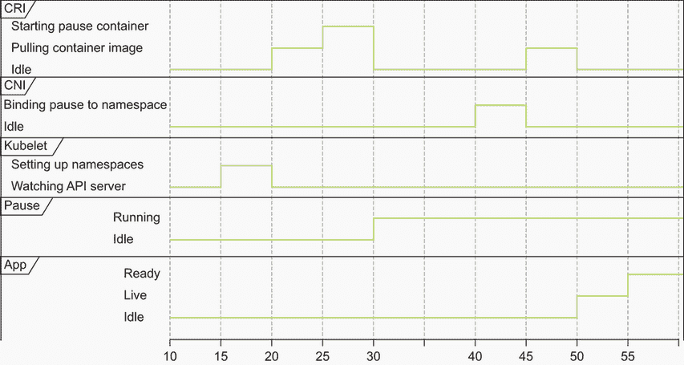
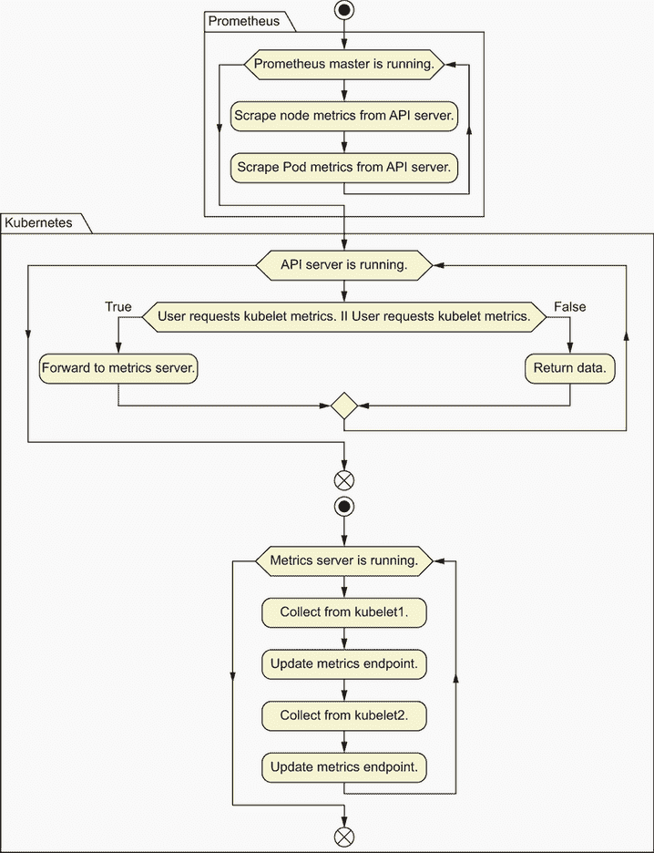
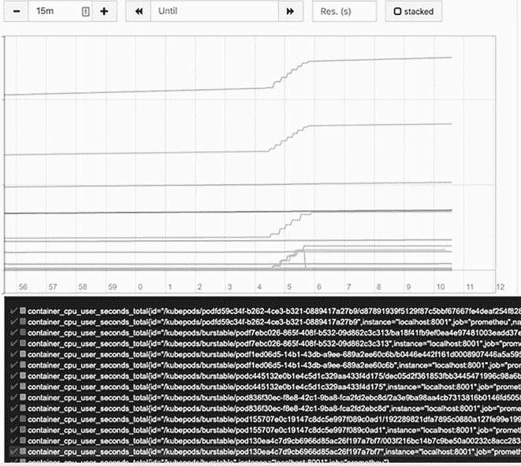

# 4 在我们的 Pod 中使用 cgroups 处理进程

本章涵盖

+   探索 cgroups 的基础知识

+   识别 Kubernetes 进程

+   学习如何创建和管理 cgroups

+   使用 Linux 命令调查 cgroup 层次结构

+   理解 cgroup v2 与 cgroup v1 的区别

+   安装 Prometheus 并查看 Pod 资源使用情况

上一章相当详细，你可能觉得它有点理论化。毕竟，现在没有人真的需要从头开始构建自己的 Pods（除非你是 Facebook）。不用担心，从现在开始，我们将开始向上移动到更高的层次。

在本章中，我们将更深入地探讨 *cgroups*：内核中隔离彼此资源的控制结构。在前一章中，我们实际上实现了一个简单的 cgroup 边界，这是我们完全自己制作的 Pod。这一次，我们将创建一个“真实”的 Kubernetes Pod，并调查内核如何管理该 Pod 的 cgroup 脚印。在这个过程中，我们将通过一些虽然愚蠢但仍有教育意义的例子来了解 cgroups 存在的原因。我们将以查看 Prometheus 为结尾，Prometheus 是时间序列指标聚合器，已成为云原生空间中所有指标和观测平台的实际标准。

在跟随本章内容时，最重要的是记住 cgroups 和 Linux Namespaces 并不是任何黑暗魔法。它们实际上是内核维护的账本，将进程与 IP 地址、内存分配等关联起来。因为内核的工作是为程序提供这些资源，所以很明显，这些数据结构也由内核本身管理。

## 4.1 Pod 在准备工作完成之前是空闲的

在上一章中，我们简要地提到了 Pod 启动时会发生什么。让我们稍微深入一点，看看 kubelet *实际上*需要做什么来创建一个真正的 Pod（图 4.1）。请注意，我们的应用程序在暂停容器添加到我们的命名空间之前是空闲的。之后，我们最终拥有的实际应用程序才开始运行。



图 4.1 容器启动涉及到的进程

图 4.1 显示了 kubelet 在创建容器期间各个部分的状态。每个 kubelet 都将安装一个 CRI，负责运行容器，一个 CNI，负责为容器分配 IP 地址，并且将运行一个或多个 *暂停容器*（kubelet 在其中创建命名空间和 cgroup 以使容器在其中运行的地方）。为了使应用程序最终准备好 Kubernetes 开始向其负载均衡流量，需要以高度协调的方式运行几个短暂的进程：

+   如果 CNI 在 CNI 的暂停容器之前运行，它将没有可用的网络。

+   如果没有可用资源，kubelet 将无法为 Pod 运行设置位置，因此不会发生任何事情。

+   在每个 Pod 运行之前，都会运行一个暂停容器，它是 Pod 进程的占位符。

我们选择在本章中展示这种复杂的舞蹈的原因是为了强调程序需要资源，而资源是有限的：调配资源是一个复杂、有序的过程。我们运行的程序越多，这些资源请求的交集就越复杂。让我们看看几个示例程序。以下每个程序都有不同的 CPU、内存和存储需求：

+   *计算π*——计算π需要访问一个专用的核心以实现持续的 CPU 使用。

+   *缓存维基百科内容以实现快速查找*——将维基百科缓存到哈希表中供我们的 Pi 程序使用需要很少的 CPU，但它可能需要大约 100 GB 左右的内存。

+   *备份 1 TB 的数据库*——将数据库备份到冷存储供我们的 Pi 程序使用基本上不需要内存，很少的 CPU，以及一个大型、持久的存储设备，这可以是一个慢速旋转的磁盘。

如果我们有一台拥有 2 个核心、101 GB 内存和 1.1 TB 存储的单台计算机，理论上我们可以为每个程序分配等价的 CPU、内存和存储访问。结果将是

+   如果 Pi 程序编写不当（例如，如果它将中间结果写入持久磁盘），最终可能会超出我们的数据库存储空间。

+   如果维基百科缓存编写不当（例如，如果其哈希函数过于 CPU 密集型），可能会阻止我们的 Pi 程序快速进行数学计算。

+   如果数据库程序编写不当（例如，如果它做了太多的日志记录），可能会通过占用所有 CPU 来阻止 Pi 程序执行其任务。

我们可以不使用完全访问我们系统（有限的）所有资源的所有进程来运行，如果我们有能力分配我们的 CPU、内存和磁盘资源的话，我们可以这样做——也就是说，如果我们有能力分配我们的 CPU、内存和磁盘资源：

+   使用 1 个核心和 1 KB 的内存运行 Pi 进程

+   使用半个核心和 99 GB 的内存运行维基百科缓存

+   使用 1 GB 的内存运行数据库备份程序，并使用剩余的 CPU 和一个其他应用无法访问的专用存储卷

为了使所有由我们的操作系统控制的程序都能以可预测的方式进行，cgroups 允许我们为内存、CPU 和其他操作系统资源定义层次分级的分离容器。程序创建的所有线程最初都使用分配给父进程的相同资源池。换句话说，没有人可以在别人的池子里玩。

这本身就是为 Pod 设置 cgroups 的论据。在 Kubernetes 集群中，你可能在单台计算机上运行 100 个程序，其中许多程序在特定时间点是低优先级或完全空闲。如果这些程序预留了大量的内存，它们会使运行此类集群的成本不必要地增加。为饥饿进程提供内存而创建新节点会导致管理开销和随时间累积的基础设施成本。由于容器（提高数据中心利用率）的承诺在很大程度上取决于能够为每个服务运行更小的足迹，因此谨慎使用 cgroups 是以微服务形式运行应用程序的核心。

## 4.2 Linux 中的进程和线程

Linux 中的每个进程都可以创建一个或多个线程。一个执行 *线程* 是程序可以用来创建与其他进程共享相同内存的新进程的抽象。例如，我们可以通过使用 `ps -T` 命令来检查 Kubernetes 中各种独立调度线程的使用情况：

```
root@kind-control-plane:/# ps -ax | grep scheduler    ❶
631 ?  Ssl 60:14 kube-scheduler
  --authentication-kubeconfig=/etc/kubernetes/...

root@kind-control-plane:/# ps -T 631                  ❷

root@kind-control-plane:/# ps -T 631
  PID  SPID TTY      STAT   TIME COMMAND
  631   631 ?        Ssl    4:40 kube-scheduler --authentication-kube..
  631   672 ?        Ssl   12:08 kube-scheduler --authentication-kube..
  631   673 ?        Ssl    4:57 kube-scheduler --authentication-kube..
  631   674 ?        Ssl    4:31 kube-scheduler --authentication-kube..
  631   675 ?        Ssl    0:00 kube-scheduler --authentication-kube..
```

❶ 获取 Kubernetes 调度器 Pod 的 PID

❷ 查找 Pod 中的线程

这个查询向我们展示了共享彼此内存的并行调度线程。这些进程有自己的子进程 ID，对于 Linux 内核来说，它们都是普通的旧进程。尽管如此，它们有一个共同点：一个父进程。我们可以通过在我们的 `kind` 集群中使用 `pstree` 命令来调查这种父子关系：

```
/# pstree -t -c | grep sched                 ❶
|-containerd-sh-+-kube-scheduler-+-{kube-}   ❷
|               |                |-{kube-}
|               |                |-{kube-}
|               |                |-{kube-}
|               |                |-{kube-}
|               |                |-{kube-}
|               |                |-{kube-}
|               |                |-{kube-}
|               |                |-{kube-}
|               |                |-{kube-}
|               |                |-{kube-}
|               |                |-{kube-}
|               |                |-{kube-}
|               |                |-{kube-}
```

❶ 调度器具有父容器仿真层，因此它作为容器运行。

❷ 每个调度线程共享相同的父线程，即调度器本身。

containerd 和 Docker

我们还没有花费时间对比 containerd 和 Docker，但值得注意的是，我们的 `kind` 集群并不是使用 Docker 作为它们的容器运行时。相反，它们使用 Docker 来创建节点，然后每个节点都使用 containerd 作为运行时。由于各种原因，现代 Kubernetes 集群通常不会使用 Docker 作为 Linux 的容器运行时。Docker 对于开发者来说是一个很好的入门工具，用于运行 Kubernetes，但数据中心需要一种更轻量级的容器运行时解决方案，该解决方案与操作系统更深入地集成。大多数集群在最低级别执行 `runC` 作为容器运行时，其中 `runC` 被 containerd、CRI-O 或其他一些安装在节点上的高级命令行可执行程序调用。这导致 systemd 成为容器的父进程而不是 Docker 守护进程。

容器之所以如此受欢迎，其中一个原因是在 Linux 中，它们不会在程序及其宿主之间创建人工边界。相反，它们只是允许以轻量级和比基于虚拟机隔离更容易管理的方式调度程序。

### 4.2.1 systemd 和初始化进程

现在你已经看到了进程层次结构的实际应用，让我们退一步思考，究竟什么是进程。在我们的可靠的 `kind` 集群中，我们运行了以下命令来查看谁启动了整个闹剧（查看 systemd 状态日志的前几行）。记住，我们的 `kind` 节点（我们通过 `exec` 进入以完成所有这些操作）实际上只是一个 Docker 容器；否则，以下命令的输出可能会让你有些害怕：

```
root@kind-control-plane:/# systemctl status | head
kind-control-plane
  State: running
   Jobs: 0 queued
 Failed: 0 units
  Since: Sat 2020-06-06 17:20:42 UTC; 1 weeks 1 days
 CGroup: /docker/b7a49b4281234b317eab...9               ❶
         ├── init.scope
         │     ├── 1 /sbin/init
         └── system.slice
             ├── containerd.service                     ❷
             │     ├── 126 /usr/local/bin/containerd
```

❶ 这个单独的 cgroup 是我们的 kind 节点的父进程。

❷ containerd 服务是 Docker cgroup 的子进程。

如果你恰好有一台普通的 Linux 机器，你可以看到以下输出。这会给你一个更清晰的答案：

```
State: running
     Jobs: 0 queued
   Failed: 0 units
    Since: Thu 2020-04-02 03:26:27 UTC; 2 months 12 days
   cgroup: / 
           ├── docker
           │     ├── ae17db938d5f5745cf343e79b8301be2ef7
           │     │     ├── init.scope
           │     │     │     └── 20431 /sbin/init
           │     │     └── system.slice
```

在 `system.slice` 下，我们会看到

```
├── containerd.service
├──  3067 /usr/local/bin/containerd-shim-runc-v2
          -namespace k8s.io -id db70803e6522052e
├──  3135 /pause
```

在标准的 Linux 机器或 kind 集群节点中，所有 cgroups 的根目录是 /。如果我们真的想了解系统中所有进程的最终父 cgroup 是什么，那就是启动时创建的 `/` cgroup。Docker 本身是这个 cgroup 的子进程，如果我们运行一个 `kind` 集群，我们的 `kind` 节点是这个 Docker 进程的子进程。如果我们运行一个常规的 Kubernetes 集群，我们可能根本看不到 Docker cgroup，相反，我们会看到 containerd 本身是 systemd 根进程的子进程。如果你有一个可以 `ssh` 进入的 Kubernetes 节点，这可能是一个很好的后续练习。

如果我们沿着这些树向下遍历足够远，我们会在整个操作系统中找到所有可用的进程，包括任何容器启动的进程。请注意，进程 ID（PID），如前一个片段中的 3135，如果我们检查主机机器上的这些信息，实际上是高数值。这是因为容器外部的进程的 PID 与容器内部的进程的 PID 是不同的。如果你想知道为什么，回想一下我们在第一章中如何使用 `unshare` 命令来分离我们的进程命名空间。这意味着由容器启动的进程没有能力看到、识别或杀死其他容器中运行的进程。这是任何软件部署的重要安全特性。

你可能还在想为什么会有暂停进程。我们每个 containerd-shim 程序都有一个对应的暂停程序，它最初被用作创建我们的网络命名空间的一个占位符。暂停容器还帮助清理进程，并作为我们的 CRI 进行一些基本进程记录的占位符，帮助我们避免僵尸进程。

### 4.2.2 为我们的进程设置 cgroups

我们现在对这个调度器 Pod 的作用有了相当好的了解：它已经生成了几个子进程，而且很可能是 Kubernetes 创建的，因为它是由 containerd 生成的子进程，而 containerd 是 Kubernetes 在 `kind` 中使用的容器运行时。作为对进程工作方式的第一印象，你可以杀死 containerd 进程，然后你会自然地看到调度器和其子线程重新活跃起来。这是由 kubelet 本身完成的，它有一个 /manifests 目录。这个目录告诉 kubelet 关于一些即使在 API 服务器能够调度容器之前也应该运行的进程。实际上，Kubernetes 就是通过 kubelet 以这种方式安装的。使用 `kubeadm`（现在最常用的安装工具）安装 Kubernetes 的生命周期看起来大致如下：

+   kubelet 有一个包含 API 服务器、调度器和控制器管理器的 manifests 目录。

+   kubelet 由 systemd 启动。

+   kubelet 告诉 containerd（或任何容器运行时）开始运行 manifests 目录中的所有进程。

+   一旦 API 服务器启动，kubelet 就会连接到它，然后运行 API 服务器请求它执行的所有容器。

镜像 Pod 悄悄接近 API 服务器

kubelet 有一个秘密武器：/etc/kubernetes/manifests 目录。这个目录会持续扫描，当 Pod 被放入其中时，它们就会被 kubelet 创建和运行。因为这些不是通过 Kubernetes API 服务器调度的，所以它们需要镜像自己，以便 API 服务器能够知道它们的存在。因此，在 Kubernetes 控制平面不知情的情况下创建的 Pod 被称为 *镜像* Pod。

可以像查看其他 Pod 一样通过列出它们来查看镜像 Pod，使用 `kubectl get pods -A`，但它们是由独立于其他 Pod 的 kubelet 创建和管理的。这允许 kubelet 单独引导一个运行在 Pod 内的整个 Kubernetes 集群。相当狡猾！

你可能会问，“这一切与 cgroups 有什么关系？”实际上，我们一直在探索的调度器被识别为镜像 Pod，分配给它的 cgroups 是使用这个身份命名的。它有这个特殊身份的原因是，最初，API 服务器实际上并不知道镜像 Pod，因为它是由 kubelet 创建的。为了更具体一点，让我们用以下代码探索并找到它的身份：

```
apiVersion: v1
kind: Pod
metadata:
  annotations:
    kubernetes.io/config.hash: 155707e0c1919c0ad1
    kubernetes.io/config.mirror: 155707e0c19147c8      ❶
    kubernetes.io/config.seen: 2020-06-06T17:21:0
    kubernetes.io/config.source: file
  creationTimestamp: 2020-06-06T17:21:06Z
  labels:
```

❶ 调度器的镜像 Pod ID

我们使用调度器的镜像 Pod ID 来查找其 cgroups。你可以通过运行 `edit` 或 `get action` 对控制平面 Pod（例如，`kubectl edit Pod -n kube-system kube-apiserver-calico-control-plane`）来获取这些 Pod 的内容。现在，让我们运行以下命令，看看我们能否找到与我们的进程器相关联的任何 cgroups：

```
$ cat /proc/631/cgroup
```

使用此命令，我们使用之前找到的 PID 来询问 Linux 内核关于调度器的 cgroups 存在情况。输出相当令人畏惧（如下所示）。不必担心 burstable 文件夹；我们将在查看一些 kubelet 内部结构时解释 burstable 概念，它是一种服务质量或 QoS 类别。同时，一个 *burstable Pod* 通常是指没有硬使用限制的 Pod。调度器是一个典型的 Pod 示例，它通常具有在必要时使用大量 CPU 的能力（例如，在需要快速将 10 或 20 个 Pod 部署到节点上的情况下）。每个条目都有一个非常长的 cgroup 和 Pod 标识符 ID，如下所示：

```
13:name=systemd:/docker/b7a49b4281234b31
➥ b9/kubepods/burstable/pod155707e0c19147c../391fbfc..
➥ a08fc16ee8c7e45336ef2e861ebef3f7261d
```

因此，内核正在跟踪 /proc 位置中的所有这些进程，我们可以进一步挖掘以查看每个进程在资源方面的具体获取情况。为了简化进程 631 的整个 cgroups 列表，我们可以 `cat` cgroup 文件，如下所示。注意，为了便于阅读，我们已缩短了额外的长 ID：

```
root@kind-control-plane:/# cat /proc/631/cgroup

13:name=systemd:/docker/b7a49b42.../kubepods/burstable/pod1557.../391f...
12:pids:/docker/b7a49b42.../kubepods/burstable/pod1557.../391f...
11:hugetlb:/docker/b7a49b42.../kubepods/burstable/pod1557.../391f...
10:net_prio:/docker/b7a49b42.../kubepods/burstable/pod1557.../391f...
9:perf_event:/docker/b7a49b42.../kubepods/burstable//pod1557.../391f...
8:net_cls:/docker/b7a49b42.../kubepods/burstable//pod1557.../391f...
7:freezer:/docker/b7a49b42.../kubepods/burstable//pod1557.../391f...
6:devices:/docker/b7a49b42.../kubepods/burstable//pod1557.../391f...
5:memory:/docker/b7a49b42.../kubepods/burstable//pod1557.../391f...
4:blkio:/docker/b7a49b42.../kubepods/burstable//pod1557.../391f...
3:cpuacct:/docker/b7a49b42.../kubepods/burstable//pod1557.../391f...
2:cpu:/docker/b7a49b42.../kubepods/burstable//pod1557.../391f...
1:cpuset:/docker/b7a49b42.../kubepods/burstable//pod1557.../391f...
0::/docker/b7a49b42.../system.slice/containerd.service
```

我们将逐个查看这些文件夹，如下所示。不过，关于 docker 文件夹，你不必过于担心。因为我们处于一个 `kind` 集群中，docker 文件夹是所有内容的父文件夹。但请注意，实际上，我们的容器都在 containerd 中运行：

+   *docker*—运行在我们计算机上的 Docker 守护进程的 cgroup，本质上就像一个运行 kubelet 的虚拟机。

+   *b7a49b42 . . .*—我们的 Docker `kind` 容器名称。Docker 为我们创建了此 cgroup。

+   *kubepods*—Kubernetes 为其 Pods 保留的 cgroup 分区。

+   *burstable*—Kubernetes 的一个特殊 cgroup，定义了调度器获得的服务质量。

+   *pod1557 . . .*—我们的 Pod ID，它在我们的 Linux 内核中作为其自己的标识符。

在本书撰写时，Docker 已在 Kubernetes 中被弃用。你可以将示例中的 docker 文件夹视为“运行我们的 kubelet 的虚拟机”，因为 `kind` 本身实际上只是运行一个 Docker 守护进程作为 Kubernetes 节点，然后在节点内部安装 kubelet、containerd 等。因此，在探索 Kubernetes 时，请继续对自己重复说，“`kind` 本身并不使用 Docker 来运行容器。” 相反，它使用 Docker 来创建节点，并在这些节点内部安装 containerd 作为容器运行时。

我们现在已经看到，每个进程（对于 Linux 机器的 Kubernetes）最终都会落在 proc 目录的账本表中。现在，让我们探索这些字段对于更传统的 Pod：NGINX 容器意味着什么。

### 4.2.3 为普通 Pod 实现控制组

调度器 Pod 是一个有点特殊的情况，因为它在所有集群上运行，并不是你可能会直接想要调整或调查的东西。一个更现实的场景可能是你想要确认你正在运行的应用程序（如 NGINX）的 cgroups 是否被正确创建。为了尝试这一点，你可以创建一个类似于我们原始的 pod.yaml 的 Pod，该 Pod 运行带有资源请求的 NGINX 网络服务器。Pod 这一部分的规范看起来如下（可能对你来说很熟悉）：

```
spec:
    containers:
    - image: nginx
      imagePullPolicy: Always
      name: nginx
      resources:
        requests:
          cpu: "1"
          memory: 1G
```

在这种情况下，Pod 定义了一个核心数（1）和内存请求（1 GB）。这两个都进入/sys/fs 目录下定义的 cgroups 中，内核强制执行 cgroup 规则。记住，你需要`ssh`进入你的节点来做这件事，或者如果你使用`kind`，可以使用`docker` `exec` `-t` `-i` `75` `/bin/sh`来访问`kind`节点的 shell。

结果是，现在你的 NGINX 容器以专用的方式运行，拥有 1 个核心和 1 GB 的内存访问权。在创建这个 Pod 之后，我们实际上可以直接通过遍历其内存字段的 cgroup 信息来查看其 cgroup 层次结构（再次运行`ps` `-ax`命令来追踪它）。这样做，我们可以看到 Kubernetes*真正*是如何响应我们给出的内存请求的。我们将留给你，读者，去实验其他这样的限制，看看操作系统是如何表达它们的。

如果我们现在查看我们内核的内存表，我们可以看到有一个标记表示为我们的 Pod 划分了多少内存。大约是 1 GB。当我们创建之前的 Pod 时，我们的底层容器运行时在一个内存有限的 cgroup 中。这解决了我们在本章最初讨论的精确问题——为内存和 CPU 隔离资源：

```
$ sudo cat /sys/fs/memory/docker/753../kubepods/pod8a58e9/d176../
    memory.limit_in_bytes
999997440
```

因此，Kubernetes 隔离的魔力实际上可以被视为 Linux 机器上常规的、由简单目录结构组织的资源分层分配。内核中有大量的逻辑来“正确处理”这些，但对于任何有勇气揭开盖子的人来说，这些都是容易访问的。

## 4.3 测试 cgroups

我们现在知道如何确认我们的 cgroups 是否被正确创建。但我们是怎样*测试*cgroups 是否被我们的进程所尊重的呢？这是一个众所周知的事实，容器运行时和 Linux 内核本身在精确隔离事物方面可能存在缺陷。例如，在某些情况下，如果其他进程没有资源饥饿，操作系统可能会允许容器在其分配的 CPU 配额之上运行。让我们运行一个简单的进程，使用以下代码来测试我们的 cgroups 是否正常工作：

```
$ cat /tmp/pod.yaml
apiVersion: v1
kind: Pod
metadata:
  name: core-k8s
  labels:
    role: just-an-example
    app: my-example-app
    organization: friends-of-manning
    creator: jay
spec:
  containers:
    - name: an-old-name-will-do
      image: busybox:latest
      command: ['sleep', '1000']
      resources:
        limits:             ❶
          cpu:  2
        requests:           ❷
          cpu: 1
      ports:
        - name: webapp-port
          containerPort: 80
          protocol: TCP
```

❶ 确保我们的 Pod 有足够的机会使用大量的 CPU

❷ 确保我们的 Pod 在获得完整的 CPU 核心访问权之前不会启动

现在，我们可以进入我们的 Pod 并运行一个（讨厌的）CPU 使用率命令。我们将在输出中看到`top`命令崩溃：

```
$ kubectl create -f pod.yaml
$ kubectl exec -t -i core-k8s /bin/sh    ❶

#> dd if=/dev/zero of=/dev/null          ❷
$ docker exec -t -i 75 /bin/sh

root@kube-control-plane# top             ❸
PID USER      PR  NI    VIRT    RES    SHR S  %CPU  %MEM   TIME+ COMMAND
91467 root    20   0    1292      4      0 R  99.7   0.0   0:35.89 dd
```

❶ 创建一个进入你的容器的 shell

❷ 通过运行 dd 无节制地消耗 CPU

❸ 在我们的 Docker `kind`节点上运行 top 命令来测量 CPU 使用量

如果我们将这个相同的进程隔离并重新运行这个实验会发生什么？为了测试这个，你可以将`resources`段落更改为以下内容：

```
resources:
        limits:
          cpu:  .1    ❶
        requests:
          cpu: .1     ❷
```

❶ 将 CPU 使用量限制在最大 0.1 核心

❷ 预留了整个 0.1 核心，保证了这一 CPU 份额

让我们重新运行以下命令。在这个第二个例子中，我们可以看到我们的`kind`节点发生了一个压力较小的场景：

```
root@kube-control-plane# top           ❶
PID USER      PR  NI   VIRT   RES   SHR S  %CPU  %MEM TIME+COMMAND
93311 root    20  0    1292   4     0   R  10.3  0.0  0:03.61 dd
```

❶ 这次只使用了 CPU 的 10%用于节点。

## 4.4 kubelet 如何管理 cgroups

在本章的早期，我们简要地提到了其他 cgroups，如`blkio`。诚然，有各种各样的 cgroups，了解它们是什么是有价值的，尽管 90%的时间，你只会关心大多数容器对 CPU 和内存隔离的关注。

在更低的层面，通过巧妙地使用`/sys/fs/cgroup`中列出的 cgroup 原语，可以暴露出控制这些资源如何分配给进程的旋钮。有些这样的组对 Kubernetes 管理员来说并不容易使用。例如，`freezer` cgroup 将相关任务组分配给单个可停止或可冻结的控制点。这种隔离原语允许高效地调度和取消调度群组进程（而且，讽刺的是，有些人批评 Kubernetes 在处理这类调度方面做得不好）。

另一个例子是`blkio` cgroup，这也是一个不太为人所知的资源，用于管理 I/O。查看`/sys/fs/cgroup`，我们可以看到 Linux 中可以分层分配的所有各种可量化的资源：

```
$ ls -d /sys/fs/cgroup/*
/sys/fs/cgroup/blkio freezer perf_event
/sys/fs/cgroup/cpu hugetlb pids
/sys/fs/cgroup/cpuacct memory rdma
/sys/fs/cgroup/cpu,cpuacct net_cls systemd
/sys/fs/cgroup/cpuset net_cls,net_prio unified
/sys/fs/cgroup/devices net_prio
```

你可以在[`mng.bz/vo8p`](http://mng.bz/vo8p)上了解 cgroups 的原始意图。一些相关的文章可能已经过时，但它们提供了大量关于 cgroups 如何演变以及它们旨在做什么的信息。对于高级 Kubernetes 管理员来说，理解如何解释这些数据结构在查看不同的容器化技术及其如何影响你的底层基础设施时非常有价值。

## 4.5 深入了解 kubelet 如何管理资源

现在你已经了解了 cgroups 的来源，那么看看 kubelet 中如何使用 cgroups 就很有意义了；具体来说，是通过`allocatable`数据结构。查看一个示例 Kubernetes 节点（再次强调，你可以使用你的`kind`集群来做这件事），我们可以从`kubectl get nodes -o yaml`的输出中看到以下段落：

```
...
    allocatable:
      cpu: "12"
      ephemeral-storage: 982940092Ki
      hugepages-1Gi: "0"
      hugepages-2Mi: "0"
      memory: 32575684Ki
      pods: "110"
```

这些设置看起来熟悉吗？到现在，它们应该很熟悉了。这些资源是可用于为 Pods 分配资源的 cgroup 预算量。kubelet 通过确定节点上的总容量来计算这个值。然后它减去自身以及底层节点所需的 CPU 带宽，并从可分配资源量中减去这部分。这些数字的等式在 [`mng.bz/4jJR`](http://mng.bz/4jJR) 中有记录，并且可以通过包括 `--system-reserved` 和 `--kubelet-reserved` 在内的参数进行切换。这个值随后被 Kubernetes 调度器用来决定是否在这个特定节点上请求运行容器。

通常，你可能会用每个核心的一半来启动 `--kubelet-reserved` 和 `--system-reserved`，留下 2 个核心的 CPU，大约有 1.5 个核心空闲来运行工作负载，因为 kubelet 不是一个对 CPU 非常渴求的资源（除了在突发调度或启动时）。在大规模下，所有这些数字都会分解，并依赖于与工作负载类型、硬件类型、网络延迟等因素相关的各种性能因素。作为一个等式，在调度方面，我们有以下实现（`system-reserved` 指的是健康操作系统运行所需资源量）：

可分配 = 节点容量 - kube-reserved - system-reserved

例如，如果你有

+   为节点预留的 16 个 CPU 核心

+   集群中为 kubelet 和系统进程预留的 1 个 CPU 核心

可分配的 CPU 数量为 15 个核心。为了说明所有这些是如何与一个已调度、正在运行的容器相关联的

+   kubelet 在你运行 Pods 时创建 cgroups，以限制它们的资源使用。

+   你的容器运行时在 cgroups 内启动一个进程，这保证了你在 Pod 规范中给出的资源请求。

+   systemd 通常启动 kubelet，它定期广播总可用资源到 Kubernetes API。

+   systemd 通常也会启动你的容器运行时（containerd、CRI-O 或 Docker）。

当你启动 kubelet 时，其中嵌入有父进程逻辑。此设置通过命令行标志（你应该保持启用）进行配置，这使得 kubelet 本身成为其子容器的高级 cgroup 父进程。前面的等式计算了一个 kubelet 可分配 cgroup 的总量。这被称为 *可分配资源预算*。

### 4.5.1 为什么 Kubernetes 中操作系统不能使用交换空间？

要理解这一点，我们必须稍微深入到我们之前看到的特定 cgroups。还记得我们的 Pods 居住在特殊文件夹中，比如保证和突发吗？如果我们允许操作系统将不活跃的内存交换到磁盘，那么一个空闲进程可能会突然遇到缓慢的内存分配。这种分配会违反 Kubernetes 在定义 Pod 规范时提供给用户的 *保证* 访问内存，并使性能高度可变。

由于以可预测的方式调度大量进程比任何单个进程的健康状况更重要，我们在 Kubernetes 上完全禁用了交换。为了避免对此有任何混淆，如果你在启用了交换的机器上引导 kubelets，Kubernetes 安装程序，如`kubeadm`，会立即失败。

为什么不启用交换？

在某些情况下，薄分配内存可能对最终用户有益（例如，它可能允许你在系统上更密集地打包容器）。然而，为了适应这种类型的内存外观而带来的语义复杂性，对大多数用户来说并不成比例地有益。kubelet 的维护者尚未决定（目前）支持这种更复杂的内存概念，在像 Kubernetes 这样的系统中，这种 API 更改很难实现，Kubernetes 被数百万用户使用。

当然，就像技术中的其他一切一样，这正在迅速发展，在 Kubernetes 1.22 中，你会发现实际上有方法可以在启用交换内存的情况下运行([`mng.bz/4jY5`](http://mng.bz/4jY5))。然而，这不建议用于大多数生产部署，因为它会导致工作负载的性能特征非常不稳定。

话虽如此，在容器运行时级别，资源使用（如内存）方面有很多微妙之处。例如，cgroups 如下区分软限制和硬限制：

+   具有软内存限制的过程，随着时间的推移，其 RAM 的量会有所不同，这取决于系统负载。

+   一个具有*硬*内存限制的过程，如果它在较长时间内超过了其内存限制，就会被终止。

注意，在需要因为这些原因终止进程的情况下，Kubernetes 会将退出代码和 OOMKilled 状态回传给你。你可以增加分配给高优先级容器的内存量，以降低嘈杂的邻居在机器上引起问题的可能性。让我们接下来看看这一点。

### 4.5.2 技巧：穷人的优先级旋钮

*HugePages*是一个最初在 Kubernetes 中不受支持的概念，因为它最初是一个以网络为中心的技术。随着它转向核心数据中心技术，更微妙的调度和资源分配策略变得相关。HugePages 配置允许 Pod 访问比 Linux 内核默认内存页面大小更大的内存页面，这通常是 4 KB。

内存，就像 CPU 一样，可以为 Pods 显式分配，并使用千字节、兆字节和吉字节（分别表示为 Kis、Mis 和 Gis）的单位表示。许多内存密集型应用程序，如 Elasticsearch 和 Cassandra，支持使用 HugePages。如果一个节点支持 HugePages 并且也支持 2048 KiB 页面大小，它将暴露一个可调度的资源：HugePages - 2 Mi。一般来说，在 Kubernetes 中使用标准`resources`指令可以调度对 HugePages 的访问，如下所示：

```
resources:
  limits:
    hugepages-2Mi: 100Mi
```

*透明 HugePages* 是对 HugePages 的优化，它可能对需要高性能的 Pods 有高度可变的影响。在某些情况下，您可能希望禁用它们，特别是对于需要在引导加载程序或操作系统级别拥有大块连续内存的高性能容器。

### 4.5.3 Hack: 使用 init 容器编辑 HugePages

我们现在已经回到了起点。记得在本章开始时我们查看 /sys/fs 目录以及它是如何为容器管理各种资源的吗？如果可以以 root 权限运行并使用容器挂载 /sys 来编辑这些文件，HugePages 的配置可以在 `init` 容器中完成。

通过仅向 sys 目录写入文件即可切换 HugePages 的配置。例如，要关闭透明 HugePages，这可能在某些操作系统上对您有性能影响，您通常会运行一个如 `echo` `'never'` `>` `/sys/kernel/mm/redhat_transparent_hugepage/enabled` 的命令。如果您需要以特定方式设置 HugePages，您可以从 Pod 规范中完全完成，如下所示：

1.  声明一个 Pod，假设它基于 HugePages 有特定的性能需求。

1.  在此 Pod 中声明一个 `init` 容器，该容器以特权模式运行并使用 `hostPath` 卷类型挂载 /sys 目录。

1.  让 `init` 容器执行任何 Linux 特定命令（如前面的 `echo` 语句）作为其唯一的执行步骤。

通常，`init` 容器可用于启动某些可能对 Pod 正确运行所需的 Linux 功能。但请记住，每次您挂载 hostPath 时，您都需要在您的集群上拥有特殊权限，管理员可能不会轻易给您。一些发行版，如 OpenShift，默认拒绝 hostPath 卷挂载。

### 4.5.4 QoS 类别：为什么它们很重要以及它们是如何工作的

我们在本章中看到了诸如 *guaranteed* 和 *burstable* 等术语，但我们还没有定义这些术语。为了定义这些概念，我们首先需要介绍 QoS。

当您去一家高档餐厅时，您期望食物很棒，但您也期望服务员反应迅速。这种反应速度被称为服务质量或 QoS。当我们探讨为什么 Kubernetes 中禁用交换以保证内存访问性能时，我们提到了 QoS。*QoS* 指的是资源的即时可用性。任何数据中心、虚拟机管理程序或云都必须在应用程序的资源可用性上进行权衡

+   保证关键服务正常运行，但您花费了大量金钱，因为您拥有的硬件比所需的要多

+   花很少的钱，冒着关键服务中断的风险

QoS 允许您在高峰时段让许多服务表现不佳，同时不牺牲关键服务的质量。在实践中，这些关键服务可能是支付处理系统、成本高昂的重启机器学习或 AI 任务，或者不能中断的实时通信过程。请记住，Pod 的驱逐很大程度上取决于其资源限制以上的程度。一般来说

+   表现良好且内存和 CPU 使用量可预测的应用程序在压力情况下被驱逐的可能性比其他应用程序低。

+   贪婪的应用程序在压力期间更有可能在尝试使用比 Kubernetes 分配的更多 CPU 或内存时被终止，除非这些应用程序属于保证类别。

+   在压力情况下，尽力而为 QoS 类的应用程序很可能被终止并重新调度。

您可能想知道我们如何决定使用哪种 QoS 类。一般来说，您不会直接决定这一点，而是通过确定您的应用程序是否需要通过 Pod 规范中的 `resource` 段落保证对资源的访问来影响这一决定。我们将在下一节中介绍这一过程。

### 4.5.5 通过设置资源创建 QoS 类

根据您如何定义 Pod，系统为您创建了三种 QoS 类：可突发、保证和尽力而为。这些设置可以增加您在集群上可以运行的容器数量，其中一些可能在高负载时停止运行，但可以在稍后重新调度。制定全局策略来决定为最终用户分配多少 CPU 或内存可能很有吸引力，但请注意，很少有一种方案适合所有人：

+   如果您系统上的所有容器都具有保证 QoS，那么您处理具有调节资源需求动态工作负载的能力将受到阻碍。

+   如果您的服务器上没有容器具有保证 QoS，那么 kubelet 将无法确保某些关键进程保持运行。

QoS 确定的规则如下（这些是在您的 Pod 中计算并显示为 `status` 字段的）：

+   *尽力而为 Pod 是那些没有 CPU 或内存请求的 Pod。当资源紧张时，它们很容易被终止和替换（并且很可能出现在新的节点上）。*

+   *可突发 Pod 是那些具有内存或 CPU 请求但没有为所有类别定义限制的 Pod。与尽力而为 Pod 相比，它们不太可能被替换。*

+   *保证 Pod 是那些具有 CPU 和内存请求的 Pod。与可突发 Pod 相比，它们不太可能被替换。*

让我们看看实际效果。通过运行 `kubectl create ns qos; kubectl -n qos run --image=nginx myapp` 创建一个新的部署。然后，编辑部署以包含一个容器规范，该规范声明了请求但没有定义限制。例如：

```
spec:
      containers:
      - image: nginx
        imagePullPolicy: Always
        name: nginx
        resources:
          requests:
            cpu: "1"
            memory: 1G
```

当你运行 `kubectl get Pods -n qos -o yaml` 时，你会看到你的 Pod 的 `status` 字段被分配了一个 Burstable 类，如下面的代码片段所示。在关键时刻，你可能使用这种技术来确保你业务中最关键的过程都具有保证或 Burstable 状态。

```
hostIP: 172.17.0.3
    phase: Running
    podIP: 192.168.242.197
    qosClass: Burstable
    startTime: "2020-03-08T08:54:08Z"
```

## 4.6 使用 Prometheus、cAdvisor 和 API 服务器监控 Linux 内核

我们在本章中探讨了大量的低级 Kubernetes 概念，并将它们映射到操作系统上，但在现实世界中，你不会手动管理这些数据。相反，为了系统指标和整体趋势，人们通常会在单个时间序列仪表板上汇总容器和系统级别的操作系统信息，这样在紧急情况下，他们可以确定问题的规模并从不同的角度（应用、操作系统等）深入调查。

为了结束本章，我们将稍微提升一下层次，使用 Prometheus，这是云原生应用的行业标准监控工具，以及 Kubernetes 自身的监控工具。我们将探讨如何通过直接检查 cgroups 来量化 Pod 资源使用情况。这有几个在端到端系统可见性方面的优势：

+   它可以看到可能超出你的集群范围且对 Kubernetes 不可见的隐蔽进程。

+   你可以直接将 Kubernetes 所知的资源映射到内核级别的隔离工具，这可能会揭示你的集群与操作系统交互方式中的错误。

+   这是一个了解 kubelet 和你的容器运行时如何大规模实现容器的绝佳工具。

在我们讨论 Prometheus 之前，我们需要谈谈指标。在理论上，*指标*是某种可量化值；例如，你上个月吃了多少个汉堡。在 Kubernetes 的世界里，数据中心中在线和离线的容器众多，这使得应用指标对于管理员来说非常重要，因为它提供了一个客观且与应用无关的模型来衡量数据中心服务的整体健康状况。

持续使用汉堡的隐喻，你可能有一组看起来像以下代码片段的指标，你可以将其记在日记本上。我们将关注三种基本的指标类型——直方图、仪表盘和计数器：

+   *仪表盘*：指示在任何给定时间每秒接收到的请求数量。

+   *直方图*：显示不同类型事件的时序区间（例如，在 500 毫秒内完成的请求数量）。

+   *计数器*：指定连续增加的事件计数（例如，你总共看到了多少请求）。

作为可能更贴近我们日常生活的具体例子，我们可以输出 Prometheus 关于我们每日卡路里消耗的指标。下面的代码片段显示了这一输出：

```
meals_today 2                              ❶
cheeseburger 1                             ❷
salad 1
dinner 1
lunch 1
calories_total_bucket_bucket[le=1024] 1    ❸
```

❶ 你今天总共吃了多少顿饭

❷ 你今天吃了多少个汉堡

❸ 你摄入的卡路里，被分入 2、4、8、16 等桶中，最高可达 2,048

你可能会每天发布一次总餐数。这被称为*度量*，因为它会上下波动，并定期更新。你今天吃的汉堡包数量将是一个*计数器*，随着时间的推移会不断递增。对于你摄入的卡路里，这个度量数据表示你吃了一顿少于 1,024 卡路里的餐。这为你提供了一种离散的方式来分类你吃了多少，而不会陷入细节（任何超过 2,048 的都可能是太多了，任何低于 1,024 的都可能是太少了）。

注意，这样的桶通常用于长期监控 etcd。超过 1 秒的写入量对于预测 etcd 故障很重要。随着时间的推移，如果我们汇总了你每天记录的日记条目，只要记录了这些度量数据的时间，你可能会发现一些有趣的关联。例如：

```
meals_today 2
cheeseburger 50
salad 99
dinner 101
lunch 99

calories_total_bucket_bucket[le=512] 10
calories_total_bucket_bucket[le=1024] 40
calories_total_bucket_bucket[le=2048] 60
```

如果你将这些度量数据分别绘制在各自的 y 轴上，x 轴为时间，你可能能够看到

+   吃汉堡包的日子与吃早餐的日子成反比。

+   你吃汉堡包的数量正在稳步增加。

### 4.6.1 度量数据的发布成本低，价值极高

度量数据对于容器化和基于云的应用程序非常重要，但它们需要以轻量化和解耦的方式进行管理。*Prometheus*为我们提供了工具，使我们能够在不创建任何不必要的样板代码或框架的情况下，实现大规模的度量数据。它旨在满足以下要求：

+   数百或数千个不同的进程可能会发布类似的度量数据，这意味着给定的度量数据需要支持元数据标签来区分这些进程。

+   应用程序应以语言无关的方式发布度量数据。

+   应用程序应该发布度量数据，而无需了解这些度量数据是如何被消费的。

+   对于任何开发者来说，无论他们使用什么语言，发布服务的度量数据都应该很容易。

在程序上，如果我们要在之前的类比中记录饮食选择，我们会声明`cheeseburger`、`meals_today`和`calories_total`的实例，这些实例分别属于`counter`、`gauge`和`histogram`类型。这些类型将是 Prometheus API 类型，支持将本地值自动存储到内存中的操作，这些操作可以从本地端点作为 CSV 文件抓取。通常，这是通过向 REST API 服务器添加 Prometheus 处理器来完成的，该处理器仅服务于一个有意义的端点：metrics/。为了管理这些数据，我们可能会使用像这样的 Prometheus API 客户端：

+   定期观察我们今天吃了多少顿饭的值，因为这是一个度量 API 调用

+   定期，在午餐后立即增加`cheeseburger`的值

+   每日，汇总`calories_total`的值，这些值可以从不同的数据源中获取

随着时间的推移，我们可能会关联吃汉堡与每天总热量摄入量增加之间的关系，我们也许还能将这些其他指标（例如，我们的体重）与这些值联系起来。尽管任何时间序列数据库都能实现这一点，但作为轻量级指标引擎的 Prometheus，在容器中表现良好，因为它完全由进程以独立和无状态的方式发布，并且已经成为向任何应用程序添加指标的现代标准。

不要等待发布指标

人们常常错误地认为 Prometheus 是一个重量级系统，需要集中安装才能发挥作用。实际上，它仅仅是一个开源的*计数工具*和一个可以嵌入任何应用程序的 API。Prometheus 主节点能够抓取和整合这些信息的事实显然是这一故事的核心，但并不是开始为您的应用程序发布和收集指标的要求。

任何微服务都可以通过导入 Prometheus 客户端在端点上发布指标。尽管您的集群可能不会消费这些指标，但没有理由不在容器侧提供这些指标，至少可以手动检查应用程序各种可量化方面的计数，如果您想观察它，还可以启动一个临时的 Prometheus 主节点。

所有主要编程语言都有 Prometheus 客户端。因此，对于任何微服务，将各种事件的日常活动记录为 Prometheus 指标既简单又便宜。

### 4.6.2 为什么我需要 Prometheus？

在这本书中，我们专注于 Prometheus，因为它在云原生领域中是事实上的标准，但我们将通过一个简单而强大的示例来说服您，这个示例展示了如何快速检查 API 服务器内部的工作情况。例如，您可以在终端中运行以下命令来查看 Pod 请求是否对您的 Kubernetes API 服务器造成了很大压力（假设您的`kind`集群已经启动并运行）。在另一个终端中运行`kubectl proxy`命令，然后按照如下方式`curl` API 服务器的指标端点：

```
$ kubectl proxy                               ❶

$> curl localhost:8001/metrics |grep etcd     ❷
etcd_request_duration_seconds_bucket{op="get",type="*core.Pod",le="0.005"}
174
etcd_request_duration_seconds_bucket{op="get",type="*core.Pod",le="0.01"}
194
etcd_request_duration_seconds_bucket{op="get",type="*core.Pod",le="0.025"}
201
etcd_request_duration_seconds_bucket{op="get",type="*core.Pod",le="0.05"}
203
```

❶ 允许您访问 localhost:8001 上的 Kubernetes API 服务器

❷ 卷曲 API 服务器的指标端点

任何拥有`kubectl`客户端的人都可以立即使用`curl`命令来获取特定 API 端点的响应时间实时指标。在前面的代码片段中，我们可以看到几乎所有的对 Pod API 端点的`get`调用都在不到.025 秒内返回，这通常被认为是合理的性能。在本章的剩余部分，我们将从头开始为您`kind`集群设置 Prometheus 监控系统。

### 4.6.3 创建本地 Prometheus 监控服务

我们可以使用 Prometheus 监控服务来检查在压力下 cgroup 和系统资源的利用情况。在 `kind` 上的 Prometheus 监控系统架构（图 4.2）包括以下内容：

+   Prometheus 主节点

+   主节点监控的 Kubernetes API 服务器

+   许多 kubelet（在我们的例子中为 1 个），每个都是 API 服务器聚合指标信息的数据源



图 4.2 Prometheus 监控部署架构

注意，通常情况下，Prometheus 主节点可能会从许多不同的来源抓取指标，包括 API 服务器、硬件节点、独立数据库，甚至是独立的应用程序。然而，并非所有服务都能方便地聚合到 Kubernetes API 服务器上以供使用。在这个简单的例子中，我们想看看如何使用 Prometheus 来监控 Kubernetes 上的 cgroup 资源使用情况，而且方便的是，我们可以通过直接从 API 服务器抓取所有节点的数据来实现这一点。此外，请注意，我们这个例子中的 `kind` 集群只有一个节点。即使我们有更多的节点，我们也可以通过在 scrape YAML 文件（我们将在稍后介绍）中添加更多的 `target` 字段来直接从 API 服务器抓取所有这些数据。

我们将使用以下配置文件启动 Prometheus。然后我们可以将配置文件存储为 prometheus.yaml：

```
$ mkdir ./data
$ ./prometheus-2.19.1.darwin-amd64/prometheus \
      --storage.tsdb.path=./data --config.file=./prometheus.yml
```

kubelet 使用 cAdvisor 库来监控 cgroup 并收集有关它们的可量化数据（例如，特定组中的 Pod 使用了多少 CPU 和内存）。因为您已经知道如何浏览 cgroup 文件系统层次结构，所以阅读由 cAdvisor 指标收集的 kubelet 输出将为您带来“啊哈”的时刻（在理解 Kubernetes 本身如何连接到底层内核资源会计方面）。为了抓取这些指标，我们将告诉 Prometheus 每 3 秒查询 API 服务器一次，如下所示：

```
global:
  scrape_interval: 3s
  evaluation_interval: 3s

scrape_configs:
  - job_name: prometheus
    metrics_path:
      /api/v1/nodes/kind-control-plane/
      proxy/metrics/cadvisor           ❶
    static_configs:
      - targets: ['localhost:8001']    ❷
```

❶ kind 控制平面节点是我们集群中唯一的节点。

❷ 在我们的集群中添加更多节点或在此处后续作业中抓取更多内容。

现实世界的 Prometheus 配置必须考虑现实世界的限制。这包括数据大小、安全性和警报协议。请注意，时间序列数据库在磁盘使用方面非常贪婪，而且指标可以揭示很多关于您组织威胁模型的信息。这些可能在您早期的原型设计阶段并不重要，正如我们之前提到的，但最好是先从应用程序级别发布您的指标，然后稍后添加管理重型 Prometheus 安装的复杂性。对于我们的简单示例，这将是我们配置 Prometheus 以探索 cgroup 所需要的一切。

再次提醒，API 服务器定期从 kubelet 接收数据，这就是为什么只需要抓取一个端点就能工作的原因。如果不是这样，我们可以直接从 kubelet 本身收集这些数据，甚至运行我们自己的 cAdvisor 服务。现在，让我们看一下*容器 CPU 用户秒数总计*指标。我们将通过运行以下命令使其激增。

警告：此命令会立即在您的计算机上创建大量的网络和 CPU 流量。

```
$ kubectl apply -f \
https://raw.githubusercontent.com/
➥ giantswarm/kube-stresscheck/master/examples/node.yaml
```

此命令启动了一系列资源密集型的容器，这些容器消耗了集群的网络资源、内存和 CPU 周期。如果您在使用笔记本电脑，运行此命令产生的巨型 swarm 容器可能会引起大量的 CPU 峰值，您可能会听到一些风扇噪音。

在图 4.3 中，您将看到我们的`kind`集群在压力下的样子。我们将把它留给你作为练习，将各种容器 cgroups 和元数据（通过将鼠标悬停在 Prometheus 指标上找到）映射回您系统中运行的进程和容器。特别是，以下指标值得一看，以了解 Prometheus 中的 CPU 级监控。探索这些指标，以及当运行您喜欢的负载或容器时系统中的数百个其他指标，为您创建重要的监控和取证协议提供了良好的方式：

+   `container_memory_usage_bytes`

+   `container_fs_writes_total`

+   `container_memory_cache`



图 4.3 在繁忙的集群中绘制指标

### 4.6.4 在 Prometheus 中描述故障

在结束本章之前，让我们更详细地查看三种指标类型，以确保万无一失。在图 4.4 中，我们比较了这三种指标在数据中心相同情况下提供不同视角的一般拓扑结构。具体来说，我们可以看到仪表给我们一个布尔值，指示我们的集群是否运行。同时，直方图显示了请求趋势的细粒度信息，直到我们完全失去应用程序。最后，计数器显示了导致故障的整体事务数：

+   仪表读数对于可能负责应用程序正常运行时间的值班人员来说最有价值。

+   直方图读数可能对进行“事后”取证调查为什么微服务长时间停机的一名工程师最有价值。

+   计数器指标是一个很好的方法来确定在故障之前有多少成功的请求被服务。例如，在内存泄漏的情况下，我们可能会发现，在一定的请求次数（比如，15,000 或 20,000）之后，一个网络服务器会可预测地失败。


图 4.4 比较在相同场景集群中仪表、直方图和计数器指标的外观

最终决定使用哪些度量来做出决策的是你，但一般来说，记住你的度量不应仅仅是一个信息堆放的地方。相反，它们应该帮助你讲述一个关于你的服务如何随时间行为和相互交互的故事。通用的度量很少对调试复杂问题有用，所以请花时间将 Prometheus 客户端嵌入到你的应用程序中，收集一些有趣、可量化的应用程序度量。你的管理员会感谢你的！我们将在 etcd 章节中再次回顾度量，所以不用担心——还有更多的 Prometheus 等着你！

## 摘要

+   内核表达了容器对 cgroup 的限制。

+   kubelet 启动调度进程，并将其镜像到 API 服务器。

+   我们可以使用简单的容器来检查 cgroups 如何实现内存限制。

+   kubelet 有 QoS 类别，这些类别细化了你的 Pods 中进程资源的配额。

+   我们可以使用 Prometheus 来查看集群在压力下的实时度量。

+   Prometheus 表达了三种核心度量类型：仪表盘、直方图和计数器。
