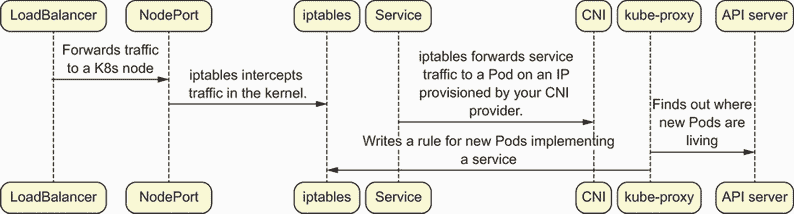
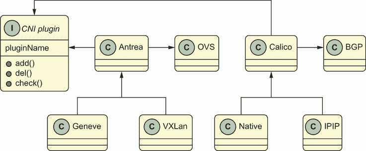

# 5 个 CNI 和为 Pod 提供网络

本章涵盖了

+   以 kube-proxy 和 CNI 定义 Kubernetes SDN

+   在传统的 SDN Linux 工具和 CNI 插件之间建立连接

+   使用开源技术来管理 CNI 的操作方式

+   探索 Calico 和 Antrea CNI 提供者

软件定义网络（SDN）传统上管理云中以及许多本地数据中心中的虚拟机的负载均衡、隔离和安全。SDN 是一种便利性，它减轻了系统管理员的负担，允许每周或每天重新配置大型数据中心网络，或者在创建或销毁新的虚拟机时进行重新配置。进入容器时代的未来，SDN 的概念获得了全新的意义，因为我们的网络不断变化（在大型 Kubernetes 集群中，每秒都在变化），因此，根据定义，它必须由软件自动化。Kubernetes 网络完全是软件定义的，并且由于 Kubernetes Pod 和服务端点的短暂和动态特性，它始终处于不断变化之中。

在本章中，我们将探讨 Pod 之间的网络连接，特别是如何在特定机器上的数百或数千个容器拥有独特且可集群路由的 IP 地址。Kubernetes 通过使用容器网络接口（CNI）标准，以模块化和可扩展的方式提供这一功能，该标准可以由广泛的技术实现，为每个 Pod 分配一个唯一的可路由 IP 地址。

CNI 规范没有指定容器网络的具体细节

CNI 规范是对将容器添加到网络的高级操作的通用定义。如果你从如何考虑 Kubernetes CNI 提供者的角度去理解它，一开始可能会有些困难。例如，一些 CNI 插件，如 IPAM 插件（[`www.cni.dev/plugins/current/ipam/`](https://www.cni.dev/plugins/current/ipam/)），仅负责为容器找到一个有效的 IP 地址，而其他 CNI 插件，如 Antrea 或 Calico，在更高的层面上操作，根据需要将功能委托给其他插件。实际上，一些 CNI 插件根本不将 Pod 附加到网络，而是在更广泛的“让我们将这个容器添加到网络”的工作流程中扮演微小的角色。（理解这一点后，IPAM 插件是理解这一概念的好方法。）

请记住，你将在野外遇到的任何 CNI 插件都是一个独特的存在，可能在连接容器到网络的总体进展中处于不同的时间点。此外，一些 CNI 插件仅在引用它们的其他插件上下文中才有意义。

让我们回顾一下之前提到的 Pods，并回顾它们的核心网络需求。作为探索这个概念的一部分，我们之前讨论了 `kube-proxy` 如何管理 iptables 规则、nftables、IPVS（IP 虚拟服务器）和其他网络代理实现。我们还查看了各种 `KUBE-SEP` 规则，这些规则告诉 Linux 内核“伪装”流量，使得从容器中流出的流量被标记为来自节点，或者通过服务 IP 进行 NAT。然后，这些流量被转发到一个正在运行的 Pod，这个 Pod 可能位于我们集群中的不同节点上。

`kube-proxy` 在将服务路由到后端 Pod 方面非常出色，通常是用户首次接触到的第一个软件定义网络组件。例如，当你第一次运行并使用节点端口公开一个简单的 Kubernetes 应用程序时，你通过 `kube-proxy` 在你的 Kubernetes 节点上创建的路由规则访问一个 Pod。然而，如果没有在集群上有一个健壮的 Pod 网络，`kube-proxy` 并不是特别有用。这是因为，最终，它的唯一任务是映射一个服务 IP 地址到一个 Pod 的 IP 地址。如果那个 Pod 的 IP 地址在两个节点之间不可路由，那么 `kube-proxy` 的路由决策不会导致一个对最终用户可用的应用程序。换句话说，负载均衡器的可靠性仅与其最慢的端点相当。

kpng 项目和 `kube-proxy` 的未来

随着 Kubernetes 的增长，CNI 生态系统扩展到在 CNI 层面上实际实现 `kube-proxy` 服务路由功能。这允许 CNI 提供商如 Antrea、Calico 和 Cilium 为 Kubernetes 服务代理提供高性能和扩展的功能集（例如，监控和与其他负载均衡技术的原生集成）。

为了解决需要一个“可插拔”的网络代理的需求，它可以保留 Kubernetes 的一些核心逻辑，同时允许供应商扩展其他部分，kpng 项目（[`github.com/kubernetes-sigs/kpng`](https://github.com/kubernetes-sigs/kpng)）被创建并正在孵化为一个新的 `kube-proxy` 替代品。它极其模块化，并且完全位于 Kubernetes 代码库之外。如果你对 Kubernetes 负载均衡服务感兴趣，这是一个很好的项目，可以深入了解和学习，但截至本文写作时，它尚未准备好用于生产工作负载。

作为一种可能有一天能完全作为 kpng 扩展实现的替代 CNI 提供的网络代理的例子，你可以查看 Antrea 代理（目前是 Antrea 中的一个新功能）等项目，可以根据用户偏好开启或关闭。你可以在 [`mng.bz/AxGQ`](http://mng.bz/AxGQ) 找到更多信息。

## 5.1 为什么 Kubernetes 需要软件定义网络

容器网络难题可以这样定义：给定数百个 Pod，其中一些对应于相同的服务，我们如何始终如一地将流量路由到集群内部和外部，以便所有流量始终到达正确的位置，即使我们的 Pod 在移动？这是任何尝试在生产环境中运行非 Kubernetes 容器解决方案的人面临的明显第二天操作问题（例如，Docker）。为了解决这个问题，Kubernetes 给我们提供了两个基本的网络工具：

+   *服务代理*——确保 Pod 可以在具有稳定 IP 的服务后面进行负载均衡，并路由 Kubernetes 服务对象

+   *CNI*——确保 Pod 可以在平坦且易于从集群内部访问的网络中不断重生

这个解决方案的核心是具有类型 `ClusterIP` 的 Kubernetes 服务对象。ClusterIP 服务是一种 Kubernetes 服务，它可以在您的 Kubernetes 集群内部进行路由，但不能从集群外部访问。它是在其他服务之上构建的基本原语。它也是集群内部应用程序之间相互访问的一种简单方式，无需直接路由到 Pod IP 地址（记住，如果 Pod 移动或死亡，Pod IP 可能会更改）。

例如，如果我们在一个 `kind` 集群中创建相同的服务三次，我们将看到它在 10.96 IP 空间中有三个随机的 IP 地址。为了验证这一点，我们可以通过连续三次运行 `kubectl create service clusterip my-service-1 --tcp="100:100"` 来重新创建相同的三个服务（当然，更改 `my-service-1` 的名称）。之后，我们可以这样列出服务 IP：

```
$ kubectl get svc -o wide
svc-1 ClusterIP 10.96.7.53    80/TCP 48s app=MyApp
svc-2 ClusterIP 10.96.152.223 80/TCP 33s app=MyApp
svc-3 ClusterIP 10.96.43.92   80/TCP 5s  app=MyApp
```

对于 Pod，我们也只有一个网络和子网。我们可以看到，在创建新的 Pod 时，新的 IP 地址可以轻松分配。因为我们的 `kind` 集群已经运行了两个 CoreDNS Pod，我们可以检查它们的 IP 地址以确认这一点：

```
$ kubectl get pods -A -o wide | grep coredns
kube-system coredns-74ff55c5b-nlxrs 1/1  Running 0 4d16h 192.168.71.1
➥ calico-control-plane <none> <none>
kube-system coredns-74ff55c5b-t4p6s 1/1  Running 0 4d16h 192.168.71.3
➥ calico-control-plane <none> <none>
```

我们刚刚看到了 Kubernetes SDN 的第一个重要课程：Pod 和服务 IP 地址由我们管理，并且位于不同的 IP 子网中。这在几乎我们将在现实世界中遇到的任何集群中（通常）都是恒定的。事实上，如果我们遇到一个这种情况并不成立的集群，那么有可能 Kubernetes 的某些其他行为已经被严重损害。这种行为可能包括 `kube-proxy` 路由流量或节点路由 Pod 流量的能力。

Kubernetes 控制平面规划了 Pod 和服务 IP 范围的路线

在 Kubernetes 中，有一个常见的误解，即 CNI 提供者负责服务以及 Pod IP 地址。实际上，当你创建一个新的 ClusterIP 服务时，Kubernetes 控制平面会根据你在启动时通过命令行选项（例如，`--service-cluster-ip-range`）提供的 CIDR 创建一个新的 IP，该 IP 与 `--allocate-node-cidrs` 选项一起使用。如果指定了，CNI 提供者通常会依赖于由 API 服务器分配的节点 CIDR。因此，CNI 和网络代理在高度本地化的层面上运作，发布由 Kubernetes 控制平面协调的整体集群配置指令。

## 5.2 实现 Kubernetes SDN 的服务端：kube-proxy

我们可以创建三种主要的 Kubernetes 服务 API 对象类型（正如你现在可能已经知道的那样）：ClusterIPs、NodePorts 和 LoadBalancers。这些服务通过使用 *labels* 定义我们将连接到哪个后端 Pod。例如，在前面的集群中，我们在 10 子网中有 ClusterIP 服务，这些服务将流量路由到我们的 192 子网中的 Pod。流量目标为服务 IP 的路由是如何进入另一个子网的？它是由 `kube-proxy`（或更正式地说，Kubernetes 网络或服务代理）进行路由的。

在前面的例子中，我们运行了 `kubectl create service my-service-1 --tcp= "100:100"` 三次，并得到了三个类型的 `ClusterIP` 服务。如果我们将这些服务设置为 `NodePort` 类型，那么这些服务的 IP 将会是集群中的任何节点。如果我们将这些服务设置为 `LoadBalancer` 类型，那么如果我们在云中，我们的云将提供一个外部 IP，例如 35.1.2.3。这将可以在更广泛的互联网或在我们 Pod、节点或服务 IP 范围之外的网络中访问，具体取决于云提供商。

`kube-proxy` 是一个代理吗？

在 Kubernetes 的早期阶段，`kube-proxy` 本身就为传入请求打开了一个新的 Golang 例程；因此，服务实际上是作为用户空间进程实现的，这些进程继续响应流量。Kubernetes iptables 代理（以及后来的 IPVS 代理）和 Windows 内核代理的创建使得 `kube-proxy` 具有更高的可扩展性和 CPU 效率。

一些用户空间代理的使用案例仍然存在，但数量很少。例如，VMware 的 Tanzu Kubernetes Grid 使用用户空间代理来支持 Windows 集群，因为它不能依赖于内核空间代理。这是由于它在使用 Open vSwitch（OVS）的方式上存在架构差异。无论如何，`kube-proxy` 通常会告诉其他代理工具关于 Kubernetes 端点的信息，但它通常不被视为传统意义上的代理。

图 5.1 展示了从 LoadBalancer 到 Kubernetes 集群的流量流程。它描述了

+   `kube-proxy` 使用低级路由技术，如 iptables 或 IPVS，将流量从服务发送到 Pod 内部以及从 Pod 发出。

+   当我们有一个类型为 `LoadBalancer` 的服务时，我们从外部世界获得一个 IP 地址。然后它将路由到我们的内部服务 IP。



图 5.1 从 LoadBalancer 到 Kubernetes 集群的流量流程

NodePort 与 ClusterIP 服务比较

*NodePorts* 是 Kubernetes 中的服务，它们在内部 Pod 网络之外的所有端口上暴露。它们提供了一个基础，您可以在其上构建负载均衡器。例如，您可能有一个在 ClusterIP 100.1.2.3:443 上提供服务的 Web 应用程序。

如果您想从集群外部访问该应用程序，每个节点都可能通过 NodePort 将流量转发到该服务。NodePort 的值是随机的；例如，它可能是 50491 这样的数字。因此，您可以通过 node_ip_1:50491、node_ip_2:50491、node_ip_3:50491 等来访问您的 Web 应用程序。

如果您对使用 `externalTrafficPolicy` 注解通过注释服务设置路由的更优方法感兴趣，这可能在所有操作系统和云类型上都不相同。如果您决定在服务路由上变得复杂，请务必深入了解细节。

NodePorts 建立在 ClusterIP 服务之上。ClusterIP 服务有一个内部 IP 地址，通常不与您的 Pod 网络重叠，它与您的 API 服务器同步。

为了乐趣而阅读 `kube-proxy` 的 iptables 规则

如果您想在一个真实的集群中看到完整的 iptables 配置，您可以查看位于 [`mng.bz/enV9`](http://mng.bz/enV9) 的 iptables-save-calico.md 文件。我们整理了这个文件，以便查看通常可能从运行在野外的 Kubernetes 集群中输出的所有 iptables 规则。

尤其是在这个文件中，我们注意到有三个主要的 iptables 表，对于 Kubernetes 来说，最重要的是 NAT 表。这是服务和服务 Pod 在大型集群中高度动态的起伏对集群造成影响的地方。正如本书的其他部分所提到的，不同的 `kube-proxy` 配置之间存在权衡，但到目前为止，最常用的代理是 iptables `kube-proxy`。

### 5.2.1 kube-proxy 的数据平面

`kube-proxy` 需要能够处理流向和来自由服务支持的 Pod 的持续 TCP 流量。一个 IP 数据包具有某些基本属性，包括源和目的 IP 地址。在一个复杂的网络中，这些可能会因为数据包通过一系列路由器而改变，我们将 Kubernetes 节点（由于 `kube-proxy`）视为这样一个路由器。一般来说，对数据包目的地的操作被称为 *NAT*（指网络地址转换），这是几乎所有网络架构解决方案的基本方面。*SNAT* 和 *DNAT* 分别指源和目的 IP 地址的转换。

`kube-proxy` 的数据平面可以通过多种方式完成这项任务，并在启动时通过其 `mode` 配置指定给 `kube-proxy`。如果我们深入细节，会发现 `kube-proxy` 本身被组织成两个独立的控制路径：server_windows.go 和 server_others.go（两者都位于此处：[`mng.bz/EWxl`](http://mng.bz/EWxl)）。server_windows.go 二进制文件被编译成 kube-proxy.exe 文件，并直接调用底层 Windows 系统 API（例如，用户空间代理的 `netsh` 命令以及 Windows 内核代理的 hcsshim 和 HCN [[`mng.bz/N6x2`](http://mng.bz/N6x2)] 容器化 API）。

更常见的情况是在 Linux 上运行 `kube-proxy`。在这种情况下，运行的是不同的二进制程序（称为 kube-proxy）。这个程序不会将其 Windows 功能编译到其代码路径中。在 Linux 场景中，我们通常运行 iptables 代理。在您的 `kind` 集群中，`kube-proxy` 仅以默认 iptables 模式运行。您可以通过运行 `kubectl edit cm kube-proxy -n kube-system` 来确认 `kube-proxy` 的配置，并查看其 `mode` 字段：

+   `ipvs` 使用内核负载均衡器为服务编写路由规则（Linux）。

+   `iptables` 使用内核防火墙为服务编写路由规则（Linux）。

+   `userspace` 使用 Golang `go func` 工作进程创建一个进程，手动代理流量到 Pod（Linux）。

+   Windows 内核依赖于 hcsshim 和 HCN API 进行负载均衡，这与 OVS 相关的 CNI 实现不兼容，但与其他 CNIs（如 Calico）兼容（类似于 Linux 用户空间选项）。

+   Windows 用户空间还使用 `netsh` 处理某些路由方面。这对那些由于某些原因无法使用常规 Windows 内核 API 的人来说很有用。请注意，如果您在 Windows 上安装了 OVS 扩展，您可能需要使用用户空间代理，因为内核的 HCN API 不会以相同的方式工作。

注意：在本书中，我们将提到 informers、controllers 和 Operators 的概念，以及它们的行为并不总是均匀地针对发生的配置更改实现。尽管网络代理是用 Kubernetes controller 实现的，但它不会动态响应配置更改。因此，如果您想通过修改服务负载均衡的方式来玩您的 `kind` 集群，您需要编辑网络代理的 `configMap`，然后重启其 DaemonSet。（如果您愿意，可以通过杀死您的 DaemonSet 中的一个 Pod，然后查看 Pod 重生时的日志来做这件事。您应该会看到新的 `kube-proxy` 模式。）

然而，`kube-proxy` 只是定义 Kubernetes SDN 路由流量的方式之一。为了全面，我们可以将 Kubernetes 路由视为三个独立的层：

+   *外部负载均衡器或入口/网关路由器*—将流量转发到 Kubernetes 集群。

+   *kube-proxy*——管理服务到 Pod 之间的转发。正如你可能已经知道的，术语 *proxy* 有点误导，因为通常，`kube-proxy` 只维护由内核或其他数据平面技术（如 iptables 规则）实现的静态路由规则。

+   *CNI 提供器*——无论我们是通过服务端点访问还是直接访问（Pod 到 Pod 网络），都会路由流量到和从 Pod。

最终，一个 CNI 提供器（如 `kube-proxy`）也会配置某种类型的规则引擎（如路由表）或 OVS 交换机，以确保节点之间或从外部世界到 Pod 的流量可以路由。如果你想知道为什么 `kube-proxy` 的技术不同于 CNIs，你并不孤单！许多 CNI 提供器正在努力自己实现一个完整的 `kube-proxy`，这样 Kubernetes 的 `kube-proxy` 就不再需要了。

### 5.2.2 关于 NodePort 是什么？

我们在本章的第一部分展示了 ClusterIP 服务，但我们还没有查看 NodePort 服务。现在让我们通过实际操作并创建一个新的 Kubernetes 服务来做到这一点。这将最终展示添加和修改负载均衡规则是多么容易。对于这个例子，让我们创建一个指向我们集群中 Pod 内运行的 CoreDNS 容器的 NodePort 服务。我们可以通过查看 `kubectl get svc -o yaml kube-dns -n kube-system` 的内容来快速组合它。然后我们可以将服务类型从 `ClusterIP` 更改为 `NodePort`，如下所示：

```
# save the following file to my-nodeport.yaml
apiVersion: v1
kind: Service
metadata:
  annotations:
    prometheus.io/port: "9153"
    prometheus.io/scrape: "true"
  labels:
    k8s-app: kube-dns
    kubernetes.io/cluster-service: "true"
    kubernetes.io/name: CoreDNS
  name: kube-dns-2                 ❶
  namespace: kube-system
spec:
  ipFamilies:
  - IPv4
  ipFamilyPolicy: SingleStack
  ports:
  - name: dns
    port: 53
    protocol: UDP
    targetPort: 53
  - name: dns-tcp
    port: 53
    protocol: TCP
    targetPort: 53
  - name: metrics
    port: 9153
    protocol: TCP
    targetPort: 9153
  selector:
    k8s-app: kube-dns
  sessionAffinity: None
  type: NodePort                   ❷
status:
  loadBalancer: {}
```

❶ 将服务命名为 kube-dns-2 以区分已存在的 kube-dns 服务

❷ 将此服务的类型更改为 NodePort

现在，如果我们运行 `kubectl create -f my-nodeport.yaml`，我们会看到为我们分配了一个随机端口。现在这个端口正在为我们转发流量到 CoreDNS：

```
kubectl get pods -o wide -A
kube-system   kube-dns     ClusterIP   10.96.0.10
              53/UDP,53/TCP,9153/TCP k8s-app=kube-dns
kube-system   kube-dns-2   NodePort    10.96.80.7
              53:30357/UDP,53:30357/TCP,9153:31588/TCP
              2m33s   k8s-app=kube-dns                  ❶
```

❶ 将随机端口 30357 和 31588 映射到端口 53

随机端口 30357 和 31588，从我们的 DNS 服务 Pod 映射到端口 53，在集群的所有节点上打开。这是因为所有节点都在运行 `kube-proxy`。在我们创建 ClusterIP 服务时，这些随机端口尚未分配。

如果你感到勇敢，我们将把这个作为一项练习留给你，在你的 `kind` Docker 节点上运行 `iptables-save` 并找出 `kube-proxy` 为你的新创建的服务 IP 地址编写的规则。 (如果你对 NodePort 感兴趣，你将喜欢我们后面的章节，关于如何在本地安装和测试 Kubernetes 应用程序。在那里，我们将创建几个服务来测试 Kubernetes 中的著名 Guestbook 应用程序。)

现在你已经对服务如何最终在内部 Pod 端口和外部世界之间配置路由规则有了些许了解，让我们来看看 CNI 提供程序。这些提供程序在整体 Kubernetes SDN 网络堆栈中位于服务代理的下一层。最终，我们的服务实际上只是在将流量从 10.96.80.7 路由到我们集群内运行的 Pod。这些 Pod 如何连接到有效的 IP 地址，以及它们如何接收这些流量？答案是……CNI 接口。

## 5.3 CNI 提供程序

CNI 提供程序实现了 CNI 规范（[`mng.bz/RENK`](http://mng.bz/RENK)），该规范定义了一个合同，允许容器运行时在启动时请求一个工作 IP 地址。它们还添加了此规范之外的其他高级功能（如实现网络策略或第三方网络监控集成）。例如，VMware 用户会发现他们可以免费使用 Antrea 作为 CNI 代理，并将其插入到 VMware 的 NSX 平台中，以实现实时容器监控和日志功能，这些功能是当前一些开源 CNI 提供程序所包含的。尽管从理论上讲，CNI 提供程序只需要路由 Pod 流量，但许多提供了额外的功能。以下是一些主要本地 CNI 的简要概述

+   *Calico*—一个基于 BGP 的 CNI 提供程序，它创建新的边界网关协议（BGP）路由规则以实现数据平面。Calico 还支持 XDP、NAND 和 VXLAN 路由选项（例如，在 Windows 上，以 VXLAN 模式运行 Calico 并不罕见）。作为一个高级 CNI，它具有使用类似于 Cilium 技术的替换`kube-proxy`的能力。

+   *Antrea*—一个使用桥来路由所有 Pod 流量的 OVS 数据平面 CNI 提供程序。它在许多高级路由和网络代理替换选项（AntreaProxy）方面与 Calico 相似。

+   *Flannel*—一个基于桥的 IP CNI 提供程序，现在不再常用。它是生产 Kubernetes 集群的原始主要 CNI 之一。

+   *Google, EC2, and NCP*—这些基于云的 CNI 使用专有软件来做出云感知的流量路由决策。例如，它们能够创建规则，直接在容器之间路由流量，而无需经过节点网络路径。

+   *Cilium*—一个基于 XDP 的 CNI 提供程序，它使用现代 Linux API 来路由流量，无需任何内核流量管理。在某些情况下，这允许容器之间的 IP 通信更快、更安全。Cilium 使用其先进的数据路径工具提供网络代理替代方案。

+   *KindNet*—一个简单的 CNI 插件，默认情况下用于`kind`集群，但它仅设计用于只有单个子网的单一简单集群。

还有许多其他 CNIs 可能特定于其他供应商或开源技术，以及为各种云环境（如 VMware、Azure、EKS 等）提供的专有 CNI 供应商。这些专有 CNIs 仅在其供应商的基础设施内运行，因此可移植性较低，但通常性能更好或与云功能更好地集成。一些 CNIs，如 Calico 和 Antrea，提供供应商特定和供应商中立的功能（例如 Tigera 或 NSX 特定的集成）。

## 5.4 深入了解两个 CNI 网络插件：Calico 和 Antrea

图 5.2 显示了 Calico 和 Antrea 插件中 CNI 网络的工作方式。这两个插件通过一系列路由规则和开源技术实现相同的目标状态。CNI 接口定义了任何容器网络解决方案的几个核心功能方面，所有 CNI 插件（例如 BGP 和 OVS）都以不同的方式实现该功能。如图 5.2 所示，不同的 CNIs 使用不同的底层技术栈。



图 5.2 Calico 和 Antrea 插件中的 CNI 网络

`kube-proxy`是必需的吗？

我们将`kube-proxy`视为一个要求，但随着网络供应商越来越多地开始提出诸如 Cilium CNI 提供的扩展伯克利包过滤器（eBPF）或 Antrea CNI 提供的 OVS 代理等技术，这些技术可以简化运行`kube-proxy`的需求。这些技术通常借鉴了`kube-proxy`的内部逻辑，并尝试以使用不同底层数据平面的方式重现和实现它。然而，在本书出版时的大多数集群仍然使用传统的 iptables 或 Windows 内核代理。因此，我们将`kube-proxy`视为现代 Kubernetes 集群中的一个恒定特性。但随着云原生领域的扩展，请注意地平线上的这些花哨的替代方案。

### 5.4.1 CNI 插件的架构

Calico 和 Antrea 都具有类似的架构：一个 DaemonSet 和一个协调容器。为了设置这些，CNI 安装包括四个步骤（通常由您的 CNI 提供商完全自动化，因此可以在简单的 Linux 集群中通过一行命令完成）：

1.  安装`kube-proxy`，因为您的 CNI 提供者的协调控制器可能需要查询 Kubernetes API 服务器的功能。这通常在安装 Kubernetes 之前由任何 Kubernetes 安装程序为您完成。

1.  在节点上安装一个二进制 CNI 程序（通常在如/opt/cni/bin 之类的目录中），该程序可以被容器运行时调用以创建一个具有 CNI 提供的 IP 地址的 Pod。

1.  在您的集群中部署一个 DaemonSet，其中一个容器为它的驻留节点设置网络原语。这个 DaemonSet 在启动时为其主机执行之前的安装步骤。

1.  在您的集群中部署一个协调容器，该容器可以聚合或代理来自 Kubernetes 的元数据；例如，在单个位置聚合 NetworkPolicy 信息，以便它可以很容易地被 DaemonSet Pods 消费和去重。

对于 CNI 插件没有强制性的架构，但整体上，DaemonSet 加控制器模式相当稳健。在 Kubernetes 中，对于任何旨在与 Kubernetes API 集成的代理导向过程，遵循这种模式通常是一个好主意。

注意 CNI 提供者会给 Pods 分配 IP 地址，但关于这个过程的工作方式的大多数假设最初都是偏向 Linux 操作系统的。因此，我们将查看 Calico 和 Antrea CNI 提供者，但在这样做的时候，你应该注意这些 CNIs 在其他操作系统中的行为可能会有所不同。例如，在 Windows 上，Calico 和 Antrea 通常不是作为 Pods 运行，而是作为使用 `nssm` 等工具的 Windows 服务运行。目前，一些支持 Linux 和 Windows 的更经得起考验的开源 CNI，如 Calico 和 Antrea，但还有很多其他的选择。

CNI 规范由我们的代理安装的二进制程序实现。特别是，它实现了三个基本的 CNI 操作：ADD、DELETE 和 CHECK，这些操作在 containerd 启动一个新的 Pod 或删除一个 Pod 时被调用。分别，这些操作

+   将容器添加到网络中

+   从网络中删除一个容器

+   检查容器是否正确设置

### 5.4.2 让我们玩一些 CNI

最后，我们可以开始进行一些黑客活动了！让我们先在我们的 `kind` 集群中安装一个 Calico CNI 提供者。Calico 使用第 3 层路由（与桥接不同，桥接是一种第 2 层技术）来广播集群中 Pods 的路由。最终用户通常不会注意到这种差异，但对于管理员来说，这是一个重要的区别，因为一些管理员可能希望在他们的集群中为了更广泛的架构设计目标使用第 3 层概念（如 BGP 对等）或第 2 层概念（如基于 OVS 的流量监控）：

+   *BGP* 代表边界网关协议，这是一种在互联网中广泛使用的第 3 层路由技术。

+   *OVS* 代表 Open vSwitch，这是一个基于 Linux 内核的 API，用于在您的操作系统中编程交换机以创建虚拟 IP 地址。

创建我们的 `kind` 集群的第一个步骤是禁用其默认的 CNI。然后我们将根据 YAML 规范重新创建它。例如：

```
$ cat << EOF > kind-Calico-conf.yaml
kind: Cluster
apiVersion: kind.sigs.k8s.io/v1alpha4
networking:
  disableDefaultCNI: true               ❶
  podSubnet: 192.168.0.0/16             ❷
nodes:                                  ❸
- role: control-plane
- role: worker
EOF
$ kind create cluster --name=calico --config=./kind-Calico-conf.yaml
```

❶ 禁用 kind-net CNI

❷ 将 192.168 子网划分，使其与我们的服务子网正交

❸ 向我们的集群添加第二个节点

kind-net CNI 是一个仅适用于单节点集群的最小 CNI。我们禁用它，以便可以使用真实的 CNI 提供者。所有我们的 Pod 都将位于 192.168 子网的大片区域上。Calico 为每个节点划分这部分，并且它应该与我们的服务子网正交。此外，在我们的集群中有一个第二个节点有助于我们理解 Calico 如何将本地流量与发往另一个节点的流量分开。

使用真实的 CNI 插件设置`kind`集群与我们已经做的不太一样。一旦这个集群启动，值得暂停一下，看看当 Pod 的 CNI 尚未可用时会发生什么。这会导致无法调度的 Pod，而这些 Pod 在 kubelet/manifests 目录中没有定义。你可以通过运行以下`kubectl`命令来看到这一点：

```
$ kubectl get pods --all-namespaces
NAMESPACE     NAME                       READY   STATUS    RESTARTS   AGE
kube-system   coredns-66bff467f8-86mgh   0/1     Pending   0          7m47s
kube-system   coredns-66bff467f8-nfzhz   0/1     Pending   0          7m47s

$ kubectl get nodes
NAME                   STATUS     ROLES    AGE    VERSION
Calico-control-plane   NotReady   master   2m4s   v1.18.2
Calico-worker          NotReady   <none>   85s    v1.18.2
```

### 5.4.3 安装 Calico CNI 提供者

到目前为止，我们的 CoreDNS Pod 将无法启动，因为 Kubernetes 调度器看到所有节点都是`NotReady`状态，正如之前的命令所示。如果不是这种情况，请检查你的 CNI 提供者是否已启动并运行。这种状态是基于 CNI 提供者尚未设置的事实确定的。CNIs 在 CNI 容器在 kubelet 的本地文件系统上写入`/etc/cni/net.d`文件时配置。为了使我们的集群运行起来，我们现在将安装 Calico：

```
$ wget https://docs.projectCalico.org/manifests/Calico.yaml
$ kubelet create -f Calico.yaml
```

大多数时候，Kubernetes 的安全问题很重要

本书专注于学习 Kubernetes 内部结构，但我们并没有花太多时间让每个命令都“滴水不漏”。例如，之前的命令从互联网上拉取清单文件并在你的集群中安装几个容器。如果你不完全理解这些命令的后果，请确保你在沙盒（如`kind`）中运行这些命令！

第十三章和第十四章提供了 Pod 和节点安全指南。除此之外，如果你对以应用为中心的安全感兴趣，像[`sigstore.dev/`](https://sigstore.dev/)和[`github.com/bitnami-labs/sealed-secrets`](https://github.com/bitnami-labs/sealed-secrets)这样的项目随着时间的推移已经发展起来，以解决围绕 Kubernetes 二进制文件、工件、清单甚至机密的各种安全担忧。如果你对以更安全的方式实现本书中使用的方便的 Kubernetes 惯用法感兴趣，那么深入研究这些（以及其他）Kubernetes 生态系统中的工具是值得的。有关一般 Kubernetes 安全概念的更多信息，请参阅[`kubernetes.io/docs/concepts/security/`](https://kubernetes.io/docs/concepts/security/)或随时加入 Kubernetes 安全邮件列表([`mng.bz/QWz1`](http://mng.bz/QWz1))。

上一步创建了两种容器类型：每个节点上的 Calico-node Pod 和一个在任意节点上运行的 Calico-kube-controllers Pod。一旦这些容器启动，你的节点应该处于`Ready`状态，你也会看到 CoreDNS Pod 现在正在运行：

```
$ kubectl get pods --all-namespaces
NAMESPACE            NAME
kube-system          Calico-kube-cntrlrs-57-m5       ❶
kube-system          Calico-node-4mbc5               ❷
kube-system          Calico-node-gpvxm
kube-system          coredns-66bff467f8-98t8j
kube-system          coredns-66bff467f8-m7lj5
kube-system          etcd-Calico-control-plane
kube-system          kube-apiserver-Calico-control-plane
kube-system          kube-controller-mgr
kube-system          kube-proxy-8q5zq
kube-system          kube-proxy-zgrjf
kube-system          kube-scheduler-Calico-control-plane
local-path-storage   local-path-provisioner-b5-fsr
```

❶ 协调 Calico 节点容器

❷ 在每个节点上设置各种 BGP 和 IP 路由

在这个代码示例中，kube controller 容器协调 Calico 节点容器。每个 Calico 节点容器为给定节点上运行的每个容器设置各种 BGP 和 IP 路由。有两个是因为我们有两个节点。

Calico 和 Antrea 都挂载了所谓的*hostPath*卷类型。Calico-node 进程的 CNI 二进制文件随后访问这个 hostPath，它连接到你的 kubelet 上的`/etc/cni/net.d/`。kubelet 使用这个二进制文件在需要为新 Pod 分配 IP 地址时调用 CNI API，因此它可以被视为主机 CNI 提供程序的*安装机制*。记住，hostPath 卷类型（大多数情况下）是一个反模式，除非你在配置像 CNI 这样的低级 OS 功能。

在图 5.2 中，我们研究了 DaemonSet 功能作为 Calico 和 Antrea 都实现的接口。让我们通过运行`kubectl get ds -n kube-system`来看看 Calico 创建了什么。我们会看到有一个 Calico DaemonSet 在所有节点上运行 CNI Pod。当我们稍后运行 Antrea 时，我们会看到一个类似的 DaemonSet 用于 Antrea 代理。

因为 Linux CNI 插件通常会将 CNI 二进制文件推送到主机的系统路径中，所以我们可以将 CNI 插件视为实现了`MountCniBinary`方法。这可能不是正式 CNI 接口的一部分，但它最终将是你在野外看到的几乎所有 CNI 插件的一部分。

太好了！我们现在有一个 CNI 了。让我们通过运行`docker` `exec`进入我们的节点并四处看看 Calico 为我们创建了什么。在运行`docker` `exec` `-t` `-i` `<your` `kind` `node>` `/bin/bash`之后，我们可以开始查看 Calico 创建的哪些路由。例如：

```
root@Calico-control-plane:/# ip route
default via 172.18.0.1 dev eth0
172.18.0.0/16 dev eth0 proto kernel scope
              link src 172.18.0.3
192.168.9.128/26 via 172.18.0.2 dev tunl0
              proto bird onlink               ❶
blackhole 192.168.71.0/26 proto bird          ❷
192.168.71.1 dev cali38312ba5f3c scope link
192.168.71.2 dev califcbd6ecdce5 scope link
```

❶ 根据其子网识别发往另一个节点的流量。

❷ 该节点未匹配但位于 71 子网中的流量将被丢弃。

我们可以看到这里有两个 IP 地址：192.168.71.1 和 71.2\. 这些 IP 地址与以字符串*cali*为前缀的两个设备相关联，这是我们的 Calico-node 容器创建的。这些设备是如何工作的？我们可以通过运行`ip a`命令来查看它们是如何定义的：

```
root@Calico-control-plane:/# ip a | grep califc
5: califcbd6ecdce5@if4: <BROADCAST,MULTICAST,UP,LOWER_UP>
➥ mtu 1440 qdisc noqueue state UP group default
```

现在我们可以看到节点为 Calico 相关的 Pod 创建了一个具有可识别名称的接口。例如：

```
root@Calico-control-plane:/# apt-get update -y;
➥ apt-get install tcpdump                         ❶
root@Calico-control-plane:/# tcpdump -s 0
➥ -i cali38312ba5f3c -v | grep 192                ❷
tcpdump: listening on cali38312ba5f3c, link-type EN10MB (Ethernet),
➥ capture size 262144 bytes

    10.96.0.1.443 > 192.168.71.1.59186: Flags [P.],
                    cksum 0x14d2 (incorrect -> 0x7189),
                    seq 520038628:520039301, ack 2015131286, win 502,
                    options [nop,nop,TS val 1110809235 ecr 1170831911],
                    length 673
    192.168.71.1.59186 > 10.96.0.1.443: Flags [.],
                    cksum 0x1231 (incorrect -> 0x9f10),
                    ack 673, win 502,
                    options [nop,nop,TS val 1170833141 ecr 1110809235],
                    length 0
    10.96.0.1.443 > 192.168.71.1.59186:
                    Flags [P.], cksum 0x149c (incorrect -> 0xa745),
                    seq 673:1292, ack 1, win 502,
                    options [nop,nop,TS val 1110809914 ecr 1170833141],
                    length 619
    192.168.71.1.59186 > 10.96.0.1.443:
                    Flags [.], cksum 0x1231 (incorrect -> 0x9757),
                    ack 1292, win 502,
                    options [nop,nop,TS val 1170833820 ecr 1110809914],
                    length 0
    192.168.71.1.59186 > 10.96.0.1.443:
                    Flags [P.], cksum 0x1254 (incorrect -> 0x362c),
                    seq 1:36, ack 1292, win 502,
                    options [nop,nop,TS val 1170833820 ecr 1110809914],
                    length 35
    10.96.0.1.443 > 192.168.71.1.59186:
                    Flags [.], cksum 0x1231 (incorrect -> 0x9734),
                    ack 36, win 502, options [nop,nop,TS val 1110809914
                    ecr 1170833820],
                    length 0
```

❶ 在容器中安装 tcpdump。

❷ 对 Calico 设备运行 tcpdump。

在我们的代码示例中，我们可以看到来自 10.96 子网对 71.1 IP 地址的入站流量。这个子网实际上是我们的 Kubernetes 服务 CoreDNS 容器的子网，这是我们的 DNS 容器通过 CNI 接触到的点。之前的`cali3831...`设备是直接通过某种以太网电缆（就像任何其他设备一样）连接到我们的节点上的。这被称为一个*veth*对，其中我们的容器本身有一个虚拟以太网电缆（命名为 cali3831）的一端直接插入到我们的 kubelet 中。这意味着任何试图从我们的 kubelet 访问这个设备的人都可以轻松做到。

现在，让我们回到我们之前展示的 IP 路由表。`dev`条目现在很清晰。这些对应于直接连接到我们的容器的路由。但是，关于`blackhole`和`192.168.9.128/26`路由呢？这些路由对应于

+   属于另一个节点（192.168.9.128/26 路由）的容器

+   属于任何节点（黑洞路由）的容器

这就是 BGP 在起作用。我们集群中每个运行 Calico-node 守护进程的节点都有一个 IP 地址范围，这些 IP 地址被路由到它。随着新节点的上线，这些路由会随着时间的推移添加到我们的 IP 路由表中。如果你运行`kubectl scale deployment coredns -n kube-system --replicas=6`，你会发现所有 IP 地址都出现在两个不同的子网之一：

+   *一些 Pod 出现在 192.168.9 子网中。* 这些对应于我们的一个节点。

+   *其他 Pod 出现在 192.168.71 子网中。* 这些对应于另一个节点。

你在集群中看到的节点越多，你将拥有的子网就越多。每个节点都有自己的 IP 地址范围，你的 CNI 提供者使用这个 IP 地址范围来分配给定节点上 Pod 的 IP 地址，以避免节点间 Pod IP 地址的冲突。这也是一种性能优化，因为不需要对 Pod IP 地址空间进行全局协调。因此，我们可以看到 Calico 通过为单个节点划分 IP 池并随后与内核中的路由表协调这些池来为我们管理 IP 地址范围。

### 5.4.4 使用 OVS 和 Antrea 的 Kubernetes 网络

对于普通用户来说，Antrea 和 Calico 看起来做的是同一件事：在多节点集群上的容器之间路由流量。然而，当你揭开盖子看看时，如何实现这一点有很多微妙之处。

OVS 是 Antrea 用来提供其 CNI 功能的东西。与 BGP 不同，它不使用 IP 地址作为从节点到节点直接路由的机制，就像我们在 Calico 中看到的那样。相反，它创建了一个在本地的 Kubernetes 节点上运行的*桥接器*。这个桥接器是使用 OVS 创建的。OVS 实际上是软件定义交换机（就像你在任何电脑店都能买到的那些）。当运行 Antrea 时，OVS 是我们 Pod 与外界之间的接口。

交换机（也称为层 2）和 IP（也称为层 3）路由之间的优缺点超出了本书的范围，并且在学术界和软件公司中都有激烈的争论。在我们的情况下，我们只能说这些是不同的技术，它们都工作得相当好，并且可以轻松扩展以处理数千个 Pod。

让我们再次尝试使用 `kind` 创建我们的集群，这次使用 Antrea 作为我们的 CNI 提供者。首先，使用 `kind delete cluster --name=calico` 删除你的最后一个集群，然后我们将使用下面的代码片段重新创建它：

```
$ cat << EOF > kind-Antrea-conf.yaml
kind: Cluster
apiVersion: kind.sigs.k8s.io/v1alpha3
networking:
  disableDefaultCNI: true
  podSubnet: 192.168.0.0/16
nodes:
- role: control-plane
- role: worker
EOF
$ kind create cluster --name=Calico --config=./kind-Antrea-conf.yaml
```

一旦你的集群启动，运行

```
kubectl apply -f https://github.com/vmware-tanzu/Antrea/
➥ releases/download/v0.8.0/Antrea.yml -n kube-system
```

然后，再次运行 `docker exec` 并查看你的 kubelets 中的 IP 情况。这次，我们看到为我们创建了几个不同的接口。请注意，我们省略了你在两个 CNIs 中都会看到的 `tun0` 接口。这是节点之间封装流量流过的网络接口。

有趣的是，当我们运行 `ip route` 命令时，我们看不到每个正在运行的 Pod 都有一个新的路由。这是因为 OVS 使用了一个桥接器，因此，以太网电缆仍然存在，但它们都直接插入了我们本地运行的 OVS 实例。运行以下命令，我们可以看到 Antrea 中的子网逻辑，这与我们在 Calico 中看到的类似：

```
root@Antrea-control-plane:/# ip route
172.18.0.0/16 dev eth0 proto kernel scope link src 172.18.0.3
192.168.0.0/24 dev Antrea-gw0 proto kernel scope link
               src 192.168.0.1                         ❶
192.168.1.0/24 via 192.168.1.1 dev
               Antrea-gw0 onlink                       ❷
```

❶ 通过 0.0 后缀定义了目标我们本地子网的流量

❷ Antrea 网关管理目标另一个子网且带有 1.0 后缀的流量。

现在，为了确认这一点，让我们运行 `ip a` 命令。这将显示我们机器理解的所有不同 IP 地址：

```
$ docker exec -t -i ba133 /bin/bash
root@Antrea-control-plane:/# ip a
# ip a
3: ovs-system: <BROADCAST,MULTICAST> mtu 1500 qdisc noop state
    DOWN group default qlen 1000
    link/ether 2e:24:a8:d8:a3:50 brd ff:ff:ff:ff:ff:ff
4: genev_sys_6081: <BROADCAST,MULTICAST,UP,LOWER_UP> mtu 65000 qdisc
    noqueue master ovs-system state
    UNKNOWN group default qlen 1000
    link/ether 76:82:e1:8b:d4:86 brd ff:ff:ff:ff:ff:ff
5: Antrea-gw0:<BROADCAST,MULTICAST,UP,LOWER_UP> mtu 1450 qdisc noqueue state
    UNKNOWN group default qlen 1000
    link/ether 02:09:36:d3:cf:a4 brd ff:ff:ff:ff:ff:ff
    inet 192.168.0.1/24 brd 192.168.0.255 scope global Antrea-gw0
       valid_lft forever preferred_lft forever
```

当我们运行 `ip a` 命令时，值得注意的是我们可以看到几个不熟悉的设备在周围浮动。这些包括

+   `genev_sys_6081`—Genev 接口，这是 Antrea 使用的隧道协议

+   `ovs-system`—一个 OVS 接口

+   `Antrea-gw0`—一个将流量发送到 Pod 的 Antrea 接口

与 Calico 不同，Antrea 实际上会将流量路由到网关 IP 地址，该地址位于使用我们集群 podCIDR 的 Pod 子网上。因此，Antrea 为给定节点设置 Pod IP 地址的算法类似于以下内容：

1.  为每个节点分配一个 Pod IP 地址子网

1.  将子网中的第一个 IP 地址分配给给定节点的 OVS 交换机

1.  将所有新的 Pod 分配到子网中剩余的空闲 IP 地址

这样的集群的路由表将遵循一种按时间顺序排列节点的模式。请注意，每个节点都接收 x.y.z.1 IP 地址上的流量（其分配子网中的第一个 Pod）。每个 Pod 的子网计算方式依赖于你的 Kubernetes 实现以及你的 CNI 提供者逻辑。在某些 CNIs 中，可能每个节点都没有独立的子网，但通常，这是一种 CNI 随时间管理 IP 地址的直观方式，因此相当常见。

请记住，**两者**Calico 和 Antrea 都会为节点 Pod 网络创建不同的子网，并且从该子网为 Pod 分配 IP 地址。如果你需要调试 CNI 中的网络路径，了解哪些 Pod 将发送到哪些节点可能会帮助你推理出你应该重启、`ssh`进入或完全删除哪些机器，这取决于你的 DevOps 实践。

以下片段展示了`antrea-gw0`设备。这是你集群中所有 Pod 的网关 IP 地址：

```
192.168.0.0/24 dev Antrea-gw0 proto kernel scope
               link src 192.168.0.1                       ❶
192.168.1.0/24 via 192.168.1.1 dev Antrea-gw0 onlink      ❷
192.168.2.0/24 via 192.168.2.1 dev Antrea-gw0 onlink      ❸
```

❶ 所有本地 Pod 都直接发送到本地 Antrea-gw0 设备。

❷ 将目标为集群第二个节点的 Pod 转发到该 OVS 实例

❸ 将目标为集群第三个节点的 Pod 转发到该 OVS 实例

因此，我们可以看到，在网络桥接模型中，创建的设备类型之间有一些差异：

+   没有黑洞路由，因为它由 OVS 处理。

+   我们内核管理的唯一路由是 Antrea 网关（`Antrea-gw0`）本身的。

+   所有这个 Pod 的流量都直接发送到`Antrea-gw0`设备。没有全局路由到其他设备，这与我们 Calico CNI 使用的 BGP 协议不同。

### 5.4.5 关于不同操作系统上的 CNI 提供者和 kube-proxy 的说明

这里值得指出的是，使用 DaemonSets 来管理 Pod 的主机网络是一种 Linux 特定的方法。在其他操作系统（例如 Windows Kubernetes 节点）中，当运行 containerd 时，实际上你需要使用服务管理器安装你的 CNI 提供者，并且 CNI 提供者作为主机进程运行。尽管这可能会在未来改变（再次以 Windows 为例，正在进行的工作是为了使 Windows Kubernetes 节点能够启用特权容器），但值得注意的是，Linux 网络堆栈非常适合 Kubernetes 网络模型。这主要归功于 cgroups、namespaces 和 Linux *root 用户*的概念，即使在容器中运行，它也可以作为一个高度特权的进程运行。

虽然 Kubernetes 网络复杂度可能一开始看起来令人畏惧，因为服务网格、CNI 和网络/服务器代理的快速演变，但只要你能理解 Pod 之间路由的基本过程，原则在许多 CNI 实现中都是一致的。

## 摘要

+   Kubernetes 网络架构与通用 SDN 概念有很多相似之处。

+   Antrea 和 Calico 都是 CNI 提供者，它们在 Pod 的真实网络上叠加了一个集群网络。

+   基本的 Linux 命令（如`ip a`）可以用来推理你的 Pod 是如何进行网络连接的。

+   CNI 提供者通常在 DaemonSets 中管理 Pod 网络，在每个节点上运行一个特权 Linux 容器。

+   边界网关协议（BGP）和 Open vSwitch（OVS）都是 CNI 提供者的核心技术，它们解决了为 Pod 广播和共享 overlay 路由信息的基本问题。

+   其他操作系统如 Windows 目前并没有像 Linux 那样拥有所有相同的原生 Pod 网络便利性。
