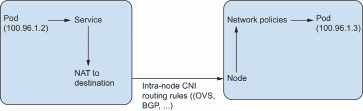
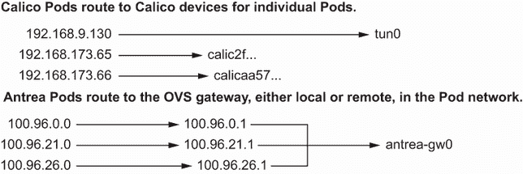

# 6 大规模网络错误的故障排除

本章涵盖

+   使用 Sonobuoy 确认集群功能

+   跟踪 Pod 的数据路径

+   使用 `arp` 和 `ip` 命令检查 CNI 路由

+   深入了解 kube-proxy 和 iptables

+   层 7 网络简介（入口资源）

在本章中，我们将讨论一些用于故障排除大规模网络错误的触点。我们还介绍了 *Sonobuoy*，这是一个瑞士军刀，用于认证、诊断和测试实时 Kubernetes 集群的功能，它是 Kubernetes 中常用的诊断工具。

Sonobuoy 与 Kubernetes e2e（端到端）测试的比较

Sonobuoy 在容器中运行 Kubernetes e2e 测试套件，并简化了整体结果的检索、存储和归档。

对于经常从源代码树中工作的高级 Kubernetes 用户，您可以直接使用 test/e2e/ 目录（位于 [`mng.bz/Dgx9`](http://mng.bz/Dgx9)）作为 Sonobuoy 的替代方案。我们建议将其作为学习如何运行特定 Kubernetes 测试的入门点。

Sonobuoy 基于 Kubernetes e2e 测试库。Sonobuoy 用于验证 Kubernetes 发布版本，并验证软件是否正确遵循 Kubernetes API 规范。毕竟，Kubernetes 最终只是一个 API，因此我们定义 Kubernetes 集群的方式是一组可以成功通过 Kubernetes 合规性测试套件的节点。

尝试运行 kind-local-up.sh

探索不同的 CNI 是练习解决现实世界中可能遇到的网络问题的好方法。您可以使用 [`mng.bz/2jg0`](http://mng.bz/2jg0) 上的 kind 菜单来运行具有不同 CNI 提供商的不同 Kubernetes 集群变体。例如，如果您克隆此项目，您可以通过运行 `CLUSTER=calico CONFIG=calico-conf.yaml ./kind-local-up.sh` 来创建基于 Calico 的集群。其他 CNI 选项（例如 Antrea 和 Cillium）也可用，并且可以从 kind-local-up.sh 脚本中读取。例如，为了创建一个 Antrea 集群以跟随本章中的示例，您可以运行

```
CLUSTER=antrea CONFIG=kind-conf.yaml ./kind-local-up.sh
```

然后，您可以修改 `CLUSTER` 选项以使用不同的 CNI 类型，例如 `calico` 或 `cillium`。一旦您的集群创建完成，如果您检查 `kube-system` 命名空间中的所有 Pods，您应该会看到 CNI Pods 正在愉快地运行。

注意：如果您希望看到添加新的 CNI 菜单或特定版本在 `kind` 环境中引起问题，请随时在仓库（[`github.com/jayunit100/k8sprototypes`](https://github.com/jayunit100/k8sprototypes)）中提交问题。

## 6.1 Sonobuoy：一个确认您的集群是否正常工作的工具

一套符合性测试包括数百个测试，以确认从存储卷、网络、Pod 调度以及运行一些基本应用程序的能力。Sonobuoy 项目（[`sonobuoy.io/`](https://sonobuoy.io/））打包了一套 Kubernetes e2e 测试，我们可以在任何集群上运行。这告诉我们集群的哪些部分可能工作不正常。一般来说，您可以下载 Sonobuoy，然后运行以下命令：

```
$ wget https://github.com/vmware-tanzu/sonobuoy/releases/
            download/v0.51.0/sonobuoy_0.51.0_darwin_amd64.tar.gz
$ tar -xvf sonobuoy
$ chmod +x sonobuoy ; cp sonobuoy /usr/loca/bin/
$ sonobuoy run e2e --focus=Conformance
```

此示例适用于 MacOS，因此请使用适合您操作系统的相应二进制文件。测试通常在健康的集群上需要 1 到 2 小时。之后，您可以通过运行 `sonobuoy status` 来获取集群是否正常工作的读数。要特别测试网络，可以运行以下测试：

```
$ sonobuoy run e2e --e2e-focus=intra-pod
```

此测试确认您的集群中每个节点都可以与其他节点上的 Pod 进行通信。它确认了您的 CNI 的核心功能以及您的网络代理（`kube-proxy`）是否正常工作。例如：

```
$ sonobuoy status
PLUGIN     STATUS     RESULT   COUNT
e2e        complete   passed   1
```

### 6.1.1 在真实集群中追踪 Pod 的数据路径

NetworkPolicy API 允许您以 Kubernetes 原生方式创建以应用程序为中心的防火墙规则，并且是安全集群通信规划的核心部分。它在 Pod 层面上操作，这意味着一个 Pod 到另一个 Pod 的连接是否被阻止或允许，取决于特定命名空间中存在的 NetworkPolicy 规则。NetworkPolicies、服务和 CNI 提供者之间有着微妙的相互作用，我们试图在图 6.1 中说明。生产集群中任意两个 Pod 之间的逻辑数据路径可以概括如图所示，其中：

+   来自 100.96.1.2 的 Pod 通过 DNS 查询（图中未显示）发送流量到它接收到的服务 IP。

+   然后，服务将来自 Pod 的流量路由到 iptables 确定的 IP。

+   iptables 规则将流量路由到不同节点上的 Pod。

+   节点接收到数据包，然后 iptables（或 OVS）规则确定它是否违反了网络策略。

+   数据包被发送到 100.96.1.3 终端。



图 6.1 生产集群中任意两个 Pod 之间的逻辑数据路径

数据路径没有考虑到可能出错的一些注意事项。例如，在现实世界中

+   第一个 Pod 也可能受到网络策略规则的约束。

+   在节点 10.1.2.3 和 10.1.2.4 之间的接口可能存在防火墙。

+   CNI 可能会宕机或出现故障，这意味着节点间数据包的路由可能会错误地到达其他地方。

+   在现实世界中，Pod 访问其他 Pod 可能需要 mTLS（相互 TLS）证书。

如你所知，iptables 规则由*链*和*规则*组成。每个 iptables 表都有不同的链，这些链由规则组成，这些规则决定了数据包的整体流向。以下链在数据包通过集群的典型流中由`kube-proxy`服务管理。（在下一节中，我们将探讨我们所说的*路由设备*究竟是什么。）

```
KUBE_MARK_MASQ -> KUBE-SVC -----> KUBE_MARK_DROP
|-----> KUBE_SEP -> KUBE_MARQ_MASK -> NODE -> route device
```

### 6.1.2 使用 Antrea CNI 提供者设置集群

在上一章中，我们讨论了使用 Calico 的网络流量。在这一章中，我们还将这样做。我们还将查看使用 OpenVSwitch（OVS）作为 Calico 用于 IP 路由的技术替代品的 Antrea CNI 提供者。这意味着

+   与在所有节点上可路由的 IP 的 BGP 广播不同，OVS 在每个节点上运行一个交换机，按接收到的流量进行路由。

+   与使用 iptables 创建网络策略规则不同，OVS 路由器制定规则以实现 Kubernetes NetworkPolicy API。

我们在这里会重复一些概念，因为，据我们看来，从不同的角度看待相同的材料极大地有助于你理解现实世界中的生产级网络。然而，这次我们将加快速度，因为我们假设你已经理解了之前网络章节中的一些概念。这些概念包括服务、iptables 规则、CNI 提供者和 Pod IP 地址。

要使用 Antrea 提供者设置集群，我们将使用`kind`，就像我们使用 Calico 时做的那样；然而，这次，我们将直接使用 Antrea 项目提供的“食谱”。要创建一个启用 Antrea 的`kind`集群，请运行以下步骤：

```
$ git clone https://github.com/vmware-tanzu/antrea/
$ cd antrea
$ cd ci/kind
$ ./kind-setup.sh
```

警告：本章中的教程相对高级。为了减少冗余，我们假设你能够在不同集群之间切换上下文。如果你还没有同时启动并运行 Antrea 和 Calico 集群，沿着阅读并尝试一些这些命令可能比试图逐字跟随本节更容易。像往常一样，当在网络的内部进行修改时，如果你还没有这样做，你可能需要在你的`kind`集群上运行`apt-get update; apt-get install net-tools`。

## 6.2 使用 arp 和 ip 命令检查不同提供者的 CNI 路由

这次我们跳过了 Kind

虽然你可以在`kind`集群中运行 Antrea，但为了本章，我们将展示来自 VMware Tanzu 集群的示例。如果你对在`kind`集群上使用 Antrea 重现此内容感兴趣，你可以运行[`mng.bz/2jg0`](http://mng.bz/2jg0)中的食谱，这些食谱在`kind`集群上启用 Calico、Cillium 或 Antrea。Cillium 和 Antrea 都是 CNI 提供者，由于它们依赖于需要少量额外配置的先进 Linux 网络（分别对应 eBPF 和 OVS），因此在`kind`集群上正确运行需要一些调整。

整个 IP 网络的概念基于这样一个想法：IP 地址最终会将你引导到某种类型的硬件设备，该设备在 IP（第 3 层）抽象的下一层（第 2 层）操作，因此，只能在理解彼此 MAC 地址信息的机器上寻址。通常，检查你的网络是如何运行的第一步是运行`ip a`命令。这会给你一个俯瞰图，了解你的主机知道哪些网络接口，以及你的集群中作为网络端点的最终目标设备。

在 Antrea 集群中，我们可以使用与上一章相同的`docker exec`命令进入任何节点，并发出`arp -na`命令来查看给定节点知道哪些设备。在本章的示例中，我们将展示真实的虚拟机，这样你可以将其作为查看 Antrea 网络的参考，这些网络将（在虚拟上）与你在本地集群中获得的输出相同。

首先，让我们进入一个节点并运行`arp`命令来查看它知道的 IP 地址。对于节点可以到达的 Pod 的地址，我们将使用`100`过滤器 grep IP 地址，就像这个案例一样。我们在这个裸金属集群中运行这个演示，机器位于 100 子网：

```
antrea_node> arp -na | grep 100
? (100.96.26.15) at 86:55:7a:e3:73:71 [ether] on antrea-gw0
? (100.96.26.16) at 4a:ee:27:03:1d:c6 [ether] on antrea-gw0
? (100.96.26.17) at <incomplete> on antrea-gw0
? (100.96.26.18) at ba:fe:0f:3c:29:d9 [ether] on antrea-gw0
? (100.96.26.19) at e2:99:63:53:a9:68 [ether] on antrea-gw0
? (100.96.26.20) at ba:46:5e:de:d8:bc [ether] on antrea-gw0
? (100.96.26.21) at ce:00:32:c0:ce:ec [ether] on antrea-gw0
? (100.96.26.22) at e2:10:0b:60:ab:bb [ether] on antrea-gw0
? (100.96.26.2) at 1a:37:67:98:d8:75 [ether] on antrea-gw0
```

节点本地的地址包括

```
antrea_node> arp -na | grep 192
? (192.168.5.160) at 00:50:56:b0:ee:ff [ether] on eth0
? (192.168.5.1) at 02:50:56:56:44:52 [ether] on eth0
? (192.168.5.207) at 00:50:56:b0:80:64 [ether] on eth0
? (192.168.5.245) at 00:50:56:b0:e2:13 [ether] on eth0
? (192.168.5.43) at 00:50:56:b0:0f:52 [ether] on eth0
? (192.168.5.54) at 00:50:56:b0:e4:6d [ether] on eth0
? (192.168.5.93) at 00:50:56:b0:1b:5b [ether] on eth0
```

### 6.2.1 什么是 IP 隧道，为什么 CNI 提供者会使用它们？

你可能会想知道那个`antrea-gw0`设备是什么。如果你在 Calico 集群上运行了这些命令，你可能也看到了`tun0`设备。无论如何，这些被称为*隧道*，它们是允许集群中 Pod 之间*扁平*网络连接的构造。在前面的例子中，`antrea-gw0`设备对应于管理 Antrea CNI 流量的 OVS 网关。这个网关流量足够智能，可以“隐藏”来自一个 Pod 到另一个 Pod 的流量，使得流量首先流向节点。在 Calico 集群中，你会看到类似的模式，其中使用协议（如 IPIP）来隐藏此类流量。Calico 和 Antrea CNI 提供者都足够智能，知道何时为了性能原因隐藏流量。

现在，让我们看看 Antrea 和 Calico CNI 的起点是如何有趣地开始有所不同的。在我们的 Calico 集群中，运行`ip a`命令会显示我们有一个`tunl0`接口。这个接口是由`calico_node`容器通过`brd`服务创建的，该服务负责在集群中通过 IPIP 隧道路由流量。我们将它与第二个代码片段中 Antrea 的`ip a`命令进行对比。

```
calico_node> ip a
2: tunl0@NONE: <NOARP,UP,LOWER_UP>
mtu 1440 qdisc noqueue state UNKNOWN
group default qlen 1000
antrea_node> ip a
3: ovs-system: <BROADCAST,MULTICAST> mtu 1500 qdisc noop state DOWN
   group default qlen 1000
   link/ether 7e:de:21:4b:88:46 brd ff:ff:ff:ff:ff:ff
5: antrea-gw0: <BROADCAST,MULTICAST,UP,LOWER_UP> mtu 1450 qdisc
   noqueue state UNKNOWN group default qlen 1000
    link/ether 82:aa:a9:6f:02:33 brd ff:ff:ff:ff:ff:ff
    inet 100.96.29.1/24 brd 100.96.29.255 scope global antrea-gw0
       valid_lft forever preferred_lft forever
    inet6 fe80::80aa:a9ff:fe6f:233/64 scope link
```

现在，在两个集群中，运行`kubectl scale deployment coredns --replicas=10 -n kube-system`。然后重新运行之前的命令。你会看到容器的新 IP 条目。

### 6.2.2 我们的网络接口上流过多少数据包？

我们知道所有数据包可能都被推送到特殊隧道中，以便在到达 Pod 之前最终到达正确的物理节点。因为每个节点都知道所有 Pod 本地流量，我们可以使用标准的 Linux 工具来监控 Pod 流量，而实际上并不依赖于对 Kubernetes 本身的任何了解。`ip`命令有一个`-s`选项来显示流量是否在流动。在 Calico 或 Antrea 集群的节点上运行此命令会告诉我们确切哪个接口的流量流入我们的 Pod 以及流量速率。以下是输出：

```
10: cali3317e4b4ab5@if5: <BROADCAST,MULTICAST,UP,LOWER_UP>
    mtu 1440 qdisc noqueue state UP group default
    link/ether ee:ee:ee:ee:ee:ee brd ff:ff:ff:ff:ff:ff
    link-netns cni-abb79f5f-b6b0-f548-3222-34b5eec7c94f
    RX: bytes  packets  errors  dropped overrun mcast
    150575     1865     0       2       0       0
    TX: bytes  packets  errors  dropped carrier collsns
    839360     1919     0       0       0       0

5: antrea-gw0: <BROADCAST,MULTICAST,UP,LOWER_UP> mtu 1450 qdisc
➥ noqueue state UNKNOWN group default qlen 1000
    link/ether 82:aa:a9:6f:02:33 brd ff:ff:ff:ff:ff:ff
    inet 100.96.29.1/24 brd 100.96.29.255 scope global antrea-gw0
       valid_lft forever preferred_lft forever
    inet6 fe80::80aa:a9ff:fe6f:233/64 scope link
       valid_lft forever preferred_lft forever
    RX: bytes  packets  errors  dropped overrun mcast
    89662090   1089577  0       0       0       0
    TX: bytes  packets  errors  dropped carrier collsns
    108901694  1208573  0       0       0       0
```

到目前为止，我们现在对集群中网络连接的工作方式有一个高级的视图。如果没有流量进入与 Calico 或 Antrea 相关的接口，那么（显然）我们的 CNI 出了问题，因为大多数 Kubernetes 集群在稳定状态操作期间至少会有一些 Pod 之间的流量流动。例如，即使在没有用户在`kind`集群中创建任何 Pod 的情况下，你也会看到`kube-proxy` Pod 和 CoreDNS Pod 会通过 CoreDNS 服务端点积极通信关于网络流量。看到这些 Pod 处于运行状态是一个良好的合理性测试（特别是对于 CoreDNS，它需要一个 Pod 网络才能工作），并且也将是验证你的 CNI 提供商是否健康的好方法。

### 6.2.3 路由

我们对 Pod 网络路径的探索的下一级涉及查看这些设备是如何连接到 IP 地址的。在图 6.2 中，我们再次描绘了 Kubernetes 网络的架构。然而，这一次，我们包括了之前命令中揭示的隧道信息。



图 6.2 将隧道信息添加到 Kubernetes 网络架构中

现在我们已经知道了什么是隧道，让我们看看我们的 CNI 是如何通过编程 Linux 路由表来管理路由到隧道的流量的。在 Calico 集群中运行`route -n`显示了内核中的以下路由表，其中`cali`接口是节点本地的 Pod，而`tunl0`接口是 Calico 自己创建的用于将流量发送到网关节点的特殊接口：

```
# route -n
Kernel IP routing table
Destination     Gateway     Genmask          Flags Metric Ref Use Iface
0.0.0.0         172.18.0.1  0.0.0.0          UG    0      0   0 eth0
172.18.0.0      0.0.0.0     255.255.0.0      U     0      0   0 eth0
192.168.9.128   172.18.0.3  255.255.255.192  UG    0      0   0 tunl0
192.168.71.0    172.18.0.5  255.255.255.192  UG    0      0   0 tunl0
192.168.88.0    172.18.0.4  255.255.255.192  UG    0      0   0 tunl0
192.168.143.64  172.18.0.2  255.255.255.192  UG    0      0   0 tunl0
192.168.173.64  0.0.0.0     255.255.255.192  U     0      0   0 *
192.168.173.65  0.0.0.0     255.255.255.255  UH    0      0   0 calicd2f3
192.168.173.66  0.0.0.0     255.255.255.255  UH    0      0   0 calibaa57
```

在这个 Calico 的路由表中，我们可以看到

+   172 个节点是某些 Pod 的网关。

+   在特定的范围内（在 Genmask 列中显示）的 192 个 IP 地址被路由到特定的节点。

那我们的 Antrea CNI 提供商呢？在类似的集群中，我们不会看到每个设备都有一个新的目标 IP。相反，我们会看到有一个`.1` Antrea 网关：

```
root [ /home/capv ]# route -n
Kernel IP routing table
Destination  Gateway      Genmask         Flags Ref Use Iface
0.0.0.0      192.168.5.1  0.0.0.0         UG    0   0   eth0
100.96.0.0   100.96.0.1   255.255.255.0   UG    0   0   antrea-gw0
100.96.21.0  100.96.21.1  255.255.255.0   UG    0   0   antrea-gw0
100.96.26.0  100.96.26.1  255.255.255.0   UG    0   0   antrea-gw0
100.96.28.0  100.96.28.1  255.255.255.0   UG    0   0   antrea-gw0
```

在这个 Antrea 的路由表中，我们可以看到

+   *任何目的地为 100.96.0.0 IP 范围的流量都会直接路由到 IP 地址 100.96.0.1。* 这是 CNI 网络上 Antrea 使用的 OVS 路由机制的一个*保留*IP 地址。因此，而不是直接发送到节点 IP 地址，它将所有流量发送到 Antrea 自己管理交换服务的 Pod 网络上的一个 IP 地址。

+   *与 Calico 不同，所有流量（包括本地流量）都直接发送到 Antrea 网关设备。唯一区分其最终目的地的是网关 IP。*

因此，我们可以看到

+   Antrea 在每个节点上有一个路由表条目*每个节点*。

+   Calico 在每个 Pod 上有一个路由表条目*每个 Pod*。

### 6.2.4 CNI 特定工具：Open vSwitch (OVS)

Antrea 和 Calico CNI 插件都在我们的集群中以 Pod 的形式运行。这并不一定适用于所有 CNI 提供者，但如果是的话，我们将在必要时能够使用许多优秀的 Kubernetes 功能来调试网络数据路径。一旦我们开始深入了解 CNIs，我们实际上需要查看像`ovs-vsctl`、`antctl`、`calicoctl`等工具。我们不会在这里介绍所有这些工具，但我们将介绍可以在你的集群中 Antrea 容器内轻松运行的`ovs-vsctl`工具。然后我们可以通过`ovs-vsctl`工具让 OVS 告诉我们更多关于这个接口的信息。为了使用这个工具，你可以直接使用`kubectl exec` `-t` `-i` `antrea-agent-1234` `-n` `kube-system` `/bin/bash`进入 Antrea 容器，创建一个 shell，然后运行以下命令之类的命令：

```
# ovs-vsctl list interface|grep -A 5 antrea
name                : antrea-gw0
ofport              : 2
ofport_request      : 2
options             : {}
other_config        : {}
statistics          : {collisions=0, rx_bytes=1773391201,
             rx_crc_err=0, rx_dropped=0, rx_errors=0,
             rx_frame_err=0, rx_missed_errors=0, rx_over_err=0,
             rx_packets=16392260, tx_bytes=6090558410,
             tx_dropped=0, tx_errors=0, tx_packets=17952545}
```

有几个命令行工具可以让你在集群中诊断低级 CNI 问题。对于 CNI 特定的调试，你可以使用`antctl`或`calicoctl`：

+   `antctl`列出启用的 Antrea 功能，获取代理的调试信息，并对 Antrea NetworkPolicy 目标进行细粒度分析。

+   `calicoctl`分析 NetworkPolicy 对象，打印关于网络诊断的信息，并关闭常见的网络功能（作为手动编辑 YAML 文件的替代方案）。

如果你对集群的通用 Linux-centric 调试感兴趣，可以使用像 Sonobuoy 这样的工具在集群上运行一系列端到端测试。你也可以考虑使用[`github.com/sarun87/k8snetlook`](https://github.com/sarun87/k8snetlook)工具，该工具为细粒度的网络功能（例如，API 服务器连接性、Pod 连接性等）运行实际的集群诊断。

根据你的网络配置复杂程度，你需要在现实世界中进行的故障排除量会有所不同。每个节点有 100+个 Pod 是很常见的，对这些概念进行一定程度的检查或推理将变得越来越重要。

### 6.2.5 使用 tcpdump 追踪活动容器的数据路径

现在我们对数据包如何在各种 CNIs 中从一个地方流向另一个地方有了些直觉，让我们回到栈的顶部，看看我们最喜欢的传统网络诊断工具之一：`tcpdump`。因为我们已经追踪了主机与底层 Linux 网络工具之间的关系，这些工具负责路由流量，我们可能想从容器的角度来查看这些事情。最常用的工具是`tcpdump`。让我们抓取我们的 CoreDNS 容器之一，并查看其流量。在 Calico 中，我们可以直接嗅探`cali`设备上的数据包，如下所示：

```
192.168.173.66  0.0.0.0    255.255.255.255 UH  0   0   0 calibaa5769d671
calico_node> tcpdump -i calicd2f389598e
listening on calicd2f389598e,
link-type EN10MB (Ethernet),
capture size 262144 bytes
20:13:07.733139 IP 10.96.0.1.443 > 192.168.173.65.60684:
  Flags [P.],
  seq 1615967839:1615968486,
  ack 1173977013, win 264,
  options [nop,nop,TS val 296478
```

10.96.0.1 IP 地址是内部 Kubernetes 服务地址。这个 IP（API 服务器）确认收到了 CoreDNS 服务器获取 DNS 记录的请求。如果我们查看我们集群中的一个典型节点，在那里我们运行 CoreDNS Pod，我们的 Antrea Pods 将被命名为如下：

```
30: coredns--e5cc00@if3: <BROADCAST,MULTICAST,UP,LOWER_UP>
    mtu 1450 qdisc noqueue master ovs-system state UP
    group default
    link/ether e6:8a:27:05:d7:30 brd ff:ff:ff:ff:ff:ff
    link-netns cni-2c6b1bc0-cf36-132c-dfcb-88dd158f51ca
    inet6 fe80::e48a:27ff:fe05:d730/64 scope link
       valid_lft forever preferred_lft forever
```

这意味着我们可以通过连接到这个 veth 设备并使用`tcpdump`来直接嗅探发送到该节点的数据包。以下代码片段展示了如何进行此操作：

```
calico_node> tcpdump -i coredns--29244a -n
```

当你运行此命令时，你应该会看到来自不同 Pod 的流量，这些 Pod 正在尝试解析 Kubernetes DNS 记录。我们经常使用`-n`选项，这样在使用`tcpdump`时我们的 IP 地址就不会被隐藏。

如果你只想查看一个 Pod 是否在与其他 Pod 通信，你可以前往接收流量的 Pod 所在的节点，并抓取所有包含 Pod IP 地址之一的 TCP 流量。比如说，一个发送流量的 Pod 的 IP 地址是 100.96.21.21。运行此命令会给你一个包含例如 192 地址和 9153 端口的原始数据包转储：

```
calico_node> tcpdump host 100.96.21.21 -i coredns--29244a
listening on coredns--29244a, link-type EN10MB (Ethernet),
capture size 262144 bytes

21:59:36.818933 IP 100.96.21.21.45978 > 100.96.26.19.9153:
   Flags [S], seq 375193568, win 64860, options [mss 1410,sackOK,TS
   val 259983321 ecr 0,nop,wscale 7], length 0

21:59:36.819008 IP 100.96.26.19.9153 > 100.96.21.21.45978: Flags [S.],
   seq 3927639393, ack 375193569, win 64308, options [mss 1410,
   sackOK,TS val 2440057191 ecr 259983321,nop,wscale 7], length 0

21:59:36.819928 IP 100.96.21.21.45978 > 100.96.26.19.9153:
   Flags [.], ack 1, win 507, options [nop,nop,TS val
   259983323 ecr 2440057191], length 0
```

`tcpdump`工具通常用于对容器之间的流量进行实时调试。特别是，如果你没有从接收 Pod 到发送 Pod 的`ack`响应，这可能意味着你的 Pod 没有收到流量。这可能是由于网络策略或 iptables 规则干扰了正常的`kube-proxy`转发信息。

注意：传统的 IT 商店通常使用 Puppet 等工具来配置和管理 iptables 规则。将`kube-proxy`与其他基于 IT 的网络安全规则管理的 iptables 规则结合起来是困难的，通常，在由网络管理员维护的常规规则之外的环境中运行你的节点是最好的选择。

## 6.3 kube-proxy 和 iptables

关于网络代理，最重要的记住的事情是，其操作通常与你的 CNI 提供者的操作是独立的。当然，就像 Kubernetes 中的所有其他事物一样，这个说法并不是没有例外：一些 CNI 提供者已经考虑实现自己的服务代理，作为 Kubernetes 自带 iptables（或 IPVS）服务代理的替代方案。但话虽如此，这并不是大多数集群运行的标准方式。在大多数集群中，你应该在概念上将服务代理的概念（由`kube-proxy`执行）与流量路由的概念（由管理 Linux 原语（如 OVS）的 CNI 提供者执行）分开。

这次深入探讨重申了一些基本的 Kubernetes 网络概念。到目前为止，我们已经看到

+   主机如何将 Pod 流量映射到 IP 和路由命令

+   你如何验证传入的 Pod 流量并从主机查找 IP 隧道信息

+   如何使用`tcpdump`在特定 IP 地址上嗅探流量

现在我们来看看`kube-proxy`。尽管它不是你的 CNI 的一部分，但在诊断网络问题时理解`kube-proxy`是至关重要的。

### 6.3.1 iptables-save 和 diff 工具

当寻找所有服务端点时，你可以对集群运行`iptables-save`命令。此命令在某个时间点存储每个 iptables 规则。结合`diff`等工具，它可以用来测量两个 Kubernetes 网络状态之间的差异。从这里，你可以查找注释规则，这些规则告诉你与规则关联的服务。典型的`iptables-save`运行会产生如下几行规则：

```
-A KUBE-SVC-TCOU7JCQXEZGVUNU -m comment
   --comment "kube-system/kube-dns:dns" -m statistic --mode random
   --probability 0.10000000009 -j KUBE-SEP-QIVPDYSUOLOYQCAA

-A KUBE-SVC-TCOU7JCQXEZGVUNU -m comment
  --comment "kube-system/kube-dns:dns" -m statistic --mode random
  --probability 0.11111111101 -j KUBE-SEP-N76EJY3A4RTXTN2I

-A KUBE-SVC-TCOU7JCQXEZGVUNU -m comment
  --comment "kube-system/kube-dns:dns" -m statistic --mode random
  --probability 0.12500000000 -j KUBE-SEP-LSGM2AJGRPG672RM
```

在查看这些服务之后，你将想要找到它们对应的`SEP`规则。我们可以使用`grep`来查找与特定服务相关的所有规则。在这种情况下，`SEP-QI...`对应于我们集群中的 CoreDNS 容器。

注意：我们在许多示例中使用 CoreDNS，因为它是一个可以扩展和缩放的标准化 Pod，很可能运行在几乎任何集群中。你可以使用任何其他 Pod 来完成这个练习，该 Pod 位于内部 Kubernetes 服务后面，并使用 CNI 插件为其 IP 地址（它不使用主机网络）。

```
calico_node> iptables-save | grep SEP-QI
:KUBE-SEP-QIVPDYSUOLOYQCAA - [0:0]
### Masquerading happens here for outgoing traffic...
-A KUBE-SEP-QIVPDYSUOLOYQCAA -s 192.168.143.65/32
   -m comment
   --comment "kube-system/kube-dns:dns" -j KUBE-MARK-MASQ

-A KUBE-SEP-QIVPDYSUOLOYQCAA -p udp -m comment
  --comment "kube-system/kube-dns:dns" -m udp -j DNAT
  --to-destination 192.168.143.65:53

-A KUBE-SVC-TCOU7JCQXEZGVUNU -m comment
  --comment "kube-system/kube-dns:dns" -m statistic
  --mode random --probability 0.10000000009 -j KUBE-SEP-QIVPDYSUOLOYQCAA
```

这个步骤在所有 CNI 提供者中都是相同的。正因为如此，我们不会提供 Antrea/Calico 的比较。

### 6.3.2 查看网络策略如何修改 CNI 规则

入站规则和网络策略是 Kubernetes 网络中最锐利的特性之一，这主要是因为这两个都是由 API 定义的，但由集群中认为是可选的外部服务实现。具有讽刺意味的是，网络策略和入站路由对于大多数 IT 管理员来说是基本要求。因此，尽管这些功能在理论上可能是可选的，但如果你正在阅读这本书，你很可能会使用它们。

Kubernetes 中的 NetworkPolicies 支持在任何 Pod 上阻止入口/出口调用或两者。一般来说，Pod 在 Kubernetes 集群中根本不受保护，因此 NetworkPolicies 被视为安全 Kubernetes 生产集群的重要组成部分。NetworkPolicy API 对于初学者来说可能相当难以使用，所以我们将保持简单以帮助您入门：

+   NetworkPolicies 在特定的命名空间中创建，并通过标签针对 Pod。

+   NetworkPolicies 必须定义一个类型（默认为 ingress）。

+   NetworkPolicies 是累加的，并且是*仅允许*的，这意味着它们默认拒绝事物，并且可以分层以允许更多和更多的流量白名单

+   Calico 和 Antrea 对 Kubernetes NetworkPolicy API 的实现方式不同。Calico 创建新的 iptables 规则，而 Antrea 创建 OVS 规则。

+   一些 CNIs，如 Flannel，根本不实现 NetworkPolicy API。

+   一些 CNIs，如 Cillium 和 OVN（Open Virtual Network）Kubernetes，并没有实现整个 Kubernetes API 的 NetworkPolicy 规范（例如，Cillium 没有实现最近添加的 PortRange 策略，该策略在本文发表时处于 Beta 版本，而 OVN Kubernetes 没有实现 NamedPort 功能）。

重要的是要意识到，Calico 除了网络策略之外不使用 iptables 进行任何操作。所有其他路由都通过 BGP 路由规则完成，我们之前已经讨论过。在本节中，我们将创建一个网络策略，并查看它如何影响 Calico 和 Antrea 中的路由规则。为了开始了解网络策略可能如何影响流量，我们将运行一个 NetworkPolicy 测试，其中阻止所有流向名为`web`的 Pod 的流量：

```
kind: NetworkPolicy
apiVersion: networking.k8s.io/v1
metadata:
  name: web-deny-all
spec:
  podSelector:
    matchLabels:
      app: web     ❶
  ingress: []      ❷
```

❶ 此 NetworkPolicy 作用于默认命名空间中的 app:web 容器。

❷ 由于我们没有实际定义任何入口规则，因此拒绝所有流量

如果我们想要定义一个入口规则，我们的策略可能看起来像这样：

```
kind: NetworkPolicy
apiVersion: networking.k8s.io/v1
metadata:
  name: web
spec:
  podSelector:
    matchLabels:
      app: web
  ingress:
  - ports:
    - port: 80            ❶
  - from:
      - podSelector:
          matchLabels:
            app: web2     ❷
```

❶ 允许流量，但我们将其限制在我们的 web 服务器服务的端口上，即 80

❷ 允许 web Pod 响应来自我们的 web2 Pod 的入站流量

注意，在第二个片段中，web2 Pod 也将能够从 web Pod 接收流量。这是因为 web Pod 没有定义任何出口策略，这意味着默认情况下允许所有出口。因此，为了完全锁定 web Pod，我们希望

+   定义一个仅允许流向关键服务的出口 NetworkPolicy

+   定义一个仅允许来自关键服务的入口 NetworkPolicy

+   在前两个策略中添加端口号，以便仅允许关键端口

定义这类 YAML 策略可能非常繁琐。如果您想深入了解这个领域，请参阅[`mng.bz/XWEl`](http://mng.bz/XWEl)，其中包含几个教程，可介绍您如何为不同的用例创建特定的网络策略。

测试我们 CNI 创建的这些策略的一个好方法是在所有节点上定义一个运行相同容器的 DaemonSet。请注意，我们的 CNI 提供程序为 NetworkPolicies 创建规则是 CNI 提供程序本身的一个特性。这不是 CNI 接口的一部分。因为大多数 CNI 提供程序是为 Kubernetes 构建的，所以 Kubernetes NetworkPolicy API 的实现是他们提供的一个明显的附加功能。

现在，让我们通过创建一个策略可以针对的 Pod 来测试我们的策略。以下 DaemonSet 在所有节点上运行 Pod。每个 Pod 都由上面的策略保护，这导致 Calico CNI（或，作为替代，我们的 Antrea CNI 编写的 OVS 规则）编写一组特定的 iptables 规则。我们可以使用此代码片段中的代码来测试我们的策略：

```
apiVersion: apps/v1
kind: DaemonSet
metadata:
  name: nginx-ds
spec:
  selector:
    matchLabels:
      app: web        ❶
  template:
    metadata:
      labels:
        app: web
    spec:
      containers:
      - name: nginx
        image: nginx
```

❶ 在每个节点上运行 Pod

### 6.3.3 这些策略是如何实现的？

我们可以使用`diff`或`git diff`来比较创建策略前后 iptables 规则的变化。在 Calico 中，您将看到此类策略。这就是策略的`drop`规则实现的地方。要完成此操作

1.  在前面的代码片段中创建 DaemonSet，然后在任何节点上运行`iptables-save > a1`。

1.  创建一个网络策略来阻止此流量，再次运行`iptables-save > a2`，并将其保存到不同的文件中。

1.  运行类似于`git diff a1 a2`的命令并查看差异。

在此情况下，您将看到以下关于策略的新规则：

```
> -A cali-tw-calic5cc839365a -m comment
  --comment "cali:Uv2zkaIvaVnFWYI9" -m comment
  --comment "Start of policies" -j MARK --set-xmark 0x0/0x20000

> -A cali-tw-calic5cc839365a -m comment
  --comment "cali:7OLyCb9i6s_CPjbu" -m mark --mark 0x0/0x20000
  -j cali-pi-_IDb4Gbl3P1MtRtVzfEP

> -A cali-tw-calic5cc839365a -m comment --comment "cali:DBkU9PXyu2eCwkJC"
  -m comment --comment "Return if policy accepted" -m mark
  --mark 0x10000/0x10000 -j RETURN

> -A cali-tw-calic5cc839365a -m comment --comment "cali:tioNk8N7f4P5Pzf4"
  -m comment --comment "Drop if no policies passed packet" -m mark
  --mark 0x0/0x20000 -j DROP

> -A cali-tw-calic5cc839365a -m comment --comment "cali:wcGG1iiHvTXsj5lq"
  -j cali-pri-kns.default

> -A cali-tw-calic5cc839365a -m comment --comment "cali:gaGDuGQkGckLPa4H"
  -m comment --comment "Return if profile accepted" -m mark
  --mark 0x10000/0x10000 -j RETURN

> -A cali-tw-calic5cc839365a -m comment --comment "cali:B6l_lueEhRWiWwnn"
  -j cali-pri-ksa.default.default

> -A cali-tw-calic5cc839365a -m comment --comment "cali:McPS2ZHiShhYyFnW"
  -m comment --comment "Return if profile accepted" -m mark
  --mark 0x10000/0x10000 -j RETURN
> -A cali-tw-calic5cc839365a -m comment --comment "cali:lThI2kHuPODjvF4v"
  -m comment --comment "Drop if no profiles matched" -j DROP
```

Antrea 也实现了网络策略，但使用 OVS 流并将其写入表 90。在 Antrea 中运行类似的工作负载，您将看到创建的这些策略。完成此操作的一个简单方法是调用`ovs-ofctl`。通常，这是在容器内部完成的，因为 Antrea 代理已经完全配置了所有 OVS 管理二进制文件。如果需要，也可以从主机安装 OVS 实用程序来完成此操作。要在 Antrea 集群中运行以下示例，您可以使用`kubectl`客户端。此命令行显示了 Antrea 如何实现网络策略：

```
$ kubectl -n kube-system exec -it antrea-agent-2kksz
➥ ovs-ofctl dump-flows br-int | grep table=90
...
Defaulting container name to antrea-agent.
 cookie=0x2000000000000, duration=344936.777s, table=90, n_packets=0,
 n_bytes=0, priority=210,ct_state=-new+est,ip actions=resubmit(,105)

 cookie=0x2000000000000, duration=344936.776s, table=90, n_packets=83160,
 n_bytes=6153840, priority=210,ip,nw_src=100.96.26.1 actions=resubmit(,105)

 cookie=0x2050000000000, duration=22.296s, table=90, n_packets=0,
 n_bytes=0, priority=200,ip,reg1=0x18 actions=conjunction(1,2/2)     ❶

 cookie=0x2050000000000, duration=22.300s, table=90, n_packets=0, n_bytes=0,
 priority=190,conj_id=1,ip actions=load:0x1->NXM_NX_REG6[],resubmit(,105)

 cookie=0x2000000000000, duration=344936.782s, table=90, n_packets=149662,
 n_bytes=11075281, priority=0 actions=resubmit(,100)
```

❶ 当 Antrea 看到需要将网络策略应用于特定 Pod 时，它会使用 OVS 编写的联合规则。

OVS，类似于 iptables，定义了指定数据包流的规则。Antrea 使用几个 OVS 流表，每个表都有针对不同 Pod 的具体逻辑编程。如果您想在大规模上运行 Antrea 并确认数据中心中 OVS 使用的任何特定细节，可以使用像 Prometheus 这样的工具实时监控 OVS 中活跃使用的流数量。

记住，OVS 和 iptables 都集成在 Linux 内核中，所以您不需要对数据中心做任何特殊操作来使用这些技术。有关如何使用 Prometheus 监控 OVS 的更多信息，本书的配套博客文章可在[`mng.bz/1jaj`](http://mng.bz/1jaj)找到。在那里，我们将向您详细介绍如何设置 Prometheus 作为 Antrea 的监控工具。

Cyclonus 和 NetworkPolicy e2e 测试

如果你想了解更多关于 NetworkPolicies 的信息，你可以使用 Sonobuoy 运行 Kubernetes e2e 测试。你将得到一个漂亮的表格列表，它精确地打印出哪些 Pod 可以在（和不能）根据策略规范相互通信。另一个用于调查你的 CNI 提供者 NetworkPolicy 功能的更强大的工具是 Cyclonus，它可以从源轻松运行（见[`github.com/mattfenwick/cyclonus`](https://github.com/mattfenwick/cyclonus))）。

Cyclonus 生成数百个网络策略场景，并检查你的 CNI 提供者是否正确实现了它们。有时，CNI 提供者可能会在实现复杂的 NetworkPolicy API 时出现回归，因此在生产环境中运行这个工具来验证你的 CNI 提供者是否符合 Kubernetes API 规范是一个很好的主意。

## 6.4 入口控制器

*入口控制器*允许你通过单个 IP 地址将所有流量路由到你的集群（并且是节省云 IP 地址成本的好方法）。然而，它们可能很难调试，主要是因为它们是附加组件。为了解决这个问题，Kubernetes 社区讨论了提供默认入口控制器的方案。

NGINX、Contour 和网关 API

Kubernetes 的原始入口 API 是由 NGINX 实现的规范标准。然而，不久之后，发生了两个重大转变：

+   Contour ([`projectcontour.io/`](https://projectcontour.io/))成为了一个替代的 CNCF（云原生计算基金会）入口控制器。

+   网关 API 作为一种提供更好的多租户解决方案来暴露 Kubernetes 集群路由的替代方式出现。

在发布时，入口 API 处于“困境”之中，很快将被网关 API 取代，后者描述性更强，能够以更灵活的方式向开发者描述不同类型的第 7 层资源。因此，尽管我们鼓励你学习本节的内容，但我们指出，你应该将这部分内容作为一个跳板，开始研究网关 API 及其如何可能满足你未来的需求。要了解更多关于网关 API 的信息，你可以花些时间在[`gateway-api.sigs.k8s.io/`](https://gateway-api.sigs.k8s.io/)上。

要实现一个入口控制器（或网关 API），你需要决定如何将流量路由到它，因为它的 IP 地址不是常规的 ClusterIP 服务。如果你的入口控制器宕机，所有进入你的集群的流量也会中断，所以你可能会希望将其作为 DaemonSet（如果它在集群中运行）在所有节点上运行。

Contour 在其服务代理的基础上使用一种称为 *Envoy* 代理的技术。Envoy 可以用来构建入口控制器、服务网格以及其他类型的网络技术，这些技术可以透明地为你转发或管理流量。当你阅读这段内容时，请注意，Kubernetes 服务 API 是上游 Kubernetes 社区持续创新的领域。随着集群变得越来越大，在接下来的几年中，将出现越来越复杂的流量路由模型的需求。

### 6.4.1 设置 Contour 和 kind 以探索入口控制器

入口控制器的作用是为你将要运行的众多 Kubernetes 服务提供对外界的命名访问。如果你在一个拥有无限公共 IP 的云上，这可能会比其他情况下稍微少一些价值，但入口控制器还允许你干净地设置 HTTPS 透传，监控所有暴露的服务，并围绕外部可访问的 URL 创建策略。

为了探索如何将入口控制器添加到现有的 Kubernetes 集群中，我们将创建一个可靠的 `kind` 集群。然而，这次，我们将设置它将入口流量转发到端口 80。这些流量将由 Contour 入口控制器解析，这允许我们将多个服务通过名称绑定到集群的端口 80：

```
kind: Cluster
apiVersion: kind.sigs.k8s.io/v1alpha3
networking:
  disableDefaultCNI: true # disable kindnet
  podSubnet: 192.168.0.0/16 # set to Calico's default subnet
nodes:
- role: control-plane
- role: worker
  extraPortMappings:       ❶
  - containerPort: 80
    hostPort: 80
    listenAddress: "0.0.0.0"
  - containerPort: 443
    hostPort: 443
    listenAddress: "0.0.0.0"
```

❶ 定义额外的端口映射，以便从我们的本地终端访问端口 80 并将其转发到我们的 kind 节点上的端口 80

此代码片段中的额外端口映射使我们能够从我们的本地终端访问端口 80，并从我们的 `kind` 节点将流量转发到该端口。请注意，此配置仅适用于单节点集群，因为当在本地机器上运行基于 Docker 的 Kubernetes 节点时，你只有一个端口可以暴露。在我们创建我们的 _kind_ 集群后，我们将安装 Calico，如下例所示。你将拥有一个工作良好的、基本的 Pod 到 Pod 网络：

```
$ kubectl create -f
  https://docs.projectcalico.org/archive/v3.16/manifests/
  tigera-operator.yaml

$ kubectl -n kube-system set env daemonset/calico-node
        FELIX_IGNORELOOSERPF=true
$ kubectl -n kube-system set env daemonset/calico-node
        FELIX_XDPENABLED=false
```

好的，现在我们的基础设施都已经设置好了。让我们开始学习入口！在本节中，我们将从底部到顶部暴露 Kubernetes 服务。像往常一样，我们将使用我们可靠的 `kind` 集群来完成这项工作。然而，这次，我们将

+   从集群内部访问服务以进行合理性检查

+   使用 Contour 入口控制器通过主机名管理此服务，以及其他一系列服务

### 6.4.2 设置简单的 Web 服务器 Pod

要开始，让我们创建我们的 `kind` 集群，就像之前章节中做的那样。一旦我们启动并运行，我们就会创建一个简单的 Web 应用程序。由于 NGINX 经常被用作入口控制器，这次，我们将创建一个类似的 Python Web 应用程序：

```
apiVersion: v1
kind: Pod
metadata:
  name: example-pod
  labels:
    service: example-pod      ❶
spec:
  containers:
    - name: frontend
      image: python
      command:
        - "python"
        - "-m"
        - "SimpleHTTPServer"
        - "8080"
      ports:
        - containerPort: 8080
```

❶ 我们的服务选择此标签。

接下来，我们将通过标准 ClusterIP 服务公开 `containerPort`。这是所有 Kubernetes 服务中最简单的一个；它除了告诉 `kube-proxy` 在我们的 Python Pod 中创建一个虚拟 IP 地址（我们之前看到的 `KUBESEP` 端点）之外，什么都不做：

```
apiVersion: v1
kind: Service
metadata:
  name: my-service
spec:
  selector:
    service: example-pod    ❶
  ports:
    - protocol: TCP
      port: 8080
      targetPort: 8080
```

❶ 将此 Pod 指定为我们的服务端点

到目前为止，我们已经创建了一个小型的 Web 应用程序，它接收来自服务的流量。我们创建的 Web 应用程序在端口 8080 内部提供服务，我们的服务也使用该端口。让我们尝试本地访问它。我们将创建一个简单的 Docker 镜像，我们可以用它来探索我们的集群服务（此镜像是从 [`github.com/arunvelsriram/utils`](https://github.com/arunvelsriram/utils) 分支出来的）：

```
apiVersion: v1
kind: Pod
metadata:
  name: sleep
spec:
  containers:
    - name: check
      image: jayunit100/ubuntu-utils
      command:
        - "sleep"
        - "10000"
```

现在，从该镜像内部，让我们看看我们是否可以 `curl` 下载我们的服务。以下 `curl` 命令输出容器中 /etc/passwd 文件的所有行。如果您更喜欢更友好的东西，也可以将文件，例如 hello.html，写入容器中的 / 目录：

```
$ kubectl exec -t -i sleep curl my-service:8080/etc/passwd
root:x:0:0:root:/root:/bin/bash                              ❶
```

❶ 输出 /etc/passwd 文件中的所有行

它成功了！为了使其工作，我们知道

+   Pod 正在运行并在 OS 的 8080 端口上提供所有文件。

+   由于我们之前创建的 `my-service` 服务，集群中的每个 Pod 都能够通过端口 8080 访问此服务。

+   `kube-proxy` 将流量从 `my-service` 转发到 `example-pod` 并写入相关的 iptables 转发规则。

+   我们的 CNI 提供商 *能够* 创建必要的路由规则（我们在本章前面已经探讨过）并在 iptables 规则转发此数据包后，将流量从 `check` Pod 的 IP 地址转发到 `example-pod`。

假设我们想从外部世界访问此服务。为此，我们需要

1.  将其添加到入口资源中，以便 Kubernetes API 可以告诉入口控制器将其流量转发到它

1.  运行一个入口控制器，它将来自外部世界的流量转发到内部服务

目前有几种不同的入口控制器。流行的有 NGINX 和 Contour。在这种情况下，我们将使用 Contour 来访问此服务：

```
$ git clone https://github.com/projectcontour/contour.git
$ kubectl apply -f contour/examples/contour
```

现在，您已经安装了一个入口控制器，它将为您管理所有外部流量。接下来，我们将在本地机器的 /etc/hosts 文件中添加一个条目，它告诉我们要在 localhost 上访问之前的服务：

```
$ echo "127.0.0.1   my-service.local" >> /etc/hosts
```

现在，我们将创建一个入口资源：

```
apiVersion: networking.k8s.io/v1
kind: Ingress
metadata:
  name: example-ingress
spec:
  rules:
  - host: my-service.local          ❶
    http:
      paths:
      - path: /
        backend:
          serviceName: my-service   ❷
          servicePort: 8080
```

❶ 命名我们放在笔记本电脑 127.0.0.1 上的服务

❷ 命名内部 Kubernetes 服务

我们可以从本地计算机向 `kind` 集群发出 `curl` 命令。这样工作的方式如下：

1.  本地，我们的客户端尝试在端口 80 上发出 `curl my-service.local`。这解析 IP 地址为 127.0.0.1。

1.  流向我们的 localhost 的流量被我们的 `kind` 集群中监听 80 的 Docker 节点拦截。

1.  Docker 节点将流量转发到 Contour 入口控制器，该控制器看到我们正在尝试访问 my-service.local。

1.  Contour 的入口控制器将 my-service.local 流量转发到 my-service 后端。

当此过程完成后，我们将看到与之前示例中我们在 sleep 容器中得到的相同输出。以下代码片段显示了此过程，使用 Envoy 服务器在另一端进行监听。这是因为入口控制器使用 Envoy（Contour 在底层使用的服务代理）作为进入集群的网关：

```
curl -v http://my-service.local/etc/passwd
*   Trying 127.0.0.1...
* TCP_NODELAY set
* Conn to my-service.local (127.0.0.1) port 80    ❶
> GET / HTTP/1.1
> Host: my-service.local
> User-Agent: curl/7.64.1
> Accept: */*
>
< HTTP/1.1 200 OK
< server: envoy                                   ❷
< date: Sat, 26 Sep 2020 18:32:36 GMT
< content-type: text/html; charset=UTF-8
< content-length: 728
< x-envoy-upstream-service-time: 1
<
root:x:0:0:root:/root:/bin/bash
```

❶ 将 my-service.local 解析为 localhost

❷ Envoy 服务器正在响应 HTTP 请求

现在，我们可以通过运行一个将流量转发到 ClusterIP 的入口控制器服务，使用集群 IP 上的内部 `curl` 命令以及从我们的本地机器运行的 `curl` 命令来访问由 Python SimpleHTTPServer 托管的内容。如前所述，入口 API 最终将被新的 Gateway API 所取代。

Kubernetes 中的 Gateway API 允许在集群中对不同的租户进行复杂的解耦，用网关、网关类和路由替换入口资源，这些都可以由企业中的不同角色进行配置。尽管如此，网关和入口 API 的概念在功能上是相似的，并且本章中我们学到的许多内容可以自然地转移到 Gateway API。

## 摘要

+   在 CNI 插件中的流量转发涉及通过网络接口在节点之间路由 Pod 流量。

+   CNI 插件可以是桥接的或非桥接的，在每种情况下，它们转发流量的方式都不同。

+   可以使用许多不同的底层技术来实现网络策略，例如 Antrea OpenVSwitch (OVS) 和 Calico iptables。

+   层 7 网络策略是通过入口控制器实现的。

+   Contour 是一个入口控制器，它解决了 CNIs 在层 7 为 Pods 解决的相同问题，并且可以与任何 CNI 提供商一起工作。

+   在未来，Gateway API 将用更灵活的 API 架构取代 Ingress API，但本章中你学到的内容可以自然地转移到 Gateway API。
