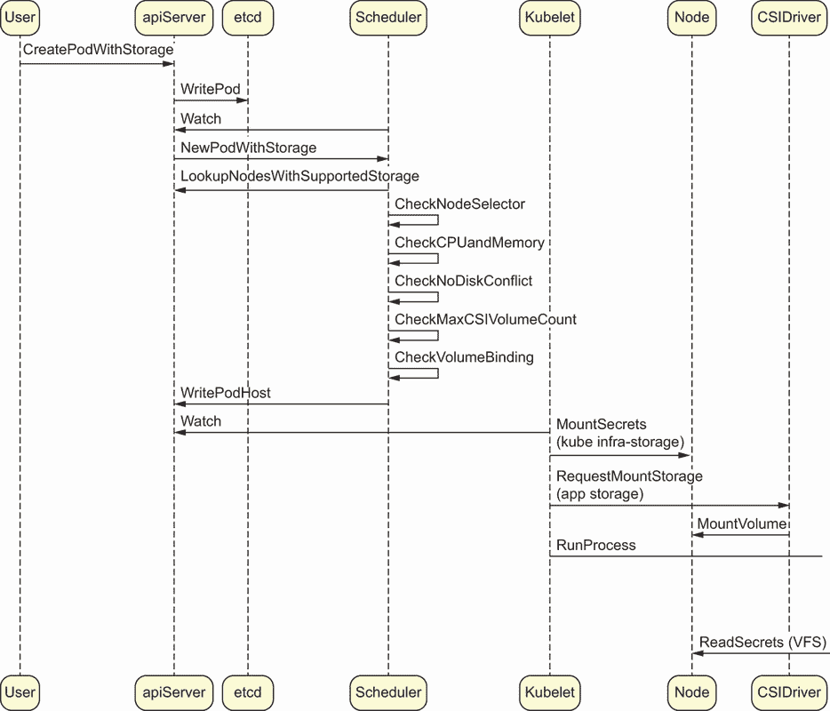
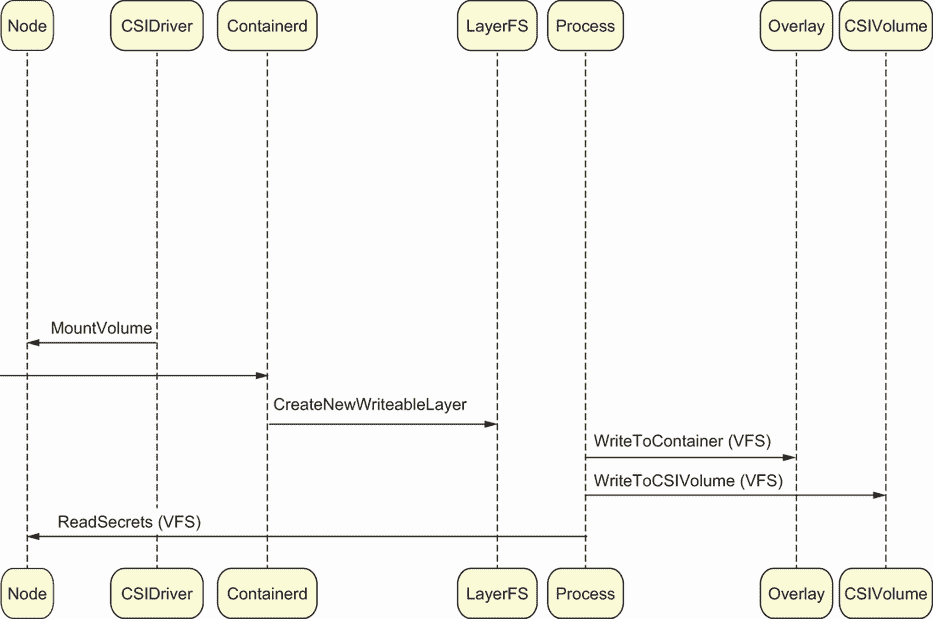
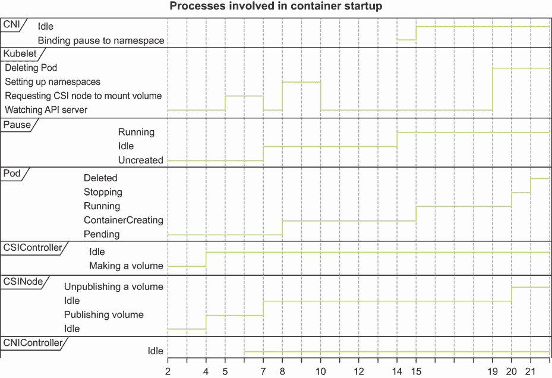
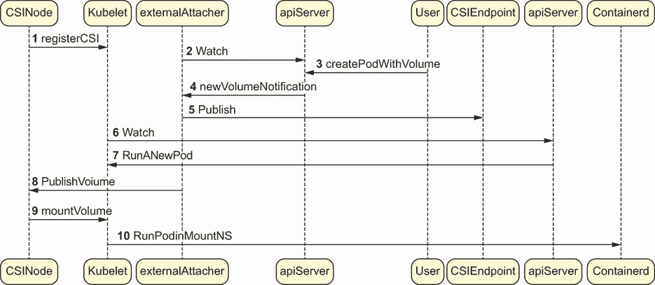

# 7 Pod 存储和 CSI

本章涵盖

+   介绍虚拟文件系统（VFS）

+   探索树内和树外 Kubernetes 存储提供者

+   在具有多个容器的 kind 集群中运行动态存储

+   定义容器存储接口（CSI）

存储很复杂，这本书不会涵盖现代应用开发者可用的所有存储类型。相反，我们将从一个具体问题开始：我们的 Pod 需要存储一个文件。这个文件需要在容器重启之间持久化，并且需要能够调度到我们集群中的新节点。在这种情况下，我们在这本书中已经覆盖的默认内置存储卷将“无法满足需求”：

+   我们的 Pod 不能依赖于`hostPath`，因为节点本身可能在宿主磁盘上没有唯一的可写目录。

+   我们的 Pod 也不能依赖于`emptyDir`，因为它是一个数据库，而数据库无法承担在临时卷上丢失存储信息的风险。

+   我们的 Pod 可能能够使用 Secrets 保留其证书或密码凭证以访问数据库等服务，但这个 Pod 在 Kubernetes 上运行的应用程序中通常不被视为卷。

+   我们 Pod 具有在容器文件系统顶层写入数据的能力。这通常很慢，并且不推荐用于高量写入流量。而且，在任何情况下，这根本无法工作：这些数据一旦 Pod 重启就会消失！

因此，我们发现了为我们的 Pod 提供全新维度 Kubernetes 存储：满足应用开发者的需求。Kubernetes 应用程序，就像常规云应用程序一样，通常需要能够在容器内挂载 EBS 卷、NFS 共享或 S3 存储桶中的数据，并从或写入这些数据源。为了解决这个应用程序存储问题，我们需要一个云友好的数据模型和存储 API。Kubernetes 使用持久卷（PV）、持久卷声明（PVC）和存储类（StorageClass）的概念来表示这个数据模型：

+   PVs 为管理员提供了一种在 Kubernetes 环境中管理磁盘卷的方法。

+   PVCs 定义了对这些卷的请求，这些请求可以由应用（通过 Pod）发起，并由 Kubernetes API 在底层满足。

+   StorageClass 为应用开发者提供了一种获取卷的方法，而无需确切知道其实现方式。它为应用提供了一种请求 PVC 的方法，而无需确切知道底层使用的持久卷类型。

StorageClasses 允许应用以声明式的方式请求满足不同最终用户需求的卷或存储类型。这允许你为数据中心设计 StorageClasses，可能满足各种需求，例如

+   复杂的数据 SLA（保留什么，保留多久，以及不保留什么）

+   性能要求（批处理应用与低延迟应用）

+   安全性和多租户语义（用户访问特定卷）

请记住，许多容器（例如，用于管理应用程序证书的 CFSSL 服务器）可能不需要太多的存储，但它们在重启并需要重新加载基本缓存或证书数据等情况下将需要一些存储。在下一章中，我们将进一步探讨如何管理 StorageClasses 的高级概念。如果你是 Kubernetes 的新手，你可能想知道 Pod 是否可以在没有卷的情况下保持任何状态。

Pod 是否保留状态？

简而言之，答案是：不。别忘了，在几乎所有情况下，Pod 都是一个短暂的构造。在某些情况下（例如，使用 StatefulSet），Pod 的一些方面（如 IP 地址或可能的一个本地挂载的主机卷目录）可能在重启之间保持不变。

如果 Pod 因任何原因死亡，它将由 Kubernetes 控制器管理器（KCM）中的进程重新创建。当创建新的 Pod 时，Kubernetes 调度器的任务是确保给定的 Pod 落在能够运行它的节点上。因此，Pod 存储的短暂性质，允许这种实时决策，对于管理大量应用程序的灵活性至关重要。

## 7.1 简单的偏离：Linux 中的虚拟文件系统（VFS）

在深入探讨 Kubernetes 为 Pod 存储提供的抽象之前，值得注意的一点是，操作系统本身也向程序提供了这些抽象。事实上，*文件系统*本身是对一个复杂的连接应用程序到一组简单 API 的抽象，我们之前已经见过。你可能已经知道了这一点，但请记住，访问文件就像访问任何其他 API 一样。Linux 操作系统中的文件支持各种明显和基本的命令（以及一些未在此列出的更不透明的命令）：

+   `read()`—从打开的文件中读取一些字节

+   `write()`—从打开的文件中写入一些字节

+   `open()`—创建和/或打开一个文件，以便可以进行读写操作

+   `stat()`—返回有关文件的一些基本信息

+   `chmod()`—更改用户或组对文件的操作以及读写执行权限

所有这些操作都是针对所谓的*虚拟文件系统*（VFS）进行的，在大多数情况下，这最终是围绕你的系统 BIOS 的一个包装器。在云环境中，以及在 FUSE（用户空间文件系统）的情况下，Linux VFS 只是一个包装器，它最终是对网络调用的包装。即使你正在将数据写入 Linux 机器之外的磁盘，你仍然是通过 Linux 内核通过 VFS 来访问这些数据的。唯一的区别是，因为你正在写入远程磁盘，VFS 会根据你的操作系统使用其 NFS 客户端、FUSE 客户端或其他所需的文件系统客户端，通过网络发送这个写入操作。这如图 7.1 所示，其中所有的各种容器写入操作实际上是通过 VFS API 进行的：

+   在 Docker 或 CIR 存储的情况下，VFS 将文件系统操作发送到设备映射器或 OverlayFS，它最终通过你的系统 BIOS 将流量发送到本地设备。

+   在 Kubernetes 基础设施存储的情况下，VFS 将文件系统操作发送到节点上本地连接的磁盘。

+   在应用程序的情况下，VFS 通常会将写入操作通过网络发送，尤其是在“真实”的运行在云中或数据中心中的 Kubernetes 集群中。这是因为你没有使用本地卷类型。

那么 Windows 呢？

在 Windows 节点上，kubelet 以与 Linux 类似的方式挂载并向容器提供存储。Windows kubelets 通常运行 CSI 代理 ([`github.com/kubernetes-csi/csi-proxy`](https://github.com/kubernetes-csi/csi-proxy))，它对 Windows 操作系统进行低级调用，当 kubelet 指示它这样做时挂载和卸载卷。Windows 生态系统中存在关于文件系统抽象的相同概念 ([`en.wikipedia.org/wiki/Installable_File_System`](https://en.wikipedia.org/wiki/Installable_File_System))。

在任何情况下，你不需要理解 Linux 存储 API 就能在 Kubernetes 中挂载 PersistentVolumes。然而，在创建 Kubernetes 解决方案时了解文件系统的基础知识是有帮助的，因为最终，你的 Pods 将会与这些低级 API 交互。现在，让我们回到以 Pod 存储为中心的 Kubernetes 视角。

## 7.2 Kubernetes 的三种存储需求

术语 *存储* 是多义的。在我们深入探讨之前，让我们区分一下在 Kubernetes 环境中通常会导致问题的存储类型：

+   *Docker/containerd/CRI 存储*—运行你的容器的写时复制文件系统。容器在其运行时需要特殊的文件系统，因为它们需要写入 VFS 层（这就是为什么，例如，你可以在容器上运行 `rm -rf /tmp` 而实际上不会从你的主机上删除任何东西）。通常，Kubernetes 环境使用 btrfs、overlay 或 overlay2 这样的文件系统。

+   *Kubernetes 基础设施存储*—在单个 kubelets 上使用的 hostPath 或 Secret 卷，用于本地信息共享（例如，作为将要挂载到 Pod 中的秘密的存储位置或存储或网络插件调用的目录）。

+   *应用存储*—Pod 在 Kubernetes 集群中使用的存储卷。当 Pods 需要将数据写入磁盘时，它们需要挂载一个存储卷，这通过 Pod 规范来完成。常见的存储卷文件系统有 OpenEBS、NFS、GCE、EC2 和 vSphere 持久磁盘等。

在图 7.1 中，图 7.2 是对其的扩展，我们直观地展示了所有三种存储类型是如何在启动 Pod 时的基本步骤。之前，我们只看了与 CNI 相关的 Pod 启动序列步骤。作为提醒，调度器在 Pod 启动前会进行几个检查，以确认存储已准备好。然后，在启动 Pod 之前，kubelet 和 CSI 提供者在节点上挂载外部应用程序卷，以便 Pod 使用。正在运行的 Pod 可能会将其自己的 OverlayFS 写入数据，这是完全短暂的。例如，它可能有一个用于临时空间的/tmp 目录。最后，一旦 Pod 运行，它会读取本地卷并可能写入其他远程卷。



图 7.1 Pod 启动中的三种存储类型

现在，第一个图示以 CSIDriver 结束，但它所描述的序列图还有许多其他层。在图 7.2 中，我们可以看到 CSIDriver、containerd、分层文件系统和 CSI 卷本身都是针对 Pod 进程的下游目标。具体来说，当 kubelet 启动一个进程时，它会向 containerd 发送消息，containerd 随后在文件系统中创建一个新的可写层。一旦容器化进程启动，它需要从挂载到其上的文件中读取机密信息。因此，在单个 Pod 中会进行许多不同类型的存储调用。在典型的生产场景中，每个调用在其应用程序的生命周期中都有自己的语义和目的。

CSI 卷挂载步骤是在 Pod 启动前发生的最后一步之一。为了理解这一步骤，我们需要快速绕道看看 Linux 是如何组织其文件系统的。



图 7.2 Pod 启动中的三种存储类型，第二部分

## 7.3 在我们的 kind 集群中创建一个 PVC

理论就到这里吧；让我们给一个简单的 NGINX Pod 提供一些应用存储。我们之前定义了 PVs、PVCs 和 StorageClasses。现在，让我们看看它们是如何被用来为真实的 Pod 提供一个用于存储文件的临时目录的：

+   PV 是由运行在我们`kind`集群上的动态存储提供者创建的。这是一个容器，它通过满足 PVC 来为 Pod 提供存储。

+   PVC 将在 PersistentVolume 准备好之前不可用，因为调度器需要确保在启动之前可以将存储挂载到 Pod 的命名空间中。

+   kubelet 不会启动 Pod，直到 VFS 成功地将 PVC 挂载到 Pod 的文件系统命名空间中作为一个可写存储位置。

幸运的是，我们的`kind`集群自带了一个存储提供者。让我们看看当我们请求一个带有新 PVC 的 Pod 时会发生什么，这个 PVC 尚未创建，并且在我们集群中还没有关联的卷。我们可以通过运行以下`kubectl get sc`命令来检查 Kubernetes 集群中可用的存储提供者：

```
$ kubectl get sc
NAME                   PROVISIONER             RECLAIMPOLICY
standard (default)     rancher.io/local-path   Delete

VOLUMEBINDINGMODE      ALLOWVOLUMEEXPANSION    AGE
WaitForFirstConsumer   false                   9d
```

为了演示 Pod 如何在容器之间共享数据，以及如何以不同的语义挂载多个存储点，这次我们将运行一个包含两个容器和两个卷的 Pod。总的来说，

+   Pod 中的容器可以相互共享信息。

+   在`kind`中，可以通过其动态的`hostPath`提供程序即时创建持久存储。

+   任何容器都可以在 Pod 中拥有多个存储卷挂载。

```
apiVersion: v1
kind: PersistentVolumeClaim
metadata:
  name: dynamic1
spec:
  accessModes:
  - ReadWriteOnce
  resources:
    requests:
      storage: 100k                             ❶
---
apiVersion: v1
kind: Pod
metadata:
  name: nginx
spec:
  containers:
  - image: busybox                              ❷
    name: busybox
    volumeMounts:
      - mountPath: /shared
        name: shared
  - image: nginx                                ❸
    imagePullPolicy: Always
    name: nginx
    ports:
    - containerPort: 80
      protocol: TCP
    volumeMounts:
      - mountPath: /var/www
        name: dynamic1                          ❹
      - mountPath: /shared
        name: shared
  volumes:
  - name: dynamic1
    persistentVolumeClaim:
      claimName: dynamic1                       ❺
  - name: shared
    emptyDir: {}                                ❻
$ kubectl create -f simple.yaml
pod/nginx created

$ kubectl get pods
NAME    READY   STATUS    RESTARTS   AGE
nginx   0/1     Pending   0          3s         ❼

$ kubectl get pods
NAME    READY   STATUS              RESTARTS   AGE
nginx   0/1     ContainerCreating   0          5s

$ kubectl get pods
NAME    READY   STATUS    RESTARTS   AGE
nginx   1/1     Running   0          13s        ❽
```

❶ 与第二个容器共享一个文件夹

❷ 除了与第一个容器共享文件夹外，还为第二个容器指定了一个动态存储卷

❸ 挂载之前创建的卷

❹ 因为存储卷段落位于我们的容器段落之外，所以多个 Pod 可以读取相同的数据。

❺ 如果需要，两个容器都可以访问共享卷

❻ 请求的存储量；我们的 PVC 决定了它是否可以满足。

❼ 第一个状态，挂起状态，是因为我们的 Pod 的存储卷尚未存在。

❽ 最终状态，运行状态，意味着我们的 Pod 的存储卷存在（通过 PVC），Pod 可以访问它；因此，kubelet 启动 Pod。

现在，我们可以在我们的第一个容器中通过运行一个简单的命令，例如`echo` `a` `>` `/shared/ASDF`，来创建一个文件。我们可以在第二个容器的名为/shared/的 emptyDir 文件夹中轻松地看到这个结果，对于两个容器都是如此：

```
$ kubectl exec -i -t nginx -t busybox -- /bin/sh
Defaulting container name to busybox.
Use kubectl describe pod/nginx -n default to see the containers in this pod.
/ # cat /shared/a
ASDF
```

现在我们有一个包含两个卷的 Pod：一个是短暂的，一个是永久的。这是怎么发生的？如果我们查看随我们的`kind`集群一起提供的`local-path-provisioner`日志，就会变得很明显：

```
$ kubectl logs local-path-provisioner-77..f-5fg2w
    -n local-path-storage
controller.go:1027] provision "default/dynamic2" class "standard":
    volume "pvc-ddf3ff41-5696-4a9c-baae-c12f21406022"
        provisioned
controller.go:1041] provision "default/dynamic2" class "standard":
        trying to save persistentvolume "pvc-ddf3ff41-5696-4a9c-baae-
        c12f21406022"
controller.go:1048] provision "default/dynamic2" class "standard":
        persistentvolume "pvc-ddf3ff41-5696-4a9c-baae-c12f21406022" saved
controller.go:1089] provision "default/dynamic2" class "standard": succeeded
event.go:221] Event(v1.ObjectReference{Kind:"PersistentVolumeClaim",
        Namespace:"default", Name:"dynamic2",
        UID:"ddf3ff41-5696-4a9c-baae-
      c12f21406022", APIVersion:"v1", ResourceVersion:"11962",
        FieldPath:""}
    ): type: 'Normal' reason:
        'ProvisioningSucceeded'
    Successfully provisioned volume
        pvc-ddf3ff41-5696-4a9c-baae-c12f21406022
```

容器始终在我们的集群中以控制器的方式运行。当它看到我们想要一个名为 dynamic2 的卷时，它会为我们创建它。一旦成功，卷本身就会通过 Kubernetes 本身绑定到 PVC。在 Kubernetes 核心中，如果存在一个卷可以满足 PVC 的需求，那么就会发生绑定事件。

在这一点上，Kubernetes 调度器确认这个特定的 PVC 现在可以在节点上部署，如果这个检查通过，Pod 就会从挂起状态移动到容器创建状态，正如我们之前看到的。正如你现在所知道的，容器创建状态仅仅是 kubelet 在 Pod 进入运行状态之前为 Pod 设置 cgroups 和挂载的状态。这个卷是为我们制作的（我们没有手动制作持久卷）是集群中*动态存储*的一个例子。我们可以这样查看动态生成的卷：

```
$ kubectl get pv
NAME                                       CAPACITY   ACCESS
pvc-74879bc4-e2da-4436-9f2b-5568bae4351a   100k       RWO

RECLAIM POLICY   STATUS  CLAIM             STORAGECLASS
Delete           Bound   default/dynamic1  standard
```

如果我们再仔细观察一下，我们可以看到这个卷使用了`standard`存储类。实际上，这个存储类是 Kubernetes 能够创建这个卷的方式。当定义了一个标准或默认存储类时，没有存储类的 PVC 会自动配置为接收默认的 PVC（如果存在）。这实际上是通过一个*准入控制器*来实现的，它会预先修改进入 API 服务器的新 Pod，为它们添加一个默认存储类标签。有了这个标签，运行在您的集群中的卷提供程序（在我们的案例中，这被称为 local-path-provisioner，并且与`kind`捆绑在一起）会自动检测新 Pod 的存储请求并立即创建一个卷：

```
$ kubectl get sc -o yaml
apiVersion: v1
items:
- apiVersion: storage.k8s.io/v1
  kind: StorageClass
  metadata:
    annotations:
      kubectl.kubernetes.io/last-applied-configuration: |
        {"apiVersion":"storage.k8s.io/v1",
           "kind":"StorageClass","metadata":{
         "annotations":{
                "storageclass.kubernetes.io/is-default-class": "true"}
               ,"name":"standard"
             },
             "provisioner":"rancher.io/local-path",
             "reclaimPolicy":"Delete",
          "volumeBindingMode":"WaitForFirstConsumer"}
      storageclass.kubernetes.io/is-default-class: "true"    ❶
    name: standard
  provisioner: rancher.io/local-path
kind: List                                                   ❷
```

❶ `is-default-class`使得这是 Pod 想要存储而不需要显式请求存储类的首选卷。

❷ 在一个集群中，你可以有多个不同的存储类。

一旦我们意识到 Pod 可以有多种不同类型的存储，就变得明显我们需要为 Kubernetes 提供一个可插拔的存储提供者。这就是 CSI 接口（[`kubernetes-csi.github.io/docs/`](https://kubernetes-csi.github.io/docs/)）的目的。

## 7.4 容器存储接口（CSI）

Kubernetes CSI 定义了一个接口（图 7.3），以便提供存储解决方案的供应商可以轻松地将自己插入到任何 Kubernetes 集群中，并为应用程序提供广泛的存储解决方案以满足不同的需求。它是树内存储的替代方案，在树内存储中，kubelet 本身将其启动过程中 Pod 的卷类型的驱动程序烘焙到其启动过程中。



图 7.3 Kubernetes CSI 模型的架构

定义 CSI 的目的是为了从供应商的角度轻松管理存储解决方案。为了阐述这个问题，让我们考虑几个 Kubernetes PVC 的底层存储实现：

+   vSphere 的 CSI 驱动程序可以创建基于 VMFS 或 vSAN 的 PersistentVolume 对象。

+   如果你想在容器中以分布式方式运行卷，像 GlusterFS 这样的文件系统有 CSI 驱动程序允许你这样做。

+   Pure Storage 有一个 CSI 驱动程序，可以直接在 Pure Storage 磁盘阵列上创建卷。

许多其他供应商也为 Kubernetes 提供了基于 CSI 的存储解决方案。在我们描述 CSI 如何使这变得容易之前，我们将快速查看 Kubernetes 中的树内提供者问题。这个 CSI 在很大程度上是对与树内存储模型相关的管理存储卷的挑战的回应。

### 7.4.1 树内提供者问题

自从 Kubernetes 诞生以来，供应商们花了很多时间将其核心代码库中的互操作性。结果是，不同存储类型的供应商必须将可操作性代码贡献给 Kubernetes 核心本身！在 Kubernetes 代码库中仍然存在这种遗留问题，正如我们可以在[`mng.bz/J1NV`](http://mng.bz/J1NV)中看到的那样：

```
package glusterfs

import (
    "context"
         ...
    gcli "github.com/heketi/heketi/client/api/go-client"
    gapi "github.com/heketi/heketi/pkg/glusterfs/api"
```

GlusterFS 的 API 包（Heketi 是 Gluster 的 REST API）的导入实际上意味着 Kubernetes 了解并依赖于 GlusterFS。进一步观察，我们可以看到这种依赖是如何体现的：

```
func (p *glusterfsVolumeProvisioner) CreateVolume(gid int)
    (r *v1.GlusterfsPersistentVolumeSource, size int,
     volID string, err error) {
  ...
    // GlusterFS/heketi creates volumes in units of GiB.
    sz, err := volumehelpers.RoundUpToGiBInt(capacity)
  ...
    cli := gcli.NewClient(p.url, p.user, p.secretValue)
  ...
```

Kubernetes 卷包最终会调用 GlusterFS API 来创建新的卷。这也可以在其他供应商那里看到，例如 VMware 的 vSphere。事实上，包括 VMware、Portworx、ScaleIO 等在内的许多供应商，在 Kubernetes 的 pkg/volume 文件下都有自己的目录。这对于任何开源项目来说都是一个明显的反模式，因为它将供应商特定的代码与更广泛的开源框架混淆。这带来了明显的负担：

+   用户必须将他们的 Kubernetes 版本与特定的存储驱动程序对齐。

+   供应商必须不断向 Kubernetes 本身提交代码，以保持他们的存储产品更新。

这两种场景显然是不可持续的。因此，需要一种标准来定义外部化的卷创建、挂载和生命周期功能。类似于我们之前对 CNI 的探讨，CSI 标准通常会导致在每个节点上运行 DaemonSet 来处理挂载（类似于处理命名空间 IP 注入的 CNI 代理）。此外，CSI 允许我们轻松地交换一种存储类型为另一种类型，甚至可以同时运行多种存储类型（这在网络中不容易做到），因为它指定了特定的卷命名约定。

注意，树内问题并不仅限于存储。CRI、CNI 和 CSI 都是源于在 Kubernetes 中长期存在的污染代码。在 Kubernetes 的第一版本中，代码库与 Docker、Flannel 和许多其他文件系统等工具耦合。这些耦合随着时间的推移正在被移除，CSI 只是代码可以从树内移动到树外的一个突出例子，一旦建立了适当的接口。然而，在实践中，仍然有相当多的供应商特定的生命周期代码存在于 Kubernetes 中，真正解耦这些附加技术可能需要数年时间。

### 7.4.2 CSI 作为在 Kubernetes 内部工作的规范

图 7.4 展示了使用 CSI 驱动程序配置 PVC 的工作流程。与我们在 GlusterFS 中看到的情况相比，它更加透明且解耦，在 GlusterFS 中，不同的组件以离散的方式完成不同的任务。



图 7.4 使用 CSI 驱动程序配置 PVC

CSI 规范抽象地定义了一组通用的功能，允许在不指定任何实现的情况下定义存储服务。在本节中，我们将通过 Kubernetes 本身的环境来探讨这个接口的一些方面。它定义的操作分为三个一般类别：身份服务、控制器服务和节点服务。其核心概念，正如你可能猜到的，是一个控制器，通过与后端提供者（你的昂贵 NAS 解决方案）和 Kubernetes 控制平面协商存储需求，通过满足动态存储请求来实现。让我们快速看一下这三个类别：

+   *身份服务*—允许插件服务自我识别（提供关于自身的元数据）。这允许 Kubernetes 控制平面确认特定类型的存储插件正在运行且可用于特定类型的卷。

+   *节点服务*—允许 kubelet 本身与一个本地服务通信，该服务可以执行特定于存储供应商的操作。例如，当 CSI 提供商的节点服务被提示挂载特定类型的存储时，它可能会调用供应商特定的二进制文件。这是通过套接字请求的，通过 GRPC 协议进行通信。

+   *控制器服务*—实现供应商存储卷的创建、删除和其他生命周期相关事件。请注意，为了使 NodeService 有任何价值，所使用的后端存储系统需要首先 *创建* 一个可以在适当时刻附加到 kubelet 的卷。因此，控制器服务扮演了一个“粘合剂”的角色，将 Kubernetes 连接到存储供应商。正如你所期望的，这是通过运行针对卷操作的 Kubernetes API 的监视器来实现的。

以下代码片段提供了 CSI 规范的简要概述。我们在这里没有展示所有方法，因为它们可以在 [`mng.bz/y4V7`](http://mng.bz/y4V7) 找到：

```
service Identity {
  rpc GetPluginInfo(GetPluginInfoRequest)                  ❶
  rpc GetPluginCapabilities(GetPluginCapabilitiesRequest)
  rpc Probe (ProbeRequest)
}

service Controller {
  rpc CreateVolume (CreateVolumeRequest)
  rpc DeleteVolume (DeleteVolumeRequest)                   ❷
  rpc ControllerPublishVolume (ControllerPublishVolumeRequest)
}

service Node {
  rpc NodeStageVolume (NodeStageVolumeRequest)             ❸
  rpc NodeUnstageVolume (NodeUnstageVolumeRequest)
  rpc NodePublishVolume (NodePublishVolumeRequest)
  rpc NodeUnpublishVolume (NodeUnpublishVolumeRequest)
  rpc NodeGetInfo (NodeGetInfoRequest)
  ...
}
```

❶ 身份服务告诉 Kubernetes 由集群中运行的控制器可以创建哪些类型的卷。

❷ 在节点可以将卷挂载到 Pod 之前，会调用创建和删除方法，以实现动态存储。

❸ 节点服务是 CSI 的一部分，它在 kubelet 上运行，根据需求将之前创建的卷挂载到特定的 Pod 中。

### 7.4.3 CSI：存储驱动程序的工作原理

*CSI 存储插件* 将挂载 Pod 存储所需的操作分解为三个不同的阶段。这包括注册存储驱动程序、请求卷和发布卷。

在 Kubernetes API 中注册存储驱动程序。这涉及到告诉 Kubernetes 如何处理这个特定的驱动程序（是否需要在存储卷可写之前执行某些操作），并让 Kubernetes 知道某种类型的存储对 kubelet 可用。CSI 驱动程序的名字很重要，正如我们很快就会看到的：

```
type CSIDriverInfoSpec struct {
    Name string `json:"name"`
```

当请求一个卷（例如通过向您的 $200,000 NAS 解决方案发出 API 调用）时，供应商的存储机制会被调用以创建一个存储卷。这是通过我们之前引入的 CreateVolume 函数完成的。对 CreateVolume 的调用实际上是由（通常是）一个单独的服务完成的，该服务被称为 *外部提供者*，它可能不在 DaemonSet 中运行。相反，它是一个标准的 Pod，它监视 Kubernetes API 服务器，并通过调用存储供应商的另一个 API 来响应卷请求。此服务查看创建的 PVC 对象，然后针对已注册的 CSI 驱动程序调用 CreateVolume。它知道要调用哪个驱动程序，因为卷名称提供给它这些信息。（因此，正确获取 `name` 字段非常重要。）在这种情况下，对 CSI 驱动程序中卷的请求与该卷的挂载是分开的。

当发布一个卷时，该卷会被附加（挂载）到一个 Pod 上。这通常由存在于您集群每个节点上的 CSI 存储驱动程序完成。发布一个卷是一种将卷挂载到 kubelet 请求的位置的巧妙说法，以便 Pod 可以向其写入数据。kubelet 负责确保 Pod 的容器以正确的挂载命名空间启动，以便访问此目录。

### 7.4.4 绑定挂载

您可能还记得，我们之前将挂载定义为简单的 Linux 操作，这些操作将目录暴露在 `/` 树下的新位置。这是附件程序和 kubelet 之间合同的基本部分，由 CSI 接口定义。在 Linux 中，当我们通过镜像目录将目录提供给 Pod（或任何其他进程）时，我们所指的具体操作称为 *绑定挂载*。因此，在任何 CSI 提供的存储环境中，Kubernetes 都运行着几个服务，这些服务协调 API 调用之间的微妙交互，以达到将外部存储卷挂载到 Pod 中的最终目标。

因为 CSI 驱动程序是一组通常由供应商维护的容器，kubelet 本身需要能够接受可能会从容器内部创建挂载点。这被称为 *挂载传播*，并且是 Kubernetes 正确运行某些底层 Linux 要求的重要组成部分。

## 7.5 快速查看一些正在运行的 CSI 驱动程序

我们将以一些真实的 CSI 提供者的具体示例来结束。由于这可能需要一个正在运行的集群，而不是创建一个逐步演示 CSI 行为的教程（就像我们之前对 CNI 提供者所做的那样），我们将分享 CSI 提供者各个组件的运行日志。这样，您可以看到本章中接口是如何在实时中实现和监控的。

### 7.5.1 控制器

*控制器*是任何 CSI 驱动程序的大脑，它将存储请求与后端存储提供者（如 vSAN、EBS 等）连接起来。它实现的接口需要能够动态创建、删除和发布卷，以便我们的 Pod 可以使用。如果我们直接查看运行中的 vSphere CSI 控制器的日志，我们可以看到对 Kubernetes API 服务器的持续监控：

```
I0711 05:38:07.057037       1 controller.go:819] Started provisioner
   controller csi.vsphere.vmware.com_vsphere-csi-controller-...-
I0711 05:43:25.976079       1 reflector.go:389] sigs.k8s.io/sig-
     storage-lib-external-provisioner/controller/controller.go:807:
        Watch close - *v1.StorageClass total 0 items received
I0711 05:45:13.975291       1 reflector.go:389] sigs.k8s.io/sig-
     storage-lib-external-provisioner/controller/controller.go:804:
        Watch close - *v1.PersistentVolume total 3 items received
I0711 05:46:32.975365       1 reflector.go:389] sigs.k8s.io/sig-
     storage-lib-external-provisioner/controller/controller.go:801:
        Watch close - *v1.PersistentVolumeClaim total 3 items received
```

一旦感知到这些 PVC，控制器就可以从 vSphere 本身请求存储。然后，vSphere 创建的卷可以跨 PVC 和 PV 同步元数据，以确认 PVC 现在可以挂载。之后，CSI 节点接管（调度器首先会确认 Pod 目标上的 vSphere CSI 节点是健康的）。

### 7.5.2 节点接口

*节点接口*负责与 kubelet 通信并将存储挂载到 Pod 上。我们可以通过查看生产中卷的运行日志具体地看到这一点。之前，我们尝试在一个敌对环境中运行 NFS CSI 驱动程序，作为揭示 Linux 底层 VFS 利用情况的一种方式。现在我们已经涵盖了 CSI 接口，让我们再次回顾 NFS CSI 驱动程序在生产中的样子。

我们首先将探讨 NFS 和 vSphere CSI 插件如何使用套接字与 kubelet 通信。这就是接口的节点组件被调用的方式。当我们深入研究 CSI 节点容器的细节时，我们应该看到类似这样的内容：

```
$ kubectl logs
➥ csi-nodeplugin-nfsplugin-dbj6r  -c nfs
I0711 05:41:02.957011  1 nfs.go:47]
➥ Driver: nfs.csi.k8s.io version: 2.0.0       ❶
I0711 05:41:02.963340  1 server.go:92] Listening for connections on address:
   &net.UnixAddr{
     Name:"/plugin/csi.sock",
     Net:"unix"}                               ❷

$ kubectl logs csi-nodeplugin-nfsplugin-dbj6r
    -c node-driver-registrar
I0711 05:40:53.917188   1 main.go:108] Version: v1.0.2-rc1-0-g2edd7f10
I0711 05:41:04.210022   1 main.go:76] Received GetInfo call: &InfoRequest{}
```

❶ CSI 驱动程序的名称

❷ kubelet 与其用于存储的 CSI 插件通信的通道

CSI 驱动程序的命名很重要，因为它属于 CSI 协议的一部分。csi-nodeplugin 在启动时打印其确切版本。请注意，csi.sock 插件目录是 kubelet 用于与 CSI 插件通信的通用通道：

```
$ kubectl logs -f vsphere-csi-node-6hh7l  -n kube-system
➥ -c vsphere-csi-node
{"level":"info","time":"2020-07-08T21:07:52.623267141Z",
  "caller":"logger/logger.go:37",
  "msg":"Setting default log level to :\"PRODUCTION\""}
{"level":"info","time":"2020-07-08T21:07:52.624012228Z",
   "caller":"service/service.go:106",
   "msg":"configured: \"csi.vsphere.vmware.com\"
      with clusterFlavor: \"VANILLA\"
      and mode: \"node\"",
      "TraceId":"72fff590-523d-46de-95ca-fd916f96a1b6"}

level=info msg="identity service registered"    ❶
level=info msg="node service registered"
level=info msg=serving endpoint=
➥ "unix:///csi/csi.sock"                       ❷
```

❶ 显示驱动程序的标识已注册

❷ 显示使用 CSI 套接字

这就结束了我们对 CSI 接口及其存在原因的讨论。与其他 Kubernetes 组件不同，没有在你面前运行真实工作负载的集群，讨论或推理这一点并不容易。作为后续练习，我们强烈建议在你的选择集群（虚拟机或裸机）上安装 NFS CSI 提供程序（或任何其他 CSI 驱动程序）。一个值得运行的练习是测量卷的创建是否会随着时间的推移而减慢，如果是这样，瓶颈是什么。

我们在本章中没有包含 CSI 驱动程序的实时示例，因为大多数当前在生产集群中使用的 CSI 驱动程序都无法在简单的`kind`环境中运行。一般来说，只要您理解卷的配置与这些卷的挂载是不同的，您就应该准备好通过将这些两个独立的操作视为不同的故障模式来调试生产系统中的 CSI 故障。

### 7.5.3 在非 Linux 操作系统上的 CSI

与 CNI 类似，CSI 接口是操作系统无关的；然而，对于能够运行特权容器的 Linux 用户来说，其实现方式非常自然。与 Linux 之外的联网方式一样，CSI 在 Linux 进程中的实现方式传统上略有不同。例如，如果你在 Windows 上运行 Kubernetes，你可能会发现 CSI 代理项目（[`github.com/kubernetes-csi/csi-proxy`](https://github.com/kubernetes-csi/csi-proxy)）非常有价值，该项目在集群的每个 kubelet 上运行一个服务，抽象掉了实现 CSI 节点功能的大多数 PowerShell 命令。这是因为，在 Windows 上，*特权*容器的概念相当新颖，并且仅在 containerd 的某些较新版本上工作。

随着时间的推移，我们预计运行 Windows kubelets 的许多人也将能够以与我们在本章中演示的 Linux DaemonSets 类似的行为，将他们的 CSI 实现作为 Windows DaemonSets 运行。最终，抽象存储的需求发生在计算堆栈的许多层面上，Kubernetes 只是在这个不断增长的存储和持久化支持生态系统之上增加的一个抽象层。

## 摘要

+   当 Pod 通过 kubelet 执行的挂载操作创建时，它们可以在运行时动态获取存储。

+   在`kind`集群中为 Pod 创建一个 PVC 是尝试 Kubernetes 存储提供者的最简单方式。

+   对于 NFS 的 CSI 提供者是众多 CSI 提供者之一，它们都遵循相同的 CSI 标准进行容器存储挂载。这使 Kubernetes 源代码与存储供应商源代码解耦。

+   当实现时，CSI 定义的身份控制器和节点服务，每个都包含几个抽象函数，允许提供者通过 CSI API 动态地为 Pod 提供存储。

+   CSI 接口可以实现在非 Linux 操作系统上工作，其中 Windows kubelets 的 CSI 代理是这个类型实现的主要例子。

+   Linux 虚拟文件系统（VFS）包括任何可以打开、读取和写入的内容。磁盘操作在其 API 之下发生。
