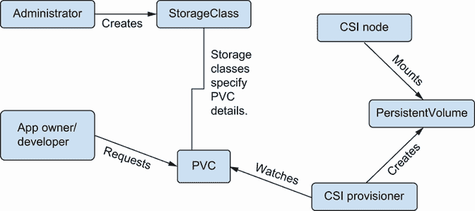

# 8 存储实现和建模

本章涵盖了

+   探索动态存储的工作原理

+   在工作负载中利用 emptyDir 卷

+   使用 CSI 提供商管理存储

+   使用 hostPath 值与 CNI 和 CSI

+   为 Cassandra 实现 storageClassTemplates

在 Kubernetes 集群中建模存储是管理员在生产之前需要完成的最重要任务之一。这包括对你生产应用程序的存储需求提出问题，并且有几个维度。你将希望一般性地对任何需要持久存储的应用程序提出以下问题：

+   存储是否需要持久性或只是尽力而为？持久性存储通常意味着 NAS、NFS 或类似 GlusterFS 的东西。所有这些都有你需要验证的性能权衡。

+   存储是否需要快速？I/O 是否是瓶颈？如果速度很重要，内存中运行的 emptyDir 或适合这种用途的存储控制器特殊存储类通常是一个不错的选择。

+   每个容器使用多少存储，你预计要运行多少个容器？可能需要一个存储控制器来处理大量容器。

+   你是否需要一个专门的磁盘用于安全？如果是这样，本地卷可能可能满足你的需求。

+   你是否在运行带有模型或训练缓存的 AI 工作负载？这些可能需要快速回收的卷，每次持续几小时。

+   存储是否在 1-10 GB 的范围内？如果是这样，在大多数情况下，本地存储或 emptyDir 可能适用。

+   你是否在实施类似于 Hadoop 分布式文件系统（HDFS）或 Cassandra 这样的系统，这些系统为你复制和备份数据？如果是这样，你可以专门使用本地磁盘卷，但这种方式恢复起来比较复杂。

+   你是否可以接受停机时间和冷存储？如果是这样，可能需要在廉价的分布式卷之上构建一个对象存储模型。像 NFS 或 GlusterFS 这样的技术在这里是一个很好的用例。

## 8.1 Kubernetes 更广泛生态系统的缩影：动态存储

一旦你对应用程序的存储需求有了感觉，你可以查看 Kubernetes 提供的原语。在存储工作流程中有许多不同动机的角色。这是因为存储，与网络不同，由于物理约束（需要在机器重启之间持久化）以及企业存储的各个方面（法律和程序方面）的极端有限和昂贵，因此是一个极其有限和昂贵的资源。为了在我们脑海中清晰地保持这些角色的顺序，让我们快速看一下图 8.1 中整体存储故事的 1000 英尺表示。



图 8.1 存储的高级表示

在图 8.1 中，你会注意到用户*请求*存储，管理员通过存储类*定义*存储，而 CSI 提供者通常负责为用户*提供*存储以便写入。如果我们回顾一下我们关于网络的那一章，这种多租户的存储提供视图可以被视为类似于正在出现的第 7 层负载均衡的 Gateway API：

+   GatewayClasses 在某种程度上类似于 CSI 的 StorageClasses，因为它们定义了网络的一个入口点类型。

+   网关在某种程度上类似于 CSI 的 PersistentVolumes（PVs），因为它们代表已配置的第 7 层负载均衡器。

+   路由在某种程度上类似于 CSI 的 PersistentVolumeClaims（PVCs），因为它们允许单个开发者请求特定应用程序的 GatewayClass 实例。

因此，当我们深入研究存储时，记住 Kubernetes 本身随着时间的推移，越来越多地致力于围绕基础设施资源构建供应商中立的 API，以便开发人员和管理员可以异步和独立地进行管理，这很有帮助。话虽如此，让我们跳入查看动态存储以及它在各种常见用例中对开发者的意义。

### 8.1.1 动态管理存储：动态提供

在集群中动态管理存储的能力意味着我们需要能够动态提供卷。这被称为*动态提供*。在最通用意义上，动态提供是许多集群解决方案（例如，Mesos 已经有一段时间提供 PersistentVolume 了，它为进程保留了持久、可回收的本地存储）的一个特性。任何使用过 VSan 等产品的都知道，EBS 云提供商必须提供某种 API 驱动的存储模型。

Kubernetes 中的动态提供具有高度可插拔性（PVCs、CSI）和声明性（PVCs 与动态提供）的特点，这使得你可以为不同类型的存储解决方案构建自己的语义，并在 PVC 和相应的 PersistentVolume 之间提供间接性。

### 8.1.2 本地存储与 emptyDir 的比较

对于大多数 Kubernetes 新手来说，*emptyDir*卷是众所周知的。这是将目录挂载到 Pod 中的最简单方法，基本上没有需要密切监控的安全或资源成本。然而，在其使用方面存在许多细微之处，当将应用程序部署到生产环境中时，这些细微之处可以证明是强大的安全和性能提升器。

在表 8.1 中，我们比较了本地和空卷类型。当涉及到本地和 emptyDir 时，尽管所有数据都是本地的，但我们有一个完全不同的存储生命周期。例如，本地卷可以可靠地用于在灾难发生时从运行中的数据库恢复数据，而 emptyDir 则不支持这种用例。对于 PVC，使用第三方卷和卷控制器是第三个用例，通常意味着如果 Pod 需要迁移，存储可以便携并在新节点上挂载。

表 8.1 比较本地、emptyDir 和 PVC 存储

| 存储类型 1 | 生命周期 | 可靠性 | 实现 | 典型消费者 |
| --- | --- | --- | --- | --- |
| Local | 本地磁盘的生命周期 | 是 | 节点上的本地磁盘 | 一个重量级的数据密集型或遗留应用 |
| emptyDir | 只要你的 Pod 在同一节点上 | 否 | 节点上的本地文件夹 | 任何 Pod |
| PVC | 永久¹ | 是 | 第三方存储供应商 | 一个轻量级数据库应用 |

通常，我们为了需要持久性的应用程序而消耗 PVC。在具有复杂持久存储需求的情况下，我们可能会实现一个本地存储卷（例如，需要在同一位置运行并需要连接到大型磁盘以用于遗留目的的应用程序）。emptyDir 卷没有特定的用例，它被用作 Pod 中的瑞士军刀，用于各种目的。`emptyDir`类型通常用于两个容器需要一个临时存储区来写入数据时。你可能会想知道为什么有人会使用`emptyDir`类型而不是直接将真实的持久卷挂载到两个容器上。有几个原因：

+   *持久卷通常很昂贵。它们需要一个分布式存储控制器来配置具有特定存储量的卷，而这种存储可能是有限的。如果你不需要保留 Pod 中的数据，那么浪费存储资源就没有价值。*

+   *持久卷可能比 emptyDir 卷慢一个数量级或更多。这是因为它们通常需要网络流量和写入某种类型的磁盘。然而，emptyDir 卷可以写入临时文件存储（tmpfs）或甚至纯内存映射卷，这些卷按定义与 RAM 一样快。*

+   *持久卷（PersistentVolumes）在本质上比 emptyDir 卷更不安全。持久卷中的数据可能会在集群的不同位置被保留并重新读取。相比之下，emptyDir 卷不能被 Kubernetes 挂载到声明它们的 Pod 之外的内容。*

+   *emptyDir 可以与临时容器一起使用来创建目录。这包括当应用程序想要在其生命周期内将日志文件或配置文件写入特定位置时，如/var/log 和/etc。*

+   *你需要出于性能或功能原因将/tmp 或/var/log 目录添加到容器中。*

emptyDir 卷可以用作性能优化或作为修改容器目录结构的一种方式。在功能上，当容器缺少默认文件系统路径，只包含单个二进制可执行文件时，它可能需要一个 emptyDir 卷。有时容器是用 scratch 镜像构建的，以减少其安全足迹，但这会付出没有地方缓存或存储简单文件（如日志或缓存数据）的代价。

即使您在容器镜像中已有可用的/var/log 目录，您仍然可能希望使用 emptyDir 作为写入磁盘的性能优化。这是常见的，因为将文件写入预定义目录（例如，/var/log）的容器可能会因为写时复制的文件系统操作缓慢而受到影响。容器层通常具有这样的文件系统，允许进程将数据写入文件系统的顶层，而不会实际影响底层的容器镜像。这允许您在运行的容器中几乎做任何事情而不会损坏底层的 Docker 镜像，但这会带来性能成本。与其他原生文件系统操作相比，写时复制文件系统通常较慢（并且可能 CPU 密集）。这取决于您为容器运行时运行的存储驱动程序。

如您所见，在空目录卷在生产中的使用方面相当复杂。但总的来说，如果您对 Kubernetes 存储感兴趣，您可能将花费更多的时间来解决与持久卷相关的问题，而不是与临时卷相关的问题。

### 8.1.3 持久卷

*持久卷*是 Kubernetes 对可以挂载到 Pod 的存储卷的引用。存储是通过 kubelet 挂载的，它会调用、创建和挂载各种类型的卷和/或潜在的 CSI 驱动程序（我们将在下一节讨论）。因此，持久卷声明（PVC）是对持久卷的命名引用。如果卷的类型是`RWO`（代表一次读写），则此声明会锁定卷，这样其他 Pod 在卷不再挂载之前可能无法再次使用它。当你创建一个需要持久存储的 Pod 时，以下事件链通常会发生：

1.  您请求创建一个需要 PVC 的 Pod。

1.  Kubernetes 调度器开始寻找 Pod 的归宿，等待具有适当存储拓扑、CPU 和内存属性节点的到来。

1.  您创建一个有效的 PVC，以便 Pod 可以访问。

1.  Kubernetes 控制平面会满足卷声明。

    这涉及到通过动态存储控制器创建一个持久卷。大多数生产级 Kubernetes 安装至少包含一个这样的控制器（或者很多，这些控制器通过 StorageClass 名称区分），这通常是一个供应商附加组件。这些控制器只是监视 API 服务器中标准 PVC 对象的创建，然后创建一个卷，这些声明将使用该卷进行存储。

1.  现在，由于其存储声明已得到满足，调度器将继续决定你的 Pod 现在可以启动了。

1.  依赖于此声明的 Pod 可以被调度，并且 Pod 将被启动。

1.  在 Pod 启动过程中，kubelet 会挂载与该声明对应的本地目录。

1.  本地挂载的卷对 Pod 可写。

1.  你请求的 Pod 现在正在运行，并正在读取或写入持久卷内部的存储。

Kubernetes 调度器和将卷附加到 Pod

Kubernetes 调度器与将卷附加到 Pod 的逻辑紧密交织在一起。调度器定义了几个扩展点，我们可以根据不同的 Pod 需求（如存储）实现逻辑。这些扩展点是 PreFilter、Filter、PostFilter、Reserve、PreScore、PreBind、Bind、PostBind、Permit 和 QueueSort。PreFilter 扩展点是调度器实现存储逻辑的地方之一。

智能地决定 Pod 是否准备好启动的能力部分取决于调度器所了解的存储参数。例如，调度器会主动避免调度依赖于卷的 Pod，在现有 Pod 已经可以访问此类卷的情况下，这仅允许一个并发读取者。这防止了 Pod 启动错误，其中卷从未绑定，但你无法找出原因。

你可能会想知道为什么调度器需要访问有关存储的信息。（毕竟，正如你可能想象的那样，将存储附加到 Pod 实际上是 kubelet 的职责。）原因是性能和可预测性。由于各种原因，你可能想限制节点上卷的数量。此外，如果特定节点在存储方面有特定的约束，调度器可能会主动避免在这些节点上放置 Pod，以避免创建“僵尸”Pod，尽管已经调度，但由于无法访问存储资源，这些 Pod 从未正确启动。

多亏了 Kubernetes API 在支持存储容量逻辑方面的最新进展，CSI API 包括描述存储约束的能力，并且这种方式可以被查询并由调度器使用，以便将 Pod 放置在最适合其存储需求的节点上。要了解更多信息，您可以查阅[`mng.bz/M2pE`](http://mng.bz/M2pE)。

### 8.1.4 CSI（容器存储接口）

你可能想知道 kubelet 是如何能够挂载任意存储类型的。例如，像 NFS 这样的文件系统需要在典型的 Linux 发行版上安装 NFS 客户端。确实，存储挂载非常依赖于平台，而 kubelet 并不能神奇地为你解决这个问题。

直到 Kubernetes 1.12 版本，像 NFS、GlusterFS、Ceph 以及许多其他常见的文件系统类型都包含在 kubelet 本身中。然而，CSI 改变了这一点，现在 kubelet 越来越不了解特定平台的文件系统。相反，对挂载特定类型存储感兴趣的用户通常会在他们的集群上运行一个作为 DaemonSet 的 CSI 驱动程序。这些驱动程序通过套接字与 kubelet 通信，并执行必要的低级文件系统挂载操作。向 CSI 的迁移使得供应商能够轻松地演进存储客户端并频繁发布这些客户端的更新，而无需将他们的供应商特定逻辑放入特定的 Kubernetes 版本中。

CNCF 中常见的模式是首先发布一个包含许多依赖项的开源项目，然后随着时间的推移逐渐将这些依赖项分离出来。这有助于为早期采用者创建一个简单的用户体验。然而，一旦某项技术的采用变得普遍，就会在事后进行工作，以解耦这些依赖项，从而清理架构。CNI、CSI 和 CRI 接口都是这种模式的例子。

CSI 是容器存储接口，它已经发展到一个程度，使得持久卷代码不再需要编译到你的 Kubernetes 版本中。CSI 存储模型意味着你只需要实现几个 Kubernetes 概念（一个 DaemonSet 和一个存储控制器），这样 kubelet 就可以分配任何你想要的存储类型。CSI 不是 Kubernetes 特定的。公平地说，Mesos 也支持 CSI，以及 Kubernetes 本身，所以我们并不是在针对任何人。

## 8.2 动态分配从 CSI 中受益，但两者是正交的

*动态分配*，即在创建 PVC 时神奇地创建持久卷的能力，与*CSI*不同，CSI 赋予你将任何类型的存储动态挂载到容器中的能力。然而，这两种技术却是相当协同的。通过结合它们，你可以允许开发人员继续使用相同的声明（通过稍后描述的 StorageClasses）来挂载可能不同类型的存储，这些存储暴露了相同的高级语义。例如，一个`fast`存储类最初可能使用通过 NAS 暴露的固态硬盘来实现：

```
kind: StorageClass
apiVersion: storage.k8s.io/v1
metadata:
  name: fast
parameters:
  type: pd-ssd
```

之后，你可能会支付一家公司（如 Datera）在另一个存储阵列上提供快速存储。在两种情况下，使用动态分配器，你的开发人员可以继续使用完全相同的 API 请求来为新的存储卷分配，只需在集群上运行 CSI 驱动程序，并且存储控制器在幕后发生变化。

在任何情况下，大多数云提供商都通过简单的云附加磁盘类型作为默认值实现了 Kubernetes 的动态提供。在许多小型应用程序中，云提供商自动选择的缓慢的 PersistentVolume 已经足够。然而，对于异构工作负载，能够在不同的存储模型之间进行选择，并在 PVC 满足方面实施策略（或者，更好的是，操作员）变得越来越重要。

### 8.2.1 存储类

*存储类* 允许以声明的方式指定复杂的存储语义。尽管可以向不同类型的存储类发送多个参数，但它们共有的一个参数是 *绑定模式*。这正是构建自定义、动态提供者可能极为重要的地方。

动态提供不仅仅是提供简单存储的一种方式，而且还是一种强大的工具，可以在具有异构存储需求的数据中心中启用高性能工作负载。在生产中，你关心的每一个不同工作负载都可能从不同的存储类中受益，这些存储类针对绑定模式、保留和性能（我们将在稍后解释）。

一个数据中心假设的存储类提供者

存储类似乎主要是理论上的，直到我们考虑一个 Kubernetes 管理员抵御数十名渴望将应用程序部署到生产环境且对存储工作原理知之甚少的开发者的用例。考虑一下这样一个场景，其中你有三种类型的应用程序：批量数据处理、事务型 Web 风格应用程序和 AI 应用程序。在这个场景中，一个人可能会创建一个具有三个存储类的单个卷提供者。应用程序可以像这样声明性地请求特定的存储类型：

```
apiVersion: v1
kind: PersistentVolumeClaim
metadata:
  name: my-big-data-app-vol
spec:
  storageClassName: bigdata
  accessModes:
    - ReadWriteOnce
  resources:
    requests:
      storage: 100G
```

这个 PVC 将像这样存在于 Pod 中：

```
apiVersion: v1
kind: Pod
metadata:
  name: my-big-data-app
spec:
  volumes:
    - name: myvol
      persistentVolumeClaim:
        claimName: my-big-data-app-vol
  containers:
    - name: my-big-data-app
      image: datacruncher:0.1
      volumeMounts:
        - mountPath: "/mybigdata-app-volume"
          name: myvol
```

关于 PVC 的工作原理的快速提醒

Kubernetes 会查看 PVC 的元数据（例如，它请求多少存储）然后找到匹配你声明的 PV 对象。因此，你不需要明确地将存储分配给一个声明。相反，你创建一个请求某些属性（例如，100 G 的存储）的声明，并异步创建一个满足这些属性的卷。

### 8.2.2 回到数据中心相关内容

在我们构想的动态提供者中会发生什么？让我们看看：

1.  我们编写一个控制循环来监视卷声明。

1.  当我们看到一个请求时，我们通过 API 调用（例如，调用我们 NAS 上的存储提供者）在 100 G 大小的持久旋转磁盘上召唤一个卷。请注意，另一种实现方式是在 NAS 或 NFS 共享中预先创建许多存储目录。

1.  然后，我们定义一个 Kubernetes PV 对象来支持 PVC。这种卷类型可以是任何东西，例如 NFS 或 `hostPath` PV 类型。

从这里开始，Kubernetes 负责工作，一旦 PVC 用后端持久卷填充，我们的 Pod 就可以调度。在这种情况下，我们提到了三个步骤：控制循环、卷请求以及创建该卷。我们关于创建哪种低级存储卷的决定取决于我们的开发人员请求哪种类型的存储。在前一个代码片段中，我们使用了`bigdata`作为 StorageClass 类型。在数据中心，我们通常支持三种存储类：

+   `bigdata`（如前所述）

+   `postgres`

+   `ai`

为什么有三个类别？没有具体原因需要三个存储类实现。我们可能很容易就有四个或更多的类别。

对于大数据/HDFS/ETL 风格的工作负载，以及存储密集型工作，数据本地性很重要。因此，在这种情况下，你可能希望将数据存储在裸金属磁盘上，并从该磁盘读取，就像它是主机卷挂载一样。这种类型的绑定模式可能从 WaitForFirstConsumer 策略中受益，允许在运行工作负载的节点上直接创建和附加卷，而不是事先创建，可能是在数据本地性较低的地方。

由于 Hadoop 数据节点是集群的持久特性，而 HDFS 本身为你维护复制，因此这种模型的保留策略可能是删除。对于冷存储工作负载（例如，在 GlusterFS 中），你将想要自动化一个策略，为特定命名空间中运行的工作负载实现存储卷的特定转换器。无论如何，所有配置都可能是在当时可用的最便宜的磁盘上按需完成的。

对于 Postgres/RDBMS 风格的工作负载，你需要专用的大容量固态硬盘，可能达到数个 TB。一旦请求存储，你将想要知道你的 Pod 运行在哪里，以便你可以在同一机架或同一节点上预留一个 SSD。由于磁盘本地性和调度可以显著影响这些工作负载的性能，你的 Postgres 存储类可能使用 WaitForFirstConsumer 策略。由于生产中的 Postgres 数据库通常具有重要的交易历史，你可能选择保留策略。

最后，对于 AI 工作负载，你的数据科学家可能不关心存储；他们只想处理数字，可能需要一个临时存储。你希望在开发人员和提供的存储类型之间设置间接层，这样你就可以在集群中不断更改 StorageClass 和卷类型，而不会影响像 YAML API 定义、Helm 图表或应用程序代码这样的东西。类似于冷存储场景，由于 AI 工作负载在将数据输出之前会将其大量吸入内存一段时间，数据本地性并不总是很重要。可以立即绑定以加快 Pod 启动，同样，删除策略可能也是合适的。

由于这些过程的复杂性，您可能需要为满足卷声明提供自定义逻辑。您可以简单地分别将这些卷类型命名为`hdfs`、`coldstore`、`pg-perf`和`ai-slow`。

## 8.3 Kubernetes 存储用例

我们现在已经探讨了为存储建模您的最终用户用例的重要性。现在，让我们看看一些其他主题，这将让您对 Kubernetes 通常如何使用存储卷为 Secret 和网络功能进行基本管理有一个更广泛的感觉。

### 8.3.1 Secrets：临时共享文件

将文件作为共享方式来分发容器或虚拟机的凭证的设计模式相当常见。例如，cloud-init 语言，它用于在 AWS、Azure 和 vSphere 等云环境中引导虚拟机，有一个`write_files`指令，在 Kubernetes 环境之外也经常使用，如下所示：

```
# This is taken from https://cloudinit.readthedocs.io/en/latest/topics
# /examples.html#writing-out-arbitrary-files
write_files:
- encoding: b64
  content: CiMgVGhpcyBmaWxlIGNvbnRyb2xzIHRoZSBzdGF0ZSBvZiBTRUxpbnV4...
  owner: root:root
  path: /etc/sysconfig/selinux
  permissions: '0644'
- content: |
    # My new /etc/sysconfig/samba file
    SMBDOPTIONS="-D"
  path: /etc/sysconfig/samba
```

与系统管理员使用`cloud-init`等工具引导虚拟机的方式相同，Kubernetes 使用 API 服务器和 kubelet 以几乎相同的设计模式将 Secret 或文件引导到 Pod 中。如果您管理过需要访问任何类型数据库的云环境，您可能已经以三种方式中的某一种解决了这个问题：

+   *将凭证作为环境变量注入*—这要求您对进程运行的上下文有一定的控制权。

+   *将凭证作为文件注入*—这意味着可以使用不同的选项或参数上下文重新启动进程，而无需更新其密码环境变量。

+   *使用 Secret API 对象*—这是一个 Kubernetes 结构，用于执行与我们在 ConfigMaps 中执行的基本相同类型的操作，但有一些小的注意事项将它们与 ConfigMaps 区分开来：

    +   我们可以使用不同类型的算法来加密和解密 Secret，但不能加密 ConfigMaps。

    +   我们可以使用 API 服务器在 etcd 中加密 Secret，但不能加密 ConfigMaps，这使得 Secret 更容易阅读或调试，但安全性较低。

    +   默认情况下，Secret 中的任何数据都是 Base64 编码的，而不是以纯文本形式存储。这是由于在 Secret 中存储证书或其他复杂数据类型的常见用例（以及显然的好处，即 Base64 编码的字符串难以阅读）。

随着时间的推移，预计供应商将提供针对 Kubernetes 中 Secret API 类型的复杂 Secret 轮换 API。尽管如此，在撰写本文时，Secret 和 ConfigMaps 在 Kubernetes 中如何使用它们方面在很大程度上是相同的。

Secret 看起来像什么？

Kubernetes 中的 Secret 看起来像这样：

```
apiVersion: v1
kind: Secret
metadata:
  name: mysecret
type: Opaque
data:
  val1: YXNkZgo=
  val2: YXNkZjIK
stringData:
  val1: asdf
```

在这个 Secret 中，我们有多个值：`val1` 和 `val2`。`StringData` 字段实际上以纯文本字符串的形式存储 `val`，易于阅读。一个常见的误解是 Kubernetes 中的 Secret 数据是通过 Base64 编码来加密的。这并不是事实，因为 Base64 编码根本不提供任何安全性！相反，Kubernetes 中 Secrets 的安全性取决于管理员如何定期审计和轮换 Secrets。无论如何，Kubernetes 中的 Secrets 是安全的，因为它们只被提供给 kubelet，以便将其挂载到有权通过 RBAC 读取它们的 Pods 中。`val1` 值可能稍后以如下方式挂载到一个 Pod 中：

```
apiVersion: v1
kind: Pod
metadata:
  name: mypod
spec:
  containers:
  - name: mypod
    image: my-webapp
    volumeMounts:
    - name: myval
      mountPath: "/etc/myval"
      readOnly: true
  volumes:
  - name: myval
    secret:
      secretName: val1
```

因此，当这个 Pod 运行时，`asdf` 的值将是 `/etc/myval` 文件的内容。这可以通过 kubelet 的智能按需创建一个专门为需要访问此 Secret 的容器而设计的特殊临时 tmpfs 卷来实现。当 Kubernetes API 中的 Secret 值发生变化时，kubelet 也可以处理更新此文件，因为它实际上只是一个存在于主机上的文件，通过文件系统命名空间的神奇之处进行共享。

创建一个简单的 Pod，其中包含 emptyDir 卷以实现快速写入访问。

一个典型的 emptyDir Pod 示例可能是一个需要将临时文件写入 `/var/tmp` 的应用程序。临时存储通常以如下方式挂载到 Pod 中：

+   一个包含一个或多个文件的卷，这在具有配置数据（例如，用于应用程序的各种旋钮和开关）的 ConfigMap 中很常见。

+   环境变量，这在 Secrets 中很常见。

如果你有一个使用文件作为不同容器之间锁或信号量的应用程序，或者你需要将一些临时配置注入到应用程序中（例如，通过 ConfigMap），由 kubelet 管理的本地存储卷就足够了。Secret 可以在底层使用 emptyDir 卷来挂载密码（例如，作为文件挂载到容器中）。同样，emptyDir 卷可以被两个 Pod 共享，这样你就可以在两个容器之间构建一个简单的工作或信号队列。

emptyDir 是实现起来最简单的存储类型。它不需要实际的卷实现，并且保证在任何集群上都能工作。为了具体说明，在一个 Redis 数据库中，由于长期持久性并不重要，你可能会将临时存储作为卷挂载，如下所示：

```
apiVersion: v1
kind: Pod
metadata:
  name: redis
spec:
  containers:
  - name: redis
    image: redis
    volumeMounts:
    - name: redis-storage
      mountPath: /data/redis
  volumes:
  - name: redis-storage
    emptyDir: {}
```

为什么还要考虑 emptyDir？因为我们之前提到过，emptyDir 的性能可能比容器化目录快得多。记住，你的容器运行时写入文件的方式是通过写时复制的文件系统，这与磁盘上常规文件的写入路径不同。因此，对于在生产容器中需要高性能的文件夹，你可能会故意选择 emptyDir 或 hostPath 卷挂载。在某些容器运行时中，将写入主机文件系统与容器文件系统进行比较时，速度可以快十倍，这种情况并不少见。

## 8.4 动态存储提供者通常看起来像什么？

与 emptyDir 卷不同，存储提供者通常由供应商在 Kubernetes 之外实现。实现存储解决方案最终涉及实现 CSI 规范的供应步骤。例如，我们可以创建一个 NAS 存储提供者，它遍历一系列预定义的文件夹。在以下内容中，我们只支持六个卷，以便使代码易于阅读和具体。然而，在现实世界中，你可能需要一个更复杂的底层存储目录管理方式来处理卷供应者。例如：

```
var storageFolder1 = "/opt/NAS/1"                     ❶
var storageFolder2 = "/opt/NAS/2"
var storageFolder3 = "/opt/NAS/3"
var storageFolder4 = "/opt/NAS/4"
var storageFolder5 = "/opt/NAS/5"
var storageFolder6 = "/opt/NAS/6"
var storageFoldersUsed = 0

// Provision creates a storage asset, returning a PV object to represent it.
func (p *hostPathProvisioner) Provision
    (options controller.VolumeOptions) (*v1.PersistentVolume, error) {
    glog.Infof("Provisioning volume %v", options)
    path := path.Join(p.pvDir, options.PVName)

    // Implement our artificial constraint in the simplest way possible...
    if storageFoldersUsed == 0 {
        panic("Cant store anything else !")
    }
    if err := os.MkdirAll(path, 0777); err != nil {
        return nil, err
    }

    // Explicitly chmod created dir so we know that
    // mode is set to 0777 regardless of umask
    if err := os.Chmod(path, 0777); err != nil {
        return nil, err
    }

    // Example of how you might call to your NAS
    folders := []string{
            storageFolder1, storageFolder2, storageFolder3,
            storageFolder4, storageFolder5, storageFolder6
    }                                                 ❷

    // Now let's make the folder ...
    mycompany.ProvisionNewNasResourceToLocalFolder
                (folders[storageFoldersUsed++]);

    // This is taken straight from the minikubes controller, mostly...
    pv := &v1.PersistentVolume{
        ObjectMeta: metav1.ObjectMeta{
            Name: options.PVName,
            Annotations: map[string]string{
                // Change this
                "myCompanyStoragePathIdentity": string(p.identity),
            },
        },
        Spec: v1.PersistentVolumeSpec{                ❸
            PersistentVolumeReclaimPolicy:
              options.PersistentVolumeReclaimPolicy,
            AccessModes:         options.PVC.Spec.AccessModes,
            Capacity: v1.ResourceList{
                v1.ResourceName(v1.ResourceStorage):
                                 options.PVC.Spec.Resources.Requests[
                                     v1.ResourceName(v1.ResourceStorage...
            },
            PersistentVolumeSource: v1.PersistentVolumeSource{
                HostPath: &v1.HostPathVolumeSource{
                                                      ❹
                    Path: storageFolder,
                },
            },
        },
    }
    return pv, nil
}
```

❶ 支持六种不同的挂载方式

❷ 通过将这些挂载存储在数组中来轮询这些挂载

❸ 创建 PV YAML，类似于我们在其他地方所做的那样

❹ 在底层使用 hostPath，但我们将它挂载到我们的 NAS 目录中

为了澄清，这段代码只是一个假设示例，说明如何通过借鉴 `minikube` 中的 hostPath 提供者逻辑来编写自定义提供者。`minikube` 中存储控制器剩余的代码可以在 [`mng.bz/wn5P`](http://mng.bz/wn5P) 找到。如果你对 PersistentVolumeClaims 或 StorageClasses 以及它们的工作方式感兴趣，你绝对应该阅读它，或者更好的是，自己尝试编译它！

## 8.5 用于系统控制和/或数据访问的 hostPath

Kubernetes 的 hostPath 卷类似于 Docker 卷，因为它们允许在 Pod 中运行的容器直接写入主机。这是一个强大的功能，但经常被微服务新手滥用，所以使用时要小心。`hostPath` 卷类型具有广泛的应用场景。这些通常分为两大类：

+   *实用功能*—由只能通过访问主机文件资源实现的容器提供（我们将通过一个示例来展示这一点）。

+   *将主机用作持久文件存储*—以这种方式，当 Pod 消失时，其数据会持久保存在一个可预测的位置。请注意，这几乎总是反模式，因为这意味着当 Pod 死亡并被重新调度到新节点时，应用程序的行为会有所不同。

### 8.5.1 hostPaths、CSI 和 CNI：一个典型用例

CNI 和 CSI，它们是 Kubernetes 网络和存储的骨干，都严重依赖于 hostPath 的使用。kubelet 本身在每个节点上运行并挂载和卸载存储卷，通过使用 CSI 驱动程序和主机上共享的 UNIX 域套接字进行这些调用，你猜对了，使用 hostPath 卷。还有一个第二个 UNIX 域套接字，节点驱动程序注册器使用它将 CSI 驱动程序注册到 kubelet。

如前所述，许多涉及应用程序的 hostPath 用例是*反模式*。然而，hostPath 的一个常见且关键用例是实现 CNI 插件。让我们接下来看看这一点。

一个 CNI hostPath 示例

作为 CNI 提供者对 hostPath 功能高度依赖的一个例子，让我们看看运行中的 Calico 节点中的卷挂载。Calico Pod 负责许多系统级操作，如操纵 XDP 规则、iptables 规则等。此外，这些 Pod 还需要确保 Linux 内核之间的 BGP 表正确同步。因此，正如你所看到的，有许多 hostPath 卷声明来访问各种主机目录。例如：

```
volumes:
  - hostPath:
      path: /run/xtables.lock
      type: FileOrCreate
    name: xtables-lock
  - hostPath:
      path: /opt/cni/bin
      type: ""
...
```

在 Linux 上，CNI 提供者通过在容器内部直接将它们自己的二进制文件写入节点本身，通常在/opt/cni/bin 目录下，来将自己安装到 kubelet 上。这是 hostPaths 最流行的用例之一——使用 Linux 容器在 Linux 节点上执行管理操作。许多具有管理性质的应用程序都使用此功能，包括

+   Prometheus，一个指标和监控解决方案，用于挂载/proc 和其他系统资源以检查资源使用情况

+   Logstash，一个日志集成解决方案，用于将各种日志目录挂载到容器中

+   如前所述，将二进制文件自安装到/opt/cni/bin 的 CNI 提供者

+   使用 hostPaths 挂载存储供应商特定工具的 CSI 提供者

Calico CNI 提供者是众多此类低级 Kubernetes 系统进程的例子之一，如果没有能够直接从主机挂载设备或目录到容器，这些进程将无法实现。实际上，其他 CNIs（如 Antrea 或 Flannel）以及 CSI 存储驱动程序也要求此功能以引导和管理工作站。

起初，这种自我安装可能有些反直觉，所以你可能想要花点时间思考一下。蒂莫西·圣克莱尔（Timothy St. Claire），Kubernetes 的早期维护者和贡献者，将这种行为称为“摸自己的肚脐眼”。然而，这正是 Kubernetes 设计在 Linux 上工作的核心。我们之所以说在 Linux 上，是因为在其他操作系统（如 Windows）中，这种级别的容器权限尚不可行。随着 Kubernetes 1.22 中 Windows HostProcess 容器的出现，我们可能开始看到这种范式在非 Linux 环境中扎根。因此，hostPath 卷不仅仅是用于启用容器化工作负载的功能，实际上，它是一个允许容器管理 Linux 服务器复杂方面的功能，而不仅仅是针对以开发者为中心的容器化应用程序。

你应该在什么时候使用 hostPath 卷？

在您的存储之旅中，请记住，您可以使用 hostPath 做各种事情，尽管它被认为是一种反模式，但它可以轻松地让您摆脱困境。hostPath 可以让您做诸如快速轻松的备份、满足合规性政策（节点被授权存储，但分布式卷不被授权）以及提供高性能存储而不依赖于深度云原生集成等事情。一般来说，在考虑如何为特定的后端实现存储时，请考虑以下因素：

+   是否存在本地的 Kubernetes 卷提供者？如果有的话，这可能是最简单的方法，并且需要您端的最少自动化。

+   如果没有，您的卷供应商是否提供 CSI 实现？如果是，您可以运行它，并且很可能会附带动态提供者。

如果这两种选择都不适用，您可以使用 hostPath 或 Flex 卷等工具将任何类型的存储配置为卷，以便在特定情况下将其绑定到任何 Pod。如果只有您的集群中某些主机可以访问此存储提供者，您可能需要向 Pod 添加调度信息，这也是为什么前述选择通常是理想的原因。

### 8.5.2 Cassandra：现实世界 Kubernetes 应用存储的示例

在 Kubernetes 上运行的持久化应用程序需要动态扩展，尽管仍然存在一些可预测的方式来访问带有关键数据卷的命名卷。让我们详细看看一个复杂的存储用例——Cassandra。

Cassandra Pods 通常由 StatefulSet 管理。StatefulSet 的概念是 Pod 在同一节点上持续重建。在这种情况下，我们不仅仅有一个卷定义，还有一个 VolumeClaimTemplate。这个模板为每个卷命名不同。

VolumeClaimTemplates 是 Kubernetes API 中的一种结构，它告诉 Kubernetes 如何为 StatefulSet 声明 PersistentVolumes。这样，它们可以根据 StatefulSet 的大小即时创建，由第一次安装此 StatefulSet 或正在扩展它的操作员完成。在这个代码片段中

```
volumeClaimTemplates:
  - metadata:
      name: cassandra-data
```

例如，Pod cassandra-1 将会有一个 volumeClaimTemplate cassandra-data-1\. 该声明位于同一节点上，并且 StatefulSet 会不断重新调度到同一节点。

确保不要将 StatefulSet 与 DaemonSet 混淆。后者保证相同的 Pod 在集群的 *所有* 节点上运行。前者保证 Pod 将在相同的节点上重启，但并不暗示运行这些 Pod 的数量或它们将运行的位置。为了使这种区分更加清晰，DaemonSets 通常用于安全工具、网络或存储提供商等容器化应用。现在，让我们快速看一下 Cassandra 的 StatefulSet 及其 volumeClaimTemplate 的样子：

```
apiVersion: apps/v1
kind: StatefulSet
metadata:
  name: cassandra
  labels:
    app: cassandra
spec:
  serviceName: cassandra
  replicas: 1
  selector:
    matchLabels:
    ...
        volumeMounts:
        - name: cassandra-data
          mountPath: /cassandra_data
  # These are converted to volume claims by the controller
  # and mounted at the paths mentioned in our discussion, and don't
  # use in production until ssd GCEPersistentDisk or other ssd pd
  volumeClaimTemplates:
  - metadata:
      name: cassandra-data
    spec:
      accessModes: [ "ReadWriteOnce" ]
      storageClassName: fast
      resources:
        requests:
          storage: 1Gi
---
kind: StorageClass
apiVersion: storage.k8s.io/v1
metadata:
  name: fast
parameters:
  type: pd-ssd
```

从现在开始，每次你的 Cassandra Pod 在这个相同的节点上重启时，它都会访问同一个可预测命名的卷。因此，你可以轻松地向集群添加更多 Cassandra 副本，并保证第八个 Pod 总是在你的 Cassandra 集群中第八个节点上启动。如果没有这样的模板，每次你扩展 Cassandra 集群中 Pod 的数量时，你都必须手动创建唯一的存储 VolumeClaimTemplate 名称。请注意，如果 Pod 需要重新调度到另一个节点，并且存储可以挂载到另一个节点，Pod 的存储将移动，并且 Pod 将在那个节点上启动。

### 8.5.3 高级存储功能与 Kubernetes 存储模型

不幸的是，特定存储类型的所有原生功能永远无法在 Kubernetes 中完全表达。例如，不同类型的存储卷在底层存储选项方面可能有不同的读写语义。另一个例子是 *快照* 的概念。许多云供应商允许你备份、恢复或对磁盘进行快照。如果存储供应商支持快照并在他们的 CSI 规范中适当地实现了快照语义，那么你可以使用此功能。

截至 Kubernetes 1.17，快照和克隆（可以在 Kubernetes 中完全实现）已成为 Kubernetes API 中的新操作。例如，以下 PVC 被定义为源自数据源。这个数据源本身又是一个 VolumeSnapshot 对象，这意味着它是一个从特定时间点加载的特定卷：

```
apiVersion: v1
kind: PersistentVolumeClaim
metadata:
  name: restore-pvc
spec:
  storageClassName: csi-hostpath-sc
  dataSource:
    name: new-snapshot-test
    kind: VolumeSnapshot
    apiGroup: snapshot.storage.k8s.io
  accessModes:
    - ReadWriteOnce
  resources:
    requests:
      storage: 10Gi
```

由于我们已经讨论了 CSI 规范的重要性，你可能已经猜到，将 Kubernetes 客户端连接到特定供应商的快照逻辑是完全不必要的。相反，为了支持此功能，存储供应商只需要实现一些 CSI API 调用，例如

+   CreateSnapshot

+   DeleteSnapshot

+   ListSnapshots

一旦实现这些，Kubernetes CSI 控制器可以通用地管理快照。如果你对你的生产数据卷感兴趣，请咨询你的特定 CSI 驱动程序或 Kubernetes 集群的存储提供商。确保它们实现了 CSI API 的快照组件。

## 8.6 进一步阅读

J. Eder。“云原生交易平台之路。” [`mng.bz/p2nE`](http://mng.bz/p2nE)（访问日期：2021 年 12 月 24 日）。

Kubernetes 作者。“PV 控制器更改以支持 PV 删除保护终结者。” [`mng.bz/g46Z`](http://mng.bz/g46Z)（访问日期：2021 年 12 月 24 日）。

Kubernetes 作者。“移除本地-up 的容器运行时 docker。” [`mng.bz/enaw`](http://mng.bz/enaw)（访问日期：2021 年 12 月 24 日）。

Kubernetes 文档。“创建静态 Pod。” [`mng.bz/g4eZ`](http://mng.bz/g4eZ)（访问日期：2021 年 12 月 24 日）。

Kubernetes 文档。“持久卷。” [`mng.bz/en9w`](http://mng.bz/en9w)（访问日期：2021 年 12 月 24 日）。

“PostgreSQL 数据库恢复：EOF 之后的意外数据。” [`mng.bz/aDQx`](http://mng.bz/aDQx)（访问日期：2021 年 12 月 24 日）。

“共享存储。” [`wiki.postgresql.org/wiki/Shared_Storage`](https://wiki.postgresql.org/wiki/Shared_Storage)（访问日期：2021 年 12 月 24 日）。

Z. Zhuang 和 C. Tran。“消除由后台 IO 流量引起的大 JVM GC 停顿。” [`mng.bz/5KJ4`](http://mng.bz/5KJ4)（访问日期：2021 年 12 月 24 日）。

## 摘要

+   存储类（StorageClasses）与其他多租户概念类似，例如 Kubernetes 中的网关类（GatewayClasses）。

+   管理员使用存储类（StorageClasses）来建模存储需求，以通用的方式适应常见的开发者场景。

+   Kubernetes 本身使用 emptyDir 和 hostPath 卷来完成日常活动。

+   为了在 Pod 重启之间保持可预测的卷名，你可以使用 VolumeClaimTemplates，它为有状态集（StatefulSet）中的 Pod 创建命名卷。例如，在维护 Cassandra 集群时，这可以启用高性能或有状态的工作负载。

+   卷快照和克隆是新兴的流行存储选项，可以使用新的 CSI 实现来实现。

* * *

¹ 数据持久化依赖于持久卷（PersistentVolume）的回收策略。
