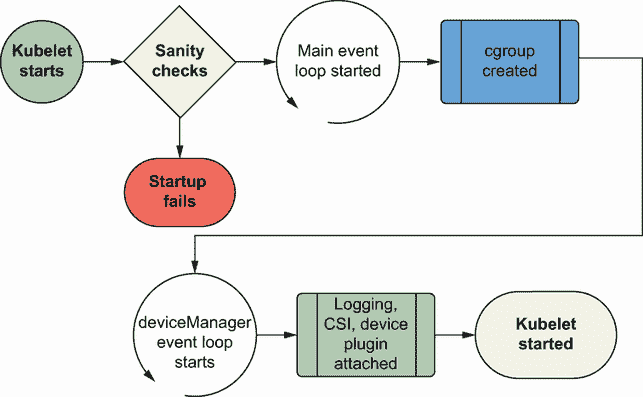
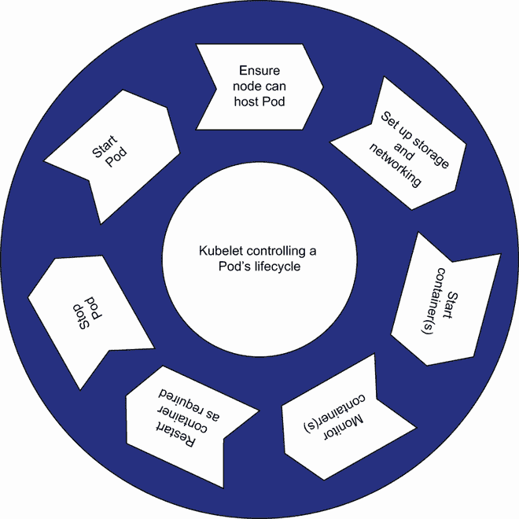
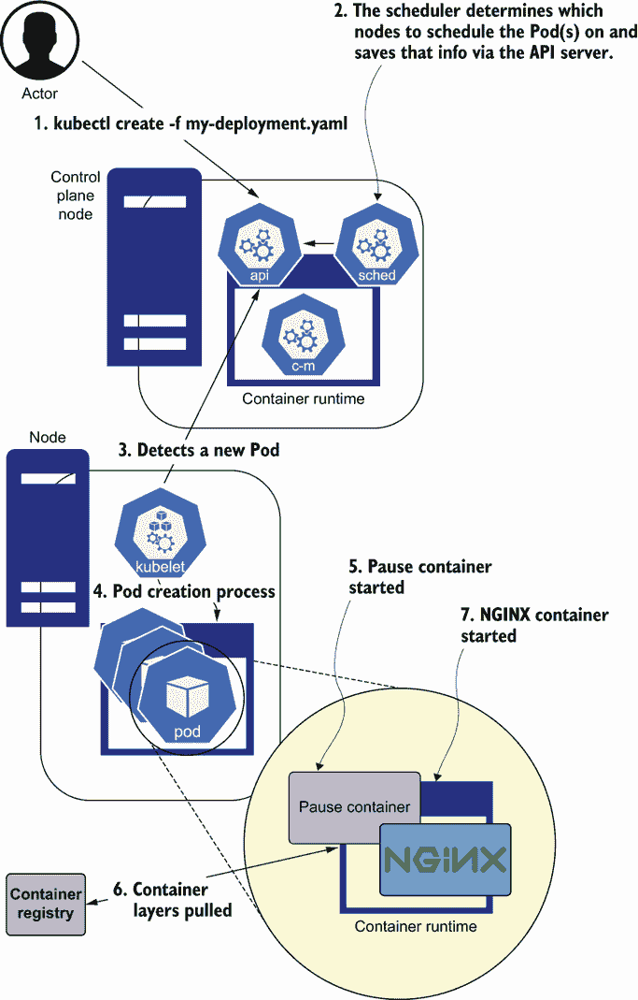

# 9 运行 Pods：kubelet 的工作原理

本章涵盖

+   学习 kubelet 的功能和配置方式

+   连接容器运行时和启动容器

+   控制 Pod 的生命周期

+   理解 CRI

+   查看 kubelet 和 CRI 内部的 Go 接口

kubelet 是 Kubernetes 集群的功臣，在生产数据中心中可能有成千上万的 kubelet，因为每个节点都运行 kubelet。在本章中，我们将深入了解 kubelet 的内部工作原理以及它如何精确地使用 CRI（容器运行时接口）来运行容器并管理工作负载的生命周期。

kubelet 的一个任务是启动和停止容器，CRI 是 kubelet 用于与容器运行时交互的接口。例如，*containerd* 被归类为容器运行时，因为它接受镜像并创建运行中的容器。*Docker 引擎* 是一个容器运行时，但现在 Kubernetes 社区已经废弃它，转而使用 containerd、runC 或其他运行时。

注意：我们想感谢陈 Dawn 允许我们对她进行关于 kubelet 的采访。陈 Dawn 是 kubelet 二进制文件的原始作者，目前是 Kubernetes 节点特别兴趣小组的负责人之一。该小组维护 kubelet 代码库。

## 9.1 kubelet 和节点

从高层次来看，kubelet 是一个由 systemd 启动的二进制文件。kubelet 在每个节点上运行，是 Pod 调度器和节点代理，但仅限于本地节点。kubelet 监控并维护其运行的节点上的信息。根据节点的变化，二进制文件通过调用 API 服务器来更新节点对象。

让我们先看看节点对象，这是通过在运行中的集群上执行 `kubectl get nodes <insert_node_name>` `-o` `yaml` 命令获得的。接下来的几个代码块是 `kubectl get nodes` 命令生成的片段。你可以通过执行 `kind create cluster` 并运行 `kubectl` 命令来跟进。例如，`kubectl get nodes -o yaml` 生成以下输出，为了简洁起见已缩短：

```
kind: Node
metadata:
  annotations:
    kubeadm.alpha.kubernetes.io/cri-socket:
      /run/containerd/containerd.sock         ❶
    node.alpha.kubernetes.io/ttl: "0"
    volumes.kubernetes.io/controller-managed-attach-detach: "true"
  labels:
    beta.kubernetes.io/arch: amd64
    kubernetes.io/hostname: kind-control-plane
    node-role.kubernetes.io/master: ""
  name: kind-control-plane
```

❶ kubelet 使用此套接字与容器运行时通信。

在此代码中，节点对象中的元数据告诉我们它的容器运行时是什么以及它运行的 Linux 架构。kubelet 与 CNI 提供者交互。正如我们在其他章节中提到的，CNI 提供者的任务是为 Pods 分配 IP 地址并创建 Pod 的网络，这允许 Kubernetes 集群内部的网络通信。节点 API 对象包括所有 Pods 的 CIDR（IP 地址范围）。重要的是，我们还指定了节点本身的内部 IP 地址，这必然与 Pod 的 CIDR 不同。下一个源代码块显示了 `kubectl get node` 命令生成的部分 YAML：

```
spec:
  podCIDR: 10.244.0.0/24
```

现在我们来看定义中的 `status` 部分。所有 Kubernetes API 对象都有 `spec` 和 `status` 字段：

+   `spec`—定义对象的规范（你希望它成为什么）

+   `status`—表示对象当前状态

`status`部分是 kubelet 为集群维护的数据，它还包括一个条件列表，这些条件是发送到 API 服务器的心跳消息。节点启动时自动获取所有附加的系统信息。此状态信息发送到 Kubernetes API 服务器，并持续更新。以下代码块显示了`kubectl get node`产生的部分 YAML，显示了`status`字段：

```
status:
  addresses:
  - address: 172.17.0.2
    type: InternalIP
  - address: kind-control-plane
    type: Hostname
```

在 YAML 文档的下方，你会找到这个节点的`allocatable`字段。如果你可以探索这些字段，你会看到有关 CPU 和内存的信息：

```
allocatable:
  ...
  capacity:
    cpu: "12"
    ephemeral-storage: 982940092Ki
    hugepages-1Gi: "0"
    hugepages-2Mi: "0"
    memory: 32575684Ki
    pods: "110"
```

节点对象中还有其他可用的字段，所以我们鼓励你在检查节点时查看 YAML 文件。你可以有 0 到 15,000 个节点（15,000 个节点被认为是集群中节点的当前极限，因为端点和其他大量元数据密集型操作在规模扩大时变得成本高昂）。节点对象中的信息对于像调度 Pods 这样的任务至关重要。

## 9.2 核心 kubelet

我们知道 kubelet 是一个安装在每个节点上的二进制文件，我们也知道它是关键的。让我们深入了解 kubelet 的世界以及它所做的工作。没有容器运行时，节点和 kubelet 就失去了作用，它们依赖容器运行时来执行容器化进程。我们将接下来查看容器运行时。

### 9.2.1 容器运行时：标准和规范

镜像，它们是 tar 包，kubelet 需要定义良好的 API 来执行运行这些 tar 包的二进制文件。这就是标准 API 发挥作用的地方。两个规范，CRI 和 OCI，定义了 kubelet 运行容器目标中的*如何*和*什么*：

+   *CRI 定义了如何实现。* 这些是用于启动、停止和管理容器和镜像的远程调用。任何容器运行时都以某种方式作为远程服务实现此接口。

+   *OCI 定义了什么。* 这是容器镜像格式的标准。当你通过 CRI 实现启动或停止容器时，你依赖于该容器的镜像格式以某种方式标准化。OCI 定义了一个包含更多 tar 包和元数据文件的 tar 包。

如果可能的话，启动一个`kind`集群，这样你就可以与我们一起遍历这些示例。kubelet 的核心依赖项 CRI 必须作为启动参数提供给 kubelet 或以其他方式配置。例如，作为 containerd 配置的示例，你可以在运行的`kind`集群中查找`/etc/containerd/config.toml`，并观察各种配置输入，包括定义了 CNI 提供者的钩子。例如：

```
# explicitly use v2 config format
version = 2

# set default runtime handler to v2, which has a per-pod shim
[plugins."io.containerd.grpc.v1.cri".containerd]
  default_runtime_name = "runc"
[plugins."io.containerd.grpc.v1.cri".containerd.runtimes.runc]
  runtime_type = "io.containerd.runc.v2"

# setup a runtime with the magic name ("test-handler") for k8s
# runtime class tests ...
[plugins."io.containerd.grpc.v1.cri"
    .containerd.runtimes.test-handler]
  runtime_type = "io.containerd.runc.v2"
```

在下一个示例中，我们使用 `kind` 创建一个 Kubernetes v1.20.2 集群。请注意，此输出可能因 Kubernetes 版本而异。要在 `kind` 集群中查看文件，请运行以下命令：

```
$ kind create cluster                             ❶

$ export \
KIND_CONTAINER=\
$(docker ps | grep kind | awk '{ print $1 }')     ❷

$ docker exec -it "$KIND_CONTAINER" /bin/bash     ❸

root@kind-control-plane:/# \
  cat /etc/containerd/config.toml                 ❹
```

❶ 创建一个 Kubernetes 集群

❷ 查找正在运行的 kind 容器的 Docker 容器 ID

❸ 执行到正在运行的容器中并获取交互式命令行

❹ 显示 containerd 配置文件

我们不会深入探讨容器实现细节。然而，您需要知道，kubelet 通常在底层依赖于底层运行时。它接受 CRI 提供程序、镜像注册表和运行时值作为输入，这意味着 kubelet 可以适应许多不同的容器化实现（VM 容器、gVisor 容器等）。如果您在 `kind` 容器内部运行的相同 shell 中，您可以执行以下命令：

```
root@kind-control-plane:/# ps axu | grep /usr/bin/kubelet
root         653 10.6  3.6 1881872 74020 ?
   Ssl  14:36   0:22 /usr/bin/kubelet
   --bootstrap-kubeconfig=/etc/kubernetes/bootstrap-kubelet.conf
   --kubeconfig=/etc/kubernetes/kubelet.conf
   --config=/var/lib/kubelet/config.yaml
   --container-runtime=remote
   --container-runtime-endpoint=unix:///run/containerd/containerd.sock
   --fail-swap-on=false --node-ip=172.18.0.2
   --provider-id=kind://docker/kind/kind-control-plane
   --fail-swap-on=false
```

这将打印出提供给 `kind` 容器内运行的 kubelet 的配置选项和命令行标志。接下来将介绍这些选项；然而，我们不会介绍所有选项，因为有很多。

### 9.2.2 kubelet 配置及其 API

kubelet 是 Linux 操作系统中各种原语的综合点。其中一些数据结构揭示了其演变的形式和功能。kubelet 在两个不同类别中拥有超过 100 个不同的命令行选项：

+   *选项*—切换与 Kubernetes 一起使用的低级 Linux 功能的行为，例如与最大 iptables 使用或 DNS 配置相关的规则

+   *选择*—定义 kubelet 二进制文件的生命周期和健康状态

kubelet 有许多边缘情况；例如，它如何处理 Docker 与 containerd 工作负载，如何管理 Linux 与 Windows 工作负载等。在定义其规范时，每个这些边缘情况可能需要几周甚至几个月的时间进行辩论。因此，了解 kubelet 代码库的结构是很好的，这样您就可以深入挖掘，并在遇到错误或意外行为时给自己一些安慰。

注意：Kubernetes v1.22 版本对 kubelet 引入了许多更改。其中一些更改包括删除树内存储提供程序、通过 `--seccomp-default` 标志引入新的安全默认值、依赖内存交换（称为 NodeSwap 功能）的能力以及内存 QoS 的改进。如果您想了解更多关于 Kubernetes v1.22 版本中所有改进的信息，我们强烈建议您阅读[`mng.bz/2jy0`](http://mng.bz/2jy0)。与本章节相关的是，kubelet 中最近的一个错误可能导致静态 Pod 清单更改破坏长时间运行的 Pod。

kubelet.go 文件是 kubelet 二进制程序启动的主要入口点。cmd 文件夹包含 kubelet 标志的定义。（查看 [`mng.bz/REVK`](http://mng.bz/REVK) 了解标志、CLI 选项和定义。）以下声明了 `kubeletFlags` 结构。这个结构是用于 CLI 标志的，但我们也有 API 值：

```
// kubeletFlags contains configuration flags for the kubelet.
// A configuration field should go in the kubeletFlags instead of the
// kubeletConfiguration if any of these are true:
// - its value will never or cannot safely be changed during
//   the lifetime of a node, or
// - its value cannot be safely shared between nodes at the
//   same time (e.g., a hostname);
//   the kubeletConfiguration is intended to be shared between nodes.
// In general, please try to avoid adding flags or configuration fields,
// we already have a confusingly large amount of them.

type kubeletFlags struct {
```

之前，我们有一个代码块，其中我们使用 `grep` 搜索 `/usr/bin/kubelet`，结果的一部分包括 `--config=/var/lib/kubelet/config.yaml`。`--config` 标志定义了一个配置文件。以下代码块使用 `cat` 查看该配置文件：

```
$ cat /var/lib/kubelet/config.yaml    ❶
```

❶ 输出 config.yaml 文件

以下代码块显示了 `cat` 命令的输出：

```
apiVersion: kubelet.config.k8s.io/v1beta1
authentication:
  anonymous:
    enabled: false
  webhook:
    cacheTTL: 0s
    enabled: true
  x509:
    clientCAFile: /etc/kubernetes/pki/ca.crt
authorization:
  mode: Webhook
  webhook:
    cacheAuthorizedTTL: 0s
    cacheUnauthorizedTTL: 0s
clusterDNS:
- 10.96.0.10
clusterDomain: cluster.local
cpuManagerReconcilePeriod: 0s
evictionHard:
  imagefs.available: 0%
  nodefs.available: 0%
  nodefs.inodesFree: 0%
evictionPressureTransitionPeriod: 0s
fileCheckFrequency: 0s
healthzBindAddress: 127.0.0.1
healthzPort: 10248
httpCheckFrequency: 0s
imageGCHighThresholdPercent: 100
imageMinimumGCAge: 0s
kind: kubeletConfiguration
logging: {}
nodeStatusReportFrequency: 0s
nodeStatusUpdateFrequency: 0s
rotateCertificates: true
runtimeRequestTimeout: 0s
staticPodPath: /etc/kubernetes/manifests
streamingConnectionIdleTimeout: 0s
syncFrequency: 0s
volumeStatsAggPeriod: 0s
```

所有 kubelet API 值都在 [`mng.bz/wnJP`](http://mng.bz/wnJP) 的 types.go 文件中定义。此文件是一个 API 数据结构，包含 kubelet 的输入配置数据。它定义了通过 [`mng.bz/J1YV`](http://mng.bz/J1YV) 引用的 kubelet 的许多可配置方面。

注意：尽管我们在 URL 中引用了 Kubernetes 版本 1.20.2，但在你阅读此信息时，请注意，尽管代码位置可能不同，但 API 对象的变化相当缓慢。

*Kubernetes API 机制* 是定义 Kubernetes 中 API 对象的机制或标准，以及 Kubernetes 源代码库。

你会在 types.go 文件中注意到，许多低级网络和进程控制功能直接发送到 kubelet 作为输入。以下示例显示了 ClusterDNS 配置，你可能能够与之相关联。这对于一个正常工作的 Kubernetes 集群非常重要：

```
// ClusterDNS is a list of IP addresses for a cluster DNS server. If set,
// the kubelet will configure all containers to use this for DNS resolution
// instead of the host's DNS servers.

ClusterDNS []string
```

当创建 Pod 时，还会动态生成多个文件。其中之一是 /etc/resolv.conf。它被 Linux 网络堆栈用于执行 DNS 查询，因为该文件定义了 DNS 服务器。我们将看到如何创建此文件。

## 9.3 创建 Pod 并观察其运行

运行以下命令以在 Kubernetes 集群上创建一个运行中的 NGINX Pod。然后，从命令行，你可以使用 `cat` 命令查看下一个代码块中的文件：

```
$ kubectl run nginx --generator=run-pod/v1 \
  --image nginx                                ❶

$ kubectl exec -it nginx -- /bin/bash          ❷
root@nginx:/# cat /etc/resolv.conf             ❸
search default.svc.cluster.local svc.cluster.local cluster.local
nameserver 10.96.0.10
options ndots:5
```

❶ 启动 Pod

❷ 执行到运行中的 NGINX 容器的 shell 中

❸ 使用 `cat` 检查 resolv.conf 文件。

现在，你可以看到 kubelet 在创建 Pod（如前一个部分所示）时创建和挂载 resolv.conf 文件。现在你的 Pod 可以执行 DNS 查询，如果你愿意，你可以 `ping` google.com。types.go 文件中的其他有趣的结构包括

+   `ImageMinimumGCAge`（用于图像垃圾收集）——在长时间运行的系统中，图像可能会随着时间的推移填满磁盘空间。

+   `kubeletCgroups`（用于 Pod cgroup 根和驱动程序）——Pod 资源的最终上游池可以是 systemd，这个结构统一了所有进程的管理以及容器的管理。

+   `EvictionHard`（用于硬限制）——这个结构指定了何时应该删除 Pod，这基于系统负载。

+   `EvictionSoft`（用于软限制）——这个结构体指定了 kubelet 在驱逐贪婪 Pod 之前等待多长时间。

这些只是 types.go 文件选项中的一小部分；kubelet 有数百种排列组合。所有这些值都是通过命令行选项、默认值或 YAML 配置文件设置的。

### 9.3.1 启动 kubelet 二进制文件

当一个节点启动时，会发生几个事件，最终导致它作为一个 Kubernetes 集群中的调度目标可用。请注意，由于 kubelet 代码库的变化和 Kubernetes 的一般异步性，事件的顺序是近似的。图 9.1 显示了 kubelet 的启动状态。观察图中的步骤，我们注意到

+   进行一些简单的合理性检查以确保 Pod（容器）可以被 kubelet 运行。(`NodeAllocatable` 输入被检查，这定义了分配了多少 CPU 和内存。)

+   `containerManager` 例程开始。这是 kubelet 的主要事件循环。

+   添加了一个 cgroup。如果需要，它将通过 `setupNode` 函数创建。调度器和 ControllerManager 都“注意到”系统中有一个新的节点。它们通过 API 服务器“监视”它，以便它可以运行需要家园（它甚至可以运行新的 Pod）的过程，并确保它不会跳过来自 API 服务器的周期性心跳。如果 kubelet 跳过心跳，节点最终会被 ControllerManager 从集群中移除。

+   deviceManager 事件循环开始。这会将外部插件设备引入 kubelet。然后，这些设备作为连续更新的一部分（在上一步骤中提到）被发送。

+   将日志记录、CSI 和设备插件功能附加到 kubelet 并注册。



图 9.1 kubelet 启动周期

### 9.3.2 启动后：节点生命周期

在 Kubernetes 的早期版本（1.17 之前），节点对象通过 kubelet 调用 API 服务器的方式，每 10 秒更新一次状态循环。按照设计，kubelet 与 API 服务器有点健谈，因为集群中的控制平面需要知道节点是否健康。如果你观察一个集群的启动过程，你会注意到 kubelet 二进制文件正在尝试与控制平面通信，并且它将多次这样做，直到控制平面可用。这个控制循环允许控制平面不可用，而节点知道这一点。当 kubelet 二进制文件启动时，它还配置了网络层，让 CNI 提供商创建适当的网络功能，例如为 CNI 网络功能创建一个网桥。

### 9.3.3 etcd 中的租赁和锁定以及节点租赁的演变

为了优化大型集群的性能并减少网络嘈杂，Kubernetes 1.17 及以后的版本实现了一个特定的 API 服务器端点，用于通过 etcd 的*租赁机制*管理 kubelet。etcd 引入了租赁的概念，以便可能需要故障转移的 HA（高可用性）组件可以依赖于中央租赁和锁定机制，而不是实现自己的。

任何上过计算机科学课程关于信号量的学生都能理解为什么 Kubernetes 的创造者不希望依赖于为不同组件定制的众多自研锁定实现。两个独立的控制循环维护 kubelet 的状态：

+   *kubelet 每 5 分钟更新一次 NodeStatus 对象，以告诉 API 服务器其状态。例如，如果您在升级内存后重新启动节点，您将在 5 分钟后在 API 服务器查看 kubelet 的 NodeStatus 对象中看到此更新。如果您想知道这个数据结构有多大，请在大型生产集群上运行`kubectl get nodes -o yaml`。您可能会看到成千上万的文本行，每节点至少 10 KB。*

+   *独立地，kubelet 每 10 秒更新一次 Lease 对象（非常小）。这些更新允许 Kubernetes 控制平面中的控制器在几秒钟内驱逐似乎已离线的节点，而无需承担发送大量状态信息的高成本。*

### 9.3.4 kubelet 对 Pod 生命周期的管理

在所有预检检查完成后，kubelet 启动一个大的同步循环：`containerManager`例程。此例程处理 Pod 的生命周期，它由一系列动作的控制循环组成。图 9.2 显示了 Pod 的生命周期和管理 Pod 的步骤：

1.  启动 Pod 生命周期

1.  确保 Pod 可以在节点上运行

1.  设置存储和网络（CNI）

1.  通过 CRI 启动容器

1.  监控 Pod

1.  执行重启

1.  停止 Pod



图 9.2 一个 kubelet 的 Pod 生命周期

图 9.3 说明了托管在 Kubernetes 节点上的容器的生命周期。如图所示

1.  用户或副本集控制器决定通过 Kubernetes API 创建 Pod。

1.  调度器找到 Pod 的正确归宿（例如，IP 地址为 1.2.3.4 的主机）。

1.  主机 1.2.3.4 上的 kubelet 从其监视 API 服务器 Pod 的数据中获取新数据，并注意到它尚未运行 Pod。

1.  Pod 的创建过程开始。

1.  暂停容器有一个沙盒，其中请求的一个或多个容器将驻留，定义了 kubelet 和 CNI（容器网络接口）提供者为它创建的 Linux 命名空间和 IP 地址。

1.  kubelet 与容器运行时通信，拉取容器的层，并运行实际镜像。

1.  NGINX 容器启动。



图 9.3 Pod 创建

如果出现错误，例如容器死亡或健康检查失败，Pod 本身可能会被移动到新的节点。这被称为 *重新调度*。我们提到了暂停容器，这是一个用于创建 Pod 共享 Linux 命名空间的容器。我们将在本章后面介绍暂停容器。

### 9.3.5 CRI、容器和镜像：它们是如何相关的

kubelet 的工作之一是镜像管理。如果你曾经在你的笔记本电脑上运行过 `docker rm -a -q` 或 `docker images --prune`，你可能熟悉这个过程。尽管 kubelet 只关心运行容器，但这些容器要启动，最终依赖于 *基础镜像*。这些镜像是从镜像仓库中拉取的。Docker Hub 是这样的一个仓库。

在现有镜像之上创建一个新的层来创建容器。常用的镜像使用相同的层，这些层由运行在 kubelet 上的容器运行时进行缓存。缓存时间基于 kubelet 自身的垃圾收集功能。这个功能会过期并删除从不断增长的注册缓存中删除旧镜像，这最终是 kubelet 的职责来维护。这个过程优化了容器的启动，同时防止磁盘被不再使用的镜像淹没。

### 9.3.6 kubelet 不运行容器：这是 CRI 的职责

容器运行时提供了与从 kubelet 运行所需容器相关的功能。记住，kubelet 本身不能独立运行容器：它依赖于底层的 containerd 或 runC。这种依赖通过 CRI 接口进行管理。

很可能，无论你运行的是哪个版本的 Kubernetes，你都安装了 runC。你可以使用 runC 高效地手动运行任何镜像。例如，运行 `docker ps` 来列出本地正在运行的容器。你也可以将镜像导出为 tarball。在我们的例子中，我们可以做以下操作：

```
$  docker ps                                     ❶
d32b87038ece kindest/node:v1.15.3
"/usr/local/bin/entr..." kind-control-plane
$ docker export d32b > /tmp/whoneedsdocker.tar   ❷
$ mkdir /tmp/whoneedsdocker
$ cd /tmp/whoneedsdocker
$ tar xf /tmp/whoneedsdocker.tar                 ❸
$ runc spec                                      ❹
```

❶ 获取镜像 ID

❷ 将镜像导出为 tarball

❸ 解压 tarball

❹ 启动 runC

这些命令创建一个 config.json 文件。例如：

```
{
        "ociVersion": "1.0.1-dev",
        "process": {
                "terminal": true,
                "user": {
                        "uid": 0,
                        "gid": 0
                },
                "args": [
                  "sh"
                ]
          },
          "namespaces": [
              {
                "type": "pid"
              },
              {
                "type": "network"
              },
              {
                "type": "ipc"
              },
              {
                "type": "uts"
              },
              {
                "type": "mount"
              }
          ]
}
```

通常，你将想要修改 args 部分 `sh`，这是 runC 创建的默认命令，以执行一些有意义的事情（例如 `python mycontainerizedapp.py`）。我们从先前的 config.json 文件中省略了大部分样板代码，但保留了一个关键部分：`namespaces` 部分。

### 9.3.7 暂停容器：一个“啊哈”时刻

Pod 中的每个容器都对应于一个 runC 操作。因此，我们需要一个暂停容器，它位于所有容器之前。一个暂停容器

+   等待直到网络命名空间可用，这样 Pod 中的所有容器都可以共享单个 IP 并通过 127.0.0.1 进行通信

+   暂停，直到文件系统可用，这样 Pod 中的所有容器都可以通过 emptyDir 共享数据

一旦 Pod 设置完成，每次 runC 调用都使用相同的命名空间参数。尽管 kubelet 不运行容器，但在创建 Pod 的过程中有很多逻辑，这是 kubelet 需要管理的。kubelet 确保 Kubernetes 为容器提供网络和存储保证，这使得在分布式场景下运行变得容易。在运行容器之前，还有其他任务，例如拉取镜像，我们将在本章后面详细介绍。首先，我们需要备份并查看 CRI，以便我们能够更清楚地了解容器运行时和 kubelet 之间的边界。

## 9.4 容器运行时接口 (CRI)

当涉及到 Kubernetes 在大规模下运行容器时，runC 程序只是谜团中的一小部分。整个谜团主要是由 CRI 接口定义的，该接口抽象了 runC 以及其他功能，以实现高级调度、镜像管理和容器运行时功能。

### 9.4.1 告诉 Kubernetes 我们的容器运行时所在位置

我们如何告诉 Kubernetes 我们的 CRI 服务在哪里运行？如果您查看一个正在运行的 `kind` 集群，您将看到 kubelet 以以下两个选项运行：

```
--container-runtime=remote
--container-runtime-endpoint=/run/containerd/containerd.sock
```

kubelet 通过 gRPC（一个远程过程调用框架）与容器运行时端点进行通信；containerd 本身内置了一个 CRI 插件。这里的“远程”意味着 Kubernetes 可以使用 containerd 套接字作为创建和管理 Pod 及其生命周期的最小接口实现。CRI 是任何容器运行时都可以实现的最低接口。它主要是为了使社区能够快速创新不同的容器运行时（除了 Docker 之外）并将它们插入到 Kubernetes 中并从 Kubernetes 中拔出。

注意：尽管 Kubernetes 在运行容器方面是模块化的，但它仍然是状态化的。您不能在不排空（并可能删除）活动集群中的一个节点的情况下“热插拔”容器运行时从运行中的 Kubernetes 集群中拔出。这种限制是由于 kubelet 管理和创建的元数据和 cgroups 引起的。

由于 CRI 是一个 gRPC 接口，因此 Kubernetes 中的 `container-runtime` 选项在理想情况下应该定义为 `remote`，对于较新的 Kubernetes 发行版。CRI 通过一个接口描述了所有容器创建过程，并且像存储和网络一样，Kubernetes 旨在随着时间的推移将容器运行时逻辑从 Kubernetes 核心中移出。

### 9.4.2 CRI 程序

CRI 由四个高级 go 接口组成。这统一了 Kubernetes 运行容器所需的所有核心功能。CRI 的接口包括

+   *PodSandBoxManager*—为 Pods 创建设置环境

+   *ContainerRuntime*—启动、停止和执行容器

+   *ImageService*—拉取、列出和删除镜像

+   *ContainerMetricsGetter*—提供关于运行中容器的定量信息

这些接口提供了暂停、拉取和沙箱功能。Kubernetes 期望任何远程 CRI 实现这些功能，并使用 gRPC 调用这些功能。

### 9.4.3 节点管理器围绕 CRI 的抽象：GenericRuntimeManager

CRI 的功能并不一定涵盖生产容器编排工具的所有基础，例如回收旧镜像、管理容器日志以及处理镜像拉取和镜像拉取回退的生命周期。节点管理器提供了一个 Runtime 接口，由`kuberuntime.NewKubeGenericRuntimeManager`实现，作为任何 CRI 提供者（containerd、CRI-O、Docker 等）的包装器。运行时管理器（位于[`mng.bz/lxaM`](http://mng.bz/lxaM)）管理对所有四个核心 CRI 接口的所有调用。以下是一个例子，看看当我们创建一个新的 Pod 时会发生什么：

```
imageRef, msg, err := m.imagePuller.EnsureImageExists(
        pod, container, pullSecrets,
        podSandboxConfig)                                    ❶
        containerID, err := m.runtimeService.CreateContainer(
        podSandboxID, containerConfig,
        podSandboxConfig)                                    ❷
        err = m.internalLifecycle.PreStartContainer(
        pod, container, containerID)                         ❸
        err = m.runtimeService.StartContainer(
        containerID)                                         ❹
        events.StartedContainer, fmt.Sprintf(
        "Started container %s", container.Name))
```

❶ 拉取镜像

❷ 在不启动容器的情况下创建容器的 cgroups

❸ 执行网络或设备配置，这取决于 cgroup 或命名空间

❹ 启动容器

你可能会想知道为什么在这段代码中需要一个预启动钩子。Kubernetes 使用预启动钩子的几个常见例子包括某些网络插件和 GPU 驱动程序，这些在 GPU 进程启动之前需要使用 cgroup 特定的信息进行配置。

### 9.4.4 CRI 是如何被调用的？

上一段代码片段中有一行或多行代码模糊了远程调用 CRI，我们删除了很多冗余。我们将在稍后详细解释`EnsureImageExists`函数，但首先让我们看看 Kubernetes 如何将低级 CRI 功能抽象为两个主要的 API，这两个 API 是节点管理器内部用来与容器一起工作的。

## 9.5 节点管理器的接口

在节点管理器的源代码中，定义了各种 Go 接口。接下来的几节将按顺序介绍这些接口，以提供对节点管理器内部工作原理的概述。

### 9.5.1 Runtime 内部接口

Kubernetes 中的 CRI 被分为三个部分：Runtime、StreamingRuntime 和 CommandRunner。KubeGenericRuntime 接口（位于[`mng.bz/ BMxg`](http://mng.bz/BMxg)）在 Kubernetes 内部管理，它封装了 CRI 运行时的核心功能。例如：

```
type KubeGenericRuntime interface {

    kubecontainer.Runtime               ❶
    kubecontainer.StreamingRuntime      ❷
    kubecontainer.CommandRunner         ❸

}
```

❶ 定义由 CRI 提供者指定的接口

❷ 定义处理流式调用（如 exec/attach/port-forward）的函数

❸ 定义一个在容器中执行命令并返回输出的函数

对于供应商来说，这意味着您首先实现 Runtime 接口，然后是 StreamingRuntime 接口，因为 Runtime 接口描述了 Kubernetes 的大部分核心功能（参见[`mng.bz/1jXj`](http://mng.bz/1jXj)和[http://mng.bz/PWdn]）。gRPC 服务客户端是让您了解 kubelet 如何与 CRI 交互的函数。这些函数定义在`kubeGenericRuntimeManager`结构体中。具体来说，`runtimeService internalapi.RuntimeService`与 CRI 提供者交互。

在 RuntimeService 中，我们有 ContainerManager，这就是魔法发生的地方。这个接口是实际 CRI 定义的一部分。下一段代码中的函数调用允许 kubelet 使用 CRI 提供者来启动、停止和移除容器：

```
// ContainerManager contains methods to manipulate containers managed
// by a container runtime. The methods are thread-safe.

type ContainerManager interface {
    // CreateContainer creates a new container in specified PodSandbox.
    CreateContainer(podSandboxID string, config
       *runtimeapi.ContainerConfig, sandboxConfig
        *runtimeapi.PodSandboxConfig) (string, error)
    // StartContainer starts the container.
    StartContainer(containerID string) error
    // StopContainer stops a running container.
    StopContainer(containerID string, timeout int64) error
    // RemoveContainer removes the container.
    RemoveContainer(containerID string) error
    // ListContainers lists all containers by filters.
    ListContainers(filter *runtimeapi.ContainerFilter)
       ([]*runtimeapi.Container, error)
    // ContainerStatus returns the status of the container.
    ContainerStatus(containerID string)
       (*runtimeapi.ContainerStatus, error)
    // UpdateContainerResources updates the cgroup resources
    // for the container.
    UpdateContainerResources(
       containerID string, resources *runtimeapi.LinuxContainerResources)
         error
    // ExecSync executes a command in the container.
    // If the command exits with a nonzero exit code, an error is returned.
    ExecSync(containerID string, cmd []string, timeout time.Duration)
            (stdout []byte, stderr []byte, err error)
    // Exec prepares a streaming endpoint to exe..., returning the address.
    Exec(*runtimeapi.ExecRequest) (*runtimeapi.ExecResponse, error)
    // Attach prepares a streaming endpoint to attach to
    // a running container and returns the address.
    Attach(req *runtimeapi.AttachRequest)
          (*runtimeapi.AttachResponse, error)
    // ReopenContainerLog asks runtime to reopen
    // the stdout/stderr log file for the container.
    // If it returns error, the new container log file MUST NOT
    // be created.
    ReopenContainerLog(ContainerID string) error
}
```

### 9.5.2 kubelet 如何拉取镜像：ImageService 接口

在容器运行时的常规操作中隐藏着 ImageService 接口，它定义了一些核心方法：`PullImage`、`GetImage`、`ListImages`和`RemoveImage`。拉取镜像的概念，源自 Docker 语义，是 CRI 规范的一部分。您可以在与其它接口相同的文件（runtime.go）中看到其定义。因此，每个容器运行时都实现了这些功能：

```
// ImageService interfaces allows to work with image service.
type ImageService interface {
    PullImage(image ImageSpec, pullSecrets []v1.Secret,
                  podSandboxConfig *runtimeapi.PodSandboxConfig)
                  (string, error)
    GetImageRef(image ImageSpec) (string, error)
    // Gets all images currently on the machine.
    ListImages() ([]Image, error)
    // Removes the specified image.
    RemoveImage(image ImageSpec) error
    // Returns the image statistics.
    ImageStats() (*ImageStats, error)
}
```

容器运行时可以调用`docker pull`来拉取镜像。同样，此运行时可以调用执行`docker run`来创建容器。如您所记得的，容器运行时可以在 kubelet 启动时设置，使用`container-runtime-endpoint`标志，如下所示：

```
--container-runtime-endpoint=unix:///var/run/crio/crio.sock
```

### 9.5.3 向 kubelet 提供 ImagePullSecrets

让我们具体了解`kubectl`、kubelet 和 CRI 接口之间的联系。为了做到这一点，我们将查看如何向 kubelet 提供信息，以便它可以安全地从私有仓库下载镜像。以下是一段 YAML 代码块，它定义了一个 Pod 和一个 Secret。Pod 引用了一个需要登录凭证的安全仓库，而 Secret 存储了登录凭证：

```
apiVersion: v1
kind: Pod
metadata:
  name: myapp-pod
  labels:
    app: myapp
spec:
  containers:
  - name: myapp-container
    image: my.secure.registry/container1:1.0
  imagePullSecrets:
  - name: my-secret
---
apiVersion: v1
data:
  .dockerconfigjson: sojosaidjfwoeij2f0ei8f...
kind: Secret
metadata:
  creationTimestamp: null
  name: my-secret
  selfLink: /api/v1/namespaces/default/secrets/my-secret
type: kubernetes.io/.dockerconfigjson
```

在代码片段中，您需要自己生成`.dockerconfigjson`值。您也可以使用`kubectl`本身交互式地生成 Secret，如下所示：

```
$ kubectl create secret docker-registry my-secret
  --docker-server my.secure.registry
  --docker-username my-name --docker-password 1234
  --docker-email jay@apache.org
```

或者，如果您已经有一个现有的 Docker 配置 JSON 文件，您也可以使用等效的命令：

```
$ kubectl create secret generic regcred
   --from-file=.dockerconfigjson=<path/to/.docker/config.json>
   --type=kubernetes.io/dockerconfigjson
```

此命令创建整个 Docker 配置，将其放入.dockerconfigjson 文件中，然后使用该 JSON 有效载荷通过 ImageService 拉取镜像。更重要的是，此服务最终会调用`EnsureImageExists`函数。然后您可以通过运行`kubectl get secret -o yaml`来查看 Secret 并复制整个 Secret 值。然后使用 Base64 对其进行解码以查看 kubelet 使用的 Docker 登录令牌。

现在您已经了解了 Docker 守护进程在拉取镜像时如何使用 Secret，我们将回到 Kubernetes 的管道部分，它允许此功能完全通过 Kubernetes 管理的 Secrets 来工作。这一切的关键是 ImageManager 接口，它通过 `EnsureImageExists` 方法实现此功能。如果需要，此方法会调用 `PullImage` 函数，具体取决于您 Pod 上定义的 `ImagePullPolicy`。下一个代码片段发送所需的拉取 Secrets：

```
type ImageManager interface {
    EnsureImageExists(pod *v1.Pod, container *v1.Container,
      pullSecrets []v1.Secret,
      podSandboxConfig *runtimeapi.PodSandboxConfig)
     (string, string, error)
}
```

`EnsureImageExists` 函数接收您在本章前面 YAML 文档中创建的拉取 Secrets。然后通过反序列化 `dockerconfigjson` 值安全地执行 `docker pull`。一旦守护进程拉取了此镜像，Kubernetes 就可以继续前进，启动 Pod。

## 9.6 进一步阅读

M. Crosby. “什么是 containerd？” Docker 博客。 [`mng.bz/Nxq2`](http://mng.bz/Nxq2) (accessed 12/27/21).

J. Jackson. “GitOps: ‘Git Push’ All the Things.” [`mng.bz/6Z5G`](http://mng.bz/6Z5G) (accessed 12/27/21).

“copy-on-write 在 fork() 中如何处理多个 fork？” Stack Exchange 文档。 [`mng.bz/Exql`](http://mng.bz/Exql) (accessed 12/27/21).

“深入探讨 Docker 存储驱动。” YouTube 视频。 [`www.youtube.com/watch?v=9oh_M11-foU`](https://www.youtube.com/watch?v=9oh_M11-foU) (accessed 12/27/21).

## 摘要

+   kubelet 在每个节点上运行并控制该节点上 Pods 的生命周期。

+   kubelet 与容器运行时交互以启动、停止、创建和删除容器。

+   我们可以在 kubelet 中配置各种功能（例如驱逐 Pods 的时间）。

+   当 kubelet 启动时，它会在节点上运行各种合理性检查，创建 cgroups，并启动各种插件，如 CSI。

+   kubelet 控制 Pod 的生命周期：启动 Pod、确保其运行、创建存储和网络、监控、执行重启以及停止 Pods。

+   CRI 定义了 kubelet 与已安装的容器运行时交互的方式。

+   kubelet 是由各种 Go 接口构建的。这些接口包括 CRI、镜像拉取以及 kubelet 本身。
