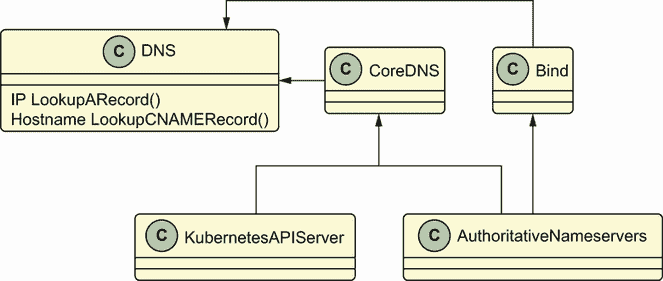
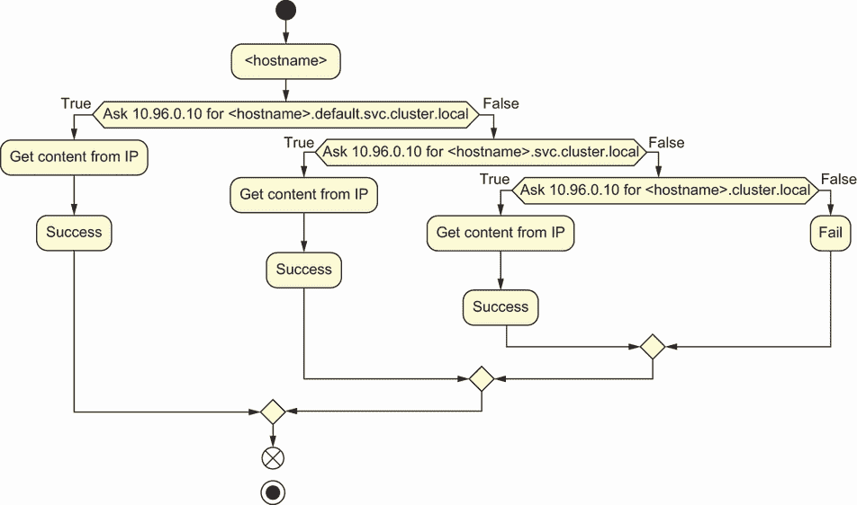

# Kubernetes 中的 10 个 DNS

本章涵盖

+   审查 Kubernetes 集群中的 DNS

+   探索分层 DNS

+   检查 Pod 中的默认 DNS

+   配置 CoreDNS

DNS 自从互联网存在以来就存在了。微服务使得在规模上管理 DNS 记录变得困难，因为它们需要在内部数据中心上使用大量的域名。Kubernetes 关于 Pod 的 DNS 标准使得 DNS 非常容易，以至于单个应用程序很少需要遵循复杂的指南来查找下游服务。这通常是通过 CoreDNS ([`github.com/coredns/coredns`](https://github.com/coredns/coredns)) 实现的，它是本章的核心。

## 10.1 DNS（以及 CoreDNS）简介

任何 DNS 服务器的任务是将 DNS 名称（如 www.google.com）映射到 IP 地址（如 142.250.72.4）。在我们每天浏览网页时，DNS 服务器有一些常见的映射。让我们看看其中的一些。

### 10.1.1 NXDOMAINs、A 记录和 CNAME 记录

当使用 Kubernetes 时，DNS 主要由系统处理，至少在集群中是这样。然而，我们仍然需要定义一些术语来使本章内容具体化，尤其是在你可能关心自定义 DNS 行为的情况下（例如，在本章中看到的无头服务）。至于我们的定义，至少你想要了解

+   *NXDOMAIN 响应*—当域名不存在 IP 地址时返回的 DNS 响应

+   *A 和 AAAA 映射*—接受一个主机名作为输入并返回一个 IPv4 或 IPv6 地址（例如，它们接受 google.com 作为输入并返回 142.250.72.4）

+   *CNAME 映射*—为特定的 DNS 名称返回一个别名（例如，它们将 [www.google.com](https://www.google.com/) 映射为 [google.com](https://www.google.com/)）

在自建环境中，CNAME 对于 API 客户端和其他依赖服务的向后兼容性至关重要。以下代码片段展示了 A 名称和 CNAME 记录如何交织在一起。这些记录存在于所谓的 *区域文件* 中。区域文件类似于这样一个长 CSV 文件中的记录（当然，没有逗号）：

```
my.very.old.website CNAME my.new.site.
my.old.website. CNAME my.new.site.
my.new.site. A 192.168.10.123
```

如果这让你想起了 /etc/hosts，那么你是正确的。Linux 系统的 /etc/hosts 文件只是一个本地 DNS 配置，在计算机连接到互联网以查找可能匹配你在浏览器中输入的 DNS 名称的其他主机之前进行检查，并且 ANAME 和 CNAME 记录由 DNS 服务器提供。甚至在 Kubernetes 之前，就有许多不同的 DNS 服务器实现：

+   其中一些是递归的；换句话说，它们可以从 DNS 记录的根（如 .edu 或 .com）开始解析互联网上的几乎所有内容。BIND 是这种在 Linux 数据中心中常用的一种服务器。

+   其中一些是基于云和云集成的（例如，AWS 中的 Route53）并且不由最终用户托管。

+   在大多数现代安装中，Kubernetes 通常使用 CoreDNS 为 Pod 提供集群内的 DNS 服务。

+   Kubernetes 一致性测试套件实际上确认了某些 DNS 特性是存在的，包括

    +   Pod 中的`/etc/hosts`集群条目，这样它们可以通过内部主机名 kubernetes.default 自动访问 API 服务器

    +   允许注入自己的 DNS 记录的 Pod

    +   必须解析到 A 记录的任意服务和无头服务

    +   拥有自己的 DNS 记录的 Pod

在 Kubernetes 中使用 CoreDNS 来实现这种行为并非必需，但它确实使事情变得更容易。真正重要的是，你的 Kubernetes 发行版遵循 Kubernetes 的 DNS 规范。无论如何，CoreDNS 很可能是你在集群中使用的，而且有充分的理由。它是唯一广泛可用的具有内置 Kubernetes 支持的开放源代码 DNS 服务。它能够

+   连接到 Kubernetes API 服务器，并在需要时获取 Pod 和服务的 IP 地址。

+   将 DNS 服务记录解析为 Pod 和集群内服务的 IP 地址。

+   缓存 DNS 条目，以便大型 Kubernetes 集群，其中数百个 Pod 需要解析服务，可以以高性能的方式工作。

+   在编译时（而不是运行时）插入新功能。

+   在高负载环境中也能以极低延迟进行水平扩展和性能表现。

+   通过[`coredns.io/plugins/forward/`](https://coredns.io/plugins/forward/)插件将请求转发到外部集群地址的其他上游解析器。

虽然 CoreDNS 可以处理很多事情，但它不会将外部集群地址的请求转发到其他提供递归 DNS 功能的上游服务器。CoreDNS 允许你解析集群网络中服务的 IP 地址以及 Pod 的 IP 地址，在某些情况下（我们将在稍后看到）。

图 10.1 描述了 CoreDNS 与其他 DNS 服务器（如 BIND）之间的关系。任何 DNS 服务器都必须实现解析互联网主机的基线功能。CoreDNS 是在 Kubernetes 之后构建的，因此它也明确支持 Kubernetes DNS。



图 10.1 CoreDNS 与其他 DNS 服务器（如 BIND）之间的关系

### 10.1.2 Pods 需要内部 DNS

因为在微服务环境中，每个 Pod 通常通过服务访问，Pod 可以来去（这意味着它们有变化的 IP），DNS 是访问任何服务的主要方式。这在互联网和云中都是如此。那些有人给你一个 IP 地址，指向特定服务器或数据库的日子已经过去了。让我们通过启动一个多容器服务并对其进行探测来看看 Pod 如何在集群中通过 DNS 相互通信：

```
apiVersion: v1
kind: Service
metadata:
  name: nginx4
  labels:
    app: four-of-us
spec:
  ports:
  - port: 80                 ❶
    name: web
  clusterIP: None
  selector:
    app: four-of-us
---
apiVersion: apps/v1
kind: StatefulSet
metadata:
  name: web-ss
spec:
  serviceName: "nginx"
  replicas: 2
  selector:
    matchLabels:
      app: four-of-us
  template:
    metadata:
      labels:
        app: four-of-us
    spec:
      containers:
      - name: nginx
        image: nginx:1.7     ❷
        ports:
        - containerPort: 80
          name: web
---
apiVersion: apps/v1
kind: Deployment             ❸
metadata:
  name: web-dep
spec:
  replicas: 2
  selector:
    matchLabels:
      app: four-of-us
  template:
    metadata:
      labels:
        app: four-of-us
    spec:
      containers:
      - name: nginx
        image: nginx:1.7
        ports:
        - containerPort: 80
          name: web
```

❶ 为我们的服务提供一个端口

❷ 一个旧的 NGINX 版本，允许在 NGINX Pod 内部使用 shell

❸ 为了比较不同类型的 Pod 中 DNS 的工作方式

在我们的示例中，为服务设置一个端口很重要，因为我们感兴趣的是探索 DNS 解析的方式。此外，请注意，我们使用的是旧版本的 NGINX，这样我们可以在我们的 NGINX Pod 内部有一个 shell。出于安全原因，较新的 NGINX 容器没有 shell。最后，这次我们使用 StatefulSet 来比较不同类型的 Pod 中 DNS 的工作方式。

注意：我们使用的 NGINX 容器允许我们在 shell 中探索，但使用较新的 NGINX 容器没有这种便利。在这本书中我们提到了几次 scratch 容器（真正精简的容器，没有完整的操作系统基础，因此更安全，但也缺少 shell 来访问和进行黑客攻击）。越来越多地，你会发现出于安全原因，容器发布时没有可以进入的 shell。另一个越来越常见的容器基础镜像是为容器提供的*distroless*基础镜像。如果您想使用一些合理的默认设置安全地构建容器，我们建议使用 distroless 镜像，它具有大多数适用于微服务应用程序的默认设置，而没有可能增加您的 CVE 漏洞足迹的额外冗余。这一概念也在第十三章中有所涉及。要了解更多关于如何从 distroless 基础镜像构建应用程序的信息，您可以查阅[`github.com/GoogleContainerTools/distroless`](https://github.com/GoogleContainerTools/distroless)。

在我们开始黑客攻击之前，我们将快速概述 StatefulSets 的概念以及它们在 Kubernetes 中的使用情况。这些通常具有最有趣的 DNS 特性和要求。

## 10.2 为什么选择 StatefulSets 而不是 Deployments？

在本章中，我们将创建一个运行在所谓的 StatefulSets 中的 Pod。当涉及到 DNS 时，StatefulSets 具有有趣的特性，因此我们将使用这个 Pod 来探测 Kubernetes 在运行具有可靠 DNS 端点的 HA（高可用性）进程时的能力和限制。对于需要具有明确身份的应用程序来说，StatefulSets 非常重要。例如：

+   Apache ZooKeeper

+   MinIO 或其他与存储相关的应用程序

+   Apache Hadoop

+   Apache Cassandra

+   比特币挖矿应用程序

StatefulSets 与 Kubernetes 中高级 DNS 用例密切相关，因为它们通常用于标准微服务模型开始崩溃的场景，外部实体（服务、应用程序、遗留系统）开始影响应用程序的部署方式。从理论上讲，对于现代无状态应用程序，你应该很少需要使用 StatefulSet，除非有无法通过其他方式获得的临界性能要求。StatefulSets 本质上是更难管理的，随着时间的推移扩展和扩展，而不是“愚蠢”的部署，这种部署在 Pod 重启之间没有携带行李。

### 10.2.1 无头服务与 DNS

当我们使用 StatefulSet 来部署应用程序时，我们通常与一个无头服务一起这样做。一个 *无头服务* 是一个没有 `ClusterIP` 字段的服务，而是直接从 DNS 服务器返回一个 A 记录。这对 DNS 有一些重要的含义。要查看此类服务，请运行以下代码片段：

```
$ kubectl create -f https://github.com/jayunit100/k8sprototypes/ 
➥ blob/master/smoke-tests/nginx-pod-svc.yaml
```

之前的命令返回一个 YAML 文件。该文件定义了一个服务如下：

```
apiVersion: v1
kind: Service
metadata:
  name: headless-svc
spec:
  clusterIP: None
  selector:
    app: nginx
  ports:
    - protocol: TCP
      port: 80
      targetPort: 80
  # Change this to true if you NEVER want an NXDOMAIN response!
  publishNotReadyAddresses: false                    ❶
```

❶ `publishNotReadyAddresses` 决定了你是否会得到 NXDomain 记录。

此服务从定义在此文件中的运行 web 服务器的 Pods 集合中选择。一旦此服务启动

+   你可以在我们共同部署的 BusyBox Pod 中发出对 `wget headless-svc:80` 的查询。

+   你的 BusyBox Pod 查询 CoreDNS（我们将在本章中讨论）以获取无头服务的 IP 地址。

+   CoreDNS 将在检查无头服务是否启动（基于其 `readinessProbe`）后，返回相应 Pods 的 IP 地址。

注意：如果设置为 `true`，`publishNotReadyAddresses` 总是返回 NGINX 的后端 Pods，即使它们尚未就绪。有趣的是，这意味着如果 NGINX 的 Pod 根据其 `readinessProbe` 不可用，你的底层 CoreDNS 服务将返回 NXDOMAIN 记录而不是 IP 地址。这通常被 Kubernetes 初学者误认为是 DNS 错误，但实际上，这指向了你的 kubelet 或应用程序中可能存在的潜在问题。

为什么使用无头服务？事实证明，许多应用程序通过直接通过 Pod IP 相互连接来建立法定多数和其他网络特定行为，而不是依赖于网络代理（`kube-proxy`）进行负载均衡连接。一般来说，你应该尽可能使用 ClusterIP 服务，因为从 DNS 视角来看，它们更容易推理，除非你真的需要与 IP 保留、法定多数决策或特定的 IP 到 IP 性能保证相关的某种网络特定行为。

如果你想要了解更多关于无头服务和 DNS 的工作方式，你可以查看 [`mng.bz/q2Rz`](http://mng.bz/q2Rz) 中的步骤。

### 10.2.2 StatefulSets 中的持久 DNS 记录

让我们重新创建原始的 StatefulSet 示例。作为一个快捷方式，你可以运行 `kubectl` `create` `-f` `https://raw.githubusercontent.com/jayunit100/k8sprototypes/master/smoke-tests/four-of-us.yaml`。这个服务的名称可以用来查看其端点，如下代码片段所示：

```
$ kubectl get endpoints -o yaml | grep ip
    - ip: 172.18.0.2
      ip: 10.244.0.13
    - ip: 10.244.0.14
    - ip: 10.244.0.15
      ip: 10.244.0.16
```

在这里，我们可以看到我们在 13-16 范围内有四个连续的端点。这来自于我们的两个 StatefulSet 副本和两个 Deployment 副本。

### 10.2.3 使用多语言部署来探索 Pod DNS 属性

在本节中，我们将探讨两种不同的使用 Kubernetes DNS 的方法。然后，我们将比较 StatefulSet 和 Deployment Pods 的 DNS 属性。

首先，让我们看看这些 Pod 的 DNS 是如何工作的。我们可以进行的明显测试之一是检查它们的服务端点。让我们在集群内部进行这个操作，这样我们就不必担心暴露或转发任何端口。首先，创建一个堡垒 Pod，我们可以用它来对不同的应用程序运行`_wget_`：

```
$ cat << EOF > bastion.yml
apiVersion: v1
kind: Pod
metadata:
  name: core-k8s
  namespace: default     ❶
spec:
  containers:
    - name: bastion
      image: docker.io/busybox:latest
      command: ['sleep','10000']
EOF
$ kubectl create -f bastion.yml
```

❶ 默认命名空间

注意，默认命名空间是使用这个例子最容易的，但你也可以在不同的命名空间中创建这个 Pod。如果是这样，你需要确保在探测 four-of-us 服务时完全限定 DNS 名称。现在，让我们`exec`进入这个 Pod，并使用它来完成本章剩余部分的全部实验：

```
$ kubectl get pods
NAME                       READY   STATUS   AGE
core-k8s                   1/1     Running  9m56s    ❶
web-dep-58db7f9644-fjtp6   1/1     Running  12h
web-dep-58db7f9644-gxddt   1/1     Running  12h
web-ss-0                   1/1     Running  12h
web-ss-1                   1/1     Running  12h

$ kubectl exec -t -i core-k8s /bin/sh
```

❶ 这是我们将访问的 Pod，作为探索集群内部 DNS 的一种方式。

我们可以做的第一件事就是`wget`下载我们的端点。以下代码片段显示了该命令：

```
#> wget nginx4:80
   Connecting to nginx4:80 (10.96.123.164:80)
   saving to 'index.html'
```

这真是个安慰。我们现在知道我们的服务是启动的。现在，如果我们仔细看看我们的 IP 地址，我们会发现它不在 10.244 范围内。这是因为我们访问的是一个服务，而不是 Pod。通常，你将使用服务名称作为 DNS 名称来访问集群内的服务，但如果我们想访问一个特定的 Pod 呢？那么我们可以使用类似这样的方法：

```
#> wget nginx:80
   Connecting to nginx:80 (10.96.123.164:80)
   saving to 'index.html'

#> wget web-ss-0.nginx                              ❶
   Connecting to web-ss-0.nginx (10.244.0.13:80)

#> wget web-dep-58db7f9644-fjtp6                    ❷
   bad address 'web-dep-58db7f9644-fjtp6'
```

❶ Pod 名称加上服务名称组合

❷ 通过名称获取部署中 Pod 的 IP 地址。

在这个例子中，Pod 名称加上服务名称的组合可以像任何 Web 服务器一样访问，而且没有为从部署创建的 Pod 提供等效的 DNS 名称。在我们的容器内部，我们不仅可以通过服务访问我们的 Pod，而且一些 Pod，即由 StatefulSet 创建的 Pod，也可以通过 DNS 直接访问。

当我们对 web-ss-0.nginx 端点运行`wget`（或者一般地，对任何<name>-0.<serviceName>端点运行）时，我们将直接将此地址解析为给定 StatefulSet 的第一个副本的 IP 地址。要访问第二个副本，我们可以将 0 替换为 1，依此类推。因此，我们学到了关于集群 DNS 的第一个教训：服务和 StatefulSet Pod 都是 Kubernetes 集群中的第一类、稳定的 DNS 端点。现在，如何解析这个极其方便的 web-ss-0.nginx 名称呢？

## 10.3 resolv.conf 文件

让我们通过查看 resolv.conf 文件本身来了解这些不同的 DNS 请求是如何解析的（或者在某些情况下，无法解析）。这将最终引导我们到 CoreDNS 服务。

### 10.3.1 关于路由的简要说明

本章不是关于 Pod IP 网络，但这是一个确保在您的思维模型中 DNS 和 Pod 网络基础设施之间有明确联系的好机会，因为集群的这两个方面密切相关。在主机解析为 IP 之后

+   如果该主机的 IP 是服务，那么确保这个 IP 路由到 Pod 端点就是网络代理的工作。

+   如果该主机是一个 Pod，那么确保 IP 直接可路由就是你的 CNI 提供商的工作。

+   如果该主机在互联网上，那么你的 Pod 的出站流量需要通过 iptables 进行 NAT，以便从请求发起的节点流回 Pod 的 TCP 连接。

图 10.2 展示了 Pod 对进入的主机名的 DNS 解析方式。这里的关键功能是，将发送多个版本的 DNS 查询到 10.96.0.10，直到找到匹配项。



图 10.2 Pod 对进入的主机名的 DNS 解析

resolv.conf 文件是配置容器 DNS 的标准方式。在任何你试图了解 Pod 如何配置 DNS 的场景中，这是首先要查看的地方。如果你运行的是现代 Linux 服务器，你可能使用`resolvctl`代替，但原理是相同的。现在我们可以通过这个代码片段快速查看 DNS 是如何在我们的 Pod 中设置的：

```
/ # cat /etc/resolv.conf
search                       ❶
  default.svc.cluster.local
  svc.cluster.local
  cluster.local
nameserver 10.96.0.10        ❷
options ndots:5
```

❶ 将以下内容追加到查询的末尾

❷ 指定一个 DNS 服务器

在这个代码片段中，该文件中的`search`字段基本上是在说“将这些属性追加到查询的末尾，直到查询返回。”换句话说，首先尝试一个未经修改的 URL 是否可以解析。如果失败，尝试将`default.svc.cluster .local`添加到 DNS 请求中。如果仍然失败，尝试添加`svc.cluster.local`，依此类推。接下来，注意`nameserver`字段。这告诉解析器，它可以通过询问位于 10.96.0.10 的 DNS 服务器（即你的 kube-dns 服务的地址）来纠正外部 DNS 名称（不在/etc/hosts 中的那些）。

我们可以通过运行`wget`来查看，例如，我们的 StatefulSet Pods 的 DNS 是如何解析到集群网络内的 Pod IP 的。让我们通过`kubectl exec`进入我们的 NGINX Pod 并运行以下命令：

```
/ # wget web-ss-0.nginx.default.svc.cluster.local
Connecting to web-ss-0.nginx.default.svc.cluster.local
  (10.244.0.13:80)
```

我们将把这个作为读者的练习，尝试从不同的命名空间中尝试这个操作。请放心，如果你包含完整的 DNS 名称，`web-ss-0`在集群的任何命名空间中都可以解析。同样，`wget web-ss-0.nginx.default`也可以。现在你可以想象出各种使用这个技巧在不同命名空间间共享服务的方法。这个用例中最明显的可能之一是

+   用户（Joe）在`joe`命名空间中创建了一个应用程序，该应用程序通常使用`my-db` URL 在`joe`命名空间内部访问数据库。

+   另一个用户（Sally），她在`sally`命名空间中有一个应用程序，想要访问 my-db 服务，她可以通过使用 URL my-db.joe.svc.cluster .local 来实现。

### 10.3.2 CoreDNS：ClusterFirst Pod DNS 的上游解析器

CoreDNS 是隐藏在 10.96.0.10 端点背后的神秘名称服务器。如果我们想确认这一点，可以在本地运行`kubectl get services`。CoreDNS 究竟做了什么，使其能够解析来自互联网、内部集群等的主机？我们可以通过查看其配置映射来了解其设置情况。

CoreDNS 由插件提供支持，你从文件顶部向下读取 CoreDNS 配置，每个插件都是文件中的一行。要查看 CoreDNS 的配置映射，你可以在任何集群上运行`kubectl get cm coredns -n kube-system -o yaml`。在我们的示例中，这返回

```
apiVersion: v1
data:
  Corefile: |
    .:53 {
        errors
        health {
           lameduck 5s
        }
        ready
        kubernetes
           cluster.local in-addr.arpa ip6.arpa {   ❶
           pods insecure
           fallthrough in-addr.arpa ip6.arpa
           ttl 30
        }
        prometheus :9153
        forward . /etc/resolv.conf                 ❷
        cache 30                                   ❸
        loop
        reload
        loadbalance
        log {
          class all                                ❹
        }
    }
kind: ConfigMap
```

❶ 解析集群的本地 IP 主机

❷ 如果 K8s 插件失败，解析互联网地址

❸ 仔细关注这个插件；我们稍后会用到它。

❹ 启用 CoreDNS 响应和错误的详细日志记录

在这个代码示例中，我们首先尝试使用 CoreDNS 的 Kubernetes 插件解析集群的本地 IP 主机。然后，如果 Kubernetes 插件在解析它们时失败，我们使用 kubelet 的 resolv.conf 解析互联网上的地址。

你可能会想知道，如果 CoreDNS 在一个容器中运行，它的 resolv.conf 不会依赖于 CoreDNS 吗？结果证明，答案是否定的！为了了解原因，让我们看看集群的`dnsPolicy`字段，它在 Kubernetes 集群中的任何 Pod 上都被设置：

```
> kubectl get pod coredns-66bff467f8-cr9kh
   -o yaml | grep dnsPolicy
     dnsPolicy: ClusterFirst                    ❶

> kubectl get pods -o yaml | grep dnsPolicy     ❷
   dnsPolicy: Default
```

❶ 使用 CoreDNS 作为主要解析器

❷ 使用默认 dnsPolicy 启动 Pod

ClusterFirst 策略使用 CoreDNS 作为其主要解析器，这就是为什么我们的 Pod 中的 resolv.conf 文件基本上只有 CoreDNS 而没有其他内容。使用默认 dnsPolicy 启动的 Pod 实际上会注入一个`/etc/resolv.conf`文件，该文件从 Kubelet 本身解析条目。因此，在大多数 Kubernetes 集群中，你会发现

+   即使 CoreDNS 在常规 Pod 网络中运行，它也有与其他集群中的“正常”Pod 不同的 DNS 策略。

+   你的集群中的 Pod 首先尝试联系 Kubernetes 内部服务，然后再通过你在 Corefile 中配置的流访问互联网。

+   CoreDNS Pod 本身将非集群内部 IP 地址转发到其主机转发这些 IP 地址的同一位置。换句话说，它继承了 kubelet 的互联网主机解析属性。

### 10.3.3 破解 CoreDNS 插件配置

CoreDNS 的缓存插件告诉 CoreDNS 它可以缓存结果 30 秒。这意味着如果我们试图

+   缩小我们的 StatefulSet 规模（通过运行`kubectl scale statefulset web-ss --replicas=0`）

+   为 web-ss-0.nginx Pod 启动一个`wget`

+   将我们的 StatefulSet 规模恢复（通过运行`kubectl scale statefulset web-ss --replicas=3`）

我们实际上会发现，即使在三个副本几乎立即运行的情况下，我们也可以在`wget`命令中获得一个长挂。这是因为 CoreDNS 的默认设置，即运行其缓存插件并具有 30 秒的响应时间，意味着即使这个 Pod 已经愉快地启动并运行，DNS 请求到 web-ss-0.nginx Pod 也会失败几秒钟。

为了解决这个问题，你可以运行`kubectl edit cm coreDNS -n kube-system`命令，并将这个`cache`值修改为更小的数字，例如 5。这样就可以保证 DNS 查询会快速刷新其结果。这个数字越大，随着时间的推移，你将在底层的 Kubernetes 控制平面上产生的负载就越小，但在我们的小型`kind`集群中，这种开销并不重要。

注意，无论是否使用 Kubernetes，DNS 调优在任何数据中心都是一个深奥的主题。如果你对在更大的集群中进一步调整 DNS 感兴趣，可以在 Kubernetes 的新版本中启动带有 NodeLocalDNS 策略的 kubelet。这个策略通过在集群的所有节点上运行 DaemonSet，使得 DNS 非常快速，因为它缓存了所有 Pod 的所有 DNS 请求。还有许多其他的 CoreDNS 插件调优你可以查看，以及 Prometheus 指标，你可以随着时间的推移进行监控。

## 摘要

+   Kubernetes 的一个主要特性为 Pods 提供了内部 DNS 以访问服务。

+   有状态集对于需要具有明确身份的应用程序来说非常重要。

+   无头服务直接返回 Pod IP，没有稳定的 ClusterIP，这意味着如果 Pod 宕机，有时会返回 NXDOMAIN。

+   服务和有状态集 Pods 都是 Kubernetes 集群中的第一类、稳定的 DNS 端点。

+   resolv.conf 文件是配置容器 DNS 的标准方式。在任何你试图了解你的 Pod 如何配置 DNS 的场景中，这是首先要查看的地方。

+   CoreDNS 由插件驱动，你从文件顶部向下读取 CoreDNS 配置，其中每个插件都是文件中的一行。

+   CoreDNS 的缓存插件告诉 CoreDNS 它可以缓存结果 30 秒。
