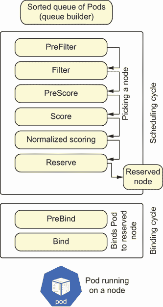

# 11 控制平面的核心

本章涵盖

+   探索控制平面的核心组件

+   审查 API 服务器细节

+   探索调度器接口及其内部工作原理

+   遍历控制器管理器和云管理器

之前，我们提供了一个 Pod 的高级概述，一个概述 Web 应用程序为什么需要 Pod，以及 Kubernetes 如何使用 Pod 构建。现在我们已经涵盖了所有用例的要求，让我们深入了解控制平面的细节。通常，所有控制平面组件都安装在`kube-system`命名空间中，这是一个作为操作员，你应该安装非常少组件的命名空间。

注意：你不应该只是使用`kube-system`！其中一个主要原因是运行在`kube-system`中的非控制器应用程序增加了安全爆炸半径，这指的是安全入侵的广度和深度。此外，如果你在一个托管系统上，如 GKE 或 EKS，你无法看到所有控制平面组件。我们将在第十三章中更多地讨论爆炸半径和安全最佳实践。

## 11.1 探索控制平面

开始和探索控制平面的最简单方法之一是使用`kind`，这是容器中的 Kubernetes（有关安装说明，请参阅以下链接：[`mng.bz/lalM`](http://mng.bz/lalM)）。要使用`kind`查看控制平面，请运行以下命令：

```
$ kind create cluster                         ❶
$ kubectl cluster-info --context kind-kind    ❷
$ kubectl -n kube-system get po \
-o custom-columns=":metadata.name"            ❸

coredns-6955765f44-g2jqd                      ❹
coredns-6955765f44-lvdxd
etcd-kind-control-plane                       ❺
kindnet-6gw2z                                 ❻
kube-apiserver-kind-control-plane             ❼
kube-controller-manager-kind-control-plane    ❽
kube-proxy-6vsrg                              ❾
kube-scheduler-kind-control-plane             ❿
```

❶ 在容器中创建运行的 Kubernetes 集群

❷ 将你的 kubectl 内容设置为指向你的本地 kind 集群

❸ 打印控制平面的组件 Pod（我们这里只打印 Pod 名称）

❹ 以 Deployment 运行两个副本

❺ etcd 数据库

❻ CNI 提供者

❼ Kubernetes API 服务器

❽ Kubernetes 控制器管理器

❾ 节点组件 kube proxy

❿ Kubernetes 调度器

你会注意到 kubelet 不是作为一个 Pod 运行的。一些系统在容器内运行 kubelet，但在`kind`等系统中，kubelet 只是作为一个二进制文件运行。要查看在`kind`集群中运行的 kubelet，请执行以下命令：

```
$ docker exec -it \
$(docker ps | grep kind | awk '{print $1}') \
/bin/bash                                             ❶
root@kind-control-plane:/$ ps aux | grep \
"/usr/bin/kubelet"                                    ❷
root    722 11.7  3.5 1272784 71896 ?    Ssl  23:34
➥ 1:10 /usr/bin/kubelet
➥ --bootstrap-kubeconfig=/etc/kubernetes/bootstrap-kubelet.conf
➥ --kubeconfig=/etc/kubernetes/kubelet.conf
➥ --config=/var/lib/kubelet/config.yaml --container-runtime=remote
➥ --container-runtime-endpoint=/run/containerd/containerd.sock
➥ --fail-swap-on=false --node-ip=172.17.0.2
➥ --fail-swap-on=false                               ❸
```

❶ 在 kind 容器内运行交互式终端

❷ kubelet 的 ps（进程状态）

❸ 运行中的 kubelet 进程

输入`exit`以退出容器内的交互式终端。要真正了解控制平面由什么组成，请查看各种 Pod。例如，你可以使用以下命令打印 API 服务器 Pod：

```
$ kubectl -n kube-system get po kube-apiserver-kind-control-plane -o yaml
```

## 11.2 API 服务器细节

现在，是时候深入了解 API 服务器的细节了。因为它不仅是一个 RESTful Web 服务器，而且是控制平面的关键组件。需要注意的是，不仅包括 API 对象，还包括自定义 API 对象。本书后面将介绍身份验证、授权和准入控制器，但首先，让我们更详细地看看 Kubernetes API 对象和自定义资源。

### 11.2.1 API 对象和自定义 API 对象

Kubernetes 的本质是一个开放平台，这意味着开放的 API。开放一个平台是提供额外创新和创造的方式。以下列出了一些与 Kubernetes 集群相关的 API 资源。您将认识到其中一些 API 对象（如 Deployments 和 Pods）：

```
$ kubectl api-resources -o name | head -n 20   ❶
bindings
componentstatuses
configmaps
endpoints
events
limitranges
namespaces
nodes
persistentvolumeclaims
persistentvolumes
pods
podtemplates
replicationcontrollers
resourcequotas
secrets
serviceaccounts
services
mutatingwebhookconfigurations.admissionregistration.k8s.io
validatingwebhookconfigurations.admissionregistration.k8s.io
customresourcedefinitions.apiextensions.k8s.io
```

❶ 显示可用的 API，只需查看前 20 个使用 head

当我们使用 ClusterRoleBinding 定义 YAML 清单时，定义的一部分是 API 版本。例如：

```
apiVersion: rbac.authorization.k8s.io/v1    ❶
kind: ClusterRoleBinding
metadata:
  name: cockroach-operator-default
  labels:
    app: cockroach-operator
roleRef:
  apiGroup: rbac.authorization.k8s.io
  kind: ClusterRole
  name: cockroach-operator-role
subjects:
  - name: cockroach-operator-default
  namespace: default
  kind: ServiceAccount
```

❶ apiVersion 与之前代码片段中的 API 组相匹配。

之前 YAML 中的`apiVersion`部分定义了 API 的版本。API 版本化是一个复杂的问题。为了允许 API 通过不同的版本进行迁移，Kubernetes 具有版本和级别的功能。例如，在之前的 YAML 定义中，您会注意到我们在`apiVersion`定义中使用了`v1beta1`。这表示 ClusterRoleBinding 是一个*beta* API 对象。

API 对象具有以下级别：alpha、beta 和 GA（通用可用性）。标记为 alpha 的对象永远不应该在生产中使用，因为它们会导致严重的升级路径问题。alpha API 对象将会改变，并且仅用于开发和实验。beta 实际上并不是 beta！通常认为 beta 软件是不稳定的，不适合生产，但 Kubernetes 中的 beta API 对象**确实**适合生产，并且对这些对象的支持是保证的，与 alpha 对象不同。例如，DaemonSets 已经 beta 了多年，几乎每个人都把它们用于生产。

*v1*前缀允许 Kubernetes 开发者对 API 对象的版本进行编号。例如，在 Kubernetes v1.17.0 中，自动缩放 API 是

+   /apis/autoscaling/v1

+   /apis/autoscaling/v2beta1

+   /apis/autoscaling/v2beta2

注意，这个列表是 URI 布局。您可以通过首先在本地启动一个`kind` Kubernetes 集群来查看 API 对象的 URI 布局：

```
$ kind cluster start
```

然后，在同时拥有网络浏览器的系统上运行一个`kubectl`命令。例如：

```
$ kubectl proxy --port=8181
```

现在转到 URL http://127.0.0.1:8181/。为了简洁起见，我们不会显示 API 服务器返回的 120 行响应，但如果您在本地这样做，它将为您提供 API 端点的图形视图。

### 11.2.2 自定义资源定义（CRDs）

在 ClusterRoleBinding 代码片段中，我们定义了 CRDs 来与`cockroach`数据库操作员通信。现在是时候讨论 CRDs 存在的原因了。在 Kubernetes v1.17.0 中，我们有 54 个 API 对象。以下命令将提供一些见解：

```
$ kubectl api-resources | wc     ❶
      54     230    5658
```

❶ 将 kubectl 命令的结果管道传输到 wc 以计算行数、单词数和字符数

你可以理解维护一个包含 54 个不同对象（坦白说，我们需要更多）的系统需要多少开发时间。为了将非核心 API 对象与 API 服务器解耦，创建了 CRD。这允许开发者创建自己的 API 对象定义，然后使用 `kubectl` 将该定义应用到 API 服务器。以下命令在 API 服务器中创建一个 CRD 对象：

```
$ kubectl apply -f https://raw.githubusercontent.com/cockroachdb/
➥ cockroach-operator/v2.4.0/config/crd/bases/
➥ crdb.cockroachlabs.com_crdbclusters.yaml
```

与 API 服务器中的 Pod 或其他股票 API 对象一样，CRD 对象通过程序化扩展 Kubernetes API 平台，无需程序员交互。操作员、自定义准入控制器、Istio、Envoy 以及其他技术现在通过定义自己的 CRD 来使用 API 服务器。但是，这些自定义对象并没有紧密耦合到 Kubernetes API 对象的实现中。此外，许多新的 Kubernetes 核心组件并没有被添加到 API 服务器的基本定义中，而是作为 CRD 添加。这就是 API 服务器。接下来，我们将讨论我们将要覆盖的第一个控制器：Kubernetes 调度器。

### 11.2.3 调度器细节

调度器，就像其他控制器一样，由各种控制循环组成，处理不同的事件。截至 Kubernetes v1.15.0，调度器被重构为使用调度框架，并且还增加了自定义插件。Kubernetes 支持使用自定义调度器，这些调度器不在实际的调度器中运行，而是在另一个 Pod 中运行。然而，自定义调度器的问题通常是性能不佳。

调度器框架的第一个组件是 QueueSort。它将需要调度的 Pod 排序到一个队列中。然后框架分为两个周期：调度周期和绑定周期。首先，调度周期选择 Pod 运行的节点。一旦调度周期完成，绑定周期接管。

调度器选择 Pod 可以驻留的节点，实际上确定 Pod 是否可以驻留可能需要一些时间。例如，Pod 需要一个卷，因此需要创建该卷。如果所需卷的创建失败会发生什么？那么 Pod 就不能在该节点上运行，该 Pod 的调度将被重新排队。

我们将通过这个过程来了解调度器在调度过程中处理 Pod NodeAffinity 的时间点。每个周期都有其独立的组件，这些组件在调度器 API 中的结构如下。以下代码来自 Kubernetes v1.22 版本，截至 v1.23，它已经被重构，允许通过多点启用插件。截至本书编写时，调度器本身和插件基础并未改变。此代码片段（位于 [`mng.bz/d2oX`](http://mng.bz/d2oX)）定义了在运行中的调度实例内部注册的各种插件集合。以下是基本 API 定义：

```
// Plugins include multiple extension points. When specified, the list of
// plugins for a particular extension point are the only ones enabled. If
// an extension point is omitted from the config, then the default set of
// plugins is used for that extension point. Enabled plugins are called in
// the order specified here, after the default plugins. If they need to be
// invoked before the default plugins, the default plugins must be disabled
// and re-enabled here in the desired order.
type Plugins struct {
    // QueueSort is a list of plugins that should be invoked when
    // sorting pods in the scheduling queue.
    QueueSort *PluginSet                                       ❶

    // PreFilter is a list of plugins that should be invoked at the
    // PreFilter extension point of the scheduling framework.
    PreFilter *PluginSet                                       ❷

    // Filter is a list of plugins that should be invoked when filtering
    // nodes that cannot run the Pod.
    Filter *PluginSet

    // PostFilter is a list of plugins that are invoked after filtering
    // phase, no matter whether filtering succeeds or not.
    PostFilter *PluginSet

    // PreScore is a list of plugins that are invoked before scoring.
    PreScore *PluginSet

    // Score is a list of plugins that should be invoked when ranking nodes
    // that have passed the filtering phase.
    Score *PluginSet

    // Reserve is a list of plugins invoked when reserving/unreserving
    // resources after a node is assigned to run the pod.
    Reserve *PluginSet

    // Permit is a list of plugins that control binding of a Pod. These
    // plugins can prevent or delay binding of a Pod.
    Permit *PluginSet

    // PreBind is a list of plugins that should be invoked before a pod
    // is bound.
    PreBind *PluginSet                                         ❸

    // Bind is a list of plugins that should be invoked at the Bind
    // extension point of the scheduling framework. The scheduler calls
    // these plugins in order and skips the rest of these plugins as soon
    // as one returns success.
    Bind *PluginSet                                            ❸

    // PostBind is a list of plugins that should be invoked after a pod
    // is successfully bound.
    PostBind *PluginSet                                        ❸
}
```

❶ 在队列中对 Pod 进行排序

❷ 调度周期插件从这里开始，结束于 Permit 插件。

❸ 这最后三个插件是绑定周期。

之前代码片段中的结构体在 [`mng.bz/rJaZ`](http://mng.bz/rJaZ)（在 1.21 之后此代码被重构并移动）中被实例化。在下面的代码中，你会认出处理 Pod NodeAffinity 等配置的调度插件，这会影响 Pod 的调度。此过程的第一阶段是队列排序，但请注意，队列排序是可扩展的，因此可以替换：

```
func getDefaultConfig() *schedulerapi.Plugins {    ❶
    return &schedulerapi.Plugins{
        QueueSort: &schedulerapi.PluginSet{        ❷
            Enabled: []schedulerapi.Plugin{
                {Name: queuesort.Name},
            },
        },
```

❶ 再次调用 `getDefaultConfig()`

❷ 调用 `getDefaultConfig()`

私有函数 `getDefaultConfig()` 在同一 Go 文件中的 `NewRegistry` 被调用。这返回一个算法提供程序注册实例。接下来返回的成员定义了调度周期。首先，是预过滤器，它是一系列按顺序运行的插件：

```
PreFilter: &schedulerapi.PluginSet {
            Enabled: []schedulerapi.Plugin {

                {Name: noderesources.FitName},     ❶

                {Name: nodeports.Name},            ❷

                {Name: podtopologyspread.Name},    ❸

                {Name: interpodaffinity.Name},     ❹

                {Name: volumebinding.Name},        ❺
            },
        },
```

❶ 检查节点是否有足够的资源

❷ 确定节点是否有空闲端口来托管 Pod

❸ 检查 PodTopologySpread 是否满足，这允许 Pod 在区域之间均匀分布

❹ 处理节点间亲和性，类似于 Pod 反亲和性，根据用户定义的规则将 Pod 从节点排斥

❺ 这实际上不是一个过滤器，但创建了一个在保留和预绑定阶段稍后使用的缓存。

接下来是过滤阶段。请注意，*Filter* 是一个插件列表，用于确定 Pod 是否可以在特定节点上运行：

```
Filter: &schedulerapi.PluginSet {
    Enabled: []schedulerapi.Plugin {
        {Name: nodeunschedulable.Name},      ❶

        {Name: noderesources.FitName},       ❷

        {Name: nodename.Name},               ❸

        {Name: nodeports.Name},              ❹

        {Name: nodeaffinity.Name},           ❺

        {Name: volumerestrictions.Name},     ❻

        {Name: tainttoleration.Name},        ❼

        {Name: nodevolumelimits.EBSName},    ❽
        {Name: nodevolumelimits.GCEPDName},
        {Name: nodevolumelimits.CSIName},
        {Name: nodevolumelimits.AzureDiskName},

        {Name: volumebinding.Name},          ❾

        {Name: volumezone.Name},             ❿

        {Name: podtopologyspread.Name},      ⓫
        {Name: interpodaffinity.Name},       ⓫
    },
},
```

❶ 确保 Pod 不会被调度到过去标记为不可调度的节点（例如，控制平面中的节点）

❷ 再次执行插件

❸ PodSpec API 允许您设置一个节点名，该节点名标识了您希望 Pod 所在的节点。

❹ 插件执行了第二次

❺ 检查 Pod 节点选择器是否匹配节点标签

❻ 检查是否满足各种卷限制

❼ 检查 Pod 是否容忍节点污点

❽ 检查节点是否有能力添加更多卷（例如，节点可以在 GCP 中挂载 16 个卷）。

❾ 在预过滤器中重复一个过滤器

❿ 检查节点所在的区域中是否存在卷

⓫ 这两个过滤器会重复。

在过滤阶段，调度器检查 GCP、AWS、Azure、ISCI 和 RBD 中挂载不同卷的各种约束。例如，Pod 反亲和性确保有状态集的 Pod 驻留在不同的节点上。你可能已经开始注意到，过滤器是从你可能在过去已经创建在 Pod 上的设置中调度 Pod 的。现在，让我们继续到后过滤器。即使过滤失败，此插件也会运行：

```
PostFilter: &schedulerapi.PluginSet{
  Enabled: []schedulerapi.Plugin{
    {Name: defaultpreemption.Name},    ❶
  },
},
```

❶ 处理 Pod 抢占

用户可以为 Pod 设置一个优先级类别。如果是这样，默认的抢占插件允许调度器确定是否可以设置另一个 Pod 进行驱逐，以便在优先级类别中为计划中的 Pod 腾出空间。请注意，这些插件会执行所有过滤操作以确定 Pod 是否可以在特定节点上运行。

接下来是评分。调度器构建一个 Pod 可以运行的节点列表，现在是时候通过评分节点来对可以托管 Pod 的节点列表进行排名。因为评分组件也是过滤节点的插件之一，所以你会注意到很多重复的插件名称。调度器首先进行预评分，以便为评分插件创建一个可共享的列表：

```
PreScore: &schedulerapi.PluginSet{      ❶
  Enabled: []schedulerapi.Plugin{
    {Name: interpodaffinity.Name},
    {Name: podtopologyspread.Name},
    {Name: tainttoleration.Name},
  },
},
```

❶ 在过滤过程中已经运行了所有定义的插件。

下面的代码片段定义了各种重复插件的重复使用，但也定义了一些新的插件。调度器定义了一个权重值，它会影响调度。所有评分的节点都已通过不同的过滤阶段：

```
Score: &schedulerapi.PluginSet{
  Enabled: []schedulerapi.Plugin{
    {Name: noderesources.BalancedAllocationName,
    ➥ Weight: 1},                                          ❶

    {Name: imagelocality.Name, Weight: 1},                  ❷

    {Name: interpodaffinity.Name, Weight: 1},               ❸

    {Name: noderesources.LeastAllocatedName,
    ➥ Weight: 1},                                          ❹

    {Name: nodeaffinity.Name, Weight: 1},                   ❺

    {Name: nodepreferavoidpods.Name,
    ➥ Weight: 10000},                                      ❻

    // Weight is doubled because:
    // - This is a score coming from user preference.
    // - It makes its signal comparable to NodeResourcesLeastAllocated.
    {Name: podtopologyspread.Name, Weight: 2},              ❼
    {Name: tainttoleration.Name, Weight: 1},                ❼
  },
},
```

❶ 优先考虑资源使用平衡的节点

❷ 已经下载 Pod 的镜像的节点得分更高。

❸ 重复插件以评分构建的缓存

❹ 优先考虑请求较少的节点。

❺ 重复插件，再次评分构建的缓存

❻ 如果设置了 preferAvoidPods，则降低节点分数

❼ 重复这两个插件

当优先考虑资源使用平衡的节点时，调度器计算 CPU、内存和卷分数。算法如下：

```
(cpu((capacity − sum(requested)) * MaxNodeScore/capacity) +
  memory((capacity − sum(requested)) * MaxNodeScore/capacity)) / weightSum
```

此算法对请求较少的节点进行评分。节点标签`preferAvoidPods`表示应避免该节点进行调度。

过滤过程的最后一步是保留阶段。在保留阶段，我们为 Pod 在绑定周期内使用保留一个卷。在下面的代码中，请注意 volumebinding 是一个重复的插件：

```
Reserve: &schedulerapi.PluginSet{
  Enabled: []schedulerapi.Plugin{
    {Name: volumebinding.Name},      ❶
  },
},
```

❶ 缓存为 Pod 保留一个卷。

调度周期，主要过滤节点，确定 Pod 应该运行在哪个节点上。但是确保 Pod 实际上运行在那个节点上是一个更长的过程，你可能会发现 Pod 被重新排队进行调度。现在让我们看看调度框架中的绑定周期，从预绑定阶段开始。下面的代码片段显示了 PreBind 插件的代码：

```
PreBind: &schedulerapi.PluginSet{
  Enabled: []schedulerapi.Plugin{
    {Name: volumebinding.Name},     ❶
  },
},
Bind: &schedulerapi.PluginSet{
  Enabled: []schedulerapi.Plugin{
    {Name: defaultbinder.Name},     ❷
  },

},
```

❶ 将卷绑定到 Pod 上

❷ 通过 API 服务器保存绑定对象，更新 Pod 将启动的节点

在所有这些过程中，调度器有多个队列：一个活动队列，即要调度的 Pod，和一个回退队列，其中包含不可调度的 Pod。调度器中的注册表不会为两个不同的阶段：许可和 PostBind 实例化插件。这些入口点被其他插件使用，例如批处理调度器，它很快将成为调度器的外部插件。因为我们现在有一个调度框架，我们可以使用和注册其他自定义调度插件。这些自定义插件的示例可以在 GitHub 存储库中找到，网址为[`mng.bz/oaBN`](http://mng.bz/oaBN)。

### 11.2.4 调度总结

图 11.1 显示了组成调度框架的三个组件。这些包括

+   *队列构建器*—维护 Pod 队列

+   *调度周期*—过滤节点以找到运行 Pod 的节点

+   *绑定周期*—将数据保存到 API 服务器，包括绑定信息



图 11.1 Kubernetes 调度器

## 11.3 控制器管理器

许多原本包含在 KCM（Kubernetes 控制器管理器）中的功能已被移动到 CCM（云控制器管理器）。这个二进制文件是四个组件的组合，这些组件本身是控制器或者仅仅是控制循环。我们将在接下来的章节中探讨这些内容。

### 11.3.1 存储

Kubernetes 中的存储有点像移动的目标。随着功能从 KCM 移出并进入 CCM，Kubernetes 控制平面中的存储功能也发生了重大变化。在迁移之前，KCM 存储适配器存在于主仓库 kubernetes/kubernetes 中。用户在云中创建了一个 PVC（持久卷声明），然后 KCM 调用了 Kubernetes 项目内部的代码。然后，还有灵活的卷控制器，这些控制器至今仍然存在。但是，回到 KCM，它驱动了 Kubernetes v1.18.x 版本中存储对象的创建。

当用户创建一个 PV 或 PVC，或者一个需要创建 StatefulSet 的 PVC/PV 组合时，控制平面上的一个组件必须启动并控制存储卷的创建。这个存储卷可以由云提供商托管或在另一个虚拟环境中创建。需要注意的是，KCM 控制存储的创建和删除。让我们来看看构成 KCM 的控制器。

节点控制器会监视节点何时宕机。然后，它会更新节点状态在 Nodes API 对象中。

复制控制器维护系统中每个复制控制器对象的正确 Pod 数量。复制控制器对象大部分已被使用 ReplicaSets 的部署所取代。

端点控制器是最后一个控制器，它管理端点对象。端点对象定义在 Kubernetes API 中。这些对象通常不是手动维护的，但它们被创建来为`kube-proxy`提供将 Pod 连接到服务的信息。一个服务可以有一个或多个 Pod 处理来自该服务的流量。以下是在`kind`集群上为`kube-dns`创建的端点示例：

```
$ kubectl -n kube-system describe endpoints kube-dns
Name:         kube-dns
Namespace:    kube-system
Labels:       k8s-app=kube-dns
              kubernetes.io/cluster-service=true
              kubernetes.io/name=KubeDNS
Annotations:  endpoints.kubernetes.io/last-change-trigger-time:
➥ 2020-09-30T00:21:28Z
Subsets:
  Addresses:          10.244.0.2,10.244.0.4    ❶
  NotReadyAddresses:  <none>
  Ports:
    Name     Port  Protocol
    ----     ----  --------
    dns      53    UDP
    dns-tcp  53    TCP
    metrics  9153  TCP
```

❶ 属于 kube-dns 服务的 Pod 的 IP 地址

### 11.3.2 服务账户和令牌

当生成新的命名空间时，Kubernetes 控制器管理器为新的命名空间创建默认的服务账户和 API 访问令牌。如果您在定义 Pod 时没有指定特定的服务账户，它将加入在命名空间中创建的默认服务账户。不出所料，当 Pod 访问集群的 API 服务器时，会使用服务账户。当 Pod 启动时，API 访问令牌会被挂载到 Pod 上，除非用户禁用了令牌的挂载。

提示：如果一个 Pod 不需要 ServiceAccount 令牌，可以通过将`automountServiceAccountToken`设置为`false`来禁用令牌的挂载。

## 11.4 Kubernetes 云控制器管理器（CCM）

假设我们有一个在云服务上运行的 Kubernetes 集群，或者我们在虚拟化提供商上运行 Kubernetes。无论哪种方式，这些不同的托管平台都维护着不同的云控制器，它们与 Kubernetes 托管层的 API 层进行交互。如果您想编写一个新的云控制器，您需要包括以下组件的功能：

+   *节点*—用于虚拟实例

+   *路由*—用于节点间的流量

+   *外部负载均衡器*—用于创建集群节点外部的负载均衡器

与云服务提供商内部组件交互的代码是通过其 API 针对特定提供商的。云控制器接口现在为不同的云提供商定义了一个通用接口。例如，为了让 Omega 为 Kubernetes 构建一个云提供商，我们需要构建一个利用以下接口的控制器：

```
// Interface is an abstract, pluggable interface for cloud providers.
type Interface interface {

    // Initialize provides the cloud with a Kubernetes client builder and
    // can spawn goroutines to perform housekeeping or run custom
    // controllers specific to the cloud provider. Any tasks started here
    // should be cleaned up when the stop channel closes.
    Initialize(clientBuilder ControllerClientBuilder, stop <-chan struct{})

    // LoadBalancer returns a balancer interface. It also returns true if
    // the interface is supported; otherwise, it returns false.
    LoadBalancer() (LoadBalancer, bool)

    // Instances returns an instances interface. It also returns true if
    // the interface is supported; otherwise, it returns false.
    Instances() (Instances, bool)

    // InstancesV2 is an implementation for instances and should only be
    // implemented by external cloud providers. Implementing InstancesV2
    // is behaviorally identical to Instances but is optimized to
    // significantly reduce API calls to the cloud provider when registering
    // and syncing nodes. It also returns true if the interface is supported
    // and false otherwise.
    // WARNING: InstancesV2 is an experimental interface and is subject to
    // change in v1.20.
    InstancesV2() (InstancesV2, bool)

    // Zones returns a zones interface. It also returns true if the
    // interface is supported and false otherwise.
    Zones() (Zones, bool)

    // Clusters returns a clusters interface. It also returns true if the
    // interface is supported and false otherwise.
    Clusters() (Clusters, bool)

    // Routes returns a routes interface along with whether the interface
    // is supported.
    Routes() (Routes, bool)

    // ProviderName returns the cloud provider ID.
    ProviderName() string

    // HasClusterID returns true if a ClusterID is required and set.
    HasClusterID() bool
}
```

对于 CCM，推荐的设计模式是实现三个控制循环（控制器）。这些通常作为一个单一的二进制文件部署。

为了将云卷挂载到节点上，我们必须在云中找到该节点，而 Node 控制器提供了这一功能。控制器必须知道集群中哪些节点，这超出了节点启动时 kubelet 提供的信息。在云环境中运行时，Kubernetes 需要关于节点及其在云环境中的部署的具体信息（例如，区域信息）。此外，还有一个层来确定节点是否已完全从云环境中删除。节点控制器在云 API 层和存储之间提供了一个桥梁，并将这些信息存储在 API 服务器中。

Kubernetes 需要在节点间路由流量，这由 Route 控制器处理。如果云需要配置来在节点间路由数据，CCM 会对节点间的所有网络流量进行 API 调用。

“服务控制器”这个名字有点误导。服务控制器只是一个控制器，它仅用于在集群内创建 LoadBalancer 类型的服务。它不促进 Kubernetes 集群内 ClusterIP 服务的任何操作。

## 11.5 进一步阅读

Acetozi. “Kubernetes 主组件：Etcd、API 服务器、控制器管理器和调度器。” [`mng.bz/doKX`](http://mng.bz/doKX)（访问日期：2021 年 12 月 29 日）。

## 摘要

+   Kubernetes 控制平面提供了在 Kubernetes 集群中编排和托管 Pod 的功能。

+   调度器由处理不同事件的多个控制循环组成。

+   调度周期主要过滤节点，确定 Pod 应该运行在哪个节点上。

+   Kubernetes 中的 Beta API 对象已准备好投入生产。对这些对象的支持是保证的，与 alpha 对象不同。

+   KCM 和 CCM 协同工作，通过 KCM 和 CCM 包含的不同控制器提供存储、服务、负载均衡器和其他组件。
