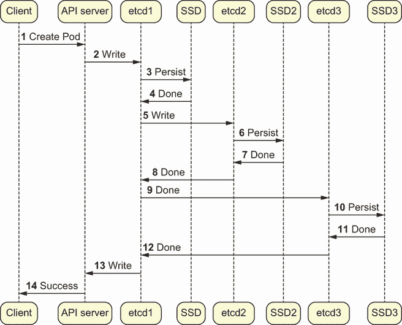
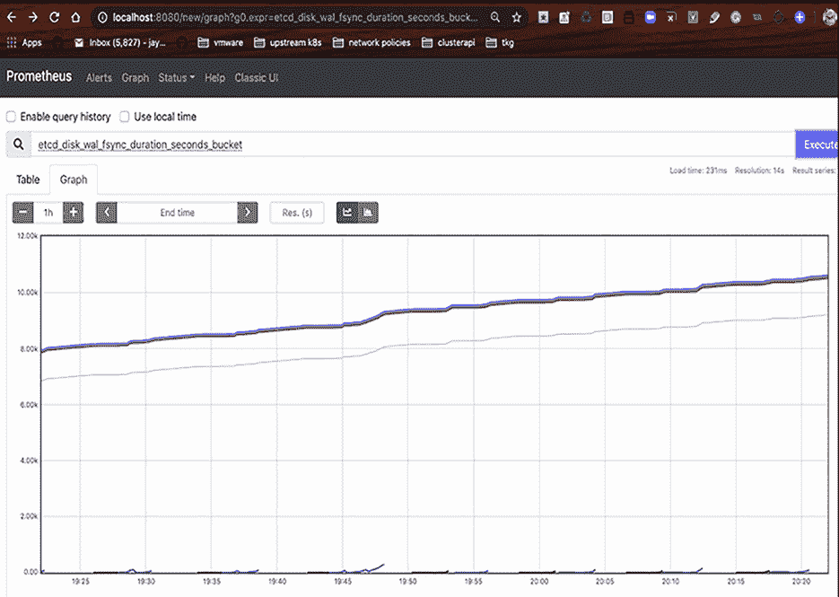
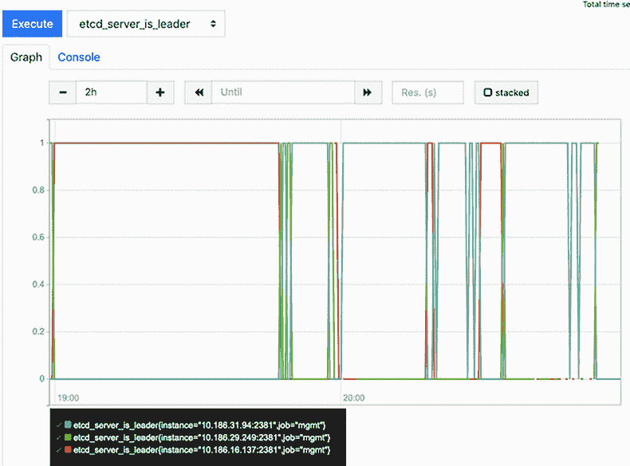
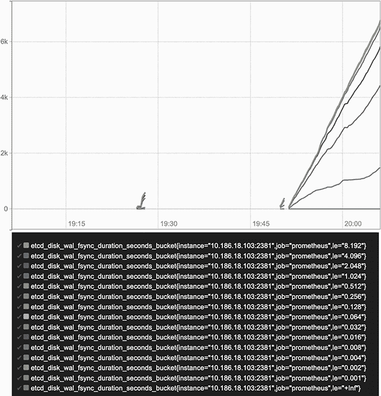

# 12 个 etcd 和控制平面

本章涵盖

+   比较 etcd v2 和 v3

+   查看 Kubernetes 中的 watch

+   探讨严格一致性的重要性

+   针对 etcd 节点的负载均衡

+   查看 Kubernetes 中 etcd 的安全模型

如第十一章所述，etcd 是一个具有强一致性保证的键/值存储。它与 ZooKeeper 类似，后者被用于 HBase 和 Kafka 等流行技术。Kubernetes 集群的核心由以下组成

+   kubelet

+   调度器

+   控制器管理器（KCM 和 CCM）

+   API 服务器

这些组件通过更新 API 服务器相互通信。例如，如果调度器想在特定节点上运行 Pod，它会通过修改 API 服务器中的 Pod 定义来实现。如果在启动 Pod 的过程中，kubelet 需要广播一个事件，它会通过向 API 服务器发送消息来实现。由于调度器、kubelet 和控制器管理器都通过 API 服务器进行通信，这使得它们高度*解耦*。例如，调度器不知道 kubelet 如何运行 Pod，kubelet 也不知道 API 服务器如何调度 Pod。换句话说，Kubernetes 是一个巨大的机器，它始终在 API 服务器中存储你的基础设施的状态。

当节点、控制器或 API 服务器失败时，数据中心的应用程序需要进行协调，以便容器可以被调度到新的节点，卷可以被绑定到这些容器上，等等。通过 Kubernetes API 进行的所有状态修改实际上都备份在 etcd 中。在扩展计算的世界里，这并不是什么新鲜事。你可能听说过像 ZooKeeper 这样的工具，它们以相同的方式使用。实际上，HBase、Kafka 和许多其他分布式平台在底层都使用 ZooKeeper。etcd 数据库只是 ZooKeeper 的现代版本，它在如何存储高度关键数据以及在故障场景中协调记录方面有一些不同的看法。

## 12.1 对于不耐烦的人的笔记

一旦开始研究分布式共识场景和 etcd 数据库的灾难恢复的理论内部机制，可能会感到相当令人不知所措。在我们深入那个领域之前，让我们先了解一下 Kubernetes 中 etcd 的一些实用细节：

+   如果你丢失了 etcd 数据，你的集群将受到严重损害。备份 etcd！

+   在生产中运行 etcd v3 需要通过固态硬盘和高速网络进行快速的磁盘访问。

    etcd 中的单个写入操作，如果需要超过 1 秒的时间来序列化到磁盘，可能会逐渐使大型集群停止运行。考虑到你可能会在任何给定时间有许多写入操作，这意味着网络和磁盘需求大致相当于 10 GB 的网络和固态硬盘。根据 etcd 自己的文档（[`etcd.io/docs/v3.3/op-guide/hardware/`](https://etcd.io/docs/v3.3/op-guide/hardware/)）：“通常需要 50 个顺序 IOPS（例如，7200 RPM 的硬盘）。”而且，通常 etcd 需要更多的 IOPS

+   对于给定的计算节点，大多数数据中心或云环境都会出现周期性的故障，因此您需要冗余的 etcd 节点。这意味着在给定的安装中运行三个或更多的 etcd 节点。

+   对于集群化的 etcd 环境，了解其 Raft 实现的工作原理、为什么磁盘 I/O 对 Raft 共识很重要，以及 etcd 如何使用 CPU 和内存，将变得非常重要。

+   所有事件，除了集群状态外，都存储在 etcd 中。然而，您应该决定将集群事件（其中有很多）存储在不同的 etcd 端点，这样您的核心集群数据就不会与不重要的事件元数据竞争。

+   用于与 etcd 服务器交互的命令行工具`etcdctl`具有自己的嵌入式性能测试，用于快速验证 etcd 性能：`etcdctl check perf`。

+   如果您需要恢复 etcd 实例，可以遵循[`mng.bz/6Ze5`](http://mng.bz/6Ze5)中的指南手动恢复 etcd 快照。

### 12.1.1 使用 Prometheus 可视化 etcd 性能

本节中的大部分信息将是轶事性的，因为调整和管理 Kubernetes 内部的 etcd 涉及很多理论。为了弥补这一点，我们将从如何在生产环境中进行 etcd 调整和观察的实践旅程开始。这些示例是高级的，欢迎您跟随，但您不必独立产生这些数据，才能从本节中受益。

图 12.1 显示了在 Kubernetes 集群中发生任何事件时发生的标准流程。所有写操作最终都与多个 etcd 服务器达成一致，认为写操作已完成。这将为我们提供即将讨论的现实场景的背景。



图 12.1 Kubernetes 集群中事件发生时的流程

每个 API 服务器操作（例如，每次您通过`kubectl create -f mypod.yaml`创建简单的 Pod 时）都会导致对 etcd 的同步写入。这确保了创建 Pod 的请求在 API 服务器死亡的情况下（根据大数定律，它最终会死亡）存储在磁盘上。API 服务器将信息发送到“领导者”etcd 服务器，然后分布式共识的魔力接管，将此写入固定下来。在图 12.1 中，我们可以看到

+   此集群有三个 etcd 实例。通常，这可以是三个、五个或七个。etcd 实例的数量总是奇数，这样在选举新领导者（我们将在本章末尾讨论 etcd 领导权）时总是可能的。

+   单个 API 服务器可以接收一个写操作，此时它将在其指定的 etcd 端点存储数据，该端点在启动时特定于您的 etcd 服务器，作为`--etcd-servers`。

+   写入操作实际上是由最慢的 etcd 节点减慢的。如果一个节点将数据序列化到磁盘的往返时间很慢，那么这个时间将主导事务的总往返时间。

现在，让我们从 etcd 的角度看看当我们的集群健康时会发生什么。首先，你需要安装 Prometheus。（尽管我们之前已经详细讨论过，但在这个案例中，有一个小的偏差：我们将配置在 Docker 中运行的 Prometheus，以便专门抓取 etcd 实例。）你可能还记得，启动 Prometheus 需要给它一个 YAML 文件，这样它就知道需要从哪些目标抓取信息。为了定制这个文件以分析我们示例图中的三个 etcd 集群，你会创建以下内容：

```
global:
  scrape_interval:     15s
  external_labels:
    monitor: 'myetcdscraper'
scrape_configs:
  - job_name: 'prometheus'
    scrape_interval: 5s
    static_configs:
      - targets: ['10.0.0.217:2381']
      - targets: ['10.0.0.251:2381']
      - targets: ['10.0.0.141:2381']
```

对于这个过程，我们将关注的指标是 *fsync* 指标。这个指标告诉我们写入 etcd（磁盘）所需的时间有多长。这个指标被划分为桶（它是一个直方图）。任何接近 1 秒的写入都是一个指标，表明我们的性能处于风险之中。如果我们看到超过 0.25 秒的写入数量呈上升趋势，我们可能会开始担心我们的 etcd 集群正在变慢，因为生产 Kubernetes 集群也可能如此。

使用此配置启动 Prometheus 后，你可以制作一些相当漂亮的图表。让我们看看一个快乐的 Kubernetes 集群，其中各个 etcd 节点都运行正常。Prometheus 的直方图在开始时可能会让人感到困惑。重要的是要记住，如果特定的桶斜率发生变化，你可能会遇到麻烦！在我们的第一个 Prometheus 图表（图 12.2）中，我们可以看到：

+   超过 1 秒的写入量可以忽略不计。

+   超过 0.5 秒的写入量可以忽略不计。

+   整体写入速度的唯一偏差发生在高性能桶中。

+   最重要的是，线的斜率没有变化。



图 12.2 健康集群和 etcd 指标图

一些集群并不那么令人满意。如果我们将相同的集群重新安装在例如运行在慢速磁盘组上的硬件上，我们最终会得到一个类似于图 12.3 的直方图。与图 12.2 相比，你会注意到直方图的一些桶随着时间的推移发生了剧烈的斜率变化。斜率波动最剧烈的桶代表在不到 0.5 秒内发生的写入。因为我们通常期望几乎所有写入都发生在这一界限以下，我们知道随着时间的推移，我们的集群可能处于危险之中；然而，这并不一定意味着我们的集群不健康或正趋向于灾难。



图 12.3 不健康集群和 etcd 指标图

我们现在已经看到，在集群中监控 etcd 随时间的变化很容易。但我们如何将其关联到实际发生的问题呢？etcd 服务器写容量性能的下降可能导致频繁的领导选举问题。Kubernetes 集群中的每个领导选举事件都意味着在 API 服务器等待 etcd 重新上线期间，`kubectl`将基本上无用。最后，我们将查看另一个指标：领导选举（图 12.4）。



图 12.4 领导选举和 etcd 指标图

要查看图 12.3 的后果，我们可以直接查看领导选举事件的指标，`etcd_server_is_leader`。通过随时间绘制此指标（图 12.4），您可以轻松地注意到数据中心中何时发生选举的爆发。接下来，我们将介绍一些简单的烟雾测试，您可以使用`etcdctl`等工具快速诊断单个 etcd 节点。

### 12.1.2 了解何时调整 etcd

如前节所述，在生产环境中，您可能需要调整 etcd 实例。有许多场景可能导致您考虑这一路径，但为了具体说明，我们将简要探讨几个例子。有许多 Kubernetes 提供商将为您管理 etcd（基于集群 API 的安装将在一定程度上通过将 etcd 存储在可以重新创建的各个节点上来完成此操作）或者完全隐藏 etcd（例如 GKE）。在其他情况下，您可能需要考虑 etcd 的安装方式和运行环境。在这方面有两个有趣的用例：嵌套虚拟化和基于`kubeadm`的原始 Kubernetes 安装。让我们接下来看看这两个用例。

嵌套虚拟化

嵌套虚拟化在开发者和测试环境中很常见。例如，您可能使用 VMware Fusion 等技术来模拟 vSphere Hypervisor。在这种情况下，您将拥有运行在其他 VM 内部的 VM。我们可以将我们的`kind`集群中的节点视为嵌套虚拟化的类比：我们有运行在 Docker 守护进程内部的 Docker 容器，这些容器模拟 VM，然后在这些 Docker 节点内部运行 Kubernetes 容器。无论如何，如您所想象的那样，在另一个 VM 内部嵌套 VM 会创建巨大的性能开销，并且不建议在生产 Kubernetes 中使用。它之所以如此危险的硬件配置，主要原因是，随着我们虚拟化多层，我们在硬盘上的写操作中增加了延迟。这种延迟可以使 etcd 变得极其不可靠。

嵌套虚拟化限制了 IOPS（输入/输出操作），并导致常见的写入失败。尽管 Kubernetes 本身可以从中恢复，但如果你在 Kubernetes 中使用 Lease API，许多 Pod 将不断丢失领导者状态，这是越来越常见的情况。这可能导致长时间运行、基于共识的应用程序出现误报和/或进展停滞。例如，Cluster API 本身（我们将在后面介绍）严重依赖于租约以实现健康的功能。如果你将 Cluster API 作为你的 Kubernetes 提供者运行，并且你的管理集群没有健康的 etcd，你可能永远看不到 Kubernetes 集群请求得到满足。即使没有像 Cluster API 这样的集群解决方案，它依赖于 etcd，你仍然会在你的 API 服务器跟上节点状态和接收来自控制器的更新时遇到问题。

kubeadm

对于许多 Kubernetes 提供者来说，`kubeadm`是默认的安装程序，通常用作 Kubernetes 发行版的构建块。然而，它并没有自带端到端的 etcd 故事。对于生产用例，你需要将你自己的 etcd 数据存储带到`kubeadm`，而不是使用其默认设置，尽管这些设置是合理的，但可能需要根据可伸缩性要求进行调整或专门设计。例如，你可能想要创建一个具有专用磁盘驱动器的外部 etcd 集群，并将其作为输入发送到你的`kubeadm`安装。

### 12.1.3 示例：对 etcd 进行快速健康检查

我们从查看 Prometheus 中的时间序列 fsync 性能开始本章，但在生产环境中，你通常没有能力制作漂亮的图表和发表评论。确保 etcd 没有宕机的一种简单方法就是使用`etcdctl`命令行工具，该工具包含一个内置的性能测试。例如，先通过`ssh`（如果你在`kind`集群上，可以使用`docker exec`）进入运行 etcd 的集群节点。然后运行`find`来追踪`etcdctl`二进制文件所在的位置：

```
$> find / -name etcdctl # This is obviously a bit of a hack,
                        # but will likely work on any machine
/var/lib/containerd/io.containerd.snapshotter.v1.overlayfs/
  snapshots/13/fs/usr/local/bin/etcdctl
```

从这里开始，使用这个二进制文件来配置 etcd。发送必要的`cacert`文件，如果使用`kind`或基于 Cluster API 的集群，这些文件可能位于`/etc/kubernetes/pki/`：

```
$> /var/lib/containerd/io.containerd.snapshotter.v1
➥ .overlayfs/snapshots/13/fs/usr/local/bin/etcdctl \
 --endpoints="https://localhost:2379" \
 --cacert="/etc/kubernetes/pki/etcd/ca.crt" \
 --cert="/etc/kubernetes/pki/etcd/server.crt" \
 --key="/etc/kubernetes/pki/etcd/server.key" \
   check perf
 0 / 60 B
60 / 60 Booooooooooo...ooooooo!
        100.00% 1m0s
PASS: Throughput is 150 writes/s
PASS: Slowest request took 0.200639s
PASS: Stddev is 0.017681s
PASS
```

这告诉我们，作为基准，etcd 对于生产使用来说足够快。这究竟意味着什么以及为什么它很重要将在本章的其余部分中举例说明。

### 12.1.4 etcd v3 与 v2 的比较

如果你使用 1.13.0 之后的任何版本的 Kubernetes，并且使用 etcd v2 或更低版本，你会得到以下错误信息：“etcd2 不再支持作为存储后端。”因此，etcd v2 很可能不是问题所在，你很可能在生产环境中运行的是 etcd v3。这是一个好消息，因为当集群规模变得很大，或者你拥有的云原生工具数量增加时，可能会有数百或数千个客户端依赖于你的 Kubernetes API 服务器。一旦达到这个临界点，你需要 etcd v3：

+   etcd v3 在性能方面比 v2 要好得多。

+   etcd v3 使用 gRPC 以实现更快的交易。

+   与具有分层结构的键空间相比，etcd v3 具有完全平坦的键空间，以便在可以轻松支持数千个客户端的规模上实现更快的并发访问。

+   etcd v3 观察操作，这是 Kubernetes 控制器的基础，可以在单个 TCP 连接上检查许多不同的键。

我们在其他部分已经讨论了 etcd，所以我们假设你已经知道为什么它很重要。相反，我们将专注于本章目的的 etcd 内部实现的“如何”。

## 12.2 etcd 作为数据存储

一致性算法从一开始就是分布式系统的一个关键部分。早在 20 世纪 70 年代，Ted Codd 的数据库规则确实在很大程度上是为了简化事务编程的世界，以便任何计算机程序都不必浪费时间解决冗余、重叠或不一致的数据记录。Kubernetes 没有不同。

数据平面的架构决策，通过 etcd 实现，以及控制平面（调度器、控制器管理器和 API 服务器）都是基于“不惜一切代价保持一致性”的原则。因此，etcd 解决了协调全局知识的通用问题。Kubernetes API 服务器背后的核心功能包括

+   创建键/值对

+   删除键/值对

+   观察键（带有可以防止观察不必要获取数据的筛选器）

### 12.2.1 观察：你能在其他数据库上运行 Kubernetes 吗？

Kubernetes 中的观察允许你“观察”一个 API 资源——不是几个 API 资源，而是一个。这一点很重要，因为现实世界的 Kubernetes 原生应用程序可能需要执行许多观察来响应新的 Kubernetes 事件。注意，在这里，我们所说的 API 资源是指特定的对象类型，例如 Pods 或 Services。每次你观察一个资源时，你都可以接收影响它的事件（例如，每次在集群中添加或删除新的 Pod 时，你都可以从你的客户端接收事件）。在 Kubernetes 中构建基于观察的应用程序的模式被称为“控制器模式”。我们在这本书中已经提到过：控制器是 Kubernetes 在集群中管理稳态的支柱。

现在，让我们专注于最后一个操作，因为它与其他数据库后端应用程序相比，是 Kubernetes 工作方式的一个关键区分因素。大多数数据库都没有观察操作。我们在这本书中多次提到了观察的重要性。因为 Kubernetes 本身只是一系列控制器循环，用于维护分布式计算机组的稳态，所以需要一个机制来监控期望状态的变化。一些支持观察的数据库，你可能已经听说过，包括

+   Apache ZooKeeper

+   Redis

+   etcd

Raft 协议是一种管理分布式一致性的方式，它是作为 Apache ZooKeeper 使用的 Paxos 协议的后续而编写的。与 Paxos 相比，Raft 更容易推理，并且简单地定义了一种健壮且可扩展的方式来确保分布式计算机组能够就键/值数据库的状态达成一致。简而言之，我们可以这样定义 Raft：

1.  在一个节点总数为奇数的数据库中，有一个主节点和多个跟随节点。

1.  客户端请求在数据库上执行写操作。

1.  服务器接收写请求并将其转发给多个跟随节点。

1.  一旦一半的跟随节点接收并确认了写请求，服务器就会提交这个请求。

1.  客户端从服务器接收到成功的写响应。

1.  如果领导者死亡，跟随节点将选举一个新的领导者，并且这个过程会继续，旧的领导者被从集群中移除。

在上述数据库中，etcd 基于 Raft 协议具有严格的强一致性模型，并且更专门地构建用于协调数据中心，因此成为了 Kubernetes 的选择。尽管如此，在另一个数据库上运行 Kubernetes 也是可行的。etcd 内部没有 Kubernetes 特定的功能。无论如何，Kubernetes 的核心需求是能够监视数据源，以便执行诸如调度 Pod、创建负载均衡器、提供存储等任务。然而，数据库上监视语义的价值仅与正在协调的数据质量相当。

正如之前提到的，etcd v3 能够在单个 TCP 连接上监视多个记录。这种优化使得 etcd v3 成为大型 Kubernetes 集群的有力伴侣。因此，Kubernetes 对其数据库的第二个要求是一致性。

### 12.2.2 严格的强一致性

假设现在是圣诞节，你正在运行一个为购物网站提供服务的应用程序，该网站需要极高的正常运行时间。现在，假设你的 etcd 节点“认为”你需要为关键服务分配 2 个 Pod，但实际上你需要 10 个。在这种情况下，缩容事件可能会发生，干扰你对该关键应用程序的生产可用性要求。在这种情况下，从正确的 etcd 节点切换到错误的节点的成本高于完全不切换的成本！因此，etcd 是严格一致的。这是通过 etcd 安装背后的关键架构常数实现的：

+   在 etcd 集群中只有一个领导者，并且该领导者的世界观是 100%正确的。

+   在 etcd 实例中，奇数多数的实例可以始终投票决定在需要创建新实例以弥补 etcd 节点丢失的情况下，哪个实例是领导者。

+   在 etcd 的法定多数中，没有写操作可以发生，直到它被共同持久化到法定多数的磁盘上。

+   如果一个 etcd 节点没有所有事务的最新记录，它将永远不会提供任何数据。这是通过称为 Raft 的共识协议强制执行的，我们将在后面讨论。

+   任何时刻的 etcd 集群恰好有一个，且只有一个，我们可以向其写入的领导者。

+   所有 etcd 写入都会在写入操作上阻塞，级联到至少半数 etcd 节点。

### 12.2.3 `fsync` 操作使 etcd 保持一致性

`fsync` 操作会阻塞磁盘写入，这保证了 etcd 的一致性。当你向 etcd 写入数据时，它保证在写入返回之前，实际的磁盘已经被修改。这可能会使某些 API 操作变慢，反过来，这也保证了在 Kubernetes 故障期间，你永远不会丢失关于集群状态的数据。你的磁盘越快（是的，你的磁盘，而不是你的内存或 CPU），`fsync` 操作就会越快：

+   在生产集群中，如果你发现 `fsync` 操作持续时间超过 1 秒，你通常会看到性能下降（或故障）。

+   在典型的云环境中，你应该期望这个操作在 250 毫秒左右完成。

理解 etcd 如何执行的最简单方法就是查看它的 `fsync` 性能。让我们快速在一个你可能在本书早期冒险中启动的无数 `kind` 集群中这样做。在你的终端中运行 `docker exec -t -i <kind container> /bin/bash`，如下所示：

```
$ docker ps
CONTAINER ID    IMAGE                  COMMAND
ba820b1d7adb    kindest/node:v1.17.0   "/usr/local/bin/entr..."

$ docker exec -t -i ba /bin/bash
```

现在，让我们看看 `fsync` 的速度。etcd 发布 Prometheus 指标以衡量其性能，这些指标可以通过 `curl` 下载或在 Grafana 等工具中查看。这些指标告诉我们，以秒为单位，阻塞的 `fsync` 调用需要多长时间。在一个运行在固态硬盘上的本地 `kind` 集群中，你会发现这确实很快。例如，在一个运行在笔记本电脑上的本地 `kind` 集群中，你可能会看到如下内容：

```
root@kind-control-plane:/#
   curl localhost:2381/metrics|grep fsync
 # TYPE etcd_disk_wal_fsync_duration_seconds histogram
etcd_disk_wal_fsync_duration_seconds_bucket{le="0.001"} 1239
etcd_disk_wal_fsync_duration_seconds_bucket{le="0.002"} 2365
etcd_disk_wal_fsync_duration_seconds_bucket{le="0.004"} 2575
etcd_disk_wal_fsync_duration_seconds_bucket{le="0.008"} 2587
etcd_disk_wal_fsync_duration_seconds_bucket{le="0.016"} 2588
etcd_disk_wal_fsync_duration_seconds_bucket{le="0.032"} 2588
etcd_disk_wal_fsync_duration_seconds_bucket{le="0.064"} 2588
etcd_disk_wal_fsync_duration_seconds_bucket{le="0.128"} 2588
etcd_disk_wal_fsync_duration_seconds_bucket{le="0.256"} 2588
etcd_disk_wal_fsync_duration_seconds_bucket{le="0.512"} 2588
etcd_disk_wal_fsync_duration_seconds_bucket{le="1.024"} 2588
etcd_disk_wal_fsync_duration_seconds_bucket{le="2.048"} 2588
etcd_disk_wal_fsync_duration_seconds_bucket{le="4.096"} 2588
etcd_disk_wal_fsync_duration_seconds_bucket{le="8.192"} 2588
etcd_disk_wal_fsync_duration_seconds_bucket{le="+Inf"} 2588
etcd_disk_wal_fsync_duration_seconds_sum 3.181597084000007
etcd_disk_wal_fsync_duration_seconds_count 2588
```

这输出中的桶告诉我们

+   2,588 次磁盘写入中有 1,239 次在 0.001 秒内发生。

+   在 0.008 秒或更短的时间内，发生了 2,587 次或 2,588 次磁盘写入。

+   有一次写入发生在 0.016 秒内。

+   没有写入操作超过 0.016 秒。

你会注意到这些桶是指数级分级的，因为一旦你的写入操作超过 1 秒，那就没关系了；你的集群可能已经损坏。这是因为 Kubernetes 中在任何给定时间都可能有许多监视和事件正在触发以完成它们的工作，所有这些工作都依赖于 etcd 的 I/O 速度。

## 12.3 查看 Kubernetes 到 etcd 的接口

Kubernetes 数据存储接口为我们提供了 Kubernetes 本身用来访问底层数据存储的实体抽象。当然，Kubernetes 数据存储的唯一流行且经过良好测试的实现是 etcd。Kubernetes 的 API 服务器将 etcd 抽象为几个核心操作——`Create`、`Delete`、`WatchList`、`Get`、`GetToList` 和 `List`——如下代码片段所示：

```
type Interface interface {
       Create(ctx context.Context, key string, obj, out runtime.Object, ...
       Delete(ctx context.Context, key string,
           out runtime.Object, preconditions...
       Get(ctx context.Context, key string,
           resourceVersion string, objPtr runtime.Object,
       GetToList(ctx context.Context, key string,
          resourceVersion string, p SelectionPredicate, ...
       List(ctx context.Context, key string,
          resourceVersion string, p SelectionPredicate ...
...
```

接下来，让我们看看 `WatchList` 和 `Watch`。这些函数是使 etcd 与其他数据库（尽管其他数据库如 ZooKeeper 和 Redis 也实现了此 API）不同的部分：

```
WatchList(ctx context.Context, key string, resourceVersion string ...
Watch(ctx context.Context, key string, resourceVersion string, ...
```

## 12.4 etcd 的任务是保持事实清晰

严格一致性是 Kubernetes 在生产中的关键组成部分，正如我们从本章中可以看出的。但是，多个数据库节点如何在任何给定时间都拥有对系统的相同视图呢？答案是，简单来说，它们不能。信息传输有速度限制，尽管其速度限制很快，但并非无限快。从写入发生到写入被级联（或备份）到另一个位置之间始终存在延迟。

许多人已经就这个主题撰写了博士论文，我们不会试图详细解释共识和严格写入的理论限制。然而，我们将定义一些具有特定 Kubernetes 动机的概念，这些概念最终取决于 etcd 维护集群一致视图的能力。例如：

+   你一次只能接受一个新事实，并且这些事实必须流向运行控制平面的单个节点。

+   在任何给定时间，系统的状态是所有当前事实的总和。

+   Kubernetes API 服务器提供始终与现有事实流 100% 正确的读写操作。

+   由于任何数据库中的实体可能会随时间变化，因此可能会提供旧版本的记录，并且 etcd 支持版本化条目的概念。

这涉及两个阶段：在特定时间建立领导权，以便将事实提议到事实流中时，所有系统成员都接受该事实，然后将其写入这些成员。这是所谓的 *Paxos 一致性算法* 的（粗略）版本。

由于前面的逻辑相当复杂，想象一个场景，其中集群领导者不断地相互竞争和剥夺对方。通过“剥夺”，我们是指领导者选举场景减少了 etcd 可用性对于写入的在线时间。如果选举持续发生，那么写入吞吐量就会受到影响。在 Raft 中，我们不是为每个新事务不断地获取领导权锁，而是不断地从单个领导者发送事实。这个领导者可以随时间变化，并且会选举新的领导者。

etcd 确保领导者的不可用不会导致数据库状态不一致，因此，如果在写入尚未传播到集群中 50% 的 etcd 节点之前，领导者在一个事务中死亡，则写入将被中止。这在本章的图 12.1 中有所描述，其中我们的序列图在集群中的第二个节点确认写入后返回写入请求。请注意，第三个 etcd 节点可以在这个时候慢慢更新其自身的内部状态，而不会减慢整体数据库的速度。

当我们考虑 etcd 节点的分布情况时，这一点非常重要，尤其是如果这些节点分布在不同的网络中。在这种情况下，选举可能会更加频繁，因为数据中心之间的互连速度慢，你可能会更频繁地失去领导者。在任何时候，etcd 集群中所有数据库都将有一个所有事务的最新日志。

### 12.4.1 etcd 预写日志

由于所有事务都写入预写日志（WAL），etcd 是持久的。为了理解 WAL 的重要性，让我们考虑在执行写入时会发生什么：

1.  客户端向 etcd 服务器发送请求。

1.  etcd 服务器依赖于 Raft 共识协议来写入事务。

1.  Raft 最终确认 Raft 集群中所有成员 etcd 节点已同步 WAL 文件。因此，在 etcd 集群中，数据始终是一致的，即使你在不同时间向不同的 etcd 服务器发送写入。这是因为集群中的所有 etcd 节点最终都有一个关于系统随时间精确状态的单一 Raft 共识。

是的，我们实际上可以负载均衡 etcd 客户端，尽管 etcd 是严格一致的。你可能想知道客户端如何向许多不同的服务器发送写入，而不会在这些位置之间产生潜在的不一致性。原因在于，同样地，etcd 中的 Raft 实现最终能够将写入转发给 Raft 领导者，无论来源如何。只有当领导者是最新的，并且集群中一半的其他节点也是最新的，写入才算完成。

### 12.4.2 对 Kubernetes 的影响

由于 etcd 实现了 Raft 作为其共识算法，其结果是，在任何时候，我们都能确切地知道所有 Kubernetes 状态信息存储的位置。除非主 etcd 节点已接受写入并将其级联到集群中的大多数其他节点，否则 Kubernetes 中不会修改任何状态。这对 Kubernetes 的影响是，当 etcd 崩溃时，Kubernetes 的 API 服务器在执行其大多数重要操作时，本质上也是关闭的。

## 12.5 CAP 定理

CAP 定理是计算机科学中的一个开创性理论；你可以在[`en.wikipedia.org/wiki/CAP_theorem`](https://en.wikipedia.org/wiki/CAP_theorem)上了解更多关于它的信息。CAP 定理的基本结论是，你无法在数据库中同时拥有完美的一致性、可用性和分区容错性。etcd 选择一致性作为其最重要的特性。其结果是，如果一个 etcd 集群中的单个领导者宕机，那么数据库将不可用，直到新的领导者被选举出来。

相比之下，有一些数据库如 Cassandra、Solr 等，具有更高的可用性和良好的分区；然而，它们不能保证在给定时间内数据库中的所有节点对数据都有一致的观点。在 etcd 中，我们总是对数据库在任何给定时间的确切状态有一个清晰的定义。与 ZooKeeper、Consul 和其他类似的强一致性键/值存储相比，etcd 在大规模下的性能极其稳定，可预测的延迟是其“杀手级”特性：

+   Consul 适用于服务发现，并且通常存储数兆字节的数据。在高规模下，延迟和性能是一个问题。

+   etcd 适用于具有可预测延迟的可靠键/值存储，因为它可以处理数吉字节的数据。

+   ZooKeeper 可以像 etcd 一样使用，通常情况下，需要注意的是它的 API 是低级别的，它不支持版本化条目，并且扩展性稍微困难一些。

这些权衡的理论基础被称为*CAP 定理*，它规定你必须在这三个选项之间做出选择：数据一致性、可用性和分区性。例如，如果我们有一个分布式数据库，我们需要交换事务信息。我们可以立即严格地这样做，在这种情况下，我们总是会有一个一致的数据记录，直到我们不再这样做。

为什么我们总是在分布式系统中不能始终有一个完美的数据记录？因为机器可能会宕机，当它们这样做时，我们需要一些时间来恢复它们。这个时间不为零的事实意味着需要始终与其他节点保持一致性的多节点数据库有时可能会不可用。例如，事务必须被阻塞，直到其他数据存储能够消费它们。

如果我们决定我们接受某些数据库在特定时间不接收交易（例如，如果发生 netsplit），会发生什么？在这种情况下，我们可能会牺牲一致性。简而言之，我们必须在现实世界中运行的分布式系统中选择两种场景之一，这样当网络速度慢或机器行为异常时，我们或者

+   停止接收交易（牺牲可用性）

+   继续接收交易（牺牲一致性）

这个选择的现实（再次，CAP 定理）限制了分布式系统永远“完美”的能力。例如，关系型数据库通常被认为是一致性和可分区的。同时，像 Solr 或 Cassandra 这样的数据库被认为是可分区的和可用的。

CoreOS（一家被 RedHat 收购的公司）设计了 etcd 来管理大量机器，创建了一个键/值存储，可以为所有节点提供对集群期望状态的统一视图。服务器随后可以通过查看 etcd 本身的状态来进行升级。因此，Kubernetes 采用了 etcd 作为 API 服务器的后端，它提供了一个严格一致性的键/值存储，Kubernetes 可以存储集群的所有期望状态。在本章的最后部分，我们将探讨生产环境中 etcd 的一些显著方面，特别是负载均衡、心跳和大小限制。

## 12.6 客户端级别的负载均衡和 etcd

如前所述，Kubernetes 集群由控制平面组成，API 服务器需要访问 etcd 以响应用户控制平面组件的事件。在前面的请求中，我们使用了`curl`来获取原始 JSON 数据。虽然方便，但真正的 etcd 客户端需要访问 etcd 集群中的所有成员，以便可以在节点之间进行负载均衡查询：

+   etcd 客户端试图从所有端点获取所有连接，并保持第一个响应的连接打开。

+   etcd 保持与所有提供给 etcd 客户端的端点之一之间的 TCP 连接。

+   在连接失败的情况下，可能会发生故障转移到其他端点。

这是在 gRPC 中常见的惯用语。它基于使用 HTTPS 心跳请求的模式。

### 12.6.1 大小限制：需要（不）担心的问题

etcd 本身有大小限制，并不打算扩展到千兆和太字节级别的键/值内容。它的基本用例是分布式系统的协调和一致性（提示：/etc/是 Linux 机器上软件的配置目录）。在生产 Kubernetes 集群中，内存和磁盘大小的粗略但可靠的起点是每个命名空间 10 KB。这意味着一个拥有 1,000 个命名空间的集群可能使用 1 GB 的 RAM 就能合理地工作。然而，由于 etcd 使用大量内存来管理监视，这是其内存需求的主要因素，这个最小估计并不适用。在一个拥有数千个节点的生产 Kubernetes 集群中，你应该考虑使用 64 GB 的 RAM 来高效地服务所有 kubelets 和其他 API 服务器客户端的监视。

etcd 的单独键/值对通常小于 1.5 MB（操作的请求大小通常应低于此）。这在键/值存储中很常见，因为进行碎片整理和存储优化的能力取决于单个值只能占用一定量的固定磁盘空间。然而，这个值可以通过`max-request-bytes`参数进行配置。

Kubernetes 并没有明确阻止你存储任意大小的对象（例如，包含超过 2 MB 数据的 ConfigMap），但根据你的 etcd 配置，这可能可行或不可行。请记住，这一点尤为重要，因为 etcd 集群的每个成员都拥有所有数据的完整副本，因此无法通过分片来跨数据分片分配数据。

值的大小有限

Kubernetes 并未设计用于存储无限大的数据类型，etcd 亦是如此：两者都旨在处理分布式系统配置和状态元数据中典型的较小键/值对。由于这个设计决策，etcd 有一些出于好意的限制：

+   较大的请求可以工作，但可能会增加其他请求的延迟。

+   默认情况下，任何请求的最大大小为 1.5 MiB。

+   这个限制可以通过 etcd 服务器上的 `--max-request-bytes` 标志进行配置。

+   数据库的总大小有限：

    +   默认存储大小限制为 2 GB，并且建议大多数 etcd 数据库保持在 8 GB 以下。

    +   etcd 的默认有效载荷最大值为 1.5 MB。由于描述 Pod 的文本量小于一个千字节，除非你正在创建一个 CRD 或其他比正常 Kubernetes YAML 文件大一千倍的对象，否则这不应该影响你。

我们可以由此得出结论，Kubernetes 本身并不旨在在持久性足迹方面无限增长。这是有道理的。毕竟，即使在 1,000 节点的集群中，如果你每个节点运行 300 个 Pod，并且每个 Pod 使用 1 KB 的文本来存储其配置，你仍然会有不到兆字节的数据。即使每个 Pod 都有 10 个相同大小的 ConfigMap 与之关联，你仍然会低于 50 MB。

你通常不必担心 etcd 的总大小会成为 Kubernetes 性能的限制因素。然而，你确实需要关注监视和负载均衡查询的速度，尤其是如果你有大量应用程序的周转。原因是服务端点和内部路由需要 Pod IP 地址的全局知识，如果这些信息过时，你的集群流量路由能力可能会在生产环境中受到影响。

## 12.7 etcd 静态加密

如果你已经读到这儿，你现在可能已经意识到 etcd 内部有大量信息，如果遭到破坏，可能导致企业级灾难场景。确实，像数据库密码这样的机密信息通常存储在 Kubernetes 中，并且最终存储在 etcd 中。

由于 API 服务器与其各种客户端之间的流量已知是安全的，因此从 Pod 中窃取秘密的能力通常仅限于那些已经访问到正在积极审计和记录的`kubectl`客户端的人（因此，很容易追踪）。etcd 本身，尤其是由于其单节点特性，可以说是 Kubernetes 集群中任何黑客最有价值的目标。让我们看看 Kubernetes API 是如何处理加密主题的：

+   Kubernetes API 服务器本身是*加密感知的*；它接受一个参数，描述了应该加密哪些类型的 API 对象（至少，这通常包括 Secrets）。这个参数是`--encryption-provider-config`。

+   `--encryption-provider-config`的值是一个包含 API 对象类型（例如，Secrets）和加密提供者列表的字段 YAML 文件。这里有三种：AES-GCM、AES-CBC 和 Secret Box。

+   之前列出的提供者按降序尝试解密，列表中的第一个提供者用于加密。

因此，Kubernetes API 服务器本身是管理 Kubernetes 集群中 etcd 安全性的最重要的工具。etcd 是你更大的 Kubernetes 故事中的一个工具，并且重要的是不要像对待高度安全的商业数据库那样去思考它。尽管在未来，加密技术可能会发展到 etcd 本身，但就目前而言，在加密驱动器上存储 etcd 数据和在客户端端直接加密是保护其数据的最有效方式。

## 12.8 etcd 在全局范围内的性能和容错性

etcd 的*全局部署*指的是你可能希望以地理复制的方式运行 etcd。理解这可能会带来的后果需要重新审视 etcd 的写操作方式。

回想一下，etcd 本身通过 Raft 协议级联写共识，这意味着在写入正式之前，所有 etcd 节点中超过一半需要接受该写入。如前所述，在 etcd 中，共识是任何规模下最重要的属性。默认情况下，etcd 被设计为支持本地部署而不是全局部署，这意味着你必须调整 etcd 以支持全局规模部署。因此，如果你有分布在不同网络上的 etcd，你将不得不调整其多个参数，以便

+   领导选举更加宽容

+   心跳间隔较少

## 12.9 高度分布式 etcd 的心跳时间

如果你正在运行一个跨多个数据中心分布的单个 etcd 集群，你应该怎么做？在这种情况下，你需要改变你对写入吞吐量的预期，这将大大降低。根据 etcd 自己的文档，“美国大陆的合理往返时间为 130ms，美国和日本之间的大致时间为 350-400ms。”（有关此信息的详细信息，请参阅[`etcd.io/docs/v3.4/tuning/`](https://etcd.io/docs/v3.4/tuning/)。）

根据这个时间框架，我们应该使用更长的心跳间隔以及更长的领导者选举超时来启动 etcd。当心跳太快时，你会浪费 CPU 周期在网络上发送冗余的维护数据。当心跳太长时，新领导者可能需要被选中的可能性更高。以下是如何为地理分布式部署设置 etcd 的选举设置的示例：

```
$ etcd --heartbeat-interval=100 --election-timeout=500
```

## 12.10 在 kind 集群上设置 etcd 客户端

在运行中的 Kubernetes 环境中访问 etcd 的一个较为复杂的问题仅仅是安全地进行查询。为了解决这个问题，以下 YAML 文件（最初从 [`mauilion.dev`](https://mauilion.dev) 获取）可以用来快速创建一个 Pod，我们可以使用它来执行 etcd 客户端命令。例如，将以下内容写入一个文件（命名为 cli.yaml），并确保你有一个 `kind` 集群正在运行（或任何其他 Kubernetes 集群）。你可能需要根据你的 etcd 安全凭证的位置修改 `hostPath` 的值：

```
apiVersion: v1
kind: Pod
metadata:
  labels:
    component: etcdclient
    tier: debug
  name: etcdclient
  namespace: kube-system
spec:
  containers:
  - command:
    - sleep
    - "6000"
    image: ubuntu       ❶
    name: etcdclient
    volumeMounts:
    - mountPath: /etc/kubernetes/pki/etcd
      name: etcd-certs
    env:
    - name: ETCDCTL_API
      value: "3"
    - name: ETCDCTL_CACERT
      value: /etc/kubernetes/pki/etcd/ca.crt
    - name: ETCDCTL_CERT
      value: /etc/kubernetes/pki/etcd/healthcheck-client.crt
    - name: ETCDCTL_KEY
      value: /etc/kubernetes/pki/etcd/healthcheck-client.key
    - name: ETCDCTL_ENDPOINTS
      value: "https://127.0.0.1:2379"
  hostNetwork: true
  volumes:
  - hostPath:
      path: /etc/kubernetes/pki/etcd
      type: DirectoryOrCreate
    name: etcd-certs
```

❶ 如果你想要使用 etcdctl 查询 API 服务器而不是 curl，请将此镜像名称替换为 etcd 服务。

在一个实时集群中使用这样的文件是快速轻松地设置一个可以用来查询 etcd 的容器的简单方法。例如，你可以运行以下代码片段中的命令（在运行 `kubectl exec -t -i etcdclient -n kube-system /bin/sh` 以打开 bash 终端之后）：

```
#/ curl --cacert /etc/kubernetes/pki/etcd/ca.crt \
--cert /etc/kubernetes/pki/etcd/peer.crt \
--key /etc/kubernetes/pki/etcd/peer.key https://127.0.0.1:2379/health
```

要返回 etcd 的健康状态或获取 etcd 导出的各种 Prometheus 指标，请运行以下命令：

```
#/ curl
--cacert /etc/kubernetes/pki/etcd/ca.crt \
--cert /etc/kubernetes/pki/etcd/peer.crt \
--key /etc/kubernetes/pki/etcd/peer.key \
  https://127.0.0.1:2379/metrics
```

### 12.10.1 在非 Linux 环境中运行 etcd

在撰写本文时，etcd 可以在 macOS 和 Linux 上运行，但在 Windows 上并不完全受支持。因此，支持多个操作系统（即具有 Linux 和 Windows 节点的 Kubernetes 集群）的 Kubernetes 集群通常有一个完全基于 Linux 的管理集群控制平面，该控制平面在一个 Pod 中运行 etcd。此外，API 服务器、调度器和 Kubernetes 控制管理器也仅在 Linux 上受支持，尽管它们也具备在必要时在 macOS 上运行的能力。因此，尽管 Kubernetes 能够支持非 Linux 操作系统的工作负载（主要是指你可以运行 Windows kubelet 来运行 Windows 容器），但你可能仍然需要在任何 Kubernetes 部署中使用 Linux 操作系统来运行 API 服务器、调度器和控制管理器（当然，还有 etcd）。

## 摘要

+   etcd 几乎是今天运行的所有 Kubernetes 集群的配置大管家。

+   etcd 是一个开源数据库，在整体使用模式上与 ZooKeeper 和 Redis 同属一家族。它并不适用于大型数据集或应用程序数据。

+   Kubernetes API 抽象了 etcd 支持的五个主要 API 调用，最重要的是，它包括了监视单个项目或列表的能力。

+   `etcdctl` 是一个强大的命令行工具，用于检查键值对，以及在对集群中某个节点进行压力测试和诊断问题时使用。

+   etcd 对事务的默认约束为 1.5 MB，在大多数常见场景下通常小于 8 GB。

+   etcd，就像 Kubernetes 集群的其他控制平面元素一样，实际上仅支持 Linux，因此，这是大多数 Kubernetes 集群（即使是那些倾向于运行 Windows 工作负载的集群）至少包含一个 Linux 节点的原因之一。
