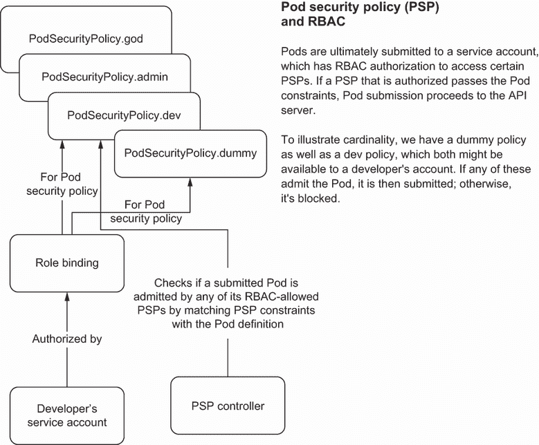

# 13 容器和 Pod 安全性

本章涵盖

+   检查安全基础知识

+   探索容器安全最佳实践

+   使用安全上下文和资源限制约束 Pod

如果我们试图在安全的建筑中保护我们的计算机，将其锁在受保护的保险库中，放在法拉第笼内，使用生物识别登录，不连接到互联网……，将这些预防措施加起来，它们仍然不足以确保我们的计算机真正安全。作为 Kubernetes 实践者，我们需要根据我们的业务需求做出合理的安全决策。如果我们把所有的 Kubernetes 集群锁在法拉第笼中，断开与互联网的连接，我们将使我们的集群无法使用。但如果我们不关注安全，就会让像比特币矿工这样的人随意进入并入侵我们的集群。

随着 Kubernetes 的成熟和更广泛的应用，Kubernetes 中的常见漏洞和暴露（CVE）变得频繁发生。以下是关于安全性的思考方式：你的系统被黑客攻击的风险！当你被黑客攻击时，需要问的问题是

+   他们可以获取什么？

+   他们能做什么？

+   他们可以获取哪些数据？

安全性是一系列权衡，通常是艰难的决定。通过使用 Kubernetes，我们引入了一个系统，当人们意识到它可以通过一个 API 调用创建一个面向互联网的负载均衡器时，可能会感到害怕。但通过利用简单和基本的做法，我们可以减少安全风险的影响。诚然，大多数公司并没有为基本的安全措施做规划，例如对容器进行安全更新。

安全性是一种平衡行为；它可能会减缓业务发展，但企业只有在全速运转时才能繁荣。安全性固然重要，但过度追求安全性可能会导致资金浪费，并减缓业务和组织的发展。我们必须在可以自动化的实际安全措施和开始深入探索时做出判断。

你不需要自己构建所有的安全预防措施。有一套不断增长的工具可以跟踪 Kubernetes 内运行的容器，并确定可能存在的安全漏洞；例如，Open Policy Agent（OPA），我们将在第十四章中介绍。然而，最终，互联网上的计算机仅仅是*不安全*的。

正如我们在本书第一章中讨论的那样，DevOps 和 Kubernetes 都是建立在自动化基础上的。在本章中，我们将讨论您需要做什么来自动化 Kubernetes 的安全性。首先，以下部分将介绍一些安全概念，以便我们进入正确的思维模式。

注意：尽管以下两章可能是一整本书的内容，但我们的目的是使这些章节成为一本实用的手册，而不是一本权威指南。当你理解了这本手册后，你就可以更深入地了解每个主题。

## 13.1 爆炸半径

当某物爆炸时，爆炸半径是从爆炸中心到爆炸边缘的距离。现在，这种爆炸是如何应用到计算机安全（compusec 或网络安全）中的呢？当计算机系统被入侵时，会发生爆炸，通常不止一种方式。假设你在多个节点上运行多个容器，每个容器都有多个安全组件。爆炸会蔓延多远？

+   被入侵的 Pod 能否访问另一个 Pod？

+   被入侵的 Pod 能否用来创建另一个 Pod？

+   被入侵的 Pod 能否用来控制一个节点？

+   你能从 node01 跳转到 node02 吗？

+   你能从 Pod 访问外部数据库吗？

+   你能进入，比如说，一个 LDAP 系统吗？

+   黑客能否进入你的源代码控制或机密信息？

将安全侵入视为大爆炸的零点。爆炸或侵入蔓延的距离就是爆炸半径。然而，通过实施简单的安全标准，例如不作为 root 运行进程或使用 RBAC，我们可以在东西爆炸时限制其距离。

### 13.1.1 漏洞

一个 *漏洞* 是指某处存在弱点。（大坝上有一个裂缝。）在安全方面，我们总是试图防止漏洞（或大坝上的裂缝）而不是修补它。接下来的两章将安排从内到外覆盖 Kubernetes 的漏洞，以及我们如何加强安全。

### 13.1.2 侵入

一个 *侵入* 是我们都不希望的事情！它是一种入侵，攻击者利用漏洞并进入我们的系统。例如，一个恶意行为者（入侵者）控制了一个 Pod，并有权访问`curl`或`wget`。然后入侵者创建了一个以 root 身份在主机网络上运行的另一个 Pod。现在你有一个完全被入侵的集群。

## 13.2 容器安全

在 Kubernetes 安全方面，最明显的地方是从容器级别开始，因为毕竟，每个 Kubernetes 集群几乎都保证在几个容器中运行。尽管你可以保护集群，但你的前线是你的容器。记住，运行在容器内的自定义软件容易受到攻击是明智的。

当你运行一个应用程序并将其向世界开放时，人们可能是恶意的。例如，有一次我们注意到某个节点的 CPU 级别变得疯狂。一位开发者部署了一个有已知错误的应用程序！比特币矿工利用这个 Pod 进行挖矿，这一切都在几个小时内发生。永远不要忘记，尽管你可以使你的容器尽可能安全，但如果你运行一个有关键问题的软件应用程序，你将使自己容易受到攻击。黑客找到集群可能只需要几分钟，将比特币矿工放入运行有已知 CVE 的软件容器中可能只需要几秒钟。考虑到这一点，让我们概述一些保护容器的最佳实践。

### 13.2.1 计划更新容器和自定义软件

更新是我们一直看到公司**没有**做的事情。坦白说，这很可怕，比你看过的最糟糕的恐怖电影还要可怕。大公司泄露数据，因为他们没有更新软件依赖项，甚至没有彻底更新基础镜像。

最好在软件管道中早期就构建更新能力，以防出现安全漏洞。如果你遇到阻力，你可以温和地提醒推动者与泄露客户信息的公司相关的负面宣传。此外，泄露通常会使公司损失数百万美元。

当发布新的基础容器版本和新 CVE 时更新你的容器。CVE 计划包含了当这些问题被发现时创建的网络安全漏洞通知。你可以在 [`cve.mitre.org/`](https://cve.mitre.org/) 上审查这些问题。此外，计划更新自定义软件依赖项。你需要不仅更新围绕软件的容器，还要更新软件本身。

### 13.2.2 容器筛选

容器筛选是一个报告你的容器是否存在漏洞的系统（例如，想想 2014 年 OpenSSL 包含 Heartbleed 漏洞的情况）。筛选你的镜像的系统不是锦上添花，而是当今环境中的**必须**。你真的需要筛选容器中的软件漏洞并更新镜像。

软件包括已安装的内容，包括 OpenSSL 和 Bash。不仅必须更新软件，还必须使用 `FROM` 元素定义基础镜像。这是一项大量工作。我们个人知道这需要多少时间和金钱。设置 CI/CD 和其他工具以快速构建、测试和部署你的容器。许多商业容器注册库包含筛选你的容器的系统，但诚然，如果没有人查看那些通知，那么它们就会被忽略。建立一个系统来监视那些通知，或者获取可以帮助你完成这项工作的商业软件。

### 13.2.3 容器用户——不要以 root 身份运行

不要在容器内部以 root 用户身份运行。有一种“弹出外壳”的概念，这意味着你逃离了容器的 Linux 命名空间，并可以访问命令行外壳。从外壳中，你可以访问 API 服务器和可能的主机。如果你可以访问外壳，你可能拥有从互联网下载脚本并运行的权限。以 root 用户身份运行会给你在容器中相同的 root 权限，如果弹出容器，可能还有主机系统的 root 权限。

当你定义一个容器并使用 `adduser` 创建特定的用户和组时，你可以定义一个新的用户。然后，以该用户身份运行你的应用程序。以下是一个来自 Debian 容器的示例，展示了如何创建用户：

```
$ adduser --disabled-password --no-create-home --gecos '' \
--disabled-login my-app-user
```

现在，你可以使用该用户运行你的应用程序：

```
$ su my-app-user -c my-application
```

在容器内以 root 用户身份运行具有与在主机系统上作为 root 用户操作相同的许多后果：`root` 就是 `root`。此外，在 Pod 清单中，您可以定义 `runAsUser` 和 `fsGroup`。我们稍后会介绍这两个概念。

### 13.2.4 使用最小的容器

使用一个专为作为容器运行而构建的轻量级容器操作系统是一个好主意。这限制了容器中的二进制文件数量，从而限制了您的漏洞。像 Google 的 distroless 这样的项目提供了针对特定语言的轻量级容器选项。

将您的运行时容器中的内容限制为仅适用于您的应用程序所必需的内容是 Google 和其他已经使用容器在生产环境中运行多年的技术巨头采用的最佳实践。这提高了扫描器（例如，CVE）的信号与噪声比，并将建立来源的负担仅限于您所需的内容。

—Open Web Application Foundation 的安全备忘录 ([`mng.bz/g42v`](http://mng.bz/g42v))

Google 的 distroless 项目包括一个基础层，以及用于运行不同编程语言的容器，例如 Java。以下是一个使用 golang 容器构建我们的软件的 Go 应用程序示例，随后是一个 distroless 容器：

```
# Start by building the application.
FROM golang:1.17 as build

WORKDIR /go/src/app
COPY . .

RUN go get -d -v ./...
RUN go install -v ./...

# Now copy it into our base image.
FROM gcr.io/distroless/base
COPY --from=build /go/bin/app /
CMD ["/app"]
```

然后还有额外的软件。比如说，在创建容器的过程中安装 cURL 来下载二进制文件。cURL 需要被移除。Alpine 发行版通过自动移除构建过程中使用的组件优雅地处理这个问题，但 Debian 和其他发行版则不行。如果您的应用程序不需要它，就不要安装它。安装的越多，可能存在的漏洞数量就越多。即使是示例也遗漏了创建一个新用户来运行二进制文件。只有在必要时才以 root 身份运行。

### 13.2.5 容器来源

运行 Kubernetes 集群时的一个关键安全问题是了解每个 Pod 内运行的容器镜像，并能够追溯其来源。建立 *容器来源* 意味着能够将容器的来源追溯到可信赖的起点，并确保您的组织在创建（容器）工件时遵循期望的过程。

不要从您公司不控制的容器注册库部署容器。开源项目很棒，但请在本地构建容器后将其构建和推送到您的仓库中。容器标签不是不可变的；只有 SHA 值是不可变的。没有任何保证说容器实际上就是您认为的那个容器。容器来源允许用户或 Kubernetes 集群确保部署的容器可以被识别，从而保证来源的可靠性。

Kubernetes 团队为 Kubernetes 集群内部运行的所有容器构建了一个镜像基础层。这样做使得团队能够知道该镜像有一个安全的来源，是一致的且经过验证的，并且具有特定的来源。安全的来源还意味着所有镜像都来自已知来源。一致性和验证确保我们在构建镜像时完成特定的步骤，并提供了一个更密封的环境。最后，来源保证了容器的来源是已知的，并且在运行之前不会发生变化。

### 13.2.6 容器代码检查工具

自动化是减少工作负载和提高系统性能的关键。诚实地讲，安全性是一项大量工作，但您可以使用 hadolint 这样的代码检查工具来查找可能导致安全漏洞的容器和自定义软件中的常见问题。以下是我们过去使用的一些代码检查工具的简要列表：

+   Dockerfile 的 hadolint ([`github.com/hadolint/hadolint`](https://github.com/hadolint/hadolint))

+   `go vet` 命令 ([`golang.org/cmd/vet/`](https://golang.org/cmd/vet/))

+   Flake8 for Python ([`flake8.pycqa.org/en/latest/`](http://flake8.pycqa.org/en/latest/))

+   ShellCheck for Bash ([`www.shellcheck.net/`](https://www.shellcheck.net/))

现在您已经控制了容器安全性，让我们看看下一个级别——Pod。

## 13.3 Pod 安全性

Kubernetes 允许我们定义 Pod 中用户和 Pod 外 Linux 命名空间（例如，Pod 是否可以在节点上挂载卷？）的权限。Pod 被破坏可能会破坏整个集群！可以使用 `nsenter` 命令进入 root 进程 (/proc/1)，创建一个 shell，并在实际运行被破坏 Pod 的节点上以 root 身份执行。Kubernetes API 允许定义 Pod 权限，并进一步保护 Pod、节点和整个集群。

注意：一些 Kubernetes 发行版，例如 OpenShift，添加了更多的安全层，您可能需要添加更多配置才能使用如安全上下文这样的 API 配置。

### 13.3.1 安全上下文

记得我们提到过您不应该使用 root 用户运行容器吗？Kubernetes 也允许用户为 Pod 定义一个用户 ID。在 Pod 定义中，您可以指定三个 ID：

+   `runAsUser`—启动进程所使用的用户 ID

+   `runAsGroup`—用于进程用户的组

+   `fsGroup`—用于挂载任何卷和 Pod 进程创建的所有文件的第二个组 ID

如果您的容器以 root 身份运行，您可以强制它以不同的用户 ID 运行。但，再次强调，您不应该有以 root 身份运行的容器，因为您可能会让用户意外遗漏 `securityContext` 定义。以下 YAML 片段包含了一个具有安全上下文的 Pod：

```
apiVersion: v1
kind: Pod
metadata:
  name: sc-Pod
spec:
  securityContext:
    runAsUser: 3042                             ❶
    runAsGroup: 4042                            ❷
    fsGroup: 5042                               ❸
    fsGroupChangePolicy: "OnRootMismatch"       ❹
  volumes:
  - name: sc-vol
     emptyDir: {}
  containers:
  - name: sc-container
    image: my-container                         ❺
    volumeMounts:
    - name: sc-vol
      mountPath: /data/foo
```

❶ 当 Pod 启动时，NGINX 以用户 ID 3042 运行。

❷ 用户 ID 3042 属于组 4042。

❸ 如果 NGINX 进程写入任何文件，它们将以组 ID 5042 写入。

❹ 在将卷挂载到 Pod 之前更改卷的所有权

❺ 一个挂载点

让我们通过使用`kind`集群来了解这个过程。首先，启动你的集群：

```
$ kind create cluster
```

接下来，使用默认容器创建 NGINX 部署：

```
$ kubectl run nginx --image=nginx
```

你现在有一个正在运行的 NGINX Pod。接下来，`exec`进入运行`kind`集群的 Docker 容器：

```
$ docker exec -it a62afaadc010 /bin/bash
root@kind-control-plane:/# ps a | grep nginx
2475  0:00 nginx: master process
➥ nginx -g daemon off;                    ❶
2512  22:36   0:00 nginx: worker process
```

❶ NGINX 的进程是以 root 身份启动的。

我们可以看到 NGINX 进程是以 root 身份运行的，是的，这不是最安全的。为了防止这种情况，清理环境并启动另一个 Pod。下一个命令删除了 NGINX Pod：

```
$ kubectl delete po nginx
```

现在，使用以下命令创建具有安全上下文的 Pod：

```
$ cat <<EOF | kubectl apply -f -
apiVersion: v1
kind: Pod
metadata:
  name: sc-Pod
spec:
  securityContext:
    runAsUser: 3042
    runAsGroup: 4042
    fsGroup: 5042
  volumes:
  - name: sc-vol
    emptyDir: {}
  containers:
  - name: sc-container
    image: nginx
    volumeMounts:
    - name: sc-vol
      mountPath: /usr/share/nginx/html/
EOF
```

猜猜会发生什么？Pod 启动失败。查看日志：

```
$ kubectl logs sc-Pod
```

此命令输出

```
/docker-entrypoint.sh: /docker-entrypoint.d/ is not empty, will attempt to
➥ perform configuration
/docker-entrypoint.sh: Looking for shell scripts in /docker-entrypoint.d/
/docker-entrypoint.sh: Launching /docker-entrypoint.d/
➥ 10-listen-on-ipv6-by-default.sh
10-listen-on-ipv6-by-default.sh: error: can not modify /etc/nginx/conf.d/
➥ default.conf (read-only file system?)
/docker-entrypoint.sh: Launching /docker-entrypoint.d/
➥ 20-envsubst-on-templates.sh
/docker-entrypoint.sh: Configuration complete; ready for start up
2020/11/08 22:44:59 [warn] 1#1: the "user" directive makes sense only if
➥ the master process runs with super-user privileges, ignored
➥ in /etc/nginx/nginx.conf:2
nginx: [warn] the "user" directive makes sense only if the master process
➥ runs with super-user privileges, ignored in
➥ /etc/nginx/nginx.conf:2
2020/11/08 22:44:59 [emerg] 1#1: mkdir() "/var/cache/nginx/client_temp"
➥ failed (13: Permission denied)
nginx: [emerg] mkdir() "/var/cache/nginx/client_temp" failed
➥ (13: Permission denied)
```

这里的问题是什么？为什么它不起作用？问题是 NGINX 需要特定的配置才能以非 root 用户身份运行，而许多应用程序需要配置才能以 root 身份运行。对于这个特定的情况，请查看[`mng.bz/ra4Z`](http://mng.bz/ra4Z)或[`mng.bz/Vl4O`](http://mng.bz/Vl4O)以获取更多信息。

吸取的教训是：不要以 root 身份运行你的容器，并使用安全上下文来确保它们不以 root 身份运行。

提示：SSL 证书很麻烦，使用这些证书的代码可能同样困难。你经常会遇到代码检查证书的用户是否与进程 ID 用户匹配的问题。当你将 TLS 证书作为 Secret 挂载时，这不会使用`fsGroup`，这就会造成混乱。Kubernetes 的一个当前限制是当挂载的 Secret 与`fsGroup`不匹配时。

### 13.3.2 提升的权限和能力

在 Linux 安全模型中，传统的 UNIX 权限分为两个类别，描述了一个进程——特权和非特权：

+   一个*特权用户*是 root 用户或其有效用户 ID 为零的用户，因为我们可以使用`sudo`来充当 root。

+   一个*无特权用户*是一个 ID 不是零的用户。

当你是一个特权用户时，Linux 内核会绕过所有 Linux 权限检查。这就是为什么你可以作为 root 运行令人恐惧的命令`rm -rf /`。现在大多数发行版至少会询问你是否要删除整个文件系统。当你拥有无特权访问权限时，所有安全权限检查实际上都是基于进程 ID 的。

当定义一个无特权的用户并给他们一个 ID 时，你能够为用户提供*能力*。这些能力赋予无特权用户执行某些操作的权限，例如更改文件 UID 和 GID。所有这些能力名称都以`CAP`为前缀；我们刚才提到的能力是`CAP_CHOWN`。这在 Linux 中是很好的，但为什么我们关心呢？

记得我们说过不要以 root 用户运行吗？假设我们有一个 Pod，它声称需要做出节点网络 iptables 更改或管理 BPF（伯克利包过滤器），例如一个 CNI 提供者，而我们不想以 root 用户运行这个 Pod。Kubernetes 允许你设置 Pod 的安全上下文，定义用户 ID，然后添加特定能力。以下是一个 YAML 示例：

```
apiVersion: v1
kind: Pod
metadata:
  name: net-cap
spec:
  containers:
  - name: net-cap
    image: busybox
    securityContext:
      runAsUser: 3042
      runAsGroup: 4042
      fsGroup: 5042
      capabilities:
        add: ["NET_ADMIN", "BPF"]      ❶
```

❶ 给用户赋予 CAP_NET_ADMIN 和 CAT_BPF 能力

你会注意到我们移除了`CAP`前缀。`CAP_NET_ADMIN`变成了`NET_ADMIN`。我们可以使用 CAP 权限做很多有趣的事情，包括允许 Pod 使用`CAP_SYS_BOOT`重启节点。此外，在 CAP 权限中存在一个子集，称为`CAP_SYS`。这些权限非常强大。例如，`CAP_SYS_ADMIN`基本上设置了 root 权限。

我们有 DaemonSets、Pods 和 Deployments 来管理我们的 Kubernetes 集群，设置 iptables 规则，引导 Kubernetes 组件等等。有如此多的用例。再次强调，当你能的时候，不要以 root 用户运行，而是通过 CAP 权限给予尽可能少的权限。诚然，这并不像我们希望的那样精细。例如，没有挂载文件系统的单个权限。在这种情况下，你应该使用 CAP_SYS_ADMIN。

### 13.3.3 Pod 安全策略（PSP）

注意：截至 Kubernetes v1.21，PSP 已被弃用，并计划在 v1.25 版本中删除，它们正被 Pod 安全准入（见[`mng.bz/5QQ4`](http://mng.bz/5QQ4)）所取代。我们包括这一部分是因为很多人之前使用过 PSP，在撰写本书时，Pod 安全标准还处于 Beta 测试阶段。

为了强制创建适当的 Pod 安全上下文，你可以定义一个 Pod 安全策略（PSP），该策略强制执行定义的安全上下文设置。像所有其他 Kubernetes 结构一样，PodSecurityPolicy 是一个 API 对象：

```
apiVersion: policy/v1beta1
kind: PodSecurityPolicy
metadata:
  name: example
spec:
  privileged: false  # Don't allow privileged Pods!
  # The rest fills in some required fields.
  seLinux:
    rule: RunAsAny
  supplementalGroups:
    rule: RunAsAny
  runAsUser:
    rule: RunAsAny
  fsGroup:
    rule: RunAsAny
  volumes:
  - '*'
```

这个代码片段设置了关于 SELinux、用户等方面的各种任意规则。请注意，你不能简单地使每个容器都安全。如果你查看 hyperkube、网络、存储插件等，你会看到这些是系统级管理基础设施工具，它们执行特权操作（例如，设置 iptables 规则），不能以非特权方式运行。现在，当我们启用 PSP 时，你会发现许多 Pod 可能会失败，并且这可能在不可预测的时间发生。这是因为 PSP 是由准入控制器在准入时实现的。让我们看看 Kubernetes 集群中容器安全审计的生命周期：

+   第 0 天——Pod 可以做任何事情，包括以 root 用户运行和在主机上创建文件。

+   第 1 天——开发者基于第 0 天的功能构建容器。

+   第 2 天——安全审计员拿到了这本书。

+   第 3 天——RBAC 被添加到集群中。现在 API 调用被限制在管理账户。

+   第 4 天——PSP 被添加到你的集群中。

+   第 5 天——一半的节点因维护而关闭。

+   第 6 天——几个 Pod 没有健康地重启。

第 6 天在 PSP 添加后需要一段时间的原因是，一旦 Pod 死亡，其 PSP 将在生产中进行测试。回顾一下容器的工作方式，一个正在运行的容器已经有一个 PID，已经运行了它需要的任何命令，并且与主机网络设备相关联。因此，在容器运行时更改策略并不能安全地消除威胁向量，反而会阻止它们在新位置被引入。图 9.1 显示了 Kubernetes 的 PSP 过程。



图 13.1 Pod 安全策略（PSP）

这是一个重要的概念，你应该在整个本章的其余部分都记住。你实施的每一项策略可能并不是在纠正过去的错误。暴露的 IP 地址、受损的 SSL 证书和开放的 NFS 挂载在 Kubernetes 数据中心中仍然与在 vSphere 数据中心中一样相关，而且由于你将应用程序容器化，安全规则并没有显著变得更容易实施。

### 13.3.4 不要自动挂载服务账户令牌

默认情况下，服务账户令牌会自动挂载到 Pod 上。该令牌用于在 Pod 的集群中与 API 服务器进行身份验证。是的，这是不好的！坏到足以让一位作者亲自使用粗话来描述他的厌恶。

这个 API 令牌为什么存在呢？有时 Pod 需要访问 API 服务器；例如，维护数据库的操作员可能需要。这是一个有效的用例。但在现实中，99.999%运行自定义软件的 Pod 不需要访问 API 服务器。因此，你应该禁用默认服务账户令牌的自动挂载。这只需要在 Pod YAML 定义中添加一行即可：

```
apiVersion: v1
kind: Pod
metadata:
  name: no-sa
spec:
  automountServiceAccountToken: false     ❶
```

❶ 禁用自动挂载

另一种解决方法是关闭所有 Pod 的默认服务账户自动挂载。服务账户（我们稍后会更多地讨论）还有一个字段`automountServiceAccountToken`。你可以设置任何服务账户在该字段中默认不挂载。

### 13.3.5 类似 root 的 Pod

我们已经涵盖了所有的配置，这就像在 Pod 和具有特权的用户、无特权的用户，或者具有某些能力的无特权的用户之间进行平衡。但为什么是这样呢？为什么我们不直接以无特权的用户运行所有的 Pod 呢？因为许多 Kubernetes 组件需要作为系统管理员来操作。

许多 Kubernetes 组件以 root 身份运行，这些 Pod 大多属于网络类别。kubelet 以 root 身份运行，但很少在 Pod 内部运行。在每个节点上，我们都有 CNI Pod 来配置集群的网络，这些 Pod 需要网络能力权限。尽管我们无法避免某些安全漏洞，但你可以通过类似 root 的 Pod 来降低风险，包括操作员：

+   通过将它们放入`kube-system`或其他命名空间来限制对这些 Pod 的访问。

+   给予它们尽可能少的类似 root 的权限。

+   监控它们。

### 13.3.6 安全外围

Kubernetes 支持三个其他级别的 Pod 安全，这些安全级别通过模块或其他内置的内核功能利用 Linux 内核功能。这些包括

+   *AppArmor*—在 Linux 内核模块下运行的配置文件提供进程级别的控制。

+   *seccomp*—通过 Linux 内核中包含的功能，确保进程只能执行定义的安全调用，否则进程会被 SIGKILL 终止。

+   *SELinux*—安全增强型 Linux，另一个 Linux 内核模块，提供了包括强制访问控制在内的安全策略。

我们将简要提及这些功能，但不会深入探讨。

如果你是一家 RHEL 商店，那么运行 SELinux 是可以理解的，但诚实地讲，这还是让一位作者头疼。如果你运行的是一个有维护的 AppArmor 配置文件的流行开源数据库或软件组件，那么使用该配置文件可能是有意义的。seccomp 功能非常强大，但维护它需要大量工作。诚实地讲，AppArmor 配置文件和 seccomp 都是复杂的，而复杂性往往会导致脆弱的安全。

总是有一些用例需要另一个级别的进程安全，但就像大多数事情一样，我们试图遵循一些指导原则，主要是：KISS（保持简单，傻瓜），递减回报定律，以及 80/20 规则（在你开始实施这些措施之前，先完成 80%的安全工作）。

## 摘要

+   如果我们没有关注安全，就会让人们随意进入并入侵我们的集群。安全是一系列充满艰难决策的权衡，但通过利用简单和基本的做法，我们可以减少安全风险的影响。

+   你不需要自己实现所有的安全预防措施。有一套不断增长的工具可以跟踪容器并确定可能存在的安全漏洞。

+   Kubernetes 安全的最明显起点是在容器级别。容器来源允许你追踪容器的来源到一个可信的起点。

+   不要以 root 用户运行你的容器，尤其是如果你的环境使用的是**不是**由你的组织构建的容器。

+   要找到可能导致安全漏洞的容器常见问题，运行一个 linter，如 hadolint。

+   如果你的应用程序不需要它，不要安装额外的软件。安装的越多，你可能存在的漏洞数量就越多。

+   为了确保单个 Pod 的安全，你应该禁用默认服务账户令牌的自动挂载。或者，你也可以关闭所有 Pod 的默认服务账户自动挂载。

+   通过`CAP`权限给进程尽可能少的权限。

+   DevOps 建立在自动化之上，Kubernetes 也是如此，安全自动化是减少工作负载和改进系统的关键。

+   更新你的容器和软件依赖。
