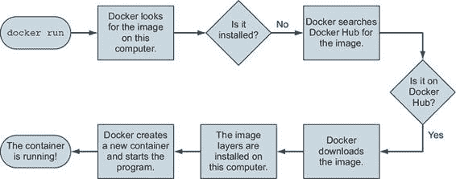
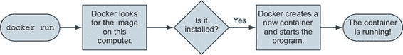
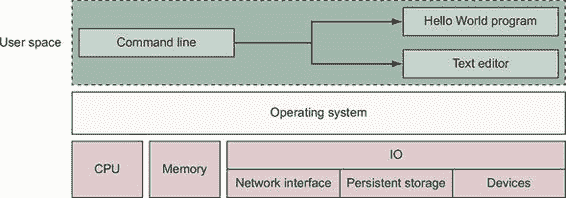
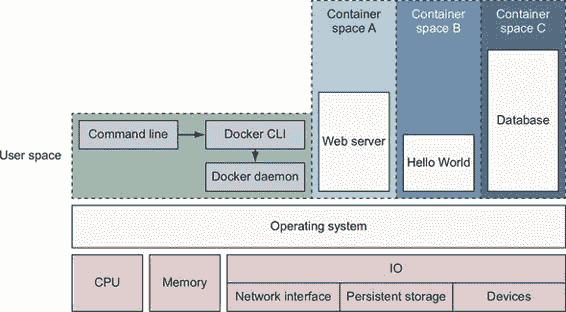
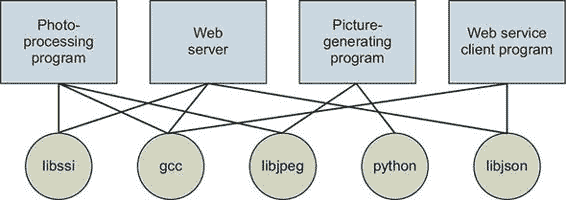
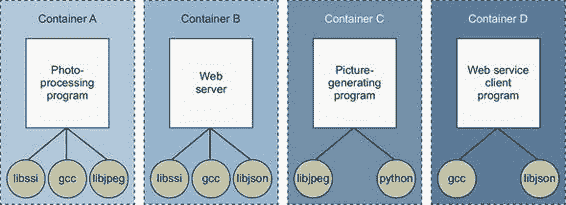
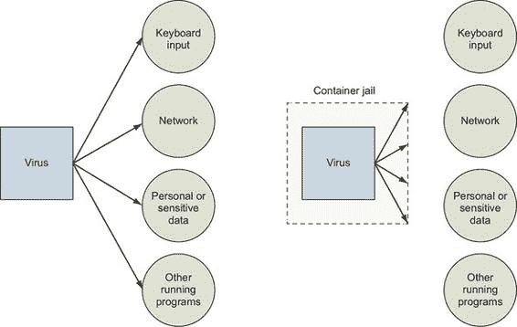

> 第一章。欢迎使用 Docker
> 
> 本章涵盖

+   Docker 是什么

+   示例：“Hello, World”

+   容器简介

+   Docker 如何解决大多数人容忍的软件问题

+   何时、何地以及为什么应该使用 Docker

> 最佳实践是对你的产品或系统的一种可选投资，它应该在将来产生更好的结果。最佳实践可以增强安全性、防止冲突、提高可维护性或延长使用寿命。最佳实践通常需要倡导者，因为证明即时成本是困难的。特别是在系统或产品的未来不确定时更是如此。Docker 是一种工具，它使采用软件打包、分发和利用最佳实践变得既便宜又合理。它是通过提供对进程容器的完整愿景以及构建和使用它们的简单工具来做到这一点的。
> 
> 如果你所在的团队运营具有动态扩展需求的软件服务，使用 Docker 部署软件可以帮助减少对客户的影响。容器启动更快，比虚拟机消耗的资源更少。
> 
> 使用持续集成和持续部署技术的团队，如果使用 Docker，可以构建更具有表达力的管道并创建更健壮的功能测试环境。正在测试的容器包含将进入生产的相同软件。结果是更高的生产变更信心，更紧密的生产变更控制，以及更快的迭代。
> 
> 如果你的团队使用 Docker 来模拟本地开发环境，你会减少成员的入职时间并消除那些减慢你速度的不一致性。这些相同的开发环境可以与软件一起进行版本控制，并随着软件需求的变化而更新。
> 
> 软件作者通常知道如何使用合理的默认值和必需依赖项安装和配置他们的软件。如果你编写软件，使用 Docker 分发该软件将使你的用户更容易安装和运行它。他们可以利用你包含的默认配置和辅助材料。如果你使用 Docker，你可以将你的产品“安装指南”简化为一条命令和一个可携带的依赖项。
> 
> 虽然软件作者理解依赖关系、安装和打包，但理解软件将运行的系统的系统管理员才真正了解这些系统。Docker 提供了一种在容器中运行软件的表达性语言。这种语言允许系统管理员注入特定环境的配置并严格控制对系统资源的访问。这种相同的语言，结合内置的包管理、工具和分发基础设施，使得部署声明性、可重复和可信。它促进了可丢弃的系统范式、持久状态隔离以及其他有助于系统管理员专注于更高价值活动的最佳实践。
> 
> Docker 于 2013 年 3 月推出，与你的操作系统协作来打包、运输和运行软件。你可以把 Docker 视为一个软件物流提供商，它将为你节省时间，让你专注于核心能力。你可以使用 Docker 与网络应用程序（如 Web 服务器、数据库和邮件服务器）以及终端应用程序（包括文本编辑器、编译器、网络分析工具和脚本）一起使用；在某些情况下，它甚至用于运行 GUI 应用程序，如 Web 浏览器和生产力软件。
> 
> Docker 在大多数系统上运行 Linux 软件。Docker for Mac 和 Docker for Windows 与常见的虚拟机（VM）技术集成，以在 Windows 和 macOS 上创建可移植性。但 Docker 也可以在现代 Windows 服务器机器上运行本机 Windows 应用程序。
> 
> Docker 不是一个编程语言，也不是构建软件的框架。Docker 是一个帮助解决常见问题（如安装、删除、升级、分发、信任和运行软件）的工具。它是开放源代码的 Linux 软件，这意味着任何人都可以为其做出贡献，并且它已经从各种观点中受益。公司赞助开源项目的发展是很常见的。在这种情况下，Docker Inc. 是主要赞助商。你可以在 [`docker.com/company/`](https://docker.com/company/) 上了解更多关于 Docker Inc. 的信息。
> 
> 1.1\. 什么是 Docker？
> 
> 如果你正在阅读这本书，你可能已经听说过 Docker。Docker 是一个用于构建、运输和运行程序的开放源代码项目。它是一个命令行程序，一个后台进程，以及一组远程服务，这些服务采用物流方法来解决常见的软件问题，并简化你安装、运行、发布和删除软件的体验。它是通过使用名为容器的一种操作系统技术来实现的。
> 
> 1.1.1\. “Hello, World”
> 
> 通过一个具体的例子来学习这个主题会更容易。按照传统，我们将使用 “Hello, World。” 在开始之前，请下载并安装适用于你系统的 Docker。每个可用的系统的详细说明都保存在 [`docs.docker.com/install/`](https://docs.docker.com/install/) 上。一旦你安装了 Docker 并有一个活跃的互联网连接，前往你的命令提示符并输入以下内容：
> 
> > `docker run dockerinaction/hello_world`
> > 
> 在这样做之后，Docker 将会启动。它将开始下载各种组件，最终打印出 `"hello world"`。如果你再次运行它，它只会打印出 `"hello world"`。在这个例子中，有几个事情正在发生，而这个命令本身有几个不同的部分。
> 
> 首先，你使用 `docker run` 命令。这告诉 Docker 你想要触发一个序列（如图 1.1 所示），该序列会在容器内安装并运行一个程序。
> 
> 图 1.1\. 运行 `docker run` 后会发生什么
> 
> 
> 
> 第二部分指定了 Docker 在容器中要运行的程序。在这个例子中，这个程序是 `dockerinaction/hello_world`。这被称为镜像（或仓库）名称。目前，你可以将镜像名称视为你想要安装或运行的程序的名称。镜像本身是一组文件和元数据。这些元数据包括要执行的特定程序和其他相关配置细节。

|    |
| --- |

> 注意
> 
> 这个仓库以及几个其他仓库是专门为支持本书中的示例而创建的。到 第二部分 结束时，你应该能够舒适地检查这些开源示例。

|    |
| --- |

> 第一次运行此命令时，Docker 需要确定 `docker-inaction/hello_world` 镜像是否已经被下载。如果它无法在你的电脑上找到它（因为你第一次使用 Docker），Docker 会调用 Docker Hub。Docker Hub 是 Docker Inc. 提供的一个公共注册表。Docker Hub 回应运行在你电脑上的 Docker，指示镜像（`docker-inaction/hello_world`）的位置，然后 Docker 开始下载。
> 
> 一旦镜像安装完成，Docker 将创建一个新的容器并运行一个单独的命令。在这种情况下，命令很简单：
> 
> > `echo "hello world"`
> > 
> 在 `echo` 命令将 `"hello world"` 打印到终端后，程序退出，容器被标记为停止。理解到容器的运行状态直接与容器内单个运行程序的状态相关联。如果一个程序正在运行，容器也在运行。如果一个程序停止，容器也会停止。重新启动容器将再次运行程序。
> 
> 当你第二次执行命令时，Docker 将再次检查 `docker-inaction/hello_world` 是否已安装。这次它将在本地机器上找到镜像，并可以立即构建另一个容器并执行它。我们想强调一个重要细节。当你第二次使用 `docker run` 时，它会从相同的仓库创建第二个容器（图 1.2 说明了这一点）。这意味着如果你反复使用 `docker run` 并创建了一堆容器，你需要获取你创建的容器列表，并在某个时候可能需要销毁它们。与容器一起工作就像创建它们一样简单，这两个主题都在 第二章 中进行了介绍。
> 
> 图 1.2\. 第二次运行 `docker run`。因为镜像已经安装，Docker 可以立即启动新的容器。
> 
> 
> 
> 恭喜！您现在是一名官方的 Docker 用户。使用 Docker 非常简单。但它可以测试您对正在运行的应用程序的理解。考虑在一个容器中运行一个 Web 应用程序。如果您不知道它是一个长时间运行的应用程序，它监听 TCP 端口 80 上的传入网络通信，您可能不知道应该使用什么 Docker 命令来启动该容器。这些是人们在迁移到容器时遇到的问题。
> 
> 尽管这本书不能针对您特定的应用需求进行评论，但它确实确定了常见用例，并帮助教授大多数相关的 Docker 使用模式。到第一部分结束时，您应该对使用 Docker 的容器有很强的掌握。
> 
> 1.1.2\. 容器
> 
> 从历史上看，UNIX 风格的操作系统使用术语“监狱”来描述一个修改后的运行时环境，该环境限制了被监禁的程序可以访问的资源范围。监狱功能可以追溯到 1979 年，并且自那时以来一直在发展。2005 年，随着 Sun 的 Solaris 10 和 Solaris 容器的发布，容器已成为此类运行时环境的首选术语。目标已从限制文件系统范围扩展到隔离进程，除了明确允许的资源外，从所有资源中隔离进程。
> 
> 使用容器已经是一项最佳实践很长时间了。但手动构建容器可能具有挑战性，并且很容易出错。这个挑战使一些人望而却步。其他人使用配置错误的容器，却陷入了一种虚假的安全感。这是一个亟待解决的问题，而 Docker 帮助解决了这个问题。任何使用 Docker 运行的软件都是在容器内运行的。Docker 使用现有的容器引擎来提供根据最佳实践构建的一致容器。这使得每个人都能获得更强的安全性。
> 
> 使用 Docker，用户可以以更低的成本获得容器。在第 1.1.1 节中运行示例使用了一个容器，并且不需要任何特殊知识。随着 Docker 及其容器引擎的改进，您将获得最新和最强大的隔离功能。您不必跟上快速发展和高度技术化的构建强大容器的世界，而是可以让 Docker 为您处理大部分工作。
> 
> 1.1.3\. 容器不是虚拟化
> 
> 在这个云原生时代，人们倾向于将虚拟机视为部署单元，其中部署单个进程意味着创建一个整个网络连接的虚拟机。虚拟机提供虚拟硬件（或可以安装操作系统和其他程序的硬件）。它们创建需要很长时间（通常是几分钟），并且由于它们除了您想要使用的软件外还运行整个操作系统，因此需要大量的资源开销。虚拟机在一切运行正常后可以表现出最佳性能，但启动延迟使它们不适合即时或反应式部署场景。
> 
> 与虚拟机不同，Docker 容器不使用任何硬件虚拟化。Docker 容器内运行的程序直接与宿主机的 Linux 内核接口。许多程序可以在不运行冗余操作系统或遭受完整引导序列延迟的情况下独立运行。这是一个重要的区别。Docker 不是硬件虚拟化技术。相反，它帮助您使用已经内置到操作系统内核中的容器技术。
> 
> 虚拟机提供硬件抽象，以便您可以在其中运行操作系统。容器是操作系统的一个特性。因此，如果机器运行的是现代 Linux 内核，您始终可以在虚拟机中运行 Docker。对于 Mac 和 Windows 用户，以及几乎所有云计算用户，他们都会在虚拟机中运行 Docker。因此，这些实际上是互补的技术。
> 
> 1.1.4. 在容器中运行软件以实现隔离
> 
> 容器和隔离特性已经存在了几十年。Docker 使用 Linux 命名空间和 cgroups，这些自 2007 年以来一直是 Linux 的一部分。Docker 不提供容器技术，但它特别简化了其使用。为了了解系统上的容器看起来是什么样子，让我们首先建立一个基线。图 1.3 显示了一个在简化的计算机系统架构上运行的基本示例。
> 
> 图 1.3. 一个基本的计算机堆栈运行了从命令行启动的两个程序
> 
> 
> 
> 注意，命令行界面（CLI）运行在所谓的用户空间内存中，就像运行在操作系统之上的其他程序一样。理想情况下，运行在用户空间中的程序不能修改内核空间内存。广义上讲，操作系统是所有用户程序与计算机运行的硬件之间的接口。
> 
> 您可以在图 1.4 中看到，运行 Docker 意味着在用户空间中运行两个程序。第一个是 Docker 引擎。如果安装正确，此进程应始终运行。第二个是 Docker CLI。这是用户与之交互的 Docker 程序。如果您想启动、停止或安装软件，您将通过 Docker 程序发出命令。
> 
> 图 1.4. Docker 在基本的 Linux 计算机系统上运行三个容器
> 
> 
> 
> 图 1.4 也显示了三个正在运行的容器。每个容器都是作为 Docker 引擎的子进程运行的，被容器封装，并且代表进程在其用户空间的独立内存子空间中运行。容器内运行的程序只能访问由容器定义的自己的内存和资源。
> 
> Docker 使用 10 个主要系统特性来构建容器。本书的第一部分使用 Docker 命令来说明如何修改这些特性以满足容器内软件的需求，并适应容器运行的环境。具体特性如下：

+   PID 命名空间— 进程标识符和能力

+   UTS 命名空间— 主机和域名

+   MNT 命名空间— 文件系统访问和结构

+   IPC 命名空间— 通过共享内存的进程通信

+   NET 命名空间— 网络访问和结构

+   USR 命名空间— 用户名和标识符

+   `chroot` 系统调用— 控制文件系统根的位置

+   cgroups— 资源保护

+   CAP 降级— 操作系统功能限制

+   安全模块— 强制访问控制

> Docker 使用这些来在运行时构建容器，但它使用另一套技术来打包和分发容器。
> 
> 1.1.5. 运输集装箱
> 
> 你可以将 Docker 容器想象成一个物理的运输集装箱。它是一个存放并运行应用程序及其所有依赖项（不包括正在运行的操作系统内核）的盒子。正如起重机、卡车、火车和船只可以轻松地与运输集装箱协同工作一样，Docker 也可以轻松地运行、复制和分发容器。Docker 通过包括软件打包和分发的方式，完成了传统集装箱隐喻的完整性。在运输集装箱中起作用的组件被称为镜像。
> 
> 第 1.1.1 节 中的示例使用了一个名为 `dockerinaction/hello_world` 的镜像。这个镜像包含单个文件：一个小型的可执行 Linux 程序。更普遍地说，Docker 镜像是一个捆绑的快照，包含了在容器内运行的程序应该可用的所有文件。你可以从一个镜像创建任意数量的容器。但是当你这样做时，从同一镜像启动的容器不会共享它们文件系统的更改。当你使用 Docker 分发软件时，你分发这些镜像，接收的计算机从它们创建容器。镜像是在 Docker 生态系统中的可运输单元。
> 
> Docker 提供了一套基础设施组件，简化了 Docker 镜像的分发。这些组件是注册表和索引。你可以使用 Docker Inc. 提供的公共基础设施，其他托管公司提供的，或者你自己的注册表和索引。
> 
> 1.2. DOCKER 解决了哪些问题？
> 
> 使用软件是复杂的。在安装之前，你必须考虑你使用的操作系统，软件需要的资源，已经安装的其他软件，以及它依赖的其他软件。你需要决定它应该安装在哪里。然后你需要知道如何安装它。今天安装过程的差异之大令人惊讶。考虑的事项列表很长且不容忍。安装软件至多是不一致和过度复杂的。如果你想要确保几台机器在一段时间内使用一致的软件集合，这个问题只会变得更糟。
> 
> 包管理器如 APT、Homebrew、YUM 和 npm 试图管理这个问题，但其中很少有提供任何程度的隔离。大多数计算机安装并运行了不止一个应用程序。大多数应用程序都依赖于其他软件。当你想用的应用程序不能很好地协同工作时会发生什么？灾难！当应用程序共享依赖项时，事情只会变得更加复杂：

+   如果一个应用程序需要升级依赖项，而另一个不需要，会发生什么？

+   当你移除一个应用程序时会发生什么？它真的消失了？

+   你能移除旧的依赖项吗？

+   你能记得你为安装现在想要移除的软件所做的所有更改吗？

> 事实是，你使用的软件越多，管理起来就越困难。即使你能花时间和精力来弄清楚安装和运行应用程序，你对安全性的信心又能有多大？开源和闭源程序持续发布安全更新，而意识到所有问题往往是无法实现的。你运行的软件越多，它受到攻击的风险就越大。
> 
> 即使是面向企业的服务软件也必须在依赖项中部署。这些项目通常与数百甚至数千个文件和其他程序一起发货并部署到机器上。每个都为冲突、漏洞或许可责任创造了新的机会。
> 
> 所有这些问题都可以通过仔细的核算、资源管理和物流来解决，但这些是平凡且令人不愉快的事情。你最好把时间花在安装、升级或发布你正在尝试使用的软件上。构建 Docker 的人认识到了这一点，多亏了他们的辛勤工作，你几乎可以毫不费力地迅速找到解决方案。
> 
> 很可能，今天大多数人觉得这些问题是可以接受的。也许它们看起来微不足道，因为你已经习惯了它们。在阅读了 Docker 如何使这些问题变得可接近之后，你可能注意到你的观点发生了转变。
> 
> 1.2.1\. 整理
> 
> 没有 Docker，一台计算机最终可能看起来像是一个杂乱无章的抽屉。应用程序有各种各样的依赖项。一些应用程序依赖于特定的系统库来处理像声音、网络、图形等常见事物。其他应用程序依赖于它们所使用的语言的库。一些应用程序依赖于其他应用程序，例如 Java 程序依赖于 Java 虚拟机，或者一个网络应用程序可能依赖于数据库。一个正在运行的程序通常需要独占访问稀缺资源，如网络连接或文件。
> 
> 今天，如果没有 Docker，应用程序会散布在文件系统中，最终形成一个混乱的交互网络。图 1.5 展示了在没有 Docker 的情况下，示例应用程序如何依赖于示例库。
> 
> 图 1.5\. 示例程序的依赖关系
> 
> 
> 
> 相比之下，第 1.1.1 节中的示例自动安装了所需的软件，并且可以使用单个命令可靠地删除该软件。Docker 通过使用容器和镜像将一切隔离来保持事物的有序。
> 
> 图 1.6 说明了这些相同的应用程序及其依赖项在容器内运行的情况。由于链接被断开，每个应用程序都被整洁地包含在内，理解系统成为一个可接近的任务。起初，这似乎会通过创建如 gcc 等常见依赖项的冗余副本来引入存储开销。第三章描述了 Docker 打包系统通常如何减少存储开销。
> 
> 图 1.6. 在容器内运行并复制其依赖项的示例程序
> 
> 
> 
> 1.2.2. 提高可移植性
> 
> 另一个软件问题是，应用程序的依赖项通常包括特定的操作系统。操作系统之间的可移植性是软件用户面临的一个主要问题。尽管 Linux 软件和 macOS 之间可能存在兼容性，但在 Windows 上使用相同的软件可能更困难。这样做可能需要构建整个移植版本的应用程序。即使这样，也只有在 Windows 存在合适的替代依赖项的情况下才可能。这对应用程序的维护者来说是一项重大努力，而且通常会被跳过。不幸的是，对于用户来说，大量强大的软件在他们的系统上使用起来太困难或不可能。
> 
> 目前，Docker 在 Linux 上原生运行，并为 macOS 和 Windows 环境提供了一个单独的虚拟机。这种在 Linux 上的统一意味着在 Docker 容器中运行的软件只需针对一组一致的依赖项编写一次。你可能刚刚在想，“等等，你刚才不是告诉我 Docker 比虚拟机更好吗？”这是正确的，但它们是互补的技术。使用虚拟机来包含单个程序是浪费的。当你在一台计算机上运行多个虚拟机时，这种情况尤其如此。在 macOS 和 Windows 上，Docker 使用单个小型虚拟机来运行所有容器。通过采取这种方法，运行虚拟机的开销是固定的，而容器的数量可以扩展。
> 
> 这种新的可移植性以几种方式帮助用户。首先，它解锁了一个之前无法访问的软件世界。其次，现在可以在任何系统上运行相同的软件——确切地说，是相同的软件。这意味着你的桌面、你的开发环境、你公司的服务器以及你公司的云都可以运行相同的程序。运行一致的环境很重要。这样做有助于最小化与采用新技术相关的任何学习曲线。它有助于软件开发者更好地理解将运行其程序的系统。这意味着更少的意外。第三，当软件维护者可以专注于为单个平台和一组依赖项编写程序时，这对他们来说节省了大量时间，对他们的客户来说是一个巨大的胜利。
> 
> 没有 Docker 或虚拟机，通常通过基于通用工具的软件来实现单个程序的可移植性。例如，Java 允许程序员编写一个可以在多个操作系统上大部分正常工作的单一程序，因为程序依赖于一个名为 Java 虚拟机（JVM）的程序。虽然这在编写软件时是一个足够的方法，但其他公司的人编写了我们使用的绝大多数软件。例如，如果我们想使用一个流行的、不是用 Java 或其他类似可移植语言编写的 Web 服务器，我们怀疑作者会花时间为我们重写它。除了这个缺点之外，语言解释器和软件库正是造成依赖问题的东西。Docker 提高了无论用何种语言编写的程序、为哪种操作系统设计的程序，还是在何种环境中运行的程序的可移植性。
> 
> 1.2.3. 保护你的电脑
> 
> 我们之前提到的大部分问题都是从使用软件的角度出发，以及从容器外部使用软件的好处。但容器也保护我们免受容器内运行的软件的影响。程序可能会以各种方式表现不当或带来安全风险：

+   一个程序可能是专门为攻击者编写的。

+   好心的开发者可能会编写带有有害错误的程序。

+   一个程序可能会因为其输入处理中的漏洞而意外地执行攻击者的指令。

> 无论从哪个角度看，运行软件都会使你的电脑安全处于风险之中。因为运行软件是拥有电脑的全部目的，所以采取实际的风险缓解措施是明智的。
> 
> 就像物理牢房一样，容器内的任何东西只能访问它内部的东西。这个规则有例外，但只有当用户明确创建时。容器限制了程序对其他运行程序、它可以访问的数据和系统资源的影响范围。图 1.7 说明了在容器外和容器内运行软件之间的差异。
> 
> 图 1.7. 左：直接访问敏感资源的恶意程序。右：容器内的恶意程序。
> 
> 
> 
> 这对你或你的业务意味着，与运行特定应用程序相关的任何安全威胁的范围仅限于应用程序本身的范围。创建强大的应用程序容器很复杂，是任何深入防御策略的关键组成部分。它通常被忽视或半心半意地实施。
> 
> 1.3. 为什么 Docker 很重要？
> 
> Docker 提供了一个抽象。抽象允许你以简化的术语处理复杂的事物。因此，在 Docker 的情况下，我们不需要关注与安装应用程序相关的所有复杂性和具体细节，我们只需要考虑我们想要安装的软件即可。
> 
> 就像起重机将一个货柜装上船一样，使用 Docker 安装任何软件的过程与其他方式相同。货柜内部物品的形状或大小可能不同，但起重机提起货柜的方式始终如一。所有工具都可以用于任何货柜。
> 
> 这也适用于应用程序的移除。当你想要移除软件时，你只需告诉 Docker 要移除哪个软件。由于所有这些都被 Docker 包含并记录在案，因此不会有任何残留的碎片。你的电脑将和安装软件之前一样干净。
> 
> 容器抽象和 Docker 提供的用于处理容器的工具已经改变了系统管理和软件开发领域。Docker 之所以重要，是因为它让容器对每个人来说都变得可用。使用它可以节省时间、金钱和能源。
> 
> Docker 之所以重要的第二个原因是，软件社区中有很大的推动力要采用容器和 Docker。这种推动力非常强烈，以至于包括亚马逊、微软和谷歌在内的公司都共同合作，为其开发做出贡献，并在他们自己的云服务中采用它。这些通常存在分歧的公司聚集在一起，支持一个开源项目，而不是开发并发布他们自己的解决方案。
> 
> Docker 之所以重要的第三个原因是，它为计算机完成了应用商店为移动设备所做的事情。它使软件安装、分区和移除变得简单。更好的是，Docker 以跨平台和开放的方式完成这些。想象一下，如果所有的主要智能手机都使用同一个应用商店，那将是一件大事。有了这项技术，操作系统之间的界限可能最终开始变得模糊，第三方产品在选择操作系统时的影响力将减小。
> 
> 第四，我们终于开始看到操作系统一些更高级隔离功能的更好采用。这看起来可能微不足道，但相当多的人正在尝试通过操作系统级别的隔离来使计算机更加安全。他们的辛勤工作如此长时间才得到大规模采用，这确实令人遗憾。容器以某种形式存在了几十年。Docker 帮助我们利用这些功能，而不必承受所有复杂性，这真是太好了。
> 
> 1.4\. 何时何地使用 DOCKER
> 
> Docker 可以在大多数工作和家庭计算机上使用。实际上，应该将其扩展到什么程度？
> 
> Docker 几乎可以在任何地方运行，但这并不意味着您一定会想这样做。例如，目前 Docker 只能运行在 Linux 操作系统上运行的应用程序，或者在 Windows Server 上运行的 Windows 应用程序。如果您想在您的桌面上运行 macOS 或 Windows 原生应用程序，您目前还不能使用 Docker 来做到这一点。
> 
> 通过将对话缩小到通常在 Linux 服务器或桌面运行的软件，可以有力地论证几乎任何应用程序都可以在容器内运行。这包括服务器应用程序，如 Web 服务器、邮件服务器、数据库、代理等。桌面软件，如网络浏览器、文字处理器、电子邮件客户端或其他工具也非常适合。即使是受信任的程序，如果它们与用户提供的或网络数据交互，其危险性也如同从互联网下载的程序一样。将这些程序在容器中以具有较低权限的用户身份运行，将有助于保护您的系统免受攻击。
> 
> 除了增加的深入防御优势外，使用 DOCKER 进行日常任务有助于保持您的计算机整洁。保持计算机整洁可以防止您遇到共享资源问题，并简化软件的安装和卸载。同样的安装、卸载和分发便利性简化了计算机群的管理，并可能彻底改变公司对维护的看法。
> 
> 最重要的是要记住，有时容器并不适用。容器对需要完全访问机器的程序的安全性帮助不大。在撰写本文时，这样做是可能的，但很复杂。容器不是安全问题的全面解决方案，但它们可以用来防止许多类型的攻击。记住，您不应该使用来自不可信来源的软件。如果该软件需要管理员权限，这一点尤其正确。这意味着盲目在协同定位环境中运行客户提供的容器是一个糟糕的主意。
> 
> 1.5\. 在更大生态系统中的 DOCKER
> 
> 今天，更大的容器生态系统拥有丰富的工具，可以解决新的或更高层次的问题。这些问题包括容器编排、高可用性集群、微服务生命周期管理和可见性。在没有依赖关键词关联的情况下，在这个市场中导航可能会很棘手。理解 Docker 和那些产品如何协同工作甚至更困难。
> 
> 这些产品以插件的形式与 Docker 一起工作，或提供某种更高层次的功能，并依赖于 Docker。一些工具使用 Docker 的子组件。这些子组件是独立的项目，例如 runc、libcontainerd 和 notary。
> 
> Kubernetes 是生态系统中最引人注目的项目，除了 Docker 本身之外。Kubernetes 为在集群环境中编排服务作为容器提供了一个可扩展的平台。它正在成长为一个“数据中心操作系统”。像 Linux 内核一样，云提供商和平台公司正在打包 Kubernetes。Kubernetes 依赖于容器引擎，如 Docker，因此您在笔记本电脑上构建的容器和镜像将在 Kubernetes 中运行。
> 
> 在选择任何工具时，您需要考虑几个权衡。Kubernetes 从其可扩展性中汲取力量，但这是以学习曲线和持续支持工作为代价的。今天，构建、定制或扩展 Kubernetes 集群是一项全职工作。但使用现有的 Kubernetes 集群来部署您的应用程序却很简单，只需进行最少的研究。大多数查看 Kubernetes 的读者在构建自己的集群之前应该考虑采用主要公共云提供商的托管服务。本书专注于并教授使用 Docker 解决更高层次问题的解决方案。一旦您了解了问题是什么以及如何使用一个工具来解决它们，您更有可能成功地掌握更复杂的工具。
> 
> 1.6\. 使用 Docker 命令行程序获取帮助
> 
> 您将在本书的其余部分使用 `docker` 命令行程序。为了让您开始使用它，我们想向您展示如何从 `docker` 程序本身获取有关命令的信息。这样，您就会了解如何使用您计算机上的确切版本的 Docker。打开终端或命令提示符，并运行以下命令：
> 
> > `docker help`
> > 
> 运行 `docker help` 将显示有关使用 `docker` 命令行程序的基本语法以及程序版本的完整命令列表。试一试，并花点时间欣赏您能做的事情。
> 
> `docker help` 只会提供关于可用命令的高级信息。要获取特定命令的详细信息，请将命令包含在 `<COMMAND>` 参数中。例如，您可能输入以下命令来了解如何将容器内部位置上的文件复制到主机机器上的位置：
> 
> > `docker help cp`
> > 
> 这将显示 `docker cp` 的使用模式，该命令的一般描述以及其参数的详细分解。我们相信，现在你知道了如何查找帮助，如果你需要的话，你将能够愉快地完成本书中介绍的其他命令。
> 
> 摘要
> 
> 本章简要介绍了 Docker 以及它帮助系统管理员、开发人员和其他软件用户解决的问题。在本章中，你了解到：

+   Docker 采用物流方法来解决常见的软件问题，并简化了你在安装、运行、发布和删除软件时的体验。它是一个命令行程序、一个后台引擎进程以及一系列远程服务。它与 Docker Inc. 提供的社区工具集成。

+   容器抽象是其物流方法的核心。

+   使用容器而不是软件创建了一个一致的接口，并使得更复杂的工具的开发成为可能。

+   容器有助于保持你的计算机整洁，因为容器内的软件无法与容器外部的东西交互，也无法形成共享依赖。

+   由于 Docker 可在 Linux、macOS 和 Windows 上使用并得到支持，因此大多数打包在 Docker 镜像中的软件都可以在任何计算机上使用。

+   Docker 不提供容器技术；它隐藏了直接与容器软件工作的复杂性，并将最佳实践转化为合理的默认设置。

+   Docker 与更大的容器生态系统协同工作；该生态系统拥有丰富的工具，可以解决新的和更高级别的问题。

+   如果你在使用命令时需要帮助，你可以始终咨询 `docker help` 子命令。
