> 第一部分\. 进程隔离和环境无关计算
> 
> 隔离是许多计算模式、资源管理策略和一般会计实践的核心概念，以至于很难开始列出。了解 Linux 容器如何为运行程序提供隔离以及如何使用 Docker 来控制这种隔离的人可以完成惊人的重用、资源效率和系统简化壮举。
> 
> 学习如何应用容器最困难的部分在于将您试图隔离的软件的需求进行转换。不同的程序有不同的需求。Web 服务与文本编辑器、软件包管理器、编译器或数据库不同。为这些程序创建的容器将需要不同的配置。
> 
> 本部分涵盖容器配置和操作的基本原理。它扩展到更详细的容器配置，以展示其全部功能范围。因此，我们建议您尽量抵制跳过前面的内容的冲动。找到您心中具体问题的答案可能需要一些时间，但我们相信，在这个过程中您将会有许多启示。
> 
> 第二章\. 在容器中运行软件
> 
> 本章节涵盖

+   在容器中运行交互式和守护进程终端程序

+   基本 Docker 操作和命令

+   将程序相互隔离并注入配置

+   在容器中运行多个程序

+   可持久容器和容器生命周期

+   清理

> 在本章结束之前，您将了解与容器工作相关的所有基础知识以及如何使用 Docker 控制基本进程隔离。本书中的大多数示例都使用了真实软件。实际示例将有助于介绍 Docker 功能并说明您如何在日常活动中使用它们。使用现成的镜像也有助于降低新用户的学习曲线。如果您有希望容器化的软件并且急于完成，那么第二部分可能会回答您更多直接的问题。
> 
> 在本章中，您将安装一个名为 NGINX 的 Web 服务器。Web 服务器是使网站文件和程序通过网络对 Web 浏览器可访问的程序。您不会构建网站，但您将使用 Docker 安装并启动一个 Web 服务器。
> 
> 2.1\. 控制容器：构建网站监控器
> 
> 假设一位新客户走进你的办公室，并提出了一个无理的要求，要求你为他们构建一个新网站：他们想要一个密切监控的网站。这位特定的客户希望运行自己的操作，因此他们希望你提供的解决方案在服务器宕机时向他们的团队发送电子邮件。他们还听说过这个流行的 Web 服务器软件 NGINX，并特别要求你使用它。在阅读了关于与 Docker 合作的优点后，你决定为这个项目使用 Docker。图 2.1 显示了你的项目计划架构。
> 
> 图 2.1\. 你将在本例中构建的三个容器
> 
> 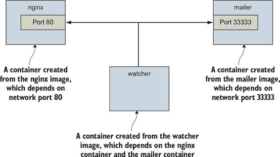
> 
> 本例使用三个容器。第一个将运行 NGINX；第二个将运行一个名为邮件发送程序的程序。这两个都将作为独立容器运行。独立意味着容器将在后台运行，不连接到任何输入或输出流。还有一个名为`watcher`的第三个程序将在交互式容器中作为监控代理运行。邮件发送程序和监控代理都是为这个例子创建的小脚本。在本节中，你将学习以下内容：

+   创建独立和交互式容器

+   列出系统上的容器

+   查看容器日志

+   停止和重启容器

+   将终端重新连接到容器

+   从连接的容器断开连接

> 不再拖延，让我们开始为客户填写订单。
> 
> 2.1.1\. 创建并启动新容器
> 
> Docker 将运行软件程序所需的所有文件和指令的集合称为镜像。当我们使用 Docker 安装软件时，我们实际上是在使用 Docker 下载或创建一个镜像。安装镜像有不同的方法，并且有多个镜像来源。镜像将在第三章中详细介绍，但就现在而言，你可以将它们视为用于在世界各地运输物理商品的运输集装箱。Docker 镜像包含了计算机运行软件所需的一切。
> 
> 在本例中，我们将从 Docker Hub 下载并安装 NGINX 的镜像。记住，Docker Hub 是由 Docker Inc.提供的公共注册库。NGINX 镜像是 Docker Inc.所说的可信仓库。通常，发布软件的个人或基金会控制该软件的可信仓库。运行以下命令将下载、安装并启动一个运行 NGINX 的容器：
> 
> > `docker run --detach \` `1` `--name web nginx:latest`

+   1 注意到独立标志。

> 当你运行此命令时，Docker 将从 Docker Hub 上托管的 NGINX 仓库（在第三章中介绍）安装`nginx:latest`并运行该软件。Docker 安装并启动运行 NGINX 后，终端将写入一行看似随机的字符。它看起来可能像这样：
> 
> > `7cb5d2b9a7eab87f07182b5bf58936c9947890995b1b94f412912fa822a9ecb5`
> > 
> 这串字符是刚刚创建用于运行 NGINX 的容器的唯一标识符。每次你运行`docker run`并创建一个新的容器时，该新容器都会获得一个唯一的标识符。用户通常会将此输出捕获到变量中，以便在其他命令中使用。在这个示例中，你不需要这样做。
> 
> 在显示标识符后，可能看起来好像没有发生任何事情。这是因为你使用了`--detach`选项，并在后台启动了程序。这意味着程序已经启动，但没有连接到你的终端。以这种方式启动 NGINX 是有意义的，因为我们将要运行几个程序。服务器软件通常在独立容器中运行，因为软件很少依赖于连接的终端。
> 
> 运行独立容器非常适合那些安静地运行在后台的程序。这类程序被称为守护进程或服务。守护进程通常通过网络或其他通信渠道与其他程序或人类进行交互。当你在一个想要在后台运行的容器中启动守护进程或其他程序时，请记住使用`--detach`标志或其简写形式`-d`。
> 
> 在这个示例中，你的客户端还需要另一个守护进程，即邮件发送程序。邮件发送程序等待来自调用者的连接，然后发送电子邮件。以下命令安装并运行了一个邮件发送程序，该程序适用于本示例：
> 
> > `docker run -d \` `1` `--name mailer \ dockerinaction/ch2_mailer`

+   1 开始独立运行

> 此命令使用`--detach`标志的简写形式在后台启动了一个名为`mailer`的新容器。到目前为止，你已经运行了两个命令，并交付了客户端所需系统的三分之二。最后一个组件，称为代理，非常适合交互式容器。
> 
> 2.1.2\. 运行交互式容器
> 
> 基于终端的文本编辑器是要求连接终端的程序的一个很好的例子。它通过键盘（可能还有鼠标）从用户那里获取输入，并在终端上显示输出。它在输入和输出流上是交互式的。在 Docker 中运行交互式程序需要将你的终端的一部分绑定到正在运行的容器的输入或输出。
> 
> 要开始使用交互式容器，请运行以下命令：
> 
> > `docker run --interactive --tty \` `1` `--link web:web \ --name web_test \ busybox:1.29 /bin/sh`

+   1 创建虚拟终端并绑定 stdin

> 该命令在`run`命令中使用两个标志：`--interactive`（或`-i`）和`--tty`（或`-t`）。首先，`--interactive`选项告诉 Docker 即使在没有终端连接的情况下，也要保持容器标准输入流（stdin）打开。其次，`--tty`选项告诉 Docker 为容器分配一个虚拟终端，这将允许你向容器传递信号。这通常是交互式命令行程序所期望的。当你运行如交互式容器中的 shell 这样的交互式程序时，你通常会使用这两个选项。
> 
> 与交互式标志一样重要的是，当你启动这个容器时，你指定了容器内要运行的程序。在这种情况下，你运行了一个名为`sh`的 shell 程序。你可以在容器内运行任何可用的程序。
> 
> 交互式容器中的命令创建了一个容器，启动了一个 UNIX shell，并将其链接到运行 NGINX 的容器。从这个 shell 中，你可以运行命令来验证你的 Web 服务器是否正常运行：
> 
> > `wget -O - http://web:80/`
> > 
> 这使用了一个名为`wget`的程序向 Web 服务器（你之前在容器中启动的 NGINX 服务器）发起 HTTP 请求，然后在你的终端上显示网页内容。在其他行中，应该有一条消息类似于`Welcome to NGINX!`。如果你看到这条消息，那么一切正常，你可以继续通过输入`exit`来关闭这个交互式容器。这将终止 shell 程序并停止容器。
> 
> 有可能创建一个交互式容器，手动在该容器内启动一个进程，然后断开你的终端。你可以通过按住 Ctrl（或控制）键并按 P 然后按 Q 来实现。这只有在使用了`--tty`选项的情况下才会生效。
> 
> 为了完成你客户的工作，你需要启动一个代理。这是一个监控代理，它将像前面的例子那样测试 Web 服务器，并在 Web 服务器停止时通过邮件发送消息。这个命令将通过使用简写标志在交互式容器中启动代理：
> 
> > `docker run -it \` `1` `--name agent \     --link web:insideweb \     --link mailer:insidemailer \     dockerinaction/ch2_agent`

+   1 创建一个虚拟终端并绑定 stdin

> 在运行时，容器将每秒测试一次 Web 容器，并打印出如下信息：
> 
> > `System up.`
> > 
> 现在你已经看到了它的工作方式，请从容器中断开你的终端。具体来说，当你启动容器并开始写入`System up`时，按住 Ctrl（或控制）键然后按 P 再按 Q。这样做之后，你将返回到宿主计算机的 shell。不要停止程序；否则，监视器将停止检查 Web 服务器。
> 
> 虽然你通常会在你的网络服务器上部署软件时使用分离或守护进程容器，但交互式容器对于在桌面或服务器上手动工作很有用。到目前为止，你已经启动了客户端需要的所有三个容器中的应用程序。在你自信地声称完成之前，你应该测试系统。
> 
> 2.1.3\. 列出、停止、重启和查看容器输出
> 
> 测试你当前设置的第一件事是使用`docker ps`命令检查当前正在运行的容器：
> 
> > `docker ps`
> > 
> 运行该命令将显示每个正在运行的容器的以下信息：

+   容器的 ID

+   使用的镜像

+   容器中执行的命令

+   容器创建的时间

+   容器运行的时间

+   容器暴露的网络端口

+   容器的名称

> 到目前为止，你应该有三个正在运行的容器，名称分别为：`web`、`mailer`和`agent`。如果任何一个容器缺失，但到目前为止你已按照示例操作，那么它可能被错误地停止了。这不是问题，因为 Docker 有一个命令可以重新启动容器。接下来的三个命令将通过容器名称重新启动每个容器。选择适当的命令来重新启动列表中缺失的容器：
> 
> > `docker restart web docker restart mailer docker restart agent`
> > 
> 现在三个容器都已经启动，你需要测试系统是否正常运行。最好的方法是检查每个容器的日志。从`web`容器开始：
> 
> > `docker logs web`
> > 
> 这应该会显示一个包含以下子字符串的长日志，包含多行：
> 
> > `"GET / HTTP/1.0" 200`
> > 
> 这意味着 Web 服务器正在运行，代理正在测试网站。每次代理测试网站时，其中一行将被写入日志。`docker logs`命令在这种情况下可能很有用，但依赖它是有风险的。程序写入 stdout 或 stderr 输出流中的任何内容都将记录在此日志中。这种模式的问题在于日志默认不会旋转或截断，因此写入容器日志的数据将保持并随着容器的存在而增长。这种长期持久性可能对长期运行的过程造成问题。更好的方法是使用卷来处理日志数据，这在第四章（index_split_037.html#filepos379268）中有讨论。
> 
> 你可以通过检查`web`的日志来了解代理是否正在监控 Web 服务器。为了完整性，你应该检查`mailer`和`agent`的日志输出：
> 
> > `docker logs mailer docker logs agent`
> > 
> `mailer`的日志应该看起来像这样：
> 
> > `CH2 Example Mailer has started.`
> > 
> `agent`的日志应该包含几行类似于你在启动容器时观察到的日志：
> 
> > `System up.`

| |
| --- |

> 小贴士
> 
> `docker logs`命令有一个标志`--follow`或`-f`，它将显示日志，然后继续监视并随着日志的更改更新显示。完成时，按 Ctrl-C（或 Command-C）中断`logs`命令。

|    |
| --- |

> 现在您已经验证了容器正在运行，并且代理可以访问 Web 服务器，您应该测试代理是否会在 Web 容器停止时注意到。当发生这种情况时，代理应该触发对邮件器的调用，并且该事件应该记录在`agent`和`mailer`的日志中。`docker stop`命令告诉容器中 PID 为 1 的程序停止。在以下命令中使用它来测试系统：
> 
> > `docker stop web 1 docker logs mailer 2`

+   1 通过停止容器停止 Web 服务器

+   2 等待几秒钟并检查邮件器日志

> 在邮件器日志的末尾查找类似以下内容的行：
> 
> > `发送邮件：收件人：admin@work  信息：服务已中断！`
> > 
> 这行意味着代理成功检测到名为`web`的容器中的 NGINX 服务器已停止。恭喜！您的客户会感到高兴，您已经使用容器和 Docker 构建了您的第一个真实系统。
> 
> 学习 Docker 的基本功能是一回事，但理解它们为什么有用以及如何使用它们来定制隔离是另一项完全不同的任务。
> 
> 2.2. 解决问题和 PID 命名空间
> 
> 在 Linux 机器上运行的每个程序或进程都有一个唯一的数字，称为进程标识符（PID）。PID 命名空间是一组唯一的数字，用于标识进程。Linux 提供了创建多个 PID 命名空间的工具。每个命名空间都包含一组可能的 PID。这意味着每个 PID 命名空间将包含其自己的 PID 1, 2, 3，等等。
> 
> 大多数程序不需要访问其他正在运行的过程或能够列出系统上其他正在运行的过程。因此，Docker 默认为每个容器创建一个新的 PID 命名空间。容器的 PID 命名空间将隔离该容器中的进程与其他容器中的进程。
> 
> 从一个具有其命名空间的容器的进程的角度来看，PID 1 可能指的是 init 系统进程，如`runit`或`supervisord`。在另一个容器中，PID 1 可能指的是命令 shell，如 bash。运行以下命令以查看其实际效果：
> 
> > `docker run -d --name namespaceA \    busybox:1.29 /bin/sh -c "sleep 30000" docker run -d --name namespaceB \    busybox:1.29 /bin/sh -c "nc -l 0.0.0.0 -p 80"  docker exec namespaceA ps 1 docker exec namespaceB ps 2`
> > 
> 命令 1 应生成一个类似于以下的过程列表：
> 
> > `PID   用户     时间  命令   1   root     0:00  sleep 30000   8   root     0:00  ps`
> > 
> 命令 2 应生成一个略有不同的过程列表：
> 
> > `PID   用户     时间  命令   1   root     0:00  nc -l 0.0.0.0 -p 80   9   root     0:00  ps`
> > 
> 在这个例子中，你使用`docker exec`命令在运行中的容器中运行额外的进程。在这种情况下，你使用的命令被称为`ps`，它显示了所有运行中的进程及其 PID。从输出中，你可以清楚地看到每个容器都有一个 PID 为 1 的进程。
> 
> 没有 PID 命名空间，容器内运行的进程将与其他容器或主机上的进程共享相同的 ID 空间。容器中的进程能够确定主机机器上正在运行的其他进程。更糟糕的是，一个容器中的进程可能能够控制其他容器中的进程。无法引用其命名空间外任何进程的进程在执行针对性攻击的能力上受到限制。
> 
> 与大多数 Docker 隔离功能一样，你可以选择性地创建没有自己的 PID 命名空间的容器。如果你正在使用一个程序执行需要从容器内部进行进程枚举的系统管理任务，这是至关重要的。你可以通过在`docker create`或`docker run`上设置`--pid`标志并将值设置为`host`来自行尝试。使用运行 BusyBox Linux 的容器和`ps` Linux 命令来尝试它：
> 
> > `docker run --pid host busybox:1.29 ps` `1`

+   1 应列出计算机上运行的所有进程

> 因为所有容器都有自己的 PID 命名空间，它们都不能从检查中获得有意义的见解，并且可能会对其产生更多的静态依赖。假设一个容器运行了两个进程：一个服务器和一个本地进程监控器。那个监控器可以严格依赖于服务器的预期 PID，并使用它来监控和控制服务器。这是一个环境独立性的例子。
> 
> 考虑之前的网络监控示例。假设你没有使用 Docker，而是直接在你的计算机上运行 NGINX。现在假设你忘记了你已经为另一个项目启动了 NGINX。当你再次启动 NGINX 时，第二个进程将无法访问它所需的资源，因为第一个进程已经占有了它们。这是一个基本的软件冲突示例。你可以通过尝试在同一容器中运行两个 NGINX 副本来看到它的实际效果：
> 
> > `docker run -d --name webConflict nginx:latest docker logs webConflict` `1` `docker exec webConflict nginx -g 'daemon off;'` `2`

+   1 输出应该是空的。

+   2 在同一容器中启动第二个 NGINX 进程

> 最后一条命令应该显示如下输出：
> 
> > `2015/03/29 22:04:35 [emerg] 10#0: bind() to 0.0.0.0:80 failed (98: Address already in use) nginx: [emerg] bind() to 0.0.0.0:80 failed (98: Address already in use) ...`
> > 
> 第二个进程无法正确启动，并报告它需要的地址已被占用。这被称为端口冲突，这是在现实世界中常见的冲突问题，其中多个进程在同一台计算机上运行或多个人贡献于同一环境。这是一个很好的例子，说明 Docker 简化并解决了冲突问题。将每个进程运行在不同的容器中，如下所示：
> 
> > `docker run -d --name webA nginx:latest` `1` `docker logs webA` `2` `docker run -d --name webB nginx:latest` `3` `docker logs webB` `4`

+   1 启动第一个 NGINX 实例

+   2 验证其是否正常工作；应该是空的。

+   3 启动第二个实例

+   4 验证其是否正常工作；应该是空的

> 环境独立性提供了配置依赖于稀缺系统资源的软件的自由，而不考虑其他位于同一位置的具有冲突要求的软件。以下是一些常见的冲突问题：

+   两个程序想要绑定到相同的网络端口。

+   两个程序使用相同的临时文件名，文件锁阻止了这种情况。

+   两个程序想要使用全局安装的库的不同版本。

+   两个进程想要使用相同的 PID 文件。

+   你安装的第二个程序修改了一个其他程序使用的环境变量。现在第一个程序崩溃了。

+   多个进程正在竞争内存或 CPU 时间。

> 所有这些冲突都是在一个或多个程序有一个共同的依赖关系，但无法同意共享或有不同的需求时出现的。就像之前的端口冲突例子一样，Docker 通过 Linux 命名空间、资源限制、文件系统根和虚拟化网络组件等工具来解决软件冲突。所有这些工具都用于在 Docker 容器内隔离软件。
> 
> 2.3. 消除元冲突：构建网站农场
> 
> 在前面的章节中，你看到了 Docker 如何帮助你通过进程隔离避免软件冲突。但如果你不小心，你可能会构建出创建元冲突的系统，即 Docker 层中容器之间的冲突。
> 
> 考虑另一个例子：一位客户要求你构建一个系统，在这个系统上你可以为他们的客户托管可变数量的网站。他们还希望使用你在此章早期构建的相同监控技术。扩展你之前构建的系统是完成这项工作的最简单方法，而不需要为 NGINX 定制配置。在这个例子中，你将构建一个包含多个运行 Web 服务器的容器和每个 Web 服务器的监控监视器的系统。该系统将类似于图 2.2 中描述的架构。
> 
> 图 2.2. 一支由 Web 服务器容器和相关监控代理组成的舰队
> 
> 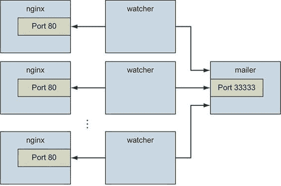
> 
> 你的第一反应可能是简单地启动更多的 Web 容器。但这并不像看起来那么简单。随着容器数量的增加，识别容器会变得复杂。
> 
> 2.3.1. 灵活的容器标识
> 
> 要找出为什么仅仅复制之前示例中使用的 NGINX 容器的更多副本是一个糟糕的想法，最好的方法就是亲自尝试：
> 
> > `docker run -d --name webid nginx` `1` `docker run -d --name webid nginx` `2`

+   1 创建一个名为 "webid" 的容器

+   2 创建另一个名为 "webid" 的容器

> 这里第二个命令将因冲突错误而失败：
> 
> > `FATA[0000] 错误响应来自守护进程：冲突。名称 "webid" 已经被容器 2b5958ba6a00 使用。您必须删除（或重命名）该容器才能重用该名称。`
> > 
> 使用固定容器名称，如 `web`，对于实验和文档很有用，但在具有多个容器的系统中，使用这样的固定名称可能会引起冲突。默认情况下，Docker 为其创建的每个容器分配一个唯一的（对人类友好的）名称。`--name` 标志使用已知值覆盖该过程。如果出现需要更改容器名称的情况，您始终可以使用 `docker rename` 命令重命名容器：
> 
> > `docker rename webid webid-old` `1` `docker run -d --name webid nginx` `2`

+   1 将当前 web 容器重命名为 "webid-old"

+   2 创建另一个名为 "webid" 的容器

> 重命名容器可以帮助缓解一次性命名冲突，但对于避免最初的问题帮助不大。除了名称外，Docker 还分配了一个唯一的标识符，这在第一个示例中已经提到。这些是十六进制编码的 1024 位数字，看起来像这样：
> 
> > `7cb5d2b9a7eab87f07182b5bf58936c9947890995b1b94f412912fa822a9ecb5`
> > 
> 当以分离模式启动容器时，其标识符将被打印到终端。您可以在需要识别特定容器的任何命令中使用这些标识符代替容器名称。例如，您可以使用之前的 ID 与 `stop` 或 `exec` 命令一起使用：
> 
> > `docker exec \ \ \ 7cb5d2b9a7eab87f07182b5bf58936c9947890995b1b94f412912fa822a9ecb5 \ echo hello  docker stop \ \ \ 7cb5d2b9a7eab87f07182b5bf58936c9947890995b1b94f412912fa822a9ecb5`
> > 
> 生成的 ID 具有高度的唯一性，这意味着几乎不可能与该 ID 发生冲突。在某种程度上，甚至不太可能在该计算机上发生该 ID 的前 12 个字符的冲突。因此，在大多数 Docker 接口中，您会看到容器 ID 截短为其前 12 个字符。这使得生成的 ID 更易于用户使用。您可以在需要容器标识符的地方使用它们。前两个命令可以写成这样：
> 
> > `docker exec 7cb5d2b9a7ea ps docker stop 7cb5d2b9a7ea`
> > 
> 这两个 ID 都不太适合人类使用。但它们与脚本和自动化技术配合得很好。Docker 有几种获取容器 ID 的方法，以便实现自动化。在这些情况下，将使用完整或截断的数字 ID。
> 
> 获取容器数字 ID 的第一种方法是通过简单地启动或创建一个新的容器，并将命令的结果分配给 shell 变量。如您之前所见，当以分离模式启动新容器时，容器 ID 将被写入终端（stdout）。如果这是获取创建时容器 ID 的唯一方法，您将无法使用此方法与交互式容器一起使用。幸运的是，您可以使用另一个命令创建一个容器而不启动它。`docker create`命令类似于`docker run`，主要区别在于容器是在停止状态下创建的：
> 
> > `docker create nginx`
> > 
> 结果应该像这样的一行：
> 
> > `b26a631e536d3caae348e9fd36e7661254a11511eb2274fb55f9f7c788721b0d`
> > 
> 如果您使用的是 Linux 命令 shell，如 sh 或 bash，您可以将该结果分配给 shell 变量，并在以后再次使用它：
> 
> > `CID=$(docker create nginx:latest)` `1` `echo $CID`

+   1 这将在 POSIX 兼容的 shell 上工作。

> Shell 变量创建了一个新的冲突机会，但这种冲突的范围仅限于启动脚本的终端会话或当前处理环境。这些冲突应该是容易避免的，因为只有一个使用或程序在管理该环境。这种方法的问题在于，如果多个用户或自动化进程需要共享该信息，则这种方法不会有所帮助。在这些情况下，您可以使用容器 ID（CID）文件。
> 
> `docker run`和`docker create`命令都提供了一个额外的标志，可以将新容器的 ID 写入一个已知的文件：
> 
> > `docker create --cidfile /tmp/web.cid nginx` `1` `cat /tmp/web.cid` `2`

+   1 创建一个新的停止容器

+   2 检查文件

> 与 Shell 变量的使用一样，这个特性增加了冲突的机会。CID 文件的名称（在`--cidfile`之后提供）必须是已知的或具有某种已知结构。就像手动容器命名一样，这种方法在全局（Docker-wide）命名空间中使用已知名称。好消息是，如果提供的 CID 文件已经存在，Docker 不会使用该文件创建一个新的容器。命令将失败，就像您创建两个具有相同名称的容器时一样。
> 
> 使用 CID 文件而不是名称的一个原因是可以轻松地将 CID 文件与容器共享，并为该容器重命名。这使用了一个名为卷的 Docker 功能，该功能在第四章中介绍。

|    |
| --- |

> 小贴士
> 
> 处理 CID 文件命名冲突的一种策略是通过使用已知或可预测的路径约定来分区命名空间。例如，在这个场景中，您可能使用一个包含所有 Web 容器的已知目录的路径，并通过客户 ID 进一步分区该目录。这将导致一个路径，如/containers/web/customer1/web.cid 或/containers/web/customer8/web.cid。

|    |
| --- |

> 在其他情况下，您可以使用其他命令，如 `docker ps` 来获取容器的 ID。例如，如果您想获取最后创建的容器的截断 ID，可以使用以下命令：
> 
> > `CID=$(docker ps --latest --quiet)` `1` `echo $CID` `CID=$(docker ps -l -q)` `2` `echo $CID`

+   1 这将在符合 POSIX 标准的 shell 上工作。

+   2 再次使用简短形式的标志运行。

|    |
| --- |

> 提示
> 
> 如果您想获取完整的容器 ID，可以在 `docker ps` 命令中使用 `--no-trunc` 选项。

|    |
| --- |

> 自动化案例涵盖了您迄今为止所看到的特性。尽管截断有所帮助，但这些容器 ID 很少容易阅读或记忆。因此，Docker 还为每个容器生成了可读性强的名称。
> 
> 命名约定使用一个个人形容词；一个下划线；以及一位有影响力的科学家、工程师、发明家或其他类似思想领袖的姓氏。生成的名称示例有 `compassionate_swartz`、`hungry_goodall` 和 `distracted_turing`。这些名称似乎在可读性和记忆性方面达到了一个完美的平衡。当你直接使用 `docker` 工具时，你总是可以使用 `docker ps` 来查找人性化的名称。
> 
> 容器识别可能很复杂，但您可以通过使用 Docker 的 ID 和名称生成功能来管理这个问题。
> 
> 2.3.2 容器状态和依赖关系
> 
> 带着这些新知识，新的系统可能看起来像这样：
> 
> > `MAILER_CID=$(docker run -d dockerinaction/ch2_mailer)` `1` `WEB_CID=$(docker create nginx)` `AGENT_CID=$(docker create --link $WEB_CID:insideweb --link $MAILER_CID:insidemailer dockerinaction/ch2_agent)`

+   1 确保第一个示例中的邮件发送器正在运行。

> 这段代码可以用来启动一个新的 NGINX 和代理实例，为您的每位客户的客户。您可以使用 `docker ps` 来查看它们是否已创建：
> 
> > `docker ps`
> > 
> NGINX 或代理未包含在输出中的原因与容器状态有关。Docker 容器将处于 图 2.3 中所示的状态之一。在 Docker 容器管理命令之间移动状态时，会注释每个转换。
> 
> 图 2.3. Docker 容器的状态转换图
> 
> 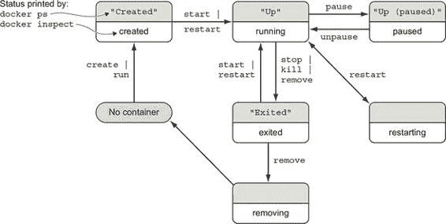
> 
> 您启动的两个新容器都没有出现在容器列表中，因为 `docker ps` 默认只显示正在运行的容器。这些容器是专门使用 `docker create` 创建的，从未启动（处于创建状态）。要查看所有容器（包括处于创建状态的容器），请使用 `-a` 选项：
> 
> > `docker ps -a`
> > 
> 新容器的状态应该是 `"Created"`。`docker ps` 命令使用灰色显示的“友好”名称显示容器状态（例如，图 2.3）。`docker inspect` 命令使用每个状态下半部分的名称（例如，`created`）。`restarting`、`removing` 和 `dead`（未展示）状态是 Docker 内部的，用于跟踪`docker ps`中可见状态之间的转换。
> 
> 现在你已经验证了两个容器都已创建，你需要启动它们。为此，你可以使用 `docker start` 命令：
> 
> > `docker start $AGENT_CID docker start $WEB_CID`
> > 
> 运行这些命令会导致错误。容器需要按照其依赖链的相反顺序启动。因为你尝试在启动 web 容器之前启动 agent 容器，Docker 报告了如下信息：
> 
> > `Error response from daemon: Cannot start container 03e65e3c6ee34e714665a8dc4e33fb19257d11402b151380ed4c0a5e38779d0a: Cannot link to a non running container: /clever_wright AS /modest_hopper/insideweb FATA[0000] Error: failed to start one or more containers`
> > 
> 在这个例子中，agent 容器依赖于 web 容器。你需要先启动 web 容器：
> 
> > `docker start $WEB_CID docker start $AGENT_CID`
> > 
> 当你考虑到其中的机制时，这就有意义了。链接机制将 IP 地址注入依赖的容器中，而未运行的容器没有 IP 地址。如果你尝试启动一个依赖于未运行容器的容器，Docker 将没有 IP 地址可以注入。在第五章中，你将学习如何使用用户定义的桥接网络连接容器，以避免这种特定的依赖问题。这里的关键点是，Docker 会在创建或启动容器之前尝试解决容器的依赖关系，以避免应用程序运行时失败。

|    |
| --- |

> 容器网络链接的传统
> 
> 你可能会注意到，Docker 文档将网络链接描述为传统功能。网络链接是早期且流行的一种连接容器的方法。链接从一个容器创建到同一主机上其他容器的单向网络连接。容器生态系统的大部分内容都要求容器之间有完全对等的双向连接。Docker 通过第五章中描述的用户定义网络提供这一点。这些网络也可以像第十三章中描述的那样跨越主机集群。网络链接和用户定义网络不等同，但 Docker 建议迁移到用户定义网络。
> 
> 容器网络链接功能是否会被移除还不确定。许多有用的工具和单向通信模式依赖于链接，正如本节中用于检查和监视 Web 和邮件组件的容器所示。

|    |
| --- |

> 无论你使用`docker run`还是`docker create`，生成的容器需要按照它们的依赖链的相反顺序启动。这意味着使用 Docker 容器关系构建循环依赖是不可能的。
> 
> 在这个阶段，你可以将所有内容整合成一个简洁的脚本，如下所示：
> 
> > `MAILER_CID=$(docker run -d dockerinaction/ch2_mailer)  WEB_CID=$(docker run -d nginx)  AGENT_CID=$(docker run -d \   --link $WEB_CID:insideweb \   --link $MAILER_CID:insidemailer \   dockerinaction/ch2_agent)`
> > 
> 现在，你确信这个脚本可以在每次你的客户需要部署新站点时无例外地运行。你的客户回来了，感谢你迄今为止完成的网站和监控工作，但情况已经发生了变化。
> 
> 他们决定专注于使用 WordPress（一个流行的开源内容管理和博客程序）来构建他们的网站。幸运的是，WordPress 通过 Docker Hub 发布在名为`wordpress`的仓库中。你所需要提供的只是一组命令，用于部署一个具有相同监控和警报功能的新的 WordPress 网站。
> 
> 内容管理系统和其他有状态系统的一个有趣之处在于，它们处理的数据使得每个运行程序都变得专业化。亚当的 WordPress 博客与贝蒂的 WordPress 博客不同，即使它们运行的是相同的软件。只有内容是不同的。即使内容相同，它们也是不同的，因为它们运行在不同的网站上。
> 
> 如果你构建的系统或软件对其环境了解得太多——例如，依赖服务的地址或固定位置——那么改变该环境或重用该软件就变得困难。在合同完成之前，你需要提供一个最小化环境依赖的系统。
> 
> 2.4. 构建环境无关的系统
> 
> 与安装软件或维护计算机群相关的许多工作都在于处理计算环境的专门化。这些专门化表现为全局范围的依赖（例如，已知的宿主文件系统位置）、硬编码的部署架构（代码或配置中的环境检查）或数据局部性（在部署架构之外的特定计算机上存储的数据）。了解这一点后，如果你的目标是构建低维护系统，你应该努力最小化这些因素。
> 
> Docker 有三个特定的功能来帮助构建环境无关的系统：

+   只读文件系统

+   环境变量注入

+   卷

> 与卷一起工作是一个很大的主题，也是第四章卷的主题。要了解前两个功能，请考虑本章其余部分使用的示例情况的需求变更：WordPress 使用一个名为 MySQL 的数据库程序来存储大部分数据，因此为运行 WordPress 的容器提供一个只读文件系统以确保数据只写入数据库是一个好主意。
> 
> 2.4.1. 只读文件系统
> 
> 使用只读文件系统可以完成两件好事。首先，您可以确信容器不会因为包含的文件的变化而变得特殊化。其次，您对攻击者无法破坏容器中的文件有了更大的信心。
> 
> 要开始为客户系统工作，请使用 `--read-only` 标志从 WordPress 镜像创建并启动一个容器：
> 
> > `docker run -d --name wp --read-only \   wordpress:5.0.0-php7.2-apache`
> > 
> 当这完成时，请检查容器是否正在运行。您可以使用之前介绍的任何方法，或者直接检查容器元数据。以下命令将打印 `true` 如果名为 `wp` 的容器正在运行，否则打印 `false`：
> 
> > `docker inspect --format "{{.State.Running}}" wp`
> > 
> `docker inspect` 命令将显示 Docker 为容器维护的所有元数据（一个 JSON 文档）。格式选项将转换这些元数据，在这种情况下，它过滤掉除了表示容器运行状态的字段之外的所有内容。这个命令应该简单地输出 `false`。
> 
> 在这种情况下，容器没有运行。要确定原因，请检查容器的日志：
> 
> > `docker logs wp`
> > 
> 那个命令应该输出类似以下内容：
> 
> > `WordPress not found in /var/www/html - copying now... Complete! WordPress has been successfully copied to /var/www/html ... skip output ... Wed Dec 12 15:17:36 2018 (1): Fatal Error Unable to create lock file:`  `Bad file descriptor (9)`
> > 
> 当使用只读文件系统运行 WordPress 时，Apache 网络服务器进程报告它无法创建锁文件。不幸的是，它没有报告它试图创建的文件的位置。如果我们有这些位置，我们可以为它们创建例外。让我们运行一个具有可写文件系统的 WordPress 容器，这样 Apache 就可以自由地写入它想要的地方：
> 
> > `docker run -d --name wp_writable wordpress:5.0.0-php7.2-apache`
> > 
> 现在让我们使用 `docker diff` 命令检查 Apache 在哪里更改了容器的文件系统：
> 
> > `docker container diff wp_writable C /run C /run/apache2 A /run/apache2/apache2.pid`
> > 
> 我们将在第三章 diff 命令中更详细地解释 `diff` 命令以及 Docker 如何知道文件系统上发生了什么变化。现在，只需知道输出指示 Apache 创建了 `/run/apache2` 目录并在其中添加了 `apache2.pid` 文件就足够了。
> 
> 由于这是正常应用程序操作的一部分，我们将对`只读`文件系统做出例外。我们将允许容器通过从主机挂载的可写卷写入/run/apache2，同时我们还将向容器提供位于/tmp 的临时内存文件系统，因为 Apache 需要可写的临时目录，如下所示：
> 
> > `docker run -d --name wp2 \    --read-only \` `1` `-v /run/apache2/ \` `2` `--tmpfs /tmp \` `3` `wordpress:5.0.0-php7.2-apache`

+   1 将容器的根文件系统设置为只读

+   2 从主机挂载一个可写目录

+   3 为容器提供一个内存临时文件系统

> 该命令应该记录类似这样的成功消息：
> 
> > `docker logs wp2 WordPress not found in /var/www/html - copying now... Complete! WordPress has been successfully copied to /var/www/html ... skip output ... [Wed Dec 12 16:25:40.776359 2018] [mpm_prefork:notice] [pid 1]`  `AH00163: Apache/2.4.25 (Debian) PHP/7.2.13 configured --`  `resuming normal operations [Wed Dec 12 16:25:40.776517 2018] [core:notice] [pid 1]`  `AH00094: Command line: 'apache2 -D FOREGROUND'`
> > 
> WordPress 还依赖于 MySQL 数据库。数据库是一个程序，它以可检索和可搜索的方式存储数据。好消息是你可以使用 Docker 安装 MySQL，就像 WordPress 一样：
> 
> > `docker run -d --name wpdb \    -e MYSQL_ROOT_PASSWORD=ch2demo \    mysql:5.7`
> > 
> 一旦启动，创建一个连接到这个新数据库容器的不同 WordPress 容器：
> 
> > `docker run -d --name wp3 \` `1` `--link wpdb:mysql \` `2` `-p 8000:80 \` `3` `--read-only \    -v /run/apache2/ \    --tmpfs /tmp \    wordpress:5.0.0-php7.2-apache`

+   1 使用一个唯一名称

+   2 创建到数据库的链接

+   3 将主机端口 8000 的流量导向容器端口 80

> 再次检查 WordPress 是否运行正确：
> 
> > `docker inspect --format "{{.State.Running}}" wp3`
> > 
> 输出现在应该是`true`。如果你想使用你的新 WordPress 安装，你可以通过 Web 浏览器访问 http://127.0.0.1:8000\.
> 
> 你正在工作的脚本更新版本应该看起来像这样：
> 
> > `#!/bin/sh  DB_CID=$(docker create -e MYSQL_ROOT_PASSWORD=ch2demo mysql:5.7)  docker start $DB_CID  MAILER_CID=$(docker create dockerinaction/ch2_mailer) docker start $MAILER_CID  WP_CID=$(docker create --link $DB_CID:mysql -p 80 \    --read-only -v /run/apache2/ --tmpfs /tmp \    wordpress:5.0.0-php7.2-apache)  docker start $WP_CID  AGENT_CID=$(docker create --link $WP_CID:insideweb \    --link $MAILER_CID:insidemailer \    dockerinaction/ch2_agent)  docker start $AGENT_CID`
> > 
> 恭喜——在这个阶段，你应该有一个正在运行的 WordPress 容器！通过使用只读文件系统和将 WordPress 链接到运行数据库的另一个容器，你可以确保运行 WordPress 镜像的容器永远不会改变。这意味着如果运行客户 WordPress 博客的计算机出现任何问题，你应该能够在其他地方启动该容器的另一个副本而不会出现问题。
> 
> 但这种设计有两个问题。首先，数据库在运行 WordPress 容器的同一台计算机上的容器中运行。其次，WordPress 正在使用数据库名称、管理员用户、管理员密码、数据库盐等重要设置的默认值。
> 
> 为了解决这个问题，你可以创建 WordPress 软件的几个版本，每个版本都为客户配置了特殊配置。这样做会将你的简单配置脚本变成一个怪物，它会创建镜像并写入文件。更好的注入配置的方法是使用环境变量。
> 
> 2.4.2\. 环境变量注入
> 
> 环境变量是通过程序的执行上下文提供给程序的键/值对。它们允许你更改程序配置，而无需修改任何文件或更改启动程序所使用的命令。
> 
> Docker 使用环境变量来传递有关依赖容器、容器的主机名以及其他方便程序在容器中运行的信息。Docker 还提供了一个机制，允许用户将环境变量注入到新的容器中。知道通过环境变量期望重要信息的程序可以在容器创建时进行配置。幸运的是，对于你和你的客户来说，WordPress 就是这样一种程序。
> 
> 在深入研究 WordPress 的具体内容之前，尝试自己注入并查看环境变量。UNIX 命令`env`显示当前执行上下文（你的终端）中的所有环境变量。要查看环境变量注入的实际操作，请使用以下命令：
> 
> > `docker run --env MY_ENVIRONMENT_VAR="这是一个测试" \` `1` `busybox:1.29 \   env` `2`

+   1 注入环境变量

+   2 在容器内执行 env 命令

> 可以使用`--env`标志（或简称`-e`）注入任何环境变量。如果变量已被镜像或 Docker 设置，则值将被覆盖。这样，容器内运行的程序可以依赖变量始终被设置。WordPress 观察以下环境变量：

+   `WORDPRESS_DB_HOST`

+   `WORDPRESS_DB_USER`

+   `WORDPRESS_DB_PASSWORD`

+   `WORDPRESS_DB_NAME`

+   `WORDPRESS_AUTH_KEY`

+   `WORDPRESS_SECURE_AUTH_KEY`

+   `WORDPRESS_LOGGED_IN_KEY`

+   `WORDPRESS_NONCE_KEY`

+   `WORDPRESS_AUTH_SALT`

+   `WORDPRESS_SECURE_AUTH_SALT`

+   `WORDPRESS_LOGGED_IN_SALT`

+   `WORDPRESS_NONCE_SALT`

|    |
| --- |

> 小贴士
> 
> 这个例子忽略了 `KEY` 和 `SALT` 变量，但任何真正的生产系统都应该绝对设置这些值。

|    |
| --- |

> 要开始，你应该解决数据库在运行 WordPress 容器的同一台计算机上的问题。与其使用链接来满足 WordPress 的数据库依赖，不如注入 `WORDPRESS_DB_HOST` 变量的值：
> 
> > `docker create --env WORDPRESS_DB_HOST=<my database hostname> \    wordpress: 5.0.0-php7.2-apache`
> > 
> 这个例子将创建（而不是启动）一个 WordPress 容器，该容器将尝试连接到你在 `<my database hostname>` 中指定的 MySQL 数据库。因为远程数据库可能不会使用任何默认的用户名或密码，所以你还需要注入这些设置的值。假设数据库管理员是一位猫爱好者，并且讨厌强密码：
> 
> > `docker create \    --env WORDPRESS_DB_HOST=<my database hostname> \    --env WORDPRESS_DB_USER=site_admin \    --env WORDPRESS_DB_PASSWORD=MeowMix42 \    wordpress:5.0.0-php7.2-apache`
> > 
> 使用这种方式的环境变量注入可以帮助你分离 WordPress 容器和 MySQL 容器之间的物理联系。即使你想要在同一台机器上托管数据库和客户 WordPress 网站，你仍然需要解决前面提到的第二个问题。所有网站都使用相同的默认数据库名称，这意味着不同的客户将共享单个数据库。你需要使用环境变量注入来通过指定 `WORDPRESS_DB_NAME` 变量设置每个独立网站的数据库名称：
> 
> > `docker create --link wpdb:mysql \    -e WORDPRESS_DB_NAME=client_a_wp \` `1` `wordpress:5.0.0-php7.2-apache  docker create --link wpdb:mysql \    -e WORDPRESS_DB_NAME=client_b_wp \` `2` `wordpress:5.0.0-php7.2-apache`

+   1 对于客户 A

+   2 对于客户 B

> 现在你已经了解了如何将配置注入到 WordPress 应用程序中并将其连接到协作进程，让我们来调整配置脚本。首先，让我们启动数据库和邮件容器，这些容器将由我们的客户共享，并将容器 ID 存储在环境变量中：
> 
> > `export DB_CID=$(docker run -d -e MYSQL_ROOT_PASSWORD=ch2demo mysql:5.7) export MAILER_CID=$(docker run -d dockerinaction/ch2_mailer)`
> > 
> 现在更新客户端站点配置脚本以从环境变量中读取数据库容器 ID、邮件容器 ID 和新的 `CLIENT_ID`：
> 
> > `#!/bin/sh  if [ ! -n "$CLIENT_ID" ]; then` `1` `echo "Client ID not set"    exit 1 fi  WP_CID=$(docker create \    --link $DB_CID:mysql \` `2` `--name wp_$CLIENT_ID \    -p 80 \    --read-only -v /run/apache2/ --tmpfs /tmp \    -e WORDPRESS_DB_NAME=$CLIENT_ID \    --read-only wordpress:5.0.0-php7.2-apache)  docker start $WP_CID  AGENT_CID=$(docker create \    --name agent_$CLIENT_ID \    --link $WP_CID:insideweb \    --link $MAILER_CID:insidemailer \    dockerinaction/ch2_agent)  docker start $AGENT_CID`

+   1 假设$CLIENT_ID 变量已设置为脚本的输入

+   2 使用 DB_CID 创建链接

> 如果你将此脚本保存为名为 start-wp-for-client.sh 的文件，你可以使用如下命令为`dockerinaction`客户端配置 WordPress：
> 
> > `CLIENT_ID=dockerinaction ./start-wp-multiple-clients.sh`
> > 
> 这个新脚本将为每个客户启动一个 WordPress 实例和监控代理，并将这些容器相互连接，以及连接到一个单独的邮件发送程序和 MySQL 数据库。WordPress 容器可以被销毁、重启和升级，而无需担心数据丢失。图 2.4 显示了这种架构。
> 
> 图 2.4。每个 WordPress 和代理容器使用相同的数据库和邮件发送程序。
> 
> 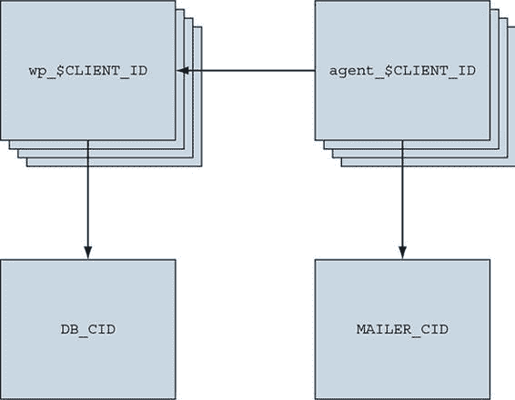
> 
> 客户应该对所提供的内容感到满意。但可能有一件事让你感到烦恼。在早期的测试中，你发现监控代理在网站不可用时正确地通知了邮件发送程序，但重启网站和代理需要手动操作。当检测到故障时，如果系统能够自动恢复会更好。Docker 提供了重启策略来帮助处理这种情况，但你可能需要更健壮的解决方案。
> 
> 2.5. 构建持久容器
> 
> 软件可能在罕见的情况下失败，这些情况本质上是暂时的。尽管在出现这些情况时通知是很重要的，但通常至少同样重要的是尽可能快地恢复服务。本章中构建的监控系统对于让系统所有者了解系统问题是一个很好的开始，但它对恢复服务没有帮助。
> 
> 当容器中的所有进程都已退出时，该容器将进入已退出的状态。记住，Docker 容器可以处于以下六种状态之一：

+   `Created`

+   `Running`

+   `Restarting`

+   `Paused`

+   `Removing`

+   `Exited`（也用于容器从未启动过的情况）

> 从临时故障中恢复的基本策略是在进程退出或失败时自动重启该进程。Docker 提供了一些监控和重启容器的选项。
> 
> 2.5.1. 自动重启容器
> 
> Docker 通过重启策略提供此功能。在容器创建时使用`--restart`标志，你可以告诉 Docker 执行以下任何一项操作：

+   永不重启（默认）

+   当检测到故障时尝试重启

+   当检测到故障时，尝试在预定时间内重启

+   不论条件如何，始终重启容器

> Docker 并不总是立即尝试重启容器。如果它这样做，可能会造成更多问题而不是解决问题。想象一个容器除了打印时间和退出什么也不做。如果该容器被配置为始终重启，并且 Docker 总是立即重启它，系统将只会重启该容器。相反，Docker 使用指数退避策略来安排重启尝试的时间。
> 
> 回退策略决定了连续重启尝试之间应该经过的时间。指数回退策略会在每次连续尝试中等待的时间翻倍。例如，如果容器第一次需要重启时 Docker 等待了 1 秒，那么第二次尝试时它将等待 2 秒，第三次尝试时等待 4 秒，第四次尝试时等待 8 秒，以此类推。具有低初始等待时间的指数回退策略是常见的服务恢复技术。你可以通过构建一个总是重启并简单地打印时间的容器来亲自看到 Docker 使用这种策略：
> 
> > `docker run -d --name backoff-detector --restart always busybox:1.29 date`
> > 
> 然后，几秒钟后，使用尾部日志功能来观察它回退并重启：
> 
> > `docker logs -f backoff-detector`
> > 
> 日志将显示它已经被重启的所有时间，并等待下一次重启，打印当前时间，然后退出。将此单个标志添加到监控系统和您一直在工作的 WordPress 容器中，就可以解决恢复问题。
> 
> 你可能不希望直接采用这种策略的唯一原因是，在回退期间，容器不会运行。等待重启的容器处于重启状态。为了演示，尝试在 `backoff-detector` 容器中运行另一个进程：
> 
> > `docker exec backoff-detector echo Just a Test`
> > 
> 运行该命令应该会显示错误信息：
> 
> > `容器 <ID> 正在重启，等待容器运行`
> > 
> 这意味着你不能做任何需要容器处于运行状态的事情，比如在容器中执行额外的命令。如果你需要在损坏的容器中运行诊断程序，这可能会成为一个问题。一个更完整的策略是使用启动轻量级初始化系统的容器。
> 
> 2.5.2\. 使用 PID 1 和初始化系统
> 
> 初始化系统是一种用于启动和维护其他程序状态的程序。Linux 内核将任何 PID 为 1 的进程视为初始化进程（即使它技术上不是初始化系统）。除了其他关键功能外，初始化系统还会启动其他进程，在它们失败时重启它们，转换并转发操作系统发送的信号，并防止资源泄漏。当容器将运行多个进程或运行的程序使用子进程时，在容器内部使用真实的初始化系统是一种常见的做法。
> 
> 在容器内部可以使用几种这样的初始化系统。其中最受欢迎的有 `runit`、`Yelp/dumb-init`、`tini`、`supervisord` 和 `tianon/gosu`。使用这些程序的软件的发布内容在第八章中有详细说明。现在，让我们看看一个使用 `supervisord` 的容器。
> 
> Docker 提供了一个包含单个容器内完整 LAMP（Linux、Apache、MySQL PHP）堆栈的镜像。以这种方式创建的容器使用`supervisord`确保所有相关进程都保持运行。启动一个示例容器：
> 
> > `docker run -d -p 80:80 --name lamp-test tutum/lamp`
> > 
> 您可以使用`docker top`命令查看容器内正在运行哪些进程：
> 
> > `docker top lamp-test`
> > 
> `top`子命令将显示容器中每个进程的主 PID。您将看到`supervisord`、`mysql`和`apache`包含在运行程序列表中。现在容器正在运行，您可以通过手动停止容器内的一个进程来测试`supervisord`重启功能。
> 
> 问题在于，要从容器内部杀死容器内的进程，您需要知道容器 PID 命名空间中的 PID。要获取该列表，请运行以下`exec`子命令：
> 
> > `docker exec lamp-test ps`
> > 
> 生成的进程列表将在 CMD 列中列出`apache2`：
> 
> > `PID TTY          TIME CMD   1 ?        00:00:00 supervisord 433 ?        00:00:00 mysqld_safe 835 ?        00:00:00 apache2 842 ?        00:00:00 ps`
> > 
> 当您运行命令时，PID 列中的值将不同。找到`apache2`所在行的 PID，然后在以下命令中的`<PID>`处插入该值：
> 
> > `docker exec lamp-test kill <PID>`
> > 
> 运行此命令将在`lamp-test`容器内运行 Linux 的`kill`程序，并指示`apache2`进程关闭。当`apache2`停止时，`supervisord`进程将记录事件并重新启动进程。容器日志将清楚地显示这些事件：
> 
> > `... ... exited: apache2 (exit status 0; expected) ... spawned: 'apache2' with pid 820 ... success: apache2 entered RUNNING state, process has stayed up for > than 1 seconds (startsecs)`
> > 
> 使用 init 系统的一个常见替代方案是使用启动脚本，该脚本至少检查成功启动容器内软件的先决条件。这些有时被用作容器的默认命令。例如，您创建的 WordPress 容器通过运行一个脚本来验证并设置默认环境变量，然后启动 WordPress 进程。您可以通过覆盖默认命令来查看此脚本的内容，以查看启动脚本：
> 
> > `docker run wordpress:5.0.0-php7.2-apache \ cat /usr/local/bin/docker-entrypoint.sh`
> > 
> Docker 容器在执行命令之前会运行一个名为 entrypoint 的程序。Entrypoints 是放置验证容器预条件的代码的完美位置。尽管这一点在本书的第二部分（[index_split_062.html#filepos666610]）中有详细讨论，但你仍需要知道如何在命令行上覆盖或特别设置容器的 entrypoint。尝试再次运行最后一个命令，但这次使用`--entrypoint`标志来指定要运行的程序，并使用命令部分来传递参数：
> 
> > `docker run --entrypoint="cat" \` `1` `wordpress:5.0.0-php7.2-apache \ /usr/local/bin/docker-entrypoint.sh` `2`

+   1 使用“cat”作为 entrypoint

+   2 将默认 entrypoint 脚本的完整路径作为参数传递给 cat

> 如果你运行显示的脚本，你会看到它是如何验证环境变量与软件依赖项的，并设置默认值。一旦脚本验证 WordPress 可以执行，它将启动请求的或默认命令。
> 
> 启动脚本是构建耐用容器的重要部分，并且总是可以与 Docker 重启策略结合使用，以利用各自的优势。由于 MySQL 和 WordPress 容器已经使用了启动脚本，因此为每个容器在示例脚本的更新版本中设置重启策略是合适的。
> 
> 当启动脚本未能满足 Linux 对 init 系统的期望时，以 PID 1 运行启动脚本是有问题的。根据你的使用情况，你可能发现一种方法或混合方法效果最好。
> 
> 经过最后的修改，你已经构建了一个完整的 WordPress 站点配置系统，并学习了使用 Docker 进行容器管理的基础知识。这需要相当多的实验。你的电脑上可能充斥着几个你不再需要的容器。为了回收这些容器所使用的资源，你需要停止它们并将它们从系统中移除。
> 
> 2.6\. 清理工作
> 
> 清理的简便性是使用容器和 Docker 的最强理由之一。容器提供的隔离性简化了停止进程和删除文件所需的任何步骤。使用 Docker，整个清理过程可以简化为几个简单的命令之一。在任何清理任务中，你必须首先确定你想要停止和/或删除的容器。记住，要列出你电脑上的所有容器，请使用`docker ps`命令：
> 
> > `docker ps -a`
> > 
> 由于本章示例中创建的容器将不再使用，你应该能够安全地停止和删除所有列出的容器。确保你注意清理的容器，如果你为个人活动创建了任何容器的话。
> 
> 所有容器都使用硬盘空间来存储日志、容器元数据和写入容器文件系统的文件。所有容器也消耗全局命名空间中的资源，例如容器名称和主机端口映射。在大多数情况下，不再使用的容器应该被移除。
> 
> 要从您的计算机中移除容器，请使用 `docker rm` 命令。例如，要删除名为 `wp` 的已停止容器，您将运行以下命令：
> 
> > `docker rm wp`
> > 
> 您应该遍历通过运行 `docker ps -a` 生成的所有容器列表，并移除所有处于退出状态的容器。如果您尝试移除一个正在运行、暂停或重新启动的容器，Docker 将显示如下消息：
> 
> > `错误响应来自守护进程：冲突，您不能移除一个正在运行的容器。在尝试移除之前停止容器或使用 -f FATA[0000] 错误：无法移除一个或多个容器`
> > 
> 在移除容器中的文件之前，应该停止容器中运行的进程。您可以使用 `docker stop` 命令或通过在 `docker rm` 上使用 `-f` 标志来实现。关键区别在于，当您使用 `-f` 标志停止进程时，Docker 会发送 `SIG_KILL` 信号，该信号会立即终止接收到的进程。相比之下，使用 `docker stop` 会发送 `SIG_HUP` 信号。`SIG_HUP` 的接收者有时间执行最终化和清理任务。`SIG_KILL` 信号不提供此类允许，可能会导致文件损坏或网络体验不佳。您可以使用 `docker kill` 命令直接向容器发送 `SIG_KILL` 信号。但您应该只在必须将容器停止时间少于标准的 30 秒最大停止时间时使用 `docker kill` 或 `docker rm -f`。
> 
> 在未来，如果您正在尝试使用短暂容器，您可以通过在命令中指定 `--rm` 来避免清理负担。这样做将在容器进入退出状态时自动移除容器。例如，以下命令将在新的 BusyBox 容器中向屏幕写入消息，并且容器将在退出后立即被移除：
> 
> > `docker run --rm --name auto-exit-test busybox:1.29 echo Hello World docker ps -a`
> > 
> 在这种情况下，您可以使用 `docker stop` 或 `docker rm` 来正确清理，或者使用单步 `docker rm -f` 命令也是合适的。您还应该使用 `-v` 标志，原因将在第四章中介绍。`docker` CLI 使得快速组合清理命令变得容易：
> 
> > `docker rm -vf $(docker ps -a -q)`
> > 
> 这就完成了在容器中运行软件的基础知识。第一部分 剩余的每一章都将专注于容器工作的一个特定方面。下一章将重点介绍安装和卸载镜像，了解镜像与容器之间的关系，以及与容器文件系统的工作。
> 
> 摘要
> 
> Docker 项目的核心目标是使用户能够在容器中运行软件。本章展示了如何使用 Docker 达到这个目的。涵盖的想法和特性包括以下内容：

+   容器可以以附加到用户 shell 的虚拟终端或分离模式运行。

+   默认情况下，每个 Docker 容器都有自己的 PID 命名空间，为每个容器隔离进程信息。

+   Docker 通过生成的容器 ID、简化的容器 ID 或其友好的名称来标识每个容器。

+   所有容器都处于以下六个不同的状态之一：已创建、正在运行、重新启动、暂停、正在删除或已退出。

+   可以使用 `docker exec` 命令在运行的容器内运行额外的进程。

+   用户可以通过在容器创建时指定环境变量，向容器中的进程传递输入或提供额外的配置。

+   在容器创建时使用 `--read-only` 标志将容器文件系统挂载为只读，并防止容器专业化。

+   容器重启策略，在容器创建时通过 `--restart` 标志设置，将帮助系统在发生故障时自动恢复。

+   Docker 使得使用 `docker rm` 命令清理容器变得与创建它们一样简单。

> 第三章\. 软件安装简化
> 
> 本章涵盖

+   识别软件

+   使用 Docker Hub 查找和安装软件

+   从其他来源安装软件

+   理解文件系统隔离

+   与镜像和层一起工作

> 第一章 和 第二章 介绍了 Docker 提供的新概念和抽象。本章深入探讨了容器文件系统和软件安装。它将软件安装分解为三个步骤，如图 3.1 所示。
> 
> 图 3.1\. 本章涵盖的主题流程
> 
> 
> 
> 安装任何软件的第一步是确定你想要安装的软件。你知道软件是通过镜像进行分发的，但你需要知道如何告诉 Docker 你想要安装的确切镜像。我们已经提到，仓库包含镜像，但本章展示了如何使用仓库和标签来识别镜像，以便安装你想要的软件。
> 
> 本章详细介绍了安装 Docker 镜像的三个主要方法：

+   使用 Docker 仓库

+   使用 `docker save` 和 `docker load` 命令使用镜像文件

+   使用 Dockerfile 构建镜像

> 在阅读这份材料的过程中，你将了解 Docker 如何隔离已安装的软件，并接触到一个新的术语，层。层是处理镜像时的重要概念，提供了多个重要特性。本章以关于镜像工作原理的部分结束。这些知识将帮助你评估镜像质量，并为本书第二部分 part 2 建立一个基本技能集。
> 
> 3.1\. 识别软件
> 
> 假设您想安装一个名为 TotallyAwesomeBlog 2.0 的程序。您会如何告诉 Docker 您想安装什么？您需要一个方法来命名程序，指定您想要使用的版本，以及指定您想要从中安装它的来源。学习如何识别特定软件是软件安装的第一步，如图 3.2 所示。
> 
> 图 3.2. 步骤 1—软件识别
> 
> 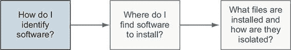
> 
> 您已经了解到 Docker 从图像创建容器。图像是一个文件。它包含将可用于从它创建的容器中的文件以及关于图像的元数据。这些元数据包含标签、环境变量、默认执行上下文、图像的命令历史记录等。
> 
> 每个图像都有一个全局唯一的标识符。您可以使用该标识符与图像和容器命令一起使用，但在实践中，实际上与原始图像标识符一起工作的很少。它们是长串的字母和数字的唯一序列。每次对图像进行更改时，图像标识符都会更改。图像标识符难以处理，因为它们是不可预测的。相反，用户使用命名仓库。
> 
> 3.1.1. 什么是命名仓库？
> 
> 命名仓库是图像的命名桶。名称类似于 URL。仓库的名称由图像所在的主机名称、拥有图像的用户账户和简短名称组成，如图 3.3 所示。例如，在本章的后面，您将从名为`docker.io/dockerinaction/ch3_hello_registry`的仓库中安装一个图像。
> 
> 图 3.3. Docker 图像仓库名称
> 
> 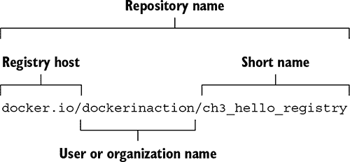
> 
> 正如软件可以有多个版本一样，仓库可以包含多个图像。仓库中的每个图像都通过标签唯一标识。如果您要发布`docker.io/dockerinaction/ch3_hello_registry`的新版本，您可能会将其标记为`v2`，而将旧版本标记为`v1`。如果您想下载旧版本，您可以通过其`v1`标签具体标识该图像。
> 
> 在第二章中，您从 Docker Hub 上的 NGINX 仓库安装了一个带有`latest`标签的图像。仓库名称和标签组成一个复合键，或由非唯一组件组合而成的唯一引用。在示例中，该图像通过`nginx:latest`进行标识。尽管以这种方式构建的标识符有时可能比原始图像标识符更长，但它们是可预测的，并且传达了图像的意图。
> 
> 3.1.2. 使用标签
> 
> 标签既是唯一标识图像的重要方式，也是创建有用别名的便捷方式。虽然标签只能应用于仓库中的单个图像，但单个图像可以有多个标签。这允许仓库所有者创建有用的版本或功能标签。
> 
> 例如，Docker Hub 上的 Java 仓库维护以下标签：`11-stretch`、`11-jdk-stretch`、`11.0-stretch`、`11.0-jdk-stretch`、`11.0.4-stretch`和`11.0.4-jdk-stretch`。所有这些标签都应用于相同的镜像。这个镜像是通过将当前的 Java 11 开发工具包（JDK）安装到 Debian Stretch 基础镜像中构建的。随着 Java 11 的当前补丁版本的增加，维护者发布了 Java 11.0.5，这个集合中的`11.0.4`标签将被替换为`11.0.5`。如果你关心你正在运行的 Java 11 的次要或补丁版本，你必须跟上这些标签的变化。如果你只想确保你始终运行 Java 11 的最新版本，请使用带有`11-stretch`标签的镜像。它应该始终分配给 Java 11 的最新发布版本。这些标签为用户提供了极大的灵活性。
> 
> 对于具有不同软件配置的镜像，也常见到不同的标签。例如，我们为名为 freegeoip 的开源程序发布了两个镜像。这是一个可以用来获取与网络地址相关的大致地理位置的 Web 应用程序。一个镜像配置为使用软件的默认配置。它旨在通过直接链接到世界来独立运行。第二个配置为在 Web 负载均衡器后面运行。每个镜像都有一个独特的标签，使用户能够轻松地识别具有所需功能的镜像。

| |
| --- |

> 小贴士
> 
> 当你在寻找要安装的软件时，总是要仔细注意仓库提供的标签。许多仓库发布了它们软件的多个版本，有时在多个操作系统上或在完整或精简版本中，以支持不同的用例。请参阅仓库的文档，了解仓库标签的具体含义和镜像发布实践。

| |
| --- |

> 那就是使用 Docker 识别软件的全部内容。有了这些知识，你就可以开始寻找和安装使用 Docker 的软件了。
> 
> 3.2. 软件的查找和安装
> 
> 你可以通过仓库名称来识别软件，但你是如何找到你想要安装的仓库的呢？发现可信赖的软件是复杂的，它是学习如何使用 Docker 安装软件的第二步，如图 3.4 所示。
> 
> 图 3.4. 步骤 2——定位仓库
> 
> 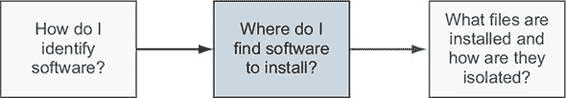
> 
> 找到镜像的最简单方法是使用索引。索引是目录仓库的搜索引擎。有几个公共 Docker 索引，但默认情况下`docker`与名为 Docker Hub 的索引集成。
> 
> Docker Hub 是由 Docker Inc.运营的具有 Web 用户界面的注册和索引。它是`docker`默认使用的注册和索引，位于主机`docker.io`上。当你发出不带指定替代注册表的`docker pull`或`docker run`命令时，Docker 将默认在 Docker Hub 上查找仓库。Docker Hub 使 Docker 更加实用。
> 
> Docker Inc. 已努力确保 Docker 是一个开放的生态系统。它发布了一个公共镜像以运行自己的注册表，并且 `docker` 命令行工具可以轻松配置以使用替代注册表。在本章的后面部分，我们将介绍 Docker 包含的替代镜像安装和分发工具。但首先，下一节将介绍如何使用 Docker Hub，以便你可以充分利用默认的工具集。
> 
> 3.2.1\. 从命令行使用 Docker 注册表
> 
> 图像作者可以通过两种方式将图像发布到注册表，例如 Docker Hub：

+   使用命令行推送他们独立且在自己的系统上构建的镜像。

+   将 Dockerfile 公开并使用持续构建系统发布镜像。Dockerfile 是用于构建镜像的脚本。从这些自动化构建中创建的镜像更受欢迎，因为可以在安装镜像之前检查 Dockerfile。

> 大多数注册表都会要求图像作者在发布之前进行身份验证，并在他们更新的仓库上执行授权检查。在这些情况下，你可以使用 `docker login` 命令登录到特定的注册表服务器，如 Docker Hub。一旦登录，你将能够从私有仓库拉取，对你的仓库中的图像进行标记，并将图像推送到你控制的任何仓库。第七章 介绍了标记和推送图像。
> 
> 运行 `docker login` 将提示你输入你的 [Docker.com](http://Docker.com) 凭据。一旦你提供了它们，你的命令行客户端将进行身份验证，你将能够访问你的私有仓库。当你完成与账户的工作后，可以使用 `docker logout` 命令登出。如果你使用的是不同的注册表，你可以将服务器名称作为 `docker login` 和 `docker logout` 子命令的参数指定。
> 
> 3.2.2\. 使用替代注册表
> 
> Docker 使注册表软件对任何人都可以运行。包括 AWS 和 Google 在内的云公司提供私有注册表，使用 Docker EE 或使用流行的 Artifactory 项目的公司已经拥有私有注册表。在 第八章 中介绍了使用开源组件运行注册表，但重要的是你早期就学会如何使用它们。
> 
> 使用替代注册表很简单。它不需要额外的配置。你只需要注册表的地址。以下命令将从替代注册表下载另一个“Hello, World”类型的示例：
> 
> > `docker pull quay.io/dockerinaction/ch3_hello_registry:latest`
> > 
> 注册表地址是 第 3.1 节 中涵盖的完整仓库规范的一部分。完整的模式如下：
> 
> > `[REGISTRYHOST:PORT/][USERNAME/]NAME[:TAG]`
> > 
> Docker 知道如何与 Docker 仓库通信，所以唯一的区别是你指定了仓库主机。在某些情况下，与仓库一起工作可能需要认证步骤。如果你遇到这种情况，请查阅文档或配置了仓库的团队以获取更多信息。当你完成安装的 `hello-registry` 镜像后，使用以下命令删除它：
> 
> > `docker rmi quay.io/dockerinaction/ch3_hello_registry`
> > 
> 仓库非常强大。它们使用户能够放弃对镜像存储和传输的控制。但是运行自己的仓库可能很复杂，可能会为你的部署基础设施创建一个潜在的单一故障点。如果你的用例中运行自定义仓库听起来有点复杂，而且第三方分发工具又不可行，你可能考虑直接从文件加载镜像。
> 
> 3.2.3\. 将镜像作为文件处理
> 
> Docker 提供了一个命令，可以将镜像从文件加载到 Docker 中。使用这个工具，你可以加载通过其他渠道获取的镜像。也许你的公司选择通过中央文件服务器或某种版本控制系统来分发镜像。也许镜像足够小，你的朋友只是通过电子邮件发送给你，或者通过闪存驱动器共享。无论你是如何获得这个文件的，你都可以使用 `docker load` 命令将其加载到 Docker 中。
> 
> 在我们向你展示 `docker load` 命令之前，你需要一个镜像文件。由于你不太可能有现成的镜像文件，我们将向你展示如何从已加载的镜像中保存一个。为了这个例子的目的，你将拉取 `busybox:latest`。这个镜像很小，易于处理。要将该镜像保存到文件中，请使用 `docker save` 命令。图 3.5 通过从 BusyBox 创建文件来演示 `docker save`。
> 
> 图 3.5\. `pull` 和 `save` 子命令的部分
> 
> 
> 
> 在这个例子中，我们使用了 `.tar` 文件名后缀，因为 `docker save` 命令创建 TAR 归档文件。你可以使用任何你想要的文件名。如果你省略了 `–o` 标志，生成的文件将流式传输到终端。

|    |
| --- |

> 小贴士
> 
> 其他使用 TAR 归档进行打包的生态系统定义了自定义文件扩展名。例如，Java 使用 .jar、.war 和 .ear。在这些情况下，使用自定义文件扩展名可以帮助暗示归档的目的和内容。尽管 Docker 没有设置默认值，也没有官方的指导，但如果你经常处理这些文件，使用自定义扩展名可能很有用。

|    |
| --- |

> 在运行 `save` 命令后，`docker` 程序将无礼地终止。通过列出你的当前工作目录的内容来检查它是否工作。如果指定的文件在那里，使用以下命令从 Docker 中删除镜像：
> 
> > `docker rmi busybox`
> > 
> 删除镜像后，使用 `docker load` 命令再次从您创建的文件中加载它。与 `docker save` 类似，如果您不使用 `–i` 命令运行 `docker load`，Docker 将使用标准输入流而不是从文件中读取存档：
> 
> > `docker load –i myfile.tar`
> > 
> 运行 `docker load` 命令后，镜像应该被加载。您可以通过再次运行 `docker images` 命令来验证这一点。如果一切正常，BusyBox 应该包含在列表中。
> 
> 将镜像作为文件处理与处理注册表一样简单，但您会错过注册表提供的所有良好分发设施。如果您想构建自己的分发工具，或者您已经有所准备，那么通过使用这些命令与 Docker 集成应该非常简单。
> 
> 另一种流行的项目分发模式是使用带有安装脚本的文件包。这种方法在开源项目中很受欢迎，这些项目使用公共版本控制仓库进行分发。在这些情况下，您处理的是一个文件，但这个文件不是一个镜像；它是一个 Dockerfile。
> 
> 3.2.4\. 从 Dockerfile 安装
> 
> Dockerfile 是一个脚本，描述了 Docker 构建新镜像所需的步骤。这些文件与作者希望放入镜像中的软件一起分发。在这种情况下，您实际上并没有安装镜像，而是遵循指示来构建镜像。与 Dockerfile 一起工作的内容在 第七章 中有详细说明。
> 
> 分发 Dockerfile 与分发镜像文件类似。您需要自行选择分发机制。一种常见的模式是将 Dockerfile 与来自 Git 或 Mercurial 等常见版本控制系统的软件一起分发。如果您已安装 Git，可以尝试从公共仓库运行一个示例：
> 
> > `git clone https://github.com/dockerinaction/ch3_dockerfile.git docker build -t dia_ch3/dockerfile:latest ch3_dockerfile`
> > 
> 在这个示例中，您将项目从公共源代码库复制到您的计算机上，然后通过使用该项目包含的 Dockerfile 来构建和安装 Docker 镜像。提供给 `docker build` 命令 `-t` 选项的值是您想要安装镜像的仓库。从 Dockerfile 构建镜像是一种轻量级的方法，适合现有的工作流程。
> 
> 这种方法有两个缺点。首先，根据项目的具体细节，构建过程可能需要一些时间。其次，Dockerfile 编写的时间和在用户的计算机上构建镜像的时间之间，依赖项可能会发生变化。这些问题使得分发构建文件对用户来说不是一个理想的体验。尽管如此，它仍然因为这些缺点而保持流行。
> 
> 完成此示例后，请确保清理您的开发空间：
> 
> > `docker rmi dia_ch3/dockerfile rm -rf ch3_dockerfile`
> > 
> 3.2.5\. 在网站上使用 Docker Hub
> 
> 如果你浏览 Docker 网站时还没有遇到它，你应该花点时间查看[`hub.docker.com`](https://hub.docker.com)。Docker Hub 允许你搜索存储库、组织或特定用户。用户和组织个人资料页面列出了账户维护的存储库、账户上的最近活动以及账户标记的存储库。在存储库页面上，你可以看到以下信息：

+   关于图像发布者提供的图像的一般信息

+   存储库中可用的标签列表

+   存储库创建的日期

+   下载次数

+   注册用户的评论

> Docker Hub 免费加入，你将在本书的后面部分需要一个账户。当你登录后，你可以对存储库进行标记和评论。你可以创建和管理自己的存储库。我们将在第二部分中这样做。现在，只需感受一下网站及其提供的功能。

| |
| --- |

> 活动：Docker Hub 寻宝游戏
> 
> 通过使用你在第二章中学到的技能在 Docker Hub 上寻找软件是很好的练习。这个活动旨在鼓励你使用 Docker Hub 并练习创建容器。你还将了解到`docker run`命令上的三个新选项。
> 
> 在这个活动中，你将从 Docker Hub 上可用的两个图像创建容器。第一个来自`dockerinaction/ch3_ex2_hunt`存储库。在这个图像中，你会找到一个提示你输入密码的小程序。你只能通过找到并运行 Docker Hub 上的第二个神秘存储库中的容器来找到密码。要使用这些图像中的程序，你需要将你的终端连接到容器，以便你的终端的输入和输出直接连接到正在运行的容器。以下命令演示了如何做到这一点并运行一个在停止时自动删除的容器：
> 
> > `docker run -it --rm dockerinaction/ch3_ex2_hunt`
> > 
> 当你运行此命令时，寻宝游戏程序将提示你输入密码。如果你已经知道答案，请现在输入。如果不知道，随便输入什么，它将给你一个提示。此时，你应该拥有完成活动所需的所有工具。以下图表说明了从这一点开始你需要做什么。
> 
> 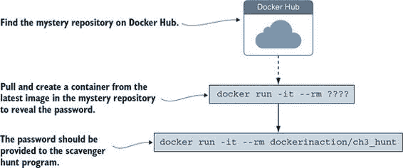
> 
> 仍然卡住了？我们可以再给你一个提示。神秘存储库是为这本书创建的。也许你应该尝试搜索这本书的 Docker Hub 存储库。记住，存储库使用用户名/存储库模式命名。
> 
> 当你得到答案后，给自己鼓掌，并使用`docker rmi`命令删除图像。你运行的命令应该看起来像这样：
> 
> > `docker rmi dockerinaction/ch3_ex2_hunt docker rmi <mystery repository>`
> > 
> 如果您正在遵循示例并使用 `docker run` 命令中的 `--rm` 选项，您应该没有需要清理的容器。在这个示例中，您学到了很多。您在 Docker Hub 上找到了一个新的镜像，并以新的方式使用了 `docker run` 命令。关于运行交互式容器有很多东西要了解。下一节将更详细地介绍这一点。

|    |
| --- |

> Docker Hub 绝对不是软件的唯一来源。根据软件发布者的目标和视角，Docker Hub 可能不是一个合适的分发点。闭源或专有项目可能不想通过第三方风险发布他们的软件。您可以通过以下三种其他方式安装软件：

+   您可以使用替代的仓库注册表或运行自己的注册表。

+   您可以手动从文件加载镜像。

+   您可以从其他来源下载一个项目，并通过提供的 Dockerfile 构建镜像。

> 所有三种选项都适用于私有项目或企业基础设施。接下来的几个小节将介绍如何从每个替代来源安装软件。第九章详细介绍了 Docker 镜像的分布。阅读本节后，您应该对使用 Docker 安装软件的选项有一个完整的了解。当您安装软件时，您应该对软件包的内容以及计算机上所做的更改有所了解。
> 
> 3.3\. 安装文件和隔离
> 
> 理解镜像是如何被标识、发现和安装的，这是 Docker 用户的基本技能。如果您了解实际上安装了哪些文件以及这些文件是如何在运行时构建和隔离的，您将能够回答随着经验积累而出现的更难的问题，例如这些：

+   哪些镜像属性会影响下载和安装速度？

+   当我使用 `docker images` 命令时，列出的所有这些未命名的镜像是什么？

+   为什么 `docker pull` 命令的输出包括拉取依赖层的信息？

+   我写入容器文件系统的文件在哪里？

> 学习这些材料是理解 Docker 软件安装的第三步和最后一步，如图 3.6 所示。figure 3.6。
> 
> 图 3.6\. 第 3 步——理解软件的安装过程
> 
> 
> 
> 到目前为止，当我们提到安装软件时，我们使用了术语“镜像”。这是为了推断您将要使用的软件位于单个镜像中，并且镜像包含在一个单独的文件中。尽管这偶尔可能是准确的，但大多数时候我们所说的镜像实际上是一系列镜像层。
> 
> 一层是一组文件和文件元数据，它作为一个原子单元打包和分发。在内部，Docker 将每一层视为一个镜像，层通常被称为中间镜像。您甚至可以通过标记来提升一个层为镜像。大多数层通过在父层上应用文件系统更改来构建在父层之上。例如，一个层可能通过使用例如 Debian 的`apt-get update`包管理器来更新镜像中的软件。生成的镜像包含从父层和添加的层中合并的文件集。当您看到它们在行动中时，更容易理解层。
> 
> 3.3.1. 镜像层在行动中
> 
> 在这个例子中，您将安装两个镜像。它们都依赖于 Java 11。应用程序本身是简单的“Hello, World”风格的程序。我们希望您注意 Docker 在安装每个应用程序时所做的操作。您应该注意到安装第一个应用程序所需的时间与安装第二个应用程序所需的时间相比有多长，并阅读`docker pull`命令打印到终端的内容。当镜像正在安装时，您可以观察 Docker 确定它需要下载哪些依赖项，然后查看单个镜像层下载的进度。Java 非常适合这个例子，因为层相当大，这将给您一个真正看到 Docker 在行动中的机会。
> 
> 您将要安装的两个镜像分别是`dockerinaction/ch3_myapp`和`docker-in-action/ch3_myotherapp`。您只需使用`docker pull`命令即可，因为您只需要看到镜像安装，而不是从它们启动容器。以下是您应该运行的命令：
> 
> > `docker pull dockerinaction/ch3_myapp docker pull dockerinaction/ch3_myotherapp`
> > 
> 您看到了吗？除非您的网络连接比我好得多，或者您已经将 OpenJDK 11.0.4（精简版）作为其他镜像的依赖项安装，否则`dockerinaction/ch3_myapp`的下载速度应该比`docker-in-action/ch3_myotherapp`慢得多。
> 
> 当您安装`ch3_myapp`时，Docker 确定它需要安装`openjdk:11.0.4-jdk-slim`镜像，因为它是请求的镜像的直接依赖（父层）。当 Docker 去安装这个依赖项时，它发现了该层的依赖项并首先下载了它们。一旦安装了层的所有依赖项，该层就被安装了。最后，安装了`openjdk:11.0.4-jdk-slim`，然后安装了微小的`ch3_myapp`层。
> 
> 当您发出安装`ch3_myotherapp`的命令时，Docker 确定`openjdk:11.0.4-jdk-slim`已经安装，并立即安装了`ch3_myotherapp`的镜像。由于第二个应用程序几乎与第一个应用程序共享了所有的镜像层，Docker 需要做的就少多了。安装`ch3_myotherapp`的独特层非常快，因为数据传输量不到一兆字节。但再次强调，对用户来说，这是一个相同的过程。
> 
> 从用户的角度来看，这种能力很好，但你不想为了优化它而尝试。只需在它们起作用的地方享受这些好处。从软件或镜像作者的角度来看，这种能力应该在你的镜像设计中扮演一个重要因素。第七章 将更详细地介绍这一点。
> 
> 如果你现在运行 `docker images`，你会看到以下仓库被列出：

+   `dockerinaction/ch3_myapp`

+   `dockerinaction/ch3_myotherapp`

> 默认情况下，`docker images` 命令将仅显示仓库。与其他命令一样，如果你指定了 `-a` 标志，列表将包括所有安装的中间镜像或层。运行 `docker images -a` 将显示一个包括多个仓库的列表，也可能包括一些标记为 `<none>` 的列表。未命名的镜像可能存在多个原因，例如构建一个未标记的镜像。唯一引用这些镜像的方法是使用 `IMAGE ID` 列中的值。
> 
> 在这个例子中，你安装了两个镜像。现在让我们清理它们。如果你使用压缩的 `docker rmi` 语法，这将更容易完成：
> 
> > `docker rmi \   dockerinaction/ch3_myapp \   dockerinaction/ch3_myotherapp`
> > 
> `docker rmi` 命令允许你指定一个由空格分隔的镜像列表以进行删除。当你需要在示例之后删除一小组镜像时，这非常有用。我们将在本书的其余示例中适当使用此命令。
> 
> 3.3.2\. 层关系
> 
> 镜像保持父/子关系。在这些关系中，它们从父级构建并形成层。容器可用的文件是容器创建时使用的镜像世系中所有层的并集。镜像可以与其他任何镜像建立关系，包括来自不同仓库、不同所有者的镜像。在 3.3.1 节 中的两个应用程序镜像使用 OpenJDK 11.0.4 镜像作为它们的父级。OpenJDK 镜像的父级是 Debian Linux Buster 操作系统发布的最小版本。图 3.7 展示了两个镜像的完整镜像世系以及每个镜像中包含的层。
> 
> 图 3.7\. 两个 Docker 镜像在 3.3.1 节 中使用的完整世系
> 
> 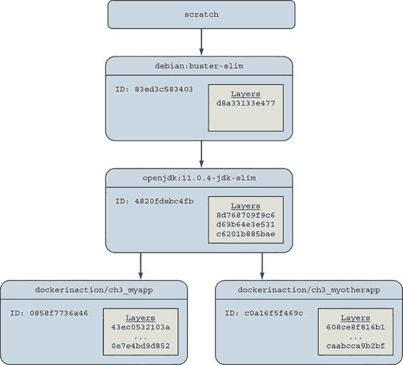
> 
> 图 3.7 中的镜像和层显示，应用程序镜像将从 `openjdk:11.0.4-jdk-slim` 继承三个层，并从 `debian:buster-slim` 继承一个额外的层。来自 OpenJDK 的三个层包含 Java 11 软件的公共库和依赖项，而 Debian 镜像贡献了一个最小化的操作系统工具链。
> 
> 当一个镜像被作者标记并发布时，它就有了一个名字。用户可以创建别名，就像你在第二章中通过使用`docker tag`命令所做的那样。在镜像被标记之前，唯一引用它的方式是使用在镜像构建时生成的唯一标识符（ID）。在图 3.7 中，OpenJDK 11.0.4 镜像的父镜像是一个 ID 为`83ed3c583403`的 Debian Buster 操作系统。Debian 镜像的作者标记并发布了这个镜像为`debian:buster-slim`。图中用这些镜像的 ID 的前 12 位来标记这些镜像，这是一个常见的约定。Docker 将 ID 从 65（十六进制）位截断到 12 位，以便在常见命令的输出中为人类用户提供便利。在内部和通过 API 访问时，Docker 使用完整的 65 位。
> 
> 即使这些“精简”的 Java 镜像也相当大，并且被选择来阐述一个观点。在撰写本文时，`openjdk:11.0.4-jdk-slim`镜像大小为 401 MB。当你使用仅运行时镜像时，你可以节省一些空间，但即使是`openjdk:11.0.4-jre-slim-buster`也有 204 MB。因为 Docker 能够唯一标识镜像和层，所以它能够识别应用程序之间的共享镜像依赖关系，并避免再次下载这些依赖关系。这是在运行时不需要任何协调的情况下完成的，只在构建时进行。第十章深入讨论了镜像构建管道。让我们继续通过检查容器文件系统来探讨。
> 
> 3.3.3\. 容器文件系统抽象和隔离
> 
> 在容器内运行的程序对镜像层一无所知。从容器内部看，文件系统就像它没有在容器中运行或操作镜像一样运行。从容器的角度来看，它拥有由镜像提供的文件的独家副本。这是通过一种称为联合文件系统（UFS）的技术实现的。
> 
> Docker 使用多种联合文件系统，并将选择最适合您系统的文件系统。联合文件系统如何工作的细节超出了您使用 Docker 有效所需了解的内容。联合文件系统是创建有效文件系统隔离的一组关键工具之一。其他工具是 MNT 命名空间和`chroot`系统调用。
> 
> 文件系统用于在宿主机的文件系统中创建挂载点，以抽象层的使用。创建的层被打包进 Docker 镜像层中。同样，当安装 Docker 镜像时，其层会被解包并适当地配置，以便为系统选择的特定文件系统提供者使用。
> 
> Linux 内核为 MNT 系统提供了一个命名空间。当 Docker 创建一个容器时，这个新容器将拥有自己的 MNT 命名空间，并为容器创建一个新的挂载点到镜像。
> 
> 最后，`chroot`用于将图像文件系统的根设置为容器上下文中的根。这防止了容器内运行的任何内容引用主机文件系统的任何其他部分。
> 
> 使用`chroot`和 MNT 命名空间对于容器技术来说是常见的。通过在配方中添加联合文件系统，Docker 容器具有几个好处。
> 
> 3.3.4. 此工具集和文件系统结构的优点
> 
> 这种方法的第一个也许是最重要的好处是，常见的层只需要安装一次。如果你安装了任意数量的图像，并且它们都依赖于一个共同的层，那么这个共同的层以及它的所有父层只需要下载或安装一次。这意味着你可能能够安装一个程序的多个专业版本，而无需在电脑上存储冗余文件或下载冗余层。相比之下，大多数虚拟机技术会在电脑上存储与冗余虚拟机数量相同的相同文件。
> 
> 其次，层提供了一个粗略的工具来管理依赖关系和分离关注点。这对于软件作者来说特别有用，第七章将更多地讨论这一点。从用户的角度来看，这个好处将帮助你通过检查你使用的图像和层来快速识别你正在运行的软件。
> 
> 最后，当你可以在基本图像上叠加少量更改以创建软件专业版本时，创建软件专业版本变得很容易。这是第七章详细讨论的另一个主题。提供专业图像有助于用户以最小的定制从软件中获得他们所需的一切。这是使用 Docker 的最好理由之一。
> 
> 3.3.5. 联合文件系统的弱点
> 
> Docker 在启动时选择合理的默认值，但没有一个实现适合所有工作负载。实际上，在某些特定用例中，你应该暂停并考虑使用另一个 Docker 功能。
> 
> 不同的文件系统对文件属性、大小、名称和字符有不同的规则。联合文件系统处于一个位置，它们经常需要在不同文件系统的规则之间进行转换。在最好的情况下，它们能够提供可接受的转换。在最坏的情况下，功能会被省略。例如，Btrfs 和 OverlayFS 都不提供支持 SELinux 工作的扩展属性。
> 
> 联合文件系统使用一种称为写时复制的模式，这使得实现内存映射文件（`mmap`系统调用）变得困难。一些联合文件系统提供了在适当条件下工作的实现，但避免从图像中映射内存可能是一个更好的主意。
> 
> 后端文件系统是 Docker 的另一个可插拔功能。您可以使用`info`子命令确定您的安装正在使用哪个文件系统。如果您想特别告诉 Docker 使用哪个文件系统，可以在启动 Docker 守护进程时使用`--storage-driver`或`-s`选项。大多数与写入联合文件系统相关的问题都可以在不更改存储提供者的情况下解决。这些问题可以通过卷来解决，这是第四章的主题第四章。
> 
> 摘要
> 
> 在计算机上安装和管理软件的任务带来了一系列独特的挑战。本章解释了如何使用 Docker 来应对这些挑战。本章涵盖的核心思想和功能如下：

+   Docker 的用户使用存储库名称来告知 Docker 他们希望安装哪种软件。

+   Docker Hub 是默认的 Docker 注册库。您可以通过网站或`docker`命令行程序在 Docker Hub 上找到软件。

+   `docker`命令行程序使得安装通过替代注册库或其他形式分发的软件变得简单。

+   图片存储库规范包括一个注册主机字段。

+   `docker load`和`docker save`命令可以用来从 TAR 存档中加载和保存镜像。

+   将 Dockerfile 与项目一起分发简化了用户机器上的镜像构建。

+   镜像通常与其他镜像以父/子关系相关联。这些关系形成层。当我们说我们安装了一个镜像时，我们是在说我们安装了一个目标镜像及其世系中的每个镜像层。

+   通过层结构镜像可以启用层重用，并在分发和存储过程中节省带宽，同时减少您计算机和镜像分发服务器上的存储空间。

> 第四章：与存储和卷一起工作
> 
> 本章涵盖

+   介绍挂载点

+   如何在主机和容器之间共享数据

+   如何在容器之间共享数据

+   使用临时、内存文件系统

+   使用卷管理数据

+   使用卷插件的高级存储

> 到这本书的这一部分，你已经安装并运行了一些程序。你看到了一些玩具示例，但还没有运行过任何类似真实世界的程序。第一、二、三章中的示例与真实世界之间的区别在于，在真实世界中，程序与数据一起工作。本章介绍了 Docker 卷和策略，这些策略将用于管理容器中的数据。
> 
> 考虑在容器内运行数据库程序可能的样子。您会将与镜像打包的软件，当您启动容器时，它可能会初始化一个空数据库。当程序连接到数据库并输入数据时，这些数据存储在哪里？是在容器内的文件中吗？当您停止容器或删除它时，这些数据会发生什么？如果您想升级数据库程序，您会如何移动数据？当云机器终止时，该存储会发生什么？
> 
> 考虑另一种情况，你正在不同的容器中运行几个不同的网络应用程序。你会在哪里写入日志文件，以便它们能够比容器存活得更久？你将如何访问这些日志来解决问题？其他程序，如日志摘要工具，如何访问这些文件？
> 
> 联合文件系统不适合处理长期数据或容器之间、容器与主机之间的数据共享。所有这些问题的答案都涉及到管理容器文件系统和挂载点。
> 
> 4.1\. 文件树和挂载点
> 
> 与其他操作系统不同，Linux 将所有存储统一到一个单一的树中。例如，磁盘分区或 USB 磁盘分区被连接到该树中的特定位置。这些位置被称为挂载点。挂载点定义了树中的位置，该位置数据的访问属性（例如，可写性），以及在该位置挂载的数据源（例如，特定的硬盘、USB 设备或内存支持的虚拟磁盘）。图 4.1 展示了由多个存储设备构成的文件系统，每个设备都挂载到特定的位置和访问级别。
> 
> 图 4.1\. 挂载点处连接到文件系统树的存储设备
> 
> 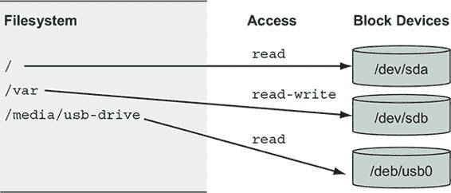
> 
> 挂载点允许软件和用户在 Linux 环境中使用文件树，而无需确切知道该树是如何映射到特定存储设备的。这在容器环境中尤其有用。
> 
> 每个容器都有一个称为 MNT 命名空间和唯一的文件树根。这将在第六章文件位置 544857 中详细讨论。现在，只需理解从该容器创建的镜像被挂载在该容器的文件树根，或者挂载在 `/` 点，并且每个容器都有一个不同的挂载点集合即可。
> 
> 如果不同的存储设备可以在文件树的各个位置挂载，我们可以在容器文件树的其它位置挂载非镜像相关的存储。这正是容器如何访问主机文件系统上的存储并在容器之间共享存储的方式。
> 
> 本章的其余部分将详细阐述如何管理容器中的存储和挂载点。最好的开始方式是理解三种最常见的被挂载到容器中的存储类型：

+   绑定挂载

+   内存存储

+   Docker 卷

> 这些存储类型可以以多种方式使用。图 4.2 展示了从镜像文件开始，添加内存中的`tmpfs`到`/tmp`，从主机绑定挂载配置文件，并将日志写入主机 Docker 卷的容器文件系统示例。
> 
> 图 4.2\. 常见容器存储挂载示例
> 
> 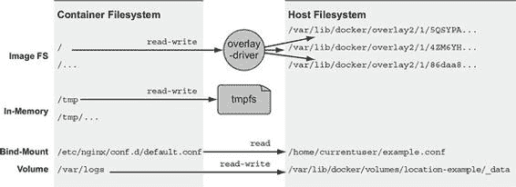
> 
> 所有三种类型的挂载点都可以使用`docker run`和`docker create`子命令上的`--mount`标志创建。
> 
> 4.2\. 绑定挂载
> 
> 绑定挂载是用于将文件系统树的一部分重新挂载到其他位置的挂载点。当与容器一起工作时，绑定挂载将主机文件系统中的一个用户指定位置连接到容器文件树中的特定点。绑定挂载在主机提供容器中运行的程序所需的文件或目录时非常有用，或者当容器化程序产生的文件或日志被容器外运行的用户或程序处理时。
> 
> 考虑图 4.3 中的示例。假设你正在运行一个依赖于主机敏感配置并需要通过你的日志传输系统转发访问日志的 Web 服务器。你可以使用 Docker 在容器中启动 Web 服务器，并将配置位置以及你希望 Web 服务器写入日志的位置绑定挂载。
> 
> 图 4.3\. 作为绑定挂载卷共享的主机文件
> 
> 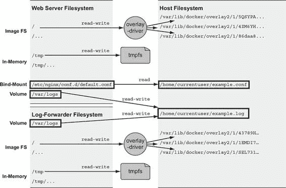
> 
> 你可以亲自尝试。创建一个占位符日志文件，并创建一个名为 example.conf 的特殊 NGINX 配置文件。运行以下命令来创建和填充文件：
> 
> > `touch ~/example.log cat >~/example.conf <<EOF server {   listen 80;   server_name localhost;   access_log /var/log/nginx/custom.host.access.log main;   location / {     root /usr/share/nginx/html;     index index.html index.htm;   } } EOF`
> > 
> 一旦使用此配置文件启动服务器，它将在 http://localhost/提供 NGINX 默认站点，并且该站点的访问日志将写入容器中的文件/var/log/nginx/custom.host.access.log。以下命令将在容器中启动 NGINX HTTP 服务器，其中你的新配置绑定挂载到服务器的配置根：
> 
> > `CONF_SRC=~/example.conf; \ CONF_DST=/etc/nginx/conf.d/default.conf; \ LOG_SRC=~/example.log; \ LOG_DST=/var/log/nginx/custom.host.access.log; \ docker run -d --name diaweb \   --mount type=bind,src=${CONF_SRC},dst=${CONF_DST} \   --mount type=bind,src=${LOG_SRC},dst=${LOG_DST} \   -p 80:80 \   nginx:latest`
> > 
> 当这个容器运行时，你应该能够将你的网络浏览器指向 http://localhost/并看到 NGINX 的 hello-world 页面，并且你将不会在容器日志流中看到任何访问日志：`docker logs diaweb`。然而，如果你检查家目录中的 example.log 文件，你将能够看到这些日志：`cat ~/example.log`。
> 
> 在这个示例中，你使用了带有`type=bind`选项的`--mount`选项。其他两个挂载参数`src`和`dst`定义了主机文件树中的源位置和容器文件树中的目标位置。你必须指定带有绝对路径的位置，但在这个示例中，我们使用了 shell 扩展和 shell 变量来使命令更容易阅读。
> 
> 这个示例涉及到卷的一个重要特性。当你在一个容器文件系统上挂载一个卷时，它会替换掉在该位置由镜像提供的内容。默认情况下，`nginx:latest` 镜像在 `/etc/nginx/conf.d/default.conf` 提供了一些默认配置，但当你创建了一个指向该路径的绑定挂载时，镜像提供的内容被主机上的内容覆盖了。这种行为是本章后面讨论的多态容器模式的基础。
> 
> 在扩展这个用例的基础上，假设你想确保 NGINX 网络服务器不能更改配置卷的内容。即使是受信任的软件也可能包含漏洞，因此最好尽量减少攻击对您网站的影响。幸运的是，Linux 提供了一种机制来使挂载点只读。你可以通过在挂载指定中添加 `readonly=true` 参数来实现这一点。在示例中，你应该将 `run` 命令更改为以下类似的内容：
> 
> > `docker rm -f diaweb  CONF_SRC=~/example.conf; \ CONF_DST=/etc/nginx/conf.d/default.conf; \ LOG_SRC=~/example.log; \ LOG_DST=/var/log/nginx/custom.host.access.log; \ docker run -d --name diaweb \ --mount type=bind,src=${CONF_SRC},dst=${CONF_DST},readonly=true \` `1` `--mount type=bind,src=${LOG_SRC},dst=${LOG_DST} \ --mount type=bind,src=${CONF_SRC},dst=${CONF_DST},readonly=true \ -p 80:80 \ nginx:latest`

+   1 注意只读标志。

> 通过创建只读挂载，你可以防止容器内的任何进程修改卷的内容。你可以通过运行一个快速测试来看到这个效果：
> 
> > `docker exec diaweb \ sed -i "s/listen 80/listen 8080/" /etc/nginx/conf.d/default.conf`
> > 
> 这个命令在 `diaweb` 容器内执行了一个 `sed` 命令并尝试修改配置文件。命令失败，因为文件被挂载为只读。
> 
> 绑定挂载的第一个问题是，它们将原本可移植的容器描述与特定主机的文件系统绑定在一起。如果一个容器描述依赖于主机文件系统上的特定位置的内容，那么这个描述就不适用于内容不可用或在其他位置可用的主机。
> 
> 接下来的一个大问题是，它们为与其他容器的冲突创造了机会。启动多个使用相同主机位置作为数据存储绑定挂载的 Cassandra 实例是个坏主意。在这种情况下，每个实例都会竞争同一组文件。如果没有其他工具如文件锁，这很可能会导致数据库损坏。
> 
> 绑定挂载是适用于工作站、具有特定关注点的机器或与更传统的配置管理工具结合使用的系统中的适当工具。在通用平台或硬件池中最好避免这些类型的特定绑定。
> 
> 4.3\. 内存存储
> 
> 大多数服务软件和 Web 应用程序使用私有密钥文件、数据库密码、API 密钥文件或其他敏感配置文件，并需要上传缓冲空间。在这些情况下，您绝对不应将这些类型的文件包含在镜像中或将它们写入磁盘。相反，您应使用内存存储。您可以通过特殊类型的挂载将内存存储添加到容器中。
> 
> 将 `mount` 标志上的 `type` 选项设置为 `tmpfs`。这是将基于内存的文件系统挂载到容器文件树的最简单方法。考虑以下命令：
> 
> > `docker run --rm \   --mount type=tmpfs,dst=/tmp \   --entrypoint mount \   alpine:latest -v`
> > 
> 此命令创建一个空的 `tmpfs` 设备并将其附加到新容器文件树中的 `/tmp`。在此文件树下创建的任何文件都将写入内存而不是磁盘。不仅如此，挂载点使用适用于通用工作负载的合理默认值创建。运行此命令将显示容器所有挂载点的列表。列表将包括以下行：
> 
> > `tmpfs on /tmp type tmpfs (rw,nosuid,nodev,noexec,relatime)`
> > 
> 这一行描述了挂载点配置。从左到右，它表示以下内容：

+   `tmpfs` 设备已挂载到 `/tmp` 树。

+   该设备具有 `tmpfs` 文件系统。

+   该树具有读写能力。

+   在此树中的所有文件上都将忽略 `suid` 位。

+   此树中的文件不会被解释为特殊设备。

+   此树中的文件将不可执行。

+   如果它们的访问时间比当前的修改或更改时间旧，则将更新文件访问时间。

> 此外，`tmpfs` 设备默认没有大小限制，并且可由世界范围内的用户写入（八进制文件权限为 1777）。您可以使用两个附加选项 `tmpfs-size` 和 `tmpfs-mode` 添加大小限制并更改文件模式：
> 
> > `docker run --rm \   --mount type=tmpfs,dst=/tmp,tmpfs-size=16k,tmpfs-mode=1770 \   --entrypoint mount \   alpine:latest -v`
> > 
> 此命令将 `/tmp` 上挂载的 `tmpfs` 设备限制为 16 KB，并且容器内的 `other` 用户无法读取。
> 
> 4.4. DOCKER 卷
> 
> Docker 卷是由 Docker 管理的命名文件系统树。它们可以使用主机文件系统上的磁盘存储，或使用云存储等其他更复杂的后端。可以使用 `docker volume` 子命令集完成对 Docker 卷的所有操作。使用卷是将存储与文件系统上可能通过绑定挂载指定的专用位置解耦的方法。
> 
> 如果要将 Web 服务器和日志转发容器示例从 第 4.2 节 转换为使用卷来共享对日志的访问权限，这对可以运行在任何机器上，无需考虑可能与其他软件在磁盘上的静态位置冲突的其他软件。该示例将类似于 图 4.4，容器将通过 `location-example` 卷读取和写入日志。
> 
> 图 4.4\. 使用卷在容器之间共享文件
> 
> 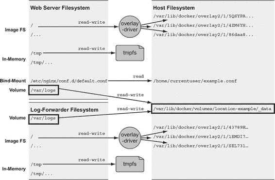
> 
> 你可以使用`docker volume create`和`docker volume inspect`子命令来创建和检查卷。默认情况下，Docker 使用`local`卷插件创建卷。默认行为将在 Docker 引擎控制的宿主机文件系统的一部分创建一个目录来存储卷的内容。例如，以下两个命令将创建一个名为`location-example`的卷并显示卷宿主机文件系统树的位置：
> 
> > `docker volume create` `1` `--driver local` `2` `--label example=location` `3` `location-example` `docker volume inspect` `4` `--format "{{json .Mountpoint}}"` `5` `location-example`

+   1 创建卷

+   2 指定“本地”插件

+   3 添加卷标签

+   4 检查卷

+   5 选择主机上的位置

> 如果你手动在桌面上构建或链接工具，Docker 卷可能看起来难以操作，但对于数据特定位置性不那么重要的更大系统，卷是组织数据的一种更有效的方法。使用它们将卷从系统的其他潜在关注点中解耦。通过使用 Docker 卷，你只是在说，“我需要一个地方来存放我正在处理的一些数据。”这是一个 Docker 可以在任何安装了 Docker 的机器上满足的要求。
> 
> 此外，当你完成对卷的使用并要求 Docker 为你清理时，Docker 可以自信地删除任何不再被容器使用的目录或文件。以这种方式使用卷有助于管理杂乱。随着 Docker 中间件或插件的演变，卷用户将能够采用更高级的功能。
> 
> 共享数据访问是卷的关键特性。如果你已经将卷从文件系统上的已知位置解耦，你需要知道如何在容器之间共享卷，而不会暴露管理容器的确切位置。下一节将描述两种使用卷在容器之间共享数据的方法。
> 
> 4.4.1\. 卷提供容器独立的数据管理
> 
> 从语义上讲，卷是一个用于分割和共享数据的工具，其范围或生命周期独立于单个容器。这使得卷成为任何共享或写入文件的容器化系统设计中不可或缺的一部分。以下是一些与容器在范围或访问权限上存在差异的数据示例：

+   数据库软件与数据库数据

+   网络应用程序与日志数据

+   数据处理应用程序与输入和输出数据

+   网络服务器与静态内容

+   产品与支持工具

> 卷允许关注点的分离，并为架构组件创建模块化。这种模块化有助于你更容易地理解、构建、支持和重用大型系统中的各个部分。
> 
> 这样想吧：图像适合用于打包和分发相对静态的文件，例如程序；卷则用于存储动态数据或特殊化。这种区别使得图像可重用，数据易于共享。这种相对静态和动态文件空间的分离，使得应用程序或图像的作者能够实现诸如多态和可组合工具等高级模式。
> 
> 多态工具是指保持一致接口但可能有几个实现，这些实现执行不同的操作。考虑一个像通用应用程序服务器这样的应用程序。例如，Apache Tomcat 是一个提供网络 HTTP 接口并将接收到的任何请求分派给可插拔程序的应用程序。Tomcat 具有多态行为。使用卷，你可以在不修改镜像的情况下将行为注入容器。或者，考虑一个像 MongoDB 或 MySQL 这样的数据库程序。数据库的价值由其包含的数据定义。数据库程序始终提供相同的接口，但根据可以注入卷的数据而具有完全不同的价值。多态容器模式是第 4.5.1 节的主题。
> 
> 更根本的是，卷使得应用程序和主机关注点的分离成为可能。在某个时刻，一个镜像将被加载到主机上，并从中创建一个容器。Docker 对其运行的主机了解不多，只能对容器应该可用的文件做出断言。Docker 本身无法利用主机特定的设施，如挂载的网络存储或混合的机械硬盘和固态硬盘。但一个了解主机的人可以使用卷将容器中的目录映射到主机上的适当存储。
> 
> 现在你已经熟悉了卷是什么以及为什么它们很重要，你可以在一个真实世界的例子中开始使用它们。
> 
> 4.4.2\. 使用卷与 NoSQL 数据库
> 
> Apache Cassandra 项目提供了一个具有内置集群、最终一致性和线性写入可伸缩性的列数据库。它是现代系统设计中的热门选择，Docker Hub 上提供了官方镜像。Cassandra 与其他数据库类似，它在磁盘上的文件中存储数据。在本节中，你将使用官方 Cassandra 镜像创建一个单节点 Cassandra 集群，创建一个键空间，删除容器，然后在另一个容器中的新节点上恢复该键空间。
> 
> 通过创建将存储 Cassandra 数据库文件的卷开始。这个卷使用本地机器上的磁盘空间以及由 Docker 引擎管理的文件系统部分：
> 
> > `docker volume create \    --driver local \    --label example=cassandra \    cass-shared`
> > 
> 此卷与任何容器无关；它只是一个可以被容器访问的命名磁盘块。您刚刚创建的卷名为 `cass-shared`。在这种情况下，您向卷添加了一个键为 `example`、值为 `cassandra` 的标签。向您的卷添加标签元数据可以帮助您在以后组织和清理卷。您将在创建运行 Cassandra 的新容器时使用此卷：
> 
> > `docker run -d \   --volume cass-shared:/var/lib/cassandra/data \` `1` `--name cass1 \   cassandra:2.2`

+   1 将卷挂载到容器中

> 在 Docker 从 Docker Hub 拉取 `cassandra:2.2` 镜像后，它创建了一个新的容器，并将 `cass-shared` 卷挂载到 `/var/lib/cassandra/data`。接下来，从 `cassandra:2.2` 镜像启动一个容器，但运行 Cassandra 客户端工具（CQLSH）并连接到您的运行中的服务器：
> 
> > `docker run -it --rm \   --link cass1:cass \   cassandra:2.2 cqlsh cass`
> > 
> 现在，您可以从 CQLSH 命令行检查或修改您的 Cassandra 数据库。首先，查找名为 `docker_hello_world` 的键空间：
> 
> > `select * from system.schema_keyspaces where keyspace_name = 'docker_hello_world';`
> > 
> Cassandra 应该返回一个空列表。这意味着数据库没有被示例修改。接下来，使用以下命令创建该键空间：
> 
> > `create keyspace docker_hello_world with replication = {   'class' : 'SimpleStrategy',   'replication_factor': 1 };`
> > 
> 现在您已经修改了数据库，您应该能够再次发出相同的查询以查看结果并验证您的更改是否被接受。以下命令与您之前运行的命令相同：
> 
> > `select * from system.schema_keyspaces where keyspace_name = 'docker_hello_world';`
> > 
> 这次，Cassandra 应该返回一个条目，其属性与您创建键空间时指定的属性相同。如果您满意已连接并修改了您的 Cassandra 节点，请退出 CQLSH 程序以停止客户端容器：
> 
> > `# 离开并停止当前容器 quit`
> > 
> 客户端容器使用 `--rm` 标志创建，并在命令停止时自动删除。继续清理本例的第一部分，通过停止和删除您创建的 Cassandra 节点：
> 
> > `docker stop cass1 docker rm -vf cass1`
> > 
> 在运行这些命令后，您创建的 Cassandra 客户端和服务器将被删除。如果您所做的修改已持久化，它们唯一可能保留的地方是 `cass-shared` 卷。您可以通过重复这些步骤来测试这一点。创建一个新的 Cassandra 节点，附加一个客户端，并查询键空间。图 4.5 展示了系统和您将构建的内容。
> 
> 图 4.5\. 使用 Cassandra 将数据持久化到卷中的关键步骤
> 
> 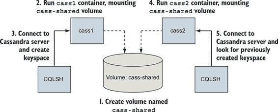
> 
> 下面的三个命令测试数据的恢复：
> 
> > `docker run -d \    --volume cass-shared:/var/lib/cassandra/data \    --name cass2 \    cassandra:2.2  docker run -it --rm \    --link cass2:cass \    cassandra:2.2 \    cqlsh cass  select * from system.schema_keyspaces where keyspace_name = 'docker_hello_world';`
> > 
> 这组命令中的最后一个命令返回一个条目，并且它与你在上一个容器中创建的键空间相匹配。这证实了之前的说法，并展示了如何使用卷来创建持久系统。在继续之前，退出 CQLSH 程序并清理你的工作空间。确保也要删除该卷容器：
> 
> > `quit  docker rm -vf cass2 cass-shared`
> > 
> 这个例子演示了使用卷的一种方法，而不深入探讨它们的工作原理、使用的模式或如何管理卷的生命周期。本章的其余部分将更深入地探讨卷的各个方面，从可用的类型开始。
> 
> 4.5. 共享挂载点和文件共享
> 
> 在多个容器之间共享对同一组文件的访问是卷的价值最明显的地方。比较绑定挂载和基于卷的方法。
> 
> 绑定挂载是共享容器之间磁盘空间的最明显方式。你可以在以下示例中看到它的实际应用：
> 
> > `LOG_SRC=~/web-logs-example mkdir ${LOG_SRC}` `1` `docker run --name plath -d \` `2` `--mount type=bind,src=${LOG_SRC},dst=/data \` `2` `dockerinaction/ch4_writer_a` `2` `docker run --rm \    --mount type=bind,src=${LOG_SRC},dst=/data \` `3` `alpine:latest \` `3` `head /data/logA` `3` `cat ${LOG_SRC}/logA` `4` `docker rm -f plath` `5`

+   1 设置一个已知位置

+   2 将位置绑定到日志写入容器中

+   3 将相同位置绑定到容器中进行读取

+   4 查看主机日志

+   5 停止写入器

> 在这个例子中，你创建了两个容器：一个名为`plath`的容器将行写入文件，另一个容器查看文件的顶部部分。这些容器共享一个共同的绑定挂载定义。在任何容器外部，你可以通过列出你创建的目录内容或查看新文件来看到这些更改。这种方法的主要缺点是所有涉及的容器都必须同意主机文件路径上的确切位置，并且可能与也打算在相同位置读取或操作文件的其它容器发生冲突。
> 
> 现在将这个绑定挂载示例与使用卷的示例进行比较。以下命令与前面的示例等效，但没有主机特定的依赖项：
> 
> > `docker volume create \` `1` `--driver local \` `1` `logging-example` `1` `docker run --name plath -d \` `2` `--mount type=volume,src=logging-example,dst=/data \` `2` `dockerinaction/ch4_writer_a` `2` `docker run --rm \    --mount type=volume,src=logging-example,dst=/data \` `3` `alpine:latest \` `3` `head /data/logA` `3` `cat "$(docker volume inspect \    --format "{{json .Mountpoint}}" logging-example)"/logA` `4` `docker stop plath` `5`

+   1 设置一个命名卷

+   2 将卷装载到日志写入容器中

+   3 将相同的卷装载到容器中进行读取

+   4 查看主机日志

+   5 停止作者

> 与基于绑定挂载的共享不同，命名卷允许容器在无需了解底层主机文件系统的情况下共享文件。除非卷需要使用特定的设置或插件，否则它不需要在第一个容器挂载它之前存在。Docker 会自动根据`run`或`create`命令中的默认值创建名为卷的卷。然而，重要的是要记住，存在于主机上的命名卷将被重用并由具有相同卷依赖关系的任何其他容器共享。
> 
> 通过使用匿名卷和容器之间的挂载点定义继承，可以解决此名称冲突问题。
> 
> 4.5.1 匿名卷和卷来源标志
> 
> 匿名卷在没有名称的情况下创建，无论是使用`docker volume create`子命令之前，还是使用`docker run`或`docker create`命令的默认值即时创建。当卷创建时，它被分配一个唯一的标识符，如`1b3364a8debb5f653d1ecb9b190000622549ee2f812a4fb4ec8a83c43d87531b`，而不是一个友好的名称。如果您需要手动拼接依赖项，这些标识符更难处理，但它们在需要消除潜在的卷命名冲突时很有用。Docker 命令行提供了另一种指定挂载依赖项的方法，而不是通过名称引用卷。
> 
> `docker run`命令提供了一个标志`--volumes-from`，它将从一个或多个容器中复制挂载定义到新容器中。它可以多次设置以指定多个源容器。通过结合此标志和匿名卷，您可以以主机无关的方式构建丰富的共享状态关系。考虑以下示例：
> 
> > `docker run --name fowler \ --mount type=volume,dst=/library/PoEAA \ --mount type=bind,src=/tmp,dst=/library/DSL \ alpine:latest \ echo "Fowler collection created." docker run --name knuth \ --mount type=volume,dst=/library/TAoCP.vol1 \ --mount type=volume,dst=/library/TAoCP.vol2 \ --mount type=volume,dst=/library/TAoCP.vol3 \ --mount type=volume,dst=/library/TAoCP.vol4.a \ alpine:latest \ echo "Knuth collection created"  docker run --name reader \` --volumes-from fowler \` --volumes-from knuth \` alpine:latest ls -l /library/ docker inspect --format "{{json .Mounts}}" reader`

+   1 列出所有卷，它们被复制到新容器中

+   2 检查读者卷列表

> 在这个示例中，你创建了两个容器，它们定义了匿名卷以及一个绑定挂载卷。要使用 `--volumes-from` 标志与第三个容器共享这些卷，你需要检查之前创建的容器，然后为 Docker 管理的主机目录创建绑定挂载卷。当你使用 `--volumes-from` 标志时，Docker 会代表你完成所有这些操作。它将引用源容器上所有存在的挂载点定义复制到新容器中。在这种情况下，名为 `reader` 的容器复制了 `fowler` 和 `knuth` 定义的挂载点。
> 
> 你可以直接或间接地复制卷。这意味着如果你从另一个容器复制卷，你也会复制它从另一个容器中复制的卷。使用前一个示例中创建的容器，可以得到以下结果：
> 
> > `docker run --name aggregator \` `1` `--volumes-from fowler \    --volumes-from knuth \    alpine:latest \    echo "Collection Created."` `docker run --rm \` `2` `--volumes-from aggregator \    alpine:latest \    ls -l /library/`

+   1 创建一个聚合

+   2 从单个源消费卷并列出它们

> 复制的卷总是具有相同的挂载点。这意味着在以下三种情况下，你不能使用 `--volumes-from`：
> 
> 在第一种情况下，如果你构建的容器需要一个挂载到不同位置的共享卷，你不能使用 `--volumes-from`。它不提供重新映射挂载点的工具。它只会复制和合并由指定容器指示的挂载点。例如，如果前一个示例中的学生想要将图书馆挂载到类似 /school/library 的位置，他们将无法做到这一点。
> 
> 第二种情况发生在卷源相互冲突或存在新的卷指定时。如果一个或多个源创建了一个具有相同挂载点的管理卷，那么两个卷的消费者将只收到其中一个卷的定义：
> 
> > `docker run --name chomsky --volume /library/ss \    alpine:latest echo "Chomsky collection created."` `docker run --name lamport --volume /library/ss \    alpine:latest echo "Lamport collection created."` `docker run --name student \    --volumes-from chomsky --volumes-from lamport \    alpine:latest ls -l /library/` `docker inspect -f "{{json .Mounts}}" student`
> > 
> 当你运行示例时，`docker inspect` 的输出将显示最后一个容器在 /library/ss 下只列出了一个卷，其值与另外两个中的一个相同。每个源容器定义了相同的挂载点，你通过将两者都复制到新容器中创建了一个竞争条件。这两个复制操作中只有一个可以成功。
> 
> 这种限制的现实世界例子可能发生在你将几个网络服务器的卷复制到一个单独的容器中进行检查时。如果这些服务器都在运行相同的软件或共享常见的配置（在容器化系统中这种情况更为常见），所有这些服务器可能会使用相同的挂载点。在这种情况下，挂载点将发生冲突，你只能访问所需数据的一部分。
> 
> 你不能使用 `--volumes-from` 的第三种情况是当你需要更改卷的写权限时。这是因为 `--volumes-from` 会复制完整的卷定义。例如，如果你的源卷是以读写访问挂载的，而你想要与一个只应有读访问权限的容器共享，使用 `--volumes-from` 将不会起作用。
> 
> 使用 `--volumes-from` 标志共享卷是构建可移植应用程序架构的重要工具，但它确实引入了一些限制。其中最具挑战性的是管理文件权限。
> 
> 使用卷将容器与主机机的数据和文件系统结构解耦，这对于大多数生产环境至关重要。Docker 为管理卷创建的文件和目录仍然需要被计入和维护。下一节将向你展示如何保持 Docker 环境整洁。
> 
> 4.6. 清理卷
> 
> 到这一章节为止，你应该有相当多的容器和卷需要清理。你可以通过运行 `docker volume list` 子命令来查看系统上所有现有的卷。输出将列出每个卷的类型和名称。任何带有名称创建的卷将以该名称列出。任何匿名卷将以其标识符列出。
> 
> 匿名卷可以通过两种方式清理。首先，当为它们创建的容器自动清理时，匿名卷会自动删除。这发生在通过 `docker run --rm` 或 `docker rm -v` 标志删除容器时。其次，可以通过发出 `docker volume remove` 命令手动删除：
> 
> > `docker volume create --driver=local # 输出：# 462d0bb7970e47512cd5ebbbb283ed53d5f674b9069b013019ff18ccee37d75d  docker volume remove \     462d0bb7970e47512cd5ebbbb283ed53d5f674b9069b013019ff18ccee37d75d # 输出：# 462d0bb7970e47512cd5ebbbb283ed53d5f674b9069b013019ff18ccee37d75d`
> > 
> 与匿名卷不同，命名卷必须始终手动删除。当容器运行收集分区数据或周期性数据的作业时，这种行为可能很有帮助。考虑以下情况：
> 
> > `for i in amazon google microsoft; \ do \ docker run --rm \     --mount type=volume,src=$i,dst=/tmp \     --entrypoint /bin/sh \     alpine:latest -c "nslookup $i.com > /tmp/results.txt"; \ done`
> > 
> 此命令在三个独立的容器中对 [amazon.com](http://amazon.com)、[google.com](http://google.com) 和 [microsoft.com](http://microsoft.com) 进行 DNS 查找，并将结果记录在三个不同的卷中。这些卷分别命名为 `amazon`、`google` 和 `microsoft`。尽管容器正在自动清理，但命名的卷将保留。如果你运行此命令，你应该能够在运行 `docker volume list` 时看到新卷。
> 
> 删除这些命名的卷的唯一方法是在 `docker volume remove` 命令中指定它们的名称：
> 
> > `docker volume remove \    amazon google microsoft`
> > 
> `remove` 子命令支持一个列表参数，用于指定卷名和标识符。前面的命令将删除所有三个命名的卷。
> 
> 删除卷只有一个约束：当前正在使用的卷不能被删除。更具体地说，任何状态下的容器所附加的卷都不能被删除。如果你尝试这样做，Docker 命令将响应一条消息，指出“卷正在使用中”，并显示使用该卷的容器标识符。
> 
> 如果你只想删除所有或部分可以删除的卷，确定哪些卷是删除候选可能会很烦人。这种情况经常作为定期维护的一部分发生。`docker volume prune` 命令就是为了这种情况而构建的。
> 
> 不带选项运行 `docker volume prune` 将会提示你确认，并删除所有可以删除的卷。你可以通过提供卷标签来过滤候选集：
> 
> > `docker volume prune --filter example=cassandra`
> > 
> 此命令将提示确认并删除你在 Cassandra 示例中创建的卷。如果你正在自动化这些清理程序，你可能想抑制确认步骤。在这种情况下，使用 `--force` 或 `-f` 标志：
> 
> > `docker volume prune --filter example=location --force`
> > 
> 理解卷对于与实际容器工作至关重要，但在许多情况下，在本地磁盘上使用卷可能会造成问题。如果你在一组机器上运行软件，该软件存储在卷中的数据将保留在写入它的磁盘上。如果容器被移动到另一台机器，它将失去对旧卷中数据的访问。你可以通过卷插件来解决你组织中的这个问题。
> 
> 4.7. 使用卷插件进行高级存储
> 
> Docker 提供了一个卷插件接口，作为社区扩展默认引擎功能的一种方式。这已被几个存储管理工具实现，如今用户可以自由使用所有类型的后端存储，包括专有云块存储、网络文件系统挂载、专用存储硬件以及本地云解决方案，如 Ceph 和 vSphere 存储。
> 
> 这些社区和供应商插件将帮助您解决与在单台机器上写入文件并从另一台机器依赖它们相关的难题。它们使用适当的`docker plugin`子命令安装、配置和删除都很简单。
> 
> 本文本中没有详细说明 Docker 插件。它们总是环境特定的，并且没有使用付费资源或支持特定云提供商的情况下很难演示。选择插件取决于您想要集成的存储基础设施，尽管一些项目在某种程度上简化了这一点。REX-Ray ([`github.com/rexray/rexray`](https://github.com/rexray/rexray)) 是一个流行的开源项目，它为几个云和本地存储平台提供卷。如果您已经到达了容器之旅中需要更复杂的卷后端的位置，您应该查看 Docker Hub 上的最新产品，并了解 REX-Ray 的当前状态。
> 
> 摘要
> 
> 学习如何使用 Docker 的第一个主要障碍之一是理解如何处理不属于镜像且可能与其他容器或主机共享的文件。本章深入探讨了挂载点，包括以下内容：

+   挂载点允许来自多个设备的多个文件系统附加到单个文件树。每个容器都有自己的文件树。

+   容器可以使用绑定挂载将主机文件系统的一部分附加到容器中。

+   可以将内存文件系统附加到容器文件树中，以便敏感或临时数据不会写入磁盘。

+   Docker 提供了匿名或命名的存储引用，称为卷。

+   可以使用适当的`docker volume`子命令创建、列出和删除卷。

+   卷是主机文件系统的一部分，Docker 将其挂载到容器中指定的位置。

+   卷有其自己的生命周期，可能需要定期清理。

+   如果安装了适当的卷插件，Docker 可以提供由网络存储或其他更复杂的工具支持的卷。

> 第五章. 单主机网络
> 
> 本章涵盖

+   网络背景

+   创建 Docker 容器网络

+   无网络和主机模式容器

+   在入口网络上发布服务

+   容器网络注意事项

> 网络是计算的一个完整领域，因此本章只能通过涵盖容器网络所需的特定挑战、结构和工具来触及表面。如果您想运行网站、数据库、电子邮件服务器或任何依赖网络的软件，例如 Docker 容器内的网络浏览器，您需要了解如何将容器连接到网络。阅读本章后，您将能够创建适合您运行的应用的具有网络暴露的容器，从一个容器中使用网络软件到另一个容器，并了解容器如何与主机及其网络交互。
> 
> 5.1. 网络背景（针对初学者）
> 
> 对相关网络概念的快速概述将有助于理解本章的主题。本节仅包含高级细节；如果你是专家，可以自由地跳过。
> 
> 网络通信主要涉及可能或可能不共享相同本地资源的进程之间的通信。为了理解本章的内容，你需要考虑一些常用的基本网络抽象概念。你对网络的了解越深入，你将越能了解其工作原理。但深入理解并不是使用 Docker 提供的工具所必需的。相反，本书中的材料应该促使你独立研究出现的选定主题。这些基本抽象包括协议、网络接口和端口。
> 
> 5.1.1\. 基础：协议、接口和端口
> 
> 关于通信和网络的一个协议就像是一种语言。两个同意使用该协议的当事人可以理解对方正在传达的信息。这是有效沟通的关键。超文本传输协议（HTTP）是许多人所熟知的一种流行网络协议。它是提供万维网服务的协议。许多网络协议和多个通信层都是由这些协议创建的。目前，重要的是你要知道什么是协议，这样你才能理解网络接口和端口。
> 
> 网络接口有一个地址并代表一个位置。你可以将接口视为类似于现实世界中的地址位置。网络接口就像一个邮箱。消息被送到该地址的收件人邮箱，然后从邮箱中取出以发送到其他地方。
> 
> 与邮箱的邮政地址类似，网络接口有一个 IP 地址，这是由互联网协议定义的。IP 的细节很有趣，但超出了本书的范围。关于 IP 地址的重要信息是，它们在其网络中是唯一的，并且包含有关它们在网络中的位置信息。
> 
> 计算机通常有两种接口：以太网接口和回环接口。以太网接口是你最熟悉的。它用于连接到其他接口和进程。回环接口不连接到任何其他接口。起初这可能会显得无用，但能够使用网络协议与同一台计算机上的其他程序通信通常很有用。在这些情况下，回环是一个很好的解决方案。
> 
> 按照邮箱的隐喻，端口就像收件人或发件人。可能有多个人在同一个地址接收消息。例如，一个地址可能接收 Wendy Web 服务器、Deborah 数据库和 Casey 缓存的消息，如图 5.1 所示。每个收件人应该只打开自己的消息。
> 
> 图 5.1\. 进程使用相同的接口，并且以与多人可能使用同一个邮箱相同的方式唯一标识。
> 
> 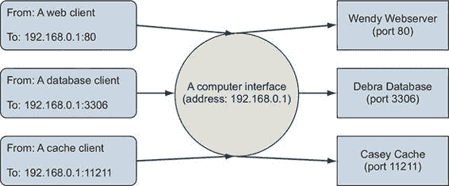
> 
> 实际上，端口只是数字，并作为传输控制协议（TCP）或用户数据报协议（UDP）的一部分进行定义。再次强调，协议的细节超出了本书的范围，但我们鼓励你在某个时候阅读有关内容。创建协议标准的人或拥有特定产品的公司决定应该为特定目的使用哪个端口号。例如，默认情况下，Web 服务器在端口 80 上提供 HTTP 服务。MySQL 数据库产品默认在其端口 3306 上提供服务。Memcached 快速缓存技术在其端口 11211 上提供其协议。端口就像名字写在信封上一样，被写在 TCP 消息中。
> 
> 接口、协议和端口都是软件和用户直接关心的问题。通过了解这些内容，您将更好地理解程序如何通信，以及您的计算机如何融入更大的图景。
> 
> 5.1.2\. 更大的图景：网络、NAT 和端口转发
> 
> 接口是更大网络中的单个点。网络是通过接口之间的连接方式来定义的，而这种连接方式决定了接口的 IP 地址。
> 
> 有时，一条消息有一个接收者，该接口并没有直接连接到，因此它被发送到一个知道如何路由消息以进行投递的中介。回到邮件隐喻，这类似于现实世界中的邮件投递员的工作方式。
> 
> 当您将消息放入您的发件箱时，邮递员会取走它并将其递送到本地路由设施。该设施本身也是一个接口。它将接收消息并将其发送到下一个路由站，直到目的地。邮递员的本地路由设施可能会将消息转发到区域设施，然后转发到目的地的本地设施，最后转发给接收者。网络路由通常遵循类似的模式。图 5.2 展示了描述的路径，并绘制了物理消息路由和网络路由之间的关系。
> 
> 图 5.2\. 邮政系统和计算机网络中消息的路径
> 
> 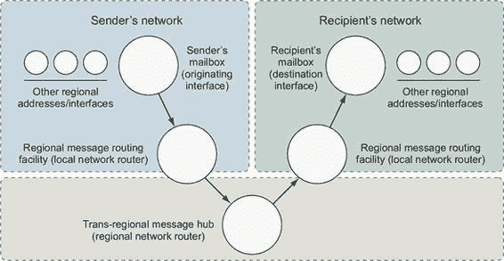
> 
> 本章关注的是单个计算机上存在的接口，因此我们考虑的网络和路由不会非常复杂。实际上，本章是关于两个特定网络以及容器如何连接到这些网络的方式。第一个网络是您的计算机连接到的网络。第二个是一个 Docker 创建的虚拟网络，用于将所有正在运行的容器连接到计算机连接到的网络。第二个网络被称为桥接。
> 
> 网桥是一种连接多个网络，使它们可以作为一个单一网络运行的接口，如图 5.3 所示。图 5.3。网桥通过根据另一种类型的网络地址选择性地转发连接网络之间的流量来工作。为了理解本章的内容，您只需要熟悉这个抽象概念。
> 
> 图 5.3\. 连接两个不同网络的网桥接口
> 
> 
> 
> 这只是一个对一些细微主题的非常粗略的介绍。解释只是触及了表面，以便帮助您了解如何使用 Docker 以及它简化的网络功能。
> 
> 5.2\. DOCKER 容器网络
> 
> Docker 将底层主机附加的网络从容器中抽象出来。这样做为应用程序提供了一定程度的运行时环境无关性，并允许基础设施管理员根据操作环境调整实现方式。连接到 Docker 网络的容器将获得一个唯一的可路由 IP 地址，该地址可以从连接到同一 Docker 网络的其它容器中路由。
> 
> 这种方法的主要问题是，任何在容器内运行的软件都没有简单的方法来确定容器运行的主机的 IP 地址。这阻碍了容器向容器网络外的其他服务广告其服务端点。第 5.5 节介绍了处理这种边缘情况的一些方法。
> 
> Docker 也将网络视为一等实体。这意味着它们有自己的生命周期，并且不受任何其他对象的约束。您可以直接使用`docker network`子命令来定义和管理它们。
> 
> 要开始使用 Docker 中的网络，请检查每个 Docker 安装中可用的默认网络。运行`docker network ls`将在终端打印出所有网络的表格。生成的表格应如下所示：
> 
> > `网络 ID          名称                驱动程序              范围 63d93214524b        bridge              bridge              本地 6eeb489baff0        host                host                本地 3254d02034ed        none                null                本地`
> > 
> 默认情况下，Docker 包括三个网络，每个网络由不同的驱动程序提供。名为`bridge`的网络是默认网络，由`bridge`驱动程序提供。`bridge`驱动程序为在同一台机器上运行的容器提供容器间连接。`host`网络由`host`驱动程序提供，该驱动程序指示 Docker 不要为附加容器创建任何特殊的网络命名空间或资源。`host`网络上的容器与主机的网络堆栈交互，就像无容器进程一样。最后，`none`网络使用`null`驱动程序。连接到`none`网络的容器将不会与自身之外的网络有任何网络连接。
> 
> 网络的作用域可以取三个值：`本地`、`全局`或`蜂群`。这表示网络是否被限制在存在网络的机器上（本地），应该在集群中的每个节点上创建但不在它们之间路由（全局），或者无缝跨越参与 Docker 蜂群的所有主机（多主机或集群范围）。正如您所看到的，所有默认网络都具有`本地`作用域，并且无法直接在不同机器上运行的容器之间路由流量。
> 
> 默认的`桥接`网络与旧版 Docker 保持兼容，无法利用现代 Docker 功能，包括服务发现或负载均衡。使用它不被推荐。因此，您应该做的第一件事是创建自己的桥接网络。
> 
> 5.2.1. 创建用户定义的桥接网络
> 
> Docker `桥接`网络驱动程序使用 Linux 命名空间、虚拟以太网设备和 Linux 防火墙来构建一个特定且可定制的虚拟网络拓扑，称为桥接。生成的虚拟网络是 Docker 安装的机器上的本地网络，并在参与容器和连接的主机更广泛的网络之间创建路由。图 5.4 说明了连接到桥接网络及其组件的两个容器。
> 
> 图 5.4. 默认本地 Docker 网络拓扑和两个附加的容器
> 
> 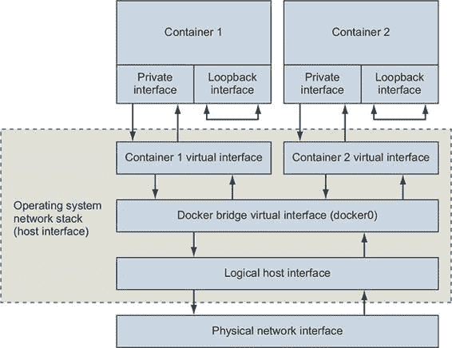
> 
> 容器有自己的私有回环接口和连接到主机命名空间中另一个虚拟接口的单独虚拟以太网接口。这两个链接接口在主机的网络和容器之间形成连接。就像典型的家庭网络一样，每个容器都被分配了一个唯一的私有 IP 地址，该地址不能从外部网络直接访问。连接通过另一个 Docker 网络进行路由，该网络在容器之间路由流量，并且可能连接到主机的网络以形成一个桥接。
> 
> 使用单个命令构建新的网络：
> 
> > `docker network create \   --driver bridge \   --label project=dockerinaction \   --label chapter=5 \   --attachable \   --scope local \   --subnet 10.0.42.0/24 \   --ip-range 10.0.42.128/25 \   user-network`
> > 
> 此命令创建了一个名为`user-network`的新本地桥接网络。向网络添加标签元数据有助于稍后识别资源。将新网络标记为`可附加`允许您在任何时候将容器附加到或从网络中分离。在这里，您已手动指定了网络的`作用域`属性并将其设置为该驱动程序的默认值。最后，为该网络定义了一个自定义子网和可分配的地址范围，10.0.42.0/24，从最后一个八位的上半部分（10.0.42.128/25）分配。这意味着随着您向此网络添加容器，它们将接收从 10.0.42.128 到 10.0.42.255 范围内的 IP 地址。
> 
> 您可以像检查其他一等 Docker 实体一样检查网络。下一节将演示如何使用带有用户网络的容器并检查结果网络配置。
> 
> 5.2.2. 探索桥接网络
> 
> 如果您打算在容器网络中运行网络软件，您应该对容器内部该网络的外观有一个扎实的理解。通过创建一个连接到该网络的新容器来开始探索您的新桥接网络：
> 
> > `docker run -it \   --network user-network \   --name network-explorer \   alpine:3.8 \    sh`
> > 
> 通过在终端中运行以下命令，从容器中获取可用的 IPv4 地址列表（此时终端已连接到正在运行的容器）：
> 
> > `ip -f inet -4 -o addr`
> > 
> 结果应该看起来像这样：
> 
> > `1: lo    inet 127.0.0.1/8 scope host lo\ ... 18: eth0    inet 10.0.42.129/24 brd 10.0.42.255 scope global eth0\ ...`
> > 
> 您可以从此列表中看到，容器有两个具有 IPv4 地址的网络设备。这些是回环接口（或本地主机）和 eth0（一个虚拟以太网设备），它们连接到桥接网络。此外，您可以看到 eth0 具有用户-network 配置指定的 IP 地址范围和子网内的 IP 地址（从 10.0.42.128 到 10.0.42.255）。该 IP 地址是任何其他在此桥接网络上运行的容器用来与您在此容器中运行的服务通信的 IP 地址。回环接口只能用于容器内部通信。
> 
> 接下来，创建另一个桥接网络并将正在运行的`network-explorer`容器连接到这两个网络。首先，从运行中的容器断开终端连接（按 Ctrl-P 然后按 Ctrl-Q），然后创建第二个桥接网络：
> 
> > `docker network create \   --driver bridge \   --label project=dockerinaction \   --label chapter=5 \    --attachable \    --scope local \    --subnet 10.0.43.0/24 \    --ip-range 10.0.43.128/25 \    user-network2`
> > 
> 一旦创建了第二个网络，您可以将`network-explorer`容器（仍在运行）连接到该网络：
> 
> > `docker network connect \   user-network2 \` `1` `network-explorer` `2`

+   1 网络名称（或 ID）

+   2 目标容器名称（或 ID）

> 在容器连接到第二个网络后，重新连接您的终端以继续探索：
> 
> > `docker attach network-explorer`
> > 
> 现在，回到容器中，再次检查网络接口配置将显示如下：
> 
> > `1: lo    inet 127.0.0.1/8 scope host lo\ ... 18: eth0    inet 10.0.42.129/24 brd 10.0.42.255 scope global eth0\ ... 20: eth1    inet 10.0.43.129/24 brd 10.0.43.255 scope global eth1\ ...`
> > 
> 如您所预期，此输出显示`network-explorer`容器连接到两个用户定义的桥接网络。
> 
> 网络完全是关于多方之间的通信，仅使用一个运行的容器来检查网络可能会有些无聊。但是，默认情况下是否有其他设备连接到桥接网络？需要另一个工具来继续探索。通过以下命令在运行的容器中安装 nmap 软件包：
> 
> > `apk update && apk add nmap`
> > 
> Nmap 是一款强大的网络检查工具，可用于扫描网络地址范围中的运行中的机器，识别这些机器，并确定它们正在运行的服务。对于我们来说，我们只想确定在桥接网络上还有哪些其他容器或其他网络设备可用。运行以下命令来扫描我们为桥接网络定义的 10.0.42.0/24 子网：
> 
> > `nmap -sn 10.0.42.* -sn 10.0.43.* -oG /dev/stdout | grep Status`
> > 
> 命令应输出类似以下内容：
> 
> > `主机: 10.0.42.128 ()       状态: 启用 主机: 10.0.42.129 (7c2c161261cb)   状态: 启用  主机: 10.0.43.128 ()       状态: 启用 主机: 10.0.43.129 (7c2c161261cb)   状态: 启用`
> > 
> 这表明每个桥接网络中只连接了两个设备：由桥接网络驱动程序创建的网关适配器和当前正在运行的容器。在两个桥接网络之一上创建另一个容器以获得更有趣的结果。
> 
> 再次从终端断开（Ctrl-P, Ctrl-Q）并启动另一个连接到 `user-network2` 的容器。运行以下命令：
> 
> > `docker run -d \ --name lighthouse \ --network user-network2 \ alpine:3.8 \ sleep 1d`
> > 
> 在 `lighthouse` 容器启动后，重新连接到你的 `network-explorer` 容器：
> 
> > `docker attach network-explorer`
> > 
> 然后在容器的 shell 中再次运行网络扫描。结果显示，`lighthouse` 容器正在运行，并且可以通过其连接到 `user-network2` 的方式从 `network-explorer` 容器访问。输出应类似于以下内容：
> 
> > `主机: 10.0.42.128 ()       状态: 启用 主机: 10.0.42.129 (7c2c161261cb)   状态: 启用 主机: 10.0.43.128 ()       状态: 启用 主机: 10.0.43.130 (lighthouse.user-network2)       状态: 启用 主机: 10.0.43.129 (7c2c161261cb)    状态: 启用`
> > 
> 在网络上发现 `lighthouse` 容器确认了网络连接按预期工作，并演示了基于 DNS 的服务发现系统是如何工作的。当你扫描网络时，你通过其 IP 地址发现了新的节点，nmap 能够解析该 IP 地址。这意味着你可以（或你的代码）根据名称在网络中查找单个容器。通过在容器内运行 `nslookup lighthouse` 来尝试自己这样做。容器主机名基于容器名称，或者可以在创建容器时通过指定 `--hostname` 标志手动设置。
> 
> 这次探索展示了你调整桥接网络以适应环境的能力，将运行中的容器附加到多个网络上的能力，以及这些网络在附加容器内运行的软件看来是什么样子。但是桥接网络仅在单个机器上工作。它们不具备集群感知性，并且容器 IP 地址不能从该机器外部路由。
> 
> 5.2.3\. 超越桥接网络
> 
> 根据你的用例，桥接网络可能已经足够。例如，桥接网络通常非常适合单服务器部署，如运行内容管理系统或大多数本地开发任务的 LAMP 堆栈。但是，如果你正在运行一个设计为容忍机器故障的多服务器环境，你需要能够无缝地在不同机器上的容器之间路由流量。桥接网络无法做到这一点。
> 
> Docker 提供了一些选项来处理这种用例。最佳选项取决于你构建网络的环境。如果你在 Linux 主机上使用 Docker 并且控制主机网络，你可以使用由`macvlan`或`ipvlan`网络驱动程序提供的底层网络。底层网络为每个容器创建第一类网络地址。这些身份是可发现的并且可以从主机附加的网络中进行路由。在机器上运行的每个容器看起来就像网络上的一个独立节点。
> 
> 如果你正在运行 Docker for Mac 或 Docker for Windows，或者在一个托管云环境中运行，这些选项将不起作用。此外，底层网络配置依赖于主机网络，因此定义很少是可移植的。更受欢迎的跨主机容器网络选项是 overlay 网络。
> 
> 在启用了 swarm 模式的 Docker 引擎上，overlay 网络驱动程序可用。overlay 网络在结构上与桥接网络相似，但逻辑桥接组件是跨主机感知的，并且可以在 swarm 中的每个节点之间路由容器间的连接。
> 
> 就像在桥接网络上一样，overlay 网络上的容器不能从集群外部直接路由。但容器间通信简单，网络定义在很大程度上独立于主机网络环境。
> 
> 在某些情况下，你可能会有底层或 overlay 网络无法覆盖的特殊网络需求。也许你需要能够调整主机网络配置，或者确保容器以完全网络隔离的方式运行。在这些情况下，你应该使用特殊容器网络之一。
> 
> 5.3\. 特殊容器网络：主机和 none
> 
> 当你使用`docker network list`列出可用的网络时，结果将包括两个特殊条目：`host`和`none`。这些实际上不是网络；相反，它们是具有特殊意义的网络附加类型。
> 
> 当你在`docker run`命令中指定`--network host`选项时，你是在告诉 Docker 创建一个没有特殊网络适配器或网络命名空间的新的容器。在结果容器内运行的任何软件都将具有与容器外部运行相同的访问主机网络的程度。由于没有网络命名空间，所有用于调整网络堆栈的内核工具都可用于修改（只要修改进程有权这样做）。
> 
> 在主机网络上运行容器可以访问运行在 localhost 上的主机服务，并且可以查看并绑定到主机网络接口的任何接口。以下命令通过列出主机网络上容器内所有可用的网络接口来演示这一点：
> 
> > `docker run --rm \   --network host \   alpine:3.8 ip -o addr`
> > 
> 在主机网络上运行很有用，适用于系统服务或其他基础设施组件。但在多租户环境中不合适，并且应禁止第三方容器使用。沿着这些思路，你通常会希望不将容器连接到网络。本着构建最小权限系统的精神，你应该尽可能使用`none`网络。
> 
> 在`none`网络上创建容器指示 Docker 不为新容器提供任何连接的虚拟以太网适配器。它将有自己的网络命名空间，因此它将是隔离的，但由于没有跨越命名空间边界的适配器连接，它将无法使用网络与容器外部通信。以这种方式配置的容器仍然有自己的回环接口，因此多进程容器仍然可以使用连接到 localhost 的连接进行进程间通信。
> 
> 你可以通过检查自己的网络配置来验证这一点。运行以下命令以列出`none`网络中容器内的可用接口：
> 
> > `docker run --rm \   --network none \   alpine:3.8 ip -o addr`
> > 
> 运行此示例，你可以看到唯一可用的网络接口是回环接口，绑定到地址 127.0.0.1。这种配置意味着三件事：

+   容器中运行的任何程序都可以连接到该接口或等待连接。

+   容器外部无法连接到该接口。

+   容器内部运行的任何程序都无法连接到容器外部。

> 最后一点很重要，并且很容易证明。如果你连接到了互联网，尝试连接到一个应该始终可用的流行服务。在这种情况下，尝试连接到 Cloudflare 的公共 DNS 服务：
> 
> > `docker run --rm \   --network none \` `1` `alpine:3.8 \   ping -w 2 1.1.1.1` `2`

+   1 创建一个封闭的容器

+   2 向 Cloudflare 发送 ping 请求

> 在这个例子中，你创建了一个网络隔离的容器，并尝试测试你的容器与 Cloudflare 提供的公共 DNS 服务器之间的速度。这次尝试应该会失败，并显示类似`ping: send-to: Network is unreachable`的消息。这很合理，因为我们知道该容器没有通往更大网络的路径。

|    |
| --- |

> 何时使用封闭容器
> 
> 当需要最高级别的网络隔离，或者程序不需要网络访问时，应使用`none`网络。例如，运行终端文本编辑器不应需要网络访问。运行生成随机密码的程序应在没有网络访问的容器内运行，以防止该秘密被盗。

|    |
| --- |

> 在`none`网络上的容器彼此之间以及与世界其他部分都是隔离的，但请记住，即使在`bridge`网络上的容器也不是可以从运行 Docker 引擎的主机外部直接路由的。
> 
> 桥接网络使用网络地址转换（NAT）来使所有目标在桥接网络之外的外出容器流量看起来像是从主机本身发出的。这意味着你在容器中运行的服务的软件与世界其他部分以及客户和客户主要所在的网络部分是隔离的。下一节将描述如何弥合这一差距。
> 
> 5.4. 使用 NODEPORT 发布处理入站流量
> 
> Docker 容器网络主要关注容器之间的简单连接和路由。将运行在容器中的服务与外部网络客户端连接需要额外的一步。由于容器网络通过网络地址转换连接到更广泛的网络，你必须明确告诉 Docker 如何从外部网络接口转发流量。你需要在主机接口上指定一个 TCP 或 UDP 端口以及目标容器和容器端口，类似于在家网络中通过 NAT 屏障转发流量。
> 
> 在这里，我们使用 NodePort 发布这个术语来匹配 Docker 和其他生态系统项目。Node 部分是对主机的一种推断，因为在更大的机器集群中，节点通常指的是主机。
> 
> 端口发布配置在容器创建时提供，以后不能更改。`docker run`和`docker create`命令提供了一个`-p`或`--publish`列表选项。与其他选项一样，`-p`选项接受冒号分隔的字符串参数。该参数指定了主机接口、要转发的宿主端口、目标端口和端口协议。以下所有参数都是等效的：

+   `0.0.0.0:8080:8080/tcp`

+   `8080:8080/tcp`

+   `8080:8080`

> 这些选项中的每一个都会将所有主机接口上的 TCP 端口 8080 转发到新容器中的 TCP 端口 8080。第一个参数是完整形式。为了将语法放在更完整的上下文中，考虑以下示例命令：
> 
> > `docker run --rm \   -p 8080 \   alpine:3.8 echo "forward ephemeral TCP -> container TCP 8080"  docker run --rm \   -p 8088:8080/udp \   alpine:3.8 echo "host UDP 8088 -> container UDP 8080"  docker run --rm \   -p 127.0.0.1:8080:8080/tcp \   -p 127.0.0.1:3000:3000/tcp \   alpine:3.8 echo "forward multiple TCP ports from localhost"`
> > 
> 这些命令执行不同的操作，展示了语法的灵活性。新用户遇到的第一问题可能是假设第一个示例会将宿主机的 8080 端口映射到容器的 8080 端口。实际上，宿主机操作系统将选择一个随机的主机端口，并且流量将被路由到容器的 8080 端口。这种设计和默认行为的好处是端口是稀缺资源，选择随机端口可以使软件和工具避免潜在的冲突。但是，容器内运行的程序无法知道它们是在容器内运行的，它们绑定到容器网络，或者哪个端口是从宿主机转发过来的。
> 
> Docker 提供了一种查找端口映射的机制。当您让操作系统选择端口时，这个功能至关重要。运行 `docker port` 子命令以查看转发到任何给定容器的端口：
> 
> > `docker run -d -p 8080 --name listener alpine:3.8 sleep 300 docker port listener`
> > 
> 此信息也可以通过 `docker ps` 子命令以摘要形式获取，但从表中挑选特定的映射可能会很麻烦，并且与其他命令的兼容性不佳。`docker port` 子命令还允许您通过指定容器端口和协议来缩小查找查询。这在多个端口已发布时特别有用：
> 
> > `docker run -d \   -p 8080 \` `1` `-p 3000 \` `1` `-p 7500 \` `1` `--name multi-listener \   alpine:3.8 sleep 300  docker port multi-listener 3000` `2`

+   1 发布多个端口

+   2 查找映射到容器端口 3000 的主机端口

> 使用本节中介绍的工具，您应该能够管理将任何传入流量路由到在您的宿主机上运行的正确容器。但是，还有几种其他方式来自定义容器网络配置和与 Docker 网络一起使用的注意事项。这些内容将在下一节中介绍。
> 
> 5.5\. 容器网络注意事项和自定义
> 
> 网络被各种应用程序和许多环境所使用。有些需求目前无法满足，或者可能需要进一步的网络自定义。本节涵盖了一些任何用户在采用容器用于网络应用程序时应熟悉的简短主题列表。
> 
> 5.5.1\. 没有防火墙或网络策略
> 
> 今天，Docker 容器网络在容器之间不提供任何访问控制或防火墙机制。Docker 网络设计遵循 Docker 其他许多地方使用的命名空间模型。命名空间模型通过将资源访问控制问题转化为可寻址问题来解决资源访问控制问题。这种想法是，位于同一容器网络中的两个容器中的软件应该能够通信。在实践中，这远远不是事实，只有应用程序级的身份验证和授权才能保护同一网络上的容器彼此不受侵害。记住，不同的应用程序携带不同的漏洞，可能在不同主机上的容器中运行，具有不同的安全态势。一个被破坏的应用程序在打开网络连接之前不需要提升权限。防火墙不能保护您。
> 
> 这个设计决策影响了我们构建互联网服务依赖关系和模型常见服务部署的方式。简而言之，始终使用适当的应用程序级访问控制机制来部署容器，因为同一容器网络上的容器将具有相互（双向）无限制的网络访问。
> 
> 5.5.2. 自定义 DNS 配置
> 
> 域名系统（DNS）是一种将主机名映射到 IP 地址的协议。这种映射使得客户端可以从对特定主机 IP 的依赖中解耦，转而依赖于由已知名称引用的任何主机。改变出站通信的最基本方法之一是为 IP 地址创建名称。
> 
> 通常，桥接网络上的容器和您网络上的其他计算机具有私有 IP 地址，这些地址不能公开路由。这意味着除非您运行自己的 DNS 服务器，否则您不能通过名称来引用它们。Docker 为自定义新容器的 DNS 配置提供了不同的选项。
> 
> 首先，`docker run` 命令有一个 `--hostname` 标志，您可以使用它来设置新容器的主机名。此标志会在容器内部的 DNS 覆盖系统中添加一个条目。该条目将提供的主机名映射到容器的桥接 IP 地址：
> 
> > `docker run --rm \   --hostname barker \` `1` `alpine:3.8 \   nslookup barker` `2`

+   `1` 设置容器主机名

+   `2` 解析主机名到 IP 地址

> 此示例创建了一个具有主机名 `barker` 的新容器，并运行了一个程序来查找相同名称的 IP 地址。运行此示例将生成类似以下输出的输出：
> 
> > `Server:    10.0.2.3 Address 1: 10.0.2.3  Name:      barker Address 1: 172.17.0.22 barker`
> > 
> 最后行上的 IP 地址是新容器的桥接 IP 地址。标有 `Server` 的行上提供的地址是提供映射的服务器地址。
> 
> 设置容器的主机名对于容器内运行的程序需要查找自己的 IP 地址或必须自我识别时很有用。因为其他容器不知道这个主机名，所以它的用途有限。但是，如果你使用外部 DNS 服务器，你可以共享这些主机名。
> 
> 修改容器 DNS 配置的第二个选项是能够指定一个或多个要使用的 DNS 服务器。为了演示，以下示例创建了一个新的容器，并将该容器的 DNS 服务器设置为谷歌的公共 DNS 服务：
> 
> > `docker run --rm \ --dns 8.8.8.8 \` `1` `alpine:3.8 \ --dns 8.8.8.8 \` `2`

+   1 设置主 DNS 服务器

+   2 解析[docker.com](http://docker.com)的 IP 地址

> 如果你在一个笔记本电脑上运行 Docker 并且经常在不同的互联网服务提供商之间移动，使用特定的 DNS 服务器可以提供一致性。这对于构建服务和网络的人来说是一个关键工具。在设置自己的 DNS 服务器时，有一些重要的注意事项：

+   值必须是 IP 地址。如果你这么想，原因很明显：容器需要一个 DNS 服务器来执行名称查找。

+   `--dns=[]`标志可以设置多次以设置多个 DNS 服务器（以防一个或多个不可达）。

+   当你在后台运行 Docker 引擎时，可以设置`--dns=[]`标志。当你这样做时，默认情况下，这些 DNS 服务器将设置在每个容器上。但是，如果你在容器运行时停止引擎，并在重启引擎时更改默认设置，运行中的容器仍然会保留旧的 DNS 设置。你需要重新启动这些容器才能使更改生效。

> 第三个与 DNS 相关的选项`--dns-search=[]`允许你指定一个 DNS 搜索域，类似于默认的主机名后缀。设置后，任何没有已知顶级域名（例如，.com 或.net）的主机名都将使用指定的后缀进行搜索：
> 
> > `docker run --rm \ --dns-search docker.com \` `1` `alpine:3.8 \ --dns 8.8.8.8 \` `2`

+   1 设置搜索域

+   2 查找[hub.docker.com](http://hub.docker.com)的快捷方式

> 此命令将解析为 hub.docker.com 的 IP 地址，因为提供的 DNS 搜索域将完成主机名。它是通过操作/etc/resolv.conf 文件来实现的，该文件用于配置常见的名称解析库。以下命令显示了这些 DNS 操作选项如何影响文件：
> 
> > `docker run --rm \ --dns-search docker.com \` `1` `--dns 1.1.1.1 \` `2` `alpine:3.8 cat /etc/resolv.conf # 将显示类似的内容：# search docker.com # nameserver 1.1.1.1`

+   1 设置搜索域

+   2 设置主 DNS 服务器

> 此功能最常用于诸如内部企业网络的快捷名称等琐事。例如，你的公司可能维护一个内部文档维基，你可以简单地通过[`wiki/`](http://wiki/)来引用。但这可以更强大。
> 
> 假设你为你的开发和测试环境维护一个单独的 DNS 服务器。与其构建环境感知的软件（例如使用硬编码的环境特定名称，如 myservice.dev.mycompany.com），你可能会考虑使用 DNS 搜索域并使用环境无关的名称（例如，`myservice`）：
> 
> > `docker run --rm \   --dns-search dev.mycompany \` `1` `alpine:3.8 \   nslookup myservice` `2` `docker run --rm \   --dns-search test.mycompany \` `3` `alpine:3.8 \   nslookup myservice` `4`

+   1 注意开发前缀。

+   2 解析为 myservice.dev.mycompany

+   3 注意测试前缀。

+   4 解析为 myservice.test.mycompany

> 使用这种模式，唯一的变化是程序运行的上下文。与提供自定义 DNS 服务器一样，你可以为同一容器提供几个自定义搜索域。只需将标志设置为与搜索域数量相同即可。例如：
> 
> > `docker run --rm \   --dns-search mycompany \   --dns-search myothercompany ...`
> > 
> 此标志也可以在启动 Docker 引擎时设置，为创建的每个容器提供默认值。再次提醒，这些选项仅在容器创建时为容器设置。如果你在容器运行时更改默认值，该容器将保持旧值。
> 
> 最后要考虑的 DNS 功能提供了覆盖 DNS 系统的能力。这使用与 `--hostname` 标志相同的系统。`docker run` 命令上的 `--add-host=[]` 标志让你可以为 IP 地址和主机名对提供自定义映射：
> 
> > `docker run --rm \   --add-host test:10.10.10.255 \` `1` `alpine:3.8 \   nslookup test` `2`

+   1 添加主机条目

+   2 解析为 10.10.10.255

> 与 `--dns` 和 `--dns-search` 一样，此选项可以指定多次。但与那些其他选项不同，此标志不能在引擎启动时设置为默认值。
> 
> 这个功能是一种名称解析手术刀。为单个容器提供特定的名称映射是可能的最细粒度定制。你可以通过将它们映射到已知的 IP 地址（如 127.0.0.1）来有效地阻止目标主机名。你可以用它来将特定目的地的流量通过代理路由。这通常用于将不安全的流量通过安全的通道（如 SSH 隧道）路由。添加这些覆盖是多年来运行自己本地副本的网页开发者使用的一种技巧。如果你花点时间思考名称到 IP 地址映射提供的接口，我们相信你可以想出各种各样的用途。
> 
> 所有自定义映射都存储在容器内 /etc/hosts 文件中。如果你想查看已设置的覆盖，只需检查该文件即可。编辑和解析此文件的规则可以在网上找到，但这超出了本书的范围：
> 
> > `docker run --rm \     --hostname mycontainer \` `1` `--add-host docker.com:127.0.0.1 \` `2` `--add-host test:10.10.10.2 \` `3` `alpine:3.8 \     cat /etc/hosts` `4`

+   1 设置主机名

+   2 创建主机条目

+   3 创建另一个主机条目

+   4 查看所有条目

> 这应该会产生类似以下内容的输出：
> 
> > `172.17.0.45  mycontainer 127.0.0.1    localhost ::1          localhost ip6-localhost ip6-loopback fe00::0      ip6-localnet ff00::0      ip6-mcastprefix ff02::1      ip6-allnodes ff02::2      ip6-allrouters 10.10.10.2   test 127.0.0.1    docker.com`
> > 
> DNS 是一个强大的系统，可以改变行为。名称到 IP 地址的映射提供了一个简单的接口，人们和程序可以使用它来将自己与特定的网络地址解耦。如果 DNS 是您改变出站流量行为的最佳工具，那么防火墙和网络拓扑是您控制入站流量的最佳工具。
> 
> 5.5.3\. 外部化网络管理
> 
> 最后，一些组织、基础设施或产品需要直接管理容器网络配置、服务发现和其他网络相关资源。在这些情况下，您或您使用的容器编排器将使用 Docker `none` 网络创建容器。然后使用其他容器感知工具来创建和管理容器网络接口，管理 NodePort 发布，将容器注册到服务发现系统中，并与上游负载均衡系统集成。
> 
> Kubernetes 拥有一个完整的网络提供商生态系统，根据您如何使用 Kubernetes（作为项目、产品化发行版或托管服务），您可能或可能没有对您使用的提供商有任何发言权。关于 Kubernetes 的网络选项可以写整本书。我不会在这里尝试总结它们，以免对它们造成不公。
> 
> 在网络提供商层之上，一系列服务发现工具使用 Linux 和容器技术的各种功能。服务发现不是一个已解决的问题，因此解决方案领域变化很快。如果您发现 Docker 网络结构不足以解决您的集成和管理问题，请调查该领域。每个工具都有自己的文档和实现模式，您需要查阅这些指南才能有效地将它们与 Docker 集成。
> 
> 当您外部化网络管理时，Docker 仍然负责为容器创建网络命名空间，但它不会创建或管理任何网络接口。您将无法使用任何 Docker 工具来检查网络配置或端口映射。如果您在一个混合环境中运行，其中一些容器网络已被外部化，则内置的服务发现机制不能用于将 Docker 管理的容器流量路由到外部化容器。混合环境很少见，应避免。
> 
> 摘要
> 
> 网络是一个广泛的主题，需要几本书才能全面覆盖。本章旨在帮助对网络基础知识有基本理解的读者采用 Docker 提供的单主机网络功能。在阅读本材料时，你学习了以下内容：

+   Docker 网络是一等实体，可以像容器、卷和镜像一样创建、列出和删除。

+   桥接网络是一种特殊类型的网络，它允许通过内置的容器名称解析直接进行容器间的网络通信。

+   Docker 默认提供另外两个特殊网络：`host`和`none`。

+   使用`none`驱动程序创建的网络将隔离附加的容器与网络。

+   在主机网络上的容器将完全访问主机上的网络设施和接口。

+   将网络流量转发到主机端口，进入目标容器的端口，并使用 NodePort 发布。

+   Docker 桥接网络不提供任何网络防火墙或访问控制功能。

+   网络名称解析堆栈可以针对每个容器进行自定义。可以定义自定义 DNS 服务器、搜索域和静态主机。

+   可以通过第三方工具和使用 Docker 的`none`网络将网络管理外部化。

> 第六章. 使用资源控制限制风险
> 
> 本章涵盖以下内容：

+   设置资源限制

+   共享容器内存

+   设置用户、权限和管理权限

+   授予访问特定 Linux 功能

+   与 SELinux 和 AppArmor 协同工作

> 容器提供隔离的进程上下文，而不是整个系统虚拟化。语义上的差异可能看起来很微妙，但影响是巨大的。第一章简要提到了这些差异。第二章到第五章分别涵盖了 Docker 容器不同的隔离功能集。本章涵盖了剩余的四个，并包括有关增强系统安全性的信息。
> 
> 本章介绍的功能主要集中在管理或限制运行软件的风险。这些功能可以防止软件因错误或攻击而表现不佳，因为它们可能会消耗可能导致你的计算机无响应的资源。容器可以帮助确保软件只使用你期望的计算资源并访问数据。你将学习如何为容器分配资源限制、访问共享内存、以特定用户身份运行程序、控制容器可以对你的计算机做出的更改类型，以及与其他 Linux 隔离工具集成。其中一些主题涉及本书范围之外的 Linux 功能。在这些情况下，我们试图给你一个关于它们目的和基本使用示例的想法，以及如何将它们与 Docker 集成。图 6.1 显示了用于构建 Docker 容器的八个命名空间和功能。
> 
> 图 6.1. 八边形容器
> 
> 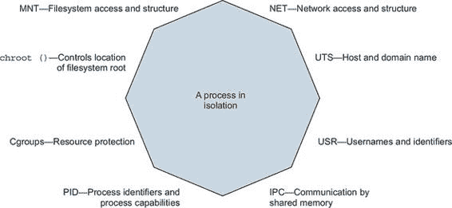
> 
> 最后提醒一次：Docker 及其使用的技术是不断发展的项目。本章中的示例适用于 Docker 1.13 及以后的版本。一旦你学会了本章中介绍的工具，记得在构建有价值的东西时检查发展、增强和新最佳实践。
> 
> 6.1. 设置资源限制
> 
> 物理系统资源，如内存和 CPU 上的时间，是稀缺的。如果计算机上进程的资源消耗超过了可用的物理资源，进程将遇到性能问题，并且可能停止运行。构建一个强大隔离的系统的一部分包括为单个容器提供资源限制。
> 
> 如果你想要确保一个程序不会耗尽你电脑上的其他程序，最简单的事情就是设置它可以使用的资源限制。你可以使用 Docker 管理内存、CPU 和设备资源限制。默认情况下，Docker 容器可能使用无限 CPU、内存和设备 I/O 资源。`docker container create` 和 `run` 命令提供了管理容器可用资源的标志。
> 
> 6.1.1. 内存限制
> 
> 内存限制是对容器可以使用的内存的最基本限制。它们限制了容器内进程可以使用的内存量。内存限制对于确保一个容器不能分配所有系统内存，从而让其他程序因缺少内存而无法运行非常有用。你可以通过在 `docker container run` 或 `docker container create` 命令中使用 `-m` 或 `--memory` 标志来设置限制。该标志接受一个值和一个单位。格式如下：
> 
> > `<数字><可选单位> 其中单位 = b, k, m 或 g`
> > 
> 在这些命令的上下文中，`b` 代表字节，`k` 代表千字节，`m` 代表兆字节，而 `g` 代表吉字节。将这项新知识应用于实践，启动一个你将在其他示例中使用的数据库应用程序：
> 
> > `docker container run -d --name ch6_mariadb \   --memory 256m \` `1` `--cpu-shares 1024 \   --cap-drop net_raw \   -e MYSQL_ROOT_PASSWORD=test \   mariadb:5.5`

+   1 设置内存限制

> 使用此命令，你将安装名为 MariaDB 的数据库软件，并启动一个内存限制为 256 兆字节的容器。你可能已经注意到了这个命令上的一些额外标志。本章将涵盖这些标志中的每一个，但你可能已经能够猜出它们的作用。还有一点需要注意，你不会暴露任何端口或将端口绑定到主机的接口。通过从主机上的另一个容器链接到这个数据库，将是最容易连接到这个数据库的方式。在我们到达那里之前，我们想确保你对这里发生的事情以及如何使用内存限制有一个全面的理解。
> 
> 关于内存限制，最重要的理解是它们并不是预留。它们不能保证指定数量的内存将可用。它们只是防止过度消耗的一种保护措施。此外，Linux 内核对内存会计和限制执行的实现非常高效，因此你不需要担心这个特性的运行时开销。
> 
> 在实施内存配额之前，你应该考虑两件事。首先，你运行的软件是否可以在提议的内存配额下运行？其次，你运行的系统是否可以支持这个配额？
> 
> 第一个问题通常很难回答。如今，很少看到开源软件会公布最低要求。即使公布了，你也必须理解软件的内存需求是如何根据你要处理的数据大小进行缩放的。无论是好是坏，人们往往会高估并根据试错进行调整。一个选择是在具有实际工作负载的容器中运行软件，并使用`docker stats`命令查看容器在实际中使用了多少内存。对于刚刚启动的`mariadb`容器，`docker stats ch6_mariadb`显示容器使用了大约 100 兆字节的内存，很好地适应了其 256 兆字节的限制。在内存敏感的工具，如数据库的情况下，数据库管理员等熟练的专业人士可以做出更明智的估计和建议。即便如此，问题通常由另一个问题回答：你有多少内存？这引出了第二个问题。
> 
> 你运行的系统是否可以支持这个配额？可以设置一个比系统上可用内存更大的内存配额。在具有交换空间（扩展到磁盘的虚拟内存）的主机上，容器可以实现这个配额。可以指定一个比任何物理内存资源更大的配额。在这些情况下，系统的限制将始终限制容器，运行时行为将与没有指定配额时相似。
> 
> 最后，了解如果软件耗尽可用内存，软件可能会以几种方式失败。一些程序可能会因为内存访问错误而失败，而其他程序可能会开始将内存不足错误写入它们的日志。Docker 既检测不到这个问题，也不会尝试减轻这个问题。它能做的最好的事情是应用你可能通过`--restart`标志指定的重启逻辑，该标志在第二章中描述。
> 
> 6.1.2\. CPU
> 
> 处理时间与内存一样稀缺，但饥饿效应是性能下降而不是失败。等待 CPU 时间的暂停进程仍在正确工作。但如果它运行的是一个重要的延迟敏感型数据处理程序、一个盈利的 Web 应用程序或您的应用程序的后端服务，则慢速进程可能比失败的进程更糟糕。Docker 允许您以两种方式限制容器的 CPU 资源。
> 
> 首先，您可以指定容器相对于其他容器的相对权重。Linux 使用此来决定容器相对于其他运行容器应使用的 CPU 时间百分比。这个百分比是针对容器可用的所有处理器的计算周期总和。
> 
> 要设置容器的 CPU 分享并建立其相对权重，`docker container run` 和 `docker container create` 都提供了 `--cpu-shares` 标志。提供的值应该是一个整数（这意味着您不应该引用它）。启动另一个容器以查看 CPU 分享如何工作：
> 
> > `docker container run -d -P --name ch6_wordpress \ --memory 512m \ --cpu-shares 512 \` `1` `--cap-drop net_raw \ --link ch6_mariadb:mysql \ -e WORDPRESS_DB_PASSWORD=test \ wordpress:5.0.0-php7.2-apache`

+   1 设置相对进程权重

> 此命令将下载并启动 WordPress 版本 5.0。它用 PHP 编写，是软件适应安全风险挑战的一个很好的例子。在这里，我们启动它时采取了一些额外的预防措施。如果您想在您的计算机上看到它运行，请使用 `docker port ch6_wordpress` 获取服务正在运行的端口号（我们将称之为 `<端口号>`），然后在您的网页浏览器中打开 http://localhost:<端口号>。如果您使用 Docker Machine，您需要使用 `docker-machine ip` 来确定 Docker 运行的虚拟机的 IP 地址。当您有了这个信息后，将此值替换为先前 URL 中的 localhost。
> 
> 当您启动 MariaDB 容器时，您将其相对权重（`cpu-shares`）设置为 `1024`，并将 WordPress 的相对权重设置为 512。这些设置创建了一个系统，其中 MariaDB 容器每获得一个 WordPress 循环就获得两个 CPU 循环。如果您启动了第三个容器并将其 `--cpu-shares` 值设置为 `2048`，则它将获得一半的 CPU 循环，MariaDB 和 WordPress 将以前相同的比例分割另一半。图 6.2 展示了根据系统总权重如何改变部分。
> 
> 图 6.2\. 相对权重和 CPU 分享
> 
> 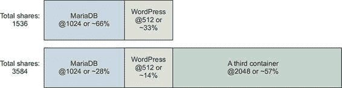
> 
> CPU 份额与内存限制不同，因为它们只在 CPU 时间竞争时强制执行。如果其他进程和容器处于空闲状态，容器可能会超出其限制。这种方法确保 CPU 时间不会被浪费，并且当其他进程需要 CPU 时，有限的进程会释放。此工具的目的是防止一个或一组进程压倒计算机，而不是阻碍这些进程的性能。默认设置不会限制容器，如果机器其他时间空闲，它将能够使用 100%的 CPU。
> 
> 现在您已经了解了`cpu-shares`如何按比例分配 CPU，我们将介绍`cpus`选项，它提供了一种限制容器使用的总 CPU 数量的方法。`cpus`选项通过配置 Linux 完全公平调度器（CFS）为容器分配 CPU 资源配额。Docker 允许将配额表示为容器应该能够使用的 CPU 核心数。默认情况下，CPU 配额每 100 毫秒分配、强制执行和刷新一次。如果一个容器使用了所有的 CPU 配额，其 CPU 使用率将被限制，直到下一个测量周期开始。以下命令将允许之前的 WordPress 示例消耗最多 0.75 个 CPU 核心：
> 
> > `docker container run -d -P --name ch6_wordpress \ --memory 512m \ --cpus 0.75 \` `1` `--cap-drop net_raw \ --link ch6_mariadb:mysql \ -e WORDPRESS_DB_PASSWORD=test \ wordpress:5.0.0-php7.2-apache`

+   1 使用最多 0.75 个 CPU

> Docker 还暴露了将容器分配到特定 CPU 集的能力。大多数现代硬件都使用多核 CPU。粗略地说，CPU 可以并行处理与核心数量相等的指令。这在您在同一台计算机上运行多个进程时特别有用。
> 
> 上下文切换是将执行一个进程的任务切换到执行另一个进程。上下文切换代价高昂，可能会对系统的性能产生明显的影响。在某些情况下，通过确保关键进程永远不会在相同的 CPU 核心集上执行，可以减少关键进程的上下文切换。您可以使用`docker container run`或`docker container create`命令中的`--cpuset-cpus`标志来限制容器只执行在特定的 CPU 核心集上。
> 
> 您可以通过对机器的一个核心进行压力测试并检查 CPU 工作负载来看到 CPU 集限制的实际效果：
> 
> > `# 启动一个仅限于单个 CPU 的容器并运行负载生成器 docker container run -d \ --cpuset-cpus 0 \` `1` `--name ch6_stresser  # 启动一个容器来监控负载下的 CPU docker container run -it --rm dockerinaction/ch6_htop`

+   1 限制为 CPU 编号 0

> 当你运行第二个命令时，你会看到`htop`显示正在运行的过程和可用 CPU 的工作负载。`ch6_stresser`容器将在 30 秒后停止运行，因此当你运行这个实验时不要延迟。使用完`htop`后，按 Q 键退出。在继续之前，请记住关闭并删除名为`ch6_stresser`的容器：
> 
> > `docker rm -vf ch6_stresser`
> > 
> 我们第一次使用它时觉得这很令人兴奋。为了获得最佳体验，请通过使用不同的`--cpuset-cpus`标志值重复此实验几次。如果你这样做，你会看到分配给不同核心或不同核心集的过程。值可以是列表或范围：

+   `0,1,2`—  包含 CPU 的前三个核心的列表

+   `0-2`—  包含 CPU 前三个核心的范围

> 6.1.3. 设备访问
> 
> 设备是我们将要讨论的最后一类资源。控制对设备的访问与内存和 CPU 限制不同。在容器内提供对主机设备的访问更像是资源授权控制，而不是限制。
> 
> Linux 系统拥有各种设备，包括硬盘、光驱、USB 驱动器、鼠标、键盘、音频设备和网络摄像头。容器默认可以访问主机的一些设备，而 Docker 为每个容器创建其他特定设备。这类似于虚拟终端为用户提供专用输入和输出设备的方式。
> 
> 有时，在主机和特定容器之间共享其他设备可能很重要。比如说，你正在运行需要访问网络摄像头的计算机视觉软件。在这种情况下，你需要授予运行你的软件的容器对系统上连接的网络摄像头设备的访问权限；你可以使用`--device`标志来指定要挂载到新容器中的一组设备。以下示例将你的网络摄像头在`/dev/video0`映射到新容器内的相同位置。运行此示例仅在你有一个在`/dev/video0`的网络摄像头时有效：
> 
> > `docker container run -it --rm --device /dev/video0:/dev/video0 \` `1` `ubuntu:16.04 ls -al /dev`

+   1 挂载 video0

> 提供的值必须是在主机操作系统上的设备文件与容器内部位置之间的映射。设备标志可以设置多次，以授予对不同设备的访问权限。
> 
> 在具有定制硬件或专有驱动程序的情况下，人们会发现这种设备访问方式很有用。与修改主机操作系统相比，这是一种更可取的方法。
> 
> 6.2. 共享内存
> 
> Linux 为同一计算机上运行的进程之间共享内存提供了一些工具。这种基于共享内存的进程间通信（IPC）以内存速度运行。当网络或基于管道的 IPC 的延迟导致软件性能低于要求时，通常会使用这种形式的 IPC。基于共享内存的 IPC 使用的最佳例子是在科学计算和一些流行的数据库技术，如 PostgreSQL。
> 
> Docker 默认为每个容器创建一个唯一的 IPC 命名空间。Linux IPC 命名空间分区共享内存原语，如命名共享内存块和信号量，以及消息队列。如果你不确定这些是什么，只需知道它们是 Linux 程序用来协调处理的一些工具。IPC 命名空间防止一个容器中的进程访问主机或其他容器上的内存。
> 
> 6.2.1\. 在容器之间共享 IPC 原语
> 
> 我们创建了一个名为 `dockerinactionch6_ipc` 的镜像，其中包含生产者和消费者。它们使用共享内存进行通信。以下内容将帮助你理解在单独的容器中运行这些程序的问题：
> 
> > `docker container run -d -u nobody --name ch6_ipc_producer \` `1` `--ipc shareable \ dockerinaction/ch6_ipc -producer` `docker container run -d -u nobody --name ch6_ipc_consumer \` `2` `dockerinaction/ch6_ipc -consumer`

+   1 启动生产者

+   2 启动消费者

> 这些命令启动了两个容器。第一个创建了一个消息队列，并开始在它上面广播消息。第二个应该从消息队列中提取消息并将其写入日志。你可以通过以下命令检查每个容器的日志来了解它们各自在做什么：
> 
> > `docker logs ch6_ipc_producer` `docker logs ch6_ipc_consumer`
> > 
> 注意到你所启动的容器中存在问题。消费者从未在队列中看到任何消息。每个进程使用相同的密钥来识别共享内存资源，但它们引用的是不同的内存。原因是每个容器都有自己的共享内存命名空间。
> 
> 如果你需要运行与不同容器中共享内存通信的程序，那么你需要使用 `--ipc` 标志将它们的 IPC 命名空间联合起来。`--ipc` 标志有一个容器模式，它将在与另一个目标容器相同的 IPC 命名空间中创建一个新的容器。这就像第五章中提到的 `--network` 标志一样。图 6.3 展示了容器及其命名空间共享内存池之间的关系。
> 
> 图 6.3\. 三个容器及其共享内存池；`producer` 和 `consumer` 共享单个池。
> 
> 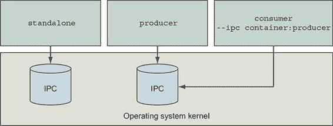
> 
> 使用以下命令自行测试联合 IPC 命名空间：
> 
> > `docker container rm -v ch6_ipc_consumer` `1` `docker container run -d --name ch6_ipc_consumer \` `2` `--ipc container:ch6_ipc_producer \` `3` `dockerinaction/ch6_ipc -consumer`

+   1 移除原始消费者

+   2 启动新消费者

+   3 联合 IPC 命名空间

> 这些命令重新构建了消费者容器，并重用了 `ch6_ipc_producer` 容器的 IPC 命名空间。这次，消费者应该能够访问服务器正在写入的相同内存位置。您可以通过以下命令检查每个容器的日志来查看此功能是否正常工作：
> 
> > `docker logs ch6_ipc_producer  docker logs ch6_ipc_consumer`
> > 
> 在继续之前，请记得清理您的运行中的容器：
> 
> > `docker rm -vf ch6_ipc_producer ch6_ipc_consumer`

+   使用 `v` 选项将清理卷。

+   使用 `f` 选项如果容器正在运行，则会将其终止。

+   `rm` 命令接受容器列表。

> 重复使用容器共享内存命名空间具有明显的安全影响。但如果需要，此选项是可用的。在容器之间共享内存比与主机共享内存更安全。可以使用 `--ipc=host` 选项与主机共享内存。然而，在现代 Docker 发行版中，共享主机内存是困难的，因为这违反了 Docker 对容器默认安全策略。
> 
> 随意查看此示例的源代码。这是一个丑陋但简单的 C 程序。您可以通过查看 Docker Hub 上镜像页面的源代码仓库来找到它。
> 
> 6.3. 理解用户
> 
> Docker 默认以由镜像元数据指定的用户启动容器，通常是 root 用户。root 用户几乎可以完全访问容器的状态。以该用户身份运行的任何进程都会继承这些权限。因此，如果这些进程中的一个存在错误，可能会损坏容器。有方法可以限制损害，但最有效的防止此类问题的方式是不使用 root 用户。
> 
> 存在合理的例外；有时使用 root 用户可能是最佳或唯一的选择。您使用 root 用户来构建镜像，在运行时没有其他选择时。类似地，有时您可能想在容器内运行系统管理软件。在这些情况下，进程需要不仅对容器而且对主机操作系统的特权访问。本节涵盖了这些问题的各种解决方案。
> 
> 6.3.1. 使用 run-as 用户工作
> 
> 在创建容器之前，能够知道默认将使用哪个用户名（以及用户 ID）将很好。默认值由镜像指定。目前还没有方法可以检查镜像以发现诸如 Docker Hub 中的默认用户之类的属性。您可以使用 `docker inspect` 命令检查镜像元数据。如果您在第二章中错过了它，`inspect` 子命令显示特定容器或镜像的元数据。一旦您已拉取或创建了一个镜像，您可以使用以下命令获取容器正在使用的默认用户名：
> 
> > `docker image pull busybox:1.29 docker image inspect busybox:1.29` `1` `docker inspect` `--``format "{{.Config.User}}" busybox:1.29` `2`

+   1 显示了 busybox 的所有元数据

+   2 仅显示由 busybox 镜像定义的运行用户

> 如果结果是空的，容器将默认以 root 用户运行。如果结果不为空，则可能是镜像作者特别指定了默认运行用户，或者你在创建容器时设置了特定的运行用户。第二个命令中使用的`--format`或`-f`选项允许你指定一个模板来渲染输出。在这种情况下，你选择了文档的`Config`属性的`User`字段。值可以是任何有效的 Golang 模板，所以如果你愿意，你可以用结果来发挥创意。
> 
> 这种方法有一个问题。运行用户可能会被镜像使用的入口点或命令更改。这些有时被称为引导或 init 脚本。`docker inspect`返回的元数据仅包括容器启动时的配置。因此，如果用户更改，它将不会反映在那里。
> 
> 目前，修复这个问题的唯一方法就是查看镜像内部。你可以在下载镜像文件后扩展它们，并手动检查元数据和 init 脚本，但这样做既耗时又容易出错。目前，进行一个简单的实验来确定默认用户可能更好。这将解决第一个问题，但不会解决第二个：
> 
> > `docker container run --rm --entrypoint "" busybox:1.29 whoami` `1` `docker container run --rm --entrypoint "" busybox:1.29 id` `2`

+   1 输出：root

+   2 输出：uid=0(root) gid=0(root) groups=10(wheel)

> 这展示了两个你可能使用的命令来确定镜像的默认用户（在本例中为`busybox:1.29`）。`whoami`和`id`命令在 Linux 发行版中很常见，因此它们很可能在任何给定的镜像中都可用。第二个命令更优越，因为它显示了运行用户的名字和 ID 详情。这两个命令都小心地取消了容器的入口点。这将确保在镜像名称之后指定的命令是容器执行的命令。这些虽然不能替代一流的形象元数据工具，但它们能完成任务。考虑两个 root 用户之间的简短交流，见图 6.4。
> 
> 图 6.4\. 根用户对根用户——一场安全剧
> 
> 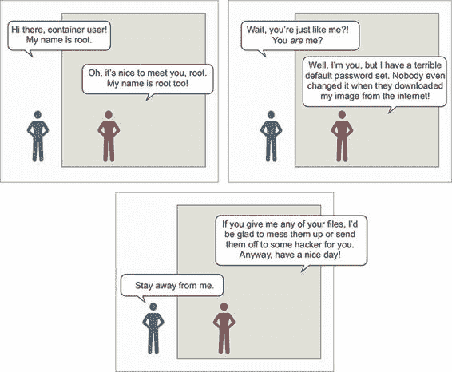
> 
> 如果你创建容器时更改运行用户，你可以完全避免默认用户问题。使用这个方法的怪癖是，用户名必须存在于你使用的镜像上。不同的 Linux 发行版带有预定义的不同用户，有些镜像作者会减少或增加这个集合。你可以使用以下命令来获取镜像中可用的用户列表：
> 
> > `docker container run --rm busybox:1.29 awk -F: '$0=$1' /etc/passwd`
> > 
> 在这里我们不会深入细节，但 Linux 用户数据库存储在位于 /etc/passwd 的文件中。此命令将从容器文件系统中读取该文件并提取用户名列表。一旦你确定了想要使用的用户，你可以创建一个新的容器并指定运行用户。Docker 在 `docker container run` 和 `docker container create` 命令中提供了 `--user` 或 `-u` 标志来设置用户。这将用户设置为 `nobody`：
> 
> > `docker container run --rm \    --user nobody ` `1` `busybox:1.29 id` `2`

+   1 设置运行用户为 nobody

+   2 输出：uid=65534(nobody) gid=65534(nogroup)

> 此命令使用了 `nobody` 用户。该用户是常见的，并旨在用于受限权限场景，例如运行应用程序。这只是其中一个例子。你可以使用在此图像中定义的任何用户名，包括 root。这仅仅触及了 `-u` 或 `--user` 标志所能做到的一小部分。该值可以接受任何用户或组对。当你通过名称指定用户时，该名称将被解析为容器 `passwd` 文件中指定的用户 ID (UID)。然后命令将使用该 UID 运行。这导致另一个特性。`--user` 标志也接受用户和组名称或 ID。当你使用 ID 而不是名称时，选项开始增多：
> 
> > `docker container run --rm \    -u nobody:nogroup ` `1` `busybox:1.29 id` `2` `docker container run --rm \    -u 10000:20000 ` `3` `busybox:1.29 id` `4`

+   1 设置运行用户为 nobody 和组为 nogroup

+   2 输出：uid=65534(nobody) gid=65534(nogroup)

+   3 设置 UID 和 GID

+   4 输出：uid=10000 gid=20000

> 第二个命令启动了一个新的容器，将运行用户和组设置为容器中不存在的用户和组。当这种情况发生时，ID 不会解析为用户或组名称，但所有文件权限都将像用户和组确实存在一样工作。根据容器中打包的软件的配置方式，更改运行用户可能会引起问题。否则，这是一个强大的功能，可以简化以有限权限运行应用程序并解决文件权限问题。
> 
> 在你的运行时配置中建立信心最好的方式是从受信任的来源拉取镜像或者构建你自己的镜像。与任何标准的 Linux 发行版一样，有可能进行恶意操作，例如通过使用启用了`suid`的程序将默认的非 root 用户转变为 root 用户，或者在不进行身份验证的情况下开放对 root 账户的访问。通过使用在第 6.6 节中描述的自定义容器安全选项可以减轻`suid`示例中的威胁，特别是`--security-opt no-new-privileges`选项。然而，这已经是交付过程中的后期来解决这个问题。就像完整的 Linux 主机一样，镜像应该使用最小权限原则进行分析和加固。幸运的是，Docker 镜像可以被专门构建来支持需要运行的应用程序，同时将其他所有内容排除在外。第七章、第八章和第十章介绍了如何创建最小化应用程序镜像。
> 
> 6.3.2. 用户和卷
> 
> 现在你已经了解了容器内的用户与主机系统上的用户共享相同的用户 ID 空间，你需要了解这两者之间可能如何交互。这种交互的主要原因是在卷中的文件权限。例如，如果你正在运行 Linux 终端，你应该能够直接使用这些命令；否则，你需要使用`docker-machine ssh`命令在你的 Docker Machine 虚拟机中获取 shell：
> 
> > `echo "e=mc²" > garbage` `1` `chmod 600 garbage` `2` `sudo chown root garbage` `3` `docker container run --rm -v "$(pwd)"/garbage:/test/garbage \    -u nobody \    ubuntu:16.04 cat /test/garbage` `4` `docker container run --rm -v "$(pwd)"/garbage:/test/garbage \    -u root ubuntu:16.04 cat /test/garbage` `5` `# 输出: "e=mc²"  # 清理垃圾 sudo rm -f garbage`

+   1 在你的主机上创建新文件

+   2 使文件只对文件所有者可读

+   3 使文件属于 root（假设你有 sudo 访问权限）

+   4 尝试以 nobody 读取文件

+   5 尝试以“容器 root”读取文件

> 第二个最后的`docker`命令应该失败并显示类似`Permission denied`的错误消息。但是最后一个`docker`命令应该成功并显示你第一个命令中创建的文件的内容。这意味着在卷中的文件权限在容器内部是被尊重的。但这同时也反映出用户 ID 空间是共享的。主机上的 root 和容器中的 root 都有用户 ID 0。因此，尽管容器中的`nobody`用户（ID 为 65534）无法访问主机上 root 拥有的文件，但容器中的 root 用户可以。
> 
> 如果你不希望文件对容器可访问，不要将该文件通过卷挂载到该容器中。
> 
> 关于这个例子的好消息是，你已经看到了文件权限是如何被尊重的，并且可以解决一些更平凡但实用的操作问题。例如，你如何处理写入卷的日志文件？
> 
> 最理想的方式是使用卷，如第四章所述。但即使如此，你也需要考虑文件所有权和权限问题。如果日志文件是由以用户 1001 身份运行的进程写入卷的，而另一个容器试图以用户 1002 的身份访问该文件，那么文件权限可能会阻止操作。
> 
> 克服这个障碍的一种方法就是专门管理运行用户的用户 ID。你可以通过在运行容器之前编辑镜像来设置你将要运行的用户的用户 ID，或者你可以使用所需的用户和组 ID（GID）：
> 
> > `mkdir logFiles  sudo chown 2000:2000 logFiles` `1` `docker container run --rm -v "$(pwd)"/logFiles:/logFiles \` `2` `-u 2000:2000 ubuntu:16.04 \` `3` `/bin/bash -c "echo This is important info > /logFiles/important.log"  docker container run --rm -v "$(pwd)"/logFiles:/logFiles \` `4` `-u 2000:2000 ubuntu:16.04 \` `5` `/bin/bash -c "echo More info >> /logFiles/important.log"  sudo rm –r logFiles`

+   将目录的所有权设置为所需的用户和组

+   2 写入重要日志文件

+   3 将 UID:GID 设置为 2000:2000

+   4 从另一个容器追加日志

+   5 还将 UID:GID 设置为 2000:2000

> 运行这个例子后，你会看到文件可以写入由用户 2000 拥有的目录。不仅如此，任何使用具有对该目录写入访问权限的用户或组的容器都可以在该目录中写入文件，或者如果权限允许，可以写入相同的文件。这个技巧适用于读取、写入和执行文件。
> 
> 有一个 UID 和文件系统交互需要特别提及。默认情况下，Docker 守护进程 API 可以通过位于主机上的/ var/run/docker.sock 的 UNIX 域套接字访问。域套接字通过文件系统权限受到保护，确保只有 root 用户和`docker`组的成员可以发送命令或从 Docker 守护进程检索数据。

| |
| --- |

> Docker API 的力量
> 
> `docker` 命令行程序几乎完全通过 API 与 Docker 守护进程交互，这应该让你感受到 API 的强大。任何可以读取和写入 Docker API 的程序都可以做`docker`能做的任何事情，前提是受 Docker 授权插件系统的限制。

| |
| --- |

> 管理或监控容器的程序通常需要能够读取甚至写入 Docker 守护进程的端点。读取或写入 Docker API 的能力通常是通过以具有读取或写入`docker.sock`权限的用户或组运行管理程序，并将`/var/run/docker.sock`挂载到容器中来提供的：
> 
> > `docker container run --rm -it –v /var/run/docker.sock:/var/run/docker.sock:ro ` `1` `-u root  monitoringtool` `2`

+   1 将主机上的 docker.sock 绑定到容器中作为只读文件

+   2 容器以 root 用户运行，与宿主机的文件权限相匹配

> 上述示例说明了特权程序作者相对常见的请求。你应该小心对待系统中哪些用户或程序可以控制你的 Docker 守护进程。如果用户或程序控制了你的 Docker 守护进程，那么它实际上控制了宿主机的 root 账户，可以运行任何程序或删除任何文件。
> 
> 6.3.3. Linux 用户命名空间和 UID 重映射简介
> 
> Linux 的 USR 用户命名空间将一个命名空间中的用户映射到另一个命名空间中的用户。用户命名空间的操作类似于进程标识符（PID）命名空间，容器 UID 和 GID 与主机的默认标识分离。
> 
> 默认情况下，Docker 容器不使用 USR 命名空间。这意味着运行与主机机器上用户 ID（数字，而非名称）相同的用户 ID 的容器具有与该用户相同的宿主文件权限。这并不是一个问题。容器内可用的文件系统已经被挂载，以便在容器内所做的更改将保留在容器文件系统中。但这确实会影响在容器之间或与主机共享文件的卷。
> 
> 当为容器启用用户命名空间时，容器的 UID 会被映射到主机上的一组非特权 UID。操作员通过在 Linux 中为主机定义`subuid`和`subgid`映射以及配置 Docker 守护进程的`userns-remap`选项来激活用户命名空间重映射。映射确定主机上的用户 ID 如何对应于容器命名空间中的用户 ID。例如，UID 重映射可以配置为将容器 UID 映射到从主机 UID 5000 开始的 1000 个 UID 范围内。结果是，容器中的 UID 0 会被映射到主机 UID 5000，容器 UID 1 映射到主机 UID 5001，以此类推，直到 1000 个 UID。由于从 Linux 的角度来看，UID 5000 是一个非特权用户，没有权限修改宿主系统文件，因此在容器中以`uid=0`运行的风险大大降低。即使容器化的进程从主机获取了文件或其他资源，该进程也将以重映射的 UID 运行，没有权限对该资源进行任何操作，除非操作员明确授予它这样做。
> 
> 用户命名空间重映射对于解决诸如在卷中读写等情况下文件权限问题特别有用。让我们通过一个示例来了解在用户命名空间启用的情况下，容器之间共享文件系统的情况。在我们的示例中，我们将假设 Docker 使用以下内容：

+   （默认的）`dockremap`用户用于重映射容器 UID 和 GID 范围

+   `/etc/subuid`中的`dockremap:5000:10000`条目，提供从 5000 开始的 10,000 个 UID 范围

+   `/etc/subgid`中的`dockremap:5000:10000`条目，提供从 5000 开始的 10,000 个 GID 范围

> 首先，让我们检查主机上`dockeremap`用户的用户 ID 和组 ID。然后，我们将创建一个由重映射容器 UID 0、主机 UID 5000 拥有的共享目录。
> 
> > `# id dockremap` `1` `uid=997(dockremap) gid=993(dockremap) groups=993(dockremap)` `# cat /etc/subuid dockremap:5000:10000` `# cat /etc/subgid dockremap:5000:10000` `# mkdir /tmp/shared` `# chown -R 5000:5000 /tmp/shared` `2`

+   1 检查主机上 dockremap 用户的用户 ID 和组 ID

+   2 将“shared”目录的所有权更改为用于重映射容器 UID 0 的 UID

> 现在以容器的 root 用户运行容器：
> 
> > `# docker run -it --rm --user root -v /tmp/shared:/shared -v /:/host alpine ash / # touch /host/afile` `1` `touch: /host/afile: Permission denied / # echo "hello from $(id) in $(hostname)" >> /shared/afile / # exit # 回到主机 shell # ls -la /tmp/shared/afile -rw-r--r--. 1 5000 5000 157 Apr 16 00:13 /tmp/shared/afile  # cat /tmp/shared/afile` `2` `hello from uid=0(root) gid=0(root) groups=0(root),1(bin),2(daemon),` `3` `3(sys),4(adm),6(disk),10(wheel),11(floppy),20(dialout),26(tape),` `3` `27(video) in d3b497ac0d34` `3`

+   1 主机挂载点由主机的 UID 和 GID 拥有：0:0，因此不允许写入

+   2 `/tmp/shared`由主机的非特权 UID 和 GID 拥有：5000:5000，因此允许写入

+   3 容器中 root 的 UID 为 0

> 此示例演示了在使用用户命名空间时对文件系统访问的影响。用户命名空间对于以特权用户运行或在不同容器之间共享数据的应用程序加强安全性非常有用。可以在创建或运行容器时根据容器禁用用户命名空间重映射，使其更容易成为默认执行模式。请注意，用户命名空间与某些可选功能（如 SELinux 或使用特权容器）不兼容。有关设计和实现利用用户命名空间重映射的 Docker 配置的详细信息，请参阅 Docker 网站上的安全文档。
> 
> 6.4. 使用能力调整操作系统功能访问
> 
> Docker 可以调整容器的授权以使用单个操作系统功能。在 Linux 中，这些功能授权被称为能力，但随着原生支持扩展到其他操作系统，将需要提供其他后端实现。每当进程尝试执行受限制的系统调用（如打开网络套接字）时，都会检查该进程的能力以确定所需的能力。如果进程具有所需的能力，则调用将成功，否则将失败。
> 
> 当你创建一个新的容器时，Docker 会移除除了运行大多数应用程序所必需和安全的显式能力列表之外的所有能力。这进一步隔离了运行进程与操作系统的管理功能。以下是一个移除的 37 个能力的示例，你可能能够猜测到它们被移除的原因：

+   SYS_MODULE—  插入/移除内核模块

+   SYS_RAWIO—  修改内核内存

+   SYS_NICE—  修改进程的优先级

+   SYS_RESOURCE—  覆盖资源限制

+   SYS_TIME—  修改系统时钟

+   AUDIT_CONTROL—  配置审计子系统

+   MAC_ADMIN—  配置 MAC 配置

+   SYSLOG—  修改内核打印行为

+   NET_ADMIN—  配置网络

+   SYS_ADMIN—  管理功能的总称

> Docker 容器默认提供的功能集提供了合理的功能缩减，但在某些时候你可能需要进一步添加或减少这个集合。例如，能力 NET_RAW 可能很危险。如果你想比默认配置更加小心，你可以从能力列表中移除 NET_RAW。你可以通过在`docker container create`或`docker container run`中使用`--cap-drop`标志来从容器中移除能力。首先，打印出在你的机器上运行的容器化进程的默认能力，并注意`net_raw`在能力列表中：
> 
> > `docker container run --rm -u nobody \ ubuntu:16.04 \ /bin/bash -c "capsh --print | grep net_raw"`
> > 
> 现在，在启动容器时移除`net_raw`能力。Grep 无法找到字符串`net_raw`，因为能力已经被移除，所以没有可见的输出：
> 
> > `docker container run --rm -u nobody \ --cap-drop net_raw \` `1` `ubuntu:16.04 \ /bin/bash -c "capsh --print | grep net_raw"`

+   1 移除 NET_RAW 能力

> 在 Linux 文档中，你经常会看到以全部大写字母命名并带有 CAP_ 前缀的能力，但如果你将其提供给能力管理选项，这个前缀将不起作用。为了获得最佳结果，请使用不带前缀的小写名称。
> 
> 与`--cap-drop`标志类似，`--cap-add`标志可以添加能力。如果你需要出于某种原因添加 SYS_ADMIN 能力，你可以使用以下命令：
> 
> > `docker container run --rm -u nobody \ ubuntu:16.04 \ /bin/bash -c "capsh --print | grep sys_admin"` `1` `docker container run --rm -u nobody \ --cap-add sys_admin \` `2` `ubuntu:16.04 \ /bin/bash -c "capsh --print | grep sys_admin"`

+   1 SYS_ADMIN 不包括在内。

+   2 添加 SYS_ADMIN

> 与其他容器创建选项一样，`--cap-add` 和 `--cap-drop` 都可以多次指定，分别用于添加或删除多个能力。这些标志可以用来构建容器，使进程能够执行恰好且仅是正确操作所必需的操作。例如，您可能能够以 `nobody` 用户身份运行网络管理守护进程，并给它 NET_ADMIN 能力，而不是直接在主机上以 root 用户身份或作为特权容器运行。如果您想知道容器中是否添加或删除了任何能力，您可以检查容器并打印输出中的 `.HostConfig.CapAdd` 和 `.HostConfig.CapDrop` 成员。
> 
> 6.5. 以完全权限运行容器
> 
> 当您需要在容器内运行系统管理任务时，您可以授予该容器对您的计算机的特权访问权限。特权容器保持其文件系统和网络隔离，但可以完全访问共享内存和设备，并拥有完整的系统能力。您可以使用特权容器执行多个有趣的任务，包括在容器内运行 Docker。
> 
> 特权容器的大部分用途是管理性的。例如，在一个根文件系统为只读的环境、在容器外安装软件被禁止或您无法直接访问主机上的 shell 的情况下。如果您想运行一个程序来调整操作系统（例如负载均衡），并且您有权在该主机上运行容器，那么您只需在特权容器中运行该程序即可。
> 
> 如果您发现只有通过特权容器的减少隔离才能解决的问题，请在 `docker container create` 或 `docker container run` 中使用 `--privileged` 标志来启用此模式：
> 
> > `docker container run --rm --privileged ubuntu:16.04 id` `1` `docker container run --rm --privileged ubuntu:16.04 capsh --print` `2` `docker container run --rm --privileged ubuntu:16.04 ls /dev` `3` `docker container run --rm --privileged ubuntu:16.04 networkctl` `4`

+   1 检查 ID

+   2 检查 Linux 能力

+   3 检查挂载设备列表

+   4 检查网络配置

> 特权容器仍然部分隔离。例如，网络命名空间仍然有效。如果您需要拆除该命名空间，您需要将其与 `--net host` 结合使用。
> 
> 6.6. 使用增强工具加强容器
> 
> Docker 使用合理的默认值和“包含电池”的工具集来简化采用并促进最佳实践。大多数现代 Linux 内核都启用了 seccomp，Docker 的默认 seccomp 配置文件阻止了超过 40 个大多数程序不需要的内核系统调用（syscalls）。如果您带来额外的工具，可以增强 Docker 构建的容器。您可以使用自定义 seccomp 配置文件、AppArmor 和 SELinux 等工具来加固容器。
> 
> 关于这些工具，已经写下了整本书。它们带来了自己的细微差别、优势和所需技能集。它们的使用可能比努力更有价值。对每个工具的支持因 Linux 发行版而异，所以你可能需要做一点工作。但一旦你调整了主机配置，Docker 的集成就会变得简单。

|    |
| --- |

> 安全研究
> 
> 信息安全领域复杂且不断演变。在阅读 InfoSec 专业人员之间的公开对话时，很容易感到不知所措。这些人通常技能高超，记忆力强，与开发人员或普通用户有着非常不同的背景。如果你能从公开的 InfoSec 对话中汲取任何东西，那就是平衡系统安全与用户需求是复杂的。
> 
> 如果你刚开始接触这个领域，最好的做法是在参与对话之前先从文章、论文、博客和书籍开始。这将给你一个机会消化一个观点，并在转向不同观点之前获得更深入的见解。当你有机会形成自己的见解和观点时，这些对话就会变得更有价值。
> 
> 阅读一篇论文或学习一项内容，并了解构建加固解决方案的最佳方式是很困难的。无论你的情况如何，系统都会通过包含来自多个来源的改进而不断发展。你能做的最好的事情就是单独学习每个工具。不要因为某些工具需要深入理解而感到害怕。这种努力是值得的，而且你会对你使用的系统有更深入的了解。
> 
> Docker 并非完美的解决方案。有些人甚至认为它不是一种安全工具。但它提供的改进远比放弃任何隔离以节省成本的替代方案要好。如果你已经读到这儿，也许你愿意进一步探讨这些辅助主题。

|    |
| --- |

> 6.6.1\. 指定额外的安全选项
> 
> Docker 提供了一个单独的 `--security-opt` 标志来指定配置 Linux 的 seccomp 和 Linux 安全模块（LSM）功能的选项。安全选项可以提供给 `docker container run` 和 `docker container create` 命令。此标志可以设置多次以传递多个值。
> 
> Seccomp 配置进程可以调用的 Linux 系统调用。Docker 的默认 seccomp 配置默认阻止所有系统调用，然后明确允许超过 260 个系统调用作为大多数程序的安全使用。被阻止的 44 个系统调用是不必要的，或者对于正常程序来说是不安全的（例如，`unshare`，用于创建新的命名空间）或者不能进行命名空间化（例如，`clock_settime`，用于设置机器的时间）。不建议更改 Docker 的默认 seccomp 配置。如果默认的 seccomp 配置过于严格或过于宽松，可以指定一个自定义配置作为安全选项：
> 
> > `docker container run --rm -it \    --security-opt seccomp=<FULL_PATH_TO_PROFILE> \    ubuntu:16.04 sh`
> > 
> `<FULL_PATH_TO_PROFILE>` 是定义容器允许的系统调用的 seccomp 配置文件的完整路径。GitHub 上的 Moby 项目包含 Docker 的默认 seccomp 配置文件，位于 profiles/seccomp/default.json，可以作为自定义配置文件的起点。使用特殊值 `unconfined` 来禁用容器对 seccomp 的使用。
> 
> Linux 安全模块（Linux Security Modules）是 Linux 采纳的一个框架，作为操作系统和安全提供者之间的接口层。AppArmor 和 SELinux 是 LSM 提供者。两者都提供强制访问控制，或 MAC（系统定义访问规则），并替换了标准的 Linux 自主访问控制（文件所有者定义访问规则）。
> 
> LSM 安全选项值指定在以下七种格式之一中：

+   要防止容器在启动后获得新的权限，使用 `no-new-privileges`。

+   要设置 SELinux 用户标签，使用形式 `label=user:<USERNAME>`，其中 `<USERNAME>` 是你想要用于标签的用户名。

+   要设置 SELinux 角色标签，使用形式 `label=role:<ROLE>`，其中 `<ROLE>` 是你想要应用于容器中进程的角色名称。

+   要设置 SELinux 类型标签，使用形式 `label=type:<TYPE>`，其中 `<TYPE>` 是容器中进程的类型名称。

+   要设置 SELinux 级别的标签，使用形式 `label:level:<LEVEL>`，其中 `<LEVEL>` 是容器中进程应运行的级别。级别指定为低-高对。如果仅缩写为低级别，SELinux 将解释范围为单个级别。

+   要禁用容器的 SELinux 标签约束，使用形式 `label= disable`。

+   要在容器上应用 AppArmor 配置文件，使用形式 `apparmor= <PROFILE>`，其中 `<PROFILE>` 是要使用的 AppArmor 配置文件名称。

> 如您从这些选项中可以猜到的，SELinux 是一个标签系统。一组标签，称为上下文，应用于每个文件和系统对象。类似的一组标签应用于每个用户和进程。在运行时，当进程尝试与文件或系统资源交互时，标签集将根据一组允许的规则进行评估。该评估的结果将确定交互是否被允许或阻止。
> 
> 最后一个选项将设置 AppArmor 配置文件。AppArmor 经常被 SELinux 替代，因为它与文件路径而不是标签一起工作，并且有一个训练模式，可以用来根据观察到的应用程序行为被动地构建配置文件。这些差异通常被引用为 AppArmor 更容易采用和维护的原因。
> 
> 有免费和商业工具可以监控程序的执行并生成针对应用程序定制的配置文件。这些工具帮助操作员使用测试和生产环境中实际程序行为的信息来创建一个有效的配置文件。
> 
> 6.7\. 构建适用于用例的容器
> 
> 容器是一个跨领域的关注点。人们使用它们的原因和方式比我们能列举的要多。所以，当你使用 Docker 构建容器来满足自己的需求时，花时间以适合你运行软件的方式去做是很重要的。
> 
> 实现这一点的最安全策略是从你可以构建的最隔离的容器开始，并合理地解释为什么需要放宽这些限制。现实中，人们往往比主动更倾向于反应。因此，我们认为 Docker 在默认容器构建方面找到了一个甜蜜点。它提供了合理的默认设置，同时又不阻碍用户的效率。
> 
> Docker 容器默认情况下并不是最隔离的。Docker 并不要求你增强那些默认设置。如果你愿意，它会让你在生产环境中做一些愚蠢的事情。这使得 Docker 看起来更像是一个工具，而不是负担，人们更愿意使用而不是感觉不得不使用。对于那些不愿意在生产环境中做愚蠢事情的人来说，Docker 提供了一个简单的接口来增强容器隔离。
> 
> 6.7.1 应用程序
> 
> 应用程序是我们使用计算机的全部原因。大多数应用程序是其他人编写的程序，它们可能处理恶意数据。考虑一下你的网络浏览器。
> 
> 网络浏览器是一种几乎安装在每台计算机上的应用程序。它与网页、图片、脚本、嵌入式视频、Flash 文档、Java 应用程序以及任何其他内容交互。你当然没有创建所有这些内容，大多数人也不是网络浏览器项目的贡献者。你怎么能信任你的网络浏览器正确处理所有这些内容呢？
> 
> 一些更加轻率的读者可能会忽略这个问题。毕竟，最糟糕的事情会是什么？好吧，如果攻击者控制了你的网络浏览器（或其他应用程序），他们将获得该应用程序的所有功能和运行该应用程序的用户权限。他们可能会破坏你的计算机，删除你的文件，安装其他恶意软件，甚至从你的计算机上对其他计算机发起攻击。所以，这不是可以忽视的好事情。问题仍然是：当你需要承担这种风险时，你该如何保护自己？
> 
> 最好的做法是隔离程序运行的风险。首先，确保应用程序以有限权限的用户身份运行。这样，如果出现问题，它将无法更改你计算机上的文件。其次，限制浏览器的系统功能。这样做可以确保你的系统配置更安全。第三，限制应用程序可以使用的 CPU 和内存量。限制有助于保留资源以保持系统响应。最后，具体列出它可以访问的设备也是一个好主意。这将防止窥探者访问你的网络摄像头、USB 等设备。
> 
> 6.7.2 高级系统服务
> 
> 高级系统服务与应用程序略有不同。它们不是操作系统的一部分，但您的计算机确保它们被启动并保持运行。这些工具通常位于操作系统之外的应用程序旁边，但它们通常需要特权访问权限才能正确运行。它们为系统上的用户和其他软件提供重要的功能。例如包括`cron`、`syslogd`、`dnsmasq`、`sshd`和`docker`。
> 
> 如果您不熟悉这些工具（希望不是全部），没关系。它们执行的任务包括保持系统日志、运行计划命令，以及提供从网络获取系统安全外壳的方法，而`docker`管理容器。
> 
> 虽然以 root 身份运行服务很常见，但其中很少需要完整的特权访问。考虑将服务容器化，并使用能力调整它们的访问权限，以满足它们需要的特定功能。
> 
> 6.7.3. 低级系统服务
> 
> 低级服务控制诸如设备或系统网络堆栈之类的功能。它们需要对其提供的系统组件具有特权访问权限（例如，防火墙软件需要网络堆栈的行政访问权限）。
> 
> 在容器内运行这些任务很少见。例如，文件系统管理、设备管理和网络管理都是主机核心关注点。大多数在容器中运行的软件都期望是可移植的。因此，像这些特定于机器的任务并不适合一般的容器使用场景。
> 
> 最好的例外是短运行配置容器。例如，在一个所有部署都使用 Docker 镜像和容器进行的环境中，您可能希望以推送软件的方式推送网络堆栈更改。在这种情况下，您可能将带有配置的镜像推送到主机，并使用特权容器进行更改。在这种情况下，风险降低，因为您编写了要推送的配置，容器不是长时间运行的，并且像这样的更改很容易审计。
> 
> 摘要
> 
> 本章介绍了 Linux 提供的隔离功能，并讨论了 Docker 如何使用这些功能来构建可配置的容器。有了这些知识，您将能够自定义容器隔离并使用 Docker 处理任何使用场景。本章涵盖了以下要点：

+   Docker 使用 cgroups，允许用户设置内存限制、CPU 权重、限制和核心限制，以及限制对特定设备的访问。

+   Docker 容器各自都有自己的 IPC 命名空间，可以与其他容器或主机共享，以便通过共享内存促进通信。

+   Docker 支持隔离 USR 命名空间。默认情况下，容器内的用户和组 ID 与主机机器上的相同 ID 等效。当启用用户命名空间时，容器内的用户和组 ID 被重新映射到主机上不存在的 ID。

+   你可以使用并应该使用 `docker container run` 和 `docker container create` 中的 `-u` 选项来以非 root 用户运行容器。

+   在可能的情况下，尽量避免以特权模式运行容器。

+   Linux 能力提供了操作系统功能授权。Docker 会取消某些能力，以提供合理的隔离默认设置。

+   可以使用 `--cap-add` 和 `--cap-drop` 标志来设置任何容器所授予的能力。

+   Docker 提供了与增强隔离技术（如 seccomp、SELinux 和 AppArmor）轻松集成的工具。这些是安全意识强的 Docker 用户应该调查的强大工具。
