> 第二部分\. 打包软件以进行分发
> 
> 不可避免地，Docker 用户将需要创建一个镜像。有时您需要的软件没有打包在镜像中。有时您可能需要一个在可用镜像中尚未启用的功能。本部分的四章将帮助您了解如何创建、定制和专门化您打算使用 Docker 部署或共享的镜像。
> 
> 第七章\. 在镜像中打包软件
> 
> 本章涵盖

+   手动镜像构建和实践

+   从打包的角度看镜像

+   与平面镜像一起工作

+   镜像版本控制最佳实践

> 本章的目标是帮助您了解镜像设计的相关问题，学习构建镜像的工具，并发现高级镜像模式。您将通过一个详尽的现实世界示例来完成这些任务。在开始之前，您应该对本书中第一部分（index_split_023.html#filepos151791）中的概念有牢固的掌握。
> 
> 您可以通过修改容器内现有的镜像或定义并执行一个名为 Dockerfile 的构建脚本来创建一个 Docker 镜像。本章重点介绍手动更改镜像的过程、镜像操作的基本原理以及产生的工件。Dockerfile 和构建自动化将在第八章（index_split_069.html#filepos755104）中介绍。
> 
> 7.1\. 从容器构建 Docker 镜像
> 
> 如果您已经熟悉使用容器，那么开始构建镜像会很容易。记住，联合文件系统（UFS）挂载提供了一个容器的文件系统。您对容器内文件系统所做的任何更改都将作为新层写入，这些层由创建它们的容器拥有。
> 
> 在您开始处理真实软件之前，下一节将详细说明使用“Hello, World”示例的典型工作流程。
> 
> 7.1.1\. 打包“Hello, World”
> 
> 从容器构建镜像的基本工作流程包括三个步骤。首先，您从现有镜像创建一个容器。您根据希望包含在新完成的镜像中的内容以及您需要用于更改的工具来选择镜像。
> 
> 第二步是修改容器的文件系统。这些更改将被写入容器联合文件系统的新层。我们将在本章后面重新探讨镜像、层和仓库之间的关系。
> 
> 一旦进行了更改，最后一步就是提交这些更改。然后您将能够从生成的镜像创建新的容器。图 7.1 展示了这个工作流程。
> 
> 图 7.1\. 从容器构建镜像
> 
> 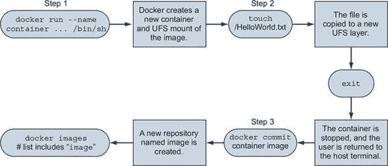
> 
> 在考虑这些步骤的基础上，执行以下命令以创建一个名为`hw_image`的新镜像：
> 
> > `docker container run --name hw_container \ ubuntu:latest \ touch /HelloWorld` `1` `docker container commit hw_container hw_image` `2` `docker container rm -vf hw_container` `3` `docker container run --rm \ hw_image \ ls -l /HelloWorld` `4`

+   1 修改容器中的文件

+   2 将更改提交到新镜像

+   3 删除已更改的容器

+   4 检查新容器中的文件

> 如果这看起来非常简单，你应该知道，随着你生成的镜像变得更加复杂，这个过程确实会变得稍微复杂一些，但基本步骤始终是相同的。现在你已经对工作流程有了概念，你应该尝试使用真实软件构建一个新的镜像。在这种情况下，你将打包一个名为 Git 的程序。
> 
> 7.1.2. 准备 Git 打包
> 
> Git 是一个流行的分布式版本控制工具。关于这个主题已经写了很多本书。如果你不熟悉它，我们建议你花些时间学习如何使用 Git。不过，目前你只需要知道它是一个你将要安装到 Ubuntu 镜像中的程序。
> 
> 要开始构建你自己的镜像，你需要首先从一个合适的基镜像创建一个容器：
> 
> > `docker container run -it --name image-dev ubuntu:latest /bin/bash`
> > 
> 这将启动一个新的容器，运行 bash shell。从这个提示符开始，你可以发出命令来自定义你的容器。Ubuntu 随带了一个名为 `apt-get` 的 Linux 工具，用于软件安装。这对于获取你想要打包到 Docker 镜像中的软件非常有用。现在你应该有一个交互式 shell 在你的容器中运行。接下来，你需要在这个容器中安装 Git。通过运行以下命令来完成：
> 
> > `apt-get update apt-get -y install git`
> > 
> 这将告诉 APT 在容器的文件系统中下载并安装 Git 及其所有依赖项。完成后，你可以通过运行 `git` 程序来测试安装：
> 
> > `git version # 输出类似：# git version 2.7.4`
> > 
> 包含 `apt-get` 这样的包管理工具使得安装和卸载软件比手动操作要容易得多。但它们并没有为该软件提供隔离，并且依赖冲突经常发生。你可以确信，在这个容器外部安装的其他软件不会影响你在容器内安装的 Git 版本。
> 
> 现在 Git 已经安装在你的 Ubuntu 容器中，你可以简单地退出容器：
> 
> > `exit`
> > 
> 容器应该已经停止，但仍然存在于你的电脑上。Git 已经在 `ubuntu:latest` 镜像的新层上安装。如果你现在离开这个例子，几天后再回来，你将如何知道确切发生了哪些更改？在打包软件时，审查容器中修改的文件列表通常非常有用，而 Docker 有一个用于此的命令。
> 
> 7.1.3. 审查文件系统更改
> 
> Docker 有一个命令可以显示容器内部所做的所有文件系统更改。这些更改包括添加、更改或删除的文件和目录。要审查你使用 APT 安装 Git 时所做的更改，请运行 `diff` 子命令：
> 
> > `docker container diff image-dev` `1`

+   1 输出文件更改的长列表

> 以 `A` 开头的行表示添加了文件。以 `C` 开头的表示文件已更改。最后，以 `D` 开头的表示文件被删除。以这种方式使用 APT 安装 Git 导致了多项更改。因此，最好通过一些具体的例子来观察其工作情况：
> 
> > `docker container run --name tweak-a busybox:latest touch /HelloWorld` `1` `docker container diff tweak-a # Output: #    A /HelloWorld` `2` `docker container run --name tweak-d busybox:latest rm /bin/vi` `3` `docker container diff tweak-d # Output: #    C /bin #    D /bin/vi` `4` `docker container run --name tweak-c busybox:latest touch /bin/vi` `5` `docker container diff tweak-c # Output: #    C /bin #    C /bin/busybox`

+   1 向 busybox 添加新文件

+   2 从 busybox 中删除现有文件

+   3 在 busybox 中现有文件更改

> 总是记得清理您的 workspace，如下所示：
> 
> > `docker container rm -vf tweak-a docker container rm -vf tweak-d docker container rm -vf tweak-c`
> > 
> 现在，您已经看到了对文件系统所做的更改，您准备将这些更改提交到一个新镜像中。与其他大多数事情一样，这涉及一个执行多项操作的单一命令。
> 
> 7.1.4. 提交新镜像
> 
> 您可以使用 `docker container commit` 命令从一个修改过的容器创建一个镜像。使用 `-a` 标志为镜像签名一个作者字符串是一个最佳实践。您还应该始终使用 `-m` 标志，它设置了一个提交信息。从您安装 Git 的 `image-dev` 容器创建并签名一个名为 `ubuntu-git` 的新镜像：
> 
> > `docker container commit -a "@dockerinaction" -m "Added git" \ image-dev ubuntu-git # 输出新的唯一镜像标识符，例如：# bbf1d5d430cdf541a72ad74dfa54f6faec41d2c1e4200778e9d4302035e5d143`
> > 
> 一旦您提交了镜像，它应该出现在您计算机上安装的镜像列表中。运行 `docker images` 应该包括如下一行：
> 
> > `REPOSITORY    TAG      IMAGE ID      CREATED        VIRTUAL SIZE ubuntu-git    latest   bbf1d5d430cd  5 seconds ago  248 MB`
> > 
> 确保它正常工作，通过从该镜像创建的容器测试 Git：
> 
> > `docker container run --rm ubuntu-git git version`
> > 
> 现在，您已经基于 Ubuntu 镜像创建了一个新镜像并安装了 Git。这是一个很好的开始，但您认为如果您省略了命令覆盖会发生什么？试一试来找出答案：
> 
> > `docker container run --rm ubuntu-git`
> > 
> 当您运行该命令时，似乎没有任何反应。这是因为您启动原始容器时使用的命令已经与新镜像一起提交。您用于启动创建该镜像的容器的命令是 `/bin/bash`。当您使用默认命令从这个镜像创建容器时，它将启动一个 shell 并立即退出。这不是一个非常有用的默认命令。
> 
> 我怀疑任何名为`ubuntu-git`的镜像的用户都不会期望每次都需要手动调用 Git。最好在镜像上设置入口点为`git`。入口点是容器启动时将执行的程序。如果没有设置入口点，将直接执行默认命令。如果设置了入口点，默认命令及其参数将作为参数传递给入口点。
> 
> 要设置入口点，你需要创建一个新的容器，并设置`--entrypoint`标志，然后从该容器创建一个新的镜像：
> 
> > `docker container run --name cmd-git --entrypoint git ubuntu-git` `1` `docker container commit -m "Set CMD git" \   -a "@dockerinaction" cmd-git ubuntu-git` `2` `docker container rm -vf cmd-git` `3` `docker container run --name cmd-git ubuntu-git version` `4`

+   1 显示标准 git 帮助并退出

+   2 将新镜像提交到相同名称

+   3 清理

+   4 测试

> 现在入口点已设置为`git`，用户不再需要输入命令。在这个例子中，这可能看起来节省不大，但许多人使用的工具并不那么简洁。设置入口点只是你可以做的使镜像更容易被用户使用并集成到他们的项目中的一件事。
> 
> 7.1.5\. 配置镜像属性
> 
> 当你使用`docker container commit`时，你将一个新的层提交到镜像中。文件系统快照并不是这个提交中唯一包含的东西。每一层还包括描述执行上下文的元数据。在创建容器时可以设置的参数中，以下所有参数都将随从容器创建的镜像一起传递：

+   所有环境变量

+   工作目录

+   暴露的端口集合

+   所有卷定义

+   容器入口点

+   命令和参数

> 如果这些值没有为容器特别设置，它们将继承自原始镜像。第一部分的这本书涵盖了这些内容，所以我们在这里不会重新介绍它们。但是，检查两个详细示例可能很有价值。首先，考虑一个引入两个环境变量特殊化的容器：
> 
> > `docker container run --name rich-image-example \   -e ENV_EXAMPLE1=Rich -e ENV_EXAMPLE2=Example \` `1` `busybox:latest  docker container commit rich-image-example rie` `2` `docker container run --rm rie \   /bin/sh -c "echo \$ENV_EXAMPLE1 \$ENV_EXAMPLE2"` `3`

+   1 创建环境变量专业化

+   2 提交镜像

+   3 输出：丰富示例

> 接下来，考虑一个在前面示例之上引入入口点和命令特殊化的容器：
> 
> > `docker container run --name rich-image-example-2 \   --entrypoint "/bin/sh" \` `1` `rie \   -c "echo \$ENV_EXAMPLE1 \$ENV_EXAMPLE2"` `2` `docker container commit rich-image-example-2 rie` `3` `docker container run --rm rie` `4`

+   1 设置默认入口点

+   2 设置默认命令

+   3 提交镜像

+   4 使用相同输出的不同命令

> 此示例在 BusyBox 上构建了两个额外的层。在两种情况下都没有更改文件，但由于上下文元数据已更改，行为发生了变化。这些更改包括在第一个新层中添加两个新的环境变量。这些环境变量显然被第二个新层继承，该层设置入口点和默认命令以显示它们的值。最后一个命令使用最终镜像而不指定任何替代行为，但很明显，之前定义的行为已被继承。
> 
> 现在你已经了解了如何修改镜像，花些时间深入了解镜像和层的机制。这样做将帮助你在实际情况下制作高质量的镜像。
> 
> 7.2\. 深入了解 Docker 镜像和层
> 
> 到此为止，你已经构建了一些镜像。在这些示例中，你首先从一个镜像（如 `ubuntu:latest` 或 `busybox:latest`）创建了一个容器。然后你在该容器内对文件系统或上下文进行了更改。最后，当你使用 `docker container commit` 命令创建新镜像时，一切似乎都正常工作。了解容器文件系统的工作原理以及 `docker container commit` 命令实际上做什么将帮助你成为一个更好的镜像作者。本节深入探讨这个主题，并展示了它对作者的影响。
> 
> 7.2.1\. 探索联合文件系统
> 
> 对于镜像作者来说，理解联合文件系统的细节非常重要，原因有两个：

+   作者需要了解添加、更改和删除文件对结果镜像的影响。

+   作者需要有一个坚实的理解，了解层与层之间的关系，以及层如何与镜像、存储库和标签相关联。

> 首先，考虑一个简单的例子。假设你想要对现有的镜像进行单个更改。在这种情况下，镜像为 `ubuntu:latest`，你想要在根目录中添加一个名为 mychange 的文件。你应该使用以下命令来完成此操作：
> 
> > `docker container run --name mod_ubuntu ubuntu:latest touch /mychange`
> > 
> 生成的容器（命名为 `mod_ubuntu`）将被停止，但会将其文件系统中的单个更改写入。如第三章和 4 章所述，根文件系统由启动容器的镜像提供。该文件系统使用联合文件系统实现。
> 
> 联合文件系统由层组成。每次对联合文件系统进行更改时，该更改都会记录在所有其他层之上的新层上。所有这些层的联合，或从上到下的视图，是容器（和用户）在访问文件系统时看到的。图 7.2 说明了此例的两个视角。
> 
> 图 [7.2]\. 从两个视角看联合文件系统上的简单文件写入示例
> 
> 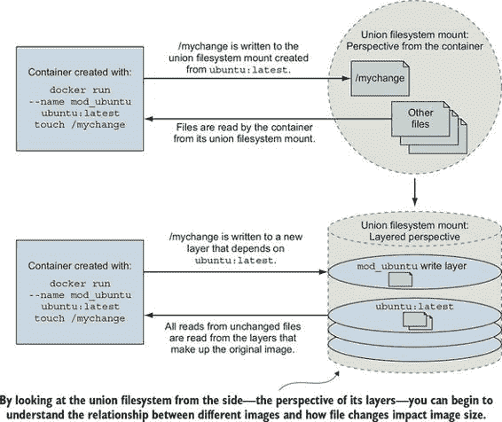
> 
> 当您从联合文件系统读取文件时，该文件将从它存在的最顶层读取。如果一个文件在顶层没有被创建或更改，读取将穿过层直到它到达存在该文件的层。这如图图 7.3 所示。
> 
> 图 7.3\. 读取位于不同层的文件
> 
> 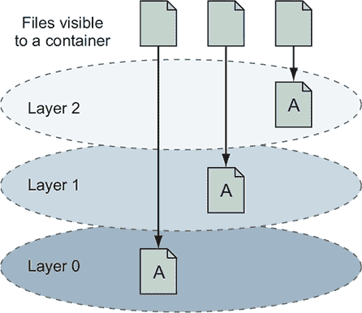
> 
> 所有这些层功能都被联合文件系统隐藏。在容器中运行的软件无需采取特殊操作即可利用这些功能。理解文件添加的层涵盖了三种类型的文件系统写入之一。其他两种是删除和文件更改。
> 
> 与添加一样，文件更改和删除都是通过修改顶层来实现的。当文件被删除时，会在顶层写入删除记录，这会隐藏该文件在底层版本。当文件被更改时，更改会被写入顶层，这同样会隐藏该文件在底层版本。容器文件系统所做的更改可以通过您在章节中使用的 `docker container diff` 命令列出：
> 
> > `docker container diff mod_ubuntu`
> > 
> 此命令将生成以下输出：
> 
> > `A /mychange`
> > 
> 在这种情况下，`A` 表示文件被添加。运行以下两个命令以查看文件删除是如何记录的：
> 
> > `docker container run --name mod_busybox_delete busybox:latest rm /etc/passwd docker container diff mod_busybox_delete`
> > 
> 这次，输出将包含两行：
> 
> > `C /etc D /etc/passwd`
> > 
> `D` 表示删除，但这次还包括文件的父文件夹。`C` 表示它已被更改。以下两个命令演示了文件更改：
> 
> > `docker container run --name mod_busybox_change busybox:latest touch \ /etc/passwd docker container diff mod_busybox_change`
> > 
> `diff` 子命令将显示两个更改：
> 
> > `C /etc C /etc/passwd`
> > 
> 再次强调，`C` 表示一个变化，这两个项目是文件及其所在文件夹。如果嵌套五层深度的文件被更改，则树中的每一层都会有一行。
> 
> 文件系统属性（如文件所有权和权限）的更改与文件更改的记录方式相同。在大量文件上修改文件系统属性时要小心，因为这些文件可能会被复制到执行更改的层。理解层文件添加是了解联合文件系统最重要的内容之一，我们将在下一部分稍作深入探讨。
> 
> 大多数联合文件系统使用一种称为写时复制（copy-on-write）的技术，如果你将其视为更改时复制，则更容易理解。当一个只读层（非顶层）中的文件被修改时，在做出更改之前，整个文件首先从只读层复制到可写层。这会对运行时性能和镜像大小产生负面影响。第 7.2.3 节介绍了这种影响应该如何影响你的镜像设计。
> 
> 请花一点时间，通过检查图 7.4 中更全面的场景集来巩固你对系统的理解。在这个示例中，文件被添加、更改、删除，并在三个层次范围内再次添加。
> 
> 图 7.4. 在三层镜像上的各种文件添加、更改和删除组合
> 
> 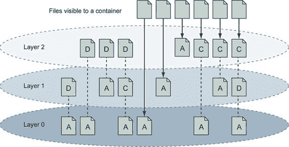
> 
> 了解文件系统更改是如何记录的，你就可以开始理解当你使用`docker container commit`命令创建新镜像时会发生什么。
> 
> 7.2.2. 重新介绍镜像、层、仓库和标签
> 
> 你通过使用`docker container commit`命令创建了一个镜像，并且你理解它将顶层更改提交到镜像中。但我们还没有定义提交。
> 
> 记住，联合文件系统由一系列层组成，新层被添加到堆栈的顶部。这些层作为该层更改的集合及其元数据单独存储。当你将容器对文件系统的更改提交时，你以可识别的方式保存了该顶层的一个副本。
> 
> 当你提交一个层时，为其生成一个新的 ID，并保存所有文件更改的副本。了解这一过程的具体细节不如了解一般方法重要。层的元数据包括生成的标识符、其下层的标识符（父层）以及从该层创建的容器的执行上下文。层标识符和元数据构成了 Docker 和 UFS 用来构建镜像的图。
> 
> 镜像是通过从给定的顶层开始，然后遵循每个层元数据中定义的父 ID 的所有链接得到的层堆栈。如图图 7.5 所示。
> 
> 图 7.5. 镜像是通过从顶层遍历父图产生的层集合。
> 
> 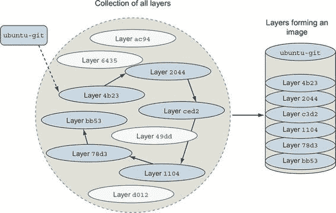
> 
> 镜像是通过遍历从起始层开始的层依赖图构建的层堆栈。遍历开始的层是堆栈的顶部。这意味着层的 ID 也是它及其依赖项形成的镜像的 ID。花点时间看看你之前创建的`mod_ubuntu`容器提交时的实际效果：
> 
> > `docker container commit mod_ubuntu`
> > 
> 该`commit`子命令将生成包含类似以下新镜像 ID 的输出：
> 
> > `6528255cda2f9774a11a6b82be46c86a66b5feff913f5bb3e09536a54b08234d`
> > 
> 您可以使用显示给您的镜像 ID 创建一个新的容器。与容器一样，层 ID 是难以直接处理的大十六进制数字。因此，Docker 提供了仓库。
> 
> 在第三章中，仓库被粗略地定义为图像的命名桶。更具体地说，仓库是位置/名称对，指向一组特定的层标识符。每个仓库至少包含一个指向特定层标识符的标签，从而定义了镜像。让我们回顾一下第三章中使用的示例：
> 
> 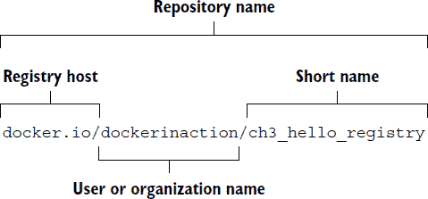
> 
> 这个仓库位于 Docker Hub 注册表中，但我们使用了完全限定的注册表主机名`docker.io`。它以用户名（`dockerinaction`）和一个独特的简短名称（`ch3_hello_registry`）命名。如果您不指定标签而拉取此仓库，Docker 将尝试拉取标记为`latest`的镜像。您可以通过在拉取命令中添加`--all-tags`选项来拉取仓库中的所有标记镜像。在这个例子中，只有一个标签：`latest`。该标签指向具有短形式 ID `4203899414c0`的层，如图 7.6 所示。
> 
> 图 7.6\. 仓库的视觉表示
> 
> 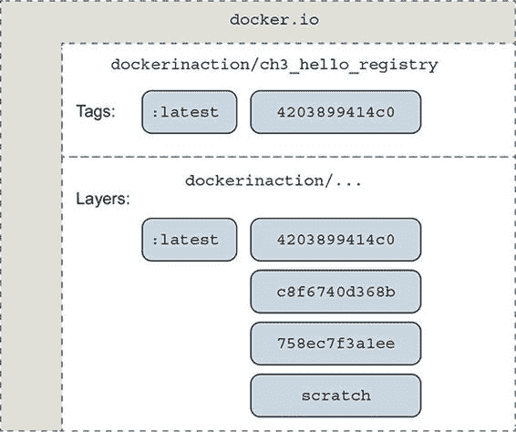
> 
> 使用`docker tag`、`docker container commit`或`docker build`命令创建仓库和标签。再次查看`mod_ubuntu`容器，并将其与标签一起放入仓库中：
> 
> > `docker container commit mod_ubuntu myuser/myfirstrepo:mytag # 输出：# 82ec7d2c57952bf57ab1ffdf40d5374c4c68228e3e923633734e68a11f9a2b59`
> > 
> 显示的 ID 将不同，因为创建了层的另一个副本。使用这个新的友好名称，从您的镜像创建容器需要很少的努力。如果您想复制一个镜像，您只需从现有的镜像创建一个新的标签或仓库。您可以使用`docker tag`命令做到这一点。每个仓库默认都包含一个`latest`标签。如果省略了标签，将使用该标签，如前一个命令所示：
> 
> > `docker tag myuser/myfirstrepo:mytag myuser/mod_ubuntu`
> > 
> 到目前为止，您应该对基本的 UFS 基础知识和 Docker 如何创建和管理层、镜像和仓库有了深刻的理解。考虑到这些，让我们考虑它们可能对镜像设计产生的影响。
> 
> 为容器创建的可写层下面的所有层都是不可变的，这意味着它们永远不能被修改。这个特性使得可以共享对镜像的访问，而不是为每个容器创建独立的副本。这也使得单个层非常易于重用。这个特性的另一方面是，每次你对镜像进行更改时，都需要添加一个新的层，而旧的层永远不会被删除。既然知道镜像不可避免地需要更改，就需要了解任何镜像的限制，并记住更改如何影响镜像大小。
> 
> 7.2.3. 管理镜像大小和层限制
> 
> 如果镜像像大多数人管理文件系统一样发展，Docker 镜像很快就会变得不可用。例如，假设你想要制作本章前面创建的 `ubuntu-git` 镜像的不同版本。修改那个 `ubuntu-git` 镜像可能看起来很自然。在你这样做之前，为你的 `ubuntu-git` 镜像创建一个新的标签。你将重新分配最新标签：
> 
> > `docker image tag ubuntu-git:latest ubuntu-git:2.7` `1`

+   1 创建新标签：2.7

> 在构建新镜像时，你首先会移除你安装的 Git 版本：
> 
> > `docker container run --name image-dev2 \   --entrypoint /bin/bash \` `1` `ubuntu-git:latest -c "apt-get remove -y git"` `2` `docker container commit image-dev2 ubuntu-git:removed` `3` `docker image tag ubuntu-git:removed ubuntu-git:latest` `4` `docker image ls` `5`

+   1 执行 bash 命令

+   2 移除 Git

+   3 提交镜像

+   4 重新分配最新标签

+   5 检查镜像大小

> 报告的镜像列表和大小看起来可能如下所示：
> 
> > `REPOSITORY   TAG        IMAGE ID        CREATED           VIRTUAL SIZE ubuntu-git   latest     826c66145a59    10 seconds ago    226.6 MB ubuntu-git   removed    826c66145a59    10 seconds ago    226.6 MB ubuntu-git   2.7        3e356394c14e    41 hours ago      226 MB ...`
> > 
> 注意，即使你移除了 Git，镜像的实际大小实际上增加了。虽然你可以使用 `docker container diff` 来检查具体的变化，但你应该迅速意识到增加的原因与联合文件系统有关。
> 
> 记住，UFS 会通过实际上向顶层添加文件来标记文件为已删除。原始文件和存在于其他层的任何副本仍然存在于镜像中。为了使将消费你的镜像的人和系统受益，最小化镜像大小是很重要的。如果你可以通过智能创建镜像来避免造成长时间的下载时间和显著的磁盘使用，你的消费者将受益。在 Docker 的早期阶段，镜像作者有时会最小化镜像中的层数，因为镜像存储驱动程序的限制。现代 Docker 镜像存储驱动程序没有普通用户会遇到的镜像层限制，因此设计时考虑其他属性，如大小和缓存性。
> 
> 你可以使用`docker image history`命令检查镜像中的所有层。它将显示以下内容：

+   简化的层 ID

+   层的年龄

+   创建容器的初始命令

+   那一层的总文件大小

> 通过检查`ubuntu-git:removed`镜像的历史，你可以看到已经在原始`ubuntu:latest`镜像的顶部添加了三个层：
> 
> > `docker image history ubuntu-git:removed`
> > 
> 输出类似于以下内容：
> 
> > `IMAGE          CREATED          CREATED BY                    SIZE 826c66145a59   24 分钟前   /bin/bash -c apt-get remove   662 kB 3e356394c14e   42 小时前     git                           0 B bbf1d5d430cd   42 小时前     /bin/bash                     37.68 MB b39b81afc8ca   3 个月前     /bin/sh -c #(nop) CMD [/bin   0 B 615c102e2290   3 个月前     /bin/sh -c sed -i 's/^#\s*\   1.895 kB 837339b91538   3 个月前     /bin/sh -c echo '#!/bin/sh'   194.5 kB 53f858aaaf03   3 个月前     /bin/sh -c #(nop) ADD file:   188.1 MB 511136ea3c5a   22 个月前                                  0 B`
> > 
> 你可以通过使用`docker image save`将镜像保存为 TAR 文件来扁平化镜像，然后使用`docker image import`将那个文件系统的内容导入 Docker。但这不是一个好主意，因为你将丢失原始镜像的元数据、变更历史以及当客户下载具有相同底层版本的镜像时可能获得的任何节省。在这种情况下，更明智的做法是创建一个分支。
> 
> 而不是与层系统作斗争，你可以通过使用层系统创建分支来解决大小和层增长问题。层系统使得回溯镜像的历史并创建新的分支变得非常简单。每次从相同的镜像创建容器时，你都有可能创建一个新的分支。
> 
> 在重新考虑你的新`ubuntu-git`镜像策略时，你应该简单地再次从`ubuntu:latest`开始。使用从`ubuntu:latest`的新鲜容器，你可以安装你想要的任何版本的 Git。结果是，你创建的原始`ubuntu-git`镜像和新的镜像将共享相同的父镜像，并且新的镜像不会携带任何无关变更的负担。
> 
> 分支增加了你需要重复在同级分支中完成步骤的可能性。手动完成这项工作容易出错。使用 Dockerfile 自动化镜像构建是一个更好的主意。
> 
> 有时需要从头开始构建一个完整的镜像。Docker 为`scratch`镜像提供了特殊的处理，这告诉构建过程将下一个命令作为结果的第一个层。如果你的目标是保持镜像小，并且你正在使用依赖项很少的技术，如 Go 或 Rust 编程语言，这种做法可能是有益的。在其他时候，你可能想将镜像扁平化以修剪镜像的历史。在两种情况下，你需要一种导入和导出完整文件系统的方法。
> 
> 7.3\. 导出和导入扁平文件系统
> 
> 在某些情况下，通过在联合文件系统或容器上下文之外处理用于镜像的文件来构建镜像是有利的。为了满足这一需求，Docker 提供了两个命令用于导出和导入文件的归档。
> 
> `docker container export`命令会将扁平化联合文件系统的全部内容以 tar 包的形式输出到 stdout 或输出文件。结果是包含容器视角下所有文件的 tar 包。如果你需要在容器上下文之外使用与镜像一起提供的文件系统，这可能很有用。你可以使用`docker cp`命令来做到这一点，但如果需要多个文件，导出整个文件系统可能更直接。
> 
> 创建一个新的容器并使用`export`子命令来获取其文件系统的扁平化副本：
> 
> > `docker container create --name export-test \  

+   1 导出文件系统内容

+   2 显示归档内容

> 这将在当前目录中生成一个名为 contents.tar 的文件。该文件应包含来自`ch7_packed`镜像的两个文件：message.txt 和 folder/message.txt。在此阶段，你可以提取、检查或更改这些文件以实现任何目的。归档还将包含一些与设备相关的零字节文件以及 Docker 为每个容器管理的文件，如/etc/resolv.conf。你可以忽略这些文件。如果你省略了`--output`（或简写为`-o`），那么文件系统的内容将以 tar 包格式流式传输到 stdout。将内容流式传输到 stdout 使得`export`命令可以与其他处理 tar 包的 shell 程序链式使用。
> 
> `docker import`命令会将 tar 包的内容流式传输到一个新镜像中。`import`命令识别几种压缩和非压缩的 tar 包形式。在文件系统导入期间还可以应用可选的 Dockerfile 指令。导入文件系统是获取完整最小文件集到镜像的简单方法。
> 
> 为了了解这有多有用，考虑一个静态链接的“Hello, World.” Go 版本。创建一个空文件夹并将以下代码复制到一个名为 helloworld.go 的新文件中：
> 
> > `package main import "fmt" func main() {         fmt.Println("hello, world!") }`
> > 
> 你可能没有在电脑上安装 Go，但对于 Docker 用户来说这并不是问题。通过运行下一个命令，Docker 将拉取包含 Go 编译器的镜像，编译并静态链接代码（这意味着它可以独立运行），并将该程序放回你的文件夹中：
> 
> > `docker container run --rm -v "$(pwd)":/usr/src/hello \  
> > 
> 如果一切正常，你应该在同一文件夹中有一个可执行的程序（二进制文件），命名为 hello。静态链接的程序在运行时没有外部文件依赖。这意味着这个静态链接版本的“Hello, World”可以在没有其他文件的容器中运行。下一步是将这个程序放入一个 tar 包中：
> 
> > `tar -cf static_hello.tar hello`
> > 
> 现在程序已经被打包成 tar 包，你可以使用`docker import`命令来导入它：
> 
> > `docker import -c "ENTRYPOINT [\"/hello\"]"` `-` `\ dockerinaction/ch7_static < static_hello.tar` `1`

+   1 通过 UNIX 管道流式传输的 tar 文件

> 在这个命令中，你使用`-c`标志来指定 Dockerfile 命令。你使用的命令设置了新镜像的入口点。Dockerfile 命令的确切语法在第八章中有介绍。这个命令中更有趣的参数是第一行末尾的连字符（`-`）。这个连字符表示 tar 包的内容将通过 stdin 流式传输。如果你是从远程 Web 服务器而不是本地文件系统获取文件，你可以在这个位置指定一个 URL。
> 
> 你将生成的镜像标记为`dockerinaction/ch7_static`仓库。花点时间探索一下结果：
> 
> > `docker container run dockerinaction/ch7_static` `1` `docker history dockerinaction/ch7_static`

+   1 输出：hello, world!

> 你会注意到这个镜像的历史记录只有一个条目（和层）：
> 
> > `IMAGE           CREATED         CREATED BY     SIZE edafbd4a0ac5    11 minutes ago                 1.824 MB`
> > 
> 在这种情况下，你生成的镜像很小有两个原因。首先，你生成的程序只有 1.8 MB 多一点，你没有包含操作系统文件或支持程序。这是一个极简主义镜像。其次，只有一个层。在底层没有携带被删除或未使用的文件。使用单层（或扁平）镜像的缺点是，你的系统不会从层重用中受益。如果你的所有镜像都足够小，这可能不是问题。但如果你使用较大的堆栈或不支持静态链接的语言，开销可能会很大。
> 
> 每个镜像设计决策都有权衡，包括是否使用扁平镜像。无论你使用什么机制来构建镜像，你的用户都需要一个一致且可预测的方式来识别不同的版本。
> 
> 7.4. 版本控制最佳实践
> 
> 实用版本控制实践有助于用户充分利用镜像。有效版本控制方案的目标是清晰沟通并提供灵活性给镜像用户。
> 
> 除非是第一个版本，否则仅构建或维护单个版本的软件通常是不够的。如果你正在发布软件的第一个版本，你应该从一开始就关注用户的采用体验。版本很重要，因为它们标识了采用者所依赖的合同。意外的软件更改会给采用者带来问题，版本是表示软件更改的主要方式之一。
> 
> 使用 Docker，维护同一软件的多个版本的关键在于适当的仓库标签。理解每个仓库包含多个标签，并且多个标签可以引用相同的镜像，这是实用标签方案的核心。
> 
> `docker image tag`命令与其他两个可以用来创建标签的命令不同。它是唯一应用于现有镜像的命令。为了了解如何使用标签以及它们如何影响用户采用体验，请考虑图 7.7 中显示的仓库的两个标签方案。
> 
> 图 7.7\. 同一仓库中三个镜像的两个标签方案（左侧和右侧）。虚线表示标签和镜像之间的旧关系。
> 
> 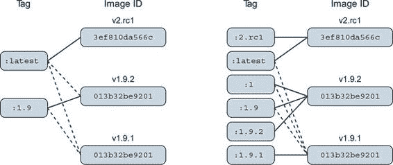
> 
> 图 7.7 左侧的标签方案有两个问题。首先，它提供了较差的采用灵活性。用户可以选择声明对`1.9`或`latest`的依赖。当用户采用 1.9 版本而实际实现是 1.9.1 时，他们可能会对该构建版本定义的行为产生依赖。如果没有明确依赖该构建版本的方法，当 1.9 更新到指向 1.9.2 时，他们将会遇到痛苦。
> 
> 消除这个问题的最佳方法是定义和标记版本，让用户可以依赖一致的合同。这并不是提倡三层版本控制系统。这意味着你使用的版本系统中的最小单位只捕获合同迭代的最低单位。通过在这个级别提供多个标签，你可以让用户决定他们愿意接受多少版本漂移。
> 
> 考虑图 7.7 的右侧。采用版本 1 的用户将始终使用该主版本下的最高次小版本和构建版本。采用 1.9 将始终使用该次小版本的最高构建版本。需要仔细在不同版本的依赖项之间迁移的采用者可以在控制和选择的时间进行迁移。
> 
> 第二个问题与`latest`标签相关。在左侧，`latest`当前指向一个未做其他标签的镜像，因此采用者无法知道这是哪个版本的软件。在这种情况下，它指的是软件下一个主要版本的候选发布版。一个未察觉的用户可能会采用`latest`标签，以为它指的是已标记版本的最新构建版本。
> 
> `latest` 标签存在其他问题。它被采用得比应有的频率更高。这是因为它是默认标签。影响是，有责任的仓库维护者应始终确保其仓库的 `latest` 指向其软件的最新稳定构建，而不是真正的最新版本。
> 
> 最后要记住的是，在容器上下文中，你不仅对软件进行版本控制，还对软件所有打包依赖项的快照进行版本控制。例如，如果你使用特定的 Linux 发行版（如 Debian）打包软件，那么这些额外的包将成为你镜像接口合同的一部分。你的用户将围绕你的镜像构建工具，在某些情况下可能会依赖你镜像中存在特定的 shell 或脚本。如果你突然将你的软件基于类似 CentOS 这样的平台，但其他方面软件保持不变，你的用户将感到痛苦。
> 
> 当软件依赖项发生变化，或者软件需要基于多个基础进行分发时，这些依赖项应包含在你的标签方案中。
> 
> Docker 官方仓库是理想的参考例子。考虑以下官方 `golang` 仓库的简略标签列表，其中每一行代表一个不同的镜像：
> 
> > `1.9,             1.9-stretch, 1.9.6 1.9-alpine 1,               1.10,        1.10.2,          latest,    stretch 1.10-alpine,     alpine`
> > 
> 用户可以确定 Golang 1、1.x 和 1.10 的最新版本目前都指向 1.10.2 版本。Golang 用户可以选择一个标签来跟踪 Golang 或基础操作系统的更改。如果采用者需要基于 `debian:stretch` 平台构建的最新镜像，他们可以使用 `stretch` 标签。这种方案将升级的控制和责任交到采用者手中。
> 
> 摘要
> 
> 这是第一章节，涵盖了 Docker 镜像的创建、标签管理以及其他如镜像大小等分发问题。学习这些材料将帮助你构建镜像，并成为更好的镜像消费者。本章的关键点如下：

+   当使用 `docker container commit` 命令提交容器更改时，将创建新的镜像。

+   当容器被提交时，启动时使用的配置将被编码到生成的镜像的配置中。

+   镜像是一系列层，由其顶层来标识。

+   镜像在磁盘上的大小是其组件层大小的总和。

+   可以使用 `docker container export` 和 `docker image import` 命令将镜像导出为 flat tarball 表示形式，并从中导入。

+   可以使用 `docker image tag` 命令为单个仓库分配多个标签。

+   仓库维护者应保持实用的标签，以简化用户的采用和迁移控制。

+   使用 `latest` 标签标记最新的稳定构建。

+   提供细粒度和重叠的标签，以便采用者可以控制其依赖项版本爬升的范围。

> 第八章\. 使用 Dockerfile 自动构建镜像
> 
> 本章涵盖

+   使用 Dockerfile 进行自动化的镜像打包

+   元数据和文件系统指令

+   使用参数和多个阶段创建可维护的镜像构建

+   多进程和耐用容器的包装

+   减少镜像攻击面和建立信任

> Dockerfile 是一个包含构建镜像指令的文本文件。Docker 镜像构建器从上到下执行 Dockerfile，指令可以配置或更改关于镜像的任何内容。从 Dockerfile 构建镜像使得像将文件添加到来自你电脑的容器这样的任务变得简单的一行指令。Dockerfile 是描述如何构建 Docker 镜像最常见的方式。
> 
> 本章涵盖了使用 Dockerfile 构建的基础知识以及使用它们的最佳理由，对指令的简洁概述以及如何添加未来的构建行为。我们将从一个熟悉的例子开始，展示如何通过代码自动化构建镜像的过程，而不是手动创建它们。一旦在代码中定义了镜像的构建，跟踪版本控制中的更改、与团队成员共享、优化和确保安全性都变得简单。
> 
> 8.1\. 使用 Dockerfile 打包 GIT
> 
> 让我们从回顾我们在第七章中手动构建的 Git 示例镜像开始。在翻译镜像构建过程从手动操作到代码的过程中，你应该能识别出许多与使用 Dockerfile 工作的细节和优势。
> 
> 首先，创建一个新的目录，然后从该目录使用你喜欢的文本编辑器创建一个新文件。将新文件命名为 Dockerfile。写下以下五行，然后保存文件：
> 
> > `# 安装 Git 到 Ubuntu 的示例 Dockerfile FROM ubuntu:latest LABEL maintainer="dia@allingeek.com" RUN apt-get update && apt-get install -y git ENTRYPOINT ["git"]`
> > 
> 在剖析此示例之前，使用包含 Dockerfile 的同一目录中的`docker image build`命令从它构建一个新的镜像，并用`auto`标记该镜像：
> 
> > `docker image build --tag ubuntu-git:auto .`
> > 
> 这将输出关于`apt-get`步骤和输出的多行信息，最终会显示如下信息：
> 
> > `Successfully built cc63aeb7a5a2 Successfully tagged ubuntu-git:auto`
> > 
> 运行此命令将启动构建过程。完成后，你应该有一个全新的镜像可以进行测试。使用以下命令查看所有`ubuntu-git`镜像的列表，并测试最新版本：
> 
> > `docker image ls`
> > 
> 新的标记为`auto`的构建现在应该出现在列表中：
> 
> > `REPOSITORY   TAG        IMAGE ID        CREATED             VIRTUAL SIZE ubuntu-git   auto       cc63aeb7a5a2     2 minutes ago      219MB ubuntu-git   latest     826c66145a59    10 minutes ago      249MB ubuntu-git   removed    826c66145a59    10 minutes ago      249MB ubuntu-git   1.9        3e356394c14e    41 hours ago        249MB ...`
> > 
> 现在，您可以使用新的镜像运行 Git 命令：
> 
> > `docker container run --rm ubuntu-git:auto`
> > 
> 这些命令演示了您使用 Dockerfile 构建的镜像可以正常工作，并且功能上与您手动构建的镜像等效。检查您做了什么来实现这一点：
> 
> 首先，您创建了一个包含四个指令的 Dockerfile：

+   `FROM ubuntu:latest`—  告诉 Docker 从最新的 Ubuntu 镜像开始，就像您手动创建镜像时那样。

+   `LABEL maintainer`—  设置镜像的维护者姓名和电子邮件。提供此信息有助于人们知道在镜像出现问题时联系谁。这在前面的 `commit` 调用中已经完成。

+   `RUN apt-get update && apt-get install -y git`—  告诉构建器运行提供的命令来安装 Git。

+   `ENTRYPOINT ["git"]`—  将镜像的入口点设置为 `git`。

> Dockerfile，像大多数脚本一样，可以包含注释。任何以 `#` 开头的行都将被构建器忽略。对于任何复杂性的 Dockerfile 来说，良好的文档记录非常重要。除了提高 Dockerfile 的可维护性外，注释还有助于人们审计他们考虑采用的镜像，并传播最佳实践。
> 
> 关于 Dockerfile 的唯一特殊规则是第一条指令必须是 `FROM`。如果您从一个空镜像开始，并且您的软件没有依赖项，或者您将提供所有依赖项，那么您可以从一个名为 `scratch` 的特殊空仓库开始。
> 
> 在保存了 Dockerfile 之后，您通过调用 `docker image build` 命令开始了构建过程。该命令设置了一个标志和一个参数。`--tag` 标志（或简写为 `-t`）指定了您希望用于结果镜像的完整仓库标识。在这种情况下，您使用了 `ubuntu-git:auto`。您在末尾包含的参数是一个单独的点。该参数告诉构建器 Dockerfile 的位置。点号告诉它在该当前目录中查找文件。
> 
> `docker image build` 命令还有一个标志，`--file`（或简写为 `-f`），允许您设置 Dockerfile 的名称。`Dockerfile` 是默认值，但使用此标志，您可以告诉构建器查找名为 BuildScript 或 release-image.df 的文件。此标志仅设置文件的名称，而不是位置。这必须在位置参数中始终指定。
> 
> 构建器通过自动化您手动创建镜像时使用的相同任务来工作。每条指令都会触发创建一个新的容器，并应用指定的修改。修改完成后，构建器提交该层，然后继续执行下一条指令和由新层创建的下一个容器。
> 
> 构建器验证了 `FROM` 指令指定的镜像是否作为构建的第一步安装。如果没有安装，Docker 会自动尝试拉取该镜像。查看您运行的 `build` 命令的输出：
> 
> > `将构建上下文发送到 Docker 守护进程  2.048kB 步骤 1/4 : FROM ubuntu:latest ---> 452a96d81c30`
> > 
> 您可以看到，在这种情况下，`FROM` 指令指定的基本镜像为 `ubuntu:latest`，这应该已经安装在了您的机器上。基本镜像的缩写 ID 包含在输出中。
> 
> 下一条指令设置了镜像的维护者信息。这会创建一个新的容器，然后提交生成的层。您可以在步骤 1 的输出中看到此操作的成果：
> 
> > `步骤 2/4 : 标签维护者="dia@allingeek.com" ---> 在 11140b391074 中运行 移除中间容器 11140b391074`
> > 
> 输出包括创建的容器 ID 和提交的层 ID。该层将作为下一个指令 `RUN` 的镜像顶层。`RUN` 指令在新的镜像层上执行您指定的程序，然后 Docker 将文件系统更改提交到该层，以便它们对下一个 Dockerfile 指令可用。在这种情况下，`RUN` 指令的输出被 `apt-get update && apt-get install -y git` 命令的所有输出所覆盖。安装软件包是 `RUN` 指令最常见的使用场景之一。您应该明确安装容器需要的每个软件包，以确保在需要时可用。
> 
> 如果您对大量的构建过程输出不感兴趣，可以使用带有 `--quiet` 或 `-q` 标志的 `docker image build` 命令。在静默模式下运行将抑制构建过程和管理中间容器的所有输出。静默模式下的构建过程唯一输出是生成的镜像 ID，如下所示：
> 
> > `sha256:e397ecfd576c83a1e49875477dcac50071e1c71f76f1d0c8d371ac74d97bbc90`
> > 
> 虽然安装 Git 的这一步通常需要更长的时间才能完成，但您可以看到指令和输入，以及运行命令的容器 ID 和生成层的 ID。最后，`ENTRYPOINT` 指令执行所有相同的步骤，输出同样不出所料：
> 
> > `步骤 4/4 : ENTRYPOINT ["git"] ---> 在 6151803c388a 中运行 移除中间容器 6151803c388a ---> e397ecfd576c 成功构建 e397ecfd576c 成功标记 ubuntu-git:auto`
> > 
> 在构建的每一步之后，都会向生成的镜像中添加一个新的层。虽然这意味着您可以在这些步骤中的任何一步进行分支，但更重要的是，构建者可以积极缓存每一步的结果。如果在其他几个步骤之后构建脚本出现问题，构建者可以在问题解决后从相同的位置重新启动。您可以通过破坏 Dockerfile 来看到这一过程。
> 
> 将此行添加到您的 Dockerfile 末尾：
> 
> > `RUN 这将不会工作`
> > 
> 然后再次运行构建：
> 
> > `docker image build --tag ubuntu-git:auto .`
> > 
> 输出将显示构建者能够跳过哪些步骤以使用缓存结果：
> 
> > `Sending build context to Docker daemon  2.048kB Step 1/5 : FROM ubuntu:latest ---> 452a96d81c30 Step 2/5 : LABEL maintainer="dia@allingeek.com" ---> 使用缓存` `1` `---> 83da14c85b5a Step 3/5 : RUN apt-get update && apt-get install -y git ---> 使用缓存` `1` `---> 795a6e5d560d Step 4/5 : ENTRYPOINT ["git"] ---> 使用缓存` `1` `---> 89da8ffa57c7 Step 5/5 : RUN 这将不会工作 ---> 在 2104ec7bc170 /bin/sh: 1: This: not found 命令 '/bin/sh -c 这将不会工作' 返回了非零代码：127`

+   1. 注意缓存的使用。

> 步骤 1 至 4 被跳过，因为它们在您上一次构建时已经构建完成。步骤 5 失败，因为容器中没有名为`This`的程序。在这种情况下，容器输出是有价值的，因为错误消息会告知您 Dockerfile 的具体问题。如果您修复了问题，相同的步骤将再次被跳过，构建将成功，输出类似于`Successfully built d7a8ee0cebd4`。
> 
> 在构建过程中使用缓存可以在构建包括下载材料、编译程序或其他耗时操作时节省时间。如果您需要进行完整重建，您可以在`docker image build`中使用`--no-cache`标志来禁用缓存的使用。请确保仅在需要时禁用缓存，因为它会给上游源系统和镜像构建系统带来更大的压力。
> 
> 这个简短的例子使用了 18 个 Dockerfile 指令中的 4 个。这个例子有限制，因为添加到镜像中的所有文件都是从网络上下载的；这个例子以有限的方式修改了环境并提供了一般工具。下一个例子，它具有更具体的目的和本地代码，提供了一个更完整的 Dockerfile 入门。
> 
> 8.2. DOCKERFILE 入门
> 
> Dockerfile 由于其简洁的语法和允许注释而易于表达和理解。您可以使用任何版本控制系统跟踪 Dockerfile 的更改。维护多个镜像版本就像维护多个 Dockerfile 一样简单。Dockerfile 构建过程本身使用广泛的缓存来帮助快速开发和迭代。构建是可追踪和可重复的。它们可以轻松地与现有的构建系统集成，并与许多持续集成工具集成。鉴于有这么多理由更喜欢 Dockerfile 构建而不是手动制作的镜像，学习如何编写它们是非常重要的。
> 
> 本节中的示例涵盖了大多数镜像中使用的核心 Dockerfile 指令。以下部分展示了如何创建下游行为和更易于维护的 Dockerfile。这里对每个指令都进行了入门级别的介绍。对于每个指令的深入覆盖，最佳参考始终是网上 Docker 文档[`docs.docker.com/engine/reference/builder/`](https://docs.docker.com/engine/reference/builder/)。Docker 构建器参考还提供了良好的 Dockerfile 示例和最佳实践指南。
> 
> 8.2.1. 元数据指令
> 
> 第一个示例构建了一个基础镜像和两个使用第二章中使用的不同版本的 mailer 程序的镜像。该程序的目的是在 TCP 端口上监听消息，然后将这些消息发送给预期的接收者。mailer 的第一个版本将监听消息，但只记录这些消息。第二个版本将消息作为`HTTP POST`发送到定义的 URL。
> 
> 使用 Dockerfile 构建的最佳理由之一是它们简化了从您的计算机到镜像中复制文件的过程。但并不是所有文件都适合复制到镜像中。开始一个新项目时首先要做的是定义哪些文件永远不应该被复制到任何镜像中。您可以在名为.dockerignore 的文件中完成这项工作。在这个例子中，您将创建三个 Dockerfile，并且都不需要复制到生成的镜像中。
> 
> 使用您喜欢的文本编辑器创建一个名为.dockerignore 的新文件，并复制以下行：
> 
> > `.dockerignore mailer-base.df mailer-logging.df mailer-live.df`
> > 
> 完成后保存并关闭文件。这将防止.dockerignore 文件，或名为 mailer-base.df、mailer-logging.df 或 mailer-live.df 的文件在构建过程中被复制到镜像中。完成这部分会计工作后，你就可以开始对基础镜像进行工作了。
> 
> 构建基础镜像有助于创建公共层。每个邮件器的版本都将建立在名为`mailer-base`的镜像之上。当你创建 Dockerfile 时，需要记住每个 Dockerfile 指令都将导致创建一个新的层。尽可能地将指令组合在一起，因为构建器不会执行任何优化。将以下内容放入实践中，创建一个名为 mailer-base.df 的新文件，并添加以下行：
> 
> > `FROM debian:buster-20190910 LABEL maintainer="dia@allingeek.com" RUN groupadd -r -g 2200 example && \ useradd -rM -g example -u 2200 example ENV APPROOT="/app" \ APP="mailer.sh" \ VERSION="0.6" LABEL base.name="Mailer Archetype" \ base.version="${VERSION}" WORKDIR $APPROOT ADD . $APPROOT ENTRYPOINT ["/app/mailer.sh"]` `1` `EXPOSE 33333 # Do not set the default user in the base otherwise # implementations will not be able to update the image # USER example:example`

+   1 此文件尚不存在。

> 通过在 mailer-base 文件所在的目录中运行`docker image build`命令来将所有内容组合在一起。`-f`标志告诉构建器使用哪个文件名作为输入：
> 
> > `docker image build -t dockerinaction/mailer-base:0.6 -f mailer-base.df .`

|    |
| --- |

> Dockerfile 的命名
> 
> Dockerfile 的默认和最常见名称是 Dockerfile。然而，Dockerfile 可以命名为任何东西，因为它们是简单的文本文件，并且构建命令接受你告诉它的任何文件名。有些人使用扩展名（如.df）来命名他们的 Dockerfile，这样他们就可以在单个项目目录中轻松定义多个镜像的构建（例如，app-build.df、app-runtime.df 和 app-debug-tools.df）。文件扩展名还使得在编辑器中激活 Dockerfile 支持变得容易。

|    |
| --- |

> 在这个 Dockerfile 中引入了五个新指令。第一个新指令是`ENV`。`ENV`用于为镜像设置环境变量，类似于`docker container run`或`docker container create`上的`--env`标志。在这种情况下，使用单个`ENV`指令设置了三个不同的环境变量。虽然也可以用三个随后的`ENV`指令来完成，但这样做会导致创建三个层。你可以通过使用反斜杠来转义换行符（就像在 shell 脚本中一样）来保持指令易于阅读：
> 
> > `Step 4/9 : ENV APPROOT="/app"     APP="mailer.sh"     VERSION="0.6" ---> Running in c525f774240f Removing intermediate container c525f774240f`
> > 
> 在 Dockerfile 中声明的环境变量将对生成的镜像可用，但可以在其他 Dockerfile 指令中使用作为替换。在这个 Dockerfile 中，环境变量`VERSION`被用作下一个新指令`LABEL`的替换：
> 
> > `Step 5/9 : LABEL base.name="Mailer Archetype"       base.version="${VERSION}" ---> Running in 33d8f4d45042 Removing intermediate container 33d8f4d45042 ---> 20441d0f588e`
> > 
> `LABEL` 指令用于定义作为镜像或容器的附加元数据记录的键/值对。这反映了 `docker run` 和 `docker create` 中的 `--label` 标志。像之前的 `ENV` 指令一样，可以使用单个指令设置多个标签。在这种情况下，`VERSION` 环境变量的值被替换为 `base.version` 标签的值。通过这种方式使用环境变量，`VERSION` 的值将可供容器内运行的过程使用，并记录到适当的标签中。这增加了 Dockerfile 的可维护性，因为当值在单一位置设置时，做出不一致的更改会更困难。

|    |
| --- |

> 使用标签组织元数据
> 
> Docker Inc. 建议使用标签记录元数据以帮助组织镜像、网络、容器和其他对象。每个标签键应该以受作者控制或合作的域的反向 DNS 表示法作为前缀，例如 `com.<你的公司>.some-label`。标签是灵活的、可扩展的且轻量级，但缺乏结构使得利用信息变得困难。
> 
> 标签模式项目 ([`label-schema.org/`](http://label-schema.org/)) 是一个社区努力，旨在标准化标签名称并推广兼容的工具。该模式涵盖了镜像的许多重要属性，如构建日期、名称和描述。例如，当使用标签模式命名空间时，构建日期的键命名为 `org.label-schema.build-date`，并且应该具有 RFC 3339 格式的值，例如 `2018-07-12T16:20:50.52Z`。

|    |
| --- |

> 下两条指令是 `WORKDIR` 和 `EXPOSE`。这些指令在操作上与 `docker run` 和 `docker create` 命令中的相应标志类似。`WORKDIR` 指令的参数被一个环境变量所替代：
> 
> > `步骤 6/9 : WORKDIR $APPROOT 移除中间容器 c2cb1fc7bf4f ---> cb7953a10e42`
> > 
> `WORKDIR` 指令的结果将是一个默认工作目录设置为 `/app` 的镜像。将 `WORKDIR` 设置为不存在的位置将创建该位置，就像使用命令行选项一样。最后，`EXPOSE` 命令创建一个打开 TCP 端口 33333 的层：
> 
> > `步骤 9/9 : EXPOSE 33333 ---> 在 cfb2afea5ada 容器中运行  移除中间容器 cfb2afea5ada ---> 38a4767b8df4`
> > 
> 你应该能识别出这个 Dockerfile 中的 `FROM`、`LABEL` 和 `ENTRYPOINT` 指令。简要来说，`FROM` 指令设置层堆栈从 `debian:buster-20190910` 镜像开始。任何新构建的层都将放置在这个镜像之上。`LABEL` 指令向镜像的元数据添加键/值对。`ENTRYPOINT` 指令设置容器启动时运行的可执行文件。在这里，它将指令设置为 `exec ./mailer.sh` 并使用指令的 shell 形式。
> 
> `ENTRYPOINT`指令有两种形式：shell 形式和 exec 形式。shell 形式看起来像带有空格分隔的参数的 shell 命令。exec 形式是一个字符串数组，其中第一个值是要执行的命令，其余值是参数。使用 shell 形式指定的命令将作为默认 shell 的参数执行。具体来说，在这个 Dockerfile 中使用的命令将在运行时作为`/bin/sh –c 'exec ./mailer.sh'`执行。最重要的是，如果使用 shell 形式为`ENTRYPOINT`，则将忽略`CMD`指令提供的所有其他参数或作为`docker container run`的额外参数在运行时提供的参数。这使得 shell 形式的`ENTRYPOINT`灵活性较低。
> 
> 你可以从构建输出中看到，`ENV`和`LABEL`指令每个都只产生了一步和一层。但输出并没有显示环境变量值被正确替换。为了验证这一点，你需要检查镜像：
> 
> > `docker inspect dockerinaction/mailer-base:0.6`

|    |
| --- |

> 小贴士
> 
> 记住，`docker inspect`命令可以用来查看容器或镜像的元数据。在这种情况下，你用它来检查了一个镜像。

|    |
| --- |

> 相关的行如下：
> 
> > `"Env": [ "PATH=/usr/local/sbin:/usr/local/bin:/usr/sbin:/usr/bin:/sbin:/bin", "APPROOT=/app", "APP=mailer.sh", "VERSION=0.6" ], ... "Labels": { "base.name": "Mailer Archetype", "base.version": "0.6", "maintainer": "dia@allingeek.com" }, ... "WorkingDir": "/app"`
> > 
> 元数据清楚地表明环境变量替换是有效的。你可以在`ENV`、`ADD`、`COPY`、`LABEL`、`WORKDIR`、`VOLUME`、`EXPOSE`和`USER`指令中使用这种替换形式。
> 
> 最后一条注释行是一个元数据指令`USER`。它为所有后续的构建步骤和从镜像创建的容器设置了用户和组。在这种情况下，在基础镜像中设置它将防止任何下游的 Dockerfile 安装软件。这意味着那些 Dockerfile 将需要在权限之间来回切换默认设置。这样做至少会创建两个额外的层。更好的方法是，在基础镜像中设置用户和组账户，然后让实现者在构建完成后设置默认用户。
> 
> 这个 Dockerfile 最奇特的地方在于`ENTRYPOINT`被设置为一个不存在的文件。当你尝试从这个基础镜像运行容器时，entrypoint 将会失败。但现在 entrypoint 已经在基础镜像中设置，这意味着对于特定邮件发送器的实现，将少一个需要复制的层。接下来的两个 Dockerfile 构建了不同的`mailer.sh`实现。
> 
> 8.2.2\. 文件系统指令
> 
> 包含自定义功能的镜像需要修改文件系统。Dockerfile 定义了三个修改文件系统的指令：`COPY`、`VOLUME` 和 `ADD`。第一个实现的 Dockerfile 应该放置在一个名为 mailer-logging.df 的文件中：
> 
> > `FROM dockerinaction/mailer-base:0.6 RUN apt-get update && \     apt-get install -y netcat COPY ["./log-impl", "${APPROOT}"] RUN chmod a+x ${APPROOT}/${APP} && \     chown example:example /var/log USER example:example VOLUME ["/var/log"] CMD ["/var/log/mailer.log"]`
> > 
> 在这个 Dockerfile 中，你使用由 mailer-base 生成的镜像作为起点。三条新指令是 `COPY`、`VOLUME` 和 `CMD`。`COPY` 指令将从镜像构建的文件系统中的文件复制到构建容器中。`COPY` 指令至少需要两个参数。最后一个参数是目标，所有其他参数都是源文件。这个指令只有一个意外的特性：任何复制的文件都将设置文件所有者为 root。这无论在 `COPY` 指令之前默认用户是如何设置的都适用。最好是将更改文件所有权的 `RUN` 指令推迟到所有需要更新的文件都已复制到镜像中。
> 
> `COPY` 指令，就像 `ENTRYPOINT` 和其他指令一样，将尊重 shell 风格和 exec 风格的参数。但如果任何参数包含空格，你需要使用 exec 形式。

|    |
| --- |

> 小贴士
> 
> 在可能的情况下尽可能使用 exec（或字符串数组）形式是最佳实践。至少，Dockerfile 应该保持一致，避免混合风格。这将使你的 Dockerfile 更易于阅读，并确保指令的行为符合你的预期，而无需深入了解它们的细微差别。

|    |
| --- |

> 第二条新指令是 `VOLUME`。如果你理解了在调用 `docker run` 或 `docker create` 时 `--volume` 标志的作用，那么它的行为将完全符合你的预期。字符串数组参数中的每个值都将作为新卷定义创建在结果层中。在镜像构建时定义卷比在运行时更有限制。你在镜像构建时无法指定绑定挂载卷或只读卷。`VOLUME` 指令只会做两件事：在镜像文件系统中创建定义的位置，然后将卷定义添加到镜像元数据中。
> 
> 在这个 Dockerfile 中的最后一条指令是 `CMD`。`CMD` 与 `ENTRYPOINT` 指令密切相关，如图 8.1 所示。它们都采用 shell 或 exec 形式，并且都用于在容器内启动进程。但存在一些重要差异。
> 
> 图 8.1\. `ENTRYPOINT` 和 `CMD` 之间的关系
> 
> 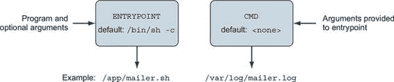
> 
> `CMD`命令表示入口点的参数列表。容器的默认入口点是`/bin/sh`。如果容器没有设置入口点，则传递值，因为命令将被默认入口点包装。但是，如果设置了入口点并且使用 exec 形式声明，您将使用`CMD`来设置默认参数。此 Dockerfile 将`ENTRYPOINT`定义为邮件器命令。此 Dockerfile 注入了 mailer.sh 的实现并定义了一个默认参数。使用的参数是用于日志文件的应使用位置。
> 
> 在构建镜像之前，您需要创建邮件程序的日志版本。在`./log-impl`目录中创建一个目录。在该目录内，创建一个名为 mailer.sh 的文件，并将以下脚本复制到该文件中：
> 
> > `#!/bin/sh printf "Logging Mailer has started.\n" while true do     MESSAGE=$(nc -l -p 33333)     printf "[Message]: %s\n" "$MESSAGE" > $1     sleep 1 done`
> > 
> 此脚本的详细结构并不重要。您需要知道的是，此脚本将在 33333 端口启动邮件器守护程序，并将它接收到的每条消息写入程序的第一个参数指定的文件中。使用以下命令从包含 mailer-logging.df 的目录构建`mailer-logging`镜像：
> 
> > `docker image build -t dockerinaction/mailer-logging -f mailer-logging.df .`
> > 
> 此镜像构建的结果可能不会太引人注目。现在，从新镜像启动一个命名容器：
> 
> > `docker run -d --name logging-mailer dockerinaction/mailer-logging`
> > 
> 日志邮件器现在应该构建并运行。链接到此实现的容器将它们的消息记录到`/var/log/mailer.log`。这在现实世界的场景中可能不太有趣或有用，但它可能对测试很有帮助。一个发送电子邮件的实现将更适合操作监控。
> 
> 下一个实现示例使用亚马逊网络服务提供的简单电子邮件服务发送电子邮件。从另一个 Dockerfile 开始。将此文件命名为 mailer-live.df：
> 
> > `FROM dockerinaction/mailer-base:0.6 ADD ["./live-impl", "${APPROOT}"] RUN apt-get update && \     apt-get install -y curl netcat python && \     curl "https://bootstrap.pypa.io/get-pip.py" -o "get-pip.py" && \     python get-pip.py && \     pip install awscli && \     rm get-pip.py && \     chmod a+x "${APPROOT}/${APP}" USER example:example CMD ["mailer@dockerinaction.com", "pager@dockerinaction.com"]`
> > 
> 此 Dockerfile 包含一个新指令`ADD`。`ADD`指令与`COPY`指令类似，但有两个重要区别。`ADD`指令将

+   如果指定了 URL，则获取远程源文件

+   提取任何确定为存档文件的源文件

> 在这两个功能中，自动提取归档文件更有用。使用 `ADD` 指令的远程获取功能不是好的实践；尽管这个功能很方便，但它没有提供清理未使用文件和导致额外层的机制。相反，你应该使用链式 `RUN` 指令，就像 mailer-live.df 的第三条指令一样。
> 
> 在这个 Dockerfile 中需要注意的另一个指令是 `CMD`，其中传递了两个参数。在这里，你指定了任何发送的电子邮件的“发件人”和“收件人”字段。这与 mailer-logging.df 不同，后者只指定了一个参数。
> 
> 接下来，在包含 mailer-live.df 的位置下创建一个名为 live-impl 的新子目录。将以下脚本添加到该目录下名为 mailer.sh 的文件中：
> 
> > `#!/bin/sh printf "Live Mailer has started.\n" while true do MESSAGE=$(nc -l -p 33333) aws ses send-email --from $1 --destination "{\"ToAddresses\":[\"$2\"]} --message \"{\\\"Subject\\\":{\\\"Data\\\":\\\"Mailer Alert\\\"},\\\"Body\\\":{\\\"Text\\\":{\\\"Data\\\":\\\"${MESSAGE}\"}}}\" sleep 1 done`
> > 
> 从这个脚本中可以得出的关键教训是，就像其他邮件实现一样，它将在端口 33333 上等待连接，对收到的任何消息采取行动，然后在等待下一个消息之前暂停一下。不过，这次脚本将使用简单电子邮件服务的命令行工具发送电子邮件。使用以下两个命令构建并启动容器：
> 
> > `docker image build -t dockerinaction/mailer-live -f mailer-live.df . docker run -d --name live-mailer dockerinaction/mailer-live`
> > 
> 如果你将这些与监视器链接起来，你会发现日志邮件器按预期工作。但实时邮件器似乎在连接到简单电子邮件服务以发送消息时遇到了困难。经过一点调查，你最终会意识到容器配置错误。`aws` 程序需要设置某些环境变量。
> 
> 为了使这个示例工作，你需要设置 `AWS_ACCESS_KEY_ID`、`AWS_SECRET_ACCESS_KEY` 和 `AWS_DEFAULT_REGION`。这些环境变量定义了用于此示例的 AWS 云凭证和位置。随着程序需要时逐个发现执行先决条件可能会让用户感到沮丧。第 8.5.1 节详细介绍了减少这种摩擦并帮助采用者的镜像设计模式。
> 
> 在学习设计模式之前，你需要了解 Dockerfile 的最后一条指令。记住，并非所有镜像都包含应用程序。有些镜像被构建为下游镜像的平台。这些情况特别受益于注入下游构建时行为的能力。
> 
> 8.3. 注入下游构建时行为
> 
> 对于基础镜像的作者来说，一个重要的 Dockerfile 指令是`ONBUILD`。`ONBUILD`指令定义了当生成的镜像用作另一个构建的基础时将执行的其它指令。例如，你可以使用`ONBUILD`指令来编译由下游层提供的程序。上游 Dockerfile 将构建目录的内容复制到已知位置，然后在该位置编译代码。上游 Dockerfile 将使用类似以下的指令集：
> 
> > `ONBUILD COPY [".", "/var/myapp"] ONBUILD RUN go build /var/myapp`
> > 
> 在构建包含`ONBUILD`指令的 Dockerfile 时，这些指令不会被执行。相反，这些指令会被记录在生成的镜像的元数据中，位于`ContainerConfig.OnBuild`下。之前的指令将导致以下元数据包含：
> 
> > `... "ContainerConfig": { ...   "OnBuild": [   "COPY [\".\", \"/var/myapp\"]",   "RUN go build /var/myapp"   ],   ...`
> > 
> 此元数据将一直保留，直到生成的镜像被用作另一个 Dockerfile 构建的基础。当下游 Dockerfile 在`FROM`指令中使用带有`ONBUILD`指令的上游镜像时，这些`ONBUILD`指令将在`FROM`指令之后和 Dockerfile 中的下一个指令之前执行。
> 
> 考虑以下示例以了解`ONBUILD`步骤何时被注入到构建中。你需要创建两个 Dockerfile 并执行两个构建命令以获得完整的体验。首先，创建一个上游 Dockerfile，该 Dockerfile 定义了`ONBUILD`指令。将文件命名为 base.df，并添加以下指令：
> 
> > `FROM busybox:latest WORKDIR /app RUN touch /app/base-evidence ONBUILD RUN ls -al /app`
> > 
> 你可以看到，从构建 base.df 生成的镜像将在/app 目录中添加一个名为 base-evidence 的空文件。`ONBUILD`指令将在构建时列出/app 目录的内容，因此如果你想要确切地看到文件系统何时发生变化，请不要以静默模式运行构建。
> 
> 接下来，创建下游 Dockerfile。当它被构建时，你将能够看到对生成的镜像所做的更改。将文件命名为 downstream.df，并包含以下内容：
> 
> > `FROM dockerinaction/ch8_onbuild RUN touch downstream-evidence RUN ls -al .`
> > 
> 此 Dockerfile 将使用名为`dockerinaction/ch8_onbuild`的镜像作为基础，因此当你构建基础镜像时，你需要使用该仓库名称。然后你可以看到下游构建将创建第二个文件，并再次列出/app 目录的内容。
> 
> 在这两个文件就绪后，你就可以开始构建了。运行以下命令以创建上游镜像：
> 
> > `docker image build -t dockerinaction/ch8_onbuild -f base.df .`
> > 
> 构建输出的结果应该如下所示：
> 
> > `将构建上下文发送到 Docker 守护进程  3.072kB 步骤 1/4 : FROM busybox:latest ---> 6ad733544a63 步骤 2/4 : WORKDIR /app 移除中间容器 dfc7a2022b01 ---> 9bc8aeafdec1 步骤 3/4 : RUN touch /app/base-evidence ---> 在 d20474e07e45 中运行 移除中间容器 d20474e07e45 ---> 5d4ca3516e28 步骤 4/4 : ONBUILD RUN ls -al /app ---> 在 fce3732daa59 中运行 移除中间容器 fce3732daa59 ---> 6ff141f94502 构建成功 6ff141f94502 成功标记 dockerinaction/ch8_onbuild:latest`
> > 
> 然后使用以下命令构建下游镜像：
> 
> > `docker image build -t dockerinaction/ch8_onbuild_down -f downstream.df .`
> > 
> 结果清楚地显示了当执行来自基础镜像的`ONBUILD`指令时：
> 
> > `将构建上下文发送到 Docker 守护进程  3.072kB 步骤 1/3 : FROM dockerinaction/ch8_onbuild # 执行 1 个构建触发器 ---> 在 591f13f7a0e7 中运行 总计 8 drwxr-xr-x    1 root     root          4096 Jun 18 03:12 . drwxr-xr-x    1 root     root          4096 Jun 18 03:13 .. -rw-r--r--    1 root     root             0 Jun 18 03:12 base-evidence 移除中间容器 591f13f7a0e7 ---> 5b434b4be9d8 步骤 2/3 : RUN touch downstream-evidence ---> 在 a42c0044d14d 中运行 移除中间容器 a42c0044d14d ---> e48a5ea7b66f 步骤 3/3 : RUN ls -al . ---> 在 7fc9c2d3b3a2 中运行 总计 8 drwxr-xr-x    1 root     root          4096 Jun 18 03:13 . drwxr-xr-x    1 root     root          4096 Jun 18 03:13 .. -rw-r--r--    1 root     root             0 Jun 18 03:12 base-evidence -rw-r--r--    1 root     root             0 Jun 18 03:13 downstream-evidence 移除中间容器 7fc9c2d3b3a2 ---> 46955a546cd3 构建成功 46955a546cd3 成功标记 dockerinaction/ch8_onbuild_down:latest`
> > 
> 你可以在基础构建的第 4 步中看到构建器将`ONBUILD`指令与容器元数据注册。稍后，下游镜像构建的输出显示了它从基础镜像继承的触发器（`ONBUILD`指令）。构建器在步骤 0（`FROM`指令）之后立即发现并处理触发器。输出包括触发器指定的`RUN`指令的结果。输出显示只有基础构建的证据存在。稍后，当构建器继续执行来自下游 Dockerfile 的指令时，它再次列出/app 目录的内容。两个更改的证据都被列出。
> 
> 那个例子比它有用得多。你应该考虑浏览 Docker Hub，寻找带有`onbuild`后缀的镜像，以了解它在现实世界中的使用情况。以下是我们最喜欢的几个：

+   [`hub.docker.com/r/_/python/`](https://hub.docker.com/r/_/python/)

+   [`hub.docker.com/r/_/node/`](https://hub.docker.com/r/_/node/)

> 8.4. 创建可维护的 Dockerfile
> 
> Dockerfile 具有使维护紧密相关的镜像更简单的功能。这些功能帮助作者在构建时在镜像之间共享元数据和数据。让我们通过几个 Dockerfile 实现来工作，并使用这些功能使它们更简洁、更易于维护。
> 
> 在您编写邮件应用程序的 Dockerfile 时，您可能已经注意到一些需要每次更新时都更改的重复部分。`VERSION`变量是重复的最佳例子。版本元数据进入镜像标签、环境变量和标签元数据。还有一个问题。构建系统通常从应用程序的版本控制系统中提取版本元数据。我们宁愿不在我们的 Dockerfile 或脚本中硬编码它。
> 
> Dockerfile 的`ARG`指令提供了解决这些问题的方案。`ARG`定义了一个变量，用户可以在构建镜像时提供给 Docker。Docker 将参数值插入到 Dockerfile 中，允许创建参数化的 Dockerfile。您可以通过使用一个或多个`--build-arg <varname>=<value>`选项来向`docker image build`命令提供构建参数。
> 
> 让我们在 mailer-base.df 的第 2 行引入`ARG VERSION`指令：
> 
> > `FROM debian:buster-20190910 ARG VERSION=unknown` `1` `LABEL maintainer="dia@allingeek.com" RUN groupadd -r -g 2200 example && \     useradd -rM -g example -u 2200 example ENV APPROOT="/app" \     APP="mailer.sh" \     VERSION="${VERSION}" LABEL base.name="Mailer Archetype" \       base.version="${VERSION}" WORKDIR $APPROOT ADD . $APPROOT ENTRYPOINT ["/app/mailer.sh"] EXPOSE 33333`

+   1 定义了具有默认值“unknown”的 VERSION 构建参数

> 现在可以将版本定义一次作为 shell 变量，并通过命令行作为镜像标签和构建参数传递，以便在镜像内部使用：
> 
> > `version=0.6; docker image build -t dockerinaction/mailer-base:${version} \     -f mailer-base.df \     --build-arg VERSION=${version} \     .`
> > 
> 让我们使用`docker image inspect`来验证`VERSION`是否被替换到了`base.version`标签中：
> 
> > `docker image inspect --format '{{ json .Config.Labels }}' \     dockerinaction/mailer-base:0.6`
> > 
> `inspect`命令应该产生类似以下的 JSON 输出：
> 
> > `{   "base.name": "Mailer Archetype",   "base.version": "0.6",   "maintainer": "dia@allingeek.com" }`
> > 
> 如果您没有指定`VERSION`作为构建参数，则将使用默认值`unknown`并在构建过程中打印警告。
> 
> 让我们把注意力转向多阶段构建，它可以通过区分镜像构建的不同阶段来管理重要的问题。多阶段构建可以帮助解决一些常见问题。主要用途包括重用另一个镜像的部分、将应用程序的构建与应用程序运行时镜像的构建分离，以及通过专门的测试或调试工具增强应用程序的运行时镜像。下面的例子展示了如何重用另一个镜像的部分以及分离应用程序的构建和运行时问题。首先，让我们了解 Dockerfile 的多阶段功能。
> 
> 多阶段 Dockerfile 是一个包含多个`FROM`指令的 Dockerfile。每个`FROM`指令标记一个新的构建阶段，其最终层可以在下游阶段中引用。通过在`FROM`指令后附加`AS <name>`来命名构建阶段，其中`name`是你指定的标识符，例如`builder`。该名称可以在后续的`FROM`和`COPY --from=<name|index>`指令中使用，为将文件带入镜像构建的源层提供了一个方便的标识方式。当你使用多个阶段构建 Dockerfile 时，构建过程仍然会产生一个单一的 Docker 镜像。该镜像是由 Dockerfile 中执行的最终阶段产生的。
> 
> 让我们通过一个使用两个阶段和一些组合的例子来演示多阶段构建的使用；参见图 8.2。跟随这个例子的一种简单方法是克隆位于`git@github.com:dockerinaction/ch8_multi_stage_build.git`的 Git 仓库。
> 
> 图 8.2. 多阶段 Docker 构建
> 
> 
> 
> 此 Dockerfile 定义了两个阶段：`builder`和`runtime`。`builder`阶段收集依赖并构建示例程序。`runtime`阶段将证书授权（CA）和程序文件复制到运行时镜像中以执行。`http-client`.df Dockerfile 的来源如下：
> 
> > `################################################# # 定义一个 Builder 阶段并在其中构建应用 FROM golang:1-alpine as builder  # 安装 CA 证书 RUN apk update && apk add ca-certificates  # 将源代码复制到 Builder ENV HTTP_CLIENT_SRC=$GOPATH/src/dia/http-client/ COPY . $HTTP_CLIENT_SRC WORKDIR $HTTP_CLIENT_SRC  # 构建 HTTP 客户端 RUN CGO_ENABLED=0 GOOS=linux GOARCH=amd64 \    go build -v -o /go/bin/http-client  ################################################# # 定义一个构建运行时镜像的阶段 FROM scratch as runtime ENV PATH="/bin" # 从 builder 阶段复制 CA 证书和应用程序二进制文件 COPY --from=builder \    /etc/ssl/certs/ca-certificates.crt /etc/ssl/certs/ca-certificates.crt COPY --from=builder /go/bin/http-client /http-client ENTRYPOINT ["/http-client"]`
> > 
> 让我们详细检查镜像构建过程。`FROM golang:1-alpine as builder` 指令声明第一个阶段将基于 Golang 的 alpine 镜像变体，并别名为 `builder` 以便于后续阶段的引用。首先，`builder` 安装用于建立支持 HTTPS 的传输层安全 (TLS) 连接的证书颁发机构文件。这些 CA 文件在本阶段未使用，但将被存储以供运行时镜像组合使用。接下来，`builder` 阶段将 `http-client` 源代码复制到容器中，并将 `http-client` Golang 程序构建为静态二进制文件。`http-client` 程序存储在 `builder` 容器的 `/go/bin/http-client` 目录下。
> 
> `http-client` 程序很简单。它通过 GitHub 发起 HTTP 请求以检索其自身的源代码：
> 
> > `package main  import (     "net/http" ) import "io/ioutil" import "fmt"  func main() {     url := "https://raw.githubusercontent.com/" +         "dockerinaction/ch8_multi_stage_build/master/http-client.go"     resp, err := http.Get(url)      if err != nil {             panic(err)     }     defer resp.Body.Close()     body, err := ioutil.ReadAll(resp.Body)     fmt.Println("response:\n", string(body)) }`
> > 
> `runtime` 阶段基于 `scratch`。当你构建一个 `FROM scratch` 的镜像时，文件系统开始时是空的，镜像将只包含被 `COPY` 到那里的内容。请注意，`http.Get` 语句通过 HTTPS 协议检索文件。这意味着程序需要一个有效的 TLS 证书颁发机构集合。CA 颁发机构从 `builder` 阶段提供，因为你之前已经安装了它们。`runtime` 阶段使用以下命令将 `ca-certificates.crt` 和 `http-client` 文件从 `builder` 阶段复制到 `runtime` 阶段：
> 
> > `COPY --from=builder \ /etc/ssl/certs/ca-certificates.crt /etc/ssl/certs/ca-certificates.crt COPY --from=builder /go/bin/http-client /http-client`
> > 
> `runtime` 阶段通过将镜像的 `ENTRYPOINT` 设置为 `/http-client` 来结束，当容器启动时将调用该命令。最终的镜像将只包含两个文件。你可以使用如下命令构建镜像：
> 
> > `docker build -t dockerinaction/http-client -f http-client.df .`
> > 
> 可以按照以下方式执行镜像：
> 
> > `docker container run --rm -it dockerinaction/http-client:latest`
> > 
> 当 `http-client` 镜像成功运行时，它将输出之前列出的 http-client.go 源代码。总结一下，http-client.df Dockerfile 使用 `builder` 阶段来检索运行时依赖项并构建 `http-client` 程序。然后，`runtime` 阶段将 `http-client` 和其依赖项从 `builder` 阶段复制到最小的 `scratch` 基础镜像上，并为其执行进行配置。生成的镜像只包含运行程序所需的内容，大小仅为 6 MB 多一点。在下一节中，我们将通过使用防御性启动脚本的不同风格来处理应用程序交付。
> 
> 8.5. 使用启动脚本和多进程容器
> 
> 无论你选择使用什么工具，你都需要考虑一些图像设计方面。你需要问自己，运行在你容器中的软件是否需要任何启动辅助、监督、监控或与其他容器内进程的协调。如果是这样，你需要在镜像中包含一个启动脚本或初始化程序，并将其安装为入口点。
> 
> 8.5.1. 环境预条件验证
> 
> 失败模式难以沟通，如果它们在任意时间发生，可能会让人措手不及。如果容器配置问题总是导致镜像在启动时失败，用户可以确信启动的容器将保持运行。
> 
> 在软件设计中，快速失败和预条件验证是最佳实践。对于图像设计来说，同样适用这一原则。应该评估的预条件是关于上下文的假设。
> 
> Docker 容器无法控制其创建的环境。然而，它们对自己的执行有控制权。镜像作者可以通过在执行主要任务之前引入环境和依赖项验证来巩固其镜像的用户体验。如果从该镜像构建的容器快速失败并显示描述性错误消息，容器用户将更好地了解镜像的要求。
> 
> 例如，WordPress 需要设置某些环境变量或定义容器链接。没有这个上下文，WordPress 将无法连接到存储博客数据的数据库。在没有访问它应该提供的数据的情况下启动 WordPress 在容器中是没有意义的。WordPress 镜像使用脚本作为容器入口点。该脚本验证容器上下文是否以与包含的 WordPress 版本兼容的方式设置。如果任何必需条件未满足（链接未定义或变量未设置），脚本将在启动 WordPress 之前退出，容器将意外停止。
> 
> 验证程序启动的预条件通常是特定于用例的。如果你正在将软件打包到镜像中，你通常需要自己编写脚本或仔细配置用于启动程序的工具。启动过程应尽可能验证假设的上下文。这应包括以下内容：

+   假设链接（以及别名）

+   环境变量

+   密码

+   网络访问

+   网络端口可用性

+   根文件系统挂载参数（读写或只读）

+   卷

+   当前用户

> 您可以使用任何您想要的脚本或编程语言来完成此任务。在构建最小化镜像的精神下，使用已包含在镜像中的语言或脚本工具是个好主意。大多数基础镜像都附带了一个 shell，如 /bin/sh 或 /bin/bash。Shell 脚本是最常见的，因为 shell 程序通常可用，并且它们可以轻松适应特定程序和环境的要求。当从 `scratch` 构建一个用于单个二进制文件的镜像，例如来自 第 8.4 节 的 `http-client` 示例时，程序负责验证其自身的先决条件，因为没有其他程序将存在于容器中。
> 
> 考虑以下可能伴随依赖 web 服务器的程序的 shell 脚本。在容器启动时，此脚本强制执行以下条件：另一个容器已链接到 web 别名并暴露了端口 80，或者已定义 `WEB_HOST` 环境变量：
> 
> > `#!/bin/bash set -e  if [ -n "$WEB_PORT_80_TCP" ]; then   if [ -z "$WEB_HOST" ]; then     WEB_HOST='web'   else     echo >&2 '[WARN]: Linked container, "web" overridden by $WEB_HOST.'     echo >&2 "===> Connecting to WEB_HOST ($WEB_HOST)"   fi fi  if [ -z "$WEB_HOST" ]; then   echo >&2 '[ERROR]: specify container to link; "web" or WEB_HOST env var'   exit 1 fi exec "$@" # run the default command`
> > 
> 如果您不熟悉 shell 脚本，现在是学习它的时候了。这个主题是可接近的，并且有几种优秀的资源可供自学。这个特定的脚本使用了一种模式，其中同时测试了环境变量和容器链接。如果环境变量已设置，则忽略容器链接。最后，执行默认命令。
> 
> 使用启动脚本验证配置的镜像如果被错误使用，应快速失败，但相同的容器可能因其他原因稍后失败。您可以将启动脚本与容器重启策略结合使用，以创建可靠的容器。但容器重启策略并不是完美的解决方案。已失败并等待重启的容器没有运行。这意味着操作员无法在处于回退窗口中的容器内执行另一个进程。解决这个问题需要确保容器永远不会停止。
> 
> 8.5.2\. 初始化进程
> 
> 基于 UNIX 的计算机通常首先启动初始化（init）进程。该 init 进程负责启动所有其他系统服务，保持它们运行，并关闭它们。使用类似工具启动、管理、重启和关闭容器进程的 init 风格系统通常是合适的。
> 
> 初始化进程通常使用一个或一组文件来描述初始化系统的理想状态。这些文件描述了要启动哪些程序，何时启动它们，以及停止时采取哪些行动。使用初始化进程是启动多个程序、清理孤儿进程、监控进程和自动重启任何失败进程的最佳方式。
> 
> 如果你决定采用这种模式，你应该使用初始化进程作为你应用程序容器入口点。根据你使用的初始化程序，你可能需要使用启动脚本事先准备环境。
> 
> 例如，runit 程序不会将环境变量传递给它启动的程序。如果你的服务使用启动脚本来验证环境，它将无法访问所需的变量。解决这个问题最好的方法可能是为 runit 程序使用一个启动脚本。这个脚本可能将环境变量写入一个文件，以便你的应用程序的启动脚本可以访问它们。
> 
> 存在着几个开源的初始化程序。功能齐全的 Linux 发行版通常带有重量级和功能齐全的初始化系统，如 SysV、Upstart 和 systemd。Ubuntu、Debian 和 CentOS 等典型的 Linux Docker 镜像通常已经安装了初始化程序，但默认情况下可能无法正常工作。这些配置可能很复杂，并且可能对需要 root 访问的资源有硬依赖。因此，社区倾向于使用更轻量级的初始化程序。
> 
> 流行选项包括 runit、tini、BusyBox init、Supervisord 和 DAEMON Tools。这些都试图解决类似的问题，但每个都有其优势和成本。使用初始化进程是应用程序容器的最佳实践，但并不是每个用例都有一个完美的初始化程序。在评估任何用于容器的初始化程序时，考虑以下因素：

+   程序带入镜像的额外依赖

+   文件大小

+   程序如何传递信号给其子进程（或者是否传递）

+   需要的用户访问权限

+   监控和重启功能（重启时的回退特性是额外的优势）

+   僵尸进程清理功能

> 初始化进程非常重要，以至于 Docker 提供了一个 `--init` 选项，在容器内运行一个初始化进程来管理正在执行的程序。可以使用 `--init` 选项向现有镜像添加一个初始化进程。例如，你可以使用 `alpine:3.6` 镜像运行 Netcat，并用初始化进程来管理它：
> 
> > `docker container run -it --init alpine:3.6 nc -l -p 3000`
> > 
> 如果你使用 `ps -ef` 检查主机的进程，你将看到 Docker 在容器内运行了 `/dev/init -- nc -l -p 3000` 而不是仅仅 `nc`。默认情况下，Docker 使用 `tini` 程序作为初始化进程，尽管你也可以指定另一个初始化进程。
> 
> 无论你决定使用哪个 init 程序，都要确保你的镜像使用它来提高从你的镜像创建的容器用户的信心。如果容器需要快速失败以传达配置问题，请确保 init 程序不会隐藏该失败。现在你已经为在容器内运行和信号进程打下了坚实的基础，让我们看看如何将容器化进程的健康状态传达给协作者。
> 
> 8.5.3. 健康检查的目的和使用
> 
> 健康检查用于确定容器内运行的应用程序是否已准备好并能够执行其功能。工程师为容器定义特定于应用程序的健康检查，以检测应用程序运行时但卡住或具有损坏依赖项的情况。
> 
> Docker 在容器内运行单个命令以确定应用程序是否健康。有两种方式可以指定健康检查命令：

+   在定义镜像时使用`HEALTHCHECK`指令

+   在命令行中运行容器时

> 这个 Dockerfile 定义了 NGINX 网络服务器的健康检查：
> 
> > `FROM nginx:1.13-alpine  HEALTHCHECK --interval=5s --retries=2 \   CMD nc -vz -w 2 localhost 80 || exit 1`
> > 
> 健康检查命令应该是可靠的、轻量级的，并且不会干扰主应用程序的操作，因为它将被频繁执行。命令的退出状态将用于确定容器的健康状态。Docker 定义了以下退出状态：

+   0: 成功 - 容器健康且可供使用。

+   1: 不健康 - 容器工作不正确。

+   2: 保留 -  不要使用此退出代码。

> 在 UNIX 世界中的大多数程序在预期顺利进行时退出状态为 0，否则为非零状态。`|| exit 1`是一种 shell 技巧，意味着或退出 1。这意味着每当`nc`以任何非零状态退出时，`nc`的状态将被转换为 1，这样 Docker 就知道容器不健康。将非零退出状态转换为 1 是一种常见模式，因为 Docker 没有定义所有非零健康检查状态的行为，只有 1 和 2。截至本文撰写时，使用未定义行为的退出代码将导致不健康状态。
> 
> 让我们构建并运行 NGINX 示例：
> 
> > `docker image build -t dockerinaction/healthcheck . docker container run --name healthcheck_ex -d dockerinaction/healthcheck`
> > 
> 现在运行了一个带有健康检查的容器，你可以使用`docker ps`来检查容器的健康状态。当定义了健康检查时，`docker ps`命令会在状态列中报告容器的当前健康状态。Docker `ps`的输出可能有点难以处理，所以你会使用一个自定义格式，该格式以表格形式打印容器名称、镜像名称和状态：
> 
> > `docker ps --format 'table {{.Names}}\t{{.Image}}\t{{.Status}}' NAMES               IMAGE                        STATUS healthcheck_ex      dockerinaction/healthcheck   Up 3 minutes (healthy)`
> > 
> 默认情况下，健康检查命令将每 30 秒运行一次，并且需要三次失败检查才能将容器的 `health_status` 转换为 `unhealthy`。健康检查间隔和报告容器为不健康之前所需的连续失败次数可以在 `HEALTHCHECK` 指令或运行容器时进行调整。
> 
> 健康检查功能还支持以下选项：

+   超时— 健康检查命令运行和退出的超时时间。

+   启动期间— 容器启动初期的宽限期，在此期间不计入健康检查失败对健康状态的影响；一旦健康检查命令返回 `healthy`，则认为容器已启动，后续的失败将计入健康状态。

> 镜像作者应在可能的情况下在镜像中定义有用的健康检查。通常这意味着以某种方式锻炼应用程序或检查内部应用程序健康状态指示器，例如在 Web 服务器上的 `/health` 端点。然而，有时定义 `HEALTHCHECK` 指令是不切实际的，因为事先对镜像如何运行了解不足。为了解决这个问题，Docker 提供了 `--health-cmd` 来在运行容器时定义健康检查。
> 
> 让我们以前面的 `HEALTHCHECK` 示例为例，在运行容器时指定健康检查：
> 
> > `docker container run --name=healthcheck_ex -d \ --health-cmd='nc -vz -w 2 localhost 80 || exit 1' \ nginx:1.13-alpine`
> > 
> 在运行时定义健康检查会覆盖镜像中定义的健康检查（如果存在）。这对于集成第三方镜像很有用，因为你可以考虑特定于你的环境的要求。
> 
> 这些是你可用的工具，用于构建结果为持久容器的镜像。持久性不是安全性，尽管你的持久镜像的采用者可能相信它们会尽可能长时间地运行，但他们不应该信任你的镜像，直到它们被加固。
> 
> 8.6\. 构建加固的应用程序镜像
> 
> 作为镜像作者，很难预测你的作品将在哪些场景中使用。因此，尽可能加固你生产的镜像。加固镜像的过程是以一种方式塑造它，从而减少基于它的任何 Docker 容器内的攻击面。
> 
> 加固应用程序镜像的一般策略是尽量减少其中包含的软件。自然地，包含更少的组件可以减少潜在漏洞的数量。此外，构建最小化镜像可以缩短镜像下载时间，并有助于采用者更快地部署和构建容器。
> 
> 除了上述一般策略之外，您还可以采取三项措施来加固镜像。首先，您可以强制要求您的镜像从特定的镜像构建。其次，您要确保无论容器如何从您的镜像构建，它们都将有一个合理的默认用户。最后，您应该消除从具有 `setuid` 或 `setgid` 属性的程序中提升 root 用户权限的常见路径。
> 
> 8.6.1\. 内容寻址镜像标识符
> 
> 本书迄今为止讨论的镜像标识符都是设计用来允许作者以透明的方式更新镜像供使用者使用。镜像作者选择他们的工作将建立在哪个镜像之上，但这一透明层使得很难相信基础镜像自经过安全审查以来没有发生变化。自 Docker 1.6 版本以来，镜像标识符已包含一个可选的摘要组件。
> 
> 包含摘要组件的镜像 ID 被称为内容寻址镜像标识符（CAIID）。这指的是包含特定内容的特定层，而不是简单地指代一个可能变化的特定层。
> 
> 现在，只要该镜像位于版本 2 仓库中，镜像作者就可以强制从特定的、不变的起始点进行构建。在标准标签位置处用 `@` 符号后跟摘要替换。
> 
> 使用 `docker image pull` 并观察输出中标记为 `Digest` 的行，以发现远程仓库中镜像的摘要。一旦您有了摘要，您就可以将其用作 Dockerfile 中 `FROM` 指令的标识符。例如，考虑以下使用 `debian:stable` 的特定快照作为基础的示例：
> 
> > `docker pull debian:stable stable: Pulling from library/debian 31c6765cabf1: Pull complete Digest: sha256:6aedee3ef827...  # Dockerfile: FROM debian@sha256:6aedee3ef827... ...`
> > 
> 无论何时何地使用 Dockerfile 构建镜像，每次构建都将使用与该 CAIID 相关的内容作为其基础镜像。这对于将已知更新合并到镜像中以及识别运行在您计算机上的软件的确切构建版本非常有用。
> 
> 虽然这并不直接限制您镜像的攻击面，但使用 CAIIDs 将防止它在您不知情的情况下发生变化。接下来的两个实践确实解决了镜像的攻击面问题。
> 
> 8.6.2\. 用户权限
> 
> 已知的容器突破策略都依赖于容器内部具有系统管理员权限。第六章 讨论了用于加固容器的工具。该章节深入探讨了用户管理和 USR Linux 命名空间讨论。本节涵盖了为镜像建立合理的默认用户的标准做法。
> 
> 首先，请理解，当创建容器时，Docker 用户可以始终覆盖镜像的默认设置。因此，镜像无法阻止容器以 root 用户身份运行。镜像作者能做的最好的事情是创建其他非 root 用户，并建立非 root 默认用户和组。
> 
> Dockerfile 包含一个`USER`指令，它以与`docker container run`或`docker container create`命令相同的方式设置用户和组。该指令本身已在 Dockerfile 入门部分中介绍。本节是关于考虑事项和最佳实践。
> 
> 最佳实践和一般指导原则是尽可能早地放弃权限。您可以在创建任何容器之前使用`USER`指令，或者使用在容器启动时运行的启动脚本。对于镜像作者来说，挑战在于确定最早合适的时机。
> 
> 如果您过早地放弃权限，活动用户可能没有权限完成 Dockerfile 中的指令。例如，这个 Dockerfile 将无法正确构建：
> 
> > `FROM busybox:latest USER 1000:1000 RUN touch /bin/busybox`
> > 
> 构建该 Dockerfile 会导致步骤 2 失败，并显示类似`touch: /bin/busybox: Permission denied`的消息。文件访问显然会受到用户更改的影响。在这种情况下，UID 1000 没有权限更改文件/bin/busybox 的所有权。该文件目前属于 root。将第二行和第三行颠倒可以修复构建。
> 
> 第二个时间考虑因素是运行时所需的权限和能力。如果镜像启动一个在运行时需要管理员访问权限的进程，那么在这一点之前将用户访问权限降级到非 root 用户就没有意义了。例如，任何需要访问系统端口范围（1-1024）的进程都需要由具有管理员（至少 CAP_NET_ADMIN）权限的用户启动。考虑一下，当您尝试以非 root 用户身份使用 Netcat 绑定端口 80 时会发生什么。将以下 Dockerfile 放在一个名为 UserPermissionDenied.df 的文件中：
> 
> > `FROM busybox:1.29 USER 1000:1000 ENTRYPOINT ["nc"] CMD ["-l", "-p", "80", "0.0.0.0"]`
> > 
> 构建 Dockerfile 并在容器中运行生成的镜像。在这种情况下，用户（UID 1000）将缺少所需的权限，命令将失败：
> 
> > `docker image build \    -t dockerinaction/ch8_perm_denied \    -f UserPermissionDenied.df \    . docker container run dockerinaction/ch8_perm_denied`
> > 
> 容器应打印错误消息：
> 
> > `nc: bind: Permission denied`
> > 
> 在这些情况下，您可能看不到更改默认用户的好处。相反，您构建的任何启动脚本都应该承担尽快放弃权限的责任。最后一个问题是，应该将哪个用户降级？
> 
> 在默认的 Docker 配置中，容器使用与主机相同的 Linux USR 命名空间。这意味着容器中的 UID 1000 在主机机器上是 UID 1000。除了 UID 和 GID 之外的所有方面都是隔离的，就像它们在计算机之间一样。例如，你笔记本电脑上的 UID 1000 可能是你的用户名，但与 BusyBox 容器内的 UID 1000 关联的用户名可能是`default`、`busyuser`或 BusyBox 镜像维护者认为方便的任何名称。当 Docker `userns-remap`功能（如第六章中所述）启用时，容器中的 UID 映射到主机上的非特权 UID。USR 命名空间重映射提供了完整的 UID 和 GID 隔离，即使是对于 root 用户。但你能否依赖`userns-remap`功能生效？
> 
> 图像作者通常不知道他们的图像将在哪里运行的 Docker 守护进程配置。即使 Docker 在默认配置中采用了 USR 命名空间重映射，图像作者也很难知道应该使用哪个 UID/GID。我们可以确定的是，当可以避免时，使用常见的或系统级别的 UID/GID 是不合适的。考虑到这一点，使用原始的 UID/GID 数字仍然很麻烦。这样做使得脚本和 Dockerfile 的可读性降低。因此，图像作者通常包括创建图像使用的用户和组的`RUN`指令。以下是在 PostgreSQL Dockerfile 中的第二个指令：
> 
> > `# 首先添加我们的用户和组，以确保它们的 ID 能够一致地分配，无论添加了什么依赖 # RUN groupadd -r postgres && useradd -r -g postgres postgres`
> > 
> 这个指令只是创建了一个具有自动分配的 UID 和 GID 的`postgres`用户和组。这个指令放在 Dockerfile 的早期，以确保它在重建之间始终被缓存，并且 ID 保持一致，无论在构建过程中添加了其他用户。然后，这个用户和组可以在`USER`指令中使用。这将提供一个更安全的默认设置。但 PostgreSQL 容器在启动时需要提升权限。因此，这个特定的镜像使用了一个类似于`su`或`sudo`的程序`gosu`来以`postgres`用户启动 PostgreSQL 进程。这样做确保了进程在容器中运行时没有管理员访问权限。
> 
> 用户权限是构建 Docker 镜像时更为微妙的方面之一。你应该遵循的一般规则是，如果你构建的镜像旨在运行特定的应用程序代码，默认执行应该尽快降低用户权限。
> 
> 一个正常工作的系统应该有合理的默认设置，从而在合理的安全水平上运行。记住，尽管如此，应用程序或任意代码很少是完美的，可能是故意恶意的。因此，你应该采取额外的步骤来减少图像的攻击面。
> 
> 8.6.3. SUID 和 SGID 权限
> 
> 最后要覆盖的加固操作是缓解`setuid`（SUID）或`setgid`（SGID）权限。众所周知的文件系统权限（读取、写入、执行）只是 Linux 定义的集合中的一部分。除了这些之外，还有两个特别引人关注：SUID 和 SGID。
> 
> 这两个在本质上相似。设置了 SUID 位的可执行文件将始终以所有者的身份执行。考虑一个像/usr/bin/passwd 这样的程序，它属于 root 用户，并设置了 SUID 权限。如果一个非 root 用户如`bob`执行`passwd`，他将作为 root 用户执行该程序。你可以通过从以下 Dockerfile 构建镜像来看到这一点：
> 
> > `FROM ubuntu:latest # Set the SUID bit on whoami RUN chmod u+s /usr/bin/whoami # Create an example user and set it as the default RUN adduser --system --no-create-home --disabled-password --disabled-login \   --shell /bin/sh example USER example # Set the default to compare the container user and # the effective user for whoami CMD printf "Container running as:          %s\n" $(id -u -n) && \   printf "Effectively running whoami as: %s\n" $(whoami)`
> > 
> 一旦创建了 Dockerfile，就需要构建一个镜像并在容器中运行默认命令：
> 
> > `docker image build -t dockerinaction/ch8_whoami . docker run dockerinaction/ch8_whoami`
> > 
> 这样做将在终端打印出如下结果：
> 
> > `Container running as:          example Effectively running whoami as: root`
> > 
> 默认命令的输出显示，尽管你以示例用户执行了`whoami`命令，但它是在 root 用户的上下文中运行的。SGID 的工作方式类似。区别在于执行将是从所有者组的上下文中进行的，而不是所有者用户。
> 
> 在你的基础镜像上快速搜索将给你一个关于有多少文件以及哪些文件具有这些权限的概念：
> 
> > `docker run --rm debian:stretch find / -perm /u=s -type f`
> > 
> 它将显示如下列表：
> 
> > `/bin/umount /bin/ping /bin/su /bin/mount /usr/bin/chfn /usr/bin/passwd /usr/bin/newgrp /usr/bin/gpasswd /usr/bin/chsh`
> > 
> 此命令将找到所有 SGID 文件：
> 
> > `docker container run --rm debian:stretch find / -perm /g=s -type f`
> > 
> 结果列表要短得多：
> 
> > `/sbin/unix_chkpwd /usr/bin/chage /usr/bin/expiry /usr/bin/wall`
> > 
> 在这个特定图像中列出的每个文件都具有 SUID 或 SGID 权限，其中任何一个文件中的漏洞都可能被用来在容器内危害 root 账户。好消息是，具有这些权限之一的文件通常在镜像构建期间很有用，但在应用程序用例中很少需要。如果你的镜像将要运行任意或外部来源的软件，那么减轻这种提升风险的最好做法是。
> 
> 解决这个问题，要么删除所有这些文件，要么取消它们的 SUID 和 SGID 权限。采取任何一种行动都会减少镜像的攻击面。以下 Dockerfile 指令将取消当前镜像中所有文件的 SUID 和 GUID 权限：
> 
> > `RUN for i in $(find / -type f \( -perm /u=s -o -perm /g=s \)); \ do chmod ug-s $i; done`
> > 
> 加固镜像将帮助用户构建加固的容器。虽然确实没有任何加固措施可以保护用户免受故意构建弱容器的侵害，但这些措施将帮助那些不太警觉的、最常见的用户。
> 
> 摘要
> 
> 大多数 Docker 镜像都是自动从 Dockerfile 构建的。本章涵盖了 Docker 提供的构建自动化以及 Dockerfile 最佳实践。在继续之前，请确保你已经理解了这些关键点：

+   Docker 提供了一个自动化的镜像构建器，该构建器从 Dockerfile 中读取指令。

+   每个 Dockerfile 指令都会创建一个单独的镜像层。

+   合并指令以在可能的情况下最小化镜像大小和层计数。

+   Dockerfile 包含设置镜像元数据的指令，包括默认用户、暴露的端口、默认命令和入口点。

+   其他 Dockerfile 指令会从本地文件系统或远程位置复制文件到生成的镜像中。

+   下游构建继承了在父级 Dockerfile 中使用 `ONBUILD` 指令设置的构建触发器。

+   可以通过多阶段构建和 `ARG` 指令来改进 Dockerfile 的维护。

+   在启动主应用程序之前，应使用启动脚本验证容器的执行上下文。

+   一个有效的执行上下文应该设置适当的环境变量，提供网络依赖，并配置适当的用户。

+   初始化程序可以用来启动多个进程，监控这些进程，回收孤儿子进程，并将信号传递给子进程。

+   应该通过构建来自内容可寻址的镜像标识符、创建非 root 默认用户以及禁用或删除具有 SUID 或 SGID 权限的任何可执行文件来加固镜像。

> 第九章：公共和私有软件分发
> 
> 本章涵盖

+   选择项目分发方法

+   使用托管基础设施

+   运行和使用自己的注册表

+   理解手动镜像分发工作流程

+   分发镜像源

> 你拥有自己编写的、定制的，或者从互联网上拉取的软件镜像。但如果没有人在安装它，这样的镜像又有什么用呢？Docker 与其他容器管理工具不同，因为它提供了镜像分发功能。
> 
> 有几种方法可以将你的镜像分发到全世界。本章探讨了这些分发范式，并为创建或选择一个或多个用于你自己的项目提供了一个框架。
> 
> 托管注册表提供公共和私有存储库以及自动构建工具。相比之下，运行私有注册表允许您隐藏和定制您的图像分发基础设施。更重的定制分发工作流程可能需要您放弃 Docker 图像分发设施并构建自己的。某些系统可能完全放弃图像作为分发单元，转而分发图像的源文件。本章将教会您如何选择和使用一种方法来分发您的图像到全世界或仅在工作场所。
> 
> 9.1\. 选择分发方法
> 
> 选择分发方法最困难的事情是选择适合您情况的方法。为了帮助解决这个问题，本章中提出的每种方法都将在同一组选择标准下进行审查。
> 
> 关于使用 Docker 分发软件的第一件事是要认识到没有通用的解决方案。由于许多原因，分发需求各不相同，因此有多种方法可供选择。每种方法都以 Docker 工具为核心，因此总是可以以最小的努力从一种迁移到另一种。
> 
> 9.1.1\. 分发范围
> 
> 图像分发范围提供了许多具有不同灵活性和复杂性的方法。提供最大灵活性的方法可能最复杂，而那些最简单的方法通常最有限制。图 9.1 展示了完整的范围。
> 
> 图 9.1\. 图像分发范围
> 
> 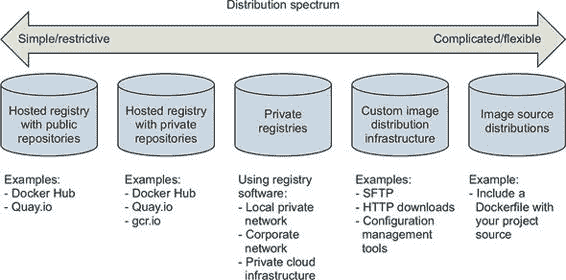
> 
> 范围内的方法从托管注册表，如 Docker Hub，到完全定制的分发架构或源分发方法。我们比其他一些主题更详细地介绍了这些内容。我们还特别关注私有注册表，因为它们在两个关注点之间提供了最平衡的解决方案。
> 
> 拥有一系列选择可以说明你的选项范围，但你需要一个一致的筛选标准来确定应该使用哪一个。
> 
> 9.1.2\. 选择标准
> 
> 在这么多选项中，选择最适合您需求的最优分发方法可能会显得有些令人畏惧。在这种情况下，您应该花时间了解这些选项，确定选择标准，并避免急于做出决定或妥协。
> 
> 以下确定的选择标准基于范围之间的差异和常见的商业关注点。在做出决定时，请考虑这些因素在您的情况中有多重要：

+   成本

+   可视性

+   传输速度或带宽开销

+   长期控制

+   可用性控制

+   访问控制

+   艺术品完整性

+   艺术品机密性

+   必需的专业知识

> 每种分发方法如何与这些标准相匹配将在本章其余部分的相关部分中介绍。
> 
> 成本
> 
> 成本是显而易见的标准，成本分布范围从免费到非常昂贵，且“情况复杂。”通常情况下，低成本更好，但成本通常是灵活性最高的标准。例如，如果情况需要，大多数人会为了工件机密性而牺牲成本。
> 
> 可见性
> 
> 可见性是分发方法下一个最明显的标准。机密项目或内部工具应该对未经授权的人难以发现，甚至不可能发现。在另一种情况下，公共作品或开源项目应该尽可能可见，以促进采用。
> 
> 传输
> 
> 传输速度和带宽开销是下一个最灵活的标准。文件大小和图像安装速度将在利用图像层、并发下载和预构建图像的方法与使用平面图像文件或依赖于部署时图像构建的方法之间有所不同。对于仅使用即时部署来服务同步请求的系统，高传输速度或低安装延迟至关重要。在开发环境或异步处理系统中，情况则相反。
> 
> 长期性
> 
> 长期控制更多地是商业问题而非技术问题。托管分发方法易受其他人或公司的商业问题的影响。一位面临使用托管注册表选择的执行者可能会问：“如果他们停止营业或转向远离存储库托管，会发生什么？”这个问题归结为：“第三方的商业需求在我们之前改变吗？”如果这是您的担忧，那么长期控制就很重要。Docker 使得在方法之间切换变得简单，其他标准如所需的专业技能或成本可能会超过这一担忧。因此，长期控制是更灵活的标准之一。
> 
> 可用性
> 
> 可用性控制是指控制您存储库中可用性问题解决的能力。托管解决方案不提供可用性控制。如果您是付费客户，企业通常会提供关于可用性的服务级别协议（SLA），但您无法直接解决问题。在光谱的另一端，私有注册表或定制解决方案将控制和责任都掌握在您的手中。
> 
> 访问控制
> 
> 访问控制可以保护您的图像免受未经授权的修改或访问。可用的访问控制程度各不相同。一些系统仅提供对特定存储库修改的访问控制，而其他系统则提供对整个注册表的课程控制。还有其他系统可能包括付费墙或数字版权管理控制。项目通常具有由产品或业务需求决定的具体访问控制需求。这使得访问控制需求成为最不灵活且最重要的考虑因素之一。
> 
> 完整性
> 
> 文物完整性和保密性都位于范围中不太灵活且更技术性的末端。文物的完整性是指你的文件和镜像的可靠性和一致性。完整性违规可能包括中间人攻击，其中攻击者拦截你的镜像下载并用自己的内容替换。也可能包括恶意或被黑客攻击的注册表，它们对其返回的有效载荷撒谎。
> 
> 保密性
> 
> 文物保密性是开发商业机密或专有软件的公司的一个常见要求。例如，如果你使用 Docker 来分发加密材料，保密性将是一个主要关注点。文物的完整性和保密性功能在整个范围内各不相同。总的来说，开箱即用的分发安全功能不会提供最紧密的保密性或完整性。如果这是你的需求之一，那么信息安全专业人员将需要实施并审查解决方案。
> 
> 专业知识
> 
> 选择分发方法时需要考虑的最后一点是所需的专家水平。使用托管方法可能很简单，只需要对工具的机械理解。构建自定义镜像或镜像源分发管道需要一套相关技术的专业知识。如果你没有这种专业知识，或者无法访问拥有这种专业知识的人，使用更复杂的解决方案将是一个挑战。在这种情况下，你可能需要额外付费来弥合差距。
> 
> 在这个强大的选择标准集下，你可以开始了解和评估各种分发方法。以下各节将使用最差、差、好、较好和最好等评级对这些方法进行评估。最佳起点是光谱的最左侧，即托管注册表。
> 
> 9.2\. 通过托管注册表发布
> 
> 作为提醒，Docker 注册表是使仓库可供 Docker 拉取命令访问的服务。注册表托管仓库。分发你的镜像最简单的方法是使用托管注册表。
> 
> 托管注册表是由第三方供应商拥有和运营的 Docker 注册表服务。Docker Hub、Quay.io 和 Google Container Registry 都是托管注册表提供商的例子。默认情况下，Docker 发布到 Docker Hub。Docker Hub 和大多数其他托管注册表都提供公共和私有注册表，如图 9.2 所示。#filepos926454
> 
> 图 9.2\. 分发光谱最简单的一侧和本节的主题
> 
> 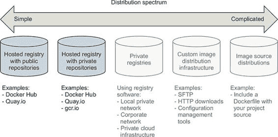
> 
> 本书使用的示例镜像通过 Docker Hub 和 Quay.io 上的公共仓库进行分发。在本节结束时，你将了解如何使用托管注册表发布自己的镜像，以及托管注册表如何满足选择标准。
> 
> 9.2.1\. 通过公共仓库发布：“Hello World!” via Docker Hub
> 
> 在托管注册库上开始使用公共仓库的最简单方法是推送您拥有的仓库到 Docker Hub。为此，您需要一个 Docker Hub 账户和一个要发布的镜像。如果您还没有这样做，现在就注册一个 Docker Hub 账户。
> 
> 一旦您有了账户，您就需要创建一个要发布的镜像。创建一个名为 HelloWorld.df 的新 Dockerfile 并添加以下指令：
> 
> > `FROM busybox:latest` `1` `CMD echo 'Hello World!'`

+   1 从 HelloWorld.df

> 第八章 讲解了 Dockerfile 指令。作为提醒，`FROM` 指令告诉 Docker 镜像构建器从哪个现有镜像开始构建新镜像。`CMD` 指令设置新镜像的默认命令。从这个镜像创建的容器将显示 `Hello World!` 并退出。使用以下命令构建您的新镜像：
> 
> > `docker image build \ -t <insert Docker Hub username>/hello-dockerfile \ 1 -f HelloWorld.df \ .`

+   1 输入您的用户名。

> 请确保在命令中替换您的 Docker Hub 用户名。访问和修改仓库的授权基于 Docker Hub 上仓库名称的用户名部分。如果您使用不同于您自己的用户名创建仓库，您将无法发布它。
> 
> 使用 `docker` 命令行工具在 Docker Hub 上发布镜像需要您与该客户端建立认证会话。您可以使用 `login` 命令来完成此操作：
> 
> > `docker login`
> > 
> 此命令将提示您输入用户名、电子邮件地址和密码。您可以使用 `--username`、`--email` 和 `--password` 标志将这些信息作为参数传递给命令。当您登录时，`docker` 客户端会在一个文件中维护您对不同注册库的认证凭据映射。它将特别存储您的用户名和认证令牌，而不是您的密码。
> 
> 登录后，您将能够将您的仓库推送到托管注册库。使用 `docker push` 命令来完成此操作：
> 
> > `docker image push <insert Docker Hub username>/hello-dockerfile` `1`

+   1 输入您的用户名。

> 执行该命令应生成如下输出：
> 
> > `将镜像推送到 [dockerinaction/hello-dockerfile] (len: 1) 7f6d4eb1f937: 镜像已存在 8c2e06607696: 镜像成功推送 6ce2e90b0bc7: 镜像成功推送 cf2616975b4a: 镜像成功推送 Digest: sha256:ef18de4b0ddf9ebd1cf5805fae1743181cbf3642f942cae8de7c5d4e375b1f20`
> > 
> 命令输出包括上传状态和结果仓库内容摘要。推送操作将在远程注册库上创建仓库，上传每个新层，然后创建适当的标签。
> 
> 您的公共仓库在推送操作完成后将向全世界开放。通过搜索您的用户名和您的新仓库来验证这一点。例如，使用以下命令查找`dockerinaction`用户拥有的示例：
> 
> > `docker search dockerinaction`
> > 
> 将`dockerinaction`用户名替换为您的用户名，以在 Docker Hub 上找到您的新仓库。您也可以登录到 Docker Hub 网站，查看您的仓库以找到并修改您的新仓库。
> 
> 使用 Docker Hub 分发您的第一个镜像后，您应该考虑这种方法与选择标准相比如何；参见表 9.1。
> 
> 表 9.1\. 公共主办仓库的性能

|

> > 标准

    |

> > 评分

    |

> > 备注

    |

| 成本              | 最佳   | 主办注册表上的公共仓库几乎总是免费的。这个价格很难被击败。当您刚开始使用 Docker 或发布开源软件时，这些特别有帮助。

|

| 可见性   | 最佳   | 主办注册表是软件分发的知名中心。如果您希望您的项目广为人知并对公众可见，那么主办注册表上的公共仓库是一个明显的分发选择。

|

| 传输速度/大小                      | 更好                      | 主办注册表，如 Docker Hub，是层感知的，并且将与 Docker 客户端一起工作，仅传输客户端尚未拥有的层。此外，需要传输多个仓库的拉取操作将执行这些并行传输。

并行传输。因此，从主办仓库分发镜像速度快，负载最小。

|

| 长期控制   | 良好   | 您无法控制主办注册表的长久性。但所有注册表都将符合 Docker 注册表 API，从一台主机迁移到另一台主机应该是一个低成本的操作。   |
| --- | --- | --- |
| 可用性控制                      | 最差   | 您无法控制主办注册表的可访问性。           |

| 访问控制   | 更好   | 公共仓库对公众开放，允许读取访问。写入访问仍然由主机设置的任何机制控制。Docker Hub 上的公共仓库的写入访问通过两种方式控制。首先，由个人拥有的仓库只能由该个人账户写入。

只有该个人账户可以写入。其次，组织拥有的仓库可能只能由该组织中的任何用户写入。

可以由该组织中的任何用户写入。

|

| 艺术品完整性              | 最佳   | Docker 注册表 API 的当前版本，V2，提供了内容可寻址的镜像。V2 API 允许您请求具有特定加密签名的镜像。Docker 客户端将通过重新计算返回镜像的完整性来验证返回镜像的完整性。

签名并将其与请求的签名进行比较。不了解 V2 注册表 API 的旧版 Docker 不

支持此功能并使用 V1。在这些情况下，以及其他签名未知的情况下，对主机提供的授权和静态安全功能的高度信任被投入其中。

将信任置于由主机提供的授权和静态安全功能。

|

| 机密性              | 最差              | 托管注册表和公共仓库从不适合存储和分发明文密钥或敏感代码。记住，密钥包括密码、API 密钥、证书等等。任何人都可以访问这些密钥。

|

| 必需经验              | 最佳              | 在托管注册表上使用公共仓库只需要您对 Docker 有基本的了解，并且能够通过网站设置账户。这个解决方案对任何 Docker 用户来说都触手可及。

|

> 托管注册表上的公共仓库是开源项目所有者或刚开始使用 Docker 的人的最佳选择。人们仍然应该对从互联网下载并运行的软件持怀疑态度，因此不公开源代码的公共仓库可能对某些用户来说难以信任。托管（受信任）构建在一定程度上解决了这个问题。
> 
> 9.2.2. 私有托管仓库
> 
> 从操作和产品角度来看，私有仓库与公共仓库相似。大多数注册表提供商都提供这两种选项，并且通过他们的网站进行配置的差异将是微小的。因为 Docker 注册表 API 对这两种类型的仓库没有区别，所以提供这两种选项的注册表提供商通常要求您通过他们的网站、应用程序或 API 配置私有注册表。
> 
> 与私有仓库一起工作的工具与用于公共仓库的工具相同，只有一个例外。在您可以使用 `docker image pull` 或 `docker container run` 从私有仓库安装镜像之前，您需要验证存储该仓库的注册表。为此，您使用 `docker login` 命令，就像您使用 `docker image push` 上传镜像一样。
> 
> 以下命令会提示您使用 Docker Hub 和 Quay.io 提供的注册表进行验证。在创建账户并验证后，您将能够访问所有三个注册表上的公共和私有仓库。`login` 子命令接受一个可选的服务器参数：
> 
> > `docker login # 用户名: dockerinaction # 密码: # 邮箱: book@dockerinaction.com # 警告：登录凭证已保存在 /Users/xxx/.dockercfg 中。 # 登录成功 docker login quay.io # 用户名: dockerinaction # 密码: # 邮箱: book@dockerinaction.com # 警告：登录凭证已保存在 /Users/xxx/.dockercfg 中。 # 登录成功`
> > 
> 在您决定私有托管存储库是您的分发解决方案之前，请考虑它们如何满足您的选择标准；参见表 9.2。
> 
> 表 9.2\. 私有托管存储库的性能

|

> > 标准

    |

> > 评分

    |

> > 备注

    |

| 成本                  | 良好              | 私有存储库的成本通常与您需要的存储库数量成比例。计划通常从                         每月几美元的 5 个存储库，到 50 个存储库的约 50 美元不等。存储和每月虚拟

服务器托管是这里的一个驱动因素。需要超过 50 个存储库的用户或组织可能会发现自行运行私有注册表更为合适。

运行他们自己的私有注册表。

|

| 可见性                  | 最佳              | 私有存储库按定义是私有的。这些通常被排除在索引之外，并且在注册表确认存储库的存在之前通常需要身份验证                         。它们是组织不希望承担

与运行自己的注册表或小型私有项目相关的开销。私有存储库不是长期控制的良好候选者

用于宣传商业软件的可用性或分发开源镜像。

|

| 传输速度/大小              | 较好              | 任何托管注册表，如 Docker Hub，都将最小化传输镜像所使用的带宽，并允许客户端并行传输                         镜像层。忽略通过互联网传输文件可能引入的潜在延迟，托管注册表

应始终与其他非注册表解决方案表现良好。

|

| 长期控制              | 良好              | 您无法控制托管注册表的长久性。但所有注册表都将符合 Docker 注册表 API，并且从一个主机迁移到另一个主机应该是一项低成本的操作。   |
| --- | --- | --- |

| 可用性控制              | 最差/良好              | 没有托管注册表提供任何可用性控制。然而，与使用公共存储库不同，使用私有存储库                 将使您成为付费客户。付费客户可能享有更强的服务等级协议保证或访问支持人员的权限。

|

| 访问控制              | 较好              | 对私有存储库的读取和写入访问权限仅限于授权用户。   |
| --- | --- | --- |
| 艺术品完整性              | 最佳              | 有理由期望所有托管注册表都支持 V2 注册表 API 和内容寻址镜像。           |

| 隐私                  | 最差              | 尽管这些存储库提供了隐私保护，但它们从不适合存储明文密钥或商业机密                         代码。尽管注册表要求用户对请求的资源进行身份验证和授权，但这些机制存在

几个潜在问题。提供商可能使用弱凭证存储，拥有弱或丢失的证书，或者留下您的艺术品

静止状态下未加密。最后，你的机密材料不应被注册表提供商的员工访问。

|

| 必需的经验                      | 最佳                      | 与公共仓库一样，在托管注册表中使用私有仓库只需要你至少熟悉 Docker，并能够通过网站设置账户。这种解决方案对任何 Docker 用户来说都触手可及。

|

> 个人和小型团队会发现私有托管仓库最有用。它们低成本和基本授权功能对低成本项目或对安全性要求最低的私有项目来说非常友好。需要更高保密度且预算合适的的大型公司或项目可能会发现运行自己的私有注册表更能满足他们的需求。
> 
> 9.3\. 介绍私有注册表
> 
> 当你对可用性控制、长期控制或保密性有严格要求时，运行私有注册表可能是你的最佳选择。这样做，你可以在不牺牲与 Docker 拉取和推送机制互操作性或增加你环境的学习曲线的情况下获得控制权。人们可以像与托管注册表交互一样与私有注册表交互。
> 
> 有许多免费和商业支持的软件包可用于运行 Docker 镜像注册表。如果你的组织有一个用于操作系统或应用程序软件包的商业工件仓库，它可能支持 Docker 镜像注册表 API。运行非生产环境镜像注册表的一个简单选项是使用 Docker 的注册表软件。Docker 注册表，称为 Distribution，是开源软件，在 Apache 2 许可证下分发。该软件的可用性和宽松的许可证使运行自己的注册表的工程成本保持较低。图 9.3 说明了私有注册表位于分发谱的中间。
> 
> 图 9.3\. 图像分发谱中的私有仓库
> 
> 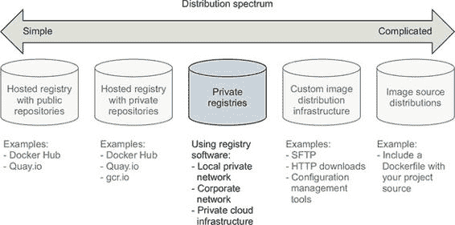
> 
> 运行私有仓库是一个很好的分发方法，如果你有如下特殊的基础设施使用案例：

+   区域图像缓存

+   针对特定团队的图像分发以实现本地化或可见性

+   针对特定环境或部署阶段的图像池

+   审批图像的内部流程

+   外部图像的长期控制

> 在决定这是否是你最佳选择之前，考虑选择标准中详细列出的成本，如表 9.3 所示。
> 
> 表 9.3\. 私有注册表的性能

|

> > 标准

    |

> > 评分

    |

> > 备注

    |

| 成本              | 良好              | 至少，私有注册表会增加硬件开销（虚拟或其他），支持费用和失败风险。但社区已经通过构建

开源软件。成本将在不同的维度上扩展。与托管注册表的成本不同，

随着原始存储库数量的增加而增加，私有注册表的成本随着交易率和存储使用量的增加而增加。如果您构建

在高交易率系统中，您需要增加注册表主机的数量，以便能够处理需求。

同样，为一定数量的小型图像提供服务的注册表将比为相同

大型图像的系统具有更低的存储成本。

|

| 可见性                      | 良好                      | 私有注册表的可视性取决于您的决定。但即使是您拥有并向世界开放的注册表，其可见性也会低于 Docker Hub 等流行的注册表。

|

| 传输速度/大小                      | 最佳                      | 任何客户端与任何注册表之间的操作延迟将根据这两个节点之间的网络性能和注册表的负载而变化。由于这些变量，私有注册表可能比托管注册表更快或更慢。大多数人

在大型部署或内部基础设施中运营的人会发现私有注册表很有吸引力。私有注册表消除了

依赖于互联网或数据中心之间的网络，并将提高与外部网络的

约束。因为这个解决方案使用了 Docker 注册表，所以它共享了托管注册表解决方案相同的并行性收益。

|

| 长期控制                      | 最佳                      | 作为注册表所有者，您完全控制着解决方案的长期性。   |
| --- | --- | --- |
| 可用性控制                      | 最佳                      | 作为注册表所有者，您完全控制着可用性。   |

| 访问控制                      | 良好                      | 注册表软件默认不包含任何身份验证或授权功能。但实现这些功能可以通过最小的工程练习来完成。

|

| 文件完整性                      | 最佳                      | 注册表 API 的版本 2 支持基于内容的图像，开源软件支持可插拔的存储后端。为了提供额外的完整性保护，您可以强制在网络中使用 TLS，并使用带有

静态加密。

|

| 保密性                      | 良好                      | 私有注册表是光谱上第一个适合存储商业机密或机密材料的解决方案。您控制着身份验证和授权机制。您还控制着网络和传输中的安全机制。

最重要的是，您控制着静态存储。您有权力确保系统以这种方式配置

保证您的机密信息保持机密。

|

| 必要经验                      | 良好                      | 开始运行本地仓库只需要基本的 Docker 经验。但是，运行和维护一个高度可用的生产私有仓库需要具备多种技术的经验。具体取决于你想要

可以利用的。通常，你将需要熟悉 NGINX 来构建代理，LDAP 或 Kerberos 来提供身份验证，

以及 Redis 用于缓存。许多商业产品解决方案可用于运行私有 Docker 仓库，范围从

传统的工件仓库，如 Artifactory 和 Nexus，到软件交付系统，如 GitLab。

|

> 从托管仓库迁移到私有仓库时最大的权衡是在获得灵活性和控制的同时，需要更大的工程经验深度和广度来构建和维护解决方案。Docker 镜像仓库通常消耗大量存储空间，因此在分析时务必考虑这一点。本节剩余部分涵盖了实现除最复杂仓库部署设计之外所需的内容，并突出了在您环境中定制的机遇。
> 
> 9.3.1\. 使用仓库镜像
> 
> 无论你这样做的原因是什么，开始使用 Docker 仓库软件都很简单。分发软件可在 Docker Hub 上的名为`registry`的仓库中找到。在容器中启动本地仓库可以通过单个命令完成：
> 
> > `docker run -d -p 5000:5000 \  
> > 
> 通过 Docker Hub 分发到机器上的镜像配置为从运行客户端 Docker 守护进程的机器进行不安全访问。当你启动了仓库后，你可以像使用其他任何仓库一样使用`docker pull`、`run`、`tag`和`push`命令。在这种情况下，仓库位置是`localhost:5000`。现在，你的系统架构应该与图 9.4 中描述的相匹配。
> 
> 图 9.4\. Docker 客户端、守护进程、本地仓库容器和本地存储之间的交互
> 
> 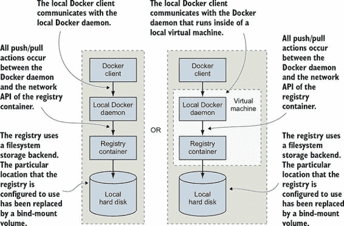
> 
> 想要在他们的外部镜像依赖项上实施严格版本控制的公司将从外部源（如 Docker Hub）拉取镜像并将它们复制到自己的仓库中。你可能这样做是为了确保在作者更新或删除源镜像时，重要的镜像不会意外更改或消失。为了了解在你的仓库中工作的感觉，考虑以下从 Docker Hub 复制镜像到新仓库的工作流程：
> 
> > `docker image pull dockerinaction/ch9_registry_bound` `1` `docker image ls -f "label=dia_excercise=ch9_registry_bound"` `2` `docker image tag dockerinaction/ch9_registry_bound \  

+   1 从 Docker Hub 拉取演示镜像

+   2 使用标签过滤器验证镜像可被发现

+   3 将演示镜像推送到注册表

> 在运行这四个命令时，您将从 Docker Hub 复制一个示例仓库到您的本地仓库。如果您从启动注册表的位置执行这些命令，您会发现新创建的数据子目录包含新的注册表数据。
> 
> 9.3.2. 从您的注册表中消费镜像
> 
> 与 Docker 生态系统紧密集成可以使您感觉您正在使用已经安装在您计算机上的软件。当消除互联网延迟，例如您在与本地注册表一起工作时，这种感觉甚至更少像您正在使用分布式组件。因此，将数据推送到本地仓库的练习本身并不那么令人兴奋。
> 
> 下一个命令集应该让您印象深刻，您正在使用一个真实的注册表。这些命令将从您的 Docker 守护进程的本地缓存中删除示例仓库，证明它们已消失，然后从您的个人注册表重新安装它们：
> 
> > `docker image rm \ dockerinaction/ch9_registry_bound \ localhost:5000/dockerinaction/ch9_registry_bound` `1` `docker image ls -f "label=dia_excercise=ch9_registry_bound"` `2` `docker image ls -f "label=dia_excercise=ch9_registry_bound"` `3` `docker container rm -vf local-registry` `4`

+   1 删除标记引用

+   2 再次从注册表拉取

+   3 验证镜像已返回

+   4 清理本地注册表

> 您可以尽可能多地在本地上使用此注册表，但默认的不安全配置将阻止远程 Docker 客户端使用您的注册表（除非它们明确允许不安全访问）。这是在部署生产环境中的注册表之前需要解决的一些问题之一。
> 
> 这是涉及 Docker 注册表的最灵活的分发方法。如果您需要更多控制运输、存储和工件管理，您应该考虑在手动分发系统中直接与镜像一起工作。
> 
> 9.4. 手动镜像发布和分发
> 
> 镜像是文件，您可以像分发其他任何文件一样分发它们。在网站上下载软件、文件传输协议（FTP）服务器、企业存储网络或通过对等网络分发软件是很常见的。您可以使用这些任何一种分发渠道进行镜像分发。如果您知道您的镜像接收者，您甚至可以使用电子邮件或 USB 驱动器。手动镜像分发方法提供了最大的灵活性，使得各种用例成为可能，例如在活动中同时向许多人分发镜像或向安全的断网网络分发。
> 
> 当您将镜像作为文件处理时，您只需使用 Docker 来管理本地镜像和创建文件。所有其他问题都留给了您来实现。这种功能空白使得手动镜像发布和分发成为第二灵活但最复杂的一种分发方法。本节涵盖了自定义镜像分发基础设施，如图 9.5 所示。
> 
> 图 9.5\. 在自定义基础设施上进行的 Docker 镜像分发
> 
> 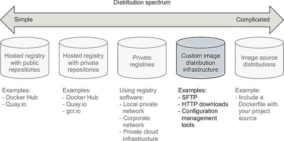
> 
> 我们已经涵盖了所有以文件形式处理镜像的方法。第三章涵盖了将镜像加载到 Docker 和将镜像保存到您的硬盘上。第七章涵盖了将完整文件系统作为扁平化镜像导出和导入。这些技术是构建如图 9.6 所示的分发工作流程的基础。
> 
> 图 9.6\. 典型的手动分发工作流程，包括生产者、运输和消费者
> 
> 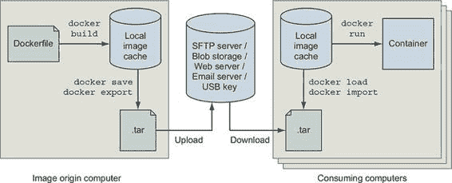
> 
> 此工作流程是对您如何使用 Docker 创建镜像并为其分发做准备的一般化。您应该熟悉使用`docker image build`来创建镜像，以及使用`docker image save`或`docker container export`来创建镜像文件。您可以使用单个命令执行这些操作中的每一个。
> 
> 在您拥有镜像文件后，可以使用任何文件传输方式。在图 9.6 中未显示的一个自定义组件是将镜像上传到传输机制的机制。这种机制可能是一个由 Dropbox 等文件共享工具监视的文件夹。它也可能是一段定期运行或响应新文件的定制代码，并使用 FTP 或 HTTP 将文件推送到远程服务器。无论机制如何，这个通用组件都需要一些努力来集成。
> 
> 该图还展示了客户端如何在镜像分发后摄取镜像并使用它来构建容器。客户端需要一个进程或机制来学习镜像的位置，然后从远程源获取镜像。一旦客户端拥有镜像文件，他们可以使用`docker image load`或`import`命令来完成传输。
> 
> 在不知道具体分发问题的情况下，手动镜像分发方法很难与选择标准进行衡量。使用非 Docker 分发渠道可以给您完全的控制权，使其能够处理不寻常的需求。您将需要确定您的选项如何与选择标准相匹配。表 9.4 探讨了手动镜像分发方法如何与选择标准相匹配。
> 
> 表 9.4\. 自定义镜像分发基础设施的性能

|

> > 标准

    |

> > 评分

    |

> > 注意事项

    |

| 成本   | 好   | 分发成本由带宽、存储和硬件需求驱动。托管分发解决方案，如云存储，将捆绑这些成本，并且通常随着使用量的增加而降低每单位的价格。但托管解决方案捆绑了

成本，包括人员成本以及您可能不需要的几个其他好处，这会使价格与您

own.

|

| 可见性   | 差   | 大多数手动分发方法都是特殊的，与公共或私有注册相比，它们需要更多的努力来宣传和使用。示例可能包括使用流行的网站或其他知名的文件分发中心。

|

| 传输速度/大小   | 好   | 虽然传输速度取决于传输方式，但文件大小取决于您选择使用分层图像或扁平图像。记住，分层图像保留了图像的历史、容器创建元数据和可能

have been deleted or overridden. Flattened images contain only the current set of files on the filesystem.

|

| 长期控制   | 差   | 使用既不开放也不在您控制之下的专有协议、工具或其他技术将影响长期控制。例如，使用像 Dropbox 这样的托管文件共享服务分发图像文件将不会为您提供任何长期

控制权。另一方面，与您的朋友交换 USB 驱动器将持续到你们两人决定使用 USB 驱动器为止。

|

| 可用性控制   | 最佳   | 如果可用性控制对您的案例很重要，您可以使用您拥有的传输机制。    |
| --- | --- | --- |

| 访问控制   | 差   | 您可以使用具有所需访问控制功能的传输或使用文件加密。如果您构建了一个使用特定密钥加密图像文件的系统，您可以确信只有拥有正确密钥的人或人们才能访问

image.

|

| 文件完整性   | 差   | 完整性验证是实现广泛分布的更昂贵的功能之一。至少，您需要一个可信的通信通道来宣传加密文件签名并创建通过使用

docker image save and load.

|

| 机密性   | 好   | 您可以使用廉价的加密工具实现内容保密。如果您还需要元保密（即交换本身是保密的）以及内容保密，那么您应该避免使用托管工具，并确保您使用的传输方式提供保密（HTTPS，

SFTP、SSH 或离线）。

|

| 必要经验                      | 良好              | 托管工具通常设计用于易于使用，并且与您的流程集成需要较低的经验水平。                         但在大多数情况下，您也可以轻松使用您拥有的简单工具。

|

> 所有相同的标准适用于手动分发，但如果没有具体的运输方法背景，很难讨论它们。
> 
> 9.4.1\. 使用 FTP 的一个示例分发基础设施
> 
> 构建一个完全功能性的示例将帮助您了解手动分发基础设施中包含的内容。本节将帮助您使用文件传输协议构建基础设施。
> 
> FTP 不如以前受欢迎。该协议不提供保密性，并且需要通过有线传输凭据进行身份验证。但是，软件是免费提供的，并且为大多数平台编写了客户端。这使得 FTP 成为构建自己的分发基础设施的绝佳工具。图 9.7 展示了您将构建的内容。
> 
> 图 9.7\. 一个 FTP 发布基础设施
> 
> 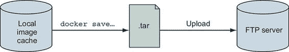
> 
> 本节中的示例使用两个现有镜像。第一个，`dockerinaction/ch9_ftpd`，是`centos:6`镜像的专门化；已安装并配置了`vsftpd`（一个 FTP 守护进程）以允许匿名写入访问。第二个镜像，`dockerinaction/ch9_ftp_client`，是一个流行的最小化 Alpine Linux 镜像的专门化。已安装了一个名为`LFTP`的 FTP 客户端，并将其设置为镜像的入口点。
> 
> 为了准备实验，从 Docker Hub 拉取您想要分发的已知镜像。在示例中，使用的是`registry:2`镜像：
> 
> > `docker image pull registry:2`
> > 
> 一旦您有了要分发的镜像，您就可以开始了。第一步是构建您的镜像分发基础设施。在这种情况下，这意味着运行一个 FTP 服务器，您将在专用网络上执行此操作：
> 
> > `docker network create ch9_ftp docker container run -d --name ftp-server --network=ch9_ftp -p 21:21 \ dockerinaction/ch9_ftpd`
> > 
> 此命令启动一个 FTP 服务器，该服务器在 TCP 端口 21（默认端口）上接受 FTP 连接。不要在生产环境中使用此镜像。服务器配置为允许在 pub/incoming 文件夹下匿名连接写入访问。您的分发基础设施将使用该文件夹作为镜像分发点。
> 
> 接下来，将镜像导出为文件格式。您可以使用以下命令来完成此操作：
> 
> > `docker image save -o ./registry.2.tar registry:2`
> > 
> 运行此命令会将`registry:2`镜像作为结构化镜像文件导出到您的当前目录。该文件保留了与镜像相关的所有元数据和历史记录。在此阶段，您可以注入各种阶段，例如生成校验和或文件加密。此基础设施没有此类要求，您应该继续进行分发。
> 
> `dockerinaction/ch9_ftp_client` 镜像中安装了 FTP 客户端，可以用来将您的新镜像文件上传到 FTP 服务器。记住，您是在名为 `ftp-server` 的容器中启动 FTP 服务器的。`ftp-server` 容器连接到一个用户定义的桥接网络（见第五章），名为 `ch9_ftp`，并且连接到 `ch9_ftp` 网络的其他容器将能够连接到 `ftp-server`。让我们使用 FTP 客户端上传注册表镜像存档：
> 
> > `docker container run --rm -it --network ch9_ftp \   -v "$(pwd)":/data \   dockerinaction/ch9_ftp_client \   -e 'cd pub/incoming; put registry.2.tar; exit' ftp-server`
> > 
> 此命令创建了一个与您的本地目录绑定并连接到 FTP 服务器容器正在监听的 `ch9_ftp` 网络的容器。该命令使用 LFTP 上传一个名为 registry.2.tar 的文件到位于 `ftp_server` 的服务器。您可以通过列出 FTP 服务器文件夹的内容来验证您已上传了镜像：
> 
> > `docker run --rm -it --network ch9_ftp \   -v "$(pwd)":/data \   dockerinaction/ch9_ftp_client \   -e "cd pub/incoming; ls; exit" ftp-server`
> > 
> 注册表镜像现在可供任何了解服务器并能通过网络访问它的 FTP 客户端下载。但在当前的 FTP 服务器配置中，该文件可能永远不会被覆盖。如果您打算在生产中使用类似的工具，您需要制定自己的版本控制方案。
> 
> 在此场景下，广告图像的可用性需要客户端通过使用您运行的最后一个命令来列出文件，定期轮询服务器。或者，您也可以构建一个网站或发送电子邮件通知客户端关于图像的信息，但所有这些都在标准的 FTP 传输工作流程之外发生。
> 
> 在评估此分发方法是否符合选择标准之前，从您的 FTP 服务器消耗注册表镜像，以了解客户端需要如何集成。
> 
> 首先，从您的本地镜像缓存和本地目录中删除注册表镜像和文件：
> 
> > `rm registry.2.tar docker image rm registry:2` `1` `docker image ls registry` `2`

+   1 需要先移除任何注册表容器

+   2 确认注册表镜像已被移除

> 然后使用 FTP 客户端从您的 FTP 服务器下载镜像文件：
> 
> > `docker container run --rm -it --network ch9_ftp \   -v "$(pwd)":/data \   dockerinaction/ch9_ftp_client \   -e 'cd pub/incoming; get registry.2.tar; exit' ftp-server`
> > 
> 到此为止，您应该再次在本地目录中拥有 registry.2.tar 文件。您可以使用 `docker load` 命令将该镜像重新加载到本地缓存中：
> 
> > `docker image load -i registry.2.tar`
> > 
> 您可以通过再次使用 `docker image ls registry` 列出注册表存储库的镜像来确认镜像已从存档中加载。
> 
> 这是一个手动图像发布和分发基础设施可能构建的最小示例。通过一点扩展，您可以构建一个基于 FTP 的生产质量分发中心。在其当前配置下，此示例符合所示的选择标准表 9.5。
> 
> 表 9.5. 基于 FTP 的样本分发基础设施的性能

|

> > 标准化

    |

> > 评分

    |

> > 备注

    |

| 成本              | 良好              | 这是一个低成本传输。所有相关软件都是免费的。带宽和存储成本应与托管图像的数量和客户端数量的线性比例增长。                         |

|

| 可视性   | 最差   | FTP 服务器在一个未宣传的位置运行，具有非标准的集成工作流程。此配置的可视性非常低。                         |

|

| 传输速度/大小              | 差              | 在这个示例中，所有传输都在同一台计算机上的容器之间进行，因此所有命令都很快完成。如果                         客户端通过网络连接到您的 FTP 服务，速度将直接受到您的上传速度的影响。这种分发

方法将下载冗余的艺术品，并且不会并行下载图像的组件。总体而言，这种方法并不

带宽高效。

|

| 长期控制   | 最佳   | 您可以使用为这个示例创建的 FTP 服务器，只要您想。   |
| --- | --- | --- |
| 可用性控制                      | 最佳                      | 您对 FTP 服务器拥有完全的可用性控制。如果它变得不可用，您是唯一能够恢复服务的人。                   |
| 访问控制   | 最差   | 此配置不提供任何访问控制。   |

| 艺术品完整性                      | 最差                      | 网络传输层确实在端点之间提供了文件完整性。但它容易受到拦截攻击，                         并且在文件创建和上传之间或下载和导入之间不存在完整性保护。

|

| 机密性   | 最差   | 此配置不提供任何保密性。   |
| --- | --- | --- |

| 必要经验                      | 良好                      | 实施此解决方案所需的全部经验都已在此提供。如果您有兴趣将示例                         扩展到生产环境，您需要熟悉 vsftpd 配置选项和 SFTP。

|

> 简而言之，几乎没有任何实际场景适合这种传输配置。但它有助于说明当您将图像作为文件工作时可以创建的不同关注点和基本工作流程。试着想象一下，用`scp`或`rsync`工具替换 FTP，并使用 SSH 协议，将如何提高系统在艺术品完整性和保密性方面的性能。我们将考虑的最后一种图像分发方法既更灵活，也可能更复杂。
> 
> 9.5. 图像源-分发工作流程
> 
> 当您分发图像源而不是图像时，您将省去所有的 Docker 分发工作流程，并完全依赖 Docker 镜像构建器。与手动图像发布和分发一样，源分发工作流程应针对特定实现的上下文中的选择标准进行评估。
> 
> 使用 GitHub 上的 Git 等托管源代码控制系统与使用`rsync`等文件备份工具非常不同。从某种意义上说，源分发工作流程包含了手动图像发布和分发工作流程的所有关注点。您将不得不构建自己的工作流程，但无需`docker save`、`load`、`export`或`import`命令的帮助。生产者需要确定他们将如何打包他们的源，消费者也需要了解这些源是如何打包的，以及如何从它们构建镜像。这种扩展的接口使得源分发工作流程成为最灵活且可能最复杂的一种分发方法。图 9.8 展示了在复杂度光谱的最复杂端上的图像源分发。
> 
> 图 9.8\. 利用现有基础设施分发图像源
> 
> 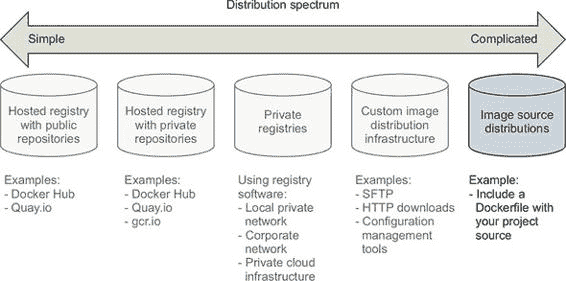
> 
> 图像源分发是最常见的方法之一，尽管它具有最大的复杂性潜力。流行的版本控制软件处理了源分发扩展接口的许多复杂性。
> 
> 9.5.1\. 在 GitHub 上使用 Dockerfile 分发项目
> 
> 当您使用 Dockerfile 和 GitHub 分发图像源时，图像消费者会直接克隆您的 GitHub 仓库，并使用`docker image build`在本地构建您的镜像。在源分发中，发布者不需要在 Docker Hub 或另一个 Docker 注册表中拥有账户来发布镜像。
> 
> 假设生产者有一个现有的项目、Dockerfile 和 GitHub 仓库，他们的分发工作流程将如下所示：
> 
> > `git init git config --global user.email "you@example.com" git config --global user.name "Your Name" git add Dockerfile # git add * whatever other files you need for the image* git commit -m "first commit" git remote add origin https://github.com/<your username>/<your repo>.git git push -u origin master`
> > 
> 同时，消费者会使用一个类似以下的通用命令集：
> 
> > `git clone https://github.com/<your username>/<your repo>.git cd <your-repo> docker image build -t <your username>/<your repo>. .`
> > 
> 这些都是普通 Git 或 GitHub 用户熟悉的步骤，如表 9.6 所示。
> 
> 表 9.6\. 通过 GitHub 进行图像源分发的性能

|

> > 标准

    |

> > 评分

    |

> > 备注

    |

| 成本              | 最佳              | 如果您使用的是公共 GitHub 仓库，则没有成本。           |
| --- | --- | --- |

| 可见性   | 最佳   | GitHub 是开源工具的高可见位置。它提供了优秀的社会和搜索组件，使得项目发现变得简单。

|

| 传输速度/大小              | 良好              | 通过分发镜像源，你可以利用其他注册表进行基础层的分发。这样做将减少传输和存储负担。GitHub 还提供了内容分发网络（CDN）。该 CDN 用于确保全球各地的客户端

世界各地都可以以低网络延迟访问 GitHub 上的项目。

|

| 长期控制   | 差   | 虽然 Git 是一个流行的工具，并且可能会存在一段时间，但通过集成 GitHub 或其他托管版本控制提供商，你放弃了任何长期控制。

|

| 可用性控制              | 最差              | 依赖于 GitHub 或其他托管版本控制提供商消除了任何可用性控制。   |
| --- | --- | --- |
| 访问控制   | 良好   | GitHub 或其他托管版本控制提供商确实为私有仓库提供了访问控制工具。   |

| 艺术品完整性              | 良好              | 此解决方案不提供构建过程中产生的镜像或克隆到客户端机器后的源代码的完整性。但完整性是版本控制系统的主要目的。任何完整性问题都应该

通过标准的 Git 流程，可以明显且容易地恢复。

|

| 机密性   | 最差   | 公共项目不提供源代码保密性。   |
| --- | --- | --- |
| 必要经验   | 良好   | 镜像生产者和消费者需要熟悉 Dockerfile、Docker 构建器和 Git 工具。   |

> 镜像源分发与所有 Docker 分发工具分离。通过仅依赖镜像构建器，你可以自由地采用任何可用的分发工具集。如果你被锁定在特定的工具集用于分发或源代码控制，这可能就是唯一符合你标准的选项。
> 
> 摘要
> 
> 本章涵盖了各种软件分发机制以及 Docker 在每个机制中的价值。对于最近实施或正在实施分发渠道的读者，可能会从他们的解决方案中获得额外的见解。其他人将了解更多关于可用的选择。在任何情况下，确保在继续之前你已经获得了以下见解是很重要的：

+   拥有一系列的选择可以展示你的选项范围。

+   你应该使用一套一致的选择标准来评估你的分发选项，并确定你应该使用哪种方法。

+   托管公共仓库提供了优秀的项目可见性，免费，并且采用起来经验要求不高。

+   由于由受信任的第三方构建，消费者将更加信任由自动化构建生成的镜像。

+   托管私有仓库对于小型团队来说是经济高效的，并且提供了令人满意的访问控制。

+   运行自己的注册表使您能够构建适合特殊用例的基础设施，而无需放弃 Docker 分发设施。

+   使用任何文件共享系统都可以分发图像作为文件。

+   图像源分发是灵活的，但复杂程度仅取决于您如何设置。使用流行的源分发工具和模式将使事情保持简单。

> 第十章\. 图像管道
> 
> 本章涵盖

+   Docker 图像管道的目标

+   构建图像和使用元数据帮助消费者使用您的图像的图案

+   测试图像是否正确配置和安全的常见方法

+   为图像打标签的图案，以便它们可以被识别并交付给消费者

+   将图像发布到运行时环境和注册表的图案

> 在第八章中，您学习了如何通过使用 Dockerfile 和`docker build`命令自动构建 Docker 镜像。然而，构建图像仅仅是交付功能性和可信图像的更长过程中的一个关键步骤。图像发布者应执行测试以验证图像在预期的操作条件下是否正常工作。随着通过这些测试，对图像工件正确性的信心逐渐增强。接下来，它最终可以被标记并发布到注册表以供消费。消费者可以自信地部署这些图像，因为他们知道许多重要要求已经得到验证。
> 
> 这些步骤——准备图像材料、构建图像、测试，最后将图像发布到注册表——统称为图像构建管道。管道帮助软件作者快速发布更新，并有效地将新功能和修复传递给消费者。
> 
> 10.1\. 图像构建管道的目标
> 
> 在这个背景下，管道自动化了构建、测试和发布工件的过程，以便它们可以被部署到运行时环境。图 10.1 图 10.1 展示了在管道中构建软件或其他工件的高级过程。这个过程对于使用持续集成（CI）实践的人来说应该是熟悉的，并且并不特定于 Docker 镜像。
> 
> 图 10.1\. 通用工件构建管道
> 
> 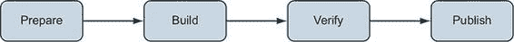
> 
> 人们经常使用 Jenkins、Travis CI 或 Drone 等持续集成系统来自动化构建管道。无论具体的管道建模技术如何，构建管道的目标都是从源定义中创建可部署工件时应用一套一致且严格的实践。管道中使用的特定工具之间的差异仅仅是实现细节。Docker 镜像的 CI 过程与其他软件工件类似，看起来像图 10.2。
> 
> 图 10.2\. Docker 图像构建管道
> 
> 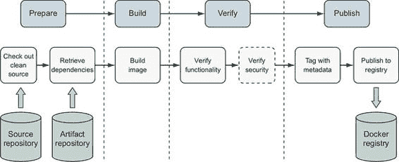
> 
> 当构建 Docker 镜像时，这个过程包括以下步骤：

1.  检出定义图像和构建脚本的源代码的干净副本，以便了解构建图像的来源和过程。

1.  2 检索或生成将包含在镜像中的工件，例如应用程序包和运行时库。

1.  使用 Dockerfile 构建镜像。

1.  验证镜像的结构和功能是否符合预期。

1.  (可选) 验证镜像不包含已知漏洞。

1.  为镜像打标签，以便它可以轻松被消费。

1.  将图像发布到注册表或其他分发渠道。

> 应用程序工件是软件作者生成的运行时脚本、二进制文件 (.exe, .tgz, .zip) 和配置文件。此镜像构建过程假定应用程序工件已经构建、测试并发布到工件存储库，以便包含在镜像中。应用程序工件可以在容器内构建，这正是许多现代 CI 系统的工作方式。本章的练习将展示如何使用容器构建应用程序，以及如何将这些应用程序工件打包到运行应用程序的 Docker 镜像中。我们将通过使用 UNIX-like 环境中可用的小型且常见的工具集来实现构建过程。此管道的概念和基本命令应很容易转移到您组织的工具中。
> 
> 10.2\. 构建镜像的模式
> 
> 存在多种使用容器构建应用程序和镜像的模式。在这里，我们将讨论三种最受欢迎的模式：

+   全功能——您使用全功能镜像来构建和运行应用程序。

+   构建加运行时——您使用一个带有单独、更精简的运行时镜像的构建镜像来构建容器化应用程序。

+   构建加多个运行时——您在多阶段构建中使用具有用于调试和其他补充用例的变体的精简运行时镜像。

> 图 10.3\. 镜像构建模式成熟度
> 
> 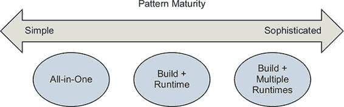
> 
> 多种构建模式已经演变，以产生适合特定消费用例的镜像。在此上下文中，“成熟度”指的是构建镜像的设计和过程，而不是应用该模式的组织。当镜像将用于内部实验或作为便携式开发环境时，全功能模式可能最为合适。相比之下，当分发将获得商业许可和支持的服务器时，构建加运行时模式可能最为合适。单个软件发布组织通常会使用多种模式来构建他们使用和分发的镜像。应用并修改此处描述的模式来解决您自己的镜像构建和交付问题。
> 
> 10.2.1\. 全功能镜像
> 
> 一体化镜像包括构建和运行应用程序所需的所有工具。这些工具可能包括软件开发工具包（SDKs）、包管理器、共享库、特定语言的构建工具或其他二进制工具。此类镜像通常还会包含默认的应用程序运行时配置。一体化镜像是开始容器化应用程序的最简单方法。当容器化具有许多依赖项的开发环境或“遗留”应用程序时，它们特别有用。
> 
> 让我们使用一体化模式，使用流行的 Spring Boot 框架构建一个简单的 Java 网络服务器。以下是一个一体化 Dockerfile，它将应用程序构建到镜像中，并包含构建工具：
> 
> > `FROM maven:3.6-jdk-11  ENV WORKDIR=/project RUN mkdir -p ${WORKDIR} COPY . ${WORKDIR} WORKDIR ${WORKDIR} RUN mvn -f pom.xml clean verify RUN cp ${WORKDIR}/target/ch10-0.1.0.jar /app.jar  ENTRYPOINT ["java","-jar","/app.jar"]`
> > 
> 克隆[`github.com/dockerinaction/ch10_patterns-for-building-images.git`](https://github.com/dockerinaction/ch10_patterns-for-building-images.git)仓库，并按以下方式构建项目：
> 
> > `docker image build -t dockerinaction/ch10:all-in-one \    --file all-in-one.df .`
> > 
> 在这个 Dockerfile 中，源镜像是社区 Maven 3.6 镜像，它还包括 OpenJDK 11。Dockerfile 构建了一个简单的 Java 网络服务器，并将应用程序工件添加到镜像中。镜像定义以一个`ENTRYPOINT`结束，通过在镜像中构建的应用程序工件调用`java`来运行服务。这是可能的最简单的事情，也是展示“看，我们可以容器化我们的应用程序！”的一个很好的方法。
> 
> 一体化镜像有其缺点。因为它们包含运行应用程序所需工具之外的工具，攻击者有更多选择来利用应用程序，并且镜像可能需要更频繁地更新以适应广泛的开发和运营需求。此外，一体化镜像通常很大，通常为 500 MB 或更多。示例中使用的`maven:3.6-jdk-11`基础镜像起始大小为 614 MB，最终镜像大小为 708 MB。大镜像对镜像分发机制施加了更多压力，尽管这个问题在达到大规模或非常频繁的发布之前相对无害。
> 
> 这种方法适用于创建便携式应用程序镜像或开发环境，而无需付出太多努力。下一个模式将展示如何通过分离应用程序构建和运行时关注点来改进运行时镜像的许多特性。
> 
> 10.2.2. 分离构建和运行时镜像
> 
> 通过创建单独的构建和运行时镜像，可以改进一体化模式。具体来说，在这种方法中，所有应用程序构建和测试工具都将包含在一个镜像中，另一个镜像将只包含应用程序在运行时所需的内容。
> 
> 您可以使用 Maven 容器构建应用程序：
> 
> > `docker container run -it --rm \    -v "$(pwd)":/project/ \    -w /project/ \    maven:3.6-jdk-11 \    mvn clean verify`
> > 
> Maven 将应用程序工件编译并打包到项目的`target`目录中：
> 
> > `$ ls -la target/ch10-0.1.0.jar -rw-r--r-- 1 user group 16142344 Jul 2 15:17 target/ch10-0.1.0.jar`
> > 
> 在这种方法中，应用程序使用从公共 Maven 镜像创建的容器构建。应用程序工件通过卷挂载输出到主机文件系统，而不是像在全部包含模式中那样存储在构建图像中。运行时图像使用一个简单的 Dockerfile 创建，该 Dockerfile 将应用程序工件`COPY`到基于 OpenJDK 10 的图像中：
> 
> > `FROM openjdk:11-jdk-slim COPY target/ch10-0.1.0.jar /app.jar ENTRYPOINT ["java","-jar","/app.jar"]`
> > 
> 构建运行时图像：
> 
> > `docker image build -t dockerinaction/ch10:simple-runtime \    --file simple-runtime.df .`
> > 
> 现在运行 Web 服务器镜像：
> 
> > `docker container run --rm -it -p 8080:8080 dockerinaction/ch10:simple-runtime`
> > 
> 应用程序运行得就像在先前的全部包含示例中一样。采用这种方法，构建特定的工具如 Maven 和中间件件不再包含在运行时图像中。运行时图像现在要小得多（401 MB 与 708 MB 相比！）并且攻击面更小。
> 
> 这种模式现在得到了许多持续集成工具的支持和鼓励。支持通常体现在能够指定一个 Docker 镜像作为步骤的卫生执行环境，或者能够运行容器化构建代理并将步骤分配给它们。
> 
> 10.2.3. 通过多阶段构建的运行时图像变体
> 
> 随着你的构建和运营经验的成熟，你可能发现创建应用程序图像的小变体来支持调试、专用测试或性能分析等用例是有用的。这些用例通常需要添加专用工具或更改应用程序的图像。多阶段构建可以用来保持专用图像与应用程序图像同步，避免图像定义的重复。在本节中，我们将重点关注通过使用第八章中引入的`FROM`指令的多阶段功能来创建专用图像的“构建加多个运行时”模式。
> 
> 让我们基于我们的应用程序图像构建一个`app-image`的调试变体。层次结构将看起来像图 10.4。
> 
> 图 10.4. 多阶段构建示例的图像层次结构
> 
> 
> 
> 本章示例仓库中的 multi-stage-runtime.df 实现了这个层次结构：
> 
> > `# app-image 构建目标定义了应用程序镜像 FROM openjdk:11-jdk-slim as app-image` `1` `ARG BUILD_ID=unknown ARG BUILD_DATE=unknown ARG VCS_REF=unknown  LABEL org.label-schema.version="${BUILD_ID}" \    org.label-schema.build-date="${BUILD_DATE}" \    org.label-schema.vcs-ref="${VCS_REF}" \    org.label-schema.name="ch10" \    org.label-schema.schema-version="1.0rc1"  COPY multi-stage-runtime.df /Dockerfile  COPY target/ch10-0.1.0.jar /app.jar  ENTRYPOINT ["java","-jar","/app.jar"]  FROM app-image as app-image-debug` `2` `# 将所需的调试工具复制到镜像中 ENTRYPOINT ["sh"]  FROM app-image as default` `3`

+   1 app-image 构建阶段从 openjdk 开始。

+   2 app-image-debug 阶段继承并添加到 app-image。

+   3 默认阶段确保默认生成 app-image。

> 主应用程序图像的构建阶段声明为从 `openjdk:11-jdk-slim` 开始，并命名为 `app-image:`
> 
> > `# app-image 构建目标定义了应用程序镜像 FROM openjdk:11-jdk-slim as app-image …`
> > 
> 命名构建阶段有两个重要的目的。首先，阶段名称使 Dockerfile 中的其他构建阶段可以轻松使用另一个阶段。其次，可以通过指定该名称作为构建目标来构建阶段。构建阶段名称仅限于 Dockerfile 的上下文，不会影响镜像标记。
> 
> 让我们通过在 Dockerfile 中添加一个支持调试的构建阶段来定义应用程序图像的一个变体：
> 
> > `FROM app-image as app-image-debug` `1` `# 将所需的调试工具复制到镜像中 ENTRYPOINT ["sh"]`

+   1 使用 app-image 作为调试镜像的基础

> 调试应用程序图像定义指定 `app-image` 作为其基础镜像，并展示了进行少量更改。在这种情况下，唯一的更改是将镜像的入口点重新配置为 shell 而不是运行应用程序。调试镜像在其他方面与主应用程序镜像相同。
> 
> `docker image build` 命令无论 Dockerfile 中定义了多少阶段，都只生成一个镜像。您可以使用构建命令的 `--target` 选项来选择构建镜像的阶段。当您在 Dockerfile 中定义多个构建阶段时，最好明确您想要构建的镜像。要构建调试镜像，请调用 `docker build` 并指定 `app-image-debug` 阶段：
> 
> > `docker image build -t dockerinaction/ch10:multi-stage-runtime-debug \    -f multi-stage-runtime.df \    --target=app-image-debug .`
> > 
> 构建过程将执行 `app-image-debug` 阶段以及它所依赖的 `app-image` 阶段以生成调试镜像。
> 
> 注意，当您从定义了多个阶段的 Dockerfile 构建镜像且未指定构建目标时，Docker 将从 Dockerfile 中定义的最后一个阶段构建镜像。您可以通过在 Dockerfile 的末尾添加一个微不足道的构建阶段来构建 Dockerfile 中定义的主构建阶段的镜像：
> 
> > `# 确保 app-image 是使用此 Dockerfile 构建的默认镜像 FROM app-image as default`
> > 
> 这个`FROM`语句定义了一个名为`default`的新构建阶段，它基于`app-image`。`default`阶段不对`app-image`产生的最后一层添加任何内容，因此是相同的。
> 
> 现在我们已经讨论了几种生成镜像或一系列密切相关镜像的模式，让我们来讨论我们应该捕获哪些元数据与我们的镜像一起，以方便交付和操作流程。
> 
> 10.3\. 在镜像构建时记录元数据
> 
> 如第八章所述，可以通过`LABEL`指令对镜像进行标注，以便消费者和操作员使用。你应该使用标签来捕获你的镜像中至少以下数据：

+   应用程序名称

+   应用程序版本

+   构建日期和时间

+   版本控制系统提交标识符

> 除了镜像标签外，还应考虑将用于构建镜像的 Dockerfile 和软件包清单添加到镜像文件系统中。
> 
> 所有这些信息在编排部署和调试问题时非常有价值。编排器可以通过将元数据记录到审计日志中提供可追溯性。部署工具可以使用构建时间或版本控制系统（VCS）提交标识符来可视化服务部署的组成。在镜像中包含源 Dockerfile 可以作为快速参考，帮助调试问题的人导航容器内部。编排器和安全工具可能会发现其他描述镜像架构角色或安全配置的元数据在决定容器应该在哪里运行或允许做什么时很有用。
> 
> Docker 社区标签模式项目在[`label-schema.org/`](http://label-schema.org/)中定义了常用标签。使用标签模式和 Dockerfile 中的构建参数表示推荐元数据如下所示：
> 
> > `FROM openjdk:11-jdk-slim  ARG BUILD_ID=unknown ARG BUILD_DATE=unknown ARG VCS_REF=unknown  LABEL org.label-schema.version="${BUILD_ID}" \ org.label-schema.build-date="${BUILD_DATE}" \ org.label-schema.vcs-ref="${VCS_REF}" \ org.label-schema.name="ch10" \ org.label-schema.schema-version="1.0rc1"  COPY multi-stage-runtime.df /Dockerfile  COPY target/ch10-0.1.0.jar /app.jar` `ENTRYPOINT ["java","-jar","/app.jar"]`
> > 
> 由于我们现在有更多步骤：收集元数据、构建应用程序工件、构建镜像，我们的构建过程现在更加复杂。让我们使用经过时间考验的构建工具`make`来编排构建过程。
> 
> 10.3.1\. 使用 make 编排构建
> 
> `make`是一个广泛使用的构建程序的工具，它理解构建过程中步骤之间的依赖关系。构建过程作者在`make`解释和执行以完成构建的 Makefile 中描述每个步骤。`make`工具提供了一个灵活的 shell-like 执行环境，因此你可以实现几乎任何类型的构建步骤。
> 
> `make` 与标准 shell 脚本相比的主要优势是用户声明步骤之间的依赖关系，而不是直接在步骤之间实现控制流的流动。这些步骤被称为规则，每个规则都通过一个目标名称来标识。以下是 `make` 规则的一般形式：
> 
> > `target … : prerequisites …` `12` `recipe command 1` `3` `recipe command 2   …`

+   1 个目标通过一个逻辑名称或规则生成的文件名来标识规则。

+   2 先决条件是构建此目标之前可选的目标列表。

+   3 脚本部分包含用于构建目标的命令列表。

> 当你运行 `make` 命令时，它会根据每个规则声明的先决条件构建一个依赖图。该命令使用此图来计算构建指定目标所需的步骤顺序。`make` 有许多特性和怪癖，我们在此不一一描述，但你可以阅读更多关于它的信息，请参阅[`www.gnu.org/software/make/manual/`](https://www.gnu.org/software/make/manual/)。值得注意的是，`make` 以其对空白字符的敏感性而闻名，尤其是缩进时使用的制表符以及变量声明周围的空格。你可能发现使用本章源代码库中提供的 Makefile（[`github.com/dockerinaction/ch10_patterns-for-building-images.git`](https://github.com/dockerinaction/ch10_patterns-for-building-images.git)）而不是自己输入它们要容易得多。随着我们的 `make` 入门课程完成，让我们回到构建我们的 Docker 镜像。

|    |
| --- |

> 在 Windows 上构建
> 
> 如果你正在使用 Windows，你可能会发现 `make` 以及在此示例中使用的其他几个命令在你的环境中不可用。最简单的解决方案可能是使用本地或云中的 Linux 虚拟机。如果你计划在 Windows 上使用 Docker 开发软件，你也应该调查使用 Windows Subsystem for Linux（WSL 或 WSL2）与 Docker for Windows。

|    |
| --- |

> 这里是一个 Makefile，它将收集元数据，然后构建、测试和标记应用程序工件和镜像：
> 
> > `# 如果 BUILD_ID 未设置，计算在构建中使用的元数据 ifeq ($(strip $(BUILD_ID)),)   VCS_REF := $(shell git rev-parse --short HEAD)   BUILD_TIME_EPOCH := $(shell date +"%s")   BUILD_TIME_RFC_3339 :=   $(shell date -u -r $(BUILD_TIME_EPOCH) '+%Y-%m-%dT%I:%M:%SZ')   BUILD_TIME_UTC :=   $(shell date -u -r $(BUILD_TIME_EPOCH) +'%Y%m%d-%H%M%S')   BUILD_ID := $(BUILD_TIME_UTC)-$(VCS_REF) endif ifeq ($(strip $(TAG)),)   TAG := unknown endif .PHONY: clean clean:   @echo "Cleaning"   rm -rf target .PHONY: metadata metadata:   @echo "Gathering Metadata"   @echo BUILD_TIME_EPOCH IS $(BUILD_TIME_EPOCH)   @echo BUILD_TIME_RFC_3339 IS $(BUILD_TIME_RFC_3339)   @echo BUILD_TIME_UTC IS $(BUILD_TIME_UTC)   @echo BUILD_ID IS $(BUILD_ID) target/ch10-0.1.0.jar:   @echo "Building App Artifacts"   docker run -it --rm  -v "$(shell pwd)":/project/ -w /project/   maven:3.6-jdk-11   mvn clean verify .PHONY: app-artifacts app-artifacts: target/ch10-0.1.0.jar .PHONY: lint-dockerfile lint-dockerfile:   @set -e   @echo "Linting Dockerfile"   docker container run --rm -i hadolint/hadolint:v1.15.0 <   multi-stage-runtime.df .PHONY: app-image app-image: app-artifacts metadata lint-dockerfile   `1`   @echo "Building App Image"   docker image build -t dockerinaction/ch10:$(BUILD_ID)   -f multi-stage-runtime.df   --build-arg BUILD_ID='$(BUILD_ID)'   --build-arg BUILD_DATE='$(BUILD_TIME_RFC_3339)'   --build-arg VCS_REF='$(VCS_REF)'   .   @echo "Built App Image. BUILD_ID: $(BUILD_ID)" .PHONY: app-image-debug app-image-debug: app-image   @echo "Building Debug App Image"   docker image build -t dockerinaction/ch10:$(BUILD_ID)-debug   -f multi-stage-runtime.df   --target=app-image-debug   --build-arg BUILD_ID='$(BUILD_ID)'   --build-arg BUILD_DATE='$(BUILD_TIME_RFC_3339)'   --build-arg VCS_REF='$(VCS_REF)'   .   @echo "Built Debug App Image. BUILD_ID: $(BUILD_ID)" .PHONY: image-tests image-tests:   @echo "Testing image structure"   docker container run --rm -it   -v /var/run/docker.sock:/var/run/docker.sock   -v $(shell pwd)/structure-tests.yaml:/structure-tests.yaml   gcr.io/gcp-runtimes/container-structure-test:v1.6.0 test   --image dockerinaction/ch10:$(BUILD_ID)   --config /structure-tests.yaml .PHONY: inspect-image-labels inspect-image-labels:   docker image inspect --format '{{ json .Config.Labels }}'   dockerinaction/ch10:$(BUILD_ID) | jq .PHONY: tag tag:   @echo "Tagging Image"   docker image tag dockerinaction/ch10:$(BUILD_ID)   dockerinaction/ch10:$(TAG) .PHONY: all all: app-artifacts app-image image-tests   `2`

+   1 app-image 目标需要构建 app-artifacts、metadata 和 linting 目标。

+   2 您可以使用“make all”构建所有内容。

> 此 Makefile 为我们讨论的每个构建步骤定义了一个目标：收集元数据、构建应用程序以及构建、测试和标记镜像。例如 `app-image` 这样的目标依赖于其他目标以确保步骤按正确的顺序执行。因为构建元数据对于所有步骤都是必不可少的，所以它会被自动生成，除非提供了 `BUILD_ID`。Makefile 实现了一个可以在本地运行或用于持续集成或持续交付（CD）系统的镜像管道。您可以通过制作 `app-image` 目标来构建应用程序工件和镜像：
> 
> > `make app-image`
> > 
> 制作应用程序工件将产生大量输出，因为会检索依赖项然后编译代码。然而，应用程序构建应该通过类似以下的消息表示成功：
> 
> > `[INFO] ------------------------------------------------------------------ [INFO] 构建成功 [INFO] ------------------------------------------------------------------`
> > 
> 紧接着，您应该看到一条 `Gathering Metadata` 消息，然后是此构建的元数据：
> 
> > `BUILD_TIME_EPOCH IS 1562106748 BUILD_TIME_RFC_3339 IS 2019-07-02T10:32:28Z BUILD_TIME_UTC IS 20190702-223228 BUILD_ID IS 20190702-223228-ade3d65`
> > 
> 构建过程中的下一步是对于我们镜像的第一个质量保证步骤。您应该看到类似以下的消息：
> 
> > `Linting Dockerfile docker container run --rm -i hadolint/hadolint:v1.15.0 < multi-stage-    runtime.df`
> > 
> 在构建镜像之前，Dockerfile 会通过名为 `hadolint` 的 linting 工具进行分析（[`github.com/hadolint/hadolint`](https://github.com/hadolint/hadolint)）。该检查器会验证 Dockerfile 是否遵循最佳实践并识别常见错误。与其他质量保证实践一样，当检查器报告问题时，您可以选择停止镜像构建流程。Hadolint 是可用于 Dockerfile 的几个检查器之一。因为它将 Dockerfile 解析为抽象语法树，所以它能够执行比基于正则表达式的方法更深入和更复杂的分析。Hadolint 识别错误指定的或已弃用的 Dockerfile 指令、在 `FROM` 镜像指令中省略标签、使用 `apt`、`apk`、`pip` 和 `npm` 包管理器时的常见错误，以及其他在 `RUN` 指令中指定的命令。
> 
> 一旦 Dockerfile 经过 linting，`app-image` 目标就会执行并构建应用镜像。`docker image build` 命令应该显示类似以下的成功输出：
> 
> > `成功构建 79b61fb87b96 成功标记 dockerinaction/ch10:20190702-223619-ade3d65 构建应用镜像。BUILD_ID: 20190702-223619-ade3d65`
> > 
> 在这个构建过程中，每个应用程序镜像都会被标记上一个由构建时间和当前 Git 提交哈希计算出的`BUILD_ID`。在这个例子中，新的 Docker 镜像被标记为仓库和`BUILD_ID`，即`20190702-223619-ade3d65`。这个`20190702-223619-ade3d65`标签现在标识了`dockerinaction/ch10`镜像仓库中的 Docker 镜像 ID `79b61fb87b96`。这种`BUILD_ID`风格在墙钟时间和版本历史中都能以高精度标识镜像。捕获镜像构建的时间是一个重要的实践，因为人们很好地理解了时间，许多镜像构建将执行软件包管理器更新或其他可能不会产生相同结果的操作。包括版本控制 ID，`7c5fd3d`，提供了一个方便的指针，可以追溯到构建镜像所使用的原始源材料。
> 
> 下面的步骤将使用`BUILD_ID`。您可以通过从终端中`app-image`构建步骤输出的最后一行复制它，并在 shell 中将它作为变量导出，使`BUILD_ID`易于访问：
> 
> > `export BUILD_ID=20190702-223619-ade3d65`
> > 
> 您可以通过检查以下命令来检查添加到镜像中的元数据：
> 
> > `make inspect-image-labels BUILD_ID=20190702-223619-ade3d65`
> > 
> 或者，如果您导出了`BUILD_ID`标签，可以使用以下命令：
> 
> > `make inspect-image-labels BUILD_ID=$BUILD_ID`
> > 
> 这个命令使用`docker image inspect`来显示镜像的标签：
> 
> > `{   "org.label-schema.build-date": "2019-07-02T10:36:19Z",   "org.label-schema.name": "ch10",   "org.label-schema.schema-version": "1.0rc1",   "org.label-schema.vcs-ref": "ade3d65",   "org.label-schema.version": "20190702-223619-ade3d65" }`
> > 
> 应用程序镜像现在已准备好进行进一步的测试和标记，以便发布。该镜像有一个独特的`BUILD_ID`标签，将方便地标识整个交付过程中的镜像。在下一节中，我们将探讨测试镜像是否正确构建并准备好部署的方法。
> 
> 10.4. 在构建管道中测试镜像
> 
> 镜像发布者可以在他们的构建管道中使用多种技术来构建对产生的工件有信心。上一节中描述的 Dockerfile linting 步骤是一个质量保证技术，但我们还可以更进一步。
> 
> Docker 镜像格式的其中一个主要优势是，镜像元数据和文件系统可以很容易地被工具分析。例如，可以通过测试镜像来验证它是否包含应用程序所需的文件，这些文件具有适当的权限，以及通过执行关键程序来验证它们是否能够正确运行。可以通过检查 Docker 镜像来验证是否已添加可追溯性和部署元数据。对安全性有意识的用户可以扫描镜像以查找漏洞。如果这些步骤中的任何一个失败，发布者可以停止镜像交付过程，这些步骤共同显著提高了发布镜像的质量。
> 
> 验证 Docker 镜像构建的一个流行工具是来自 Google 的容器结构测试工具（CST）([`github.com/GoogleContainerTools/container-structure-test`](https://github.com/GoogleContainerTools/container-structure-test))。使用此工具，作者可以验证镜像（或镜像 tar 包）是否包含具有所需文件权限和所有权的文件，命令执行时产生预期的输出，以及镜像包含特定的元数据，如标签或命令。许多这些检查可以通过传统的系统配置检查工具，如 Chef Inspec 或 Serverspec 来完成。然而，CST 的方法更适合容器，因为该工具在任意镜像上操作，无需在镜像内包含任何工具或库。让我们通过以下配置执行 CST 来验证应用程序工件具有适当的权限，并且已安装正确的 Java 版本：
> 
> > `schemaVersion: "2.0.0"  # 验证期望的 Java 版本是否可用并可执行命令测试：    - name: "java version"      command: "java"      args: ["-version"]      exitCode: 0      # OpenJDK java -version stderr 将包含类似以下内容的行：      # OpenJDK Runtime Environment 18.9 (build 11.0.3+7)      expectedError: ["OpenJDK Runtime Environment.*build 11\\..*"]   # 验证应用程序归档是否可读且由 root 拥有文件存在性测试：    - name: 'application archive'      path: '/app.jar'      shouldExist: true      permissions: '-rw-r--r--'      uid: 0      gid: 0`
> > 
> 首先，此配置告诉 CST 调用 Java 并输出版本信息。OpenJDK Java 运行时将版本信息打印到 stderr，因此 CST 被配置为将该字符串与`OpenJDK Runtime Environment.*build 11\..*`正则表达式匹配。如果您需要确保应用程序针对特定的 Java 版本运行，则可以将正则表达式制作得更具体，并将基础镜像更新以匹配。
> 
> 其次，CST 将验证应用程序归档位于 /app.jar，由 root 拥有，并且对所有用户可读。验证文件所有权和权限可能看似基本，但有助于防止由于程序不可执行、不可读或不在可执行 `PATH` 中而导致的“隐形”问题。使用以下命令对您之前构建的镜像执行图像测试：
> 
> > `make image-tests BUILD_ID=$BUILD_ID`
> > 
> 此命令应产生成功的结果：
> 
> > `Testing image structure docker container run --rm -it \   
> > 
> 许多镜像作者希望在发布镜像之前扫描其漏洞，并在存在重大漏洞时停止交付过程。我们将简要概述这些系统的工作原理以及它们通常如何集成到镜像构建管道中。从商业和社区来源都有可用的几个镜像漏洞扫描解决方案。
> 
> 通常，镜像漏洞扫描解决方案依赖于在镜像构建管道中运行的轻量级扫描客户端程序。扫描客户端检查镜像内容，并将软件包元数据和文件系统内容与从集中式漏洞数据库或 API 获取的漏洞数据进行比较。大多数这些扫描系统需要向供应商注册才能使用该服务，因此我们不会将任何工具集成到这个镜像构建工作流程中。在选择了一个图像扫描工具之后，应该很容易将其添加到构建过程中。

|    |
| --- |

> 一般漏洞扫描和修复工作流程的特点
> 
> 使用扫描仪识别单个镜像中的漏洞是发布无漏洞镜像的第一步，也是最重要的一步。领先的容器安全系统覆盖的扫描和修复用例范围比在镜像构建管道示例中讨论的更广。
> 
> 这些系统集成了低误报率的漏洞信息源，与组织的 Docker 注册库集成以识别已发布或由外部来源构建的镜像中的问题，并通知具有漏洞的基础镜像或层的维护者以加快修复。在评估容器安全系统时，请特别注意这些功能和每种解决方案将如何与您的交付和运营流程集成。

|    |
| --- |

> 10.5. 标签镜像的模式
> 
> 一旦镜像经过测试并被认为在交付的下一阶段部署就绪，应该对其进行标记，以便消费者容易找到和使用它。存在几种标记镜像的方案，其中一些方案对于某些消费模式来说比其他方案更好。理解最重要的图像标记功能如下：

+   标签是可读的字符串，指向特定的内容可寻址的镜像 ID。

+   多个标签可能指向单个镜像 ID。

+   标签是可变的，可以在存储库中的镜像之间移动，或者完全删除。

> 您可以使用所有这些功能构建适用于组织的方案，但并没有一个通用的方案在所有情况下都适用，或者只有一个方法可以做到。某些标记方案对于某些消费模式可能效果很好，而对于其他模式则不然。
> 
> 10.5.1. 背景
> 
> Docker 镜像标签是可变的。镜像存储库所有者可以从镜像 ID 中删除标签或将它从一个 ID 移动到另一个 ID。图像标签的变异通常用于标识一系列中的最新图像。`latest`标签在 Docker 社区中被广泛使用，以标识图像存储库中最新的构建。
> 
> 然而，`latest`标签引起了很多混淆，因为对其含义没有真正的共识。根据图像存储库或组织，以下任何一项都是对“`latest`标签标识什么？”的有效回答：

+   CI 系统构建的最新镜像，无论来源控制分支

+   CI 系统构建的最新镜像，来自主发布分支

+   从稳定发布分支构建的最新镜像，该镜像已通过所有作者的测试

+   从活跃的开发分支构建的最新镜像，该镜像已通过所有作者的测试

+   没有东西！因为作者从未推送过标记为`latest`的镜像，或者最近没有推送过

> 即使尝试定义`latest`也会引发许多问题。在采用镜像发布标签方案时，务必明确在您的特定环境中该标签的含义和含义之外的内容。因为标签可能会被修改，您还需要决定消费者是否以及何时应该拉取镜像以接收机器上已存在的镜像标签的更新。
> 
> 常见的标记和部署方案包括以下内容：

+   使用唯一标签的持续交付——管道通过交付阶段提升具有唯一标签的单个镜像。

+   使用环境特定工件进行持续交付— 管道产生环境特定工件，并通过开发、测试和生产阶段进行提升。

+   语义版本控制— 使用`Major.Minor.Patch`方案标记和发布镜像，以传达发布中变化的级别。

> 10.5.2\. 使用唯一标记的持续交付
> 
> 如图 10.5 所示，唯一标记方案是一种常见且简单的方法来支持应用的持续交付。在这个方案中，使用唯一的`BUILD_ID`标记构建和部署镜像到环境中。当人们或自动化系统决定这个版本的应用已经准备好升级到下一个环境时，他们会使用带有唯一标记的部署到该环境。
> 
> 图 10.5\. 使用唯一标记的持续交付
> 
> 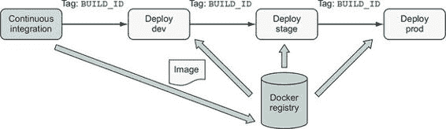
> 
> 这种方案易于实施，并支持使用线性发布模型且无分支的应用的持续交付。这种方案的主要缺点是人们必须处理精确的构建标识符，而不是能够使用`latest`或`dev`标记。因为一个镜像可能被标记多次，许多团队会应用和发布额外的标记，如`latest`，以提供一个方便的方式来消费最新的镜像。
> 
> 10.5.3\. 部署阶段的配置镜像
> 
> 一些组织将软件发布版本打包成每个部署阶段的独立工件。然后，这些包被部署到专门的内部环境进行集成测试，名称如`dev`和`stage`。一旦软件在内部环境中经过测试，生产包就会被部署到生产环境。我们可以为每个环境创建一个 Docker 镜像。每个镜像都会包含应用工件和环境特定配置。然而，这并不是一个好的做法，因为主要的部署工件被构建多次，通常在生产之前没有经过测试。
> 
> 支持部署到多个环境的一个更好的方法是创建两种类型的镜像：

+   一个通用的、与环境无关的应用镜像

+   一组环境特定配置镜像，每个镜像包含该环境的特定配置文件

> 图 10.6\. 每个环境的配置镜像
> 
> 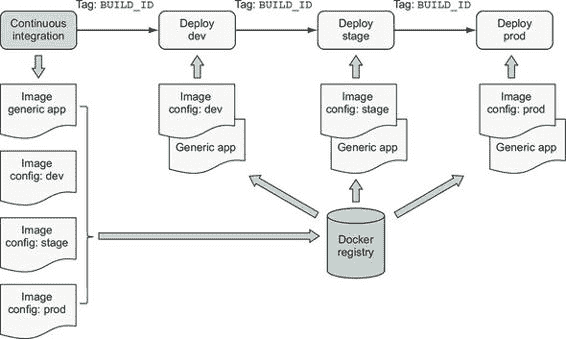
> 
> 通用应用和环境特定配置镜像应同时构建，并使用相同的`BUILD_ID`进行标记。部署过程通过使用如持续交付案例中所述的`BUILD_ID`来识别部署的软件和配置。在部署时，会创建两个容器。首先，从环境特定配置镜像创建一个配置容器。其次，从通用应用镜像创建应用容器，并将配置容器的文件系统作为卷挂载。
> 
> 从配置容器的文件系统中消费特定环境的文件是一种流行的应用程序编排模式，也是 12 因子应用程序原则的变体([`12factor.net/`](https://12factor.net/))。在第十二章([index_split_098.html#filepos1254019])中，你将看到 Docker 如何作为编排的第一级功能支持服务的特定环境配置，而不使用辅助图像。
> 
> 这种方法使软件作者和操作员能够在保持对原始来源的可追溯性的同时，支持特定环境的差异，并保持简单的部署工作流程。
> 
> 10.5.4\. 语义版本控制
> 
> 语义版本控制([`semver.org/`](https://semver.org/))是一种流行的以`主.次.修订`形式的版本号对工件进行版本控制的方法。语义版本控制规范定义了，随着软件的变化，作者应增加以下内容：

1.  制作不兼容 API 更改时的主版本

1.  在向后兼容的方式中添加功能时的次版本

1.  制作向后兼容的 bug 修复时的修订版本

> 语义版本控制帮助发布者和消费者管理对更新图像依赖项时获得的变化的期望。向大量消费者发布图像或必须长期维护多个发布流的人经常发现语义版本控制或类似方案很有吸引力。对于许多人依赖作为基础操作系统、语言运行时或数据库的图像，语义版本控制是一个不错的选择。
> 
> 图 10.7\. 使用语义版本控制标记和发布图像发布
> 
> 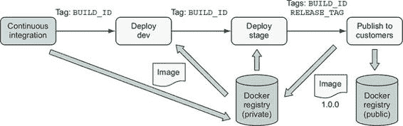
> 
> 假设你在`dev`和`stage`测试了你的镜像后，想要将示例应用的最新构建版本作为版本 1.0.0 发布给你的客户。你可以使用`BUILD_ID`来标识镜像，并用 1.0.0 进行标记：
> 
> > `make tag BUILD_ID=$BUILD_ID TAG=1.0.0`
> > 
> 将图像标记为版本 `1.0.0` 表示你已准备好在软件操作中维护向后兼容性。现在你已经标记了图像，你可以将其推送到注册表进行分发。你甚至可以选择将图像发布到多个注册表。使用多个注册表来保持内部使用图像的私密性，并将仅官方发布版发布到公共注册表以供客户消费。
> 
> 无论识别图像以推广的方案是什么，一旦做出推广图像的决定，推广管道应将语义标签（`latest`、`dev`、`7`）解析为唯一的标签或内容可寻址标识符，并部署该图像。这确保了如果在推广的标签被移动到另一个图像的同时，部署的将是人们决定推广的图像，而不是仅仅在部署时与标签关联的任何图像。
> 
> 摘要
> 
> 本章涵盖了在 Docker 镜像中构建和发布应用程序时使用的常见目标、模式和技巧。本章中描述的选项展示了在创建镜像交付流程时可选范围。有了这个基础，你应该能够导航、选择和定制适合将您自己的应用程序作为 Docker 镜像交付的选项。本章需要理解的关键点包括：

+   构建镜像的管道具有与其他软件和基础设施构建管道相同的结构和目标，以确保 Docker 镜像的质量。

+   存在用于检测错误、安全问题和其他镜像构建问题的工具，并且可以轻松地将其集成到镜像构建管道中。

+   通过使用如 make 之类的构建工具来规范镜像构建过程，并在本地开发和 CI/CD 流程中使用该过程。

+   存在几种组织 Docker 镜像定义的模式。这些模式在管理应用程序构建和部署关注点（如攻击面和镜像大小与复杂性）方面提供了权衡。

+   镜像的源和构建过程的信息应记录为镜像元数据，以支持部署镜像时的可追溯性、调试和编排活动。

+   Docker 镜像标签为通过使用从私有服务部署中的持续交付到通过语义版本发布长期版本到公共领域的各种风格，向消费者交付软件提供了一个基础。
